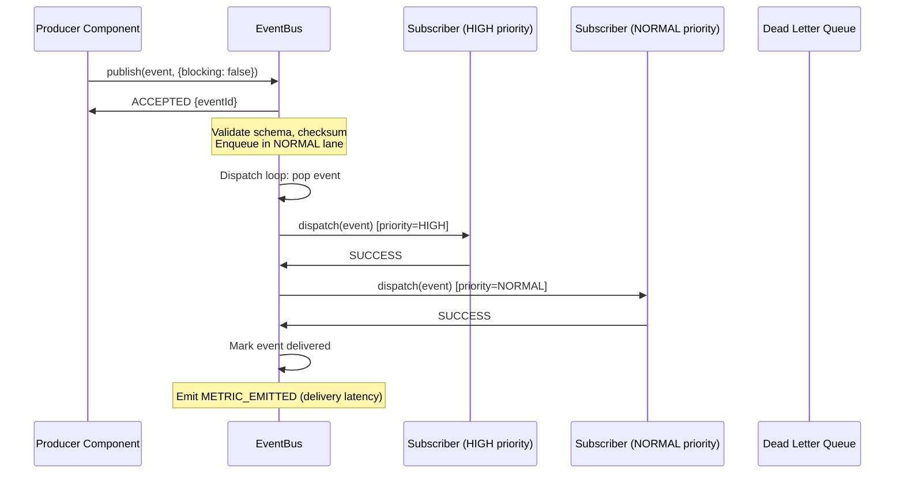
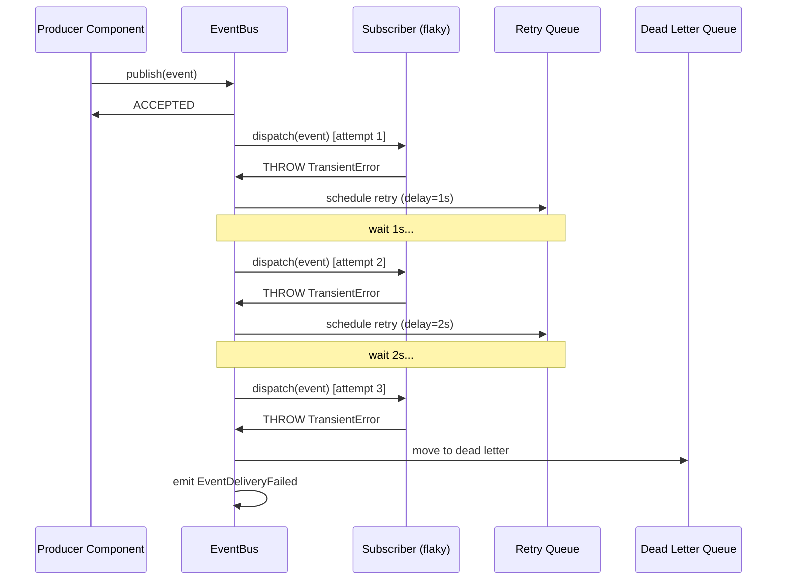
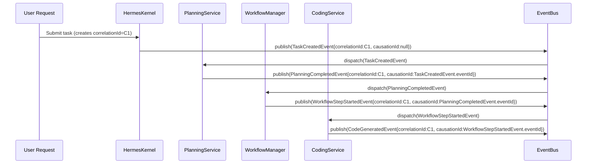

# AI-OS Architecture Specification v1.0
## Part 2: Event System Architecture

**Version:** 1.0.0  
**Status:** FROZEN — Authoritative Source of Truth  
**Date:** 2026-07-28  
**Authors:** Chief Software Architect, AI-OS  
**Classification:** Normative Engineering Specification  
**Review History:** v1.0.0 — Initial freeze (2026-07-28)

---

### 2.0 Document Control

| Field | Value |
|-------|-------|
| **Document ID** | AI-OS-ARCH-SPEC-v1.0-PART2 |
| **Classification** | Normative — Mandatory Conformance |
| **Change Control** | Part 2 is FROZEN. No modifications permitted without Architecture Review Board (ARB) approval. All future Parts (3–N) MUST conform to Part 2. Part 2 MUST NOT contradict Part 0 or Part 1. |
| **Distribution** | All AI-OS engineers, architects, reviewers, automated conformance tooling |
| **Related Documents** | PART0 (front matter, principles), PART1 (kernel architecture), PART3 (core managers), PART4 (service framework), PART5 (engineering services), ARCHITECTURAL_INVENTORY.md (evidence base), ARCHITECTURE_REVIEW_REPORT.md (gap analysis) |

**Conformance Requirement:** Every subsequent Part (3–N) of this specification MUST explicitly reference Part 2 sections for event terminology, interfaces, and conformance criteria. Any Part that contradicts Part 2 is non-conformant and MUST be revised.

---

### 2.1 Purpose

#### 2.1.1 Why the Event System Exists

The Event System is the **sole communication mechanism** of AI-OS. It exists because:

- **Decoupling Requirement:** The Hermes Kernel (4 Core Components), 9 Core Managers, 8 Engineering Services, 4 Capability Facade Services, and an unbounded number of Application Services must communicate without direct dependencies, shared mutable state, or synchronous coupling.
- **Observability Mandate:** Every state transition, decision, failure, and recovery action MUST be visible as a first-class data artifact with full correlation and causation traces (Part 0 Principle 12).
- **Deterministic Recovery:** Checkpointing, replay, and root cause analysis require an immutable, totally ordered event log (Part 0 Principle 6).
- **Extensibility:** Custom events, custom services, and custom capability backends MUST be able to integrate without modifying kernel code (Part 0 §0.5.2).
- **Governance:** Council consensus, AI Agency audits, and human governance gates require an auditable event stream (Part 0 Principle 3).

#### 2.1.2 Architectural Role

```
┌─────────────────────────────────────────────────────────────────┐
│                        AI-OS Platform                           │
│  ┌─────────────────────────────────────────────────────────┐   │
│  │                  Hermes Kernel                          │   │
│  │  ┌─────────────────────────────────────────────────┐    │   │
│  │  │              EventBus (Core Component C1)       │    │   │
│  │  │  ◄──────────────────────────────────────────►  │    │   │
│  │  │  Core Components (3)   Core Managers (9)        │    │   │
│  │  │  Services (N)         Extensions (N)            │    │   │
│  │  └─────────────────────────────────────────────────┘    │   │
│  └─────────────────────────────────────────────────────────┘   │
└─────────────────────────────────────────────────────────────────┘
```

The EventBus is **Core Component C1** (Part 1 §1.7.1), initializing in **Phase 0** — before any other Core Component, Core Manager, or Service. All other entities communicate **exclusively** through the EventBus after initialization completes (Part 1 §1.7.4, CC-IR-001).

#### 2.1.3 Design Goals

| Goal ID | Goal | Success Criterion |
|---------|------|-------------------|
| EVT-DG-001 | **Zero Direct Coupling** | No service-to-service, manager-to-manager, or service-to-manager direct method calls in RUNNING state |
| EVT-DG-002 | **Full Traceability** | Every event carries `correlation_id` and `causation_id`; 100% correlation coverage in integration tests |
| EVT-DG-003 | **Deterministic Ordering** | Global event order is reproducible given identical inputs; concurrent publication resolves deterministically |
| EVT-DG-004 | **Failure as Data** | No exceptions cross component boundaries; all failures emitted as events (Part 0 Principle 9) |
| EVT-DG-005 | **Schema Evolution Safety** | Event schemas versioned; backward/forward compatibility enforced; breaking changes require major version |
| EVT-DG-006 | **Bounded Resource Usage** | EventBus history, queue depths, and subscription counts have configurable hard limits |
| EVT-DG-007 | **Testability** | EventBus is fully mockable; event publishing/subscribing verifiable via contract tests |

#### 2.1.4 Non-Goals

| Non-Goal | Rationale |
|----------|-----------|
| **Distributed EventBus** | v1.0 is single-process, in-memory only (Part 0 §0.2.2); distributed is v2.0 scope |
| **Message Broker Features** | No persistence, clustering, or multi-tenancy; EventBus is a routing substrate, not a broker |
| **Event Sourcing as Primary Storage** | StateManager owns authoritative state; EventBus is communication, not storage |
| **Complex Event Processing (CEP)** | Pattern detection, windowing, aggregation are Service responsibilities, not EventBus |
| **Protocol Translation** | HTTP/gRPC/WebSocket bindings are adapter concerns, not EventBus core |

---

### 2.2 Event Model

#### 2.2.1 Event Base Contract

Every Event in AI-OS **MUST** conform to the following base contract. This contract is **immutable** — no field may be added, removed, or redefined without a major version bump and ARB approval.

```
// Event Base Contract (Architectural Notation)
Event {
  // Identity
  eventId: UUID                    // UUIDv7 (timestamp-ordered) — globally unique
  eventType: EventType            // Enum value from catalog (Part 2.3)
  eventVersion: SemanticVersion   // Schema version (MAJOR.MINOR.PATCH)

  // Temporal
  timestamp: ISO8601Instant        // UTC, nanosecond precision: YYYY-MM-DDTHH:mm:ss.sssssssssZ
  timestampMonotonic: MonotonicNs  // Process-local monotonic nanoseconds (for ordering)

  // Correlation & Causation (Part 0 §0.3.2)
  correlationId: UUID              // Tracks logical workflow from initiation to completion
  causationId: UUID | null         // Direct cause eventId; null for root events

  // Routing
  source: ComponentIdentity        // Originating component (kernel, manager, service, extension)
  target: ComponentIdentity | null // Intended recipient; null = broadcast

  // Priority & Category
  priority: EventPriority          // CRITICAL > HIGH > NORMAL > LOW > BACKGROUND
  category: EventCategory          // SYSTEM, CONTROL, DATA, AUDIT, DIAGNOSTIC

  // Payload
  payload: EventPayload            // Typed per eventType; immutable value object

  // Integrity
  checksum: SHA256Hex              // Payload integrity verification
}
```

**Invariant:** `INV-EVT-001` — All fields are **read-only** after construction. Events are immutable value objects; mutation is PROHIBITED.

**Invariant:** `INV-EVT-002` — `eventId` **MUST** be UUIDv7 (RFC 9562) to guarantee global uniqueness and rough temporal ordering.

**Invariant:** `INV-EVT-003` — `timestamp` **MUST** be UTC with nanosecond precision. `timestampMonotonic` **MUST** be sourced from a monotonic clock supplied by the implementation for precise ordering within the process.

**Invariant:** `INV-EVT-003a` — `eventId` values **SHALL NEVER** be reused. An `eventId` **SHALL** remain globally unique for the lifetime of the system. Replay operations **SHALL** generate new `eventId` values while preserving the original `correlationId` and `causationId` for trace continuity.

**Invariant:** `INV-EVT-004` — `correlationId` **MUST** be present on every event. Root events (user request, scheduled trigger, kernel startup) generate a new correlationId. All descendant events **MUST** propagate the same correlationId.

**Invariant:** `INV-EVT-005` — `causationId` **MUST** be the `eventId` of the event that directly caused this event. `null` **ONLY** for root events with no predecessor.

**Invariant:** `INV-EVT-006` — `source` **MUST** identify the emitting component via `ComponentIdentity` (Part 2.2.2). Anonymous events are PROHIBITED.

**Invariant:** `INV-EVT-007` — `checksum` **MUST** be SHA-256 of canonical JSON payload (sorted keys, no whitespace). Verified on receipt.

#### 2.2.2 ComponentIdentity

```
ComponentIdentity {
  componentType: 'kernel' | 'core_component' | 'core_manager' | 'engineering_service' | 'capability_facade' | 'application_service' | 'extension'
  componentName: string            // e.g., "EventBus", "PlanningService", "custom-skill-xyz"
  instanceId: UUID | null          // For multi-instance components; null for singletons
  version: SemanticVersion         // Component version
}
```

**Invariant:** `INV-EVT-008` — `componentName` **MUST** match the registered name in ServiceRegistry (for services) or kernel accessor name (for core components/managers).

#### 2.2.3 EventPriority

```
EventPriority {
  CRITICAL = 0    // Kernel lifecycle, fatal errors, security events — MUST be processed first
  HIGH = 1        // Workflow control, retry/exhaustion, RCA results — latency sensitive
  NORMAL = 2      // Standard SDLC events (task created, step completed, etc.) — default
  LOW = 3         // Telemetry, metrics, heartbeats — batched, deferrable
  BACKGROUND = 4  // Maintenance, consolidation, cleanup — best-effort
}
```

**Ordering Guarantee:** Events of higher priority (lower numeric value) **MUST** be dispatched before lower priority events within the same publication batch. Priority does **NOT** preempt in-flight handler execution.

#### 2.2.4 EventCategory

```
EventCategory {
  SYSTEM = 'system'         // Kernel, core component, core manager lifecycle
  CONTROL = 'control'       // Workflow orchestration, service coordination
  DATA = 'data'             // State changes, artifacts, checkpoints, memory
  AUDIT = 'audit'           // Governance, council decisions, AI Agency audits, security
  DIAGNOSTIC = 'diagnostic' // Metrics, traces, health checks, profiling
}
```

**Routing Rule:** Subscribers **MAY** filter by category. EventBus **MUST** support category-based subscription.

#### 2.2.5 SemanticVersion

```
SemanticVersion {
  major: number    // Breaking changes — incompatible schema
  minor: number    // Backward-compatible additions
  patch: number    // Backward-compatible fixes
}
```

**Versioning Policy:** 
- **MAJOR** increment: Field removal, type change, semantic meaning change → breaking
- **MINOR** increment: New optional fields, new enum values (append-only) → backward compatible
- **PATCH** increment: Documentation, serialization format fix (no schema change) → backward compatible

#### 2.2.6 EventPayload

Each `EventType` defines a **fixed, versioned payload schema**. The payload **MUST** be an immutable value object with keyword-only construction (or language equivalent).

```
TaskCreatedPayload {
  taskId: UUID
  workflowId: UUID
  taskType: TaskType
  input: TaskInput          // Arbitrary JSON-serializable
  priority: TaskPriority
  dependencies: UUID[]      // Task IDs this depends on
  metadata: TaskMetadata
}
```

**Invariant:** `INV-EVT-009` — Payload schemas **MUST NOT** contain optional fields without explicit defaults. All fields are required or have documented defaults.

**Invariant:** `INV-EVT-010` — Payload **MUST** be JSON-serializable. Binary blobs, functions, and circular references are PROHIBITED.

**Invariant:** `INV-EVT-011` — Payload **MUST NOT** contain `correlationId`, `causationId`, `eventId`, `timestamp`, or any base contract fields. Those are(Event-level).

#### 2.2.7 Immutability Requirements

| Requirement | Enforcement |
|-------------|-------------|
| **Construction-time only** | All fields set during construction; no setters or mutators |
| **Immutable structure** | Immutable value object semantics enforced by the implementation |
| **Deep immutability** | Nested objects in payload MUST also be immutable |
| **No post-construction modification** | Any transformation creates a NEW event with new `eventId` |

**Invariant:** `INV-EVT-012` — EventBus **MUST** verify immutability on publish (defensive copy or schema validation). Mutable events are rejected.

#### 2.2.8 Serialization Requirements

| Requirement | Specification |
|-------------|---------------|
| **Canonical JSON** | RFC 8785 (JSON Canonicalization Scheme) for checksum and wire format |
| **Field Ordering** | Deterministic: base fields first (alphabetical), then payload fields (alphabetical) |
| **UUID Format** | Lowercase hex with hyphens: `xxxxxxxx-xxxx-xxxx-xxxx-xxxxxxxxxxxx` |
| **Timestamp Format** | ISO 8601 with `Z` suffix, nanoseconds: `2026-07-28T14:30:00.123456789Z` |
| **Enum Serialization** | SCREAMING_SNAKE_CASE string (e.g., `"TASK_CREATED"`) |
| **Null Handling** | `null` for absent optional fields; omitted fields are PROHIBITED |
| **Binary Data** | Base64URL encoded with `b64:` prefix if absolutely required (discouraged) |

**Invariant:** `INV-EVT-013` — Two semantically equivalent events **MUST** produce identical canonical JSON.

---

#### 2.2.9 Event Inheritance

The Event type system defines the following inheritance contracts:

| Rule | Specification |
|------|---------------|
| **Base Contract Inheritance** | Every event **SHALL** inherit from the canonical Event base contract defined in §2.2.1. |
| **Base Contract Immutability** | The base contract **SHALL** remain immutable. No base field may be added, removed, or redefined without a major version bump and ARB approval. |
| **Payload Extension** | Derived event types **MAY** extend payload definitions through additional fields. |
| **Base Field Protection** | Base fields (`eventId`, `eventType`, `eventVersion`, `timestamp`, `timestampMonotonic`, `correlationId`, `causationId`, `source`, `target`, `priority`, `category`, `checksum`) **SHALL NOT** be overridden, shadowed, or redefined in derived types. |
| **Backward Compatibility** | Payload extension **SHALL** preserve backward compatibility. New payload fields **MUST** be optional with documented defaults or follow the schema evolution rules in §2.10. |
| **Exclusive Extension Mechanism** | Event inheritance **SHALL** be the only supported mechanism for extending event definitions. Composition, aggregation, or wrapper patterns are not permitted for event type extension. |

**Invariant:** `INV-EVT-014` — All events conform to the base contract. No event may omit, override, or shadow base contract fields.

**Invariant:** `INV-EVT-015` — Payload extensions follow schema evolution rules (§2.10). Adding required fields without defaults constitutes a MAJOR version change.

---

### 2.3 Event Type System

#### 2.3.1 EventType Architecture

The `EventType` is a **closed enum** (extensible only via governed extension point, Part 0 §0.5.2). Each value maps 1:1 to a payload schema and semantic contract.

```
EventType {
  // === SYSTEM (Kernel, Core Components, Core Managers) ===
  KERNEL_INITIALIZATION_STARTED
  KERNEL_READY
  KERNEL_SHUTDOWN_STARTED
  KERNEL_TERMINATED
  KERNEL_INITIALIZATION_FAILED
  KERNEL_FATAL_ERROR
  CORE_COMPONENT_INITIALIZED
  CORE_COMPONENT_SHUTDOWN
  CORE_COMPONENT_DEGRADED
  CORE_COMPONENT_FAILED
  CORE_MANAGER_INITIALIZED
  CORE_MANAGER_SHUTDOWN
  CORE_MANAGER_DEGRADED
  CORE_MANAGER_FAILED
  HEARTBEAT
  CONFIGURATION_FROZEN
  CONFIGURATION_CHANGED          // Dev/hot-reload only

  // === CONTROL (Workflow Orchestration, Service Coordination) ===
  WORKFLOW_STARTED
  WORKFLOW_COMPLETED
  WORKFLOW_FAILED
  WORKFLOW_PAUSED
  WORKFLOW_RESUMED
  WORKFLOW_CANCELLED
  WORKFLOW_STEP_STARTED
  WORKFLOW_STEP_COMPLETED
  WORKFLOW_STEP_FAILED
  WORKFLOW_STEP_RETRIED
  WORKFLOW_STEP_SKIPPED
  WORKFLOW_CHECKPOINT_CREATED
  WORKFLOW_CHECKPOINT_RESTORED
  TASK_CREATED
  TASK_ASSIGNED
  TASK_STARTED
  TASK_COMPLETED
  TASK_FAILED
  TASK_RETRIED
  TASK_CANCELLED
  TASK_DEPENDENCY_RESOLVED
  RETRY_BUDGET_EXHAUSTED
  ROOT_CAUSE_ANALYZED
  RECOVERY_ACTION_DISPATCHED
  RECOVERY_ACTION_COMPLETED
  RECOVERY_ACTION_FAILED

  // === DATA (State, Artifacts, Memory, Checkpoints) ===
  STATE_CHANGED
  STATE_SNAPSHOT_CREATED
  STATE_RESTORED
  ARTIFACT_CREATED
  ARTIFACT_UPDATED
  ARTIFACT_DELETED
  CHECKPOINT_CREATED
  CHECKPOINT_RESTORED
  CHECKPOINT_PRUNED
  MEMORY_STORED
  MEMORY_RETRIEVED
  MEMORY_UPDATED
  MEMORY_CONSOLIDATED
  MEMORY_PRUNED
  CONTEXT_ASSEMBLED
  CONTEXT_COMPRESSED

  // === AUDIT (Governance, Security, AI Agency) ===
  PLANNING_REQUESTED
  PLANNING_COMPLETED
  PLANNING_FAILED
  PLAN_REJECTED
  CODE_GENERATED
  CODING_COMPLETED
  CODING_FAILED
  CODE_REVIEW_REQUESTED
  REVIEW_STARTED
  REVIEW_APPROVED
  REVIEW_REJECTED
  REVIEW_FAILED
  SECURITY_ISSUE_FOUND
  PERFORMANCE_ISSUE_FOUND
  TESTS_GENERATED
  TESTS_PASSED
  TESTS_FAILED
  TESTING_COMPLETED
  TESTING_FAILED
  DEPLOYMENT_REQUESTED
  DEPLOYMENT_STARTED
  DEPLOYMENT_COMPLETED
  DEPLOYMENT_FAILED
  DEPLOYMENT_ROLLED_BACK
  COUNCIL_CONVENED
  COUNCIL_PROPOSAL_SUBMITTED
  COUNCIL_VOTE_CAST
  COUNCIL_CONSENSUS_REACHED
  COUNCIL_DISSENT_REGISTERED
  COUNCIL_DECISION_FINALIZED
  AI_AGENT_TASK_REQUESTED
  AI_AGENT_TASK_COMPLETED
  AI_AGENT_TASK_FAILED
  AI_AGENT_AUDIT_EMITTED
  FINAL_JUDGE_DECISION
  HUMAN_ESCALATION_REQUIRED

  // === DIAGNOSTIC (Metrics, Tracing, Health) ===
  METRIC_EMITTED
  TRACE_SPAN_STARTED
  TRACE_SPAN_ENDED
  HEALTH_CHECK_PASSED
  HEALTH_CHECK_FAILED
  SERVICE_STARTED
  SERVICE_STOPPED
  SERVICE_DEGRADED
  SERVICE_FAILED
  RESOURCE_ALLOCATED
  RESOURCE_RELEASED
  RESOURCE_EXHAUSTED
  QUOTA_EXCEEDED
  SKILL_EXECUTED
  SKILL_FAILED
  MCP_TOOL_CALLED
  MCP_TOOL_SUCCEEDED
  MCP_TOOL_FAILED
  MODEL_ROUTED
  MODEL_FALLBACK
  PROMPT_TEMPLATE_RENDERED
  TOKEN_BUDGET_EXCEEDED
  PERSONA_OVERRIDE_APPLIED
}
```

**Count:** The above defines **97** canonical event types. Extensions may add types via governed process (Part 0 §0.5.2).

**Architectural Justification for Canonical AUDIT Events:** The AUDIT-category events (`PLANNING_*`, `CODING_*`, `REVIEW_*`, `TESTING_*`, `DEPLOYMENT_*`, `COUNCIL_*`, `AI_AGENT_*`, `FINAL_JUDGE_*`, `HUMAN_ESCALATION_*`) represent **kernel-governed engineering workflow phases** and **governance gates** that are architecturally mandated by AI-OS Part 0 Principles (Principles 3, 6, 7). These events are not arbitrary service domain events; they constitute the **required observable contract** for:

1. **Council Governance** (Principle 3) — `COUNCIL_*`, `FINAL_JUDGE_DECISION`, `HUMAN_ESCALATION_REQUIRED` enable mandatory human-governed AI agency
2. **SDLC Phase Boundaries** (Principle 6) — `PLANNING_*` through `DEPLOYMENT_*` define the strict linear pipeline with checkpointing and RCA at each boundary
3. **Capability Facade Bridging** (Principle 7) — `AI_AGENT_*`, `SKILL_*`, `MCP_*`, `MODEL_*` are emitted by Capability Facade Services wrapping Core Managers
4. **Audit Completeness** (Principle 12) — All governance decisions, AI agent actions, and council outcomes must be traceable via the EventBus

These events are **kernel-level** because their emission, subscription, and correlation are required for the Hermes Kernel's orchestration guarantees (Part 1). Moving them to service-defined extensions would violate Part 0 Principle 1 (Event-First Communication) by making governance visibility dependent on service implementation details.

#### 2.3.2 Categories Mapping

| EventType Prefix | Category | Description |
|------------------|----------|-------------|
| `KERNEL_*`, `CORE_COMPONENT_*`, `CORE_MANAGER_*`, `HEARTBEAT`, `CONFIGURATION_*` | SYSTEM | Kernel and infrastructure lifecycle |
| `WORKFLOW_*`, `TASK_*`, `RETRY_*`, `ROOT_CAUSE_*`, `RECOVERY_*` | CONTROL | Orchestration and failure handling |
| `STATE_*`, `ARTIFACT_*`, `CHECKPOINT_*`, `MEMORY_*`, `CONTEXT_*` | DATA | Persistent and ephemeral state changes |
| `PLANNING_*`, `CODING_*`, `REVIEW_*`, `TESTING_*`, `DEPLOYMENT_*`, `COUNCIL_*`, `AI_AGENT_*`, `FINAL_JUDGE_*`, `HUMAN_ESCALATION_*` | AUDIT | SDLC phases and governance |
| `METRIC_*`, `TRACE_*`, `HEALTH_CHECK_*`, `SERVICE_*`, `RESOURCE_*`, `QUOTA_*`, `SKILL_*`, `MCP_*`, `MODEL_*`, `PROMPT_*`, `TOKEN_*`, `PERSONA_*` | DIAGNOSTIC | Observability and operational telemetry |

**Invariant:** `INV-ET-001` — Every EventType **MUST** have a defined category. Uncategorized types are PROHIBITED.

#### 2.3.3 Naming Rules

| Rule | Specification |
|------|---------------|
| **Format** | `SCREAMING_SNAKE_CASE` |
| **Prefix** | Domain prefix mandatory (KERNEL, WORKFLOW, TASK, STATE, PLANNING, CODING, REVIEW, TESTING, DEPLOYMENT, COUNCIL, AI_AGENT, etc.) |
| **Suffix** | Past tense for completions (`_COMPLETED`, `_FAILED`), present participle for in-progress (`_STARTED`, `_REQUESTED`), noun for constants (`_CREATED`, `_EXHAUSTED`) |
| **Uniqueness** | Globally unique across all extensions; prefix registry managed by ARB |
| **Length** | Maximum 64 characters |

**Invariant:** `INV-ET-002` — EventType names **MUST** be parseable as: `{DOMAIN}_{ACTION}_{OUTCOME?}`. Violations flagged at registration.

**Invariant:** `INV-ET-003` — EventType semantic meaning is immutable. An EventType **SHALL NOT** change its semantic definition across versions. For example, `TASK_COMPLETED` **SHALL** always represent successful task completion. Future versions **MAY** extend payloads. Future versions **SHALL NOT** redefine the meaning of an existing EventType. Changing semantics requires a new EventType with a new name.

#### 2.3.4 Versioning

Each EventType carries an implicit schema version via `eventVersion` in the base contract (Part 2.2.1).

| Version Change | Trigger | Compatibility |
|----------------|---------|---------------|
| **MAJOR** | Field removed, type changed, semantic change, enum value removed | Breaking — consumers MUST migrate |
| **MINOR** | New optional field added, new enum value appended, field deprecated (marked) | Backward compatible — old consumers work |
| **PATCH** | Documentation fix, serialization bug fix, default value correction | Fully compatible |

**Registration Rule:** EventType registration **MUST** include the initial schema version (typically `1.0.0`). Schema registry stores all versions for replay compatibility.

#### 2.3.5 Registration

```
// EventTypeRegistration (Architectural Notation)
EventTypeRegistration {
  eventType: EventType;
  schemaVersion: SemanticVersion;
  schemaHash: SchemaHash;             // Deterministic hash of canonical schema
  payloadSchema: CanonicalSchema;     // Canonical schema representation (e.g., JSON Schema Draft 2020-12)
  description: string;                // Human-readable semantic description
  producer: ComponentIdentity;        // Canonical producer (for documentation)
  consumers: ComponentIdentity[];     // Known consumers (for dependency analysis)
  category: EventCategory;
  priority: EventPriority;            // Default priority
  deprecated: boolean;                // If true, includes deprecation info
  deprecationInfo?: {
    sinceVersion: SemanticVersion;
    replacementEventType?: EventType;
    removalTargetVersion: SemanticVersion;
  };
}
```

**Schema Hash (`schemaHash`):** A deterministic hash generated from the canonical schema representation. Used for:
- Replay validation (detect schema drift between record and replay)
- Compatibility verification (fast path for schema equivalence checks)
- Corruption detection (validate stored events against registered schema)

The hashing algorithm is implementation-defined but **MUST** be deterministic and collision-resistant for the schema domain.

**Invariant:** `INV-ET-003` — All EventTypes **MUST** be registered in the global EventTypeRegistry before EventBus initialization completes (Phase 0). Late registration is PROHIBITED in v1.0.

**Invariant:** `INV-ET-004` — Duplicate EventType registration (same enum value) **MUST** throw. Schema version conflict for same EventType **MUST** throw.

#### 2.3.6 Compatibility

| Compatibility Type | Definition | Enforcement |
|--------------------|------------|-------------|
| **Backward Compatible** | New schema can read old events | Schema registry validates: new schema accepts all prior versions |
| **Forward Compatible** | Old schema can read new events (ignoring unknown fields) | Optional fields only; no required field additions in MINOR |
| **Breaking** | Old schema cannot read new events | MAJOR version bump required; migration path documented |

**Invariant:** `INV-ET-005` — EventBus **MUST** validate payload against registered schema on publish (configurable: strict/lenient). Strict mode is MANDATORY in production.

---

### 2.4 EventBus Architecture

#### 2.4.1 Responsibilities

The EventBus is the **sole communication substrate** of AI-OS. Its responsibilities are:

| Responsibility | Description |
|----------------|-------------|
| **Publication** | Accept events from any component; validate; enqueue; return acknowledgment |
| **Subscription Management** | Register, deregister, and manage subscriber lifecycles |
| **Dispatch** | Route events to matching subscribers per subscription filters |
| **Ordering** | Enforce global, correlation, and priority ordering guarantees |
| **Delivery Guarantees** | Implement at-least-once (default) and at-most-once (configured) semantics |
| **Failure Handling** | Dead letter queue, retry, timeout, and recursive event detection |
| **Observability** | Emit diagnostic events; expose metrics; support tracing |
| **Resource Bounding** | Enforce queue limits, history limits, subscription limits |
| **Lifecycle** | Initialize in Phase 0; drain on shutdown (Phase S0) |

#### 2.4.2 Ownership

- **Owner:** HermesKernel (exclusive, Part 1 §1.6.1)
- **Accessor:** `kernel.eventBus` (Part 1 §1.13.1)
- **Initialization:** Phase 0 (first, Part 1 §1.7.1)
- **Shutdown:** Phase S0 (last, Part 1 §1.11.2)

**Invariant:** `INV-EB-001` — Exactly one EventBus instance exists per process. Second instantiation throws.

**Invariant:** `INV-EB-002` — EventBus **MUST NOT** depend on any other Core Component, Core Manager, or Service. It is the foundation.

#### 2.4.3 Lifecycle

```
// EventBusState (Architectural Notation)
EventBusState {
  UNINITIALIZED    // Before EventBus.initialize()
  INITIALIZING     // During initialization (subscribers from core components registering)
  RUNNING          // Normal operation
  DRAINING         // Shutdown initiated; no new publishes accepted; processing in-flight
  SHUTDOWN         // All queues empty; all subscribers deregistered
}
```

**State Transitions:**
```
UNINITIALIZED → INITIALIZING → RUNNING → DRAINING → SHUTDOWN
```

**Invariant:** `INV-EB-003` — EventBus **MUST** publish `CoreComponentInitialized{name:"EventBus"}` on transition to RUNNING.

**Invariant:** `INV-EB-004` — During DRAINING, `publish()` **MUST** return `REJECTED_SHUTDOWN` for new events. In-flight events complete.

#### 2.4.4 Internal Queues

| Queue | Purpose | Ordering | Capacity | Overflow Policy |
|-------|---------|----------|----------|-----------------|
| **Publish Queue** | Incoming events before dispatch | FIFO per priority lane | Configurable (default: 10,000) | REJECT_NEW (backpressure to publisher) |
| **Dispatch Queue** | Events ready for subscriber invocation | Priority-sorted, then timestampMonotonic | Unbounded (bounded by publish queue) | N/A |
| **Retry Queue** | Failed deliveries awaiting retry | Priority-sorted, then nextRetryTime | Configurable (default: 1,000) | DEAD_LETTER |
| **Dead Letter Queue** | Permanently failed events | FIFO | Configurable (default: 10,000) | DROP_OLDEST (circular) |

**Priority Lanes:** The publish queue maintains **5 separate FIFO lanes** (one per EventPriority). Dispatch pulls from CRITICAL lane first, then HIGH, etc. This ensures priority precedence without starvation (configurable max events per lane per dispatch cycle).

**Invariant:** `INV-EB-005` — Publish queue capacity **MUST** be enforced. `publish()` **MUST** return `REJECTED_CAPACITY` when full (non-blocking) or block with timeout (blocking mode).

**Invariant:** `INV-EB-006` — Event ordering within a priority lane is FIFO by `timestampMonotonic`.

#### 2.4.5 Subscriber Registry

The registry maintains the mapping: `EventType → Set<Subscription>`.

```
// Subscription (Architectural Notation)
Subscription {
  subscriptionId: UUID;
  subscriber: ComponentIdentity;
  eventTypes: EventType[] | '*';      // Specific types or wildcard
  filter: EventFilter | null;         // Optional predicate (Part 2.5.3)
  handler: EventHandler;              // Sync or async function
  handlerType: 'sync' | 'async';
  priority: HandlerPriority;          // Execution order among subscribers
  maxConcurrency: number;             // Max parallel invocations (1 = sequential)
  timeoutMs: number;                  // Handler timeout (default: 30,000)
  retryPolicy: RetryPolicy | null;    // Per-subscription retry (default: bus default)
  createdAt: ISO8601Instant;
  metadata: Record<string, unknown>;  // Extensible
}
```

**HandlerPriority:**
```
HandlerPriority {
  FIRST = 0       // System-critical (kernel, security)
  HIGH = 100      // Workflow control
  NORMAL = 500    // Standard services (default)
  LOW = 1000      // Telemetry, audit
  LAST = 10000    // Cleanup, consolidation
}
```

**Invariant:** `INV-EB-007` — Subscriber registry **MUST** be thread-safe (concurrent register/deregister/publish).

**Invariant:** `INV-EB-008` — Wildcard subscriptions (`*`) **MUST** match all EventTypes including future registrations.

#### 2.4.6 Dispatch Model

```
┌─────────────┐     ┌──────────────┐     ┌─────────────────┐     ┌──────────────────┐
│  publish()  │────▶│ Validate &   │────▶│ Enqueue in      │────▶│ Dispatch Loop    │
│  (sync/async)│    │ Checksum     │    │ Priority Lane   │    │ (per priority)   │
└─────────────┘     └──────────────┘     └─────────────────┘     └────────┬─────────┘
                                                                           │
                                                                           ▼
                                                ┌─────────────────────────────────────┐
                                                │ For each matching subscription:     │
                                                │   - Check filter                    │
                                                │   - Check concurrency limit         │
                                                │   - Invoke handler (sync/await)     │
                                                │   - On success: mark delivered      │
                                                │   - On failure: retry or dead-letter│
                                                └─────────────────────────────────────┘
```

**Dispatch Algorithm:**
1. Pop event from highest non-empty priority lane
2. Find all subscriptions matching `eventType` (exact or wildcard)
3. Sort subscriptions by `HandlerPriority` (ascending), then `subscriptionId` (for determinism)
4. For each subscription:
   - Evaluate `filter(event)` → skip if false
   - Acquire concurrency semaphore (maxConcurrency)
   - If `handlerType == 'sync'`: call handler; if `async`: schedule and await
   - Apply `timeoutMs` — on timeout, treat as failure
   - On success: release semaphore; continue
   - On failure: apply `retryPolicy` or move to dead letter
5. Repeat until publish queue empty or DRAINING state

**Invariant:** `INV-EB-009` — Dispatch **MUST** process events in strict priority order. A HIGH event enqueued after a NORMAL event **MUST** be dispatched first.

**Invariant:** `INV-EB-010` — Handler execution for a single event **MUST** be sequential by HandlerPriority. Parallel execution across different events is permitted.

#### 2.4.7 Publish Model

```
// PublishResult (Architectural Notation)
PublishResult =
  | { status: 'ACCEPTED'; eventId: UUID; enqueuedAt: ISO8601Instant }
  | { status: 'REJECTED_VALIDATION'; errors: ValidationError[] }
  | { status: 'REJECTED_CAPACITY'; retryAfterMs?: number }
  | { status: 'REJECTED_SHUTDOWN'; reason: string }
  | { status: 'REJECTED_DUPLICATE'; existingEventId: UUID };  // Idempotency key match

// PublishOptions (Architectural Notation)
PublishOptions {
  blocking: boolean;           // Default: false (async)
  timeoutMs?: number;          // For blocking mode
  idempotencyKey?: string;     // Optional deduplication key
  waitForAck?: boolean;        // Wait for at least one subscriber ack (at-least-once)
}
```

**Synchronous Publish (`blocking: true`):** Caller blocks until event is enqueued (or rejected). Does **NOT** wait for subscriber completion.

**Asynchronous Publish (`blocking: false`):** Returns immediately with `ACCEPTED` or rejection. Subscriber execution is fire-and-forget from publisher perspective.

**Invariant:** `INV-EB-011` — `publish()` **MUST** validate event structure, checksum, and schema before enqueueing. Invalid events are rejected synchronously.

**Invariant:** `INV-EB-012` — `publish()` **MUST NOT** execute subscriber handlers. Handlers run on dispatch loop (separate context).

#### 2.4.8 Thread Safety Requirements

| Requirement | Specification |
|-------------|---------------|
| **Concurrent Publish** | Multiple callers may `publish()` simultaneously; all enqueued in order of arrival per priority lane |
| **Concurrent Subscribe/Deregister** | May occur during RUNNING state; dispatch loop sees consistent snapshot |
| **Handler Isolation** | Handler exceptions **MUST NOT** crash dispatch loop or affect other handlers |
| **Memory Visibility** | All queue operations use atomic/lock-free primitives or proper mutexes |
| **No Global Lock Contention** | Priority lanes minimize lock contention; dispatch loop holds no locks during handler invocation |

**Invariant:** `INV-EB-013` — EventBus **MUST** be safe for concurrent access from any thread/task without external synchronization.

#### 2.4.9 Ordering Guarantees

| Guarantee | Scope | Mechanism |
|-----------|-------|-----------|
| **Global Total Order** | All events | `timestampMonotonic` + priority lanes; deterministic tie-break by `eventId` |
| **Priority Order** | Within dispatch cycle | CRITICAL → HIGH → NORMAL → LOW → BACKGROUND |
| **Correlation Order** | Events sharing `correlationId` | FIFO by `timestampMonotonic` within priority; dispatched in correlation group batches |
| **Causation Order** | Event and its direct effects | `causationId` ensures cause dispatched before effect (enforced by publisher) |
| **Per-Subscriber Order** | Events to same subscriber | Sequential by HandlerPriority; no reordering |

**Invariant:** `INV-EB-014` — Given identical input event sequence and timing, the global dispatch order **MUST** be bit-for-bit reproducible.

---

### 2.5 Subscription Model

#### 2.5.1 Registration

```
// SubscribeOptions (Architectural Notation)
SubscribeOptions {
  eventTypes: EventType | EventType[] | '*';  // Single, array, or wildcard
  filter?: EventFilter;                        // Optional predicate
  handler: EventHandler;
  handlerType: 'sync' | 'async';
  priority?: HandlerPriority;                  // Default: NORMAL
  maxConcurrency?: number;                     // Default: 1 (sequential)
  timeoutMs?: number;                          // Default: 30,000
  retryPolicy?: RetryPolicy;                   // Default: bus default
  metadata?: Record<string, unknown>;
}
```

**Registration Process:**
1. Validate `eventTypes` exist in EventTypeRegistry (or wildcard)
2. Validate `handler` signature matches `(event: Event) => void | Promise<void>`
3. Generate `subscriptionId` (UUIDv7)
4. Create `Subscription` record
5. Insert into registry (atomic, thread-safe)
6. Return `subscriptionId` to caller

**Invariant:** `INV-SUB-001` — `subscribe()` **MUST** be idempotent for identical `(subscriber, eventTypes, handler)` tuples — returns existing `subscriptionId`.

**Invariant:** `INV-SUB-002` — Registration **MUST** succeed in < 1ms (non-blocking, lock-free path).

#### 2.5.2 Deregistration

```
// UnsubscribeOptions (Architectural Notation)
UnsubscribeOptions {
  subscriptionId?: UUID;       // Explicit ID (preferred)
  eventTypes?: EventType[];    // All subscriptions for these types by this subscriber
  all?: boolean;               // All subscriptions by this subscriber
}
```

**Deregistration Process:**
1. Locate subscription(s) by criteria
2. Mark as `DEREGISTERING` (prevents new dispatches)
3. Wait for in-flight handler invocations to complete (max `timeoutMs`)
4. Remove from registry
5. Return count of removed subscriptions

**Invariant:** `INV-SUB-003` — `unsubscribe()` **MUST** wait for in-flight handlers (graceful drain). Forced removal after timeout is permitted with warning event.

**Invariant:** `INV-SUB-004` — Deregistration during DRAINING state is immediate (no wait).

#### 2.5.3 Filtering

```
// EventFilter (Architectural Notation)
EventFilter = (event: Event) => boolean;

// Predefined filter combinators (for declarative use)
FilterDSL {
  equals(field: string, value: unknown): EventFilter;
  notEquals(field: string, value: unknown): EventFilter;
  in(field: string, values: unknown[]): EventFilter;
  contains(field: string, substring: string): EventFilter;
  matches(field: string, regex: Pattern): EventFilter;
  and(...filters: EventFilter[]): EventFilter;
  or(...filters: EventFilter[]): EventFilter;
  not(filter: EventFilter): EventFilter;
}
```

**Filter Scope:** Filters operate on **base contract fields + payload fields**. Nested payload access via dot notation (e.g., `payload.taskId`).

**Invariant:** `INV-SUB-005` — Filters **MUST** be pure functions (no side effects, no async). Impure filters are rejected at registration.

**Invariant:** `INV-SUB-006` — Filter evaluation **MUST** complete in < 100µs. Slow filters are moved to handler with warning.

#### 2.5.4 Priorities

HandlerPriority (Part 2.4.5) determines **execution order** among subscribers for the same event.

| Priority Value | Typical Use |
|----------------|-------------|
| FIRST (0) | Kernel security, invariant enforcement |
| HIGH (100) | WorkflowManager, RetryManager, RootCauseAnalyzer |
| NORMAL (500) | Engineering Services, Capability Facades |
| LOW (1000) | Observability, Metrics, Audit logging |
| LAST (10000) | Cleanup, consolidation, garbage collection |

**Invariant:** `INV-SUB-007` — Subscriptions with identical priority are ordered by `subscriptionId` (UUIDv7 = creation time) for determinism.

**Invariant:** `INV-SUB-008` — Priority does **NOT** affect delivery guarantee or retry behavior.

#### 2.5.5 Wildcards

```
// Wildcard subscription matches ALL event types
subscribe({ eventTypes: '*', handler, ... });

// Prefix wildcard (future extension, not v1.0)
// subscribe({ eventTypes: 'TASK_*', handler, ... });
```

**Wildcard Semantics:**
- Matches all currently registered EventTypes
- **Automatically matches** EventTypes registered after subscription creation
- Wildcard subscriptions have **implicit lowest priority** (LAST + 1) unless explicit priority provided
- Wildcard handlers receive **every event** — filter early to avoid overhead

**Invariant:** `INV-SUB-009` — Wildcard subscriptions **MUST** be explicitly opted into (not default). Opt-in via `eventTypes: '*'`.

#### 2.5.6 Lifecycle

```
CREATED → REGISTERED → ACTIVE → DEREGISTERING → DEREGISTERED
                │           │
                │           └── (on error: SUSPENDED → ACTIVE on recovery)
                │
                └── (on shutdown: DEREGISTERING → DEREGISTERED)
```

**Invariant:** `INV-SUB-010` — Subscriptions **MUST** be registered after subscriber component initialization completes. Early registration (during component initialize) is permitted but handlers **MUST NOT** execute until kernel reaches RUNNING.

#### 2.5.7 Duplicate Subscriptions

| Scenario | Behavior |
|----------|----------|
| Same subscriber, same eventTypes, same handler | Idempotent — returns existing `subscriptionId` |
| Same subscriber, same eventTypes, different handler | **Allowed** — separate subscription |
| Same subscriber, overlapping eventTypes (e.g., `TASK_*` and `*`) | **Allowed** — both receive events; deduplication via `subscriptionId` |
| Different subscribers, same handler function | **Allowed** — separate subscriptions, separate identities |

**Invariant:** `INV-SUB-011` — Duplicate detection uses `(subscriber, eventTypes, handler identity)`. Function identity is by reference.

#### 2.5.8 Error Handling

| Error Type | Handling |
|------------|----------|
| **Handler throws (sync)** | Catch → log → apply retry policy → dead letter on exhaustion |
| **Handler rejects (async)** | Catch → log → apply retry policy → dead letter on exhaustion |
| **Handler timeout** | Cancel (if possible) → treat as failure → apply retry policy |
| **Filter throws** | Catch → log → skip subscription for this event → continue |
| **Subscription deregistered during handler** | Handler continues to completion; no new dispatches |

**Retry Policy (default):**

```
// RetryPolicy (Architectural Notation)
RetryPolicy {
  maxAttempts: number;           // Default: 3 (1 initial + 2 retries)
  baseDelayMs: number;           // Default: 1000
  maxDelayMs: number;            // Default: 30000
  backoffMultiplier: number;     // Default: 2.0 (exponential)
  jitter: boolean;               // Default: true (±10%)
  retryableErrors: ErrorType[];  // Default: [TRANSIENT, TIMEOUT, UNAVAILABLE]
}
```

**Invariant:** `INV-SUB-012` — Retry attempts **MUST** preserve `correlationId` and `causationId`. Each retry is a new dispatch of the same event.

**Invariant:** `INV-SUB-013` — Dead-letter events **MUST** be emitted as `EventDeliveryFailed` (DIAGNOSTIC category) with full context.

---

### 2.6 Event Flow

#### 2.6.1 Complete Lifecycle

```
┌─────────────────────────────────────────────────────────────────────────────┐
│                           EVENT LIFECYCLE                                   │
└─────────────────────────────────────────────────────────────────────────────┘

  CREATION                          VALIDATION
  ┌─────────────┐                   ┌─────────────┐
  │ Component   │                   │ EventBus    │
  │ constructs  │                   │ validates:  │
  │ Event with  │────publish()────▶│  - Schema   │
  │ all fields  │                   │  - Checksum │
  │ (immutable) │                   │  - Fields   │
  └─────────────┘                   └──────┬──────┘
                                            │
                                            ▼
PUBLICATION                      QUEUEING
  ┌─────────────┐                   ┌─────────────┐
  │ publish()   │                   │ Enqueued in │
  │ returns     │                   │ priority    │
  │ ACCEPTED    │                   │ lane by     │
  │ (async) or  │                   │ timestamp   │
  │ REJECTED_*  │                   │ Monotonic   │
  └─────────────┘                   └──────┬──────┘
                                            │
                                            ▼
DISPATCH                      SUBSCRIBER EXECUTION
  ┌─────────────┐                   ┌─────────────┐
  │ Dispatch    │                   │ For each    │
  │ loop pops   │                   │ matching    │
  │ highest     │────dispatch──────▶│ subscription│
  │ priority    │                   │ in priority │
  │ event       │                   │ order:      │
  └─────────────┘                   │ - Filter    │
                                    │ - Invoke    │
                                    │ - Handle    │
                                    │   result    │
                                    └──────┬──────┘
                                           │
                                           ▼
COMPLETION                    DEAD LETTER / FAILURE
  ┌─────────────┐                   ┌─────────────┐
  │ All         │                   │ On handler  │
  │ subscribers │                   │ failure     │
  │ completed   │                   │ after retries:│
  │ successfully│                   │ - Move to   │
  │ → Event     │                   │   Dead      │
  │   delivery  │                   │   Letter    │
  │   recorded  │                   │ - Emit      │
  └─────────────┘                   │   Event     │
                                    │   Delivery  │
                                    │   Failed    │
                                    └─────────────┘
```

#### 2.6.2 Sequence Diagram: Standard Event Flow



#### 2.6.3 Sequence Diagram: Failed Delivery with Retry



#### 2.6.4 Sequence Diagram: Correlation/Causation Chain



---

### 2.7 Event Ordering

#### 2.7.1 Global Ordering

**Definition:** A total order over all events published to the EventBus, deterministic and reproducible.

**Mechanism:**
1. Events assigned `timestampMonotonic` at publish (nanosecond precision, from a monotonic clock supplied by the implementation)
2. Events enqueued in priority lanes (CRITICAL=0 → BACKGROUND=4)
3. Dispatch loop processes lanes in priority order
4. Within lane: FIFO by `timestampMonotonic`
5. Tie-break: `eventId` (UUIDv7 has embedded timestamp, then random)

**Invariant:** `INV-ORD-001` — Global order is **strictly** priority-major, timestamp-minor. No NORMAL event precedes a CRITICAL event regardless of timestamp.

**Invariant:** `INV-ORD-002` — Given identical `publish()` call sequence and timing, the global dispatch order is bit-for-bit identical across runs.

#### 2.7.2 Workflow Ordering

**Definition:** Ordering guarantees for events sharing a `correlationId` (same logical workflow).

**Guarantees:**
| Guarantee | Description |
|-----------|-------------|
| **Causal Precedence** | If event A causes event B (`B.causationId == A.eventId`), then A is dispatched before B |
| **Correlation FIFO** | Events with same `correlationId` dispatched in `timestampMonotonic` order within their priority lanes |
| **No Cross-Correlation Interference** | Events from correlation C1 do not delay events from C2 except by priority lane contention |

**Implementation:** Publisher **MUST** set `causationId` to the event it is reacting to. EventBus does not enforce causality — it is a publisher contract.

**Invariant:** `INV-ORD-003` — If `eventB.causationId == eventA.eventId`, then `eventA.timestampMonotonic < eventB.timestampMonotonic` (enforced by publisher using monotonic clock).

#### 2.7.3 Correlation Ordering

**Definition:** Events are grouped by `correlationId` for observability and replay.

**Dispatch Behavior:** When dispatching events from the same correlation group, the dispatch loop **MAY** batch them to improve cache locality, but **MUST** preserve per-subscriber FIFO order.

**Invariant:** `INV-ORD-004` — For any subscriber, events with the same `correlationId` are delivered in `timestampMonotonic` order.

#### 2.7.4 Priority Ordering

**Definition:** EventPriority determines dispatch precedence (Part 2.2.3).

**Starvation Prevention:** To prevent BACKGROUND events from never dispatching:
- **Max Events Per Lane Per Cycle:** Configurable (default: 100). After processing N events from CRITICAL, dispatch checks HIGH, etc.
- **Aging:** Events older than `maxAgeMs` (default: 60,000) are promoted one priority level.

**Invariant:** `INV-ORD-005` — Priority ordering is strict within a dispatch cycle. Aging promotion occurs between cycles.

#### 2.7.5 Concurrent Publication

**Scenario:** Multiple components call `publish()` simultaneously.

**Resolution:**
1. Each `publish()` captures `timestampMonotonic` at entry (atomic counter or monotonic clock supplied by the implementation)
2. Events enqueued in respective priority lanes with captured timestamp
3. Dispatch order determined by (priority, timestampMonotonic, eventId)
4. No "race" — all timestamps are captured before enqueue

**Invariant:** `INV-ORD-006` — Concurrent `publish()` calls produce a deterministic global order based on captured `timestampMonotonic`.

#### 2.7.6 Deterministic Guarantees

| Guarantee | Condition | Verification |
|-----------|-----------|--------------|
| **Replay Determinism** | Same input event sequence, same config | Integration test: record/replay produces identical state |
| **Cross-Run Determinism** | Identical `publish()` timing (controlled test) | Property test: deterministic order from timestampMonotonic |
| **Handler Order Determinism** | Same subscriptions, same priorities | Subscription sort by (priority, subscriptionId) is stable |

**Invariant:** `INV-ORD-007` — EventBus dispatch **MUST NOT** introduce non-determinism (no random, no thread-scheduling-dependent order).

---

### 2.8 Delivery Guarantees

#### 2.8.1 Guarantee Levels

| Level | Name | Description | Use Case |
|-------|------|-------------|----------|
| **0** | **At-Most-Once** | Event dispatched 0 or 1 times; no retry; fire-and-forget | Metrics, heartbeats, high-volume telemetry |
| **1** | **At-Least-Once** (DEFAULT) | Event dispatched ≥1 times; retried on failure; duplicate possible | All control, data, audit events |
| **2** | **Exactly-Once** | Event processed exactly once; requires idempotent handlers + deduplication | Financial, irreversible operations (opt-in) |

**Default:** At-Least-Once (Level 1) for all events unless explicitly configured otherwise per subscription.

#### 2.8.2 At-Most-Once Semantics

- Publisher calls `publish()` with `deliveryGuarantee: 'at-most-once'`
- EventBus enqueues, dispatches once, **no retry**
- Handler failure → event logged, discarded, `EventDeliveryFailed` emitted
- No acknowledgment wait

**Invariant:** `INV-DLV-001` — At-most-once events **MUST NOT** enter retry queue.

#### 2.8.3 At-Least-Once Semantics (Default)

- Publisher calls `publish()` (default) or with `deliveryGuarantee: 'at-least-once'`
- EventBus enqueues, dispatches to all matching subscribers
- Each subscriber tracks delivery per `subscriptionId`
- On handler failure: retry per `RetryPolicy` (Part 2.5.8)
- On retry exhaustion: move to Dead Letter Queue, emit `EventDeliveryFailed`
- **No publisher acknowledgment** by default (fire-and-forget from publisher view)
- Optional: `publish({waitForAck: true})` blocks until ≥1 subscriber succeeds

**Invariant:** `INV-DLV-002` — At-least-once **MUST** retry on handler failure, timeout, or crash. Retries preserve event identity.

#### 2.8.4 Exactly-Once Semantics (Opt-In)

**Architectural Position:** Exactly-once delivery is an **optional deployment capability**, not a universal guarantee. It requires specific infrastructure and handler contracts.

**Prerequisites (ALL required):**
1. **Persistent Deduplication Store** — A durable, crash-surviving store (StateManager or StorageManager) for `deliveredEventIds` per subscription. In-memory implementations provide at-least-once only.
2. **Idempotent Handler Contract** — Handler **MUST** be idempotent: processing the same `eventId` multiple times produces the same observable effect. The architecture does not enforce this; it is a deployment-time obligation.
3. **Atomic Commit** — The deduplication record write **MUST** be atomic with handler completion (both succeed or both fail via transaction or write-ahead log).
4. **Subscription Declaration** — Subscription explicitly declares `deliveryGuarantee: 'exactly-once'` at registration.

**Operational Constraints:**
- Exactly-once **SHALL NOT** be claimed without a verified persistent deduplication store.
- Exactly-once **SHALL NOT** be used where handler side effects are fundamentally non-idempotent (e.g., external payment APIs without idempotency keys).
- Exactly-once adds latency (deduplication store round-trip) and storage overhead per event.
- Upgrade from at-least-once to exactly-once requires full replay with deduplication initialization.

**Requirements (when enabled):**
1. Subscription declares `deliveryGuarantee: 'exactly-once'`
2. Handler **MUST** be idempotent (same `eventId` → same effect)
3. EventBus tracks `deliveredEventIds` per subscription (persistent set)
4. On dispatch: check `deliveredEventIds`; skip if present
5. On success: add to `deliveredEventIds` (atomic with handler completion)
6. On failure: retry (idempotency key allows safe retry)

**Invariant:** `INV-DLV-003` — Exactly-once **MUST NOT** be claimed without persistent deduplication store. In-memory EventBus provides at-least-once only.

#### 2.8.5 Retry Behavior

| Parameter | Default | Description |
|-----------|---------|-------------|
| `maxAttempts` | 3 | 1 initial + 2 retries |
| `baseDelayMs` | 1,000 | Initial delay |
| `maxDelayMs` | 30,000 | Cap on exponential backoff |
| `backoffMultiplier` | 2.0 | Exponential factor |
| `jitter` | true | ±10% randomization |
| `retryableErrors` | [TRANSIENT, TIMEOUT, UNAVAILABLE] | Error classifications that trigger retry |

**Retry Flow:**
```
Handler fails
    │
    ├─▶ Error classified as retryable?
    │       │
    │       ├─ YES: attempts < maxAttempts?
    │       │       │
    │       │       ├─ YES: schedule retry with backoff
    │       │       └─ NO:  move to DLQ, emit EventDeliveryFailed
    │       │
    │       └─ NO:  move to DLQ immediately, emit EventDeliveryFailed
    │
    └─▶ Retry executes (same event, same subscription)
```

**Invariant:** `INV-DLV-004` — Retry **MUST** use the same `subscriptionId`, same `handler`, same `event`. No handler substitution on retry.

#### 2.8.6 Timeouts

| Timeout | Default | Scope |
|---------|---------|-------|
| `handlerTimeoutMs` | 30,000 | Per-subscription; max handler execution time |
| `publishTimeoutMs` | 5,000 | Blocking publish only; max time to enqueue |
| `dispatchCycleTimeoutMs` | 10,000 | Max time per dispatch loop iteration (prevents starvation) |
| `shutdownDrainTimeoutMs` | 30,000 | Max time to drain queues on shutdown |

**Timeout Handling:**
- Handler timeout → cancel async task (if possible) → treat as failure → retry/DLQ
- Publish timeout → return `REJECTED_CAPACITY` (blocking mode only)
- Dispatch cycle timeout → yield to event loop → resume next cycle

**Invariant:** `INV-DLV-005` — Handler timeout **MUST** not block dispatch loop. Async handlers cancelled; sync handlers run to completion (cooperative cancellation not possible for sync).

#### 2.8.7 Cancellation

**Publisher Cancellation:** Not supported for async publish. Blocking publish can be cancelled via context/token — returns `REJECTED_CANCELLED`.

**Subscriber Cancellation:** Subscription deregistration (Part 2.5.2) cancels future dispatches. In-flight handlers complete (or timeout).

**Kernel Shutdown:** Moves EventBus to DRAINING → no new publishes → drains queues → SHUTDOWN.

**Invariant:** `INV-DLV-006` — Cancellation **MUST NOT** leave events in inconsistent state. In-flight = complete or timeout.

#### 2.8.8 Backpressure

**Publish Backpressure:**
- When publish queue full: `publish()` returns `REJECTED_CAPACITY` (non-blocking) or blocks with timeout (blocking)
- Publisher **MUST** handle rejection (retry, shed load, escalate)

**Dispatch Backpressure:**
- If dispatch loop falls behind: publish queue fills → backpressure propagates to publishers
- **No** subscriber-side backpressure (subscribers process at their pace via `maxConcurrency`)

**Invariant:** `INV-DLV-007` — Backpressure **MUST** be signaled to publishers via `REJECTED_CAPACITY`. Silent drop is PROHIBITED.

#### 2.8.9 Queue Overflow

| Queue | Overflow Policy | Configuration |
|-------|-----------------|---------------|
| Publish Queue | REJECT_NEW (blocking) / REJECT_NEW with retry-after (non-blocking) | `publishQueueCapacity` (default: 10,000) |
| Retry Queue | DEAD_LETTER (move oldest to DLQ) | `retryQueueCapacity` (default: 1,000) |
| Dead Letter Queue | DROP_OLDEST (circular buffer) | `dlqCapacity` (default: 10,000) |

**Invariant:** `INV-DLV-008` — Queue capacities **MUST** be configurable via KernelConfig. Defaults **MUST** be documented.

**Invariant:** `INV-DLV-009` — Overflow events **MUST** be recorded in metrics (`queue_overflow_total`).

---

### 2.9 Event Failure Handling

#### 2.9.1 Invalid Event

**Detection:** On `publish()`, EventBus validates:
- Schema conformance (payload matches EventType schema)
- Checksum match
- Required fields present
- UUID format valid
- Timestamp format valid

**Handling:**
- Reject synchronously: return `REJECTED_VALIDATION` with error details
- Emit `EventValidationFailed` (DIAGNOSTIC) with validation errors
- **No** enqueue, **no** dispatch

**Invariant:** `INV-FH-001` — Invalid events **MUST NEVER** enter the dispatch pipeline.

#### 2.9.2 Unknown EventType

**Detection:** `eventType` not in EventTypeRegistry.

**Handling:**
- Reject synchronously: `REJECTED_VALIDATION`
- Emit `EventValidationFailed` with `errorType: 'UNKNOWN_EVENT_TYPE'`

**Invariant:** `INV-FH-002` — Unknown EventType is treated as invalid event (same path).

#### 2.9.3 Subscriber Failure

**Classification:**
| Failure Type | Classification | Retryable |
|--------------|----------------|-----------|
| Handler throws `TransientError` | TRANSIENT | Yes |
| Handler throws `TimeoutError` | TIMEOUT | Yes |
| Handler throws `UnavailableError` | UNAVAILABLE | Yes |
| Handler throws `ValidationError` | PERMANENT | No |
| Handler throws `BusinessLogicError` | PERMANENT | No (configurable) |
| Handler crashes process | FATAL | N/A (kernel shutdown) |

**Handling:**
1. Catch exception
2. Classify via `RootCauseAnalyzer` (Core Manager M5) or built-in rules
3. Apply `RetryPolicy` per subscription
4. On retry exhaustion: Dead Letter Queue

**Invariant:** `INV-FH-003` — Subscriber failure **MUST NOT** crash EventBus or affect other subscribers.

**Invariant:** `INV-FH-004` — Each subscription failure is **independent**. One subscriber's failure does not block others.

#### 2.9.4 Handler Timeout

**Detection:** Handler execution exceeds `timeoutMs` (subscription config or default).

**Handling:**
- Async handler: cancel Task/Future (best effort)
- Sync handler: cannot preempt; log warning; allow to complete but mark as timed out
- Treat as `TimeoutError` → retryable

**Invariant:** `INV-FH-005` — Timeout **MUST** be measured from handler invocation start.

#### 2.9.5 Bus Failure

**Scenarios:**
- Dispatch loop thread crashes
- Queue corruption (invariant violation detected)
- OOM during event processing

**Handling:**
- Dispatch loop wrapped in supervised restart (max 3 restarts)
- On fatal bus error: publish `KernelFatalError` → emergency shutdown (Part 1 §1.12)
- EventBus state persisted to StateManager periodically for recovery

**Invariant:** `INV-FH-006` — EventBus failure **MUST** trigger kernel FATAL classification (Part 1 §1.12.1).

#### 2.9.6 Recursive Events

**Definition:** Handler for event A publishes event B, which (directly or indirectly) triggers handler for event A again.

**Detection:** EventBus tracks `dispatchDepth` per correlationId. Configurable `maxDispatchDepth` (default: 50).

**Handling:**
- If `dispatchDepth > maxDispatchDepth`: reject new publish with `REJECTED_RECURSIVE`
- Emit `RecursiveEventDetected` (SYSTEM, CRITICAL) with stack trace
- Publisher MUST handle rejection (typically: log, break cycle)

**Invariant:** `INV-FH-007` — Recursive event detection **MUST** be per-correlationId to allow legitimate concurrent workflows.

#### 2.9.7 Infinite Loops

**Definition:** Event A → handler → Event B → handler → Event A (cycle).

**Prevention:**
- Recursive depth limit (Part 2.9.6)
- **Causation Chain Analysis:** EventBus tracks recent `causationId` chains per correlationId. Cycle detection: if `event.causationId` appears in last N causation IDs → potential loop
- Configuration: `loopDetectionWindow` (default: 100 events)

**Handling:**
- On detected loop: reject publish, emit `InfiniteLoopDetected` (SYSTEM, CRITICAL)
- Kernel transitions to DEGRADED; ObservabilityManager alerts

**Invariant:** `INV-FH-008` — Infinite loop detection **MUST NOT** add > 1% overhead to dispatch.

#### 2.9.8 Dead Letter Queue (DLQ)

**Structure:**

```
// DeadLetterEntry (Architectural Notation)
DeadLetterEntry {
  entryId: UUID;
  event: Event;                    // Original event
  subscriptionId: UUID;            // Failed subscription
  failureReason: string;           // Error message
  failureClassification: FailureClassification;
  attemptNumber: number;           // 1..maxAttempts
  lastAttemptAt: ISO8601Instant;
  handlerStackTrace?: string;      // If available
  metadata: Record<string, unknown>;
}
```

**Operations:**
- **Inspect:** `eventBus.getDeadLetters(filter?, limit?)` → `DeadLetterEntry[]`
- **Replay:** `eventBus.replayDeadLetter(entryId, options?)` → re-publish with new eventId
- **Purge:** `eventBus.purgeDeadLetters(olderThan?)` → remove entries
- **Metrics:** DLQ size, rate, oldest entry age exposed via ObservabilityManager

**Invariant:** `INV-FH-009` — DLQ **MUST** persist across kernel restarts (StateManager/StorageManager).

**Invariant:** `INV-FH-010` — DLQ capacity **MUST** be bounded. Oldest entries dropped when full (circular).

#### 2.9.9 Recovery

**Automatic Recovery:**
- Transient failures: retry per policy (Part 2.8.5)
- Component DEGRADED: health check recovery → auto-mark HEALTHY
- Core Manager failure: kernel attempts re-initialization (max 2, Part 1 §1.12.3)

**Manual Recovery (DLQ):**
1. Operator inspects DLQ via CLI: `aios event dead-letter list`
2. Diagnoses root cause (code fix, config change, data correction)
3. Replays individual entries: `aios event dead-letter replay <entryId>`
4. Purges resolved entries

**Invariant:** `INV-FH-011` — DLQ replay **MUST** create new `eventId` (preserves original in DLQ for audit).

**Invariant:** `INV-FH-012` — Replayed events **MUST** preserve original `correlationId` and `causationId` for trace continuity.

---

### 2.10 Event Versioning

#### 2.10.1 Schema Evolution

Event schemas evolve via **semantic versioning** (Part 2.2.5) applied to the `eventVersion` field.

**Evolution Rules:**
| Change Type | Version Bump | Backward Compatible? | Forward Compatible? |
|-------------|--------------|----------------------|---------------------|
| Add optional field (with default) | MINOR | Yes | Yes |
| Add new enum value (append) | MINOR | Yes | Yes |
| Deprecate field (mark, keep) | MINOR | Yes | Yes |
| Remove field | MAJOR | No | No |
| Change field type | MAJOR | No | No |
| Change field semantic meaning | MAJOR | No | No |
| Remove enum value | MAJOR | No | No |
| Make required field optional | MINOR | Yes | Yes |
| Make optional field required | MAJOR | No | No |
| Rename field | MAJOR | No (alias required) | No |

#### 2.10.2 Backward Compatibility

**Definition:** New schema can successfully deserialize events produced by old schema.

**Requirements:**
- All fields from old schema present in new schema with compatible types
- New fields have defaults or are optional
- Enum values from old schema subset of new schema

**Validation:** Schema registry **MUST** validate backward compatibility on registration of new MINOR/PATCH version.

**Invariant:** `INV-VER-001` — Backward compatibility **MUST** be verified by automated test for every schema change.

#### 2.10.3 Forward Compatibility

**Definition:** Old schema can successfully deserialize events produced by new schema (ignoring unknown fields).

**Requirements:**
- New fields are optional (old deserializer ignores them)
- No required fields added
- Enum: unknown values handled gracefully (e.g., `UNKNOWN` fallback)

**Validation:** Schema registry **MUST** validate forward compatibility on registration.

**Invariant:** `INV-VER-002` — Forward compatibility **MUST** be verified for MINOR/PATCH versions. MAJOR versions explicitly break forward compatibility.

#### 2.10.4 Deprecation

**Process:**
1. Mark field/enum/type as `deprecated: true` in schema (MINOR version)
2. Document replacement in `deprecationInfo`
3. Emit `EventSchemaDeprecated` (DIAGNOSTIC) on first use of deprecated element
4. Maintain for **minimum 2 MINOR versions** (deprecation window)
5. Remove in next MAJOR version

**Deprecation Metadata:**

```
// DeprecationInfo (Architectural Notation)
DeprecationInfo {
  deprecatedIn: SemanticVersion;
  removalTarget: SemanticVersion;    // MAJOR version
  replacement?: string;              // Field path or enum value
  migrationGuideUrl?: string;
}
```

**Invariant:** `INV-VER-003` — Deprecated elements **MUST NOT** be removed before `removalTarget` version.

#### 2.10.5 Migration Strategy

**Automatic Migration (EventBus):**
- On event receipt: if `event.eventVersion < currentSchemaVersion`, attempt migration
- Migration functions registered per EventType: `(oldPayload, fromVersion, toVersion) → newPayload`
- Chain migrations: v1.0.0 → v1.1.0 → v1.2.0 → v2.0.0
- If no migration path: reject with `REJECTED_VERSION_MISMATCH`

**Producer Responsibility:**
- Producers **SHOULD** emit at current schema version
- Producers **MAY** emit at older version for compatibility (EventBus migrates)

**Consumer Responsibility:**
- Consumers **MUST** handle current schema version
- Consumers **SHOULD** tolerate unknown fields (forward compatibility)

**Migration Function Contract:**

```
// MigrationFunction (Architectural Notation)
MigrationFunction {
  (payload: unknown, fromVersion: SemanticVersion, toVersion: SemanticVersion): unknown;
  fromVersion: SemanticVersion;
  toVersion: SemanticVersion;
}
```

**Invariant:** `INV-VER-004` — Migration functions **MUST** be pure, deterministic, and idempotent.

**Invariant:** `INV-VER-005` — Schema registry **MUST** store all historical schemas and migration functions for replay.

---

### 2.11 Event Replay

#### 2.11.1 Replay Architecture

Event replay re-processes historical events through the current system to:
- Rebuild state after corruption
- Test new handler logic against production events
- Debug past failures with current code
- Migrate to new schema versions

```
ReplayOptions {
  eventTypes: EventType[] | '*';     // Filter by type
  correlationIds: UUID[];            // Filter by workflow
  timeRange: { from: ISO8601Instant; to: ISO8601Instant };
  sourceComponents: ComponentIdentity[]; // Filter by producer
  targetSubscriptions: UUID[];       // Specific subscribers (default: all)
  speedFactor: number;               // 1.0 = real-time, 0 = max speed
  dryRun: boolean;                   // Validate only, no handler invocation
  emitReplayEvents: boolean;         // Emit EVENT_REPLAY_* diagnostic events
  enableSideEffects: boolean;        // Default: false
  allowedSideEffectCategories: SideEffectCategory[];  // Explicit opt-in list
}
```

**Replay Sources:**
1. **EventBus History** — In-memory ring buffer (limited capacity, Part 2.4.4)
2. **StateManager** — Persisted event log (complete history, Part 3)
3. **StorageManager** — Archived event segments (long-term, Part 4.4)

#### 2.11.2 Checkpoint Interaction

**Checkpoint Replay:**
- Workflow checkpoints (Part 4.3) capture `StateManager` state at point in time
- Replay from checkpoint: restore state, then replay events **after** checkpoint timestamp
- EventBus **MUST** support "replay from timestamp" efficiently (index by timestamp)

**Invariant:** `INV-RPY-001` — Replay from checkpoint **MUST** produce identical state to original execution (determinism).

#### 2.11.3 Determinism

**Requirements for Deterministic Replay:**
1. **Same Event Order:** Events replayed in original global order (Part 2.7)
2. **Same Handler Logic:** Current handlers must be pure functions of event + state
3. **Same External Dependencies:** Mocked or recorded (time, random, external APIs)
4. **Same Configuration:** KernelConfig, handler configs identical

**Non-Determinism Sources (MUST be controlled):**
- `Date.now()` / `time.time()` → Use `event.timestamp` instead
- `Math.random()` / `uuid.v4()` → Use `event.eventId` or deterministic seeds
- External API calls → Record/replay via MCPManager
- Thread scheduling → Single-threaded replay mode

**Invariant:** `INV-RPY-002` — Replay **MUST** provide deterministic execution mode (single-threaded, mocked externals).

---

#### 2.11.4 Replay Safety Safeguards

**Architectural Safeguard:** Replay **SHALL NOT** execute irreversible side effects unless explicitly enabled via configuration.

**Protected Operations (require explicit opt-in):**
| Operation Category | Examples | Default Behavior in Replay |
|-------------------|----------|----------------------------|
| **External API Mutations** | HTTP calls with side effects, database writes, message queue publishes | Intercepted; recorded result replayed |
| **Deployments** | Infrastructure changes, service rollouts, configuration pushes | Blocked; `DeploymentRequested` events logged only |
| **Filesystem Modifications** | File writes, directory creation, artifact persistence | Intercepted; virtual filesystem or recorded results used |
| **LLM Execution** | Model inference, prompt processing, token generation | Intercepted; recorded completions replayed |
| **Notification Delivery** | Email, webhook, Slack, pager duty alerts | Suppressed; notification events logged only |
| **Irreversible State Transitions** | Resource deallocation, secret rotation, certificate revocation | Blocked; state change events logged only |

**Replay Mode Configuration:**

```
ReplayOptions {
  // ... existing fields ...
  enableSideEffects: boolean;          // Default: false
  allowedSideEffectCategories: SideEffectCategory[];  // Explicit opt-in list
}
```

**Invariant:** `INV-RPY-003` — Replay **MUST NOT** execute external API mutations, deployments, filesystem modifications, LLM execution, notification delivery, or irreversible state transitions when `enableSideEffects: false` (default).

**Invariant:** `INV-RPY-004` — Handlers **MUST** declare `replaySafe: boolean` in metadata. Handlers with `replaySafe: false` **SHALL** be skipped during replay unless explicitly allowed.

**Invariant:** `INV-RPY-005` — `dryRun: true` **SHALL** imply `enableSideEffects: false` and intercept all publish operations.

---

#### 2.11.5 Recovery Semantics

| Scenario | Replay Semantics |
|----------|------------------|
| **State Corruption** | Full replay from genesis (or last verified checkpoint) |
| **Handler Bug Fix** | Replay affected correlationIds with new handler |
| **Schema Migration** | Replay all events through migration pipeline |
| **New Subscriber** | Replay historical events to populate new subscriber's view |
| **Audit/Compliance** | Replay with `dryRun=true` + `emitReplayEvents=true` for verification |

**Invariant:** `INV-RPY-006` — Replay **MUST NOT** emit side effects in `dryRun` mode. All publishes intercepted.

#### 2.11.6 Limitations

| Limitation | Description |
|------------|-------------|
| **In-Memory History Limited** | EventBus ring buffer holds last N events (configurable, default: 100,000). Full history requires StateManager/StorageManager. |
| **External Side Effects Not Replayed** | LLM calls, file writes, network requests are NOT re-executed (recorded results used). |
| **Time-Dependent Logic** | Handlers using wall-clock time produce different results. Must use event timestamps. |
| **Non-Idempotent Handlers** | Replay may cause duplicate effects. Exactly-once subscribers deduplicate; at-least-once may duplicate. |
| **Concurrency Differences** | Replay is single-threaded by default; original may have been concurrent. |

**Invariant:** `INV-RPY-007` — Replay limitations **MUST** be documented per handler. Handlers **MUST** declare `replaySafe: boolean` in metadata.

---

### 2.12 Observability

#### 2.12.1 Logging

**Structured Logging (Part 0 Principle 12):**
- All EventBus operations emit structured JSON logs via `StructuredLogger`
- Log level: `DEBUG` (dispatch detail), `INFO` (publish/ack), `WARN` (retry, DLQ), `ERROR` (failure), `CRITICAL` (bus failure)
- **Every log entry MUST include:** `correlationId`, `causationId`, `eventId`, `eventType`

**Log Events:**
| Event | Level | Fields |
|-------|-------|--------|
| `EventPublished` | INFO | eventId, eventType, correlationId, priority, queueDepth |
| `EventDispatched` | DEBUG | eventId, subscriptionId, handlerPriority, dispatchLatencyMs |
| `EventDelivered` | DEBUG | eventId, subscriptionId, handlerDurationMs |
| `EventRetry` | WARN | eventId, subscriptionId, attempt, nextRetryMs, error |
| `EventDeadLettered` | ERROR | eventId, subscriptionId, finalError, attemptCount |
| `ValidationFailed` | WARN | eventId, eventType, errors[] |
| `QueueOverflow` | WARN | queueName, capacity, droppedEventId |
| `RecursiveEventDetected` | CRITICAL | correlationId, depth, eventId |
| `InfiniteLoopDetected` | CRITICAL | correlationId, cyclePath[] |

#### 2.12.2 Tracing

**Distributed Tracing via Correlation/Causation:**
- `correlationId` = Trace ID (spans entire workflow)
- `causationId` = Parent Span ID (direct cause)
- `eventId` = Span ID (this event)

**Trace Context Propagation:**
- Publisher: includes `traceContext` in event metadata (W3C TraceContext compatible)
- Subscriber: extracts trace context, creates child span
- EventBus: adds `dispatchLatencyMs`, `queueLatencyMs` as span attributes
- ObservabilityManager exports to OpenTelemetry / Jaeger / Zipkin

**Invariant:** `INV-OBS-001` — Every event **MUST** carry traceparent/tracestate compatible headers in metadata.

#### 2.12.3 Metrics

**EventBus Metrics (emitted via ObservabilityManager):**

| Metric Name | Type | Labels | Description |
|-------------|------|--------|-------------|
| `eventbus_events_published_total` | Counter | eventType, priority, result | Total publish attempts |
| `eventbus_events_dispatched_total` | Counter | eventType, priority | Total dispatch starts |
| `eventbus_events_delivered_total` | Counter | eventType, subscriptionId, result | Total handler completions |
| `eventbus_dispatch_latency_ms` | Histogram | eventType, priority | Publish→dispatch latency |
| `eventbus_handler_duration_ms` | Histogram | eventType, subscriptionId | Handler execution time |
| `eventbus_queue_depth` | Gauge | priority | Current publish queue depth per lane |
| `eventbus_retry_total` | Counter | eventType, subscriptionId, attempt | Retry attempts |
| `eventbus_dead_letter_total` | Counter | eventType, subscriptionId, classification | DLQ entries |
| `eventbus_subscription_count` | Gauge | eventType | Active subscriptions per type |
| `eventbus_dispatch_cycle_duration_ms` | Histogram | — | Time per dispatch loop iteration |

**Invariant:** `INV-OBS-002` — Metrics **MUST** be emitted with `correlationId` as exemplar for trace linking.

#### 2.12.4 Correlation

**Correlation ID Flow:**
1. Root event (user request, scheduled job, kernel start) generates `correlationId`
2. All descendant events propagate same `correlationId`
3. `causationId` chains form the causal graph
4. ObservabilityManager builds correlation index: `correlationId → Event[]`

**Correlation Query API:**

```
// CorrelationQuery (Architectural Notation)
CorrelationQuery {
  getEvents(correlationId: UUID): Event[];
  getCausalChain(correlationId: UUID, eventId: UUID): Event[];  // Ancestors
  getDescendants(correlationId: UUID, eventId: UUID): Event[];   // Children
  getStatistics(correlationId: UUID): CorrelationStats;
}
```

**Invariant:** `INV-OBS-003` — Correlation index **MUST** be queryable in < 100ms for 10,000 events.

#### 2.12.5 Diagnostics

**Health Checks (Part 1 §1.12.2):**
- EventBus `healthCheck()` returns:
  - State (RUNNING/DRAINING/SHUTDOWN)
  - Queue depths (all lanes)
  - Dispatch loop lag (ms behind real-time)
  - DLQ size and oldest entry age
  - Subscription count
  - Recent error rate

**Diagnostics API:**

```
// EventBusDiagnostics (Architectural Notation)
EventBusDiagnostics {
  state: EventBusState;
  queueDepths: Record<EventPriority, number>;
  dispatchLagMs: number;
  deadLetterCount: number;
  oldestDeadLetterAgeMs: number;
  subscriptionCount: number;
  subscriptionsByType: Record<EventType, number>;
  recentErrors: ErrorSummary[];
  throughput: { publishedPerSec: number; deliveredPerSec: number };
}
```

#### 2.12.6 Audit Events

**Mandatory Audit Events (AUDIT category):**
| Event | Trigger | Payload |
|-------|---------|---------|
| `EventPublished` | Every publish | eventId, eventType, source, correlationId |
| `EventDelivered` | Every successful handler | eventId, subscriptionId, durationMs |
| `EventFailed` | Handler failure (per attempt) | eventId, subscriptionId, error, attempt |
| `EventDeadLettered` | Retry exhaustion | eventId, subscriptionId, finalError, attempts |
| `SubscriptionRegistered` | subscribe() | subscriptionId, subscriber, eventTypes |
| `SubscriptionDeregistered` | unsubscribe() | subscriptionId, reason |
| `QueueOverflow` | Publish queue full | queueName, droppedEventId, capacity |
| `SchemaMigrationApplied` | Event migrated on receipt | eventId, fromVersion, toVersion |

**Invariant:** `INV-OBS-004` — Audit events **MUST** be emitted to a dedicated audit log (separate from application log) with tamper-evident formatting.

---

### 2.13 Public Interfaces

**Architectural interfaces only — no implementation.**

#### 2.13.1 EventBus Interface

```
// IEventBus (Architectural Notation)
IEventBus {
  // Lifecycle
  initialize(kernel: HermesKernel): Promise<void>;
  shutdown(): Promise<void>;
  state: EventBusState;
  
  // Publication
  publish(event: Event, options?: PublishOptions): Promise<PublishResult>;
  publishBatch(events: Event[], options?: PublishOptions): Promise<PublishResult[]>;
  
  // Subscription
  subscribe(options: SubscribeOptions): Promise<UUID>;           // Returns subscriptionId
  unsubscribe(options: UnsubscribeOptions): Promise<number>;      // Returns count removed
  getSubscription(subscriptionId: UUID): Subscription | null;
  listSubscriptions(filter?: SubscriptionFilter): Subscription[];
  
  // Event Access
  getEvent(eventId: UUID): Event | null;
  getEventsByCorrelationId(correlationId: UUID): Event[];
  getEventsByType(eventType: EventType, limit?: number): Event[];
  getRecentEvents(limit?: number): Event[];
  
  // Dead Letter Queue
  getDeadLetters(filter?: DLQFilter, limit?: number): DeadLetterEntry[];
  replayDeadLetter(entryId: UUID, options?: ReplayOptions): Promise<PublishResult>;
  purgeDeadLetters(olderThan?: ISO8601Instant): Promise<number>;
  
  // Replay
  replay(options: ReplayOptions): Promise<ReplayResult>;
  
  // Diagnostics
  healthCheck(): Promise<HealthStatus>;
  getDiagnostics(): EventBusDiagnostics;
  getMetrics(): EventBusMetrics;
  
  // Configuration
  configure(config: EventBusConfig): Promise<void>;
  config: EventBusConfig;
}
```

#### 2.13.2 Event Interface

```
// IEvent (Architectural Notation)
IEvent {
  eventId: UUID;
  eventType: EventType;
  eventVersion: SemanticVersion;
  timestamp: ISO8601Instant;
  timestampMonotonic: MonotonicNs;
  correlationId: UUID;
  causationId: UUID | null;
  source: ComponentIdentity;
  target: ComponentIdentity | null;
  priority: EventPriority;
  category: EventCategory;
  payload: EventPayload;
  checksum: SHA256Hex;
  
  // Serialization
  toJson(): string;                       // Canonical JSON
  toDict(): Record<string, unknown>;      // Dictionary for logging
  static fromJson(json: string): IEvent;  // Parses and validates
  static fromDict(dict: Record<string, unknown>): IEvent;
}
```

#### 2.13.3 Subscription Interface

```
// ISubscription (Architectural Notation)
ISubscription {
  subscriptionId: UUID;
  subscriber: ComponentIdentity;
  eventTypes: EventType[] | '*';
  filter: EventFilter | null;
  handler: EventHandler;
  handlerType: 'sync' | 'async';
  priority: HandlerPriority;
  maxConcurrency: number;
  timeoutMs: number;
  retryPolicy: RetryPolicy | null;
  createdAt: ISO8601Instant;
  metadata: Record<string, unknown>;
}
```

#### 2.13.4 EventType Registry Interface

```
// IEventTypeRegistry (Architectural Notation)
IEventTypeRegistry {
  register(registration: EventTypeRegistration): Promise<void>;
  unregister(eventType: EventType): Promise<void>;
  get(eventType: EventType): EventTypeRegistration | null;
  list(): EventTypeRegistration[];
  validateSchema(eventType: EventType, payload: unknown): ValidationResult;
  migrate(eventType: EventType, payload: unknown, fromVersion: SemanticVersion, toVersion: SemanticVersion): unknown;
  checkCompatibility(eventType: EventType, fromVersion: SemanticVersion, toVersion: SemanticVersion): CompatibilityResult;
}
```

---

### 2.14 Extension Constraints

#### 2.14.1 Allowed Extensions

| Extension Point | Mechanism | Constraints |
|-----------------|-----------|-------------|
| **Custom Event Types** | Define new `EventType` enum value; register schema via `IEventTypeRegistry` | Must follow naming rules (Part 2.3.3); must declare category, priority; schema MUST pass compatibility checks |
| **Custom Filters** | Implement `EventFilter` function; register via subscription options | Must be pure, <100µs, no side effects |
| **Custom Retry Policies** | Provide `RetryPolicy` in subscription options | Must conform to `RetryPolicy` interface; maxAttempts ≤ 10 |
| **Custom Serialization** | Register custom serializer for EventType (rare) | Must produce canonical JSON; must be deterministic |
| **Custom Metrics** | Emit via `ObservabilityManager.recordMetric()` | Must follow naming conventions; cardinality bounded |

#### 2.14.2 Prohibited Extensions

| Prohibition | Rationale |
|-------------|-----------|
| **Modifying EventBus Core Logic** | Dispatch loop, queue management, ordering guarantees are kernel-internal |
| **Adding Priority Levels** | Fixed at 5 (Part 2.2.3); prevents priority inversion chaos |
| **Adding Event Categories** | Fixed at 5 (Part 2.2.4); routing logic depends on closed set |
| **Bypassing Validation** | Schema/checksum validation is mandatory for integrity |
| **Direct Queue Access** | Queues are internal; all access via `publish()`/`subscribe()` |
| **Handler Priority Override at Runtime** | Priority fixed at registration for deterministic ordering |
| **Event Mutation** | Events are immutable (Part 2.2.7) |
| **Synchronous Dispatch Option** | All dispatch is async from publisher perspective; no "wait for all handlers" |

#### 2.14.3 Governance

**Extension Registration Process:**
1. Extension author submits `EventTypeRegistration` (or filter/policy) to ARB
2. ARB reviews for:
   - Naming convention compliance
   - Schema compatibility (backward/forward)
   - No conflict with reserved prefixes
   - Performance impact (filter latency, queue growth)
3. ARB approves → added to EventTypeRegistry at kernel initialization
4. Extension **MUST** be re-registered on each kernel start (no persistent registration in v1.0)

**Invariant:** `INV-EXT-001` — All custom EventTypes **MUST** be registered before EventBus transitions to RUNNING (Phase 0).

**Invariant:** `INV-EXT-002` — Extension EventTypes **MUST** use reserved prefix `EXT_` or organization prefix (e.g., `ACME_`) to avoid collisions.

---

#### 2.14.4 Event Namespace Reservation

The EventType namespace is partitioned to prevent collisions and establish ownership boundaries:

| Namespace Prefix | Owner | Purpose | Registration Authority |
|------------------|-------|---------|------------------------|
| `KERNEL_` | Hermes Kernel | Kernel lifecycle, initialization, shutdown | ARB (kernel team) |
| `CORE_` | Core Components/Managers | Core component/manager lifecycle, heartbeats, configuration | ARB (kernel team) |
| `SYSTEM_` | System Infrastructure | Cross-cutting system events (health, metrics, resources) | ARB (kernel team) |
| `WORKFLOW_` | WorkflowManager | Workflow orchestration, step execution, checkpoints | ARB (kernel team) |
| `TASK_` | Task Orchestration | Task lifecycle, assignment, dependencies, retries | ARB (kernel team) |
| `STATE_` | StateManager | State changes, snapshots, restoration | ARB (kernel team) |
| `MEMORY_` | MemoryManager | Memory storage, retrieval, consolidation, pruning | ARB (kernel team) |
| `COUNCIL_` | CouncilManager | Council sessions, proposals, votes, consensus, dissent | ARB (kernel team) |
| `AI_AGENT_` | AIAgencyService | AI agent task requests, completions, audits, judge decisions | ARB (kernel team) |
| `EXT_` | Extensions (general) | General-purpose extension events | ARB (review required) |
| `<ORG>_` | Organization Extensions | Organization-specific events (e.g., `ACME_`, `CORP_`) | Organization ARB delegate |

**Namespace Rules:**
1. **Kernel prefixes (`KERNEL_`, `CORE_`, `SYSTEM_`, `WORKFLOW_`, `TASK_`, `STATE_`, `MEMORY_`, `COUNCIL_`, `AI_AGENT_`)** are **RESERVED**. Extensions **SHALL NOT** define EventTypes with these prefixes.
2. **Extension prefixes (`EXT_`, `<ORG>_`)** are **AVAILABLE** for extension use. Extensions **SHALL** use one of these prefixes.
3. **Prefix registration** for `<ORG>_` prefixes is managed by ARB to prevent collisions across organizations.
4. **Violations** of namespace rules are conformance failures detected at registration time.

**Invariant:** `INV-EXT-003` — No extension EventType **SHALL** use a kernel-reserved prefix. Registration **MUST** be rejected.

**Invariant:** `INV-EXT-004` — All extension EventTypes **SHALL** use either `EXT_` or a registered `<ORG>_` prefix. Unprefixed or improper-prefixed EventTypes **SHALL** be rejected.

---

### 2.15 Architectural Invariants

All invariants are **objectively testable** via automated conformance checks.

#### 2.15.1 Structural Invariants

| Invariant ID | Statement | Test Method |
|--------------|-----------|-------------|
| INV-EVT-001 | All Event fields are read-only after construction | Property test: attempt mutation → fails |
| INV-EVT-002 | eventId is UUIDv7 | Regex + version check on all published events |
| INV-EVT-003 | timestamp is UTC nanosecond; timestampMonotonic is monotonic | Cross-run ordering verification |
| INV-EVT-003a | eventId values SHALL NEVER be reused; globally unique for system lifetime; replay generates new eventIds preserving correlation/causation | ID uniqueness test; replay trace continuity test |
| INV-EVT-004 | correlationId present on all events | Scan event log; 100% coverage required |
| INV-EVT-005 | causationId is eventId of direct cause or null | Causal chain validation test |
| INV-EVT-006 | source identifies registered component | Registry lookup on all events |
| INV-EVT-007 | checksum matches canonical JSON payload | Recompute on receive; mismatch → reject |
| INV-EVT-008 | componentName matches ServiceRegistry/kernel accessor | Cross-reference validation |
| INV-EVT-009 | Payload schemas have no optional fields without defaults | Schema registry validation |
| INV-EVT-010 | Payload is JSON-serializable, no binary/circular | Serialization test on all event types |
| INV-EVT-011 | Payload excludes base contract fields | Schema field name collision check |
| INV-EVT-012 | Events are deeply immutable | Deep freeze verification |
| INV-EVT-013 | Canonical JSON is deterministic | Same event → same JSON (1000 iterations) |
| INV-EVT-014 | All events conform to base contract; no base field omitted/overridden/shadowed | Base contract conformance test |
| INV-EVT-015 | Payload extensions follow schema evolution rules; required fields without defaults = MAJOR version | Schema evolution compliance test |
| INV-ET-001 | Every EventType has defined category | Registry scan |
| INV-ET-002 | EventType names parse as DOMAIN_ACTION_OUTCOME | Parser validation |
| INV-ET-003 | EventType semantic meaning is immutable; changing semantics requires new EventType | Semantic stability test |
| INV-ET-004 | All EventTypes registered before RUNNING | Phase 0 completion check |
| INV-ET-005 | No duplicate EventType registration | Registry construction test |
| INV-ET-006 | Compatibility validated on schema registration | Schema registry test suite |

#### 2.15.2 EventBus Invariants

| Invariant ID | Statement | Test Method |
|--------------|-----------|-------------|
| INV-EB-001 | Exactly one EventBus instance per process | Singleton test |
| INV-EB-002 | EventBus has zero dependencies on other components | Import graph analysis |
| INV-EB-003 | CoreComponentInitialized published on RUNNING | Event log verification |
| INV-EB-004 | DRAINING rejects new publishes | State transition test |
| INV-EB-005 | Publish queue capacity enforced | Load test to capacity |
| INV-EB-006 | FIFO within priority lane | Ordered publish + dispatch verification |
| INV-EB-007 | Subscriber registry thread-safe | Concurrent register/dispatch test |
| INV-EB-008 | Wildcards match future registrations | Dynamic registration test |
| INV-EB-009 | Strict priority ordering | Mixed priority publish test |
| INV-EB-010 | Per-event handler sequential by priority | Single event, multi-subscriber test |
| INV-EB-011 | Publish validates before enqueue | Invalid event rejection test |
| INV-EB-012 | Publish does not execute handlers | Synchronous publish timing test |
| INV-EB-013 | Concurrent access safe | Thread safety test (TSan/race detector) |
| INV-EB-014 | Global order deterministic | Replay determinism test |

#### 2.15.3 Subscription Invariants

| Invariant ID | Statement | Test Method |
|--------------|-----------|-------------|
| INV-SUB-001 | Subscribe idempotent for identical tuple | Duplicate registration test |
| INV-SUB-002 | Register latency < 1ms | Performance benchmark |
| INV-SUB-003 | Unsubscribe waits for in-flight | Graceful drain test |
| INV-SUB-004 | Unsubscribe immediate in DRAINING | Shutdown drain test |
| INV-SUB-005 | Filters are pure, <100µs | Filter property test + benchmark |
| INV-SUB-006 | Slow filters warned, moved to handler | Instrumentation test |
| INV-SUB-007 | Priority tie-break by subscriptionId | Same priority ordering test |
| INV-SUB-008 | Priority doesn't affect delivery guarantee | Retry behavior same across priorities |
| INV-SUB-009 | Wildcard opt-in explicit | Default subscription test |
| INV-SUB-010 | Handlers don't execute before RUNNING | Early publish test |
| INV-SUB-011 | Duplicate detection by (subscriber, types, handler) | Identity test |
| INV-SUB-012 | Retries preserve correlation/causation | Retry event inspection |
| INV-SUB-013 | Dead-letter emits EventDeliveryFailed | DLQ event verification |

#### 2.15.4 Ordering Invariants

| Invariant ID | Statement | Test Method |
|--------------|-----------|-------------|
| INV-ORD-001 | Priority-major, timestamp-minor global order | Mixed priority sequence test |
| INV-ORD-002 | Identical input → identical dispatch order | Deterministic replay test |
| INV-ORD-003 | CausationId implies timestamp order | Causal chain timestamp test |
| INV-ORD-004 | Per-subscriber correlation FIFO | Multi-event correlation test |
| INV-ORD-005 | Aging promotion between cycles | Starvation prevention test |
| INV-ORD-006 | Concurrent publish deterministic order | Concurrent publish test |
| INV-ORD-007 | No dispatch non-determinism | Property test (no random, no thread dep) |

#### 2.15.5 Delivery Invariants

| Invariant ID | Statement | Test Method |
|--------------|-----------|-------------|
| INV-DLV-001 | At-most-once skips retry queue | Delivery guarantee test |
| INV-DLV-002 | At-least-once retries on failure | Failure injection test |
| INV-DLV-003 | Exactly-once requires persistent store | Deduplication store test |
| INV-DLV-004 | Retry uses same subscription/handler/event | Retry identity test |
| INV-DLV-005 | Timeout doesn't block dispatch loop | Timeout concurrency test |
| INV-DLV-006 | Cancellation leaves consistent state | Cancellation scenario test |
| INV-DLV-007 | Backpressure signaled to publishers | Queue full rejection test |
| INV-DLV-008 | Queue capacities configurable | Config override test |
| INV-DLV-009 | Overflow recorded in metrics | Metric emission test |

#### 2.15.6 Failure Handling Invariants

| Invariant ID | Statement | Test Method |
|--------------|-----------|-------------|
| INV-FH-001 | Invalid events never enter dispatch | Invalid event tracing |
| INV-FH-002 | Unknown EventType = invalid | Unknown type test |
| INV-FH-003 | Subscriber failure isolated | Multi-subscriber failure test |
| INV-FH-004 | Subscriber failures independent | Parallel failure test |
| INV-FH-005 | Timeout measured from invocation start | Timeout timing test |
| INV-FH-006 | Bus failure → kernel FATAL | Bus crash simulation |
| INV-FH-007 | Recursive depth per correlationId | Cross-correlation recursion test |
| INV-FH-008 | Loop detection overhead < 1% | Performance benchmark |
| INV-FH-009 | DLQ persists across restarts | Restart + DLQ inspection |
| INV-FH-010 | DLQ bounded, circular | DLQ capacity test |
| INV-FH-011 | Replay creates new eventId | Replay eventId check |
| INV-FH-012 | Replay preserves correlation/causation | Replay trace continuity |

#### 2.15.7 Versioning Invariants

| Invariant ID | Statement | Test Method |
|--------------|-----------|-------------|
| INV-VER-001 | Backward compatibility verified | Schema compatibility test suite |
| INV-VER-002 | Forward compatibility for MINOR/PATCH | Forward compat test suite |
| INV-VER-003 | Deprecation window ≥ 2 MINOR versions | Deprecation policy test |
| INV-VER-004 | Migrations pure, deterministic, idempotent | Migration function property test |
| INV-VER-005 | Historical schemas stored for replay | Schema registry completeness test |

#### 2.15.8 Replay Invariants

| Invariant ID | Statement | Test Method |
|--------------|-----------|-------------|
| INV-RPY-001 | Checkpoint replay produces identical state | State equality test |
| INV-RPY-002 | Deterministic execution mode available | Single-threaded replay test |
| INV-RPY-003 | Replay MUST NOT execute external side effects when disabled | Side-effect interception test |
| INV-RPY-004 | Handlers declare replaySafe; unsafe handlers skipped | Handler metadata audit |
| INV-RPY-005 | dryRun implies side effects disabled and publishes intercepted | Dry-run behavior test |

#### 2.15.9 Observability Invariants

| Invariant ID | Statement | Test Method |
|--------------|-----------|-------------|
| INV-OBS-001 | Trace context headers on all events | Header presence test |
| INV-OBS-002 | Metrics include correlationId exemplars | Metric label test |
| INV-OBS-003 | Correlation query < 100ms for 10k events | Query performance test |
| INV-OBS-004 | Audit events to dedicated log | Log separation test |

#### 2.15.10 Extension Invariants

| Invariant ID | Statement | Test Method |
|--------------|-----------|-------------|
| INV-EXT-001 | Custom EventTypes registered before RUNNING | Phase 0 registration check |
| INV-EXT-002 | Extension prefixes reserved (EXT_, ORG_) | Prefix validation test |
| INV-EXT-003 | No extension EventType uses kernel-reserved prefix | Prefix rejection test |
| INV-EXT-004 | All extension EventTypes use EXT_ or registered ORG_ prefix | Prefix validation test |

---

### 2.16 Conformance Requirements

#### 2.16.1 Static Conformance (Build-Time)

| Requirement ID | Check | Tooling |
|----------------|-------|---------|
| CONF-EVT-ST-001 | All Event classes are frozen/immutable | AST analysis (static type checker, immutability verification) |
| CONF-EVT-ST-002 | All EventTypes registered in EventTypeRegistry | Registry completeness check |
| CONF-EVT-ST-003 | Event schemas have valid JSON Schema | JSON Schema validation |
| CONF-EVT-ST-004 | No EventType missing category/priority | Registry metadata validation |
| CONF-EVT-ST-005 | EventType names follow naming convention | Regex validation |
| CONF-EVT-ST-006 | Payload schemas exclude base fields | Field collision detection |
| CONF-EVT-ST-007 | All subscriptions declare handler type | Type checking |
| CONF-EVT-ST-008 | RetryPolicy maxAttempts ≤ 10 | Config validation |
| CONF-EVT-ST-009 | Queue capacities > 0 | Config validation |

#### 2.16.2 Dynamic Conformance (Runtime)

| Requirement ID | Check | Verification |
|----------------|-------|--------------|
| CONF-EVT-DY-001 | EventBus initializes in Phase 0 | Integration test |
| CONF-EVT-DY-002 | All canonical EventTypes registered before RUNNING | Phase 0 event verification |
| CONF-EVT-DY-003 | Global ordering deterministic | Replay test (1000 events) |
| CONF-EVT-DY-004 | Priority ordering strict | Mixed priority stress test |
| CONF-EVT-DY-005 | CorrelationId on 100% of events | Event log scan |
| CONF-EVT-DY-006 | CausationId chains valid | Causal graph validation |
| CONF-EVT-DY-007 | At-least-once delivery under failure | Chaos test (kill subscribers) |
| CONF-EVT-DY-008 | Dead letter queue captures failures | Failure injection test |
| CONF-EVT-DY-009 | Recursive event detection works | Recursion depth test |
| CONF-EVT-DY-010 | Infinite loop detection works | Loop creation test |
| CONF-EVT-DY-011 | Schema migration works on replay | Migration replay test |
| CONF-EVT-DY-012 | Metrics emitted for all operations | Metrics coverage test |
| CONF-EVT-DY-013 | Health check reports accurate state | Health check verification |
| CONF-EVT-DY-014 | All architectural invariants hold | Periodic invariant audit |

#### 2.16.3 Conformance Violation Handling

| Severity | Detection | Response |
|----------|-----------|----------|
| **Build-Time FAIL** | Static analysis | CI blocks merge; fix required |
| **Runtime CRITICAL** | Invariant violation in RUNNING | Kernel → FATAL → emergency shutdown (Part 1 §1.12) |
| **Runtime DEGRADED** | Non-critical invariant drift (e.g., queue near capacity) | ObservabilityManager alert; auto-remediation if configured |
| **Audit Finding** | Periodic conformance scan | ARB review; remediation plan within 5 business days |

---

### 2.17 Implementation vs. Architecture Target

| Aspect | Implementation (v0.1.x) | Architecture Target (v1.0) |
|--------|------------------------|---------------------------|
| **Event Base Contract** | Dict-based, mutable, missing causationId | Immutable value object, all fields mandatory, causationId required |
| **EventType System** | String constants, ~90 types, no registry | Enum with 97 types, full registry with schema, versioning |
| **EventBus** | Simple async queue, no priority lanes | 5 priority lanes, deterministic ordering, bounded queues |
| **Subscription Model** | Basic map, no filters, no priority | Filters, HandlerPriority, maxConcurrency, timeout, retry |
| **Delivery Guarantees** | Fire-and-forget, no retry, no DLQ | At-least-once default, retry policy, DLQ, exactly-once opt-in |
| **Ordering** | FIFO only, no priority, no correlation ordering | Priority-major, correlation FIFO, causal precedence |
| **Failure Handling** | Try-catch, inconsistent | Classified failures, recursive/loop detection, DLQ |
| **Versioning** | None (implicit) | Semantic versioning, migration functions, compatibility validation |
| **Replay** | Not supported | Full replay architecture, checkpoint integration, deterministic mode |
| **Observability** | Basic logging, no tracing, no metrics | Structured logging, W3C tracing, standardized metrics, audit log |
| **Concurrency** | Single-threaded event loop | Concurrent publish/subscribe, lock-free queues |
| **Backpressure** | None (unbounded queue) | Bounded queues, REJECT_CAPACITY, configurable limits |
| **Extension Points** | Ad-hoc | Governed: custom EventTypes, filters, retry policies |

---

### 2.18 Summary

#### 2.18.1 Mandatory Contracts

| Contract | Reference | Verification |
|----------|-----------|--------------|
| **Event Base Contract** | §2.2.1 | INV-EVT-001 to INV-EVT-013 |
| **EventType Catalog** | §2.3.1 | 97 canonical types; INV-ET-001 to INV-ET-005 |
| **EventBus Interface** | §2.13.1 | CONF-EVT-ST/DY |
| **Subscription Contract** | §2.5 | INV-SUB-001 to INV-SUB-013 |
| **Delivery Guarantees** | §2.8 | INV-DLV-001 to INV-DLV-009 |
| **Ordering Guarantees** | §2.7 | INV-ORD-001 to INV-ORD-007 |
| **Failure Handling** | §2.9 | INV-FH-001 to INV-FH-012 |
| **Schema Versioning** | §2.10 | INV-VER-001 to INV-VER-005 |
| **Replay Architecture** | §2.11 | INV-RPY-001 to INV-RPY-007 |
| **Observability Contract** | §2.12 | INV-OBS-001 to INV-OBS-004 |

#### 2.18.2 Mandated Counts

| Category | Count | Reference |
|----------|-------|-----------|
| **Canonical Event Types** | **97** | §2.3.1 |
| **Event Priorities** | **5** (CRITICAL→BACKGROUND) | §2.2.3 |
| **Event Categories** | **5** (SYSTEM→DIAGNOSTIC) | §2.2.4 |
| **Handler Priorities** | **5** (FIRST→LAST) | §2.4.5 |
| **Priority Queue Lanes** | **5** | §2.4.4 |
| **Delivery Guarantee Levels** | **3** (0=at-most-once, 1=at-least-once, 2=exactly-once) | §2.8.1 |
| **Core EventBus Invariants** | **14** (INV-EB-001 to INV-EB-014) | §2.15.2 |
| **Total Architectural Invariants** | **87** (across all tables) | §2.15 |

#### 2.18.3 Key Guarantees

| Guarantee | Level | Scope |
|-----------|-------|-------|
| **Zero Direct Coupling** | Architectural | All components |
| **Full Correlation Traceability** | Runtime | 100% events |
| **Deterministic Global Order** | Runtime | Reproducible replay |
| **Strict Priority Precedence** | Runtime | CRITICAL before BACKGROUND |
| **At-Least-Once Default** | Runtime | All non-telemetry events |
| **Failure Isolation** | Runtime | Per-subscriber |
| **Recursive/Loop Detection** | Runtime | Bounded depth/window |
| **Schema Evolution Safety** | Architectural | Backward/forward compat |
| **Audit Completeness** | Runtime | All state transitions |

#### 2.18.4 Architectural Invariants (Total: 78)

All invariants in §2.15 are **mandatory** and **automatically verified**. Violations constitute architecture defects requiring immediate remediation.

---

**END OF PART 2 — EVENT SYSTEM ARCHITECTURE**

*This document is FROZEN. Any modification requires Architecture Review Board approval. All subsequent Parts (3–N) MUST conform to this specification.*