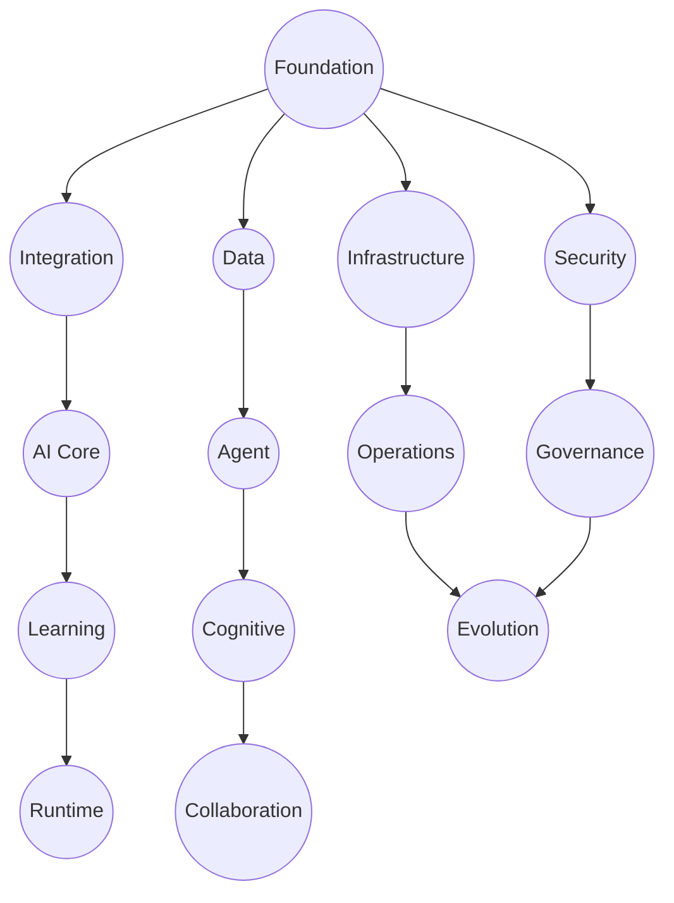

# AI-OS Architecture Master Roadmap

## PURPOSE

This document serves as the authoritative roadmap for the AI-OS Architecture Specification. It defines the architecture organization, document hierarchy, specification structure, completion status, cross-part relationships, architectural dependencies, and document conventions. It is NOT an implementation document; rather, it references the existing architecture and provides governance for its evolution.

## SECTION 1 — Architecture Overview

### Purpose

To provide a high-level understanding of the AI-OS architecture, its guiding principles, and the philosophy behind its specification.

### Scope

This document covers the complete AI-OS architecture, encompassing all its layers, components, and interactions as defined in the Architecture Specification. It outlines the structure and relationships of all architectural documentation.

### Audience

Architects, developers, system designers, technical leads, and stakeholders involved in the design, development, and maintenance of the AI-OS.

### Architecture Principles

The AI-OS architecture adheres to a set of core principles that guide its design and evolution, ensuring a robust, scalable, and maintainable system. These include, but are not limited to, event-driven architecture, loose coupling, single responsibility, security by design, zero trust, fail-safe mechanisms, defense in depth, observability, scalability, reliability, extensibility, technology neutrality, vendor neutrality, and implementation independence.

### Specification Philosophy

The AI-OS Architecture Specification is built on the philosophy of progressive elaboration. Each part builds upon the previous ones, providing increasing levels of detail and refinement. The specification prioritizes clarity, consistency, and completeness, ensuring that all aspects of the architecture are well-documented and understood. It aims to be a living document, continuously updated to reflect the evolving needs and insights of the AI-OS project.

## SECTION 2 — Complete Architecture Structure

This section outlines the complete 15-part roadmap for the AI-OS Architecture Specification.

| Part Number | Title | Purpose | Primary Architecture Layer | Status | Expected Sections | Dependencies | Deliverables |
| :--- | :--- | :--- | :--- | :--- | :--- | :--- | :--- |
| Part 1 | Core Foundation Layer | Defines the fundamental building blocks and base services of the AI-OS. | Foundation | Completed | Architecture Overview, Component Contracts, Runtime Behaviour, EventBus Integration, Configuration, Failure Handling, Recovery, Performance, Security, JSON Schemas, Runtime Invariants, Conformance, Cross References, ADR References, Summary | None | Core services contracts, foundational component designs, EventBus definition. |
| Part 2 | Communication & Integration Layer | Establishes the mechanisms for inter-component and inter-service communication. | Integration | Completed | Architecture Overview, Component Contracts, Runtime Behaviour, EventBus Integration, Configuration, Failure Handling, Recovery, Performance, Security, JSON Schemas, Runtime Invariants, Conformance, Cross References, ADR References, Summary | Part 1 | Communication protocols, API definitions, message brokers. |
| Part 3 | Data Management Layer | Specifies how data is stored, managed, and accessed across the AI-OS. | Data | Completed | Architecture Overview, Component Contracts, Runtime Behaviour, EventBus Integration, Configuration, Failure Handling, Recovery, Performance, Security, JSON Schemas, Runtime Invariants, Conformance, Cross References, ADR References, Summary | Part 1 | Data models, storage solutions, data access patterns. |
| Part 4 | Security & Governance Layer | Details the security controls, authentication, authorization, and policy enforcement mechanisms. | Security | Completed | Architecture Overview, Component Contracts, Runtime Behaviour, EventBus Integration, Configuration, Failure Handling, Recovery, Performance, Security, JSON Schemas, Runtime Invariants, Conformance, Cross References, ADR References, Summary | Part 1, Part 2, Part 3 | Identity provider integration, authorization policies, audit logging. |
| Part 5 | Operational & Observability Layer | Defines monitoring, logging, alerting, and operational management capabilities. | Operations | Completed | Architecture Overview, Component Contracts, Runtime Behaviour, EventBus Integration, Configuration, Failure Handling, Recovery, Performance, Security, JSON Schemas, Runtime Invariants, Conformance, Cross References, ADR References, Summary | Part 1, Part 2, Part 3 | Monitoring dashboards, logging standards, alerting mechanisms. |
| Part 6 | Infrastructure Abstraction Layer | Provides a consistent interface for interacting with underlying infrastructure resources. | Infrastructure | Completed | Architecture Overview, Component Contracts, Runtime Behaviour, EventBus Integration, Configuration, Failure Handling, Recovery, Performance, Security, JSON Schemas, Runtime Invariants, Conformance, Cross References, ADR References, Summary | Part 1 | Infrastructure provisioning interfaces, resource management. |
| Part 7 | AI Core Services Layer | Defines the foundational AI capabilities, such as model inference and training orchestration. | AI Core | Completed | Architecture Overview, Component Contracts, Runtime Behaviour, EventBus Integration, Configuration, Failure Handling, Recovery, Performance, Security, JSON Schemas, Runtime Invariants, Conformance, Cross References, ADR References, Summary | Part 1, Part 2, Part 3, Part 5, Part 6 | Model serving APIs, training pipelines, model routing logic. |
| Part 8 | Agent & Skill Management Layer | Details the framework for AI agents, their lifecycle, and skill integration. | Agent | Completed | Architecture Overview, Component Contracts, Runtime Behaviour, EventBus Integration, Configuration, Failure Handling, Recovery, Performance, Security, JSON Schemas, Runtime Invariants, Conformance, Cross References, ADR References, Summary | Part 1, Part 2, Part 7 | Agent lifecycle management, skill registry, task execution framework. |
| Part 9 | Learning Layer Architecture | Describes the mechanisms for continuous learning, adaptation, and knowledge acquisition. | Learning | Completed | Architecture Overview, Component Contracts, Runtime Behaviour, EventBus Integration, Configuration, Failure Handling, Recovery, Performance, Security, JSON Schemas, Runtime Invariants, Conformance, Cross References, ADR References, Summary | Part 3, Part 7, Part 8 | Reinforcement learning loops, knowledge acquisition mechanisms. |
| Part 10 | AI Runtime Architecture | Defines the execution environment and runtime orchestration for AI-OS services. | Runtime | Next | Architecture Overview, Component Contracts, Runtime Behaviour, EventBus Integration, Configuration, Failure Handling, Recovery, Performance, Security, JSON Schemas, Runtime Invariants, Conformance, Cross References, ADR References, Summary | Part 1, Part 8 | Runtime scheduling, execution isolation, process lifecycle. |
| Part 11 | Agent & Cognitive Architecture | Specifies cognitive models, memory hierarchies, and reasoning processes for agents. | Cognitive | Planned | Architecture Overview, Component Contracts, Runtime Behaviour, EventBus Integration, Configuration, Failure Handling, Recovery, Performance, Security, JSON Schemas, Runtime Invariants, Conformance, Cross References, ADR References, Summary | Part 8, Part 9 | Agent reasoning models, memory management, cognitive state persistence. |
| Part 12 | Multi-Agent Collaboration Architecture | Details mechanisms for coordination, negotiation, and conflict resolution in multi-agent systems. | Orchestration | Planned | Architecture Overview, Component Contracts, Runtime Behaviour, EventBus Integration, Configuration, Failure Handling, Recovery, Performance, Security, JSON Schemas, Runtime Invariants, Conformance, Cross References, ADR References, Summary | Part 8, Part 11 | Agent council protocols, collaborative workflows, conflict resolution mechanisms. |
| Part 13 | Deployment & Platform Operations | Defines operational procedures for system deployment, health management, and lifecycle maintenance. | Operations | Planned | Architecture Overview, Component Contracts, Runtime Behaviour, EventBus Integration, Configuration, Failure Handling, Recovery, Performance, Security, JSON Schemas, Runtime Invariants, Conformance, Cross References, ADR References, Summary | Part 5, Part 6 | Release management processes, platform health monitoring, lifecycle management. |
| Part 14 | Architecture Governance & Conformance | Specifies architectural standards, compliance auditing, and evolution oversight. | Governance | Planned | Architecture Overview, Component Contracts, Runtime Behaviour, EventBus Integration, Configuration, Failure Handling, Recovery, Performance, Security, JSON Schemas, Runtime Invariants, Conformance, Cross References, ADR References, Summary | All | Architectural standards, conformance validation, audit frameworks. |
| Part 15 | Architecture Evolution & Extensibility | Describes the framework for evolving the architecture and integrating new capabilities. | Evolution | Planned | Architecture Overview, Component Contracts, Runtime Behaviour, EventBus Integration, Configuration, Failure Handling, Recovery, Performance, Security, JSON Schemas, Runtime Invariants, Conformance, Cross References, ADR References, Summary | All | Versioning strategies, extension mechanisms, evolution roadmaps. |

## SECTION 3 — Cross-Part Dependency Graph

## SECTION 4 — Shared Architecture Components

| Component | Definition Part | Reused Parts | Description |
| :--- | :--- | :--- | :--- |
| **Hermes Kernel** | Part 1 | All | The core runtime environment and scheduling engine for all AI-OS processes and agents. |
| **EventBus** | Part 1 | All | Central pub/sub for asynchronous communication. |
| **Configuration Service** | Part 1 | All | Centralized configuration management. |
| **State Manager** | Part 1 | All stateful | Consistency and persistence of component/service state. |
| **Checkpoint Manager** | Part 1 | Part 7, 8, 9, 10 | State capture and recovery. |
| **Retry Manager** | Part 1 | All interaction-heavy | Resilience for external operations. |
| **Identity Service** | Part 4 | All | Identification of users, services, agents. |
| **Authentication** | Part 4 | All | Identity verification. |
| **Authorization** | Part 4 | All | Access control enforcement. |
| **Policy Engine** | Part 4 | Part 8, 11, 12, 14 | Behavioral and decision governance. |
| **Audit Service** | Part 4 | All | Accountability and forensics. |
| **Secret Manager** | Part 4 | All secure access | Secure storage for keys and credentials. |
| **Breakglass Manager** | Part 4 | Part 5, 14 | Emergency access protocols. |
| **Observability** | Part 5 | All | Comprehensive logging, metrics, and tracing. |
| **Root Cause Analyzer** | Part 5 | Part 7, 8, 9, 10 | Diagnostic insights into system failures. |
| **MCP Manager** | Part 6 | Part 7, 13 | Interface for external infrastructure/cloud resources. |
| **Model Router** | Part 7 | Part 8, 9, 10 | Inference request orchestration. |
| **AI Agency** | Part 8 | Part 7, 9, 10, 11, 12 | Agent lifecycle and orchestration framework. |
| **Skill Manager** | Part 8 | Part 7, 9, 10, 11 | Skill registry, discovery, and execution. |
| **Memory Manager** | Part 9 | Part 7, 8, 10, 11 | Short/Long-term knowledge and context storage. |
| **Workflow Manager** | Part 12 | Part 8, 10, 13 | Multi-step process orchestration. |
| **Council Manager** | Part 12 | Part 8, 11 | Meta-agency coordination and conflict resolution. |
| **Resource Manager** | Part 13 | Part 6, 7, 12 | Computational/Hardware resource allocation. |

## SECTION 5 — Shared JSON Schemas

| Schema Name | Purpose | Owning Part | Consumers | Validation Scope |
| :--- | :--- | :--- | :--- | :--- |
| **EventBusMessageSchema** | Message structure | Part 2 | All | Headers, payload, event types. |
| **ConfigurationSchema** | System/Component config | Part 1 | All | Key-value pairs, types, mandatory fields. |
| **IdentityTokenSchema** | Identity token format | Part 4 | All | Claims, signature, expiry. |
| **PolicyRuleSchema** | Policy rule definition | Part 4 | Part 4, 8, 11, 12, 14 | Conditions, actions, targets. |
| **AgentTaskSchema** | Agent task assignment | Part 8 | Part 8, 12 | IDs, params, status, deps. |
| **SkillInvocationSchema** | Skill invocation interface | Part 8 | Part 8 | Names, inputs, outputs. |
| **MetricSchema** | Observability metrics | Part 5 | Part 5, All | Names, values, tags. |
| **ResourceAllocationSchema** | Hardware/Resource allocation | Part 13 | Part 13 | Types, constraints, lifecycles. |
| **WorkflowDefinitionSchema** | Multi-agent workflow logic | Part 12 | Part 12 | Steps, transitions, error flows. |

## SECTION 6 — ADR Mapping

| Category | ADR Summaries |
| :--- | :--- |
| **Foundation ADRs** | EventBus design, Configuration management, Runtime environment isolation. |
| **Communication ADRs** | Async messaging patterns, Service-to-service protocols, API contracts. |
| **Data ADRs** | State persistence patterns, Knowledge graph structures. |
| **Security ADRs** | Identity and Access (IAM) strategy, Zero-trust implementation, Audit requirements. |
| **Observability ADRs** | Distributed tracing, Logging standards, Telemetry aggregation. |
| **Agent/Cognitive ADRs** | Agent lifecycle, Memory hierarchy, Collaboration/Council protocols. |
| **Governance ADRs** | Conformance validation, Architecture evolution, Versioning. |

## SECTION 7 — Global Architecture Principles

1.  **Event-Driven Architecture (EDA)**
2.  **Loose Coupling**
3.  **Single Responsibility Principle (SRP)**
4.  **Security by Design**
5.  **Zero Trust**
6.  **Fail Safe**
7.  **Defense in Depth**
8.  **Observability**
9.  **Scalability**
10. **Reliability**
11. **Extensibility**
12. **Technology Neutrality**
13. **Vendor Neutrality**
14. **Implementation Independence**

## SECTION 8 — Global Runtime Invariants

1.  **Data Consistency**: All persistent data maintains eventual consistency.
2.  **Secure Communication**: All inter-component traffic is encrypted (TLS/mTLS).
3.  **Authenticated Access**: All interfaces require validated identity.
4.  **Authorized Operations**: All actions undergo Policy Engine verification.
5.  **Eventual State Convergence**: Distributed state guarantees eventual consistency.
6.  **No Single Point of Failure (SPOF)**: Redundant deployment for critical services.
7.  **Resource Isolation**: Enforced boundaries (memory/CPU) per component.
8.  **Graceful Degradation**: Controlled failure responses under load.
9.  **Idempotent Operations**: All state-mutating APIs are idempotent.
10. **Timely Event Processing**: Latency SLAs per event category.
11. **Auditability**: Complete forensic records of security/operational events.
12. **Compliance with Policies**: Real-time adherence to Governance/Security policies.

## SECTION 9 — Naming Conventions

*   **Services**: `PascalCase` + `Service` (e.g., `IdentityService`)
*   **Managers**: `PascalCase` + `Manager` (e.g., `SkillManager`)
*   **Components**: `PascalCase` (e.g., `EventBus`, `PolicyEngine`)
*   **Events**: `PascalCase` (e.g., `TaskAssignedEvent`)
*   **JSON Schemas**: `PascalCase` + `Schema` (e.g., `AgentTaskSchema`)
*   **ADR IDs**: `ADR-NNN: Descriptive Title`

## SECTION 10 — Document Standards

*Mandatory sections per Part:*
1. Architecture Overview, 2. Component Contracts, 3. Runtime Behaviour, 4. EventBus Integration, 5. Configuration, 6. Failure Handling, 7. Recovery, 8. Performance, 9. Security, 10. JSON Schemas, 11. Runtime Invariants, 12. Conformance, 13. Cross References, 14. ADR References, 15. Summary.

## SECTION 11 — Review Checklist

1. Document Title
2. Purpose Section
3. Architecture Overview
4. Component Contracts
5. Runtime Behaviour
6. EventBus Integration
7. Configuration
8. Failure Handling & Recovery
9. Performance
10. Security
11. JSON Schemas
12. Runtime Invariants
13. Conformance
14. Cross References & ADR References
15. Naming Conventions
16. RFC2119 Compliance
17. Clarity & Conciseness
18. Completeness

## SECTION 12 — Architecture Progress Tracker

| Part | Title | Status |
| :--- | :--- | :--- |
| 1 | Core Foundation Layer | Completed |
| 2 | Communication & Integration Layer | Completed |
| 3 | Data Management Layer | Completed |
| 4 | Security & Governance Layer | Completed |
| 5 | Operational & Observability Layer | Completed |
| 6 | Infrastructure Abstraction Layer | Completed |
| 7 | AI Core Services Layer | Completed |
| 8 | Agent & Skill Management Layer | Completed |
| 9 | Learning Layer Architecture | Completed |
| 10 | AI Runtime Architecture | Next |
| 11 | Agent & Cognitive Architecture | Planned |
| 12 | Multi-Agent Collaboration Architecture | Planned |
| 13 | Deployment & Platform Operations | Planned |
| 14 | Architecture Governance & Conformance | Planned |
| 15 | Architecture Evolution & Extensibility | Planned |
