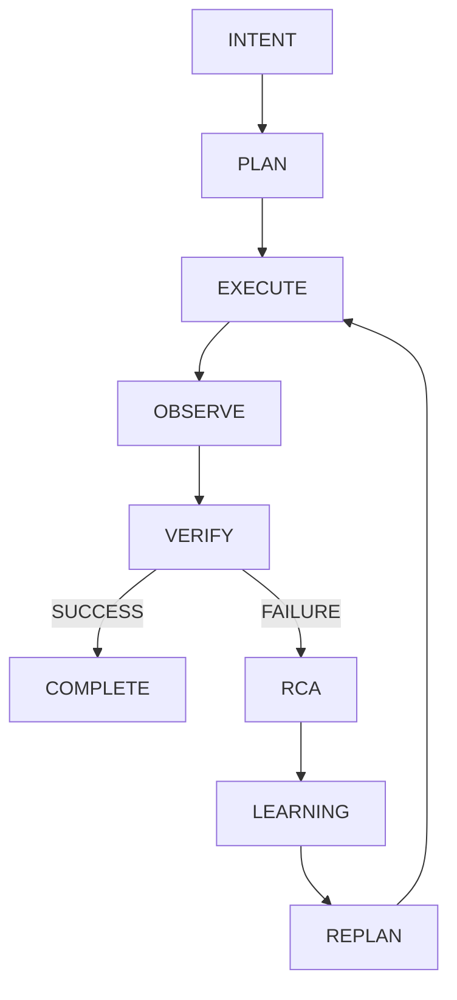
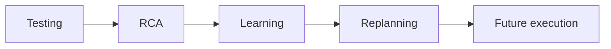
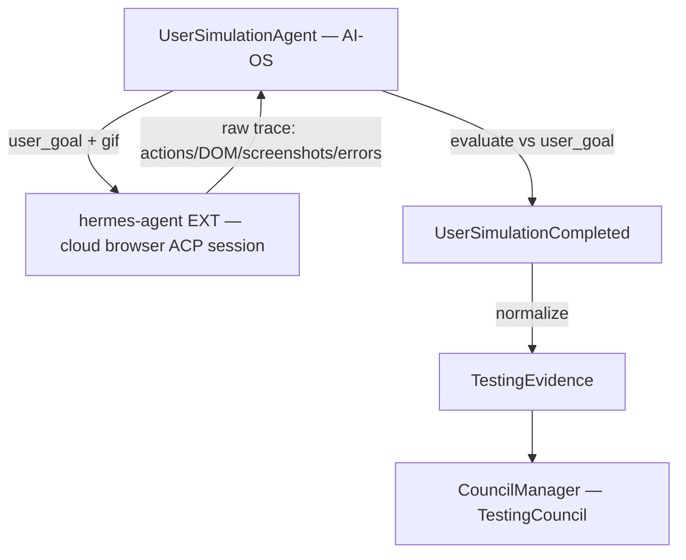
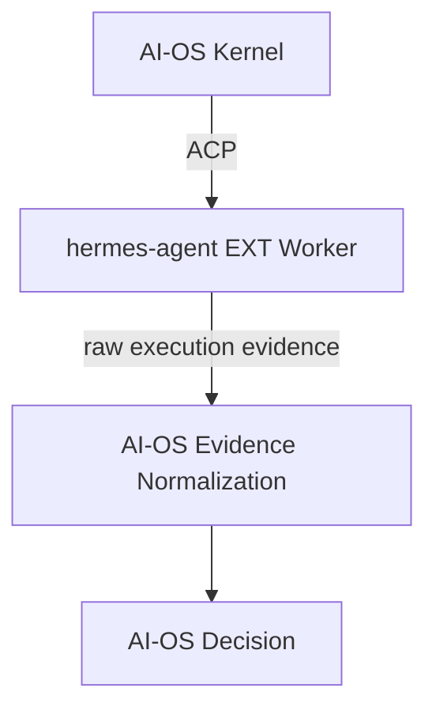
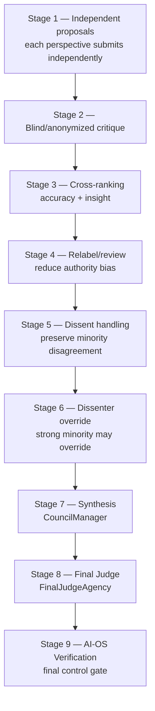
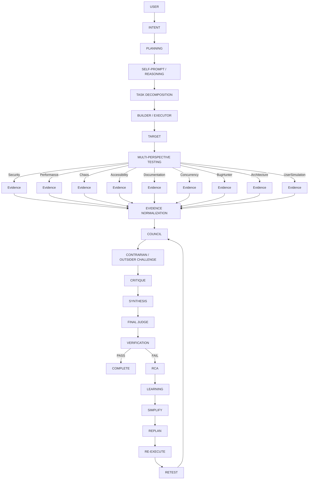

# FINAL AI-OS V2 ARCHITECTURE

> **AUTHORITATIVE ARCHITECTURE / REFERENCE DOCUMENT**
>
> This is the single source of truth for the final AI-OS V2 architecture, requirements, integrations, responsibilities, testing model, governance model, learning model, development workflow, and implementation roadmap.
>
> - This document = **AUTHORITATIVE**
> - Existing `architecture/*.md` documents = **SUPPORTING / HISTORICAL**
> - Source code and tests = **IMPLEMENTATION TRUTH**
> - Any future architectural change must update this document first.

---

## Document Status & Reconciliation Basis

This document was produced by reconciling the planning documents under `architecture/` against the **actual V1 source code** in `src/aios/`.

**Reconciliation priority used:**

1. Verified source code / tests (highest)
2. Explicitly finalized architectural decisions (the `V2_ARCHITECTURE_DECISION_RECORD.md`)
3. Latest reconciliation documents (`TERMINAL_1_V2_FREEZE_RECONCILIATION_REPORT.md`, `UPDATED_V*.md`)
4. Earlier planning documents
5. General inference (lowest)

**Unresolved conflicts** are explicitly marked **OPEN** or **BLOCKING** in the appropriate sections (see §39 and §41). The most consequential open items are:

- **C1 — "Hermes" naming collision (BLOCKING):** AI-OS's own kernel is named `HermesKernel` (`KERNEL_NAME = "Hermes"`), while "Hermes" is also used in the brief/decision record to mean an *external* browser/worker agent. Resolution: external = `hermes-agent`(EXT); core = `HermesKernel` / "AI-OS Kernel". Must be closed before M7 code.
- **C2 — Verification gate count:** docs say "12/12 gates" but `V2_ARCHITECTURE_DECISION_RECORD.md` says "11-layer"; no `VerificationService` exists in `src/`. Documentation-only.
- **C3 — Lifecycle state count:** narrative implies 5-state FSM; code `LifecycleState` has **8** members. Code truth = 8.
- **C4 — Notion absent from repo:** brief treats Notion as a permanent planning plane; zero references exist in `src/` or `config/`. Adopt-or-drop decision required.
- **R1 — Test execution unverified this session:** `802/802` is a *collection*-confirmed baseline (authoritative Part 15 V1 baseline), but a fresh execution `pytest` run was not performed in this reconciliation pass.

---

# PART I — EXECUTIVE ARCHITECTURE

## 1. AI-OS V2 Executive Architecture

### 1.1 What AI-OS is

AI-OS is an autonomous, self-governing software-development and verification operating system built in Python. Its **core is a single kernel** (`HermesKernel`, hereafter "the AI-OS Kernel") that plans, reasons, builds, tests, judges, learns, and improves — orchestrating a closed control loop in which failures are diagnosed (RCA), turned into reusable knowledge (Learning), used to replan, and re-executed until verified.

### 1.2 What problem it solves

Autonomous agents that "build" tend to also "test" and "approve" their own work, which produces silent self-approval and unverified software. AI-OS solves this by enforcing **strict separation of concerns** (Builder ≠ Tester ≠ Executor ≠ User Simulator ≠ Judge), **external-worker isolation** (workers execute, AI-OS decides), and **evidence-first verification** (claims must be backed by reproducible, provenanced evidence).

### 1.3 What V1 already provides (verified baseline)

The V1 baseline is **authoritative and verified**:

- Milestones **M0–M3 complete**.
- **802/802 tests collected** (unit + integration + performance under `tests/`).
- **12/12 V1 release gates** reported passing (Part 15 baseline; see R1/C2 caveats).
- A functioning `HermesKernel` with a **9-manager** core (State, Storage, Workflow, Resource, Health, Security, Capability, Observability, Lifecycle).
- An **event system** with **121 `EventType` members** (`events/core/types.py`).
- The **AI Agency system**: `AIAgencyService` with **9 agency roles** (`core/ai_agency.py:37`–`569`), including `FinalJudgeAgency`.
- A **`CouncilManager`** with 5 consensus algorithms, vote/dissent machinery (`core/council_manager.py`).
- A **`WorkflowManager`** (`core/workflow.py`), **`TestingService`** (smoke-test stub, `services/testing.py`), **`LearningService`** (`services/learning.py`), **`ModelRouter`** (`core/model_router.py`), **`SecurityManager`**, **`MCPManager`**.
- The **closed loop** scaffolding: RCA (`core/root_cause.py`) → Learning → Replan → Re-execute → Retest.

> **Important V1 reality:** every `BaseAgency.review()` method in V1 is currently a **heuristic / string-matching placeholder** (e.g., `if "sql" in target: finding = sql_injection_risk`). The structure exists; the *real execution* does not. V2's primary job is **realization through real execution**, not new architecture.

### 1.4 What V2 adds

V2 intensifies V1 from simulated to real:

1. **`TestingEvidence`** — a structured, machine-checkable, provenanced evidence schema (new).
2. **`TestOrchestratorService`** — orchestration extending `WorkflowManager` (not a duplicate service).
3. **`UserSimulationAgent`** — a first-class 10th testing perspective driving the running target as a real user (new).
4. **`CouncilManager.critique()`** — an anonymized cross-ranking / dissent / dissenter-override stage (extension).
5. **Real execution of the 9 agencies** via adapters, MCP/ACP workers (Hermes), replacing heuristic stubs.
6. **`LLMCouncil` façade** and **`SelfPromptingService`** — bounded reasoning/self-prompting over existing `CouncilManager`.
7. **`SimplificationGate`** — mandatory pre-acceptance complexity governance.
8. **Isolation/sandbox** layer (builder environment ≠ tester environment).
9. **External integration wiring**: `hermes-agent`(EXT) browser/worker, Playwright MCP, SkillSpecTor security gate, Graphify knowledge graph, FreeLLMAPI model routing, agency-agents personas, Vercel `SKILL.md` spec.

### 1.5 Why V2 is an intensification, not a rewrite

The V1 code **already scaffolds** the entire multi-perspective testing system: `AIAgencyService` + `TestingService` + `CouncilManager` + `FinalJudgeAgency` + `WorkflowManager` + verification + RCA→Learning→Replan→Re-execute→Retest. What is missing is **execution**, not architecture. V2 "fills the engine," wiring real workers (Hermes/agents/MCP) behind the existing seams. Frankenstein risk is therefore LOW — the seams already exist.

### 1.6 Core architectural philosophy

**ONE** of everything that has authority. One kernel, one governance/synthesis system, one closed control loop, one verification authority. External repositories are **workers, integrations, references, techniques, or organizational tools** — they must not silently become competing kernels.

### 1.7 Primary design principles

- **Independence principle:** roles that build, test, execute, simulate, and judge are strictly separated; the builder cannot self-approve.
- **Closed-loop principle:** every failure enters RCA → Learning → Replan → Re-execute → Retest until verified PASS.
- **Evidence-first principle:** claims require reproducible, provenanced, machine-checkable evidence — no prose-only verdicts.
- **Simplicity principle:** unnecessary complexity (duplicate components, premature abstraction, dependency explosion) is actively prevented, *without* weakening safety, verification, independence, or evidence.
- **External-worker principle:** workers (Hermes, agents, MCP tools) execute and return raw observations; **AI-OS retains final decision authority**.

---

# PART II — COMPLETE ARCHITECTURE DIAGRAM

```mermaid
flowchart TD
    U[USER / INTENT] --> P[PLANNING &amp; ORGANIZATION<br/>Notion · Obsidian · Graphify · GSD]
    P --> K[AI-OS KERNEL<br/>HermesKernel — single decision authority]
    K --> R[REASONING / SELF-PROMPTING<br/>LLMCouncil façade · SelfPromptingService<br/>bounded, traceable]
    R --> PL[PLANNING / EXECUTION<br/>WorkflowManager · PlanningService]
    PL --> B[BUILDERS / WORKERS<br/>Builder agents · services/code]
    B --> T[MULTI-PERSPECTIVE TESTING<br/>9 AIAgencyService roles]
    T --> US[USER SIMULATION AGENT<br/>10th perspective — drives target as real user]
    T --> EN[EVIDENCE NORMALIZATION<br/>TestOrchestratorService → TestingEvidence]
    US --> EN
    EN --> TC[TESTING COUNCIL<br/>CouncilManager.critique&#40;&#41;]
    TC --> CC[CONTRARIAN / OUTSIDER CHALLENGE<br/>adversarial perspective within council]
    CC --> CR[COUNCIL CRITIQUE<br/>anonymized cross-ranking · dissent]
    CR --> FJ[FINAL JUDGE<br/>FinalJudgeAgency — independent verdict]
    FJ --> V[AI-OS VERIFICATION<br/>final control gate]
    V -->|PASS| DONE[COMPLETE]
    V -->|FAIL| RCA[RCA — Root Cause]
    RCA --> L[LEARNING LAYER]
    L --> S[SIMPLIFY / COMPLEXITY GOVERNANCE]
    S --> RP[REPLAN]
    RP --> RE[RE-EXECUTE]
    RE --> T

    subgraph EXT [EXTERNAL INTEGRATIONS — WORKERS, NOT KERNEL]
        direction LR
        H[hermes-agent EXT<br/>browser / worker via ACP]
        PW[Playwright MCP<br/>deterministic browser]
        SST[SkillSpecTor<br/>security gate]
        TB[Trail of Bits Skills<br/>security ref]
        AA[agency-agents<br/>persona source]
        VS[Vercel Skills<br/>SKILL.md spec]
        FL[FreeLLMAPI<br/>model routing]
        GF[Graphify MCP<br/>knowledge graph]
        AR[Agent Reach<br/>web/social MCP]
        CM[Codebase Memory MCP<br/>repo nav]
    end
    T -. executes via .-> EXT
    US -. drives browser via ACP .-> H
```



**Key boundary rules shown above:**

- `hermes-agent`(EXT), Playwright, SkillSpecTor, Trail of Bits, agency-agents, Vercel Skills, FreeLLMAPI, Graphify, Agent Reach, Codebase Memory MCP are **external integrations** — they sit *outside* the kernel in a dashed subgraph. They **execute** and **observe**; they do **not** decide.
- Planning/organization tools (Notion, Obsidian, Graphify-as-PKM, GSD) are inputs/mirrors, not runtime decision components.
- The solid path (Kernel → Reasoning → Planning → Build → Test → Council → Judge → Verify → Loop) is the single AI-OS authority.

---

# PART III — THREE HIGH-LEVEL SYSTEM PARTS

The AI-OS V2 system is conceptually organized into three parts. This is an **organizational** view, not a runtime-component boundary.

## PART 1 — PLANNING / KNOWLEDGE / ORGANIZATION

Tools and surfaces for *human and project* planning, knowledge capture, and organization:

- **Notion** — primary planning & project-management surface.
- **Obsidian** — knowledge vault.
- **Graphify** — graph/visual knowledge layer (PKM + optional runtime knowledge-graph MCP).
- **GSD Core** — structured project-planning / task-decomposition methodology.

These do **not** make runtime decisions. They are organizational mirrors of AI-OS state, not the source of truth.

## PART 2 — AI-OS EXECUTION / REASONING / GOVERNANCE

The runtime authority:

- AI-OS Kernel (`HermesKernel`)
- Reasoning / self-prompting (`LLMCouncil`, `SelfPromptingService`)
- Planning / execution (`WorkflowManager`, `PlanningService`)
- Builders / workers
- Council / governance (`CouncilManager`)
- Verification authority
- Security (`SecurityManager`)

## PART 3 — VERIFICATION / TESTING / LEARNING / IMPROVEMENT

- Multi-perspective testing (9 agencies + UserSimulationAgent)
- Evidence normalization (`TestOrchestratorService`, `TestingEvidence`)
- Council synthesis + critique
- Final Judge
- RCA → Learning → Simplify → Replan → Re-execute → Retest

> **Do NOT confuse organizational tools (Part 1) with runtime architecture (Part 2/3).** Part 1 systems feed intent and knowledge; Part 2/3 hold all decision authority.

---

# PART IV — PLANNING / ORGANIZATION LAYER

These systems support planning, knowledge, and organization. **None are the AI-OS decision kernel.**

### Notion — Primary planning and project-management surface

Use for: planning, task tracking, milestones, requirements, progress, decisions, implementation status, project roadmap, keeping track of everything.

### Obsidian — Knowledge vault

Use for: architecture knowledge, technical notes, decisions, research, long-term project knowledge, interconnected documentation.

### Graphify — Graph/visual organization layer

Use as an organizational / knowledge-visualization integration. (Note C19: Graphify has both a PKM/visual role and an optional AI-OS-runtime knowledge-graph MCP role — see §21.)

### GSD Core — Structured planning methodology

Integrate the finalized GSD approach where useful for: structured project planning, task decomposition, progress tracking, execution organization, milestone management.

| Capability | Notion | Obsidian | Graphify | GSD Core | AI-OS Kernel |
|---|---|---|---|---|---|
| Authoritative runtime decisions | ✗ | ✗ | ✗ | ✗ | ✓ |
| Planning / task tracking | ✓ | partial | partial | ✓ | consumes |
| Architecture knowledge | partial | ✓ | ✓ (visual) | — | consumes |
| Source of truth for state | ✗ | ✗ | ✗ | ✗ | ✓ |
| Execution | ✗ | ✗ | ✗ | ✗ | ✓ |

---

# PART V — AI-OS KERNEL

The kernel is `HermesKernel` (`core/kernel.py:142`). It is the **single authoritative orchestrator** and is unchanged in its core responsibility from V1.

**Confirmed V1 core managers** (registered at `kernel.py:473`–`583`):

| Manager | File | Role |
|---|---|---|
| State | `core/state.py` | authoritative state |
| Storage | `core/storage.py` | persistence |
| Workflow | `core/workflow.py` | execution orchestration |
| Resource | `core/resource_manager.py` | resource governance |
| Health | `core/health_manager.py` | health authority |
| Security | `core/security_manager.py` | security authority |
| Capability | `core/capability_manager.py` | capability registry |
| Observability | `core/observability_manager.py` | telemetry authority |
| Lifecycle | `core/lifecycle_manager.py` | lifecycle (8 states) |

**Other verified kernel components:**

- **AIAgencyService** (`core/ai_agency.py:548`) — owns the 9 agency roles.
- **WorkflowManager** (`core/workflow.py`) — registered; does plan→dispatch→execute→collect.
- **TestingService** (`services/testing.py`) — deterministic smoke-test runner (stub).
- **CouncilManager** (`core/council_manager.py`) — governance/synthesis.
- **FinalJudgeAgency** (`core/ai_agency.py:507`) — independent verdict.
- **SecurityManager** (`core/security_manager.py`).
- **Event system** (`events/`) — 121 `EventType`s.
- **Closed loop** — RCA (`core/root_cause.py`) → Learning (`services/learning.py`) → Replan (`services/planning.py`) → Re-execute (`WorkflowManager`) → Retest.
- **MCP manager / ACP boundary** — `core/mcp_manager.py` present (no servers wired in V1); ACP adapter lives only in external `hermes-agent` (see C6).
- **Model abstraction** — `core/model_router.py` (`ModelRouter`).
- **Execution boundaries** — workers run outside the kernel; their outputs are untrusted observations until normalized + verified.

**What remains unchanged from V1:**

- The kernel class, its 9-manager core, the event system, and the closed-loop scaffolding are retained as-is.
- V2 extends existing components **before** creating any new permanent component. The only net-new permanent V2 components are `TestingEvidence`, `UserSimulationAgent`, plus extensions to `TestOrchestratorService` (on `WorkflowManager`), `critique()` (on `CouncilManager`), `LLMCouncil` façade, `SelfPromptingService`, `SimplificationGate`.

---

# PART VI — REASONING / SELF-PROMPTING / SELF-LOOPING

Self-looping is **controlled by the AI-OS workflow/governance system**, not an uncontrolled recursive agent.

Mechanisms:

- **Self-prompting** (`SelfPromptingService`, M6) — bounded, traceable, objective-linked self-questioning.
- **Self-reflection / iterative reasoning** — via `LLMCouncil` façade (6 roles: Analyst, Contrarian, Outsider, Skeptic, Specialist, Simplifier).
- **Planning → execution → observation → correction.**
- **Failure-triggered replanning** — on verification FAIL, route to RCA.
- **Bounded iteration** — max-depth, token budget, must cite objective, no open recursion (ADR #10, FINAL).
- **Stopping criteria** — verified PASS, budget exhausted, or convergence.
- **Infinite-loop prevention** — iteration cap + budget + convergence check.
- **Evidence required before progression** — no stage advances without provenanced evidence.



---

# PART VII — LEARNING LAYER

**Mandatory.** The Learning Layer turns outcomes into reusable knowledge without contaminating authoritative facts.

### What is learned

- **Failures** → root causes, triggering conditions, remediation that worked.
- **Successful approaches** → patterns that passed verification, reusable for similar tasks.

### When learning occurs

- After every verification FAIL (RCA → capture).
- After every verification PASS (capture the successful path).
- After every council dissent (capture the minority argument).

### What evidence is stored

- Structured observation, provenance (session_id, worker, timestamp, environment), severity, confidence, proof, reproducibility.

### How failures/successes become reusable knowledge

- Stored as **lessons** with provenance and confidence; linked to the task/objective that produced them.

### How learning affects future planning

- Future plans consult relevant lessons (retrieved by similarity/provenance) and may bias approach — but learning is **advisory**, not authoritative.

### Avoiding contamination of authoritative facts

- Learned items carry provenance + confidence; they are **inputs to planning**, never silently merged into source-of-truth state.
- AI-OS (verification + council) decides whether learned information is accepted for a given decision.

### Governance properties

- **Provenance** — every lesson traces to its evidence.
- **Confidence** — explicit confidence, downgradable on contradiction.
- **Replayability** — lessons reference reproducible evidence.
- **Feedback loops** — accepted lessons reinforce; rejected ones decay.



> Learning is **not** an uncontrolled autonomous authority. AI-OS retains the decision of whether learned information is accepted.

---

# PART VIII — SIMPLIFICATION LAYER / COMPLEXITY GOVERNANCE

**Mandatory.** `SimplificationGate` runs before acceptance (ADR #9, FINAL).

The system actively evaluates for:

- unnecessary abstractions
- duplicated components / services
- unnecessary dependencies
- overly complex workflows
- excessive indirection
- difficult-to-maintain code
- unnecessary external integrations
- "Frankenstein" architecture
- unnecessary microservices
- premature optimization
- redundant agents / councils

The gate asks:

1. Is this component necessary?
2. Can an existing component perform the job?
3. Is this abstraction justified?
4. Does it reduce or increase maintenance burden?
5. Does it introduce unnecessary coupling?
6. Can the architecture be simpler without losing capability?
7. Is this integration actually providing unique value?

> **`SIMPLIFY` must not remove necessary safety, verification, independence, or evidence mechanisms.** Simplicity is a *governance constraint*, not a reason to weaken verification.

---

# PART IX — MULTI-AGENCY TESTING

**THE 9 AGENCIES ARE THE TESTERS.** Do **not** create 9 additional testing subsystems.

The V1 `AIAgencyService` defines exactly 9 agency roles (`core/ai_agency.py`). Each is upgraded from **heuristic string-match to real execution** in V2.

| # | Agency (role) | Perspective focus |
|---|---|---|
| 1 | **SecurityAgency** | security checks via SkillSpecTor gate + pentester persona |
| 2 | **PerformanceAgency** | load / benchmark execution |
| 3 | **ChaosAgency** | failure-injection / reliability |
| 4 | **AccessibilityAgency** | WCAG / axe via Hermes browser |
| 5 | **DocumentationAgency** | docs & usability review |
| 6 | **ConcurrencyAgency** | race conditions / deadlocks |
| 7 | **BugHunterAgency** | fuzz / edge-case generation |
| 8 | **ArchitectureAgency** | boundary / dependency / contract checks |
| 9 | **FinalJudgeAgency** | aggregates normalized evidence → APPROVE / REJECT / CONDITIONAL |

**Plus:**

- **UserSimulationAgent** — first-class 10th perspective (see §11). It is **not** folded into BugHunter, Accessibility, or any other agency.

> V1 currently has **simulated/heuristic** implementations; V2 realizes them through **real execution** (adapters, MCP/ACP workers). The perspectives are intentionally different.

---

# PART X — REAL TEST EXECUTION

Transition from V1 to V2:

| | V1 | V2 |
|---|---|---|
| Style | heuristic / string-matching simulated testing | real execution |
| Evidence | loose `findings[]` dicts | structured `TestingEvidence` |
| Environment | shared / stub | isolated (worktree/container) |
| Output | prose-ish verdict | machine-checkable verdict + proof |

V2 real execution includes:

- **actual target execution** (the running application)
- **evidence capture** (screenshots, DOM, logs, traces)
- **structured observations**
- **isolated environments**
- **reproducibility** (deterministic seeds)
- **test traces**
- **provenance** (session_id, worker, timestamp, environment)

---

# PART XI — USER SIMULATION AGENT

**Authoritative basis:** `USER_SIMULATION_AGENT_SPEC.md`.

The `UserSimulationAgent` is a **first-class testing perspective** (the 10th). It is **NOT**: BugHunter, AccessibilityAgent, generic QA, developer, builder, or judge.

It behaves as close to a real user as possible.

### Received inputs

- `app_url` / `target` (running application)
- `user_goal` ("this is a todo app; I want to add and complete tasks")
- `exploration_brief` (high-level scenario)
- **NOT** source code, internal API contracts, or implementation knowledge

### Behavior

- **Discovery-first** — explores before acting ("Where do I start? What are my options?")
- **User intent** — formulates intent from goal, not spec
- **Happy-path workflows** — completes the goal via UI the way a user would
- **Confused/incorrect actions** — mistyped inputs, wrong buttons, refresh mid-flow, browser back/forward, empty submits
- **Edge cases** — boundary values, very long input, rapid repeats, interrupted sessions
- **Recovery** — can the user recover without restart?
- **Navigation** — does the UI make sense?
- **Usability** — dead-ends, confusing states, missing feedback
- **Feedback** — is app feedback clear?
- **Goal completion** — "did the app let me accomplish my goal?" (not "does it match spec?")

### Execution boundary



**Critical rule:** The agent must NOT primarily use source-code knowledge. `hermes-agent`(EXT) has **no decision authority** — it returns raw observations, not verdicts. AI-OS evaluates the resulting evidence.

---

# PART XII — HERMES INTEGRATION

`hermes-agent`(EXT) is an **INTEGRATION / EXECUTION SUBSTRATE**.

It provides: browser execution, cloud browser, worker execution, ACP, browser interaction, screenshots, DOM observation, action traces, and other worker capabilities.



**`hermes-agent`(EXT) must NOT become a second AI-OS.** It executes; AI-OS decides. AI-OS retains final decision authority.

> **Naming:** throughout this document, "Hermes" as an external agent is written `hermes-agent`(EXT) to distinguish it from AI-OS's own `HermesKernel` (see C1).

---

# PART XIII — TEST ORCHESTRATION

**`TestOrchestratorService`** is one of the two major new permanent V2 components (with `UserSimulationAgent`).

**Decision (ADR #4, FINAL):** `TestOrchestratorService` **extends `WorkflowManager`** — it does **not** duplicate it. (`WorkflowManager` already does plan→dispatch→execute→collect→normalize.)

Responsibilities:

- create test plans
- dispatch perspectives
- isolate tests
- collect evidence
- normalize evidence → `TestingEvidence`
- preserve provenance
- handle failures
- feed `CouncilManager` (TestingCouncil)
- coordinate retesting

**Relationship to WorkflowManager:** `TestOrchestratorService` is a specialization of `WorkflowManager` for the testing domain. No second orchestrator service is created (avoids duplication risk R2/Frankenstein).

---

# PART XIV — STRUCTURED TESTING EVIDENCE

**Canonical `TestingEvidence` schema** (ADR #5, FINAL — typed dataclass replacing loose `dict`).

| Field | Description |
|---|---|
| `perspective` | which agency/agent produced this |
| `target` | what was tested |
| `test_id` | unique identifier |
| `actions` | actions taken |
| `observations` | what was observed |
| `expected` | expected behavior (where applicable) |
| `observed` | actual behavior |
| `severity` | severity level |
| `confidence` | confidence in finding |
| `proof` | screenshot / DOM / trace |
| `provenance` | source metadata (session_id, worker, etc.) |
| `timestamp` | when collected |
| `environment` | test environment context |
| `session_id` | Hermes/session identifier |
| `reproducibility` | can it be reproduced |
| `verdict` | finding classification |

**User-Simulation-specific fields** (`UserSimulationCompleted` → normalized to `TestingEvidence`):

| Field | Description |
|---|---|
| `goal_completion_pct` | % of intended goal steps completed unassisted |
| `workflow_success` | did the primary workflow reach its end state |
| `usability_blockers` | dead-ends, no-path-to-goal |
| `confusing_states` | ambiguous labels, unclear next-step |
| `navigation_failures` | |
| `missing_feedback` | |
| `invalid_input_handling` | |
| `recovery_behavior` | could the user recover without restart |
| `expected_vs_observed` | stated promise vs actual behavior |

> Evidence must be **machine-checkable**. Avoid prose-only verdicts.

---

# PART XV — TEST ENVIRONMENT ISOLATION

- **Worktree isolation** — builder environment ≠ tester environment.
- **Container isolation** where necessary.
- **Test fixtures** — seeded defects for acceptance.
- **Reproducibility** — deterministic seeds.
- **Clean environments** — per-test reset.
- **Test session IDs** — `session_id` flows Hermes → agent → evidence.
- **Evidence provenance** — every artifact traces to its session/worker.

> The builder must not contaminate the tester environment. The builder of a target is **excluded** from that target's TestingCouncil membership.

---

# PART XVI — COUNCIL ARCHITECTURE

There are **TWO DISTINCT COUNCIL CONCEPTS**. Do **not** collapse them into one generic "council."

### COUNCIL 1 — AI-OS LLM COUNCIL / GOVERNANCE COUNCIL

- The existing `CouncilManager`-based governance/synthesis mechanism (`core/council_manager.py`).
- The **actual AI-OS council authority** (decision synthesis + dissent handling).
- Serves two domains via the same substrate:
  - **LLM Council** (reasoning/self-prompting domain) via `LLMCouncil` façade (6 roles).
  - **TestingCouncil** (verification domain) — convenes the 9 agencies + `UserSimulationAgent`.

### COUNCIL 2 — CONTRARIAN / OUTSIDER / ALTERNATIVE-PERSPECTIVE CHALLENGE

- A **mechanism/role within** the existing `CouncilManager`, **not** a separate subsystem.
- Purpose: contrarian analysis, outsider viewpoint, challenging assumptions, adversarial reasoning, alternative interpretations, self-critique, disagreement generation.
- Implemented as adversarial council member roles (e.g., the `Contrarian` / `Outsider` / `Skeptic` roles of the `LLMCouncil` façade, and as a dissent path in `critique()`).

**Relationship to testing / verification / learning / primary CouncilManager:**

- The challenge feeds the TestingCouncil synthesis as an adversarial perspective.
- Disagreements (dissent) are **preserved** as metadata, not silently averaged away.
- It is integrated via the existing `CouncilManager` — **no second council framework is created.**

> If the repository defines exact finalized names/interfaces, those are used. Current V1 `CouncilManager` provides `CouncilMember.expertise`, `CouncilProposal`, `CouncilVote`, `CouncilDecision`, and `dissent()`. The `critique()` stage (V2, M6) adds anonymized cross-ranking + dissenter-override on top.

---

# PART XVII — TESTING COUNCIL SYNTHESIS

**Authoritative basis:** `COUNCIL_SYNTHESIS_ARCHITECTURE.md`. **Do NOT import Karpathy LLM Council or evisoft Council as subsystems** — adopt their *techniques* only (ADR #15, FINAL).



| Stage | Technique adopted (source) |
|---|---|
| 1 — Independent proposals | existing `propose()` isolation |
| 2 — Anonymized critique | KKC (Karpathy) anonymized cross-ranking |
| 3 — Cross-ranking (accuracy + insight) | KKC two-axis ranking |
| 4 — Relabel/review | EVC (evisoft) relabel-then-review |
| 5 — Dissent handling | existing `dissent()` |
| 6 — Dissenter override | EVC side-with-dissenter |
| 7 — Synthesis | `CouncilManager.synthesize()` |
| 8 — Final Judge | `FinalJudgeAgency` |
| 9 — Verification | AI-OS verification (final gate) |

> KKC and EVC code is **not vendored** (unlicensed/immature). Only the *techniques* are re-implemented inside the licensed AI-OS `CouncilManager`.

---

# PART XVIII — INDEPENDENCE / TRUST BOUNDARY

| Role | Can build? | Can test? | Can execute? | Can judge? | Can vote? |
|---|---|---|---|---|---|
| Builder | ✓ | ✗ | ✓ | ✗ | ✗ (in its own target's council) |
| Tester (9 agencies) | ✗ | ✓ | via worker | ✗ (FinalJudge does) | ✓ |
| UserSimulationAgent | ✗ | ✓ (as user) | via `hermes-agent` | ✗ | ✓ |
| `hermes-agent`(EXT) | ✗ | ✗ | ✓ (worker) | ✗ | ✗ |
| agency-agents worker | ✗ | ✗ (persona source) | ✓ (via AI-OS) | ✗ | ✗ |
| Security worker (SkillSpecTor) | ✗ | ✓ (gate) | ✓ | ✗ | ✗ |
| Performance worker | ✗ | ✓ | ✓ | ✗ | ✗ |
| Council member | ✗ | ✗ | ✗ | via synthesis | ✓ (anonymized at critique) |
| Contrarian / Outsider | ✗ | ✗ (challenges) | ✗ | ✗ | ✓ (as perspective) |
| FinalJudge | ✗ | ✗ | ✗ | ✓ (verdict) | ✗ |
| Verification | ✗ | ✗ | ✗ | ✓ (final gate) | ✗ |
| Learning layer | ✗ | ✗ | ✗ | advisory only | ✗ |

**Enforced rules:**

- **BUILDER CANNOT APPROVE ITS OWN WORK.**
- `hermes-agent`(EXT) cannot issue final verdicts.
- External agents cannot override AI-OS governance.
- The TestingCouncil **excludes the builder** of the target.
- All external outputs = untrusted observations until AI-OS-normalized.

---

# PART XIX — SECURITY / ADVERSARIAL TESTING

**SkillSpecTor** — classification: **INTEGRATION (security/adversarial gate)**.

Use for: skill safety, adversarial testing, poisoning detection, malicious-behavior checks, security gates (pre-install scanner; LLM stage must be disabled/self-hosted within the trust boundary — see C10).

Also integrate **Trail of Bits Skills** as a serious security-testing source/reference where appropriate.

> Do **not** blindly import entire repositories. SkillSpecTor is a *gate*, not the final authority — AI-OS remains the final authority.

---

# PART XX — BROWSER TESTING

Two complementary mechanisms:

### Hermes browser execution (`hermes-agent` EXT)

- AI-driven, exploratory, real-user simulation (UserSimulationAgent drives it via ACP).
- Non-deterministic by nature; excellent for discovery and UX.

### Playwright MCP

- Deterministic automated browser/UI testing.
- Considered for repeatable, asserted UI tests.

**Distinction:**

- **Deterministic automated browser tests** (Playwright) ≠ **AI-driven exploratory user simulation** (Hermes + UserSimulationAgent). They are **complementary**.
- Playwright should **not** replace UserSimulationAgent.
- `hermes-agent`(EXT) should **not** replace deterministic tests.

---

# PART XXI — OTHER EXTERNAL INTEGRATIONS

**Definitive classification table.** Categories: `INTEGRATION`, `REFERENCE`, `TECHNIQUE`, `OPTIONAL`, `PLANNING/ORGANIZATION`, `ENVIRONMENT TOOLING`, `MODEL ACCESS`, `SKILL SOURCE`.

| Resource | Final Treatment | Purpose |
|---|---|---|
| **Hermes Agent** (`hermes-agent` EXT) | INTEGRATION | Browser/worker execution substrate via ACP/MCP |
| **agency-agents** | SKILL/PERSONA SOURCE | Curated MIT personas for testing/security/architecture roles |
| **SkillSpecTor** | INTEGRATION (gate) | Security/adversarial testing gate |
| **Agent Reach** | INTEGRATION | Web/social content ingestion via MCP |
| **Vercel Skills** | INTEGRATION / SKILL SOURCE | Canonical `SKILL.md` packaging spec |
| **Free Claude Code** | REFERENCE / ENVIRONMENT TOOLING | Unaffiliated provider launcher; optional model fallback |
| **FreeLLMAPI** | INTEGRATION / MODEL ACCESS | Provider-abstract model routing via `ModelRouter` |
| **Ruflo** | REFERENCE | Agent meta-OS competitor; architecture cross-check only — **NOT core** |
| **Loop Engineering** | REFERENCE | Loop patterns / sandbox / worktree / gate for isolation |
| **Prompt Engineering Techniques Hub** | REFERENCE | Static prompt patterns |
| **Book-to-Skill** | REFERENCE | Offline `SKILL.md` authoring tool |
| **Superpowers** | REFERENCE | Composable skill methodology |
| **Everything Claude Code (ECC)** | REFERENCE | Agent-harness patterns; security references |
| **Caveman** | OPTIONAL | Token compression (BSL-1.1 engine caveat) |
| **Graphify** | INTEGRATION (MCP) / PLANNING | Knowledge graph + visual organization |
| **Karpathy LLM Council** | TECHNIQUE | Anonymized cross-ranking — re-implement in `CouncilManager` |
| **evisoft Council** | TECHNIQUE | Worldview-diverse + relabel-then-review — re-implement in `critique()` |
| **Playwright MCP** | INTEGRATION | Deterministic browser testing |
| **Trail of Bits Skills** | INTEGRATION / SECURITY REFERENCE | Security testing source |
| **Codebase Memory MCP** | INTEGRATION CANDIDATE | Large-repo navigation / context |
| **Agentic R&D Skill** | STUDY / REFERENCE | Evidence-based research workflows |
| **Code Virtuoso** | STUDY SELECTIVELY / REFERENCE | Agent/skill design patterns |
| **GSD Core** | PLANNING/ORGANIZATION | Planning/execution methodology |
| **Notion** | PLANNING/ORGANIZATION | Planning/tracking plane (see C4 — absent in repo) |
| **Obsidian** | PLANNING/ORGANIZATION | PKM vault (dev/planning infra, not runtime — see C19) |

> **FreeLLMAPI and Vercel Skills are explicitly included** (per final rules). All resources above are classified; Ruflo is downgraded to REFERENCE. **Instagram** was marked UNVERIFIED in source docs and is not integrated.

---

# PART XXII — VERCEL SKILLS

**Classification:** INTEGRATION / SKILL SOURCE.

Purpose: discovering useful skills; installing/using skills where appropriate; augmenting AI-OS capabilities. The `SKILL.md` format is the **canonical** skill spec (ADR #15 — no second skill format).

> Skills must still pass AI-OS governance/security controls (SkillSpecTor gate). Vercel Skills is **NOT** the AI-OS kernel.

---

# PART XXIII — AGENCY-AGENTS

**Classification:** INTEGRATION / PERSONA SOURCE.

Use for suitable specialist personas (security, UX research, accessibility, performance, etc.). **Curate ~8–10 personas** via the `SKILL.md` adapter — do **not** blindly import 230+ (ADR #14, FINAL).

> AI-OS owns orchestration, evidence normalization, governance, and decision.

---

# PART XXIV — FREE CLAUDE CODE

**Classification:** REFERENCE / ENVIRONMENT TOOLING.

Supports the development environment as an unaffiliated provider launcher / optional model fallback. It must **not** become the AI-OS kernel. Pilot in dev/test only; never production without SLA (C13).

---

# PART XXV — FREELLMAPI

**Classification:** REFERENCE / MODEL-ACCESS INFRASTRUCTURE (routed via `ModelRouter`).

Provides model access where appropriate. Do **not** couple AI-OS architecture to one provider. AI-OS retains a **model abstraction layer** (`ModelRouter`); FreeLLMAPI is one integration behind it. Pilot in dev/test only (C13).

---

# PART XXVI — CODEBASE MEMORY MCP

Investigate/use where appropriate for: large-repository navigation, codebase context, architecture understanding, long-term repository memory. It is an **integration/tool, NOT the source of truth**.

---

# PART XXVII — AGENTIC R&D / CODE VIRTUOSO

**Agentic R&D Skill** — STUDY / REFERENCE: use selectively for evidence-based research and verification patterns.

**Code Virtuoso** — STUDY SELECTIVELY / REFERENCE: use only useful patterns for agent/skill design and implementation practices.

> Do not import unnecessary architecture.

---

# PART XXVIII — CAVEMAN

**Classification:** OPTIONAL.

Potential use: payload compression, context reduction, large-evidence handling (BSL-1.1 engine license caveat — see C15).

> Must remain optional and must **not** become a mandatory architectural dependency.

---

# PART XXIX — WHAT MUST NOT BE IMPLEMENTED

| # | Must-NOT-Implement |
|---|---|
| 1 | Second AI-OS kernel (Ruflo or native) |
| 2 | Second `CouncilManager` / second council framework / second council synthesis subsystem |
| 3 | Imported Karpathy LLM Council subsystem |
| 4 | Imported evisoft Council subsystem |
| 5 | `hermes-agent`(EXT) as final decision maker |
| 6 | External agent as final authority |
| 7 | Uncontrolled recursive loops |
| 8 | Uncontrolled self-modification |
| 9 | Source-code access for UserSimulationAgent |
| 10 | Builder judging its own work |
| 11 | Duplicated testing frameworks where existing services suffice |
| 12 | Unnecessary microservices |
| 13 | Unnecessary abstraction layers |
| 14 | Unnecessary external dependencies |
| 15 | Frankenstein integration of entire repositories |
| 16 | Second verification authority |
| 17 | Second/parallel recovery loop |
| 18 | Notion-as-state (dual source-of-truth) |
| 19 | Second skill format (Vercel `SKILL.md` is canonical) |
| 20 | Second model router (`ModelRouter` + FreeLLMAPI is canonical) |
| 21 | Native AI-OS browser / in-house browser farm |

---

# PART XXX — FINAL V2 COMPONENTS

### Existing V1 components to retain (verified in `src/`)

- `HermesKernel`, 9 core managers, event system (121 EventTypes)
- `AIAgencyService` + 9 agency roles
- `WorkflowManager`, `TestingService` (stub), `CouncilManager`, `FinalJudgeAgency`
- `LearningService`, `PlanningService`, RCA (`root_cause.py`)
- `SecurityManager`, `MCPManager`, `ModelRouter`

### V2 components to add (smallest meaningful set)

1. **`TestingEvidence`** (new schema)
2. **`UserSimulationAgent`** (new 10th perspective)
3. **`TestOrchestratorService`** (extends `WorkflowManager`)
4. **`CouncilManager.critique()`** (new stage)
5. **`LLMCouncil` façade** (over `CouncilManager`)
6. **`SelfPromptingService`** (bounded)
7. **`SimplificationGate`** (pre-acceptance)
8. **Real execution** of the 9 agencies (adapter/MCP/ACP dispatch)
9. **Isolation/sandbox** layer (per-test env)
10. **External wiring** (Playwright, SkillSpecTor, Graphify, FreeLLMAPI, agency-agents / Vercel adapter)

> Do not create unnecessary permanent components. Every addition passed a 5-test necessity audit (existing? integration? adapter? required? justified?).

---

# PART XXXI — MILESTONES

Roadmap basis: `UPDATED_V2_MILESTONES.md`. Sequence respects dependencies: **M4 → M5 → M6 → M7**.

### M4 — Skill & Security Standardization

- Canonical `SKILL.md` adapter in `SkillService`; SkillSpecTor gate in `SecurityManager`; seed agency-agents personas.
- Depends on: V1 baseline.
- No testing realization itself — it is the safety prerequisite.

### M5 — Knowledge-Graph Memory & Integration Backbone

- Graphify MCP → memory tier; Agent-Reach MCP; FreeLLMAPI via `ModelRouter`; `hermes-agent`(EXT) ACP/MCP bridge.
- Depends on: M4 (SkillSpecTor gate reused for target MCPs).
- **Required for M7 User Simulation** (Hermes cloud-browser) and external worker execution.

### M6 — Council Synthesis & Self-Prompting

- `CouncilManager.critique()` (KKC/EVC techniques); `LLMCouncil` façade (6 roles); `SelfPromptingService` (bounded).
- Depends on: M4, M5 (parallel-capable after M5 bridge).
- **Required for M7 Testing Council critique stage.**

### M7 — Multi-Perspective Testing & User Simulation *(contains real multi-perspective testing + User Simulation realization)*

- 9 real agencies + `UserSimulationAgent` (10th); `TestOrchestratorService` (extends `WorkflowManager`); `TestingEvidence`; `CouncilManager.critique()` TestingCouncil; isolation; adversarial (SkillSpecTor + Trail of Bits + agency-agents pentester); `SimplificationGate`; learning integration; closed-loop retest; seeded-defect acceptance.
- Depends on: **M4** (persona adapter + gate), **M5** (Hermes bridge), **M6** (critique technique), existing `WorkflowManager`/`ModelRouter`/`LearningService`.

**M7 internal order:**

```
M7-A: TestingEvidence + UserSimulationCompleted schema
M7-B: TestOrchestratorService extending WorkflowManager
M7-C: Realize 9 agencies (simulated → real via adapters/MCP/ACP)
M7-D: UserSimulationAgent + hermes-agent(EXT) ACP browser
M7-E: Isolation/sandbox (builder ≠ tester)
M7-F: Testing Council critique() synthesis
M7-G: Independent FinalJudgeAgency verdict
M7-H: Adversarial/security realization (SkillSpecTor gate)
M7-I: Closed-loop integration (RCA→Learning→Replan→Re-execute→Retest)
M7-J: SimplificationGate + seeded-defect acceptance (9 defects), full retest, 12/12 gates
```

> No additional milestones are invented. M7 is the milestone that delivers the full V2 testing/verification realization.

---

# PART XXXII — IMPLEMENTATION ORDER

Each V2 task (M7-A … M7-J plus M4/M5/M6 deliverables):

| Task | Objective | Deps | Components touched | Tests required | Acceptance | Safety / Independence |
|---|---|---|---|---|---|---|
| M4 adapter | Portable safe skill ingestion | V1 | `SkillService`, `SecurityManager` | skill-format + gate unit tests | SkillSpecTor gate passes clean + poisoned skill | Gate runs *before* install; LLM stage disabled/self-hosted (C10) |
| M5 bridge | External execution backbone | M4 | `MCPManager`, `ModelRouter`, memory tier | MCP/ACP connection + provenance tests | Hermes/Graphify/FreeLLMAPI reachable, provenanced | External outputs untrusted until normalized |
| M6 critique | Council reasoning | M5 | `CouncilManager`, `LLMCouncil`, `SelfPromptingService` | dissent + bounded-loop tests | Anonymized critique; self-prompt depth-capped | Builder excluded from own council; loops bounded |
| M7-A | Evidence schema | — | `TestingEvidence` | schema + serialization tests | Machine-checkable, provenanced | No prose-only verdicts |
| M7-B | Orchestrator | M7-A | `TestOrchestratorService` (extends `WorkflowManager`) | dispatch + normalize tests | Plan→dispatch→collect→normalize | Extends, does not duplicate `WorkflowManager` |
| M7-C | Real agencies | M5 | `AIAgencyService` 9 roles | each agency real-exec test | Heuristic replaced by real execution | Each agency isolated; no self-approval |
| M7-D | User Simulation | M5, M7-A | `UserSimulationAgent`, `hermes-agent`(EXT) | seeded-defect sim test | User goal completion measured; no source access | Agent gets app purpose/goal only, not code |
| M7-E | Isolation | — | test infra | isolation/clean-env test | Builder env ≠ tester env | Builder excluded from TestingCouncil |
| M7-F | Critique synthesis | M6, M7-B/C/D | `CouncilManager.critique()` | dissent-preserved test | Minority disagreement preserved; dissenter override possible | Anonymized at critique |
| M7-G | Final Judge | M7-F | `FinalJudgeAgency` | independent-verdict test | Verdict independent of builder | FinalJudge isolated from builder |
| M7-H | Adversarial | M4, M7-C | SkillSpecTor + Trail of Bits + pentester | adversarial/poisoning test | Malicious behavior detected | Gate, not final authority |
| M7-I | Closed loop | all | RCA/Learning/Planning/Workflow | loop test (FAIL→RCA→…→PASS) | Failure enters loop; reaches verified PASS | Bounded iterations |
| M7-J | Simplification + acceptance | M7-I | `SimplificationGate` | simplify + 9 seeded-defect tests | Complexity flagged; all defects detected; 12/12 gates | Simplify never removes safety/verification |

> Sequence minimizes architectural risk: foundation (M4) → backbone (M5) → reasoning (M6) → realization (M7), with M7 internally ordered schema→orchestrator→agencies→sim→isolation→council→judge→adversarial→loop→acceptance.

---

# PART XXXIII — TESTING STRATEGY

1. **Unit tests** — components in isolation.
2. **Integration tests** — cross-component wiring (kernel ↔ services).
3. **Contract tests** — agency/MCP/ACP interfaces.
4. **Deterministic browser tests** — Playwright MCP.
5. **AI-driven testing** — agency real execution.
6. **Multi-perspective testing** — 9 agencies.
7. **User simulation** — `UserSimulationAgent`.
8. **Security testing** — SkillSpecTor + Trail of Bits + pentester.
9. **Performance testing** — `PerformanceAgency`.
10. **Accessibility testing** — `AccessibilityAgency` (axe).
11. **Chaos/reliability** — `ChaosAgency`.
12. **Regression testing** — 802/802 suite + agency-agents automation.
13. **Data correctness** — state/storage invariants.
14. **Reproducibility** — deterministic seeds/fixtures.
15. **Council synthesis testing** — dissent + dissenter-override.
16. **End-to-end closed-loop testing** — FAIL→RCA→Learning→…→PASS.

> **Seeded defects** are required: the system must **prove it can detect failures** rather than merely report success. A seeded defect must be caught; a false positive must be challengeable.

---

# PART XXXIV — ACCEPTANCE CRITERIA

Measurable V2 acceptance:

- real agency execution ✓
- real `UserSimulationAgent` execution ✓
- browser execution (Hermes/Playwright) ✓
- evidence capture ✓
- structured evidence (`TestingEvidence`) ✓
- isolation (builder ≠ tester) ✓
- independent council ✓
- critique stage (anonymized) ✓
- dissent preservation ✓
- `FinalJudgeAgency` ✓
- verification gate ✓
- RCA ✓
- Learning ✓
- Replan ✓
- Re-execute ✓
- Retest ✓
- simplification checks ✓

**The final acceptance model must prove:**

1. A **seeded defect is detected.**
2. A **false positive is challenged** (dissent/critique).
3. A **minority disagreement is preserved.**
4. A **builder cannot self-approve.**
5. A **failed test enters the closed loop.**
6. A **corrected implementation is retested.**
7. The system can **eventually reach verified PASS.**

---

# PART XXXV — COMPLETE DATA / CONTROL FLOW



---

# PART XXXVI — RESPONSIBILITY MATRIX

| Capability | AI-OS | hermes-agent(EXT) | agency-agents | MCP | Notion | Obsidian | Graphify | External refs |
|---|---|---|---|---|---|---|---|---|
| Plan / decide | ✓ | ✗ | ✗ | ✗ | input | ✗ | input | ✗ |
| Build / execute | ✓ (builder) | ✓ (worker) | persona | tool | ✗ | ✗ | ✗ | ✗ |
| Multi-perspective test | ✓ (orchestrate) | ✓ (browser) | persona | tool | ✗ | ✗ | ✗ | ✗ |
| Evidence normalize | ✓ | ✗ | ✗ | ✗ | ✗ | ✗ | ✗ | ✗ |
| Council / synthesis | ✓ | ✗ | ✗ | ✗ | ✗ | ✗ | ✗ | ✗ |
| Final verdict | ✓ | ✗ | ✗ | ✗ | ✗ | ✗ | ✗ | ✗ |
| Verification gate | ✓ | ✗ | ✗ | ✗ | ✗ | ✗ | ✗ | ✗ |
| Learning | ✓ | ✗ | ✗ | ✗ | ✗ | ✗ | ✗ | ✗ |
| Knowledge vault | ✗ | ✗ | ✗ | ✗ | partial | ✓ | ✓ (visual) | ✗ |
| Project tracking | consumes | ✗ | ✗ | ✗ | ✓ | ✗ | ✗ | ✗ |
| Model access | ✓ (router) | ✗ | ✗ | ✓ | ✗ | ✗ | ✗ | FreeLLMAPI |

---

# PART XXXVII — REQUIREMENTS TRACEABILITY MATRIX

| Requirement | Architectural Component | Implementation Location | Test | Acceptance Criterion | Status |
|---|---|---|---|---|---|
| Multi-perspective real testing | 9 `AIAgencyService` roles → real exec | `core/ai_agency.py` | M7-C | real agency execution | V1 SIMULATED → V2 |
| User Simulation | `UserSimulationAgent` | new | M7-D | user goal completion measured | MISSING → ADD |
| Structured evidence | `TestingEvidence` | new | M7-A | machine-checkable + provenance | MISSING → BUILD |
| Test orchestration | `TestOrchestratorService` | extends `WorkflowManager` | M7-B | plan→dispatch→normalize | PARTIAL → EXTEND |
| Council critique | `CouncilManager.critique()` | `core/council_manager.py` | M7-F | dissent preserved | PARTIAL → EXTEND |
| Independent judge | `FinalJudgeAgency` | `core/ai_agency.py:507` | M7-G | verdict independent of builder | SIMULATED → REALIZE |
| Security gate | SkillSpecTor | `SecurityManager` + M4 | M7-H | malicious behavior detected | ABSENT → INTEGRATE |
| Browser testing | `hermes-agent`(EXT) + Playwright MCP | M5/M7 | M7-D | browser execution | ABSENT → INTEGRATE |
| Isolation | test infra | M7-E | M7-E | builder ≠ tester env | PARTIAL → BUILD |
| Self-prompting | `SelfPromptingService` | new | M6 | bounded, traceable | ABSENT → ADD |
| Simplification | `SimplificationGate` | new | M7-J | complexity flagged, safeguards kept | ABSENT → ADD |
| Closed loop | RCA→Learning→Replan→Re-execute→Retest | `root_cause.py`, `learning.py`, `planning.py`, `workflow.py` | M7-I | reaches verified PASS | SCAFFOLD → REALIZE |
| Model abstraction | `ModelRouter` + FreeLLMAPI | `core/model_router.py` | M5 | provider-agnostic routing | PARTIAL → INTEGRATE |
| Knowledge graph | Graphify MCP | memory tier | M5 | graph tier available | LABEL → INTEGRATE |

---

# PART XXXVIII — SIMPLICITY / FRANKENSTEIN RISK

| Risk | Mitigation |
|---|---|
| Duplicate subsystem (Ruflo kernel, Hermes MOA vs CouncilManager) | One kernel (AI-OS), one council layer (`CouncilManager`), one skill format (`SKILL.md`), one model-routing path (FreeLLMAPI), MCP as only integration boundary |
| Dependency explosion (15 external repos) | Strict classification: CORE / INTEGRATION / REFERENCE / OPTIONAL; only ~9 INTEGRATION, rest REFERENCE |
| Vendor lock-in | Model abstraction (`ModelRouter`); no single-provider coupling |
| Council duplication (KKC/EVC as parallel systems) | KKC/EVC are *techniques*, re-implemented in `CouncilManager.critique()` — no second council |
| Agent duplication (230+ agency-agents) | Curate ~8–10 personas via `SKILL.md` adapter |
| Excessive MCP servers | MCP is the only integration boundary; add servers only with unique value |
| Uncontrolled recursion | Self-prompting bounded (max-depth, budget, objective-linked) |
| Evidence fragmentation | Single `TestingEvidence` schema; `TestOrchestratorService` normalizes |
| Governance ambiguity | Single `CouncilManager`; external = observations only; AI-OS decides |
| Self-approval | Independence model: Builder ≠ Tester ≠ Executor ≠ User Simulator ≠ Judge |
| External authority leakage | INV rules: `hermes-agent`(EXT) cannot decide; Notion/Obsidian/Graphify/GSD/FreeLLMAPI cannot govern |
| Maintenance complexity | `SimplificationGate` pre-acceptance; 5-test necessity audit per component |

---

# PART XXXIX — FINAL ARCHITECTURAL DECISIONS

| # | Decision | Choice | Why | Alternatives Rejected | Status |
|---|---|---|---|---|---|
| 1 | Kernel authority | Single `HermesKernel` | V1 kernel works; second kernel = duplication | Ruflo kernel, native rewrite | FINAL |
| 2 | Council substrate | Single `CouncilManager`, two domains (LLM + Testing) | Avoids duplicate governance framework | Separate Testing Council façade | FINAL (C5 resolved) |
| 3 | LLM Council roles | 6 roles (Analyst, Contrarian, Outsider, Skeptic, Specialist, Simplifier) | Synthesis + dissent; does not replace verification | Importing KKC/evisoft subsystems | FINAL |
| 4 | Test orchestration | `TestOrchestratorService` **extends** `WorkflowManager` | Seams exist; avoids duplicate orchestrator | New separate orchestrator service | FINAL |
| 5 | Evidence model | Typed `TestingEvidence` dataclass | Machine-checkable, provenanced | Loose `findings[]` dicts | FINAL |
| 6 | UserSimulationAgent | New first-class 10th perspective | Discovery-first user-goal testing | Folding into BugHunter/Accessibility | FINAL |
| 7 | Hermes treatment | `hermes-agent`(EXT) = INTEGRATION worker, not CORE | Mature runtime; AI-OS drives via ACP/MCP | Making Hermes CORE / second kernel | FINAL |
| 8 | Closed loop | Reuse M3 loop (FAIL→RCA→Learning→Replan→Re-execute→Retest) | Verified; bounded | Parallel recovery loop | FINAL |
| 9 | Simplification | `SimplificationGate` mandatory pre-verification | Detects unnecessary complexity | Post-verification / no gate | FINAL |
| 10 | Self-prompting | Bounded (max-depth, budget, objective-linked) | Prevents runaway recursion | Unbounded self-questioning | FINAL |
| 11 | Org tools | Notion/Obsidian/Graphify/GSD are mirrors, not truth | Prevents dual source-of-truth | Notion-as-state | FINAL (C4 still OPEN) |
| 12 | Model access | FreeLLMAPI via `ModelRouter` = infra, not governance | Provider abstraction; AI-OS controls routing | Direct provider calls | FINAL |
| 13 | Worker protocol | ACP preferred for Hermes worker sessions; MCP fallback | Native session + provenance model | MCP-only | FINAL |
| 14 | Personas | Curate ~8–10 agency-agents personas via `SKILL.md` | Avoids persona drift | Importing 230+ | FINAL |
| 15 | KKC/EVC | Adopt techniques only — never vendor code | Unlicensed/immature; maps to stages | Importing as subsystems | FINAL |
| 16 | Browser | No native AI-OS browser farm | Hermes cloud-browser is substrate | In-house browser automation | FINAL |
| 17 | Isolation | Builder env ≠ tester env; isolated ACP session | No cross-contamination | Shared environment | FINAL |
| 18 | SkillSpecTor | Security gate only; external ≠ final authority | AI-OS remains final authority | SkillSpecTor as final verdict | FINAL |
| 19 | V1 core | Unchanged during reconciliation | Protected baseline | Modifying core V1 | FINAL |

**OPEN / BLOCKING items** (not silently presented as final):

| ID | Item | Status |
|---|---|---|
| **C1** | "Hermes" naming collision (kernel vs external) | **BLOCKING** — vocabulary/doc fix before M7; rename external → `hermes-agent`(EXT), rewrite INV-009 |
| **C2** | Verification gate count (12/12 vs 11-layer) | OPEN — documentation alignment; no `VerificationService` in `src/` |
| **C3** | Lifecycle states (5 vs 8) | OPEN — code truth = 8; correct narrative |
| **C4** | Notion absent from repo | OPEN — adopt-and-integrate or formally drop |
| **R1** | Test execution unverified this session | OPEN — fresh `pytest` run before M7 sign-off |
| C6 | ACP adapter absent in AI-OS (only in `hermes-agent`) | OPEN — M5 builds bridge |
| C10 | SkillSpecTor / FreeLLMAPI LLM-stage egress | OPEN — disable/self-host within trust boundary |
| C11 | Hermes `LICENSE` text unverified | OPEN — confirm permissive before M5 |
| C12 | Implausible star/commit counts on external repos | OPEN — treat as marketing visibility |
| C13 | FreeLLMAPI / Free Claude Code free-tier reliability | OPEN — dev/test only, no production without SLA |
| C14 | Graphify `INFERRED` edge non-determinism | OPEN — treat inferred edges as advisory |
| C15 | Caveman BSL-1.1 engine license | OPEN — engine source-available, embedding restricted |
| C19 | Obsidian = dev/planning infra, not runtime | OPEN — classification clarified; not a runtime component |

---

# PART XL — FINAL ONE-PAGE SUMMARY

## FINAL AI-OS V2 SUMMARY

**AI-OS** is a single-kernel, self-governing software-development and verification operating system. V1 (verified: M0–M3, 802/802 tests collected, 12/12 gates) already scaffolds the full multi-perspective testing system but leaves it *simulated*. **V2 intensifies V1 to real execution** rather than rewriting it.

**Core components:** `HermesKernel` (single authority) · 9 core managers · event system (121 EventTypes) · `AIAgencyService` (9 agency roles) · `WorkflowManager` · `TestingService` · `CouncilManager` · `FinalJudgeAgency` · `LearningService` · RCA · `SecurityManager` · `ModelRouter` · `MCPManager`.

**V2 additions (smallest meaningful):** `TestingEvidence` · `UserSimulationAgent` (10th perspective) · `TestOrchestratorService` (extends `WorkflowManager`) · `CouncilManager.critique()` · `LLMCouncil` façade · `SelfPromptingService` · `SimplificationGate` · real agency execution · isolation · external wiring.

**External integrations (workers, not kernel):** `hermes-agent`(EXT) browser/worker · Playwright MCP · SkillSpecTor security gate · Trail of Bits Skills · agency-agents personas · Vercel `SKILL.md` spec · FreeLLMAPI model routing · Graphify knowledge graph · Agent Reach · Codebase Memory MCP. References only: Ruflo, Karpathy/evisoft (techniques), Loop Engineering, Caveman (optional), Notion/Obsidian/GSD (planning).

**Testing model:** 9 agencies (the testers) + UserSimulationAgent, real execution, structured `TestingEvidence`, deterministic (Playwright) + exploratory (Hermes) browser testing.

**Council model:** one `CouncilManager` serving LLM Council (reasoning) + TestingCouncil (verification); contrarian/outsider is a *challenge mechanism within*, not a second council. Synthesis = 9-stage critique (anonymized cross-ranking, dissent preserved, dissenter override) → FinalJudge → AI-OS verification.

**Learning model:** RCA → Learning (provenanced, advisory) → Replanning → future execution; AI-OS decides acceptance.

**Simplification model:** `SimplificationGate` pre-acceptance; flags unnecessary complexity without removing safety/verification.

**Closed loop:** FAIL → RCA → Learning → Simplify → Replan → Re-execute → Retest → Council → Verification → (PASS → Complete).

**Milestones:** M4 (skill/security) → M5 (integration backbone) → M6 (council/self-prompt) → **M7 (real multi-perspective testing + User Simulation)**.

**Key independence rule:** BUILDER ≠ TESTER ≠ EXECUTOR ≠ USER SIMULATOR ≠ JUDGE; `hermes-agent`(EXT) executes, AI-OS decides; a builder cannot self-approve.

---

## Document Authority

- **This document** = AUTHORITATIVE single source of truth for AI-OS V2 architecture.
- **Existing `architecture/*.md` documents** = SUPPORTING / HISTORICAL planning records.
- **Source code and tests** (`src/`, `tests/`) = IMPLEMENTATION TRUTH; where this document and code disagree, code wins and this document must be updated.
- **Any future architectural change must update this document first.**
- Open/blocking items (C1–C4, R1, C6, C10–C15, C19) are tracked in §39 and must be resolved per the stated conditions before the corresponding milestone work begins.
