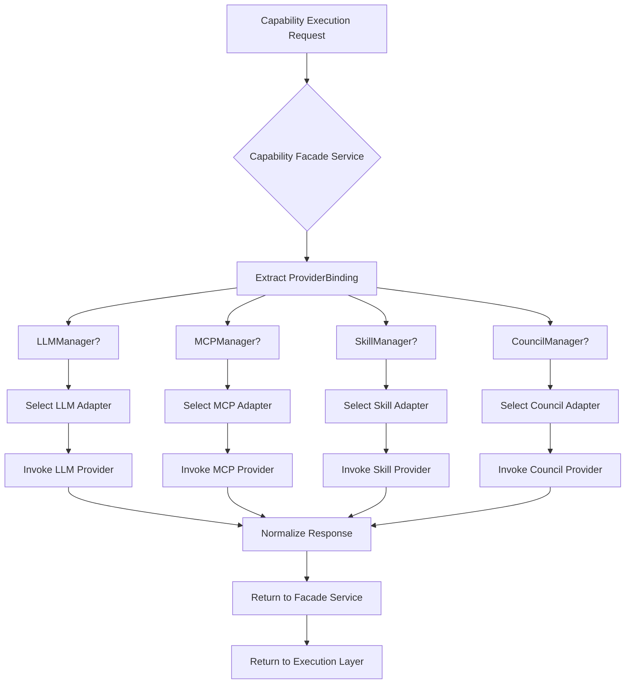
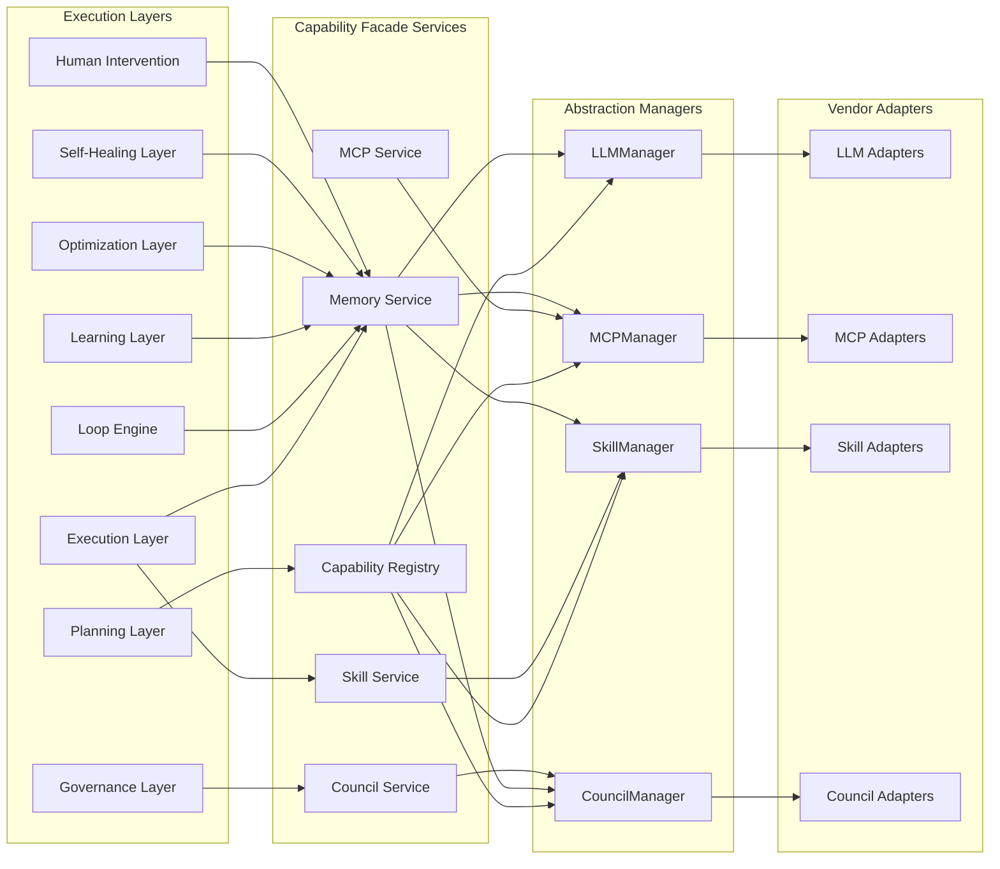
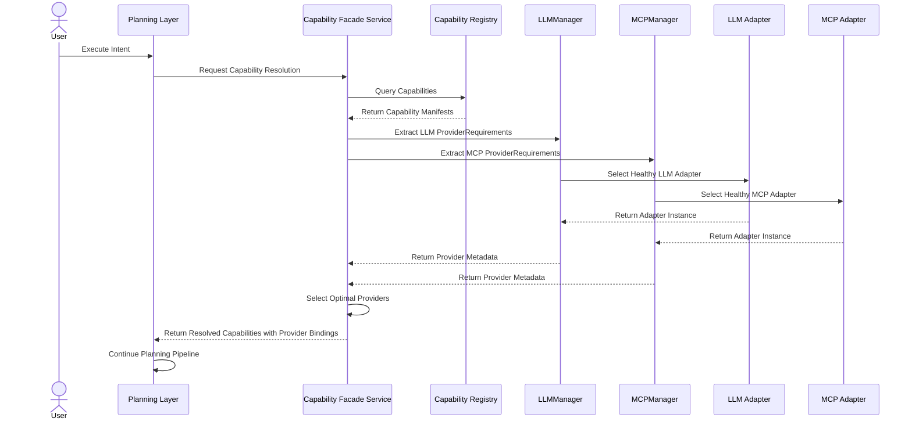
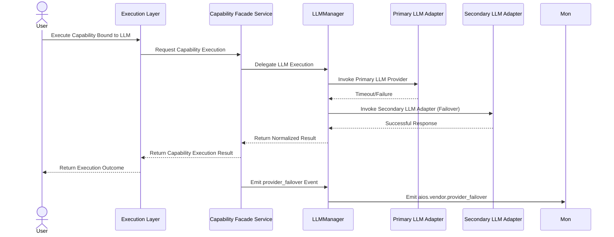

# 8.10 Vendor Independence Architecture

## 8.10.1 Overview

The Vendor Independence Architecture ensures that AI-OS execution layers operate without hard-coded dependencies on specific vendors, cloud providers, or technology stacks. This architecture enables seamless interchangeability of LLM providers, MCP servers, skills, and council implementations while maintaining deterministic behavior and zero code changes in execution layers.

Vendor independence is achieved through four abstraction boundaries managed by dedicated managers, with all provider interactions flowing through the Capability Facade Services. The architecture maintains strict separation between vendor-specific implementations and core execution logic, ensuring that provider swaps require zero execution layer code changes (INV-EXEC-RT-010).

## 8.10.2 Architecture Overview

The Vendor Independence Architecture consists of four abstraction boundaries, each managed by a dedicated service that isolates vendor-specific details from the core execution layers:

1. **LLM Abstraction Boundary** - Managed by LLMManager
2. **MCP Abstraction Boundary** - Managed by MCPManager  
3. **Skill Abstraction Boundary** - Managed by SkillManager
4. **Council Abstraction Boundary** - Managed by CouncilManager

These boundaries are implemented as pluggable adapters that conform to well-defined contracts. The core execution layers interact exclusively with these abstraction boundaries through the Capability Facade Services, never with concrete vendor implementations directly.

Provider configuration and selection occur at the Capability Manifest level through the `providerRequirement` binding, which declares vendor-specific requirements without locking the plan to a specific vendor implementation.

## 8.10.3 Internal Components

### 8.10.3.1 Abstraction Managers

| Component | Responsibility | Contract Interface |
|-----------|----------------|-------------------|
| **LLMManager** | Abstracts LLM provider interactions (local/cloud/hybrid) | `query(modelId, prompt, parameters) → response` |
| **MCPManager** | Abstracts MCP server discovery and invocation | `invoke(serverId, toolName, parameters) → result` |
| **SkillManager** | Abstracts skill loading, validation, and execution | `execute(skillId, parameters) → outcome` |
| **CouncilManager** | Abstracts council convening and deliberation | `deliberate(context, models) → verdict` |

### 8.10.3.2 Adapter Contracts

Each abstraction boundary defines a strict contract that all vendor adapters must implement:

**LLM Adapter Contract:**
- `initialize(config: LLMProviderConfig) → void`
- `shutdown() → void`
- `query(prompt: string, parameters: LLMParameters) → LLMSResponse`
- `getCapabilities() → LLMSCapabilities`
- `healthCheck() → ProviderHealthStatus`

**MCP Adapter Contract:**
- `registerServer(serverConfig: MCPServerConfig) → void`
- `deregisterServer(serverId: string) → void`
- `invoke(toolName: string, parameters: JsonValue) → InvokeResult`
- `listTools() → MCPToolDefinition[]`
- `healthCheck(serverId: string) → ProviderHealthStatus`

**Skill Adapter Contract:**
- `loadSkill(skillManifest: SkillManifest) → void`
- `unloadSkill(skillId: string) → void`
- `execute(skillId: string, parameters: JsonValue) → SkillExecutionResult`
- `validate(skillManifest: SkillManifest) → ValidationResult`
- `getMetadata(skillId: string) → SkillMetadata`

**Council Adapter Contract:**
- `convene(models: ModelConfiguration[], context: DeliberationContext) → CouncilSessionId`
- `deliberate(sessionId: CouncilSessionId, prompt: string) → CouncilVerdict`
- `adjourn(sessionId: CouncilSessionId) → void`
- `getVerdict(sessionId: CouncilSessionId) → CouncilVerdict`
- `healthCheck() → ProviderHealthStatus`

### 8.10.3.3 Provider Discovery Mechanism

Provider discovery flows through the Capability Facade Services:
1. Capability Registry queries available providers matching `matchPatterns`
2. Provider metadata includes abstraction boundary compatibility
3. Selection occurs during planning based on `providerRequirement` bindings
4. Selected provider adapter is instantiated via the appropriate manager

## 8.10.4 Responsibilities

### 8.10.4.1 Vendor Independence Architecture Responsibilities
- Maintain strict separation between vendor-specific code and core execution logic
- Provide pluggable adapter interfaces for LLM, MCP, Skill, and Council vendors
- Ensure provider interchange requires zero execution layer code changes (INV-EXEC-RT-010)
- Enforce that all provider interactions flow through Capability Facade Services
- Validate that capability manifests remain provider-agnostic (INV-PROV-4)
- Prevent external registry failures from blocking Project/Global resolution (INV-PROV-2)

### 8.10.4.2 Abstraction Manager Responsibilities
- **LLMManager**: Manage LLM provider lifecycle, query routing, and response normalization
- **MCPManager**: Handle MCP server registration, tool discovery, and invocation routing
- **SkillManager**: Oversee skill loading, validation, execution sandboxing, and metadata management
- **CouncilManager**: Coordinate council convening, deliberation processes, and verdict aggregation

## 8.10.5 Lifecycle

### 8.10.5.1 Provider Registration Lifecycle
1. **Discovery**: Provider metadata discovered via Capability Registry or external configuration
2. **Validation**: Adapter contract compliance verified via Skill/Council/LLM/MCP Managers
3. **Registration**: Provider adapter registered with appropriate manager
4. **Activation**: Provider made available for capability resolution and binding
5. **Deactivation**: Provider gracefully shut down when no longer needed
6. **Unregistration**: Provider metadata removed from registry

### 8.10.5.2 Provider Selection Lifecycle (During Planning)
1. **Requirement Declaration**: Capability manifest declares `providerRequirement` bindings
2. **Discovery Phase**: Capability Discovery Layer queries registry for matching providers
3. **Filtering Phase**: Results filtered by `providerRequirement` constraints (region, version, type)
4. **Selection Phase**: Optimal provider selected based on QoS, cost, and availability
5. **Binding Phase**: Selected provider bound to capability node in CapabilityPlan
6. **Validation Phase**: Plan validation confirms provider binding satisfies all invariants

## 8.10.6 Runtime Behaviour

### 8.10.6.1 Provider Interaction Protocol
All execution layer interactions with providers follow this protocol:
1. Execution layer requests capability execution via Capability Facade Service
2. Facade service extracts `providerRequirement` from bound capability node
3. Facade service delegates to appropriate Abstraction Manager (LLM/MCP/Skill/Council)
4. Manager selects appropriate vendor adapter based on registration and health status
5. Adapter invokes vendor-specific implementation
6. Adapter normalizes response to contract-defined format
7. Manager returns normalized result to Facade service
8. Facade service returns result to execution layer

### 8.10.6.2 Provider Failure Handling
Runtime behavior for provider failures:
1. **Transient Failures**: Retry with exponential backoff via same adapter (max 3 attempts)
2. **Persistent Failures**: Failover to next healthy provider of same type
3. **Provider Unavailable**: Trigger capability substitution heuristic via Learning Layer
4. **All Providers Unavailable**: Emit `PROVIDER_UNAVAILABLE` event → escalate to Human Intervention Layer
5. **Health Monitoring**: Continuous health checks via adapter `healthCheck()` methods

### 8.10.6.3 Deterministic Replay Support
Vendor independence maintains deterministic replay through:
- Provider selection recorded in Execution Metadata artifact
- Adapter interactions logged with request/response hashes
- Provider configuration snapshots captured at pipeline start
- Replay uses recorded provider bindings and mocks adapter interactions
- Vendor interchange during replay prohibited to maintain determinism (INV-DET-2)

## 8.10.7 Processing Pipeline

The vendor independence processing pipeline integrates with the main execution flow as follows:



### 8.10.7.1 Pipeline Stages
1. **Request Reception**: Capability Facade Service receives execution request
2. **Binding Extraction**: Extract `providerRequirement` from capability node binding
3. **Manager Routing**: Route request to appropriate Abstraction Manager based on provider type
4. **Adapter Selection**: Manager selects healthy vendor adapter matching requirements
5. **Provider Invocation**: Adapter invokes vendor-specific implementation
6. **Response Normalization**: Adapter converts vendor response to contract format
7. **Result Return**: Normalized result returned through Facade service to execution layer

## 8.10.8 Event Flows

Vendor independence architecture generates and consumes specific events:

### 8.10.8.1 Events Emitted
| Event Type | Description | Triggering Condition |
|------------|-------------|----------------------|
| `aios.vendor.provider_registered` | New provider adapter registered | Successful adapter validation and registration |
| `aios.vendor.provider_deregistered` | Provider adapter removed | Provider deactivation or uninstallation |
| `aios.vendor.provider_healthy` | Provider health check passed | Successful health check response |
| `aios.vendor.provider_unhealthy` | Provider health check failed | Failed health check or timeout |
| `aios.vendor.provider_failover` | Failover to alternate provider | Primary provider failure detected |
| `aios.vendor.selection_recorded` | Provider selection logged | Provider bound during planning phase |
| `aios.vendor.interaction_begin` | Provider interaction started | Adapter invocation commences |
| `aios.vendor.interaction_complete` | Provider interaction finished | Adapter invocation completes |
| `aios.vendor.provider_unavailable` | No healthy providers available | All providers of required type unhealthy |

### 8.10.8.2 Event Consumption
| Consuming Layer | Event Type | Purpose |
|-----------------|------------|---------|
| **Learning Layer** | `aios.vendor.provider_unhealthy` | Trigger provider substitution heuristic |
| **Self-Healing Layer** | `aios.vendor.provider_unavailable` | Initiate provider substitution healing action |
| **Optimization Layer** | `aios.vendor.provider_failover` | Record provider effectiveness metrics |
| **Planning Layer** | `aios.vendor.selection_recorded` | Update provider selection policies |
| **Human Intervention** | `aios.vendor.provider_unavailable` | Request human provider selection |

## 8.10.9 Mermaid Diagrams

### 8.10.9.1 Component Diagram


### 8.10.9.2 Sequence Diagram: Provider Selection During Planning


### 8.10.9.3 Sequence Diagram: Provider Failover at Runtime


### 8.10.9.4 State Diagram: Provider Lifecycle
```mermaid
stateDiagram-v2
    [*] --> Unregistered: Register Adapter
    Unregistered --> Validating: Validate Contract
    Validating --> Registered: Pass Validation
    Validating --> Unregistered: Fail Validation
    Registered --> Active: Activate Provider
    Active --> Healthy --> Unhealthy: Health Check Failed
    Unhealthy --> Active: Health Check Passed
    Active --> Draining: Deactivate Initiated
    Draining --> Unregistered: Complete Drain
    [*] --> Unregistered: Manual Deregistration
```

## 8.10.10 Event Specification Tables

### 8.10.10.1 Vendor Provider Registered Event
```json
{
  "$schema": "http://json-schema.org/draft-2020-12/schema#",
  "type": "object",
  "properties": {
    "eventId": {"type": "string", "format": "uuid"},
    "eventType": {"type": "string", "const": "aios.vendor.provider_registered"},
    "correlationId": {"type": "string", "format": "uuid"},
    "causationId": {"type": "string", "format": "uuid"},
    "timestamp": {"type": "string", "format": "date-time"},
    "source": {"type": "string", "enum": ["LLMManager", "MCPManager", "SkillManager", "CouncilManager"]},
    "version": {"type": "string", "pattern": "^\\d+\\.\\d+\\.\\d+$"},
    "payload": {
      "type": "object",
      "properties": {
        "providerType": {"type": "string", "enum": ["LLM", "MCP", "Skill", "Council"]},
        "providerId": {"type": "string"},
        "adapterId": {"type": "string"},
        "metadata": {
          "type": "object",
          "properties": {
            "vendorName": {"type": "string"},
            "version": {"type": "string"},
            "supportedFeatures": {"type": "array", "items": {"type": "string"}},
            "endpoint": {"type": "string", "format": "uri"}
          },
          "required": ["vendorName", "version"]
        }
      },
      "required": ["providerType", "providerId", "adapterId", "metadata"]
    }
  },
  "required": ["eventId", "eventType", "correlationId", "causationId", "timestamp", "source", "version", "payload"],
  "additionalProperties": false
}
```

### 8.10.10.2 Vendor Provider Unhealthy Event
```json
{
  "$schema": "http://json-schema.org/draft-2020-12/schema#",
  "type": "object",
  "properties": {
    "eventId": {"type": "string", "format": "uuid"},
    "eventType": {"type": "string", "const": "aios.vendor.provider_unhealthy"},
    "correlationId": {"type": "string", "format": "uuid"},
    "causationId": {"type": "string", "format": "uuid"},
    "timestamp": {"type": "string", "format": "date-time"},
    "source": {"type": "string", "enum": ["LLMManager", "MCPManager", "SkillManager", "CouncilManager"]},
    "version": {"type": "string", "pattern": "^\\d+\\.\\d+\\.\\d+$"},
    "payload": {
      "type": "object",
      "properties": {
        "providerType": {"type": "string", "enum": ["LLM", "MCP", "Skill", "Council"]},
        "providerId": {"type": "string"},
        "failureReason": {"type": "string"},
        "failureTimestamp": {"type": "string", "format": "date-time"},
        "retryCount": {"type": "integer", "minimum": 0},
        "healthCheckDetails": {
          "type": "object",
          "properties": {
            "latencyMs": {"type": "integer"},
            "errorCode": {"type": "string"},
            "errorMessage": {"type": "string"}
          }
        }
      },
      "required": ["providerType", "providerId", "failureReason", "failureTimestamp"]
    }
  },
  "required": ["eventId", "eventType", "correlationId", "causationId", "timestamp", "source", "version", "payload"],
  "additionalProperties": false
}
```

### 8.10.10.3 Vendor Selection Recorded Event
```json
{
  "$schema": "http://json-schema.org/draft-2020-12/schema#",
  "type": "object",
  "properties": {
    "eventId": {"type": "string", "format": "uuid"},
    "eventType": {"type": "string", "const": "aios.vendor.selection_recorded"},
    "correlationId": {"type": "string", "format": "uuid"},
    "causationId": {"type": "string", "format": "uuid"},
    "timestamp": {"type": "string", "format": "date-time"},
    "source": {"type": "string", "const": "Capability Planner"},
    "version": {"type": "string", "pattern": "^\\d+\\.\\d+\\.\\d+$"},
    "payload": {
      "type": "object",
      "properties": {
        "capabilityId": {"type": "string"},
        "capabilityVersion": {"type": "string"},
        "providerType": {"type": "string", "enum": ["LLM", "MCP", "Skill", "Council"]},
        "providerId": {"type": "string"},
        "selectionCriteria": {
          "type": "object",
          "properties": {
            "qosScore": {"type": "number", "minimum": 0, "maximum": 1},
            "costEstimate": {"type": "number"},
            "availability": {"type": "string", "enum": ["HIGH", "MEDIUM", "LOW"]},
            "latencyEstimateMs": {"type": "integer"}
          }
        },
        "bindingId": {"type": "string", "format": "uuid"}
      },
      "required": ["capabilityId", "capabilityVersion", "providerType", "providerId", "selectionCriteria", "bindingId"]
    }
  },
  "required": ["eventId", "eventType", "correlationId", "causationId", "timestamp", "source", "version", "payload"],
  "additionalProperties": false
}
```

## 8.10.11 JSON Schema Definitions

### 8.10.11.1 Provider Requirement Binding Schema
Referenced from CapabilityPlan node definitions:
```json
{
  "$defs": {
    "ProviderRequirement": {
      "type": "object",
      "properties": {
        "providerType": {
          "type": "string",
          "enum": ["LLM", "MCP", "Skill", "Council"],
          "description": "Type of abstraction boundary required"
        },
        "providerId": {
          "type": "string",
          "description": "Specific provider identifier (optional - enables vendor selection)"
        },
        "region": {
          "type": "string",
          "description": "Geographic region preference for data residency"
        },
        "version": {
          "type": "string",
          "pattern": "^\\d+\\.\\d+\\.\\d+$",
          "description": "Minimum acceptable provider version"
        },
        "properties": {
          "type": "object",
          "additionalProperties": true,
          "description": "Vendor-specific configuration properties"
        },
        "preferred": {
          "type": "boolean",
          "description": "Whether this provider is preferred (enables fallback)"
        },
        "required": ["providerType"]
      }
    }
  }
}
```

### 8.10.11.2 Provider Metadata Schema
```json
{
  "$defs": {
    "ProviderMetadata": {
      "type": "object",
      "properties": {
        "providerId": {"type": "string"},
        "providerType": {"type": "string", "enum": ["LLM", "MCP", "Skill", "Council"]},
        "vendorName": {"type": "string"},
        "version": {"type": "string", "pattern": "^\\d+\\.\\d+\\.\\d+$"},
        "endpoint": {"type": "string", "format": "uri"},
        "supportedFeatures": {"type": "array", "items": {"type": "string"}},
        "healthStatus": {
          "type": "string",
          "enum": ["HEALTHY", "DEGRADED", "UNHEALTHY", "UNKNOWN"]
        },
        "lastHealthCheck": {"type": "string", "format": "date-time"},
        "performanceMetrics": {
          "type": "object",
          "properties": {
            "avgLatencyMs": {"type": "number"},
            "successRate": {"type": "number", "minimum": 0, "maximum": 1},
            "errorRate": {"type": "number", "minimum": 0, "maximum": 1}
          }
        },
        "capabilities": {
          "type": "object",
          "additionalProperties": true
        }
      },
      "required": ["providerId", "providerType", "vendorName", "version", "endpoint", "healthStatus"]
    }
  }
}
```

## 8.10.12 Validation Rules

### 8.10.12.1 Provider Registration Validation
- **VAL-VEND-001**: Adapter MUST implement all methods defined in its abstraction boundary contract
- **VAL-VEND-002**: Provider metadata MUST include vendor name, version, and endpoint
- **VAL-VEND-003**: ProviderId MUST be unique within providerType
- **VAL-VEND-004**: Adapter initialization MUST NOT fail when provided with valid configuration
- **VAL-VEND-005**: Adapter healthCheck method MUST return a valid ProviderHealthStatus

### 8.10.12.2 Provider Selection Validation
- **VAL-VEND-006**: ProviderRequirement MUST specify a valid providerType
- **VAL-VEND-007**: If providerId is specified, it MUST correspond to a registered provider of the specified type
- **VAL-VEND-008**: Version constraints in providerRequirement MUST be satisfied by selected provider
- **VAL-VEND-009**: Region constraints in providerRequirement MUST be satisfied by selected provider
- **VAL-VEND-010**: Selected provider MUST satisfy all properties specified in providerRequirement

## 8.10.13 Runtime Invariants

- **INV-VEND-001**: All provider interactions MUST flow through Capability Facade Services (reinforces INV-EXEC-STR-006)
- **INV-VEND-002**: Provider selection MUST be deterministic given identical RegistrySnapshot and PolicySnapshot (reinforces INV-DET-1)
- **INV-VEND-003**: Provider interchange MUST require zero execution layer code changes (INV-EXEC-RT-010)
- **INV-VEND-004**: Provider metadata MUST remain provider-agnostic in Capability Manifests (INV-PROV-4)
- **INV-VEND-005**: External registry failures MUST NOT block Project/Global resolution (INV-PROV-2)
- **INV-VEND-006**: Provider health status MUST be monitored continuously during execution
- **INV-VEND-007**: Failover MUST preserve execution context and correlation identifiers
- **INV-VEND-008**: Provider selection during replay MUST use recorded bindings to maintain determinism

## 8.10.14 Error Handling

### 8.10.14.1 Provider Errors
- **Transient Errors** (network timeouts, temporary unavailability): 
  - RETRY with exponential backoff (max 3 attempts)
  - If all retries fail, initiate failover to healthy provider
- **Persistent Errors** (authentication failures, invalid requests):
  - IMMEDIATE failover to next healthy provider
  - If no healthy providers available, emit `PROVIDER_UNAVAILABLE` event
- **Vendor-Specific Errors**:
  - Adapter MUST normalize vendor error codes to standard AI-OS error format
  - Adapter MUST preserve original error details in normalized error for diagnostics

### 8.10.14.2 Configuration Errors
- **Invalid ProviderConfiguration**:
  - Adapter validation MUST fail fast with descriptive error
  - Configuration errors MUST not leave adapter in inconsistent state
- **Missing Provider Requirements**:
  - Planning layer MUST validate provider requirements before plan approval
  - Unsatisfiable requirements MUST result in PLANNING_FAILED event

## 8.10.15 Security Considerations

- **Provider Isolation**:
  - Each provider adapter MUST run in isolated execution context
  - Adapters MUST NOT share mutable state with execution layers
  - Adapter memory access MUST be restricted to allocated buffers
- **Data Protection**:
  - Adapters MUST encrypt sensitive data in transit using provider-native TLS
  - Adapters MUST NOT log sensitive parameters (API keys, tokens, etc.)
  - Authentication credentials MUST be obtained from secure vault, not configuration
- **Provider Vetting**:
  - All adapters MUST undergo security review before registration
  - Adapter permissions MUST be principle of least privilege
  - Adapter network access MUST be restricted to required endpoints
- **Auditability**:
  - All provider interactions MUST be logged for audit trails
  - Logs MUST include correlationId for traceability
  - Sensitive data MUST be redacted from logs

## 8.10.16 Deterministic Replay Requirements

- **Provider Binding Recording**:
  - Provider selection and binding MUST be recorded in Execution Metadata
  - Recorded data MUST include providerType, providerId, and selection criteria
- **Interaction Recording**:
  - Adapter request/response pairs MUST be logged with cryptographic hashes
  - Timestamps MUST be recorded with nanosecond precision
  - Recording MUST occur before response normalization to preserve determinism
- **Replay Execution**:
  - During replay, adapters MUST be replaced with mock implementations
  - Mocks MUST reproduce recorded responses based on recorded requests
  - Provider selection MUST use recorded bindings, not dynamic selection
- **Determinism Guarantee**:
  - Replay with identical snapshots MUST produce bit-identical adapter interactions
  - Vendor interchange during replay is PROHIBITED to maintain determinism (INV-DET-2)

## 8.10.17 Conformance Requirements

- **Adapter Conformance**:
  - All vendor adapters MUST pass contract compliance tests
  - Adopters MUST implement healthCheck method that returns within 5 seconds
  - Adapters MUST handle timeout scenarios gracefully
- **Manager Conformance**:
  - Managers MUST maintain registry of healthy adapters per providerType
  - Managers MUST implement failover logic when primary adapter fails
  - Managers MUST emit appropriate vendor events for state transitions
- **Facade Conformance**:
  - CapabilityFacadeServices MUST validate provider bindings before delegation
  - Facades MUST handle manager failures gracefully
  - Facades MUST preserve correlation and causation IDs throughout delegation

## 8.10.18 Cross References

- **INV-EXEC-STR-006**: Capability Facade Services enforce vendor abstraction boundary
- **INV-PROV-1 through INV-PROV-4**: Provider independence invariants (see Section 19)
- **INV-EXEC-RT-010**: Vendor interchange requires zero execution layer code changes
- **INV-DET-1**: Deterministic planning principle
- **INV-DET-2**: No hidden inputs in deterministic replay
- **Section 6**: Capability Model (defines providerRequirement in Capability Manifest)
- **Section 8.2**: Planning & Capability Discovery (describes provider selection during planning)
- **Section 8.3**: Execution Context & Plan Architecture (describes provider binding in CapabilityPlan)
- **Section 8.11**: Provider Selection Architecture (describes intelligent provider selection algorithms)