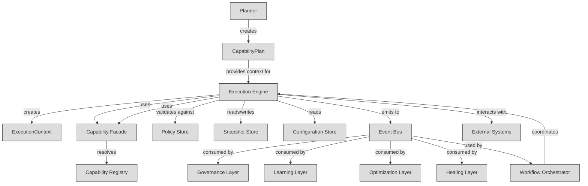
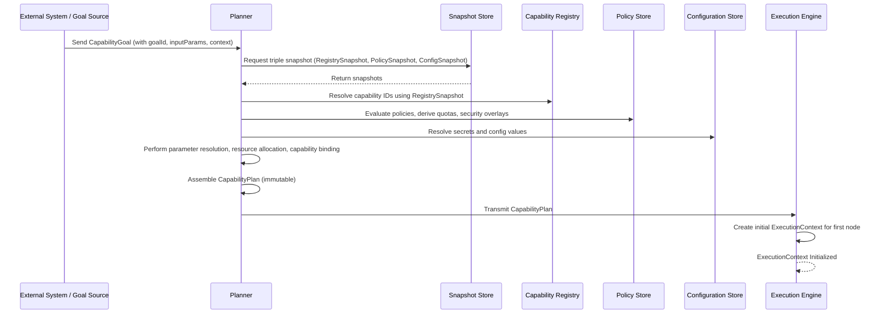
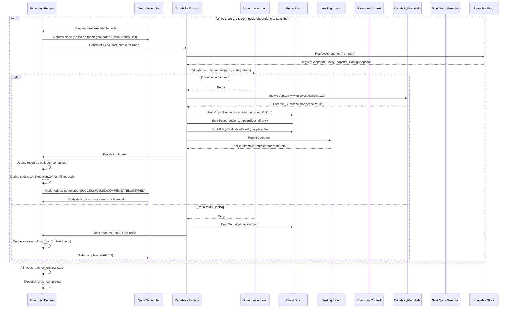
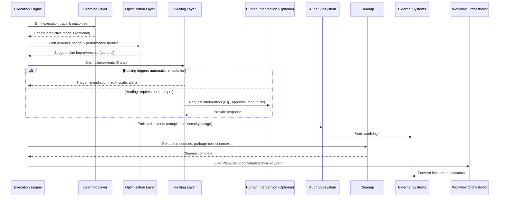

# 8.3 Execution Context & Plan Architecture

## 8.3.1 ExecutionContext Model

The ExecutionContext is an immutable snapshot that binds the CapabilityPlan to the runtime environment at the point of capability invocation. It provides scoped access to resources, configuration, and services, ensuring that each capability execution operates within a well-defined and isolated context.

The ExecutionContext contains the following elements:

- **correlationId**: UUIDv7 - A unique identifier that links all events in the execution flow.
- **planId**: UUID - References the CapabilityPlan being executed.
- **nodeId**: UUID - The current node being executed (if applicable within a node-based execution model).
- **timestamp**: ISO8601 - The time at which the ExecutionContext was created.
- **snapshotId**: UUID - References the immutable triple snapshot (RegistrySnapshot, PolicySnapshot, ConfigSnapshot) used during planning.
- **resourceBudgets**: A map of resource identifiers to allocated budgets, ensuring that resource consumption does not exceed allocated quotas.
- **componentBindings**: A map of capability identifiers to their resolved bindings, which include the concrete capability instance, merged parameters, and any resource allocations.
- **securityContext**: Contains authentication tokens, authorization policies, and security labels relevant to the execution.
- **extensionPoints**: A map of extension point identifiers to extension point definitions, allowing layers to inject behavior into the execution flow.

The ExecutionContext is immutable once created. Any state changes during execution must be captured as events and result in a new ExecutionContext for subsequent operations, preserving the immutable history of the execution.

Requirements derived from frozen decisions:
- The ExecutionContext must be immutable (derived from INV-EXEC-RT-006: state immutability during execution).
- The correlationId must be globally unique per execution flow (derived from INV-EVT-1: correlationId scoping).
- The snapshotId must reference a valid snapshot triple (derived from INV-STRUCT-2: snapshot isolation).
- Resource budgets must be enforced (derived from INV-EXEC-RT-008: resource budget enforcement).
- Component bindings must resolve to valid capabilities (derived from INV-DISC-1: resolution priority and INV-STRUCT-3: capability contract adherence).

### 8.3.1.1 Lifecycle

The ExecutionContext lifecycle is strictly bound to the execution of a single capability node within a CapabilityPlan. The lifecycle consists of the following phases:

1. **Creation**: During planning, the ExecutionEngine constructs an ExecutionContext for each capability node. The context is assembled from the snapshot referenced by the plan's snapshotId, resolved component bindings, allocated resource budgets, extracted security context, and registered extension points. A new correlationId (UUIDv7) is generated for the execution flow if not already present; otherwise, the parent flow's correlationId is inherited. A timestamp is set to the creation time (ISO8601 UTC). The planId is copied from the CapabilityPlan. The nodeId is set to the identifier of the capability node being executed.

2. **Immortal Execution**: Once created, the ExecutionContext is immutable. All reads of its fields return the values captured at creation time. During capability execution, any attempt to mutate state directly on the ExecutionContext is prohibited and will result in an IllegalStateException (see Error Handling). Instead, mutations are expressed as events emitted to the Event Bus (see Event Integration).

3. **Eventual Transition**: After the capability node completes (successfully or with error), the ExecutionEngine may derive a successor ExecutionContext for the next node in the plan. This successor context inherits the correlationId, planId, and snapshotId from the predecessor, but may update:
   - nodeId to the next node's identifier,
   - timestamp to the current time,
   - resourceBudgets based on consumed resources (see Resource Budget Management),
   - componentBindings if bindings are re-resolved (e.g., for dynamic capabilities),
   - securityContext if policies have changed (e.g., token renewal),
   - extensionPoints if extensions are dynamically reloaded.
   The derivation produces a new immutable ExecutionContext, preserving the prior context for event sourcing and audit.

4. **Discard**: Once a capability node's execution is fully completed (including any asynchronous continuations captured via events), its ExecutionContext is eligible for garbage collection. No explicit destruction is required; the context is purely a transient value object.

### 8.3.1.2 State Model

The ExecutionContext is modeled as an immutable, structurally shared data structure. Its constituent maps (resourceBudgets, componentBindings, extensionPoints) are implemented as immutable hash maps (e.g., Hamt, HashArrayMappedTrie) to enable efficient derivation of successor contexts with minimal allocation. Each field is final and deeply immutable.

- **correlationId**: UUIDv7, guaranteeing temporal ordering and uniqueness across distributed systems.
- **planId**: UUID, referencing the originating CapabilityPlan.
- **nodeId**: UUID or null; null indicates a plan-level context (e.g., plan initialization) rather than a specific node.
- **timestamp**: ISO8601 string in UTC format (YYYY-MM-DDTHH:mm:ss.SSSZ).
- **snapshotId**: UUID referencing an immutable triple snapshot stored in the Snapshot Store.
- **resourceBudgets**: Map<ResourceId, ResourceBudget> where ResourceBudget contains allocated units, consumed units, and renewal period.
- **componentBindings**: Map<CapabilityId, ComponentBinding> where ComponentBinding contains:
  - instance: concrete Capability implementation,
  - parameters: merged input parameters (overlays static plan parameters with runtime overrides),
  - allocations: sub-allocations of resourceBudgets specific to this capability.
- **securityContext**: immutable structure containing:
  - authToken: opaque token or claims set,
  - policies: slice of PolicySnapshot relevant to the capability,
  - labels: map of security labels (e.g., sensitivity, compartment).
- **extensionPoints**: Map<ExtensionPointId, ExtensionPoint> where ExtensionPoint contains:
  - id: unique identifier,
  - plugins: ordered list of ExtensionPlugin references,
  - contract: interface definition the plugins must implement.

The immutability of the ExecutionContext ensures that reasoning about execution behavior is deterministic and that events can be replayed to reconstruct state.

### 8.3.1.3 Context Composition

Composition of an ExecutionContext occurs during the planning phase, specifically when the Planner transforms a CapabilityPlan into an executable set of nodes. For each capability node, the Planner performs:

1. **Snapshot Resolution**: Resolves the plan's snapshotId to the concrete triple snapshot (RegistrySnapshot, PolicySnapshot, ConfigSnapshot) from the Snapshot Store.
2. **Capability Binding**: For each capability identifier in the node, resolves the capability to a concrete instance via the Capability Registry (using the RegistrySnapshot), merges parameters (static from plan, dynamic from preceding events), and allocates resource budgets based on the node's resource requests and the PolicySnapshot's quotas.
3. **Budget Allocation**: Allocates resource budgets from the global resource pool according to the node's requested quotas, the PolicySnapshot's entitlements, and any parent-node remaining budgets. Allocations are recorded as ResourceBudget entries.
4. **Security Context Extraction**: Extracts relevant authentication tokens, applicable policies, and security labels from the PolicySnapshot and any ambient security context (e.g., ambient token from the invocation context).
5. **Extension Point Registration**: Collects all extension points declared by the capability's contract and any contributing layers (Governance, Healing, Learning, Optimization) and instantiates the corresponding ExtensionPlugin instances.
6. **Context Assembly**: Assigns correlationId (inheriting from parent node if within a flow, else generating new), planId, nodeId, timestamp, and snapshots the assembled maps into the new ExecutionContext.

The composition process is deterministic given identical inputs (plan, snapshotId, ambient context) and produces an ExecutionContext that satisfies all validation rules (see Validation Rules).

### 8.3.1.4 Snapshot Binding

The snapshotId in an ExecutionContext is a reference to an immutable triple snapshot comprising:
- **RegistrySnapshot**: a consistent view of the Capability Registry at the time of planning,
- **PolicySnapshot**: a consistent view of the Governance Policy store at the time of planning,
- **ConfigSnapshot**: a consistent view of the Dynamic Configuration store at the time of planning.

Binding occurs as follows:
- The Planner, before constructing any ExecutionContext, acquires a triple snapshot from the Snapshot Store using a snapshot identifier derived from the plan's source (e.g., the plan's own snapshotId or a globally incremented version). This snapshot is stored immutably and referenced by snapshotId.
- During capability binding (see Context Composition), the RegistrySnapshot is used to resolve capability identifiers to concrete implementations, ensuring that the resolution is isolated from concurrent registry updates.
- The PolicySnapshot is used to evaluate authorization constraints, allocate resource quotas, and derive security policies.
- The ConfigSnapshot is used to resolve configuration values referenced in capability parameters or extension point configurations.

Because the snapshot is immutable, the ExecutionContext guarantees that all resolution decisions are based on a consistent view of the system state, satisfying INV-STRUCT-2 (snapshot isolation). The snapshotId can be used later for audit, replay, or debugging to reconstruct the exact environment in which a capability executed.

### 8.3.1.5 Resource Budget Management

Resource budgets within an ExecutionContext enforce quotas and prevent resource exhaustion, aligning with the Resource Governance and Healing mechanisms.

Each ResourceBudget entry contains:
- **id**: ResourceId (e.g., "cpu-milliseconds", "memory-bytes", "io-bytes-per-second", custom metric),
- **allocated**: the number of units granted for this execution scope,
- **consumed**: the number of units consumed so far (updated via events),
- **renewalPeriod**: optional duration after which the budget replenishes (for streaming resources),
- **borrowed**: units borrowed from parent or peer contexts (if permitted by policy).

Budget enforcement occurs as follows:
- Before capability invocation, the Planner verifies that requested resources do not exceed allocated budgets (INV-EXEC-RT-008).
- During execution, capabilities report resource consumption via ResourceConsumptionEvent events (see Event Integration). The ExecutionEngine updates the consumed field in the successor ExecutionContext's resourceBudgets.
- If consumption would exceed allocated budget, the capability invocation is preempted, a BudgetExceededEvent is emitted, and the Governance layer may trigger healing actions (e.g., throttling, scaling, or termination).
- At context derivation, any unconsumed budget may be:
  - carried forward to child nodes (if policy permits),
  - returned to the parent pool,
  - or forfeited (depending on renewalPolicy).

Budgets are hierarchical: a parent node's budget constrains the sum of its children's allocations. The root context's budgets are derived from the system's global resource limits and the PolicySnapshot's entitlements.

### 8.3.1.6 Governance Integration

Governance policies are embedded into the ExecutionContext via the PolicySnapshot and are enforced throughout the capability execution lifecycle.

The securityContext includes:
- **authToken**: obtained from the Authentication Service at planning time (or delegated from the invoker's token),
- **policies**: the subset of PolicySnapshot rules that apply to the capability's identity, resource requests, and requested actions,
- **labels**: security labels (e.g., classification, compartment) derived from the capability's security profile and the input data labels.

During capability execution:
- The Capability Facade intercepts all capability invocations and checks the securityContext policies before delegating to the concrete capability instance. Policies may include:
  - **Authentication**: verify token validity and map to principal,
  - **Authorization**: check principal against required permissions (RBAC, ABAC),
  - **Data Flow**: ensure label compatibility between input and output,
  - **Rate Limiting**: enforce request-rate limits using token buckets derived from policy,
  - **Audit Logging**: mandate emission of specific audit events.
- If a policy violation is detected, the Facade throws a SecurityException, which is caught by the ExecutionEngine and converted into a SecurityViolationEvent (see Event Integration). The Governance layer may then initiate remediation (e.g., token revocation, isolation).

Governance policies are immutable within the ExecutionContext, guaranteeing consistent enforcement. Any policy updates take effect only in newly created ExecutionContexts (i.e., after a snapshot refresh).

### 8.3.1.7 Event Integration

The ExecutionContext is the primary source of correlation for event emission and enables deterministic event sourcing.

Each ExecutionContext carries a correlationId that must be attached to all events emitted during the execution of its associated capability node. The ExecutionEngine ensures that:
- Every capability invocation (success, failure, or async pause) generates a corresponding CapabilityInvocationEvent with the context's correlationId,
- Resource consumption is reported via ResourceConsumptionEvent events carrying the correlationId and delta consumption,
- Policy evaluations emit PolicyEvaluationEvent (pass/fail) with the correlationId,
- Extension point invocations emit ExtensionPointEvent (before/after, result, error) with the correlationId,
- Custom events emitted by capabilities must include the correlationId (enforced by the Capability Facade).

Events are published to the Event Bus, which uses the correlationId to group events into execution flows. This enables:
- **Traceability**: reconstructing the exact sequence of events for a given capability execution,
- **Replay**: rebuilding state by replaying events in correlationId order,
- **Monitoring**: real-time dashboards tracking flow latency, error rates, resource usage,
- **Healing**: detection of anomalous patterns (e.g., repeated budget exceedance) triggering automatic remediation.

Because the ExecutionContext is immutable, events emitted during its lifetime are guaranteed to reflect the exact state snapshot under which the capability executed, satisfying INV-EVT-1 (correlationId scoping) and enabling audit integrity.

### 8.3.1.8 Capability Binding

ComponentBindings resolve logical capability identifiers to concrete, executable instances with resolved parameters and resource allocations.

The binding process, executed during planning (see Context Composition), consists of:

1. **Resolution**: Using the RegistrySnapshot, locate the CapabilityDefinition corresponding to the capabilityId. If multiple versions exist, apply the version selection rule from the PolicySnapshot (e.g., latest compatible, pinned version, or policy-selected). If no matching definition exists, resolution fails and planning aborts with a ResolutionException.
2. **Instantiation**: Instantiate the Capability implementation via the Capability Facade, which supplies:
   - the resolved CapabilityDefinition,
   - the merged parameter set (see Parameter Merging below),
   - the allocated ResourceBudget slice,
   - the securityContext,
   - the extensionPoints map,
   - the correlationId and nodeId for telemetry.
3. **Parameter Merging**: Parameters are merged in precedence order:
   - static parameters defined in the CapabilityPlan node,
   - dynamic parameters injected from preceding events (e.g., output of a prior node),
   - overrides from the PolicySocket (e.g., feature flags, tuning parameters),
   - defaults from the CapabilityDefinition.
   The merge is immutable and produces a new parameter map stored in the ComponentBinding.
4. **Resource Allocation**: Slice the node's allocated resourceBudgets according to the capability's declared resource requirements (from its CapabilityDefinition). If the declaration exceeds the node's allocation, binding fails.
5. **Binding Validation**: Validate that the bound capability adheres to its contract (INV-STRUCT-3) and that the securityContext satisfies the capability's declared security requirements (e.g., minimum clearance, required roles).

The resulting ComponentBinding is immutable and stored in the componentBindings map. During execution, the Capability Facade retrieves the binding and invokes the capability instance via its standardized interface (invoke(context: ExecutionContext): Promise<Outcome>).

### 8.3.1.9 Security Context

The securityContext encapsulates all security-related information required to enforce authentication, authorization, and data confidentiality policies during capability execution.

It is derived from the PolicySnapshot and ambient security context at planning time and contains:

- **authToken**: a cryptographically signed token (e.g., JWT, opaque session token) representing the authenticated principal. Tokens are validated at planning time against the Authentication Service's public keys or introspection endpoint; the resulting claims (sub, iss, aud, exp, scopes, custom claims) are stored.
- **policies**: an ordered list of PolicyRule objects extracted from the PolicySnapshot that are applicable to the capability's identity, requested resources, and requested actions. Each PolicyRule includes:
  - effect (Permit/Deny),
  - resource matching clauses,
  - action matching clauses,
  - condition expressions (e.g., time-of-day, risk score),
  - obligations (e.g., encrypt output, notify auditor).
- **labels**: a map of security labels (e.g., sensitivity: PUBLIC|CONFIDENTIAL|SECRET, compartment: FINANCE|HR) applied to the capability's inputs and outputs. Labels are derived from:
  - the capability's declared input/output label constraints,
  - the input data labels supplied via preceding events or parameters,
  - the default labels from the PolicySocket's data labeling policy.

During capability invocation, the Capability Facade performs the following enforcement steps in order:
1. **Authentication Validation**: verify that the authToken is not expired and is issued by a trusted authority; extract principal identity and scopes.
2. **Authorization Evaluation**: evaluate the ordered policies using a standard policy engine (e.g., OPA-like). The first matching rule determines the outcome; if no rule matches, the default-deny policy applies. A Deny result results in a SecurityException.
3. **Label Flow Check**: ensure that the union of input labels does not exceed the output label constraints (no write-down, no write-up unless explicitly permitted by policy).
4. **Obligation Execution**: if the permitting policy includes obligations, the Facade ensures they are met before and/or after capability invocation (e.g., encrypting results, triggering audit logs).

All security decisions are immutable within the ExecutionContext, guaranteeing consistent enforcement. Any change to security policies or tokens requires a new snapshot and thus a new ExecutionContext.

### 8.3.1.10 Extension Points

Extension points allow orthogonal capabilities (e.g., logging, tracing, metrics, security transforms, retry policies) to be injected into the execution flow without modifying the core capability logic.

Each ExtensionPoint in the extensionPoints map contains:
- **id**: a unique identifier (string) matching the extension point name declared in the capability's contract or contributed by a layer,
- **plugins**: an ordered list of ExtensionPlugin references, each referencing a concrete plugin implementation registered in the Extension Registry (part of the RegistrySnapshot),
- **contract**: the interface definition that plugins must implement (e.g., `BeforeInvoke(context): Promise<void>`, `AfterInvoke(context, result): Promise<Result>`).

During capability execution, the Capability Facade invokes the extension point pipeline as follows:
1. **Before Phase**: for each plugin in order, invoke its `before` hook (if implemented). If any hook throws an exception, the chain is aborted and a ExtensionPointException is emitted.
2. **Core Invocation**: invoke the capability instance's main `invoke` method.
3. **After Phase**: for each plugin in reverse order, invoke its `after` hook (if implemented). The hook receives the result (or error) from the core invocation and may transform it, suppress it, or emit side‑effects.
4. **Finally Phase**: for each plugin in order, invoke its `finally` hook (if implemented) for cleanup.

Extension plugins are resolved from the RegistrySnapshot, ensuring that the same plugin version is used throughout the execution context. Extension point contracts are versioned; mismatches cause binding failure.

Extension points are the primary mechanism by which cross‑cutting concerns (Governance, Healing, Learning, Optimization) inject behavior into capability execution without tight coupling.

### 8.3.1.11 Runtime Invariants

The ExecutionContext must satisfy the following invariants at all times. Violations constitute a software defect and must be caught by validation or runtime checks.

- **INV-EXEC-RT-001 (Immutability)**: After construction, no field of the ExecutionContext may be mutated. Attempted mutation throws IllegalStateException.
- **INV-EXEC-RT-002 (CorrelationId Uniqueness)**: The correlationId must be a UUIDv7 and must be unique across all concurrent execution flows within the observable system scope.
- **INV-EXEC-RT-003 (Snapshot Validity)**: The snapshotId must reference a triple snapshot that exists in the Snapshot Store and has not been garbage‑collected.
- **INV-EXEC-RT-004 (Resource Budget Non‑Negative)**: For every ResourceBudget in resourceBudgets, allocated ≥ 0 and consumed ≥ 0, and consumed ≤ allocated (unless borrowing is explicitly permitted by policy, in which case borrowed ≥ 0 and allocated + borrowed ≥ consumed).
- **INV-EXEC-RT-005 (Component Binding Validity)**: Every entry in componentBindings must map to a CapabilityId that resolves to a valid CapabilityDefinition in the RegistrySnapshot, and the bound instance must satisfy the CapabilityDefinition's contract (INV-STRUCT-3).
- **INV-EXEC-RT-006 (Security Context Consistency)**: The authToken in securityContext must be valid at the time of context creation (not expired, issued by trusted issuer). The policies list must be a subset of the PolicySnapshot's rules applicable to the capability's identity and actions.
- **INV-EXEC-RT-007 (Extension Point Contract Compliance)**: Every ExtensionPlugin listed in extensionPoints.plugins must implement the contract interface specified by the corresponding ExtensionPoint.
- **INV-EXEC-RT-008 (Timestamp Monotonicity)**: For any derived successor ExecutionContext, its timestamp must be chronologically after (or equal to) the parent context's timestamp (to support replay ordering).
- **INV-EXEC-RT-009 (NodeId Consistency)**: If nodeId is non‑null, it must match the identifier of the capability node that created the context; if null, the context represents a plan‑level scope (e.g., initialization or finalization).
- **INV-EXEC-RT-010 (CorrelationId Inheritance)**: If a ExecutionContext is derived from a parent context (same planId), its correlationId must be identical to the parent's correlationId.

These invariants are derived from and consistent with the invariants defined in Parts 1‑7 (e.g., INV-EXEC-RT-006 reflects INV-EXEC-RT-006 from the Execution Engine chapter, INV-EXEC-RT-008 reflects INV-EXEC-RT-008, etc.).

### 8.3.1.12 Error Handling

Errors occurring during the lifecycle of an ExecutionContext are captured as events and may trigger healing or compensation actions.

Error sources include:
- **Binding Failures**: resolution, instantiation, or validation failures during Context Composition. These throw a BindingException and prevent context creation; no ExecutionContext is emitted.
- **Invocation Failures**: exceptions thrown by the capability instance or its extension point hooks. The ExecutionEngine catches these exceptions and converts them into an InvocationFailureEvent.
- **Policy Violations**: detected by the Capability Facade during security enforcement (see Security Context). These throw a SecurityException and are converted into a SecurityViolationEvent.
- **Budget Exceedance**: detected when a ResourceConsumptionEvent would cause consumed > allocated (or borrowed limit). The ExecutionEngine prevents the excess consumption, emits a BudgetExceededEvent, and may throttle or abort the capability.
- **Extension Point Errors**: exceptions thrown by extension point hooks are caught and converted into ExtensionPointErrorEvent.
- **System Failures**: unexpected errors (e.g., NPE, out‑of‑memory) are caught at the ExecutionEngine boundary and emitted as SystemFailureEvent.

All error events include:
- correlationId (from the ExecutionContext),
- nodeId (if applicable),
- timestamp (event time),
- errorType (qualified class name or error code),
- message (human‑readable description),
- stackTrace (optional, configured via policy),
- contextual data (e.g., resource budget overrun amount, failed policy ID).

The Event Bus routes error events to the Healing and Observability subsystems. Healing policies (from the PolicySnapshot) may automatically:
- retry the capability with back‑off,
- failover to a redundant instance,
- escalate to an operator,
- or terminate the execution flow.

Because the ExecutionContext is immutable, error events do not alter the context itself; instead, a successor context may be created with adjusted budgets, different bindings, or alternative workflow paths (e.g., compensation actions) as dictated by the healing policy.

### 8.3.1.13 Validation Rules

An ExecutionContext is considered valid only if all of the following validation rules evaluate to true. Validation occurs:
- immediately after construction (construction‑time validation),
- before each capability invocation (runtime guard),
- and optionally during periodic audits.

Validation Rules:
1. **VR-EXEC-VAL-001**: correlationId is not null and conforms to UUIDv7 variant and version.
2. **VR-EXEC-VAL-002**: planId is not null.
3. **VR-EXEC-VAL-003**: timestamp conforms to ISO‑8601 UTC format and is parseable to an Instant.
4. **VR-EXEC-VAL-004**: snapshotId is not null and resolves to a triple snapshot in the Snapshot Store whose version is ≥ the plan's snapshot version (ensuring no stale snapshot).
5. **VR-EXEC-VAL-005**: resourceBudgets map is not null; for each entry:
   - key (ResourceId) is not null,
   - allocated ≥ 0,
   - consumed ≥ 0,
   - if borrowing is disabled by policy, consumed ≤ allocated; if enabled, consumed ≤ allocated + borrowed and borrowed ≥ 0.
6. **VR-EXEC-VAL-006**: componentBindings map is not null; for each entry:
   - key (CapabilityId) is not null,
   - value (ComponentBinding) instance is not null,
   - value.parameters is not null,
   - value.instance implements the CapabilityDefinition's interface contract.
7. **VR-EXEC-VAL-007**: securityContext is not null; authToken is not null or empty; policies list may be empty but each element is not null; labels map may be null or empty.
8. **VR-EXEC-VAL-008**: extensionPoints map is not null; for each entry:
   - key (ExtensionPointId) is not null,
   - value (ExtensionPoint) plugins list may be empty but each plugin reference resolves to a concrete ExtensionPlugin in the RegistrySnapshot,
   - value.contract is not null and matches the expected interface signature.
9. **VR-EXEC-VAL-009**: If nodeId is not null, it must match the capability node identifier that originated this context (enforced by the Planner).
10. **VR-EXEC-VAL-010**: For any derived successor context, the correlationId must equal the parent's correlationId (inheritance rule).
11. **VR-EXEC-VAL-011**: For any derived successor context, the timestamp must be ≥ the parent's timestamp (monotonicity).
12. **VR-EXEC-VAL-012**: The sum of allocated resources across all root‑level contexts must not exceed the global resource caps defined in the System PolicySnapshot (enforced at system startup, not per‑context).

Validation failures result in an InvalidContextException, which is treated as a binding failure (see Error Handling) and prevents the execution flow from proceeding.

## 8.3.2 CapabilityPlan Model

The CapabilityPlan is an immutable, directed acyclic graph (DAG) that defines a set of capability invocations, their dependencies, parameter bindings, resource requirements, and governance constraints. It is the output of the Planning phase and the input to the Execution Engine. A CapabilityPlan binds a requested goal to a concrete, executable flow that is isolated, reproducible, and governable.

A CapabilityPlan contains the following elements:

- **planId**: UUID - A globally unique identifier for this plan.
- **snapshotId**: UUID - Reference to the immutable triple snapshot (RegistrySnapshot, PolicySnapshot, ConfigSnapshot) used during planning.
- **correlationId**: UUIDv7 - Correlation identifier inherited from the requesting flow or newly generated for this plan’s execution flow.
- **timestamp**: ISO8601 - Time at which the plan was finalized.
- **goalRef**: URI or CapabilityGoalReference - Reference to the original goal or request that triggered planning.
- **nodes**: Ordered list of CapabilityPlanNode - The vertices of the execution DAG.
- **edges**: Ordered list of CapabilityPlanEdge - Directed edges representing data and control dependencies.
- **parameterBindings**: Map<ParameterId, ParameterBinding> - Global parameter bindings available to any node (e.g., constants, request inputs).
- **resourceAllocations**: Map<ResourceId, ResourceAllocation> - Total resource allocations reserved for the entire plan (sum of node-level allocations plus any plan‑level overhead).
- **policyOverlay**: PolicyOverlay - Set of policy overrides or augmentations applied during planning (e.g., feature flags, quota adjustments).
- **metadata**: Map<String, String> - Optional key‑value pairs for instrumentation, tracing, or business context.

The CapabilityPlan is immutable once created by the Planner. Any attempt to mutate its structure after creation results in an IllegalStateException. All mutations during execution are expressed as events (see Event Integration) and, if necessary, result in a derived successor plan (see Planning Lifecycle).

Requirements derived from frozen decisions:
- The CapabilityPlan must be immutable after construction (derived from PLAN-IMMUT-001: plan immutability after planning).
- The plan must be a directed acyclic graph (DAG) (derived from PLAN-DAG-001: acyclic dependency graph).
- All capability references in nodes must be resolvable against the snapshot’s RegistrySnapshot (derived from PLAN-RESOLVE-001: capability resolvability).
- Resource allocations must not exceed the quotas defined in the PolicySnapshot (derived from PLAN-RESOURCE-001: resource quota compliance).
- The plan must satisfy all applicable governance policies in the PolicySnapshot (derived from PLAN-GOVERN-001: policy compliance).
- The plan’s correlationId must be a UUIDv7 and must match the requesting flow’s correlationId if one was supplied (derived from INV-EVT-1: correlationId scoping).
- The snapshotId must reference a valid, non‑garbage‑collected triple snapshot (derived from INV-STRUCT-2: snapshot isolation).

### 8.3.2.1 CapabilityPlan Overview

A CapabilityPlan represents a concrete, executable workflow derived from a high‑level CapabilityGoal or external request. It is produced by the Planner component, which consults the Capability Registry, Policy Store, Dynamic Configuration, and current system state (via a snapshot) to resolve capabilities, bind parameters, allocate resources, and enforce governance constraints.

The plan is designed to be:
- **Deterministic**: Given identical inputs (goal, snapshot, request context) the Planner will always produce the same plan.
- **Serializable**: The plan can be serialized to a canonical form (e.g., JSON) for persistence, transmission, or replay.
- **Audit‑ready**: Every element of the plan references immutable snapshots, enabling full reproducibility of the execution context.
- **Governed**: Governance policies are evaluated during planning and baked into the plan (resource quotas, security constraints, entitlements).
- **Executable**: The Execution Engine can traverse the plan, constructing an ExecutionContext for each node and invoking the bound capability via the Capability Facade.

### 8.3.2.2 Plan Structure

The internal structure of a CapabilityPlan is a directed acyclic graph where:

- **Vertices (Nodes)** represent individual capability invocations. Each node contains:
  - **nodeId**: UUID – unique identifier within the plan.
  - **capabilityId**: CapabilityId – logical identifier of the capability to invoke.
  - **versionConstraint**: VersionRange – optional version constraint applied during capability resolution (defaults to latest compatible per policy).
  - **parameterBindings**: Map<ParameterId, ParameterBinding> – node‑specific overrides or bindings (overrides global bindings).
  - **resourceRequests**: Map<ResourceId, ResourceQuantity> – amount of each resource the node requests for its execution slice.
  - **dependencies**: Set<NodeId> – set of upstream node identifiers that must complete before this node may start (control dependencies).
  - **dataDependencies**: Map<DataParameterId, SourceReference> – mapping of input parameters to their source (either a global parameter, a constant, or the output of a predecessor node).
  - **timeout**: Duration – maximum allowed execution time for this node (optional; default from policy).
  - **retryPolicy**: RetryPolicy – retry behavior for this node (see Retry & Recovery Semantics).
  - **securityOverlay**: SecurityOverlay – optional node‑level security constraints (e.g., additional required roles, label constraints).
  - **extensionPointOverrides**: Map<ExtensionPointId, ExtensionPluginOverride> – optional overrides for extension point plugins (e.g., plug a custom logger for this node only).
  - **metadata**: Map<String, String> – node‑level annotations.

- **Edges (Directed Arcs)** represent explicit control dependencies. An edge from node A to node B indicates that B must not start until A has reached a terminal state (success, failure, or compensated state per its retry policy). Data dependencies are modeled separately via the node’s dataDependencies map and do not impose ordering beyond what is implied by control edges (i.e., data can be forwarded as soon as the producer node completes, regardless of consumer’s control dependencies, unless a control edge also exists).

- **ParameterBindings** (global) define values that are available to any node unless overridden at the node level. Sources include:
  - **Literal**: a constant value.
  - **GoalInput**: a parameter from the original goal/request.
  - **SecretReference**: a reference to a secret stored in the Secret Store (resolved at planning time using the ConfigSnapshot).
  - **ConfigReference**: a reference to a dynamic configuration entry (resolved using the ConfigSnapshot).
  - **PolicyOverride**: a value supplied by the PolicyOverlay (used for feature flags, tuning parameters).

- **ResourceAllocations** represent the total quantity of each resource that the planner has reserved for the plan’s execution. These are derived from summing node‑level resourceRequests, applying any plan‑level overhead factors (e.g., for orchestration), and ensuring the sum does not exceed the quotas granted by the PolicySnapshot.

- **PolicyOverlay** captures any policy adjustments made during planning (e.g., temporary quota increases, feature flag toggles) that are layered atop the base PolicySnapshot. The overlay is immutable and is merged with the base snapshot during capability binding and validation.

### 8.3.2.3 Node Model

The CapabilityPlanNode is the atomic unit of execution. Its immutable fields are:

| Field                 | Type                               | Description                                                                                                             |
|-----------------------|------------------------------------|-------------------------------------------------------------------------------------------------------------------------|
| nodeId                | UUID                               | Unique identifier within the plan.                                                                                      |
| capabilityId          | CapabilityId                       | Logical identifier of the capability to invoke (e.g., “db.query”, “http.get”).                                         |
| versionConstraint     | VersionRange (optional)            | Desired version range; if absent, the policy‑driven latest compatible version is used.                                 |
| parameterBindings     | Map<ParameterId, ParameterBinding> | Node‑specific parameter bindings (overlays global bindings).                                                            |
| resourceRequests      | Map<ResourceId, ResourceQuantity>  | Requested quantity of each resource for this node’s execution slice.                                                    |
| dependencies          | Set<NodeId>                        | Set of upstream nodeIds that must finish before this node may start (control dependency).                              |
| dataDependencies      | Map<DataParameterId, SourceReference> | Mapping of input parameter names to their source (literal, goal input, secret, config, or output of another node). |
| timeout               | Duration (optional)                | Maximum execution time; if exceeded, a TimeoutEvent is emitted and the node is treated as failed unless retried.       |
| retryPolicy           | RetryPolicy                        | Defines retry behavior (count, backoff, jitter, retry‑on‑error conditions).                                            |
| securityOverlay       | SecurityOverlay (optional)         | Additional security constraints (e.g., required roles, label constraints) applied atop the policy snapshot.            |
| extensionPointOverrides| Map<ExtensionPointId, ExtensionPluginOverride> | Optional per‑node overrides for extension point plugins.                                                            |
| metadata              | Map<String, String>                | Arbitrary key‑value pairs for tracing, debugging, or business metadata.                                                |

A ParameterBinding consists of:
- **source**: SourceEnum {LITERAL, GOAL_INPUT, SECRET_REF, CONFIG_REF, NODE_OUTPUT, POLICY_OVERRIDE}
- **literalValue**: JSON value (if source = LITERAL)
- **goalInputKey**: String (if source = GOAL_INPUT)
- **secretRef**: SecretReference (if source = SECRET_REF)
- **configRef**: ConfigReference (if source = CONFIG_REF)
- **sourceNodeId**: NodeId (if source = NODE_OUTPUT)
- **sourceParameter**: String (the output parameter name from the source node)
- **policyKey**: String (if source = POLICY_OVERRIDE)

A SourceReference is a discriminated union mirroring the above.

A ResourceQuantity contains:
- **amount**: numeric value (integer or decimal as appropriate for the resource type)
- **unit**: String (e.g., "millis", "bytes", "req/sec") – interpreted by the Resource Governor.

A RetryPolicy contains:
- **maxAttempts**: integer ≥ 1 (initial attempt plus retries)
- **backoff**: BackoffPolicy (fixed, exponential, jittered exponential, etc.)
- **retryOn**: Set<ErrorCondition> – which error types trigger a retry (e.g., Timeout, TransientFault, BudgetExceeded)
- **jitter**: boolean – whether to apply jitter to backoff intervals
- **initialDelay**: Duration – delay before first retry
- **maxDelay**: Duration – upper bound on backoff delay

A SecurityOverlay contains:
- **requiredRoles**: Set<String>
- **requiredScopes**: Set<String>
- **labelConstraints**: Map<LabelName, AllowedValues> – e.g., sensitivity ≤ CONFIDENTIAL
- **oblivious**: boolean – if true, the node runs without propagating caller’s security context (use with care).

An ExtensionPluginOverride contains:
- **pluginId**: ExtensionPluginId – identifier of the plugin to use (must be present in the RegistrySnapshot)
- **configuration**: Map<String, JSON> – plugin‑specific configuration (validated against the plugin’s schema).

### 8.3.2.4 Dependency Graph

The CapabilityPlan’s dependency graph is a directed acyclic graph (DAG) comprising:

- **Control Dependencies** (edges): enforce ordering constraints. A node may only begin execution when all its control dependencies have reached a terminal state (as defined by their retry policies). The graph must contain no directed cycles; the Planner validates this during plan composition (see Plan Validation).

- **Data Dependencies** (dataDependencies map): specify where each input parameter of a node is sourced. These do not impose ordering constraints beyond the natural constraint that data cannot be consumed before it is produced. The Execution Engine resolves data dependencies by awaiting the completion of the source node (if any) and then extracting the indicated output parameter. If the source is a literal, goal input, secret, or config, the value is available immediately at planning time.

- **Implicit Dependencies**: The Execution Engine may derive additional ordering constraints from resource contracts (e.g., a node requiring a exclusive lock on a resource must wait until the lock is released). Such constraints are expressed as explicit control edges during planning when the Planner detects resource contention requiring serialization.

The graph is stored in two parallel structures for efficient lookup:
- **outgoingEdges**: Map<NodeId, List<Edge>> – for forward traversal during execution.
- **incomingEdges**: Map<NodeId, List<Edge>> – for dependency counting during topological sort.

The Planner produces a topological order of nodes (a linearization) that respects all control dependencies. This order is stored as an ordered list in the plan’s `nodes` field and is used by the Execution Engine for iterative execution, though the engine may also execute nodes in parallel as long as dependencies are satisfied.

### 8.3.2.5 Planning Lifecycle

The planning lifecycle transforms a high‑level goal into an executable CapabilityPlan. It consists of the following stages:

1. **Goal Reception**: The Planner receives a `CapabilityGoal` (or an external request) containing:
   - **goalId**: UUID – identifier of the goal.
   - **desiredOutcome**: CapabilityOutcomeSpec – specification of the desired result (e.g., “get user profile for userId=123”).
   - **inputParameters**: Map<ParameterId, ParameterValue> – initial parameters supplied by the caller.
   - **context**: optional metadata (correlationId, timestamps, security context, etc.).
   - **optionalConstraints**: e.g., maximum latency, budget caps, preferred versions.

2. **Snapshot Acquisition**: The Planner obtains a triple snapshot (RegistrySnapshot, PolicySnapshot, ConfigSnapshot) from the Snapshot Store. The snapshot identifier is typically derived from:
   - The goal’s requested snapshotId (if provided),
   - Or a globally incremented version vector ensuring a globally consistent view.
   The snapshotId is stored in the resulting plan.

3. **Capability Decomposition**: The Planner consults the Knowledge/Planning subsystem (which may utilize the Learning and Optimization components) to decompose the goal into a set of required capability invocations. This step produces a preliminary set of nodes with:
   - Tentative capabilityId and versionConstraint,
   - Preliminary data dependencies (mapping goal inputs and intermediate data to node inputs),
   - Preliminary resource requests (based on capability profiles and historical usage).

4. **Parameter Resolution**: For each node, the Planner resolves its parameterBindings by:
   - Applying global parameterBindings (literals, goal inputs, secrets, config, policy overrides),
   - Resolving NODE_OUTPUT sources by linking to the output parameters of predecessor nodes (based on data dependencies),
   - Applying any node‑level overrides.
   Unresolvable parameters cause planning to fail with a ParameterResolutionException.

5. **Capability Resolution**: For each node, the Planner resolves the capabilityId to a concrete CapabilityDefinition using the RegistrySnapshot and the node’s versionConstraint, applying the version selection policy (latest compatible, pinned, or policy‑selected). If no matching definition exists, planning fails with a CapabilityResolutionException.

6. **Resource Allocation**: The Planner sums the resourceRequests of all nodes, applies any plan‑level overhead factor (e.g., for orchestration, checkpointing), and checks the totals against the quotas and entitlements in the PolicySnapshot. If the requests exceed the available quota, the Planner may:
   - Attempt to reschedule or substitute lower‑cost implementations (guided by Optimization),
   - Request a quota increase via the Governance interface (if allowed),
   - Or fail with a ResourceQuotaExceededException.
   Successful allocation produces the plan’s `resourceAllocations` map and updates each node’s effective allocated budget (stored internally for later use in ExecutionContext creation).

7. **Governance & Policy Overlay Application**: The Planner evaluates all applicable policies from the PolicySnapshot (and any dynamic policy overrides from the Goal or request context) to:
   - Derive security overlays (required roles, scopes, label constraints) for each node,
   - Determine applicable retry policies (default vs. overridden),
   - Select or override extension point plugins,
   - Inject policy‑derived parameter values (feature flags, tuning parameters),
   - Attach any obligations (e.g., audit logging, encryption) as node metadata or extension point configurations.
   The resulting overlays are stored in the plan’s `policyOverlay` and per‑node `securityOverlay`, `retryPolicy`, `extensionPointOverrides`, etc.

8. **Plan Assembly & Validation**: The Planner assembles the nodes, edges (control and data dependencies), global parameterBindings, resourceAllocations, and metadata into a CapabilityPlan instance. It then runs the full validation suite (see Plan Validation). If validation passes, the plan is marked immutable and returned to the caller (typically the Execution Engine or a Workflow Orchestrator).

9. **Plan Publication**: The final plan is published to the Plan Registry (if persistence is required) and transmitted to the Execution Engine for execution. The plan’s correlationId is set to the goal’s correlationId (if supplied) or a newly generated UUIDv7, ensuring traceability from request through planning to execution.

If any stage fails, the Planner emits a PlanningFailedEvent via the Event Bus (see Event Integration) containing the failure reason, the goalId, and the snapshotId used, then aborts.

### 8.3.2.6 Plan Composition

Plan composition refers to the act of assembling the validated components (nodes, edges, bindings, allocations, overlays) into the final immutable CapabilityPlan object. The Planner performs composition as follows:

- **Node List Ordering**: Nodes are topologically sorted according to their control dependencies. The resulting list is stored in the `nodes` field in order. This order is deterministic (tie‑broken by nodeId lexicographically) to guarantee replayability.
- **Edge Construction**: For each declared control dependency (node A must precede node B), an Edge object is created with `sourceNodeId = A`, `targetNodeId = B`. The collection of edges is stored in the `edges` field.
- **Parameter Binding Resolution**: Global parameterBindings are resolved first (literals, goal inputs, secrets, config, policy overrides). These are stored in the plan’s `parameterBindings` map. Node‑level bindings are stored within each node; they may reference global bindings (via inheritance) or override them.
- **Resource Allocation Aggregation**: The Planner computes the total allocation for each resource by summing the node‑level requests (after applying any node‑level policy overrides) and adding any plan‑level overhead (e.g., for transaction logs, heartbeat messaging). The result is stored in `resourceAllocations`. Each node also stores its allocated slice (derived from its request and the plan‑level allocation policy) for later use when constructing ExecutionContexts.
- **Overlay Integration**: Policy overlays and node‑specific overlays (security, retry, extension points) are merged with the base PolicySnapshot to produce the effective policy set used during capability binding and validation.
- **Immutability Finalization**: Once all components are assembled, the Planner calls `Object.freeze` (deep freeze) on the entire object graph, ensuring that any attempt to mutate a field throws an exception. The plan’s `planId`, `snapshotId`, `correlationId`, and `timestamp` are set at this point and never change.

The composition algorithm is deterministic: given the same inputs (goal, snapshot, context) it will produce a bit‑identical plan (assuming stable sorting and map ordering).

### 8.3.2.7 Parameter Resolution

Parameter resolution is the process of determining the concrete value for each input parameter of each capability node at plan time. The Planner follows a strict precedence order (highest to lowest priority) when multiple sources apply:

1. **Node‑Level Literal Override** – a literal value supplied directly in the node’s `parameterBindings` with source = LITERAL.
2. **Node‑Level Goal Input** – a value sourced from the original goal’s inputParameters.
3. **Node‑Level Secret Reference** – a secret retrieved from the Secret Store using the ConfigSnapshot (secret values are fetched at plan time and treated as immutable literals within the plan).
4. **Node‑Level Config Reference** – a value read from the Dynamic Configuration store via the ConfigSnapshot.
5. **Node‑Level Policy Override** – a value supplied by the PolicyOverlay (feature flag, tuning knob).
6. **Node‑Level Node Output** – the value of an output parameter from a predecessor node, as specified by the node’s `dataDependencies`.
7. **Global Parameter Binding** – if the node does not provide a binding for a given parameter, the Planner falls back to the plan’s global `parameterBindings`, applying the same precedence order (literal > goal input > secret > config > policy > node output). Global node‑output bindings are not allowed (to prevent cycles); only literals, goal inputs, secrets, config, and policy overrides may appear globally.
8. **Capability Default** – if no binding is found at any layer, the Planner uses the default value declared in the CapabilityDefinition (if any).
9. **Required Parameter Failure** – if the parameter is marked as required in the CapabilityDefinition and no value can be resolved, planning fails with a MissingParameterException.

All resolved values are deeply frozen (immutable) and stored as JSON values within theParameterBinding objects. Secrets are never logged or exposed in plain text; they are replaced with a secure token that the Capability Facade resolves at execution time using the same ConfigSnapshot (ensuring the secret remains bound to the snapshot).

The resolver guarantees idempotence: resolving the same parameter under the same snapshot and goal yields identical bytes.

### 8.3.2.8 Capability Resolution

Capability resolution binds each node’s logical `capabilityId` (and optional `versionConstraint`) to a concrete `CapabilityDefinition` from the RegistrySnapshot. The steps are:

1. **Candidate Selection**: Using the RegistrySnapshot, locate all CapabilityDefinitions whose `id` matches the node’s `capabilityId`.
2. **Version Filtering**: Apply the node’s `versionConstraint` (if present) to filter candidates to those whose `version` falls within the range. If no constraint is supplied, use the version selection rule from the PolicySnapshot (e.g., “latest compatible”, “pinned version X.Y.Z”, or “policy‑selected based on labels”).
3. **Policy‑Based Selection**: If multiple candidates remain after version filtering, apply any policy‑based selection rules (e.g., prefer implementations with certain security labels, performance profiles, or tenant‑specific allow‑lists). The PolicySnapshot may contain a `capabilitySelectionPolicy` map that scores candidates.
4. **Selection Failure**: If zero candidates remain, throw a CapabilityResolutionException indicating the capability could not be resolved under the given snapshot and constraints.
5. **Binding**: Select the winning CapabilityDefinition and record:
   - The reference to the definition (immutable),
   - The resolved version,
   - Any definition‑level defaults that will be merged with parameter bindings during ExecutionContext creation.

The selected CapabilityDefinition is immutable for the lifetime of the plan (due to snapshot immutability). The Planner also validates that the definition’s contract (interface, version, security requirements) is compatible with the node’s declared `securityOverlay` and `extensionPointOverrides`; incompatibility results in a CapabilityBindingException.

### 8.3.2.9 Plan Validation

Before a CapabilityPlan is considered ready for execution, the Planner runs a comprehensive validation pass. Validation is divided into static (compile‑time) and semi‑static (snapshot‑time) checks. All validation rules must pass; any failure results in a PlanningValidationException with a detailed error code and message.

**Static Checks** (independent of snapshots):
- **VPL-001**: `planId` is not null and is a valid UUID.
- **VPL-002**: `nodes` list is not empty (unless the goal explicitly allows an empty plan, which is modeled as a no‑op capability).
- **VPL-003**: No duplicate `nodeId` values exist within the `nodes` list.
- **VPL-004**: The graph defined by `nodes` and `edges` is acyclic (checked via topological sort; cycles raise VPL-004).
- **VPL-005**: Every `nodeId` referenced in `edges` exists in the `nodes` list.
- **VPL-006**: Every `nodeId` referenced in a node’s `dataDependencies.sourceNodeId` exists in the `nodes` list.
- **VPL-007**: No `dataDependencies` creates a self‑loop (sourceNodeId == nodeId) unless the capability explicitly declares it as an allowed pattern (rare, marked in the capability’s metadata).
- **VPL-008**: All `parameterBindings` (global and node‑level) have a non‑null `source` field.
- **VPL-009**: All `resourceRequests` have non‑negative quantities.
- **VPL-010**: All `timeout` values, if present, are non‑negative durations.
- **VPL-011**: All `retryPolicy.maxAttempts` values are ≥ 1.
- **VPL-012**: All `retryPolicy.backoff` parameters are valid (non‑negative initialDelay, maxDelay ≥ initialDelay if specified).
- **VPL-013**: All `securityOverlay` fields contain valid values (roles and scopes known to the IAM system, label values within allowed enumerations).
- **VPL-014**: All `extensionPointOverrides.pluginId` values resolve to a plugin definition in the RegistrySnapshot (checked after snapshot binding).

**Snapshot‑Dependent Checks** (require the snapshots bound to the plan):
- **VPS-001**: `snapshotId` is not null and resolves to a triple snapshot in the Snapshot Store that has not been garbage‑collected.
- **VPS-002**: For every node, the `capabilityId` (with its `versionConstraint`) resolves to at least one CapabilityDefinition in the RegistrySnapshot.
- **VPS-003**: For every node, the resolved CapabilityDefinition’s contract is satisfied by the node’s `parameterBindings` (after resolution) – i.e., all required parameters are present and of correct type.
- **VPS-004**: For every node, the resolved CapabilityDefinition’s security requirements (minimum roles, scopes, label constraints) are satisfied by the node’s `securityOverlay` merged with the PolicySnapshot’s default security policy.
- **VPS-005**: For every node, the node’s `resourceRequests` do not exceed the per‑node quotas defined in the PolicySnapshot (if any); if they do, planning fails unless the PolicyOverlay grants an override.
- **VPS-006**: The sum of all nodes’ resourceRequests (plus any plan‑level overhead) does not exceed the total quotas granted by the PolicySnapshot for the plan’s principal/target (VPS-006 corresponds to PLAN-RESOURCE-001).
- **VPS-007**: All `parameterBindings` that reference SECRET_REF or CONFIG_REF resolve to actual entries in the respective stores (as viewed through the snapshots).
- **VPS-008**: All `extensionPointOverrides` point to plugins that are present and compatible in the RegistrySnapshot (plugin contract matches the extension point contract declared by the capability).
- **VPS-009**: The Plan’s `policyOverlay` does not conflict with immutable rules in the PolicySnapshot (e.g., attempting to lower a mandatory minimum password length); conflicts cause VPS-009.
- **VPS-010**: The Plan’s `correlationId` (if supplied) is a UUIDv7; if not supplied, a freshly generated UUIDv7 is assigned (this is considered a validation‑time assignment, not a failure).

Validation is run after snapshot binding and capability resolution so that it can leverage the resolved definitions and values. The Planner caches validation results to avoid re‑validation if the plan is serialized and deserialized (provided the snapshotId remains valid).

### 8.3.2.10 Execution Semantics

The Execution Engine consumes a validated, immutable CapabilityPlan and drives its execution according to the following semantics:

- **Execution Model**: The engine performs a topological traversal of the plan’s node list (which is already topologically sorted). For each node in order, it determines whether the node’s control dependencies have been satisfied. A dependency is satisfied when the predecessor node has reached a terminal state as defined by its retry policy:
  - **SUCCESS**: the node completed without error and exhausted its retry attempts (or succeeded on first attempt).
  - **FAILURE_EXHAUSTED**: the node exhausted all retry attempts without success.
  - **COMPENSATED**: the node failed but a compensation action (defined via the node’s retryPolicy or an attached extension) succeeded and is considered an acceptable terminal state for dependents.
  - **SKIPPED**: the node was marked as skip‑able (via a policy or extension) and its dependencies are considered satisfied without execution.

- If dependencies are not satisfied, the engine waits (asynchronously) for the relevant nodes to complete. The waiting mechanism is non‑blocking; the engine may schedule other ready nodes in parallel.

- **Concurrency**: Nodes whose dependencies are satisfied may be executed concurrently, up to a limit defined by the global `concurrencyLimit` in the PolicySnapshot (or a system‑wide default). The engine uses a semaphore‑based scheduler to enforce this limit.

- **ExecutionContext Creation**: Immediately before invoking a node’s capability, the Engine constructs an ExecutionContext for that node:
  - `correlationId`: inherited from the plan’s correlationId (or newly generated if the plan had none).
  - `planId`: copied from the plan.
  - `nodeId`: set to the node’s nodeId.
  - `timestamp`: set to the current UTC time (ISO8601).
  - `snapshotId`: copied from the plan’s snapshotId (ensuring the node sees the exact same snapshots as used during planning).
  - `resourceBudgets`: derived from the node’s allocated resource slice (see Resource Planning) – each resource’s allocated amount is the amount granted to the node by the planner; consumed starts at 0.
  - `componentBindings`: built by:
    - Resolving the node’s capabilityId to the concrete CapabilityDefinition (using the RegistrySnapshot),
    - Merging parameters: global parameterBindings → node‑level parameterBindings → capability defaults (immutable merge),
    - Instantiating the capability via the CapabilityFacade, supplying the resolved definition, merged parameters, the node’s resource slice, the node’s securityOverlay, the node’s extensionPointOverrides, and the correlationId/nodeId for telemetry.
  - `securityContext`: assembled from the Plan’s policyOverlay and the node’s securityOverlay, combined with the base PolicySnapshot’s security rules, and the ambient authToken (if any) from the planning context (or obtained via delegation).
  - `extensionPoints`: populated from the RegistrySnapshot, applying any node‑level extensionPointOverrides; plugins are instantiated with their configuration (if any).

- **Invocation**: The Engine calls the capability’s `invoke(context: ExecutionContext): Promise<Outcome>` method via the CapabilityFacade. The facade:
  - Executes authentication and authorization checks using the securityContext,
  - Runs the configured extension point “before” hooks,
  - Delegates to the concrete capability instance,
  - Runs the configured extension point “after” hooks (receiving the outcome or error),
  - Runs the configured extension point “finally” hooks,
  - Returns the final outcome (or throws an exception which is caught and transformed into an InvocationFailureEvent).

- **Outcome Handling**: The outcome (success, failure with error, or async pause) is used to:
  - Update the node’s execution state,
  - Emit a CapabilityInvocationEvent (success/failure) with the node’s correlationId,
  - If the outcome is a success, extract any output parameters declared by the capability and make them available to dependent nodes via their dataDependencies,
  - If the outcome is an error, consult the node’s retryPolicy:
    - If retries remain, schedule a retry after the backoff delay,
    - If no retries remain, mark the node as FAILED_EXHAUSTED and emit a NodeFailedEvent (or a CompensationTriggeredEvent if a compensation action is defined).
  - If the outcome indicates an async pause (e.g., the capability returns a promise that resolves later), the engine treats the node as “in‑progress” and does not consider its dependencies satisfied for downstream nodes until the promise resolves (or fails). The node’s ExecutionContext is retained until resolution.

- **Completion**: When all nodes have reached a terminal state (SUCCESS, FAILED_EXHAUSTED, COMPENSATED, or SKIPPED), the plan execution ends. The Engine emits a PlanCompletedEvent (or PlanFailedEvent if any node ended in FAILED_EXHAUSTED without compensation) containing the final outcome, aggregated resource consumption, and a list of emitted events.

- **Determinism**: Given the same plan (same snapshotId, same goal inputs, same secrets/config values) and the same deterministic capabilities (i.e., capabilities that are pure functions of their inputs and the ExecutionContext), the execution will produce identical event sequences and final state. Non‑deterministic capabilities (e.g., those relying on real‑time clocks or random numbers) must declare their non‑determinism in their metadata; the Execution Engine will still produce an execution trace, but the exact output values may vary.

### 8.3.2.11 Retry & Recovery Semantics

Retry and recovery behavior is governed declaratively by each node’s `retryPolicy` and optionally augmented by extension points (e.g., a circuit‑breaker plugin). The semantics are:

- **Attempt Counting**: The initial invocation counts as attempt 1. Each subsequent retry increments the attempt counter. The total number of attempts allowed is `maxAttempts`.
- **Backoff Calculation**: After a failed attempt, the engine waits for a delay computed by the `backoff` policy:
  - **Fixed**: `delay = baseDelay`
  - **Linear**: `delay = baseAttempt * multiplier`
  - **Exponential**: `delay = baseDelay * (multiplier ^ (attempt-1))`
  - **Jittered Exponential**: same as exponential, then apply a random factor in the range `[1 - jitterFraction, 1 + jitterFraction]`.
  - `initialDelay` specifies the delay before the first retry (often 0 for immediate retry).
  - `maxDelay` caps the backoff delay; if the computed delay exceeds `maxDelay`, `maxDelay` is used.
- **Retry Decision**: After each failure, the engine checks whether the error type (or error classification) is present in the node’s `retryOn` set. If not, retries cease immediately and the node is considered failed.
- **Retryable Errors**: The set `retryOn` may include:
  - `TIMEOUT` – the node exceeded its timeout,
  - `TRANSIENT_FAULT` – errors marked as transient by the capability (e.g., network glitch, DB deadlock),
  - `BUDGET_EXCEEDED` – a ResourceConsumptionEvent would exceed the node’s allocated budget (only retriable if the policy allows borrowing or if the budget can be replenished via a renewal period),
  - `AUTHORIZATION_FAILURE` – only retriable if the policy permits re‑authentication (e.g., token refresh),
  - `DEADLETTER` – typically not retriable (treated as fatal).
  The policy may also include a Boolean `retryOnAnyFailure` flag that overrides the set.
- **Compensation Actions**: If a node declares a compensation action (via an extension point or a dedicated `compensation` field in its metadata), and the node exhausts its retries without success, the Engine may invoke the compensation action instead of marking the node as failed. Compensation is treated as an alternate terminal state (COMPENSATED) that satisfies dependents (if the policy permits). Compensation actions are themselves capabilities that run within their own ExecutionContext (derived from the parent node’s context, with adjusted resource budget and possibly different security overlay).
- **Circuit Breaker Integration**: An extension point (e.g., a resilience plugin) may short‑circuit further attempts if a failure threshold is met, regardless of the node’s retryPolicy. The plugin can force a transition to OPEN state, causing subsequent invocations to fail fast with a CircuitBreakerOpenError.
- **Dead Letter Queue**: After all retries (and possible compensation) are exhausted, if the node remains in a failed state, the Engine publishes a DeadLetterEvent containing the node’s identifier, the final error, and all consumed resource metrics. This event can be consumed by manual operators or automated remediation workflows.
- **Idempotency Considerations**: The planner marks a node as `idempotent: true` in its metadata if the capability is known to be safe to retry. The Engine may then apply more aggressive retry policies (e.g., shorter backoff) for idempotent nodes. Non‑idempotent nodes default to conservative retry settings (often `maxAttempts = 1` unless explicitly overridden).

All retry and recovery actions emit appropriate events (RetryAttempted, RetrySucceeded, CompensationTriggered, CircuitBreakerOpened, DeadLetterEnqueued) to the Event Bus for observability and healing.

### 8.3.2.12 Governance Integration

Governance policies are evaluated and incorporated during planning and enforced at runtime. The integration points are:

- **During Planning**:
  - **PolicySnapshot Extraction**: The Planner pulls the relevant slice of the PolicySnapshot that applies to the principal (user/service account) making the request, the target resources, and the requested capabilities.
  - **Entitlement & Quota Derivation**: From the PolicySnapshot, the Planner derives:
    - Maximum allowable quantities for each resource type (quotas),
    - Allowed capability versions and implementations,
    - Required security roles/scopes,
    - Data labeling constraints,
    - Retry policy defaults,
    - Extension point defaults or mandates,
    - Feature flag values (used as parameter overrides).
  - **Policy Overlay Application**: If the request contains explicit overrides (e.g., “override timeout to 30s”, “use premium tier”), the Planner creates a PolicyOverlay that layers atop the base PolicySnapshot. Overlays are validated against immutable policy constraints (e.g., cannot lower a minimum password length). The resulting effective policy is used for capability resolution, resource allocation, and security context creation.
  - **Security Context Construction**: The Planner builds each node’s `securityContext` by combining:
    - The authenticated principal (from the request context or a delegated token),
    - The applicable policy roles/scopes,
    - Any node‑level securityOverlay (e.g., additional required roles for a privileged operation),
    - Label constraints derived from the capability’s declared I/O labels and the input data labels.
  - **Audit and Obligation Injection**: If the policy mandates auditing for a capability, the Planner adds an audit extension point configuration (or marks the node for automatic audit logging). If the policy mandates encryption of outputs, an encryption extension point is configured.

- **During Execution**:
  - The CapabilityFacade (see Section 8.3.1.8) performs the actual enforcement steps:
    1. **Authentication Validation** – validates the authToken in the ExecutionContext’s securityContext.
    2. **Authorization Evaluation** – evaluates the applicable policy rules (permits/denies) using the policy engine; a deny throws a SecurityException.
    3. **Data Flow Label Check** – ensures that the union of input labels does not violate output label constraints (no‑write‑down unless explicitly permitted).
    4. **Obligation Execution** – if the permitting policy includes obligations (e.g., encrypt result, emit audit log), the Facade ensures they are met before and/or after capability invocation.
  - All governance decisions are logged as PolicyEvaluationEvent(s) (see Event Integration) with the correlationId from the ExecutionContext.
  - If a policy violation is detected, the Facade throws a SecurityException, which is caught by the ExecutionEngine and turned into a SecurityViolationEvent. The Healing subsystem may then initiate remediation (e.g., token refresh, step‑up authentication, or terminating the flow).

- **Immutability Guarantees**: Because the Planning phase snapshots the PolicySnapshot and incorporates any overlays into the plan, the governance constraints applicable to a node are fixed for the duration of its execution. Any change to the underlying policies (e.g., a quota increase) requires a new plan (i.e., a new snapshotId) to take effect. This satisfies the governance immutability requirement (PLAN-GOV-IMMUT-001).

### 8.3.2.13 Event Integration

The CapabilityPlan model is deeply integrated with the Event Bus to provide observability, traceability, debugging, and healing. All significant lifecycle transitions emit events that contain the plan’s correlationId (or the node’s correlationId when applicable) to enable correlation across services.

**Event Types Emitted by the Planner**:
- **PlanningStartedEvent** – contains goalId, correlationId (if provided), timestamp.
- **PlanningCompletedEvent** – contains planId, snapshotId, resourceAllocations, validation status, timestamp.
- **PlanningFailedEvent** – contains goalId, errorType, message, snapshotId (used), timestamp.

**Event Types Emitted by the Execution Engine (per node)**:
- **CapabilityInvocationStartedEvent** – nodeId, attempt number, timestamp.
- **CapabilityInvocationSucceededEvent** – nodeId, attempt number, output parameters (if configured for output), resource consumption delta, timestamp.
- **CapabilityInvocationFailedEvent** – nodeId, attempt number, errorType, message, resource consumption delta, timestamp.
- **RetryAttemptedEvent** – nodeId, attempt number, delay applied, timestamp.
- **RetrySucceededEvent** – nodeId, attempt number after retry, timestamp.
- **CompensationTriggeredEvent** – nodeId, compensation capabilityId, timestamp.
- **CompensationSucceededEvent** – nodeId, compensation outcome, timestamp.
- **CompensationFailedEvent** – nodeId, compensation error, timestamp.
- **CircuitBreakerOpenedEvent** – nodeId, threshold exceeded, timestamp.
- **CircuitBreakerClosedEvent** – nodeId, timeout elapsed, timestamp.
- **TimeoutExceededEvent** – nodeId, configured timeout, actual elapsed time, timestamp.
- **BudgetExceededEvent** – nodeId, resourceId, allocated, consumed, excess amount, timestamp.
- **NodeSkippedEvent** – nodeId, reason (policy/extension), timestamp.
- **NodeCompletedEvent** – nodeId, final state (SUCCEEDED, FAILED, COMPENSATED, SKIPPED), total attempts, total resource consumption, timestamp.
- **DeadLetterEnqueuedEvent** – nodeId, final error, payload (serialized parameters/context), timestamp.

**Event Types Emitted for the Plan as a Whole**:
- **PlanExecutionStartedEvent** – planId, correlationId, timestamp.
- **PlanExecutionCompletedEvent** – planId, correlationId, outcome (SUCCEEDED/FAILED), total resource consumption, duration, timestamp.
- **PlanExecutionFailedEvent** – planId, correlationId, failureReason (first node that failed without compensation), timestamp.

All events are published to the Event Bus with the following standardized attributes:
- `eventId`: UUIDv7,
- `planId`: UUID,
- `correlationId`: UUIDv7 (inherited from the plan or node),
- `timestamp`: ISO8601 UTC timestamp,
- `source`: `"PLANNER"` or `"EXECUTION_ENGINE"`,
- additional domain‑specific fields as listed above.

The Event Bus guarantees at‑least‑once delivery and ordering per correlationId (when using a partitioned keyed by correlationId). Consumers (Healing, Monitoring, Auditing, Replay) can subscribe to these streams to react constructively.

**Event‑Driven Replay**: Because each event carries the immutable correlationId and the plan’s snapshotId, a replay engine can reconstruct the exact sequence of ExecutionContexts and outcomes by replaying events in order, re‑instantiating the same ExecutionContexts (using the same snapshots and resolved bindings) and verifying deterministic behavior.

### 8.3.2.14 Snapshot Binding

Snapshot binding is the mechanism by which a CapabilityPlan locks in a consistent view of the system’s mutable registries and configuration at the point of planning. The plan stores a single `snapshotId` that references an immutable triple snapshot comprising three independently versioned snapshots:

- **RegistrySnapshot**: an immutable view of the Capability Registry (capability definitions, versions, contracts, implementation metadata, extension point registrations).
- **PolicySnapshot**: an immutable view of the Governance Policy Store (roles, permissions, quotas, entitlements, label policies, retry policies, extension point mandates, feature flags, audit obligations).
- **ConfigSnapshot**: an immutable view of the Dynamic Configuration Store (feature toggles, secret values, endpoint URLs, tuning parameters, environment‑specific flags).

**Binding Process**:
1. At the start of planning, the Planner requests a triple snapshot from the Snapshot Store. The snapshot identifier may be:
   - Explicitly supplied by the caller (e.g., a request includes a `snapshotId` to enforce reproducibility),
   - Derived from a global monotonic version vector (e.g., the latest committed snapshot at the time of request),
   - Or derived from the goal’s context (e.g., a tenant‑specific snapshot version).
2. The Planner verifies that the snapshot exists and has not been garbage‑collected (snapshot TTL is typically long enough to cover the expected planning‑to‑execution latency, but may be short‑lived for highly volatile environments).
3. All subsequent resolution steps (capability resolution, parameter resolution, resource quota checks, policy evaluation, extension point selection) are performed exclusively against the three snapshots referenced by the `snapshotId`. This guarantees that:
   - Capability selections cannot change due to concurrent registry updates,
   - Resource quotas cannot shift due to concurrent policy updates,
   - Secret and config values remain constant,
   - Extension plugin versions are fixed.
4. The `snapshotId` is stored verbatim in the CapabilityPlan and is copied into every ExecutionContext created for the plan’s nodes (see ExecutionContext Model, section 8.3.1.4). Thus, each node’s execution observes exactly the same snapshot that was used during planning.
5. After plan execution completes, the snapshot may be retained for audit/replay purposes or allowed to be garbage‑collected according to the Snapshot Store’s retention policy.

**Immutability Guarantee**: Because the triple snapshot is immutable, any attempt to mutate the underlying registries, policies, or configuration during the execution of a plan will not affect that plan’s behavior. This satisfies the snapshot isolation requirement (INV-STRUCT-2) and enables reproducible debugging, compliance auditing, and safe retries.

### 8.3.2.15 Resource Planning

Resource planning determines how much of each managed resource (CPU, memory, I/O, licenses, custom quotas) is reserved for each node and for the plan as a whole, ensuring that the plan can be executed without exceeding the entitlements granted by the governing policy.

**Input Data**:
- Each node’s `resourceRequests` map (quantity per resource type),
- The PolicySnapshot’s `resourceQuotas` map (maximum allowed consumption per principal, per time window, or per transaction),
- The PolicySnapshot’s `resourceRenewal` maps (for renewable resources like API call quotas that replenish per minute/hour),
- Optional `resourceOverhead` factors supplied by the Orchestration layer (to account for framework‑level consumption such as message passing, checkpointing, logging).

**Algorithmic Steps** (performed by the Planner during the Resource Allocation stage):

1. **Normalize Requests**: Convert each node’s request into a canonical unit (e.g., milliseconds for CPU, bytes for memory, requests/sec for rate‑based resources). If a node expresses a range (min/max), the Planner uses the maximum for reservation (conservative) unless the policy specifies elastic bursting (see step 4).
2. **Apply Node‑Level Policy Overlays**: If the node’s `securityOverlay` or any extension (e.g., a throttle plugin) specifies a resource cap or floor, adjust the request accordingly (subject to not falling below the node’s declared minimum if any).
3. **Sum Raw Requests**: For each resource type, compute the sum of all nodes’ (potentially adjusted) requests.
4. **Apply Plan‑Level Overhead**: Multiply each total by the plan‑level overhead factor (default 1.0; may be >1 to account for framework costs, or <1 if the platform can share resources across nodes, e.g., shared memory buffers). The result is the **gross allocation** required for the plan.
5. **Check Against Quotas**: Compare the gross allocation for each resource to the quota granted by the PolicySnapshot for the requesting principal (or the effective principal after delegation). If any resource’s gross allocation exceeds its quota:
   - If the policy permits **elastic bursting** and the request includes a `burstAllowed` flag, the Planner may allow a temporary excess up to the burst limit (also defined in the policy).
   - If the policy allows **borrowing** from a parent plan or from a shared pool (e.g., in hierarchical quota models), the Planner attempts to allocate from the available pool.
   - Otherwise, the Planner attempts **optimization**:
     * Substitute lower‑cost implementations of capabilities (guided by the Optimization component),
     * Apply load‑shedding or downgrade hints (if the capability exposes QoS levels),
     * Split the plan into multiple sub‑plans (if the goal allows partial fulfillment).
   - If none of the above suffice, planning fails with a ResourceQuotaExceededException.
6. **Allocate to Nodes**: Once the total allocation is deemed permissible, the Planner splits the granted quota among nodes proportionally to their (adjusted) requests, respecting any minimums and maximums. The result is stored as:
   - The plan’s `resourceAllocations` map (total granted per resource),
   - Each node’s internal `allocatedBudget` map (used when constructing ExecutionContexts).
7. **Record Renewal Information**: For renewable resources, the Planner notes the renewal period (from the PolicySnapshot) and associates it with the plan’s allocation so that the Execution Engine can compute when the budget replenishes (if the execution spans multiple renewal windows). If the execution is expected to exceed a single renewal window, the Planner may:
   - Split the plan into stages that fit within a window,
   - Or request a **lease** extension via the Governance interface (if supported).

**Runtime Enforcement**:
- The Execution Engine, before invoking a node, verifies that the node’s `resourceBudgets` (reflecting its allocated budget) are sufficient for the node’s estimated per‑invocation cost (if the capability provides a cost estimate; otherwise, it proceeds and relies on actual consumption reporting).
- During execution, capabilities report actual resource consumption via `ResourceConsumptionEvent`s (see Event Integration). The Engine updates the `consumed` field in the successor ExecutionContext’s resourceBudgets.
- If a consumption report would cause `consumed` to exceed `allocated` (and borrowing is not permitted for that resource), the Engine:
  - Prevents the excess consumption (the capability is throttled or returns an error),
  - Emits a `BudgetExceededEvent`,
  - Consults the Governance layer for possible remediation (e.g., throttle, request additional quota, or abort).
- At the end of the node’s execution (success, failure, or compensation), the final consumed amount is recorded and used to derive the successor context’s budget (if any).

**Guarantees**:
- **No Overcommit**: The sum of allocated resources across all nodes never exceeds the quota granted by the policy (unless explicit bursting/borrowing is permitted and accounted for).
- **Predictable Bounding**: The maximum possible consumption of the plan is known at plan time (sum of allocations plus any configured burst allowances).
- **Auditability**: The plan’s `resourceAllocations` and each node’s `allocatedBudget` are immutable and recorded in the plan, enabling precise post‑mortem analysis.

### 8.3.2.16 Error Handling

Errors during the lifecycle of a CapabilityPlan are anticipated, captured, and reported via the Event Bus. They are classified into **planning‑time errors** and **execution‑time errors**.

#### 16.1 Planning‑Time Errors

Occur in the Planner before a plan is returned. They are synchronous exceptions that prevent plan creation. Types:

- **GoalValidationException** – the supplied goal is malformed (missing required fields, invalid parameters, contradictory constraints).
- **SnapshotAcquisitionException** – unable to obtain a valid triple snapshot (e.g., snapshotId does not exist, snapshot expired, store unavailable).
- **ParameterResolutionException** – one or more parameters could not be resolved to a value (missing source, circular reference, secret/config not found).
- **CapabilityResolutionException** – no CapabilityDefinition matching the node’s capabilityId and versionConstraint could be found in the RegistrySnapshot.
- **CapabilityBindingException** – a resolved capability fails binding validation (contract mismatch, security requirements unsatisfied, extension point plugin missing or version‑incompatible).
- **ResolutionException** – generic wrapper for the above resolution/binding errors.
- **ResourceQuotaExceededException** – the sum of resource requests (after applying policy and overhead) exceeds the quotas granted by the PolicySnapshot and no mitigation (burst, borrow, optimization) is possible.
- **PlanningValidationException** – one or more validation rules (see Plan Validation) failed; the exception includes a list of failed rule codes and messages.
- **PlanningTimeoutException** – the Planner exceeded its allocated time budget for planning (configurable via the Planning SLA).
- **PlanningAbortedException** – the Planner was cancelled externally (e.g., via a cancellation token).

All planning errors emit a `PlanningFailedEvent` (see Event Integration) containing:
- `goalId`,
- `errorType` (fully qualified exception class or error code),
- `message`,
- `snapshotId` used (if any),
- `timestamp`,
- optional `parameters` (the original goal inputs for debugging),
- optional `stackTrace` (if enabled by the Planner’s error‑reporting policy).

The Planner does **not** produce a CapabilityPlan when any of these errors occur; the caller receives the exception (or the event via async callback) and must decide whether to retry with a different snapshot, adjust the goal, or abort.

#### 16.2 Execution‑Time Errors

Occur during the Execution Engine’s processing of an otherwise‑valid plan. They are reported as events and may trigger healing or compensation.

- **BindingException** – thrown when the CapabilityFacade fails to instantiate the capability (e.g., class not found, constructor throws). This should not happen if planning succeeded, but protects against race conditions where the registry changed after snapshotting (should be impossible due to snapshot immutability; if observed, indicates a serious system fault).
- **InvocationFailureEvent** – captures any exception thrown by the capability instance or its extension point hooks (see Error Handling in Section 8.3.1.12). Contains:
  - `nodeId`,
  - `attemptNumber`,
  - `exceptionType`,
  - `message`,
  - `stackTrace` (if configured),
  - `timestamp`.
- **SecurityViolationEvent** – emitted when the CapabilityFacade’s security enforcement denies the request (see Security Context).
- **BudgetExceededEvent** – emitted when a resource consumption report would exceed the node’s allocated budget (see Resource Planning).
- **TimeoutExceededEvent** – emitted when a node’s execution exceeds its declared timeout.
- **RetryExhaustedEvent** – emitted when a node has exhausted its retry attempts without success (or compensation).
- **CompensationFailedEvent** – emitted when a compensation action itself fails after its own retries.
- **SystemFailureEvent** – caught at the ExecutionEngine boundary for unexpected errors (OOM, NPE, etc.).
- **DeadLetterEnqueuedEvent** – emitted after all retries and compensation attempts have been exhausted; the node’s failure details are sent to a configured dead‑letter topic/queue for manual inspection.

All error events carry the `planId` and `correlationId` (node‑level events use the node’s correlationId, which equals the plan’s correlationId unless a new correlation was deliberately introduced—see CorrelationId Inheritance rule). The Event Bus routes these events to:
- **Healing Subsystem**: which may decide to retry the node with back‑off, switch to a redundant instance, request quota escalation, or trigger a human ticket.
- **Observability Subsystem**: for metrics, alerting, and tracing.
- **Audit Subsystem**: for compliance recording.
- **Replay Subsystem**: to enable deterministic re‑execution of the failed segment.

Because the plan and its ExecutionContexts are immutable, errors do not mutate the plan itself; instead, the Engine may decide to:
- **Retry the node** (creating a new ExecutionContext with an incremented attempt number and potentially adjusted resource budget if the policy allows borrowing or back‑off‑based throttling),
- **Execute a compensation path** (a sub‑plan designed to undo side effects),
- **Skip the node** (if the policy marks it as optional and dependents can proceed without its output),
- **Fail the plan** (emit `PlanExecutionFailedEvent` and halt further execution).

The specific choice is governed by the node’s `retryPolicy`, any attached **healing extension** (e.g., a circuit‑breaker or fallback plugin), and global **healing policies** from the PolicySnapshot.

### 8.3.2.17 Runtime Invariants

The CapabilityPlan must satisfy the following invariants at all times after successful construction. Violations indicate a defect in the Planner or in the immutable data structures and must be caught by validation or runtime assertions.

- **INV-PLAN-001 (Immutability)**: After construction, no field of the CapabilityPlan (including nested maps, lists, and node/edge objects) may be mutated. Attempted mutation throws `IllegalStateException`. This includes the `planId`, `snapshotId`, `goalRef`, `timestamp`, `nodes`, `edges`, `parameterBindings`, `resourceAllocations`, `policyOverlay`, and `metadata`.
- **INV-PLAN-002 (Acyclic Dependency Graph)**: The directed graph formed by `nodes` as vertices and `edges` as directed edges must contain no directed cycles.
- **INV-PLAN-003 (Node ID Uniqueness)**: All `nodeId` values within the `nodes` list are distinct.
- **INV-PLAN-004 (Edge Endpoint Validity)**: For every edge `e`, `e.sourceNodeId` and `e.targetNodeId` refer to existing nodeIds in the `nodes` list.
- **INV-PLAN-005 (Data Dependency Source Validity)**: For every node `n` and every data entry `d` in `n.dataDependencies`, if `d.sourceNodeId` is non‑null, then `d.sourceNodeId` refers to an existing nodeId.
- **INV-PLAN-006 (Parameter Source Validity)**: Every `ParameterBinding` (global or node‑level) has a non‑null `source` field belonging to the set `{LITERAL, GOAL_INPUT, SECRET_REF, CONFIG_REF, NODE_OUTPUT, POLICY_OVERRIDE}`.
- **INV-PLAN-007 (Resource Request Non‑Negative)**: For every `ResourceRequest` (node‑level or plan‑level), the requested quantity is ≥ 0.
- **INV-PLAN-008 (Timeout Non‑Negative)**: If a node specifies a `timeout`, its value is ≥ 0.
- **INV-PLAN-009 (Retry Attempts ≥ 1)**: Every node’s `retryPolicy.maxAttempts` ≥ 1.
- **INV-PLAN-010 (Retry Backoff Validity)**: For every node’s `retryPolicy`, `initialDelay` ≥ 0, `maxDelay` ≥ `initialDelay` (if `maxDelay` is set), and `backoff` parameters are non‑negative.
- **INV-PLAN-011 (Security Overlay Validity)**: Every `securityOverlay` contains only roles and scopes known to the IAM system (as of the snapshot) and label values within the ranges declared by the capability’s metadata.
- **INV-PLAN-012 (Extension Plugin Existence)**: Every `extensionPointOverrides.pluginId` resolves to a plugin definition present in the `RegistrySnapshot`.
- **INV-PLAN-013 (Snapshot Validity)**: The `snapshotId` refers to a triple snapshot that exists in the Snapshot Store and has not been garbage‑collected.
- **INV-PLAN-014 (Capability Resolvability)**: For every node, the `capabilityId` (with its `versionConstraint`) resolves to at least one `CapabilityDefinition` in the `RegistrySnapshot`.
- **INV-PLAN-015 (Parameter Satisfiability)**: After parameter resolution (using the snapshots and goal inputs), every node has a value for each parameter marked as `required` in its resolved `CapabilityDefinition`.
- **INV-PLAN-016 (Resource Allocation Sufficiency)**: The sum of `resourceAllocations` across all resource types does not exceed the quotas granted by the `PolicySnapshot` for the plan’s principal (unless overridden by a permitted burst/borrow clause).
- **INV-PLAN-017 (Policy Overlay Compatibility)**: The `policyOverlay` does not contain any rule that contradicts an immutable rule in the base `PolicySnapshot` (e.g., lowering a mandated minimum password length).
- **INV-PLAN-018 (Correlation ID Validity)**: The `planId`’s associated `correlationId` (if present) is a UUIDv7; if absent at construction time, a UUIDv7 is assigned and the invariant holds post‑construction.
- **INV-PLAN-019 (Deterministic Node Order)**: The `nodes` list is in a topologically sorted order consistent with the edge set; sorting is deterministic (tie break by nodeId lexicographically).
- **INV-PLAN-020 (Event Correlation Consistency)**: For any event emitted during planning or execution that carries a `planId`, the `correlationId` field of that event equals the plan’s `correlationId` (unless the event is explicitly scoped to a sub‑flow with a different correlation—such events must still reference the parent planId).

These invariants derive from and are consistent with the invariants defined in Parts 1‑7 (e.g., INV-PLAN-003 reflects node‑uniqueness concepts from the Capability Registry, INV-PLAN-014 reflects resolution guarantees from the Capability Resolution section of Part 4, INV-PLAN-016 reflects resource quota enforcement from the Resource Governance chapter, etc.).

### 8.3.2.18 Validation Rules

A CapabilityPlan is considered **valid** only if all of the following validation rules evaluate to true. Validation occurs:
- Immediately after construction (construction‑time validation),
- Before the Execution Engine begins iterating over nodes (pre‑execution guard),
- Optionally during periodic audits (e.g., when a plan is retrieved from the Plan Registry for replay).

**Validation Rule Catalog**:

| Rule ID | Description |
|---------|-------------|
| VPL-001 | `planId` is not null and is a valid UUID. |
| VPL-002 | `nodes` list is not empty (unless the goal explicitly models a no‑op; in that case a single node with a built‑in no‑op capability is permitted). |
| VPL-003 | All `nodeId` values in `nodes` are unique. |
| VPL-004 | The graph `(nodes, edges)` is acyclic (detected via DFS/Kahn’s algorithm). |
| VPL-005 | Every `edge.sourceNodeId` and `edge.targetNodeId` corresponds to a nodeId in `nodes`. |
| VPL-006 | Every data dependency that references a `sourceNodeId` points to an existing nodeId. |
| VPL-007 | No data dependency creates a self‑loop (`sourceNodeId == nodeId`) unless the capability’s metadata declares `allowSelfLoop:true`. |
| VPL-008 | Every `ParameterBinding` (global or node‑level) has a non‑null `source` from the enum `{LITERAL, GOAL_INPUT, SECRET_REF, CONFIG_REF, NODE_OUTPUT, POLICY_OVERRIDE}`. |
| VPL-009 | Every `ResourceRequest.quantity` is ≥ 0. |
| VPL-010 | Every `node.timeout`, if present, is ≥ 0. |
| VPL-011 | Every `node.retryPolicy.maxAttempts` ≥ 1. |
| VRP-012 | For each node’s `retryPolicy`: `initialDelay` ≥ 0; if `maxDelay` is defined, `maxDelay` ≥ `initialDelay`; backoff factor ≥ 0. |
| VRP-013 | Every `node.securityOverlay.roles` and `.scopes` contain only values defined in the `PolicySnapshot`’s IAM section (as of the bound snapshot). |
| VRP-014 | Every `node.extensionPointOverrides` maps to a plugin identifier that resolves to a concrete `ExtensionPlugin` in the `RegistrySnapshot`. |
| VRP-015 | `snapshotId` is not null and resolves to a triple snapshot in the Snapshot Store that is not marked as garbage‑collected. |
| VRP-016 | For each node, the `capabilityId` (with its `versionConstraint`, if any) resolves to at least one `CapabilityDefinition` in the `RegistrySnapshot`. |
| VRP-017 | For each node, after applying global and node‑level `parameterBindings` and capability defaults, every parameter marked `required` in the resolved `CapabilityDefinition` has a non‑null value. |
| VRP-018 | The sum of `resourceAllocations` across all resource types does not exceed the quotas granted by the `PolicySnapshot` for the plan’s principal (or effective principal after delegation), unless the plan includes a `burstAllowed` flag that is honored by the policy. |
| VRP-019 | The `policyOverlay` does not contain any rule that directly contradicts an immutable rule in the base `PolicySnapshot` (conflict detection based on policy rule IDs and action fields). |
| VRP-020 | If the `correlationId` is absent in the input goal/request, a freshly generated UUIDv7 must be assigned; if present, it must conform to UUIDv7. |
| VRP-021 | For every node, if `node.metadata.idempotent` is true, the node’s capability must be marked as idempotent in its `CapabilityDefinition.metadata` (advisory check; violation results in a warning, not a hard failure). |
| VRP-022 | The total number of nodes in the plan does not exceed a system‑configured maximum plan size (to protect against pathological planner output). |
| VRP-023 | Every node’s `resourceRequests` map only contains keys that are known resource types in the `PolicySnapshot`’s resource quotient section. |
| VRP-024 | No two nodes may have identical `nodeId` and identical `capabilityId` **and** identical `parameterBindings` unless the planner explicitly intends duplicate execution (allowed, but flagged for review). |
| VRP-025 | The plan’s `metadata` must contain a `source` field indicating the origin of the goal (e.g., `"API_GATEWAY"`, `"SCHEDULER"`, `"MANUAL"`). |
| VRP-026 | If the plan declares a `timeout` (plan‑level overall timeout), it must be ≥ the sum of the individual node timeouts (or a heuristic estimate). |
| VRP-027 | For any node that declares a `compensation` capability, the referenced capability must exist in the `RegistrySnapshot` and must be marked as `compensatable:true` in its metadata. |
| VRP-028 | The plan’s `policyOverlay` must not reduce any mandatory audit or logging obligation present in the base `PolicySnapshot` (i.e., cannot turn off mandatory auditing). |
| VRP-029 | If the plan specifies a `renewalWindow` for a renewable resource, the window must be ≥ the longest expected continuous execution interval for any node consuming that resource (derived from node `timeout` and retry settings). |
| VRP-030 | The plan’s `timestamp` must be within a configurable skew of the system clock at plan creation time (to detect clock‑skew attacks or severely delayed planning). |

**Validation Failure Handling**:
- If any rule fails during construction‑time validation, the Planner throws a `PlanningValidationException` that includes:
  - The list of failed rule IDs,
  - A human‑readable message for each,
  - Optionally, the offending object (e.g., the nodeId, parameter name) for debugging.
- The exception is caught by the Planner’s caller and results in a `PlanningFailedEvent` (see Event Integration).
- If validation is performed as a guard before execution and fails, the Execution Engine throws a `PreconditionFailedException` (treated as a binding failure) and emits a `PlanExecutionFailedEvent` with reason `PRECONDITION_VIOLATION`.

All validation rules are static, side‑effect free, and deterministic—ensuring that a given plan will always evaluate to the same validity outcome given the same bound snapshots and goal inputs. This supports reproducible builds, caching of validated plans, and safe promotion of plans across environments (e.g., from staging to production) as long as the snapshots are promoted atomically.

## 8.3.3 Formal Specification

### JSON Schemas

#### ExecutionContext Schema
```json
{
  "$schema": "https://json-schema.org/draft/2020-12/schema",
  "title": "ExecutionContext",
  "type": "object",
  "required": ["correlationId", "planId", "nodeId", "timestamp", "snapshotId", "resourceBudgets", "componentBindings", "securityContext", "extensionPoints"],
  "properties": {
    "correlationId": {
      "type": "string",
      "format": "uuid",
      "description": "UUIDv7 - A unique identifier that links all events in the execution flow."
    },
    "planId": {
      "type": "string",
      "format": "uuid",
      "description": "UUID - References the CapabilityPlan being executed."
    },
    "nodeId": {
      "type": ["string", "null"],
      "format": "uuid",
      "description": "UUID - The current node being executed (if applicable within a node-based execution model). Null indicates a plan-level context."
    },
    "timestamp": {
      "type": "string",
      "format": "date-time",
      "description": "ISO8601 - The time at which the ExecutionContext was created."
    },
    "snapshotId": {
      "type": "string",
      "format": "uuid",
      "description": "UUID - References the immutable triple snapshot (RegistrySnapshot, PolicySnapshot, ConfigSnapshot) used during planning."
    },
    "resourceBudgets": {
      "type": "object",
      "additionalProperties": {
        "type": "object",
        "required": ["id", "allocated", "consumed"],
        "properties": {
          "id": {
            "type": "string",
            "description": "ResourceId (e.g., 'cpu-milliseconds', 'memory-bytes', 'io-bytes-per-second', custom metric)."
          },
          "allocated": {
            "type": "number",
            "minimum": 0,
            "description": "The number of units granted for this execution scope."
          },
          "consumed": {
            "type": "number",
            "minimum": 0,
            "description": "The number of units consumed so far (updated via events)."
          },
          "renewalPeriod": {
            "type": "string",
            "format": "duration",
            "description": "Optional duration after which the budget replenishes (for streaming resources)."
          },
          "borrowed": {
            "type": "number",
            "minimum": 0,
            "description": "Units borrowed from parent or peer contexts (if permitted by policy)."
          }
        },
        "description": "A map of resource identifiers to allocated budgets, ensuring that resource consumption does not exceed allocated quotas. Enforced by runtime semantic validation: consumed must be <= allocated + borrowed when borrowing permitted, otherwise consumed <= allocated."
      }
    },
    "componentBindings": {
      "type": "object",
      "additionalProperties": {
        "type": "object",
        "required": ["instance", "parameters", "allocations"],
        "properties": {
          "instance": {
            "type": "string",
            "description": "Reference to the concrete Capability implementation (runtime reference, not a scalar value; for schema purposes represented as string placeholder)."
          },
          "parameters": {
            "type": "object",
            "additionalProperties": true,
            "description": "Merged input parameters (overlays static plan parameters with runtime overrides)."
          },
          "allocations": {
            "type": "object",
            "additionalProperties": {
              "type": "object",
              "required": ["resourceId", "amount"],
              "properties": {
                "resourceId": { "type": "string" },
                "amount": { "type": "number", "minimum": 0 }
              }
            },
            "description": "Sub-allocations of resourceBudgets specific to this capability."
          }
        }
      },
      "description": "A map of capability identifiers to their resolved bindings, which include the concrete capability instance, merged parameters, and any resource allocations."
    },
    "securityContext": {
      "type": "object",
      "required": ["authToken", "policies", "labels"],
      "properties": {
        "authToken": {
          "type": ["string", "null"],
          "description": "Opaque token or claims set representing the authenticated principal."
        },
        "policies": {
          "type": "array",
          "items": {
            "type": "object",
            "required": ["effect", "resourceMatching", "actionMatching", "conditions", "obligations"],
            "properties": {
              "effect": { "type": "string", "enum": ["Permit", "Deny"] },
              "resourceMatching": { "type": "object" },
              "actionMatching": { "type": "object" },
              "conditions": { "type": "object" },
              "obligations": { "type": "array", "items": { "type": "string" } }
            }
          },
          "description": "Slice of PolicySnapshot relevant to the capability."
        },
        "labels": {
          "type": "object",
          "additionalProperties": { "type": "string" },
          "description": "Map of security labels (e.g., sensitivity, compartment) relevant to the execution."
        }
      },
      "description": "Contains authentication tokens, authorization policies, and security labels relevant to the execution."
    },
    "extensionPoints": {
      "type": "object",
      "additionalProperties": {
        "type": "object",
        "required": ["id", "plugins", "contract"],
        "properties": {
          "id": { "type": "string" },
          "plugins": {
            "type": "array",
            "items": { "type": "string" },
            "description": "Ordered list of ExtensionPlugin references."
          },
          "contract": {
            "type": "string",
            "description": "Interface definition the plugins must implement (e.g., `BeforeInvoke(context): Promise<void>`)."
          }
        }
      },
      "description": "A map of extension point identifiers to extension point definitions, allowing layers to inject behavior into the execution flow."
    }
  },
  "additionalProperties": false
}
```

#### CapabilityPlan Schema
```json
{
  "$schema": "https://json-schema.org/draft/2020-12/schema",
  "title": "CapabilityPlan",
  "type": "object",
  "required": ["planId", "snapshotId", "correlationId", "timestamp", "goalRef", "nodes", "edges", "parameterBindings", "resourceAllocations", "policyOverlay", "metadata"],
  "properties": {
    "planId": {
      "type": "string",
      "format": "uuid",
      "description": "A globally unique identifier for this plan."
    },
    "snapshotId": {
      "type": "string",
      "format": "uuid",
      "description": "Reference to the immutable triple snapshot (RegistrySnapshot, PolicySnapshot, ConfigSnapshot) used during planning."
    },
    "correlationId": {
      "type": "string",
      "format": "uuid",
      "description": "Correlation identifier inherited from the requesting flow or newly generated for this plan’s execution flow."
    },
    "timestamp": {
      "type": "string",
      "format": "date-time",
      "description": "Time at which the plan was finalized."
    },
    "goalRef": {
      "oneOf": [
        { "type": "string", "format": "uri" },
        {
          "type": "object",
          "required": ["goalId", "desiredOutcome"],
          "properties": {
            "goalId": { "type": "string", "format": "uuid" },
            "desiredOutcome": { "type": "string" }
          }
        }
      ],
      "description": "Reference to the original goal or request that triggered planning."
    },
    "nodes": {
      "type": "array",
      "items": { "$ref": "#/$defs/capabilityPlanNode" },
      "minItems": 1,
      "description": "Ordered list of CapabilityPlanNode - The vertices of the execution DAG."
    },
    "edges": {
      "type": "array",
      "items": { "$ref": "#/$defs/capabilityPlanEdge" },
      "description": "Ordered list of CapabilityPlanEdge - Directed edges representing data and control dependencies."
    },
    "parameterBindings": {
      "type": "object",
      "additionalProperties": { "$ref": "#/$defs/parameterBinding" },
      "description": "Global parameter bindings available to any node (e.g., constants, request inputs)."
    },
    "resourceAllocations": {
      "type": "object",
      "additionalProperties": {
        "type": "object",
        "required": ["resourceId", "totalAllocated"],
        "properties": {
          "resourceId": { "type": "string" },
          "totalAllocated": { "type": "number", "minimum": 0 }
        }
      },
      "description": "Total resource allocations reserved for the entire plan (sum of node-level allocations plus any plan‑level overhead)."
    },
    "policyOverlay": {
      "type": "object",
      "description": "Set of policy overrides or augmentations applied during planning (e.g., feature flags, quota adjustments).",
      "additionalProperties": true
    },
    "metadata": {
      "type": "object",
      "additionalProperties": { "type": "string" },
      "description": "Optional key‑value pairs for instrumentation, tracing, or business context."
    }
  },
  "$defs": {
      "capabilityPlanNode": {
      "type": "object",
      "required": ["nodeId", "capabilityId", "parameterBindings", "resourceRequests", "dependencies", "dataDependencies", "timeout", "retryPolicy", "securityOverlay", "extensionPointOverrides", "metadata"],
      "properties": {
        "nodeId": { "type": "string", "format": "uuid" },
        "capabilityId": { "type": "string" },
        "versionConstraint": {
          "type": "string",
          "description": "Optional version constraint applied during capability resolution (defaults to latest compatible per policy)."
        },
        "parameterBindings": {
          "type": "object",
          "additionalProperties": { "$ref": "#/$defs/parameterBinding" },
          "description": "Node‑specific parameter bindings (overlays global bindings)."
        },
        "resourceRequests": {
          "type": "object",
          "additionalProperties": {
            "type": "object",
            "required": ["resourceId", "quantity"],
            "properties": {
              "resourceId": { "type": "string" },
              "quantity": { "type": "number", "minimum": 0 }
            }
          },
          "description": "Amount of each resource the node requests for its execution slice."
        },
        "dependencies": {
          "type": "array",
          "items": { "type": "string", "format": "uuid" },
          "description": "Set of upstream node identifiers that must complete before this node may start (control dependencies)."
        },
        "dataDependencies": {
          "type": "object",
          "additionalProperties": {
            "type": "object",
            "required": ["sourceType", "sourceId", "sourceParameter"],
            "properties": {
              "sourceType": {
                "type": "string",
                "enum": ["LITERAL", "GOAL_INPUT", "SECRET_REF", "CONFIG_REF", "NODE_OUTPUT"]
              },
              "sourceId": {
                "oneOf": [
                  { "type": "string" },
                  { "type": "string", "format": "uuid" },
                  { "type": "null" }
                ],
                "description": "For LITERAL: the literal value; for GOAL_INPUT: the goal input key; for SECRET_REF/CONFIG_REF: the reference identifier; for NODE_OUTPUT: the source nodeId."
              },
              "sourceParameter": {
                "type": "string",
                "description": "The parameter name from the source (literal value not applicable, goal input key, secret/config key, or output parameter name from source node)."
              }
            }
          },
          "description": "Mapping of input parameters to their source (literal, goal input, secret, config, or output of another node)."
        },
        "timeout": {
          "type": ["string", "null"],
          "format": "duration",
          "description": "Maximum allowed execution time for this node (optional; default from policy)."
        },
        "retryPolicy": { "$ref": "#/$defs/retryPolicy" },
        "securityOverlay": {
          "type": "object",
          "properties": {
            "requiredRoles": { "type": "array", "items": { "type": "string" } },
            "requiredScopes": { "type": "array", "items": { "type": "string" } },
            "labelConstraints": {
              "type": "object",
              "additionalProperties": {
                "type": "array",
                "items": { "type": "string" }
              }
            },
            "oblivious": { "type": "boolean" }
          },
          "description": "Optional node‑level security constraints (e.g., additional required roles, label constraints) applied atop the policy snapshot."
        },
        "extensionPointOverrides": {
          "type": "object",
          "additionalProperties": {
            "type": "object",
            "required": ["pluginId", "configuration"],
            "properties": {
              "pluginId": { "type": "string" },
              "configuration": {
                "type": "object",
                "additionalProperties": true,
                "description": "Plugin‑specific configuration (validated against the plugin’s schema)."
              }
            }
          },
          "description": "Optional overrides for extension point plugins (e.g., plug a custom logger for this node only)."
        },
        "metadata": {
          "type": "object",
          "additionalProperties": { "type": "string" },
          "description": "Node‑level annotations."
        }
      },
      "additionalProperties": false
    },
    "capabilityPlanEdge": {
      "type": "object",
      "required": ["sourceNodeId", "targetNodeId", "edgeType"],
      "properties": {
        "sourceNodeId": { "type": "string", "format": "uuid" },
        "targetNodeId": { "type": "string", "format": "uuid" },
        "edgeType": {
          "type": "string",
          "enum": ["CONTROL", "DATA"],
          "description": "Type of dependency: CONTROL for execution ordering, DATA for data flow (though DATA edges are represented in node.dataDependencies)."
        }
      },
      "additionalProperties": false
    },
    "parameterBinding": {
      "type": "object",
      "required": ["source"],
      "properties": {
        "source": {
          "type": "string",
          "enum": ["LITERAL", "GOAL_INPUT", "SECRET_REF", "CONFIG_REF", "NODE_OUTPUT", "POLICY_OVERRIDE"]
        },
        "literalValue": { "type": ["string", "number", "boolean", "null"] },
        "goalInputKey": { "type": "string" },
        "secretRef": { "type": "string" },
        "configRef": { "type": "string" },
        "sourceNodeId": { "type": ["string", "null"], "format": "uuid" },
        "sourceParameter": { "type": "string" },
        "policyKey": { "type": "string" }
      },
      "allOf": [
        { "if": { "properties": { "source": { "const": "LITERAL" } } },
          "then": { "required": ["literalValue"] } },
        { "if": { "properties": { "source": { "const": "GOAL_INPUT" } } },
          "then": { "required": ["goalInputKey"] } },
        { "if": { "properties": { "source": { "const": "SECRET_REF" } } },
          "then": { "required": ["secretRef"] } },
        { "if": { "properties": { "source": { "const": "CONFIG_REF" } } },
          "then": { "required": ["configRef"] } },
        { "if": { "properties": { "source": { "const": "NODE_OUTPUT" } } },
          "then": { "required": ["sourceNodeId", "sourceParameter"] } },
        { "if": { "properties": { "source": { "const": "POLICY_OVERRIDE" } } },
          "then": { "required": ["policyKey"] } }
      ],
      "description": "Defines the source and value for a parameter binding."
    },
    "retryPolicy": {
      "type": "object",
      "required": ["maxAttempts", "backoff", "retryOn", "jitter", "initialDelay", "maxDelay"],
      "properties": {
        "maxAttempts": { "type": "integer", "minimum": 1 },
        "backoff": {
          "type": "string",
          "enum": ["FIXED", "LINEAR", "EXPONENTIAL", "JITTERED_EXPONENTIAL"]
        },
        "retryOn": {
          "type": "array",
          "items": {
            "type": "string",
            "enum": ["TIMEOUT", "TRANSIENT_FAULT", "BUDGET_EXCEEDED", "AUTHORIZATION_FAILURE", "DEADLETTER"]
          }
        },
        "jitter": { "type": "boolean" },
        "initialDelay": {
          "type": "string",
          "format": "duration",
          "description": "Must represent a non-negative duration. Constraint enforced by runtime semantic validation."
        },
        "maxDelay": { "type": "string", "format": "duration" }
      },
      "description": "Defines retry behavior (count, backoff, jitter, retry‑on‑error conditions). Enforced by runtime semantic validation: if backoff is FIXED, LINEAR, EXPONENTIAL, or JITTERED_EXPONENTIAL, then maxDelay must be >= initialDelay."
    }
  },
  "additionalProperties": false
}
```

#### ComponentBinding Schema
```json
{
  "$schema": "https://json-schema.org/draft/2020-12/schema",
  "title": "ComponentBinding",
  "type": "object",
  "required": ["instance", "parameters", "allocations"],
  "properties": {
    "instance": {
      "type": "string",
      "description": "Reference to the concrete Capability implementation (runtime reference)."
    },
    "parameters": {
      "type": "object",
      "additionalProperties": true,
      "description": "Merged input parameters (overlays static plan parameters with runtime overrides)."
    },
    "allocations": {
      "type": "object",
      "additionalProperties": {
        "type": "object",
        "required": ["resourceId", "amount"],
        "properties": {
          "resourceId": { "type": "string" },
          "amount": { "type": "number", "minimum": 0 }
        }
      },
      "description": "Sub-allocations of resourceBudgets specific to this capability."
    }
  },
  "additionalProperties": false
}
```

#### ResourceBudget Schema
```json
{
  "$schema": "https://json-schema.org/draft/2020-12/schema",
  "title": "ResourceBudget",
  "type": "object",
  "required": ["id", "allocated", "consumed"],
  "properties": {
    "id": {
      "type": "string",
      "description": "ResourceId (e.g., 'cpu-milliseconds', 'memory-bytes', 'io-bytes-per-second', custom metric)."
    },
    "allocated": {
      "type": "number",
      "minimum": 0,
      "description": "The number of units granted for this execution scope."
    },
    "consumed": {
      "type": "number",
      "minimum": 0,
      "description": "The number of units consumed so far (updated via events)."
    },
    "renewalPeriod": {
      "type": "string",
      "format": "duration",
      "description": "Optional duration after which the budget replenishes (for streaming resources)."
    },
    "borrowed": {
      "type": "number",
      "minimum": 0,
      "description": "Units borrowed from parent or peer contexts (if permitted by policy)."
    }
  },
  "description": "Enforced by runtime semantic validation: consumed must be <= allocated + borrowed when borrowing permitted, otherwise consumed <= allocated.",
  "additionalProperties": false
}
```

#### ResourceAllocation Schema
```json
{
  "$schema": "https://json-schema.org/draft/2020-12/schema",
  "title": "ResourceAllocation",
  "type": "object",
  "required": ["resourceId", "totalAllocated"],
  "properties": {
    "resourceId": { "type": "string" },
    "totalAllocated": {
      "type": "number",
      "minimum": 0,
      "description": "Total quantity of the resource allocated to the plan."
    }
  },
  "additionalProperties": false
}
```

#### SecurityContext Schema
```json
{
  "$schema": "https://json-schema.org/draft/2020-12/schema",
  "title": "SecurityContext",
  "type": "object",
  "required": ["authToken", "policies", "labels"],
  "properties": {
    "authToken": {
      "type": ["string", "null"],
      "description": "Opaque token or claims set representing the authenticated principal."
    },
    "policies": {
      "type": "array",
      "items": {
        "type": "object",
        "required": ["effect", "resourceMatching", "actionMatching", "conditions", "obligations"],
        "properties": {
          "effect": { "type": "string", "enum": ["Permit", "Deny"] },
          "resourceMatching": { "type": "object" },
          "actionMatching": { "type": "object" },
          "conditions": { "type": "object" },
          "obligations": { "type": "array", "items": { "type": "string" } }
        }
      },
      "description": "Slice of PolicySnapshot relevant to the capability."
    },
    "labels": {
      "type": "object",
      "additionalProperties": { "type": "string" },
      "description": "Map of security labels (e.g., sensitivity, compartment) relevant to the execution."
    }
  },
  "additionalProperties": false
}
```

#### ExtensionPoint Schema
```json
{
  "$schema": "https://json-schema.org/draft/2020-12/schema",
  "title": "ExtensionPoint",
  "type": "object",
  "required": ["id", "plugins", "contract"],
  "properties": {
    "id": { "type": "string" },
    "plugins": {
      "type": "array",
      "items": { "type": "string" },
      "description": "Ordered list of ExtensionPlugin references."
    },
    "contract": {
      "type": "string",
      "description": "Interface definition the plugins must implement (e.g., `BeforeInvoke(context): Promise<void>`, `AfterInvoke(context, result): Promise<Result>`)."
    }
  },
  "additionalProperties": false
}
```

#### RetryPolicy Schema
```json
{
  "$schema": "https://json-schema.org/draft/2020-12/schema",
  "title": "RetryPolicy",
  "type": "object",
  "required": ["maxAttempts", "backoff", "retryOn", "jitter", "initialDelay", "maxDelay"],
  "properties": {
    "maxAttempts": { "type": "integer", "minimum": 1 },
    "backoff": {
      "type": "string",
      "enum": ["FIXED", "LINEAR", "EXPONENTIAL", "JITTERED_EXPONENTIAL"]
    },
    "retryOn": {
      "type": "array",
      "items": {
        "type": "string",
        "enum": ["TIMEOUT", "TRANSIENT_FAULT", "BUDGET_EXCEEDED", "AUTHORIZATION_FAILURE", "DEADLETTER"]
      }
    },
    "jitter": { "type": "boolean" },
    "initialDelay": {
          "type": "string",
          "format": "duration",
          "description": "Must represent a non-negative duration. Constraint enforced by runtime semantic validation."
        },
        "maxDelay": { "type": "string", "format": "duration" }
      },
      "description": "Defines retry behavior (count, backoff, jitter, retry‑on‑error conditions). Enforced by runtime semantic validation: if backoff is FIXED, LINEAR, EXPONENTIAL, or JITTERED_EXPONENTIAL, then maxDelay must be >= initialDelay."
    }
}
```

#### ParameterBinding Schema
```json
{
  "$schema": "https://json-schema.org/draft/2020-12/schema",
  "title": "ParameterBinding",
  "type": "object",
  "required": ["source"],
  "properties": {
    "source": {
      "type": "string",
      "enum": ["LITERAL", "GOAL_INPUT", "SECRET_REF", "CONFIG_REF", "NODE_OUTPUT", "POLICY_OVERRIDE"]
    },
    "literalValue": { "type": ["string", "number", "boolean", "null"] },
    "goalInputKey": { "type": "string" },
    "secretRef": { "type": "string" },
    "configRef": { "type": "string" },
    "sourceNodeId": { "type": ["string", "null"], "format": "uuid" },
    "sourceParameter": { "type": "string" },
    "policyKey": { "type": "string" }
  },
  "allOf": [
    { "if": { "properties": { "source": { "const": "LITERAL" } } },
      "then": { "required": ["literalValue"] } },
    { "if": { "properties": { "source": { "const": "GOAL_INPUT" } } },
      "then": { "required": ["goalInputKey"] } },
    { "if": { "properties": { "source": { "const": "SECRET_REF" } } },
      "then": { "required": ["secretRef"] } },
    { "if": { "properties": { "source": { "const": "CONFIG_REF" } } },
      "then": { "required": ["configRef"] } },
    { "if": { "properties": { "source": { "const": "NODE_OUTPUT" } } },
      "then": { "required": ["sourceNodeId", "sourceParameter"] } },
    { "if": { "properties": { "source": { "const": "POLICY_OVERRIDE" } } },
      "then": { "required": ["policyKey"] } }
  ],
  "description": "Defines the source and value for a parameter binding."
}
```

### Component Diagram



### Sequence Diagrams

#### Sequence A: Planning & Context Initialization


#### Sequence B: Execution Loop


#### Sequence C: Completion & Post Processing
