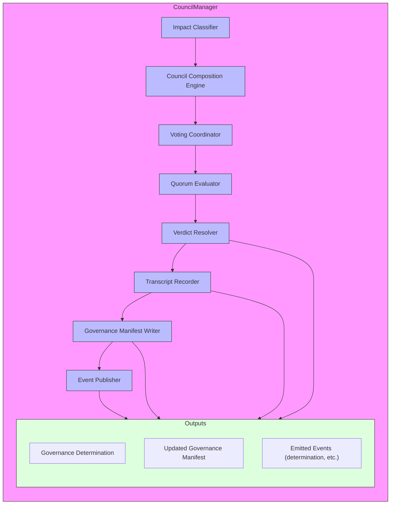
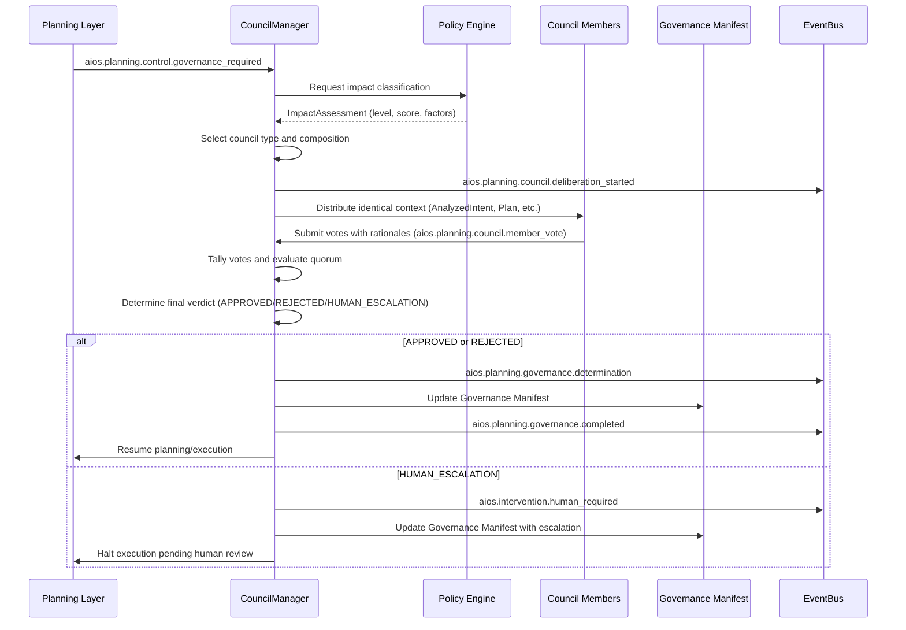

# 8.4 Council Governance Architecture

## 8.4.1 Overview

The Council Governance Architecture provides governed execution through deliberative bodies that evaluate capability execution plans against impact, risk, and compliance criteria. This architecture implements two distinct council pathways: the Claude Council for standard governance and the LLM Council for high-impact or high-risk scenarios, ensuring deterministic, vendor-independent governance decisions through EventBus-first communication.

## 8.4.2 Council Components

### 8.4.2.1 CouncilManager
The CouncilManager is the central orchestration component responsible for:
- **MUST** determine which council pathway (Claude Council or LLM Council) is required based on impact classification
- **MUST** convene the appropriate council with the required composition
- **MUST** ensure identical context is provided to all council members
- **MUST** facilitate the deliberation protocol and collect votes
- **MUST** enforce quorum requirements and determine the final verdict
- **MUST** emit appropriate governance events to the EventBus
- **MUST** record the complete transcript in the Governance Manifest
- **MUST** interface with the Policy Engine for impact classification and policy retrieval

### 8.4.2.2 Claude Council
The Claude Council provides structured governance through predefined personas:
- **MUST** consist of configured personas: Architect, Security, Performance, Product Owner, and User Advocate
- **MUST** operate with a default quorum of ≥3 members for approval/denial
- **MUST** provide reasoned votes (ALLOW/DENY/DEFER) with accompanying rationale
- **MUST** operate deterministically given identical context and persona configurations
- **SHOULD** leverage configured personas to provide diverse perspectives on technical, security, performance, business, and user experience aspects

### 8.4.2.3 LLM Council
The LLM Council provides statistical consensus governance through model diversity:
- **MUST** consist of 3+ diverse language models selected by policy
- **MUST** include model diversity covering reasoning, safety, and cost optimization roles
- **MUST** operate with statistical consensus (≥2/3 agreement) for approval/denial
- **MUST** provide deterministic outputs given identical context, model versions, and parameters
- **SHOULD** leverage different model architectures and training backgrounds to ensure diverse perspectives

## 8.4.3 Impact Classification

### 8.4.3.1 Classification Levels
Impact classification determines the appropriate governance pathway:
- **LOW**: No council required; direct execution permitted (INV-EXEC-GOV-002)
- **HIGH_IMPACT**: LLM Council required (statistical consensus ≥2/3)
- **HIGH_RISK**: LLM Council required (statistical consensus ≥2/3)
- **MUST** be determined by Policy Engine evaluation against impact classification policies
- **MAY** be overridden by explicit human request for LLM Council review

### 8.4.3.2 Classification Criteria
Impact classification evaluates:
- **Resource consumption**: Estimated cost, duration, and resource utilization
- **System impact**: Potential effect on system stability, performance, or availability
- **Security implications**: Potential security risks or vulnerabilities introduced
- **Data sensitivity**: Sensitivity of data being accessed, modified, or transmitted
- **Compliance requirements**: Regulatory or policy constraints applicable to the operation
- **SHOULD** consider historical patterns and learned patterns from the Learning Layer
- **MUST** be deterministic given identical context and policy snapshots

## 8.4.4 Governance Gate Types

### 8.4.4.1 PRE_EXECUTION_APPROVAL
- **MUST** occur before node or group execution begins
- **MUST** evaluate the capability plan against policies and impact criteria
- **MUST** prevent execution if governance denies approval
- **SHOULD** provide early feedback to prevent wasteful execution

### 8.4.4.2 POST_EXECUTION_AUDIT
- **MUST** occur after node or group execution completes
- **MUST** evaluate execution outcomes against success criteria and policies
- **MUST** record compliance evidence and audit trail in Governance Manifest
- **SHOULD** trigger learning artifact generation for outcomes

### 8.4.4.3 COMPLIANCE_CHECK
- **MUST** combine PRE_EXECUTION_APPROVAL and POST_EXECUTION_AUDIT
- **MUST** occur both before and after execution
- **MUST** provide comprehensive compliance validation
- **SHOULD** be used for operations with significant regulatory or security implications

### 8.4.4.4 COST_GATE
- **MUST** occur before node or group execution
- **MUST** evaluate estimated costs against budgetary constraints
- **MUST** prevent execution if estimated costs exceed allocated budget
- **SHOULD** incorporate real-time pricing and resource availability data

## 8.4.5 Deliberation Protocol

### 8.4.5.1 Trigger Conditions
- **MUST** be triggered when policy requires APPROVAL for a capability or plan
- **MUST** be triggered when ambiguity exceeds policy-defined thresholds
- **MUST** be triggered by explicit human request for council review
- **SHOULD** be triggered by Learning Layer recommendations for review
- **MUST NOT** be triggered for LOW impact classifications without explicit request

### 8.4.5.2 Council Composition
- **MUST** select council members according to impact classification and policy
- **MUST** ensure Claude Council uses configured personas
- **MUST** ensure LLM Council selects 3+ diverse models (reasoning, safety, cost roles)
- **MUST** record exact council composition in Governance Manifest
- **SHOULD** leverage Optimization Layer recommendations for model selection when applicable

### 8.4.5.3 Context Delivery
- **MUST** provide identical context to all council members
- **MUST** include: AnalyzedIntent, CapabilityPlan, PolicySnapshot, ImpactAssessment
- **MUST** include relevant historical context and learning artifacts when available
- **MUST** ensure context is immutable and versioned for deterministic replay
- **SHOULD** include relevant Execution Metadata and Resource constraints

### 8.4.5.4 Voting and Rationale
- **MUST** require each council member to vote: ALLOW, DENY, or DEFER
- **MUST** require accompanying rationale for each vote
- **MUST** record all votes and rationales in the Governance Manifest
- **SHOULD** structure rationales to facilitate transparency and auditability
- **MUST NOT** allow abstention without explicit DEFER vote with justification

### 8.4.5.5 Quorum Enforcement
- **MUST** enforce quorum requirements for final determination:
  - Claude Council: ≥3 votes required for ALLOW/DENY (default configuration)
  - LLM Council: ≥2/3 agreement required for ALLOW/DENY
- **MUST** treat failure to achieve quorum as HUMAN_ESCALATION
- **MUST** treat split votes (no clear ≥2/3 majority) as HUMAN_ESCALATION
- **SHOULD** allow configuration of quorum thresholds via policy

### 8.4.5.6 Determination Logic
- **MUST** determine APPROVED if quorum ≥ threshold votes for ALLOW
- **MUST** determine REJECTED if quorum ≥ threshold votes for DENY
- **MUST** determine HUMAN_ESCALATION if quorum not achieved for either ALLOW or DENY
- **MUST** record final determination and voting details in Governance Manifest
- **SHOULD** include confidence metrics in determination when available

### 8.4.5.7 Transcript Recording
- **MUST** record complete, immutable transcript of all deliberations
- **MUST** include: initial context, individual votes with rationales, final determination
- **MUST** store transcript in Governance Manifest artifact
- **MUST** ensure transcript is tamper-evident and suitable for audit
- **SHOULD** include timestamps and correlation identifiers for replay capability

## 8.4.6 Event Flows

### 8.4.6.1 Governance Initiation
```
[Planning Layer] 
    → [EventBus: aios.planning.control.governance_required] 
    → [CouncilManager] 
    → [EventBus: aios.planning.council.deliberation_started]
```

### 8.4.6.2 Council Deliberation
```
[CouncilManager]
    → [EventBus: aios.planning.council.context_distributed] 
    → [Council Members] 
    → [EventBus: aios.planning.council.member_vote] (xN)
    → [EventBus: aios.planning.council.deliberation_completed]
```

### 8.4.6.3 Determination and Notification
```
[CouncilManager]
    → [EventBus: aios.planning.governance.determination] 
    → [Planning Layer / Loop Engine]
    → [EventBus: aios.planning.governance.completed] (if APPROVED/REJECTED)
    → [EventBus: aios.intervention.human_required] (if HUMAN_ESCALATION)
```

### 8.4.6.4 Governance Manifest Updates
```
[CouncilManager]
    → [EventBus: aios.planning.artifact.governance_updated]
    → [Artifact Generator] 
    → [EventBus: aios.planning.artifact.completed]
```

## 8.4.7 State Model

### 8.4.7.1 CouncilManager State Machine
```
IDLE 
    → DELIBERATION_REQUIRED (on governance_required event)
    → CONTEXT_PREPARATION 
    → CONTEXT_DISTRIBUTED 
    → COLLECTING_VOTES 
    → VOTE_TALLYING 
    → DETERMINATION_READY
    → [GOVERNANCE_COMPLETED] (on APPROVED/REJECTED)
    → [HUMAN_ESCALATION_REQUIRED] (on HUMAN_ESCALATION)
    → [FAILED] (on unrecoverable error)
```

### 8.4.7.2 Council Member State
```
IDLE
    → CONTEXT_RECEIVED (on context_distributed event)
    → DELIBERATING 
    → VOTE_SUBMITTED (on member_vote event)
    → AWAITING_DETERMINATION
    → IDLE (on determination or escalation)
```

## 8.4.8 Deterministic Replay Requirements

### 8.4.8.1 Determinism Guarantees
- **MUST** produce identical deliberations and votes given identical:
  - Context delivered to council members
  - Council member configurations (personas or model configurations)
  - Policy snapshots in effect
  - Input parameters (temperature=0, fixed seed for LLMs)
- **MUST** ensure all council membership selections are deterministic
- **MUST** record all non-deterministic inputs for replay verification
- **MUST** ensure Governance Manifest is bit-identical for identical inputs

### 8.4.8.2 Replay Support
- **MUST** support replay from Governance Manifest artifacts
- **MUST** provide sufficient context in events to enable deterministic replay
- **MUST** ensure EventBus ordering guarantees are maintained during replay
- **SHOULD** support selective replay of individual council deliberations

## 8.4.9 Error Handling and Escalation

### 8.4.9.1 Deliberation Failures
- **MUST** treat council member timeouts as DEFER votes with timeout rationale
- **MUST** treat council member failures as DEFER votes with failure rationale
- **MUST** escalate to human intervention if quorum cannot be achieved
- **SHOULD** provide degraded mode operation with reduced council size when possible
- **MUST NOT** proceed with execution if governance determination cannot be made

### 8.4.9.2 Human Escalation
- **MUST** trigger HUMAN_ESCALATION determination when quorum not achieved
- **MUST** emit aios.intervention.human_required event with context
- **MUST** preserve all deliberation context for human review
- **MUST** record escalation reason and voting details in Governance Manifest
- **SHOULD** provide summarized voting rationales to facilitate human review

## 8.4.10 Formal Specification

### 8.4.10.1 CouncilRequest
```json
{
  "$schema": "https://json-schema.org/draft/2020-12/schema",
  "$id": "https://ai-os.example.com/schemas/council-request.json",
  "title": "CouncilRequest",
  "type": "object",
  "required": ["correlationId", "analyzedIntent", "capabilityPlan", "policySnapshot", "impactAssessment", "governanceType"],
  "properties": {
    "correlationId": {
      "type": "string",
      "format": "uuid",
      "description": "UUIDv7 linking all events in single intent→execution flow"
    },
    "analyzedIntent": {
      "$ref": "#/$defs/AnalyzedIntent"
    },
    "capabilityPlan": {
      "$ref": "#/$defs/CapabilityPlan"
    },
    "policySnapshot": {
      "$ref": "#/$defs/PolicySnapshot"
    },
    "impactAssessment": {
      "$ref": "#/$defs/ImpactAssessment"
    },
    "governanceType": {
      "type": "string",
      "enum": ["PRE_EXECUTION_APPROVAL", "POST_EXECUTION_AUDIT", "COMPLIANCE_CHECK", "COST_GATE"],
      "description": "Type of governance gate requiring evaluation"
    }
  },
  "$defs": {
    "AnalyzedIntent": {
      "type": "object",
      "description": "Decomposed, normalized intent with requirements, constraints, risks, governance",
      "properties": {
        "intentId": {"type": "string", "format": "uuid"},
        "correlationId": {"type": "string", "format": "uuid"},
        "timestamp": {"type": "string", "format": "date-time"},
        "rawIntent": {"type": "string"},
        "normalizedIntent": {"type": "string"},
        "requirements": {"type": "array", "items": {"type": "string"}},
        "constraints": {"type": "array", "items": {"type": "string"}},
        "risks": {"type": "array", "items": {"type": "string"}},
        "governanceRequirements": {"type": "array", "items": {"type": "string"}}
      },
      "additionalProperties": false
    },
    "CapabilityPlan": {
      "type": "object",
      "description": "Executable data structure: capability graph + bindings + budgets + governance",
      "properties": {
        "planId": {"type": "string", "format": "uuid"},
        "version": {"type": "integer"},
        "intentId": {"type": "string", "format": "uuid"},
        "correlationId": {"type": "string", "format": "uuid"},
        "nodes": {
          "type": "array",
          "items": {
            "type": "object",
            "properties": {
              "nodeId": {"type": "string", "format": "uuid"},
              "capabilityId": {"type": "string"},
              "version": {"type": "string"},
              "executionOrder": {"type": "integer"},
              "parallelGroup": {"type": "string"},
              "dependencies": {"type": "array", "items": {"type": "string"}},
              "dependencyTypes": {"type": "array", "items": {"type": "string"}},
              "parameters": {},
              "condition": {"type": "string"},
              "optional": {"type": "boolean"},
              "reversible": {"type": "boolean"},
              "retryPolicy": {},
              "loopBinding": {},
              "providerRequirement": {},
              "governanceBindings": {},
              "resourceBudget": {},
              "costEstimate": {},
              "rollbackNode": {"type": "string", "format": "uuid"},
              "successCriteria": {},
              "failureCriteria": {},
              "confidence": {"type": "number", "minimum": 0, "maximum": 1},
              "confidenceDecayFactors": {},
              "recommendationRefs": {"type": "array", "items": {"type": "string"}}
            },
            "required": ["nodeId", "capabilityId", "version", "executionOrder"],
            "additionalProperties": false
          }
        },
        "parallelGroups": {
          "type": "array",
          "items": {
            "type": "object",
            "properties": {
              "groupId": {"type": "string"},
              "nodes": {"type": "array", "items": {"type": "string"}},
              "estimatedDurationMs": {"type": "integer"}
            },
            "additionalProperties": false
          }
        },
        "conditionalBranches": {
          "type": "array",
          "items": {
            "type": "object",
            "properties": {
              "guardNodeId": {"type": "string", "format": "uuid"},
              "condition": {"type": "string"},
              "thenNodes": {"type": "array", "items": {"type": "string"}},
              "elseNodes": {"type": "array", "items": {"type": "string"}}
            },
            "additionalProperties": false
          }
        },
        "governanceGates": {
          "type": "array",
          "items": {
            "type": "object",
            "properties": {
              "gateId": {"type": "string", "format": "uuid"},
              "type": {"type": "string", "enum": ["PRE_EXECUTION_APPROVAL", "POST_EXECUTION_AUDIT", "COMPLIANCE_CHECK", "COST_GATE"]},
              "nodes": {"type": "array", "items": {"type": "string"}},
              "approvers": {"type": "array", "items": {"type": "string"}},
              "timeout": {"type": "integer"},
              "autoApprove": {"type": "boolean"}
            },
            "additionalProperties": false
          }
        },
        "aggregateBudget": {
          "type": "object",
          "properties": {
            "maxCostUSD": {"type": "number"},
            "maxDurationMs": {"type": "integer"},
            "contingency": {"type": "number"}
          },
          "additionalProperties": false
        },
        "overallRiskLevel": {"type": "string", "enum": ["LOW", "MEDIUM", "HIGH", "CRITICAL"]},
        "overallConfidence": {"type": "number", "minimum": 0, "maximum": 1}
      },
      "additionalProperties": false
    },
    "PolicySnapshot": {
      "type": "object",
      "description": "Immutable view of all policies at pipeline start",
      "properties": {
        "snapshotId": {"type": "string", "format": "uuid"},
        "timestamp": {"type": "string", "format": "date-time"},
        "policies": {"type": "object"},
        "version": {"type": "integer"}
      },
      "additionalProperties": false
    },
    "ImpactAssessment": {
      "type": "object",
      "description": "Assessment of impact, risk, and compliance criteria",
      "properties": {
        "assessmentId": {"type": "string", "format": "uuid"},
        "correlationId": {"type": "string", "format": "uuid"},
        "timestamp": {"type": "string", "format": "date-time"},
        "level": {"type": "string", "enum": ["LOW", "HIGH_IMPACT", "HIGH_RISK"]},
        "score": {"type": "number", "minimum": 0, "maximum": 100},
        "factors": {
          "type": "object",
          "properties": {
            "resourceConsumption": {"type": "number", "minimum": 0, "maximum": 100},
            "systemImpact": {"type": "number", "minimum": 0, "maximum": 100},
            "securityImplications": {"type": "number", "minimum": 0, "maximum": 100},
            "dataSensitivity": {"type": "number", "minimum": 0, "maximum": 100},
            "complianceRequirements": {"type": "number", "minimum": 0, "maximum": 100}
          },
          "additionalProperties": false
        },
        "justification": {"type": "string"}
      },
      "additionalProperties": false
    }
  },
  "additionalProperties": false
}
```

### 8.4.10.2 CouncilMember
```json
{
  "$schema": "https://json-schema.org/draft/2020-12/schema",
  "$id": "https://ai-os.example.com/schemas/council-member.json",
  "title": "CouncilMember",
  "type": "object",
  "required": ["memberId", "memberType", "vote", "rationale"],
  "properties": {
    "memberId": {
      "type": "string",
      "format": "uuid",
      "description": "Unique identifier for council member"
    },
    "memberType": {
      "type": "string",
      "enum": ["PERSONA", "LLM_MODEL"],
      "description": "Type of council member"
    },
    "vote": {
      "type": "string",
      "enum": ["ALLOW", "DENY", "DEFER"],
      "description": "Vote decision"
    },
    "rationale": {
      "type": "string",
      "description": "Detailed reasoning for vote"
    },
    "confidence": {
      "type": "number",
      "minimum": 0,
      "maximum": 1,
      "description": "Confidence in vote (0.0-1.0)"
    },
    "timestamp": {
      "type": "string",
      "format": "date-time",
      "description": "When vote was cast"
    }
  },
  "additionalProperties": false
}
```

### 8.4.10.3 CouncilVote
```json
{
  "$schema": "https://json-schema.org/draft/2020-12/schema",
  "$id": "https://ai-os.example.com/schemas/council-vote.json",
  "title": "CouncilVote",
  "type": "object",
  "required": ["memberId", "vote", "rationale"],
  "properties": {
    "memberId": {
      "type": "string",
      "format": "uuid",
      "description": "Council member identifier"
    },
    "memberType": {
      "type": "string",
      "enum": ["PERSONA", "LLM_MODEL"],
      "description": "Type of council member"
    },
    "vote": {
      "type": "string",
      "enum": ["ALLOW", "DENY", "DEFER"],
      "description": "Vote decision"
    },
    "rationale": {
      "type": "string",
      "description": "Reasoning for vote"
    },
    "confidence": {
      "type": "number",
      "minimum": 0,
      "maximum": 1,
      "description": "Confidence in vote"
    },
    "timestamp": {
      "type": "string",
      "format": "date-time",
      "description": "Vote timestamp"
    }
  },
  "additionalProperties": false
}
```

### 8.4.10.4 CouncilVerdict
```json
{
  "$schema": "https://json-schema.org/draft/2020-12/schema",
  "$id": "https://ai-os.example.com/schemas/council-verdict.json",
  "title": "CouncilVerdict",
  "type": "object",
  "required": ["decision", "voteTally", "quorumAchieved"],
  "properties": {
    "decision": {
      "type": "string",
      "enum": ["APPROVED", "REJECTED", "HUMAN_ESCALATION"],
      "description": "Final council decision"
    },
    "voteTally": {
      "type": "object",
      "required": ["allow", "deny", "defer"],
      "properties": {
        "allow": {"type": "integer"},
        "deny": {"type": "integer"},
        "defer": {"type": "integer"}
      },
      "additionalProperties": false
    },
    "quorumAchieved": {
      "type": "boolean",
      "description": "Whether quorum requirements were met"
    },
    "confidence": {
      "type": "number",
      "minimum": 0,
      "maximum": 1,
      "description": "Confidence in decision"
    },
    "transcriptId": {
      "type": "string",
      "format": "uuid",
      "description": "Reference to full transcript"
    }
  },
  "additionalProperties": false
}
```

### 8.4.10.5 GovernanceDecision
```json
{
  "$schema": "https://json-schema.org/draft/2020-12/schema",
  "$id": "https://ai-os.example.com/schemas/governance-decision.json",
  "title": "GovernanceDecision",
  "type": "object",
  "required": ["decision", "reason", "voteTally"],
  "properties": {
    "decision": {
      "type": "string",
      "enum": ["APPROVED", "REJECTED", "HUMAN_ESCALATION"],
      "description": "Final governance decision"
    },
    "reason": {
      "type": "string",
      "description": "Reason for decision (required for HUMAN_ESCALATION)"
    },
    "confidence": {
      "type": "number",
      "minimum": 0,
      "maximum": 1,
      "description": "Confidence in decision"
    },
    "voteTally": {
      "type": "object",
      "required": ["allow", "deny", "defer"],
      "properties": {
        "allow": {"type": "integer"},
        "deny": {"type": "integer"},
        "defer": {"type": "integer"}
      },
      "additionalProperties": false
    },
    "quorumAchieved": {
      "type": "boolean",
      "description": "Whether quorum requirements were met for decision"
    },
    "timestamp": {
      "type": "string",
      "format": "date-time",
      "description": "When decision was made"
    }
  },
  "additionalProperties": false
}
```

### 8.4.10.6 CouncilTranscript
```json
{
  "$schema": "https://json-schema.org/draft/2020-12/schema",
  "$id": "https://ai-os.example.com/schemas/council-transcript.json",
  "title": "CouncilTranscript",
  "type": "object",
  "description": "Immutable record of council deliberation",
  "properties": {
    "transcriptId": {
      "type": "string",
      "format": "uuid",
      "description": "Unique identifier for transcript"
    },
    "correlationId": {
      "type": "string",
      "format": "uuid",
      "description": "Links to intent→execution flow"
    },
    "requestId": {
      "type": "string",
      "format": "uuid",
      "description": "Links to council deliberation request"
    },
    "timestamp": {
      "type": "string",
      "format": "date-time",
      "description": "When deliberation commenced"
    },
    "context": {
      "type": "object",
      "description": "Identical context provided to all council members",
      "properties": {
        "analyzedIntent": {},
        "capabilityPlan": {},
        "policySnapshot": {},
        "impactAssessment": {},
        "governanceType": {"type": "string"}
      }
    },
    "members": {
      "type": "array",
      "items": {
        "type": "object",
        "properties": {
          "memberId": {"type": "string", "format": "uuid"},
          "memberType": {"type": "string", "enum": ["PERSONA", "LLM_MODEL"]},
          "memberConfig": {}
        },
        "required": ["memberId", "memberType"],
        "additionalProperties": false
      }
    },
    "deliberation": {
      "type": "array",
      "items": {
        "type": "object",
        "properties": {
          "memberId": {"type": "string", "format": "uuid"},
          "vote": {"type": "string", "enum": ["ALLOW", "DENY", "DEFER"]},
          "rationale": {"type": "string"},
          "confidence": {"type": "number", "minimum": 0, "maximum": 1},
          "timestamp": {"type": "string", "format": "date-time"}
        },
        "required": ["memberId", "vote", "rationale", "timestamp"],
        "additionalProperties": false
      }
    },
    "finalDecision": {
      "$ref": "#/$defs/GovernanceDecision"
    }
  },
  "$defs": {
    "GovernanceDecision": {
      "type": "object",
      "required": ["decision", "reason", "voteTally"],
      "properties": {
        "decision": {
          "type": "string",
          "enum": ["APPROVED", "REJECTED", "HUMAN_ESCALATION"],
          "description": "Final governance decision"
        },
        "reason": {
          "type": "string",
          "description": "Reason for decision (required for HUMAN_ESCALATION)"
        },
        "confidence": {
          "type": "number",
          "minimum": 0,
          "maximum": 1,
          "description": "Confidence in decision"
        },
        "voteTally": {
          "type": "object",
          "required": ["allow", "deny", "defer"],
          "properties": {
            "allow": {"type": "integer"},
            "deny": {"type": "integer"},
            "defer": {"type": "integer"}
          },
          "additionalProperties": false
        },
        "quorumAchieved": {
          "type": "boolean",
          "description": "Whether quorum requirements were met for decision"
        },
        "timestamp": {
          "type": "string",
          "format": "date-time",
          "description": "When decision was made"
        }
      },
      "additionalProperties": false
    }
  },
  "additionalProperties": false
}
```

### 8.4.10.7 ImpactAssessment
```json
{
  "$schema": "https://json-schema.org/draft/2020-12/schema",
  "$id": "https://ai-os.example.com/schemas/impact-assessment.json",
  "title": "ImpactAssessment",
  "type": "object",
  "description": "Assessment of impact, risk, and compliance for governance routing",
  "properties": {
    "assessmentId": {
      "type": "string",
      "format": "uuid",
      "description": "Unique identifier for assessment"
    },
    "correlationId": {
      "type": "string",
      "format": "uuid",
      "description": "Links to intent→execution flow"
    },
    "timestamp": {
      "type": "string",
      "format": "date-time",
      "description": "When assessment was performed"
    },
    "level": {
      "type": "string",
      "enum": ["LOW", "HIGH_IMPACT", "HIGH_RISK"],
      "description": "Impact classification level"
    },
    "score": {
      "type": "number",
      "minimum": 0,
      "maximum": 100,
      "description": "Composite impact score"
    },
    "factors": {
      "type": "object",
      "description": "Individual factor scores (0-100)",
      "properties": {
        "resourceConsumption": {"type": "number", "minimum": 0, "maximum": 100},
        "systemImpact": {"type": "number", "minimum": 0, "maximum": 100},
        "securityImplications": {"type": "number", "minimum": 0, "maximum": 100},
        "dataSensitivity": {"type": "number", "minimum": 0, "maximum": 100},
        "complianceRequirements": {"type": "number", "minimum": 0, "maximum": 100}
      },
      "additionalProperties": false
    },
    "justification": {
      "type": "string",
      "description": "Reasoning for classification"
    },
    "policyVersion": {
      "type": "string",
      "description": "Version of policy used for assessment"
    }
  },
  "additionalProperties": false
}
```

## 8.4.11 Component Architecture

The CouncilManager internals consist of the following components working in coordination:

- **CouncilCompositionEngine**: Selects appropriate council members based on impact classification and policy rules
- **ImpactClassifier**: Interfaces with Policy Engine to determine impact level and council routing requirements
- **VotingCoordinator**: Manages context distribution, vote collection, and timeout handling
- **QuorumEvaluator**: Assesses vote tallies against configured quorum thresholds
- **VerdictResolver**: Determines final governance decision based on vote results and quorum status
- **TranscriptRecorder**: Captures and stores complete deliberation transcript for audit and replay
- **GovernanceManifestWriter**: Updates Governance Manifest artifact with deliberation outcomes
- **EventPublisher**: Emits all governance-related events to the EventBus with proper correlation

### Component Architecture Diagram


Data Flow:
1. ImpactClassifier determines council type and informs CouncilCompositionEngine
2. CouncilCompositionEngine selects council members based on policies
3. VotingCoordinator distributes identical context to all members
4. Council members deliberate and return votes via VotingCoordinator
5. QuorumEvaluator assesses votes against thresholds
6. VerdictResolver determines final decision
7. TranscriptRecorder records full transcript
8. GovernanceManifestWriter updates the artifact
9. EventPublisher emits results to EventBus

## 8.4.12 Governance Protocol Sequence



## 8.4.13 Event Specification

| Event Name | Publisher | Subscribers | Payload | Ordering | Replay Behaviour | Delivery Guarantee | Persistence |
|------------|-----------|-------------|---------|----------|------------------|--------------------|-------------|
| `aios.planning.control.governance_required` | Planning Layer | CouncilManager | { correlationId, analyzedIntent, capabilityPlan, policySnapshot, impactAssessment, governanceType } | Per correlationId | Must be replayable to trigger identical deliberation | At-least-once | Persistent |
| `aios.planning.council.deliberation_started` | CouncilManager | EventBus listeners | { correlationId, councilType, memberIds, governanceType } | Per correlationId | Marks start of deliberation for replay tracking | At-least-once | Persistent |
| `aios.planning.council.context_distributed` | CouncilManager | Council Members | { correlationId, context } | Per correlationId | Ensures identical context delivery in replay | At-least-once | Persistent |
| `aios.planning.council.member_vote` | Council Members | CouncilManager | { correlationId, memberId, vote, rationale, confidence, timestamp } | Per council member, per correlationId | Captures individual votes for verdict reconstruction | At-least-once | Persistent |
| `aios.planning.council.deliberation_completed` | CouncilManager | CouncilManager internals | { correlationId, voteTally } | Per correlationId | Signals end of vote collection phase | At-least-once | Persistent |
| `aios.planning.governance.determination` | CouncilManager | Planning Layer, Loop Engine | { correlationId, determination, voteTally, transcriptId } | Per correlationId | Final decision point for replay continuation | At-least-once | Persistent |
| `aios.planning.governance.completed` | CouncilManager | EventBus listeners | { correlationId, decision } | Per correlationId | Indicates successful governance conclusion | At-least-once | Persistent |
| `aios.intervention.human_required` | CouncilManager | Intervention Hooks, EventBus listeners | { correlationId, context, voteTally, transcriptId } | Per correlationId | Triggers human review workflow in replay | At-least-once | Persistent |
| `aios.planning.artifact.governance_updated` | CouncilManager | Artifact Generator | { correlationId, governanceManifestUpdate } | Per correlationId | Initiates manifest update for audit trail | At-least-once | Persistent |
| `aios.planning.artifact.completed` | Artifact Generator | EventBus listeners | { correlationId, artifactId } | Per correlationId | Confirms persistence of governance record | At-least-once | Persistent |

## 8.4.14 Council Invariants

| Invariant ID | Requirement |
|--------------|-------------|
| INV-COUNCIL-1 | **MUST** ensure identical context is delivered to all council members for deterministic deliberation |
| INV-COUNCIL-2 | **MUST** enforce quorum requirements: Claude Council (≥3 default), LLM Council (≥2/3 agreement) |
| INV-COUNCIL-3 | **MUST** record complete, immutable transcript in Governance Manifest for audit and replay |
| INV-COUNCIL-4 | **MUST** ensure council deliberations are deterministic given identical context, configurations, and parameters |
| INV-COUNCIL-5 | **MUST** treat failure to achieve quorum as HUMAN_ESCALATION, preventing unauthorized execution |
| INV-COUNCIL-6 | **MUST** preserve all deliberation context (votes, rationales, timestamps) for traceability |
| INV-COUNCIL-7 | **MUST** ensure vendor independence: council mechanisms work identically with any LLM or persona implementation |
| INV-COUNCIL-8 | **MUST** guarantee Governance Manifest updates are tamper-evident and suitable for compliance audits |
| INV-COUNCIL-9 | **MUST** ensure event ordering guarantees are maintained for replay consistency |
| INV-COUNCIL-10| **SHOULD** support configuration of quorum thresholds, timeouts, and council composition via policy |

## 8.4.15 Conformance Requirements

### 8.4.15.1 Static Conformance
- **MUST** implement all CouncilManager interfaces as specified in Section 8.4.10
- **MUST** define JSON schemas for all governance artifacts matching Section 8.4.10 specifications
- **MUST** declare council composition rules and quorum thresholds in policy configuration
- **MUST** implement event definitions matching Section 8.4.13 specification
- **MUST** ensure all invariants (Section 8.4.14) are satisfied by design

### 8.4.15.2 Runtime Conformance
- **MUST** deliver identical context to all council members for each deliberation
- **MUST** enforce quorum requirements before issuing any governance determination
- **MUST** record complete deliberation transcript in Governance Manifest for every council session
- **MUST** produce deterministic deliberations given identical inputs (context, configurations, seeds)
- **MUST** escalate to human intervention when quorum cannot be achieved
- **MUST** emit all governance events to EventBus with proper correlation and causation IDs
- **MUST** ensure Governance Manifest updates are append-only and cryptographically verifiable

### 8.4.15.3 Replay Conformance
- **MUST** support deterministic replay of council deliberations from Governance Manifest artifacts
- **MUST** ensure replayed deliberations produce identical votes and determinations as original
- **MUST** preserve event ordering and causality during replay operations
- **MUST** allow selective replay of individual council deliberations by correlation ID
- **MUST** maintain identical context delivery mechanics during replay as in original execution

### 8.4.15.4 Audit Conformance
- **MUST** maintain Governance Manifest as complete, immutable audit trail of all governance actions
- **MUST** ensure Governance Manifest suffices for regulatory compliance audits (e.g., SOX, GDPR, HIPAA)
- **MUST** retain governance records according to policy-defined schedules with secure disposal
- **MUST** provide tools for governance audit trail analysis and verification
- **MUST** implement access controls ensuring need-to-know access to governance artifacts