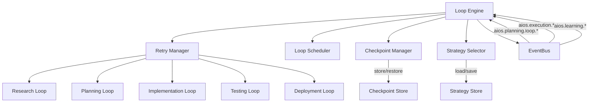
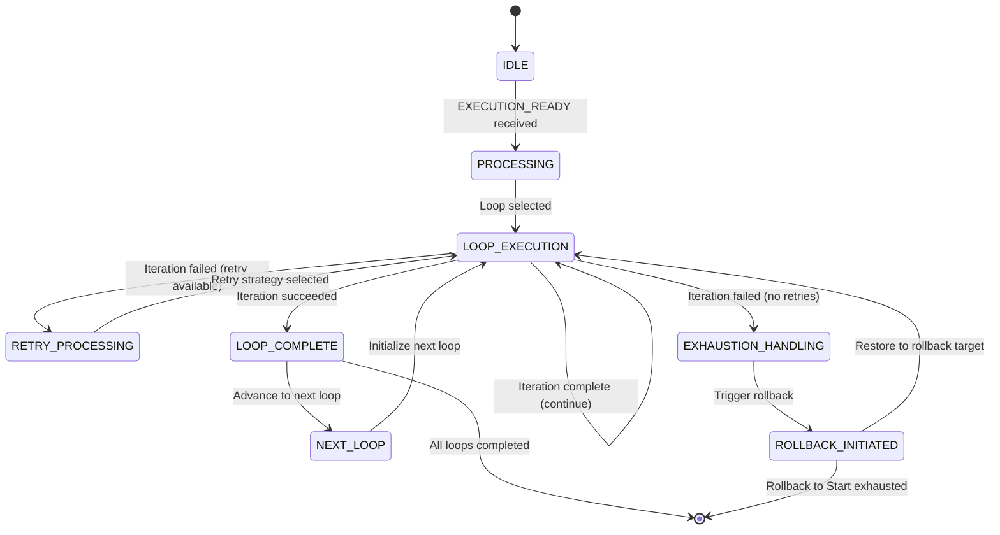
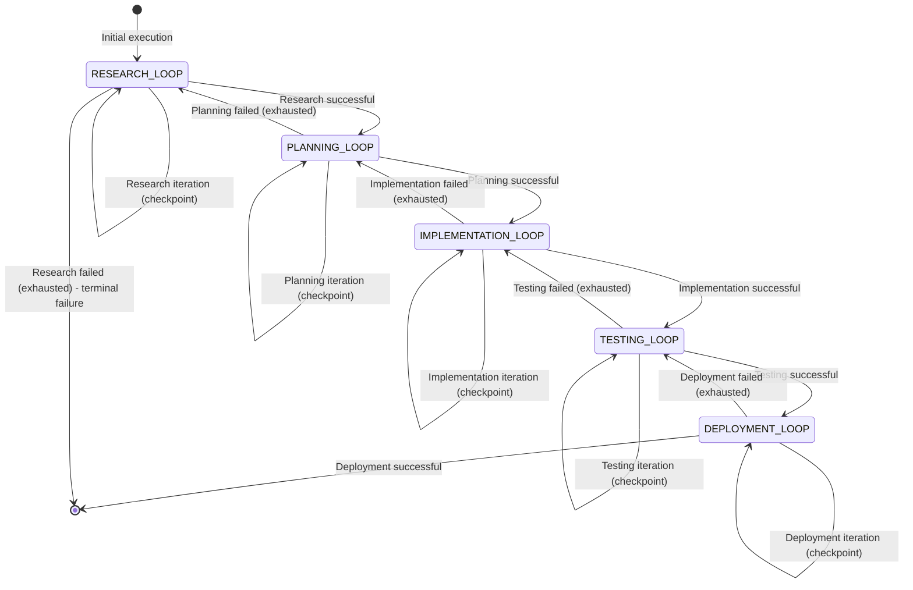
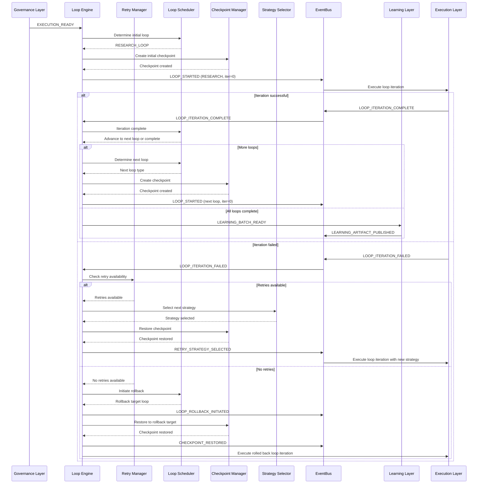
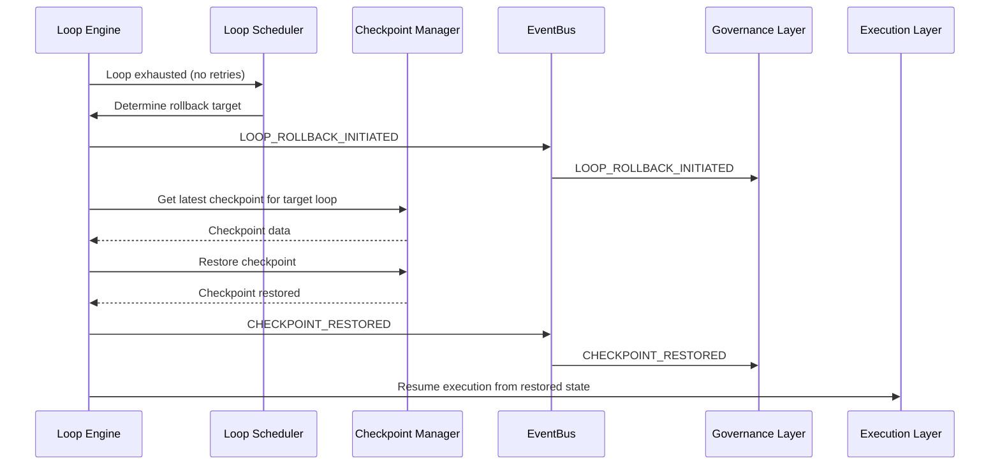
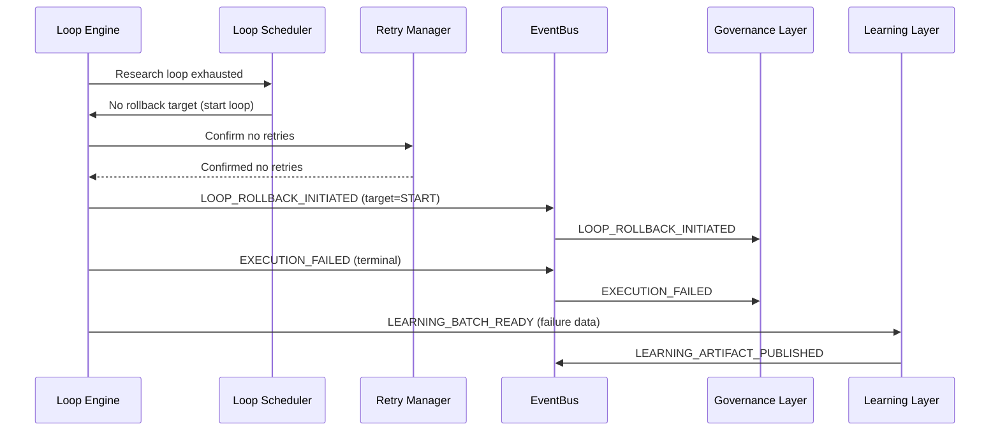

# 8.5 Loop Engine Architecture

## 8.5.1 Overview

The Loop Engine Architecture implements the five hierarchical execution loops that form the core execution strategy of AI-OS. These loops provide structured retry mechanisms with strategic adaptation, ensuring deterministic execution while preventing infinite loops through bounded iteration counts and strategic rollback mechanisms.

The Loop Engine operates as Layer 5 in the execution pipeline, receiving events from the Governance Layer and emitting events to the Learning Layer. It implements deterministic retry with strategic adaptation, ensuring that no two retry attempts are identical (INV-EXEC-STR-008) and that loop exhaustion triggers rollback to the previous loop rather than termination (INV-EXEC-STR-009).

## 8.5.2 Architecture Overview

### 8.5.2.1 Component Diagram



### 8.5.2.2 Component Responsibilities

| Component | Responsibility |
|-----------|----------------|
| **LoopEngine** | Main orchestrator for loop execution, receives execution requests from Governance Layer, coordinates loop execution |
| **RetryManager** | Manages retry budgets, retry counts, and exhaustion detection for each loop |
| **LoopScheduler** | Determines loop execution order, manages loop transitions and rollbacks |
| **CheckpointManager** | Handles checkpoint creation and restoration for loop iterations |
| **StrategySelector** | Implements strategy hierarchy and selects adaptive strategies on failure |
| **EventBus** | Facilitates all inter-layer communication (INV-EXEC-LAYER-001) |

## 8.5.3 Loop Architecture

### 8.5.3.1 Five Hierarchical Loops

The Loop Engine implements five hierarchical loops as mandated by INV-EXEC-STR-007:

| Loop | Rollback Target | Purpose |
|------|----------------|---------|
| Research Loop | Start | Explores problem space, gathers information, explores alternatives |
| Planning Loop | Research | Creates executable plans based on research findings |
| Implementation Loop | Planning | Executes planned capabilities to implement solution |
| Testing Loop | Implementation | Validates implementation correctness and quality |
| Deployment Loop | Testing | Deploys validated solution to target environment |

### 8.5.3.2 Loop State Model

Each loop maintains the following state as per INV-LOOP-1 through INV-LOOP-4:

```json
{
  "loopId": "string",
  "loopType": "RESEARCH|PLANNING|IMPLEMENTATION|TESTING|DEPLOYMENT",
  "retryBudget": "integer",
  "retryCount": "integer",
  "rollbackTarget": "string",
  "checkpoint": "CheckpointRef",
  "timeoutMs": "integer",
  "adaptiveStrategy": "StrategySpec",
  "maxIterations": "integer",
  "currentIteration": "integer",
  "strategyHash": "string",
  "isDeterministicExpansion": "boolean",
  "graphMutationAllowed": "boolean"
}
```

### 8.5.3.3 Strategy Hierarchy

On failure, loops follow this strategy hierarchy (in order):

1. **Parameter Adjustment** - Modify capability parameters without changing core approach
2. **Capability Substitution** - Replace capabilities with functionally equivalent alternatives
3. **Model Substitution** - Switch to different AI models or providers
4. **Workflow Restructure** - Modify the execution graph structure
5. **Escalation** - Escalate to higher authority (human intervention or higher loop)

Each strategy application must produce a different strategy hash to satisfy INV-EXEC-STR-008.

## 8.5.4 Loop Engine Detailed Design

### 8.5.4.1 LoopEngine Component

#### 8.5.4.1.1 Responsibilities

The LoopEngine component:
- Receives `aios.planning.control.EXECUTION_READY` events from Governance Layer
- Initializes loop execution context
- Coordinates with LoopScheduler to determine initial loop
- Emits `aios.planning.loop.LOOP_STARTED` events
- Receives loop completion/failure events and determines next actions
- Coordinates with RetryManager for retry budget management
- Coordinates with CheckpointManager for checkpoint operations
- Emits `aios.planning.control.LOOP_ROLLBACK_INITIATED` or `aios.planning.control.CHECKPOINT_RESTORED` events as needed
- Sends final outcomes to Learning Layer via `aios.planning.control.LEARNING_BATCH_READY`

#### 8.5.4.1.2 State Transitions



### 8.5.4.2 RetryManager Component

#### 8.5.4.2.1 Responsibilities

The RetryManager component:
- Tracks retry budgets for each loop type
- Determines when retries are exhausted
- Works with StrategySelector to ensure strategy hash differs per attempt (INV-EXEC-STR-008)
- Tracks strategy history to prevent repetition
- Reports retry status to LoopEngine

#### 8.5.4.2.2 Retry Budget Model

```json
{
  "loopType": "RESEARCH|PLANNING|IMPLEMENTATION|TESTING|DEPLOYMENT",
  "initialBudget": "integer",
  "remainingBudget": "integer",
  "strategyHistory": ["string"],
  "maxConsecutiveSameStrategy": "integer",
  "strategyDiversityRequired": "boolean"
}
```

### 8.5.4.3 LoopScheduler Component

#### 8.5.4.3.1 Responsibilities

The LoopScheduler component:
- Determines initial loop based on execution context
- Manages loop progression (normal progression to next loop)
- Handles loop rollback to specified target loop
- Enforces loop ordering constraints
- Works with CheckpointManager for loop-specific checkpointing

#### 8.5.4.3.2 Loop Transition Logic



### 8.5.4.4 CheckpointManager Component

#### 8.5.4.4.1 Responsibilities

The CheckpointManager component:
- Creates checkpoints at the end of each loop iteration (INV-LOOP-4)
- Stores checkpoints with correlationId and loop iteration metadata
- Restores checkpoints for loop retries and loop rollbacks
- Validates checkpoint integrity before restoration
- Implements checkpoint pruning based on retention policies

#### 8.5.4.4.2 Checkpoint Structure

```json
{
  "checkpointId": "uuid",
  "correlationId": "uuid",
  "loopType": "RESEARCH|PLANNING|IMPLEMENTATION|TESTING|DEPLOYMENT",
  "loopIteration": "integer",
  "timestamp": "date-time",
  "executionContext": {
    "capabilityPlan": "CapabilityPlan",
    "resolvedCapabilities": "ResolvedCapabilities[]",
    "dependencyResolution": "CapabilityDAG",
    "governanceBindings": "GovernanceBindings[]",
    "resourceBudgets": "ResourceBudget[]",
    "snapshotIds": {
      "registry": "uuid",
      "policy": "uuid",
      "config": "uuid"
    }
  },
  "strategyState": {
    "currentStrategy": "StrategySpec",
    "strategyHistory": "string[]",
    "retryCount": "integer"
  },
  "contentHash": "sha256:<hex>",
  "generatedBy": "string"
}
```

#### 8.5.4.4.3 Checkpoint JSON Schema

```json
{
  "$schema": "https://json-schema.org/draft/2020-12/schema",
  "title": "LoopCheckpoint",
  "type": "object",
  "required": ["checkpointId", "correlationId", "loopType", "loopIteration", "timestamp", "executionContext", "contentHash", "generatedBy"],
  "properties": {
    "checkpointId": {
      "description": "Unique identifier for this checkpoint",
      "type": "string",
      "format": "uuid"
    },
    "correlationId": {
      "description": "Links to the execution flow",
      "type": "string",
      "format": "uuid"
    },
    "loopType": {
      "description": "Type of loop this checkpoint belongs to",
      "type": "string",
      "enum": ["RESEARCH", "PLANNING", "IMPLEMENTATION", "TESTING", "DEPLOYMENT"]
    },
    "loopIteration": {
      "description": "Iteration number within this loop",
      "type": "integer",
      "minimum": 0
    },
    "timestamp": {
      "description": "When the checkpoint was created",
      "type": "string",
      "format": "date-time"
    },
    "executionContext": {
      "description": "Complete execution context at checkpoint",
      "type": "object",
      "required": ["capabilityPlan", "resolvedCapabilities", "dependencyResolution", "governanceBindings", "resourceBudgets", "snapshotIds"],
      "properties": {
        "capabilityPlan": {
          "description": "The capability plan being executed",
          "type": "object"
        },
        "resolvedCapabilities": {
          "description": "Resolved capabilities for execution",
          "type": "array",
          "items": {
            "type": "object"
          }
        },
        "dependencyResolution": {
          "description": "Dependency resolution DAG",
          "type": "object"
        },
        "governanceBindings": {
          "description": "Governance gate bindings",
          "type": "array",
          "items": {
            "type": "object"
          }
        },
        "resourceBudgets": {
          "description": "Resource budget allocations",
          "type": "array",
          "items": {
            "type": "object"
          }
        },
        "snapshotIds": {
          "description": "IDs of registry/policy/config snapshots",
          "type": "object",
          "required": ["registry", "policy", "config"],
          "properties": {
            "registry": {
              "type": "string",
              "format": "uuid"
            },
            "policy": {
              "type": "string",
              "format": "uuid"
            },
            "config": {
              "type": "string",
              "format": "uuid"
            }
          }
        }
      }
    },
    "strategyState": {
      "description": "Current strategy state for retry logic",
      "type": "object",
      "required": ["currentStrategy", "strategyHistory", "retryCount"],
      "properties": {
        "currentStrategy": {
          "description": "Currently active strategy",
          "type": "object"
        },
        "strategyHistory": {
          "description": "History of strategies attempted",
          "type": "array",
          "items": {
            "type": "string"
          }
        },
        "retryCount": {
          "description": "Number of retries attempted",
          "type": "integer",
          "minimum": 0
        }
      }
    },
    "contentHash": {
      "description": "SHA-256 hash of checkpoint content",
      "type": "string",
      "pattern": "^sha256:[0-9a-f]{64}$"
    },
    "generatedBy": {
      "description": "Component that generated this checkpoint",
      "type": "string"
    }
  },
  "additionalProperties": false
}
```

### 8.5.4.5 StrategySelector Component

#### 8.5.4.5.1 Responsibilities

The StrategySelector component:
- Implements the strategy hierarchy for retry attempts
- Ensures strategy hash differs from previous attempts (INV-EXEC-STR-008)
- Selects appropriate strategy based on failure type and context
- Tracks strategy effectiveness for learning
- Works with RetryManager to enforce strategy diversity

#### 8.5.4.5.2 Strategy Specification

```json
{
  "strategyType": "PARAMETER_ADJUSTMENT|CAPABILITY_SUBSTITUTION|MODEL_SUBSTITUTION|WORKFLOW_RESTRUCTURE|ESCALATION",
  "parameters": {
    // Strategy-specific parameters
  },
  "strategyHash": "string",
  "appliedAt": "date-time",
  "effectivenessScore": "number",
  "appliedBy": "string"
}
```

#### 8.5.4.5.3 Strategy Hash Generation

To ensure deterministic yet varying strategies (INV-EXEC-STR-008), strategy hashes are generated using:

```
strategyHash = SHA256(
  strategyType + 
  JSON.stringify(parameters, sort keys) + 
  strategyHistory.join(",") + 
  retryCount.toString()
)
```

## 8.5.5 Event Flows

### 8.5.5.1 Normal Loop Execution Flow



### 8.5.5.2 Cross-Loop Rollback Flow



### 8.5.5.3 Exhaustion and Termination Flow



## 8.5.6 Invariants and Validation Rules

### 8.5.6.1 Structural Invariants

| Invariant ID | Description |
|--------------|-------------|
| INV-EXEC-STR-007 | All five loops defined with required parameters (retryBudget, rollbackTarget, checkpoint, timeoutMs, adaptiveStrategy) |
| INV-LOOP-1 | Static boundedness - maxIterations required positive integer |
| INV-LOOP-2 | Deterministic expansion - loop expansion must be deterministic |
| INV-LOOP-3 | No runtime graph mutation - execution graph cannot be mutated during loop execution |
| INV-LOOP-4 | Checkpoint per iteration - each loop iteration must create a checkpoint |

### 8.5.6.2 Runtime Invariants

| Invariant ID | Description |
|--------------|-------------|
| INV-EXEC-STR-008 | NEVER identical retry - strategy hash must differ per attempt |
| INV-EXEC-STR-009 | Exhaustion → rollback to previous loop (not termination) |
| INV-EXEC-LAYER-001 | All layer communication via EventBus - no direct method calls in RUNNING state |

### 8.5.6.3 Validation Rules

| Rule ID | Description |
|---------|-------------|
| VAL-LOOP-001 | retryBudget must be ≥ 0 |
| VAL-LOOP-002 | timeoutMs must be > 0 |
| VAL-LOOP-003 | maxIterations must be > 0 |
| VAL-LOOP-004 | rollbackTarget must be a valid loop type or "START" |
| VAL-LOOP-005 | strategyHash must differ from previous attempt's strategyHash |
| VAL-LOOP-006 | checkpoint must be valid and restorable |
| VAL-LOOP-007 | adaptiveStrategy must be a valid StrategySpec |

## 8.5.7 Error Handling

### 8.5.7.1 Error Types

| Error Type | Description | Handling Mechanism |
|------------|-------------|-------------------|
| LOOP_ITERATION_FAILED | Individual loop iteration failed | Retry with strategy adjustment |
| LOOP_EXHAUSTED | Loop exhausted all retries | Rollback to previous loop |
| CHECKPOINT_CORRUPT | Checkpoint data corrupted | Fallback to earlier checkpoint or initial state |
| STRATEGY_EXHAUSTED | All strategies attempted without success | Force escalation or rollback |
| TIMEOUT_EXCEEDED | Loop iteration exceeded timeout | Treat as failure, trigger retry/rollback |
| RESOURCE_EXCEEDED | Resource budget exceeded | Treat as failure, trigger retry/rollback |

### 8.5.7.2 Error Handling Flow

When an error occurs during loop execution:
1. Execution Layer emits appropriate error event via EventBus
2. LoopEngine receives error and determines severity
3. For recoverable errors: Check retry availability, select new strategy, restore checkpoint
4. For unrecoverable errors: Initiate loop rollback or escalation
5. All errors are reported to Learning Layer for improvement

## 8.5.8 Replay Semantics

### 8.5.8.1 Replay Support

The Loop Engine supports deterministic replay through:
- Checkpoint creation at each loop iteration (INV-LOOP-4)
- Deterministic strategy selection (INV-EXEC-STR-008)
- Deterministic loop expansion (INV-LOOP-2)
- No runtime graph mutation (INV-LOOP-3)
- EventBus-first architecture ensuring deterministic event ordering

### 8.5.8.2 Replay Procedure

To replay an execution:
1. Load initial Intent, RegistrySnapshot, PolicySnapshot, ConfigSnapshot
2. Initialize Loop Engine with initial state
3. Replay events from event log in order
4. At each LOOP_STARTED event, restore corresponding checkpoint
5. Ensure strategy selection produces identical strategy hashes
6. Verify final state matches original execution

### 8.5.8.3 Replay Invariant

INV-DET-3: Replay from recorded snapshots produces identical outputs
- Achieved through deterministic checkpoint restoration
- Achieved through deterministic strategy selection (INV-EXEC-STR-008)
- Achieved through deterministic loop expansion (INV-LOOP-2)
- Achieved through EventBus ordering guarantees (Part 2)

## 8.5.9 Conformance Requirements

### 8.5.9.1 Mandatory Requirements (MUST)

| Requirement | Description |
|-------------|-------------|
| LP-REQ-001 | Loop Engine MUST implement exactly five hierarchical loops as defined |
| LP-REQ-002 | Loop Engine MUST implement EventBus-first communication (INV-EXEC-LAYER-001) |
| LP-REQ-003 | Loop Engine MUST ensure no two retry attempts are identical (INV-EXEC-STR-008) |
| LP-REQ-004 | Loop Engine MUST rollback to previous loop on exhaustion (INV-EXEC-STR-009) |
| LP-REQ-005 | Loop Engine MUST enforce static boundedness with positive maxIterations (INV-LOOP-1) |
| LP-REQ-006 | Loop Engine MUST ensure deterministic loop expansion (INV-LOOP-2) |
| LP-REQ-007 | Loop Engine MUST prohibit runtime graph mutation (INV-LOOP-3) |
| LP-REQ-008 | Loop Engine MUST create checkpoint per loop iteration (INV-LOOP-4) |
| LP-REQ-009 | Loop Engine MUST validate all loop parameters per validation rules |
| LP-REQ-010 | Loop Engine MUST support deterministic replay from checkpoints |

### 8.5.9.2 Recommended Requirements (SHOULD)

| Requirement | Description |
|-------------|-------------|
| LP-REC-001 | Loop Engine SHOULD implement strategy effectiveness tracking for learning |
| LP-REC-002 | Loop Engine SHOULD provide configurable retry budgets per loop type |
| LP-REC-003 | Loop Engine SHOULD support dynamic adjustment of timeoutMs based on historical data |
| LP-REC-004 | Loop Engine SHOULD implement intelligent checkpoint pruning policies |
| LP-REC-005 | Loop Engine SHOULD provide detailed loop execution metrics for monitoring |

### 8.5.9.3 Optional Requirements (MAY)

| Requirement | Description |
|-------------|-------------|
| LP-OPT-001 | Loop Engine MAY support nested loops for complex capabilities |
| LP-OPT-002 | Loop Engine MAY implement predictive retry optimization using ML |
| LP-OPT-003 | Loop Engine MAY support cross-loop learning transfer |
| LP-OPT-004 | Loop Engine MAY provide visual loop execution debugging tools |