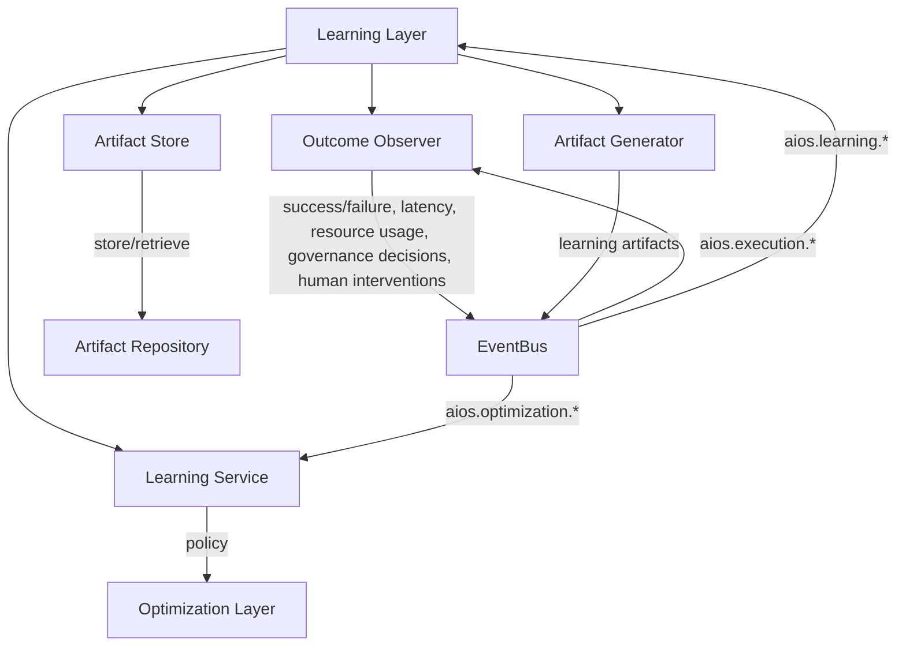
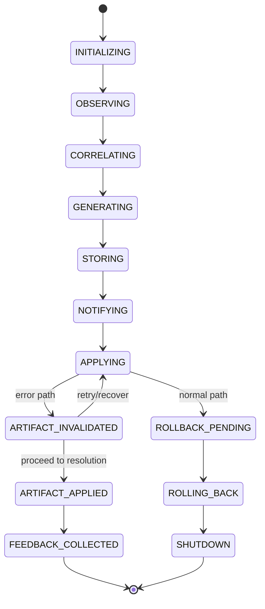
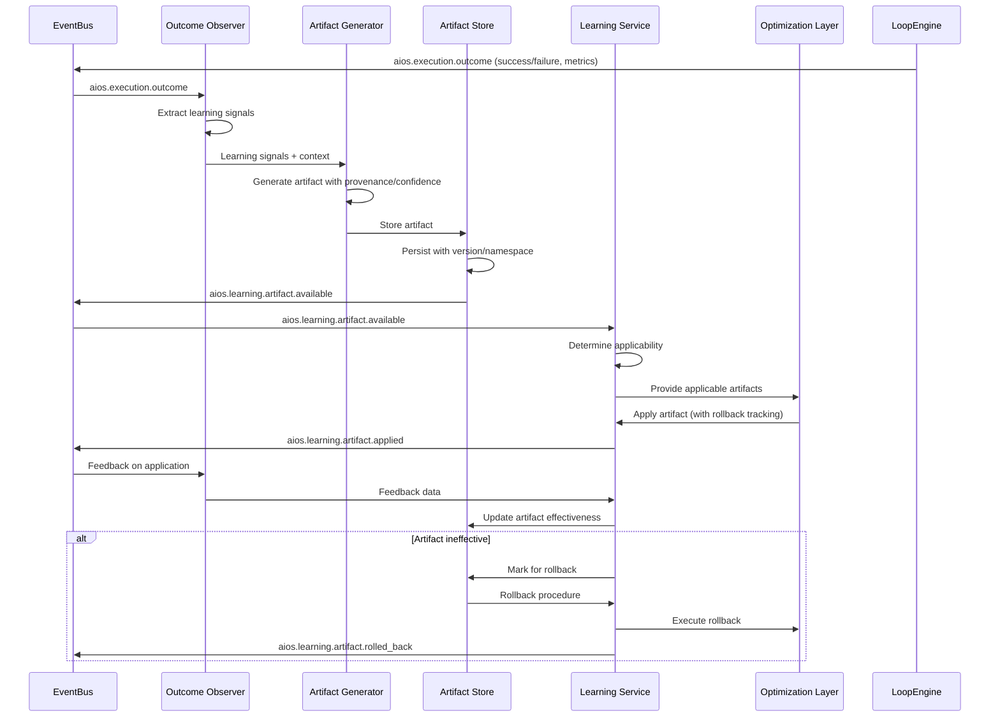
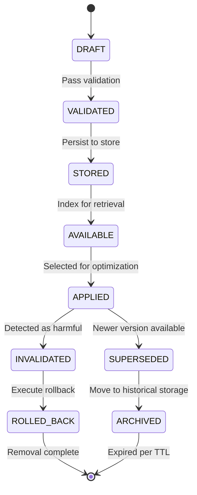

# 8.6 Learning Layer Architecture

## 8.6.1 Overview

The Learning Layer Architecture implements the continuous learning mechanism of AI-OS that observes execution outcomes, correlates them with contextual factors, and generates versioned learning artifacts that improve future execution planning and execution. The Learning Layer operates as Layer 6 in the execution pipeline, receiving execution outcomes from the Loop Engine and emitting learning artifacts that inform the Optimization Layer.

The Learning Layer implements deterministic learning with reversible artifacts, ensuring that every learned optimization can be rolled back without weakening system invariants (INV-EXEC-RT-005, CONF-FEEDBACK-4). It observes success/failure, latency, resource consumption, governance decisions, and human interventions, correlating these with capability sets, input characteristics, and environment state to produce artifacts that improve 14 specific aspects of execution (INV-EXEC-STR-010).

## 8.6.2 Architecture Overview

### 8.6.2.1 Component Diagram



### 8.6.2.2 Component Responsibilities

| Component | Responsibility |
|-----------|----------------|
| **LearningLayer** | Main orchestrator for learning functionality, receives execution outcomes, coordinates learning process |
| **OutcomeObserver** | Observes execution outcomes from EventBus, extracts learning signals, correlates with context |
| **ArtifactGenerator** | Creates versioned learning artifacts with provenance, confidence, and rollback procedures |
| **ArtifactStore** | Manages persistence and retrieval of learning artifacts with versioning and namespace scoping |
| **LearningService** | Provides learning artifacts to Optimization Layer, manages artifact lifecycle and applicability |

## 8.6.3 Internal Components

### 8.6.3.1 Outcome Observer

The Outcome Observer component observes execution outcomes from the EventBus and extracts learning signals. It correlates outcomes with:
- Capability set used in execution
- Input characteristics (intent complexity, risk level, etc.)
- Environment state (resource availability, latency, etc.)
- Governance decisions made
- Human interventions applied

### 8.6.3.2 Artifact Generator

The Artifact Generator creates versioned learning artifacts that conform to the Learning Artifact Requirements (INV-EXEC-STR-010):
- Provenance: source correlationId, generator identifier, timestamp
- Confidence: numerical value between 0.0 and 1.0
- Versioning: semantic versioning following semantic versioning specification
- Rollback capability: registered procedure to revert the artifact's effects
- Namespace scope: tenant/execution context isolation

### 8.6.3.3 Artifact Store

The Artifact Store manages the persistence and retrieval of learning artifacts with:
- Versioned storage maintaining historical artifacts
- Namespace scoping for tenant/execution context isolation
- Efficient retrieval based on applicability criteria
- Garbage collection based on TTL and usage metrics
- Rollback procedure storage and execution

### 8.6.3.4 Learning Service

The Learning Service provides learning artifacts to the Optimization Layer and manages:
- Artifact applicability determination based on current context
- Artifact version resolution and selection
- Artifact application coordination with rollback tracking
- Feedback collection on applied artifact effectiveness
- Deterministic application ensuring identical inputs produce identical outputs

## 8.6.4 Lifecycle

The Learning Layer follows this lifecycle:
1. **INITIALIZE**: Initialize components, establish EventBus subscriptions
2. **OBSERVE**: Monitor EventBus for execution outcome events (aios.execution.*)
3. **CORRELATE**: Extract learning signals and correlate with execution context
4. **GENERATE**: Create versioned learning artifacts with provenance and confidence
5. **STORE**: Persist artifacts to ArtifactStore with namespace scoping
6. **NOTIFY**: Emit learning artifacts available events to EventBus
7. **APPLY**: Provide applicable artifacts to Optimization Layer upon request
8. **ROLLBACK**: Execute rollback procedures when artifacts are invalidated
9. **SHUTDOWN**: Gracefully shutdown components and persist state

## 8.6.5 Runtime Behaviour

### 8.6.5.1 Event Processing

The Learning Layer processes events as follows:
1. Subscribes to `aios.execution.*` events via EventBus
2. For each execution outcome event:
   - Extracts outcome metrics (success/failure, latency, resource usage)
   - Retrieves execution context (capability set, input characteristics, environment)
   - Correlates outcome with context factors
   - Generates learning artifacts when significant patterns are detected
   - Stores artifacts with appropriate versioning and namespace
   - Emits `aios.learning.artifact.*` events to notify Optimization Layer

### 8.6.5.2 Deterministic Processing

All Learning Layer processing follows deterministic principles:
- Identical input events produce identical learning artifacts (INV-EXEC-RT-009)
- Artifact application is deterministic given identical context (CONF-FEEDBACK-2)
- No reliance on clocks, random values, or ambient state (INV-DET-2)
- All tie-breaking uses deterministic methods (lexicographic ordering, fixed priorities) (INV-DET-4)

### 8.6.5.3 Event Ordering

The Learning Layer maintains event ordering guarantees:
- Events processed in timestamp order per correlationId (INV-EVT-3)
- Causation graph remains acyclic and rooted at intent.received (INV-EVT-2)
- All events in a flow share the same correlationId (INV-EVT-1)

## 8.6.6 State Models

### 8.6.6.1 Learning Layer State Machine



**States:**
- **INITIALIZING**: Initializing components and EventBus subscriptions
- **OBSERVING**: Monitoring EventBus for execution outcomes
- **CORRELATING**: Extracting and correlating learning signals
- **GENERATING**: Creating learning artifacts with provenance and confidence
- **STORING**: Persisting artifacts to ArtifactStore
- **NOTIFYING**: Emitting learning artifact events
- **APPLYING**: Providing artifacts to Optimization Layer
- **ROLLBACK_PENDING**: Artifact marked for rollback
- **ROLLING_BACK**: Executing rollback procedure
- **FEEDBACK_COLLECTED**: Collected feedback on artifact effectiveness
- **ARTIFACT_INVALIDATED**: Artifact detected as invalid or harmful
- **SHUTDOWN**: Graceful shutdown of components

### 8.6.6.2 Learning Artifact State

```
DRAFT → VALIDATED → STORED → AVAILABLE → APPLIED → [SUPERSEDED → ARCHIVED] 
                                        ↓                             ↑
                                    INVALIDATED ← ROLLED_BACK
```

**States:**
- **DRAFT**: Artifact being generated
- **VALIDATED**: Artifact passes validation checks
- **STORED**: Artifact persisted to ArtifactStore
- **AVAILABLE**: Artifact ready for application
- **APPLIED**: Artifact currently applied in optimization
- **SUPERSEDED**: Newer version of artifact available
- **ARCHIVED**: Artifact moved to historical storage
- **INVALIDATED**: Artifact determined to be harmful
- **ROLLED_BACK**: Artifact rollback executed

## 8.6.7 Component Diagrams

### 8.6.7.1 Learning Layer Component Interaction



### 8.6.7.2 Artifact Lifecycle



## 8.6.8 Event Flows

### 8.6.8.1 Learning Artifact Generation Flow

1. Loop Engine publishes `aios.execution.outcome` event with execution results
2. Outcome Observer subscribes to `aios.execution.*` and processes outcome event
3. Outcome Observer extracts learning signals and correlates with execution context
4. Outcome Observer requests Artifact Generator to create learning artifact
5. Artifact Generator creates artifact with provenance (correlationId, generator, timestamp)
6. Artifact Generator assigns confidence based on statistical significance
7. Artifact Generator versions artifact using semantic versioning
8. Artifact Generator registers rollback procedure for artifact
9. Artifact Generator stores artifact in ArtifactStore with namespace scoping
10. Artifact Store persists artifact and indexes for retrieval
11. Artifact Store publishes `aios.learning.artifact.available` event
12. Learning Service subscribes to artifact availability and processes event
13. Learning Service determines artifact applicability to current context
14. Learning Service provides applicable artifacts to Optimization Layer
15. Optimization Layer applies artifacts to generate optimized plans
16. Optimization Layer reports application success/failure to Learning Service
17. Learning Service collects feedback on artifact effectiveness
18. Learning Service updates artifact effectiveness metrics in ArtifactStore

### 8.6.8.2 Learning Artifact Application Flow

1. Optimization Layer requests applicable learning artifacts from Learning Service
2. Learning Service queries ArtifactStore for artifacts matching current context
3. Learning Service filters artifacts by namespace, applicability, and validity
4. Learning Service sorts artifacts by confidence and relevance
5. Learning Service provides top artifacts to Optimization Layer
6. Optimization Layer integrates artifacts into optimization process
7. Optimization Layer generates optimized CapabilityPlan with applied artifacts
8. Optimization Layer publishes `aios.optimization.policy.published` event
9. Learning Service tracks applied artifacts for effectiveness measurement
10. After execution, Learning Service collects outcome metrics
11. Learning Service updates artifact effectiveness based on observed outcomes

### 8.6.8.3 Learning Artifact Rollback Flow

1. Learning Service detects artifact ineffectiveness or harm
2. Learning Service requests ArtifactStore to validate rollback procedure
3. ArtifactStore validates and prepares rollback procedure
4. Learning Service instructs Optimization Layer to remove artifact influence
5. Optimization Layer regenerates plan without artifact influence
6. Learning Service executes registered rollback procedure
7. Learning Service verifies rollback completion and system consistency
8. Learning Service publishes `aios.learning.artifact.rolled_back` event
9. Artifact Store marks artifact as rolled back and updates availability

## 8.6.9 Event Specification Tables

### 8.6.9.1 Learning Layer Events

| Event Type | Description | Required Fields | Optional Fields |
|------------|-------------|-----------------|-----------------|
| `aios.learning.observation.started` | Observation of execution outcome initiated | eventId, correlationId, timestamp, source, version | causationId |
| `aios.learning.observation.completed` | Observation of execution outcome completed | eventId, correlationId, timestamp, source, version, outcomeMetrics | causationId, contextSnapshot |
| `aios.learning.artifact.generated` | New learning artifact generated | eventId, correlationId, timestamp, source, version, artifactId, artifactType, confidence | causationId, provenance, version |
| `aios.learning.artifact.stored` | Learning artifact stored in ArtifactStore | eventId, correlationId, timestamp, source, version, artifactId, storageLocation | causationId, version, sizeBytes |
| `aios.learning.artifact.available` | Learning artifact available for application | eventId, correlationId, timestamp, source, version, artifactId, applicabilityScope | causationId, confidence, version |
| `aios.learning.artifact.applied` | Learning artifact applied in optimization | eventId, correlationId, timestamp, source, version, artifactId, planId | causationId, applicationContext |
| `aios.learning.artifact.rolled_back` | Learning artifact rolled back | eventId, correlationId, timestamp, source, version, artifactId, rollbackStatus | causationId, rollbackProcedure |
| `aios.learning.artifact.expired` | Learning artifact expired per TTL | eventId, correlationId, timestamp, source, version, artifactId | causationId, expiryTime |
| `aios.learning.feedback.received` | Feedback received on artifact effectiveness | eventId, correlationId, timestamp, source, version, artifactId, effectivenessScore | causationId, feedbackContext |

### 8.6.9.2 Event Field Definitions

| Field | Type | Description | Constraints |
|-------|------|-------------|-------------|
| eventId | string (UUIDv7) | Unique event identifier | format: "uuid" |
| correlationId | string (UUIDv7) | Links all events for single flow | format: "uuid" |
| causationId | string (UUIDv7) | Links to triggering event | format: "uuid" |
| timestamp | string (ISO8601 ns) | Event occurrence time | format: "date-time" |
| source | string | Component identifier | matches: "^[a-zA-Z0-9\-_.]+$" |
| version | string (semver) | Event schema version (of the event) | format: "semver" |
| outcomeMetrics | object | Execution outcome metrics | defined in OutcomeMetrics schema |
| artifactId | string (UUIDv7) | Unique artifact identifier | format: "uuid" |
| artifactType | string | Type of learning artifact | enum: [WORKFLOW_SELECTION, CAPABILITY_SELECTION, MODEL_ROUTING, COUNCIL_COMPOSITION, RETRY_POLICY, SKILL_RANKING, MCP_SELECTION, EXECUTION_PLANNING, FAILURE_RECOVERY, PROMPT_OPTIMIZATION, PROVIDER_SELECTION, COUNCIL_EFFECTIVENESS, CONFIDENCE_CALIBRATION, ENVIRONMENT_OPTIMIZATION] |
| confidence | number | Artifact confidence level | minimum: 0.0, maximum: 1.0 |
| provenance | object | Artifact provenance information | defined in Provenance schema |
| version | string (semver) | Artifact version (semantic version of the learning artifact) | format: "semver" |
| applicabilityScope | object | Context where artifact applies | defined in ApplicabilityScope schema |
| planId | string (UUIDv7) | Associated plan identifier | format: "uuid" |
| effectivenessScore | number | Measured artifact effectiveness | minimum: -1.0, maximum: 1.0 |
| rollbackStatus | string | Status of rollback operation | enum: [SUCCESS, FAILED, PARTIAL, PENDING] |
| rollbackProcedure | string | Reference to rollback procedure | minLength: 1 |
| storageLocation | string | Artifact storage location | format: "uri" |
| sizeBytes | integer | Artifact storage size | minimum: 0 |
| expiryTime | string (ISO8601 ns) | Artifact expiration time | format: "date-time" |
| feedbackContext | object | Context of feedback provision | defined in FeedbackContext schema |

## 8.6.10 JSON Schema Definitions

### 8.6.10.1 Learning Artifact Schema

```json
{
  "$schema": "https://json-schema.org/draft/2020-12/schema",
  "$id": "https://ai-os.org/schemas/learning-artifact.json",
  "title": "Learning Artifact",
  "type": "object",
  "required": ["artifactId", "artifactType", "version", "confidence", "provenance", "timestamp", "namespace"],
  "properties": {
    "artifactId": {
      "type": "string",
      "format": "uuid",
      "description": "Unique identifier for the learning artifact"
    },
    "artifactType": {
      "type": "string",
      "enum": [
        "WORKFLOW_SELECTION",
        "CAPABILITY_SELECTION",
        "MODEL_ROUTING",
        "COUNCIL_COMPOSITION",
        "RETRY_POLICY",
        "SKILL_RANKING",
        "MCP_SELECTION",
        "EXECUTION_PLANNING",
        "FAILURE_RECOVERY",
        "PROMPT_OPTIMIZATION",
        "PROVIDER_SELECTION",
        "COUNCIL_EFFECTIVENESS",
        "CONFIDENCE_CALIBRATION",
        "ENVIRONMENT_OPTIMIZATION"
      ],
      "description": "Type of learning artifact"
    },
    "version": {
      "type": "string",
      "format": "semver",
      "description": "Semantic version of the artifact"
    },
    "confidence": {
      "type": "number",
      "minimum": 0.0,
      "maximum": 1.0,
      "description": "Confidence level in the artifact's effectiveness"
    },
    "provenance": {
      "type": "object",
      "required": ["correlationId", "generator", "timestamp"],
      "properties": {
        "correlationId": {
          "type": "string",
          "format": "uuid",
          "description": "Source execution correlation ID"
        },
        "generator": {
          "type": "string",
          "description": "Component that generated the artifact"
        },
        "timestamp": {
          "type": "string",
          "format": "date-time",
          "description": "Timestamp of artifact generation"
        },
        "inputCharacteristics": {
          "type": "object",
          "description": "Characteristics of input that led to artifact generation"
        },
        "environmentState": {
          "type": "object",
          "description": "Environment state at time of artifact generation"
        }
      },
      "description": "Provenance information for the artifact"
    },
    "namespace": {
      "type": "string",
      "description": "Namespace/scope for artifact isolation (tenant/execution context)"
    },
    "applicabilityScope": {
      "type": "object",
      "description": "Defines contexts where this artifact is applicable",
      "properties": {
        "capabilitySets": {
          "type": "array",
          "items": {
            "type": "string",
            "format": "uuid"
          },
          "description": "Capability sets where artifact applies"
        },
        "inputPatterns": {
          "type": "array",
          "items": {
            "type": "string"
          },
          "description": "Input patterns where artifact applies"
        },
        "environmentConditions": {
          "type": "object",
          "description": "Environment conditions where artifact applies"
        },
        "governmentContext": {
          "type": "object",
          "description": "Governance context where artifact applies"
        }
      }
    },
    "rollbackProcedure": {
      "type": "string",
      "minLength": 1,
      "description": "Reference to procedure for rolling back this artifact"
    },
    "effectivenessMetrics": {
      "type": "object",
      "properties": {
        "averageImprovement": {
          "type": "number",
          "description": "Average performance improvement observed"
        },
        "applicationCount": {
          "type": "integer",
          "minimum": 0,
          "description": "Number of times artifact has been applied"
        },
        "successRate": {
          "type": "number",
          "minimum": 0.0,
          "maximum": 1.0,
          "description": "Rate of successful applications"
        }
      },
      "description": "Metrics tracking artifact effectiveness"
    },
    "createdAt": {
      "type": "string",
      "format": "date-time",
      "description": "Timestamp when artifact was created"
    },
    "updatedAt": {
      "type": "string",
      "format": "date-time",
      "description": "Timestamp when artifact was last updated"
    },
    "expiresAt": {
      "type": "string",
      "format": "date-time",
      "description": "Timestamp when artifact expires (optional)"
    }
  },
  "additionalProperties": false
}
```

### 8.6.10.2 Outcome Metrics Schema

```json
{
  "$schema": "https://json-schema.org/draft/2020-12/schema",
  "$id": "https://ai-os.org/schemas/outcome-metrics.json",
  "title": "Execution Outcome Metrics",
  "type": "object",
  "required": ["success", "timestamp"],
  "properties": {
    "success": {
      "type": "boolean",
      "description": "Whether execution was successful"
    },
    "timestamp": {
      "type": "string",
      "format": "date-time",
      "description": "Timestamp of outcome measurement"
    },
    "latencyMs": {
      "type": "integer",
      "minimum": 0,
      "description": "Execution latency in milliseconds"
    },
    "resourceUsage": {
      "type": "object",
      "properties": {
        "cpuUtilization": {
          "type": "number",
          "minimum": 0.0,
          "maximum": 1.0
        },
        "memoryUsageMb": {
          "type": "integer",
          "minimum": 0
        },
        "networkIoBytes": {
          "type": "integer",
          "minimum": 0
        },
        "storageIoBytes": {
          "type": "integer",
          "minimum": 0
        }
      },
      "description": "Resource consumption during execution"
    },
    "governanceDecisions": {
      "type": "array",
      "items": {
        "type": "object",
        "required": ["decisionId", "outcome", "timestamp"],
        "properties": {
          "decisionId": {
            "type": "string",
            "format": "uuid"
          },
          "outcome": {
            "type": "string",
            "enum": ["APPROVED", "DENIED", "DEFERRED", "ESCALATED"]
          },
          "timestamp": {
            "type": "string",
            "format": "date-time"
          },
          "rationale": {
            "type": "string"
          }
        }
      },
      "description": "Governance decisions made during execution"
    },
    "humanInterventions": {
      "type": "array",
      "items": {
        "type": "object",
        "required": ["interactionId", "type", "timestamp"],
        "properties": {
          "interactionId": {
            "type": "string",
            "format": "uuid"
          },
          "type": {
            "type": "string",
            "enum": ["OVERRIDE", "MODIFICATION", "APPROVAL", "REJECTION", "ESCALATION"]
          },
          "timestamp": {
            "type": "string",
            "format": "date-time"
          },
          "description": {
            "type": "string"
          }
        }
      },
      "description": "Human interventions during execution"
    },
    "errorDetails": {
      "type": "object",
      "properties": {
        "errorType": {
          "type": "string"
        },
        "errorMessage": {
          "type": "string"
        },
        "stackTrace": {
          "type": "string"
        },
        "recoverable": {
          "type": "boolean"
        }
      },
      "description": "Details of any errors encountered"
    }
  },
  "additionalProperties": false
}
```

### 8.6.10.3 Provenance Schema

```json
{
  "$schema": "https://json-schema.org/draft/2020-12/schema",
  "$id": "https://ai-os.org/schemas/provenance.json",
  "title": "Artifact Provenance",
  "type": "object",
  "required": ["correlationId", "generator", "timestamp"],
  "properties": {
    "correlationId": {
      "type": "string",
      "format": "uuid",
      "description": "Source execution correlation ID"
    },
    "generator": {
      "type": "string",
      "description": "Component that generated the artifact (e.g., 'OutcomeObserver')"
    },
    "timestamp": {
      "type": "string",
      "format": "date-time",
      "description": "Timestamp of artifact generation"
    },
    "inputCharacteristics": {
      "type": "object",
      "description": "Characteristics of input that led to artifact generation"
    },
    "environmentState": {
      "type": "object",
      "description": "Environment state at time of artifact generation"
    }
  },
  "additionalProperties": false
}
```

## 8.6.11 Validation Rules

1. **Artifact Validation**:
   - ALL artifacts MUST contain valid provenance information (correlationId, generator, timestamp)
   - Confidence values MUST be between 0.0 and 1.0 inclusive
   - Version strings MUST conform to semantic versioning specification
   - Namespace identifiers MUST conform to naming conventions
   - Rollback procedures MUST be valid and executable references

2. **Provenance Validation**:
   - correlationId MUST be a valid UUIDv7
   - generator field MUST not be empty
   - timestamp MUST be a valid ISO8601 timestamp
   - inputCharacteristics and environmentState MUST be valid JSON objects when present

3. **Applicability Validation**:
   - capabilitySets array elements MUST be valid UUIDs when present
   - inputPatterns array elements MUST be non-empty strings when present
   - environmentConditions and governmentContext MUST be valid JSON objects when present

4. **Referential Integrity**:
   - artifactId MUST be unique within the ArtifactStore
   - rollbackProcedure MUST reference a valid, executable procedure
   - namespace MUST conform to tenant/execution context isolation requirements

## 8.6.12 Runtime Invariants

1. **INV-LEARN-1**: All learning artifacts MUST have verifiable provenance linking to a specific execution correlationId
2. **INV-LEARN-2**: Artifact confidence values MUST be deterministically calculated from identical input contexts
3. **INV-LEARN-3**: Artifact versioning MUST follow semantic versioning and be incrementally updated
4. **INV-LEARN-4**: All artifacts MUST have a defined and testable rollback procedure
5. **INV-LEARN-5**: Artifacts MUST be properly namespaced to prevent cross-tenant interference
6. **INV-LEARN-6**: Application of artifacts MUST be deterministic given identical context and artifact version
7. **INV-LEARN-7**: ARTIFACT_INVALIDATED state MUST trigger rollback process within bounded time
8. **INV-LEARN-8**: Memory growth of ArtifactStore MUST be bounded by configured TTL and LRU policies
9. **INV-LEARN-9**: Event processing order MUST maintain causation graph integrity per INV-EVT-1 through INV-EVT-4
10. **INV-LEARN-10**: ALL learning operations MUST preserve system invariants defined in PART8_CONTEXT.md

## 8.6.13 Conformance Requirements

### 8.6.13.1 Functional Requirements

1. **Observation Capability**:
   - MUST observe all `aios.execution.*` events via EventBus subscription
   - MUST extract learning signals including success/failure, latency, resource usage, governance decisions, and human interventions
   - MUST correlate learned signals with execution context including capability sets, input characteristics, and environment state

2. **Artifact Generation**:
   - MUST generate versioned learning artifacts with provable provenance
   - MUST assign confidence scores based on statistical significance of observations
   - MUST implement semantic versioning for all artifacts
   - MUST register executable rollback procedures for all artifacts
   - MUST apply namespace scoping for tenant/execution context isolation

3. **Artifact Management**:
   - MUST persist artifacts with versioned storage supporting historical retrieval
   - MUST provide efficient retrieval based on applicability criteria
   - MUST implement garbage collection based on TTL and usage metrics
   - MUST maintain referential integrity of artifacts and rollback procedures

4. **Learning Service**:
   - MUST determine artifact applicability based on current execution context
   - MUST provide applicable artifacts to Optimization Layer upon request
   - MUST track artifact effectiveness through feedback mechanisms
   - MUST ensure deterministic application of artifacts

### 8.6.13.2 Performance Requirements

1. **Observation Latency**:
   - 95th percentile of observation processing MUST complete within 100ms of event receipt
   - 99th percentile of observation processing MUST complete within 500ms of event receipt

2. **Artifact Generation**:
   - 95th percentile of artifact generation MUST complete within 200ms
   - 99th percentile of artifact generation MUST complete within 1 second

3. **Storage Operations**:
   - 95th percentile of artifact storage operations MUST complete within 50ms
   - 99th percentile of artifact storage operations MUST complete within 200ms

4. **Retrieval Performance**:
   - 95th percentile of applicable artifact retrieval MUST complete within 100ms
   - 99th percentile of applicable artifact retrieval MUST complete within 500ms

### 8.6.13.3 Safety Requirements

1. **Artifact Safety**:
   - ALL artifacts MUST undergo validation before storage
   - Artifacts proposing harmful optimizations MUST be rejected
   - System MUST maintain whitelist of safe artifact types and operations

2. **Rollback Safety**:
   - Rollback procedures MUST be tested and validated before use
   - System MUST verify rollback completion and effectiveness
   - Failed rollbacks MUST trigger escalation procedures

3. **Isolation Requirements**:
   - Artifacts MUST be properly namespaced to prevent cross-tenant interference
   - System MUST enforce namespace boundaries for artifact application
   - Cross-namespace artifact sharing MUST require explicit authorization

## 8.6.14 Deterministic Replay Requirements

### 8.6.14.1 Replay Capability

1. **Complete Event Capture**:
   - ALL learning-relevant events MUST be captured for replay
   - Execution outcomes MUST be captured with sufficient detail for learning
   - Context information MUST be captured as part of artifact provenance

2. **Deterministic Reconstruction**:
   - Learning Layer state MUST be reconstructable from event log
   - Artifact generation MUST be deterministic given identical inputs
   - Artifact application and rollback MUST be deterministic

3. **Replay Validation**:
   - Replayed learning artifacts MUST be bit-identical to originals
   - Replayed artifact applications MUST produce identical results
   - System invariants MUST hold during and after replay

### 8.6.14.2 Replay Process

1. **Capture Phase**:
   - Record all `aios.execution.*` events with full payloads
   - Capture execution context as part of artifact provenance
   - Store all learning artifact generation and application events

2. **Replay Phase**:
   - Replay events in original order per correlationId
   - Process events through identical Learning Layer logic
   - Generate artifacts using identical deterministic algorithms
   - Apply artifacts using identical deterministic processes

3. **Validation Phase**:
   - Compare replayed artifacts with originals (bit-identical)
   - Validate that system invariants hold throughout replay
   - Confirm that replayed outcomes match original outcomes

## 8.6.15 Error Handling

### 8.6.15.1 Error Categories

1. **Observation Errors**:
   - Failed to extract learning signals from execution outcomes
   - Invalid or incomplete execution outcome data
   - Context correlation failures

2. **Generation Errors**:
   - Failed to generate valid learning artifact
   - Provenance information incomplete or invalid
   - Confidence calculation failure

3. **Storage Errors**:
   - Failed to persist learning artifact
   - Namespace conflicts or invalid namespace
   - Storage quota exceeded

4. **Application Errors**:
   - Artifact not applicable to current context
   - Failed to apply artifact to optimization process
   - Invalid artifact version or format

5. **Rollback Errors**:
   - Rollback procedure not found or invalid
   - Failed to execute rollback procedure
   - Rollback verification failure

### 8.6.15.2 Error Handling Procedures

1. **Observation Error Handling**:
   - Log error with sufficient diagnostic information
   - Skip observation and continue processing
   - Emit diagnostic event for monitoring systems
   - Do not block processing of other observations

2. **Generation Error Handling**:
   - Discard incomplete or invalid artifact
   - Log error with provenance information for debugging
   - Emit diagnostic event
   - Continue processing other learning signals

3. **Storage Error Handling**:
   - Retry storage operation with exponential backoff
   - Fall back to secondary storage if configured
   - Emit alert for persistent storage failures
   - Maintain in-memory buffer for recent artifacts

4. **Application Error Handling**:
   - Skip artifact application and log reason
   - Emit diagnostic event for monitoring
   - Continue with standard optimization process
   - Mark artifact for review if application failures persist

5. **Rollback Error Handling**:
   - Attempt retry of rollback procedure with backoff
   - Escalate to manual intervention if rollback repeatedly fails
   - Preserve system state for forensic analysis
   - Notify operators of potential system inconsistency

## 8.6.16 Security Considerations

### 8.6.16.1 Data Protection

1. **Provenance Privacy**:
   - Sanitize sensitive information from provenance data
   - Implement configurable privacy levels for provenance storage
   - Encrypt provenance data at rest and in transit

2. **Artifact Confidentiality**:
   - Protect learning artifacts that may contain sensitive patterns
   - Implement access controls for artifact storage and retrieval
   - Encrypt sensitive artifact content based on classification

3. **Access Control**:
   - Implement role-based access control for learning artifact operations
   - Separate duties between artifact generation, storage, and application
   - Audit all access to learning artifacts and provenance data

### 8.6.16.2 Integrity Protection

1. **Artifact Integrity**:
   - Implement cryptographic hashing for artifact integrity verification
   - Sign critical learning artifacts with institutional keys
   - Verify artifact integrity before storage and application

2. **Process Integrity**:
   - Validate learning process parameters to prevent manipulation
   - Implement integrity checks for artifact generation algorithms
   - Monitor for anomalous learning patterns indicating tampering

### 8.6.16.3 Availability Protection

1. **Resource Protection**:
   - Implement rate limiting for learning artifact operations
   - Protect against resource exhaustion through learning spam
   - Implement garbage collection to prevent storage exhaustion

2. **Failure Isolation**:
   - Isolate Learning Layer failures to prevent cascade effects
   - Implement circuit breaker patterns for downstream dependencies
   - Ensure core execution continues despite Learning Layer failures

## 8.6.17 Change Log

| Version | Date | Changes |
|---------|------|---------|
| 1.0.0 | 2026-08-01 | Initial version of Learning Layer Architecture specification |