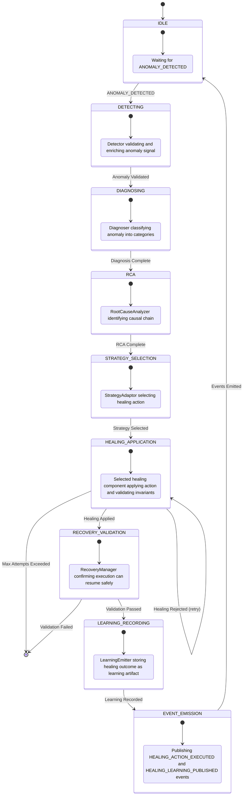

# 8.8 Self-Healing Layer Architecture

## 8.8.1 Overview

The Self-Healing Layer (Layer 8) is responsible for detecting anomalies during execution, diagnosing issues, performing root cause analysis, and implementing healing actions to restore normal operation without human intervention. It operates as a reactive, policy-gated process that consumes anomaly events and execution context to produce validated healing actions that are applied to recover failing executions.

The Self-Healing Layer MUST adhere to the EventBus-first principle, communicating exclusively through events with other layers. It MUST ensure deterministic operation, safety via invariant validation, traceability of all healing decisions, and adherence to computational budgets and attempt limits.

## 8.8.2 Architecture Overview

The Self-Healing Layer follows a linear pipeline architecture comprising nine primary stages:

1. **Detector** – Monitors ObservabilityManager metrics, EventBus diagnostics, and capability heartbeats to detect anomalies
2. **Diagnoser** – Classifies detected anomalies into categories (execution, environment, planning)
3. **Root Cause Analyzer** – Identifies the causal chain leading to the anomaly
4. **Strategy Adaptor** – Selects appropriate healing action based on diagnosis and policy constraints
5. **Capability Substitutor** – Swaps failing capabilities with alternatives per Recommendation Graph
6. **Model Substitutor** – Switches model providers when capability substitution is insufficient
7. **Workflow Adjuster** – Restructures the execution graph to bypass problematic paths
8. **Recovery Manager** – Restores normal execution using the healed plan
9. **Learning Emitter** – Records healing outcomes as learning artifacts for future prevention

The layer receives `ANOMALY_DETECTED` events from the Execution Layer (Layer 4) and Loop Engine (Layer 5) and emits `HEALING_ACTION_EXECUTED` events containing details of applied healing actions. Additionally, for each healing cycle, it emits an `RCA_COMPLETE` event detailing the root cause analysis when completed.

All communication flows through the EventBus owned by the Hermes Kernel, preserving causation and correlation IDs for deterministic replay.

## 8.8.3 Internal Components

| Component | Responsibility | Interfaces |
|-----------|----------------|------------|
| **Detector** | Monitors system health via ObservabilityManager metrics, EventBus diagnostics, and capability heartbeats | Reads from ObservabilityManager and EventBus; emits `ANOMALY_DETECTED` |
| **Diagnoser** | Classifies anomalies into execution, environment, or planning categories | Consumes anomaly signals; emits `ANOMALY_DIAGNOSED` |
| **RootCauseAnalyzer** | Identifies causal chains using dependency graphs and execution traces | Consumes diagnosed anomalies; emits `RCA_COMPLETE` |
| **StrategyAdaptor** | Selects healing actions based on diagnosis, policy constraints, and historical effectiveness | Consumes RCA results; emits `HEALING_STRATEGY_SELECTED` |
| **CapabilitySubstitutor** | Implements capability swaps using Recommendation Graph from Planning Memory | Consumes strategy selection; emits `CAPABILITY_SUBSTITUTED` |
| **ModelSubstitutor** | Switches model providers when capability substitution fails or is inappropriate | Consumes strategy selection; emits `MODEL_SUBSTITUTED` |
| **WorkflowAdjuster** | Restructures execution graph to bypass problematic nodes or paths | Consumes strategy selection; emits `WORKFLOW_ADJUSTED` |
| **RecoveryManager** | Restores normal execution using healed plan and validates invariants | Consumes healing actions; emits `HEALING_ACTION_EXECUTED` |
| **LearningEmitter** | Records healing outcomes as versioned learning artifacts with provenance | Consumes healing results; emits `HEALING_LEARNING_PUBLISHED` |

## 8.8.4 Responsibilities

The Self-Healing Layer MUST:

- Detect anomalies through ObservabilityManager metrics (timeout, cost overruns >20%, latency p99 >2× estimate), EventBus diagnostics, and capability heartbeats
- Diagnose anomalies into categories: execution (runtime failures), environment (registry unavailable, capability deprecated), or planning (partial discovery, ambiguous resolution)
- Perform root cause analysis to identify the causal chain leading to the anomaly
- Select healing actions based on diagnosis, policy constraints (bounded attempts, time limits), and historical effectiveness
- Apply capability substitution by swapping failing capabilities with alternatives per Recommendation Graph
- Apply model substitution by switching model providers when needed
- Adjust workflow by restructuring the execution graph to bypass problematic elements
- Restore normal execution using the healed plan and verify ALL architectural invariants hold
- Emit healing records as learning artifacts to the Learning Layer for future prevention
- Ensure deterministic operation: identical inputs (anomaly event, execution context, policy snapshot) must produce identical healing decisions
- Enforce bounded healing attempts (default 3 per scope); excess attempts trigger CRITICAL escalation to human intervention
- Ensure healed plans satisfy ALL original invariants (INV-HEAL-2)
- Maintain full traceability to triggerEventId, originalPlanId, and healingRuleId (INV-HEAL-3)
- Verify healed plans pass Replay Verification (INV-HEAL-5)
- Ensure trigger → healed plan resolution within default 30s timeout; timeout → escalate (INV-HEAL-4)

## 8.8.5 Lifecycle

The Self-Healing Layer lifecycle is triggered by anomaly detection:

1. **Idle State**: Awaits `ANOMALY_DETECTED` event from Execution Layer or Loop Engine
2. **Detection**: Upon receiving `ANOMALY_DETECTED`, the Detector validates and enriches the anomaly signal
3. **Diagnosis**: Diagnoser classifies the anomaly into execution, environment, or planning category
4. **Root Cause Analysis**: RootCauseAnalyzer identifies the causal chain using dependency graphs and execution traces
5. **Strategy Selection**: StrategyAdaptor selects appropriate healing action based on diagnosis and policy constraints
6. **Healing Application**: Selected healing component (CapabilitySubstitutor, ModelSubstitutor, or WorkflowAdjuster) applies the healing action
7. **Recovery Validation**: RecoveryManager restores execution and validates that ALL invariants hold for the healed plan
8. **Learning Recording**: LearningEmitter records the healing outcome as a versioned learning artifact with full provenance
9. **Completion**: Emits `HEALING_ACTION_EXECUTED` and `HEALING_LEARNING_PUBLISHED` events; returns to idle state

The layer does not maintain persistent state between healing cycles beyond what is stored in the Learning Artifacts Store; each healing cycle is functionally independent given its inputs.

## 8.8.6 Runtime Behaviour

At runtime, the Self-Healing Layer exhibits the following characteristics:

- **Deterministic**: Given identical inputs (ANOMALY_DETECTED event payload, Execution Context snapshot, Policy Snapshot, Config Snapshot), the sequence of detection, diagnosis, RCA, strategy selection, healing application, and learning recording yields identical healing decisions and emitted events
- **Event-Driven**: All interactions occur via EventBus; no direct method invocations between layers are permitted in RUNNING state
- **Attempt-Bounded**: Enforces a configurable limit on healing attempts per scope (default 3); excess attempts trigger CRITICAL escalation
- **Time-Bounded**: Enforces a maximum time limit for trigger → healed plan resolution (default 30s); timeout triggers escalation
- **Invariant-Guarded**: Every healing action is guarded by automatic verification that ALL architectural invariants hold for the resulting healed plan; violations cause automatic rollback of that healing step
- **Traceable**: Each healing decision logs the anomaly details, diagnosis, RCA findings, selected strategy, applied healing action, before/after metrics, and validation evidence
- **Policy-Gated**: No healing action is attempted unless permitted by active healing policy constraints (attempt limits, timeouts, allowed action types)
- **Versioned Output**: Published healing learning artifacts are immutable, versioned (semantic), content-addressed (SHA-256), and include `generatedBy` and `timestamp` metadata

## 8.8.7 Processing Pipeline

The Self-Healing Layer processes each anomaly through the following deterministic pipeline:

1. **Detect Anomaly** (`Detector`):
   - Input: `ANOMALY_DETECTED` event payload (contains anomaly type, severity, metrics, correlation ID)
   - Action: Validate anomaly signal, enrich with contextual metadata from ObservabilityManager and capability heartbeats
   - Output: Validated anomaly signal with enrichment data

2. **Diagnose Anomaly** (`Diagnoser`):
   - Input: Validated anomaly signal; policy snapshot indicating healing constraints
   - Action: Classify anomaly into execution, environment, or planning category based on source and symptoms
   - Output: Diagnosis classification with confidence score

3. **Perform Root Cause Analysis** (`RootCauseAnalyzer`):
   - Input: Diagnosis classification; execution trace; capability dependency graph
   - Action: Identify causal chain leading to anomaly using dependency analysis and correlation analysis
   - Output: Root cause analysis report with causal elements and confidence scores

4. **Select Healing Strategy** (`StrategyAdaptor`):
   - Input: RCA report; policy snapshot; historical healing effectiveness data
   - Action: Select optimal healing action (capability substitution, model substitution, workflow adjustment, or strategic adaptation) based on diagnosis, constraints, and predicted effectiveness
   - Output: Selected healing strategy with parameters and predicted impact

5. **Apply Healing Action** (CapabilitySubstitutor/ModelSubstitutor/WorkflowAdjuster):
   - Input: Selected healing strategy; current Execution Context and CapabilityPlan
   - Action: Apply the selected healing action:
     - For capability substitution: swap failing capabilities with alternatives per Recommendation Graph
     - For model substitution: switch model providers for affected capabilities
     - For workflow adjustment: restructure execution graph to bypass problematic paths
   - Action: Verify ALL architectural invariants hold for the healed plan
   - Action: If verification passes, promote healed plan as current context; record the applied healing action
   - Action: If verification fails, discard healing attempt and proceed to next strategy (if attempts remain)
   - Output: Healed Execution Context and CapabilityPlan (or original if healing failed), list of applied healing actions with before/after metrics

6. **Validate Recovery** (`RecoveryManager`):
   - Action: Confirm healed plan enables successful execution resumption
   - Action: Verify ALL architectural invariants remain satisfied
   - Action: Execute consistency checks to ensure no regression introduced
   - Output: Recovery validation confirmation

7. **Emit Healing Executed** (`RecoveryManager`):
   - Action: Emit `HEALING_ACTION_EXECUTED` event containing:
     - Healing action type and parameters
     - Before metrics (execution time, cost, resource usage at failure point)
     - After metrics (estimated post-healing)
     - Applied healing action details
     - Validation evidence (invariant check results)
     - Correlation and causation IDs

8. **Record Learning** (`LearningEmitter`):
   - Input: Healing outcome, validation evidence, execution context
   - Action: Construct healing learning artifact encapsulating the anomaly, diagnosis, RCA, applied action, and outcomes
   - Action: Store in Learning Artifacts Store with semantic version, SHA-256 content hash, `generatedBy: "SelfHealingLayer/x.y.z"`, and timestamp
   - Output: Storage confirmation

9. **Publish Healing Learning** (`LearningEmitter`):
   - Action: Emit `HEALING_LEARNING_PUBLISHED` event containing:
     - Learning artifact ID (UUIDv7)
     - Version (semver)
     - Content hash (SHA-256)
     - Generation timestamp
     - Source anomaly ID
     - Applied healing actions summary
     - Correlation ID from triggering `ANOMALY_DETECTED`

Each step is a pure function of its inputs and the current policy snapshot, ensuring determinism.

## 8.8.8 State Models

The Self-Healing Layer does not maintain persistent internal state machines; its behavior is defined by the processing pipeline. However, the following conceptual states apply during processing:



### Healing Learning Artifact Schema

The healing learning artifact persisted to the Learning Artifacts Store conforms to the following logical structure (see JSON Schema definitions in section 8.8.11):

- `artifactId`: UUIDv7
- `version`: Semantic version string
- `contentHash`: `"sha256:<hex>"`
- `generatedBy`: String (e.g., `"SelfHealingLayer/1.0.0"`)
- `timestamp`: ISO8601 nanosecond timestamp
- `sourceAnomalyId`: UUIDv7 of the triggering `ANOMALY_DETECTED` event
- `healingActions`: Array of healing action objects, each containing:
  - `type`: Healing action type (e.g., `"CapabilitySubstitution"`)
  - `description`: Human-readable description
  - `parameters`: JSON object of action-specific parameters
  - `predictedImpact`: Object with estimated metric deltas (time, cost, risk, etc.)
  - `validationEvidence`: Reference to invariant check results
- `outcome`: Object containing:
  - `success`: Boolean indicating if healing was successful
  - `resolutionTimeMs`: Time taken from detection to healed plan
  - `postHealingMetrics`: Metrics observed after healing applied
- `provenance`: Object containing:
  - `anomalyDetails`: Original anomaly signal and enrichment data
  - `diagnosis`: Classification and confidence scores
  - `rcaReport`: Root cause analysis findings
  - `policySnapshotId`: UUIDv7 of policy snapshot used
  - `configSnapshotId`: UUIDv7 of config snapshot used
  - `executionContextId`: UUIDv7 of execution context at time of anomaly

## 8.8.9 Event Flows

The Self-Healing Layer participates in the following event flows:

### Primary Input Flow
```
Execution Layer / Loop Engine ->[ANOMALY_DETECTED]-> Self-Healing Layer
```

### Internal Event Flow (conceptual, for traceability)
```
Self-Healing Layer ->[ANOMALY_DIAGNOSED]-> Self-Healing Layer
Self-Healing Layer ->[RCA_COMPLETE]-> Self-Healing Layer
Self-Healing Layer ->[HEALING_STRATEGY_SELECTED]-> Self-Healing Layer
Self-Healing Layer ->[CAPABILITY_SUBSTITUTED/MODEL_SUBSTITUTED/WORKFLOW_ADJUSTED]-> Self-Healing Layer
Self-Healing Layer ->[RECOVERY_VALIDATED]-> Self-Healing Layer
```

### Primary Output Flows
```
Self-Healing Layer ->[HEALING_ACTION_EXECUTED]-> Execution Context / Loop Engine (for recovery)
Self-Healing Layer ->[HEALING_LEARNING_PUBLISHED]-> Learning Layer / Learning Artifacts Store
```

### Error Flow
If healing validation fails or attempts are exhausted:
```
Self-Healing Layer ->[HEALING_FAILED]-> Self-Healing Layer (logging only; triggers escalation)
Self-Healing Layer ->[HUMAN_INTERVENTION_REQUESTED]-> Intervention Layer (after max attempts)
```

All events carry the correlation ID from the original `ANOMALY_DETECTED` event, and causation IDs linking each step.

## 8.8.10 Event Specification Tables

### Self-Healing Layer Events

| Event Type | Description | Correlation ID | Causation ID | Payload Summary | Delivery Guarantee | Persistence |
|------------|-------------|----------------|--------------|-----------------|-------------------|-------------|
| `aios.planning.healing.anomaly_detected` | Anomaly detected by Detector component | Same as triggering `ANOMALY_DETECTED` | External trigger (Execution/Loop Layer) | { anomalyType: <string>, severity: <string>, metrics: <json>, context: <json> } | At-least-once | Transient |
| `aios.planning.healing.anomaly_diagnosed` | Diagnoser has classified anomaly category | Same as triggering `ANOMALY_DETECTED` | `anomaly_detected` | { category: <string>, confidence: <number>, details: <json> } | At-least-once | Transient |
| `aios.planning.healing.rca_complete` | Root Cause Analyzer has identified causal chain | Same as triggering `ANOMALY_DETECTED` | `anomaly_diagnosed` | { causalChain: [<causalElement>...], confidence: <number>, evidence: <json> } | At-least-once | Transient |
| `aios.planning.healing.strategy_selected` | StrategyAdaptor has selected healing action | Same as triggering `ANOMALY_DETECTED` | `rca_complete` | { actionType: <string>, parameters: <json>, predictedImpact: <json> } | At-least-once | Transient |
| `aios.planning.healing.capability_substituted` | CapabilitySubstitutor has swapped capability | Same as triggering `ANOMALY_DETECTED` | `strategy_selected` | { oldCapabilityId: <uuid>, newCapabilityId: <uuid>, reason: <string> } | At-least-once | Transient |
| `aios.planning.healing.model_substituted` | ModelSubstitutor has switched model provider | Same as triggering `ANOMALY_DETECTED` | `strategy_selected` | { capabilityId: <uuid>, oldModel: <string>, newModel: <string> } | At-least-once | Transient |
| `aios.planning.healing.workflow_adjusted` | WorkflowAdjuster has restructured execution graph | Same as triggering `ANOMALY_DETECTED` | `strategy_selected` | { modifiedNodes: [<nodeId>...], removedEdges: [<edgeId>...], addedEdges: [<edgeId>...] } | At-least-once | Transient |
| `aios.planning.healing.recovery_validated` | RecoveryManager has validated healed plan | Same as triggering `ANOMALY_DETECTED` | Healing action application | { planId: <uuid>, invariantsValid: <boolean>, validationDetails: <json> } | At-least-once | Transient |
| `aios.planning.healing.action_executed` | Healing action successfully executed and validated | Same as triggering `ANOMALY_DETECTED` | `recovery_validated` (or previous healing action) | { healingActionType: <string>, parameters: <json>, beforeMetrics: <metrics>, afterMetrics: <estimatedMetrics>, validationEvidence: <evidence> } | At-least-once | Persistent |
| `aios.planning.healing.learning_published` | Healing learning artifact persisted to Learning Artifacts Store | Same as triggering `ANOMALY_DETECTED` | `action_executed` (or directly after validation if no healing applied) | { artifactId: <uuid>, version: <semver>, contentHash: <sha256>, generatedBy: <string>, timestamp: <iso8601>, sourceAnomalyId: <uuid>, healingActionsSummary: <summary> } | At-least-once | Persistent |
| `aios.planning.healing.failed` | Healing failed after max attempts or invariant violation (internal trace) | Same as triggering `ANOMALY_DETECTED` | Healing action application or `strategy_selected` | { failureReason: <string>, attemptsMade: <number>, maxAttempts: <number> } | At-least-once | Transient |

Note: The exact event type `ANOMALY_DETECTED` has type `aios.execution.anomaly.detected` (from Execution Layer) or `aios.planning.loop.anomaly.detected` (from Loop Engine).

## 8.8.11 JSON Schema Draft 2020-12 Definitions

The following schemas define the data structures used by the Self-Healing Layer. Reusable components from other layers (e.g., `ExecutionContext`, `CapabilityPlan`) are referenced where applicable.

### Healing Event Envelope (extends base event envelope)
```json
{
  "$schema": "https://json-schema.org/draft/2020-12/schema",
  "$defs": {
    "baseEventEnvelope": {
      "type": "object",
      "required": ["eventId", "eventType", "correlationId", "causationId", "timestamp", "source", "version"],
      "properties": {
        "eventId": { "type": "string", "format": "uuid" },
        "eventType": { "type": "string", "pattern": "^aios\\.planning\\.healing\\.[a-zA-Z_]+$" },
        "correlationId": { "type": "string", "format": "uuid" },
        "causationId": { "type": "string", "format": "uuid" },
        "timestamp": { "type": "string", "format": "date-time" },
        "source": { "type": "string", "enum": ["Detector", "Diagnoser", "RootCauseAnalyzer", "StrategyAdaptor", "CapabilitySubstitutor", "ModelSubstitutor", "WorkflowAdjuster", "RecoveryManager", "LearningEmitter"] },
        "version": { "type": "string", "pattern": "^\\d+\\.\\d+\\.\\d+$" }
      },
      "additionalProperties": false
    }
  },
  "description": "Base envelope for all self-healing layer events",
  "allOf": [
    { "$ref": "#/$defs/baseEventEnvelope" },
    {
      "type": "object",
      "required": ["payload"],
      "properties": {
        "payload": { "type": "object" }
      },
      "additionalProperties": false
    }
  ]
}
```

### Healing Action
```json
{
  "$schema": "https://json-schema.org/draft/2020-12/schema",
  "$defs": {
    "healingActionBase": {
      "type": "object",
      "required": ["type", "description", "parameters", "predictedImpact"],
      "properties": {
        "type": { "type": "string", "enum": ["CapabilitySubstitution", "ModelSubstitution", "WorkflowAdjustment", "StrategicAdaptation"] },
        "description": { "type": "string" },
        "parameters": { "type": "object" },
        "predictedImpact": {
          "type": "object",
          "description": "Estimated impact of applying this healing action",
          "additionalProperties": { "type": "number" }
        },
        "estimatedCostDelta": { "type": "number", "description": "Predicted change in cost (USD)" },
        "estimatedTimeDeltaMs": { "type": "number", "description": "Predicted change in execution time (milliseconds)" },
        "estimatedRiskDelta": { "type": "number", "minimum": -1.0, "maximum": 1.0, "description": "Predicted change in risk level (-1.0 to 1.0)" }
      },
      "additionalProperties": false
    }
  },
  "description": "A healing action applied by the Self-Healing Layer",
  "allOf": [
    { "$ref": "#/$defs/healingActionBase" }
  ]
}
```

### Applied Healing Action (extends Healing Action)
```json
{
  "$schema": "https://json-schema.org/draft/2020-12/schema",
  "$defs": {
    "healingActionBase": {
      "type": "object",
      "required": ["type", "description", "parameters", "predictedImpact"],
      "properties": {
        "type": { "type": "string", "enum": ["CapabilitySubstitution", "ModelSubstitution", "WorkflowAdjustment", "StrategicAdaptation"] },
        "description": { "type": "string" },
        "parameters": { "type": "object" },
        "predictedImpact": {
          "type": "object",
          "description": "Estimated impact of applying this healing action",
          "additionalProperties": { "type": "number" }
        },
        "estimatedCostDelta": { "type": "number", "description": "Predicted change in cost (USD)" },
        "estimatedTimeDeltaMs": { "type": "number", "description": "Predicted change in execution time (milliseconds)" },
        "estimatedRiskDelta": { "type": "number", "minimum": -1.0, "maximum": 1.0, "description": "Predicted change in risk level (-1.0 to 1.0)" }
      },
      "additionalProperties": false
    }
  },
  "description": "A healing action that has been successfully applied and validated",
  "allOf": [
    { "$ref": "#/$defs/healingActionBase" },
    {
      "type": "object",
      "required": ["validationEvidence", "actualMetrics"],
      "properties": {
        "validationEvidence": {
          "type": "object",
          "description": "Evidence that all invariants held after application",
          "additionalProperties": true
        },
        "actualMetrics": {
          "type": "object",
          "description": "Measured or estimated metrics after application (used for before/after comparison)",
          "additionalProperties": { "type": "number" }
        }
      },
      "additionalProperties": false
    }
  ]
}
```

### Healing Learning Artifact
```json
{
  "$schema": "https://json-schema.org/draft/2020-12/schema",
  "$defs": {
    "appliedHealingAction": {
      "$ref": "#/$defs/appliedHealingActionDef"
    },
    "appliedHealingActionDef": {
      "allOf": [
        { "$ref": "#/$defs/healingActionBase" },
        {
          "type": "object",
          "required": ["validationEvidence", "actualMetrics"],
          "properties": {
            "validationEvidence": {
              "type": "object",
              "description": "Evidence that all invariants held after application",
              "additionalProperties": true
            },
            "actualMetrics": {
              "type": "object",
              "description": "Measured or estimated metrics after application (used for before/after comparison)",
              "additionalProperties": { "type": "number" }
            }
          },
          "additionalProperties": false
        }
      ]
    },
    "healingActionBase": {
      "type": "object",
      "required": ["type", "description", "parameters", "predictedImpact"],
      "properties": {
        "type": { "type": "string", "enum": ["CapabilitySubstitution", "ModelSubstitution", "WorkflowAdjustment", "StrategicAdaptation"] },
        "description": { "type": "string" },
        "parameters": { "type": "object" },
        "predictedImpact": {
          "type": "object",
          "description": "Estimated impact of applying this healing action",
          "additionalProperties": { "type": "number" }
        },
        "estimatedCostDelta": { "type": "number", "description": "Predicted change in cost (USD)" },
        "estimatedTimeDeltaMs": { "type": "number", "description": "Predicted change in execution time (milliseconds)" },
        "estimatedRiskDelta": { "type": "number", "minimum": -1.0, "maximum": 1.0, "description": "Predicted change in risk level (-1.0 to 1.0)" }
      },
      "additionalProperties": false
    }
  },
  "description": "Healing learning artifact persisted to the Learning Artifacts Store",
  "type": "object",
  "required": ["artifactId", "version", "contentHash", "generatedBy", "timestamp", "sourceAnomalyId", "healingActions", "outcome", "provenance"],
  "properties": {
    "artifactId": { "type": "string", "format": "uuid" },
    "version": { "type": "string", "pattern": "^\\d+\\.\\d+\\.\\d+$" },
    "contentHash": { "type": "string", "pattern": "^sha256:[a-f0-9]{64}$" },
    "generatedBy": { "type": "string", "pattern": "^SelfHealingLayer/\\d+\\.\\d+\\.\\d+$" },
    "timestamp": { "type": "string", "format": "date-time" },
    "sourceAnomalyId": { "type": "string", "format": "uuid" },
    "healingActions": {
      "type": "array",
      "items": { "$ref": "#/$defs/appliedHealingAction" },
      "minItems": 0,
      "maxItems": 5
    },
    "outcome": {
      "type": "object",
      "required": ["success", "resolutionTimeMs", "postHealingMetrics"],
      "properties": {
        "success": { "type": "boolean" },
        "resolutionTimeMs": { "type": "number", "minimum": 0 },
        "postHealingMetrics": {
          "type": "object",
          "description": "Metrics observed after healing applied",
          "additionalProperties": { "type": "number" }
        }
      },
      "additionalProperties": false
    },
    "provenance": {
      "type": "object",
      "required": ["anomalyDetails", "diagnosis", "rcaReport", "policySnapshotId", "configSnapshotId", "executionContextId"],
      "properties": {
        "anomalyDetails": {
          "type": "object",
          "description": "Original anomaly signal and enrichment data from detection",
          "additionalProperties": true
        },
        "diagnosis": {
          "type": "object",
          "description": "Classification and confidence scores from diagnosis phase",
          "additionalProperties": true
        },
        "rcaReport": {
          "type": "object",
          "description": "Root cause analysis findings",
          "additionalProperties": true
        },
        "policySnapshotId": { "type": "string", "format": "uuid" },
        "configSnapshotId": { "type": "string", "format": "uuid" },
        "executionContextId": { "type": "string", "format": "uuid" }
      },
      "additionalProperties": false
    }
  },
  "additionalProperties": false
}
```

### HEALING_ACTION_EXECUTED Event Payload
```json
{
  "$schema": "https://json-schema.org/draft/2020-12/schema",
  "$defs": {
    "baseEventPayload": {
      "type": "object",
      "required": ["healingActionType", "parameters", "beforeMetrics", "afterMetrics", "validationEvidence"],
      "properties": {
        "healingActionType": { "type": "string", "enum": ["CapabilitySubstitution", "ModelSubstitution", "WorkflowAdjustment", "StrategicAdaptation"] },
        "parameters": { "type": "object" },
        "beforeMetrics": {
          "type": "object",
          "description": "Metrics of the plan at failure point before healing",
          "additionalProperties": { "type": "number" }
        },
        "afterMetrics": {
          "type": "object",
          "description": "Estimated metrics of the plan after healing applied",
          "additionalProperties": { "type": "number" }
        },
        "validationEvidence": {
          "type": "object",
          "description": "Aggregated evidence that all invariants hold for the healed plan",
          "additionalProperties": true
        }
      },
      "additionalProperties": false
    }
  },
  "description": "Payload for HEALING_ACTION_EXECUTED event",
  "type": "object",
  "required": ["healingActionType", "parameters", "beforeMetrics", "afterMetrics", "validationEvidence"],
  "allOf": [
    { "$ref": "#/$defs/baseEventPayload" }
  ],
  "additionalProperties": false
}
```

### HEALING_LEARNING_PUBLISHED Event Payload
```json
{
  "$schema": "https://json-schema.org/draft/2020-12/schema",
  "$defs": {
    "baseEventPayload": {
      "type": "object",
      "required": ["artifactId", "version", "contentHash", "generatedBy", "timestamp", "sourceAnomalyId", "healingActionsSummary"],
      "properties": {
        "artifactId": { "type": "string", "format": "uuid" },
        "version": { "type": "string", "pattern": "^\\d+\\.\\d+\\.\\d+$" },
        "contentHash": { "type": "string", "pattern": "^sha256:[a-f0-9]{64}$" },
        "generatedBy": { "type": "string", "pattern": "^SelfHealingLayer/\\d+\\.\\d+\\.\\d+$" },
        "timestamp": { "type": "string", "format": "date-time" },
        "sourceAnomalyId": { "type": "string", "format": "uuid" },
        "healingActionsSummary": {
          "type": "object",
          "description": "Summary of applied healing actions for audit and replay",
          "additionalProperties": true,
          "minProperties": 1
        }
      },
      "additionalProperties": false
    }
  },
  "description": "Payload for HEALING_LEARNING_PUBLISHED event",
  "type": "object",
  "required": ["artifactId", "version", "contentHash", "generatedBy", "timestamp", "sourceAnomalyId", "healingActionsSummary"],
  "allOf": [
    { "$ref": "#/$defs/baseEventPayload" }
  ],
  "additionalProperties": false
}
```

## 8.8.12 Validation Rules

The Self-Healing Layer MUST enforce the following validation rules:

1. **Anomaly Validation**: All incoming `ANOMALY_DETECTED` events MUST be validated for required fields and plausible values before processing.
2. **Healing Attempt Limit**: No more than the configured maximum healing attempts (default 3) may be applied to a single anomaly scope before triggering escalation.
3. **Time Budget**: The total wall-clock time spent from anomaly detection to healed plan validation MUST not exceed the configured limit (default 30 seconds) by default (configurable via policy).
4. **Invariant Preservation**: Every applied healing action MUST result in a healed plan that satisfies ALL architectural invariants (INV-EXEC-STR-001 through INV-EXEC-STR-015, INV-EXEC-RT-001 through INV-EXEC-RT-012, etc.). Verification MUST be performed automatically after each application step.
5. **Deterministic Decision Making**: The decision-making process used to select healing actions MUST be deterministic given identical inputs (anomaly details, diagnosis, RCA report, policy snapshot, historical effectiveness data).
6. **Provenance Completeness**: Every healing learning artifact MUST reference the specific anomaly details, diagnosis, RCA report, policy snapshot, config snapshot, and execution context that contributed to its generation.
7. **Content Addressing**: The `contentHash` of a healing learning artifact MUST be the SHA-256 hash of the canonical JSON representation of the artifact object.
8. **Version Semantics**: The `version` field MUST follow semantic versioning; breaking changes to healing learning artifact structure MUST increment the major version.
9. **Generated By Format**: The `generatedBy` field MUST follow the format `SelfHealingLayer/<major>.<minor>.<patch>` matching the implementing component version.
10. **Healing Action Types**: Only the four defined healing action types (CapabilitySubstitution, ModelSubstitution, WorkflowAdjustment, StrategicAdaptation) are permitted; any other type MUST be rejected.
11. **Scope Limitation**: Healing attempts are bounded by scope (execution context, correlation ID, or capability set); crossing scope boundaries requires explicit policy approval.

## 8.8.13 Runtime Invariants

The Self-Healing Layer MUST uphold the following runtime invariants:

- **INV-HEAL-1 (Safety)**: If applying a healing action would cause a violation of ANY architectural invariant, the healing action MUST be automatically rejected and not included in the healed plan.
- **INV-HEAL-2 (Invariant Preservation)**: Healed plan MUST satisfy ALL original invariants; no healing action may compromise architectural correctness.
- **INV-HEAL-3 (Traceability)**: Every healing decision MUST be recorded with full traceability to triggerEventId, originalPlanId, and healingRuleId enabling audit and replay verification.
- **INV-HEAL-4 (Time Bound)**: Trigger → healed plan resolution MUST complete within configured time limit (default 30s); timeout MUST trigger escalation to human intervention.
- **INV-HEAL-5 (Replay Verification)**: Healed plan MUST pass Replay Verification; deterministic reproduction from snapshots MUST yield identical healing outcomes.
- **INV-EXEC-FL-004 (Bounded Attempts)**: Healing attempts MUST be bounded (default 3 per scope); excess attempts MUST trigger CRITICAL escalation.
- **INV-EVT-1 through INV-EVT-4**: All self-healing layer events MUST share the correlation ID of the triggering `ANOMALY_DETECTED` event; causation graph MUST be acyclic and rooted at the `ANOMALY_DETECTED` event; same-category events MUST be delivered in timestamp order per correlation ID; every FAILED transition (healing failure or validation failure) MUST emit `*.failed` event.
- **INV-EXEC-LAYER-001**: All communication with other layers MUST occur exclusively through the EventBus; no direct method calls or shared state are permitted in RUNNING state.
- **INV-STRUCT-2 (Snapshot Isolation)**: The Self-Healing Layer MUST operate on immutable snapshots of the Execution Context, Policy Snapshot, and Config Snapshot taken at the start of processing the `ANOMALY_DETECTED` event; no intermediate updates shall be visible during processing.
- **INV-STRUCT-4 (Manifest Pinning)**: Any healing action that references specific capability versions MUST use exact versions with content hashes; no version ranges or "latest" tags are permitted.
- **INV-EXEC-RT-009 (Deterministic Replay Participation)**: The Self-Healing Layer MUST participate in deterministic replay by ensuring that replay from recorded snapshots and event log produces bit-identical healing decisions and outputs.
- **INV-EXEC-RT-010 (Vendor Independence)**: Healing decisions MUST NOT depend on specific vendor implementations; all requirements MUST be expressed through capability manifests and provider requirements.

## 8.8.14 Error Handling

The Self-Healing Layer handles errors as follows:

- **Validation Failures**: If an anomaly fails validation or a healing action fails invariant validation, it is logged via a `HEALING_FAILED` event (internal trace) and the next healing action is considered (if attempts remain). This does NOT halt processing unless attempts are exhausted.
- **Processing Errors**: If an unexpected error occurs during detection, diagnosis, RCA, strategy selection, or healing application (e.g., null pointer, invalid input), the Self-Healing Layer MUST emit a diagnostic event (`aios.planning.healing.diagnostic_error`) with error details and skip the current anomaly, continuing to ingest subsequent anomalies.
- **Learning Store Failures**: If persisting the healing learning artifact fails, the Self-Healing Layer SHALL retry up to three times with exponential backoff; if persistent failure occurs, it SHALL emit an error event (`aios.planning.healing.learning_store_failure`) and continue without publishing a learning artifact for that anomaly (the anomaly is still considered processed).
- **Event Bus Failures**: If publishing an event fails, the Layer SHALL retry according to EventBus retry policy; repeated failures SHALL be logged and may trigger system-wide degradations per the Observability Service.
- **Attempt Exhaustion**: If healing attempts are exhausted without success, the Layer SHALL emit a `HEALING_FAILED` event and trigger `HUMAN_INTERVENTION_REQUESTED` to the Intervention Layer.
- **Invariant Violation During Processing**: If the Self-Healing Layer itself enters an inconsistent state (e.g., internal data corruption), it SHALL transition to a faulted state and emit a critical diagnostic event; recovery requires operator intervention as this violates INV-HEAL-1.

Error handling NEVER compromises the deterministic nature of successful processing paths; error paths are logged for diagnostics but do not affect the core healing algorithm's determinism for successful anomalies.

## 8.8.15 Security Considerations

The Self-Healing Layer adheres to the following security principles:

- **Input Validation**: All inputs from the Anomaly Detector and Execution Context are treated as untrusted; schema validation is performed before use.
- **Least Privilege**: The Self-Healing Layer ONLY reads from the ObservabilityManager, EventBus, Planning Memory, and Learning Artifacts Store; it does not write to any other memory domains or external systems except for publishing learning artifacts.
- **No Code Execution**: Healing learning artifacts are data-only (JSON) and contain no executable code; they are interpreted by the Learning Layer during future analysis.
- **Information Flow**: Healing learning artifacts do not introduce new confidential data; they contain only metrics, parameters, and references to existing artifacts and execution context.
- **Auditability**: All healing decisions are fully traceable via emitted events and persisted learning artifacts, enabling forensic analysis.
- **Denial-of-Service Mitigation**: Per-anomaly time and healing attempt limits prevent resource exhaustion attacks via malicious anomaly injections.
- **Supply Chain Security**: Healing learning artifacts are versioned and content-addressed; any tampering is detectable via hash mismatch.

The Self-Healing Layer does not introduce new attack surfaces beyond those inherent in the EventBus and Memory Manager interfaces, which are secured elsewhere.

## 8.8.16 Deterministic Replay Requirements

To support deterministic replay, the Self-Healing Layer MUST:

1. **Consume Only Snapshots**: Use immutable snapshots of the Execution Context, Policy Snapshot, and Config Snapshot captured at the start of processing the `ANOMALY_DETECTED` event.
2. **Deterministic Algorithms**: Ensure that anomaly detection, diagnosis, RCA, strategy selection, and healing application algorithms are deterministic functions of their inputs.
3. **Fixed Tie-Breaking**: When scores are equal in strategy selection, break ties using lexicographic ordering of healing action type strings (e.g., `"CapabilitySubstitution"` < `"ModelSubstitution"` < `"StrategicAdaptation"` < `"WorkflowAdjustment"`).
4. **Record Inputs**: Emit events that reference the exact snapshots used (via `sourceAnomalyId` linking to the `ANOMALY_DETECTED` event, which itself references snapshot IDs).
5. **Verify Outputs**: During replay, the `HEALING_ACTION_EXECUTED` and `HEALING_LEARNING_PUBLISHED` events MUST be bit-identical to the originals when inputs are identical.
6. **External Side Effects Excluded**: The Self-Healing Layer MUST NOT perform any external side effects (I/O, network calls, system calls) during the core healing logic; all interactions with Memory Manager, Observability Manager, and EventBus are mediated through defined interfaces that are themselves replayable or mocked.
7. **Randomness Prohibited**: The use of random number generators, current timestamps, or any non-deterministic hardware features is strictly prohibited within the healing logic.

## 8.8.17 Conformance Requirements

An implementation of the Self-Healing Layer MUST satisfy the following:

- Implement the exact nine-step processing pipeline described in section 8.8.7.
- Enforce INV-HEAL-1 through INV-HEAL-5 and INV-EXEC-FL-004 for all healing decisions.
- Emit `HEALING_ACTION_EXECUTED` and `HEALING_LEARNING_PUBLISHED` events for each processed anomaly.
- Respect healing policy constraints (attempt limits, timeouts, allowed action types) when selecting healing actions.
- Limit healing attempts to a configured maximum per scope (default 3) with a default processing time budget of ≤30 seconds.
- Verify that ALL architectural invariants hold for any healed plan before emitting `HEALING_ACTION_EXECUTED`.
- Store healing learning artifacts in the Learning Artifacts Store with versioning, provenance, content hashing, and `generatedBy` metadata.
- Participate in deterministic replay by ensuring deterministic outputs from deterministic inputs as specified in section 8.8.16.
- Use the JSON schemas defined in section 8.8.11 for all event payloads and persisted learning artifacts.
- Adhere to the RFC-2119 terminology throughout implementation and documentation.
- Maintain backward compatibility: minor and patch version updates to the Self-Healing Layer MUST not break replay of previously recorded sessions.

## 8.8.18 Change Log

- **Version 1.0.0** (2026-08-01): Initial release as defined in PART8_CONTEXT.md Section 24 (Self-Healing Assumptions) and refined for Section 8.8 (Self-Healing Layer Architecture) per the AI-OS Architecture Specification.