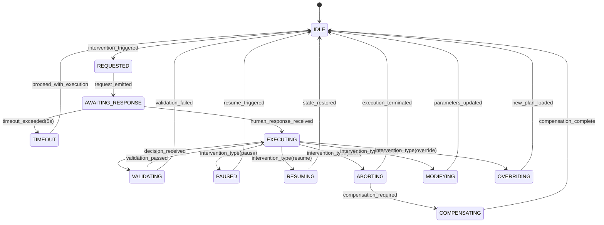
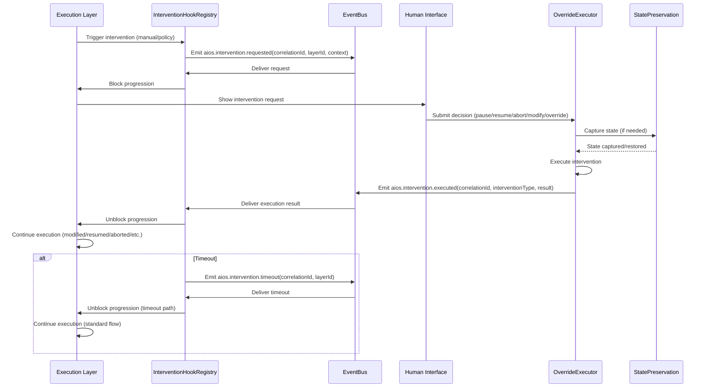

# 8.9 Human Intervention Architecture

## 8.9.1 Overview

The Human Intervention Architecture provides mechanisms that are incorporated as Layer 9 in the 9-layer execution stack, enabling synchronous human oversight and intervention at every layer of the execution pipeline. This layer ensures that human operators can pause, resume, abort, modify, or override execution flows within a bounded acknowledgment time of ≤5 seconds, as mandated by INV-EXEC-RT-007 and INV-EXEC-STR-013.

Human intervention is event-driven via the EventBus, with requests and responses following the standard AIOS event envelope format. Intervention hooks are installed at every layer, blocking progression until a human response is received or the timeout occurs. All intervention actions are recorded in the Governance Manifest for audit and replay purposes.

## 8.9.2 Architecture Overview

The Human Intervention Architecture consists of three core components working in concert with the EventBus and layer-specific hook points:

1. **InterventionHookRegistry**: Manages registration and invocation of synchronous intervention hooks at each layer
2. **OverrideExecutor**: Executes validated human intervention decisions (pause, resume, abort, modify, override)
3. **StatePreservation**: Captures and restores execution state to enable safe intervention and recovery

These components interact through the EventBus using the `aios.intervention.*` event namespace. The architecture maintains strict layer isolation—intervention requests flow upward via events, while responses flow downward through the same channels to preserve deterministic replay properties.

## 8.9.3 Internal Components

### InterventionHookRegistry
- Registers layer-specific intervention hooks during system initialization
- Each hook is a synchronous callback that blocks layer progression until intervention resolution
- Maintains mapping of correlationId to intervention state for tracking active requests
- Enforces the ≤5s acknowledgment timeout (INV-EXEC-RT-007)
- Emits `aios.intervention.requested` when a hook is triggered

### OverrideExecutor
- Validates intervention requests against current execution context and policies
- Executes the five intervention types:
  - Pause: Suspend execution at current layer
  - Resume: Continue execution from preserved state
  - Abort: Terminate execution with compensation if applicable
  - Modify: Alter parameters or configuration of current execution nodes
  - Override: Replace execution plan with human-provided alternative
- Emits `aios.intervention.executed` upon successful intervention
- Coordinates with StatePreservation for state capture/restore operations

### StatePreservation
- Captures immutable snapshots of execution context at intervention points
- Stores snapshots with correlationId, layerId, and interventionId for retrieval
- Ensures snapshots include all variables necessary for deterministic restoration
- Provides rollback capability to preserved states after intervention completion
- Integrated with Learning Layer to record intervention outcomes as learning artifacts

## 8.9.4 Responsibilities

| Component | Responsibility |
|-----------|----------------|
| InterventionHookRegistry | - Install/remove synchronous hooks at each layer<br>- Block layer progression on intervention request<br>- Enforce ≤5s response timeout<br>- Correlate intervention requests with execution flows |
| OverrideExecutor | - Validate intervention requests against policies<br>- Execute pause/resume/abort/modify/override operations<br>- Ensure intervened execution satisfies all invariants<br>- Emit intervention execution events |
| StatePreservation | - Capture pre-intervention execution state<br>- Store state snapshots with provenance tracking<br>- Restore state post-intervention or on abort<br>- Enable deterministic replay of intervened executions |

## 8.9.5 Lifecycle

The human intervention lifecycle follows this sequence:

1. **Hook Trigger**: Any layer detects condition requiring human oversight (per policy) or receives manual trigger
2. **Request Emission**: InterventionHookRegistry emits `aios.intervention.requested` with correlationId and context
3. **Blocking Wait**: Layer progression halts awaiting human response (max 5s)
4. **Human Response**: Operator submits intervention decision via approved interface
5. **Validation & Execution**: OverrideExecutor validates and executes the intervention
6. **State Update**: StatePreservation captures/restores state as needed
7. **Resumption**: Layer continues execution from intervention point or terminates
8. **Audit Recording**: Intervention details recorded in Governance Manifest

If no response is received within 5s, the system defaults to `INTERVENTION_TIMEOUT` and proceeds with standard execution, logging the timeout as an audit event.

## 8.9.6 Runtime Behaviour

- **Synchronous Blocking**: Intervention hooks block layer progression synchronously but do not block the EventBus processing layer
- **Timeout Handling**: Unanswered requests after 5s trigger automatic continuation with `aios.intervention.timeout` event
- **State Isolation**: Each intervention operates on a isolated state snapshot to prevent side effects
- **Policy Compliance**: All interventions are validated against current governance policies before execution
- **Deterministic Preservation**: State snapshots ensure bit-identical replay of intervened executions
- **Concurrency Safety**: Multiple concurrent interventions for different correlationIds are processed independently
- **Resource Bounding**: Intervention processing uses dedicated resources to prevent exhaustion attacks

## 8.9.7 Processing Pipeline

Upon intervention request detection:
```mermaid
flowchart TD
    A[Layer N] --> B[InterventionHookRegistry]
    B --> C{Emit: aios.intervention.requested<br>(correlationId, layerId, context)}
    C --> D[Block Layer N Progression]
    D --> E[Human Interface]
    E --> F[Receive Intervention Decision]
    F --> G[OverrideExecutor]
    G --> H{Validate Decision}
    H --> I[Execute Intervention Type]
    I --> J[StatePreservation: Capture/Restore State]
    J --> K{Emit: aios.intervention.executed<br>(correlationId, interventionType, result)}
    K --> L[Unblock Layer N]
    L --> M[Continue Execution]
    
    style A fill:#f9f,stroke:#333
    style B fill:#bbf,stroke:#333
    style C fill:#bfb,stroke:#333,stroke-dasharray: 2 2
    style D fill:#f9f,stroke:#333
    style E fill:#f9f,stroke:#333
    style F fill:#f9f,stroke:#333
    style G fill:#bbf,stroke:#333
    style H fill:#bfb,stroke:#333,stroke-dasharray: 2 2
    style I fill:#f9f,stroke:#333
    style J fill:#bbf,stroke:#333
    style K fill:#bfb,stroke:#333,stroke-dasharray: 2 2
    style L fill:#f9f,stroke:#333
    style M fill:#fbb,stroke:#333
```

If timeout occurs:
```mermaid
flowchart TD
    A[InterventionHookRegistry] --> B{Emit: aios.intervention.timeout<br>(correlationId, layerId)}
    B --> C[Unblock Layer N]
    C --> D[Continue Execution with Standard Flow]
    
    style A fill:#bbf,stroke:#333
    style B fill:#bfb,stroke:#333,stroke-dasharray: 2 2
    style C fill:#f9f,stroke:#333
    style D fill:#fbb,stroke:#333
```

## 8.9.8 State Models



## 8.9.9 Component Diagram

```mermaid
graph TD
    subgraph HumanInterventionLayer[Human Intervention Layer (Layer 9)]
        IHR[InterventionHookRegistry]
        OE[OverrideExecutor]
        SP[StatePreservation]
    end

    subgraph EventBus[EventBus (Core)]
        IREQ[aios.intervention.requested]
        IEXEC[aios.intervention.executed]
        ITIMEOUT[aios.intervention.timeout]
    end

    subgraph LayerStack[Execution Layers 1-8]
        L1[Layer 1: Planning]:::layer
        L2[Layer 2: Provider Selection]:::layer
        L3[Layer 3: Governance]:::layer
        L4[Layer 4: Capability Execution]:::layer
        L5[Layer 5: Loop Engine]:::layer
        L6[Layer 6: Learning]:::layer
        L7[Layer 7: Optimization]:::layer
        L8[Layer 8: Self-Healing]:::layer
    end

    IHR -->|Registers hooks at each layer| LayerStack
    LayerStack -->|Trigger intervention| IHR
    IHR -->|Emit request| IREQ
    IREQ --> EventBus
    EventBus -->|Deliver request| IHR
    IHR -->|Forward to OE| OE
    OE -->|Validate/Execute| SP
    SP -->|State capture/restore| OE
    OE -->|Emit execution| IEXEC
    IEXEC --> EventBus
    EventBus -->|Deliver confirmation| LayerStack
    IHR -->|Emit timeout| ITIMEOUT
    ITIMEOUT --> EventBus
    EventBus -->|Deliver timeout| LayerStack

    classDef layer fill:#f9f,stroke:#333;
    classDef HumanInterventionLayer fill:#bbf,stroke:#333;
    classDef EventBus fill:#bfb,stroke:#333;
    classDef LayerStack fill:#fbb,stroke:#333;
```

## 8.9.10 Sequence Diagram



## 8.9.11 Event Specification

### Intervention Request Event
- **Event Type**: `aios.intervention.requested`
- **Direction**: Layer → InterventionHookRegistry → EventBus
- **Purpose**: Signal that human intervention is requested at a specific layer
- **Payload Structure**:
  ```json
  {
    "type": "object",
    "properties": {
      "correlationId": { "type": "string", "format": "uuid" },
      "layerId": { "type": "string", "enum": ["PLANNING", "PROVIDER_SELECTION", "GOVERNANCE", "EXECUTION", "LOOP_ENGINE", "LEARNING", "OPTIMIZATION", "SELF_HEALING"] },
      "triggerType": { "type": "string", "enum": ["POLICY_TRIGGER", "MANUAL_TRIGGER", "TIMEOUT_TRIGGER", "ERROR_TRIGGER"] },
      "context": {
        "type": "object",
        "properties": {
          "currentNodeId": { "type": "string", "format": "uuid" },
          "currentPhase": { "type": "string" },
          "executeParameters": { "type": "object" },
          "interventionReason": { "type": "string" }
        },
        "required": ["currentNodeId", "currentPhase", "interventionReason"]
      }
    },
    "required": ["correlationId", "layerId", "triggerType", "context"],
    "additionalProperties": false
  }
  ```

### Intervention Execution Event
- **Event Type**: `aios.intervention.executed`
- **Direction**: OverrideExecutor → EventBus → Layer
- **Purpose**: Signal that human intervention has been executed
- **Payload Structure**:
  ```json
  {
    "type": "object",
    "properties": {
      "correlationId": { "type": "string", "format": "uuid" },
      "interventionType": { "type": "string", "enum": ["PAUSE", "RESUME", "ABORT", "MODIFY", "OVERRIDE"] },
      "result": {
        "type": "object",
        "properties": {
          "status": { "type": "string", "enum": ["SUCCESS", "FAILURE", "PARTIAL"] },
          "message": { "type": "string" },
          "modifiedNodes": { "type": "array", "items": { "type": "string", "format": "uuid" } },
          "newPlanId": { "type": "string", "format": "uuid" }
        },
        "required": ["status"]
      }
    },
    "required": ["correlationId", "interventionType", "result"],
    "additionalProperties": false
  }
  ```

### Intervention Timeout Event
- **Event Type**: `aios.intervention.timeout`
- **Direction**: InterventionHookRegistry → EventBus → Layer
- **Purpose**: Signal that human intervention request timed out
- **Payload Structure**:
  ```json
  {
    "type": "object",
    "properties": {
      "correlationId": { "type": "string", "format": "uuid" },
      "layerId": { "type": "string", "enum": ["PLANNING", "PROVIDER_SELECTION", "GOVERNANCE", "EXECUTION", "LOOP_ENGINE", "LEARNING", "OPTIMIZATION", "SELF_HEALING"] },
      "timeoutDurationMs": { "type": "integer", "minimum": 1 },
      "defaultAction": { "type": "string", "enum": ["CONTINUE", "ABORT", "PAUSE_INDEFINITELY"] }
    },
    "required": ["correlationId", "layerId", "timeoutDurationMs", "defaultAction"],
    "additionalProperties": false
  }
  ```

## 8.9.12 JSON Schema Definitions

Using JSON Schema Draft 2020-12 with `$defs` for reusable components:

```json
{
  "$schema": "https://json-schema.org/draft/2020-12/schema",
  "$id": "https://aios.dev/schemas/intervention-event.json",
  "title": "Human Intervention Events",
  "type": "object",
  "oneOf": [
    { "$ref": "#/$defs/interventionRequested" },
    { "$ref": "#/$defs/interventionExecuted" },
    { "$ref": "#/$defs/interventionTimeout" }
  ],
  "$defs": {
    "interventionRequested": {
      "type": "object",
      "properties": {
        "eventId": { "type": "string", "format": "uuid" },
        "eventType": { "const": "aios.intervention.requested" },
        "correlationId": { "type": "string", "format": "uuid" },
        "causationId": { "type": "string", "format": "uuid" },
        "timestamp": { "type": "string", "format": "date-time" },
        "source": { "const": "InterventionHookRegistry" },
        "version": { "const": "1.0.0" },
        "payload": {
          "$ref": "#/$defs/interventionRequestedPayload"
        }
      },
      "required": ["eventId", "eventType", "correlationId", "causationId", "timestamp", "source", "version", "payload"],
      "additionalProperties": false
    },
    "interventionRequestedPayload": {
      "type": "object",
      "properties": {
        "correlationId": { "type": "string", "format": "uuid" },
        "layerId": { "type": "string", "enum": ["PLANNING", "PROVIDER_SELECTION", "GOVERNANCE", "EXECUTION", "LOOP_ENGINE", "LEARNING", "OPTIMIZATION", "SELF_HEALING"] },
        "triggerType": { "type": "string", "enum": ["POLICY_TRIGGER", "MANUAL_TRIGGER", "TIMEOUT_TRIGGER", "ERROR_TRIGGER"] },
        "context": {
          "type": "object",
          "properties": {
            "currentNodeId": { "type": "string", "format": "uuid" },
            "currentPhase": { "type": "string" },
            "executeParameters": { "type": "object" },
            "interventionReason": { "type": "string" }
          },
          "required": ["currentNodeId", "currentPhase", "interventionReason"]
        }
      },
      "required": ["correlationId", "layerId", "triggerType", "context"],
      "additionalProperties": false
    },
    "interventionExecuted": {
      "type": "object",
      "properties": {
        "eventId": { "type": "string", "format": "uuid" },
        "eventType": { "const": "aios.intervention.executed" },
        "correlationId": { "type": "string", "format": "uuid" },
        "causationId": { "type": "string", "format": "uuid" },
        "timestamp": { "type": "string", "format": "date-time" },
        "source": { "const": "OverrideExecutor" },
        "version": { "const": "1.0.0" },
        "payload": {
          "$ref": "#/$defs/interventionExecutedPayload"
        }
      },
      "required": ["eventId", "eventType", "correlationId", "causationId", "timestamp", "source", "version", "payload"],
      "additionalProperties": false
    },
    "interventionExecutedPayload": {
      "type": "object",
      "properties": {
        "correlationId": { "type": "string", "format": "uuid" },
        "interventionType": { "type": "string", "enum": ["PAUSE", "RESUME", "ABORT", "MODIFY", "OVERRIDE"] },
        "result": {
          "type": "object",
          "properties": {
            "status": { "type": "string", "enum": ["SUCCESS", "FAILURE", "PARTIAL"] },
            "message": { "type": "string" },
            "modifiedNodes": { "type": "array", "items": { "type": "string", "format": "uuid" } },
            "newPlanId": { "type": "string", "format": "uuid" }
          },
          "required": ["status"]
        }
      },
      "required": ["correlationId", "interventionType", "result"],
      "additionalProperties": false
    },
    "interventionTimeout": {
      "type": "object",
      "properties": {
        "eventId": { "type": "string", "format": "uuid" },
        "eventType": { "const": "aios.intervention.timeout" },
        "correlationId": { "type": "string", "format": "uuid" },
        "causationId": { "type": "string", "format": "uuid" },
        "timestamp": { "type": "string", "format": "date-time" },
        "source": { "const": "InterventionHookRegistry" },
        "version": { "const": "1.0.0" },
        "payload": {
          "$ref": "#/$defs/interventionTimeoutPayload"
        }
      },
      "required": ["eventId", "eventType", "correlationId", "causationId", "timestamp", "source", "version", "payload"],
      "additionalProperties": false
    },
    "interventionTimeoutPayload": {
      "type": "object",
      "properties": {
        "correlationId": { "type": "string", "format": "uuid" },
        "layerId": { "type": "string", "enum": ["PLANNING", "PROVIDER_SELECTION", "GOVERNANCE", "EXECUTION", "LOOP_ENGINE", "LEARNING", "OPTIMIZATION", "SELF_HEALING"] },
        "timeoutDurationMs": { "type": "integer", "minimum": 1 },
        "defaultAction": { "type": "string", "enum": ["CONTINUE", "ABORT", "PAUSE_INDEFINITELY"] }
      },
      "required": ["correlationId", "layerId", "timeoutDurationMs", "defaultAction"],
      "additionalProperties": false
    }
  }
}
```

## 8.9.12 Event Specification

| Event Name | Publisher | Subscribers | Payload Summary | Delivery Guarantee | Persistence |
|------------|-----------|-------------|-----------------|-------------------|-------------|
| `aios.intervention.requested` | InterventionHookRegistry | OverrideExecutor, EventBus, Governance Layer | Intervention context including layer ID, trigger type, and execution context | At-least-once via EventBus | Governance Manifest |
| `aios.intervention.executed` | OverrideExecutor | InterventionHookRegistry, EventBus, Execution Layers | Intervention type, result status, and any modified execution parameters | At-least-once via EventBus | Governance Manifest |
| `aios.intervention.timeout` | InterventionHookRegistry | OverrideExecutor, EventBus, Execution Layers | Layer ID that timed out and default action to take | At-least-once via EventBus | Governance Manifest |

## 8.9.13 Validation Rules

1. **Correlation ID Validation**: All intervention events MUST contain a valid UUIDv7 correlationId that matches the current execution flow
2. **Layer ID Validation**: layerId MUST be one of the eight valid execution layer identifiers
3. **Trigger Type Validation**: triggerType MUST be one of the four valid trigger types
4. **Timestamp Validation**: timestamp MUST be a valid ISO8601 timestamp with nanosecond precision
5. **Event Type Validation**: eventType MUST exactly match one of the defined intervention event types
6. **Source Validation**: source field MUST match the expected component for each event type
7. **Version Validation**: version MUST be "1.0.0" for all intervention events
8. **Payload Validation**: Payload MUST conform to the corresponding JSON schema definition
9. **Intervention Type Validation**: For executed events, interventionType MUST be one of the five valid types
10. **Result Status Validation**: For executed events, result.status MUST be one of the three valid statuses
11. **Timeout Validation**: For timeout events, timeoutDurationMs MUST be a positive integer
12. **Default Action Validation**: For timeout events, defaultAction MUST be one of the three valid actions

## 8.9.14 Runtime Invariants

- **INV-INTV-RT-001**: Intervention hooks MUST block layer progression synchronously but MUST NOT block EventBus processing
- **INV-INTV-RT-002**: All intervention requests MUST receive a response (human decision or timeout) within 5 seconds
- **INV-INTV-RT-003**: StatePreservation MUST capture a complete, immutable snapshot of execution context before any intervention execution
- **INV-INTV-RT-004**: OverrideExecutor MUST validate that any override plan satisfies ALL execution invariants before execution
- **INV-INTV-RT-005**: All intervention executions MUST be recorded in the Governance Manifest with full context
- **INV-INTV-RT-006**: Intervention.timeout events MUST trigger the configured default action (CONTINUE, ABORT, or PAUSE_INDEFINITELY)
- **INV-INTV-RT-007**: Concurrent interventions for different correlationIds MUST be processed independently without interference
- **INV-INTV-RT-008**: Abort interventions MUST trigger compensation for all irreversible nodes in the execution plan
- **INV-INTV-RT-009**: Resume interventions MUST restore execution state to the exact point of interruption
- **INV-INTV-RT-010**: Modify interventions MUST preserve all invariants while changing only specified parameters

## 8.9.15 Error Handling

- **Validation Failures**: Invalid intervention requests emit `aios.intervention.validation_failed` and proceed with standard execution
- **State Preservation Errors**: Failures to capture/restore state trigger `aios.intervention.state_error` and default to aborting current execution
- **Override Plan Errors**: Invalid override plans emit `aios.intervention.invalid_override` and proceed with standard execution
- **Timeouts**: Unanswered requests after 5s emit `aios.intervention.timeout` and execute policy-defined default action
- **Concurrent Limit Exceeded**: Requests beyond `maxConcurrentInterventions` are rejected with `aios.intervention.rejected`
- **All errors** are recorded in the Governance Manifest with full context for audit and learning

## 8.9.16 Security Considerations

- **Privilege Escalation Prevention**: Intervention interfaces require explicit human authorization tokens
- **Input Sanitization**: All intervention parameters are sanitized to prevent injection attacks
- **State Isolation**: Intervention state snapshots are encrypted at rest and access-controlled
- **Audit Trail**: All interventions (including timeouts and failures) generate immutable audit events
- **Replay Protection**: Event envelopes include nonce and timestamp to prevent replay attacks
- **Least Privilege**: OverrideExecutor runs with minimal privileges necessary for intervention execution
- **Secure Channels**: Human intervention interfaces MUST use mutually authenticated TLS 1.3+

## 8.9.17 Deterministic Replay Requirements

- **Snapshot Completeness**: StatePreservation MUST capture all variables affecting layer execution
- **Deterministic Restoration**: Restored state MUST produce identical forward execution when replayed
- **Event Ordering**: Intervention events MUST be ordered by timestamp in replay streams
- **Idempotency**: Replaying identical intervention sequences MUST yield identical state transitions
- **External Isolation**: Intervention effects on external systems are excluded from determinism guarantee
- **Policy Versioning**: Replay MUST use the exact governance policy versions active during original intervention

## 8.9.18 Conformance Requirements

### L1 (Structural)
- Human Intervention Layer MUST exist as Layer 9 in the execution stack
- InterventionHookRegistry MUST register hooks at all 8 execution layers
- OverrideExecutor MUST support all 5 intervention types
- StatePreservation MUST provide capture and restore functionality

### L2 (Behavioral)
- All intervention requests MUST receive acknowledgment within 5 seconds or trigger timeout
- Intervention executions MUST satisfy all execution invariants post-intervention
- The architecture MUST maintain deterministic replay capability for intervened executions
- EventBus MUST deliver all intervention events with causation and correlation tracking

### L3 (Integrated)
- Intervention hooks MUST not block EventBus processing, only layer progression
- StatePreservation MUST integrate with Learning Layer to produce intervention learning artifacts
- OverrideExecutor MUST coordinate with Governance Layer for policy validation
- All intervention events MUST be recorded in the Governance Manifest