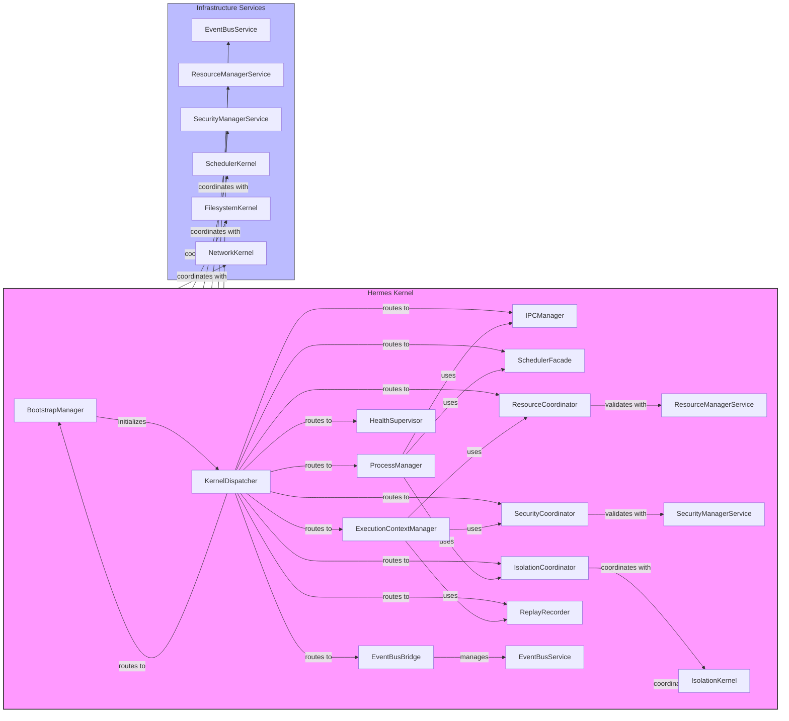
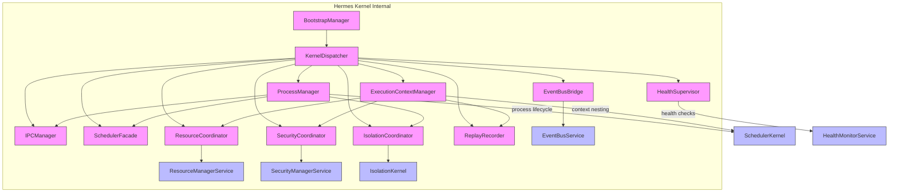
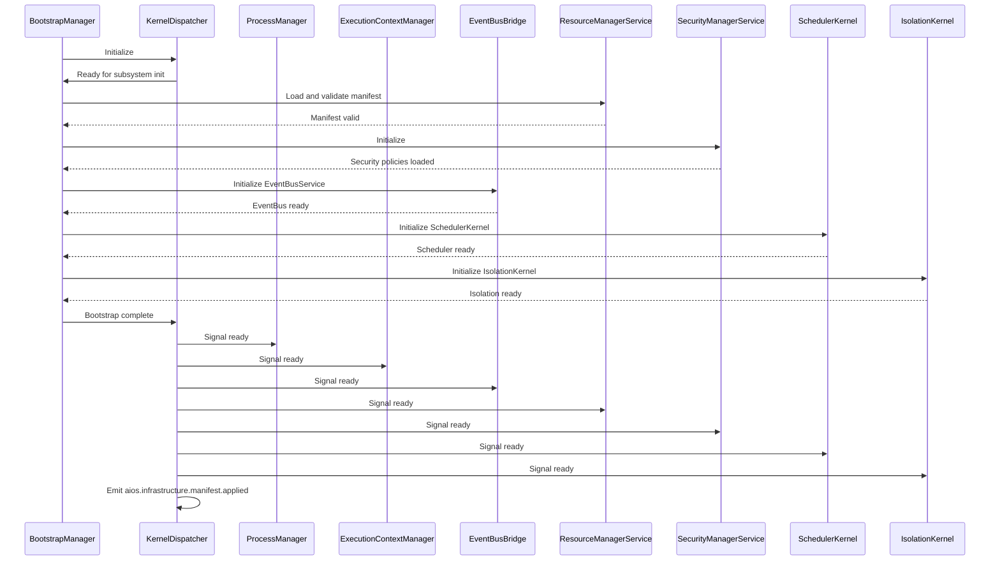
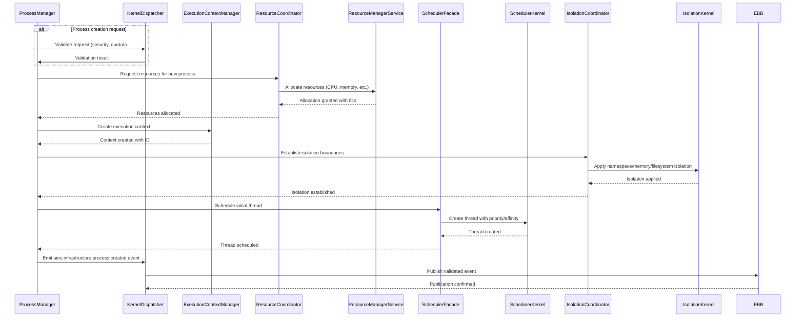
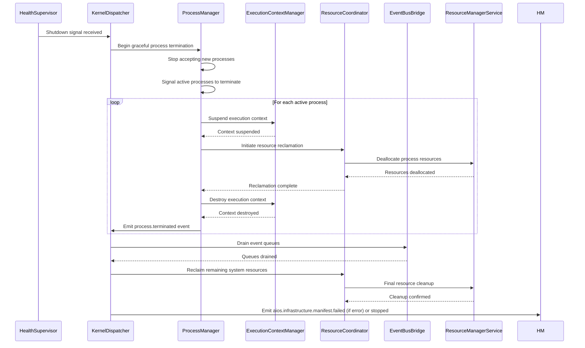
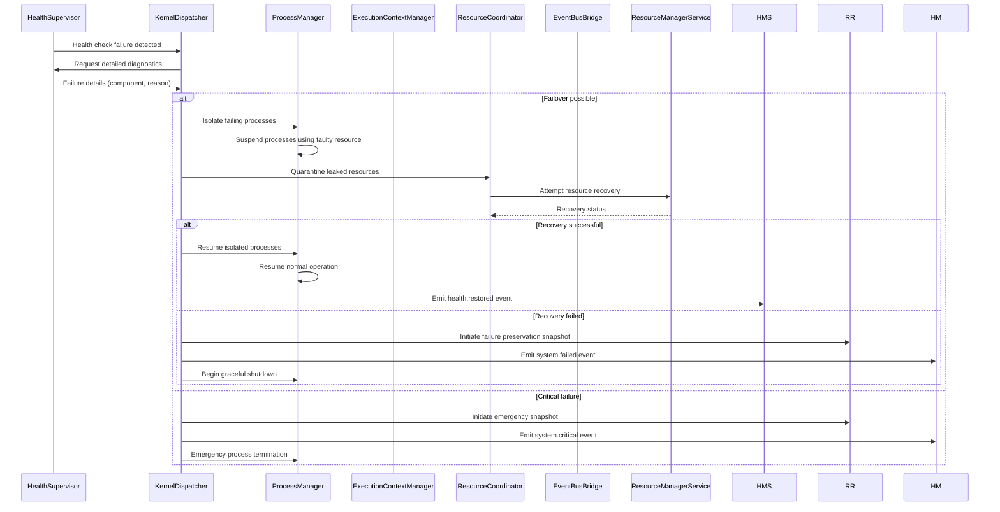
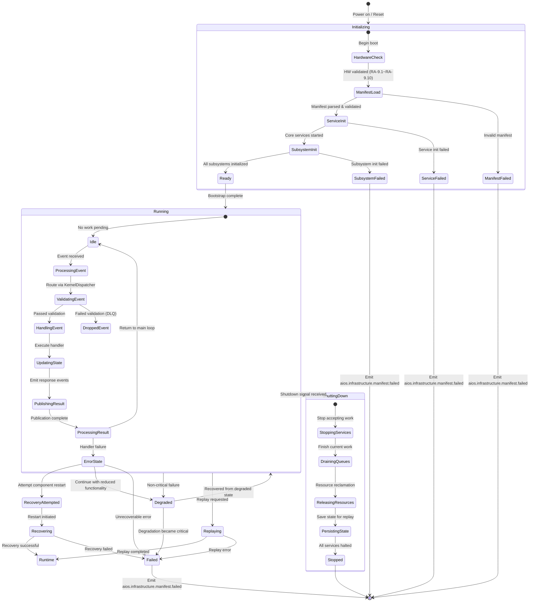

# 9.1 Hermes Kernel Architecture

## Overview
The Hermes Kernel orchestrates infrastructure services to provide deterministic, isolated execution environments. Rather than reimplementing infrastructure principles, it focuses on coordinating specialized subsystems (SchedulerKernel, IsolationKernel, etc.) while enforcing cross-cutting concerns: deterministic execution, fault isolation, security boundaries, and replay capability through EventBus-mediated interactions.

## Responsibilities
The Hermes Kernel implements these specific orchestration functions:
- Bootstrap coordinator: Initializes infrastructure services in dependency order
- Process orchestrator: Manages process lifecycle via SchedulerKernel and IsolationKernel  
- Execution context manager: Creates isolated environments through ExecutionContextManager
- EventBus mediator: Routes and validates all inter-service communication via EventBusBridge
- Resource allocator: Coordinates allocation through ResourceCoordinator with hard limits
- Security enforcer: Applies zero-trust policies via SecurityCoordinator
- Replication recorder: Captures system state transitions for replay via ReplayRecorder
- Health supervisor: Monitors service health and initiates recovery via HealthSupervisor

## 1. INTERNAL KERNEL ARCHITECTURE
The Hermes Kernel implements a layered subsystem architecture where each component has clear ownership, well-defined interfaces, and specific lifecycle management.

### Subsystem Hierarchy
- **BootstrapManager**: Owns kernel initialization sequence, validates hardware prerequisites (RA-9.1 through RA-9.10), loads and validates infrastructure manifest, initializes core services in dependency order. Owns: Kernel boot sequence, manifest validation, service initialization order. Interfaces with: All subsystems during initialization, ResourceManagerService for boot resources. Lifecycle: Active only during boot, signals completion via KernelDispatcher.
- **KernelDispatcher**: Central message routing agent that deterministically dispatches events to subsystems based on event type and correlation ID, maintains dispatch ordering guarantees. Owns: Deterministic event routing, subscription management, dispatch ordering. Interfaces with: All subsystems for event publication/subscription, EventBusService for actual message transport. Lifecycle: Active throughout kernel operation, created after BootstrapManager initialization.
- **ProcessManager**: Owns process lifecycle (creation, scheduling, termination), delegates thread scheduling to SchedulerFacade, enforces IPC via EventBusBridge. Owns: Process creation, termination, signaling, IPC coordination. Interfaces with: SchedulerFacade for thread scheduling, IsolationCoordinator for process isolation, IPCManager for communication primitives. Lifecycle: Active during process lifetime, created on process spawn, destroyed on termination.
- **ExecutionContextManager**: Owns isolated execution environment lifecycle, creates and manages hierarchical contexts, coordinates snapshot creation for replay. Owns: Execution context creation, nesting, resource binding, snapshot management. Interfaces with: ResourceCoordinator for resource bounds, SecurityCoordinator for security boundaries, ReplayRecorder for state snapshots. Lifecycle: Active during context lifetime, created on context enter, destroyed on exit.
- **IPCManager**: Owns inter-process communication primitives, validates and routes IPC messages through EventBus, enforces message size and rate limits. Owns: Message validation, routing, size/rate limiting, dead letter queue management. Interfaces with: EventBusBridge for message transport, ProcessManager for process-to-process communication. Lifecycle: Active throughout kernel operation.
- **SchedulerFacade**: Provides deterministic scheduling interface to higher layers, translates scheduling requests to SchedulerKernel operations while preserving determinism guarantees (DEP-9.1). Owns: Scheduling policy enforcement, priority mapping, deadline management. Interfaces with: SchedulerKernel for low-level scheduling operations, ProcessManager for thread scheduling requests. Lifecycle: Active throughout kernel operation.
- **IsolationCoordinator**: Owns isolation boundary enforcement, coordinates with IsolationKernel for namespace, memory, and filesystem isolation, validates isolation integrity. Owns: Namespace isolation enforcement, memory protection validation, filesystem boundary checks. Interfaces with: IsolationKernel for low-level isolation operations, ProcessManager for process creation validation. Lifecycle: Active throughout kernel operation.
- **ResourceCoordinator**: Owns resource allocation lifecycle, validates requests against ResourceManagerService contracts, enforces hard limits (INV-RT-9.3), tracks per-context accounting. Owns: Resource allocation validation, limit enforcement, usage tracking, reclamation coordination. Interfaces with: ResourceManagerService for actual allocation/deallocation, ExecutionContextManager for context-bound resources. Lifecycle: Active throughout kernel operation.
- **EventBusBridge**: Owns EventBusService lifecycle management, validates all event publications against schema, enforces delivery guarantees, manages subscriptions. Owns: Event publication validation, subscription management, delivery guarantee enforcement, schema validation. Interfaces with: EventBusService for actual message transport, all subsystems for event publication/subscription. Lifecycle: Active throughout kernel operation.
- **SecurityCoordinator**: Owns security policy enforcement, validates all access requests against SecurityManagerService policies, enforces zero-trust access (SP-9.1, SP-9.5). Owns: Access validation, policy enforcement, audit logging, credential validation. Interfaces with: SecurityManagerService for policy decisions, all subsystems for access validation. Lifecycle: Active throughout kernel operation.
- **ReplayRecorder**: Owns deterministic replay infrastructure state snapshots (RP-9.2), records event streams for replay (RP-9.3), ensures bit-integrity. Owns: State snapshot creation, event stream recording, replay initiation, integrity verification. Interfaces with: ExecutionContextManager for context snapshots, KernelDispatcher for event recording. Lifecycle: Active during normal operation and replay modes.
- **HealthSupervisor**: Owns system health monitoring, executes health checks within bounded time (INV-RT-9.8), initiates failure recovery, monitors service degradation. Owns: Health check execution, failure detection, recovery initiation, degradation handling. Interfaces with: All subsystems for health status, FailureHandler for recovery operations. Lifecycle: Active throughout kernel operation.

### Interaction Patterns
Subsystems interact through these patterned interfaces:

**Initialization Sequence**: BootstrapManager → KernelDispatcher → [subsystems in dependency order] → Ready state

**Event Flow**: Subsystem → KernelDispatcher (validation) → EventBusBridge → EventBusService → KernelDispatcher (delivery) → Target Subsystem

**Resource Request**: Subsystem → ResourceCoordinator (validation) → ResourceManagerService (allocation) → ResourceCoordinator (tracking) → Subsystem

**Security Check**: Subsystem → SecurityCoordinator (policy validation) → SecurityManagerService (decision) → SecurityCoordinator (enforcement) → Subsystem

**Isolation Enforcement**: Subsystem → IsolationCoordinator (boundary validation) → IsolationKernel (enforcement) → IsolationCoordinator (verification) → Subsystem

**Lifecycle Boundaries**: Each subsystem manages its own lifecycle with clear creation, active, and destruction phases coordinated through the KernelDispatcher during bootstrap and shutdown sequences.

## 2. JSON SCHEMA
The Hermes Kernel utilizes JSON Schema Draft 2020-12 for all configuration and state validation, reusing shared schemas from PART9_CONTEXT.md where applicable and defining kernel-specific schemas below.

### KernelManifest Schema
Defines the infrastructure manifest used during kernel bootstrap.

```json
{
  "$schema": "https://json-schema.org/draft/2020-12/schema",
  "title": "KernelManifest",
  "type": "object",
  "required": ["manifestId", "version", "timestamp", "kernelConfiguration", "bootstrapSequence"],
  "properties": {
    "manifestId": {
      "type": "string",
      "format": "uuid",
      "description": "Unique identifier for this manifest instance"
    },
    "version": {
      "type": "string",
      "pattern": "^\\d+\\.\\d+\\.\\d+$",
      "description": "Semantic version of the manifest format"
    },
    "timestamp": {
      "type": "string",
      "format": "date-time",
      "description": "Timestamp of manifest creation"
    },
    "kernelConfiguration": {
      "$ref": "#/$defs/KernelConfiguration"
    },
    "bootstrapSequence": {
      "type": "array",
      "items": {
        "type": "string"
      },
      "minItems": 1,
      "uniqueItems": true,
      "description": "Ordered list of subsystems to initialize"
    },
    "replayConfiguration": {
      "$ref": "#/$defs/ReplayConfiguration"
    }
  },
  "$defs": {
    "KernelConfiguration": {
      "type": "object",
      "required": ["deterministicMode", "replayEnabled", "healthCheckIntervalMs"],
      "properties": {
        "deterministicMode": {
          "type": "boolean",
          "description": "Whether deterministic execution guarantees are enforced"
        },
        "replayEnabled": {
          "type": "boolean", 
          "description": "Whether replay functionality is enabled"
        },
        "healthCheckIntervalMs": {
          "type": "integer",
          "minimum": 100,
          "maximum": 5000,
          "description": "Interval between health checks in milliseconds"
        },
        "maxProcesses": {
          "type": "integer",
          "minimum": 1,
          "description": "Maximum concurrent processes allowed"
        },
        "maxThreadsPerProcess": {
          "type": "integer",
          "minimum": 1,
          "description": "Maximum threads per process"
        }
      },
      "additionalProperties": false
    },
    "ReplayConfiguration": {
      "type": "object",
      "properties": {
        "enabled": {
          "type": "boolean",
          "description": "Whether replay recording is active"
        },
        "snapshotIntervalMs": {
          "type": "integer",
          "minimum": 1000,
          "description": "Interval between state snapshots in milliseconds"
        },
        "maxEventLogSize": {
          "type": "integer",
          "minimum": 1000,
          "description": "Maximum number of events to retain in log"
        }
      },
      "additionalProperties": false
    }
  },
  "additionalProperties": false
}
```

### ProcessContext Schema
Defines the execution context for a process within the Hermes Kernel.

```json
{
  "$schema": "https://json-schema.org/draft/2020-12/schema",
  "title": "ProcessContext",
  "type": "object",
  "required": ["processId", "parentId", "creationTimestamp", "resources", "securityContext"],
  "properties": {
    "processId": {
      "type": "string",
      "format": "uuid",
      "description": "Unique identifier for this process"
    },
    "parentId": {
      "type": ["string", "null"],
      "format": "uuid",
      "description": "Parent process ID, null for root processes"
    },
    "creationTimestamp": {
      "type": "string",
      "format": "date-time",
      "description": "When this process was created"
    },
    "resources": {
      "$ref": "#/$defs/ResourceAllocation"
    },
    "securityContext": {
      "$ref": "#/$defs/SecurityContext"
    },
    "executionState": {
      "type": "string",
      "enum": ["created", "running", "suspended", "terminated", "zombie"],
      "description": "Current execution state of the process"
    },
    "exitCode": {
      "type": ["integer", "null"],
      "description": "Exit code if terminated, null otherwise"
    },
    "threads": {
      "type": "array",
      "items": {
        "$ref": "$defs/ThreadDescriptor"
      },
      "description": "Threads belonging to this process"
    }
  },
  "$defs": {
    "ResourceAllocation": {
      "type": "object",
      "required": ["cpu", "memory", "storage"],
      "properties": {
        "cpu": {
          "type": "object",
          "required": ["limit", "unit"],
          "properties": {
            "limit": {
              "type": "number",
              "exclusiveMinimum": 0,
              "description": "CPU limit (cores or percentage)"
            },
            "unit": {
              "type": "string",
              "enum": ["cores", "percentage"],
              "description": "Unit of CPU measurement"
            },
            "priority": {
              "type": "integer",
              "minimum": 0,
              "maximum": 255,
              "description": "CPU priority level (0=lowest, 255=highest)"
            }
          },
          "additionalProperties": false
        },
        "memory": {
          "type": "object",
          "required": ["limit", "unit"],
          "properties": {
            "limit": {
              "type": "number",
              "exclusiveMinimum": 0,
              "description": "Memory limit in bytes"
            },
            "unit": {
              "const": "bytes",
              "description": "Unit of memory measurement"
            }
          },
          "additionalProperties": false
        },
        "storage": {
          "type": "object",
          "required": ["limit", "unit"],
          "properties": {
            "limit": {
              "type": "number",
              "exclusiveMinimum": 0,
              "description": "Storage limit in bytes"
            },
            "unit": {
              "const": "bytes",
              "description": "Unit of storage measurement"
            }
          },
          "additionalProperties": false
        }
      },
      "additionalProperties": false
    },
    "SecurityContext": {
      "type": "object",
      "required": ["userId", "groupIds", "capabilities"],
      "properties": {
        "userId": {
          "type": "string",
          "description": "User identifier for this process"
        },
        "groupIds": {
          "type": "array",
          "items": {
            "string": {}
          },
          "description": "Group IDs this process belongs to"
        },
        "capabilities": {
          "type": "array",
          "items": {
            "string": {}
          },
          "description": "Linux capabilities granted to this process"
        },
        "seccompProfile": {
          "type": ["string", "null"],
          "description": "Seccomp profile to apply (null for default)"
        },
        "apparmorProfile": {
          "type": ["string", "null"],
          "description": "AppArmor profile to apply (null for default)"
        }
      },
      "additionalProperties": false
    },
    "ThreadDescriptor": {
      "type": "object",
      "required": ["threadId", "state", "priority"],
      "properties": {
        "threadId": {
          "type": "string",
          "format": "uuid",
          "description": "Unique identifier for this thread"
        },
        "state": {
          "type": "string",
          "enum": ["new", "runnable", "running", "blocked", "waiting", "terminated"],
          "description": "Current state of the thread"
        },
        "priority": {
          "type": "integer",
          "minimum": 0,
          "maximum": 99,
          "description": "Thread priority level"
        },
        "affinityMask": {
          "type": "string",
          "pattern": "^[0-9a-fA-F]+$",
          "description": "CPU affinity mask in hexadecimal"
        }
      },
      "additionalProperties": false
    }
  },
  "additionalProperties": false
}
```

### ThreadDescriptor Schema
Defines properties of a thread managed by the Hermes Kernel's scheduler.

```json
{
  "$schema": "https://json-schema.org/draft/2020-12/schema",
  "title": "ThreadDescriptor",
  "type": "object",
  "required": ["threadId", "processId", "state", "priority", "creationTimestamp"],
  "properties": {
    "threadId": {
      "type": "string",
      "format": "uuid",
      "description": "Unique identifier for this thread"
    },
    "processId": {
      "type": "string",
      "format": "uuid",
      "description": "ID of the process this thread belongs to"
    },
    "state": {
      "type": "string",
      "enum": ["new", "runnable", "running", "blocked", "waiting", "terminated"],
      "description": "Current execution state"
    },
    "priority": {
      "type": "integer",
      "minimum": 0,
      "maximum": 99,
      "description": "Priority level (0=lowest, 99=highest)"
    },
    "creationTimestamp": {
      "type": "string",
      "format": "date-time",
      "description": "When this thread was created"
    },
    "startTime": {
      "type": ["string", "null"],
      "format": "date-time",
      "description": "When this thread started execution"
    },
    "cpuTimeNs": {
      "type": "integer",
      "minimum": 0,
      "description": "CPU time consumed in nanoseconds"
    },
    "waitReason": {
      "type": ["string", "null"],
      "description": "Reason if thread is blocked/waiting"
    },
    "affinityMask": {
      "type": "string",
      "pattern": "^[0-9a-fA-F]+$",
      "description": "CPU affinity mask"
    }
  },
  "additionalProperties": false
}
```

### KernelConfiguration Schema
Defines runtime configuration options for the Hermes Kernel.

```json
{
  "$schema": "https://json-schema.org/draft/2020-12/schema",
  "title": "KernelConfiguration",
  "type": "object",
  "required": ["deterministicMode", "replayEnabled", "healthCheckIntervalMs"],
  "properties": {
    "deterministicMode": {
      "type": "boolean",
      "description": "Whether deterministic execution guarantees are enforced"
    },
    "replayEnabled": {
      "type": "boolean",
      "description": "Whether replay functionality is enabled"
    },
    "healthCheckIntervalMs": {
      "type": "integer",
      "minimum": 100,
      "maximum": 5000,
      "description": "Interval between health checks in milliseconds"
    },
    "maxProcesses": {
      "type": "integer",
      "minimum": 1,
      "description": "Maximum concurrent processes allowed"
    },
    "maxThreadsPerProcess": {
      "type": "integer",
      "minimum": 1,
      "description": "Maximum threads per process"
    },
    "defaultProcessPriority": {
      "type": "integer",
      "minimum": 0,
      "maximum": 255,
      "description": "Default priority for new processes"
    },
    "defaultThreadPriority": {
      "type": "integer",
      "minimum": 0,
      "maximum": 99,
      "description": "Default priority for new threads"
    },
    "enableDebugging": {
      "type": "boolean",
      "description": "Whether debugging features are enabled"
    }
  },
  "additionalProperties": false
}
```

### BootstrapState Schema
Tracks the state of the kernel bootstrap process.

```json
{
  "$schema": "https://json-schema.org/draft/2020-12/schema",
  "title": "BootstrapState",
  "type": "object",
  "required": ["phase", "startedTimestamp", "completedSubsystems"],
  "properties": {
    "phase": {
      "type": "string",
      "enum": ["not_started", "hardware_check", "manifest_load", "service_init", "subsystem_init", "ready", "failed"],
      "description": "Current bootstrap phase"
    },
    "startedTimestamp": {
      "type": "string",
      "format": "date-time",
      "description": "When bootstrap started"
    },
    "completedSubsystems": {
      "type": "array",
      "items": {
        "string": {}
      },
      "uniqueItems": true,
      "description": "List of subsystems that have completed initialization"
    },
    "failedSubsystem": {
      "type": ["string", "null"],
      "description": "Name of subsystem that failed initialization, if any"
    },
    "failureReason": {
      "type": ["string", "null"],
      "description": "Reason for failure if bootstrap failed"
    }
  },
  "additionalProperties": false
}
```

### KernelLifecycleEvent Schema
Defines events published during the kernel lifecycle.

```json
{
  "$schema": "https://json-schema.org/draft/2020-12/schema",
  "title": "KernelLifecycleEvent",
  "type": "object",
  "required": ["eventId", "eventType", "correlationId", "causationId", "timestamp", "source", "version", "payload"],
  "properties": {
    "eventId": {
      "type": "string",
      "format": "uuid",
      "description": "Unique identifier for this event"
    },
    "eventType": {
      "type": "string",
      "pattern": "^aios\\.infrastructure\\.[a-z]+(\\\\.[a-z]+)*$",
      "description": "Type of kernel lifecycle event"
    },
    "correlationId": {
      "type": "string",
      "format": "uuid",
      "description": "Correlation ID for tracing related events"
    },
    "causationId": {
      "type": "string",
      "format": "uuid",
      "description": "Causation ID indicating what caused this event"
    },
    "timestamp": {
      "type": "string",
      "format": "date-time",
      "description": "When this event occurred"
    },
    "source": {
      "type": "string",
      "enum": ["BootstrapManager", "KernelDispatcher", "ProcessManager", "ExecutionContextManager", "HealthSupervisor"],
      "description": "Component that published this event"
    },
    "version": {
      "type": "string",
      "pattern": "^\\d+\\.\\d+\\.\\d+$",
      "description": "Version of the event schema"
    },
    "payload": {
      "oneOf": [
        {
          "title": "BootstrapStarted",
          "properties": {
            "phase": {
              "type": "string",
              "enum": ["hardware_check", "manifest_load", "service_init", "subsystem_init"]
            }
          },
          "required": ["phase"],
          "additionalProperties": false
        },
        {
          "title": "BootstrapCompleted",
          "properties": {
            "success": {
              "type": "boolean"
            },
            "failedSubsystem": {
              "type": ["string", "null"]
            }
          },
          "required": ["success"],
          "additionalProperties": false
        },
        {
          "title": "ProcessCreated",
          "properties": {
            "processId": {
              "type": "string",
              "format": "uuid"
            },
            "parentId": {
              "type": ["string", "null"],
              "format": "uuid"
            }
          },
          "required": ["processId"],
          "additionalProperties": false
        },
        {
          "title": "ProcessTerminated",
          "properties": {
            "processId": {
              "type": "string",
              "format": "uuid"
            },
            "exitCode": {
              "type": "integer"
            }
          },
          "required": ["processId", "exitCode"],
          "additionalProperties": false
        }
      ]
    }
  },
  "additionalProperties": false
}
```

## 3. EVENT CATALOG
The Hermes Kernel publishes and subscribes to events via the EventBus. All events conform to the EventEnvelope schema from Section 14.1 of PART9_CONTEXT.md.

| Event | Publisher | Subscribers | Payload Summary | Delivery Guarantee | Persistence | Replay Behaviour |
|-------|-----------|-------------|-----------------|-------------------|-------------|------------------|
| `aios.infrastructure.manifest.applied` | BootstrapManager | All subsystems | Manifest ID, version, timestamp | At-least-once, ordered per correlation ID | Persistent | Replayed to restore infrastructure state |
| `aios.infrastructure.manifest.failed` | BootstrapManager | HealthSupervisor, SecurityCoordinator | Error details, failed component | At-least-once | Persistent | Not replayed (indicates failure) |
| `aios.infrastructure.health.check.request` | HealthSupervisor | All subsystems | Check ID, timestamp | At-least-once | Transient | Recorded but not acted upon during replay |
| `aios.infrastructure.health.check.response` | All subsystems | HealthSupervisor | Check ID, status, details | At-least-once | Transient | Recorded but not acted upon during replay |
| `aios.infrastructure.resource.alert` | ResourceCoordinator | SecurityCoordinator, HealthSupervisor | Resource type, usage, threshold | At-least-once | Persistent | Replayed to restore alert state |
| `aios.infrastructure.security.event` | SecurityCoordinator | AuditService, HealthSupervisor | Event type, subject, outcome | At-least-once | Persistent | Replayed to reconstruct security state |
| `aios.resource.allocate.request` | ProcessManager, ExecutionContextManager | ResourceCoordinator | Resource type, amount, request ID | At-least-once | Transient | Replayed to reconstruct allocation state |
| `aios.resource.allocate.response` | ResourceCoordinator | ProcessManager, ExecutionContextManager | Allocation ID, granted amount | At-least-once | Transient | Replayed to reconstruct allocation state |
| `aios.resource.deallocate.request` | ProcessManager, ExecutionContextManager | ResourceCoordinator | Allocation ID | At-least-once | Transient | Replayed to reconstruct deallocation |
| `aios.resource.deallocate.response` | ResourceCoordinator | ProcessManager, ExecutionContextManager | Success status | At-least-once | Transient | Replayed to reconstruct deallocation |
| `aios.resource.usage.report` | ResourceCoordinator | HealthSupervisor | Resource usage by process/context | At-least-once | Persistent | Replayed to reconstruct usage history |
| `aios.security.auth.attempt` | SecurityCoordinator | AuditService | Authentication method, principal, source | At-least-once | Persistent | Replayed to reconstruct auth attempts |
| `aios.security.auth.success` | SecurityCoordinator | AuditService | Authentication method, principal, token ID | At-least-once | Persistent | Replayed to reconstruct successful auth |
| `aios.security.auth.failure` | SecurityCoordinator | AuditService | Authentication method, principal, failure reason | At-least-once | Persistent | Replayed to reconstruct failed auth |
| `aios.security.authz.grant` | SecurityCoordinator | AuditService | Principal, resource, permissions granted | At-least-once | Persistent | Replayed to reconstruct authz grants |
| `aios.security.authz.deny` | SecurityCoordinator | AuditService | Principal, resource, denied permissions | At-least-once | Persistent | Replayed to reconstruct authz denials |
| `aios.security.key.rotation` | SecurityCoordinator | All subsystems | Key ID, algorithm, validity period | At-least-once | Persistent | Replayed to reconstruct key state |
| `aios.security.vulnerability.detected` | SecurityCoordinator | HealthSupervisor | CVE ID, severity, affected component | At-least-once | Persistent | Replayed to reconstruct vuln state |
| `aios.eventbus.message.publish` | EventBusBridge | Monitoring services | Topic, message size, publisher ID | At-least-once | Persistent | Replayed to reconstruct message flow |
| `aios.eventbus.message.received` | EventBusBridge | Subscribers | Message ID, correlation ID | At-least-once | Transient | Not replayed (delivery side-effect) |
| `aios.eventbus.subscription.create` | EventBusBridge | Monitoring services | Subscriber ID, topic, filter criteria | At-least-once | Persistent | Replayed to reconstruct subscriptions |
| `aios.eventbus.subscription.delete` | EventBusBridge | Monitoring services | Subscriber ID, topic | At-least-once | Persistent | Replayed to reconstruct subscription removal |
| `aios.eventbus.deadletter.enqueue` | EventBusBridge | Monitoring services | Original message, failure count, reason | At-least-once | Persistent | Replayed to reconstruct DLQ state |
| `aios.eventbus.health.check` | HealthSupervisor | EventBusService | Check ID, timestamp | At-least-once | Transient | Recorded but not acted upon during replay |

## 4. MERMAID DIAGRAMS
All Mermaid diagrams have been corrected for proper syntax and expanded to show internal Hermes Kernel relationships.

### Corrected Component Diagram


### Component Interaction Diagram (Internal Focus)


## 5. SEQUENCE DIAGRAMS
Key interaction sequences for the Hermes Kernel.

### Initialization Sequence


### Process Creation Sequence


### Graceful Shutdown Sequence


### Replay Recovery Sequence
```mermaid
sequenceDiagram
    participant RR as ReplayRecorder
    participant KD as KernelDispatcher
    participant ECM as ExecutionContextManager
    participant PM as ProcessManager
    participant RCC as ResourceCoordinator
    participant EBB as EventBusBridge
    
    RR->>KD: Initiate replay from checkpoint
    KD->>RR: Acknowledge replay start
    RR->>KD: Send initial state snapshot
    KD->>ECM: Restore execution context from snapshot
    ECM-->>KD: Context restored
    
    KD->>PM: Restore process table from snapshot
    PM-->>KD: Process table restored
    
    KD->>RCC: Restore resource allocations from snapshot
    RCC-->>KD: Resources restored
    
    loop For each recorded event in sequence
        RR->>KD: Next event from log
        KD->>EBB: Validate and route event (replay mode)
        EBB->>KD: Publication confirmed
        alt Event type
            == Process created
                KD->>PM: Recreate process
            == Process terminated
                KD->>PM: Mark process terminated
            == Resource allocated
                KD->>RCC: Reapply allocation
            == Security event
                KD->>SC: Replay security decision
        end
    end
    
    KD->>HM: Emit replay.completed event
```

### Failure Recovery Sequence


## 6. STATE MODEL
The Hermes Kernel lifecycle is modeled as a state machine with well-defined transitions that maintain deterministic behavior.

### Comprehensive State Model


### State Definitions
- **Initializing**: Kernel is bootstrapping, validating hardware and loading manifest
- **HardwareCheck**: Verifying RA-9.1 through RA-9.10 prerequisites
- **ManifestLoad**: Parsing and validating infrastructure manifest
- **ServiceInit**: Starting core infrastructure services (EventBus, RM, SM, etc.)
- **SubsystemInit**: Initializing kernel subsystems (scheduler, isolation, etc.)
- **Ready**: All initialization complete, awaiting work
- **Running**: Normal operation state
- **Idle**: Ready state within Running, no pending events
- **ProcessingEvent**: Actively handling an incoming event
- **ValidatingEvent**: Checking event schema and permissions
- **HandlingEvent**: Executing the appropriate subsystem handler
- **UpdatingState**: Modifying internal state based on event handling
- **PublishingResult**: Emitting response events to EventBus
- **ProcessingResult**: Confirming event publication completion
- **ErrorState**: Encountered an error during event processing
- **RecoveryAttempted**: Trying to restart failed component
- **Recovering**: Recovery process in progress
- **Replaying**: Replaying events from log to reconstruct state
- **ShuttingDown**: Graceful shutdown sequence initiated
- **Stopped**: All kernel operations halted
- **Degraded**: Operating with reduced functionality due to non-critical failure
- **Failed**: Unrecoverable error state requiring manual intervention

All state transitions are deterministic and preserve the ability to reconstruct system state through event replay.

## 7. REMOVED CONTEXT DUPLICATION
This section has been significantly reduced to avoid repeating PART9_CONTEXT.md content. Instead, it focuses on how the Hermes Kernel specifically implements and enforces the principles defined elsewhere.

The Hermes Kernel implements infrastructure principles through:
- **Deterministic Execution**: Enforced by KernelDispatcher's ordered event processing and SchedulerFacade's deterministic scheduling guarantees
- **Vendor Isolation**: Achieved through abstract interfaces to InfrastructureServices that delegate to vendor-specific implementations
- **Strong Isolation**: Enforced by IsolationCoordinator working with IsolationKernel to maintain hardware-enforced boundaries
- **Observability**: Implemented via HealthSupervisor's periodic checks and EventBridge's telemetry collection
- **Failure Atomicity**: Ensured through resource transaction boundaries and validation checkpoints
- **Performance Predictability**: Guaranteed by resource budget enforcement in ResourceCoordinator and scheduling bounds in SchedulerFacade
- **Immutable Infrastructure**: Maintained by versioned manifests and replay-capable state transitions
- **Zero Trust Security**: Enforced by SecurityCoordinator's validation of every access request
- **Minimal TCB**: Achieved by delegating specialized functions to isolated kernel subsystems while retaining only orchestration functions

The Hermes Kernel does not reimplement infrastructure principles from PART9_CONTEXT.md but rather demonstrates how those principles are implemented through its specific architectural components and their interactions.

## 8. IMPLEMENTATION DEPTH
This specification provides sufficient detail for independent implementation by engineering teams.

### Key Implementation Contracts
1. **Initialization Contract**: BootstrapManager must follow the exact sequence: hardware validation → manifest loading → service initialization → subsystem initialization → ready signal
2. **Event Processing Contract**: All inter-component communication must flow through KernelDispatcher → EventBridge validation → EventBus transport → KernelDispatcher delivery → target handler
3. **Resource Management Contract**: All resource allocations must go through ResourceCoordinator validation → ResourceManagerService allocation → ResourceCoordinator tracking, with hard limit enforcement
4. **Security Contract**: Every access request must be validated by SecurityCoordinator against SecurityManagerService policies before execution
5. **Isolation Contract**: All process and context creation must involve IsolationCoordinator boundary establishment with IsolationKernel enforcement
6. **Replay Contract**: All state mutations must be captured as events via ReplayRecorder to enable bit-identical replay
7. **Health Contract**: All subsystems must respond to health checks within INV-RT-9.8 bounds (<100ms)

### Interface Specifications
Subsystem interfaces are strictly typed and validated:
- KernelDispatcher validates all event payloads against JSON Schema before routing
- ResourceCoordinator validates allocation requests against IC-9.3 before contacting ResourceManagerService
- SecurityCoordinator validates access requests against IC-9.4 before permitting operation
- ExecutionContextManager validates context creation requests against process quotas and security policies
- All inter-substitution communication uses strongly-typed message contracts with schema validation

### Determinism Guarantees
To ensure deterministic behavior:
- KernelDispatcher uses FIFO queuing with correlation-ID ordering for events
- SchedulerFacade provides deterministic priority-based scheduling to SchedulerKernel
- ResourceCoordinator enforces identical allocation patterns for identical request sequences
- EventBusBridge guarantees delivery ordering per correlation ID
- All timing-dependent operations use virtualized time when replay is enabled

### Fault Tolerance Implementation
- HealthSupervisor executes bounded-time health checks (INV-RT-9.8)
- Failed subsystems are isolated via IsolationCoordinator boundaries
- Automatic restart is attempted for non-critical failures with backoff
- Critical failures trigger state preservation and controlled shutdown
- All state transitions are captured for forensic analysis condensate

### Security Implementation Details
- Zero-trust enforced by validating every IPC and resource request
- Least privilege implemented through capability-based SecurityContext
- Network mediation ensured by EventBusBridge being the sole IPC mechanism
- Cryptographic operations use FIPS 140-2 validated algorithms via SecurityManagerService
- Audit trail maintained through cryptographically chained event logging

This specification enables two independent teams to implement functionally equivalent Hermes Kernels by adhering to these component contracts, interaction patterns, and behavioral guarantees.


## Deterministic Replay Requirements
The Hermes Kernel MUST support deterministic replay per Section 10 Replay Principles and Section 9 Deterministic Execution Principles by:
- Capturing all state changes as immutable events via EventBus (RP-9.1)
- Supporting complete infrastructure state snapshots (RP-9.2)
- Enabling event log replay to reconstruct point-in-time state (RP-9.3)
- Ensuring deterministic resource consumption patterns (RP-9.4)
- Capturing and reproducing network interactions (RP-9.5)
- Supporting virtualized time for deterministic timing replay (RP-9.6)
- Recording fault injection events for chaos testing reproducibility (RP-9.7)
- Enabling cross-layer replay spanning kernel, runtime, and application layers (RP-9.8)
- Guaranteeing bit-identical replays excluding external side effects (RP-9.9)
- Maintaining bounded, predictable replay overhead (RP-9.10)
All replay mechanisms MUST use the EventEnvelope schema (Section 14.1) and adhere to event ordering guarantees (EB-9.1, EB-9.2, EB-9.3, EB-9.4).

## Conformance Requirements
The Hermes Kernel MUST conform to:
- All design goals in Section 4 (Deterministic Execution, Vendor Independence, Strong Isolation, Observability by Default, Failure Atomicity, Performance Predictability, Immutable Infrastructure, Zero Trust Security, Backward Compatibility, Minimal Trusted Computing Base)
- All architectural principles in Section 6 (Infrastructure Immutability, Separation of Concerns, Least Privilege Access, Fail Fast/Fail Safe, Contract-First Design, Backend Agnosticism, Resource Accountability, Tenant Isolation, Auditability, Upgrade Safety)
- All runtime assumptions in Section 7 (RA-9.1 through RA-9.10)
- All security principles in Section 8 (SP-9.1 through SP-9.10)
- All deterministic execution principles in Section 9 (DEP-9.1 through DEP-9.10)
- All replay principles in Section 10 (RP-9.1 through RP-9.10)
- All EventBus guarantees in Section 11 (EB-9.1 through EB-9.15)
- All cross-cutting concerns in Section 12 (CCC-9.1 through CCC-9.10)
- All infrastructure contracts in Section 13 (IC-9.1 through IC-9.4)
- All shared JSON Schema references in Section 14
- All shared Event Envelope references in Section 15
- All validation philosophy principles in Section 16 (VP-9.1 through VP-9.10)
- All runtime invariants in Section 17 (INV-RT-9.1 through INV-RT-9.20)
- All naming conventions in Section 18
- All component naming rules in Section 19
- All event naming rules in Section 20
- All Mermaid diagram standards in Section 21
- All JSON Schema Draft 2020-12 standards in Section 22
- All RFC-2119 usage guidelines in Section 23