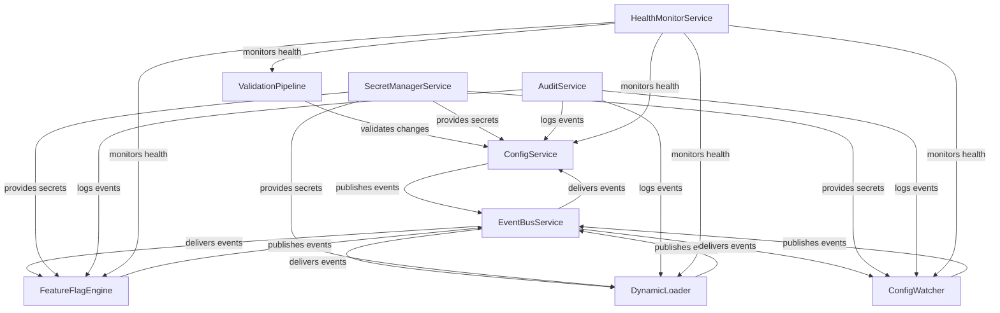
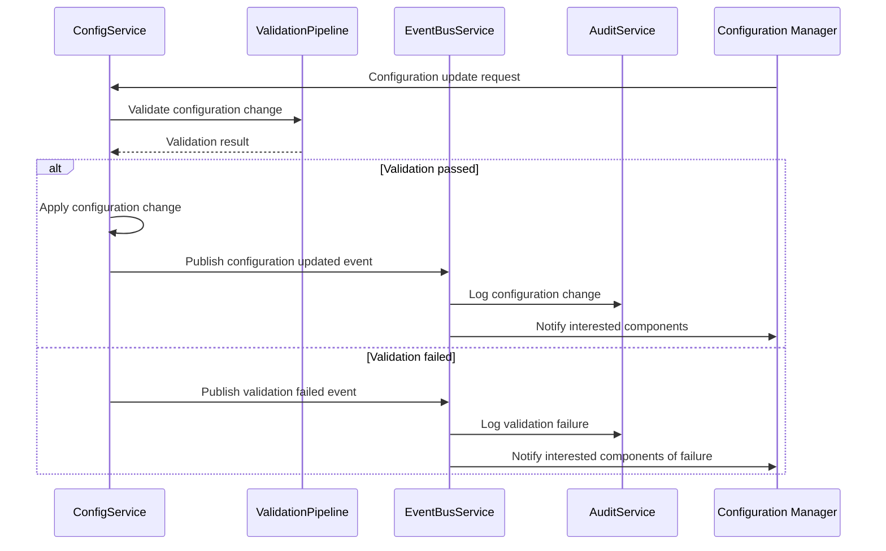
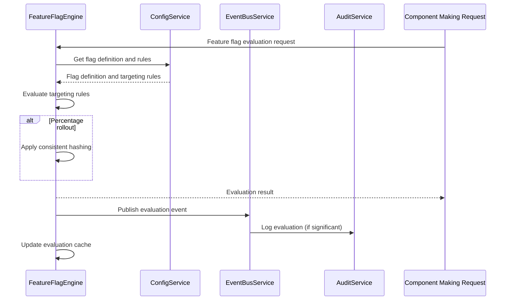
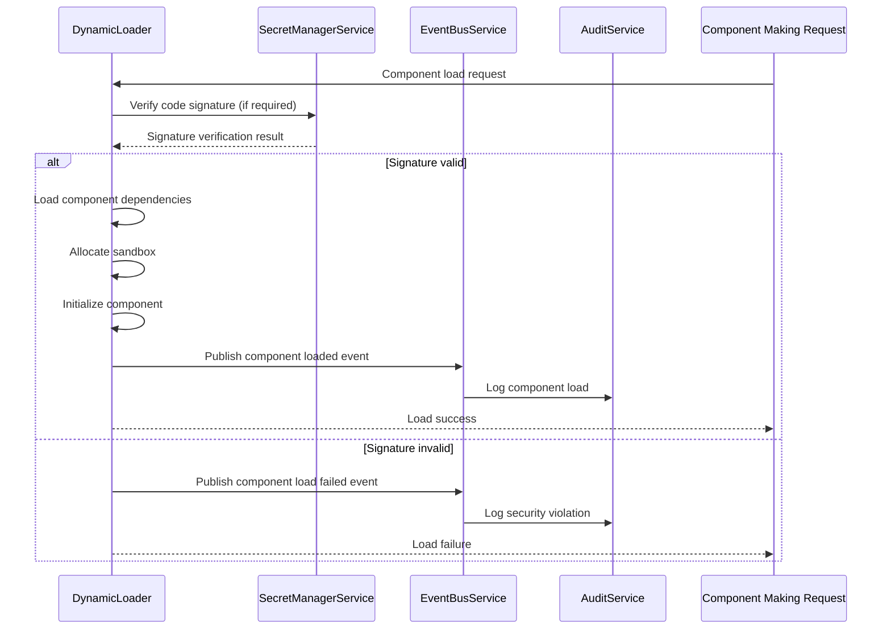

# Part 9 Section 9.10: Runtime Configuration and Feature Flags

## Purpose

The purpose of the Runtime Configuration and Feature Flags subsystem is to define a dynamic configuration system that enables runtime behavior changes without requiring system restarts or redeployments. This subsystem provides the infrastructure for managing feature flags, runtime configuration parameters, and dynamic component loading while maintaining system stability, security, and observability.

## Scope

### In Scope

- Runtime configuration management system for AI-OS infrastructure
- Feature flag system for enabling/disabling functionality at runtime
- Dynamic component loading and unloading mechanisms
- Configuration validation and validation pipelines
- Configuration change propagation and rollback mechanisms
- Integration with EventBus for configuration change notifications
- Security controls for configuration access and modification
- Audit trails for configuration changes
- Performance characteristics and guarantees for configuration operations

### Out of Scope

- Application-level business logic configuration (handled in Parts 1-8)
- Persistent storage configuration (handled by Resource Management Substrate)
- Network topology configuration (handled by Resource Management Substrate)
- Hardware-level configuration (handled by Hermes Kernel)
- User interface configuration and theming
- Development-time configuration tools and IDE integrations

## Architectural Goals

The Runtime Configuration and Feature Flags subsystem MUST satisfy these architectural goals:

1. **Runtime Modifiability** - Configuration changes MUST be applicable without system restart
2. **Consistency Guarantees** - Configuration changes MUST be applied atomically and consistently across all affected components
3. **Feature Flag Safety** - Feature flag transitions MUST not cause system instability or data corruption
4. **Observability** - All configuration changes MUST be observable through standardized telemetry
5. **Security** - Configuration access and modification MUST be governed by strict access controls
6. **Performance Bounds** - Configuration operations MUST complete within predictable time bounds
7. **Rollback Capability** - Failed configuration updates MUST be automatically rollbackable
8. **Validation Enforcement** - All configuration changes MUST pass validation before application
9. **Audit Completeness** - All configuration changes MUST be cryptographically logged for audit
10. **Backward Compatibility** - Configuration schema evolution MUST maintain backward compatibility

## Architecture Overview

The Runtime Configuration and Feature Flags subsystem consists of five primary components that work together to provide dynamic configuration capabilities:

1. **ConfigService** - Central service for managing runtime configuration parameters
2. **FeatureFlagEngine** - Service for evaluating and managing feature flags
3. **DynamicLoader** - Service for dynamically loading and unloading software components
4. **ConfigWatcher** - Service for monitoring configuration sources and detecting changes
5. **ValidationPipeline** - Pipeline for validating configuration changes before application

These components interact through the EventBus subsystem to ensure loose coupling and reliable communication.

## Internal Architecture

### ConfigService

The ConfigService is responsible for managing runtime configuration parameters. It provides:

- Centralized storage and retrieval of configuration parameters
- Versioned configuration snapshots
- Configuration change notification via EventBus
- Access control for configuration parameters
- Schema validation of configuration values
- Atomic configuration updates

The ConfigService maintains configuration in a hierarchical structure that mirrors the AI-OS component hierarchy, allowing for scoped configuration at different levels (system, service, component, instance).

### FeatureFlagEngine

The FeatureFlagEngine manages the lifecycle and evaluation of feature flags. It provides:

- Feature flag definition storage and retrieval
- Runtime evaluation of flag rules and targeting rules
- Gradual rollout capabilities (percentage-based rollouts)
- Emergency kill switches for dangerous features
- Flag evaluation caching for performance
- Integration with ConfigService for flag configuration storage
- EventBus integration for flag change notifications

Feature flags support multiple targeting mechanisms including percentage rollouts, user/account targeting, environment targeting, and custom targeting rules.

### DynamicLoader

The DynamicLoader enables loading and unloading of software components at runtime. It provides:

- Secure loading of code modules from trusted sources
- Versioned module management
- Dependency resolution for dynamic components
- Sandboxed execution contexts for loaded components
- Resource isolation for dynamically loaded code
- Version conflict resolution
- Rollback capabilities for failed loads
- Integration with security policies for code signing verification

### ConfigWatcher

The ConfigWatcher monitors external configuration sources for changes. It provides:

- Filesystem watching for configuration file changes
- Integration with external configuration services
- Periodic checking mechanisms for non-event-driven sources
- Change debouncing and batching
- Validation of detected changes before processing
- Integration with ValidationPipeline for pre-application validation
- EventBus notifications for detected changes

### ValidationPipeline

The ValidationPipeline ensures that configuration changes are valid before application. It provides:

- Schema validation against JSON Schema definitions
- Semantic validation for configuration consistency
- Dependency validation between configuration values
- Security validation for sensitive configuration values
- Performance impact assessment for configuration changes
- Rollback impact analysis
- Custom validation rule pluggability

## Component Responsibilities

### ConfigService Responsibilities

The ConfigService MUST:
- Store configuration parameters in a versioned, immutable manner
- Provide get/set operations for configuration parameters with appropriate scoping
- Publish configuration change events via EventBus
- Enforce access control policies on configuration access
- Maintain configuration history for rollback capabilities
- Validate configuration values against schemas before storage
- Provide atomic batch updates for related configuration parameters
- Garbage collect obsolete configuration versions according to retention policies

The ConfigService MUST NOT:
- Allow direct modification of configuration without validation
- Expose sensitive configuration values without proper authorization
- Allow configuration changes that violate system invariants
- Lose configuration history before the configured retention period

### FeatureFlagEngine Responsibilities

The FeatureFlagEngine MUST:
- Store feature flag definitions with targeting rules
- Evaluate feature flags efficiently at runtime
- Support percentage-based rollouts with consistent hashing
- Provide emergency disable capabilities for all feature flags
- Integrate with ConfigService for flag configuration storage
- Publish flag evaluation events via EventBus for monitoring
- Cache flag evaluations appropriately for performance
- Expire stale flag evaluations based on configurable TTL

The FeatureFlagEngine MUST NOT:
- Evaluate flags inconsistently for the same context
- Allow flag evaluations to bypass security checks
- Cause system instability through flag transitions
- Modify flag definitions without proper validation

### DynamicLoader Responsibilities

The DynamicLoader MUST:
- Load code modules only from trusted, verified sources
- Validate code signatures before loading when code signing is enforced
- Isolate loaded components in appropriate sandbox environments
- Manage dependencies between dynamically loaded components
- Provide version conflict resolution for competing module versions
- Unload components cleanly when no longer needed
- Report loading/unloading status and errors via EventBus
- Integrate with security policies for runtime permissions

The DynamicLoader MUST NOT:
- Load code from untrusted or unverified sources
- Allow loaded code to escape its sandbox
- Cause memory leaks through improper cleanup
- Conflict with statically loaded system components
- Load components that violate system security policies

### ConfigWatcher Responsibilities

The ConfigWatcher MUST:
- Monitor configured configuration sources for changes
- Debounce rapid changes to prevent thrashing
- Validate detected changes through the ValidationPipeline
- Publish validated changes via EventBus for processing
- Handle connection failures to external configuration sources gracefully
- Resume monitoring after transient failures
- Provide metrics on change detection and processing rates
- Support multiple configuration sources with priority ordering

The ConfigWatcher MUST NOT:
- Process invalid configuration changes
- Overwhelm the system with excessive change notifications
- Modify configuration sources directly
- Introduce significant performance overhead through polling

### ValidationPipeline Responsibilities

The ValidationPipeline MUST:
- Validate configuration changes against JSON Schema definitions
- Perform semantic validation for configuration consistency
- Check for dependency conflicts between configuration values
- Validate security implications of configuration changes
- Assess performance impact of proposed changes
- Provide detailed validation error messages
- Support custom validation rules through pluggable interfaces
- Maintain validation rule versions alongside configuration schemas

The ValidationPipeline MUST NOT:
- Allow invalid configuration to pass validation
- Modify configuration data during validation
- Introduce unbounded latency to the validation process
- Bypass validation for any configuration change
- Cache validation results inappropriately across configuration versions

## Runtime Behaviour

### Configuration Update Flow

When a configuration change is requested, the system follows this flow:

1. Configuration change request received by ConfigService
2. Change forwarded to ValidationPipeline for pre-validation
3. ValidationPipeline performs schema, semantic, dependency, security, and performance validation
4. Upon successful validation, change is applied to configuration store
5. ConfigService publishes configuration change event via EventBus
6. Interested components (ConfigWatcher, FeatureFlagEngine, etc.) receive and process the change
- Components validate applicability of change to their domain
- Components update internal state based on the change
- Components publish their own state change events if applicable
7. ValidationPipeline performs post-validation to ensure system consistency
8. AuditService logs the configuration change with cryptographic hashing

### Feature Flag Evaluation Flow

When a feature flag is evaluated, the system follows this flow:

1. Feature evaluation request received by FeatureFlagEngine
2. Engine retrieves flag definition and targeting rules from ConfigService
3. Engine evaluates targeting rules against the evaluation context
4. For percentage rollouts, consistent hashing determines inclusion
5. Engine returns evaluation result (enabled/disabled) with metadata
6. Engine publishes evaluation event via EventBus for monitoring
7. Result cached appropriately based on flag stability and TTL
8. AuditService logs significant flag evaluations for compliance

### Dynamic Component Loading Flow

When a component is requested to be loaded dynamically, the system follows this flow:

1. Load request received by DynamicLoader with module identifier and version
2. DynamicLoader verifies requester has appropriate permissions
3. DynamicLoader retrieves module from trusted source with integrity verification
4. DynamicLoader validates module signature if code signing is required
5. DynamicLoader resolves and loads dependencies recursively
6. DynamicLoader allocates appropriate sandboxed execution context
7. DynamicLoader initializes the module in its execution context
8. DynamicLoader publishes load completion event via EventBus
9. AuditService logs the component load operation

## EventBus Integration

The Runtime Configuration and Feature Flags subsystem integrates with the EventBus subsystem as follows:

### Published Events

- `aios.config.parameter.updated` - Published when a configuration parameter is updated
- `aios.config.parameter.deleted` - Published when a configuration parameter is deleted
- `aios.config.batch.updated` - Published when a batch of configuration parameters is updated
- `aios.featureflag.evaluation` - Published when a feature flag is evaluated (for monitoring)
- `aios.featureflag.updated` - Published when a feature flag definition is updated
- `aios.featureflag.toggled` - Published when a feature flag is enabled/disabled
- `aios.component.loaded` - Published when a component is successfully loaded dynamically
- `aios.component.unloaded` - Published when a component is successfully unloaded
- `aios.component.load.failed` - Published when a component fails to load
- `aios.config.validation.passed` - Published when configuration validation passes
- `aios.config.validation.failed` - Published when configuration validation fails
- `aios.config.watcher.change.detected` - Published when ConfigWatcher detects a change
- `aios.config.watcher.validation.started` - Published when ConfigWatcher starts validation
- `aios.config.watcher.validation.completed` - Published when ConfigWatcher completes validation

### Subscribed Events

- `aios.config.parameter.update.request` - Request to update a configuration parameter
- `aios.config.parameter.delete.request` - Request to delete a configuration parameter
- `aios.config.batch.update.request` - Request to update a batch of configuration parameters
- `aios.featuretag.evaluate.request` - Request to evaluate a feature flag
- `aios.featuretag.update.request` - Request to update a feature flag definition
- `aios.featuretag.toggle.request` - Request to toggle a feature flag
- `aios.component.load.request` - Request to load a component dynamically
- `aios.component.unload.request` - Request to unload a component dynamically
- `aios.config.validation.request` - Request to validate a configuration change
- `aios.config.watcher.poll.request` - Request to poll a configuration source for changes
- `aios.system.shutdown.initiated` - Notification of system shutdown initiation
- `aios.system.startup.completed` - Notification of system startup completion

All events published by this subsystem conform to the standard EventEnvelope schema defined in shared/EventEnvelope.json.

## Security Considerations

The Runtime Configuration and Feature Flags subsystem implements multiple security layers:

### Authentication and Authorization

- All configuration access and modification operations REQUIRE authentication
- Configuration access requires appropriate RBAC permissions based on resource paths
- Feature flag evaluation requires read access to the flag definition
- Feature flag modification requires update access to the flag definition
- Dynamic component loading requires special permissions for code loading
- Configuration validation requests require appropriate validation permissions
- All access decisions are logged to the AuditService for compliance

### Communication Security

- All internal communication between subsystem components occurs via EventBus
- EventBus communication is encrypted in transit using TLS 1.3
- EventBus communication is authenticated using mutual TLS or JWT tokens
- EventBus message integrity is protected through cryptographic signing
- Configuration data at rest is encrypted using AES-256-GCM
- Encryption keys are managed by the SecretManagerService

### Data Protection

- Sensitive configuration values (passwords, keys, tokens) are encrypted at rest
- Encryption keys for sensitive data are managed separately from configuration data
- Access to decrypted sensitive values is restricted to authorized processes only
- Memory containing sensitive configuration values is zeroed when no longer needed
- Configuration snapshots and backups inherit the same encryption protections
- Audit logs do not contain sensitive configuration values in plaintext

### Code Integrity

- Dynamic component loading requires code signature verification when enabled
- Code signing keys are managed by the SecretManagerService
- Unsigned code is rejected unless explicitly allowed by security policy
- Loaded modules operate in restricted sandboxes with minimal privileges
- Module memory spaces are isolated from other system components
- System calls from loaded modules are filtered and monitored

### Audit and Compliance

- All configuration changes are cryptographically logged with immutable hashes
- Feature flag evaluations for sensitive features are logged for compliance
- Dynamic component loads and unloads are fully audited
- Access attempts to restricted configuration are logged and alerted
- Audit logs are tamper-evident and cryptographically chained
- Log retention follows configurable compliance requirements
- Audit log integrity can be verified independently of the system

## Configuration

The Runtime Configuration and Feature Flags subsystem itself is configured through:

### Bootstrap Configuration

- Initial configuration is provided through bootstrap configuration files
- Bootstrap configuration establishes initial trust anchors and security policies
- Bootstrap configuration is immutable after system bootstrap
- Bootstrap configuration defines initial ConfigWatcher sources
- Bootstrap configuration defines initial ValidationPipeline rules

### Runtime Configuration

- Subsystem behavior can be adjusted through runtime configuration parameters
- Configuration parameters are organized hierarchically under `aios.config.` namespace
- Configuration changes follow the same validation and application flow as managed parameters
- Critical configuration changes may require validation against stricter rules
- Some configuration parameters are immutable after initial setup

### Configuration Parameters

| Configuration Parameter | Description | Default | Mutable |
|-------------------------|-------------|---------|---------|
| `aios.config.backup.enabled` | Enable configuration backup | true | Yes |
| `aios.config.backup.interval` | Backup interval in seconds | 3600 | Yes |
| `aios.config.backup.retention` | Number of backups to retain | 30 | Yes |
| `aios.config.validation.strict` | Enable strict validation mode | true | No |
| `aios.config.featureflags.eval.cache.ttl` | Feature flag evaluation cache TTL in seconds | 300 | Yes |
| `aios.config.dynamicloading.sandbox.enabled` | Enable sandboxing for dynamic loads | true | No |
| `aios.config.audit.configuration.enabled` | Enable configuration auditing | true | No |
| `aios.config.eventbus.qos` | EventBus QoS level for config events | RELIABLE | Yes |

## Failure Handling

The subsystem implements comprehensive failure handling mechanisms:

### Configuration Validation Failures

- Validation failures are published as `aios.config.validation.failed` events
- Failed configuration changes are NOT applied to the system
- Detailed validation error information is provided in the failure event
- Automatic rollback is not applicable as changes were not applied
- Administrators are notified through configured alerting channels
- Validation failure metrics are incremented for monitoring

### Configuration Application Failures

- Application failures are detected through component acknowledgment timeouts
- Failed applications trigger automatic rollback to previous known-good state
- Rollback process follows the same validation pathway in reverse
- Failed rollback attempts trigger administrative alerts
- Application failure metrics are incremented with failure categorization
- System attempts limited retries before escalating to manual intervention

### Dynamic Loading Failures

- Loading failures publish `aios.component.load.failed` events
- Failed loads do not leave partially loaded components in memory
- Resource allocations from failed loads are properly cleaned up
- Detailed error information includes failure phase and root cause
- Retry attempts follow configurable backoff strategies
- Persistent failures trigger administrative alerts
- Security violations during loading trigger immediate security alerts

### Validation Pipeline Failures

- Validation pipeline failures are treated as critical system errors
- Failed validation prevents any configuration changes from being applied
- System enters safe mode where only critical configuration changes are allowed
- Administrative intervention is required to restore normal operation
- Validation pipeline health is continuously monitored
- Cascading failures are prevented through circuit breaker patterns

### EventBus Integration Failures

- EventBus publication failures are buffered locally with persistent storage
- Buffered events are retried with exponential backoff
- Permanent EventBus disconnection triggers degraded mode operation
- Degraded mode continues local validation but delays change propagation
- EventBus reconnection attempts are continuous with jitter
- Lost events during disconnection are recovered upon reconnection

## Recovery

The subsystem provides multiple recovery mechanisms:

### Automatic Recovery

- Transient validation errors trigger automatic retry with exponential backoff
- Failed configuration applications trigger automatic rollback
- Dynamic loading failures trigger automatic cleanup and optional retry
- EventBus disconnections trigger automatic reconnection with jitter
- Validation pipeline restarts preserve validation state where possible
- Configuration service restores state from persistent storage on startup
- Feature flag evaluations continue from cached state during brief outages

### Manual Recovery Procedures

- Administrators can force configuration rollback to known-good versions
- Administrators can clear validation pipeline caches when needed
- Administrators can rebuild configuration indices from persistent storage
- Administrators can force re-evaluation of all feature flags
- Administrators can reset dynamic loader state to clean slate
- Administrators can rebuild EventBus buffers from persistent storage

### Disaster Recovery

- Configuration snapshots are backed up according to retention policies
- Backup restoration procedures are documented and tested
- Geographically distributed configuration replicas are supported
- Point-in-time recovery is available through versioned configuration storage
- Configuration drift detection identifies unauthorized changes
- Automated compliance verification validates configuration against policies

## Performance Requirements

The subsystem MUST meet these performance requirements:

### Configuration Operations

- Configuration GET operations MUST complete within 1ms under normal load
- Configuration SET operations MUST complete within 10ms under normal load
- Batch configuration operations MUST complete within 50ms for 100 items
- 99.9% of configuration operations MUST complete within specified limits
- Configuration operations MUST scale linearly with concurrent request count
- Memory overhead for configuration service MUST be bounded by configuration size

### Feature Flag Operations

- Feature flag evaluations MUST complete within 500µs under normal load
- 99.9% of feature flag evaluations MUST complete within 1ms
- Feature flag evaluation cache hit ratio MUST exceed 95% for stable flags
- Flag evaluation latency MUST remain stable under varying evaluation patterns
- Memory overhead for feature flag engine MUST be bounded by active flag count

### Dynamic Loading Operations

- Component loading MUST complete within 100ms for modules under 1MB
- Component unloading MUST complete within 50ms under normal load
- Dependency resolution MUST complete within 10ms for typical dependency trees
- Memory overhead for dynamic loader MUST be proportional to loaded code size
- Sandbox initialization overhead MUST be amortized across multiple loads

### Validation Pipeline Operations

- Schema validation MUST complete within 2ms for typical configuration objects
- Semantic validation MUST complete within 5ms for typical configurations
- Dependency validation MUST complete within 3ms for typical configurations
- Security validation MUST complete within 10ms for typical configurations
- Performance impact assessment MUST complete within 20ms for typical changes
- 99.9% of validation operations MUST complete within specified limits

### EventBus Integration

- Event publication MUST complete within 1ms under normal load
- Event subscription MUST complete within 1ms under normal load
- Event processing latency MUST remain under 10ms for 99.9% of events
- Event throughput MUST support minimum 100,000 events per second
- Event buffering MUST handle temporary EventBus outages of up to 5 minutes

## Memory Requirements

The subsystem MUST operate within these memory constraints:

- Configuration service memory usage MUST be proportional to stored configuration size
- Feature flag engine memory usage MUST be proportional to active flag definitions
- Dynamic loader memory usage MUST be proportional to loaded code size
- Validation pipeline memory usage MUST be bounded and predictable
- Configuration watcher memory usage MUST be proportional to watched sources
- EventBus integration memory usage MUST be bounded by buffer sizes
- Total subsystem memory usage MUST not exceed 50MB under normal operating conditions
- Memory usage MUST be predictable and bounded under all operational conditions
- Memory leaks MUST be prevented through proper resource cleanup

## Monitoring and Observability

The subsystem exposes these metrics for monitoring:

### Configuration Metrics

- `aios.config.get.latency` - Histogram of configuration GET operation latency
- `aios.config.set.latency` - Histogram of configuration SET operation latency
- `aios.config.batch.latency` - Histogram of batch configuration operation latency
- `aios.config.get.errors` - Counter of failed configuration GET operations
- `aios.config.set.errors` - Counter of failed configuration SET operations
- `aios.config.batch.errors` - Counter of failed batch configuration operations
- `aios.config.cache.hits` - Counter of configuration cache hits
- `aios.config.cache.misses` - Counter of configuration cache misses
- `aios.config.watcher.changes.detected` - Counter of configuration changes detected
- `aios.config.watcher.validation.passed` - Counter of successful validations
- `aios.config.watcher.validation.failed` - Counter of failed validations

### Feature Flag Metrics

- `aios.featureflag.eval.latency` - Histogram of feature flag evaluation latency
- `aios.featureflag.eval.count` - Counter of feature flag evaluations
- `aios.featureflag.eval.cache.hits` - Counter of feature flag evaluation cache hits
- `aios.featureflag.eval.cache.misses` - Counter of feature flag evaluation cache misses
- `aios.featureflag.eval.errors` - Counter of feature flag evaluation errors
- `aios.featureflag.count.active` - Gauge of active feature flags
- `aios.featureflag.count.total` - Gauge of total defined feature flags
- `aios.featureflag.rollout.percentage` - Histogram of feature flag rollout percentages
- `aios.featureflag.emergency.disable.count` - Counter of emergency feature flag disables

### Dynamic Loader Metrics

- `aios.component.load.latency` - Histogram of component load operation latency
- `aios.component.unload.latency` - Histogram of component unload operation latency
- `aios.component.load.count` - Counter of component load operations
- `aios.component.unload.count` - Counter of component unload operations
- `aios.component.load.errors` - Counter of component load operation errors
- `aios.component.unload.errors` - Counter of component unload operation errors
- `aios.component.load.memory.usage` - Gauge of memory used by loaded components
- `aios.component.count.loaded` - Gauge of currently loaded components
- `aios.component.dependency.resolution.latency` - Histogram of dependency resolution latency

### Validation Pipeline Metrics

- `aios.validation.schema.latency` - Histogram of schema validation latency
- `aios.validation.semantic.latency` - Histogram of semantic validation latency
- `aios.validation.dependency.latency` - Histogram of dependency validation latency
- `aios.validation.security.latency` - Histogram of security validation latency
- `aios.validation.performance.latency` - Histogram of performance validation latency
- `aios.validation.passed` - Counter of successful validations
- `aios.validation.failed` - Counter of failed validations
- `aios.validation.schema.errors` - Counter of schema validation errors
- `aios.validation.semantic.errors` - Counter of semantic validation errors
- `aios.validation.dependency.errors` - Counter of dependency validation errors
- `aios.validation.security.errors` - Counter of security validation errors
- `aios.validation.performance.errors` - Counter of performance validation errors

### EventBus Integration Metrics

- `aios.eventbus.publish.latency` - Histogram of event publication latency
- `aios.eventbus.subscribe.latency` - Histogram of event subscription latency
- `aios.eventbus.buffer.size` - Gauge of EventBus buffer size
- `aios.eventbus.buffer.overflows` - Counter of EventBus buffer overflows
- `aios.eventbus.reconnect.count` - Counter of EventBus reconnection attempts
- `aios.eventbus.publish.errors` - Counter of EventBus publication errors
- `aios.eventbus.subscribe.errors` - Counter of EventBus subscription errors

## Mermaid Diagrams

### Runtime Configuration and Feature Flags Architecture

### Runtime Configuration Update Flow

### Feature Flag Evaluation Flow

### Dynamic Component Loading Flow

## JSON Schema References

The subsystem references these JSON Schema definitions:

- `shared/EventEnvelope.json` - Standard event envelope for all EventBus communication
- `shared/RuntimeConfig.json` - Schema for runtime configuration parameters
- `shared/FeatureFlagDefinition.json` - Schema for feature flag definitions
- `shared/ConfigValidationRule.json` - Schema for custom validation rules
- `shared/ValidationResult.json` - Schema for validation operation results
- `shared/ComponentDescriptor.json` - Schema for dynamically loadable components
- `shared/ConfigurationChangeEvent.json` - Schema for configuration change events
- `shared/FeatureFlagEvent.json` - Schema for feature flag events
- `shared/ComponentEvent.json` - Schema for dynamic component events

## Architectural Contracts

### ConfigService Contract

**Purpose**: Provide centralized, validated, and observable management of runtime configuration parameters.

**Responsibilities**:
- Store and retrieve configuration parameters with appropriate scoping
- Validate configuration values against schemas before storage
- Publish configuration change events via EventBus
- Enforce access control policies on configuration access
- Maintain configuration history for rollback capabilities
- Provide atomic batch updates for related configuration parameters

**Required Operations**:
- `get(namespace: string, key: string): any` - Retrieve a configuration parameter
- `set(namespace: string, key: string, value: any): void` - Set a configuration parameter
- `delete(namespace: string, key: string): void` - Delete a configuration parameter
- `batchUpdate(updates: {namespace: string, key: string, value: any}[]): void` - Apply multiple configuration updates atomically
- `getHistory(namespace: string, key: string, limit: number): VersionedValue[]` - Get configuration change history
- `rollback(namespace: string, key: string, version: string): void` - Rollback configuration to specific version

**Required Inputs**:
- Configuration namespace and key for get/set/delete operations
- Configuration value for set operations
- Array of updates for batchUpdate operations
- Version identifier for rollback operations

**Required Outputs**:
- Configuration value for get operations
- Success/failure indication for set/delete/batchUpdate/rollback operations
- Array of versioned values for getHistory operations

**Preconditions**:
- Configuration service must be initialized and operational
- Caller must have appropriate permissions for the requested operation
- Configuration value must conform to applicable schema (for set operations)

**Postconditions**:
- Configuration value is stored/retrieved/deleted as requested
- Configuration change events are published via EventBus
- Configuration history is updated appropriately
- Validation is performed before storage (for set operations)

**Error Conditions**:
- `CONFIG_NOT_FOUND` - Requested configuration does not exist
- `CONFIG_INVALID_VALUE` - Provided value does not conform to schema
- `CONFIG_PERMISSION_DENIED` - Caller lacks required permissions
- `CONFIG_VALIDATION_FAILED` - Value failed validation checks
- `CONFIG_STORAGE_ERROR` - Failed to persist configuration change
- `CONFIG_ROLLBACK_FAILED` - Failed to rollback to requested version

**Behavioural Guarantees**:
- Configuration GET operations are thread-safe and consistent
- Configuration SET operations are atomic and consistent
- Batch operations are applied atomically or not at all
- Configuration history is immutable and append-only
- All configuration changes are published via EventBus
- Access control is enforced on all operations

### FeatureFlagEngine Contract

**Purpose**: Provide runtime evaluation and management of feature flags with safe rollout capabilities.

**Responsibilities**:
- Store and manage feature flag definitions with targeting rules
- Evaluate feature flags efficiently at runtime
- Support percentage-based rollouts with consistent hashing
- Provide emergency disable capabilities for all feature flags
- Publish flag evaluation events via EventBus for monitoring
- Cache flag evaluations appropriately for performance

**Required Operations**:
- `evaluate(flagKey: string, context: EvaluationContext): EvaluationResult` - Evaluate a feature flag
- `getFlagDefinition(flagKey: string): FeatureFlagDefinition` - Get feature flag definition
- `updateFlagDefinition(flagKey: string, definition: FeatureFlagDefinition): void` - Update feature flag definition
- `toggleFlag(flagKey: string, enabled: boolean): void` - Enable or disable a feature flag
- `getFlagEvaluation(flagKey: string, context: EvaluationContext): boolean` - Get simple boolean evaluation
- `getAllFlags(): Map<string, FeatureFlagDefinition>` - Get all feature flag definitions

**Required Inputs**:
- Feature flag key for evaluation/update/toggle operations
- Evaluation context containing user/entity attributes
- Feature flag definition for update operations
- Boolean enabled/disabled state for toggle operations

**Required Outputs**:
- Evaluation result containing decision and metadata for evaluate operations
- Feature flag definition for getFlagDefinition operations
- Success/failure indication for update/toggle operations
- Boolean evaluation result for getFlagEvaluation operations
- Map of all feature flag definitions for getAllFlags operations

**Preconditions**:
- Feature flag engine must be initialized and operational
- Caller must have appropriate permissions for the requested operation
- Feature flag definition must conform to schema (for update operations)
- Evaluation context must contain required attributes for targeting

**Postconditions**:
- Feature flag evaluation is performed according to targeting rules
- Evaluation results are cached appropriately
- Flag evaluation events are published via EventBus
- Feature flag definitions are stored/updated as requested
- Flag toggle operations take effect immediately for new evaluations

**Error Conditions**:
- `FLAG_NOT_FOUND` - Requested feature flag does not exist
- `FLAG_INVALID_DEFINITION` - Provided feature flag definition is invalid
- `FLAG_EVALUATION_ERROR` - Error occurred during flag evaluation
- `FLAG_PERMISSION_DENIED` - Caller lacks required permissions
- `FLAG_CONTEXT_INVALID` - Evaluation context is missing required attributes
- `FLAG_TOGGLE_FAILED` - Failed to toggle feature flag state

**Behavioural Guarantees**:
- Feature flag evaluations are deterministic for identical contexts
- Percentage rollouts use consistent hashing for stable assignments
- Emergency disables take immediate effect
- Flag evaluation results are consistent across evaluations
- All flag evaluations are published via EventBus (when configured)
- Access control is enforced on all operations

### DynamicLoader Contract

**Purpose**: Provide secure, isolated, and observable dynamic component loading and unloading capabilities.

**Responsibilities**:
- Load code modules only from trusted, verified sources
- Validate code signatures before loading when code signing is enforced
- Isolate loaded components in appropriate sandbox environments
- Manage dependencies between dynamically loaded components
- Provide version conflict resolution for competing module versions
- Unload components cleanly when no longer needed
- Report loading/unloading status and errors via EventBus

**Required Operations**:
- `load(componentId: string, version: string, source: string): ComponentHandle` - Load a component dynamically
- `unload(handle: ComponentHandle): void` - Unload a dynamically loaded component
- `getLoadedComponents(): Map<string, ComponentHandle>` - Get currently loaded components
- `getComponentInfo(handle: ComponentHandle): ComponentInfo` - Get information about a loaded component
- `resolveDependencies(componentId: string, version: string): DependencyResolutionResult` - Resolve component dependencies
- `isLoaded(componentId: string, version: string): boolean` - Check if component is currently loaded

**Required Inputs**:
- Component identifier and version for load operations
- Source location for component loading
- Component handle for unload/info operations
- Component identifier and version for dependency resolution/check operations

**Required Outputs**:
- Component handle for successful load operations
- Success/failure indication for unload operations
- Map of loaded component handles for getLoadedComponents operations
- Component information for getComponentInfo operations
- Dependency resolution result for resolveDependencies operations
- Boolean indicating load status for isLoaded operations

**Preconditions**:
- Dynamic loader must be initialized and operational
- Caller must have appropriate permissions for component loading/unloading
- Component source must be accessible and trusted
- Component must conform to required interface specification
- Component dependencies must be resolvable and available

**Postconditions**:
- Loaded component is isolated in appropriate sandbox
- Component dependencies are loaded and available
- Component initialization has completed successfully
- Load/unload events are published via EventBus
- Resource usage is tracked and attributable
- Component is ready to receive and process requests

**Error Conditions**:
- `COMPONENT_NOT_FOUND` - Requested component not found at source
- `COMPONENT_INVALID_SOURCE` - Component source is not trusted or accessible
- `COMPONENT_INVALID_SIGNATURE` - Component signature verification failed
- `COMPONENT_DEPENDENCY_MISSING` - Required dependency could not be resolved
- `COMPONENT_LOAD_FAILED` - Component failed to load or initialize
- `COMPONENT_UNLOAD_FAILED` - Component failed to unload cleanly
- `COMPONENT_PERMISSION_DENIED` - Caller lacks required permissions
- `COMPONENT_SANDBOX_FAILED` - Failed to create or initialize sandbox
- `COMPONENT_VERSION_CONFLICT` - Version conflict with already loaded component

**Behavioural Guarantees**:
- Component loading is secure and isolated
- Component unloading is clean and complete
- Dependency resolution is deterministic and complete
- Version conflicts are detected and reported
- Resource usage is properly tracked and cleaned up
- All loading/unloading operations are published via EventBus
- Access control is enforced on all operations

## Runtime Invariants

The Runtime Configuration and Feature Flags subsystem maintains these runtime invariants:

- **INV-RC-9.10.1**: All configuration values MUST conform to their JSON Schema definitions
- **INV-RC-9.10.2**: Configuration change events MUST be published for all successful modifications
- **INV-RC-9.10.3**: Feature flag evaluations MUST be deterministic for identical evaluation contexts
- **INV-RC-9.10.4**: Percentage-based feature flag rollouts MUST use consistent hashing
- **INV-RC-9.10.5**: Emergency feature flag disables MUST take immediate effect
- **INV-RC-9.10.6**: Dynamically loaded components MUST execute in isolated sandboxes
- **INV-RC-9.10.7**: Component dependencies MUST be resolved before component initialization
- **INV-RC-9.10.8**: Component unloading MUST release all associated resources
- **INV-RC-9.10.9**: Validation pipeline MUST reject all invalid configuration changes
- **INV-RC-9.10.10**: Configuration history MUST be immutable and append-only
- **INV-RC-9.10.11**: Access control MUST be enforced on all configuration operations
- **INV-RC-9.10.12**: Audit logging MUST capture all configuration and feature flag operations
- **INV-RC-9.10.13**: EventBus integration MUST guarantee at-least-once delivery of events
- **INV-RC-9.10.14**: Resource usage MUST be bounded and predictable under all conditions
- **INV-RC-9.10.15**: Memory leaks MUST be prevented through proper resource cleanup

## Cross References

- **Part 9 §9.6**: Configuration and Feature Flag System - Provides foundational concepts extended by this runtime implementation
- **Part 9 §9.4**: Security Foundations Architecture - Defines security contracts used by this subsystem
- **Part 9 §9.5**: Infrastructure Observability Architecture - Defines observability contracts used by this subsystem
- **Part 9 §9.8**: Infrastructure Reliability Patterns - Defines reliability patterns used by this subsystem
- **Part 9 §9.7**: Deployment and Provisioning Contracts - Related to configuration management for deployment
- **Part 8 §8.3**: Execution Context - Uses configuration and feature flags for execution context customization
- **Part 8 §8.7**: Optimization Layer - Uses feature flags for enabling/disabling optimizations
- **Part 5 §5.2**: Observability Engineering Service - Consumes metrics and events from this subsystem
- **Part 5 §5.4**: Security Engineering Service - Consumes audit logs from this subsystem
- **Part 7 §7.2**: Workflow Configuration - Uses configuration system for workflow parameterization

## ADR References

- **ADR-9.10.001**: Runtime Configuration Architecture Decision Record - Documents decisions about configuration storage and versioning
- **ADR-9.10.002**: Feature Flag Implementation Decision Record - Documents decisions about feature flag evaluation mechanisms
- **ADR-9.10.003**: Dynamic Loading Security Decision Record - Documents decisions about sandboxing and code signing
- **ADR-9.10.004**: Configuration Validation Pipeline Decision Record - Documents decisions about validation stages and ordering
- **ADR-9.10.005**: EventBus Integration Decision Record - Documents decisions about event publishing and consumption patterns
- **ADR-9.10.006**: Configuration Performance Optimization Decision Record - Documents decisions about caching and indexing strategies
- **ADR-9.10.007**: Configuration Audit Logging Decision Record - Documents decisions about audit log format and integrity
- **ADR-9.10.008**: Configuration Rollback Mechanism Decision Record - Documents decisions about rollback strategies and safety guarantees

## Conformance Requirements

### Static Conformance Checks

The implementation MUST pass these static checks:

1. **Schema Compliance**: All configuration data structures MUST conform to their respective JSON Schema definitions
2. **Type Safety**: All public APIs MUST be type-safe with no runtime type errors in static analysis
3. **Resource Safety**: All resources MUST be properly released with no leaks detectable by static analysis
4. **Deadlock Freedom**: Lock acquisition patterns MUST be proven deadlock-free through static analysis
5. **Interface Compliance**: All implemented interfaces MUST satisfy their contractual obligations
6. **Security Policy Compliance**: All security checks MUST be present and correctly implemented
7. **Error Handling Completeness**: All error conditions MUST be handled or properly propagated
8. **Null Safety**: All reference types MUST be properly checked for null where applicable
9. **Boundary Condition Handling**: All array/index boundaries MUST be properly checked
10. **Resource Bound Compliance**: All resource usage MUST remain within declared bounds

### Runtime Conformance Checks

The implementation MUST pass these runtime checks:

1. **Invariant Validation**: All runtime invariants MUST hold during system operation
2. **Performance Bound Compliance**: All operations MUST complete within specified time bounds
3. **Memory Bound Compliance**: Memory usage MUST remain within specified limits
4. **Event Delivery Guarantee**: All events MUST be delivered at-least-once as guaranteed
5. **Validation Completeness**: All configuration changes MUST be validated before application
6. **Access Control Enforcement**: All access checks MUST be enforced at runtime
7. **Audit Log Completeness**: All relevant operations MUST be logged to the audit system
8. **Resource Leak Detection**: No resource leaks MUST be detectable during operation
9. **Deadlock Absence**: No deadlocks MUST occur during concurrent operation
10. **Security Policy Enforcement**: All security policies MUST be enforced at runtime
11. **Configuration Consistency**: Configuration state MUST remain consistent across all components
12. **Feature Flag Determinism**: Identical evaluation contexts MUST produce identical results
13. **Component Isolation**: Dynamically loaded components MUST remain isolated
14. **Rollback Effectiveness**: Failed operations MUST be properly rolled back when possible
15. **Integration Correctness**: All subsystem integrations MUST function as specified

## Summary

The Runtime Configuration and Feature Flags subsystem provides AI-OS with the capability to modify system behavior at runtime without requiring restarts or redeployments. Through the coordinated operation of ConfigService, FeatureFlagEngine, DynamicLoader, ConfigWatcher, and ValidationPipeline, the system achieves:

- **Dynamic Configuration**: Runtime modification of system parameters with validation and observability
- **Feature Flagging**: Safe enabling/disabling of functionality with targeted rollouts and emergency controls
- **Dynamic Loading**: Secure, isolated loading and unloading of software components at runtime
- **Change Observation**: Automatic detection and propagation of configuration changes from external sources
- **Validation Assurance**: Comprehensive validation of all configuration changes before application
- **Event-Driven Architecture**: Loose coupling through EventBus integration for scalability and reliability
- **Security-First Design**: Comprehensive security controls including authentication, authorization, and audit
- **Observability**: Comprehensive metrics, tracing, and logging for monitoring and debugging
- **Reliability**: Automatic rollback, error handling, and recovery mechanisms for system stability
- **Performance**: Bounded latency and predictable resource usage for production workloads

This subsystem enables AI-OS to adapt to changing requirements, conduct A/B testing, perform canary releases, respond to operational incidents, and evolve safely over time while maintaining the deterministic execution guarantees and reliability foundations established in other parts of Part 9.