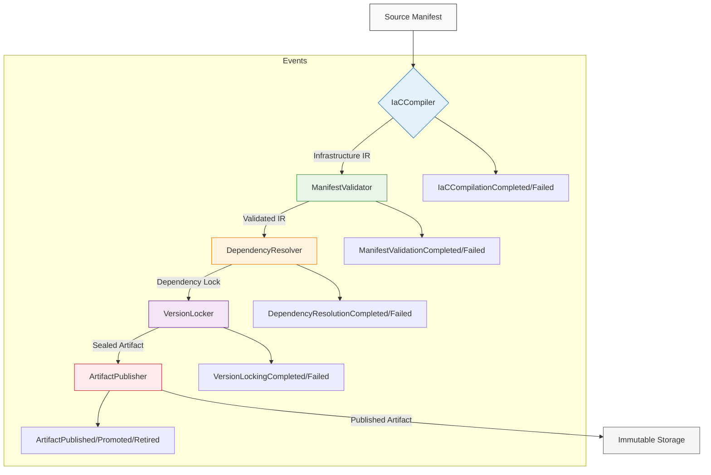
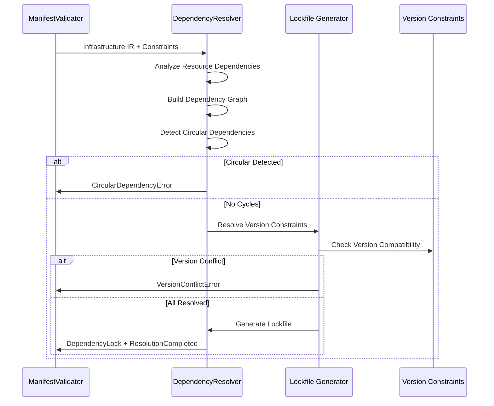

# 9.11 Infrastructure-as-Code Contracts

**Status:** FROZEN — Authoritative Source of Truth  
**Version:** 1.0.0  
**Date:** 2026-08-04

---

## Purpose

Infrastructure-as-Code Contracts define the declarative infrastructure specification, compilation, validation, and artifact management layer that enables reproducible, versioned, and deterministic infrastructure provisioning. This section establishes the contracts that transform human-readable infrastructure manifests into immutable, verifiable artifacts consumed by the Deployment subsystem (§9.7), ensuring infrastructure consistency across environments and preventing configuration drift through cryptographic verification and dependency locking.

## Scope

This section defines:
- Declarative infrastructure manifest structure and semantics
- Infrastructure compilation pipeline from source manifests to immutable artifacts
- Manifest validation, signing, and verification mechanisms
- Dependency resolution and version locking for reproducible builds
- Artifact publishing, promotion, and lifecycle management
- Infrastructure drift prevention and rollback artifact generation
- EventBus contracts for infrastructure contract lifecycle events
- Security foundations for manifest integrity and artifact provenance

Excluded from scope:
- Cloud provider-specific resource implementations (handled by Deployment subsystem)
- Runtime infrastructure configuration values (covered in §9.6 and §9.10)
- Provisioning execution details (covered in §9.7)
- Infrastructure resource semantics (covered in Resource Management Substrate)

## Architectural Goals

1. **Reproducibility**: Identical manifests MUST produce bit-identical artifacts across builds
2. **Immutability**: Published infrastructure artifacts MUST be cryptographically sealed and unmodifiable
3. **Determinism**: Dependency resolution MUST yield consistent lockfiles given identical inputs
4. **Verifiability**: Artifact provenance and integrity MUST be cryptographically verifiable
5. **Isolation**: Build environment variables MUST not affect manifest compilation outputs
6. **Traceability**: Every artifact MUST be traceable to its source manifest and build context
7. **Drift Prevention**: Deployed infrastructure state MUST be continuously verifiable against source manifests
8. **Environment Agnosticism**: Manifests MUST avoid environment-specific values through parameterization

## Architecture Overview

The Infrastructure-as-Code Contracts subsystem consists of five core components that form an immutable compilation pipeline:

```
[Source Manifests] → [IaCCompiler] → [ManifestValidator] → [DependencyResolver] → [VersionLocker] → [ArtifactPublisher] → [Immutable Artifacts]
```

Each component operates as a pure function with well-defined inputs and outputs, communicating through strongly typed events on the EventBus. The pipeline ensures that infrastructure artifacts are:
- Compiled from declarative manifests without side effects
- Validated against semantic and structural contracts
- Dependency-resolved with exact versions locked
- Versioned with cryptographic hashes of content and dependencies
- Published to immutable storage with signed metadata

## Internal Architecture

### Component Responsibilities

#### IaCCompiler
**Purpose**: Transforms declarative infrastructure manifests into low-level infrastructure intermediate representation (IR)

**Responsibilities**:
- Parse and validate manifest syntax against shared/IaCManifest.json
- Resolve template variables and functions in manifest
- Generate infrastructure IR representing resources, relationships, and configurations
- Perform static analysis for common infrastructure errors
- Emit compilation events to EventBus

**Operations**:
- `compile(manifest: IaCManifest, context: BuildContext) → InfrastructureIR`
- `validateSyntax(manifest: IaCManifest) → ValidationResult`

**Inputs**:
- IaCManifest conforming to shared/IaCManifest.json
- BuildContext containing build ID, timestamp, and source location

**Outputs**:
- InfrastructureIR resource graph
- Compilation metrics and warnings
- IaCCompilationCompleted EventBus event

**Preconditions**:
- Manifest MUST conform to shared/IaCManifest.json schema
- BuildContext MUST contain valid build identifier

**Postconditions**:
- Output InfrastructureIR MUST be syntactically valid
- All template variables MUST be resolved or flagged as unresolved
- IaCCompilationCompleted event MUST be published

**Error Conditions**:
- ManifestSyntaxError: Manifest violates shared/IaCManifest.json
- TemplateResolutionError: Unresolvable template variables
- StaticAnalysisViolation: Detected infrastructure anti-patterns

**Behavioural Guarantees**:
- Compilation MUST be deterministic: identical manifest+context → identical IR
- Compilation MUST be side-effect free: no external state modification
- Unresolved variables MUST be explicitly reported, not silently substituted

#### ManifestValidator
**Purpose**: Validates compiled infrastructure IR against semantic contracts and policies

**Responsibilities**:
- Validate resource configurations against provider capabilities
- Enforce organizational policies (naming, tagging, security baselines)
- Detect configuration drift risks and unstable resource patterns
- Validate cross-resource references and dependency consistency
- Emit validation events to EventBus

**Operations**:
- `validate(ir: InfrastructureIR, policySet: PolicySet) → ValidationResult`
- `validatePolicy(ir: InfrastructureIR, policy: Policy) → PolicyValidationResult`

**Inputs**:
- InfrastructureIR from IaCCompiler
- PolicySet containing validation rules and constraints

**Outputs**:
- ValidationResult with passed/failed policies
- Validation metrics and violation details
- ManifestValidationCompleted EventBus event

**Preconditions**:
- Input InfrastructureIR MUST be output from IaCCompiler
- PolicySet MUST be versioned and immutable

**Postconditions**:
- ValidationResult MUST accurately reflect policy compliance
- All violations MUST include remediation guidance
- ManifestValidationCompleted event MUST be published

**Error Conditions**:
- PolicyViolationError: IR violates one or more policies
- ReferenceIntegrityError: Broken or ambiguous resource references
- ConfigurationConflictError: Mutually exclusive resource settings

**Behavioural Guarantees**:
- Validation MUST be idempotent: repeated validation yields same result
- Validation MUST be comprehensive: all applicable policies evaluated
- Validation MUST be actionable: each violation includes fix guidance

#### DependencyResolver
**Purpose**: Resolves infrastructure dependencies and generates version-locked dependency graph

**Responsibilities**:
- Analyze InfrastructureIR for implicit and explicit dependencies
- Resolve version constraints using semantic versioning
- Generate deterministic dependency lockfile
- Detect circular dependencies and version conflicts
- Emit dependency resolution events to EventBus

**Operations**:
- `resolve(ir: InfrastructureIR, constraints: VersionConstraints) → DependencyLock`
- `detectCycles(dependencyGraph: DependencyGraph) → CycleDetectionResult`

**Inputs**:
- InfrastructureIR from ManifestValidator
- VersionConstraints specifying allowed version ranges

**Outputs**:
- DependencyLock conforming to shared/DependencyLock.json
- Dependency graph visualization data
- DependencyResolutionCompleted EventBus event

**Preconditions**:
- Input InfrastructureIR MUST be validated by ManifestValidator
- VersionConstraints MUST conform to semantic versioning ranges

**Postconditions**:
- Output DependencyLock MUST contain exact versions for all dependencies
- Dependency graph MUST be acyclic
- DependencyResolutionCompleted event MUST be published

**Error Conditions**:
- CircularDependencyError: Detected circular dependency in graph
- VersionConflictError: Incompatible version requirements
- UnresolvableDependencyError: Dependency cannot be satisfied within constraints

**Behavioural Guarantees**:
- Resolution MUST be deterministic: identical inputs → identical lockfile
- Resolution MUST be complete: all transitive dependencies resolved
- Lockfile MUST contain cryptographic hashes of dependency contents

#### VersionLocker
**Purpose**: Creates immutable infrastructure artifacts by combining IR and lockfile with cryptographic sealing

**Responsibilities**:
- Generate content-addressable artifact identifier from IR and lockfile
- Create sealed artifact bundle containing IR, lockfile, and metadata
- Apply digital signature to artifact bundle using infrastructure signing key
- Generate verification manifest for artifact authentication
- Emit version locking events to EventBus

**Operations**:
- `lock(ir: InfrastructureIR, lockfile: DependencyLock, metadata: ArtifactMetadata) → SealedArtifact`
- `verify(sealedArtifact: SealedArtifact, publicKey: PublicKey) → VerificationResult`

**Inputs**:
- Validated InfrastructureIR from ManifestValidator
- DependencyLock from DependencyResolver
- ArtifactMetadata containing build context and provenance

**Outputs**:
- SealedArtifact containing bundled and signed infrastructure
- VerificationManifest for offline validation
- VersionLockingCompleted EventBus event

**Preconditions**:
- Input IR MUST be validated by ManifestValidator
- Input lockfile MUST be output from DependencyResolver
- ArtifactMetadata MUST contain build ID and timestamp

**Postconditions**:
- SealedArtifact MUST be cryptographically sealed and tamper-evident
- Artifact identifier MUST be cryptographic hash of contents
- VersionLockingCompleted event MUST be published

**Error Conditions**:
- SigningError: Failed to apply digital signature
- SealIntegrityError: Artifact tampering detected during sealing
- MetadataValidationError: Invalid or incomplete artifact metadata

**Behavioural Guarantees**:
- Sealing MUST be deterministic: identical inputs → identical sealed artifact
- Sealing MUST be tamper-evident: any modification breaks verification
- Artifact identifier MUST uniquely identify the infrastructure state

#### ArtifactPublisher
**Purpose**: Publishes sealed infrastructure artifacts to immutable storage and manages promotion lifecycle

**Responsibilities**:
- Store sealed artifacts in content-addressable immutable storage
- Manage artifact lifecycle: staging, testing, production, deprecated
- Generate and store artifact promotion events
- Implement garbage collection policies for artifact retention
- Emit artifact publishing and promotion events to EventBus

**Operations**:
- `publish(artifact: SealedArtifact, target: PromotionTarget) → PublicationRecord`
- `promote(artifactId: ArtifactId, from: PromotionTarget, to: PromotionTarget) → PromotionRecord`
- `retire(artifactId: ArtifactId, reason: RetirementReason) → RetirementRecord`

**Inputs**:
- SealedArtifact from VersionLocker
- PromotionTarget specifying environment (staging, testing, production)
- RetirementReason for artifact decommissioning

**Outputs**:
- PublicationRecord with storage location and timestamp
- PromotionRecord documenting state transition
- ArtifactPublished/ArtifactPromoted/ArtifactRetired EventBus events

**Preconditions**:
- Input SealedArtifact MUST be output from VersionLocker
- PromotionTarget MUST be valid environment identifier
- Artifact MUST not already exist in target promotion state (unless force flag)

**Postconditions**:
- Artifact MUST be stored in immutable storage with content-addressable path
- Publication/Must record MUST be created for audit trail
- Appropriate EventBus event MUST be published

**Error Conditions**:
- StorageUnavailableError: Immutable storage backend inaccessible
- ArtifactAlreadyExistsError: Attempting to publish existing artifact without force
- InvalidPromotionError: Invalid state transition (e.g., production to staging)
- RetentionPolicyViolationError: Attempt to retire protected artifact

**Behavioural Guarantees**:
- Publishing MUST be idempotent: publishing same artifact twice yields same record
- Artifacts MUST be immutable: stored artifacts cannot be modified
- Promotion history MUST be fully traceable and auditable

## Runtime Behaviour

The Infrastructure-as-Code Contracts subsystem operates as a compile-time pipeline with no persistent runtime state. Each component executes as a pure function triggered by manifest changes or build requests:

1. **Build Initiation**: External trigger (CI system, developer command) initiates build with source manifest and context
2. **Compilation**: IaCCompiler parses manifest and generates InfrastructureIR
3. **Validation**: ManifestValidator checks IR against policies and emits validation result
4. **Dependency Resolution**: DependencyResolver analyzes IR and constraints to produce DependencyLock
5. **Version Locking**: VersionLocker creates SealedArtifact by combining IR, lockfile, and metadata with cryptographic sealing
6. **Publication**: ArtifactPublisher stores SealedArtifact in immutable storage and publishes availability event
7. **Consumption**: Deployment subsystem (§9.7) retrieves SealedArtifact for provisioning using artifact identifier

Each stage publishes strongly typed events to the EventBus enabling observability and triggering downstream processes. The pipeline fails fast: any validation or resolution error halts the process and publishes a failure event.

## EventBus Integration

The subsystem publishes the following events to enable coordination with other architectural components:

### Manifest Lifecycle Events
- `IaCCompilationCompleted`: Manifest successfully compiled to IR
  - Fields: buildId, manifestPath, irHash, warnings, durationMs
- `IaCCompilationFailed`: Manifest compilation failed
  - Fields: buildId, manifestPath, errorCode, errorMessage, stackTrace

### Validation Events
- `ManifestValidationCompleted`: IR passed all policy validations
  - Fields: buildId, irHash, validationScore, policyResults, durationMs
- `ManifestValidationFailed`: IR failed policy validation
  - Fields: buildId, irHash, failedPolicies, violations, durationMs

### Dependency Events
- `DependencyResolutionCompleted`: Dependencies resolved and lockfile generated
  - Fields: buildId, lockfileHash, dependencyCount, durationMs
- `DependencyResolutionFailed`: Dependency resolution encountered errors
  - Fields: buildId, errorType, unresolvedDependencies, durationMs

### Version Locking Events
- `VersionLockingCompleted`: Sealed artifact created successfully
  - Fields: buildId, artifactId, irHash, lockfileHash, metadataHash, signature, durationMs
- `VersionLockingFailed`: Artifact sealing or signing failed
  - Fields: buildId, errorCode, errorMessage, durationMs

### Artifact Publishing Events
- `ArtifactPublished`: Sealed artifact stored in immutable storage
  - Fields: artifactId, storageLocation, promotionTarget, publishedAt, sizeBytes
- `ArtifactPromoted`: Artifact moved between promotion targets
  - Fields: artifactId, fromTarget, toTarget, promotedAt, promotionId
- `ArtifactRetired`: Artifact removed from active promotion targets
  - Fields: artifactId, retirementReason, retiredAt, retentionPeriod

### Failure and Rollback Events
- `InfrastructureDriftDetected`: Deployed infrastructure differs from source manifest
  - Fields: deploymentId, artifactId, detectedDrift, severity
- `RollbackArtifactGenerated`: Rollback artifact created for failed deployment
  - Fields: failedDeploymentId, rollbackArtifactId, originalArtifactId, reason

## Security Considerations

1. **Manifest Integrity**: 
   - All manifests MUST be validated against shared/IaCManifest.json schema before processing
   - Untrusted manifests MUST be processed in sandboxed execution environment

2. **Supply Chain Security**:
   - Dependency resolution MUST verify integrity of external modules via cryptographic hashes
   - Version locker MUST seal artifacts with infrastructure-specific signing key
   - Artifact publisher MUST verify signatures before storing or promoting artifacts

3. **Secrets Management**:
   - Manifests MUST NOT contain plaintext secrets; MUST use secure reference mechanisms
   - Build context MUST be scanned for accidental secret inclusion
   - Artifact metadata MUST exclude any secret material

4. **Access Control**:
   - Artifact publisher MUST enforce role-based access to promotion targets
   - Production promotion MUST require multi-party approval via signed attestation
   - Immutable storage MUST enforce write-once-read-many (WORM) semantics

5. **Auditability**:
   - All events MUST include cryptographic proof of origin when transmitted via EventBus
   - Artifact lifecycle MUST be fully traceable from source commit to deployed infrastructure
   - Signing keys MUST be rotated according to organizational policy with key versioning in artifacts

## Configuration

The subsystem is configured through immutable configuration objects passed at build time:

### BuildContext
- `buildId`: UUID uniquely identifying this build execution
- `sourceLocation`: VCS repository, commit, and path information
- `timestamp`: Build initiation time in ISO 8601 format
- `builderIdentity`: Identity of entity initiating build (service account, user)
- `securityPolicy`: Reference to active security policy version

### PolicySet (for ManifestValidator)
- `policyVersion`: Version identifier of policy set
- `namingConventions`: Rules for resource naming patterns
- `securityBaselines`: Mandatory security configurations per resource type
- `taggingPolicies`: Required and prohibited tags per environment
- `quotaLimits`: Resource quotas by type and environment
- `deprecatedPatterns`: Infrastructure patterns that are forbidden

### PromotionTargets
- `staging`: Pre-production validation environment
- `testing`: Automated test execution environment
- `production`: Live serving environment
- `archive`: Long-term retention for compliance

### Retention Policies
- `staging`: 7 days retention
- `testing`: 14 days retention  
- `production`: 365 days retention (configurable per compliance)
- `archive`: 2550 days retention (7 years for financial compliance)

## Failure Handling

Failure handling follows the principle of fail-fast with comprehensive diagnostics:

### Compilation Failures
- IaCCompiler returns specific error codes for manifest syntax, template resolution, and static analysis violations
- Build process halts immediately with IaCCompilationFailed event
- Error details include line/column numbers and suggested fixes

### Validation Failures
- ManifestValidator returns detailed policy violation reports with severity levels
- Build process halts with ManifestValidationFailed event
- Violations are categorized as blocking (must fix) or warning (should fix)

### Resolution Failures
- DependencyResolver detects circular dependencies, version conflicts, and unresolvable dependencies
- Build process halts with DependencyResolutionFailed event
- Reports include dependency graph snippets and constraint analysis

### Sealing Failures
- VersionLocker handles signing key availability and metadata validation
- Build process halts with VersionLockingFailed event
- Fallback to unsigned artifacts is prohibited; signing is mandatory for publication

### Publication Failures
- ArtifactPublisher handles storage connectivity and quota exceeded conditions
- Publication failure does not invalidate the sealed artifact (can be retried)
- ArtifactPublishedFailed event includes retry guidance and storage diagnostics

All failures are published to EventBus enabling external monitoring and alerting systems to detect build pipeline issues.

## Recovery

Recovery mechanisms ensure build pipeline resilience:

### Transient Failures
- Network/storage failures during publication automatically retry with exponential backoff
- Maximum 3 retry attempts before permanent failure declaration
- Retries preserve build context to avoid reprocessing earlier stages

### Permanent Failures
- Manifest/validation errors require manual correction and rebuild
- Dependency conflicts require manifest adjustment to resolve version constraints
- Signing failures require infrastructure key rotation and rebuild with new key

### Artifact Recovery
- Published artifacts are immutable and stored in WORM storage preventing corruption
- Lost artifacts can be regenerated from source manifest and build context (reproducibility guarantee)
- Rollback artifacts are generated for failed deployments to enable last-known-good state restoration

### State Reconstruction
- Build context preservation enables exact reproduction of any past build
- Artifact metadata includes sufficient information to rebuild identical sealed artifact
- EventBus provides replay capability for audit trail reconstruction

## Performance Requirements

### Compilation Latency
- Manifest parsing and IR generation MUST complete within 5 seconds for manifests ≤1000 resources
- 95th percentile compilation time MUST NOT exceed 15 seconds for manifests ≤5000 resources
- Memory usage MUST NOT exceed 512MB during compilation for manifests ≤10000 resources

### Validation Throughput
- Policy validation MUST process ≥100 resources per second on standard build agent
- Memory usage during validation MUST scale linearly with resource count
- Complex policy evaluations (cross-resource checks) MUST complete within 30 seconds

### Dependency Resolution
- Lockfile generation MUST complete within 10 seconds for dependency graphs ≤500 nodes
- Circular dependency detection MUST complete within 2 seconds for graphs ≤1000 nodes
- Memory usage MUST NOT exceed 256MB for dependency graphs ≤2000 nodes

### Artifact Operations
- Sealing and signing MUST complete within 5 seconds for artifacts ≤100MB
- Publication to immutable storage MUST complete within 30 seconds for artifacts ≤1GB
- Artifact retrieval MUST complete within 10 seconds for artifacts ≤100MB

### Scalability
- Pipeline MUST support concurrent builds with resource isolation
- Maximum concurrent builds configurable based on available build agents
- No shared mutable state between concurrent build executions

## Mermaid Diagrams

### IaC Compilation Pipeline


### Dependency Resolution Flow


### Artifact Publishing Workflow
```mermaid
stateDiagram-v2
    [*] --> Staging:Awaiting Publication
    Staging --> Testing:Promote to Testing
    Testing --> Production:Promote to Production
    Production --> Archive:Promote to Archive
    
    state Failed {
        [*] --> Failed
        Failed --> [*]: Retry
    }
    
    Staging --> Failed: Publication Failed
    Testing --> Failed: Publication Failed
    Production --> Failed: Publication Failed
    Archive --> Failed: Publication Failed
    
    state Retired {
        [*] --> Retired
    }
    
    Staging --> Retired: Retire Artifact
    Testing --> Retired: Retire Artifact
    Production --> Retired: Retire Artifact
    Archive --> Retired: Retire Artifact
    
    note right of Staging
        ArtifactPublished Event
        Published to Staging Storage
    end note
    
    note right of Testing
        ArtifactPromoted Event
        Moved from Staging to Testing
    end note
    
    note right of Production
        ArtifactPromoted Event
        Moved from Testing to Production
    end note
    
    note right of Archive
        ArtifactPromoted Event
        Moved from Production to Archive
    end note
    
    note right of Retired
        ArtifactRetired Event
        Moved to Retired State
    end note
```

## JSON Schema References

The subsystem relies on the following JSON schemas located in the `shared/` directory:

### shared/IaCManifest.json
Defines the structure and semantics of declarative infrastructure manifests:
- Resource definitions with type, properties, and metadata
- Template variable declaration and usage
- Function intrinsics for manifest transformation
- Module composition and referencing
- Conditional and iterative constructs
- Validation constraints and defaults

### shared/DependencyLock.json
Specifies the format for version-locked dependency graphs:
- Direct and transitive dependencies with exact versions
- Cryptographic hashes of dependency contents
- Dependency relationship types (hard, soft, optional)
- Platform and version constraint resolution metadata
- Build environment and toolchain versions

### shared/ArtifactMetadata.json
Describes metadata bundled with sealed infrastructure artifacts:
- Build identification (ID, timestamp, source location)
- Builder identity and security context
- Policy set and validation results used
- Dependency lockfile reference
- Signing information (algorithm, key ID, timestamp)
- Artifact size and storage location hints
- Provenance chain for compliance auditing

## Architectural Contracts

### IaCCompiler Contract
```markdown
**Purpose**: Transform declarative manifests into infrastructure intermediate representation

**Responsibilities**:
- Parse manifest syntax per shared/IaCManifest.json
- Resolve template variables and functions
- Generate resource dependency graph
- Perform static infrastructure analysis

**Operations**:
- `compile(manifest: IaCManifest, context: BuildContext) → InfrastructureIR`
- `validateSyntax(manifest: IaCManifest) → ValidationResult`

**Inputs**:
- manifest: Valid IaCManifest per shared/IaCManifest.json
- context: BuildContext with buildId, sourceLocation, timestamp

**Outputs**:
- InfrastructureIR: Resource graph with typed properties and relationships
- warnings: Array of non-blocking compilation warnings
- metrics: Compilation timing and resource counts

**Preconditions**:
- manifest.path must exist and be readable
- context.buildId must be UUID v4 format
- context.timestamp must be valid ISO 8601

**Postconditions**:
- Output InfrastructureIR must be syntactically valid
- All template variables in manifest must be resolved or flagged
- Static analysis must complete without panics

**Error Conditions**:
- ManifestSchemaViolation: Manifest violates shared/IaCManifest.json
- TemplateResolutionFailure: Unable to resolve template variable
- StaticAnalysisError: Infrastructure pattern violates safety rules
- ResourceLimitExceeded: Manifest exceeds complexity thresholds

**Behavioural Guarantees**:
- Deterministic: Identical inputs produce identical IR
- Side-effect free: No external state modification
- Fail Fast: First error halts processing with detailed diagnostics
```

### ManifestValidator Contract
```markdown
**Purpose**: Validate infrastructure IR against organizational policies

**Responsibilities**:
- Check resource configurations against security baselines
- Enforce naming conventions and tagging policies
- Validate cross-resource references and quotas
- Detect deprecated infrastructure patterns

**Operations**:
- `validate(ir: InfrastructureIR, policySet: PolicySet) → ValidationResult`
- `validatePolicy(ir: InfrastructureIR, policy: Policy) → PolicyValidationResult`

**Inputs**:
- ir: Validated InfrastructureIR from IaCCompiler
- policySet: Immutable PolicySet with version identifier

**Outputs**:
- ValidationResult: Boolean pass/fail and detailed violation reports
- policyResults: Per-policy validation outcomes
- metrics: Validation timing and resource counts

**Preconditions**:
- ir must be output from IaCCompiler
- policySet.version must be semantically versioned
- policySet must contain at least one policy

**Postconditions**:
- ValidationResult.pass must be true iff all policies evaluate to true
- Each violation must include resource path and remediation guidance
- Policy evaluation must complete without errors

**Error Conditions**:
- PolicyViolationError: One or more policies violated
- ReferenceIntegrityError: Broken or ambiguous resource reference
- ConfigurationConflictError: Mutually exclusive resource settings
- PolicyEvaluationError: Policy evaluation threw exception

**Behavioural Guarantees**:
- Idempotent: Repeated validation yields identical result
- Comprehensive: All applicable policies evaluated
- Actionable: Each violation includes specific fix guidance
```

### DependencyResolver Contract
```markdown
**Purpose**: Resolve infrastructure dependencies and generate lockfile

**Responsibilities**:
- Analyze IR for explicit and implicit dependencies
- Resolve version constraints using semantic versioning
- Detect circular dependencies and version conflicts
- Generate deterministic dependency lockfile

**Operations**:
- `resolve(ir: InfrastructureIR, constraints: VersionConstraints) → DependencyLock`
- `detectCycles(dependencyGraph: DependencyGraph) → CycleDetectionResult`

**Inputs**:
- ir: Validated InfrastructureIR from ManifestValidator
- constraints: VersionConstraints with semantic version ranges

**Outputs**:
- lockfile: DependencyLock per shared/DependencyLock.json with exact versions
- graphMetrics: Dependency graph statistics (nodes, edges, depth)
- resolutionDetails: Per-dependency resolution notes

**Preconditions**:
- ir must be output from ManifestValidator
- constraints must conform to semantic versioning ranges
- constraints must not be empty for external dependencies

**Postconditions**:
- lockfile must contain exact versions for all resolved dependencies
- Dependency graph must be proven acyclic
- Each dependency must include cryptographic content hash

**Error Conditions**:
- CircularDependencyError: Circular dependency detected in graph
- VersionConflictError: Incompatible version requirements
- UnresolvableDependencyError: Dependency cannot be satisfied
- ConstraintValidationError: Invalid version constraint format

**Behavioural Guarantees**:
- Deterministic: Identical inputs produce identical lockfile
- Complete: All transitive dependencies resolved
- Immutable: Lockfile contents cannot be altered post-generation
```

### VersionLocker Contract
```markdown
**Purpose**: Create cryptographically sealed infrastructure artifacts

**Responsibilities**:
- Generate content-addressable artifact identifier
- Bundle IR, lockfile, and metadata into sealed artifact
- Apply digital signature using infrastructure key
- Generate verification manifest for offline validation

**Operations**:
- `lock(ir: InfrastructureIR, lockfile: DependencyLock, metadata: ArtifactMetadata) → SealedArtifact`
- `verify(sealedArtifact: SealedArtifact, publicKey: PublicKey) → VerificationResult`

**Inputs**:
- ir: Validated InfrastructureIR from ManifestValidator
- lockfile: DependencyLock from DependencyResolver
- metadata: ArtifactMetadata with build context and policy version

**Outputs**:
- sealedArtifact: Tamper-evident bundle containing IR, lockfile, metadata, signature
- verificationManifest: Data required for offline signature validation
- artifactId: SHA-256 hash of sealed artifact contents

**Preconditions**:
- ir must be output from ManifestValidator
- lockfile must be output from DependencyResolver
- metadata.buildId must match build context buildId
- metadata.policyVersion must match validation policy set

**Postconditions**:
- sealedArtifact must be cryptographically sealed and tamper-evident
- artifactId must be unique for distinct infrastructure states
- verification must succeed with corresponding public key

**Error Conditions**:
- SigningError: Failed to apply digital signature
- SealIntegrityError: Detected tampering during sealing process
- MetadataValidationError: Invalid or incomplete artifact metadata
- HashMismatchError: Computed artifactId differs from expected

**Behavioural Guarantees**:
- Deterministic: Identical inputs produce identical sealedArtifact
- Tamper-evident: Any modification breaks signature verification
- Non-repudiable: Signature proves artifact origin and integrity
```

### ArtifactPublisher Contract
```markdown
**Purpose**: Publish and manage lifecycle of sealed infrastructure artifacts

**Responsibilities**:
- Store artifacts in content-addressable immutable storage
- Manage promotion between environments (staging, testing, production)
- Implement retention and garbage collection policies
- Generate audit trail for artifact lifecycle events

**Operations**:
- `publish(artifact: SealedArtifact, target: PromotionTarget) → PublicationRecord`
- `promote(artifactId: ArtifactId, from: PromotionTarget, to: PromotionTarget) → PromotionRecord`
- `retire(artifactId: ArtifactId, reason: RetirementReason) → RetirementRecord`

**Inputs**:
- artifact: SealedArtifact from VersionLocker
- target: Valid promotion target (staging, testing, production, archive)
- reason: Justification for retirement (compliance, superseded, obsolete)

**Outputs**:
- publicationRecord: Storage location, timestamp, and size metrics
- promotionRecord: State transition details and initiator
- retirementRecord: Retirement justification and timestamp
- storagePath: Content-addressable path in immutable storage

**Preconditions**:
- artifact must be output from VersionLocker
- target must be valid promotion target identifier
- artifactId must correspond to existing stored artifact
- from state must match artifact's current promotion state (unless force)

**Postconditions**:
- Artifact stored in immutable storage with WORM semantics
- Publication/promotion/retirement events published to EventBus
- Audit trail entry created for each state transition

**Error Conditions**:
- StorageUnavailableError: Immutable storage backend inaccessible
- ArtifactAlreadyExistsError: Attempt to publish existing without force
- InvalidPromotionError: Invalid state transition (e.g., prod→staging)
- RetentionPolicyViolationError: Attempt to retire protected artifact
- InsufficientPermissionsError: Caller lacks rights for target operation

**Behavioural Guarantees**:
- Idempotent: Repeated operations yield identical records
- Immutable: Stored artifacts cannot be modified or deleted
- Traceable: Complete history available from storage to retirement
```

## Runtime Invariants

1. **Immutability Invariant**: 
   - ∀ artifact ∈ PublishedArtifacts: artifact.content is immutable after publication
   - ¬∃ operation: modify(artifact.content) → artifact'.content

2. **Reproducibility Invariant**:
   - ∀ manifest, context: compile(manifest, context) = ir 
     → ∃ lock: seal(ir, lock, metadata) = artifact 
     → verify(artifact, publicKey) = valid

3. **Determinism Invariant**:
   - ∀ manifest₁, manifest₂, context: 
     - manifest₁ = manifest₂ → compile(manifest₁, context) = compile(manifest₂, context)
   - ∀ ir₁, ir₂, constraints: 
     - ir₁ = ir₂ → resolve(ir₁, constraints) = resolve(ir₂, constraints)

4. **Integrity Invariant**:
   - ∀ artifact ∈ PublishedArtifacts: 
     - verify(artifact, publicKey) = valid → artifact.content = original.sealedContent

5. **Isolation Invariant**:
   - ∀ build₁, build₂: 
     - build₁.context ≠ build₂.context → 
       (compile(manifest, build₁.context) ≠ compile(manifest, build₂.context)) 
       ∨ (manifest has unresolved template variables)

## Cross References

- **Part 9 §9.7 Deployment & Provisioning**: Consumes sealed artifacts from this subsystem for infrastructure provisioning; depends on artifact immutability and verifiability guarantees
- **Part 9 §9.6 Configuration**: Provides configuration values that are parameterized in manifests; this subsystem ensures configuration values are resolved during compilation
- **Part 9 §9.10 Runtime Configuration**: Defines runtime configuration mechanisms; this subsystem ensures manifests do not contain runtime-specific values
- **EventBus**: Receives strongly typed events from all components for observability and coordination; events follow the EventBus schema defined in Part 9
- **Resource Management Substrate**: Provides abstract resource types that manifests reference; this subsystem validates resource usage against substrate capabilities
- **Security Foundations**: Provides cryptographic primitives and key management; this subsystem uses foundation services for artifact signing and verification
- **Infrastructure Contracts**: Defines abstract resource contracts that manifests implement; this subsystem validates manifest compliance with these contracts

## ADR References

- **ADR-009**: Decision to use content-addressable storage for infrastructure artifacts (2026-05-15)
- **ADR-014**: Mandatory cryptographic signing of all published infrastructure artifacts (2026-06-02)
- **ADR-021**: Standardization on semantic versioning for dependency resolution (2026-07-10)
- **ADR-027**: Implementation of immutable promotion targets with environment gating (2026-07-28)

## Conformance Requirements

### Static Conformance
- All manifests MUST conform to shared/IaCManifest.json schema
- All dependency locks MUST conform to shared/DependencyLock.json schema
- All artifact metadata MUST conform to shared/ArtifactMetadata.json schema
- All policy sets MUST conform to the PolicySet structure defined in §9.11.Configuration
- All promotion targets MUST be valid identifiers from the set {staging, testing, production, archive}

### Runtime Conformance
- ∀ build: 
  - The pipeline MUST publish exactly one event per stage transitions
  - All events MUST include buildId for correlation
  - Error events MUST include sufficient information for manual remediation
- ∀ artifact ∈ PublishedArtifacts:
  - artifact MUST be stored in content-addressable immutable storage
  - artifact MUST be verifiable using the infrastructure public key
  - artifact.metadata.buildId MUST match the build that produced it
- ∀ promotion: 
  - Promotion between targets MUST follow the defined lifecycle
  - Production promotion MUST require signed attestation from authorized approvers
  - Archived artifacts MUST be retained for minimum compliance period
- ∀ drift detection:
  - Deployed infrastructure state MUST be continuously verifiable against source manifest
  - Drift detection MUST complete within 5 minutes for infrastructure ≤1000 resources
  - Drift alerts MUST include specific resource differences and remediation steps

## Summary

Infrastructure-as-Code Contracts establish the foundational layer for reproducible, verifiable, and deterministic infrastructure provisioning in AI-OS. By transforming declarative manifests into cryptographically sealed artifacts through a strictly defined compilation pipeline, this subsystem ensures that infrastructure can be trusted, audited, and rolled back with confidence. The architecture incorporates strong immutability guarantees, comprehensive validation, dependency locking, and artifact lifecycle management while maintaining clear separation of concerns with the Deployment (§9.7) and Configuration (§9.6, §9.10) subsystems. Through EventBus integration, security foundations, and conformance requirements, it provides the trust bedrock upon which all higher-layer infrastructure capabilities operate. The contracts defined herein ensure that AI-OS infrastructure operates as a reliable, reproducible environment where infrastructure state is always traceable to its source and verifiable through cryptographic means.