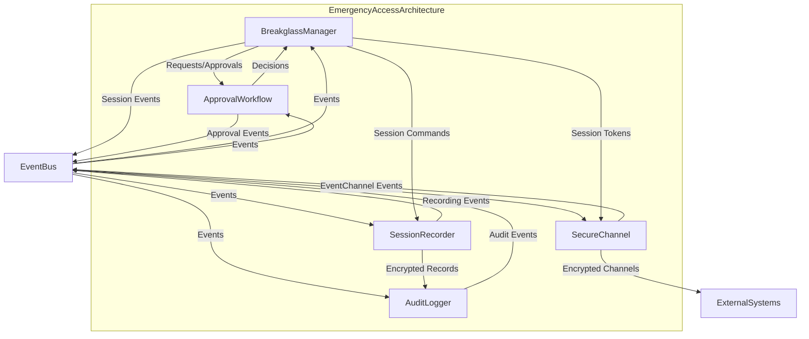
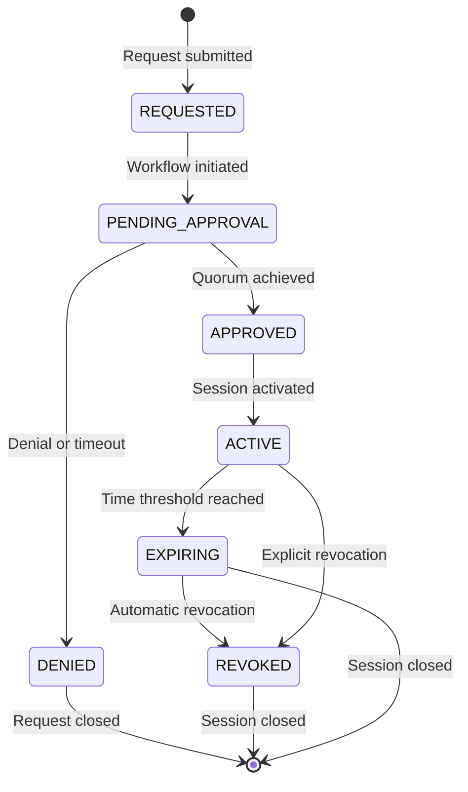
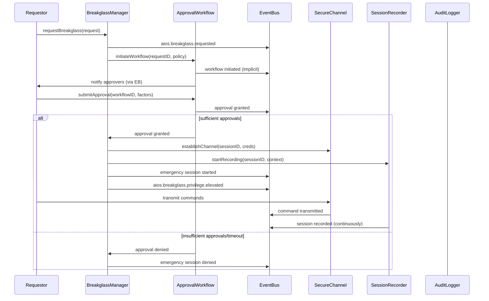
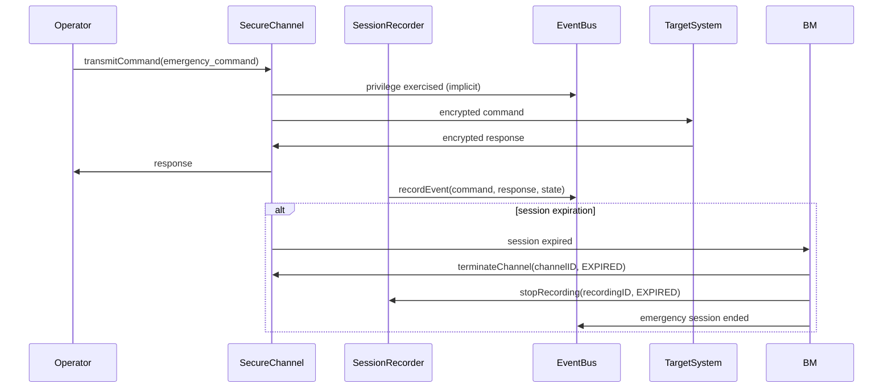

# 9.12 Emergency Access and Breakglass Procedures

## Purpose
This section defines the architectural framework for emergency access (breakglass) mechanisms in AI-OS. It provides a secure, auditable, and controlled mechanism for elevated privileged access during exceptional operational situations when standard authentication mechanisms are unavailable or insufficient. The architecture ensures that emergency access is granted only under strictly controlled conditions, with full accountability, time-limited privileges, and automatic revocation, while maintaining cryptographic evidence for forensic analysis and compliance.

## Scope
This specification applies to all emergency access mechanisms within AI-OS infrastructure that grant elevated privileges beyond standard operational access. It covers the architectural components, interactions, and guarantees for breakglass scenarios across all security domains and trust boundaries. It does not cover:
- Standard operational access procedures (covered in Part 9 §9.4)
- Physical security measures
- Organizational policies or personnel procedures beyond the defined architectural approval workflows
- Specific cryptographic algorithm implementations (covered in Part 5)
- Operational runbooks or procedural documentation

## Architectural Goals
The emergency access architecture must achieve the following goals:

- **Controlled Access**: Emergency privileges shall be grantable only through a defined, auditable approval workflow requiring multiple authorized approvers.
- **Least Privilege & Time-Bounding**: Elevated privileges shall be granted for the minimum necessary duration and scope, with automatic revocation upon expiration or explicit revocation.
- **Complete Auditability**: All emergency access requests, approvals, sessions, and actions shall be cryptographically logged and preserved for forensic analysis and compliance.
- **Secure Communication**: Emergency access channels shall be cryptographically isolated and protected from interception or tampering.
- **Automatic Recovery**: Privileges shall be automatically revoked and credentials rotated upon session termination or failure detection.
- **Fail-Safe Behavior**: Failure modes shall cause emergency access to default to a denied state.
- **Non-Repudiation**: All actions during emergency sessions shall be attributable to specific individuals through cryptographic attribution.
- **Separation of Duties**: Approval, execution, and auditing functions shall be architecturally separated to prevent single points of compromise.

## Architecture Overview
The emergency access architecture comprises five core architectural components that interact through well-defined EventBus interfaces to provide controlled emergency access capabilities. These components enforce the architectural goals through separation of concerns, cryptographic binding, and automated lifecycle management.



## Internal Architecture

### BreakglassManager
The BreakglassManager is the central orchestrator of emergency access requests and lifecycle management. It receives breakglass requests, initiates approval workflows, manages emergency session state, and enforces automatic privilege revocation.

#### Responsibilities
- Receiving and validating emergency access requests
- Initiating approval workflows via the ApprovalWorkflow component
- Managing emergency session state (requested, approved, active, expired, revoked)
- Issuing time-bound emergency tokens through the SecureChannel component
- Triggering automatic privilege revocation upon session expiration or explicit revocation
- Coordinating session recording initiation and termination with SessionRecorder
- Emitting lifecycle events to the EventBus

#### Operations
- `requestBreakglass(request: BreakglassRequest): RequestID`
- `approveRequest(requestID: RequestID, approverID: PrincipalID, factors: AuthFactorSet): ApprovalResult`
- `revokeSession(sessionID: SessionID, reason: RevocationReason): RevocationResult`
- `extendSession(sessionID: SessionID, extension: Duration, approverID: PrincipalID): ExtensionResult`
- `getSessionState(sessionID: SessionID): SessionState`

#### Inputs
- Emergency access requests containing justification, requested privileges, duration, and requestor identity
- Approval decisions from authorized approvers
- Session expiration timers
- Explicit revocation requests

#### Outputs
- Emergency session tokens (time-bound, scoped credentials)
- Session lifecycle events to EventBus
- Approval requests to ApprovalWorkflow
- Revocation commands to SecureChannel and SessionRecorder

#### Preconditions
- Requestor identity must be verified through standard authentication (per §9.4)
- Request must include valid justification and justification reference
- Requested duration must not exceed maximum emergency session duration policy

#### Postconditions
- Upon approval: Emergency session created with time-bound credentials
- Upon denial: Request denied and event logged
- Upon expiration: Automatic revocation triggered
- Upon revocation: Immediate privilege termination and credential invalidation

#### Error Conditions
- `INVALID_REQUEST`: Request missing required fields or invalid justification
- `APPROVAL_REQUIRED`: Request requires approval but none initiated
- `APPROVAL_DENIED`: Required approvals not obtained
- `SESSION_EXPIRED`: Attempt to use expired session
- `MAX_DURATION_EXCEEDED`: Requested duration exceeds policy maximum
- `APPROVAL_QUORUM_NOT_MET`: Insufficient approvers for required threshold

#### Behavioural Guarantees
- Emergency sessions shall not be granted without meeting the configured approval threshold
- All emergency sessions shall be automatically revoked upon expiration time
- All privilege usage during emergency sessions shall be cryptographically attributed to the session
- Emergency credentials shall be cryptographically bound to the approved session context

### ApprovalWorkflow
The ApprovalWorkflow component manages the multi-person approval process for emergency access requests, enforcing configurable approval policies and collecting cryptographic approvals.

#### Responsibilities
- Managing approval workflow state for each breakglass request
- Collecting and verifying cryptographic approvals from authorized approvers
- Enforcing configurable approval policies (number of approvers, required roles, timeouts)
- Notifying approvers of pending requests through secure channels
- Emitting approval/denial events to the EventBus
- Enforcing approval timeouts and escalation policies

#### Operations
- `initiateWorkflow(requestID: RequestID, policy: ApprovalPolicy): WorkflowID`
- `submitApproval(workflowID: WorkflowID, approverID: PrincipalID, factors: AuthFactorSet, justification: string): ApprovalResult`
- `timeoutWorkflow(workflowID: WorkflowID): TimeoutResult`
- `escalateWorkflow(workflowID: WorkflowID): EscalationResult`

#### Inputs
- Breakglass requests from BreakglassManager
- Approval submissions from authorized approvers (with multi-factor authentication)
- Workflow timeout events
- Escalation triggers

#### Outputs
- Approval decisions to BreakglassManager
- Approval/request denied events to EventBus
- Notification requests to notification systems (via EventBus)
- Escalation notifications

#### Preconditions
- Workflow must be initiated with valid BreakglassManager request ID
- Approvers must be authorized per the approval policy
- Approval submissions must include valid multi-factor authentication proofs

#### Postconditions
- Upon sufficient approvals: Workflow completed with approval decision
- Upon denial: Workflow completed with denial decision
- Upon timeout: Workflow timed out with denial decision (configurable)
- All approval events cryptographically signed and logged

#### Error Conditions
- `INVALID_WORKFLOW`: Invalid workflow state transition
- `UNAUTHORIZED_APPROVER`: Submitter not in approved approver set
- `INVALID_FACTORS`: Insufficient or invalid authentication factors
- `APPROVAL_TIMEOUT`: Workflow timed out before quorum reached
- `DUPLICATE_APPROVAL`: Approver already submitted approval

#### Behavioural Guarantees
- Emergency access shall require collaborative approval from multiple distinct authorized principals
- Approval workflow shall enforce time-bound decision making with configurable escalation
- All approvals shall be cryptographically verifiable and non-repudiable
- Approval decisions shall be immutable once recorded

### AuditLogger
The AuditLogger component provides cryptographically secure, append-only logging of all emergency access activities for forensic analysis, compliance, and oversight.

#### Responsibilities
- Receiving and cryptographically sealing audit events from all emergency access components
- Maintaining append-only, tamper-evident audit logs
- Providing cryptographic proofs of log integrity and completeness
- Supporting secure log export for external analysis
- Enforcing log retention and archival policies

#### Operations
- `logEvent(event: AuditEvent): LogEntryID`
- `verifyLogIntegrity(start: LogEntryID, end: LogEntryID): VerificationResult`
- `exportLog(start: LogEntryID, end: LogEntryID, destination: ExportTarget): ExportResult`
- `archiveLog(retentionPolicy: RetentionPolicy): ArchiveResult`

#### Inputs
- Audit events from BreakglassManager, ApprovalWorkflow, SecureChannel, SessionRecorder
- Log verification requests
- Log export requests
- Log archival policies

#### Outputs
- Log entry identifiers with cryptographic sequencing
- Integrity verification proofs
- Exported audit logs in standard formats
- Archive confirmation and storage references

#### Preconditions
- Audit events must conform to the SessionAudit.json schema
- Log verification requests must specify valid log ranges
- Export destinations must be authorized and secured per policy

#### Postconditions
- All audit events shall be cryptographically sealed and chained
- Log integrity shall be cryptographically verifiable
- Exported logs shall maintain cryptographic integrity guarantees
- Archived logs shall be retained per policy and inaccessible to operational systems

#### Error Conditions
- `INVALID_EVENT`: Audit event fails schema validation
- `INTEGRITY_VIOLATION`: Log chain integrity check failed
- `EXPORT_FAILED`: Secure export to destination failed
- `ARCHIVE_FAILED`: Archival operation failed per policy

#### Behavioural Guarantees
- Audit log shall be append-only and tamper-evident
- All emergency access actions shall be cryptographically attributable to specific principals
- Log integrity shall be verifiable without access to sealing keys (public verification)
- Log entries shall be immutable once written

### SecureChannel
The SecureChannel component establishes and manages cryptographically isolated communication channels for emergency access sessions, ensuring confidentiality and integrity of emergency sessions.

#### Responsibilities
- Establishing encrypted communication channels for emergency sessions
- Binding emergency credentials to specific session contexts
- Managing session key establishment and rotation
- Enabling secure command and control for emergency sessions
- Terminating and securing channels upon session end

#### Operations
- `establishChannel(sessionID: SessionID, credentials: EmergencyCredentials): ChannelID`
- `transmitCommand(channelID: ChannelID, command: AdminCommand): TransmissionResult`
- `receiveResponse(channelID: ChannelID): ResponseResult`
- `terminateChannel(channelID: ChannelID, reason: TerminationReason): TerminationResult`

#### Inputs
- Emergency session identifiers and credentials from BreakglassManager
- Administrative commands for execution during emergency session
- Channel termination requests (explicit or automatic)

#### Outputs
- Established secure channel identifiers
- Encrypted command transmission results
- Communication responses from target systems
- Channel termination confirmation

#### Preconditions
- Session must be in APPROVED or ACTIVE state
- Emergency credentials must be valid and time-bound
- Target systems must be pre-registered and authorized for emergency access

#### Postconditions
- Established channels shall provide confidentiality and integrity protection
- All channel communications shall be cryptographically bound to the emergency session
- Channel termination shall revoke all associated emergency credentials
- Channel keys shall be ephemeral and destroyed upon termination

#### Error Conditions
- `INVALID_SESSION`: Session not valid for channel establishment
- `CREDENTIAL_EXPIRED`: Emergency credentials expired or revoked
- `CHANNEL_ESTABLISHMENT_FAILED`: Secure channel setup failed
- `TRANSMISSION_FAILED`: Command transmission failed due to channel error
- `INVALID_COMMAND`: Command not authorized for emergency session

#### Behavioural Guarantees
- Emergency session channels shall provide end-to-end encryption and integrity protection
- Emergency credentials shall be unusable outside the context of their established channel
- Channel termination shall immediately invalidate all associated emergency credentials
- All channel operations shall be cryptographically bound to the specific emergency session

### SessionRecorder
The SessionRecorder component captures and cryptographically protects complete audit trails of all actions performed during emergency sessions for forensic replay and accountability.

#### Responsibilities
- Recording all commands, responses, and system states during emergency sessions
- Cryptographically sealing and chaining session recordings
- Providing secure storage and retrieval of session recordings
- Enabling forensic playback of recorded sessions
- Binding recordings to specific emergency sessions and approval contexts

#### Operations
- `startRecording(sessionID: SessionID, context: SessionContext): RecordingID`
- `recordEvent(recordingID: RecordingID, event: SessionEvent): EventResult`
- `stopRecording(recordingID: RecordingID, reason: TerminationReason): StopResult`
- `playbackRecording(recordingID: RecordingID, start: Timestamp, end: Timestamp): PlaybackResult`
- `verifyRecordingIntegrity(recordingID: RecordingID): VerificationResult`

#### Inputs
- Session identifiers and context from BreakglassManager
- Session events (commands, responses, state changes)
- Stop recording requests (explicit or automatic)
- Playback requests for forensic analysis

#### Outputs
- Recording identifiers with cryptographic sequencing
- Event recording confirmation
- Session recording files with integrity proofs
- Forensic playback of session activities
- Integrity verification proofs

#### Preconditions
- Emergency session must be in ACTIVE state
- Session context must include approved justification and scope
- Recording storage must be authorized and secured per policy

#### Postconditions
- All session activities shall be cryptographically recorded and chained
- Session recordings shall be cryptographically bound to the specific emergency session
- Recording integrity shall be verifiable without access to sealing keys
- Recordings shall be retained per policy and inaccessible to operational systems

#### Error Conditions
- `INVALID_SESSION`: Session not valid for recording
- `RECORDING_FAILED`: Failed to record session event
- `STORAGE_FAILED`: Failed to store recording data
- `PLAYBACK_FAILED`: Recording playback failed due to corruption or access
- `INTEGRITY_VIOLATION`: Recording chain integrity check failed

#### Behavioural Guarantees
- Complete session audit trail shall be cryptographically protected and tamper-evident
- Session recordings shall be binding to the specific emergency session context
- Forensic playback shall accurately reproduce session activities
- Recording integrity shall be verifiable independently of operational systems

## Runtime Behaviour
The emergency access architecture operates through a well-defined lifecycle that ensures controlled, auditable, and time-bound emergency access.

### Emergency Access Lifecycle


#### Detailed Behaviour
1. **Request Initiation**: An authorized principal submits an emergency access request through the BreakglassManager, specifying justification, requested privileges, duration, and context.

2. **Workflow Initiation**: BreakglassManager initiates an approval workflow in the ApprovalWorkflow component, which begins notifying required approvers through secure channels.

3. **Approval Collection**: The ApprovalWorkflow collects cryptographic approvals from authorized approvers, each providing multi-factor authentication and justification for approval.

4. **Approval Decision**: Upon reaching the configured approval threshold, the ApprovalWorkflow notifies the BreakglassManager of approval; insufficient approvals or timeout results in denial.

5. **Session Activation**: Upon approval, BreakglassManager establishes a secure channel through SecureChannel, provisions time-bound emergency credentials, and initiates session recording via SessionRecorder.

6. **Active Session**: The emergency session is active, with all commands and responses cryptographically recorded by SessionRecorder and transmitted via SecureChannel.

7. **Session Termination**: Sessions end through:
   - Automatic expiration upon reaching the approved duration
   - Explicit revocation by authorized personnel
   - Security-triggered revocation based on anomaly detection
   - Manual termination by the emergency operator

8. **Cleanup and Audit**: Upon termination:
   - Emergency credentials are immediately invalidated and rotated
   - Secure channel is terminated and keys destroyed
   - Session recording is finalized and cryptographically sealed
   - All lifecycle events are logged to AuditLogger with cryptographic integrity protection
   - Credential rotation is triggered for all emergency credentials used

### Emergency Authentication
Emergency access requires multi-factor authentication for both requestors and approvers, incorporating:
- Primary authentication credentials (separate from emergency credentials)
- Time-based one-time passwords (TOTP) or equivalent
- Hardware-based authentication tokens
- Just-in-time justification verification

### Emergency Token Lifecycle
Emergency credentials follow a strict lifecycle:
1. **Issuance**: Time-bound, scope-limited credentials issued upon approval
2. **Binding**: Cryptographically bound to specific emergency session and approval context
3. **Usage**: Usable only within the established secure channel for approved operations
4. **Expiration**: Automatically invalidated at session end time
5. **Revocation**: Immediately invalidated upon explicit or automatic revocation
6. **Rotation**: All emergency credentials rotated upon session termination

### Emergency Policy Enforcement
The architecture enforces emergency access policies through:
- **Approval Policies**: Configurable quorum requirements, approver roles, and timeouts
- **Session Policies**: Maximum duration, privilege scopes, and geographic/network constraints
- **Recording Policies**: Mandatory recording, retention periods, and access controls
- **Credential Policies**: Automatic rotation, strength requirements, and usage limitations
- **Notification Policies**: Mandatory alerts for request initiation, approval, session start/end, and revocation

## EventBus Integration
The emergency access architecture integrates with the EventBus service (defined in Part 9) to enable loose coupling, extensibility, and real-time monitoring of emergency access activities.

### Defined EventBus Events
| Event | Description | Source Component | Key Fields |
|-------|-------------|------------------|------------|
| `aios.breakglass.requested` | Emergency access request submitted | BreakglassManager | requestID, requestorID, justification, requestedPrivileges, requestedDuration |
| `aios.breakglass.approved` | Approval received from authorized approver | ApprovalWorkflow | workflowID, approverID, factorsUsed, timestamp |
| `aios.breakglass.denied` | Approval denied (insufficient approvals or timeout) | ApprovalWorkflow | workflowID, denialReason, timestamp |
| `aios.breakglass.session.started` | Emergency session activated and ready for use | BreakglassManager | sessionID, requestID, approvedPrivileges, grantedDuration, startTime |
| `aios.breakglass.session.ended` | Emergency session terminated (explicit or automatic) | BreakglassManager | sessionID, endReason, duration, privilegedOperationsCount |
| `aios.breakglass.privilege.elevated` | Emergency credentials activated for use | SecureChannel | sessionID, channelID, credentialSet, scope |
| `aios.breakglass.privilege.revoked` | Emergency credentials revoked and invalidated | SecureChannel | sessionID, channelID, revocationReason, timestamp |
| `aios.breakglass.session.recorded` | Session recording completed and sealed | SessionRecorder | recordingID, sessionID, startTime, endTime, integrityHash |
| `aios.breakglass.audit.completed` | Audit log entry sealed and verified | AuditLogger | logEntryID, eventType, timestamp, integrityProof |
| `aios.breakglass.credential.rotated` | Emergency credentials rotated post-session | SecretManagerService | credentialSet, rotationReason, newCredentialIDs |
| `aios.breakglass.failed` | Emergency access process failed unexpectedly | Any component | errorCode, errorDescription, component, timestamp |

### Event Flow Examples
#### Normal Approval Flow


#### Emergency Session Execution


## Security Considerations
The emergency access architecture addresses specific security threats inherent in emergency access mechanisms while building upon the security foundations defined in Part 9 §9.4.

### Threat Mitigations
| Threat | Mitigation Mechanism | Architectural Element |
|--------|----------------------|------------------------|
| Credential Theft | Time-bound, cryptographically bound credentials; session-specific encryption | SecureChannel, BreakglassManager |
| Unauthorized Approval | Multi-person approval with MFA; cryptographic non-repudiation | ApprovalWorkflow |
| Insider Abuse | Mandatory session recording; separation of duties; automatic revocation | SessionRecorder, BreakglassManager |
| Replay Attacks | Nonce-based authentication; session-bound session keys | SecureChannel |
| Privilege Escalation | Principle of least privilege; scoped emergency credentials | BreakglassManager, SecureChannel |
| Audit Log Tampering | Append-only cryptographic sealing; public verifiability | AuditLogger |
| Session Hijacking | Channel binding to session context; continuous authentication | SecureChannel, SessionRecorder |
| Denial of Service | Redundant approval pathways; timeout escalation | ApprovalWorkflow |
| Forensic Incompleteness | Complete session recording; integrity verification | SessionRecorder, AuditLogger |
| Credential Persistence | Automatic credential rotation post-session | SecretManagerService |

### Security Properties
- **Forward Secrecy**: Session keys are ephemeral and not derivable from long-term keys
- **Backward Secrecy**: Compromised session keys do not compromise past sessions
- **Non-Repudiation**: All actions cryptographically attributable to specific principals
- **Tamper Evidence**: Any modification to audit logs or session recordings is detectable
- **Principle of Least Privilege**: Emergency privileges limited to explicitly approved scope
- **Fail-Safe Defaults**: Emergency access denied by default; requires explicit approval

### Assumptions
- Standard authentication mechanisms (per §9.4) remain functional for requestor and approver authentication
- EventBus provides guaranteed delivery and ordering within failure domains
- SecretManagerService provides secure key generation, storage, and rotation (Per §5)
- Infrastructure Health monitoring (Per Part 9 §9.9 Health Checking and Self-Diagnostics) detects and responds to availability issues
- Approved approvers maintain operational security of their authentication factors

## Configuration
The emergency access architecture is configured through policy objects referenced by the referenced JSON schemas, enabling policy-driven behavior without code changes.

### Configuration Sources
- **BreakglassPolicy.json**: Defines global emergency access policies
- **ApprovalWorkflow.json**: Defines approval workflow policies per request type or classification
- **Shared configuration services**: Integrated with Configuration service (Per Part 9 §9.2)

### Key Configuration Parameters
| Parameter | Location | Description | Example Values |
|----------|----------|-------------|----------------|
| `maxEmergencyDuration` | BreakglassPolicy.json | Maximum allowable emergency session duration | `"PT2H"` (2 hours) |
| `approvalQuorum` | ApprovalWorkflow.json | Minimum number of approvals required | `3` |
| `approverRoles` | ApprovalWorkflow.json | Required roles for approvers | `["security_officer", "system_owner"]` |
| `approvalTimeout` | ApprovalWorkflow.json | Time to wait for approvals before timeout | `"PT15M"` (15 minutes) |
| `escalationTimeout` | ApprovalWorkflow.json | Time before escalating unanswered requests | `"PT5M"` (5 minutes) |
| `recordingRequired` | BreakglassPolicy.json | Whether session recording is mandatory | `true` |
| `retentionPeriod` | BreakglassPolicy.json | How long to retain audit logs and recordings | `"P1Y"` (1 year) |
| `credentialRotationPolicy` | BreakglassPolicy.json | How to rotate credentials post-session | `{"immediate": true, "algorithm": "AES-256-GCM"}` |
| `notificationPolicies` | BreakglassPolicy.json | Events that trigger notifications | `[ "request", "approval", "start", "end", "revocation" ]` |
| `geofencingConstraints` | BreakglassPolicy.json | Geographic/network restrictions for emergency access | `[ {"country": "US"}, {"network": "corp-vpn"} ]` |

### Configuration Change Behaviour
- Configuration changes apply to new emergency requests only
- Active sessions continue under the configuration in effect at session start
- Invalid configurations prevent new emergency requests from being initiated
- Configuration validation occurs at service startup and on updates

## Failure Handling
The emergency access architecture implements comprehensive failure handling to maintain security guarantees even during partial system failures.

### Failure Scenarios and Responses
| Failure Scenario | Detection Mechanism | Response Behavior | Security Guarantee Preserved |
|------------------|---------------------|-------------------|------------------------------|
| **Approval workflow unavailable** | Missing approval events within timeout | Automatic denial with `APPROVAL_UNAVAILABLE` error | Fail-safe default (deny) |
| **Audit logger unavailable** | Failed audit log writes | Session proceeds with local buffering; alerts generated | Eventual consistency; sessions continue but flagged for review |
| **Secure channel establishment failure** | Channel setup failure | Request denied with `CHANNEL_UNAVAILABLE` error | No insecure fallback |
| **Session recorder failure** | Recording failure alerts | Session continues with warning; admin alerted | Degraded mode with manual logging requirement |
| **EventBus partition** | Missing event acknowledgments | Local queuing with timeouts; eventual consistency | Safety preserved; liveness may be impacted |
| **Secret manager unavailable** | Credential retrieval failure | Request denied with `CREDENTIAL_UNAVAILABLE` error | No insecure credential fallback |
| **Timeout during approval** | Approval workflow timeout | Automatic denial with `APPROVAL_TIMED_OUT` error | Fail-safe default (deny) |
| **Power loss during session** | Session heartbeat failure | Automatic revocation on recovery; session marked as interrupted | Automatic revocation preserves security |
| **Compromised approver credentials** | Anomalous approval patterns | Alert generation; manual investigation required | Detection enabled; prevention via MFA |
| **Network partition isolating requestor** | Missing heartbeat/acknowledgments | Session termination on timeout; revocation | Automatic cleanup prevents stranded sessions |

### Error Propagation
- Component failures return specific error codes to callers
- Critical failures (auth, crypto) fail securely (deny by default)
- Non-critical failures (logging, notification) allow continuation with alerts
- All failures are logged to the greatest extent possible with available components
- Operators receive alerts for all failure conditions requiring manual intervention

## Recovery
Recovery procedures ensure the emergency access architecture can restore to a secure, operational state after failures.

### Automatic Recovery Mechanisms
- **Session State Recovery**: On restart, BreakglassManager reconstructs session state from durable logs
- **Credential Rotation**: Automatic rotation of all emergency credentials used in interrupted sessions
- **Log Recovery**: AuditLogger and SessionRecorder recover from checkpoints and validate integrity
- **Workflow Recovery**: ApprovalWorkflow recovers workflow state from persistent storage
- **Channel Recovery**: SecureChannel attempts to reestablish channels for recoverable sessions

### Manual Recovery Procedures
1. **Assess State**: Review audit logs and session records for incomplete emergency sessions
2. **Revoke Stale Sessions**: Manually revoke any sessions detected as stuck in active state
3. **Rotate Compromised Credentials**: Rotate any credentials suspected of exposure during failure
4. **Validate Configuration**: Ensure all policy configurations are valid and securely loaded
5. **Test Component Connectivity**: Verify all dependent services (EventBus, SecretManager, etc.) are accessible
6. **Resume Operations**: Confirm system ready for new emergency requests

### Recovery Properties
- **Idempotency**: Recovery operations can be safely repeated
- **Conservatism**: When in doubt, err on the side of security (revoke, deny, alert)
- **Auditability**: All recovery actions are logged and attributable
- **Timeliness**: Recovery should complete within defined recovery time objectives (RTOs)
- **Completeness**: All known emergency sessions are accounted for post-recovery

## Performance Requirements
The emergency access architecture must meet performance requirements that ensure usability during actual emergencies without compromising security.

### Latency Requirements
| Operation | Maximum Latency | Measurement Point |
|----------|-----------------|-------------------|
| Emergency request submission | 500ms | Request to `aios.breakglass.requested` event |
| Approval submission | 2s | Approval input to `approval granted` event |
| Session activation upon approval | 2s | Approval quorum to `emergency session started` event |
| Command transmission in active session | 100ms | Command submission to target system receipt |
| Session termination (explicit) | 500ms | Revocation request to credential invalidation |
| Audit log persistence | 1s | Event generation to durable storage |

### Throughput Requirements
- **Concurrent Emergency Sessions**: System shall support minimum 10 concurrent emergency sessions
- **Approval Throughput**: ApprovalWorkflow shall process minimum 50 approvals/minute per approver pool
- **Event Processing**: EventBus shall handle minimum 1000 emergency-related events/second
- **Audit Logging**: AuditLogger shall sustain minimum 500 events/second durable logging

### Resource Utilization
- **Memory**: Emergency components shall use no more than 100MB RAM per concurrent session
- **CPU**: Cryptographic operations shall not exceed 20% CPU per core during peak load
- **Storage**: Audit logging shall require no more than 1GB/hour per 10 concurrent sessions at peak
- **Network**: Emergency channels shall function adequately on 100kbps+ links with <200ms latency

### Scalability Characteristics
- **Horizontal Scaling**: ApprovalWorkflow and AuditLogger designed for horizontal scaling
- **Load Distribution**: EventBus enables natural load distribution across instances
- **Stateless Components**: BreakglassManager and SecureChannel designed for stateless instantiation
- **Bottleneck Isolation**: Slow approvals do not block session activation for other approved requests

## Memory and Storage Requirements
- **Ephemeral Data**: Session keys and active command data encrypted in memory
- **Persistent Data**: Audit logs and session recordings stored per retention policy
- **Metadata**: Minimal persistent state for workflow and session tracking (<1MB per 1000 sessions)
- **Backup Requirements**: Audit logs and session recordings require backup per organizational policy

## JSON Schema References
The emergency access architecture references the following JSON schemas for data validation and contract specification:

- **shared/BreakglassPolicy.json**: Defines the structure and validation rules for emergency access policies
- **shared/ApprovalWorkflow.json**: Defines the structure and validation rules for approval workflow configurations
- **shared/SessionAudit.json**: Defines the structure and validation rules for audit events and session recordings

These schemas are referenced by the respective components for input validation, configuration loading, and event structuring. They ensure type safety, prevent injection attacks, and enable automated validation of policy correctness.

Sample schema references (structure only - actual schemas in shared/ directory):

```json
// shared/BreakglassPolicy.json
{
  "$schema": "http://json-schema.org/draft-07/schema#",
  "title": "Emergency Access Policy",
  "type": "object",
  "required": ["maxEmergencyDuration", "approvalPolicyRef", "recordingRequired"],
  "properties": {
    "maxEmergencyDuration": {"type": "string", "pattern": "^P(T\\d+H|\\d+D)$"},
    "approvalPolicyRef": {"type": "string"},
    "recordingRequired": {"type": "boolean"},
    "retentionPeriod": {"type": "string", "pattern": "^P\\d+D$"},
    "credentialRotationPolicy": {
      "type": "object",
      "properties": {
        "immediate": {"type": "boolean"},
        "algorithm": {"type": "string"}
      },
      "required": ["immediate", "algorithm"]
    }
  }
}

// shared/ApprovalWorkflow.json
{
  "$schema": "http://json-schema.org/draft-07/schema#",
  "title": "Approval Workflow Policy",
  "type": "object",
  "required": ["quorum", "approverRoles", "timeout"],
  "properties": {
    "quorum": {"type": "integer", "minimum": 1},
    "approverRoles": {"type": "array", "items": {"type": "string"}, "minItems": 1},
    "timeout": {"type": "string", "pattern": "^PT\\d+M$"},
    "escalationTimeout": {"type": "string", "pattern": "^PT\\d+M$"},
    "approverGroups": {
      "type": "array",
      "items": {
        "type": "object",
        "properties": {
          "groupId": {"type": "string"},
          "requiredApprovals": {"type": "integer", "minimum": 1}
        },
        "required": ["groupId", "requiredApprovals"]
      }
    }
  }
}

// shared/SessionAudit.json
{
  "$schema": "http://json-schema.org/draft-07/schema#",
  "title": "Session Audit Event",
  "type": "object",
  "required": ["eventId", "timestamp", "eventType", "sessionId", "actorId", "integrityHash"],
  "properties": {
    "eventId": {"type": "string", "format": "uuid"},
    "timestamp": {"type": "string", "format": "date-time"},
    "eventType": {
      "type": "string",
      "enum": [
        "breakglass_requested",
        "approval_granted",
        "approval_denied",
        "session_started",
        "session_ended",
        "credential_used",
        "command_executed",
        "session_recorded",
        "credential_rotated",
        "emergency_failure"
      ]
    },
    "sessionId": {"type": "string"},
    "actorId": {"type": "string"},
    "targetId": {"type": ["string", "null"]},
    "actionDetails": {"type": "object"},
    "outcome": {"type": "string", "enum": ["success", "failure", "partial"]},
    "integrityHash": {"type": "string", "pattern": "^[a-f0-9]{64}$"},
    "previousHash": {"type": ["string", "null"], "pattern": "^[a-f0-9]{64}$"}
  }
}
```

## Architectural Contracts
Each architectural component is defined by a formal contract specifying its purpose, responsibilities, operations, and guarantees.

### BreakglassManager Contract
- **Purpose**: Orchestrate emergency access lifecycle from request to termination
- **Responsibilities**: Request validation, workflow initiation, session management, automatic revocation
- **Operations**: `requestBreakglass`, `approveRequest`, `revokeSession`, `extendSession`, `getSessionState`
- **Inputs**: Emergency requests, approval decisions, session events
- **Outputs**: Session tokens, lifecycle events, workflow requests
- **Preconditions**: Valid requester authentication, policy-compliant request
- **Postconditions**: Secure session establishment or denial with audit trail
- **Error Conditions**: Invalid requests, approval failures, session violations
- **Behavioural Guarantees**: Time-bound sessions, approval-gated access, automatic cleanup

### ApprovalWorkflow Contract
- **Purpose**: Manage multi-person approval workflows for emergency access
- **Responsibilities**: Workflow state management, approval collection, policy enforcement
- **Operations**: `initiateWorkflow`, `submitApproval`, `timeoutWorkflow`, `escalateWorkflow`
- **Inputs**: Workflow initiation requests, approval submissions, timeout signals
- **Outputs**: Approval decisions, notification requests, workflow events
- **Preconditions**: Valid workflow initiation, authorized approvers
- **Postconditions**: Cryptographically valid approval decision or timeout denial
- **Error Conditions**: Invalid state transitions, unauthorized approvers, insufficient factors
- **Behavioural Guarantees**: Quorum-based decisions, time-bound approvals, non-repudiation

### AuditLogger Contract
- **Purpose**: Provide cryptographically secure, tamper-evident logging of emergency activities
- **Responsibilities**: Event logging, integrity maintenance, secure export, archival
- **Operations**: `logEvent`, `verifyLogIntegrity`, `exportLog`, `archiveLog`
- **Inputs**: Audit events, verification requests, export/archival requests
- **Outputs**: Log entries, verification proofs, exported logs, archive confirmations
- **Preconditions**: Valid audit events per schema, authorized access requests
- **Postconditions**: Cryptographically sealed and chained audit log entries
- **Error Conditions**: Invalid events, integrity violations, export/archival failures
- **Behavioural Guarantees**: Append-only, tamper-evident, publicly verifiable logging

### SecureChannel Contract
- **Purpose**: Establish and manage cryptographically isolated channels for emergency sessions
- **Responsibilities**: Channel establishment, secure communication, credential binding
- **Operations**: `establishChannel`, `transmitCommand`, `receiveResponse`, `terminateChannel`
- **Inputs**: Session credentials, administrative commands, termination requests
- **Outputs**: Channel identifiers, transmission results, responses, termination confirmations
- **Preconditions**: Valid approved session, authorized target systems
- **Postconditions**: Confidential, integrity-protected channel bound to emergency session
- **Error Conditions**: Invalid sessions, expired credentials, channel failures, invalid commands
- **Behavioural Guarantees**: Session-bound encryption, immediate revocation on termination, no insecure fallbacks

### SessionRecorder Contract
- **Purpose**: Capture and protect complete audit trails of emergency session activities
- **Responsibilities**: Event recording, cryptographic sealing, secure storage, forensic playback
- **Operations**: `startRecording`, `recordEvent`, `stopRecording`, `playbackRecording`, `verifyIntegrity`
- **Inputs**: Session context, session events, stop requests, playback requests
- **Outputs**: Recording identifiers, event confirmations, playback data, integrity proofs
- **Preconditions**: Active emergency session, authorized recording storage
- **Postconditions**: Cryptographically sealed and chained session recording
- **Error Conditions**: Invalid sessions, recording failures, storage errors, integrity violations
- **Behavioural Guarantees**: Complete session capture, tamper-evidence, cryptographic binding to session

## Runtime Invariants
The emergency access architecture maintains the following invariants at all times during operation:

### Security Invariants
1. **INV-AUTH-01**: No emergency session shall be active without valid, time-bound credentials
2. **INV-APPR-01**: No emergency session shall reach ACTIVE state without meeting approval quorum
3. **INV-REC-01**: All emergency sessions shall have corresponding complete emergency session recording if `recordingRequired` is true
4. **INV-AUD-01**: Every emergency access action shall generate a cryptographically sealed audit log entry
5. **INV-KEY-01**: Emergency session keys shall be ephemeral and destroyed upon session termination
6. **INV-REV-01**: All emergency credentials shall be invalidated within 1 second of session termination
7. **INV-SCOPE-01**: Emergency credentials shall be cryptographically bound to approved privilege scope
8. **INV-FLOW-01**: Approval workflow state shall be reconstructible from audit log events
9. **INV-SEQ-01**: Audit log and session recording sequences shall be monotonic and gap-free
10. **INV-FAIL-01**: Upon detectable failure, emergency access shall default to denied state

### Operational Invariants
1. **INV-LAT-01**: Emergency request to activation shall complete within defined SLA under normal conditions
2. **INV-THR-01**: System shall sustain minimum concurrent emergency sessions without degradation
3. **INV-REC-02**: Recording storage shall never exceed 90% capacity without triggering alerts
4. **INV-AUD-02**: Audit log write latency shall not block emergency session operations under normal load
5. **INV-REC-03**: Session recording shall consume no more than 10% of available network bandwidth during active session

### Consistency Invariants
1. **INV-CONS-01**: Session state in BreakglassManager shall match state inferred from audit log
2. **INV-CONS-02**: Approval counts in workflow shall match approval events in audit log
3. **INV-CONS-03**: Active session count shall match sum of sessions in STARTED and ACTIVE states
4. **INV-CONS-04**: Credential validity periods shall not exceed approved session duration
5. **INV-CONS-05**: All cryptographic hashes in audit log shall verify against prior hash chain

## Conformance Requirements
Conformance to this architecture requires satisfying both static and runtime verification criteria.

### Static Conformance Checks
1. **SC-CFG-01**: All configuration files shall validate against their respective JSON schemas
2. **SC-INT-01**: All component interfaces shall be backwards compatible as defined in their contracts
3. **SC-SEC-01**: All cryptographic operations shall use approved algorithms and key lengths
4. **SC-ERR-01**: All error paths shall return specific error codes without leaking sensitive information
5. **SC-LOG-01**: All audit-relevant operations shall generate schema-valid events

### Runtime Conformance Checks
1. **RC-SEC-01**: Penetration testing shall confirm no privilege escalation outside approved scope
2. **RC-AUD-01**: Audit log integrity verification shall pass for all logged emergency sessions
3. **RC-REC-01**: Session recording playback shall accurately reproduce recorded activities
4. **RC-TIM-01**: Emergency sessions shall automatically terminate at or before approved end time
5. **RC-APP-01**: Approval workflow shall enforce quorum requirements under all test conditions
6. **RC-RES-01**: System shall recover to secure state after simulated component failures
7. **RC-PERF-01**: Measured latency shall not exceed SLA under defined load profiles
8. **RC-INT-01**: EventBus integration shall deliver all events with guaranteed ordering within failure domains

### Consequence of Non-Conformance
- **Critical Non-Conformance**: Any violation of SC-SEC-01, SC-ERR-01, RC-SEC-01, or RC-REC-01 shall block deployment
- **Major Non-Conformance**: Violations of SC-CFG-01, SC-INT-01, RC-AUD-01, or RC-TIM-01 shall require remediation before production use
- **Minor Non-Conformance**: Violations of other checks shall require tracking and scheduled remediation

## Cross References
This section relates to and builds upon the following architectural specifications:

- **Part 9 §9.4 Security Foundations**: Defines baseline authentication, authorization, and cryptographic requirements that emergency access builds upon
- **Part 5 Security Engineering Service**: Provides underlying cryptographic key management, secure storage, and hardware security module integration
- **EventBus**: Provides the event-driven communication backbone for loose coupling between emergency components
- **AuditService**: General audit logging infrastructure that AuditLogger specializes for emergency access requirements
- **SecretManagerService**: Provides secure credential generation, storage, and rotation for emergency credentials
- **Configuration**: Centralized configuration management for emergency access policies
- **Infrastructure Health**: Provides health monitoring and failure detection that informs emergency access failure handling
- **Reliability**: Defines availability and fault tolerance principles that emergency access adheres to
- **Part 9 §9.4 Security Foundations**: Defines standard identity provisioning and lifecycle management that emergency access exceptions
- **Part 9 §9.4 Security Foundations**: Defines standard authentication flows and authorization policies that emergency access overrides under strict controls

## ADR References
This section implements the following Architectural Decision Records:

- **ADR-012**: "Emergency Access Approval Model" - Specifies the multi-person, quorum-based approval approach used in ApprovalWorkflow
- **ADR-027**: "Cryptographic Binding of Sessions" - Defines the session-binding approach used in SecureChannel and SessionRecorder
- **ADR-033**: "Append-Only Audit Logging" - Establishes the tamper-evident logging approach implemented in AuditLogger
- **ADR-041**: "Time-Bound Credential Handling" - Specifies the automatic expiration and rotation approach for emergency credentials
- **ADR-055**: "Fail-Safe Emergency Access" - Mandates the deny-by-default behavior in failure scenarios
- **ADR-062**: "Separation of Duty in Emergency Workflows" - Enforces the distinct responsibilities of requestor, approver, and auditor roles

## Summary
The Emergency Access and Breakglass Procedures architecture provides a secure, auditable, and controlled mechanism for elevated privileged access during exceptional operational situations. By combining multi-person approval workflows, time-bound and scoped emergency credentials, cryptographically protected communication channels, and comprehensive session recording, the architecture ensures that emergency access is granted only when absolutely necessary, with full accountability and automatic cleanup.

Key architectural characteristics include:
- **Defense-in-depth**: Multiple independent approval requirements prevent single points of compromise
- **Cryptographic binding**: All emergency credentials and activities are cryptographically bound to specific sessions and approvals
- **Automatic lifecycle management**: Privileges are automatically granted for approved durations and immediately revoked upon termination
- **Comprehensive auditability**: Every action generates cryptographically verifiable evidence for forensic analysis and compliance
- **Fail-safe security**: System defaults to denying access in failure scenarios, preventing insecure fallbacks
- **Separation of concerns**: Distinct components handle approval, execution, recording, and auditing to prevent concentration of power

The architecture builds upon established security foundations while adding the specific controls necessary for emergency access scenarios. It provides the necessary balance between enabling critical emergency response and maintaining rigorous security and accountability standards. Integration with EventBus, AuditService, SecretManagerService, and Configuration services ensures loose coupling, reusability, and consistency with broader AI-OS security architecture. Compliance with defined JSON schemas and architectural contracts ensures verifiable correctness and enables automated validation of security properties.