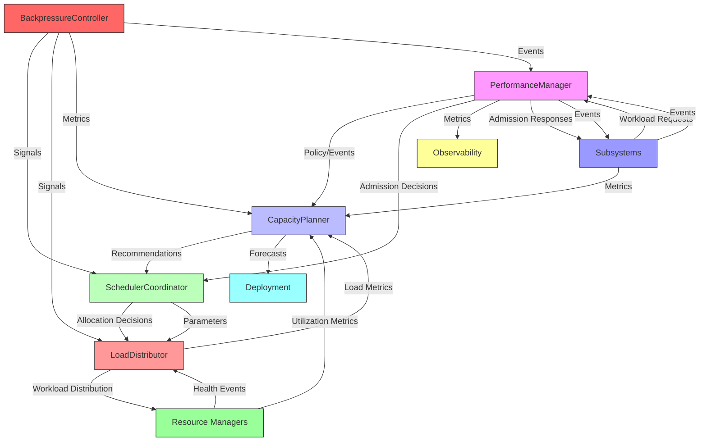
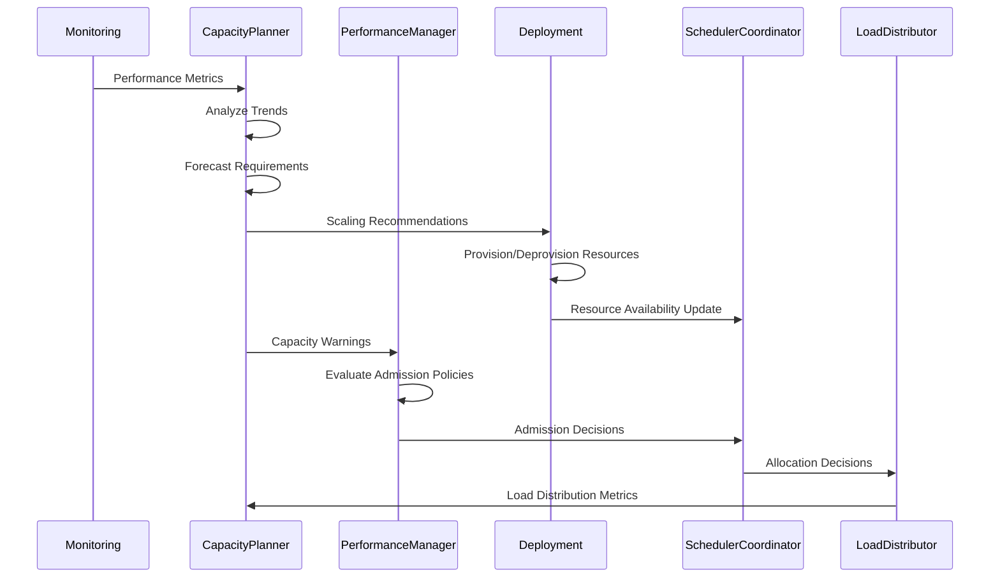
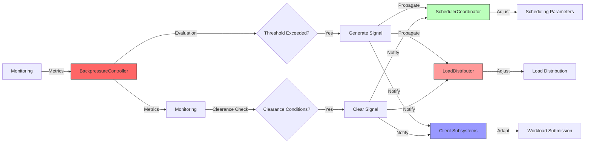
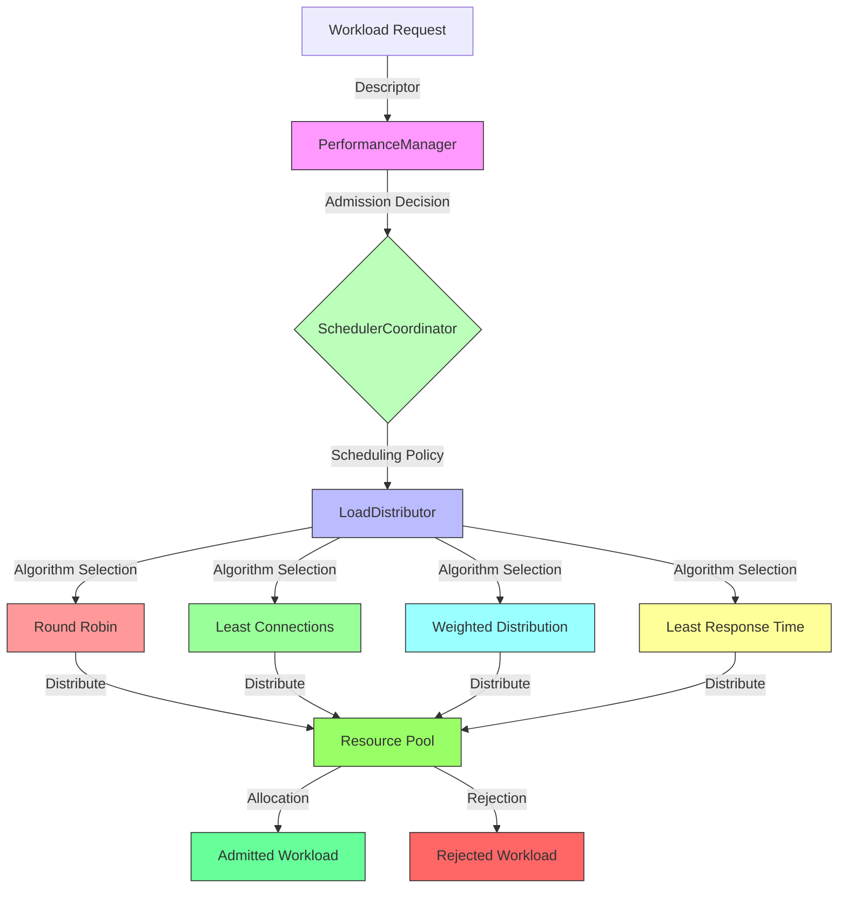

# 9.13 Performance Foundations and Guarantees

## Purpose
This section defines the architectural foundation for performance guarantees in AI-OS. It establishes a technology-neutral framework for defining, ensuring, and maintaining performance characteristics across all infrastructure subsystems. The architecture provides mechanisms for performance modeling, capacity planning, resource scheduling, load distribution, backpressure management, and elastic scaling to meet service-level objectives under varying workload conditions.

## Scope
This specification applies to all performance-related architectural elements within AI-OS infrastructure that influence system responsiveness, throughput, scalability, and resource utilization. It covers the architectural components, interactions, and guarantees for performance management across all security domains and trust boundaries. It does not cover:
- Specific benchmarking methodologies or tools
- Resource allocation algorithms (covered in Part 9 §9.3)
- Deployment strategies (covered in Part 9 §9.5)
- Health monitoring specifics (covered in Part 9 §9.6)
- Reliability mechanisms (covered in Part 9 §9.7)
- Runtime configuration details (covered in Part 9 §9.8)
- Observability implementation (covered in Part 9 §9.10)
- EventBus infrastructure (covered in Part 9 §9.2)

## Architectural Goals
The performance foundations architecture must achieve the following goals:

- **Predictable Performance**: System shall provide bounded latency and throughput guarantees under defined load conditions.
- **Scalable by Design**: Architecture shall support horizontal and vertical scaling without performance degradation.
- **Resource Efficient**: System shall optimize resource utilization while maintaining performance guarantees.
- **Adaptive to Load**: Mechanisms shall automatically adjust to changing workload patterns through elastic scaling and backpressure.
- **Fail-Safe Degradation**: Performance shall degrade gracefully under overload conditions while maintaining critical functionality.
- **Observable and Controllable**: Performance metrics and controls shall be accessible via standard interfaces.

## Architecture Overview
The performance foundations architecture consists of five core components working in concert to deliver system-wide performance guarantees:
- **PerformanceManager**: Central authority for performance policy enforcement and monitoring
- **CapacityPlanner**: Responsible for capacity forecasting and resource provisioning recommendations
- **SchedulerCoordinator**: Manages resource allocation policies and scheduling decisions
- **LoadDistributor**: Distributes workload across available resources
- **BackpressureController**: Implements flow control mechanisms to prevent overload

These components interact through the AI-OS EventBus using the `aios.performance.*` namespace and expose well-defined interfaces for subsystems to consume performance guarantees and report metrics.

## Internal Architecture
The performance foundations subsystem comprises five tightly coupled components that communicate via the EventBus and shared state mechanisms. Each component has a well-defined responsibility and exposes a minimal interface for interaction.

### Component Responsibilities

#### PerformanceManager
**Purpose**: Central authority for defining, enforcing, and monitoring performance policies across AI-OS subsystems.

**Responsibilities**:
- Load and validate performance policies from configuration
- Monitor system performance against defined thresholds
- Trigger performance-related EventBus events
- Coordinate with other performance components for policy enforcement
- Provide performance metrics to observability subsystem
- Admit or reject workload based on current capacity and policies

**Operations**:
- `loadPolicy(policy: PerformancePolicy): void`
- `evaluateThreshold(metric: PerformanceMetric): boolean`
- `triggerEvent(event: PerformanceEvent): void`
- `admitWorkload(workload: WorkloadDescriptor): AdmissionDecision`
- `getCurrentMetrics(): PerformanceMetrics`

**Inputs**:
- Performance policies from configuration subsystem
- Performance metrics from monitoring subsystem
- Workload descriptors from subsystems requesting admission
- Capacity recommendations from CapacityPlanner

**Outputs**:
- Admission decisions to requesting subsystems
- Performance events to EventBus (`aios.performance.*`)
- Policy updates to SchedulerCoordinator and LoadDistributor
- Metrics to observability subsystem

**Preconditions**:
- Performance policies must be loaded and validated before operation
- Monitoring subsystem must be operational to provide metrics

**Postconditions**:
- Performance policies are enforced across all admitted workloads
- Performance events are published for significant state changes
- Admission decisions are consistent with current capacity and policies

**Error Conditions**:
- `POLICY_LOAD_FAILED`: Invalid or missing performance policy
- `METRICS_UNAVAILABLE`: Monitoring subsystem not providing required metrics
- `ADMISSION_DENIED`: Workload exceeds current capacity or violates policy

#### CapacityPlanner
**Purpose**: Forecast resource requirements and recommend provisioning adjustments to meet performance objectives.

**Contractual Obligations**:
- Analyzes historical performance and utilization trends to generate capacity forecasts
- Provides scaling recommendations to the Deployment subsystem that align with performance objectives
- Detects potential bottlenecks and reports them to BackpressureController and PerformanceManager
- Generates capacity profiles for different workload types to inform scheduling decisions
- Coordinates with the Deployment subsystem to translate recommendations into provisioning actions

**Interface Contract** (Operations):
- `analyzeTrends(metrics: PerformanceMetrics): CapacityAnalysis` - Returns trend analysis from performance metrics
- `forecastRequirements(horizon: TimeDuration): CapacityForecast` - Returns resource requirement forecast for given time horizon
- `recommendScaling(action: ScalingRecommendation): void` - Submits scaling recommendation to Deployment subsystem
- `detectBottleneck(metrics: PerformanceMetrics): BottleneckReport` - Returns bottleneck detection report
- `getCapacityProfile(workload: WorkloadType): CapacityProfile` - Returns capacity profile for specified workload type

**Preconditions** (what clients must ensure):
- Sufficient historical data must be available for reliable analysis and forecasting
- Monitoring subsystem must be providing required performance metrics

**Postconditions** (what clients can rely on):
- Forecasts include confidence intervals for predicted values based on validated forecasting mechanisms
- Scaling recommendations prioritize performance objectives over cost considerations
- Bottleneck detection completes within bounded latency
- Capacity profiles are specific to the requested workload type

**Error Conditions** (what clients must handle):
- `INSUFFICIENT_DATA`: Indicates inadequate historical data for reliable forecasting or analysis
- `MODEL_TRAINING_FAILED`: Indicates forecasting mechanism failed to train properly
- `RECOMMENDATION_CONFLICT`: Indicates conflicting scaling recommendations were generated

**Behavioural Guarantees** (what the component guarantees):
- Forecasts provide statistically valid confidence intervals for predicted values
- Recommendations prioritize meeting performance objectives over minimizing costs
- Bottleneck detection operates with guaranteed bounded latency
- Capacity profiles are workload-type specific and reflect predicted resource needs

#### SchedulerCoordinator
**Purpose**: Manage resource allocation policies and scheduling decisions to meet performance objectives.

**Responsibilities**:
- Maintain scheduling policies for different workload classes
- Coordinate resource allocation decisions with LoadDistributor
- Adapt scheduling parameters based on capacity recommendations
- Implement fair and priority-based scheduling algorithms
- Manage resource quotas and limits per workload class
- Respond to backpressure signals by adjusting scheduling

**Operations**:
- `loadPolicy(policy: SchedulingPolicy): void`
- `scheduleWorkload(workload: WorkloadDescriptor, resources: ResourceSet): AllocationDecision`
- `updateParameters(recommendation: CapacityRecommendation): void`
- `applyBackpressure(signal: BackpressureSignal): void`
- `getSchedulingMetrics(): SchedulingMetrics`

**Inputs**:
- Scheduling policies from configuration
- Workload descriptors from subsystems
- Resource availability from infrastructure
- Capacity recommendations from CapacityPlanner
- Backpressure signals from BackpressureController

**Outputs**:
- Allocation decisions to LoadDistributor
- Updated scheduling parameters to LoadDistributor
- Scheduling metrics to observability subsystem
- Allocation events to EventBus (`aios.performance.scheduler.updated`)

**Preconditions**:
- Scheduling policies must be loaded and validated
- Resource availability information must be current

**Postconditions**:
- Allocation decisions satisfy scheduling policies and constraints
- Resource allocation is work-conserving when resources are available
- Priority and fairness properties are maintained

**Error Conditions**:
- `POLICY_VIOLATION`: Allocation request violates scheduling policy
- `RESOURCES_UNAVAILABLE`: Required resources not available
- `SCHEDULING_CONFLICT`: Conflicting allocation requests cannot be resolved

**Behavioural Guarantees**:
- Scheduling decisions are made within bounded time
- Priority scheduling respects workload priorities
- Fair sharing guarantees are met for workloads of same priority
- Backpressure responses reduce load within configured time

#### LoadDistributor
**Purpose**: Distribute workload across available resources to optimize performance and resource utilization.

**Contractual Obligations**:
- Receives workload allocation decisions from SchedulerCoordinator and distributes workload instances accordingly
- Implements load balancing algorithms to distribute workload across assigned resources
- Monitors resource utilization and adjusts distribution to maintain balance
- Responds to backpressure by reducing load distribution proportionally
- Provides load distribution metrics for monitoring and observability

**Interface Contract** (Operations):
- `distributeWorkload(allocation: AllocationDecision): DistributionResult` - Distributes workload according to allocation decision; may return failure
- `updateLoadMetrics(resource: ResourceId, metrics: ResourceMetrics): void` - Updates load metrics for a specific resource
- `adjustForBackpressure(factor: BackpressureFactor): void` - Adjusts load distribution based on backpressure factor
- `getLoadDistribution(): LoadDistributionMetrics` - Returns current load distribution metrics

**Preconditions** (what clients must ensure):
- Resource managers must be available and responsive to receive distribution instructions
- Allocation decisions must be valid and actionable (i.e., resources are available and allocation is valid)

**Postconditions** (what clients can rely on):
- Workload is distributed according to the allocation decision
- Load balancing algorithm properties are satisfied (e.g., fairness, starvation-free)
- Resource utilization is balanced across assigned resources (within algorithm-specific bounds)
- Load distribution decisions are made within bounded time

**Error Conditions** (what clients must handle):
- `DISTRIBUTION_FAILED`: Indicates inability to distribute workload to assigned resources
- `RESOURCE_UNRESPONSIVE`: Indicates an assigned resource is not responding to distribution instructions
- `INVALID_ALLOCATION`: Indicates the allocation decision cannot be executed (e.g., invalid resource references)

**Behavioural Guarantees** (what the component guarantees):
- Load distribution converges to a balanced state within bounded time after changes
- Distribution algorithm provides starvation-free execution (every workload eventually gets serviced)
- Backpressure adjustments reduce load proportionally to the backpressure factor
- Load distribution decisions are made within bounded time

#### BackpressureController
**Purpose**: Implement flow control mechanisms to prevent system overload and maintain stability.

**Contractual Obligations**:
- Monitors system performance indicators for overload conditions
- Generates backpressure signals when thresholds are exceeded
- Coordinates load reduction across LoadDistributor and SchedulerCoordinator
- Manages backpressure propagation to client subsystems
- Detects when backpressure conditions have cleared
- Provides backpressure metrics for monitoring and tuning

**Interface Contract** (Operations):
- `evaluateLoad(metrics: PerformanceMetrics): BackpressureEvaluation` - Evaluates load conditions for backpressure; may return inconsistent metrics error
- `generateSignal(evaluation: BackpressureEvaluation): BackpressureSignal` - Creates backpressure signal from evaluation
- `propagateSignal(signal: BackpressureSignal): void` - Propagates backpressure signal to subscribers; may fail propagation
- `clearSignal(signalId: SignalId): void` - Clears a specific backpressure signal
- `getBackpressureMetrics(): BackpressureMetrics` - Returns current backpressure metrics

**Preconditions** (what clients must ensure):
- Monitoring subsystem must be providing required performance metrics
- Thresholds for backpressure triggering must be configured

**Postconditions** (what clients can rely on):
- Backpressure signals are generated when overload conditions are detected
- Backpressure signals are cleared when conditions return to normal
- Load reduction is proportional to backpressure severity
- Backpressure propagation respects subsystem boundaries

**Error Conditions** (what clients must handle):
- `METRICS_INCONSISTENT`: Indicates conflicting metrics prevent evaluation
- `SIGNAL_PROPAGATION_FAILED`: Indicates unable to propagate backpressure signal
- `CLEARANCE_TIMEOUT`: Indicates backpressure condition not cleared within expected time

**Behavioural Guarantees** (what the component guarantees):
- Backpressure detection has bounded latency
- Signal propagation completes within configured time
- Load reduction is monotonic with backpressure severity
- System returns to normal operation after backpressure clearance

## Runtime Behaviour
The performance foundations subsystem operates continuously to maintain system performance within guaranteed bounds. At startup, components load their respective policies and establish initial state. During operation:

1. **Monitoring Phase**: PerformanceManager continuously evaluates system metrics against performance policies and thresholds.
2. **Analysis Phase**: CapacityPlanner analyzes trends and forecasts requirements based on historical data and current metrics.
3. **Planning Phase**: SchedulerCoordinator updates scheduling parameters based on capacity recommendations and backpressure signals.
4. **Distribution Phase**: LoadDistributor adjusts workload distribution according to scheduling decisions and backpressure factors.
5. **Control Phase**: BackpressureController evaluates load conditions and generates appropriate backpressure signals.
6. **Feedback Phase**: All components update their state based on EventBus events and monitoring feedback.

The subsystem maintains several runtime invariants to guarantee predictable behavior:
- Total admitted workload never exceeds configured capacity limits
- Backpressure signals are generated before resource exhaustion occurs
- Load distribution converges to balanced state within bounded time after changes
- Scheduling decisions satisfy priority and fairness properties
- Performance metrics are updated within configured reporting intervals

## EventBus Integration
The performance foundations subsystem uses the AI-OS EventBus with the `aios.performance.*` namespace for all internal and external communications. Events are published for significant state changes and consumed by other subsystems for coordination.

### Defined Events
- `aios.performance.policy.loaded`: Published when PerformanceManager successfully loads a performance policy
  - Payload: `{ policyId: string, version: string, timestamp: iso8601 }`
- `aios.performance.threshold.exceeded`: Published when a performance threshold is exceeded
  - Payload: `{ metric: string, value: number, threshold: number, severity: 'warning'|'critical' }`
- `aios.performance.backpressure.started`: Published when backpressure conditions are detected
  - Payload: `{ signalId: string, severity: number, affectedComponents: string[], timestamp: iso8601 }`
- `aios.performance.backpressure.cleared`: Published when backpressure conditions have cleared
  - Payload: `{ signalId: string, timestamp: iso8601 }`
- `aios.performance.capacity.warning`: Published when projected resource utilization exceeds warning threshold
  - Payload: `{ resourceType: string, currentUtilization: number, projectedUtilization: number, warningThreshold: number }`
- `aios.performance.capacity.exceeded`: Published when projected resource utilization exceeds critical threshold
  - Payload: `{ resourceType: string, currentUtilization: number, projectedUtilization: number, criticalThreshold: number }`
- `aios.performance.load.redistributed`: Published when LoadDistributor adjusts workload distribution
  - Payload: `{ redistributionId: string, affectedResources: string[], loadChangePercent: number }`
- `aios.performance.scheduler.updated`: Published when SchedulerCoordinator updates scheduling parameters
  - Payload: `{ updateId: string, policyChanges: string[], timestamp: iso8601 }`
- `aios.performance.degradation.detected`: Published when PerformanceManager detects performance degradation
  - Payload: `{ degradationId: string, affectedServices: string[], degradationType: string, severity: number }`
- `aios.performance.recovered`: Published when performance returns to normal after degradation or backpressure
  - Payload: `{ recoveryId: string, previousState: string, timestamp: iso8601 }`

### Event Consumption
- PerformanceManager consumes monitoring metrics and capacity warnings
- CapacityPlanner consumes performance metrics and utilization data
- SchedulerCoordinator consumes capacity recommendations and backpressure signals
- LoadDistributor consumes allocation decisions and backpressure factors
- BackpressureController consumes performance and load distribution metrics

## Performance Model
AI-OS defines a hierarchical performance model with multiple latency and throughput classes to accommodate diverse workload requirements. The model is technology-neutral and focuses on behavioral guarantees rather than specific numeric values.

### Latency Classes
AI-OS defines four latency classes that subsystems can request for their workloads:
- **RT (Real-Time)**: Bounded latency in the order of microseconds to low milliseconds. Used for control plane and time-critical operations.
- **IS (Interactive)**: Bounded latency in the order of tens to hundreds of milliseconds. Used for user-facing interactive operations.
- **BT (Batch)**: Latency bounds in the order of seconds to minutes. Used for background processing and batch operations.
- **FT (Flexible)**: No strict latency bounds, but best-effort performance. Used for elastic and low-priority workloads.

Each latency class has associated behavioral guarantees:
- RT: 99.9th percentile latency ≤ L_rt (configured bound)
- IS: 99th percentile latency ≤ L_is (configured bound)
- BT: 95th percentile latency ≤ L_bt (configured bound)
- FT: Best-effort latency optimization

### Throughput Classes
AI-OS defines three throughput classes that specify minimum guaranteed throughput under nominal conditions:
- **HG (High-Guaranteed)**: Minimum throughput of T_hg operations per second
- **MG (Medium-Guaranteed)**: Minimum throughput of T_mg operations per second
- **LG (Low-Guaranteed)**: Minimum throughput of T_lg operations per second

Throughput guarantees are maintained through admission control and resource provisioning. Subsystems declare their required throughput class, and the PerformanceManager admits workload only when sufficient capacity is available to meet the guarantee.

### Performance Guarantees
The system provides the following performance guarantees:
- **Latency Guarantee**: For admitted workload of latency class X, the system guarantees that the specified percentile latency will not exceed the class bound under nominal conditions.
- **Throughput Guarantee**: For admitted workload of throughput class Y, the system guarantees that the average throughput will not fall below the class minimum under nominal conditions.
- **Isolation Guarantee**: Workloads of different classes are isolated such that the performance of one class does not degrade another class beyond configured interference thresholds.
- **Elasticity Guarantee**: System will attempt to maintain performance guarantees under changing load through elastic scaling within configured limits.

## Capacity Planning
Capacity planning in AI-OS is a continuous process that forecasts resource requirements and recommends provisioning adjustments to meet performance objectives under varying workload conditions.

### Process
1. **Data Collection**: Monitoring subsystem collects performance and utilization metrics at configured intervals.
2. **Trend Analysis**: CapacityPlanner analyzes historical data to identify patterns, trends, and seasonal variations.
3. **Forecasting**: Using forecasting mechanisms appropriate to the operational environment, CapacityPlanner forecasts resource requirements for future time horizons.
4. **Recommendation Generation**: Based on forecasts and performance objectives, CapacityPlanner generates scaling recommendations (scale up/down, horizontal/vertical).
5. **Validation**: Recommendations are validated against performance policies, resource constraints, and cost objectives.
6. **Execution**: Validated recommendations are submitted to the Deployment subsystem for provisioning actions.

### Capacity Profile
The `shared/CapacityProfile.json` schema defines the structure for capacity profiles:
```json
{
  "$schema": "http://json-schema.org/draft-07/schema#",
  "title": "CapacityProfile",
  "type": "object",
  "properties": {
    "workloadType": { "type": "string" },
    "timePeriod": { "type": "string", "format": "date-time" },
    "predictedUtilization": {
      "type": "object",
      "additionalProperties": {
        "type": "number",
        "minimum": 0,
        "maximum": 1
      }
    },
    "confidenceInterval": {
      "type": "object",
      "additionalProperties": {
        "type": "number",
        "minimum": 0
      }
    },
    "recommendedResources": {
      "type": "object",
      "additionalProperties": {
        "type": "integer",
        "minimum": 0
      }
    },
    "scalingDirection": { "type": "string", "enum": ["up", "down", "none"] },
    "urgency": { "type": "string", "enum": ["low", "medium", "high", "critical"] }
  },
  "required": ["workloadType", "timePeriod", "predictedUtilization", "recommendedResources"]
}
```

### Resource Scheduling Guarantees
AI-OS provides resource scheduling guarantees that ensure predictable performance through controlled resource allocation:
- **CPU Scheduling Guarantee**: Admitted workload receives minimum CPU share proportional to its weight and priority.
- **Memory Scheduling Guarantee**: Admitted workload receives minimum memory allocation with protection against overcommitment.
- **I/O Scheduling Guarantee**: Admitted workload receives minimum I/O bandwidth and latency bounds for storage and network operations.
- **Accelerator Scheduling Guarantee**: Admitted workload receives minimum access to specialized accelerators (GPU, FPGA, etc.) with bounded latency.

These guarantees are implemented through the SchedulerCoordinator and enforced by the underlying resource managers.

## Scalability Model
AI-OS supports both horizontal and vertical scalability to adapt to changing workload demands while maintaining performance guarantees.

### Horizontal Scalability
- **Stateless Workloads**: Near-linear scalability through addition of identical instances.
- **Stateful Workloads**: Scalability through partitioning/replication with consistency guarantees.
- **Load Distribution**: LoadDistributor ensures even workload distribution across instances.
- **Discovery Mechanism**: Services register with service discovery for automatic load balancing.
- **Elastic Limits**: Horizontal scaling bounded by configured maximum instance count.

### Vertical Scalability
- **Resource Adjustment**: Vertical scaling through CPU/memory allocation adjustments.
- **Limits**: Bounded by host hardware capabilities and configured maximums.
- **Granularity**: Adjustments made in configured increments to minimize disruption.
- **Live Migration**: Supported for stateful workloads to maintain availability during scaling.

### Elastic Scaling
AI-OS implements elastic scaling through coordinated action between components:
1. CapacityPlanner forecasts resource requirements
2. Recommends scaling actions to Deployment subsystem
3. Deployment subsystem provisions/deprovisions resources
4. SchedulerCoordinator updates scheduling policies for new/resources
5. LoadDistributor redistributes workload across updated resource pool
6. PerformanceManager validates that performance guarantees are maintained
7. BackpressureController monitors for overload during scaling transitions

## Backpressure Architecture
The backpressure architecture prevents system overload by implementing feedback control mechanisms that reduce load when performance thresholds are approached.

### Backpressure Propagation
Backpressure signals propagate through the system in a controlled manner:
1. **Detection**: BackpressureController monitors performance metrics (latency, queue depths, utilization)
2. **Evaluation**: When metrics exceed thresholds, BackpressureController evaluates severity
3. **Signal Generation**: Generates backpressure signal with severity level and affected components
4. **Propagation**: Signal sent to LoadDistributor and SchedulerCoordinator for load reduction
5. **Application**: Components adjust their behavior to reduce load proportionally to signal severity
6. **Notification**: Backpressure propagated to client subsystems via EventBus for adaptive behavior
7. **Clearance**: When metrics return below thresholds, backpressure signal is cleared
8. **Recovery**: System gradually restores normal load as conditions improve

### Backpressure Policy
The `shared/BackpressurePolicy.json` schema defines backpressure configuration:
```json
{
  "$schema": "http://json-schema.org/draft-07/schema#",
  "title": "BackpressurePolicy",
  "type": "object",
  "properties": {
    "enabled": { "type": "boolean" },
    "metrics": {
      "type": "array",
      "items": {
        "type": "object",
        "properties": {
          "name": { "type": "string" },
          "threshold": { "type": "number" },
          "severityWeight": { "type": "number", "minimum": 0 }
        },
        "required": ["name", "threshold"]
      }
    },
    "propagationDelay": { "type": "number", "minimum": 0 },
    "reductionFactor": { "type": "number", "minimum": 0, "maximum": 1 },
    "clearanceHysteresis": { "type": "number", "minimum": 0 },
    "clientNotification": { "type": "boolean" }
  },
  "required": ["enabled", "metrics"]
}
```

### Flow Control Mechanisms
- **Load Shedding**: Drop or defer low-priority workloads when backpressure is critical
- **Rate Limiting**: Reduce admission rate for new workloads
- **Load Shifting**: Redirect workload to underutilized resources or regions
- **Resource Borrowing**: Temporarily borrow resources from reserved pools
- **Graceful Degradation**: Reduce functionality or quality to maintain core performance

## Load Distribution
LoadDistributor implements load balancing algorithms to distribute workload across available resources while respecting scheduling policies and affinity constraints. Examples of such algorithms include (but are not limited to):
- **Round Robin**: Distribute workload sequentially across resources
- **Least Connections**: Assign workload to resource with fewest active connections
- **Weighted Distribution**: Distribute based on resource weights (capacity, performance)
- **Least Response Time**: Assign to resource with fastest average response time
- **IP Hash**: Assign based on client IP for session affinity
- **URL Hash**: Assign based on request URL for cache locality
- **Custom**: Subsystems can provide custom distribution functions

### Affinity and Persistence
- **Client Affinity**: Maintain client-to-resource mapping for session persistence
- **Workload Affinity**: Keep related workload instances on same resource for data locality
- **Failure Affinity**: Avoid recently failed resources for configurable cool-down period
- **Zone Awareness**: Prefer resources in same availability zone to reduce latency

### Health Awareness
LoadDistributor integrates with health monitoring to:
- Exclude unhealthy resources from distribution
- Gradually reintroduce recovering resources
- Avoid resources with degraded performance
- Respond to health events via EventBus

## Bottleneck Isolation
Bottleneck isolation prevents performance issues in one subsystem from cascading to others through resource containment and workload isolation.

### Techniques
- **Resource Quotas**: Hard limits on CPU, memory, I/O, and accelerator usage per workload class
- **Resource Reservations**: Guaranteed minimum resources for critical workload classes
- **Quality of Service (QoS) Tiers**: Different priority levels with corresponding resource guarantees
- **Workload Separation**: Physically or logically separate workloads of different classes
- **Bottleneck Detection**: Continuous monitoring for resource saturation indicators
- **Isolation Enforcement**: Automatic throttling or rejection when quotas are exceeded

### Detection
CapacityPlanner and BackpressureController collaborate to detect bottlenecks:
- **Utilization Analysis**: Identify resources approaching or exceeding utilization thresholds
- **Latency Correlation**: Correlate resource utilization with latency increases
- **Queue Depth Monitoring**: Track request queues for signs of buildup
- **Error Rate Analysis**: Correlate resource stress with error rates
- **Predictive Indicators**: Use leading indicators to forecast impending bottlenecks

## Failure Impact on Performance
The performance foundations architecture is designed to maintain predictable performance degradation characteristics under various failure conditions.

### Failure Scenarios
- **Resource Failure**: Graceful redistribution of workload to healthy resources
- **Network Partition**: Maintain performance within partitions; degrade gracefully between partitions
- **Software Failure**: Isolate failed components; maintain performance of healthy subsystems
- **Performance Degradation**: Automatic backpressure activation to prevent overload
- **Cascading Failures**: Bottleneck isolation prevents failure propagation

### Degradation Modes
- **Graceful Degradation**: System reduces non-essential functionality to maintain core performance
- **Load Shedding**: Drop low-priority workloads to preserve resources for critical functions
- **Performance Throttling**: Reduce throughput to maintain latency bounds
- **Fallback Mechanisms**: Switch to less performant but more reliable implementations
- **Circuit Breaker**: Temporarily halt requests to failing subsystem to prevent overload

### Recovery
After failure conditions are resolved:
- **Gradual Restoration**: Workload is gradually restored to avoid shock
- **Performance Validation**: PerformanceManager verifies guarantees before full restoration
- **Backpressure Clearance**: Signals are cleared when system stabilizes
- **Resource Rebalancing**: LoadDistributor redistributes workload across restored resources
- **Healing Validation**: CapacityPlanner validates system readiness for normal operation

## Monitoring Integration
Performance foundations subsystem integrates with the observability subsystem (Part 9 §9.10) to provide comprehensive performance monitoring.

### Exported Metrics
- **Latency Metrics**: Percentile latencies for each latency class and workload type
- **Throughput Metrics**: Operations per second for each throughput class
- **Resource Utilization**: CPU, memory, I/O, accelerator utilization percentages
- **Queue Depths**: Number of pending requests in various queues
- **Backpressure Metrics**: Signal frequency, severity, duration, and clearance time
- **Admission Metrics**: Workload admission/request rates, denial rates, reasons
- **Scaling Metrics**: Horizontal/vertical scaling events, timing, effectiveness
- **Distribution Metrics**: Load distribution fairness, resource utilization variance

### Health Indicators
- **Performance Health**: Composite indicator based on latency/throughput guarantees
- **Capacity Health**: Indicator based on current vs. projected resource utilization
- **Backpressure Health**: Indicator based on backpressure signal frequency and severity
- **Scaling Health**: Indicator based on scaling effectiveness and frequency

### Alerting
Performance foundations subsystem contributes to alerting through:
- Threshold-based alerts for latency and throughput violations
- Trend-based alerts for degradation patterns
- Backpressure alerts for impending overload conditions
- Capacity alerts for imminent resource exhaustion
- Scaling alerts for failed or delayed scaling operations

## Security Considerations
The performance foundations architecture incorporates security considerations to prevent performance-related security mechanisms without compromising performance guarantees.

### Isolation and Multi-tenancy
- **Performance Isolation**: Malicious or misbehaving tenants cannot degrade performance of others beyond configured limits
- **Resource Sandboxing**: Workloads run in resource-limited environments to prevent exhaustion attacks
- **Quiet Tenant Protection**: Guarantees for well-behaved tenants despite noisy neighbors
- **Quota Enforcement**: Hard limits prevent resource exhaustion attacks

### Secure Communication
- **EventBus Security**: Performance events are authenticated and authorized
- **Policy Integrity**: Performance policies are protected from tampering
- **Metric Validation**: Incoming metrics are validated for integrity and authenticity
- **Control Plane Protection**: Performance management interfaces are access-controlled

### Denial-of-Service Resistance
- **Admission Control**: Prevents overload by rejecting excess workload
- **Backpressure Propagation**: Limits impact of abusive clients on system
- **Rate Limiting**: Per-client and per-workload-class rate limits
- **Resource Quotas**: Prevents any single workload from exhausting resources
- **Load Shedding**: Protects core functionality during attacks

### Audit and Compliance
- **Performance Auditing**: All performance-related decisions are logged for audit
- **Policy Versioning**: Performance policies are version-controlled
- **Metrics Integrity**: Cryptographic hashing of metrics for tamper detection
- **Access Logging**: All performance management access is logged

## Configuration
Performance foundations subsystem is configured through the AI-OS runtime configuration system (Part 9 §9.8) with the following configuration domains:

### Performance Policy Configuration
Stored in `shared/PerformancePolicy.json`:
```json
{
  "$schema": "http://json-schema.org/draft-07/schema#",
  "title": "PerformancePolicy",
  "type": "object",
  "properties": {
    "version": { "type": "string" },
    "latencyClasses": {
      "type": "array",
      "items": {
        "type": "object",
        "properties": {
          "class": { "type": "string", "enum": ["RT", "IS", "BT", "FT"] },
          "latencyBound": { "type": "number", "minimum": 0 },
          "percentile": { "type": "number", "minimum": 0, "maximum": 100 }
        },
        "required": ["class", "latencyBound", "percentile"]
      }
    },
    "throughputClasses": {
      "type": "array",
      "items": {
        "type": "object",
        "properties": {
          "class": { "type": "string", "enum": ["HG", "MG", "LG"] },
          "minThroughput": { "type": "number", "minimum": 0 }
        },
        "required": ["class", "minThroughput"]
      }
    },
    "isolationParameters": {
      "type": "object",
      "properties": {
        "cpuInterferenceLimit": { "type": "number", "minimum": 0, "maximum": 1 },
        "memoryInterferenceLimit": { "type": "number", "minimum": 0, "maximum": 1 },
        "ioInterferenceLimit": { "type": "number", "minimum": 0, "maximum": 1 }
      }
    },
    "admissionControl": {
      "type": "object",
      "properties": {
        "enabled": { "type": "boolean" },
        "maxUtilization": { "type": "number", "minimum": 0, "maximum": 1 }
      }
    }
  },
  "required": ["version", "latencyClasses", "throughputClasses"]
}
```

### Capacity Planning Configuration
- Forecasting mechanism parameters and horizons
- Historical data retention policies
- Recommendation validation rules
- Scaling cooldown periods
- Resource provisioning limits

### Scheduling Configuration
- Scheduling algorithms and parameters per workload class
- Priority levels and weight definitions
- Fair sharing parameters
- Preemption policies
- Affinity and anti-affinity rules

### Load Distribution Configuration
- Load balancing algorithms and parameters
- Health check intervals and thresholds
- Affinity persistence settings
- Resource weighting factors
- Distribution adjustment parameters

### Backpressure Configuration
- Monitoring metrics and thresholds
- Signal propagation parameters
- Load reduction factors
- Clearance hysteresis values
- Client notification settings

All configurations support hot-reloading without system restart.

## Failure Handling
The performance foundations subsystem implements comprehensive failure handling to maintain availability and predictability.

### Component-Level Failures
- **PerformanceManager Failure**: 
  - Fallback to last-known-good performance policy
  - Admission control defaults to conservative settings
  - Monitoring continues via observability subsystem
  - Automatic restart with state reconciliation
  
- **CapacityPlanner Failure**:
  - Use implementation-defined fallback behaviour for forecasting
  - Last-known-good recommendations remain active
  - Manual intervention required for complex forecasting
  - Automatic restart with data recovery
  
- **SchedulerCoordinator Failure**:
  - Fallback to static scheduling policy
  - LoadDistributor uses last-known-good allocation decisions
  - Manual scheduling overrides available
  - Automatic restart with policy reconciliation
  
- **LoadDistributor Failure**:
  - Fallback to implementation-defined distribution behaviour
  - Last-known-good load distribution maintained
  - Automatic restart with state synchronization
  
- **BackpressureController Failure**:
  - Backpressure detection disabled
  - System operates without backpressure protection
  - Manual overload management required
  - Automatic restart with policy reload

### Cascade Failure Prevention
- **Isolation Boundaries**: Failures contained within component boundaries
- **Graceful Degradation**: Reduced functionality rather than complete failure
- **Fallback Mechanisms**: Simple but safe defaults for critical functions
- **Health Checks**: Continuous monitoring of component health
- **Circuit Breakers**: Temporarily isolate failing components
- **State Synchronization**: Periodic checkpointing for fast recovery

### Recovery Procedures
- **Failure Detection**: Health checks and heartbeat mechanisms
- **Failover**: Automatic standby promotion for critical components
- **State Restoration**: From persistent checkpoints or replicated state
- **Validation**: Performance guarantee validation before full restoration
- **Gradual Restoration**: Workload ramp-up to prevent shock
- **Post-Mortem**: Automatic collection of failure diagnostics

## Recovery
After failure conditions are resolved, the subsystem follows a structured recovery process to restore normal operation while maintaining performance guarantees.

### Recovery Phases
1. **Stabilization**: System returns to stable state after failure or backpressure event
2. **Validation**: PerformanceManager validates that guarantees can be met
3. **Restoration**: Gradual restoration of workload and normal operations
4. **Verification**: Continuous monitoring to verify that performance guarantees are maintained
5. **Optimization**: Fine-tuning of parameters based on post-recovery observations

### Gradual Restoration
- **Workload Ramp-up**: Admission control gradually increases allowed workload
- **Resource Rebalancing**: LoadDistributor slowly redistributes workload
- **Parameter Adjustment**: SchedulerCoordinator fine-tunes scheduling parameters
- **Backpressure Clearance**: Signals cleared only after sustained normal operation
- **Monitoring Intensification**: Increased monitoring frequency during recovery

### State Reconciliation
After component restart:
- **State Loading**: Load persisted state from checkpoint or replica
- **Consistency Check**: Validate state against current system conditions
- **Conflict Resolution**: Resolve discrepancies using predefined policies
- **State Merging**: Merge local state with replicated state from peers
- **Validation**: Ensure reconciled state satisfies all invariants

## Performance Requirements
The performance foundations subsystem itself must meet specific performance requirements to not become a bottleneck.

### Subsystem Performance
- **Policy Evaluation Latency**: PerformanceManager evaluates admission requests within configured latency objectives
- **Forecasting Latency**: CapacityPlanner generates recommendations within configured forecasting time bounds
- **Scheduling Decision Latency**: SchedulerCoordinator makes allocation decisions within configured scheduling latency bounds
- **Distribution Latency**: LoadDistributor makes distribution decisions within configured distribution latency bounds
- **Backpressure Detection Latency**: BackpressureController evaluates load within configured backpressure detection latency bounds
- **Event Processing Latency**: EventBus event handling within configured event processing latency bounds
- **Memory Overhead**: Subsystem memory usage bounded by configured limits
- **CPU Overhead**: Subsystem CPU usage within configured utilization thresholds

### Scalability Requirements
- **Horizontal Scalability**: Subsystem performance remains constant with increasing instance count
- **Vertical Scalability**: Subsystem scales efficiently with allocated resources
- **Load Independence**: Subsystem performance not significantly affected by managed workload size
- **EventBus Independence**: Subsystem not bottlenecked by EventBus throughput

## Mermaid Diagrams

### Performance Architecture


### Capacity Planning Flow


### Backpressure Propagation


### Scheduling Model


## JSON Schema References
- `shared/PerformancePolicy.json`: Defines performance policy structure including latency classes, throughput classes, isolation parameters, and admission control
- `shared/CapacityProfile.json`: Defines capacity forecast structure with workload type, time period, predicted utilization, confidence interval, recommended resources, scaling direction, and urgency
- `shared/SchedulingPolicy.json`: Defines scheduling policy structure (referenced but not detailed in this spec)
- `shared/BackpressurePolicy.json`: Defines backpressure policy structure including enabled flag, metrics with thresholds and weights, propagation delay, reduction factor, clearance hysteresis, and client notification

## Architectural Contracts

### PerformanceManager
**Purpose**: Central authority for defining, enforcing, and monitoring performance policies across AI-OS subsystems.

**Contractual Obligations**:
- Provides admission control decisions that comply with performance policies and current system capacity
- Publishes performance events to the EventBus using the `aios.performance.*` namespace for all significant performance state changes
- Exports current performance metrics to the observability subsystem through the `getCurrentMetrics()` operation
- Maintains performance policies by loading and validating them from the configuration subsystem
- Evaluates performance metrics against configured thresholds and triggers corresponding events

**Interface Contract** (Operations):
- `loadPolicy(policy): void` - Loads and validates a performance policy; may throw `POLICY_LOAD_FAILED`
- `evaluateThreshold(metric: PerformanceMetric): boolean` - Returns true if metric exceeds its threshold
- `triggerEvent(event: PerformanceEvent): void` - Publishes a performance event to the EventBus
- `admitWorkload(workload: WorkloadDescriptor): AdmissionDecision` - Returns admission decision based on policy and capacity; may return `ADMISSION_DENIED`
- `getCurrentMetrics(): PerformanceMetrics` - Returns current performance metrics; requires monitoring subsystem to be operational

**Preconditions** (what clients must ensure):
- Performance policies must be loaded and validated before admission decisions are requested
- Monitoring subsystem must be operational to provide metrics for evaluation
- Workload descriptors passed to `admitWorkload` must be valid

**Postconditions** (what clients can rely on):
- All admitted workloads comply with the currently loaded performance policy
- Performance events are published to the EventBus for all significant state changes
- Admission decisions are consistent with current system capacity and active policies
- Performance isolation is maintained between different workload classes

**Error Conditions** (what clients must handle):
- `POLICY_LOAD_FAILED`: Indicates invalid or corrupted performance policy provided to `loadPolicy`
- `METRICS_UNAVAILABLE`: Indicates monitoring subsystem is not providing required metrics
- `ADMISSION_DENIED`: Indicates workload violates policy or exceeds current capacity

**Behavioural Guarantees** (what the component guarantees):
- Performance policy evaluation for admission decisions is atomic
- All configured performance thresholds trigger corresponding EventBus events when exceeded
- Admission decisions are made within bounded time
- System maintains performance isolation between workload classes as configured

### CapacityPlanner
**Purpose**: Forecast resource requirements and recommend provisioning adjustments to meet performance objectives.

**Responsibilities**:
- Historical performance and utilization trend analysis
- Future resource requirement forecasting
- Scaling action recommendations
- Proactive bottleneck identification
- Capacity profile generation for workload types
- Coordination with deployment subsystem

**Operations**:
- `analyzeTrends(metrics): CapacityAnalysis` - Analyze performance trends
- `forecastRequirements(horizon): CapacityForecast` - Predict future resource needs
- `recommendScaling(action): void` - Recommend scaling operations
- `detectBottleneck(metrics): BottleneckReport` - Identify system bottlenecks
- `getCapacityProfile(workload): CapacityProfile` - Get capacity profile for workload

**Inputs**:
- Performance metrics from monitoring subsystem
- Workload patterns from subsystems
- Historical utilization data
- Current resource inventory
- Performance policies for target objectives

**Outputs**:
- Capacity forecasts and recommendations to deployment subsystem
- Bottleneck reports to BackpressureController and PerformanceManager
- Capacity profiles for scheduling decisions
- Scaling recommendations to SchedulerCoordinator

**Preconditions**:
- Sufficient historical data for statistical analysis
- Operational monitoring subsystem providing required metrics

**Postconditions**:
- Forecasts based on validated forecasting mechanisms with confidence intervals
- Recommendations aligned with performance objectives
- Bounded false negative rate for bottleneck detection

**Error Conditions**:
- `INSUFFICIENT_DATA`: Inadequate historical data for reliable forecasting
- `MODEL_TRAINING_FAILED`: Failure in forecasting mechanism training
- `RECOMMENDATION_CONFLICT`: Conflicting scaling recommendations generated

**Behavioural Guarantees**:
- Forecasts include confidence intervals for predicted values
- Performance objectives prioritized over cost in recommendations
- Bounded latency for bottleneck detection
- Workload class-specific capacity profiles

### SchedulerCoordinator
**Purpose**: Manage resource allocation policies and scheduling decisions to meet performance objectives.

**Contractual Obligations**:
- Maintains and enforces scheduling policies for different workload classes
- Makes resource allocation decisions that comply with active scheduling policies
- Adapts scheduling parameters based on capacity recommendations from CapacityPlanner
- Implements fair and priority-based scheduling algorithms for workload classes
- Manages resource quotas and limits per workload class to ensure fair resource distribution
- Responds to backpressure signals by adjusting scheduling parameters to reduce load

**Interface Contract** (Operations):
- `loadPolicy(policy: SchedulingPolicy): void` - Loads and validates a scheduling policy; may throw `POLICY_VIOLATION`
- `scheduleWorkload(workload: WorkloadDescriptor, resources: ResourceSet): AllocationDecision` - Makes allocation decision based on policy and resources; may return rejection
- `updateParameters(recommendation: CapacityRecommendation): void` - Updates scheduling parameters based on capacity recommendations
- `applyBackpressure(signal: BackpressureSignal): void` - Adjusts scheduling parameters in response to backpressure signal
- `getSchedulingMetrics(): SchedulingMetrics` - Returns current scheduling metrics

**Preconditions** (what clients must ensure):
- A valid scheduling policy must be loaded and validated
- Current resource availability information must be provided when requesting allocation decisions

**Postconditions** (what clients can rely on):
- Allocation decisions comply with the active scheduling policy and constraints
- Resource allocation is work-conserving when resources are available (no idle resources when work exists)
- Priority and fairness properties are maintained for workload classes as configured
- Scheduling decisions are made within bounded time

**Error Conditions** (what clients must handle):
- `POLICY_VIOLATION`: Indicates allocation request violates the active scheduling policy
- `RESOURCES_UNAVAILABLE`: Indicates required resources for allocation are not currently available
- `SCHEDULING_CONFLICT`: Indicates conflicting allocation requests that cannot be resolved by the scheduling policy

**Behavioural Guarantees** (what the component guarantees):
- Scheduling decisions are made within bounded time
- Priority scheduling respects workload priorities as defined in the policy
- Fair sharing guarantees are met for workloads of the same priority level
- Load reduction in response to backpressure occurs within configured time bounds

### LoadDistributor
**Purpose**: Distribute workload across available resources to optimize performance and resource utilization.

**Responsibilities**:
- Receive allocation decisions from SchedulerCoordinator
- Distribute workload instances across assigned resources
- Implement load balancing algorithms
- Monitor utilization and adjust distribution
- Reduce distribution in response to backpressure
- Provide distribution metrics for monitoring

**Operations**:
- `distributeWorkload(allocation): DistributionResult` - Distribute workload per allocation
- `updateLoadMetrics(resource, metrics): void` - Update resource load metrics
- `adjustForBackpressure(factor): void` - Adjust distribution for backpressure
- `getLoadDistribution(): LoadDistributionMetrics` - Get load distribution metrics

**Inputs**:
- Allocation decisions from SchedulerCoordinator
- Resource utilization metrics from monitoring subsystem
- Backpressure adjustment factors from BackpressureController
- Workload instances from subsystems

**Outputs**:
- Workload distribution instructions to resource managers
- Load distribution metrics to observability subsystem
- Distribution events to EventBus (`aios.performance.load.redistributed`)
- Resource utilization updates to CapacityPlanner

**Preconditions**:
- Available and responsive resource managers
- Valid and actionable allocation decisions

**Postconditions**:
- Workload distributed per allocation decision
- Load balancing algorithm properties satisfied
- Balanced resource utilization across assigned resources

**Error Conditions**:
- `DISTRIBUTION_FAILED`: Unable to distribute workload to assigned resources
- `RESOURCE_UNRESPONSIVE`: Assigned resource not responding
- `INVALID_ALLOCATION`: Allocation decision not executable

**Behavioural Guarantees**:
- Convergence to balanced load distribution within bounded time
- Starvation-free execution via distribution algorithm
- Proportional load reduction with backpressure factor
- Bounded-time load distribution decisions

### BackpressureController
**Purpose**: Implement flow control mechanisms to prevent system overload and maintain stability.

**Responsibilities**:
- Monitor performance indicators for overload conditions
- Generate backpressure signals when thresholds exceeded
- Coordinate load reduction with LoadDistributor and SchedulerCoordinator
- Manage backpressure propagation to client subsystems
- Detect cleared backpressure conditions
- Provide backpressure metrics for monitoring

**Operations**:
- `evaluateLoad(metrics): BackpressureEvaluation` - Evaluate load for backpressure
- `generateSignal(evaluation): BackpressureSignal` - Create backpressure signal
- `propagateSignal(signal): void` - Propagate backpressure signal
- `clearSignal(signalId): void` - Clear backpressure signal
- `getBackpressureMetrics(): BackpressureMetrics` - Get backpressure metrics

**Inputs**:
- Performance metrics from monitoring subsystem
- Load distribution metrics from LoadDistributor
- Scheduling metrics from SchedulerCoordinator
- Capacity warnings from CapacityPlanner

**Outputs**:
- Backpressure signals to LoadDistributor and SchedulerCoordinator
- Backpressure events to EventBus (`aios.performance.backpressure.started`/`cleared`)
- Backpressure notifications to client subsystems
- Backpressure metrics to observability subsystem

**Preconditions**:
- Monitoring subsystem providing required performance metrics
- Configured backpressure triggering thresholds

**Postconditions**:
- Backpressure signals generated for detected overload conditions
- Signals cleared when conditions return to normal
- Proportional load reduction to backpressure severity
- Boundary-respecting backpressure propagation

**Error Conditions**:
- `METRICS_INCONSISTENT`: Conflicting metrics prevent evaluation
- `SIGNAL_PROPAGATION_FAILED`: Unable to propagate backpressure signal
- `CLEARANCE_TIMEOUT`: Backpressure not cleared within expected time

**Behavioural Guarantees**:
- Bounded-latency backpressure detection
- Configured-time signal propagation completion
- Monotonic load reduction with backpressure severity
- Normal operation restoration after backpressure clearance

## Runtime Invariants
The performance foundations subsystem maintains the following runtime invariants:
1. **Capacity Invariant**: Total admitted workload never exceeds configured capacity limits (`totalAdmitted ≤ configuredCapacity`)
2. **Backpressure Anticipation**: Backpressure signals generated before resource exhaustion (`backpressureActive → ¬resourceExhausted`)
3. **Load Balance Convergence**: Load distribution converges to balanced state within bounded time after changes
4. **Scheduling Correctness**: All scheduling decisions satisfy priority and fairness properties of active policies
5. **Metrics Freshness**: Performance metrics updated within configured reporting intervals (`timestamp(now) - timestamp(lastUpdate) ≤ reportingInterval`)
6. **Isolation Preservation**: Performance interference between workload classes does not exceed configured limits (`interference(classA, classB) ≤ interferenceLimit`)
7. **Policy Compliance**: All admitted workloads comply with active performance policies (`∀w ∈ admittedWorkloads: policy.compliant(w)`)
8. **Event Consistency**: Performance events published for all significant state changes (`stateChange → ∃e: eventPublished(e, stateChange)`)

## Cross References

### Resource Management
See Part 9 §9.3 for resource allocation mechanisms that receive allocation decisions from SchedulerCoordinator and report utilization to CapacityPlanner.

### Deployment
See Part 9 §9.5 for provisioning/deprovisioning actions triggered by CapacityPlanner scaling recommendations.

### Reliability
See Part 9 §9.7 for failure detection and recovery mechanisms that interact with BackpressureController for overload prevention.

### Health
See Part 9 §9.6 for health monitoring that provides input to LoadDistributor health awareness and resource exclusion decisions.

### Observability
See Part 9 §9.10 for metrics collection, storage, and visualization that consumes performance foundations exports and provides health indicators.

### Runtime Configuration
See Part 9 §9.8 for configuration management of performance policies, scheduling parameters, backpressure thresholds, and other tuning parameters.

### EventBus
See Part 9 §9.2 for event routing, subscription, and delivery mechanisms used by the `aios.performance.*` event namespace.

## ADR References
- ADR-009: Performance Metrics Standardization - Defines standard metric names, units, and collection methodologies
- ADR-017: Backpressure Signal Propagation - Specifies backpressure event format, handling procedures, and propagation semantics
- ADR-023: Capacity Planning Methodology - Documents forecasting models, validation approaches, and recommendation generation processes
- ADR-031: Workload Classification System - Defines latency and throughput classes and their associated behavioral guarantees
- ADR-045: Resource Quota Enforcement - Details quota mechanisms used for performance isolation and workload protection
- ADR-052: Elastic Scaling Triggers - Defines conditions for initiating scaling actions and cooldown periods

## Conformance Requirements

### Static Conformance
An implementation conforms to this specification if:
1. It defines the five core components: PerformanceManager, CapacityPlanner, SchedulerCoordinator, LoadDistributor, BackpressureController
2. It implements the EventBus events with the `aios.performance.*` namespace as specified
3. It references the JSON schemas: shared/PerformancePolicy.json, shared/CapacityProfile.json, shared/SchedulingPolicy.json, shared/BackpressurePolicy.json
4. It defines the latency classes (RT, IS, BT, FT) and throughput classes (HG, MG, LG) with associated behavioral guarantees
5. It implements admission control that prevents workload exceeding configured capacity limits
6. It implements backpressure detection and propagation mechanisms
7. It provides the specified architectural contracts with all required elements
8. It maintains the specified runtime invariants under all operating conditions
9. It includes the specified Mermaid diagrams in the documentation
10. It provides configuration mechanisms for all specified policy files

### Runtime Conformance
An implementation demonstrates runtime conformance if:
1. Under nominal load, admitted workload latency meets the specified percentile bounds for their latency class
2. Under nominal load, admitted workload throughput meets the specified minimum for their throughput class
3. When load increases beyond capacity, backpressure signals are generated before resource exhaustion
4. When backpressure signals are active, load is reduced proportionally to signal severity
5. When backpressure conditions clear, normal load is gradually restored without shock
6. Performance isolation between workload classes does not exceed configured interference limits
7. CapacityPlanner generates forecasts according to the configured forecasting strategy
8. SchedulerCoordinator decisions satisfy priority and fairness properties of scheduling policies
9. LoadDistributor achieves load distribution variance below configured threshold after convergence
10. Recovery from failure or backpressure event maintains performance guarantees throughout the process

## Summary
The performance foundations architecture provides a comprehensive, technology-neutral framework for ensuring predictable performance across AI-OS infrastructure. Through the coordinated action of five core components—PerformanceManager, CapacityPlanner, SchedulerCoordinator, LoadDistributor, and BackpressureController—the system delivers:

- **Performance Guarantees**: Bounded latency and throughput guarantees for admitted workloads through admission control and resource provisioning
- **Adaptive Scaling**: Horizontal and vertical scalability through continuous capacity planning and elastic scaling actions
- **Load Management**: Intelligent load distribution and backpressure propagation to prevent overload and maintain stability
- **Resource Isolation**: Performance isolation mechanisms to prevent workload interference and ensure predictable behavior
- **Graceful Degradation**: Structured degradation modes that preserve core functionality under stress conditions
- **Observability Integration**: Comprehensive metrics and event export for monitoring, alerting, and debugging
- **Failure Resilience**: Comprehensive failure handling and recovery mechanisms that maintain availability and predictability

The architecture achieves these capabilities while remaining strictly technology-neutral, avoiding specific implementation details, operating systems, or orchestration platforms. All interactions occur through well-defined interfaces and the AI-OS EventBus, enabling loose coupling and independent evolution of components. The performance foundations subsystem ensures that AI-OS infrastructure can meet diverse performance requirements from real-time control operations to batch processing workloads while maintaining stability, efficiency, and predictability under varying load conditions.