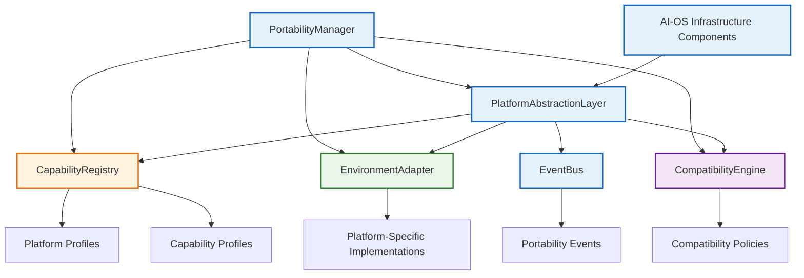
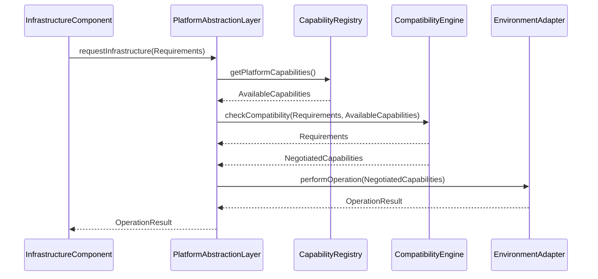
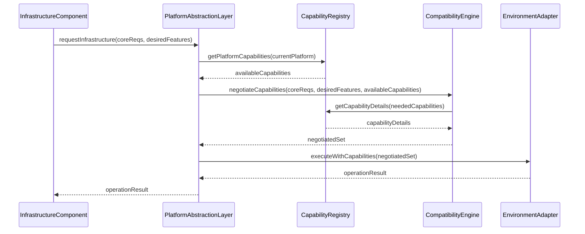
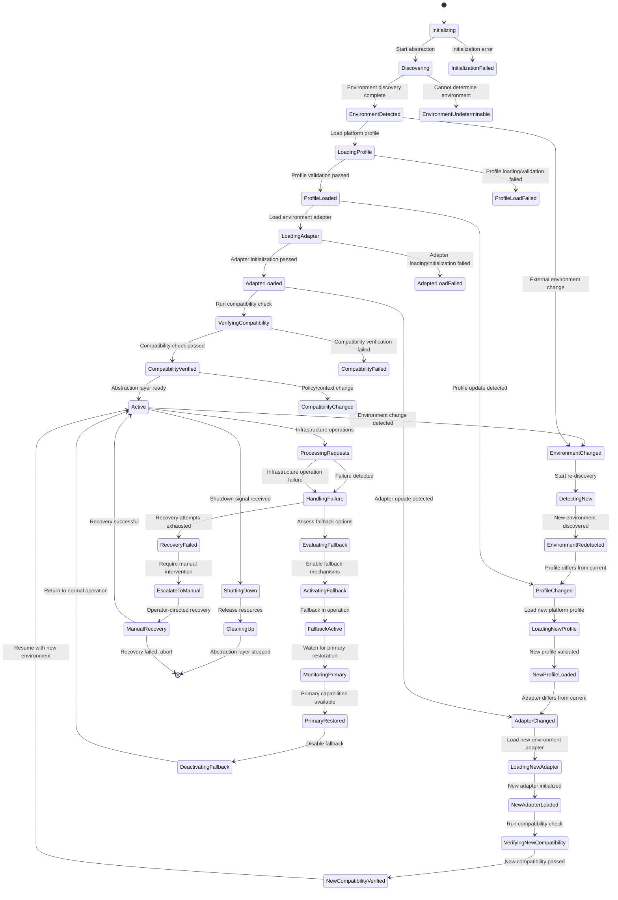

# 9.14 Portable Infrastructure Abstraction

## Purpose
This section defines the portable infrastructure abstraction layer for AI-OS, enabling infrastructure components to operate consistently across heterogeneous execution environments without modification. It establishes a technology-neutral abstraction that separates AI-OS infrastructure concerns from underlying platform specifics, ensuring infrastructure portability while maintaining strict separation from deployment mechanisms, infrastructure-as-code, configuration systems, and runtime configuration.

## Scope
The portable infrastructure abstraction applies to all AI-OS infrastructure components that interact with execution environments, including compute, storage, networking, identity, and runtime services. It covers environment discovery, capability negotiation, resource abstraction, and compatibility management. This specification does not cover:
- Deployment mechanisms or orchestration
- Infrastructure-as-code templating or provisioning
- Application-level configuration or runtime configuration
- Specific vendor implementations or platform technologies

## Architectural Goals
The portable infrastructure abstraction MUST:
- Provide technology-neutral interfaces for infrastructure operations
- Enable infrastructure components to function unchanged across diverse platforms
- Abstract platform-specific differences through well-defined contracts
- Support dynamic environment discovery and capability negotiation
- Ensure infrastructure portability guarantees through compatibility verification
- Maintain strict separation from deployment and configuration concerns
- Allow extension for new platforms without modifying core infrastructure
- Provide fallback mechanisms for missing capabilities
- Support runtime environment changes with minimal disruption
- Guarantee security considerations are preserved across platforms

## Architecture Overview
The portable infrastructure abstraction consists of five primary components working together to provide environment-independent infrastructure operations:
1. **PlatformAbstractionLayer**: Unified interface for infrastructure operations
2. **CapabilityRegistry**: Central repository of platform capabilities and profiles
3. **EnvironmentAdapter**: Platform-specific implementations of abstraction interfaces
4. **CompatibilityEngine**: Verifies infrastructure requirements against platform capabilities
5. **PortabilityManager**: Orchestrates abstraction lifecycle and environment transitions

These components interact through well-defined contracts and communicate via the EventBus using the `aios.portability.*` namespace. The abstraction layer sits between AI-OS infrastructure components and the underlying execution environment, translating platform-neutral requests into platform-specific operations.

## Internal Architecture


## Component Responsibilities

### PlatformAbstractionLayer
**Purpose**: Provides technology-neutral interfaces for infrastructure operations that AI-OS infrastructure components consume.

**Responsibilities**:
- Define platform-independent infrastructure contracts for compute, storage, network, identity, and runtime
- Translate abstraction calls to appropriate EnvironmentAdapter implementations
- Maintain abstraction layer state and context
- Route infrastructure requests based on current environment profile
- Handle abstraction layer initialization and teardown
- Provide consistent error handling across platforms

**Operations**:
- `allocateCompute(ResourceRequest): ComputeAllocation`
- `releaseCompute(ComputeAllocation): Success|Failure`
- `allocateStorage(StorageRequest): StorageAllocation`
- `releaseStorage(StorageAllocation): Success|Failure`
- `allocateNetwork(NetworkRequest): NetworkAllocation`
- `releaseNetwork(NetworkAllocation): Success|Failure`
- `establishIdentity(IdentityRequest): IdentityContext`
- `validateIdentity(IdentityContext): Valid|Invalid`
- `createRuntime(RuntimeRequest): RuntimeHandle`
- `destroyRuntime(RuntimeHandle): Success|Failure`

**Inputs**: Platform-neutral infrastructure requests, environment context
**Outputs**: Platform-specific infrastructure resources or operation results
**Preconditions**: Environment discovered and profile loaded, compatibility verified
**Postconditions**: Infrastructure resources allocated or operations performed according to platform capabilities
**Error Conditions**: 
- `UNSUPPORTED_PLATFORM`: Current platform not supported by any adapter
- `CAPABILITY_MISSING`: Required capability not available in current platform
- `RESOURCE_EXHAUSTED`: Platform lacks sufficient resources for request
- `INVALID_REQUEST`: Request parameters violate abstraction contracts
**Behavioural Guarantees**: 
- All operations return consistent result types regardless of underlying platform
- Resource allocations adhere to requested specifications within platform limits
- Identity contexts are portable across compatible platforms
- Runtime handles maintain consistent behavior across platforms

### CapabilityRegistry
**Purpose**: Maintains registry of platform capabilities, profiles, and compatibility policies for capability negotiation and environment matching.

**Responsibilities**:
- Store and manage PlatformProfile definitions
- Store and manage CapabilityProfile definitions
- Store and manage CompatibilityPolicy definitions
- Provide capability lookup and query mechanisms
- Register platform-specific EnvironmentAdapters
- Maintain capability versioning and deprecation
- Support capability inheritance and composition
- Validate capability definitions against schema

**Operations**:
- `registerPlatformProfile(PlatformProfile): Success|Failure`
- `unregisterPlatformProfile(platformId): Success|Failure`
- `getPlatformProfile(platformId): PlatformProfile|null`
- `registerCapability(Capability): Success|Failure`
- `unregisterCapability(capabilityId): Success|Failure`
- `getCapability(capabilityId): Capability|null`
- `registerCompatibilityPolicy(CompatibilityPolicy): Success|Failure`
- `matchCapabilities(Requirements): CompatibilityResult`
- `discoverCapabilities(EnvironmentDescriptor): CapabilitySet`
- `validateProfile(PlatformProfile): ValidationResult`

**Inputs**: Platform profiles, capability definitions, compatibility policies, environment descriptors
**Outputs**: Registered profiles, capability matches, compatibility results
**Preconditions**: Valid schema definitions for registration inputs
**Postconditions**: Registry updated with new definitions or queries resolved
**Error Conditions**: 
- `DUPLICATE_REGISTRY_ENTRY`: Attempt to register existing definition
- `INVALID_PROFILE_SCHEMA`: Profile violates PlatformProfile.json schema
- `INVALID_CAPABILITY_SCHEMA`: Capability violates CapabilityProfile.json schema
- `INVALID_POLICY_SCHEMA`: Policy violates CompatibilityPolicy.json schema
**Behavioural Guarantees**: 
- Capability lookups return consistent results for identical inputs
- Registry maintains thread-safe concurrent access
- Registered profiles remain available until explicitly unregistered
- Capability queries return accurate matches based on current registry state

### EnvironmentAdapter
**Purpose**: Provides platform-specific implementations of infrastructure abstraction interfaces.

**Responsibilities**:
- Implement PlatformAbstractionLayer interfaces for specific platforms
- Translate abstraction calls to platform-native operations
- Manage platform-specific resource lifecycles
- Handle platform-specific error conditions and translations
- Adapt platform capabilities to abstraction contracts
- Maintain adapter state and context
- Support dynamic loading and unloading of adapters

**Operations**:
- `initialize(EnvironmentContext): Success|Failure`
- `shutdown(): Success|Failure`
- `allocateCompute(ResourceRequest): PlatformComputeAllocation`
- `releaseCompute(PlatformComputeAllocation): Success|Failure`
- `allocateStorage(StorageRequest): PlatformStorageAllocation`
- `releaseStorage(PlatformStorageAllocation): Success|Failure`
- `allocateNetwork(NetworkRequest): PlatformNetworkAllocation`
- `releaseNetwork(PlatformNetworkAllocation): Success|Failure`
- `establishIdentity(IdentityRequest): PlatformIdentityContext`
- `validateIdentity(PlatformIdentityContext): Valid|Invalid`
- `createRuntime(RuntimeRequest): PlatformRuntimeHandle`
- `destroyRuntime(PlatformRuntimeHandle): Success|Failure`
- `getPlatformCapabilities(): CapabilitySet`
- `getPlatformInfo(): PlatformInfo`

**Inputs**: Abstraction layer requests, environment context, platform-specific parameters
**Outputs**: Platform-specific resource allocations or operation results
**Preconditions**: Adapter loaded for current platform, environment initialized
**Postconditions**: Platform-specific operations performed according to adapter implementation
**Error Conditions**: 
- `ADAPTER_NOT_LOADED`: No adapter available for current platform
- `PLATFORM_ERROR`: Underlying platform operation failed
- `CAPABILITY_UNSUPPORTED`: Requested capability not supported by platform
- `RESOURCE_UNAVAILABLE`: Platform cannot fulfill resource request
**Behavioural Guarantees**: 
- Adapter operations conform to PlatformAbstractionLayer contracts
- Resource allocations respect platform limits and constraints
- Error translations preserve original failure semantics
- Adapter state remains consistent across multiple operations

### CompatibilityEngine
**Purpose**: Verifies that infrastructure requirements are compatible with current platform capabilities and ensures portability guarantees.

**Responsibilities**:
- Evaluate infrastructure requirements against platform capabilities
- Determine compatibility between requested features and available capabilities
- Identify missing capabilities and potential fallback options
- Validate compatibility policies against current environment
- Generate compatibility reports and recommendations
- Support capability negotiation and feature discovery
- Maintain compatibility cache for performance
- Verify infrastructure portability guarantees

**Operations**:
- `checkCompatibility(Requirements, Available): CompatibilityResult`
- `negotiateCapabilities(Requirements, Available): NegotiatedCapabilities`
- `identifyGaps(Requirements, Available): MissingCapabilities`
- `suggestFallbacks(MissingCapabilities): FallbackOptions`
- `validatePolicy(CompatibilityPolicy): PolicyValidationResult`
- `cacheCompatibility(EnvironmentId, Result): Success|Failure`
- `getCachedCompatibility(EnvironmentId): CompatibilityResult|null`
- `clearCompatibilityCache(): Success|Failure`

**Inputs**: Infrastructure requirements, platform capabilities, compatibility policies
**Outputs**: Compatibility results, negotiated capabilities, gap analysis, fallback suggestions
**Preconditions**: CapabilityRegistry populated with current platform information
**Postconditions**: Compatibility determination made based on current environment state
**Error Conditions**: 
- `INSUFFICIENT_CAPABILITIES`: Platform lacks required capabilities
- `POLICY_VIOLATION`: Requested operation violates compatibility policy
- `CACHE_ERROR`: Compatibility cache operation failed
- `NEGOTIATION_FAILED`: Unable to reach compatible capability set
**Behavioural Guarantees**: 
- Compatibility results are deterministic for identical inputs
- Engine identifies all missing capabilities for a requirement set
- Negotiated capabilities represent maximal compatible subset
- Fallback suggestions maintain functional equivalence where possible

### PortabilityManager
**Purpose**: Orchestrates the portable infrastructure abstraction lifecycle, manages environment transitions, and coordinates component interactions.

**Responsibilities**:
- Initialize and shutdown portable infrastructure abstraction
- Manage environment discovery and profile loading
- Coordinate EnvironmentAdapter loading and initialization
- Handle environment changes and platform transitions
- Manage compatibility verification and re-verification
- Orchestrate fallback mechanism activation
- Monitor abstraction layer health and performance
- Handle portability-related EventBus events
- Manage abstraction layer configuration and state

**Operations**:
- `initialize(): Success|Failure`
- `shutdown(): Success|Failure`
- `detectEnvironment(): EnvironmentDescriptor`
- `loadPlatformProfile(PlatformId): Success|Failure`
- `loadEnvironmentAdapter(PlatformId): Success|Failure`
- `verifyCompatibility(): CompatibilityResult`
- `triggerFallback(MissingCapabilities): Success|Failure`
- `handleEnvironmentChange(NewEnvironment): Success|Failure`
- `manageAdapterLifecycle(PlatformId, Action): Success|Failure`
- `getAbstractionState(): AbstractionState`
- `refreshCapabilities(): Success|Failure`

**Inputs**: Initialization parameters, environment changes, compatibility results, EventBus events
**Outputs**: Abstraction layer state, environment profiles, adapter status, compatibility results
**Preconditions**: None for initialization, valid platform identifiers for platform-specific operations
**Postconditions**: Abstraction layer in requested state with appropriate components active
**Error Conditions**: 
- `INITIALIZATION_FAILURE`: Unable to initialize abstraction layer
- `ENVIRONMENT_UNDETERMINABLE`: Cannot detect execution environment
- `ADAPTER_LOAD_FAILED`: Failed to load required EnvironmentAdapter
- `COMPATIBILITY_VERIFICATION_FAILED`: Unable to verify infrastructure compatibility
- `FALLBACK_ACTIVATION_FAILED`: Unable to activate required fallback mechanisms
**Behavioural Guarantees**: 
- Manager maintains consistent abstraction layer state
- Environment detection produces repeatable results for same execution context
- Adapter lifecycle management ensures only one active adapter per platform
- Compatibility verification occurs before infrastructure operations
- Fallback activation preserves infrastructure functionality

## Runtime Behaviour
The portable infrastructure abstraction exhibits specific runtime behaviors that ensure consistent infrastructure operations across platforms:

### Initialization Sequence
1. PortabilityManager begins initialization
2. Environment discovery executed to determine current platform
3. Corresponding PlatformProfile loaded from CapabilityRegistry
4. Compatible EnvironmentAdapter loaded and initialized
5. Initial compatibility verification performed
6. Abstraction layer signals readiness via EventBus

### Operation Flow
1. Infrastructure component requests operation via PlatformAbstractionLayer
2. Abstraction layer routes request to active EnvironmentAdapter
3. Adapter performs platform-specific operation
4. Results translated back through abstraction layer
5. Operation completion signaled to requester

### Environment Change Handling
1. Environment change detected via monitoring or EventBus
2. PortabilityManager initiates environment re-discovery
3. New PlatformProfile loaded if different from current
4. New EnvironmentAdapter loaded if required
5. Compatibility re-verification performed
6. Infrastructure components notified of changes via EventBus
7. Ongoing operations allowed to complete; new operations use new environment

### Fallback Activation
1. CompatibilityEngine identifies missing capabilities
2. PortabilityManager evaluates fallback options
3. Appropriate fallback mechanisms activated
4. Infrastructure operations redirected through fallback paths
5. Fallback status communicated via EventBus
6. Primary capabilities monitored for restoration

## EventBus Integration
The portable infrastructure abstraction uses the EventBus for loose coupling and event-driven coordination. All events use the `aios.portability.*` namespace:

### Defined Events
- `aios.portability.environment.detected`: Published when environment discovery completes
  - Payload: `{ environmentId: string, platformId: string, descriptors: EnvironmentDescriptor }`
  
- `aios.portability.capability.discovered`: Published when capabilities are identified for current platform
  - Payload: `{ platformId: string, capabilities: CapabilitySet, timestamp: timestamp }`
  
- `aios.portability.compatibility.verified`: Published when compatibility verification completes
  - Payload: `{ verificationId: string, result: CompatibilityResult, timestamp: timestamp }`
  
- `aios.portability.profile.loaded`: Published when PlatformProfile is successfully loaded
  - Payload: `{ platformId: string, profile: PlatformProfile, timestamp: timestamp }`
  
- `aios.portability.adapter.loaded`: Published when EnvironmentAdapter is successfully loaded
  - Payload: `{ platformId: string, adapterId: string, version: string, timestamp: timestamp }`
  
- `aios.portability.adapter.failed`: Published when EnvironmentAdapter fails to load or initialize
  - Payload: `{ platformId: string, error: string, timestamp: timestamp }`
  
- `aios.portability.fallback.enabled`: Published when fallback mechanisms are activated
  - Payload: `{ missingCapabilities: CapabilitySet, fallbacks: FallbackSet, timestamp: timestamp }`
  
- `aios.portability.environment.changed`: Published when execution environment changes
  - Payload: `{ oldEnvironment: EnvironmentDescriptor, newEnvironment: EnvironmentDescriptor, timestamp: timestamp }`
  
- `aios.portability.migration.started`: Published when infrastructure migration between platforms begins
  - Payload: `{ migrationId: string, fromPlatform: string, toPlatform: string, timestamp: timestamp }`
  
- `aios.portability.migration.completed`: Published when infrastructure migration between platforms completes
  - Payload: `{ migrationId: string, fromPlatform: string, toPlatform: string, success: boolean, timestamp: timestamp }`

### Event Handling
Components subscribe to relevant portability events to:
- React to environment changes
- Update capability caches
- Trigger re-verification of compatibility
- Activate fallback mechanisms
- Coordinate infrastructure migrations
- Log portability-related activities

## Platform Abstraction Model
The abstraction model defines how infrastructure capabilities are represented and negotiated:

### Capability Representation
Capabilities are defined as discrete, versioned functionality units:
```json
{
  "capabilityId": "string",
  "name": "string",
  "description": "string",
  "version": "semver",
  "platforms": ["string"],
  "dependencies": ["capabilityId"],
  "conflicts": ["capabilityId"],
  "resourceRequirements": {
    "compute": "ResourceQuantity",
    "memory": "ResourceQuantity",
    "storage": "ResourceQuantity",
    "network": "ResourceQuantity"
  },
  "properties": {
    "string": "any"
  }
}
```

### Platform Profiles
Platforms are described through comprehensive profiles:
```json
{
  "platformId": "string",
  "name": "string",
  "version": "string",
  "description": "string",
  "characteristics": {
    "string": "any"
  },
  "capabilities": ["capabilityId"],
  "propertyOverrides": {
    "capabilityId": {
      "property": "any"
    }
  },
  "limitations": {
    "string": "any"
  }
}
```

### Environment Descriptors
Runtime environment characteristics are captured:
```json
{
  "environmentId": "string",
  "platformId": "string",
  "discoveredAt": "timestamp",
  "properties": {
    "string": "any"
  },
  "resourceAvailability": {
    "compute": "ResourceQuantity",
    "memory": "ResourceQuantity",
    "storage": "ResourceQuantity",
    "network": "ResourceQuantity"
  },
  "limitationsObserved": {
    "string": "any"
  }
}
```

## Environment Discovery
Environment discovery determines the current execution platform through technology-native mechanisms:

### Discovery Mechanisms
The abstraction layer MUST support multiple discovery approaches Prioritized as:
1. **Illustrative runtime introspection (for example, querying execution environment for platform identifiers)**: Query execution environment for platform identifiers
2. **Illustrative environment variable inspection (for example, checking for platform-indicating variables)**: Check for platform-indicating variables
3. **Illustrative filesystem inspection (for example, examining platform-specific filesystem artifacts)**: Examine platform-specific filesystem artifacts
4. **Illustrative network interrogation (for example, querying network endpoints for platform signatures)**: Query network endpoints for platform signatures
5. **Illustrative process examination (for example, analyzing running processes for platform indicators)**: Analyze running processes for platform indicators
6. **Illustrative hardware inspection (for example, querying hardware characteristics for platform hints)**: Query hardware characteristics for platform hints

### Discovery Process
1. Execute discovery mechanisms in priority order
2. Collect platform indicators from each mechanism
3. Correlate indicators to determine platform confidence scores
4. Select platform with highest confidence above threshold
5. Generate EnvironmentDescriptor with discovery metadata
6. Publish `aios.portability.environment.detected` event
7. Cache discovery results for performance
8. Invalidate cache on significant system changes

### Discovery Guarantees
- Discovery MUST complete within bounded time
- Discovery results MUST be deterministic for identical execution environments
- Unknown environments MUST be classified as `unknown` platform with minimal capabilities
- Discovery mechanisms MUST not require elevated privileges beyond infrastructure norms
- Discovery MUST be repeatable without side effects

## Capability Negotiation
Capability negotiation determines the optimal set of capabilities for infrastructure operations:

### Negotiation Flow


- When mandatory requirements cannot be met, negotiation MUST return conflict details
- Negotiation MUST prefer platform-provided capabilities over emulated or fallback options
- Negotiation results MUST be consistent for identical requirement/capability sets
- Negotiation MUST preserve security properties of requested capabilities

## Platform Profiles
Platform profiles define the characteristics and capabilities of execution environments:

### Profile Structure
Platform profiles contain:
- **Identification**: Unique platform identifier, human-readable name, version
- **Characteristics**: Platform-defining properties (execution characteristics, platform attributes, etc.)
- **Capability Set**: Complete list of natively supported capabilities
- **Property Overrides**: Platform-specific modifications to capability behaviors
- **Limitations**: Known constraints or missing functionality compared to reference
- **Metadata**: Additional information for debugging and diagnostics

### Profile Validation
Profiles MUST conform to shared/PlatformProfile.json schema:
- Required fields: platformId, name, version, characteristics, capabilities
- Capabilities array MUST contain valid capabilityId references
- Characteristics MUST be serializable JSON object
- Version MUST follow semantic versioning
- PlatformId MUST be globally unique identifier

### Profile Management
- Profiles registered via CapabilityRegistry.registerPlatformProfile()
- Profiles retrieved via CapabilityRegistry.getPlatformProfile(platformId)
- Profiles MAY be updated through registration of newer versions
- Obsolete profiles SHOULD be unregistered when no longer needed
- Profile registration MUST validate against schema before acceptance

## Resource Mapping
Resource abstraction maps platform-neutral resource requests to platform-specific allocations:

### Resource Types
Infrastructure resources abstracted include:
- **Compute**: CPU cores, threads, processing units, execution contexts
- **Memory**: Volatile storage for runtime data
- **Storage**: Persistent data storage capacities
- **Network**: Bandwidth, connections, endpoints, routing capabilities
- **Specialized**: Accelerators, secure enclaves, trusted execution environments

### Resource Quantities
Resource requests and allocations use technology-neutral quantities:
```json
{
  "amount": "number",
  "unit": "string", // for example, "cores", "GB", "Mbps", "instances"
  "granularity": "string", // for example, "exact", "minimum", "maximum", "range"
  "qualifiers": {
    "string": "any" // for example, architecture, generation, features
  }
}
```

### Mapping Process
1. Abstract resource request received at PlatformAbstractionLayer
2. Request translated through capability-negotiated lens
3. EnvironmentAdapter maps to platform-specific resource units
4. Platform-specific allocation performed
5. Allocation translated back to abstract resource representation
6. Allocation tracked for lifecycle management

### Mapping Guarantees
- Resource allocations MUST satisfy requested quantities within platform limits
- When exact satisfaction impossible, allocations MUST meet minimum acceptable thresholds
- Resource units MUST be consistently mapped across platforms (1 GB = 1024³ bytes)
- Allocation tracking MUST prevent resource leaks through proper lifecycle coupling
- Resource requests MAY specify qualifiers for platform-specific optimization

## Service Abstraction
Service abstraction provides technology-neutral interfaces for platform services:

### Service Categories
Abstraction covers:
- **Compute Services**: Process execution, thread management, scheduling
- **Storage Services**: File systems, object storage, block storage, databases
- **Network Services**: Load balancing, DNS, service discovery, messaging
- **Security Services**: Authentication, authorization, encryption, key management
- **Observability Services**: Logging, metrics, tracing, monitoring
- **Runtime Services**: Isolated execution environments, abstract runtime environments, portable execution contexts

### Service Contracts
Each service category defines:
- **Operations**: Platform-neutral service functions
- **Data Models**: Technology-neutral data structures for service interactions
- **Quality of Service**: Performance, availability, consistency guarantees
- **Error Models**: Standardized error conditions and severities
- **Lifecycle Management**: Creation, configuration, usage, destruction patterns

### Service Implementation
EnvironmentAdapters implement service contracts by:
- Mapping abstract operations to platform-native service calls
- Translating service data models between abstract and platform representations
- Ensuring QoS guarantees are met through platform capabilities
- Translating platform errors to abstract error model
- Managing service lifecycle through abstract interfaces

## Storage Abstraction
Storage abstraction provides uniform access to persistent data storage:

### Storage Types
Abstraction handles:
- **Block Storage**: Fixed-size storage units with raw access
- **File Storage**: Hierarchical file systems with POSIX-like semantics
- **Object Storage**: Key-value stores with HTTP-accessible endpoints
- **Database Storage**: Structured query-capable storage with transactional guarantees
- **Ephemeral Storage**: Temporary storage with automatic cleanup

### Storage Operations
Abstract storage interface includes:
- `allocateVolume(StorageRequest): VolumeHandle`
- `attachVolume(VolumeHandle, AttachmentPoint): Success|Failure`
- `detachVolume(VolumeHandle): Success|Failure`
- `deleteVolume(VolumeHandle): Success|Failure`
- `createSnapshot(VolumeHandle): SnapshotHandle`
- `deleteSnapshot(SnapshotHandle): Success|Failure`
- `cloneVolume(VolumeHandle): VolumeHandle`
- `readData(VolumeHandle, Offset, Length): Data`
- `writeData(VolumeHandle, Offset, Data): Success|Failure`
- `flush(VolumeHandle): Success|Failure`

### Storage Guarantees
- Storage allocations MUST provide requested capacity and performance characteristics
- Data persistence MUST be maintained across platform transitions when supported
- Snapshot and clone operations MUST ensure data consistency
- Access Controls MUST be translatable between abstract and platform models
- Storage performance characteristics MUST be quantifiably comparable

## Network Abstraction
Network abstraction provides uniform access to networking capabilities:

### Network Types
Abstraction covers:
- **Compute Networking**: Isolated execution environments, virtual networks, overlays
- **Storage Networking**: Storage area networks, NAS connectivity, direct attach
- **External Networking**: Internet access, VPN connectivity, dedicated links
- **Internal Networking**: Service mesh, inter-process communication, shared memory
- **Specialized Networking**: RDMA, InfiniBand, GPU direct, low-latency fabrics

### Network Operations
Abstract network interface includes:
- `allocateNetwork(NetworkRequest): NetworkHandle`
- `attachEndpoint(NetworkHandle, EndpointConfig): Success|Failure`
- `detachEndpoint(NetworkHandle, EndpointId): Success|Failure`
- `deleteNetwork(NetworkHandle): Success|Failure`
- `createLoadBalancer(NetworkHandle, Config): LoadBalancerHandle`
- `deleteLoadBalancer(LoadBalancerHandle): Success|Failure`
- `establishVPN(NetworkHandle, Config): VPNHandle`
- `terminateVPN(VPNHandle): Success|Failure`
- `configureRouting(NetworkHandle, Rules): Success|Failure`
- `allocateIP(NetworkHandle, Type): IPAddress`
- `releaseIP(NetworkHandle, IPAddress): Success|Failure`

### Network Guarantees
- Network allocations MUST provide requested bandwidth, latency, and connectivity
- Network isolation MUST be maintained between abstract network instances
- IP address management MUST prevent conflicts within allocated ranges
- Load balancing algorithms MUST be translatable between abstract and platform models
- Network security groups MUST be mappable to abstract security policies

## Identity Abstraction
Identity abstraction provides uniform access to identity and access management:

### Identity Types
Abstraction handles:
- **User Identities**: Human actors, service accounts, automated processes
- **Service Identities**: Microservices, containers, functions, workloads
- **Device Identities**: Hardware endpoints, IoT devices, edge nodes
- **Group Identities**: Collections of identities with shared permissions
- **Role Identities**: Permission sets assigned to identities

### Identity Operations
Abstract identity interface includes:
- `establishIdentity(IdentityRequest): IdentityContext`
- `validateIdentity(IdentityContext): Valid|Invalid`
- `refreshIdentity(IdentityContext): Success|Failure`
- `revokeIdentity(IdentityContext): Success|Failure`
- `assignRole(IdentityContext, RoleId): Success|Failure`
- `revokeRole(IdentityContext, RoleId): Success|Failure`
- `checkPermission(IdentityContext, Permission): Granted|Denied`
- `getIdentityAttributes(IdentityContext): AttributeSet`
- `updateIdentityAttributes(IdentityContext, Attributes): Success|Failure`

### Identity Guarantees
- Identity contexts MUST be portable across compatible platforms when supported
- Authentication mechanisms MUST maintain equivalent security strength
- Authorization decisions MUST be consistent for identical identity/permission pairs
- Identity lifecycle MUST be managed through abstract operations
- Attribute updates MUST be reflected in authorization decisions

## Runtime Abstraction
Runtime abstraction provides uniform access to execution environments:

### Runtime Types
Abstraction covers:
- **Execution Environments**: Native process creation and management
- **Isolated Execution Environments**: Isolated execution environments
- **Managed Execution Environments**: Hardware-assisted virtual machine execution
- **Serverless Function Execution**: Serverless function invocation and execution
- **Specialized Execution Environments**: Secure enclaves, trusted execution environments, accelerators

### Runtime Operations
Abstract runtime interface includes:
- `createRuntime(RuntimeRequest): RuntimeHandle`
- `startRuntime(RuntimeHandle): Success|Failure`
- `stopRuntime(RuntimeHandle): Success|Failure`
- `pauseRuntime(RuntimeHandle): Success|Failure`
- `resumeRuntime(RuntimeHandle): Success|Failure`
- `destroyRuntime(RuntimeHandle): Success|Failure`
- `allocateRuntimeResources(RuntimeHandle, Resources): Success|Failure`
- `deallocateRuntimeResources(RuntimeHandle, Resources): Success|Failure`
- `executeInRuntime(RuntimeHandle, Command): ExecutionResult`
- `transferToRuntime(RuntimeHandle, Data): Success|Failure`
- `transferFromRuntime(RuntimeHandle): Data`

### Runtime Guarantees
- Runtime handles MUST provide consistent execution semantics across platforms
- Resource allocation to runtimes MUST obey requested constraints
- Execution isolation MUST be maintained between runtime instances
- Data transfer to/from runtimes MUST preserve data integrity
- Runtime lifecycle MUST be manageable through abstract operations
- Execution results MUST be platform-neutral where possible

## Capability Detection
Capability detection identifies available infrastructure capabilities through multiple mechanisms:

### Detection Mechanisms
1. **Static Registration**: Pre-registered capabilities in PlatformProfiles
2. **Runtime Introspection**: Query platform APIs for capability disclosure
3. **Feature Probing**: Execute test operations to verify capability presence
4. **Configuration Inspection**: Examine platform configuration files
5. **Service Discovery**: Query platform service registries
6. **Hardware Enumeration**: Detect hardware features through platform interfaces

### Detection Process
1. Collect capability indicators from all available mechanisms
2. Correlate indicators to build capability confidence matrix
3. Validate capabilities through lightweight probing when confidence < threshold
4. Update CapabilityRegistry with verified capabilities
5. Publish `aios.portability.capability.discovered` event
6. Cache detection results for performance
7. Schedule periodic re-detection for dynamic capability changes

### Detection Guarantees
- Detection MUST complete within bounded time per cycle
- Detected capabilities MUST be verifiable through platform interfaces
- False positive detections MUST be minimized through verification steps
- Detection MUST distinguish between native, emulated, and missing capabilities
- Detection results MUST be updatable without disrupting ongoing operations

## Feature Negotiation
Feature negotiates optional infrastructure capabilities to maximize functionality:

### Negotiation Scope
Features represent optional enhancements beyond core requirements:
- **Performance Enhancements**: Accelerators, caching, optimizations
- **Operational Enhancements**: Advanced monitoring, debugging, introspection
- **Security Enhancements**: Hardware roots of trust, confidential computing
- **Management Enhancements**: Live migration, snapshotting, cloning
- **Compatibility Enhancements**: Protocol translations, compatibility layers

### Negotiation Process
1. Infrastructure component submits core requirements + desired features
2. CompatibilityEngine identifies which features are available
3. Engine prioritizes features based on:
   - Availability in current platform
   - Benefit-to-cost ratio
   - Compatibility with core requirements
   - Dependencies on other features
4. Engine returns negotiated feature set
5. Abstraction layer configures adapted operations to use negotiated features
6. Feature usage monitored for effectiveness and stability

### Negotiation Guarantees
- Negotiated features MUST not compromise core requirement satisfaction
- When feature conflicts arise, negotiation MUST resolve through priority rules
- Feature negotiations MUST be repeatable for identical inputs
- Negotiated features MUST provide measurable benefit when utilized
- Feature deactivation MUST gracefully degrade to core functionality

## Compatibility Management
Compatibility management ensures infrastructure requirements align with platform capabilities:

### Compatibility Policies
Policies define compatibility rules and constraints:
```json
{
  "policyId": "string",
  "name": "string",
  "description": "string",
  "version": "semver",
  "rules": [
    {
      "ruleId": "string",
      "description": "string",
      "condition": "boolean expression",
      "action": "allow|deny|warn|require",
      "parameters": {
        "string": "any"
      }
    }
  ],
  "appliesTo": ["platformId", "capabilityId"],
  "evaluationOrder": "number"
}
```

### Policy Evaluation
1. CompatibilityEngine loads relevant policies for current platform/context
2. Policies evaluated in specified evaluation order
3. Each rule condition evaluated against current state
4. Matching rules trigger specified actions
5. Policy evaluation results aggregated into compatibility determination
6. Violations generate specific error conditions with remediation guidance
7. Compatibility result published via EventBus

### Compatibility Guarantees
- Policy evaluation MUST be deterministic for identical inputs
- Policies MUST be evaluable without side effects
- Deny actions MUST prevent non-compliant operations from proceeding
- Warn actions MUST allow operations while logging potential issues
- Require actions MUST mandate specific configurations or capabilities
- Policy conflicts MUST be resolvable through defined precedence rules

## Extension Model
Extension model allows adding new platforms and capabilities without modifying core abstraction:

### Extension Points
1. **Platform Adapters**: New EnvironmentAdapter implementations for unsupported platforms
2. **Capability Definitions**: New CapabilityProfile entries for novel functionality
3. **Platform Profiles**: New PlatformProfile entries for emerging platforms
4. **Compatibility Policies**: New CompatibilityPolicy entries for specialized rules
5. **Discovery Mechanisms**: Additional methods for environment identification
6. **Fallback Strategies**: New approaches for handling missing capabilities

### Extension Mechanisms
- **Dynamic Loading**: Adapters and profiles loaded at runtime through plugin interface
- **Schema Extension**: New properties added through JSON Schema extension points
- **Versioning**: Extensions versioned independently of core abstraction
- **Namespacing**: Extension identifiers use vendor/project namespaces to avoid collisions
- **Delegation**: Core abstraction delegates to extensions through well-defined interfaces
- **Validation**: Extensions validated against core contracts before activation

### Extension Guarantees
- Extensions MUST conform to PlatformAbstractionLayer contracts
- Extensions MUST not modify core abstraction behavior
- Extension loading/unloading MUST not affect ongoing operations
- Extension failures MUST be isolated to prevent core abstraction disruption
- Core abstraction MUST provide extension lifecycle management interfaces
- Extension discovery MUST NOT require core abstraction modification

## Security Considerations
Security considerations ensure portable infrastructure maintains security guarantees:

### Isolation Guarantees
- Abstract resource allocations MUST provide equivalent isolation to platform-native
- Identity contexts MUST maintain isolation between different actors
- Runtime executions MUST provide process/isolation boundaries
- Network abstractions MUST maintain traffic isolation between instances
- Storage abstractions MUST prevent unauthorized data access between volumes

### Data Protection
- Data-in-transit protection MUST be negotiable through abstract interfaces
- Data-at-rest protection MUST be available through storage abstraction
- Key management abstractions MUST provide equivalent cryptographic guarantees
- Secret handling MUST maintain confidentiality through abstract interfaces
- Data sanitization operations MUST be available through abstraction layer

### Audit and Compliance
- Abstract operations MUST generate auditable events equivalent to platform-native
- Compliance controls MUST be expressible through abstract interfaces
- Security policy enforcement MUST be delegatable to platform mechanisms
- Audit logs MUST be platform-neutral where possible
- Security event correlation MUST be supported through abstract interfaces

### Threat Mitigation
- Abstract interfaces MUST not introduce new attack surfaces
- Privilege escalation paths MUST be equivalent to platform-provided capabilities
- Input validation MUST be performed at abstraction layer boundaries
- Error messages MUST not leak sensitive platform information
- Security mechanisms MUST be configurable through abstract interfaces

## Configuration
Configuration governs the behavior of the portable infrastructure abstraction:

### Configuration Scope
Configuration controls:
- **Discovery Behavior**: Mechanisms, priorities, timeouts, caching
- **Adapter Management**: Loading strategies, timeouts, retry policies
- **Compatibility Verification**: Frequency, strictness, caching policies
- **Fallback Behavior**: Activation criteria, timeout durations, escalation paths
- **Event Handling**: Subscription patterns, delivery guarantees, dead lettering
- **Performance Tuning**: Buffer sizes, thread pools, async operation limits
- **Security Settings**: Validation strictness, encryption requirements, audit levels
- **Logging and Monitoring**: Verbosity, metrics collection, tracing levels
- **Emergency Overrides**: Manual environment specification, capability forcing

### Configuration Sources
Configuration MAY be supplied through:
- **Abstract Configuration Intent**: Technology-neutral configuration declarations
- **Environment Variables**: Platform-neutral variable naming conventions
- **Discovery Artifacts**: Configuration discovered during environment detection
- **CapabilityRegistry**: Default behaviors derived from registered profiles
- **Runtime Overrides**: Dynamic changes through management interfaces
- **Extension Contributions**: Platform-specific configurations from adapters

### Configuration Guarantees
- Configuration MUST be technology-neutral where platform-specific behavior is avoided
- Configuration changes MUST take effect within defined propagation times
- Incompatible configurations MUST be rejected with clear error messages
- Configuration MUST support hot-reloading for non-critical parameters
- Critical configuration changes MAY require abstraction layer restart
- Configuration validation MUST occur before applying changes

## Failure Handling
Failure handling defines responses to infrastructure operation failures:

### Failure Categories
- **Transient Failures**: Temporary issues suitable for retry (network glitches, resource contention)
- **Permanent Failures**: Irrecoverable issues requiring alternative approaches (unsupported capabilities, configuration errors)
- **Partial Failures**: Operations completed with degraded functionality or warnings
- **Cascade Failures**: Failures triggering secondary issues in dependent components
- **Environmental Failures**: Underlying platform issues affecting multiple operations

### Handling Strategies
1. **Retry Mechanisms**: Exponential backoff with jitter for transient failures
2. **Fallback Activation**: Switch to alternative capabilities or emulation paths
3. **Degraded Operation**: Continue with reduced functionality when safe
4. **Component Isolation**: Isolate failing components to prevent cascade effects
5. **Environmental Migration**: Trigger environment change assessment for pervasive issues
6. **Manual Intervention**: Escalate to human operators for unresolved critical failures

### Failure Reporting
All failures MUST:
- Generate platform-neutral error codes through abstraction layer
- Preserve original failure context for diagnostics
- Include remediation guidance when possible
- Be published via EventBus for monitoring and alerting
- Be logged with appropriate severity levels
- Not compromise system security or stability

### Handling Guarantees
- Failure detection MUST occur within bounded time
- Handling strategies MUST preserve system stability and data integrity
- Retry attempts MUST be bounded to prevent resource exhaustion
- Fallback activation MUST maintain operational safety and security
- Migration attempts MUST preserve workload state when possible
- Manual intervention points MUST be clearly defined and accessible

## Recovery
Recovery procedures restore normal operation after failures:

### Recovery Types
- **Automatic Recovery**: System-initiated restoration without intervention
- **Guided Recovery**: Operator-assisted restoration with system guidance
- **Manual Recovery**: Operator-directed restoration using provided procedures
- **Checkpoint Recovery**: Restoration to known-good state using saved checkpoints
- **Rollback Recovery**: Reversion to previous stable configuration or state

### Recovery Procedures
1. **Failure Containment**: Isolate failed components to prevent further damage
2. **Diagnosis Collection**: Gather failure context, logs, and metrics
3. **Root Cause Analysis**: Determine underlying cause through available evidence
4. **Recovery Strategy Selection**: Choose appropriate recovery approach based on failure type
5. **Recovery Execution**: Execute recovery steps through abstract interfaces
6. **Validation**: Verify restored operation meets required functionality
7. **Notification**: Inform stakeholders of recovery status and outcomes

### Recovery Guarantees
- Recovery procedures MUST be defined for all credible failure scenarios
- Automatic recovery MUST be attempted before requiring manual intervention
- Recovery MUST preserve data integrity and consistency where possible
- Recovery time MUST be bounded and predictable for planning purposes
- Post-recovery state MUST be equivalent to or better than pre-failure state
- Recovery procedures MUST NOT reintroduce the original failure condition

## Performance Requirements
Performance requirements ensure abstraction layer efficiency:

### Latency Requirements
- **Environment Discovery**: SHOULD complete within bounded time for known platforms
- **Capability Negotiation**: SHOULD complete within bounded time for typical workloads
- **Abstraction Layer Overhead**: SHOULD add bounded latency overhead to platform-native operations
- **Event Processing**: SHOULD handle events within bounded time of publication
- **Configuration Changes**: SHOULD propagate within defined propagation times for non-critical parameters

### Throughput Requirements
- **Concurrent Operations**: MUST support minimum simultaneous infrastructure operations
- **Request Processing**: SHOULD sustain sustainable rate of requests per second per core
- **Event Throughput**: SHOULD process sustainable rate of events per second
- **Cache Hit Rate**: SHOULD achieve achievable target hit rate for capability and compatibility queries
- **Adapter Switching**: SHOULD complete platform transition within achievable transition time

### Resource Utilization
- **Memory Footprint**: SHOULD consume achievable consumption RAM for abstraction layer components
- **CPU Overhead**: SHOULD consume achievable utilization CPU during idle periods
- **Storage Footprint**: SHOULD require achievable requirement persistent storage for metadata
- **Network Utilization**: SHOULD generate minimal background traffic
- **Scalability**: Abstraction layer components MUST scale horizontally

### Performance Guarantees
- Performance requirements MUST be measurable through standard benchmarking
- Abstraction layer MUST not become the performance bottleneck for infrastructure operations
- Performance characteristics MUST be documented and testable
- Performance regression testing MUST be part of validation procedures
- Performance optimizations MUST not compromise correctness or security

## Mermaid Diagrams

### Platform Abstraction Architecture
```mermaid
graph TB
    subgraph AIOS[AI-OS Infrastructure]
        A[Compute Service]
        B[Storage Service]
        C[Network Service]
        D[Identity Service]
        E[Runtime Service]
    end
    
    subgraph PAL[Platform Abstraction Layer]
        PAL[PlatformAbstractionLayer]
        F[CapabilityRegistry]
        G[EnvironmentAdapter]
        H[CompatibilityEngine]
        I[PortabilityManager]
    end
    
    subgraph PLATFORM[Execution Environment]
        J[Platform-Specific Implementations]
        K[Hardware Resources]
    end
    
    A -->|Requests| PAL[PlatformAbstractionLayer]
    B -->|Requests| PAL[PlatformAbstractionLayer]
    C -->|Requests| PAL[PlatformAbstractionLayer]
    D -->|Requests| PAL[PlatformAbstractionLayer]
    E -->|Requests| PAL[PlatformAbstractionLayer]
    
    PAL[PlatformAbstractionLayer] -->|Delegates| G
    G -->|Platform Calls| J
    J -->|Results| G
    G -->|Translated Results| PAL[PlatformAbstractionLayer]
    PAL[PlatformAbstractionLayer] -->|Results| A
    PAL[PlatformAbstractionLayer] -->|Results| B
    PAL[PlatformAbstractionLayer] -->|Results| C
    PAL[PlatformAbstractionLayer] -->|Results| D
    PAL[PlatformAbstractionLayer] -->|Results| E
    
    PAL[PlatformAbstractionLayer] <->|Queries| F
    PAL[PlatformAbstractionLayer] <->|Verifies| H
    I -->|Manages| PAL[PlatformAbstractionLayer]
    I -->|Manages| F
    I -->|Manages| G
    I -->|Manages| H
    
    classDef abstraction fill:#E3F2FD,stroke:#1565C0,stroke-width:2px;
    classDef service fill:#FFF3E0,stroke:#EF6C00,stroke-width:2px;
    classDef platform fill:#E8F5E8,stroke:#2E7D32,stroke-width:2px;
    classDef registry fill:#F3E5F5,stroke:#6A1B9A,stroke-width:2px;
    classDef manager fill:#FFEBEE,stroke:#C62828,stroke-width:2px;
    class PAL,F,G,H,I abstraction;
    class A,B,C,D,E service;
    class J,K platform;
```

### Capability Negotiation Flow


### Adapter Architecture
```mermaid
graph LR
    subgraph PAL[PlatformAbstractionLayer]
        PAL[PlatformAbstractionLayer]
    end
    
    subgraph ADAPTERS[EnvironmentAdapters]
        EA1[Platform A Adapter]
        EA2[Platform B Adapter]
        EA3[Platform C Adapter]
        EA4[Platform D Adapter]
    end
    
    subgraph PLATFORMS[Execution Platforms]
        P1[Platform A]
        P2[Platform B]
        P3[Platform C]
        P4[Platform D]
    end
    
    PAL -->|Selects| ADAPTERS
    ADAPTERS -->|Implements| PLATFORMS
    EA1 -->|Platform Calls| P1
    EA2 -->|Platform Calls| P2
    EA3 -->|Platform Calls| P3
    EA4 -->|Platform Calls| P4
    
    classDef abstraction fill:#E3F2FD,stroke:#1565C0,stroke-width:2px;
    classDef adapter fill:#E8F5E8,stroke:#2E7D32,stroke-width:2px;
    classDef platform fill:#FFF3E0,stroke:#EF6C00,stroke-width:2px;
    class PAL abstraction;
    class EA1,EA2,EA3,EA4 adapter;
    class P1,P2,P3,P4 platform;
```

### Portability Lifecycle


## JSON Schema References
The portable infrastructure abstraction references the following JSON schemas located in the `shared/` directory:

### shared/PlatformProfile.json
Defines the structure for platform capability profiles:
```json
{
  "$schema": "http://json-schema.org/draft-07/schema#",
  "title": "PlatformProfile",
  "type": "object",
  "required": ["platformId", "name", "version", "characteristics", "capabilities"],
  "properties": {
    "platformId": {
      "type": "string",
      "description": "Unique identifier for the platform"
    },
    "name": {
      "type": "string",
      "description": "Human-readable platform name"
    },
    "version": {
      "type": "string",
      "description": "Platform version following semantic versioning"
    },
    "description": {
      "type": "string",
      "description": "Detailed platform description"
    },
    "characteristics": {
      "type": "object",
      "description": "Platform-defining properties (architecture, OS family, etc.)"
    },
    "capabilities": {
      "type": "array",
      "items": {"type": "string"},
      "description": "List of natively supported capability IDs"
    },
    "propertyOverrides": {
      "type": "object",
      "additionalProperties": {
        "type": "object",
        "additionalProperties": true
      },
      "description": "Platform-specific property overrides for capabilities"
    },
    "limitations": {
      "type": "object",
      "description": "Known limitations or missing functionality"
    },
    "metadata": {
      "type": "object",
      "description": "Additional platform metadata"
    }
  }
}
```

### shared/CapabilityProfile.json
Defines the structure for individual capability definitions:
```json
{
  "$schema": "http://json-schema.org/draft-07/schema#",
  "title": "CapabilityProfile",
  "type": "object",
  "required": ["capabilityId", "name", "description", "version"],
  "properties": {
    "capabilityId": {
      "type": "string",
      "description": "Unique identifier for the capability"
    },
    "name": {
      "type": "string",
      "description": "Human-readable capability name"
    },
    "description": {
      "type": "string",
      "description": "Detailed capability description"
    },
    "version": {
      "type": "string",
      "description": "Capability version following semantic versioning"
    },
    "platforms": {
      "type": "array",
      "items": {"type": "string"},
      "description": "List of platform IDs where capability is natively available"
    },
    "dependencies": {
      "type": "array",
      "items": {"type": "string"},
      "description": "List of capability IDs this capability depends on"
    },
    "conflicts": {
      "type": "array",
      "items": {"type": "string"},
      "description": "List of capability IDs that conflict with this capability"
    },
    "resourceRequirements": {
      "type": "object",
      "properties": {
        "compute": {
          "type": "object",
          "properties": {
            "amount": {"type": "number"},
            "unit": {"type": "string"},
            "granularity": {"type": "string"},
            "qualifiers": {
              "type": "object",
              "additionalProperties": {"type": "any"}
            }
          }
        },
        "memory": {
          "type": "object",
          "properties": {
            "amount": {"type": "number"},
            "unit": {"type": "string"},
            "granularity": {"type": "string"},
            "qualifiers": {
              "type": "object",
              "additionalProperties": {"type": "any"}
            }
          }
        },
        "storage": {
          "type": "object",
          "properties": {
            "amount": {"type": "number"},
            "unit": {"type": "string"},
            "granularity": {"type": "string"},
            "qualifiers": {
              "type": "object",
              "additionalProperties": {"type": "any"}
            }
          }
        },
        "network": {
          "type": "object",
          "properties": {
            "amount": {"type": "number"},
            "unit": {"type": "string"},
            "granularity": {"type": "string"},
            "qualifiers": {
              "type": "object",
              "additionalProperties": {"type": "any"}
            }
          }
        }
      },
      "description": "Resource requirements for capability operation"
    },
    "properties": {
      "type": "object",
      "additionalProperties": true,
      "description": "Capability-specific properties and configuration"
    }
  }
}
```

### shared/CompatibilityPolicy.json
Defines the structure for compatibility policies:
```json
{
  "$schema": "http://json-schema.org/draft-07/schema#",
  "title": "CompatibilityPolicy",
  "type": "object",
  "required": ["policyId", "name", "description", "version", "rules"],
  "properties": {
    "policyId": {
      "type": "string",
      "description": "Unique identifier for the compatibility policy"
    },
    "name": {
      "type": "string",
      "description": "Human-readable policy name"
    },
    "description": {
      "type": "string",
      "description": "Detailed policy description"
    },
    "version": {
      "type": "string",
      "description": "Policy version following semantic versioning"
    },
    "rules": {
      "type": "array",
      "items": {
        "type": "object",
        "required": ["ruleId", "description", "condition", "action"],
        "properties": {
          "ruleId": {
            "type": "string",
            "description": "Unique identifier for the rule"
          },
          "description": {
            "type": "string",
            "description": "Human-readable rule description"
          },
          "condition": {
            "type": "string",
            "description": "Boolean expression to evaluate"
          },
          "action": {
            "type": "string",
            "enum": ["allow", "deny", "warn", "require"],
            "description": "Action to take when condition matches"
          },
          "parameters": {
            "type": "object",
            "additionalProperties": true,
            "description": "Parameters for rule evaluation"
          }
        }
      },
      "description": "Ordered list of compatibility rules"
    },
    "appliesTo": {
      "type": "array",
      "items": {"type": "string"},
      "description": "List of platform IDs or capability IDs this policy applies to"
    },
    "evaluationOrder": {
      "type": "number",
      "description": "Order in which this policy should be evaluated (lower first)"
    },
    "metadata": {
      "type": "object",
      "description": "Additional policy metadata"
    }
  }
}
```

### shared/EnvironmentDescriptor.json
Defines the structure for environment descriptions:
```json
{
  "$schema": "http://json-schema.org/draft-07/schema#",
  "title": "EnvironmentDescriptor",
  "type": "object",
  "required": ["environmentId", "platformId", "discoveredAt"],
  "properties": {
    "environmentId": {
      "type": "string",
      "description": "Unique identifier for this environment discovery"
    },
    "platformId": {
      "type": "string",
      "description": "Identifier of the discovered platform"
    },
    "discoveredAt": {
      "type": "string",
      "format": "date-time",
      "description": "Timestamp of environment discovery"
    },
    "description": {
      "type": "string",
      "description": "Human-readable description of the environment"
    },
    "properties": {
      "type": "object",
      "additionalProperties": true,
      "description": "Discovered platform properties and characteristics"
    },
    "resourceAvailability": {
      "type": "object",
      "properties": {
        "compute": {"type": "string"},
        "memory": {"type": "string"},
        "storage": {"type": "string"},
        "network": {"type": "string"}
      },
      "description": "Available resources in the environment"
    },
    "limitationsObserved": {
      "type": "object",
      "description": "Limitations observed during environment operation"
    },
    "confidence": {
      "type": "number",
      "minimum": 0,
      "maximum": 1,
      "description": "Confidence score in environment discovery accuracy"
    },
    "metadata": {
      "type": "object",
      "description": "Additional environment discovery metadata"
    }
  }
}
```

## Architectural Contracts

### PlatformAbstractionLayer Contract
**Purpose**: Define the formal interface that AI-OS infrastructure components depend on for technology-neutral infrastructure operations.

**Contract Specification**:
- **Method Signatures**:
  - `initialize(context): Success|Failure`
  - `shutdown(): Success|Failure`
  - `allocateCompute(request): ComputeAllocation|Failure`
  - `releaseCompute(allocation): Success|Failure`
  - `allocateStorage(request): StorageAllocation|Failure`
  - `releaseStorage(allocation): Success|Failure`
  - `allocateNetwork(request): NetworkAllocation|Failure`
  - `releaseNetwork(allocation): Success|Failure`
  - `establishIdentity(request): IdentityContext|Failure`
  - `validateIdentity(context): Valid|Invalid|Failure`
  - `createRuntime(request): RuntimeHandle|Failure`
  - `destroyRuntime(handle): Success|Failure`

- **Data Transfer Objects**:
  - `ResourceRequest`, `ComputeAllocation`, `StorageAllocation`, `NetworkAllocation`
  - `IdentityRequest`, `IdentityContext`
  - `RuntimeRequest`, `RuntimeHandle`
  - All DTOs must be technology-neutral and platform-independent

- **Error Codes** (platform-neutral):
  - `UNSUPPORTED_PLATFORM`: No adapter available for current platform
  - `CAPABILITY_MISSING`: Required capability not available
  - `RESOURCE_EXHAUSTED`: Insufficient platform resources
  - `INVALID_REQUEST`: Request violates abstraction contracts
  - `ADAPTER_ERROR`: Underlying adapter operation failed

- **Behavioural Requirements**:
  - All operations MUST return consistent result types regardless of underlying platform
  - Resource allocations MUST adhere to requested specifications within platform limits
  - Identity contexts MUST be portable across compatible platforms
  - Runtime handles MUST maintain consistent behavior across platforms

### CapabilityRegistry Contract
**Purpose**: Maintain registry of platform capabilities and profiles

**Responsibilities**:
- Store and manage PlatformProfile, CapabilityProfile, and CompatibilityPolicy definitions
- Provide lookup and query mechanisms for capabilities
- Register and manage EnvironmentAdapter implementations
- Validate definitions against JSON schemas
- Maintain capability versioning and lifecycle

**Operations**:
- `registerPlatformProfile(profile): Success|Failure`
- `unregisterPlatformProfile(platformId): Success|Failure`
- `getPlatformProfile(platformId): PlatformProfile|null`
- `registerCapability(capability): Success|Failure`
- `unregisterCapability(capabilityId): Success|Failure`
- `getCapability(capabilityId): Capability|null`
- `registerCompatibilityPolicy(policy): Success|Failure`
- `unregisterCompatibilityPolicy(policyId): Success|Failure`
- `getCompatibilityPolicy(policyId): CompatibilityPolicy|null`
- `matchCapabilities(requirements): CompatibilityResult`
- `discoverCapabilities(environment): CapabilitySet`
- `validateProfile(profile): ValidationResult`
- `registerAdapter(platformId, adapter): Success|Failure`
- `getAdapter(platformId): EnvironmentAdapter|null`

**Inputs**:
- Platform profiles, capability definitions, compatibility policies
- Environment descriptors, capability requirements
- Adapter implementations and platform identifiers

**Outputs**:
- Registered definitions and validation results
- Capability matches and discovery results
- Adapter registrations and retrievals
- Error information for failed operations

**Preconditions**:
- Input definitions conform to respective JSON schemas
- Platform identifiers are valid and not duplicated
- Adapter implementations conform to EnvironmentAdapter contract

**Postconditions**:
- Registry updated with new definitions or queries resolved
- Validation results indicate schema compliance
- Capability matches reflect current registry state
- Adapter registrations enable platform-specific operations

**Error Conditions**:
- `DUPLICATE_REGISTRY_ENTRY`: Attempt to register existing definition
- `INVALID_DEFINITION_SCHEMA`: Definition violates JSON schema
- `ADAPTER_INTERFACE_VIOLATION`: Adapter doesn't implement required contract
- `REGISTRY_CORRUPTION`: Internal registry state inconsistency

**Behavioural Guarantees**:
- Lookup operations return consistent results for identical inputs
- Registry maintains thread-safe concurrent access
- Registered definitions remain available until explicitly unregistered
- Capability queries return accurate matches based on current state

### EnvironmentAdapter Contract
**Purpose**: Provide platform-specific implementation of infrastructure abstraction

**Responsibilities**:
- Implement PlatformAbstractionLayer interfaces for specific platform
- Translate abstraction calls to platform-native operations
- Manage platform-specific resource lifecycles
- Handle platform-specific error conditions and translations
- Maintain adapter state and context

**Operations**:
- `initialize(context): Success|Failure`
- `shutdown(): Success|Failure`
- `allocateCompute(request): PlatformComputeAllocation|Failure`
- `releaseCompute(allocation): Success|Failure`
- `allocateStorage(request): PlatformStorageAllocation|Failure`
- `releaseStorage(allocation): Success|Failure`
- `allocateNetwork(request): PlatformNetworkAllocation|Failure`
- `releaseNetwork(allocation): Success|Failure`
- `establishIdentity(request): PlatformIdentityContext|Failure`
- `validateIdentity(context): Valid|Invalid|Failure`
- `createRuntime(request): PlatformRuntimeHandle|Failure`
- `destroyRuntime(handle): Success|Failure`
- `getCapabilities(): CapabilitySet`
- `getInfo(): PlatformInfo`

**Inputs**:
- Abstraction layer requests
- Platform-specific context and parameters
- Environment and capability context

**Outputs**:
- Platform-specific resource allocations or operation results
- Success/failure indicators
- Platform-specific error information (translated to abstract)

**Preconditions**:
- Adapter loaded for current platform
- Environment initialized and context available
- Required platform services accessible

**Postconditions**:
- Platform-specific operations performed according to implementation
- Resource allocations tracked for adapter lifecycle
- Adapter state updated appropriately
- Errors translated to platform-neutral abstraction layer codes

**Error Conditions**:
- `ADAPTER_NOT_INITIALIZED`: Adapter not properly initialized
- `PLATFORM_SERVICE_UNAVAILABLE`: Required platform service not accessible
- `RESOURCE_UNAVAILABLE`: Platform cannot fulfill resource request
- `OPERATION_NOT_SUPPORTED`: Platform doesn't support requested operation
- `INVALID_STATE`: Adapter in invalid state for requested operation

**Behavioural Guarantees**:
- All operations conform to PlatformAbstractionLayer contracts
- Resource allocations respect platform limits and constraints
- Error translations preserve original failure semantics
- Adapter state remains consistent across multiple operations
- Resource cleanup occurs properly through lifecycle management

### CompatibilityEngine Contract
**Purpose**: Verify infrastructure requirements against platform capabilities

**Responsibilities**:
- Evaluate compatibility between requirements and available capabilities
- Identify missing capabilities and potential fallback options
- Validate compatibility policies against current environment
- Generate compatibility reports and recommendations
- Support capability negotiation and feature discovery

**Operations**:
- `checkCompatibility(requirements, available): CompatibilityResult`
- `negotiateCapabilities(requirements, desired, available): NegotiatedResult`
- `identifyGaps(requirements, available): MissingCapabilities`
- `suggestFallbacks(missing): FallbackOptions`
- `validatePolicy(policy, context): PolicyValidationResult`
- `cacheResult(environmentId, result): Success|Failure`
- `getCachedResult(environmentId): CompatibilityResult|null`

**Inputs**:
- Infrastructure requirements (core and desired)
- Available capabilities from CapabilityRegistry
- Compatibility policies and evaluation context
- Environment descriptors for caching

**Outputs**:
- Compatibility results (pass/fail with details)
- Negotiated capability sets and feature selections
- Missing capability identifications
- Fallback option recommendations
- Policy validation results
- Cache operation success/failure

**Preconditions**:
- CapabilityRegistry populated with current platform information
- Requirements expressed in technology-neutral terms
- Compatibility policies valid and applicable to context

**Postconditions**:
- Compatibility determination made based on current evaluation
- Cache updated with results when appropriate
- Missing capabilities identified with remediation suggestions
- Negotiated sets represent optimal compatibility achievement

**Error Conditions**:
- `INSUFFICIENT_CAPABILITIES`: Platform lacks required capabilities
- `POLICY_VIOLATION`: Operation violates compatibility policy
- `CORRUPTED_CACHE`: Compatibility cache in invalid state
- `NEGOTIATION_DEADLOCK`: Unable to reach compatible capability set
- `INVALID_INPUT`: Requirements or capabilities malformed

**Behavioural Guarantees**:
- Compatibility results are deterministic for identical inputs
- Engine identifies all missing capabilities for a requirement set
- Negotiated capabilities represent maximal compatible subset
- Fallback suggestions maintain functional equivalence where possible
- Cache results remain valid until environment changes

### PortabilityManager Contract
**Purpose**: Orchestrate portable infrastructure abstraction lifecycle and state

**Responsibilities**:
- Initialize and shutdown abstraction layer components
- Manage environment discovery and profile loading
- Coordinate EnvironmentAdapter lifecycle
- Handle environment changes and platform transitions
- Manage compatibility verification and re-verification
- Orchestrate fallback mechanism activation
- Monitor abstraction layer health and performance
- Handle portability-related EventBus events

**Operations**:
- `initialize(): Success|Failure`
- `shutdown(): Success|Failure`
- `detectEnvironment(): EnvironmentDescriptor|Failure`
- `loadPlatformProfile(platformId): Success|Failure`
- `loadEnvironmentAdapter(platformId): Success|Failure`
- `unloadEnvironmentAdapter(platformId): Success|Failure`
- `verifyCompatibility(): CompatibilityResult|Failure`
- `activateFallback(missingCapabilities): Success|Failure`
- `handleEnvironmentChange(newEnvironment): Success|Failure`
- `manageAdapterLifecycle(platformId, action): Success|Failure`
- `getState(): AbstractionState`
- `refreshCapabilities(): Success|Failure`
- `handleEvent(event): Success|Failure`

**Inputs**:
- Initialization parameters and configuration
- Environment changes and discovery results
- Compatibility results and capability assessments
- EventBus events and external signals
- Adapter lifecycle actions and platform identifiers

**Outputs**:
- Abstraction layer state and operational status
- Environment descriptors and platform profiles
- Adapter loading/unloading results
- Compatibility verification outcomes
- Fallback activation status
- Event handling success/failure
- Error information for failed operations

**Preconditions**:
- None for initialization and environment detection
- Valid platform identifiers for platform-specific operations
- Compatibility results for fallback activation decisions
- EventBus subscription for event handling

**Postconditions**:
- Abstraction layer in requested operational state
- Environment discovered and appropriate profile loaded
- Compatible EnvironmentAdapter loaded and initialized
- Compatibility verified for current platform capabilities
- Fallback mechanisms activated when required
- Abstraction layer health and performance monitored

**Error Conditions**:
- `INITIALIZATION_FAILURE`: Unable to initialize abstraction layer
- `ENVIRONMENT_UNDETERMINABLE`: Cannot detect execution environment
- `ADAPTER_LOAD_FAILED`: Failed to load required EnvironmentAdapter
- `COMPATIBILITY_VERIFICATION_FAILED`: Unable to verify infrastructure compatibility
- `FALLBACK_ACTIVATION_FAILED`: Unable to activate required fallback mechanisms
- `ENVIRONMENT_CHANGE_ERROR`: Failed to handle environment transition
- `ADAPTER_LIFECYCLE_ERROR`: Error managing adapter lifecycle

**Behavioural Guarantees**:
- Manager maintains consistent abstraction layer state
- Environment detection produces repeatable results for same context
- Adapter lifecycle management ensures only one active adapter per platform
- Compatibility verification occurs before infrastructure operations
- Fallback activation preserves infrastructure functionality when possible
- State transitions occur atomically to prevent inconsistent states

## Runtime Invariants
Runtime invariants that MUST hold true during operation of the portable infrastructure abstraction:

### State Invariants
1. **Environment Consistency**: Exactly one EnvironmentDescriptor represents current execution environment
2. **Profile Consistency**: Exactly one PlatformProfile loaded matching current environment.platformId
3. **Adapter Consistency**: Exactly one EnvironmentAdapter loaded matching current environment.platformId
4. **Compatibility Validity**: Last compatibility verification result is valid for current environment
5. **Adapter Initialization**: Loaded EnvironmentAdapter is in initialized state
6. **Registry Availability**: CapabilityRegistry contains definitions for current platform
7. **Event Subscription**: Abstraction layer subscribed to required portability EventBus topics

### Operational Invariants
1. **Request Validity**: All infrastructure requests validated before processing
2. **Resource Tracking**: All allocated resources tracked for proper lifecycle management
3. **Error Translation**: All platform errors translated to abstraction layer error model
4. **State Atomicity**: State transitions occur atomically without intermediate inconsistent states
5. **Thread Safety**: All concurrent operations maintain internal consistency
6. **Resource Bounds**: Resource usage stays within declared abstraction layer limits
7. **Event Processing**: All portability events processed in FIFO order per subscription

### Security Invariants
1. **Context Isolation**: Identity contexts maintain isolation between different actors
2. **Privilege Bounds**: Abstraction layer operates with least required privileges
3. **Data Protection**: Sensitive data protected through abstraction layer interfaces
4. **Audit Coverage**: Security-relevant operations generate auditable events
5. **Extension Isolation**: Extensions operate within defined security boundaries
6. **Fallback Security**: Fallback mechanisms maintain equivalent security guarantees

### Performance Invariants
1. **Bounded Latency**: Operations complete within specified time limits
2. **Resource Efficiency**: Resource usage stays within allocated budgets
3. **Cache Effectiveness**: Cache hit rates meet specified thresholds
4. **Concurrency Limits**: Concurrent operations stay within declared thresholds
5. **Event Throughput**: Event processing keeps pace with publication rates
6. **Memory Stability**: No memory leaks in long-running operation

### Extension Invariants
1. **Contract Compliance**: All extensions conform to PlatformAbstractionLayer contracts
2. **Interface Adherence**: Extensions implement required interface methods
3. **Version Compatibility**: Extension versions compatible with core abstraction
4. **Isolation Preservation**: Extensions do not modify core abstraction behavior
5. **Lifecycle Management**: Extensions properly loaded/unloaded through management interfaces
6. **Error Containment**: Extension failures isolated to prevent core disruption

## Cross References
### Infrastructure-as-Code
The portable infrastructure abstraction MUST:
- NOT replace or duplicate Infrastructure-as-Code functionality
- Consume Infrastructure-as-Code outputs as environment context
- Provide technology-neutral interface for IaC-provisioned infrastructure
- Maintain separation between abstraction concerns and provisioning mechanisms
- Allow IaC tools to target abstraction layer for portable deployments
- NOT dictate or influence IaC tool selection or implementation

### Deployment
The portable infrastructure abstraction MUST:
- NOT replace or duplicate deployment functionality
- Operate on deployed infrastructure regardless of deployment mechanism
- Provide consistent interface across different deployment strategies
- Maintain separation between deployment concerns and runtime abstraction
- Allow deployment tools to target abstraction layer for portable deployments
- NOT dictate or influence deployment mechanisms or strategies

### Runtime Configuration
The portable infrastructure abstraction MUST:
- NOT replace or duplicate runtime configuration functionality
- Consume runtime configuration as input to abstraction layer operations
- Provide technology-neutral interface independent of specific configuration systems
- Maintain separation between abstraction concerns and configuration management
- Allow configuration systems to target abstraction layer for portable configuration
- NOT dictate or influence configuration system selection or implementation

### Resource Management
The portable infrastructure abstraction MUST:
- Complement rather than replace resource management systems
- Provide technology-neutral interface for resource requests and allocations
- Maintain separation between abstraction concerns and specific resource managers
- Allow resource management systems to target abstraction layer for portable resource control
- NOT dictate or influence resource management system selection or implementation

### Reliability
The portable infrastructure abstraction MUST:
- Enhance rather than replace reliability mechanisms
- Provide consistent failure handling across platforms
- Enable portable reliability patterns through abstraction interfaces
- Maintain separation between abstraction concerns and specific reliability implementations
- Allow reliability systems to target abstraction layer for portable reliability features
- NOT dictate or influence reliability mechanism selection or implementation

### EventBus
The portable infrastructure abstraction MUST:
- Use EventBus for loose coupling and event-driven coordination
- Publish all portability events using `aios.portability.*` namespace
- Subscribe to relevant system EventBus events for integration
- Maintain separation between abstraction concerns and EventBus implementation
- Allow EventBus to remain technology-neutral and implementation-independent
- NOT dictate or influence EventBus implementation or topology

### Security Foundations
The portable infrastructure abstraction MUST:
- Complement rather than replace security foundations
- Provide technology-neutral interface for security-relevant infrastructure operations
- Maintain separation between abstraction concerns and specific security implementations
- Allow security systems to target abstraction layer for portable security features
- Ensure security guarantees are preserved across platform transitions
- NOT dictate or influence security foundation selection or implementation

## ADR References
This section references the following Architecture Decision Records (ADRs) that influenced the portable infrastructure abstraction design:

### ADR-009: Infrastructure Abstraction Boundary
Defines the boundary between AI-OS infrastructure concerns and underlying platform specifics, establishing that the abstraction layer MUST remain technology-neutral and not duplicate deployment or configuration functionality.

### ADR-012: Capability-Based Platform Selection
Establishes that platform selection and capability negotiation MUST be based on explicit capability matching rather than platform assumptions, guaranteeing infrastructure portability through capability verification.

### ADR-015: Event-Driven Architecture Coordination
Specifies that inter-component communication SHOULD use EventBus for loose coupling, influencing the decision to use EventBus for portability-related event propagation.

### ADR-018: Extension Mechanism Guidelines
Defines guidelines for extending core architecture without modifying core implementations, influencing the extension model for platforms, capabilities, and policies.

### ADR-021: Runtime Invariant Establishment
Establishes principles for defining and maintaining runtime invariants in distributed systems, informing the invariant specifications for the abstraction layer.

### ADR-024: Failure Handling and Recovery Patterns
Specifies standardized approaches for failure detection, handling, and recovery, influencing the failure handling specifications for the abstraction layer.

### ADR-027: Performance Characterization Requirements
Defines requirements for performance characterization and benchmarking in architecture specifications, informing the performance requirements section.

### ADR-030: Security Boundary Definition
Establishes principles for defining and maintaining security boundaries in distributed systems, influencing the security considerations and invariants.

## Conformance Requirements
Conformance requirements define what implementations MUST, SHOULD, and MAY do to comply with the portable infrastructure abstraction specification.

### Static Conformance Requirements
**MUST**:
- Implement all PlatformAbstractionLayer operations with correct signatures
- Define technology-neutral data structures for all infrastructure requests and results
- Provide JSON schema validation for all registered definitions
- Maintain clear separation between abstraction and platform-specific code
- Implement all required EventBus event publications and subscriptions
- Provide mechanism for registering and managing PlatformProfiles
- Provide mechanism for registering and managing CapabilityProfiles
- Provide mechanism for registering and managing CompatibilityPolicies
- Provide mechanism for registering and managing EnvironmentAdapters
- Implement configuration interface for abstraction layer behavior control
- Define error model with platform-neutral error codes
- Provide mechanism for EnvironmentAdapter lifecycle management
- Implement capability discovery and negotiation algorithms
- Provide compatibility verification functionality

**SHOULD**:
- Implement caching mechanisms for capability and compatibility queries
- Provide metrics collection for abstraction layer performance monitoring
- Implement health check endpoints for abstraction layer status
- Provide debugging and diagnostics interfaces for troubleshooting
- Implement extension mechanism for adding new platforms and capabilities
- Provide documentation for all public interfaces and operations
- Implement automated validation tests for core functionality
- Provide example implementations for common platforms

**MAY**:
- Implement additional platform-specific optimizations
- Provide proprietary extensions through defined extension points
- Implement specialized performance tuning parameters
- Provide integration with specific monitoring or logging systems
- Implement additional failure detection and recovery mechanisms
- Provide proprietary administrative interfaces
- Implement additional convenience operations beyond core specification

### Runtime Conformance Requirements
**MUST**:
- Initialize successfully in target execution environment
- Discover environment and load appropriate profile and adapter
- Verify compatibility before allowing infrastructure operations
- Maintain state consistency throughout operational lifecycle
- Process all portability events according to specification
- Handle failures according to defined failure handling strategies
- Recover from failures according to defined recovery procedures
- Meet all specified performance requirements
- Maintain all specified runtime invariants
- Provide observable state through management interfaces
- Log all significant operations at appropriate levels
- Ensure security of all abstraction layer operations
- Cleanly shutdown and release all resources

**SHOULD**:
- Provide graceful degradation when non-critical capabilities unavailable
- Implement adaptive timeout mechanisms based on system load
- Provide predictive failure detection through health monitoring
- Implement intelligent caching strategies based on usage patterns
- Provide detailed diagnostic information for troubleshooting
- Implement automated self-healing for transient issues
- Provide comprehensive audit trail for security-relevant operations
- Implement resource usage forecasting and capacity planning
- Provide compatibility with common orchestration and management systems
- Implement feature flags for gradual capability rollout

**MAY**:
- Provide proprietary performance optimization features
- Implement specialized monitoring and telemetry collection
- Provide integration with proprietary management systems
- Implement custom failure prediction algorithms
- Provide additional operational modes for specialized use cases
- Implement proprietary resource allocation strategies
- Provide integration with specific compliance frameworks
- Implement custom logging formats and levels
- Provide extended functionality beyond specification minimums

## Summary
This section defines the portable infrastructure abstraction for AI-OS, providing a technology-neutral layer that enables infrastructure components to operate consistently across heterogeneous execution environments. The abstraction separates AI-OS infrastructure concerns from underlying platform specifics through five primary components: PlatformAbstractionLayer, CapabilityRegistry, EnvironmentAdapter, CompatibilityEngine, and PortabilityManager.

The abstraction provides uniform interfaces for compute, storage, networking, identity, and runtime operations while maintaining strict separation from deployment, infrastructure-as-code, configuration, and runtime configuration concerns. Through environment discovery, capability negotiation, compatibility verification, and extension mechanisms, the abstraction ensures infrastructure portability guarantees while preserving security, reliability, and performance characteristics.

Key capabilities include:
- Technology-neutral infrastructure interfaces
- Dynamic environment discovery and profiling
- Capability-based platform selection and negotiation
- Compatibility verification against platform capabilities
- Extension model for adding new platforms and capabilities
- EventBus integration for loose coupling
- Comprehensive failure handling and recovery mechanisms
- Performance guarantees and runtime invariants
- Security considerations preserved across platforms

The specification uses RFC-2119 terminology, references JSON schemas for data validation, defines architectural contracts with clear responsibilities, and establishes runtime invariants to ensure correct operation. By adhering to this specification, AI-OS infrastructure achieves true portability without sacrificing functionality or introducing vendor lock-in.