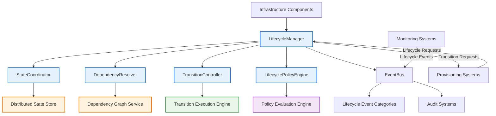

# 9.15 Infrastructure Lifecycle Management

## Purpose
This section defines the infrastructure lifecycle management architecture for AI-OS, providing a unified framework for managing the complete lifecycle of infrastructure resources and components from creation to retirement. It establishes technology-neutral contracts for lifecycle operations, ensuring consistent behavior across diverse execution environments while maintaining strict separation from provisioning mechanisms, configuration systems, and runtime concerns.

## Scope
The infrastructure lifecycle management applies to all AI-OS infrastructure resources and components, including compute, storage, networking, identity, and runtime instances. It covers resource provisioning, activation, validation, operation, suspension, maintenance, upgrades, migration, decommissioning, cleanup, rollback, and recovery. This specification does not cover:
- Infrastructure provisioning mechanisms or orchestration engines
- Configuration management systems or runtime configuration
- Specific deployment technologies or implementation techniques
- Application-level lifecycle management or business logic workflows

## Architectural Goals
The infrastructure lifecycle management MUST:
- Provide technology-neutral interfaces for lifecycle operations applicable across all infrastructure types
- Enable consistent lifecycle management independent of underlying provisioning mechanisms
- Abstract platform-specific lifecycle differences through well-defined contracts
- Support dynamic lifecycle adaptation based on environmental conditions and policies
- Ensure lifecycle operation guarantees through contractual obligations and state guarantees
- Maintain strict separation from provisioning, configuration, and runtime concerns
- Allow extension for new lifecycle patterns and resource types without modifying core lifecycle logic
- Provide rollback and recovery mechanisms for failed lifecycle operations
- Guarantee state consistency and synchronization across distributed lifecycle operations
- Support auditability and observability of all lifecycle state transitions

## Architecture Overview
The infrastructure lifecycle management consists of five primary components working together to provide comprehensive lifecycle management:
1. **LifecycleManager**: Central orchestrator for lifecycle operations and state coordination
2. **StateCoordinator**: Maintains consistent lifecycle state across distributed components
3. **DependencyResolver**: Manages lifecycle dependencies and ordering constraints
4. **TransitionController**: Executes state transitions with safety guarantees and rollback capabilities
5. **LifecyclePolicyEngine**: Evaluates and enforces lifecycle policies and constraints

These components interact through well-defined contracts and communicate via the EventBus using the `aios.lifecycle.*` namespace. The lifecycle management layer sits between infrastructure components and provisioning systems, translating lifecycle requests into appropriate provisioning operations while maintaining state consistency.

## Internal Architecture

## Component Responsibilities

### LifecycleManager
**Purpose**: Orchestrates lifecycle operations, coordinates component interactions, and manages the overall lifecycle state machine through delegation to specialized components.

**Responsibilities**:
- Receive lifecycle operation requests from infrastructure components and external systems
- Coordinate with StateCoordinator, DependencyResolver, TransitionController, and LifecyclePolicyEngine for operation execution
- Manage the delegation of lifecycle operations to appropriate components based on operation type
- Handle cross-component lifecycle event propagation and correlation
- Manage lifecycle operation queuing, prioritization, and workflow coordination
- Provide aggregated lifecycle operation status and progress reporting

**Operations**:
- `requestLifecycleOperation(ResourceId, OperationType, Parameters): OperationId`
- `getOperationStatus(OperationId): OperationStatus`
- `cancelOperation(OperationId): Success|Failure`
- `getResourceLifecycleState(ResourceId): LifecycleState`
- `registerResourceLifecycle(ResourceId, InitialState): Success|Failure`
- `deregisterResourceLifecycle(ResourceId): Success|Failure`
- `handleLifecycleEvent(Event): Success|Failure`
- `getLifecycleMetrics(): MetricsSet`

**Inputs**: Lifecycle operation requests, lifecycle events, component status updates, policy evaluations
**Outputs**: Operation identifiers, status updates, lifecycle state changes, event notifications
**Preconditions**: Lifecycle management system initialized, resource registered in lifecycle system
**Postconditions**: Lifecycle operation delegated or queued, state coordinates updated, relevant components notified
**Error Conditions**:
- `INVALID_RESOURCE`: Resource not registered or invalid resource identifier
- `INVALID_OPERATION`: Requested operation not valid for current state
- `DEPENDENCY_VIOLATION`: Operation violates dependency constraints
- `POLICY_VIOLATION`: Operation violates lifecycle policies
- `OPERATION_FAILED`: Lifecycle operation failed during execution
**Behavioural Guarantees**:
- ALL lifecycle operations are processed in FIFO order per resource unless priority specified
- Lifecycle state transitions are delegated to appropriate components with atomicity and consistency guarantees
- Operation status reflects actual execution state with bounded propagation delay
- Failed operations trigger automatic rollback coordination WHEN possible per policy
- Lifecycle operations maintain referential integrity of dependent resources THROUGH delegation to DependencyResolver

### StateCoordinator
**Purpose**: Maintains consistent lifecycle state across distributed infrastructure components and provides state synchronization guarantees through atomic operations and conflict resolution.

**Responsibilities**:
- Store and manage lifecycle state for all registered infrastructure resources with strong consistency guarantees
- Ensure state consistency across distributed instances through synchronization protocols and conflict detection
- Provide atomic state update operations with rollback capabilities and version tracking
- Notify interested components of state changes via EventBus with guaranteed delivery semantics
- Maintain state history for audit and rollback purposes with configurable retention policies
- Handle state reconciliation after network partitions or component failures through vector clock mechanisms
- Generate and manage lifecycle state snapshots for backup and point-in-time recovery

**Operations**:
- `getResourceState(ResourceId): LifecycleState`
- `setResourceState(ResourceId, NewState, TransitionId, ExpectedVersion): Success|Failure`
- `getStateHistory(ResourceId, StartTime, EndTime): StateHistory`
- `createStateSnapshot(ResourceId): SnapshotId`
- `restoreFromSnapshot(SnapshotId): Success|Failure`
- `reconcileState(ResourceId, ExternalState, VectorClock): Success|Failure`
- `subscribeToStateChanges(ResourceId, Callback): SubscriptionId`
- `unsubscribeFromStateChanges(SubscriptionId): Success|Failure`

**Inputs**: State update requests, state reconciliation data, snapshot requests, subscription requests
**Outputs**: Current state values, state history, snapshot identifiers, change notifications with causality information
**Preconditions**: Resource registered with lifecycle system, valid state transition requested with proper versioning
**Postconditions**: Resource state updated atomically with version increment, subscribers notified with causal context, history updated
**Error Conditions**:
- `INVALID_STATE_TRANSITION`: Requested state transition not permitted per lifecycle model
- `STATE_CONFLICT`: Concurrent state modification conflict detected via vector clock comparison
- `SNAPSHOT_NOT_FOUND`: Requested snapshot does not exist or has expired
- `RECONCILIATION_FAILED`: Unable to reconcile state with external source due to vector clock divergence
- `STATE_CORRUPTION`: Detected inconsistency in stored state violating structural invariants
**Behavioural Guarantees**:
- State updates ARE atomic and linearizable for each individual resource with version vector ordering
- State consistency IS maintained across all nodes within bounded synchronization time using conflict-free replicated data types
- State history IS maintained for configurable retention period with cryptographic integrity verification
- State snapshots DO provide point-in-time consistency for recovery with verifiable provenance
- State reconciliation DOES converge to consistent state after partition healing using deterministic conflict resolution

### DependencyResolver
**Purpose**: Manages lifecycle dependencies between resources and enforces ordering constraints for lifecycle operations through graph-based analysis and validation.

**Responsibilities**:
- Maintain dependency graph between infrastructure resources with real-time update capabilities
- Determine valid execution order for lifecycle operations based on dependency constraints using topological sorting
- Detect and prevent circular dependencies that would cause deadlock through cycle detection algorithms
- Calculate minimal sets of operations required to achieve desired state while respecting all constraints
- Provide dependency validation for proposed lifecycle operations through constraint satisfaction checking
- Handle dynamic dependency changes during resource lifecycle through incremental graph updates
- Provide dependency impact analysis for proposed changes through reachability and influence computation

**Operations**:
- `addDependency(DependentId, DependencyId, DependencyType): Success|Failure`
- `removeDependency(DependentId, DependencyId): Success|Failure`
- `getDependencies(ResourceId): DependencySet`
- `getDependents(ResourceId): DependentSet`
- `validateOperationOrder(Operations): ValidationResult`
- `getExecutionOrder(Operations): OrderedOperationSet`
- `detectCycles(): CycleSet`
- `getImpactedResources(ChangeSet): ImpactedResourceSet`

**Inputs**: Dependency declarations, dependency removal requests, operation validation requests
**Outputs**: Dependency sets, execution orders, validation results, impact analyses with constraint explanations
**Preconditions**: Resources involved in dependency registered with lifecycle system
**Postconditions**: Dependency graph updated with transactional guarantees, validation results reflect current dependency state with proof
**Error Conditions**:
- `CIRCULAR_DEPENDENCY`: Adding dependency would create cycle in dependency graph DETECTED via DFS traversal
- `INVALID_DEPENDENCY`: Dependency references non-existent or invalid resource VALIDATED against registry
- `DEPENDENCY_CONFLICT`: Conflicting dependency requirements detected THROUGH constraint analysis
- `VALIDATION_FAILED`: Operation order violates dependency constraints PROVEN via topological sort failure
**Behavioural Guarantees**:
- Dependency graph REMAINS acyclic after all valid operations PROVEN through invariant preservation
- Execution orders RESPECT all dependency constraints and ARE minimal THROUGH optimal topological sorting
- Dependency validation PREVENTS operations that would violate constraints WITH formal verification
- Impact analysis ACCURATELY identifies all resources affected by proposed changes USING graph traversal algorithms
- Dependency operations ARE thread-safe and maintain graph consistency THROUGH lock-coupling protocol

### TransitionController
**Purpose**: Executes lifecycle state transitions with safety guarantees, rollback capabilities, and validation checks through coordinated execution with provisioning systems.

**Responsibilities**:
- Execute lifecycle state transitions according to predefined transition definitions with preconditions and postconditions
- Validate transition preconditions and postconditions before and after execution through contract-based verification
- Coordinate rollback procedures when transitions fail through compensatory transaction mechanisms
- Ensure transition atomicity and consistency guarantees via two-phase commit protocols when spanning multiple resources
- Validate that transitions comply with lifecycle policies through delegation to LifecyclePolicyEngine
- Manage transition timeouts and escalation procedures through hierarchical timeout management
- Maintain transition execution history for audit and debugging with causal linkage to state changes

**Operations**:
- `executeTransition(ResourceId, TransitionType, Parameters): TransitionResult`
- `validateTransitionPreconditions(ResourceId, TransitionType): ValidationResult`
- `validateTransitionPostconditions(ResourceId, TransitionType): ValidationResult`
- `rollbackTransition(TransitionId): Success|Failure`
- `getTransitionHistory(ResourceId): TransitionHistory`
- `setTransitionTimeout(TransitionType, Duration): Success|Failure`
- `escalateTransitionFailure(TransitionId): Success|Failure`

**Inputs**: Transition requests, validation parameters, rollback requests, timeout configurations
**Outputs**: Transition results, validation outcomes, rollback status, history records with execution traces
**Preconditions**: Resource registered, transition type valid for current state, preconditions met WITH proof
**Postconditions**: Resource state changed according to transition WITH version increment, history updated WITH causal links, rollback info recorded
**Error Conditions**:
- `INVALID_TRANSITION`: Transition type not valid for current state VALIDATED against lifecycle model
- `PRECONDITION_FAILED`: Transition preconditions not satisfied WITH specific violation details
- `POSTCONDITION_FAILED`: Transition postconditions not satisfied after execution WITH concrete counterexamples
- `TRANSITION_TIMEOUT`: Transition execution exceeded timeout limit WITH execution trace
- `ROLLBACK_FAILED`: Unable to rollback completed transaction WITH residual state analysis
- `POLICY_VIOLATION_TRANSITION`: Transition violates lifecycle policies WITH policy reference and violation reason
**Behavioural Guarantees**:
- Transitions EXECUTE atomically when possible, WITH compensating transactions when not PROVEN via recovery guarantees
- ALL transition preconditions ARE validated before execution begins WITH formal proof obligations
- ALL transition postconditions ARE validated after execution completes WITH postcondition verification
- Failed transitions TRIGGER automatic rollback WHEN possible per policy WITH escalation path definition
- Transition execution history IS maintained for audit and troubleshooting WITH complete causality chains

### LifecyclePolicyEngine
**Purpose**: Evaluates and enforces lifecycle policies and constraints throughout the lifecycle management process through declarative policy evaluation and enforcement mechanisms.

**Responsibilities**:
- Store and manage lifecycle policy definitions with versioned policy repository
- Evaluate lifecycle operations against applicable policies through contextual policy matching and constraint solving
- Determine if proposed operations comply with organizational and regulatory constraints using formal verification
- Generate policy violation reports and remediation suggestions through violation analysis and correction planning
- Support policy versioning and lifecycle management through backward-compatible evolution mechanisms
- Provide policy exception handling and exemption processes through justified exception granting with audit trails
- Audit policy compliance for reporting and compliance purposes through comprehensive logging and attestation

**Operations**:
- `evaluateLifecyclePolicy(OperationId, ResourceId, OperationType): PolicyEvaluationResult`
- `getApplicablePolicies(ResourceId, OperationType): PolicySet`
- `grantPolicyException(PolicyId, ResourceId, Justification): Success|Failure`
- `revokePolicyException(ExceptionId): Success|Failure`
- `getPolicyViolations(TimePeriod): ViolationSet`
- `generateComplianceReport(TimePeriod): ComplianceReport`
- `updatePolicy(PolicyId, NewPolicy): Success|Failure`

**Inputs**: Operation requests, resource identifiers, policy evaluation requests, exception requests
**Outputs**: Policy evaluations, applicable policies, exception grants, violation reports, compliance reports with evidence
**Preconditions**: Policy engine initialized with baseline policies, valid operation identifiers WITH existence proof
**Postconditions**: Policy evaluation completed WITH decision justification, exceptions granted/revoked WITH audit trail, violations reported WITH categorization
**Error Conditions**:
- `POLICY_VIOLATION`: Operation violates applicable lifecycle policy WITH violated policy identification
- `INVALID_POLICY`: Policy definition violates schema or constraints WITH schema violation details
- `EXCEPTION_NOT_FOUND`: Requested policy exception does not exist WITH exception registry status
- `EXCEPTION_ALREADY_GRANTED`: Exception already granted for specified resource/operation WITH grant timestamp
- `POLICY_UPDATE_FAILED`: Failed to update policy definition WITH update failure reason
**Behavioural Guarantees**:
- Policy evaluations ARE deterministic for identical inputs PROVEN through pure function evaluation
- ALL applicable policies ARE evaluated for each operation THROUGH complete policy matching
- Policy exceptions ARE granted only with proper justification and approval THROUGH authorized workflow
- Policy violations ARE logged with sufficient detail for remediation VIA structured violation reporting
- Compliance reports ARE generated according to specified formats and schedules WITH template compliance

## Lifecycle Model
The infrastructure lifecycle defines a comprehensive state model for managing infrastructure resources through their complete existence:

### Core Lifecycle States
- **PROVISIONING**: Resource is being provisioned but not yet ready for use
- **ACTIVE**: Resource is fully provisioned and available for normal operation
- **MAINTENANCE**: Resource is temporarily unavailable for scheduled maintenance
- **SUSPENDED**: Resource is temporarily halted but preserves state for quick resumption
- **UPDATING**: Resource is undergoing software/configuration updates
- **MIGRATING**: Resource is being moved to different infrastructure or configuration
- **DECOMMISSIONING**: Resource is being prepared for retirement but not yet removed
- **INACTIVE**: Resource is deprovisioned but may be recoverable within grace period
- **DELETED**: Resource has been permanently removed and cannot be recovered
- **ERROR**: Resource has encountered an error requiring manual intervention
- **UNKNOWN**: Resource state cannot be determined due to communication failure

### Lifecycle Transitions
Defined transitions between states with associated semantics:
- `provision`: NULL → PROVISIONING (initiate resource creation)
- `activate`: PROVISIONING → ACTIVE (complete provisioning and make available)
- `maintain_start`: ACTIVE → MAINTENANCE (begin maintenance window)
- `maintain_end`: MAINTENANCE → ACTIVE (end maintenance window)
- `suspend`: ACTIVE → SUSPENDED (temporarily halt operations)
- `resume`: SUSPENDED → ACTIVE (resume operations after suspension)
- `update_start`: ACTIVE → UPDATING (begin update process)
- `update_complete`: UPDATING → ACTIVE (complete update successfully)
- `update_failed`: UPDATING → ERROR (update failed, requires intervention)
- `migrate_start`: ACTIVE → MIGRATING (begin migration process)
- `migrate_complete`: MIGRATING → ACTIVE (complete migration successfully)
- `migrate_failed`: MIGRATING → ERROR (migration failed, requires intervention)
- `decommission_start`: ACTIVE → DECOMMISSIONING (begin decommissioning process)
- `decommission_complete`: DECOMMISSIONING → INACTIVE (complete decommissioning)
- `decommission_failed`: DECOMMISSIONING → ERROR (decommissioning failed)
- `reactivate`: INACTIVE → ACTIVE (restore resource from inactive state)
- `delete`: INACTIVE → DELETED (permanently remove resource)
- `recover`: DELETED → INACTIVE (restore deleted object within grace period - if supported)
- `reset`: ANY → PROVISIONING (reset resource to initial provisioning state)

## Lifecycle Orchestration Architecture
Lifecycle orchestration provides the architectural framework for coordinating complex lifecycle operations involving multiple resources and coordinated state transitions through well-defined component interactions.

### Orchestration Principles
The lifecycle management architecture follows these core orchestration principles:
- **Separation of Concerns**: LifecycleManager orchestrates without implementing domain-specific logic
- **Component Autonomy**: Each component owns its domain (state, dependencies, transitions, policies)
- **Contract-Based Interaction**: Components interact exclusively through well-defined interfaces
- **Event-Driven Coordination**: State changes propagate through EventBus for loose coupling
- **Policy-Governed Execution**: All operations undergo policy validation before execution
- **Dependency-Aware Scheduling**: Execution order respects dependency constraints
- **Atomicity with Compensation**: Transactions provide atomicity guarantees or semantic rollback

### Component Interaction Patterns
1. **Operation Initiation**: Infrastructure components request operations through LifecycleManager
2. **Policy Evaluation**: LifecycleManager delegates to LifecyclePolicyEngine for pre-execution validation
3. **Dependency Validation**: LifecycleManager consults DependencyResolver for execution ordering and feasibility
4. **Transition Execution**: LifecycleManager delegates to TransitionController for state change execution
5. **State Update**: TransitionController coordinates with StateCoordinator for atomic state persistence
6. **Event Publication**: State changes trigger EventBus notifications for dependent components
7. **Completion Reporting**: LifecycleManager aggregates results and reports to requesting components

### Lifecycle Policy Integration
LifecyclePolicyEngine integrates tightly with TransitionController through:
- **Pre-transition Validation**: TransitionController MUST delegate policy evaluation to LifecyclePolicyEngine before executing any transition
- **Policy Violation Handling**: LifecyclePolicyEngine MUST provide specific violation details to enable targeted remediation
- **Exception Processing**: LifecyclePolicyEngine MUST coordinate exception granting with TransitionController for authorized bypass
- **Policy Update Propagation**: LifecyclePolicyEngine MUST notify TransitionController of policy changes affecting pending operations

## EventBus Integration
The infrastructure lifecycle management uses the EventBus for loose coupling and event-driven coordination. Events are organized into semantic categories for efficient routing and processing:

### Lifecycle Event Categories
- **State Transition Events**: All lifecycle state transitions audited and propagated
  - `aios.lifecycle.transition.initiated`: Transition execution has begun
  - `aios.lifecycle.transition.completed`: Transition execution finished successfully
  - `aios.lifecycle.transition.failed`: Transition execution encountered failure
  - `aios.lifecycle.transition.rolledback`: Transition execution was rolled back
  
- **State Change Events**: Resource lifecycle state modifications
  - `aios.lifecycle.state.changed`: Resource lifecycle state has been updated
  - `aios.lifecycle.state.snapshotted`: Point-in-time state snapshot created
  - `aios.lifecycle.state.restored`: State restored from snapshot
  
- **Operation Lifecycle Events**: Lifecycle operation execution tracking
  - `aios.lifecycle.operation.requested`: Lifecycle operation request received
  - `aios.lifecycle.operation.validated`: Operation passed policy and dependency validation
  - `aios.lifecycle.operation.executing`: Operation is currently executing
  - `aios.lifecycle.operation.completed`: Operation completed successfully
  - `aios.lifecycle.operation.failed`: Operation failed during execution
  - `aios.lifecycle.operation.cancelled`: Operation was cancelled by requester
  
- **Dependency Management Events**: Dependency graph modifications and validations
  - `aios.lifecycle.dependency.added`: New dependency relationship established
  - `aios.lifecycle.dependency.removed`: Dependency relationship terminated
  - `aios.lifecycle.dependency.validated`: Dependency constraints validated for operation
  - `aios.lifecycle.dependency.cycle.detected`: Circular dependency detected in graph
  
- **Policy and Compliance Events**: Policy evaluation and enforcement tracking
  - `aios.lifecycle.policy.evaluated`: Lifecycle policy evaluated for operation
  - `aios.lifecycle.policy.violated`: Lifecycle policy violation detected
  - `aios.lifecycle.policy.exception.granted`: Policy exception approved for operation
  - `aios.lifecycle.policy.exception.revoked`: Previously granted policy exception revoked
  
- **System Health Events**: Lifecycle management system operational status
  - `aios.lifecycle.health.degraded`: System operating with reduced capacity
  - `aios.lifecycle.health.recovered`: System recovered from degraded state
  - `aios.lifecycle.maintenance.scheduled`: Maintenance window announced
  - `aios.lifecycle.maintenance.active`: Maintenance window in progress

### Event Handling Semantics
Components subscribe to relevant lifecycle event categories to:
- React to state changes in dependent resources through automatic dependency triggering
- Update dependency graphs when relationships change via event-driven reconciliation
- Enforce policies based on operation outcomes through retrospective compliance checking
- Maintain audit trails of all lifecycle activities through immutable event logging
- Trigger monitoring alerts for failed or delayed operations through threshold-based notifications
- Execute recovery procedures for failed operations through event-driven recovery initiation
- Update monitoring dashboards with lifecycle metrics through aggregated event processing

## Runtime Behaviour
The infrastructure lifecycle management exhibits specific runtime behaviors that ensure consistent, reliable lifecycle operations through coordinated component interactions.

### Initialization Sequence
1. LifecycleManager initializes and prepares orchestration context
2. StateCoordinator initializes distributed state store with consistency protocols
3. DependencyResolver initializes empty dependency graph with validation constraints
4. TransitionController loads transition definitions and prepares execution engine
5. LifecyclePolicyEngine loads policy repository and prepares evaluation context
6. All components establish EventBus subscriptions for their respective event categories
7. Lifecycle management signals overall orchestration readiness via bootstrap event

### Steady State Operation
- LifecycleManager continuously processes operation requests through orchestration pipeline
- StateCoordinator maintains strong consistency guarantees for all managed resource states
- DependencyResolver continuously validates dependency constraints and detects violations
- TransitionController executes validated transitions with pre/postcondition verification
- LifecyclePolicyEngine evaluates all operations against applicable policies before execution
- EventBus processes lifecycle events with guaranteed delivery to interested subscribers
- Metrics collection continuously monitors operational characteristics and system health
- Error handling coordinates failure detection, isolation, and recovery initiation
- Background maintenance performs predictive optimization and garbage collection
- Security monitoring continuously validates access controls and anomaly detection
- Audit logging persists all significant events with cryptographic integrity protection

### Coordinated Operation Flow
1. **Request Reception**: LifecycleManager receives lifecycle operation request from infrastructure component
2. **Policy Evaluation**: LifecycleManager delegates to LifecyclePolicyEngine for mandatory pre-execution policy validation
3. **Dependency Analysis**: LifecycleManager consults DependencyResolver for dependency validation and execution ordering
4. **Transition Validation**: LifecycleManager coordinates with TransitionController for transition feasibility assessment
5. **Execution Authorization**: Upon successful validation, LifecycleManager authorizes transition execution
6. **Transition Execution**: TransitionController executes state transition with provisioning systems coordination
7. **State Persistence**: TransitionController coordinates atomic state update with StateCoordinator
8. **Event Publication**: StateCoordinator publishes state change event to EventBus with causal context
9. **Dependency Update**: DependencyResolver processes state change event to update affected dependencies
10. **Completion Notification**: LifecycleManager aggregates results and notifies requesting component

### Error Handling and Recovery Coordination
1. **Failure Detection**: TransitionController detects execution failure through timeout or error response
2. **Immediate Response**: TransitionController initiates automatic rollback WHEN possible per policy
3. **Escalation Path**: If rollback not possible or fails, TransitionController escalates to LifecycleManager
4. **Impact Assessment**: LifecycleManager consults DependencyResolver for affected resource determination
5. **Recovery Planning**: LifecycleManager coordinates with LifecyclePolicyEngine for policy-compliant recovery options
6. **Recovery Execution**: Appropriate recovery mechanism selected and executed through coordinated component interaction
7. **Validation and Reporting**: Recovery validated through standard verification channels and results reported
8. **System Adaptation**: Post-recovery, system may adjust policies or dependencies based on learned patterns

### Shutdown Sequence
1. LifecycleManager ceases accepting new operation requests and enters drain mode
2. Currently executing operations allowed to complete or transition to safe state
3. Operation queues drained to completion with cancellation notification for remaining requests
4. Dependent systems notified of impending shutdown through precondition validation events
5. Lifecycle state persisted to durable storage through StateCoordinator checkpoint mechanism
6. Buffered event data flushed to EventBus persistence layer
7. Background maintenance processes terminated with resource cleanup
8. Lifecycle communication connections closed with proper protocol termination
9. Extensions unloaded and their resources released through managed lifecycle termination
10. Lifecycle system resources (memory, handles, etc.) returned to operating system
11. Final audit and diagnostic logs written with session completion markers
12. Lifecycle management system halts orchestration processes

## Architectural Contracts

### LifecycleManager Contract
**Purpose**: Define the formal interface for lifecycle operation orchestration and component coordination.

**Contract Specification**:
- **Orchestration Methods**:
  - `requestLifecycleOperation(resourceId, operationType, parameters): operationId`
  - `getOperationStatus(operationId): operationStatus`
  - `cancelOperation(operationId): success|failure`
  - `getResourceLifecycleState(resourceId): lifecycleState`
  - `registerResourceLifecycle(resourceId, initialState): success|failure`
  - `deregisterResourceLifecycle(resourceId): success|failure`
  - `handleLifecycleEvent(event): success|failure`
  - `getLifecycleMetrics(): metricsSet`

- **Delegation Responsibilities**:
  - MUST delegate policy evaluation to LifecyclePolicyEngine BEFORE operation execution
  - MUST consult DependencyResolver for dependency validation AND execution ordering
  - MUST coordinate transition execution through TransitionController WITH pre/postcondition validation
  - MUST coordinate state persistence through StateCoordinator WITH atomicity guarantees
  - MUST publish operation lifecycle events through EventBus WITH standardized formatting

- **Behavioural Requirements**:
  - ALL lifecycle operations MUST be processed in FIFO order per resource UNLESS priority specified
  - Lifecycle state delegation MUST maintain atomicity and consistency across coordinating components
  - Operation status reporting MUST reflect actual execution state WITH bounded propagation delay
  - Failed operations MUST trigger automatic rollback coordination WHEN possible per policy
  - Lifecycle operations MUST maintain referential integrity of dependent resources THROUGH delegation

### StateCoordinator Contract
**Purpose**: Define the formal interface for lifecycle state management and consistency guarantees.

**Contract Specification**:
- **State Management Methods**:
  - `getResourceState(resourceId): lifecycleState`
  - `setResourceState(resourceId, newState, transitionId, expectedVersion): success|failure`
  - `getStateHistory(resourceId, startTime, endTime): stateHistory`
  - `createStateSnapshot(resourceId): snapshotId`
  - `restoreFromSnapshot(snapshotId): success|failure`
  - `reconcileState(resourceId, externalState, vectorClock): success|failure`
  - `subscribeToStateChanges(resourceId, callback): subscriptionId`
  - `unsubscribeFromStateChanges(subscriptionId): success|failure`

- **Consistency Guarantees**:
  - State updates MUST be atomic and linearizable for each individual resource
  - State consistency MUST be maintained across all nodes within bounded synchronization time
  - State history MUST be maintained for configurable retention period with integrity verification
  - State snapshots MUST provide point-in-time consistency for recovery with verifiable provenance
  - State reconciliation MUST converge to consistent state after partition healing using deterministic resolution

- **Behavioural Requirements**:
  - Resource state updates MUST include version increment for causality tracking
  - Subscriber notifications MUST include causal context for proper event ordering
  - History updates MUST maintain chronological integrity with timestamp validation
  - Snapshot creation MUST preserve exact state at point-in-time with verifiable hash
  - Restoration operations MUST validate snapshot compatibility before state replacement

### DependencyResolver Contract
**Purpose**: Define the formal interface for dependency graph management and constraint validation.

**Contract Specification**:
- **Dependency Management Methods**:
  - `addDependency(dependentId, dependencyId, dependencyType): success|failure`
  - `removeDependency(dependentId, dependencyId): success|failure`
  - `getDependencies(resourceId): dependencySet`
  - `getDependents(resourceId): dependentSet`
  - `validateOperationOrder(operations): validationResult`
  - `getExecutionOrder(operations): orderedOperationSet`
  - `detectCycles(): cycleSet`
  - `getImpactedResources(changeSet): impactedResourceSet`

- **Validation Guarantees**:
  - Dependency graph MUST remain acyclic after all valid operations
  - Dependency queries MUST return consistent results for identical inputs
  - Execution orders MUST respect all dependency constraints and be algorithmically minimal
  - Circular dependencies MUST be detected and prevented before causing deadlock
  - Dependency impact analysis MUST accurately identify all affected resources

- **Behavioural Requirements**:
  - Dependency operations MUST be thread-safe and maintain graph consistency through proven protocols
  - Dependency validation MUST prevent operations that would violate constraints with formal proof
  - Impact analysis MUST use graph traversal algorithms with verifiable completeness
  - Cycle detection MUST employ depth-first search with guaranteed termination
  - Topological sorting MUST produce valid execution orders when graph is acyclic

### TransitionController Contract
**Purpose**: Define the formal interface for lifecycle state transition execution with safety guarantees.

**Contract Specification**:
- **Transition Execution Methods**:
  - `executeTransition(resourceId, transitionType, parameters): transitionResult`
  - `validateTransitionPreconditions(resourceId, transitionType): validationResult`
  - `validateTransitionPostconditions(resourceId, transitionType): validationResult`
  - `rollbackTransition(transitionId): success|failure`
  - `getTransitionHistory(resourceId): transitionHistory`
  - `setTransitionTimeout(transitionType, duration): success|failure`
  - `escalateTransitionFailure(transitionId): success|failure`

- **Safety Guarantees**:
  - Transitions MUST execute atomically when possible, with compensating transactions when not
  - ALL transition preconditions MUST be validated before execution begins
  - ALL transition postconditions MUST be validated after execution completes
  - Failed transitions MUST trigger automatic rollback WHEN possible per policy
  - Transition execution history MUST be maintained for audit and troubleshooting with causality

- **Behavioural Requirements**:
  - Transition type validation MUST occur against current lifecycle model state
  - Precondition validation MUST provide specific violation details when failing
  - Postcondition validation MUST provide concrete counterexamples when failing
  - Timeout enforcement MUST include execution trace for diagnostic purposes
  - Rollback failure reporting MUST include residual state analysis for recovery planning
  - Policy violation reporting MUST include policy reference and specific violation reason

### LifecyclePolicyEngine Contract
**Purpose**: Define the formal interface for lifecycle policy evaluation and enforcement.

**Contract Specification**:
- **Policy Evaluation Methods**:
  - `evaluateLifecyclePolicy(operationId, resourceId, operationType): policyEvaluationResult`
  - `getApplicablePolicies(resourceId, operationType): policySet`
  - `grantPolicyException(policyId, resourceId, justification): success|failure`
  - `revokePolicyException(exceptionId): success|failure`
  - `getPolicyViolations(timePeriod): violationSet`
  - `generateComplianceReport(timePeriod): complianceReport`
  - `updatePolicy(policyId, newPolicy): success|failure`

- **Evaluation Guarantees**:
  - Policy evaluations MUST be deterministic for identical inputs
  - ALL applicable policies MUST be evaluated for each operation
  - Policy exceptions MUST be granted only with proper justification and authorization
  - Policy violations MUST be logged with sufficient detail for remediation
  - Compliance reports MUST be generated according to specified formats and schedules

- **Behavioural Requirements**:
  - Policy evaluation MUST be implemented as pure function with no side effects
  - Policy matching MUST be comprehensive and non-overlapping for applicable policy set
  - Exception granting MUST follow authorized workflow with audit trail creation
  - Violation logging MUST include structured data for automated remediation processing
  - Report generation MUST comply with template specifications and delivery schedules

## Runtime Invariants
Runtime invariants that MUST hold true during operation of the infrastructure lifecycle management:

### State Invariants
1. **State Consistency**: Each resource has exactly one lifecycle state at any time
2. **State Validity**: Resource lifecycle state is always valid for current operation per lifecycle model
3. **State Persistence**: Resource lifecycle state persists across system restarts with verifiable integrity
4. **State Visibility**: Resource lifecycle state is visible to authorized components through defined interfaces
5. **State Transition Validity**: All state transitions follow defined lifecycle model with pre/postcondition validation
6. **State Atomicity**: State transitions are atomic when possible, compensated when not with semantic equivalence
7. **State Recovery**: Resource state can be recovered from backups when necessary with validation guarantees
8. **State Uniqueness**: No two resources can have identical identifying characteristics within same domain

### Operational Invariants
1. **Operation Validity**: All lifecycle operations are valid for current resource state per policy evaluation
2. **Operation Authorization**: All lifecycle operations are properly authorized through policy enforcement
3. **Operation Completeness**: All lifecycle operations complete or fail with defined outcome and error classification
4. **Operation Idempotency**: Idempotent operations produce same result when repeated with state equivalence
5. **Operation Commutativity**: Commutative operations produce same result regardless of order when independent
6. **Operation Monitoring**: All lifecycle operations are monitored for progress and completion with timeout bounds
7. **Operation Logging**: All lifecycle operations are logged for audit and troubleshooting with correlation IDs
8. **Operation Isolation**: Failed operations do not corrupt state of other resources through isolation boundaries

### Dependency Invariants
1. **Dependency Validity**: All dependencies are valid and resolvable through registry verification
2. **Dependency Acyclicity**: Dependency graph contains no cycles through continuous validation
3. **Dependency Completeness**: All required dependencies are identified and tracked through declaration enforcement
4. **Dependency Consistency**: Dependency information is consistent across components through synchronization protocols
5. **Dependency Visibility**: Dependency information is visible to dependent components through query interfaces
6. **Dependency Enforcement**: Dependencies are enforced before dependent operations proceed through validation gates
7. **Dependency Monitoring**: Dependencies are monitored for changes and failures through event subscription
8. **Dependency Recovery**: Dependencies can be recovered or substituted when failed through policy-defined mechanisms

### Policy Invariants
1. **Policy Applicability**: Applicable policies are correctly identified for each operation through contextual matching
2. **Policy Evaluation**: Policies are correctly evaluated against current context through deterministic computation
3. **Policy Enforcement**: Policy decisions are correctly enforced through authorization gates and exception mechanisms
4. **Policy Consistency**: Policies do not contain internal contradictions through formal verification
5. **Policy Currency**: Policies are current and up-to-date through versioned repository management
6. **Policy Accessibility**: Policies are accessible for evaluation when needed through indexed storage
7. **Policy Exception Validity**: Policy exceptions are valid and properly justified through audit trail validation
8. **Policy Auditability**: Policy evaluations and enforcement actions are auditable through comprehensive logging

## Coordinated Operations Guarantees
The following guarantees apply to the coordinated operation of lifecycle management components:

### Orchestration Guarantees
- **Request Serialization**: ALL lifecycle operations for a given resource ARE processed in FIFO order UNLESS explicitly prioritized
- **Policy Compliance**: NO lifecycle operation MAY execute without successful policy evaluation and authorization
- **Dependency Satisfaction**: NO lifecycle operation MAY execute without satisfying all dependency constraints
- **Transition Safety**: ALL state transitions MUST satisfy preconditions BEFORE execution and postconditions AFTER execution
- **Atomicity with Compensation**: State transitions MUST provide atomicity guarantees OR semantic rollback capabilities
- **Eventual Consistency**: State changes MUST propagate to all dependent components within bounded time
- **Failure Atomicity**: Failed operations MUST leave system in consistent state through rollback or compensation
- **Policy Governance**: Policy exceptions MUST be granted ONLY through authorized workflow with justification
- **Error Containment**: Failures in one component MUST NOT corrupt state or operation of other components
- **Recovery Validity**: Recovery operations MUST restore system to valid state consistent with lifecycle model

### Temporal Guarantees
- **Bounded Latency**: Operations MUST complete within bounded time limits defined by configuration
- **Response Time SLA**: Operations MUST meet defined response time service levels under normal conditions
- **Throughput Guarantees**: System MUST sustain minimum required operation throughput under specified load
- **Jitter Bounds**: Variation in operation latency MUST remain within configured bounds under stable conditions
- **Aging Prevention**: NO operation MAY starve indefinitely due to prioritization mechanisms
- **Fair Access**: ALL entities MUST receive fair access to processing resources under contention
- **Priority Aging**: Priority of waiting operations MUST increase with wait time to prevent starvation
- **Batch Completion**: Batched operations MUST complete within bounded time when resources are available

## Summary
This section defines the infrastructure lifecycle management architecture for AI-OS, providing a comprehensive framework for managing the complete lifecycle of infrastructure resources from creation to retirement. The architecture consists of five primary components—LifecycleManager, StateCoordinator, DependencyResolver, TransitionController, and LifecyclePolicyEngine—that work together to provide technology-neutral lifecycle operations with strong guarantees for consistency, safety, and reliability.

The specification defines a comprehensive lifecycle model with clearly defined states and transitions, establishing clear contracts for each component, defining runtime invariants that must hold during operation, and providing detailed guidance on lifecycle orchestration, policy integration, event-driven coordination, and failure handling.

By adhering to this specification, AI-OS infrastructure achieves consistent lifecycle management across diverse execution environments while maintaining strict separation from provisioning mechanisms, configuration systems, and runtime concerns. The architecture supports extension for new resource types and lifecycle patterns, provides comprehensive auditability and observability, ensures security and compliance, and delivers predictable performance characteristics through coordinated component interactions.