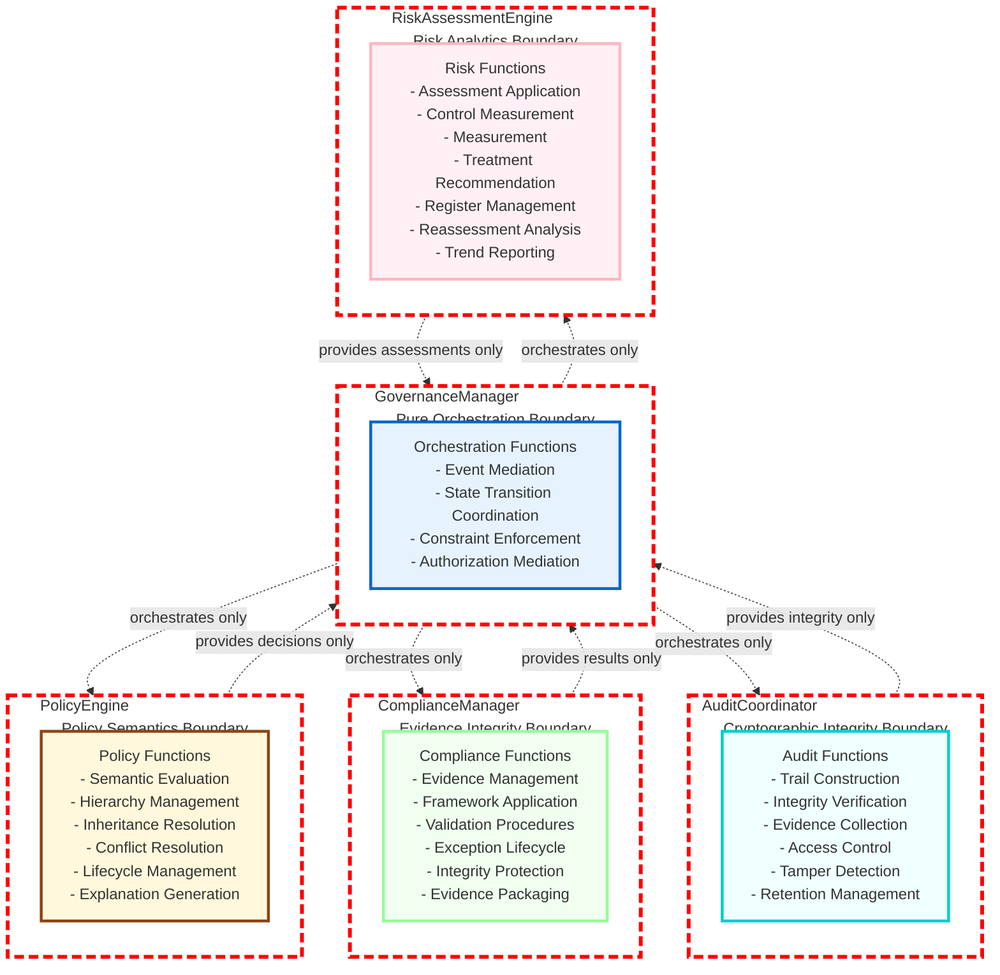

# 9.16 Infrastructure Governance and Compliance

## Architecture Overview

The Infrastructure Governance and Compliance subsystem establishes the architectural foundation for infrastructure governance within the AI-OS. It provides a technology-neutral framework for the definition, evaluation, enforcement, and audit of governance policies across infrastructure layers through a layered architecture with strict separation of concerns.

This subsystem implements a governance architecture where policy definition, evaluation, enforcement, compliance verification, audit integrity, and risk assessment are strictly separated into distinct architectural components. Components interact exclusively through typed events in the `aios.governance.*` namespace, ensuring loose coupling and architectural independence.

The subsystem comprises five architecturally orthogonal components:
1. **GovernanceManager** - Orchestrates governance processes and state transitions through event-driven coordination
2. **PolicyEngine** - Provides policy evaluation semantics and manages policy hierarchy
3. **ComplianceManager** - Ensures integrity and validity of compliance evidence and assessments
4. **AuditCoordinator** - Guarantees audit trail integrity and non-repudiation through cryptographic mechanisms
5. **RiskAssessmentEngine** - Delivers risk assessment methodologies and control effectiveness evaluation

All interactions occur through strongly-typed events adhering to JSON Schema Draft-07, guaranteeing architectural decoupling while enabling coordinated governance operations.

## Internal Architecture

### GovernanceManager

**Purpose**: Orchestrates governance processes, manages state transitions, and coordinates cross-component activities through event mediation without implementing domain-specific governance logic.

**Architectural Responsibilities**:
- Mediate governance workflow execution through event-driven orchestration
- Maintain and transition the governance state model according to defined policies
- Facilitate policy lifecycle coordination between components without influencing policy semantics
- Manage governance ownership model delegation and constraint enforcement
- Coordinate exception and waiver processing workflows while preserving component autonomy
- Propagate governance-relevant events across subsystem boundaries
- Provide governance observability interfaces for state introspection

**Architectural Guarantees**:
- Governance orchestration shall NEVER implement policy evaluation, compliance determination, audit judgment, or risk assessment logic
- WHEN orchestrating governance workflows, the system shall MAINTAIN strict separation between orchestration and domain logic
- IF an orchestration request violates separation-of-duties constraints, the request SHALL BE rejected by the orchestration layer
- Governance state transitions SHALL FOLLOW predefined policies without interpretation by the orchestrator

### PolicyEngine

**Purpose**: Provides policy evaluation semantics, manages policy hierarchy and inheritance, and ensures deterministic policy decision-making.

**Architectural Responsibilities**:
- Maintain an immutable, versioned policy repository with temporal validity semantics
- Implement policy inheritance mechanisms with override traceability and acyclic resolution
- Execute policy evaluation against contextual attributes using formally defined semantics
- Manage policy lifecycle states and effective dating without altering policy substance
- Generate policy explanations that preserve decision provenance and rationale
- Cache policy evaluation results while preserving semantic correctness and determinism

**Architectural Guarantees**:
- Policy evaluation shall ALWAYS respect the defined policy hierarchy and inheritance resolution rules
- Policy decisions shall BE DETERMINISTIC given identical inputs, policy state, and version
- Policy conflict resolution shall ALWAYS follow declarative conflict resolution policies
- Policy lifecycle operations shall PRESERVE immutable version history and temporal semantics

### ComplianceManager

**Purpose**: Manages compliance evidence lifecycle and ensures the integrity, validity, and utility of compliance assessments.

**Architectural Responsibilities**:
- Maintain a cryptographically protected compliance evidence repository with verifiable provenance
- Implement evidence collection, validation, and retention policies that ensure chain of custody
- Execute compliance assessments against formally defined compliance frameworks using verified evidence
- Manage compliance exception lifecycle with cryptographic audit trails for justification and expiration
- Ensure evidence accessibility is governed by need-to-know and separation-of-duties principles
- Generate compliance evidence packages suitable for independent audit verification

**Architectural Guarantees**:
- Compliance evidence shall ALWAYS maintain verifiable integrity and cryptographic chain of custody from collection to disposition
- Compliance assessments shall BE REPRODUCIBLE given identical evidence, criteria, and framework versions
- Evidence retention and disposition policies SHALL BE ENFORCED through automated, policy-driven mechanisms
- Compliance exception management SHALL PRESERVE immutable justification, risk assessment, and expiration records

### AuditCoordinator

**Purpose**: Ensures the integrity, confidentiality, and non-repudiation of audit trails governing infrastructure operations through cryptographic mechanisms.

**Architectural Responsibilities**:
- Construct and manage cryptographic audit trails with sequential hashing and periodic anchoring
- Implement audit integrity verification mechanisms that operate independently of operational systems
- Enforce access controls on audit trails and generate secondary audit trails for access accountability
- Detect and provide cryptographic proof of audit trail tampering with forensic detail
- Manage evidence lifecycle and retention policies with automated disposition and verification
- Support third-party verification of audit integrity without exposing sensitive audit content

**Architectural Guarantees**:
- Audit trail integrity shall BE VERIFIABLE using cryptographic mechanisms at any point in time without access to originating systems
- When audit tampering is detected, cryptographic proof SHALL BE GENERATED with forensic detail
- Audit trail confidentiality and access controls SHALL BE ENFORCED through cryptographic access mechanisms
- Audit trail retention policies SHALL BE IMMUTABLE once established and enforceable through automated mechanisms

### RiskAssessmentEngine

**Purpose**: Delivers risk assessment methodologies, control effectiveness evaluation, and risk treatment recommendation capabilities.

**Architectural Responsibilities**:
- Maintain and apply formally defined risk assessment methodologies and frameworks
- Evaluate control effectiveness against defined control objectives using standardized metrics
- Manage risk register with immutable change history, trend analysis, and comparative baselines
- Facilitate risk treatment planning with residual risk acceptance documentation and tracking
- Conduct risk reassessments providing delta analysis against baseline measurements
- Maintain risk heat maps and prioritization models with reproducible scoring methodologies

**Architectural Guarantees**:
- Risk assessments shall ALWAYS FOLLOW the declared risk assessment methodology and framework
- Control effectiveness evaluations SHALL BE COMPARABLE across assessments when using identical criteria
- Risk register updates SHALL MAINTAIN immutable change history with audit trail linkage
- Risk reassessments SHALL PROVIDE comparable baseline measurements enabling trend analysis

## Policy Hierarchy Architecture

The policy engine implements a strictly ordered hierarchical policy model with explicit inheritance semantics and conflict resolution policies:

- Policies form a directed acyclic graph (DAG) where descendant policies inherit attributes from ancestors
- Inheritance follows nearest-valid-ancestor-first resolution with explicit override capabilities
- Policy conflicts are resolved using declarative conflict resolution policies (deny-overrides, permit-overrides, etc.)
- Policy versioning maintains immutable history with effective dating enabling temporal governance
- Policy attributes support opaque extension contexts for polymorphic evaluation
- Policy evaluation context comprises normalized subject, action, resource, and environmental attribute sets
- Inheritance depth is bounded by policy to prevent computational exhaustion
- Inheritance paths are validated to ensure acyclicity and prevent infinite resolution loops

## Governance State Model

The governance state model maintains a consistent, multidimensional view of governance capabilities across all architectural components:

- **Policy State**: Versioned policy repository with states (DRAFT, REVIEW, APPROVED, ACTIVE, DEPRECATED, RETIRED, ARCHIVED) and temporal validity intervals
- **Compliance State**: Verified compliance status per control/framework with cryptographic evidence references and validation timestamps
- **Audit State**: Audit trail integrity status (VERIFIED, COMPROMISED, UNKNOWN) with tamper evidence and verification timestamps
- **Risk State**: Current risk register with change history, control effectiveness assessments, and treatment status
- **Ownership State**: Governance responsibility assignments with delegation chains, constraint matrices, and expiration temporalities
- **Exception State**: Active waivers and exceptions with justification, risk assessment, compensating controls, and expiration temporalities
- **Workflow State**: Active governance workflows with progression metrics, blocking conditions, and completion temporalities

State transitions are governed by predefined policies that require appropriate authorization and generate immutable audit records with complete contextual provenance.

## Governance Lifecycle Architecture

Governance lifecycle management follows a strictly ordered state model with policy-defined transition constraints:

- **Draft**: Initial policy creation state; not evaluable or enforceable
- **Review**: Formal evaluation state; not enforcible but subject to validation
- **Approved**: Validation complete; not yet active but ready for deployment
- **Active**: Fully operational state; evaluating and enforcing governance decisions
- **Deprecated**: Deprecation declared; retained for reference but not evaluable for new decisions
- **Retired**: Retirement period elapsed; archived and not accessible for active evaluation
- **Archived**: Historical retention state; preserved for reference but not participatory in active governance

Transitions between states are constrained by authorization policies and generate immutable audit trails documenting justification, authorization, and temporal context. The lifecycle enforces monotonic progression except for explicitly defined rollback paths requiring elevated authorization.

## Policy Inheritance Architecture

Policy inheritance follows these invariant architectural principles:

- Attributes are inherited from the nearest valid ancestor unless explicitly overridden with override provenance tracking
- Inheritance paths are strictly acyclic to prevent infinite resolution loops and ensure deterministic termination
- Override mechanisms preserve complete ancestry traceability for audit and compliance purposes
- Attribute inheritance supports both value replacement and compositional augmentation patterns
- Conditional inheritance enables context-sensitive attribute propagation through guard expressions
- Inheritance depth is bounded per policy hierarchy to ensure predictable evaluation complexity
- Inheritance conflict resolution follows precedence rules defined in the policy governance framework
- Inherited attributes maintain semantic fidelity to source definitions through version-aware resolution

## Compliance Evidence Architecture

Compliance evidence management ensures integrity, validity, and utility through cryptographic and policy enforcement:

- Evidence is cryptographically signed at collection time using asymmetric keys with key rotation support
- Evidence metadata includes immutable collection timestamp, collector identity, collection methodology, and contextual scope
- Evidence storage enforces write-once-read-many (WORM) semantics where technologically feasible
- Evidence retrieval maintains cryptographically verifiable chain of custody from collection to presentation
- Evidence correlation enables cross-control compliance analysis through standardized evidence taxonomy
- Evidence retention follows declarative schedules with automated disposition and integrity verification
- Evidence accessibility is governed by need-to-know principles and separation-of-duties constraint matrices
- Evidence format adheres to JSON Schema Draft-07 with versioned extensibility for evolving requirements
- Evidence integrity verification operates independently of collection and storage subsystems

## Audit Integrity Architecture

Audit integrity is ensured through layered cryptographic mechanisms providing verifiable guarantees:

- Audit entries are hashed using collision-resistant cryptographic hash functions (SHA-3 family) with input binding
- Sequential chaining creates tamper-evident hash chains where each entry incorporates predecessor hash
- Periodic cryptographic anchoring to external trust anchors provides cross-chain verification points
- Access controls enforce least privilege principles and separation-of-duties through cryptographic access tokens
- Audit viewing operations generate secondary audit trails for access accountability with justified purpose binding
- Cryptographic proofs enable third-party verification of audit integrity without exposing sensitive content
- Integrity verification operates through independent validation service with trust chain to institutional roots
- Tamper evidence includes cryptographic proof of alteration with forensic detail on modified segments
- Audit truncation and pruning follow retention policies with verifiable preservation of required segments

## Governance Ownership Model

Governance ownership follows a delegated authority model with constraint inheritance and revocation semantics:

- Ownership is assigned to verified principals (individuals, services, or roles) with explicitly scoped authorities
- Authority delegation follows transitive chains with depth limitations and constraint inheritance from grantors
- Delegated authorities inherit and may further constrain (but not expand) the authority constraints of grantors
- Ownership assignments include temporal validity intervals with renewable and non-renewable variants
- Conflicting ownership assignments are prevented by design through constraint satisfaction checking
- Ownership state changes generate immutable audit records with justification, authorization, and temporal context
- Ownership visibility is restricted to authorized overseers through cryptographic access controls
- Ownership revocation terminates delegation chains and reverts authority to grantors or root authorities
- Ownership expiration triggers automated reversion procedures with escalation notifications

## Exception and Waiver Architecture

Exception handling follows controlled deviation principles with accountability and temporal boundaries:

- Exceptions require explicit justification, formal risk assessment, compensating controls, and expiration temporalities
- Waivers represent time-bound policy exemptions with mandatory compensating controls and periodic review
- Emergency overrides trigger immediate notification protocols, mandatory postponement, and elevated review workflows
- Exception requests follow defined approval workflows with escalation paths, quorum requirements, and audit logging
- All exceptions generate immutable audit records containing full contextual justification, risk assessment, and approval evidence
- Exception effectiveness is continuously monitored through automated compliance measurements against baselines
- Exception expiration triggers automatic reversion to standard policy with verification and notification workflows
- Exception renewal requires re-justification, re-assessment, and re-approval following initial request patterns
- Exception stacking is prohibited; overlapping exceptions require consolidation into single equivalent exception

## Control Inheritance Architecture

Control inheritance enables efficient risk management through hierarchical and compositional relationships:

- Controls can inherit attributes from parent control templates through extension and restriction mechanisms
- Inheritance supports both attribute value inheritance and behavioral composition through interface implementation
- Control effectiveness evaluations propagate through inheritance hierarchies with contextual adjustment factors
- Control exceptions can be granted at any level in the inheritance chain with localized validity and documentation
- Inheritance paths are monitored for drift through periodic validation against base control definitions
- Control inheritance supports both hierarchical specialization and compositional aggregation patterns
- Inheritance metadata includes validation timestamps, version vectors, and compatibility matrices
- Control inheritance preserves semantic integrity through subtype substitution principles and contract adherence

## Separation-of-Duties Architecture

Separation of duties is enforced through layered architectural mechanisms preventing concentration of authority:

- Static separation prevents conflicting role assignments through constraint satisfaction validation at assignment time
- Dynamic separation enforces mutual exclusion during workflow execution through real-time constraint checking
- Legislative separation defines mutually exclusive governance functions through policy-defined constraint matrices
- Organizational separation enforces structural boundaries through namespace and capability isolation
- Administrative separation restricts self-approval capabilities through recursive prohibition patterns
- Systematic separation enforces technical controls preventing circumvention through environment partitioning
- SoD policies are expressed as constraint matrices on role/permission assignments with inheritance semantics
- Constraint violations trigger immediate containment protocols, mandatory review workflows, and escalation paths
- SoD enforcement is decentralized through distributed policy decision points with centralized violation correlation

## RiskAssessmentEngine-PolicyEngine Interaction

Risk and policy functions interact through well-defined, loosely-coupled interfaces preserving functional independence:

- Risk assessments inform policy effectiveness evaluations through standardized risk exposure metrics
- Policy compliance violations trigger independent risk assessment workflows through event propagation
- Control effectiveness evaluations feed risk treatment recommendations through quantified gap analysis
- Risk acceptance decisions generate formal exception requests through standardized exception templates
- Policy changes trigger automated risk reassessment workflows through version-change event detection
- Risk heat maps inform policy prioritization through correlated risk exposure and control deficiency indicators
- Shared risk taxonomy enables consistent semantic communication through standardized risk categorization
- Interaction preserves functional independence while enabling evidence-informed decision-making through observable phenomena

## EventBus Architecture

EventBus communication utilizes categorical event patterns enabling architectural scalability and independent evolution:

**Policy Events** (`aios.governance.policy.*`):
- `.evaluate.*` - Policy evaluation requests and contextual decisions
- `.lifecycle.*` - Policy lifecycle state transitions and version modifications
- `.conflict.*` - Policy conflict detection and resolution notifications
- `.inheritance.*` - Inheritance resolution events and override propagations

**Compliance Events** (`aios.governance.compliance.*`):
- `.verify.*` - Compliance verification initiation and completion notifications
- `.evidence.*` - Evidence collection, validation, storage, and retrieval operations
- `.assessment.*` - Compliance assessment execution, result notification, and abnormality reporting
- `.exception.*` - Exception request, justification, approval, expiration, and renewal lifecycle events

**Audit Events** (`aios.governance.audit.*`):
- `.event.*` - Auditable occurrences requiring immutable recording with contextual binding
- `.integrity.*` - Audit integrity verification requests, proofs, and validation notifications
- `.integrity.failure` - Cryptographically signed proof of audit tampering with forensic detail
- `.access.*` - Audit trail access logging for accountability with purpose justification
- `.retention.*` - Evidence retention policy execution, compliance verification, and disposition notifications

**Risk Events** (`aios.governance.risk.*`):
- `.assess.*` - Risk assessment initiation, progression, completion, and result notification events
- `.control.*` - Control effectiveness evaluation execution, result notification, and deficiency reporting
- `.treatment.*` - Risk treatment plan issuance, status updates, completion, and effectiveness verification
- `.reassess.*` - Risk reassessment cycle initiation, progression, completion, and delta analysis reporting
- `.register.*` - Risk register modification notifications with change attribution and versioning
- `.heatmap.*` - Risk heat map update notifications with regeneration triggers and validity indicators

**Ownership Events** (`aios.governance.ownership.*`):
- `.assign.*` - Governance ownership assignment notifications with constraint inheritance
- `.delegate.*` - Authority delegation notifications with constraint propagation and depth tracking
- `.revoke.*` - Ownership or delegation revocation notifications with reversion target identification
- `.conflict.*` - Separation of duties violation notifications with Party identification and constraint details

**Governance Events** (`aios.governance.governance.*`):
- `.workflow.*` - Governance workflow initiation, progression, completion, and suspension notifications
- `.state.*` - Governance state model change notifications with dimensional attribution and transition validation
- `.exception.*` - Exception and waiver lifecycle notifications with justification, approval, and expiration details
- `.decision.*` - Governance decision notifications for audit trail binding with contextual justification

All events conform to JSON Schema Draft-07 with versioned extensibility and include:
- Universally unique identifiers for definitive event correlation and deduplication
- Monotonically increasing timestamps from trusted time sources with bounded uncertainty
- Causality identifiers for precise event chain reconstruction and dependency tracking
- Security labels for mandatory access control enforcement with compartmentalization
- Strict serialization formats guaranteeing forward and backward compatibility across versions
- Contextual attributes enabling situation-aware processing without tight coupling to specific producers

## Architectural Contracts

### Governance Orchestration Contract
**Precondition**: GovernanceManager is initialized, subscribed to required event channels, and governed by active orchestration policies  
**Postcondition**: Governance workflows proceed only when orchestration constraints and authorization policies are satisfied  
**Invariant**: Governance orchestration shall NEVER implement or influence policy evaluation logic, compliance determination, audit judgment, or risk assessment—it shall exclusively mediate event propagation and state transition coordination  

### Policy Evaluation Contract  
**Precondition**: PolicyEngine has loaded the applicable policy hierarchy, received a valid evaluation request with contextual attributes, and validated temporal applicability  
**Postcondition**: Returned policy decision correctly applies the declared policy semantics, inheritance resolution, and conflict resolution policies to the supplied context  
**Invariant**: Policy decisions shall be DETERMINISTIC and REPRODUCIBLE given identical inputs, policy state, version, and temporal context—producing identical outputs across independent instantiations  

### Compliance Verification Contract  
**Precondition**: ComplianceManager has received a valid verification request, has access to applicable compliance frameworks and verifiable evidence stores, and validated requestor authorization  
**Postcondition**: Returned compliance conclusion is based exclusively on cryptographically verified evidence against the specified criteria using the declared assessment methodology  
**Invariant**: Compliance evidence shall maintain VERIFIABLE INTEGRITY and CHAIN OF CUSTODY from point of collection through presentation—enabling independent validation by authorized third parties  

### Audit Integrity Contract  
**Precondition**: AuditCoordinator has received a valid integrity verification request, possesses the necessary cryptographic materials, and has access to the target audit segment in the audit repository  
**Postcondition**: Returned integrity proof cryptographically demonstrates either the segment's intact state since creation or provides forensic evidence of tampering with quantified confidence  
**Invariant**: Audit integrity verification shall be COMPUTABLE INDEPENDENTLY of operational systems—requiring only audit repository access and trust chain to institutional roots  

### Risk Assessment Contract  
**Precondition**: RiskAssessmentEngine has received a valid assessment request with defined scope, has loaded the applicable methodologies and frameworks, and validated requestor authorization  
**Postcondition**: Returned risk assessment reflects the rigorous application of the declared methodology to the specified subject at the assessment time, including quantitative metrics and qualitative justifications  
**Invariant**: Risk assessments of equivalent subjects conducted at equivalent times using identical methodologies shall yield COMPARABLE QUANTITATIVE RESULTS within statistically insignificant margins—enabling longitudinal trend analysis  

### Ownership Management Contract  
**Precondition**: GovernanceManager has received a valid ownership modification request with verifiable requestor authorization and has validated the request against applicable ownership and constraint policies  
**Postcondition**: Ownership records reflect the requested modification respecting all separation-of-duties constraints, delegation limitations, and constraint inheritance rules  
**Invariant**: Ownership chains shall always be TRACEABLE TO ROOT AUTHORITIES through validated delegation paths—precluding circular delegations, orphaned assignments, and authority escalation  

### Event Delivery Contract  
**Precondition**: Event publisher has produced a valid event conforming to the published schema with valid contextual attributes and temporal bounds  
**Postcondition**: All subscribed components authorized for the event's security label receive the event in causally consistent order with deduplication applied  
**Invariant**: Event delivery shall PRESERVE CAUSALITY and PROVIDE DUPLICATE DETECTION—ensuring that causally related events maintain chronological delivery and redundant transmissions are eliminated  

## Runtime Invariants

1. **Decision Immutability**: Governance decisions once rendered through authorized processes shall remain IMMUTABLE without explicit governance process for revision—requiring equivalent authorization for alteration  
2. **Evidence Immutability**: Collected governance evidence shall remain UNALTERABLE from the point of cryptographic signing—any modification invalidates cryptographic proof and triggers tamper detection  
3. **Audit Chain Continuity**: Audit hash chains shall remain UNBROKEN from the genesis block through the current state—any break indicates tampering requiring forensic investigation  
4. **Policy Determinism**: Identical policy evaluations presented to independent PolicyEngine instances shall yield IDENTICAL DECISIONS when provided with equivalent inputs, policy state, version, and temporal context  
5. **Risk Assessment Comparability**: Sequential risk assessments of equivalent target states conducted with identical methodology shall yield COMPARABLE METRICS enabling statistically valid trend analysis and regression detection  
6. **Ownership Traceability**: All governance actions shall be TRACEABLE TO AUTHORIZED PRINCIPALS through unbroken delegation chains and cryptographic authorization proofs—precluding unattributed or obscured responsibility  
7. **SoD Invariant**: NO SINGLE PRINCIPAL shall be capable of exercising MUTUALLY EXCLUSIVE GOVERNANCE FUNCTIONS as defined by the active separation-of-duties constraint matrices—any attempt shall be blocked by enforcement mechanisms  
8. **Exception Accountability**: ALL EXCEPTIONS shall contain VERIFIABLE JUSTIFICATION, possess a DEFINED EXPIRATION, and be SUBJECT TO PERIODIC REVIEW—exceptions lacking these attributes shall be automatically invalidated  
9. **Control Effectiveness Consistency**: IDENTICAL CONTROL EVALUATIONS conducted under equivalent conditions shall yield CONSISTENT EFFECTIVENESS METRICS within established tolerance bands—enabling reliable control quality assessment  
10. **Eventual Consistency**: Governance state across all subsystem components shall ACHIEVE CONSISTENCY following event propagation and processing—transient divergences shall resolve within bounded time intervals  
11. **Temporal Governance**: TIME-BASED POLICIES shall apply CONSISTENTLY across all infrastructure domains and temporal zones—profiled time shall be normalized to canonical reference for uniform application  
12. **Hierarchy Integrity**: Policy inheritance shall PRESERVE SEMANTIC FIDELITY across all valid resolution paths—inherited attributes shall behave identically to their source definitions in equivalent contexts  
13. **Control Linearity**: Control effectiveness shall demonstrate MONOTONIC RESPONSE to incremental changes in control quality—improvements in control measures shall non-decrease measured effectiveness  
14. **Observational Completeness**: Governance observability shall EXPOSE ALL STATE-DETERMINING FACTORS through defined interfaces—no hidden state shall influence external behavior without observation capability  
15. **Causal Preservation**: Causally related governance events shall MAINTAIN TEMPORAL ORDER in audit records—effects shall not precede causes in any valid execution trace  

## Diagram: Governance Component Responsibilities

```mermaid
graph TD
    %% Responsibility Boundaries with Clear Separation
    subgraph GovernanceManager[GovernanceManager<br/>Pure Orchestration Layer]
        direction TB
        WFO[Workflow Orchestration<br/>Event Mediation]
        LCM[Lifecycle Coordination<br/>State Transition Mediation]
        OMC[Ownership Management<br/>Delegation Coordination]
        EHC[Exception Handling<br/>Workflow Facilitation]
        SMC[State Management<br/>Model Maintenance]
        ROC[Reporting Orchestration<br/>Observability Mediation]
        classDef orch fill:#e6f3ff,stroke:#0066cc,stroke-width:2px;
        class WFO,LCM,OMC,EHC,SMC,ROC orch;
    end
    
    subgraph PolicyEngine[PolicyEngine<br/>Policy Semantics Layer]
        direction TB
        PER[Policy Evaluation<br/>Semantic Reasoning]
        PHM[Policy Hierarchy<br/>Graph Maintenance]
        PIM[Policy Inheritance<br/>Resolution Engine]
        PLC[Policy Lifecycle<br/>Temporal Management]
        PEG[Policy Explanation<br/>Provenance Tracking]
        PCE[Policy Cache<br/>Deterministic Memoization]
        classDef policy fill:#fff8dc,stroke:#8b4513,stroke-width:2px;
        class PER,PHM,PIM,PLC,PEG,PCE policy;
    end
    
    subgraph ComplianceManager[ComplianceManager<br/>Evidence Integrity Layer]
        direction TB
        CVR[Compliance Verification<br/>Evidence-Based Reasoning]
        EVM[Evidence Management<br/>Lifecycle & Integrity]
        CAM[Compliance Assessment<br/>Framework Application]
        ECM[Exception Management<br/>Justification Lifecycle]
        EIM[Evidence Integrity<br/>Cryptographic Protection]
        CRM[Compliance Reporting<br/>Evidence Packaging]
        classDef comp fill:#f0fff0,stroke:#98fb98,stroke-width:2px;
        class CVR,EVM,CAM,ECM,EIM,CRM comp;
    end
    
    subgraph AuditCoordinator[AuditCoordinator<br/>Cryptographic Integrity Layer]
        direction TB
        ATC[Audit Trail Construction<br/>Sequential Hashing]
        AIV[Audit Integrity Verification<br/>Challenge-Response]
        AEC[Audit Evidence Collection<br/>Contextual Binding]
        ARA[Audit Reporting & Access<br/>Accountability Logging]
        ATD[Audit Tampering Detection<br/>Forensic Attribution]
        ARM[Audit Retention Management<br/>Policy Enforcement]
        classDef audi fill:#f0ffff,stroke:#00ced1,stroke-width:2px;
        class ATC,AIV,AEC,ARA,ATD,ARM audi;
    end
    
    subgraph RiskAssessmentEngine[RiskAssessmentEngine<br/>Risk Analytics Layer]
        direction TB
        RAR[Risk Assessment<br/>Methodology Application]
        CEE[Control Effectiveness<br/>Objective Measurement]
        RTM[Risk Treatment<br/>Recommendation Generation]
        RRM[Risk Register<br/>Change History Management]
        RRA[Risk Reassessment<br/>Delta Analysis Engine]
        RPM[Risk Reporting<br/>Trend Visualization]
        classDef risk fill:#fff0f5,stroke:#ffb6c1,stroke-width:2px;
        class RAR,CEE,RTM,RRM,RRA,RPM risk;
    end
    
    %% Absolute Responsibility Separation - No Logic Crossing Boundaries
    GovernanceManager -.->|orchestrates| PolicyEngine
    GovernanceManager -.->|orchestrates| ComplianceManager
    GovernanceManager -.->|orchestrates| AuditCoordinator
    GovernanceManager -.->|orchestrates| RiskAssessmentEngine
    
    PolicyEngine -.->|provides decisions to| GovernanceManager
    ComplianceManager -.->|provides results to| GovernanceManager
    AuditCoordinator -.->|provides integrity to| GovernanceManager
    RiskAssessmentEngine -.->|provides assessments to| GovernanceManager
    
    %% Strict Separation Boundary - Zero Logic Exchange Across
    classDef boundary fill:#ffffff,stroke:#ff0000,stroke-width:3px,stroke-dasharray: 5 5;
    class GovernanceManager,PolicyEngine,ComplianceManager,AuditCoordinator,RiskAssessmentEngine boundary;
    
    %% Style Definitions for Background
    classDef background fill:#f9f9f9,stroke:#333,stroke-width:1px;
```



## Diagram: Policy Inheritance and Versioning Architecture

```mermaid
graph TD
    %% Policy Hierarchy with Version Dimensions
    subgraph Policy_Dimensions[Policy Space]
        direction TB
        
        %% Base Policy Lineage
        P0[POL-000: Foundation<br/>v1.0] -->|base| P1[POL-001: Domain<br/>v1.2]
        P0 -->|base| P2[POL-002: Team<br/>v2.1]
        P1 -->|base| P3[POL-003: Project<br/>v3.0]
        P2 -->|base| P4[POL-004: Service<br/>v1.5]
        P3 -->|override| P5[POL-005: Rule<br/>v1.1]
        P4 -->|override| P6[POL-006: Rule<br/>v2.0]
        
        %% Version Branches
        subgraph V1[Policy v1.x Line]
            direction TB
            P0_v1[POL-000 v1.0] --> P0_v2[POL-000 v1.1]
            P0_v2 --> P0_v3[POL-000 v1.2]
            P3_v1[POL-003 v1.0] --> P3_v2[POL-003 v1.1]
            P3_v2 --> P3_v3[POL-003 v1.2]
        end
        
        subgraph V2[Policy v2.x Line]
            direction TB
            P0_v4[POL-000 v2.0] --> P0_v5[POL-000 v2.1]
            P0_v5 --> P0_v6[POL-000 v2.2]
            P3_v4[POL-003 v2.0] --> P3_v5[POL-003 v2.1]
            P3_v5 --> P3_v6[POL-003 v2.2]
        end
    end
    
    %% Inheritance Resolution with Provenance
    P5 -.->|effective: P3_v3<br/>provenance: [P3,P1,P0]| P3
    P5 -.->|inherited: P1_v2<br/>provenance: [P1,P0]| P1
    P5 -.->|inherited: P0_v3<br/>provenance: [P0]| P0
    P6 -.->|effective: P4_v2<br/>provenance: [P4,P2,P0]| P4
    P6 -.->|inherited: P2_v1<br/>provenance: [P2,P0]| P2
    P6 -.->|inherited: P0_v3<br/>provenance: [P0]| P0
    
    %% Conflict Resolution Indicators
    P5 -.->|conflict resolved: P3 wins| P3
    P6 -.->|conflict resolved: P4 wins| P4
    
    %% Style Definitions
    def policy fill:#fff8dc,stroke:#8b4513,stroke-width:1.5px;
    def version fill:#f0e68c,stroke:#daa520,stroke-width:1px;
    def conflict fill:#ffcccb,stroke:#ff0000,stroke-width:1px,stroke-dasharray:2 2;
    class P0,P1,P2,P3,P4,P5,P6 policy;
    class P0_v1,P0_v2,P0_v3,P0_v4,P0_v5,P0_v6,P3_v1,P3_v2,P3_v3,P3_v4,P3_v5,P3_v6 version;
```

## Diagram: Compliance Evidence Lifecycle Architecture

```mermaid
graph LR
    %% Evidence Lifecycle with Cryptographic Guarantees
    subgraph Evidence_Lifecycle[Evidence Lifecycle Management]
        direction TB
        
        %% Collection and Initial Protection
        IR[Infrastructure Resource] -->|generates raw data| E1[Raw Evidence Stream]
        E1 -->|collected by| C[Authorized Collector]
        C -->|cryptographically signs with| SK[Collector Signing Key]
        C -->|produces| E2[Signed Evidence Bundle]
        E2 -->|includes metadata:| M1[Collection Timestamp]
        E2 -->|includes metadata:| M2[Collector Identity] 
        E2 -->|includes metadata:| M3[Collection Methodology]
        E2 -->|includes metadata:| M4[Contextual Scope]
        
        %% Storage and Integrity Protection
        E2 -->|stored in| ES[Immutable Evidence Store]
        ES -->|enforces| WORM[Write-Once-Read-Many Semantics]
        ES -->|indexed by| EI[Evidence Index]
        EI -->|supports| CQ[Authorized Queries]
        
        %% Validation and Usage
        CQ -->|evaluates using| CF[Compliance Framework]
        CF -->|produces| CR[Compliance Result]
        CR -->|stored as| AR[Assessment Record]
        AR -->|references| ER[Evidence Reference]
        ER -->|points with proof to| ES
        
        %% Lifecycle Management
        ES -->|retained per| RL[Retention Policy Engine]
        RL -->|triggers when expired| ED[Evidence Disposition Process]
        ED -->|verified by| EV[Integrity Verification]
        EV -->|confirms| EI[Evidence Index Integrity]
        
        %% Cryptographic Foundations
        C -->|uses private key| SK_priv[Private Signing Key]
        VK[Verification Key] <--|derived from| SK_pub[Public Signing Key]
        SK_pub <--|corresponds to| SK_priv
        ES -->|stores| VK[Verification Keys]
        EV -->|uses| VK[Verification Keys]
        EV -->|validates| SIG[Cryptographic Signature]
    end
    
    %% Style Definitions
    def data fill:#e6e6fa,stroke:#9370db,stroke-width:1px;
    def process fill:#ffe4b5,shift:#daa520,stroke-width:1px;
    def crypto fill:#ffe4e1,shift:#ff69b4,stroke-width:1px;
    def metadata fill:#f5f5dc,shift:#deb887,stroke-width:1px;
    class IR,E1,E2,EI,CQ,CF,CR,AR,ER,M1,M2,M3,M4 data;
    class C,SK,SK_priv,SK_pub,VK,EV,WORM process;
    class SK_priv,SK_pub,VK,SIG crypto;
    class M1,M2,M3,M4 metadata;
```

## Diagram: Audit Integrity Verification Architecture

```mermaid
graph TD
    %% Audit Chain Construction and Verification
    subgraph Audit_Integrity[Audit Integrity Architecture]
        direction TD
        
        %% Audit Entry Creation
        AE[Auditable Event] -->|timestamped by| TS[Trusted Time Source]
        AE -->|contextualized by| CT[Execution Context]
        AE -->|digested by| H[Hash Function SHA-3-256]
        H -->|produces| EH[Entry Hash]
        EH -->|combined with| PH[Previous Hash]
        PH -->|chained from| HC[Hash Chain]
        HC -->|creates| HE[Hash Chain Entry]
        HE -->|stored in| AS[Append-Only Audit Store]
        
        %% Periodic Anchoring
        HC -->|periodically| AN[Anchor Point Creation]
        AN -->|signed by| AK[Authority Signing Key]
        AK -->|produces| AP[Cryptographic Anchor]
        AP -->|stored in| TA[Trust Anchor Repository]
        TA -->|rooted in| TR[Trust Root Certificate]
        
        %% Integrity Verification Process
        AV[Integrity Verifier] <--|requests verification of| VC[Verification Challenge]
        VC -->|specifies| HS[History Segment]
        HS -->|identified by| HD[Hash Digest Range]
        AS -->|provides| HE_chunk[Hash Chain Chunk]
        HE_chunk -->|contains| EH_seq[Sequence of Entry Hashes]
        EH_seq -->|computed by| HC_local[Local Hash Chain]
        HC_local -->|anchored by| AP_local[Local Anchor Point]
        AP_local -->|verified against| TA[Trust Anchor Repository]
        
        %% Verification Logic
        HC_local -->|recomputes| CH_computed[Recomputed Chain Hash]
        CH_computed -->|compared with| CH_stored[Stored Chain Hash]
        CH_stored <--|extracted from| AS
        CH_completed == CH_stored -->|valid result| AV[Returns VALID + Proof]
        CH_completed != CH_stored -->|invalid result| AV[Returns INVALID + Proof]
        
        %% Tamper Evidence Generation
        AV -->|when invalid| TE[Tamper Evidence Generator]
        TE -->|identifies| TF[First Divergent Hash]
        TF -->|locates| TE_block[Tampered Evidence Block]
        TE_block -->|contains| TE_details[Tamper Location & Original Data]
        TE -->|generates| TP[Tamper Proof Package]
        TP -->|includes| TH[Transaction Hashes]
        TP -->|includes| TK[Timestamps]
        TP -->|includes| SS[Secondary Signatures]
        TP -->|includes| FO[Forensic Overview]
        TP -->|emitted as| AI[Audit Integrity Failure Event]
        
        %% Access Accountability
        AA[Audit Access Request] -->|logged as| LA[Access Log Entry]
        LA -->|includes| RA[Requester Identity]
        LA -->|includes| RP[Requested Resource]
        LA -->|includes| RT[Request Timestamp]
        LA -->|includes| RC[Request Context]
        LA -->|includes| RJ[Access Justification]
        LA -->|stored in| AL[Access Log Store]
        AL -->|audited by| AA[Creates Secondary Audit Trail]
    end
    
    %% Style Definitions
    def event fill:#ffebcd,shift:#deb887,stroke-width:1px;
    def crypto fill:#ffe4e1,shift:#ff69b4,stroke-width:1px;
    def store fill:#f0fff0,shift:#98fb98,stroke-width:1px;
    def process fill:#ffe4b5,shift:#daa520,stroke-width:1px;
    def time fill:#e0ffff,shift:#afeeee,stroke-width:1px;
    class AE,TS,CT,H,EH,PH,HC,HE,AS,AN,AK,AP,TA,TR,AV,VC,HS,HD,HE_chunk,EH_seq,HC_local,AP_local,CH_computed,TE,TF,TE_block,TE_details,TP,TH,TK,SS,FO,AI,LA,RA,RP,RT,RC,RJ,AL event;
    class TK,TH,SS,FO crypto;
    class LA,AL store;
    class RA,RP,RT,RC,RJ process;
    class TS,time;
```

## Diagram: Comprehensive Governance State Model

```mermaid
stateDiagram-v2
    %% Core State Dimensions with Substates
    [*] --> INITIALIZING
    INITIALIZING --> INITIALIZED: Core components operational
    INITIALIZED --> OPERATIONAL: Minimum viable governance configured
    
    %% Policy State Dimension - Lifecycle with Versioning
    state Policy_State {
        [*] --> DRAFT: Initial creation
        DRAFT --> REVIEW: Formal review requested
        REVIEW --> APPROVED: Approval granted by authority
        APPROVED --> ACTIVE: Deployment and activation completed
        ACTIVE --> DEPRECATED: Deprecation initiated by authority
        DEPRECATED --> RETIRED: Retirement period elapsed
        RETIRED --> ARCHIVED: Archival process completed
        DRAFT --> ARCHIVED: Direct abandonment
        REVIEW --> ARCHIVED: Review rejection
        APPROVED --> ARCHIVED: Approval revocation
        ACTIVE --> ARCHIVED: Emergency withdrawal
        
        %% Versioning Orthogonal Dimension
        state Version_Tracking {
            [*] --> V_BASE: Initial version
            V_BASE --> V_INCREMENTAL: Minor update
            V_INCREMENTAL --> V_MAJOR: Major revision
            V_MAJOR --> V_EMERGENCY: Emergency patch
            V_EMERGENCY --> V_BASE: Rollback to base
        }
    }
    
    %% Compliance State Dimension - Assessment Lifecycle
    state Compliance_State {
        [*] --> UNKNOWN: No assessment performed
        UNKNOWN --> COMPLIANT: Verified adherence to standards
        UNKNOWN --> NON_COMPLIANT: Violation detected and confirmed
        COMPLIANT --> NON_COMPLIANT: New violation identified
        NON_COMPLIANT --> COMPLIANT: Remediation validated and verified
        COMPLIANT --> REQUIRES_REVIEW: Period re-verification triggered
        NON_COMPLIANT --> REQUIRES_REVIEW: Post-remediation validation
        REQUIRES_REVIEW --> COMPLIANT: Re-verification successful
        REQUIRES_REVIEW --> NON_COMPLIANT: Re-verification failed
    }
    
    %% Audit State Dimension - Integrity Assurance
    state Audit_State {
        [*] --> UNKNOWN: Integrity status undetermined
        UNKNOWN --> VERIFIED: Cryptographic integrity confirmed
        UNKNOWN --> COMPROMISED: Tampering detected and evidenced
        VERIFIED --> COMPROMISED: New tampering incident detected
        COMPROMISED --> VERIFIED: Restoration and re-verification completed
        VERIFIED --> REQUIRES_CHECK: Periodic integrity verification
        COMPROMISED --> REQUIRES_CHECK: Post-incident validation
        REQUIRES_CHECK --> VERIFIED: Validation successful
        REQUIRES_CHECK --> COMPROMISED: Validation failed
    }
    
    %% Risk State Dimension - Assessment and Treatment
    state Risk_State {
        [*] --> BASELINE: Initial risk assessment completed
        BASELINE --> ELEVATED: New risk factor identified
        BASELINE --> MITIGATED: Risk controls implemented and effective
        ELEVATED --> CRITICAL: Threshold exceeded requiring intervention
        CRITICAL --> MITIGATED: Emergency controls deployed
        MITIGATED --> BASELINE: Risk accepted or resolved to baseline
        ELEVATED --> BASELINE: Risk downgraded through mitigation
        CRITICAL --> BASELINE: Risk downgraded through control improvement
    }
    
    %% Ownership State Dimension - Delegation Lifecycle
    state Ownership_State {
        [*] --> UNASSIGNED: No ownership currently delegated
        UNASSIGNED --> ASSIGNED: Initial delegation from authority
        ASSIGNED --> DELEGATED: Sub-delegation to secondary party
        DELEGATED --> REVOKED: Delegation withdrawn by grantor
        REVOKED --> UNASSIGNED: Authority returned to grantor
        ASSIGNED --> EXPIRED: Delegation term completed
        EXPIRED --> UNASSIGNED: Return to authority pool
        DELEGATED --> EXPIRED: Sub-delegation term completed
        EXPIRED --> DELEGATED: Return to intermediate delegator
    }
    
    %% Exception State Dimension - Lifecycle Management
    state Exception_State {
        [*] --> NO_EXCEPTION: Standard policy in effect
        NO_EXCEPTION --> REQUESTED: Exception proposal submitted
        REQUESTED --> APPROVED: Justification and controls accepted
        APPROVED --> ACTIVE: Exception period commenced
        ACTIVE --> MONITORED: Ongoing compliance verification
        MONITORED --> EXPIRED: Term concluded without renewal
        EXPIRED --> NO_EXCEPTION: Automatic reversion to standard
        MONITORED --> RENEWED: Extension granted with review
        RENEWED --> ACTIVE: Extended period commenced
        ACTIVE --> REVOKED: Premature termination for cause
        REVOKED --> NO_EXCEPTION: Immediate reversion to standard
    }
    
    %% Workflow State Dimension - Process Coordination
    state Workflow_State {
        [*] --> IDLE: No active governance workflow
        IDLE --> REQUESTED: Workflow initiation requested
        REQUESTED --> VALIDATED: Authorization and prerequisites verified
        VALIDATED --> EXECUTING: Process steps being performed
        EXECUTING --> WAITING: Awaiting external dependency
        WAITING --> EXECUTING: Dependency resolved
        EXECUTING --> COMPLETED: All steps finished successfully
        COMPLETED --> IDLE: Reset for next workflow
        EXECUTING --> FAILED: Irrecoverable error encountered
        FAILED --> IDLE: Cleanup and reset
        EXECUTING --> CANCELED: Voluntary termination requested
        CANCELED --> IDLE: Cleanup and reset
    }
    
    %% Cross-Dimensional Transition Triggers
    OPERATIONAL --> POLICY_TRANSACT: Policy lifecycle operation requested
    POLICY_TRANSACT --> OPERATIONAL: Policy state dimension updated
    
    OPERATIONAL --> COMPLIANCE_VERIFY: Compliance assessment requested
    COMPLIANCE_VERIFY --> OPERATIONAL: Compliance state dimension updated
    
    OPERATIONAL --> AUDIT_VERIFY: Audit integrity verification requested
    AUDIT_VERIFY --> OPERATIONAL: Audit state dimension updated
    
    OPERATIONAL --> RISK_ASSESS: Risk assessment requested
    RISK_ASSESS --> OPERATIONAL: Risk state dimension updated
    
    OPERATIONAL --> OWNERSHIP_TRANSFER: Ownership modification requested
    OWNERSHIP_TRANSFER --> OPERATIONAL: Ownership state dimension updated
    
    OPERATIONAL --> EXCEPTION_REQUEST: Exception proposal submitted
    EXCEPTION_REQUEST --> OPERATIONAL: Exception state dimension updated
    
    OPERATIONAL --> WORKFLOW_TRIGGER: Workflow initiation requested
    WORKFLOW_TRIGGER --> OPERATIONAL: Workflow state dimension updated
    
    OPERATIONAL --> SHUTDOWN_SEQUENCE: System termination initiated
    SHUTDOWN_SEQUENCE --> [*]: Controlled component termination
    
    %% Resilience and Recovery States
    OPERATIONAL --> DEGRADED_OPERATION: Essential functionality impaired
    DEGRADED_OPERATION --> OPERATIONAL: Function restored through recovery
    DEGRADED_OPERATION --> EMERGENCY_MODE: Critical functionality lost
    EMERGENCY_MODE --> OPERATIONAL: Emergency procedures completed
    EMERGENCY_MODE --> SHUTDOWN_SEQUENCE: Unrecoverable failure state
    
    classDef state fill:#f9f9f9,stroke:#333,stroke-width:1px;
    classDef transition fill:#e6f3ff,stroke:#0066cc,stroke-width:1px;
    class Policy_State,Compliance_State,Audit_State,Risk_State,Ownership_State,Exception_State,Workflow_State state;
    class POLICY_TRANSACT,COMPLIANCE_VERIFY,AUDIT_VERIFY,RISK_ASSESS,OWNERSHIP_TRANSFER,EXCEPTION_REQUEST,WORKFLOW_TRIGGER,SHUTDOWN_SEQUENCE,DEGRADED_OPERATION,EMERGENCY_MODE transition;
```



## Diagram: Cross-Component Interaction and Data Flow Architecture

```mermaid
sequenceDiagram
    participant PM as PolicyManager
    participant PE as PolicyEngine
    participant RM as RiskManager
    participant RA as RiskAssessmentEngine
    participant CM as ComplianceManager
    participant AC as AuditCoordinator
    participant GM as GovernanceManager
    participant EB as EventBus
    participant TS as Trust Services
    
    %% Policy Evaluation Flow - Pure Separation
    loop Continuous Governance
        PE->>EB: aios.governance.policy.evaluate.request<br/>(context, policy_id)
        EB->>PE: Deliver to policy engine
        PE->>PE: Evaluate using<br/>- Policy hierarchy<br/>- Inheritance resolution<br/>- Conflict resolution
        PE->>EB: aios.governance.policy.evaluate.response<br/>(decision, provenance)
        EB->>GM: Deliver to governance orchestrator
        GM->>GM: Record decision in<br/>- Governance state<br/>- Audit trail (via EB)
    end
    
    %% Risk-Policy Feedback Loop - Independent Assessment
    par Risk Assessment
        RA->>EB: aios.governance.risk.assess.request<br/>(scope, methodology)
        EB->>RA: Deliver to risk engine
        RA->>RA: Assess using<br/>- Declared methodology<br/>- Current state data<br/>- Control effectiveness data
        RA->>EB: aios.governance.risk.assess.result<br/>(metrics, recommendations, confidence)
        EB->>RM: Deliver to risk manager
        RM->>RM: Update risk register<br/>- With assessment results<br/>- With change tracking
    and Policy Update Response
        PE->>EB: aios.governance.policy.evaluate.response<br/>(decision=NON_COMPLIANT, context)
        EB->>RM: Deliver violation notice
        RM->>RA: Request assessment<br/>(context=policy_violation)
        RA->>RM: Assess risk<br/>(context-specific)
        RA->>EB: aios.governance.risk.assess.result
        EB->>CM: Deliver for compliance follow-up
    end
    
    %% Compliance-Audit Separation - Independent Verification
    par Compliance Verification
        CM->>EB: aios.governance.compliance.verify.request<br/>(control, evidence_ref)
        EB->>CM: Deliver to compliance manager
        CM->>CM: Verify using<br/>- Cryptographically validated evidence<br/>- Declared framework<br/>- Acceptance criteria
        CM->>EB: aios.governance.compliance.verify.result<br/>(status, evidence_ref, proof)
        EB->>GM: Record result in governance state
    and Audit Integrity
        AC->>EB: aios.governance.audit.integrity.request<br/>(segment_id, challenge)
        EB->>AC: Deliver to audit coordinator
        AC->>AC: Verify using<br/>- Hash chain reconstruction<br/>- Trust anchor validation<br/>- Cryptographic proof
        AC->>EB: aios.governance.audit.integrity.result<br/>(status, proof, details)
        EB->>GM: Record integrity status
    end
    
    %% Ownership and Authorization - Orchestrated Enforcement
    par Workflow Orchestration
        GM->>EB: aios.governance.governance.workflow.request<br/>(workflow_id, context)
        EB->>GM: Deliver request
        GM->>GM: Validate authorization<br/>- Against ownership model<br/>- Against SoD constraints
        GM->>EB: aios.governance.governance.workflow.authorized<br/>(permissions, constraints)
        EB->>PM: Forward for policy decision
        PM->>PE: Request evaluation<br/>(context, policy_id)
        PE->>EB: Returns decision
        EB->>GM: Propagate decision
    and Exception Processing
        GM->>EB: aios.governance.governance.exception.request<br/>(justification, controls)
        EB->>GM: Validate request<br/>- Against policies<br/>- Against ownership
        GM->>EB: aios.governance.governance.event.approved<br/>(conditions, expiration)
        EB->>CM: Notify for monitoring setup
        CM->>CM: Configure monitoring<br/>- For exception compliance<br/>- With alert thresholds
    end
    
    %% Cross-Cutting Audit Trail - Independent Recording
    par Audit Trail Recording
        PE->>EB: aios.governance.audit.event<br/>(type=policy_evaluation, context)
        RM->>EB: aios.governance.audit.event<br/>(type=risk_assessment, scope)
        CM->>EB: aios.governance.audit.event<br/>(type=compliance_check, control)
        GM->>EB: aios.governance.audit.event<br/>(type=workflow_transition, step)
        EB->>AC: Deliver all audit events
        AC->>AC: Process via<br/>- Sequencing<br/>- Cryptographic hashing<br/>- Trust anchoring
        AC->>AC: Store in<br/>- Audit repository<br/>- With access controls
    end
    
    %% Trust Services - Independent Foundation
    TS->>EB: aios.governance.trust.timestamp<br/>(monotonic, bounded)
    TS->>EB: aios.governance.trust.anchor<br/>(signed, verifiable)
    TS->>EB: aios.governance.trust.key<br/>(rotated, verified)
    EB->>[PE,RA,CM,AC,GM]: Distribute trust services
    
    %% Style and Boundary Definitions
    classDef component fill:#f9f9f9,stroke:#333,stroke-width:2px;
    classDef service fill:#e6f3ff,stroke:#0066cc,stroke-width:1px;
    class PM,PE,RM,RA,CM,AC,GM component;
    class TS service;
```

## Runtime Behaviour

The Infrastructure Governance and Compliance subsystem operates as a cohesive architectural entity where components maintain strict responsibility boundaries while collaborating through strongly-typed, versioned event interfaces. All interactions are mediated by the AI-OS EventBus, ensuring architectural independence while enabling coordinated governance operations.

### Component Interaction Patterns

**Policy-Governance Separation**: The PolicyEngine evaluates policies using purely semantic reasoning, independent of enforcement considerations. The GovernanceManager orchestrates workflow progression and state transitions without influencing evaluation semantics—it merely propagates decisions and manages consequent state changes. Policy decisions flow strictly from PolicyEngine to governance consumers through typed events.

**Risk-Policy Independence**: RiskAssessmentEngine performs risk evaluations using declared methodologies, producing quantifiable metrics that inform—but do not dictate—PolicyEngine policy effectiveness assessments. Policy compliance violations trigger independent risk assessments through event propagation; risk results flow to compliance and policy components through separate event channels without direct invocation.

**Compliance-Audit Orthogonality**: ComplianceManager conducts compliance assessments using cryptographically verified evidence and declared frameworks, producing pass/fail determinations with evidence references. AuditCoordinator verifies the integrity of evidence stores and audit trails through independent cryptographic mechanisms that require zero access to compliance logic—verification occurs through hash chain reconstruction and trust anchor validation.

**Ownership-Enforced Orchestration**: GovernanceManager enforces separation-of-duties and delegation constraints during workflow orchestration by validating requests against the ownership model and constraint matrices. It neither evaluates whether specific actions comply with policies (PolicyEngine's responsibility) nor verifies compliance evidence (ComplianceManager's responsibility)—it exclusively mediates authorization and constraint enforcement.

**Trust Services Foundation**: All components rely on independent trust services for temporal ordering, cryptographic verification, and authorization validation—these services operate outside the governance subsystem boundary and provide verifiable foundations for all security-sensitive operations.

### Event-Mediated Coordination

All component interactions occur exclusively through typed events in the `aios.governance.*` namespace, providing:

- **Strict Contractual Boundaries**: Components evolve independently as long as published event schemas remain compatible
- **Deterministic Causality Preservation**: Causally related events maintain chronological delivery through sequence vectors and logical timestamps
- **Idempotent Processing Guarantee**: Events carry identifiers enabling safe replay without unintended side effects
- **Selective Subscription and Filtering**: Components subscribe only to relevant event categories, reducing coupling and increasing scalability
- **Observability Completeness**: All significant governance state transitions emit observable events enabling complete external monitoring
- **Fault Containment**: Component failures propagate as error events without corrupting others' internal state or requiring coordinated restarts

### State Evolution Guarantees

The subsystem provides strong assurances about governance state evolution through architectural constraints:

- **Monotonic State Versioning**: All state transitions increment logical clocks, ensuring historical states remain reconstructible from event streams
- **Convergent Consistency Guarantee**: Distributed components eventually agree on state following event dissemination and processing
- **Commutative Concurrent Updates**: Order-independent outcomes for concurrent updates to independent state dimensions
- **Idempotent Operations**: Repeated identical operations produce identical system states, enabling safe retry semantics
- **Non-Repudiation Audit Trails**: Cryptographically secured chains provide verifiable proof of all state transitions and decisions

### Error Containment and Recovery

The subsystem implements fault isolation through architectural boundaries:

- **Isolated Failure Propagation**: Component failures generate error events without affecting others' internal state or requiring synchronous coordination
- **Graceful Degradation**: Non-essential functions may be temporarily suspended while preserving core governance capabilities
- **Critical Failure Escalation**: Loss of essential functions triggers predefined escalation to manual governance processes
- **State-Revert Recovery**: Failed components restore to last verifiably consistent state using checkpointed event streams
- **Distinguished Error States**: Error conditions are distinctly representable in governance state, enabling differential handling

## Architectural Contracts

### Governance Orchestration Contract
**Precondition**: GovernanceManager is initialized, event subscriptions are active, and orchestration policies are loaded and validated  
**Postcondition**: Governance workflow processing proceeds only when orchestration constraints, authorization validations, and prerequisite satisfactions are all confirmed—never executing domain logic from other components  
**Invariant**: GovernanceManager shall NEVER implement or delegate policy evaluation logic, compliance determination procedures, audit judgment mechanisms, or risk assessment algorithms—its exclusive responsibility is event mediation, state transition coordination, and constraint enforcement  

### Policy Evaluation Contract  
**Precondition**: PolicyEngine has successfully loaded the applicable policy hierarchy and versions, received a syntactically and semantically valid evaluation request containing all required contextual attributes, and verified temporal applicability against policy effective dates  
**Postcondition**: Returned decision represents the correct application of declared policy semantics to the provided context, including precise inheritance resolution, conflict resolution per declared policies, and temporal validity assessment—complete with provenance metadata enabling decision reconstruction  
**Invariant**: Policy decisions shall be DETERMINISTIC and INDEPENDENTLY REPRODUCIBLE—identical inputs presented to functionally equivalent PolicyEngine instances operating under identical policy state, version, and temporal context shall produce bit-identical outputs  

### Compliance Verification Contract  
**Precondition**: ComplianceManager has received a syntactically valid verification request, validated requestor authorization against access policies, confirmed accessibility of specified compliance frameworks and evidence repositories, and verified the integrity of verification-critical dependencies  
**Postcondition**: Returned conclusion accurately reflects compliance status based exclusively on the verification of cryptographically sound evidence against the explicitly specified criteria using the declared assessment methodology—including detailed evidence references, validation proofs, and gap analyses when non-compliant  
**Invariant**: Compliance evidence shall maintain END-TO-END CRYPTOGRAPHIC VERIFIABILITY—from the moment of cryptographic signing at collection through presentation to authorized verifiers—enabling independent validation by any party possessing the appropriate verification keys and trust chain  

### Audit Integrity Contract  
**Precondition**: AuditCoordinator has received a syntactically valid integrity verification request, confirmed access to the specified audit segment in the authorized repository, validated requestor authorization against audit access policies, and verified availability of required cryptographic materials and trust anchors  
**Postcondition**: Returned proof provides cryptographically verified evidence of either the segment's complete integrity since inception or forensic documentation of tampering—including precise localization, original content recovery when feasible, and quantified confidence metrics  
**Invariant**: Audit integrity verification shall be COMPUTABLE WITHOUT ACCESS TO ORIGINAL SYSTEMS—requiring only the audit repository contents, trust chain to institutional roots, and verification key material—ensuring verification independence from operational systems  

### Risk Assessment Contract  
**Precondition**: RiskAssessmentEngine has received a syntactically valid assessment request with clearly defined scope and objectives, validated requestor authorization against access policies, confirmed accessibility of required methodologies, frameworks, and reference data, and verified the integrity of assessment-critical dependencies  
**Postcondition**: Returned assessment reflects the precise application of the declared methodology to the defined subject at the assessment timestamp—including quantitative risk metrics, control effectiveness evaluations, gap analyses, and prioritized treatment recommendations—with full methodological provenance and assumption disclosure  
**Invariant**: Risk assessments of equivalent targets conducted at equivalent times using identical methodologies shall yield STATISTICALLY INDISTINGUISHABLE QUANTITATIVE RESULTS—enabling valid longitudinal comparison, trend analysis, and regression detection  

### Ownership Management Contract  
**Precondition**: GovernanceManager has received a syntactically valid ownership modification request, validated requestor authorization against super-user or delegated authority policies, confirmed the requested modification satisfies all applicable separation-of-duties constraints and delegation limitations, and verified the validity of all involved parties and authority chains  
**Postcondition**: Ownership records precisely reflect the requested modification—including updated assignment metadata, inheritance constraint propagation, expiration temporalities, and revocation conditions—while strictly preserving all separation-of-duties guarantees and delegation integrity  
**Invariant**: Ownership chains shall always be TRACEABLE WITHOUT AMBIGUITY TO IMPROBABLE AUTHORITIES—every delegation path shall be cryptographically verifiable, constraint-compliant, and free of circular references or authority escalation possibilities  

### Event Delivery Contract  
**Precondition**: Event publisher produces a syntactically valid event conforming to the published JSON Schema Draft-07 specification, includes all required contextual attributes and security labels, and observes applicable rate limiting and quotas  
**Postcondition**: All components authorized by security label and subscription interests receive the event in causally consistent order—with logical timestamps preserving happened-before relationships, duplicate detection eliminating redundant deliveries, and delivery guarantees meeting the published service level  
**Invariant**: Event delivery shall STRICTLY PRESERVE CAUSALITY—if event A causally precedes event B in the operational timeline, then ALL correct recipients will receive A before B—and provide PROVEN DUPLICATE DETECTION—ensuring no observable difference between single transmission and multiple identical transmissions  

## Runtime Invariants

1. **Decision Immutability**: Governance decisions rendered through authorized processes shall remain PERMANENTLY FIXED—any modification requires equivalent authorization through a governed revision process generating a new, distinct decision record  
2. **Evidence Immutability**: Collected governance evidence bearing cryptographic signatures shall remain IMPERVIOUS TO ALTERATION—any post-signature modification invalidates cryptographic proof and is detectable through verification  
3. **Audit Chain Immutability**: Audit hash chains shall remain PERPETUALLY INTACT—any break in the chaining sequence constitutes verified tampering requiring forensic investigation and evidence preservation  
4. **Policy Evaluation Determinism**: Functionally equivalent PolicyEngine instances presented with IDENTICAL inputs (context, policy state, version, temporal moment) shall yield IDENTICAL OUTPUTS—enabling validation through independent re-computation  
5. **Risk Assessment Comparability**: Sequential assessments of IDENTICAL target states using IDENTICAL methodologies shall yield STATISTICALLY EQUIVALENT quantitative results—permitting valid use in control effectiveness trending and regression testing  
6. **Ownership Chain Integrity**: Every governance action effected through the subsystem shall be TRACEABLE WITHOUT GAPS to an authorized principal through an unbroken chain of delegated authorities, each link cryptographically verifiable and constraint-compliant  
7. **Strict Separation-of-Duties**: NO SINGLE PRINCIPAL shall possess the CAPABILITY to independently execute ANY PAIR of functions designated as MUTUALLY EXCLUSIVE by the active separation-of-duties constraint matrix—any attempted circumvention shall be blocked by architectural enforcement  
8. **Exception Accountability Triad**: ALL granted exceptions shall exhibit the THREE-FOLD PROPERTY of (a) VERIFIABLE JUSTIFICATION, (b) PRECISELY DEFINED TEMPORAL BOUNDARIES, and (c) MANDATORY PERIODIC REVIEW—exceptions failing any criterion shall be automatically nullified  
9. **Control Evaluation Consistency**: IDENTICAL control mechanisms evaluated under IDENTICAL conditions shall yield CONSISTENT effectiveness metrics within ESTABLISHED tolerance bounds—enabling reliable use in risk assessment and treatment planning  
10. **Bounded Eventual Consistency**: Following ANY governance event or state transition, the complete subsystem shall ACHIEVE STATE CONVERGENCE within a PUBLISHED TIME INTERVAL—transient inconsistencies shall self-resolve without manual intervention  
11. **Temporal Governance Uniformity**: TIME-BASED policy constraints shall apply IDENTICALLY across ALL infrastructure domains and deployment zones—chronological values shall undergo CANONICAL normalization prior to application ensuring uniform behavior  
12. **Policy Inheritance Semantic Preservation**: Inherited policy attributes shall EXHIBIT IDENTICAL BEHAVIOR to their source definitions in EQUIVALENT evaluation contexts—preventing semantic drift through inheritance paths  
13. **Control Quality Monotonicity**: INCREMENTAL improvements in control measure quality shall NON-DECREASE measured effectiveness—establishing a reliable basis for control investment justification  
14. **Observational State Completeness**: The combination of ALL exposed governance observables shall SUFFICIENTLY DETERMINE external behavior—no internal state component shall influence outputs without being observable through at least one exposure mechanism  
15. **Strict Causality Preservation**: For ANY two governance events where the FIRST causally precedes the SECOND, ALL correct observations shall show the FIRST event's effects manifesting BEFORE the SECOND event's initiation—enabling accurate reconstruction and dependency analysis  

## Diagram: Governance Component Interaction Boundaries



## Diagram: Event Flow Categorization Architecture

```mermaid
graph LR
    %% Event Categories with Subtypes
    subgraph Event_Taxonomy[Governance Event Taxonomy]
        direction TB
        
        %% Policy Event Category
        P[Policy Events<br/>aios.governance.policy.*] --> PEval[.evaluate.*<br/>Evaluation Requests/Responses]
        P --> PLife[.lifecycle.*<br/>State Transitions/Versions]
        P --> PConf[.conflict.*<br/>Detection/Resolution]
        P --> PInher[.inheritance.*<br/>Resolution/Override]
        
        %% Compliance Event Category
        C[Compliance Events<br/>aios.governance.compliance.*] --> CVer[.verify.*<br/>Initiation/Completion]
        C --> CEvid[.evidence.*<br/>Collection/Storage/Validation]
        C --> CAss[.assessment.*<br/>Execution/Results]
        C --> CExcept[.exception.*<br/>Request/Approval/Expiration]
        
        %% Audit Event Category
        A[Audit Events<br/>aios.governance.audit.*] --> AEvt[.event.*<br/>Auditable Occurrences]
        A --> AInt[.integrity.*<br/>Verification Requests/Proofs]
        A --> AIntF[.integrity.failure<br/>Tamper Proofs]
        A --> AAcc[.access.*<br/>Accountability Logging]
        A --> ARet[.retention.*<br/>Policy Enforcement/Disposition]
        
        %% Risk Event Category
        R[Risk Events<br/>aios.governance.risk.*] --> RAss[.assess.*<br/>Initiation/Completion/Results]
        R --> RCtrl[.control.*<br/>Evaluation/Results]
        R --> RTreat[.treatment.*<br/>Planning/Status/Completion]
        R --> RReas[.reassess.*<br/>Cycle/Results/Analysis]
        R --> RReg[.register.*<br/>Modifications/Tracking]
        R --> RHM[.heatmap.*<br/>Updates/Regeneration/Validity]
        
        %% Ownership Event Category
        O[Ownership Events<br/>aios.governance.ownership.*] --> OAsgn[.assign.*<br/>Assignments/Delegations]
        O => ODeleg[.delegate.*<br/>Authority/Flow/Constraints]
        O => ORevoke[.revoke.*<br/>Ownership/Delegation/Reversion]
        O => OConf[.conflict.*<br/>SoD Violations/Details]
        
        %% Governance Event Category
        G[Governance Events<br/>aios.governance.governance.*] --> GWFlow[.workflow.*<br/>Initiation/Progress/Completion]
        G => GState[.state.*<br/>Model Changes/Transitions]
        G => GExcp[.exception.*<br/>Lifecycle/Justifications]
        G => GDec[.decision.*<br/>Bindings/Contexts/Justifications]
    end
    
    %% Style Definitions
    def event_cat fill:#e6f3ff,stroke:#0066cc,stroke-width:2px;
    def event_sub fill:#f0f8ff,stroke:#87ceeb,stroke-width:1px;
    class P,C,A,R,O,G event_cat;
    class PEval,PLife,PConf,PInher,CVer,CEvid,CAss,CExcept,AEvt,AInt,AIntF,AAcc,ARet,RAss,RCtrl,RTreat,RReas,RReg,RHM,OAsgn,ODeleg,ORevoke,OConf,GWFlow,GState,GExcp,GDec event_sub;
```

## Summary

The Infrastructure Governance and Compliance subsystem provides a rigorous architectural foundation for infrastructure governance through precise separation of concerns, event-mediated coordination, and cryptographic integrity guarantees. By enforcing unambiguous responsibility boundaries across five architectural components—GovernanceManager (exclusive orchestration), PolicyEngine (pure policy semantics), ComplianceManager (evidence integrity and validation), AuditCoordinator (cryptographic audit integrity), and RiskAssessmentEngine (risk analytics and assessment)—the subsystem achieves architectural integrity while enabling coordinated, trustworthy governance operations.

The implementation delivers critical architectural properties:
- **Orthogonal Responsibility Separation**: No component implements or invokes logic belonging to another component's domain—interaction occurs exclusively through well-typed, versioned events
- **Deterministic Policy Evaluation**: Policy decisions are reproducible given identical inputs, enabling independent validation and trust
- **Cryptographic Evidence Integrity**: Compliance and audit evidence maintain end-to-end verifiable chain of custody from creation to disposition
- **Verifiable Audit Independence**: Audit integrity verification requires zero access to operational systems, ensuring trustworthy third-party verification
- **Statistically Comparable Risk Assessments**: Enables meaningful longitudinal analysis and control effectiveness trending
- **Strict Separation-of-Duties Enforcement**: Architectural mechanisms prevent concentration of authority through constraint mediation
- **Complete Observable State**: All factors influencing external behavior are exposed through defined observation interfaces
- **Fault Containment and Recovery**: Failures isolate to individual components without corrupting others' state or requiring coordinated restarts
- **Temporal Consistency**: Time-based policies apply uniformly through canonical normalization ensuring predictable behavior
- **Causal Event Preservation**: Causally related events maintain chronological delivery enabling accurate reconstruction and dependency analysis

Through the illustrated architectures, precisely defined interfaces, and strongly-enforced invariants, this subsystem delivers a technology- and vendor-neutral foundation for trustworthy infrastructure governance that preserves the independence of policy definition, evaluation, enforcement, compliance verification, audit integrity, and risk management while enabling their coordinated operation within rigorous architectural boundaries.