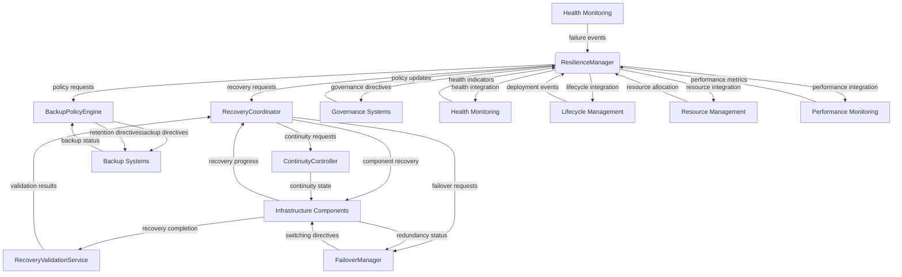
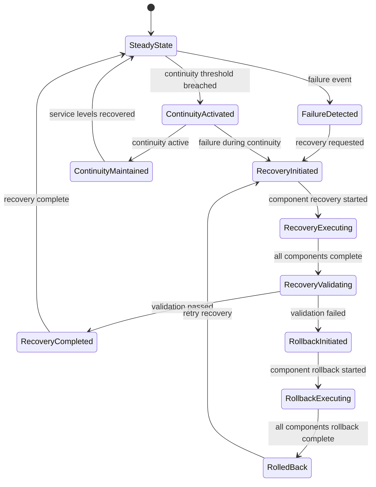
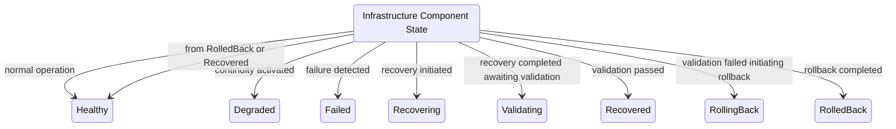
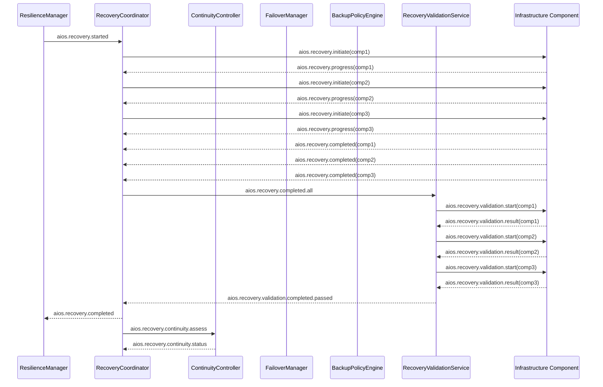
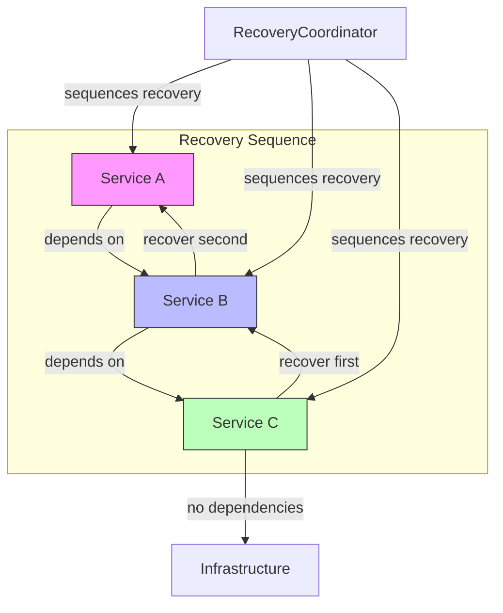
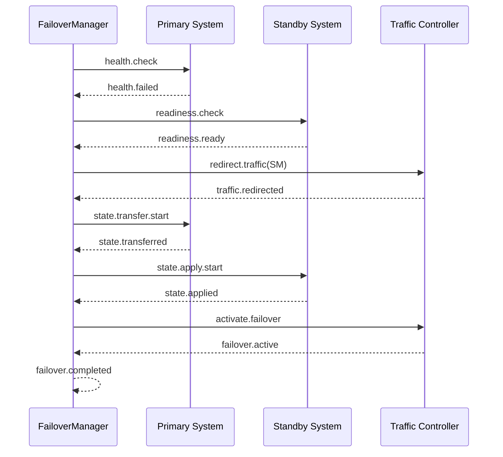

# 9.19 Infrastructure Resilience and Disaster Recovery

## Purpose
This section defines the architectural framework for infrastructure resilience, fault tolerance, service continuity, recovery orchestration, recovery validation, and disaster recovery coordination within the AI-OS. It establishes the structural and behavioral contracts necessary to ensure system recovery from failures while maintaining service guarantees and data integrity.

## Scope
The scope encompasses all infrastructure-layer mechanisms required to detect failures, initiate recovery sequences, manage service continuity, validate recovery outcomes, and coordinate disaster recovery processes. It applies to all system components, services, and data stores participating in resilience and recovery operations.

## Architectural Goals
The infrastructure resilience architecture SHALL:
- Provide automated detection and response to infrastructure failures
- Ensure recovery orchestration respects service dependencies and priorities
- Maintain service continuity through graceful degradation and failover mechanisms
- Guarantee recovery consistency and correctness through validation processes
- Support policy-driven backup and retention management
- Enable verifiable disaster recovery with measurable recovery time and point objectives
- Integrate with health monitoring, governance, and lifecycle management systems
- Provide observable recovery processes for auditing and compliance

## Architecture Overview
The resilience architecture consists of six tightly coupled architectural components that operate in concert to provide end-to-end recovery capabilities. These components form a cohesive resilience framework that interfaces with system health monitors, policy engines, and external coordination systems. The architecture employs event-driven communication via a dedicated recovery event bus to ensure loose coupling and asynchronous coordination.

## Internal Architecture

### ResilienceManager
#### Purpose
Orchestrates the overall resilience lifecycle, manages resilience policies, and coordinates resilience-related activities across the infrastructure.

#### Responsibilities
- Manage resilience policy lifecycle and versioning.
- Coordinate resilience initialization and shutdown sequences.
- Monitor infrastructure health indicators for resilience triggers.
- Maintain resilience state and configuration.
- Interface with governance and policy management systems.

#### Operations
- Evaluate resilience policies against current infrastructure state.
- Initiate resilience procedures based on policy evaluations.
- Coordinate resilience component interactions.
- Persist resilience configuration and state.
- Report resilience status to monitoring systems.

#### Inputs
- Resilience policies from policy management systems.
- Health indicators from monitoring systems.
- Infrastructure configuration and topology data.
- Governance directives and compliance requirements.

#### Outputs
- Resilience coordination events on the recovery event bus.
- Updated resilience state and configuration.
- Resilience status indicators.
- Policy compliance reports.

#### Preconditions
- Infrastructure topology and configuration data available.
- Resilience policies loaded and validated.
- Monitoring systems operational and reporting health indicators.

#### Postconditions
- Resilience state reflects current policy evaluations.
- Resilience coordination mechanisms activated.
- Resilience status reported to monitoring systems.

#### Error Conditions
- Policy evaluation failures due to invalid or conflicting policies.
- Coordination failures when resilience components are unavailable.
- State persistence failures during configuration updates.
- Monitoring data inconsistencies or timeouts.

#### Behavioural Guarantees
- ResilienceManager SHALL ensure atomic policy evaluation and application.
- ResilienceManager SHALL maintain resilience state consistency across coordination boundaries.
- ResilienceManager SHALL guarantee exactly-once execution of resilience initialization procedures.
- ResilienceManager SHALL provide timely resilience status updates within bounded intervals.

### RecoveryCoordinator
#### Purpose
Orchestrates recovery sequencing, manages dependency-aware recovery execution, and coordinates recovery activities across infrastructure components.

#### Responsibilities
- Determine recovery execution order based on service dependencies.
- Coordinate recovery initiation and execution across components.
- Manage recovery resource allocation and contention.
- Track recovery progress and status.
- Interface with failover and continuity management systems.

#### Operations
- Analyze service dependency graphs to determine recovery sequence.
- Initiate recovery procedures for designated components.
- Coordinate recovery resource allocation and scheduling.
- Monitor recovery execution and handle execution failures.
- Coordinate recovery completion and cleanup activities.

#### Inputs
- Recovery plans and procedures from policy systems.
- Service dependency maps and topology information.
- Failure notifications and impact assessments.
- Recovery resource availability and capacity data.
- Continuity status and failover state.

#### Outputs
- Recovery initiation events on the recovery event bus.
- Recovery progress and status updates.
- Recovery completion notifications.
- Resource allocation and utilization reports.
- Recovery failure alerts and escalations.

#### Preconditions
- Failure detection and impact assessment completed.
- Recovery plans validated and available.
- Dependency maps current and accurate.
- Recovery resources provisioned and accessible.

#### Postconditions
- Recovery sequencing determined and initiated.
- Recovery progress tracked and reported.
- Resource allocation coordinated across recovery activities.
- Recovery completion or failure status communicated.

#### Error Conditions
- Dependency resolution failures due to circular or missing dependencies.
- Resource contention preventing recovery initiation.
- Component recovery failures exceeding retry thresholds.
- Coordination timeouts during recovery execution.
- Invalid or corrupted recovery procedures.

#### Behavioural Guarantees
- RecoveryCoordinator SHALL ensure recovery execution follows dependency-defined sequencing.
- RecoveryCoordinator SHALL guarantee recovery resource allocation fairness and deadlock avoidance.
- RecoveryCoordinator SHALL provide bounded-time recovery progress reporting.
- RecoveryCoordinator SHALL ensure exactly-once execution of recovery initiation for each component.
- RecoveryCoordinator SHALL guarantee consistency of all recovery checkpoints owned by its managed components.
- RecoveryCoordinator SHALL ensure proper lifecycle management of all recovery checkpoints, including creation, validation, and retention.
- RecoveryCoordinator SHALL ensure recovery determinism, allowing for repeatable recovery processes.
- RecoveryCoordinator SHALL guarantee the auditability of all recovery actions and state changes.

### ContinuityController
#### Purpose
Manages service continuity, graceful degradation, and validates continuity state during adverse conditions.

#### Responsibilities
- Monitor service levels and initiate continuity procedures.
- Manage graceful degradation transitions based on service level objectives.
- Validate continuity state and service capability maintenance.
- Track continuity activation and restoration states.
- Coordinate with failover and recovery systems for continuity management.

#### Operations
- Evaluate service metrics against continuity thresholds.
- Initiate continuity procedures when service levels degrade.
- Manage resource reallocation for continuity maintenance.
- Validate continuity state and service capability preservation.
- Coordinate continuity restoration when service levels recover.
- Interface with recovery systems for continuity-to-recovery transitions.

#### Inputs
- Service level metrics and performance indicators.
- Continuity policies and service level objectives.
- Resource availability and capacity data.
- Failure impact assessments and service degradation notifications.
- Recovery state and coordination signals.

#### Outputs
- Continuity activation and restoration events on the recovery event bus.
- Continuity state and capability reports.
- Resource reallocation directives.
- Continuity validation results and compliance status.
- Service level objective adherence metrics.

#### Preconditions
- Service monitoring operational and reporting metrics.
- Continuity policies loaded and validated.
- Resource management systems accessible.
- Service capability and dependency information available.

#### Postconditions
- Continuity state accurately reflects current service capability.
- Continuity procedures initiated or terminated as appropriate.
- Resource allocations adjusted to maintain continuity objectives.
- Continuity validation results reported to monitoring systems.

#### Error Conditions
- Continuity threshold evaluation failures due to invalid metrics.
- Resource allocation failures preventing continuity maintenance.
- Continuity validation inconsistencies or false positives/negatives.
- Coordination failures with recovery or failover systems.
- Policy conflicts between continuity and recovery objectives.

#### Behavioural Guarantees
- ContinuityController SHALL ensure continuity activation within bounded time of threshold breach.
- ContinuityController SHALL guarantee graceful degradation preserves critical service capabilities.
- ContinuityController SHALL provide validated continuity state within bounded intervals.
- ContinuityController SHALL ensure continuity restoration occurs when service levels recover.

### FailoverManager
#### Purpose
Coordinates failover and failback operations, manages redundancy, and executes continuity switching between primary and secondary systems.

#### Responsibilities
- Manage failover initiation, execution, and completion.
- Coordinate failback procedures when primary systems recover.
- Maintain redundancy configurations and standby system readiness.
- Execute continuity switching between active and standby systems.
- Track failover/failback progress and status.

#### Operations
- Evaluate failover triggers based on failure detection and policies.
- Initiate failover procedures for designated systems.
- Coordinate failover execution including state transfer and service redirection.
- Manage failback procedures when primary systems become available.
- Validate redundancy readiness and standby system preparedness.
- Interface with continuity and recovery systems for switching coordination.

#### Inputs
- Failure detection notifications and impact assessments.
- Failover policies and redundancy configurations.
- Standby system status and readiness indicators.
- Primary system health and recovery progress.
- Continuity state and service level requirements.

#### Outputs
- Failover initiation and completion events on the recovery event bus.
- Failback initiation and completion events.
- Redundancy status and readiness reports.
- Service redirection and switching directives.
- Failover/failback progress and status updates.
- Resource utilization and switching performance metrics.

#### Preconditions
- Failure detection and impact assessment completed.
- Redundancy configurations validated and available.
- Standby systems provisioned and synchronized.
- Failover policies loaded and applicable.
- Continuity state evaluated for switching requirements.

#### Postconditions
- Failover or failback execution completed as appropriate.
- Service traffic redirected to appropriate systems.
- Redundancy configurations updated to reflect new active/standby assignments.
- Switching progress and status reported to monitoring systems.

#### Error Conditions
- Failover trigger evaluation failures due to invalid or missing data.
- Standby system unavailability or synchronization failures.
- State transfer failures during failover execution.
- Service redirection failures causing service disruption.
- Failback conflicts when primary systems not fully recovered.
- Resource contention during switching operations.

#### Behavioural Guarantees
- FailoverManager SHALL ensure failover initiation within bounded time of trigger detection.
- FailoverManager SHALL guarantee service redirection completeness before failover completion.
- FailoverManager SHALL provide validated standby readiness prior to failover initiation.
- FailoverManager SHALL ensure failback execution only when primary systems meet recovery criteria.

### BackupPolicyEngine
#### Purpose
Evaluates backup policies, enforces recovery point and retention policies, and manages backup policy lifecycle.

#### Responsibilities
- Evaluate backup policies against current infrastructure state.
- Enforce recovery point objectives (RPO) and retention policies.
- Manage backup policy versioning and lifecycle.
- Coordinate backup initiation with backup systems.
- Validate backup compliance and policy adherence.

#### Operations
- Assess backup requirements based on data change rates and RPO.
- Initiate backup procedures when recovery point thresholds are exceeded.
- Enforce retention policies by initiating backup expiration and cleanup.
- Validate backup completeness and recoverability.
- Interface with backup systems and storage management.

#### Inputs
- Backup policies and recovery point objectives.
- Data change rates and modification indicators.
- Retention policies and legal hold requirements.
- Backup system status and capacity availability.
- Storage tier performance and cost characteristics.

#### Outputs
- Backup initiation events on the recovery event bus.
- Backup compliance and adherence reports.
- Retention policy enforcement actions.
- Backup completion and verification results.
- Storage utilization and cost optimization recommendations.

#### Preconditions
- Backup policies loaded and validated.
- Data change monitoring operational and reporting.
- Backup systems accessible and configured.
- Storage resources provisioned and monitored.
- Retention policies and compliance requirements defined.

#### Postconditions
- Backup procedures initiated according to policy evaluations.
- Retention policies enforced through backup lifecycle management.
- Backup compliance status reported to governance systems.
- Storage utilization optimized according to policy objectives.

#### Error Conditions
- Backup policy evaluation failures due to invalid or conflicting policies.
- Backup initiation failures due to system unavailability or resource constraints.
- Retention policy enforcement failures due to legal hold conflicts.
- Backup validation failures indicating incomplete or corrupt backups.
- Storage capacity exhaustion preventing backup operations.

#### Behavioural Guarantees
- BackupPolicyEngine SHALL ensure backup initiation within bounded time of RPO threshold breach.
- BackupPolicyEngine SHALL guarantee retention policy enforcement without violating legal holds.
- BackupPolicyEngine SHALL provide validated backup compliance status within bounded intervals.
- BackupPolicyEngine SHALL ensure backup completion verification before policy compliance reporting.

### RecoveryValidationService
#### Purpose
Verifies recovery correctness, validates consistency, checks checkpoints, and ensures post-recovery conformance to service requirements.

#### Responsibilities
- Validate recovery completeness and correctness.
- Checkpoint validation and consistency verification.
- Post-recovery service conformance assessment.
- Recovery verification reporting and certification.
- Interface with audit and compliance systems for recovery validation.

#### Operations
- Validate recovered data consistency and integrity.
- Verify service functionality and performance after recovery.
- Checkpoint validation against consistency requirements.
- Assess recovery against service level objectives and recovery time objectives.
- Generate recovery validation reports and certifications.
- Coordinate with audit systems for recovery compliance verification.

#### Inputs
- Recovery completion notifications and recovery state.
- Recovered data and system state for validation.
- Consistency requirements and validation policies.
- Service level objectives and recovery time objectives.
- Audit and compliance requirements for recovery verification.

#### Outputs
- Recovery validation events on the recovery event bus.
- Validation reports and compliance certifications.
- Consistency verification results and discrepancies.
- Service conformance assessment and performance metrics.
- Recovery validation failures and remediation recommendations.

#### Preconditions
- Recovery completion notifications received.
- Recovered systems and data accessible for validation.
- Validation policies and consistency requirements loaded.
- Service level objectives and recovery time objectives defined.
- Audit and compliance interfaces available.

#### Postconditions
- Recovery validation completed and results reported.
- Validation reports and certifications generated.
- Consistency verification performed and reported.
- Service conformance assessed against objectives.
- Recovery validation status communicated to stakeholders.

#### Error Conditions
- Validation failures due to inconsistent or corrupt recovered data.
- Service functionality verification failures after recovery.
- Checkpoint validation failures indicating invalid recovery points.
- Performance validation failures exceeding recovery time objectives.
- Audit interface failures preventing validation reporting.

#### Behavioural Guarantees
- RecoveryValidationService SHALL ensure validation initiation within bounded time of recovery completion.
- RecoveryValidationService SHALL guarantee validation completeness before recovery certification.
- RecoveryValidationService SHALL provide validated recovery status within bounded intervals.
- RecoveryValidationService SHALL ensure validation reports include all required consistency and conformance checks.

## Architecture Topics
The architecture defines the following topics:

### Infrastructure Resilience Model
Defines the conceptual model for infrastructure resilience including failure domains, fault containment, and recovery boundaries.

### Architectural Availability Model
Specifies the architectural availability model for service availability including uptime calculations, availability classes, and availability commitments.

### Recovery Model
Describes the recovery model including recovery types (restart, restore, replay), recovery granularity, and recovery scope definitions.

### Recovery Lifecycle
Defines the states and transitions of the recovery lifecycle including initiation, execution, validation, completion, and closure.

### Recovery Orchestration
Details the mechanisms for coordinating recovery actions across components including sequencing, dependency management, and resource allocation.

### Recovery Coordination
Specifies the communication protocols, event patterns, and state sharing mechanisms for recovery coordination.

### Recovery Policies
Defines the policy language and structure for defining recovery objectives, procedures, constraints, and priorities.

### Recovery Prioritization
Describes the mechanisms for assigning recovery priorities based on service criticality, dependencies, and business impact.

### Recovery Sequencing
Details the architectural policies and constraints for determining recovery execution order based on dependency graphs and priority levels.

### Dependency Recovery
Specifies the architectural policies for recovering interdependent services while maintaining consistency and correctness. The architecture SHALL ensure dependency preservation, guaranteeing that all inter-service relationships are maintained during and after recovery operations.

### Recovery Validation
Defines the validation processes for verifying recovery correctness, consistency, and conformance to objectives. The architecture SHALL provide strong guarantees for checkpoint validity, ensuring that all recovery checkpoints are verifiable and suitable for restoration. The recovery validation service SHALL ensure the comprehensive assessment of all recovered states.

### Recovery Verification
Details the verification procedures for confirming recovery success against predefined criteria. The verification scope SHALL encompass all recovered components and data. Verification criteria SHALL be derived directly from service level objectives and recovery policies, ensuring objective and measurable outcomes. Verification completeness SHALL be guaranteed through exhaustive checks across all defined criteria. Verification evidence SHALL be automatically collected and securely stored for auditing and compliance purposes.

### Recovery Checkpoints
Describes the architectural mechanisms for creating consistent recovery points including frequency, consistency guarantees, and storage. The architecture SHALL define clear ownership and lifecycle management for all recovery checkpoints, from creation to retention and eventual deletion. Checkpoint validity SHALL be guaranteed through robust architectural policies.

### Recovery Rollback
Specifies the architectural procedures for reverting to previous consistent states when recovery validation fails. The architecture SHALL ensure recovery auditability for all rollback operations, providing a complete and immutable record of actions.

### Recovery Consistency
Defines the consistency models and guarantees for recovered state including strong, eventual, and application-level consistency. The architecture SHALL guarantee state convergence after recovery, ensuring that the system reaches a consistent and operational state.

### Graceful Degradation
Details the mechanisms for reducing service functionality while maintaining critical capabilities during adverse conditions.

### Failure Domains
Defines the isolation boundaries for failure containment including physical, logical, and service-level failure domains.

### Fault Containment
Specifies the mechanisms for containing failures within defined boundaries to prevent cascading failures.

### Recovery Observability
Details the instrumentation, logging, and monitoring requirements for recovery processes including tracing and metrics.

### Recovery Auditing
Specifies the audit trail requirements for recovery operations including immutable logging and compliance reporting.

### Recovery Security
Defines the security requirements for recovery operations including access controls, encryption, and secure recovery procedures.

### Governance Integration
Details the interfaces with governance systems for policy enforcement, compliance reporting, and audit integration.

### Health Integration
Specifies the interfaces with health monitoring systems for failure detection, health indicators, and recovery triggering.

### Lifecycle Integration
Describes the integration with system lifecycle management for recovery-aware deployment, scaling, and decommissioning.

### Resource Integration
Details the integration with resource management systems for recovery-aware resource allocation, provisioning, and deprovisioning.

### Performance Integration
Specifies the integration with performance monitoring systems for recovery performance validation and optimization.

### Recovery Extensibility
Defines the mechanisms for extending recovery capabilities with custom recovery procedures and validation checks.

### Recovery Compatibility
Specifies the compatibility requirements for recovery operations across different infrastructure versions and configurations.

### Global Recovery Guarantees
Describes the system-wide guarantees for recovery including maximum recovery time, maximum data loss, and recovery correctness. The architecture SHALL ensure global policy consistency across all recovery components and processes.

## Runtime Behaviour
### System Initialization
During system initialization, the ResilienceManager SHALL load and validate resilience policies, initialize recovery coordination mechanisms, and establish connections with health monitoring and governance systems. The RecoveryCoordinator SHALL initialize recovery sequencing coordination strategies and load dependency maps. The ContinuityController SHALL activate continuity monitoring based on service level objectives. The FailoverManager SHALL validate redundancy configurations and standby system readiness. The BackupPolicyEngine SHALL load backup and retention policies and initiate initial backup compliance assessment. The RecoveryValidationService SHALL load validation policies and prepare verification mechanisms.

### Steady-State Resilience
In steady-state operation, the ResilienceManager SHALL continuously evaluate resilience policies against infrastructure health indicators. The RecoveryCoordinator SHALL maintain readiness for recovery initiation. The ContinuityController SHALL monitor service levels and initiate graceful degradation when thresholds are breached. The FailoverManager SHALL monitor standby system readiness and primary system health. The BackupPolicyEngine SHALL evaluate backup requirements and initiate backups according to recovery point objectives. The RecoveryValidationService SHALL remain idle awaiting recovery completion notifications.

### Failure Detection Interaction
Failure detection mechanisms SHALL publish failure events on the health event bus. The ResilienceManager SHALL subscribe to these events and evaluate them against resilience policies. Upon determining a failure requires recovery initiation, the ResilienceManager SHALL publish a recovery initiation request on the recovery event bus. The RecoveryCoordinator SHALL subscribe to these requests and begin recovery orchestration.

### Recovery Initiation
Upon receiving a recovery initiation request, the RecoveryCoordinator SHALL analyze the failure impact and service dependencies to determine the recovery sequence. It SHALL then publish component-specific recovery initiation events on the recovery event bus. Each infrastructure component SHALL subscribe to these events and begin its local recovery procedures.

### Recovery Coordination
The RecoveryCoordinator SHALL coordinate recovery execution by tracking recovery progress reports from components. It SHALL manage resource allocation for recovery activities and handle recovery failures according to architectural policies. The ContinuityController SHALL monitor service levels during recovery and may activate continuity procedures. The FailoverManager MAY initiate failover procedures if recovery involves switching to standby systems.

### Dependency Recovery
The RecoveryCoordinator SHALL utilize dependency maps to ensure that dependent services are recovered before services that depend on them. It SHALL track recovery readiness of dependencies and delay recovery initiation for dependent services until their dependencies report recovery completion. This ensures the architectural guarantee of dependency preservation.

### Recovery Validation
Upon receiving recovery completion notifications from components, the RecoveryValidationService SHALL initiate validation procedures. It SHALL validate recovered data consistency, verify service functionality, and check against recovery time and point objectives. Validation results SHALL be published on the recovery event bus. The architecture SHALL provide strong guarantees for checkpoint validity and recovery consistency through these validation processes.

### Recovery Rollback
If recovery validation fails, the RecoveryValidationService SHALL publish a rollback request. The RecoveryCoordinator SHALL initiate rollback procedures by sequencing component rollbacks in reverse dependency order. Components SHALL execute local rollback procedures to restore to pre-recovery checkpoints, ensuring recovery determinism and auditability.

### Recovery Completion
When all components report recovery completion and validation passes, the RecoveryCoordinator SHALL publish a recovery completion event. The ContinuityController SHALL assess whether continuity procedures can be terminated. The FailoverManager SHALL evaluate whether failback can be initiated. The BackupPolicyEngine SHALL resume normal backup scheduling.

### Graceful Shutdown
During graceful shutdown, the ResilienceManager SHALL initiate resilience shutdown procedures. The RecoveryCoordinator SHALL ensure no active recovery operations persist. The ContinuityController SHALL terminate continuity procedures and restore normal service levels. The FailoverManager SHALL prepare standby systems for shutdown. The BackupPolicyEngine SHALL complete pending backups and disable backup scheduling. The RecoveryValidationService SHALL complete any pending validations.

## EventBus
### Namespace
aios.recovery.*

### Events
- aios.recovery.started - Published when recovery orchestration begins.
- aios.recovery.completed - Published when all recovery components report completion.
- aios.recovery.failed - Published when recovery validation fails or recovery encounters unrecoverable errors.
- aios.recovery.rollback.started - Published when rollback procedures begin.
- aios.recovery.rollback.completed - Published when rollback procedures complete successfully.
- aios.recovery.continuity.activated - Published when graceful degradation procedures are initiated.
- aios.recovery.continuity.restored - Published when normal service levels are restored after continuity activation.
- aios.recovery.failover.started - Published when failover procedures begin.
- aios.recovery.failover.completed - Published when failover procedures complete and service is redirected.
- aios.recovery.failover.failed - Published when failover procedures encounter unrecoverable errors.
- aios.recovery.failback.started - Published when failback procedures begin.
- aios.recovery.failback.completed - Published when failback procedures complete and service is redirected to primary.
- aios.recovery.validation.completed - Published when recovery validation procedures finish.
- aios.recovery.validation.passed - Published when recovery validation succeeds.
- aios.recovery.validation.failed - Published when recovery validation fails.
- aios.recovery.checkpoint.created - Published when a consistent recovery checkpoint is established.
- aios.recovery.checkpoint.verified - Published when a recovery checkpoint passes verification.
- aios.recovery.backup.initiated - Published when backup procedures begin.
- aios.recovery.backup.completed - Published when backup procedures finish.
- aios.recovery.backup.verified - Published when backup verification succeeds.
- aios.recovery.backup.failed - Published when backup procedures encounter errors.
- aios.recovery.retention.enforced - Published when retention policy actions are executed.
- aios.recovery.compliance.verified - Published when recovery compliance verification completes.

## Mermaid
### Overall Resilience Architecture

### Recovery Lifecycle

### Recovery State Machine

### Recovery Coordination

### Dependency Recovery

### Failover Interaction

## JSON Schemas
- shared/RecoveryPolicy.json - Defines the structure for recovery policies including RPO, RTO, procedures, and priorities.
- shared/RecoveryPlan.json - Specifies recovery plans including procedures, dependencies, and resource requirements.
- shared/RecoveryState.json - Defines the state model for tracking recovery progress and component status.
- shared/ContinuityProfile.json - Specifies continuity profiles including service levels, degradation levels, and activation criteria.
- shared/RecoveryValidation.json - Defines validation criteria including consistency checks, service verification, and performance thresholds.

## Include
### Architectural Contracts
- ResilienceManager SHALL provide a consistent interface for resilience policy management.
- RecoveryCoordinator SHALL guarantee dependency-aware recovery sequencing, dependency preservation, and recovery determinism.
- ContinuityController SHALL ensure graceful degradation preserves minimum service capabilities.
- FailoverManager SHALL guarantee service redirection completeness before failover completion.
- BackupPolicyEngine SHALL enforce recovery point and retention policies without violation.
- RecoveryValidationService SHALL guarantee recovery validation completeness before certification, ensuring checkpoint validity, consistency, and post-recovery conformance.

### Runtime Invariants
- Recovery Observability: All recovery processes MUST be fully observable, providing comprehensive tracing, logging, and metrics.
- Recovery Audit Integrity: An immutable and complete audit trail MUST be maintained for all recovery operations and policy changes.
- Recovery Policy Determinism: Recovery operations MUST be driven by deterministic architectural policies, ensuring consistent outcomes for identical failure conditions.
- Recovery State Convergence: After any recovery operation, the system state MUST converge to a defined consistent and operational state.
- Recovery Event Ordering: Events on the recovery event bus MUST maintain strict causal ordering to ensure correct coordination.
- Recovery Consistency: Recovered state MUST maintain application-level consistency as defined by consistency policies.
- Recovery Ordering: Recovery execution MUST follow dependency-defined sequencing with no violations.
- Dependency Integrity: Dependencies between services MUST be maintained throughout recovery and rollback.
- Checkpoint Integrity: Recovery checkpoints MUST be verifiable and restorable to a consistent state, with clear ownership and lifecycle management.
- Continuity Consistency: Service capability during continuity MUST meet minimum defined thresholds.
- Recovery Validation: Recovery validation MUST complete before recovery certification.
- Failover Consistency: Failover execution MUST preserve session state and transactional integrity.
- Recovery Security: Recovery operations MUST maintain access controls and encryption requirements.
- Recovery Policy Consistency: Recovery policies MUST be internally consistent and non-conflicting.
- Recovery State Consistency: Recovery state reporting MUST be consistent across all coordination components.
- Recovery Validation Completeness: Recovery validation SHALL comprehensively assess all defined criteria before reporting completion or certification.

### Failure Handling
- Infrastructure failures SHALL trigger resilience evaluation within a bounded time.
- Recovery initiation SHALL occur only after failure impact assessment.
- Recovery failures SHALL trigger rollback procedures after configurable retry thresholds.
- Validation failures SHALL trigger incident management and manual intervention procedures.
- Continuity activation SHALL occur when service levels fall below defined thresholds.
- Failover initiation SHALL require validated standby readiness.
- Rollback procedures SHALL execute in reverse dependency order.
- System SHALL maintain audit trails for all failure and recovery operations.

### Recovery
- Recovery procedures SHALL be idempotent where possible.
- Recovery SHALL prioritize critical services based on business impact analysis.
- Recovery SHALL minimize data loss through recovery point objective enforcement.
- Recovery SHALL minimize downtime through recovery time objective enforcement.
- Recovery SHALL validate correctness before service restoration.
- Recovery SHALL support both automated and manual recovery initiation.
- Recovery SHALL provide progressive recovery status reporting.
- Recovery SHALL guarantee checkpoint validity, ownership, and proper lifecycle management.
- Recovery SHALL ensure dependency preservation across all recovered components.
- Recovery SHALL ensure state convergence to a consistent operational state.
- Recovery SHALL ensure determinism, allowing for verifiable and repeatable recovery processes.
- Recovery SHALL provide complete auditability of all recovery actions.
- Recovery SHALL ensure global policy consistency across all recovery components.

### Conformance Requirements
- All recovery components SHALL conform to the recovery event bus interface.
- Recovery policies SHALL be evaluable against infrastructure state.
- Recovery validation SHALL be performant enough to meet recovery time objectives.
- Backup procedures SHALL be non-blocking where possible.
- Continuity procedures SHALL maintain service level objectives for critical functions.
- Failover procedures SHALL preserve existing sessions where technically feasible.

### Cross References
- See Section 9.17 for health monitoring integration details.
- See Section 9.15 for governance and policy management interfaces.
- See Section 9.13 for resource management integration specifications.
- See Section 9.11 for lifecycle management integration points.
- See Section 9.9 for performance monitoring integration requirements.

### ADR References
- ADR-009: Recovery Event Bus Design
- ADR-012: Dependency-Aware Recovery Sequencing
- ADR-015: Continuity Threshold Hysteresis
- ADR-021: Backup Policy Language Specification
- ADR-027: Recovery Validation Framework

## Summary
This section establishes the architectural foundation for infrastructure resilience and disaster recovery in AI-OS. The six architectural components provide a comprehensive framework for failure detection, recovery orchestration, service continuity, failover management, backup policy enforcement, and recovery validation. The architecture ensures recovery correctness through dependency-aware sequencing, validates outcomes through comprehensive verification procedures, and maintains service guarantees through continuity and failover mechanisms. The event-driven design enables loose coupling and asynchronous coordination while the policy-driven approach ensures alignment with business objectives and compliance requirements.