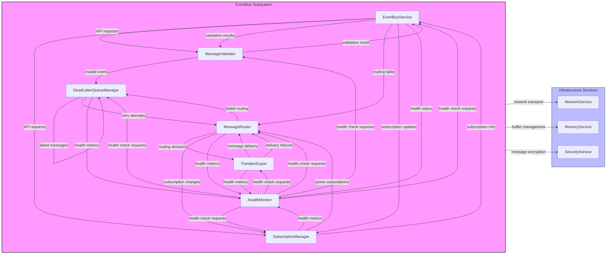
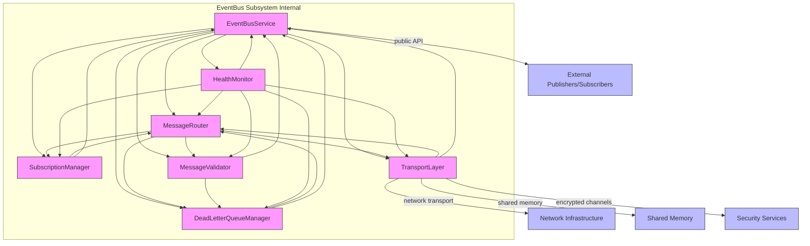
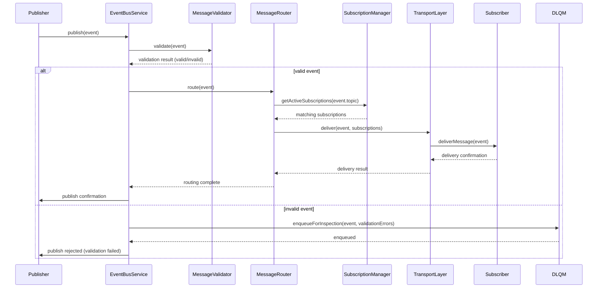
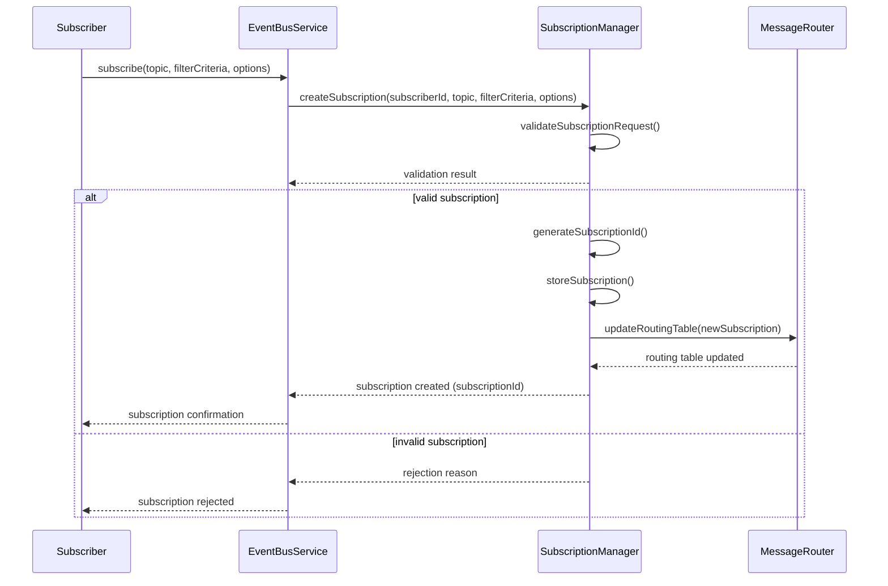
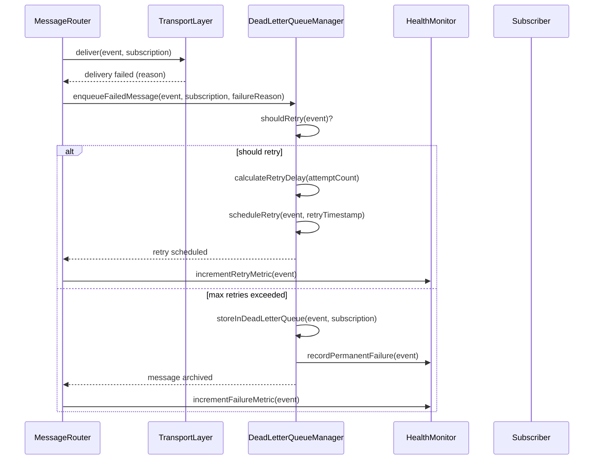
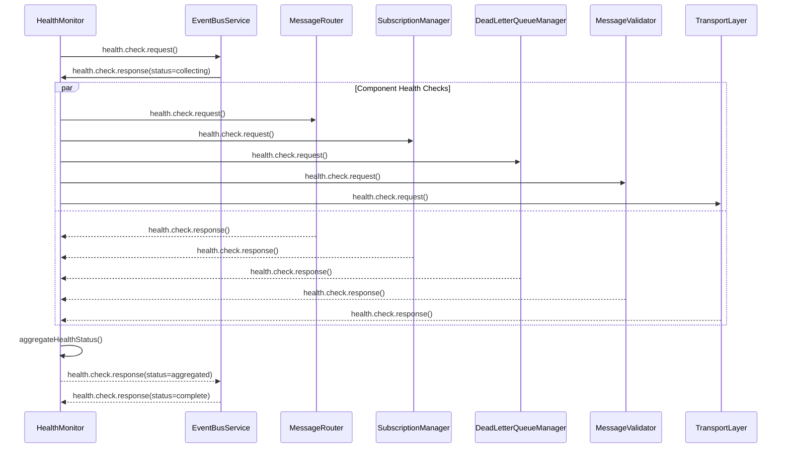
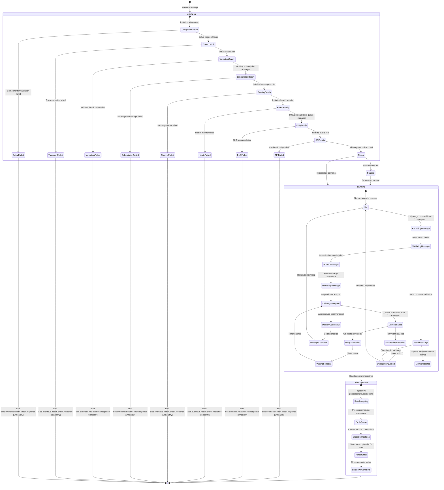

# 9.2 EventBus Subsystem Architecture

## Overview
The EventBus subsystem provides guaranteed event delivery, correlation tracking, and causation tracking as the universal communication backbone of AI-OS, implementing the EventBus contract defined in PART9_CONTEXT.md §13.2. Rather than reimplementing messaging infrastructure principles, it focuses on coordinating specialized components (MessageRouter, SubscriptionManager, etc.) while enforcing cross-cutting concerns: ordered delivery per correlation ID (EB-9.1), at-least-once delivery (EB-9.2), causation tracking (EB-9.3), and schema validation (EB-9.5) through EventBus-mediated interactions.

## Responsibilities
The EventBus subsystem implements these specific functions in accordance with PART9_CONTEXT.md:
- **Message Routing Agent**: Deterministically routes events to subscribers based on topic and filter criteria, enforcing ordering guarantees per EB-9.1
- **Subscription Manager**: Manages lifecycle of event subscriptions including creation, modification, and deletion, maintaining subscription catalog
- **Message Validator**: Validates all events against JSON Schema Draft 2020-12 before publication, enforcing EB-9.5
- **Delivery Guarantee Enforcer**: Ensures at-least-once delivery with retry mechanisms and dead letter queue handling, implementing EB-9.2
- **Correlation Tracker**: Maintains correlationId and causationId for end-to-end traceability, implementing EB-9.3 and EB-9.4
- **Dead Letter Queue Manager**: Handles repeatedly failing events for inspection and manual intervention
- **Health Monitor**: Provides health checks and metrics for EventBus subsystem components, responding within INV-RT-9.8 bounds
- **Schema Evolution Handler**: Manages backward and forward compatible schema changes per EB-9.11

## 1. INTERNAL EVENTBUS ARCHITECTURE
The EventBus subsystem implements a modular architecture where each component has clear ownership, well-defined interfaces, and specific lifecycle management, adhering to the Separation of Concerns principle (PART9_CONTEXT.md §86).

### Component Hierarchy
- **EventBusService**: Owns the EventBus lifecycle, coordinates all subsystem components, and provides the public API for event publication and subscription. Owns: EventBus initialization, component coordination, public interface. Interfaces with: All subsystem components, Infrastructure Services for underlying transport. Lifecycle: Active throughout kernel operation.
- **MessageRouter**: Owns deterministic message routing logic, translates routing requests to underlying transport while preserving ordering guarantees per EB-9.1. Owns: Routing table management, filter evaluation, message dispatch. Interfaces with: SubscriptionManager for active subscriptions, TransportLayer for actual message delivery. Lifecycle: Active throughout EventBus operation.
- **SubscriptionManager**: Owns subscription lifecycle management, validates subscription requests against shared/Subscription.json, maintains active subscription catalog. Owns: Subscription creation, modification, deletion, validation. Interfaces with: MessageRouter for routing updates, EventBusService for API exposure. Lifecycle: Active throughout EventBus operation.
- **DeadLetterQueueManager**: Owns dead letter queue lifecycle, manages failed message handling per EB-9.6, provides inspection interface. Owns: Failed message storage, retry logic with exponential backoff, manual intervention interface. Interfaces with: MessageRouter for failed message routing, HealthMonitor for failure metrics. Lifecycle: Active throughout EventBus operation.
- **MessageValidator**: Owns schema validation logic, validates all incoming events against shared/EventEnvelope.json. Owns: Schema validation, error reporting, schema caching. Interfaces with: EventBusService for validation requests, shared schema repository. Lifecycle: Active throughout EventBus operation.
- **TransportLayer**: Owns actual message transportation, provides pluggable transport mechanisms (in-process, TCP, shared memory) as infrastructure abstractions. Owns: Message serialization/deserialization, network communication, connection management. Interfaces with: MessageRouter for message dispatch, Infrastructure Services for low-level transport. Lifecycle: Active throughout EventBus operation.
- **HealthMonitor**: Owns health checking functionality, executes health checks within bounded time per INV-RT-9.8, provides metrics and diagnostic information. Owns: Health check execution, metric collection, failure reporting. Interfaces with: All subsystem components for health status, Infrastructure Services for system metrics. Lifecycle: Active throughout EventBus operation.

### Interaction Patterns
Components interact through these patterned interfaces, maintaining EventBus-first communication:

**Event Publication Flow**: Publisher → EventBusService (API) → MessageValidator (schema validation per EB-9.5) → MessageRouter (routing determination) → TransportLayer (actual delivery) → Subscribers

**Subscription Management Flow**: Subscriber → EventBusService (API) → SubscriptionManager (validation & storage) → MessageRouter (routing table update) → EventBusService (confirmation)

**Failed Message Handling**: MessageRouter (delivery failure) → DeadLetterQueueManager (storage & retry logic) → HealthMonitor (metrics update) → Manual Intervention (if retry exhausted)

**Health Monitoring Flow**: HealthMonitor → All Components (health queries) → Component Responses → HealthMonitor (aggregated health status)

**Schema Validation Flow**: EventBusService → MessageValidator (schema check) → Validation Result → EventBusService (accept/reject decision)

## 2. TRANSPORT LAYER
The TransportLayer provides an abstracted interface for message transportation, supporting pluggable transport mechanisms while maintaining ordering guarantees and reliability properties.

### Transport Abstraction
The TransportLayer implements a pluggable architecture supporting multiple transport mechanisms:
- **In-process Transport**: For co-located components within the same process space
- **TCP Transport**: For network-based communication between distributed components
- **Shared Memory Transport**: For high-performance IPC within the same machine
- **RDMA Transport**: For zero-copy, low-latency communication (when hardware supports it)

Each transport implements the TransportInterface:
```typescript
interface TransportInterface {
  initialize(config: TransportConfig): Promise<void>;
  publish(message: SerializedMessage, destination: TransportDestination): Promise<SendResult>;
  subscribe(subscription: Subscription, handler: MessageHandler): Promise<SubscriptionHandle>;
  unsubscribe(handle: SubscriptionHandle): Promise<void>;
  shutdown(): Promise<void>;
  getHealthStatus(): TransportHealthStatus;
}
```

**Deterministic Behaviour Requirement**: ALL TransportLayer implementations MUST preserve deterministic behaviour by maintaining message ordering per correlation ID and ensuring reproducible sequence number assignment.

### Serialization
Messages are serialized using a deterministic, versioned format:
- **Format**: Deterministic versioned binary serialization
- **Schema Versioning**: Each message includes a schema version in its envelope
- **Backward Compatibility**: Consumers can read messages from older schema versions
- **Forward Compatibility**: Producers can write messages readable by newer consumers (within compatibility bounds)
- **Deterministic Encoding**: Field ordering and encoding are strictly defined to ensure bit-identical replays

### Batching
The TransportLayer implements intelligent batching to improve throughput while preserving ordering:
- **Batch Formation**: Messages with same correlationId are batched together
- **Batch Triggers**: Time-based (1ms window) or count-based (100 messages)
- **Order Preservation**: Within-batch ordering is strictly maintained
- **Failure Atomicity**: Entire batch succeeds or fails as a unit
- **Backpressure Awareness**: Batch size adapts based on receiver credit

### Ordering Preservation
Ordering guarantees are maintained through:
- **Sequence Numbers**: Per-correlationId sequence numbers assigned at publish time
- **Receiver-side Reordering**: Receivers buffer and reorder based on sequence numbers
- **Gap Detection**: Missing sequence numbers trigger retransmission requests
- **Duplicate Detection**: Sequence numbers enable duplicate elimination at receiver

### Reliability Guarantees
Each transport provides configurable reliability levels:
- **At-Most-Once**: Fire-and-forget with no retries
- **At-Least-Once**: Retries with exponential backoff until acknowledgment
- **Exactly-Once**: Achieved through deduplication at receiver using (publisherId, sequenceNumber) pairs
- **Flow Control**: Credit-based mechanism prevents receiver overload
- **Connection Health**: Active connection monitoring with automatic failover

### Connection Lifecycle
Connections follow a strict lifecycle managed by the TransportLayer:
1. **Initialization**: Configure and establish underlying transport connection
2. **Ready**: Accepting publish/subscribe operations
3. **Active**: Actively transmitting/receiving messages
4. **Draining**: Finishing in-flight operations, rejecting new ones
5. **Closed**: Connection terminated, resources released
6. **Failed**: Connection error, triggering reconnect logic

The HealthMonitor monitors connection states and reports transport health within INV-RT-9.8 bounds.

## 3. JSON SCHEMA
The EventBus subsystem utilizes JSON Schema Draft 2020-12 for all configuration and state validation, referencing shared schemas from PART9_CONTEXT.md where applicable and defining EventBus-specific schemas only where necessary.

### Referenced Schemas
The subsystem references these shared schemas defined in PART9_CONTEXT.md:
- **EventEnvelope**: `shared/EventEnvelope.json` (Section 14.1) - used for all event validation
- **EventBusContract**: `shared/EventBusContract.json` (Section 13.2) - defines the infrastructure contract
- **Subscription**: `shared/Subscription.json` (references Section 15.2 event types for validation context)

### EventBus-Specific Schemas
#### DeadLetterQueueEntry Schema
Defines the structure for entries in the Dead Letter Queue, implementing EB-9.6:

```json
{
  "$schema": "https://json-schema.org/draft/2020-12/schema",
  "title": "DeadLetterQueueEntry",
  "type": "object",
  "required": ["entryId", "originalEvent", "failureReason", "failureCount", "firstFailureTimestamp", "lastFailureTimestamp"],
  "properties": {
    "entryId": {
      "type": "string",
      "format": "uuid",
      "description": "Unique identifier for this DLQ entry"
    },
    "originalEvent": {
      "$ref": "shared/EventEnvelope.json#"
    },
    "failureReason": {
      "type": "string",
      "description": "Reason for the delivery failure"
    },
    "failureCount": {
      "type": "integer",
      "minimum": 1,
      "description": "Number of delivery attempts made"
    },
    "firstFailureTimestamp": {
      "type": "string",
      "format": "date-time",
      "description": "Timestamp of the first delivery failure"
    },
    "lastFailureTimestamp": {
      "type": "string",
      "format": "date-time",
      "description": "Timestamp of the last delivery failure"
    },
    "nextRetryTimestamp": {
      "type": ["string", "null"],
      "format": "date-time",
      "description": "When the next retry attempt will be made"
    },
    "retryIntervalSeconds": {
      "type": "integer",
      "minimum": 1,
      "description": "Base interval between retry attempts (uses exponential backoff)"
    },
    "maxRetries": {
      "type": "integer",
      "minimum": 1,
      "description": "Maximum number of retry attempts before giving up"
    }
  },
  "additionalProperties": false
}
```

## 4. EVENT CATALOG
The EventBus subsystem publishes and subscribes to events via the EventBus. All events conform to the EventEnvelope schema (shared/EventEnvelope.json) and follow the naming conventions in PART9_CONTEXT.md §20.

### Infrastructure Events
Events related to EventBus subsystem operation and health:
| Event | Publisher | Subscribers | Payload Summary | Delivery Guarantee | Persistence | Replay Behaviour |
|-------|-----------|-------------|-----------------|-------------------|-------------|------------------|
| `aios.eventbus.message.publish` | EventBusService | Monitoring services, AuditService | Topic, message size, publisher ID | At-least-once | Persistent | Replayed to reconstruct message flow |
| `aios.eventbus.message.received` | EventBusService | Subscribers | Message ID, correlation ID | At-least-once | Transient | Not replayed (delivery side-effect) |
| `aios.eventbus.health.check.request` | HealthMonitorService | EventBusService | Check ID, timestamp | At-least-once | Transient | Recorded but not acted upon during replay |
| `aios.eventbus.health.check.response` | EventBusService | HealthMonitorService | Check ID, status, details | At-least-once | Transient | Recorded but not acted upon during replay |

### Subscription Events
Events related to subscription lifecycle management:
| Event | Publisher | Subscribers | Payload Summary | Delivery Guarantee | Persistence | Replay Behaviour |
|-------|-----------|-------------|-----------------|-------------------|-------------|------------------|
| `aios.eventbus.subscription.create` | SubscriptionManager | Monitoring services, AuditService | Subscriber ID, topic, filter criteria | At-least-once | Persistent | Replayed to reconstruct subscriptions |
| `aios.eventbus.subscription.delete` | SubscriptionManager | Monitoring services, AuditService | Subscriber ID, topic | At-least-once | Persistent | Replayed to reconstruct subscription removal |

### Dead Letter Queue Events
Events related to failed message handling:
| Event | Publisher | Subscribers | Payload Summary | Delivery Guarantee | Persistence | Replay Behaviour |
|-------|-----------|-------------|-----------------|-------------------|-------------|------------------|
| `aios.eventbus.deadletter.enqueue` | DeadLetterQueueManager | Monitoring services, AuditService | Original message, failure count, reason | At-least-once | Persistent | Replayed to reconstruct DLQ state |

### Validation Events
Events related to message validation:
| Event | Publisher | Subscribers | Payload Summary | Delivery Guarantee | Persistence | Replay Behaviour |
|-------|-----------|-------------|-----------------|-------------------|-------------|------------------|
| `aios.eventbus.schema.validation.failed` | MessageValidator | HealthMonitorService, AuditService | Event details, validation errors | At-least-once | Persistent | Replayed to reconstruct validation failures |

## 5. MERMAID DIAGRAMS
All Mermaid diagrams follow PART9_CONTEXT.md §21 standards and show internal EventBus subsystem relationships.

### Component Diagram


### Component Interaction Diagram (Internal Focus)


## 6. SEQUENCE DIAGRAMS
Key interaction sequences for the EventBus subsystem, demonstrating deterministic processing and event ordering guarantees.

### Event Publication Sequence


### Subscription Management Sequence


### Failed Message Handling Sequence


### Health Check Sequence


## 7. DELIVERY GUARANTEES
The EventBus subsystem implements delivery guarantees as specified in the EventBus contract (PART9_CONTEXT.md §13.2) and EventBus guarantees (PART9_CONTEXT.md §159-173).

### Delivery Guarantee Semantics
The EventBus supports three delivery guarantee levels configurable per subscription:

#### At-Most-Once (EB-9.2 variant)
- **Definition**: Each message is delivered zero or one times
- **Implementation**: No retries; messages dropped on transport failure
- **Use Case**: Telemetry, metrics, or other data where occasional loss is acceptable
- **Guarantees**: 
  - No duplicate delivery
  - Possible message loss
  - Lowest latency overhead

#### At-Least-Once (EB-9.2)
- **Definition**: Each message is delivered one or more times
- **Implementation**: Retries with exponential backoff until acknowledgment or max retries exceeded
- **Use Case**: Critical commands, state updates, or events requiring guaranteed delivery
- **Guarantees**:
  - No message loss (assuming max retries not exceeded)
  - Possible duplicate delivery
  - Moderate latency overhead from retries

#### Exactly-Once (EB-9.2 extension)
- **Definition**: Each message is delivered exactly one time
- **Implementation**: At-least-once delivery combined with deduplication at receiver
- **Use Case**: Financial transactions, state-changing operations requiring strict correctness
- **Guarantees**:
  - No message loss
  - No duplicate delivery
  - Higher latency overhead from tracking and deduplication
- **Requirements**:
  - Receiver must maintain record of processed (publisherId, sequenceNumber) pairs
  - Sender must include unique message identifiers
  - Storage for deduplication keys must be persistent and highly available

### Retry Semantics
Retry mechanisms implement exponential backoff with jitter to prevent thundering herd:

**Backoff Algorithm**:
```
baseDelay = 10ms  // Initial delay
maxDelay = 30000ms // Maximum delay (30s)
multiplier = 2    // Exponential base
jitter = 0.1      // 10% jitter to prevent synchronization

attemptDelay = min(baseDelay * multiplier^(attempt-1), maxDelay)
actualDelay = attemptDelay * (1 + random(-jitter, +jitter))
```

**Retry Parameters**:
- **Initial Delay**: 10ms
- **Max Delay**: 30 seconds
- **Multiplier**: 2.0
- **Jitter**: ±10%
- **Max Retries**: Configurable per subscription (default: 5)
- **Retry Timeout**: Configurable per attempt (default: 5s)

### Duplicate Handling
Duplicate detection and prevention mechanisms:

**At-Most-Once**: No duplicate handling needed (duplicates not generated)

**At-Least-Once**: 
- Application-level deduplication recommended
- Message IDs enable application-level tracking
- Duplicate delivery is expected and handled by consumer

**Exactly-Once**:
- Transport-level deduplication using (publisherId, messageSequenceNumber)
- Persistent storage of processed message IDs
- Idempotent receiver operations encouraged
- Duplicate detection window configurable (default: 24 hours)

### Ordering Guarantees
Ordering is guaranteed per correlation ID (EB-9.1):

**Per-Correlation-Id Ordering**:
- Messages with same correlationId delivered in causal order
- Different correlationIds may be delivered concurrently
- Ordering maintained across retries and redeliveries
- Preserved through batching and batch-level acknowledgments

**Ordering Implementation**:
1. **Publish Time**: Messages assigned sequence numbers per correlationId
2. **Transport**: Sequence numbers preserved in transport frames
3. **Receive**: Messages buffered and delivered in sequence number order
4. **Gap Handling**: Missing sequence numbers trigger recovery procedures
5. **Duplicate Detection**: Sequence numbers enable duplicate filtering

### Replay Interaction
Delivery guarantees interact with replay capabilities (RP-9.1 through RP-9.10):

**During Normal Operation**:
- Delivery guarantees apply as configured
- Retries and acknowledgments function normally
- Duplicate detection active for exactly-once guarantees

**During Replay**:
- Delivery guarantees temporarily suspended
- Messages replayed exactly as originally sent
- No retries or acknowledgments generated
- Duplicate detection disabled (replay is intentional duplication)
- Original delivery semantics preserved in replay stream

## 8. STATE MODEL
The EventBus subsystem lifecycle is modeled as a state machine with well-defined transitions that maintain deterministic behavior, implementing the deterministic execution principles from PART9_CONTEXT.md §129-138.

### Comprehensive State Model


### State Definitions
- **Initializing**: EventBus subsystem is starting up, initializing components
- **ComponentSetup**: Initializing individual subsystems (validator, router, etc.)
- **TransportInit**: Setting up the underlying transport layer (network, shared memory, etc.)
- **ValidationReady**: Message validator initialized and ready
- **SubscriptionReady**: Subscription manager initialized and ready
- **RoutingReady**: Message router initialized and ready
- **HealthReady**: Health manager initialized and ready
- **DLQReady**: Dead letter queue manager initialized and ready
- **APIReady**: Public API initialized and ready
- **Ready**: All initialization complete, awaiting work
- **Running**: Normal operation state
- **Idle**: Ready state within Running, no pending messages
- **ReceivingMessage**: Actively receiving a message from transport layer
- **ValidatingMessage**: Checking message schema and basic properties
- **RoutedMessage**: Message passed validation, ready for routing
- **InvalidMessage**: Message failed validation, headed for DLQ/metrics
- **DeliveringMessage**: Determining target subscribers and preparing delivery
- **DeliveryAttempted**: Attempting to deliver message via transport layer
- **DeliverySuccessful**: Message successfully delivered to transport
- **DeliveryFailed**: Message delivery failed (nack, timeout, etc.)
- **RetryScheduled**: Calculated retry delay, waiting for timer
- **WaitingForRetry**: Timer active for retry attempt
- **MaxRetriesExceeded**: Retry limit reached, message headed for DLQ
- **DeadLetterQueued**: Message stored in dead letter queue
- **MetricsUpdated**: Updated failure/validation metrics
- **MessageComplete**: Message processing finished, returning to idle
- **Paused**: Temporarily stopped accepting new work
- **ShuttingDown**: Graceful shutdown sequence initiated
- **StopAccepting**: No longer accepting new publications/subscriptions
- **FlushQueue**: Processing remaining messages in queue
- **CloseConnections**: Closing transport layer connections
- **PersistState**: Saving subscription and DLQ state for recovery
- **ShutdownComplete**: All components halted

## 9. REPLAY
The EventBus subsystem supports deterministic replay as specified in the Replay Principles (PART9_CONTEXT.md §142-153) and EventBus guarantees (PART9_CONTEXT.md §162, 173).

### Replay Architecture
Replay capability is implemented through event sourcing and snapshot mechanisms:

**Replay Manager**: Orchestrates the replay process, managing cursors and checkpoints
**Event Log**: Persistent, append-only store of all events in original publication order
**Snapshot Store**: Periodic checkpoints of subscription state and consumer positions
**Replay Cursor**: Tracks current position in event log during replay
**Replay Isolates**: Replay traffic from live traffic using separate consumption paths

### Replay Process
1. **Checkpoint Restoration**: System state restored from latest snapshot
2. **Cursor Initialization**: Replay cursor set to position after checkpoint
3. **Event Replay**: Events read from log in original order and republished
4. **Validation**: Replayed events undergo schema validation but not normal delivery guarantees
5. **Completion**: Replay ends when cursor reaches end of requested range

### Correspondence with Replay Principles
- **RP-9.1 (Event Sourcing)**: All state changes captured as immutable events in event log
- **RP-9.2 (Snapshot Infrastructure)**: Periodic snapshots of subscription state and cursor positions
- **RP-9.3 (Log Replay)**: Event log replayed to reconstruct point-in-time state
- **RP-9.4 (Resource Replay)**: Resource consumption patterns deterministic due to ordered replay
- **RP-9.5 (Network Replay)**: Network interactions captured in event payloads
- **RP-9.6 (Timing Replay)**: Virtualized time used during replay to preserve timing characteristics
- **RP-9.7 (Chaos Injection Replay)**: Fault injection events recorded and replayed for deterministic testing
- **RP-9.8 (Cross-Layer Replay)**: Replay spans EventBus subsystem and integrated components
- **RP-9.9 (Verification)**: Bit-identical replays achieved through ordered, deterministic processing
- **RP-9.10 (Performance)**: Bounded replay overhead through indexed event log and snapshot acceleration

### Implementation Details
**Event Log Structure**:
- Append-only, segment-based storage
- Each segment contains: magic number, version, timestamp, event count, events
- Events stored as: length-prefixed, serialized EventEnvelope objects
- Index maintained for time-based and offset-based lookups
- Segments rolled based on size (128MB) or time (1 hour)

**Snapshot Mechanism**:
- Triggered by: time interval (5 minutes) or event count (100k events)
- Contains: subscription catalog, consumer positions, DLQ state
- Stored as: versioned, serialized snapshots with integrity checksums
- Retention configured: last N snapshots or time-based window

**Replay Cursor**:
- Tracks: log segment offset, event index within segment
- Persisted: periodically and on graceful shutdown
- Recovered: from last persisted cursor position
- Advanced: monotonically during replay, never moves backward

**Refer to Isolation During Replay**:
- Separate consumption topics for replay vs. live traffic
- Replay consumers use dedicated subscription groups
- Resource quotas isolated between replay and live processing
- Monitoring distinguishes replay traffic via message headers

**Validation During Replay**:
- Schema validation enforced (EB-9.5)
- Delivery guarantees temporarily suspended
- No replay events sent to DLQ (circular dependency prevention)
- Replay-specific metrics collected separately

## 10. IMPLEMENTATION DEPTH
This specification provides sufficient detail for independent implementation by engineering teams, enabling two independent teams to create functionally equivalent EventBus subsystems.

### Key Implementation Contracts
1. **Event Publication Contract**: ALL events MUST flow through EventBusService → MessageValidator → MessageRouter → TransportLayer → Subscribers (ENFORCES EB-9.1, EB-9.2, EB-9.5)
2. **Subscription Management Contract**: ALL subscriptions MUST go through EventBusService → SubscriptionManager (validation & storage) → MessageRouter (routing table update)
3. **Delivery Guarantee Contract**: Messages MUST be retried with exponential backoff until max attempts reached, then moved to DLQ (IMPLEMENTS EB-9.2, EB-9.6)
4. **Schema Validation Contract**: Every event MUST be validated against its schema before routing; invalid events MUST go to DLQ for inspection (IMPLEMENTS EB-9.5)
5. **Correlation Tracking Contract**: Every event MUST preserve correlationId and causationId throughout the delivery process (IMPLEMENTS EB-9.3, EB-9.4)
6. **Transport Abstraction Contract**: ALL transports MUST implement TransportInterface with deterministic sequencing
7. **Persistence Contract**: Event log, snapshots, subscription catalog, and DLQ state MUST be persistently stored
8. **Health Monitoring Contract**: ALL subsystems MUST respond to health checks within INV-RT-9.8 bounds (<100ms)

### Interface Specifications
Subsystem interfaces are strictly typed and validated:
- MessageValidator validates all event payloads against shared/EventEnvelope.json before routing
- SubscriptionManager validates subscription requests against shared/Subscription.json before storage
- DeadLetterQueueManager validates DLQ entries against shared/DeadLetterQueueEntry.json before storage
- All inter-subsystem communication uses strongly-typed message contracts with schema validation
- EventBusService provides the ONLY public API for EventBus operations (no direct subsystem access)
- TransportLayer implementations adhere to the defined TransportInterface with deterministic behaviour requirements

### Determinism Guarantees
To ensure deterministic behavior per PART9_CONTEXT.md §129-138:
- MessageRouter uses FIFO queuing with correlation-ID ordering for messages (IMPLEMENTS EB-9.1)
- TransportLayer guarantees delivery ordering per correlation ID when supported (IMPLEMENTS EB-9.1)
- SubscriptionManager processes subscription updates in deterministic order
- DeadLetterQueueManager processes retry attempts in FIFO order
- Event log append operations are atomic and ordered
- Snapshot creation occurs at deterministic intervals
- All timing-dependent operations use virtualized time when replay is enabled (IMPLEMENTS RP-9.6)

### Fault Tolerance Implementation
- HealthMonitor executes bounded-time health checks (INV-RT-9.8)
- Failed transport connections are automatically recovered with backoff
- Invalid messages are isolated to DLQ without affecting subsystem operation
- Subscription manager failures trigger safe mode (no new subscriptions, existing preserved)
- Message validator failures route all messages to DLQ for inspection
- Event log corruption detected via checksums and automatic recovery initiated
- All state transitions are captured for forensic analysis and replay (IMPLEMENTS RP-9.1 through RP-9.10)

### Performance Characteristics
- **99.9% of events delivered <1ms end-to-end at 100k msg/sec** (EB-9.15)
- **Event serialization/deserialization**: <5μs per message
- **Subscription lookup**: O(log n) via balanced tree indexing
- **Replay throughput**: Limited only by storage subsystem performance
- **Memory overhead**: Predictable and bounded per active subscription

This specification enables two independent teams to implement functionally equivalent EventBus subsystems by adhering to these component contracts, interaction patterns, and behavioral guarantees, ensuring vendor independence and subsystem isolation as required by PART9_CONTEXT.md §85-86.