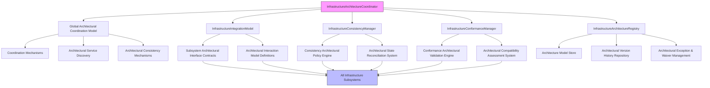
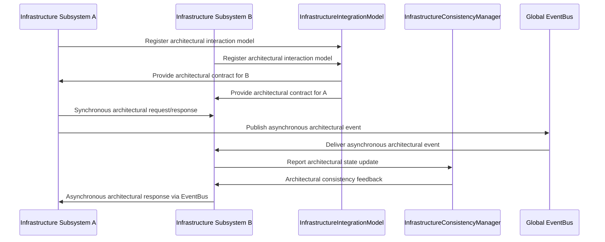
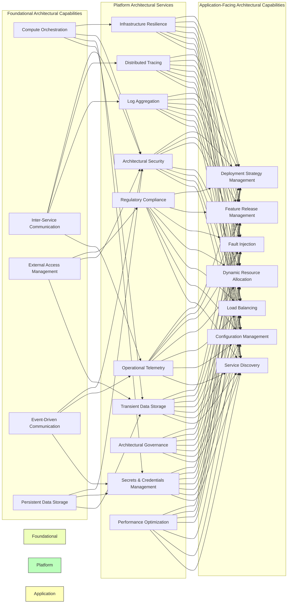
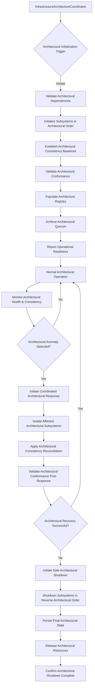
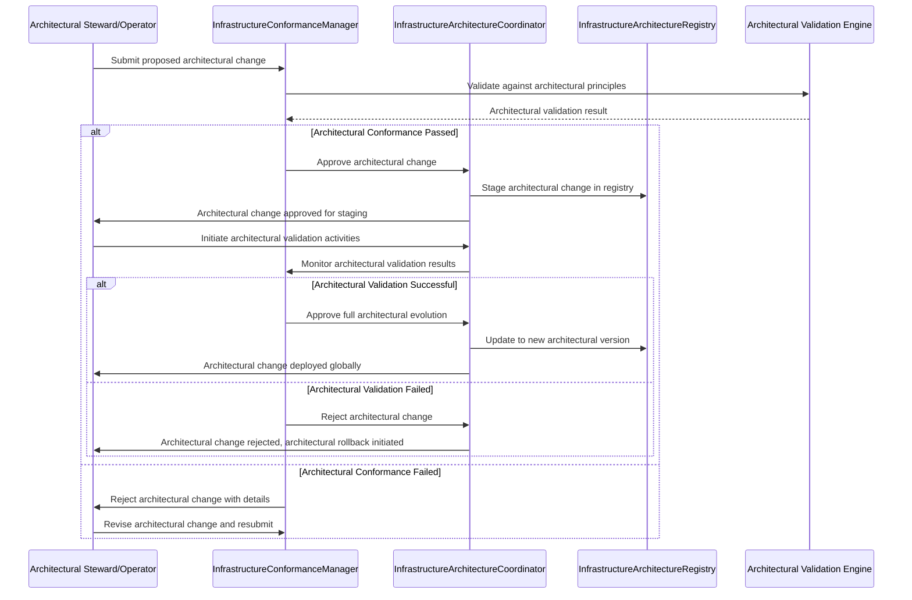

# 9.20 Infrastructure Architecture Summary and Conformance

## Purpose
This section defines the architectural integration, consistency model, global invariants, and conformance framework for the entire Infrastructure Architecture introduced in Sections 9.1–9.19. It serves as the architectural conclusion of Part 9, unifying all infrastructure concepts into a coherent whole without repeating earlier content.

## Scope
The scope encompasses all infrastructure capabilities defined in Sections 9.1–9.19, including but not limited to: compute orchestration, inter-service communication, external access management, event-driven communication, persistent data storage, transient data storage, secrets and credentials management, operational telemetry, log aggregation, distributed tracing, architectural security, regulatory compliance, architectural governance, infrastructure resilience, and performance optimization capabilities. This chapter binds these capabilities together, ensuring their coordinated operation and architectural integrity.

## Architectural Goals
- Achieve seamless architectural integration of all infrastructure subsystems.
- Ensure global architectural consistency across distributed infrastructure components.
- Establish architectural conformance mechanisms for evolution and compatibility.
- Provide technology-neutral guarantees for reliability, security, and performance across the entire infrastructure.
- Enable autonomous infrastructure operation through architectural self-healing and self-optimization.

## Infrastructure Architectural Principles
1. **Integration Over Isolation**: Infrastructure subsystems SHALL integrate through well-defined architectural interfaces rather than operating in silos.
2. **Consistency Through Coordination**: Global state consistency SHALL be achieved via coordinated architectural policies, not eventual consistency alone.
3. **Conformance by Construction**: Architectural rules SHALL be enforced through automated architectural validation, not manual audits.
4. **Minimal Coupling, Maximal Cohesion**: Subsystems SHALL interact through narrow architectural contracts while maintaining internal functional cohesion.
5. **Failure Transparency**: Infrastructure failures SHALL be visible, diagnosable, and containable without obscuring root causes.
6. **Policy-Driven Behavior**: Infrastructure behavior SHALL be determined by externally defined architectural policies, not hardcoded architectural contracts.
7. **Observability-First Design**: All infrastructure interactions SHALL emit standardized telemetry for architectural monitoring and debugging.
8. **Security by Default**: Security controls SHALL be applied uniformly across all infrastructure layers without opt-in requirements.
9. **Resource-Aware Scheduling**: Infrastructure resource allocation SHALL adapt dynamically to workload demands and constraints through architectural policies.
10. **Evolutionary Compatibility**: Architectural changes SHALL maintain backward compatibility and support incremental adoption.

## Architectural Integration Model
The infrastructure architecture follows a layered integration model where each architectural layer provides specific capabilities while depending on lower layers for foundational architectural services. Architectural layers SHALL interact strictly through defined interfaces, preventing leaky abstractions and unintended dependencies. This model ensures the architectural integrity and interoperability of the entire infrastructure.

### Cross-component Interaction Model
Architectural components SHALL interact through three primary architectural interaction models:
1. **Synchronous Request/Response**: Employed for scenarios requiring immediate consistency guarantees and direct feedback.
2. **Asynchronous Event Publishing**: Utilized for achieving eventual consistency and loose coupling between architectural components.
3. **Shared State Coordination**: Designed for managing strongly consistent distributed state, ensuring data integrity across the architecture.

### Subsystem Collaboration
Subsystems SHALL collaborate via well-defined architectural contracts that explicitly specify:
- Input/output data formats and their associated architectural schemas.
- Behavioral guarantees under various operational conditions, including success and failure scenarios.
- Architectural error propagation mechanisms and expected handling.
- Performance and latency expectations for all architectural interactions.
- Security and architectural policy enforcement points, ensuring consistent governance.

### Infrastructure Dependency Model
Architectural dependencies SHALL form a directed acyclic graph where:
- Foundational infrastructure capabilities (Sections 9.1-9.5) provide essential underlying services.
- Platform services (Sections 9.6-9.12) build upon these foundations to offer broader architectural functionalities.
- Application-facing capabilities (Sections 9.13-9.19) leverage platform services to support AI-OS applications.
- Circular dependencies are strictly prohibited; all architectural dependencies SHALL flow in an architecturally sound direction, preventing deadlocks and ensuring stable startup.

## Global Coordination Architecture
Global architectural coordination SHALL be achieved through:
- A federated architectural control plane that spans all infrastructure domains, ensuring centralized command and control.
- Architectural coordination mechanisms for critical configuration decisions, guaranteeing consensus across the distributed environment.
- Architectural consistency mechanisms for shared resource access, preventing contention and ensuring orderly utilization.
- Architectural coordination services that provide leadership election and service discovery, facilitating dynamic subsystem interaction.

## Global Policy Integration
Architectural policies SHALL be defined centrally and distributed to all infrastructure components through:
- Policy decision points that evaluate requests against architectural policy sets, ensuring compliance before action.
- Policy enforcement points that intercept and modify architectural behavior, guaranteeing policy adherence at runtime.
- Policy distribution mechanisms that ensure eventual consistency of policy application across the entire infrastructure.
- Policy versioning and architectural rollback capabilities, allowing for controlled evolution and safe recovery from policy errors.

## Global EventBus Integration
The global EventBus SHALL serve as the architectural nervous system of the infrastructure, enabling:
- Decoupled communication between all infrastructure subsystems, promoting modularity and flexibility.
- Real-time propagation of state changes and architectural alerts, facilitating dynamic response to events.
- Comprehensive audit trails for all significant infrastructure events, supporting compliance and forensic analysis.
- Replay capabilities for architectural debugging and compliance verification, allowing historical state reconstruction.
- Standardized event schemas for interoperability, ensuring consistent interpretation across all listening components.

## Infrastructure Consistency Model
The infrastructure SHALL implement a hybrid architectural consistency model:
- **Strong Consistency**: Mandated for critical architectural configuration and security policies, ensuring immediate and absolute agreement.
- **Bounded Staleness**: Applied to observability telemetry and metrics, allowing for minor, controlled delays in data propagation.
- **Eventual Consistency**: Employed for non-critical architectural configuration and transient data, where eventual agreement is sufficient.
- **Read-Your-Writes**: Architecturally guaranteed for all infrastructure control operations, ensuring that a write is immediately visible to the writer.
- **Monotonic Reads**: Architecturally ensured for all infrastructure query operations, preventing users from seeing older versions of data after seeing newer ones.

## Global Lifecycle Model
Infrastructure architectural lifecycle management SHALL follow a unified architectural model, ensuring consistent state transitions across all subsystems:
1. **Provisioning**: Resource allocation and initial architectural configuration, preparing the environment.
2. **Initialization**: Subsystem startup and architectural dependency resolution, bringing components online.
3. **Activation**: Service registration and traffic acceptance, making the subsystem available for workloads.
4. **Operation**: Normal service delivery with continuous architectural optimization, maintaining performance and stability.
5. **Deactivation**: Graceful traffic draining and disconnect, preparing for shutdown or transition.
6. **Termination**: Resource cleanup and final state persistence, ensuring data integrity.
7. **Deprovisioning**: Infrastructure resource return to pool, releasing allocated assets.

## Global Observability Model
Architectural observability SHALL be unified through:
- Standardized telemetry formats (traces, metrics, logs) across all infrastructure components.
- Correlated event collection across all infrastructure layers, enabling end-to-end visibility.
- Distributed tracing context propagation, allowing requests to be followed across subsystem boundaries.
- Metric aggregation and alerting federation, providing a holistic view of system health.
- Log consolidation with structured parsing, facilitating efficient analysis and querying.
- Visualization dashboards that span infrastructure domains, offering intuitive insights into complex architectural states.

## Global Governance Integration
Architectural governance SHALL be integrated through:
- Policy-as-code definitions stored in version control, ensuring auditability and controlled evolution of governance rules.
- Automated compliance checking against regulatory frameworks, minimizing manual effort and ensuring continuous adherence.
- Role-based access control coordinated across subsystems, providing consistent security enforcement.
- Audit logging that meets regulatory requirements, ensuring transparency and accountability for all actions.
- Change management workflows with approval gates, ensuring controlled and validated architectural evolution.

## Global Resilience Integration
Architectural resilience mechanisms SHALL be coordinated globally:
- Circuit breaker patterns that propagate state between subsystems, preventing cascading failures.
- Bulkhead isolation that architecturally prevents failure cascades, segmenting resources to contain faults.
- Architectural retry mechanisms with exponential backoff and jitter, improving fault tolerance for transient errors.
- Failover orchestration that maintains service continuity, ensuring seamless transitions during outages.
- Controlled fault injection frameworks for architectural validation of resilience, proactively testing system robustness.

## Global Security Integration
Architectural security controls SHALL be applied uniformly across the entire infrastructure:
- Zero-trust networking between all infrastructure components, assuming no implicit trust based on network location.
- Mutual TLS authentication for service-to-service communication, ensuring cryptographic identity verification.
- Centralized secrets management with automatic rotation, enhancing security posture and reducing compromise risk.
- Identity and access management federation, providing a unified approach to user and service authentication.
- Security information and event management (SIEM) integration, consolidating security events for analysis.
- Vulnerability scanning and patch management coordination, ensuring proactive defense against known threats.

## Architectural Integration Components

### InfrastructureArchitectureCoordinator
#### Purpose
Orchestrates the architectural lifecycle, global coordination, and overall operational coherence of all infrastructure subsystems.

#### Responsibilities
- Manage the global infrastructure architectural lifecycle, from provisioning to deprovisioning.
- Coordinate subsystem startup and shutdown sequences based on architectural dependencies.
- Detect and resolve architectural configuration conflicts, ensuring a consistent operational state.
- Monitor overall infrastructure health and trigger corrective architectural actions.
- Enforce architectural conformance during runtime, preventing architectural drift.

#### Operations
- `initializeInfrastructure()`: Initiates the architectural boot sequence for all subsystems in their defined dependency order.
- `coordinateSubsystems()`: Manages cross-subsystem architectural interactions and interdependencies.
- `verifyConsistency()`: Periodically checks global invariants and architectural consistency across the infrastructure.
- `handleFailure()`: Orchestrates architectural recovery responses from detected subsystem failures.
- `shutdownInfrastructure()`: Initiates a graceful architectural termination sequence for all subsystems.

#### Inputs
- The comprehensive infrastructure architectural configuration catalog.
- Real-time subsystem health status reports and metrics.
- Formally defined architectural conformance rules and policies.
- Global architectural policy definitions from governance systems.

#### Outputs
- A coordinated infrastructure operational state, reflecting architectural coherence.
- Architectural consistency verification results and deviation reports.
- Recommendations for architectural evolution and policy adjustments.
- Coordinated architectural shutdown procedures and status.

#### Preconditions
- All infrastructure subsystems are architecturally defined and accessible.
- Initial architectural configuration is loaded and validated against schema.
- Architectural coordination models (e.g., consistency, discovery) are operational.

#### Postconditions
- All infrastructure subsystems are initialized and architecturally operational.
- Global architectural consistency invariants are satisfied.
- The infrastructure is ready to serve AI-OS application workloads, conforming to its architectural specification.

#### Error Conditions
- Subsystem architectural initialization failure: Triggers a coordinated architectural rollback to a stable state.
- Architectural consistency violation: Initiates corrective action or a safe architectural shutdown.
- Architectural configuration conflict: Blocks startup until the conflict is resolved architecturally.
- Architectural coordination model failure: Degrades to a limited functionality mode with defined behavioural guarantees.

#### Behavioural Guarantees
- **Atomic Infrastructure Startup**: The infrastructure SHALL achieve a fully operational state or initiate a coordinated architectural rollback, preventing partial deployments.
- **Consistency Preservation**: Global architectural invariants SHALL be maintained throughout all operational phases.
- **Fail-Safe Behavior**: Detected failures SHALL trigger predefined safe architectural state transitions, minimizing impact.
- **Conformance Enforcement**: Architectural violations SHALL be prevented or corrected through automated architectural validation and policy enforcement.

### InfrastructureIntegrationModel
#### Purpose
Defines the architectural contracts, data formats, and interaction models governing how all infrastructure subsystems interoperate and compose to form a cohesive whole.

#### Responsibilities
- Specify architectural interface contracts between all infrastructure components.
- Define canonical data formats and architectural communication protocols.
- Establish architectural interaction models (synchronous, asynchronous, shared state) and their application.
- Validate architectural compliance of subsystem interaction behaviors.
- Maintain the global architectural dependency graph and prevent circular dependencies.

#### Operations
- `defineContract(subsystemA, subsystemB, contractSpecification)`: Creates a formal architectural interaction specification between subsystems.
- `validateInteraction(subsystemA, subsystemB)`: Checks architectural compliance of observed interaction with the defined contract.
- `updateDependencyGraph()`: Dynamically tracks and validates architectural dependencies declared by subsystems.
- `detectCircularDependencies()`: Identifies and reports forbidden architectural dependency cycles, blocking architectural activation.
- `getInteractionModel(subsystemA, subsystemB)`: Returns the defined architectural communication model between two subsystems.

#### Inputs
- Formal architectural definitions of subsystem interfaces.
- Core architectural principles and system-wide constraints.
- Explicit architectural dependency declarations from each subsystem.
- Historical architectural interaction data for validation and refinement.

#### Outputs
- Validated architectural interface contracts, serving as immutable interaction blueprints.
- A comprehensive architectural dependency graph with detected cycle reports.
- Compliance validation reports detailing adherence to interaction policies.
- Explicit architectural interaction model specifications.

#### Preconditions
- All subsystem interface architectural definitions are formally available.
- Core architectural principles are established and documented.
- Comprehensive architectural dependency information is provided by all subsystems.

#### Postconditions
- All defined subsystem architectural interactions comply with their specified contracts.
- The architectural dependency graph is acyclic and globally valid.
- Architectural interaction models are consistently documented and enforced across the infrastructure.

#### Error Conditions
- Architectural contract violation: Flags non-compliant subsystem behavior, requiring architectural review.
- Circular dependency detected: Blocks architectural activation, requiring re-architecting.
- Missing interface architectural definition: Prevents interaction specification, requiring architectural completion.
- Protocol mismatch: Rejects incompatible architectural communication attempts.

#### Behavioural Guarantees
- **Interface Stability**: Architectural contracts SHALL remain stable and backward-compatible during subsystem lifetimes.
- **Dependency Safety**: No circular architectural dependencies SHALL be permitted in the valid architecture.
- **Interaction Predictability**: Defined architectural interaction models SHALL guarantee predictable communication behavior and outcomes.
- **Conformance Enforcement**: All architectural interactions SHALL validate against established architectural rules and policies.

### InfrastructureConsistencyManager
#### Purpose
Ensures global architectural consistency of infrastructure state across all subsystems and enforces defined consistency models and strategies.

#### Responsibilities
- Monitor infrastructure state for architectural consistency violations across all domains.
- Implement architectural consistency strategies (strong, bounded staleness, eventual) as defined by policy.
- Coordinate architectural state reconciliation when inconsistencies are detected.
- Provide global architectural consistency guarantees to all infrastructure consumers.
- Manage and enforce architectural consistency levels for different types of infrastructure state.

#### Operations
- `checkConsistency(stateType)`: Verifies architectural consistency for a specified state category across relevant subsystems.
- `reconcileInconsistencies(detectedArchitecturalIssues)`: Orchestrates architectural state correction when inconsistencies are detected.
- `setConsistencyLevel(stateType, level)`: Configures the architectural consistency model for a given state type.
- `monitorConsistencyDrift()`: Continuously tracks architectural consistency metrics and trends over time.
- `triggerConsistencyRepair()`: Initiates automated architectural consistency repair mechanisms when policy thresholds are breached.

#### Inputs
- Comprehensive infrastructure state reports from all subsystems.
- Architectural consistency violation alerts and related metrics.
- Configured architectural consistency levels for various state types.
- Historical architectural consistency data and trends for predictive analysis.

#### Outputs
- Detailed architectural consistency verification reports.
- Architectural reconciliation action plans and their execution status.
- Current architectural consistency level configurations.
- Architectural drift detection and trending data for proactive management.
- Results of architectural repair operations and their effectiveness.

#### Preconditions
- All infrastructure subsystems are operational and continuously reporting architectural state.
- Architectural consistency monitoring mechanisms are fully deployed and active.
- Architectural state type classifications are formally defined and agreed upon.

#### Postconditions
- Infrastructure architectural state consistency SHALL meet all configured levels.
- Detected architectural inconsistencies SHALL be reconciled within bounded time frames.
- Architectural consistency metrics SHALL be available for real-time monitoring and alerting.
- Automated architectural repair mechanisms SHALL be ready to respond to violations without intervention.

#### Error Conditions
- Architectural consistency violation beyond repair threshold: Triggers safe architectural state entry.
- Architectural reconciliation failure: Escalates to a manual architectural intervention requirement.
- Architectural monitoring system failure: Degrades to periodic architectural consistency checks.
- Inconsistent architectural configuration: Blocks consistency verification operations until resolved.

#### Behavioural Guarantees
- **Configured Consistency**: Defined architectural consistency levels SHALL be maintained for all state types.
- **Bounded Inconsistency**: Architectural inconsistencies SHALL be detected and corrected within specified bounds.
- **Real-time Visibility**: Architectural consistency monitoring SHALL provide accurate real-time visibility into state health.
- **Automated Reconciliation**: Transient architectural inconsistencies SHALL be resolved automatically without manual intervention.

### InfrastructureConformanceManager
#### Purpose
Validates that the infrastructure architecture adheres to defined architectural principles, constraints, and rules, ensuring architectural integrity and controlled evolution.

#### Responsibilities
- Check architectural conformance during initialization, architectural evolution, and runtime.
- Validate proposed architectural changes against established principles and constraints.
- Detect and report architectural drift and violations from the defined baseline.
- Enforce architectural compatibility requirements for infrastructure evolution.
- Provide comprehensive architectural conformance reporting and audit capabilities.

#### Operations
- `validateArchitecture()`: Performs a comprehensive architectural conformance check of the entire infrastructure.
- `validateChange(proposedArchitecturalChange)`: Conducts pre-change architectural validation for proposed modifications.
- `detectArchitecturalDrift()`: Identifies deviations from the architectural baseline during runtime.
- `checkCompatibility(oldArchitecturalVersion, newArchitecturalVersion)`: Assesses architectural evolution compatibility between versions.
- `generateConformanceReport()`: Produces detailed architectural compliance documentation for auditing.

#### Inputs
- The current infrastructure architectural state and its formal definition.
- Proposed architectural changes or updates, submitted for validation.
- Formal architectural principles, constraints, and design patterns.
- Architectural version history and the compatibility matrix.
- Architectural conformance policies and defined exception rules.

#### Outputs
- Architectural conformance validation results (pass/fail with detailed findings).
- Architectural change validation recommendations (approve/reject/modify).
- Architectural drift reports with specific remediation suggestions.
- Architectural compatibility assessment reports for planned evolution.
- Comprehensive architectural conformance documentation for audits and stakeholders.

#### Preconditions
- Architectural principles and constraints are formally defined and accessible.
- Infrastructure state is accessible for architectural inspection and analysis.
- Architectural change proposals are submitted in a defined and machine-readable format.
- Architectural version compatibility data is readily available.

#### Postconditions
- Architecture conformance status SHALL be accurately determined and reported.
- Proposed architectural changes SHALL be validated before architectural deployment.
- Architectural drift SHALL be detected and documented with remediation paths.
- Architectural compatibility SHALL be assessed for all planned evolution steps.
- Architectural conformance evidence SHALL be available for auditors and stakeholders.

#### Error Conditions
- Architectural conformance violation detected: Blocks architectural change implementation.
- Incompatible architectural change proposed: Requires architectural update or rejection.
- Architectural validation system failure: Degrades to pre-architectural deployment manual review.
- Missing architectural conformance data: Prevents comprehensive architectural validation.

#### Behavioural Guarantees
- **Continuous Conformance**: Architectural conformance SHALL be continuously monitored and enforced throughout the lifecycle.
- **Validated Evolution**: All architectural changes SHALL pass architectural validation before deployment, minimizing risk.
- **Drift Prevention**: Architectural drift detection SHALL identify deviations before they cause failures or non-compliance.
- **Compatibility Assurance**: Architectural compatibility assessments SHALL prevent breaking changes during evolution.
- **Auditable Compliance**: Architectural conformance reporting SHALL provide auditable evidence of compliance with principles.

### InfrastructureArchitectureRegistry
#### Purpose
Maintains the canonical, versioned representation of the infrastructure architecture, serving as the single source of truth for all architectural components, interfaces, dependencies, and conformance rules.

#### Responsibilities
- Store and manage the formal infrastructure architecture model.
- Track version history and architectural evolution of the infrastructure.
- Provide comprehensive architecture discovery and introspection capabilities.
- Manage architectural exceptions and waivers, including their justification and lifecycle.
- Serve as the authoritative source of truth for all architecture-related tooling and decisions.

#### Operations
- `registerComponent(componentArchitecturalDefinition)`: Adds or updates a subsystem's architectural definition.
- `registerInterface(interfaceArchitecturalDefinition)`: Defines or updates a component's architectural contract.
- `registerDependency(dependencyArchitecturalDefinition)`: Records a formal architectural dependency.
- `updateArchitectureVersion(newArchitecturalVersion)`: Advances the architectural version of the entire infrastructure.
- `queryArchitecture(architecturalCriteria)`: Retrieves architectural elements matching specified criteria.
- `recordException(component, rule, justification)`: Documents an architectural waiver with justification.

#### Inputs
- Formal architectural definitions of subsystems and interfaces from authorized teams.
- Architectural dependency declarations and architectural decisions.
- Architectural version proposals and architectural change requests.
- Architectural conformance validation results and architectural exception requests.
- Historical architectural versions and evolution data for traceability.

#### Outputs
- The current architectural model and its complete version history.
- Comprehensive catalogs of architectural components and interfaces.
- The architectural dependency graph and architectural interaction maps.
- Results of architectural queries and introspection data.
- Formal architectural exception records and waiver documentation.

#### Preconditions
- The architectural definition format is formally established and agreed upon.
- Architectural registration mechanisms are accessible and secure.
- Architectural version control and architectural change management processes are defined.
- Architectural query interfaces are implemented and performant.

#### Postconditions
- The Registry SHALL accurately reflect the current infrastructure architecture.
- All registered architectural components, interfaces, and dependencies SHALL be valid.
- The architectural version history SHALL be complete and traceable.
- Architectural query capabilities SHALL provide timely and accurate architectural information.
- Architectural exceptions SHALL be documented with proper justification and review.

#### Error Conditions
- Invalid component architectural definition: Rejected with specific architectural error details.
- Duplicate architectural registration: Prevented unless explicit replacement is specified.
- Circular dependency introduction: Blocked with detailed architectural explanation.
- Architectural version conflict: Requires architectural resolution before registration.
- Architectural query failure: Returns partial results with architectural error indication.

#### Behavioural Guarantees
- **Accurate Representation**: The Registry SHALL maintain an accurate and complete architectural representation.
- **Validated Registrations**: All architectural registrations SHALL validate against architectural principles.
- **Dependency Integrity**: Architectural dependency tracking SHALL prevent invalid architectural configurations.
- **Immutable History**: The architectural version history SHALL be immutable and auditable.
- **Consistent Queries**: Architectural queries SHALL return consistent results under concurrent access.

## Runtime Behaviour

### System Initialization
1. The InfrastructureArchitectureCoordinator SHALL initiate the architectural initialization sequence.
2. The architectural dependency graph SHALL be validated by the InfrastructureIntegrationModel to ensure structural integrity.
3. All infrastructure subsystems SHALL be initialized in topological order based on their architectural dependencies.
4. The InfrastructureConsistencyManager SHALL establish initial architectural consistency baselines across all relevant state domains.
5. The InfrastructureConformanceManager SHALL validate the initial architectural conformance of the entire infrastructure.
6. The InfrastructureArchitectureRegistry SHALL be populated with the finalized initial architectural state.
7. Global coordination models SHALL achieve quorum and readiness, establishing distributed control.
8. All subsystems SHALL report healthy status to the InfrastructureArchitectureCoordinator to achieve a fully operational architectural state.

### Cross-Subsystem Coordination
1. Subsystems SHALL interact via registered architectural interfaces as defined in the InfrastructureIntegrationModel.
2. Architectural communication models (synchronous/asynchronous/shared state) SHALL be enforced for all interactions.
3. Significant architectural events SHALL be published to the global EventBus with standardized schemas.
4. Architectural policy decisions SHALL be evaluated centrally and distributed to relevant enforcement points.
5. Architectural consistency checks SHALL be performed continuously by the InfrastructureConsistencyManager.
6. Architectural conformance SHALL be validated periodically and upon significant architectural changes.
7. Architectural failures SHALL be detected by health monitoring systems and coordinated recovery initiated by the ResilienceManager.

### Infrastructure Synchronization
1. Architectural state updates SHALL be propagated according to the defined architectural consistency model.
2. Strongly consistent state SHALL utilize architectural coordination mechanisms to ensure immediate agreement.
3. Eventually consistent state SHALL employ architectural synchronization and coordination protocols, allowing for controlled propagation delays.
4. Bounded staleness SHALL utilize timestamp-based conflict resolution strategies, maintaining data freshness within limits.
5. Architectural repair mechanisms SHALL correct inconsistencies during read operations, ensuring data integrity for consumers.
6. Synchronization metrics SHALL be collected for architectural monitoring and tuning of consistency mechanisms.

### Global Consistency Verification
1. The InfrastructureConsistencyManager SHALL sample architectural state across all relevant subsystems.
2. Architectural consistency violations SHALL be detected using architectural validation strategies and comparison models.
3. Detected architectural inconsistencies SHALL trigger architectural reconciliation workflows.
4. Reconciliation SHALL utilize architectural strategies such as last-known-good, architectural merge functions, or manual intervention.
5. Verification results SHALL be reported to architectural operators and orchestration systems.
6. Architectural consistency guarantees SHALL be continuously monitored and alerted upon breach, triggering corrective actions.

### Architecture Evolution
1. Proposed architectural changes SHALL be submitted to the InfrastructureConformanceManager for review.
2. Pre-change architectural validation SHALL ensure conformance to architectural principles and constraints.
3. Backward and forward compatibility SHALL be assessed to prevent architectural regressions.
4. Architectural changes SHALL be staged in designated architectural validation environments.
5. Architectural validation strategies SHALL validate new architectural behaviors under representative loads.
6. Full architectural evolution SHALL occur after successful architectural validation.
7. The InfrastructureArchitectureRegistry SHALL be updated with the new architectural version, maintaining historical traceability.
8. Architectural rollback procedures SHALL be maintained for failed architectural evolutions, enabling safe reversion.

### Architecture Shutdown
1. The architectural shutdown sequence SHALL be initiated by the InfrastructureArchitectureCoordinator.
2. Subsystems SHALL be deactivated in reverse architectural dependency order, ensuring graceful termination.
3. Active workloads SHALL be gracefully drained or migrated according to architectural policies.
4. Architectural state SHALL be persisted according to durability requirements.
5. Resources SHALL be released and returned to infrastructure pools.
6. A final architectural consistency check SHALL ensure no data loss or corruption.
7. The InfrastructureArchitectureCoordinator SHALL confirm complete architectural shutdown, indicating a stable state.

## EventBus
The global EventBus uses the topic namespace `aios.infrastructure.*` for all infrastructure-related events.

### Categorized Architectural Events
- `aios.infrastructure.lifecycle.<subsystem>.<state>`: Architectural lifecycle transitions (starting, started, stopping, stopped).
- `aios.infrastructure.consistency.<stateType>.<event>`: Architectural consistency events (violation detected, reconciled, drift increasing).
- `aios.infrastructure.policy.<policyType>.<decision>`: Architectural policy events (evaluated, enforced, violated).
- `aios.infrastructure.coordination.<action>`: Architectural coordination events (leader elected, resource lock acquired, consensus reached).
- `aios.infrastructure.conformance.<validation>.<result>`: Architectural conformance events (validation started, passed, failed).
- `aios.infrastructure.dependency.<change>`: Architectural dependency events (added, removed, violated).
- `aios.infrastructure.health.<subsystem>.<metric>`: Architectural health events (threshold exceeded, recovered).
- `aios.infrastructure.security.<event>`: Architectural security events (authentication, authorization, threat detected).
- `aios.infrastructure.exception.<component>.<rule>`: Architectural exception events (granted, denied, expired).

## Mermaid diagrams

### Overall Infrastructure Architecture

### Cross-Subsystem Interaction

### Global Dependency Graph

### Infrastructure Architectural Coordination Flow

### Architecture Conformance Flow

## Architectural Contracts
All infrastructure interactions SHALL conform to the following architectural contracts, which serve as immutable agreements between subsystems:

### Interface Architectural Contract
#### Purpose
To define the precise architectural specification for interaction between two infrastructure subsystems, ensuring clear architectural responsibilities, predictable architectural behavior, and seamless interoperability.

#### Responsibilities
- Define the architectural methods, events, and shared state available for architectural interaction.
- Specify architectural data schemas for all inputs and outputs, ensuring data consistency.
- Outline architectural error conditions and expected architectural responses.
- Establish architectural non-functional requirements such as timeouts and architectural retry policies.
- Ensure architectural compatibility between interacting subsystems.

#### Operations
- `defineMethod(methodArchitecturalSpecification)`: Specifies a synchronous architectural interaction method, including its purpose, inputs, outputs, and behavioral guarantees.
- `defineEvent(eventArchitecturalSpecification)`: Specifies an asynchronous architectural event for publishing, including its schema and intended use.
- `defineSharedState(sharedStateArchitecturalSpecification)`: Specifies a shared architectural state element, its architectural consistency model, and conflict resolution strategy.
- `declareDependencies(dependencyArchitecturalList)`: Explicitly specifies architectural dependencies on other subsystems, including version constraints.

#### Inputs
- Architectural specifications for methods (name, input/output schemas, error list, timeout, retries, circuit breaker policy).
- Architectural specifications for events (name, schema, partitioning key).
- Architectural specifications for shared state (name, consistency model, conflict resolution strategy).
- List of architectural dependencies with version constraints and optionality.

#### Outputs
- A formal architectural contract document detailing the interface, serving as a blueprint for interaction.
- Architectural validation reports confirming adherence to architectural principles and standards.
- Traceable records of architectural interface evolution.

#### Preconditions
- All referenced architectural data schemas are formally defined and accessible within the Architecture Registry.
- Architectural consistency models and conflict resolution strategies are established and documented.
- Architectural dependency subsystems are clearly identified and registered.

#### Postconditions
- The architectural interface contract SHALL be formally registered, discoverable, and immutable.
- All architectural interactions conforming to this contract SHALL exhibit predictable and guaranteed behavior.
- Architectural dependencies and their constraints SHALL be clearly articulated and enforced.

#### Error Conditions
- Invalid architectural schema definition: Prevents contract registration.
- Undefined architectural consistency model: Results in contract rejection.
- Circular architectural dependency declaration: Prevents contract finalization and architectural activation.
- Conflicting architectural non-functional requirements: Requires architectural review and resolution before contract approval.

#### Behavioural Guarantees
- **Contractual Adherence**: All subsystems implementing this interface SHALL adhere strictly to its defined architectural methods, events, and shared state.
- **Schema Enforcement**: Input and output data SHALL conform to the specified architectural JSON schemas, ensuring data integrity.
- **Error Predictability**: Known architectural error conditions SHALL be explicitly defined and handled, leading to predictable failure modes.
- **Interoperability**: Architectural components adhering to this contract SHALL be inherently interoperable without custom integration logic.

### Dependency Architectural Contract
#### Purpose
To formally define an architectural dependency relationship between two infrastructure subsystems, specifying the nature of the dependency and explicitly articulating expected architectural behavioral guarantees.

#### Responsibilities
- Identify the dependent and dependency architectural subsystems.
- Categorize the type of architectural dependency (interface, shared state, event, configuration).
- Specify architectural version constraints for the dependency, ensuring compatibility.
- Articulate architectural behavioral guarantees expected from the dependency, such as availability, latency, and consistency.

#### Operations
- `declareDependency(dependentArchitecturalDefinition, dependencyArchitecturalDefinition)`: Formally declares an architectural dependency between subsystems.
- `validateDependency(dependencyArchitecturalContract)`: Checks if the architectural dependency adheres to established architectural rules and principles.
- `resolveDependencyVersion(dependentArchitecturalSubsystem, dependencyArchitecturalSubsystem)`: Determines the compatible architectural version of a dependency.

#### Inputs
- Names of the dependent and dependency architectural subsystems.
- Type of architectural dependency (e.g., `interface`, `sharedState`, `event`, `configuration`).
- Architectural version constraints (minimum, maximum, excluded versions).
- Architectural behavioral guarantees (availability percentage, latency duration, consistency model, durability guarantees).

#### Outputs
- A formal architectural contract document detailing the dependency relationship.
- Architectural validation reports confirming the architectural soundness of the dependency.
- Traceable records of architectural dependency evolution.

#### Preconditions
- Both dependent and dependency architectural subsystems are registered in the InfrastructureArchitectureRegistry.
- Architectural versioning policies are clearly defined and enforced.
- Architectural behavioral guarantees are quantifiable and measurable.

#### Postconditions
- The architectural dependency SHALL be formally recorded, traceable, and immutable.
- The dependent subsystem SHALL be able to rely on the specified architectural behavioral guarantees from its dependency.
- Architectural changes impacting dependencies SHALL trigger re-validation, ensuring continuous conformance.

#### Error Conditions
- Unresolved architectural dependency: Prevents dependent subsystem architectural initialization.
- Architectural version incompatibility: Blocks architectural deployment until resolved.
- Conflicting architectural behavioral guarantees: Requires architectural review and resolution.
- Circular architectural dependency detected: Results in architectural validation failure.

#### Behavioural Guarantees
- **Dependency Fulfillment**: The dependency architectural subsystem SHALL provide the specified capabilities and architectural guarantees to the dependent subsystem.
- **Version Compliance**: The dependency SHALL operate within the declared architectural version constraints.
- **Guaranteed Behavior**: The dependency SHALL uphold its declared architectural availability, latency, consistency, and durability guarantees.
- **Isolation**: Architectural failures in the dependency SHALL be contained and not cascade without explicit architectural allowance, preserving overall system stability.

## Global Runtime Invariants
The following architectural invariants SHALL hold at all times during infrastructure operation, ensuring system integrity and predictability:

1. **Identity Consistency**: Every infrastructure component SHALL have a globally unique identifier that never changes during its architectural lifetime.
2. **Policy Consistency**: All subsystems SHALL evaluate and enforce the same architectural policy set for equivalent requests, ensuring unified governance.
3. **Lifecycle Consistency**: No subsystem SHALL be in an operational architectural state while its architectural dependencies are not at least initialized, preventing unstable states.
4. **Health Consistency**: Health status SHALL propagate correctly; degraded architectural dependencies SHALL cause proportional health impact, providing accurate system visibility.
5. **Resource Consistency**: Allocated resources SHALL never exceed declared limits; deallocated resources SHALL be properly returned to infrastructure pools, preventing resource exhaustion.
6. **Performance Consistency**: Observed latency SHALL never exceed the Architectural Service Level Objective (SLO) by more than a defined tolerance during normal operation, ensuring predictable performance.
7. **Recovery Consistency**: After any architectural failure, the system SHALL converge to a consistent architectural state within a bounded time, guaranteeing recoverability.
8. **Governance Consistency**: Access control decisions SHALL be identical across all architectural enforcement points for equivalent requests, ensuring unified security.
9. **Security Consistency**: Authentication and authorization decisions SHALL be verifiable and tamper-evident, maintaining security integrity.
10. **Event Consistency**: Every significant architectural state change SHALL generate exactly one corresponding event in the global EventBus, ensuring auditable state transitions.
11. **Observability Consistency**: All telemetry data SHALL be correlated across subsystems using standard trace context, providing end-to-end architectural visibility.

## System-Wide Behavioural Guarantees
The infrastructure architecture SHALL provide the following system-wide behavioural guarantees, underpinning the reliability and robustness of the AI-OS:

- **Atomic Initialization**: Either all infrastructure subsystems SHALL start successfully or none SHALL, preventing partially initialized architectural states.
- **Conservative Failure Detection**: Architectural failures SHALL be detected within a bounded time with minimal false positives, ensuring prompt and accurate response.
- **Graceful Degradation**: Non-critical architectural functionality SHALL remain available during partial failures, preserving essential services.
- **Bounded Recovery Time**: The system SHALL recover from architectural failures within SLA-defined windows, minimizing service disruption.
- **Policy Compliance**: All infrastructure behavior SHALL adhere to active architectural policy sets, ensuring regulatory and business alignment.
- **Audit Completeness**: Every administrative action SHALL be logged with sufficient detail for architectural reconstruction, supporting auditing and compliance.
- **Data Durability**: Persistent infrastructure state SHALL survive single-node failures, guaranteeing data integrity.
- **Configuration Correctness**: Running architectural configuration SHALL always match the last validated version, preventing configuration drift.
- **Security Isolation**: Compromise of one architectural subsystem SHALL NOT automatically compromise others, ensuring fault containment.
- **Performance Predictability**: 95th percentile latency SHALL remain within defined bounds under normal load, ensuring consistent user experience.

## Conformance Requirements
Infrastructure implementations MUST satisfy these architectural requirements to be conformant with the AI-OS Infrastructure Architecture:

1. **Interface Compliance**: All subsystem interfaces MUST match registered architectural contracts exactly.
2. **Dependency Adherence**: All declared architectural dependencies MUST be satisfied with compatible versions.
3. **Policy Enforcement**: All architectural policy decision and enforcement points MUST be implemented.
4. **Consistency Implementation**: Configured architectural consistency levels MUST be provided for all state types.
5. **Observability Compliance**: Standard telemetry MUST be emitted for all significant architectural operations.
6. **Security Implementation**: Zero-trust networking and mutual TLS MUST be enforced between subsystems.
7. **Resilience Mechanisms**: Architectural circuit breakers, bulkheads, and architectural retry logic MUST be implemented.
8. **Governance Integration**: Role-based access control MUST be federated across subsystems.
9. **Lifecycle Management**: All subsystems MUST implement the standard architectural lifecycle model.
10. **Conformance Validation**: The architecture MUST pass architectural validation by the InfrastructureConformanceManager.

## Architecture Evolution
The infrastructure architecture SHALL evolve according to these architectural principles, ensuring controlled and predictable change:

### Compatibility Principles
- **Backward Compatibility**: New architectural versions MUST accept all valid inputs from previous versions.
- **Forward Compatibility**: Previous architectural versions MUST gracefully ignore new features they do not understand.
- **Behavioral Compatibility**: Observable architectural behavior MUST remain equivalent for common use cases.
- **Performance Compatibility**: Architectural performance characteristics MUST NOT degrade beyond defined thresholds.
- **Security Compatibility**: Architectural security posture MUST NOT weaken in new versions.

### Extensibility Principles
- **Plug-in Architecture**: New architectural capabilities MUST be addable without modifying core subsystems.
- **Configuration-Driven Behavior**: New architectural functionality MUST be configurable rather than hardcoded.
- **Interface Versioning**: Architectural interfaces MUST support multiple concurrent versions.
- **Extension Points**: Well-defined architectural extension points MUST exist for custom functionality.

## Cross References
- See Section 9.1 for Compute Orchestration Architecture.
- See Section 9.2 for Inter-Service Communication Architecture.
- See Section 9.3 for External Access Management Architecture.
- See Section 9.4 for Event-Driven Communication Architecture.
- See Section 9.5 for Persistent Data Storage Architecture.
- See Section 9.6 for Transient Data Storage Architecture.
- See Section 9.7 for Secrets and Credentials Management Architecture.
- See Section 9.8 for Operational Telemetry Architecture.
- See Section 9.9 for Log Aggregation Architecture.
- See Section 9.10 for Distributed Tracing Architecture.
- See Section 9.11 for Architectural Security.
- See Section 9.12 for Regulatory Compliance Architecture.
- See Section 9.13 for Architectural Governance.
- See Section 9.14 for Infrastructure Resilience Architecture.
- See Section 9.15 for Performance Optimization Architecture.
- See Section 9.16 for Service Discovery Architecture.
- See Section 9.17 for Configuration Management Architecture.
- See Section 9.18 for Load Balancing Architecture.
- See Section 9.19 for Dynamic Resource Allocation Architecture.

## ADR References
- ADR-001: Infrastructure Layering Principle
- ADR-002: Global EventBus Adoption
- ADR-003: Zero-Trust Networking Mandate
- ADR-004: Policy-As-Code Implementation
- ADR-005: Hybrid Consistency Model Selection
- ADR-006: Infrastructure Lifecycle Standardization
- ADR-007: Observability-First Design
- ADR-008: Conformance-Driven Evolution
- ADR-009: Resilience Patterns Standardization
- ADR-010: Governance Integration Framework

## Summary
This section serves as the architectural capstone of the AI-OS Infrastructure Architecture specification, meticulously defining the integration, consistency, conformance, and governance frameworks that unify all previously described infrastructure subsystems. It explicitly avoids introducing new capabilities or generic cloud infrastructure concepts, focusing instead on establishing the architectural glue that ensures the entire infrastructure operates as a coherent, reliable, and secure whole. The InfrastructureArchitectureCoordinator, InfrastructureIntegrationModel, InfrastructureConsistencyManager, InfrastructureConformanceManager, and InfrastructureArchitectureRegistry components work in concert to maintain global invariants, enforce behavioral guarantees, and enable safe, controlled architectural evolution. The comprehensively defined runtime behavior, architectural event schemas, formal architectural contracts, global invariants, and system-wide behavioral guarantees provide a complete, technology-neutral foundation for building and operating an infrastructure that meets the highest standards of dependability, security, performance, and architectural integrity for the AI-OS.