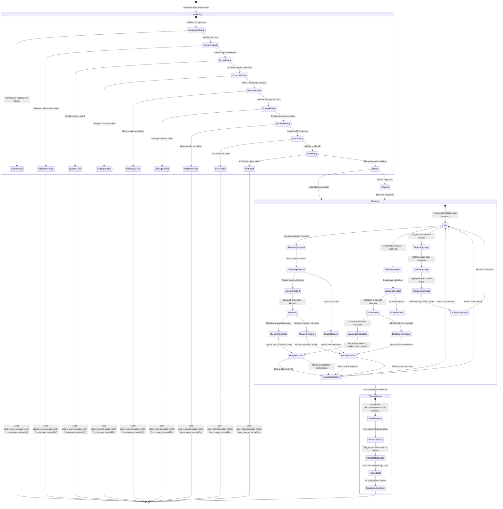
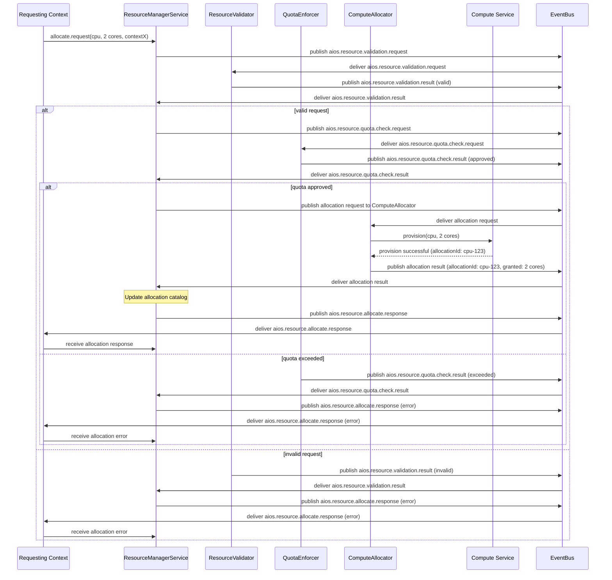
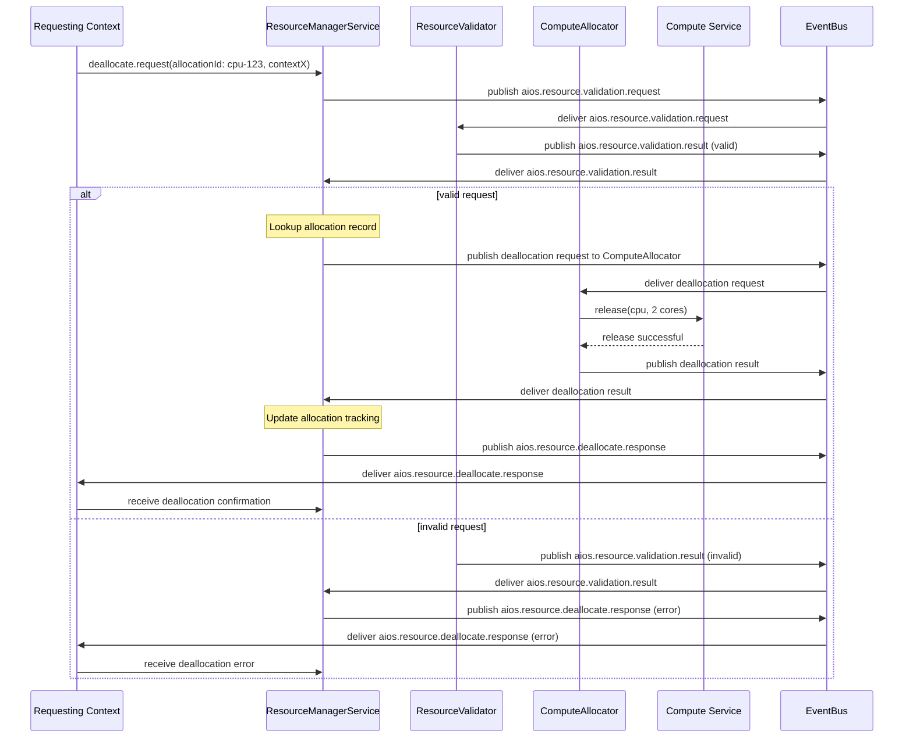
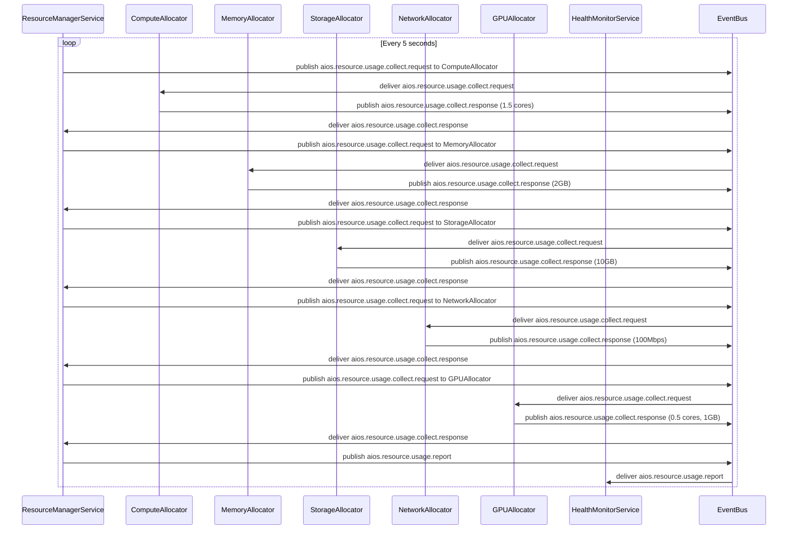

# 9.3 Resource Management Substrate

## Overview
The Resource Management Substrate provides a unified abstraction for compute, memory, storage, networking, and GPU resources, implementing the Resource contract defined in PART9_CONTEXT.md §13.3. Rather than implementing resource-specific allocation algorithms, it focuses on coordinating specialized allocators (ComputeAllocator, MemoryAllocator, etc.) while enforcing cross-cutting concerns: guaranteed allocation with hard limits, per-context accounting, namespace isolation, and reclaimable resources through ResourceManager-mediated interactions. All inter-component communication occurs via EventBus-mediated requests and events as defined in the Event Catalog, ensuring deterministic behavior and enabling observability, auditing, and replay capabilities.

## Responsibilities
The Resource Management Substrate implements these specific functions in accordance with PART9_CONTEXT.md:
- **ResourceManagerService**: Resource lifecycle management, component coordination, public API
- **ComputeAllocator**: CPU resource allocation logic and quota enforcement
- **MemoryAllocator**: Memory resource allocation logic and quota enforcement  
- **StorageAllocator**: Storage resource allocation logic and quota enforcement
- **NetworkAllocator**: Network resource allocation logic and quota enforcement
- **GPUAllocator**: GPU resource allocation logic and quota enforcement
- **QuotaEnforcer**: Quota validation, limit enforcement, usage tracking, reclamation coordination
- **ResourceValidator**: Request validation, error reporting, schema caching

## 1. INTERNAL RESOURCE MANAGEMENT ARCHITECTURE
The Resource Management Substrate implements a modular architecture where each component has clear ownership, well-defined interfaces, and specific lifecycle management, adhering to the Separation of Concerns principle (PART9_CONTEXT.md §86).

### Component Hierarchy
- **ResourceManagerService**: Resource lifecycle management, component coordination, public API. Interfaces with EventBus for allocator communication; the compute, memory, storage, network, and GPU services for resource provisioning.
- **ComputeAllocator**: CPU resource allocation logic and quota enforcement. Interfaces with EventBus for API exposure; Compute Service for CPU provisioning.
- **MemoryAllocator**: Memory resource allocation logic and quota enforcement. Interfaces with EventBus for API exposure; Memory Service for memory provisioning.
- **StorageAllocator**: Storage resource allocation logic and quota enforcement. Interfaces with EventBus for API exposure; Storage Service for storage provisioning.
- **NetworkAllocator**: Network resource allocation logic and quota enforcement. Interfaces with EventBus for API exposure; Network Service for network provisioning.
- **GPUAllocator**: GPU resource allocation logic and quota enforcement. Interfaces with EventBus for API exposure; GPU Service for GPU provisioning.
- **QuotaEnforcer**: Quota validation, limit enforcement, usage tracking, reclamation coordination. Interfaces with EventBus for quota checks; receives enforcement signals via EventBus.
- **ResourceValidator**: Request validation, error reporting, schema caching. Interfaces with EventBus for validation requests; publishes results via EventBus.

### Interaction Patterns
Components interact exclusively through EventBus-mediated communication, maintaining ResourceManager-first communication patterns:

**Resource Allocation Flow**: 
1. Requester → ResourceManagerService (via public API)
2. ResourceManagerService → EventBus: publishes aios.resource.validation.request
3. ResourceValidator → EventBus: publishes aios.resource.validation.result (after validation)
4. ResourceManagerService → EventBus: publishes aios.resource.quota.check.request (on valid validation)
5. QuotaEnforcer → EventBus: publishes aios.resource.quota.check.result (after quota check)
6. ResourceManagerService → EventBus: publishes allocation request to specific allocator (on approved quota)
7. Specific Allocator → EventBus: publishes allocation result (after infrastructure provisioning)
8. ResourceManagerService → EventBus: publishes aios.resource.allocate.response (after updating allocation state)
9. Requester ← ResourceManagerService: receives allocation response via API callback

**Resource Deallocation Flow**:
1. Requester → ResourceManagerService (via public API)
2. ResourceManagerService → EventBus: publishes aios.resource.validation.request
3. ResourceValidator → EventBus: publishes aios.resource.validation.result (after validation)
4. ResourceManagerService → EventBus: publishes deallocation request to specific allocator (on valid validation)
5. Specific Allocator → EventBus: publishes deallocation result (after infrastructure release)
6. ResourceManagerService → EventBus: publishes aios.resource.deallocate.response (after updating allocation tracking)
7. Requester ← ResourceManagerService: receives deallocation confirmation via API callback

**Quota Enforcement Flow**:
1. Allocator → ResourceManagerService: reports allocation attempt
2. ResourceManagerService → EventBus: publishes aios.resource.quota.check.request
3. QuotaEnforcer → EventBus: publishes aios.resource.quota.check.result
4. ResourceManagerService → Allocator: returns quota check result via EventBus

**Resource Tracking Flow**:
1. Allocator → ResourceManagerService: reports usage delta
2. ResourceManagerService → EventBus: publishes aios.resource.usage.report (periodically or on significant change)

**Validation Flow**:
1. ResourceManagerService → EventBus: publishes aios.resource.validation.request
2. ResourceValidator → EventBus: publishes aios.resource.validation.result
3. ResourceManagerService ← EventBus: receives validation result for decision making

## 2. PROCESSING PIPELINE
The Resource Management Substrate processes allocation and deallocation requests through a deterministic pipeline ensuring hard limit enforcement and per-context accounting, with all inter-component communication mediated through the EventBus.

### Allocation Pipeline
1. **Request Reception**: ResourceManagerService receives allocation request via public API
2. **Validation Request**: ResourceManagerService publishes aios.resource.validation.request to EventBus
3. **Validation Result**: ResourceValidator publishes aios.resource.validation.result to EventBus (after validation)
4. **Quota Check Request**: ResourceManagerService publishes aios.resource.quota.check.request to EventBus (on valid validation)
5. **Quota Check Result**: QuotaEnforcer publishes aios.resource.quota.check.result to EventBus (after quota check)
6. **Allocator Dispatch**: ResourceManagerService publishes allocation request to specific allocator via EventBus (on approved quota)
7. **Allocation Execution**: Specific allocator requests resources from Infrastructure Services
8. **Allocation Result**: Specific allocator publishes allocation result to EventBus (after infrastructure provisioning)
9. **Tracking**: ResourceManagerService records allocation in per-context usage tracking
10. **Response Publication**: ResourceManagerService publishes aios.resource.allocate.response event to EventBus
11. **Requester Notification**: ResourceManagerService notifies requester via public API callback

### Deallocation Pipeline
1. **Request Reception**: ResourceManagerService receives deallocation request via public API
2. **Validation Request**: ResourceManagerService publishes aios.resource.validation.request to EventBus
3. **Validation Result**: ResourceValidator publishes aios.resource.validation.result to EventBus (after validation)
4. **Allocator Dispatch**: ResourceManagerService publishes deallocation request to specific allocator via EventBus (on valid validation)
5. **Deallocation Execution**: Specific allocator releases resources to the appropriate Infrastructure Service
6. **Deallocation Result**: Specific allocator publishes deallocation result to EventBus (after infrastructure release)
7. **Tracking**: ResourceManagerService updates per-context usage tracking (decrements)
8. **Response Publication**: ResourceManagerService publishes aios.resource.deallocate.response event to EventBus
9. **Requester Notification**: ResourceManagerService notifies requester via public API callback

### Usage Reporting Pipeline
1. **Periodic Trigger**: ResourceManagerService triggers usage report based on configurable interval
2. **Collection**: ResourceManagerService collects current usage from all allocators via EventBus
3. **Aggregation**: ResourceManagerService aggregates usage per context and resource type
4. **Event Publication**: ResourceManagerService publishes aios.resource.usage.report event to EventBus
5. **Health Monitoring**: HealthMonitor consumes usage events for resource alerting (INV-RT-9.3)

## 3. RUNTIME LIFECYCLE
The Resource Management Substrate lifecycle is modeled as a state machine with well-defined transitions that maintain deterministic behavior and hard limit enforcement.

### Comprehensive State Model


### State Definitions
- **Initializing**: Resource substrate is starting up, initializing components
- **ComponentSetup**: Initializing individual subsystems (validator, quota enforcer, allocators)
- **ValidatorReady**: Resource validator initialized and ready
- **QuotaReady**: Quota enforcer initialized and ready
- **ComputeReady**: Compute allocator initialized and ready
- **MemoryReady**: Memory allocator initialized and ready
- **StorageReady**: Storage allocator initialized and ready
- **NetworkReady**: Network allocator initialized and ready
- **GPUReady**: GPU allocator initialized and ready
- **APIReady**: Public API initialized and ready
- **Ready**: All initialization complete, awaiting work
- **Running**: Normal operation state
- **Idle**: Ready state within Running, no pending requests
- **ReceivingRequest**: Actively receiving an allocation request via API
- **ValidatingRequest**: Checking request schema and basic properties
- **QuotaChecked**: Request passed quota validation, ready for allocation
- **InvalidRequest**: Request failed validation, headed for error response
- **Allocating**: Dispatching request to specific resource allocator
- **AllocationSuccess**: Allocator successfully granted requested resources
- **AllocationFailure**: Allocator unable to grant resources (quota exceeded, unavailable)
- **UsageUpdated**: Per-context usage tracking updated with allocation/deallocation
- **RequestComplete**: Request processing finished, returning response to caller
- **ErrorResponse**: Returning validation or allocation error to caller
- **ReceivingDealloc**: Actively receiving a deallocation request via API
- **ValidatingDealloc**: Checking deallocation request schema and basic properties
- **InvalidDealloc**: Deallocation request failed validation
- **Deallocating**: Dispatching deallocation request to specific allocator
- **DeallocationSuccess**: Allocator successfully released resources
- **DeallocationFailure**: Allocator failed to release resources
- **ReportingUsage**: Periodic usage report trigger
- **CollectingUsage**: Gathering current usage from all allocators
- **AggregatingUsage**: Aggregating usage per context and resource type
- **PublishingUsage**: Publishing resource usage report event
- **Paused**: Temporarily stopped accepting new work
- **ShuttingDown**: Graceful shutdown sequence initiated
- **StopAccepting**: No longer accepting new allocation/deallocation requests
- **ProcessQueue**: Processing pending requests in queue
- **ReleaseResources**: Triggering graceful release of all allocated resources
- **PersistState**: Saving allocation catalog and usage state for recovery
- **ShutdownComplete**: All components halted

## 4. STATE MANAGEMENT
State management in the Resource Management Substrate ensures deterministic resource accounting and enables replay capability.

### Per-Context Tracking
- Each execution context maintains a resource usage vector tracking allocated amounts per resource type
- Usage vectors are updated atomically with each allocation and deallocation
- Tracking uses fixed-point arithmetic to ensure deterministic behavior across platforms
- Usage vectors are persisted in snapshots for replay recovery

### Allocation Catalog
- Global allocation catalog maps allocation IDs to (context ID, resource type, amount, allocator)
- Catalog updates are atomic and ordered
- Catalog is persisted in snapshots for replay recovery
- Enables efficient deallocation by allocation ID without contextual lookup

### Quota Enforcement State
- Per-context quota allocations track reserved amounts against hard limits
- Quota state updates follow allocation/deallocation sequences
- Quota enforcement uses deterministic comparison algorithms

### State Persistence
- Allocation catalog and usage vectors are snapshotted periodically
- Snapshots include: allocation catalog, per-context usage vectors, quota reservations
- Snapshots are versioned and integrity-checked via cryptographic hashing
- Recovery restores state from latest snapshot plus replayed allocation/deallocation events

## 5. RESOURCE COORDINATION
The Resource Management Substrate coordinates with Infrastructure Services for actual resource provisioning while maintaining abstraction and guarantees.

### Infrastructure Services Abstraction
- **Compute Service**: Provides CPU core allocation and management
- **Memory Service**: Provides memory page allocation and management
- **Storage Service**: Provides storage block allocation and management
- **Network Service**: Provides network bandwidth allocation and management
- **GPU Service**: Provides GPU core and memory allocation and management

Each service implements a standardized resource provisioning contract defined by the following operations:

| Operation | Description |
|-----------|-------------|
| `allocate(request: ResourceRequest) -> ResourceAllocation` | Allocate resources according to the request |
| `deallocate(allocationId: AllocationId) -> boolean` | Deallocate resources by allocation ID |
| `getCapacity() -> ResourceCapacity` | Get total capacity of the resource |
| `getUsage() -> ResourceUsage` | Get current usage of the resource |
| `healthCheck() -> HealthStatus` | Perform health check of the service |

The data structures (ResourceRequest, ResourceAllocation =(ResourceCapacity, ResourceUsage), etc.) are defined in the shared schemas referenced in PART9_CONTEXT.md.

### Coordination Patterns
- **Allocation Request**: ResourceManagerService → EventBus: validation.request → ResourceValidator → EventBus: validation.result → ResourceManagerService → EventBus: quota.check.request → QuotaEnforcer → EventBus: quota.check.result → ResourceManagerService → EventBus: allocation.request → Specific Allocator → Infrastructure Services (provision)
- **Capacity Monitoring**: Infrastructure Services → Specific Allocator → ResourceManagerService (updated allocation state) → EventBus: aios.resource.usage.report → QuotaEnforcer (adjust limits via updated allocation state upon receiving usage report)
- **Usage Reporting**: Infrastructure Services → Specific Allocator → ResourceManagerService (updated allocation state) → EventBus: aios.resource.usage.report
- **Failure Handling**: Infrastructure Services → Specific Allocator → ResourceManagerService (error propagation) → EventBus: aios.resource.allocate.response (error) or aios.resource.deallocate.response (error) → QuotaEnforcer (adjust quotas via error propagation upon receiving error responses)

### Deterministic Provisioning
- Allocation requests to Infrastructure Services include deterministic parameters (sequence numbers, context IDs)
- Infrastructure Services must return allocation identifiers in deterministic order
- Allocation sizes are rounded to deterministic units (pages, blocks, etc.) to ensure reproducibility
- Provisioning timing is virtualized during replay to preserve timing characteristics

### Resource Coordination
The Resource Management Substrate implements sophisticated coordination mechanisms for multi-resource allocations, ensuring consistency, atomicity, and recoverability.

#### Multi-Resource Allocation Coordination
When an allocation request involves multiple resource types (e.g., compute and memory together), the ResourceManagerService coordinates the allocation in a deterministic order to prevent deadlocks and ensure consistent state:
1. **Resource Ordering**: Resources are allocated in a predefined, deterministic order (e.g., CPU → Memory → Storage → Network → GPU) based on resource type precedence
2. **Allocation Sequencing**: Each resource type is allocated sequentially, with each step waiting for successful completion before proceeding to the next
3. **Context Propagation**: The same context ID and request ID are propagated through all allocation steps to maintain traceability
4. **Intermediate State Tracking**: After each successful allocation, the ResourceManagerService updates the allocation catalog to track partial progress

#### Rollback Semantics for Partial Allocation Failures
If any resource allocation in a multi-resource request fails, the system executes a deterministic rollback:
1. **Immediate Halt**: Upon allocation failure, no further allocation attempts are made for the current request
2. **Reverse Order Deallocation**: Already-allocated resources are deallocated in the exact reverse order of allocation (e.g., if allocation order was CPU→Memory→Storage and Storage failed, deallocation proceeds Storage→Memory→CPU)
3. **Standard Deallocation Pipeline**: Each rollback deallocation follows the standard Resource Deallocation Contract (ResourceManagerService → ResourceValidator → [Specific Allocator] → Infrastructure Services → ResourceManagerService), reusing the standard aios.resource.deallocate.request and aios.resource.deallocate.response events
4. **Error Propagation**: The original allocation error is preserved and returned to the requester after rollback completion
5. **Event Publication**: Both allocation failures and rollback deallocations publish appropriate events via the EventBus for replay consistency

#### Atomicity Guarantees
The Resource Management Substrate provides atomicity guarantees for resource allocation operations:
- **All-or-Nothing Semantics**: Multi-resource allocations either succeed completely or leave the system in the exact state before the allocation attempt
- **Intermediate State Visibility**: During allocation, partial states are visible only through internal tracking mechanisms and are not exposed externally until full completion
- **Consistent Catalog Updates**: The allocation catalog is updated only after all resources in a multi-resource allocation are successfully secured
- **Transactional Boundaries**: Each allocation/deallocation request (including multi-resource operations) constitutes a single transactional unit from the perspective of external observers

#### Partial Allocation Recovery Procedures
When allocation failures occur after partial success, the system follows specific recovery procedures:
1. **Automatic Rollback Initiation**: Rollback begins immediately upon detection of any allocation failure
2. **Resource-Specific Deallocation**: Each allocator handles its resource type's deallocation using the standard deallocation pipeline
3. **Quota Adjustment**: During rollback, the QuotaEnforcer is notified of deallocations to adjust reserved quotas accordingly
4. **Usage Tracking Rollback**: Per-context usage vectors are decremented for each successfully rolled-back allocation
5. **Completion Verification**: The ResourceManagerService verifies that all allocated resources from the failed request have been successfully deallocated before returning control
6. **Fallback Handling**: If a rollback deallocation fails, the system enters a recovery state requiring manual intervention (though automatic retry mechanisms are attempted first per failure handling procedures)

## 6. SECURITY MODEL
The Resource Management Substrate enforces resource isolation and access controls through integration with security infrastructure.

### Resource Isolation
- **Namespace Isolation**: Resources allocated per context are isolated via namespace mechanisms (IC-9.3)
- **Memory Protection**: Memory allocations use hardware-enforced boundary checks (MMU/IOMMU)
- **Filesystem Isolation**: Storage allocations use filesystem namespace isolation (chroot, containers)
- **Network Isolation**: Network allocations use network namespace isolation and traffic shaping
- **Compute Isolation**: CPU allocations use scheduler quotas and CPU affinity/isolation mechanisms
- **GPU Isolation**: GPU allocations use hardware-enforced memory protection and compute isolation

### Access Control
- All resource allocation/deallocation requests require authentication via SecurityManagerService
- Authorization validated against per-context resource quotas and permissions (IC-9.4)
- ResourceValidator checks security context before quota validation
- AuditService logs all allocation/deallocation attempts for compliance (IC-9.4)

### Secure Resource Handling
- Memory allocations are zeroed before use and after deallocation to prevent leakage
- Storage allocations are cryptographically erased when possible on deallocation
- Network allocations use encryption in transit for inter-context communication
- GPU allocations use context isolation to prevent cross-context memory access

## 7. FAILURE HANDLING
The Resource Management Substrate implements failure detection, isolation, and recovery mechanisms.

### Failure Detection
- HealthMonitor activates bounded-time health checks (INV-RT-9.8) on all substrate components
- Allocators report allocation failures (out of memory, quota exceeded) via error returns
- Infrastructure Services failures detected via health checks and error responses
- QuotaEnforcer detects quota violations and reports as allocation failures

### Failure Isolation
- Allocator failures are isolated to specific resource types (e.g., memory allocator failure doesn't affect compute)
- QuotaEnforcer failures trigger safe mode (no new allocations, existing allocations preserved)
- ResourceValidator failures route all requests to error response (prevents unsafe allocations)
- Infrastructure Services failures trigger failover to redundant services or degraded mode

### Recovery Procedures
- Transient allocation failures trigger retry with exponential backoff (configurable)
- Persistent allocator failures trigger failover to hot standby allocator
- Infrastructure Services failures trigger redistribution of allocation requests to healthy services
- Quota violations are reported as allocation errors; no automatic quota adjustment
- All state transitions are captured for forensic analysis and replay

### Resource Reclamation
- On context termination, ResourceManagerService initiates graceful deallocation of all resources
- QuotaEnforcer validates deallocation requests before processing
- Allocators ensure complete resource return to Infrastructure Services
- Usage tracking reset to zero upon successful deallocation confirmation
- Events published for each deallocation to enable replay reconstruction

## 8. VALIDATION RULES
The Resource Management Substrate enforces strict validation on all resource requests.

### Request Validation
- **Schema Validation**: All allocation/deallocation requests validated against shared/ResourceAllocation.json
- **Contract Validation**: Requests checked against Resource contract (IC-9.3) for compliance
- **Quota Validation**: Requests validated against per-context quotas and hard limits (QuotaEnforcer)
- **Availability Validation**: Requests checked against current resource availability via Infrastructure Services
- **Context Validation**: Requests validated against executing context permissions and limits

### Validation Flow
1. ResourceManagerService → EventBus: publishes aios.resource.validation.request
2. ResourceValidator → EventBus: publishes aios.resource.validation.result (after validation)
3. ResourceManagerService ← EventBus: receives validation result for decision making
4. If valid: ResourceManagerService → EventBus: publishes aios.resource.quota.check.request
5. QuotaEnforcer → EventBus: publishes aios.resource.quota.check.result (after quota check)
6. ResourceManagerService ← EventBus: receives quota check result for decision making
7. Upon successful validation and quota approval: allocation proceeds via allocation flow; otherwise error returned via EventBus

### Error Handling
- Validation errors returned with specific error codes (INVALID_REQUEST, QUOTA_EXCEEDED, UNAVAILABLE_RESOURCE)
- All errors logged to AuditService for compliance tracking
- Error responses include sufficient detail for debugging without leaking sensitive information
- Repeated validation failures from same context may trigger security review

## 9. RUNTIME INVARIANTS
The Resource Management Substrate adheres to these runtime invariants (PART9_CONTEXT.md §405-426):

- **INV-RT-9.3**: Resource allocations are enforced as hard limits (no overcommit) - IMPLEMENTED via QuotaEnforcer hard limit checks
- **INV-RT-9.9**: Resource reclamation is guaranteed upon context termination - IMPLEMENTED via graceful deallocation sequence
- **INV-RT-9.15**: Resource usage accounting is accurate within tolerance defined in infrastructure performance contracts - IMPLEMENTED via fixed-point tracking and periodic reconciliation
- All inter-component communication occurs via EventBus (no direct calls for externally observable interactions) - IMPLEMENTED via EventBus-mediated requests/events with performance-optimized state synchronization used only for performance-critical paths where all state changes are still reflected in EventBus events
- All state transitions are captured for forensic analysis and replay - IMPLEMENTED via event sourcing and snapshots
- No resource component maintains mutable global state - IMPLEMENTED via per-context state encapsulation
- Resource usage reporting completes within bounded time defined in infrastructure performance contracts - IMPLEMENTED via efficient aggregation algorithms

## 10. JSON SCHEMA
The Resource Management Substrate utilizes JSON Schema Draft 2020-12 for all configuration and state validation, referencing shared schemas from PART9_CONTEXT.md where applicable and defining Resource Management-specific schemas only where necessary.

### Referenced Schemas
The subsystem references these shared schemas defined in PART9_CONTEXT.md:
- **EventEnvelope**: `shared/EventEnvelope.json` (Section 14.1) - used for all event validation
- **ResourceContract**: `shared/ResourceContract.json` (Section 13.3) - defines the infrastructure contract for resources
- **ResourceAllocation**: `shared/ResourceAllocation.json` (implicit in Section 13.3) - used for allocation/deallocation validation

### Resource Management-Specific Schemas
All Resource Management-specific schemas are defined under a shared `$defs` block to enable reuse and reference. The subsystem defines schemas only for concepts not covered by shared schemas.

#### ResourceQuota Schema
Defines the quota limits for a specific resource type within a context:

```json
{
  "$schema": "https://json-schema.org/draft/2020-12/schema",
  "title": "ResourceQuota",
  "$defs": {
    "ResourceQuota": {
      "type": "object",
      "required": ["resourceType", "limit", "unit"],
      "properties": {
        "resourceType": {
          "type": "string",
          "enum": ["cpu", "memory", "storage", "network", "gpu"],
          "description": "Type of resource this quota applies to"
        },
        "limit": {
          "type": "number",
          "exclusiveMinimum": 0,
          "description": "Maximum amount of resource that can be allocated"
        },
        "unit": {
          "type": "string",
          "enum": ["cores", "bytes", "bps", "iops"],
          "description": "Unit of measurement for the resource"
        },
        "reserved": {
          "type": "number",
          "minimum": 0,
          "description": "Amount of resource currently reserved (allocated but not necessarily in use)"
        }
      },
      "additionalProperties": false
    }
  },
  "allOf": [{"$ref": "#/$defs/ResourceQuota"}]
}
```

#### ResourceUsageSnapshot Schema
Defines a point-in-time snapshot of resource usage for a context:

```json
{
  "$schema": "https://json-schema.org/draft/2020-12/schema",
  "title": "ResourceUsageSnapshot",
  "$defs": {
    "ResourceUsageVector": {
      "type": "object",
      "required": ["resourceType", "amount", "unit"],
      "properties": {
        "resourceType": {
          "type": "string",
          "enum": ["cpu", "memory", "storage", "network", "gpu"],
          "description": "Type of resource"
        },
        "amount": {
          "type": "number",
          "minimum": 0,
          "description": "Amount of resource currently used"
        },
        "unit": {
          "type": "string",
          "enum": ["cores", "bytes", "bps", "iops"],
          "description": "Unit of measurement for the resource"
        }
      },
      "additionalProperties": false
    }
  },
  "type": "object",
  "required": ["contextId", "timestamp", "usage"],
  "properties": {
    "contextId": {
      "type": "string",
      "format": "uuid",
      "description": "Identifier of the context this snapshot belongs to"
    },
    "timestamp": {
      "type": "string",
      "format": "date-time",
      "description": "Time at which the snapshot was taken"
    },
    "usage": {
      "type": "array",
      "items": {"$ref": "#/$defs/ResourceUsageVector"},
      "description": "Usage per resource type"
    }
  },
  "additionalProperties": false
}
```

#### AllocationRecord Schema
Defines the record of a single resource allocation:

```json
{
  "$schema": "https://json-schema.org/draft/2020-12/schema",
  "title": "AllocationRecord",
  "$defs": {
    "AllocationRecordBase": {
      "type": "object",
      "required": ["allocationId", "contextId", "resourceType", "amount", "unit", "allocator", "timestamp"],
      "properties": {
        "allocationId": {
          "type": "string",
          "format": "uuid",
          "description": "Unique identifier for this allocation"
        },
        "contextId": {
          "type": "string",
          "format": "uuid",
          "description": "Identifier of the context that owns this allocation"
        },
        "resourceType": {
          "type": "string",
          "enum": ["cpu", "memory", "storage", "network", "gpu"],
          "description": "Type of resource allocated"
        },
        "amount": {
          "type": "number",
          "exclusiveMinimum": 0,
          "description": "Amount of resource allocated"
        },
        "unit": {
          "type": "string",
          "enum": ["cores", "bytes", "bps", "iops"],
          "description": "Unit of measurement for the resource"
        },
        "allocator": {
          "type": "string",
          "enum": ["ComputeAllocator", "MemoryAllocator", "StorageAllocator", "NetworkAllocator", "GPUAllocator"],
          "description": "Allocator that performed the allocation"
        },
        "timestamp": {
          "type": "string",
          "format": "date-time",
          "description": "When the allocation was made"
        }
      },
      "additionalProperties": false
    }
  },
  "allOf": [{"$ref": "#/$defs/AllocationRecordBase"}]
}
```

#### ResourceReservation Schema
Defines a reservation of resources against a quota:

```json
{
  "$schema": "https://json-schema.org/draft/2020-12/schema",
  "title": "ResourceReservation",
  "$defs": {
    "ResourceReservation": {
      "type": "object",
      "required": ["contextId", "resourceType", "amount", "unit"],
      "properties": {
        "contextId": {
          "type": "string",
          "format": "uuid",
          "description": "Identifier of the context making the reservation"
        },
        "resourceType": {
          "type": "string",
          "enum": ["cpu", "memory", "storage", "network", "gpu"],
          "description": "Type of resource being reserved"
        },
        "amount": {
          "type": "number",
          "exclusiveMinimum": 0,
          "description": "Amount of resource reserved"
        },
        "unit": {
          "type": "string",
          "enum": ["cores", "bytes", "bps", "iops"],
          "description": "Unit of measurement for the resource"
        }
      },
      "additionalProperties": false
    }
  },
  "allOf": [{"$ref": "#/$defs/ResourceReservation"}]
}
```

#### ResourceCapacity Schema
Defines the total capacity of a resource available from infrastructure services:

```json
{
  "$schema": "https://json-schema.org/draft/2020-12/schema",
  "title": "ResourceCapacity",
  "$defs": {
    "ResourceCapacity": {
      "type": "object",
      "required": ["resourceType", "total", "unit"],
      "properties": {
        "resourceType": {
          "type": "string",
          "enum": ["cpu", "memory", "storage", "network", "gpu"],
          "description": "Type of resource"
        },
        "total": {
          "type": "number",
          "exclusiveMinimum": 0,
          "description": "Total amount of resource available"
        },
        "unit": {
          "type": "string",
          "enum": ["cores", "bytes", "bps", "iops"],
          "description": "Unit of measurement for the resource"
        },
        "available": {
          "type": "number",
          "minimum": 0,
          "description": "Amount of resource currently available for allocation"
        }
      },
      "additionalProperties": false
    }
  },
  "allOf": [{"$ref": "#/$defs/ResourceCapacity"}]
}
```


## 11. EVENT CATALOG
The Resource Management Substrate publishes and subscribes to events via the EventBus. All events conform to the EventEnvelope schema (shared/EventEnvelope.json) and follow naming conventions in PART9_CONTEXT.md §20.

### Resource Events
Events related to resource allocation and deallocation:
| Event | Publisher | Subscribers | Payload Summary | Delivery Guarantee | Persistence | Replay Behaviour |
|-------|-----------|-------------|-----------------|-------------------|-------------|------------------|
| `aios.resource.allocate.request` | ResourceManagerService (via EventBus) | Specific Allocator (based on resource type), AuditService | Context ID, resource type, amount, request ID | At-least-once | Persistent | Used to request allocation from specific allocator (and for auditing) |
| `aios.resource.allocate.response` | ResourceManagerService (via EventBus) | Requesting context, AuditService | Allocation ID, granted amount, resource type | At-least-once | Persistent | Replayed to reconstruct allocation state |
| `aios.resource.deallocate.request` | ResourceManagerService (via EventBus) | Specific Allocator (based on resource type), AuditService | Allocation ID, context ID, request ID | At-least-once | Persistent | Used to request deallocation from specific allocator (and for auditing) |
| `aios.resource.deallocate.response` | ResourceManagerService (via EventBus) | Requesting context, AuditService | Success status, resource type | At-least-once | Persistent | Replayed to reconstruct deallocation state |
| `aios.resource.usage.report` | ResourceManagerService (via EventBus) | HealthMonitorService, AuditService, QuotaEnforcer | Resource usage by context and type | At-least-once | Persistent | Replayed to reconstruct usage history |
| `aios.resource.validation.request` | ResourceManagerService (via EventBus) | ResourceValidator, QuotaEnforcer | Resource type, amount, context ID, request ID | At-least-once | Persistent | Used to trigger validation and quota check |
| `aios.resource.validation.result` | ResourceValidator (via EventBus) | ResourceManagerService | Validation result (valid/invalid, error details if invalid) | At-least-once | Persistent | Used to proceed to quota check or return error |
| `aios.resource.quota.check.request` | ResourceManagerService (via EventBus) | QuotaEnforcer | Validation result (must be valid), context ID, resource type, amount, request ID | At-least-once | Persistent | Used to check quota |
| `aios.resource.quota.check.result` | QuotaEnforcer (via EventBus) | ResourceManagerService | Quota result (approved/exceeded, details) | At-least-once | Persistent | Used to proceed to allocation or return quota exceeded |
| `aios.resource.usage.collect.request` | ResourceManagerService (via EventBus) | Specific Allocator (based on resource type) | Context ID, resource type, request ID | At-least-once | Persistent | Used to request current usage from specific allocator |
| `aios.resource.usage.collect.response` | Specific Allocator (via EventBus) | ResourceManagerService | Context ID, resource type, amount, unit, timestamp | At-least-once | Persistent | Used to report current usage to ResourceManagerService |

### Infrastructure Events Consumed
Events from other subsystems that influence resource management:
| Event | Publisher | Relevance to Resource Management |
|-------|-----------|----------------------------------|
| `aios.infrastructure.manifest.applied` | BootstrapManager | Triggers resource limit re-evaluation based on new manifest |
| `aios.infrastructure.resource.alert` | ResourceCoordinator (kernel) | Signals resource pressure, may trigger quota adjustments |
| `aios.infrastructure.health.check.request` | HealthMonitorService | Triggers health check response with resource usage |
| `aios.infrastructure.health.check.response` | ResourceManagerService (via EventBus) | Reports resource substrate health status |

## 12. MERMAID DIAGRAMS
All Mermaid diagrams follow PART9_CONTEXT.md §21 standards and show internal Resource Management Substrate relationships.

### Component Diagram

```mermaid
flowchart LR
    subgraph ResourceSubstrate[Resource Management Substrate]
        direction TB
        RMS[ResourceManagerService]
        CA[ComputeAllocator]
        MA[MemoryAllocator]
        SA[StorageAllocator]
        NA[NetworkAllocator]
        GA[GPUAllocator]
        QE[QuotaEnforcer]
        RV[ResourceValidator]
        EB[EventBus]
        
        RMS -->|API request/response| EB
        RMS -->|validation request| EB
        RMS -->|quota check request| EB
        RMS -->|allocation request| EB
        RMS -->|usage update| EB
        RMS -->|deallocation request| EB
        
        RV -->|validation result| EB
        QE -->|quota check result| EB
        CA -->|allocation result| EB
        CA -->|usage update| EB
        MA -->|allocation result| EB
        MA -->|usage update| EB
        SA -->|allocation result| EB
        SA -->|usage update| EB
        NA -->|allocation result| EB
        NA -->|usage update| EB
        GA -->|allocation result| EB
        GA -->|usage update| EB
        
        EB -->|validation result| RMS
        EB -->|quota check result| RMS
        EB -->|validation request| RV
        EB -->|quota check request| QE
        EB -->|allocation request| CA
        EB -->|allocation request| MA
        EB -->|allocation request| SA
        EB -->|allocation request| NA
        EB -->|allocation request| GA
        EB -->|usage update| RMS
        EB -->|deallocation request| CA
        EB -->|deallocation request| MA
        EB -->|deallocation request| SA
        EB -->|deallocation request| NA
        EB -->|deallocation request| GA
        EB -->|allocation result| RMS
        EB -->|deallocation result| RMS
    end
    
    subgraph InfrastructureServices[Infrastructure Services]
        direction TB
        CS[Compute Service]
        MS[Memory Service]
        SS[Storage Service]
        NS[Network Service]
        GS[GPU Service]
    end
    
    ResourceSubstrate -->|compute provisioning| CS
    ResourceSubstrate -->|memory provisioning| MS
    ResourceSubstrate -->|storage provisioning| SS
    ResourceSubstrate -->|network provisioning| NS
    ResourceSubstrate -->|gpu provisioning| GS
    
    style ResourceSubstrate fill:#f9f,stroke:#333,stroke-width:2px
    style InfrastructureServices fill:#bbf,stroke:#333,stroke-width:1px
    style EB fill:#bfb,stroke:#333,stroke-width:2px
```


### Component Interaction Diagram (Internal Focus)

```mermaid
flowchart TD
    subgraph ResourceSubstrate[Resource Management Substrate Internal]
        direction TB
        RMS[ResourceManagerService]
        RV[ResourceValidator]
        QE[QuotaEnforcer]
        CA[ComputeAllocator]
        MA[MemoryAllocator]
        SA[StorageAllocator]
        NA[NetworkAllocator]
        GA[GPUAllocator]
        EB[EventBus]
        
        RMS -->|API request/response| EB
        RMS -->|validation request| EB
        RMS -->|quota check request| EB
        RMS -->|allocation request| EB
        RMS -->|usage update| EB
        RMS -->|deallocation request| EB
        
        RV -->|validation result| EB
        QE -->|quota check result| EB
        CA -->|allocation result| EB
        CA -->|usage update| EB
        MA -->|allocation result| EB
        MA -->|usage update| EB
        SA -->|allocation result| EB
        SA -->|usage update| EB
        NA -->|allocation result| EB
        NA -->|usage update| EB
        GA -->|allocation result| EB
        GA -->|usage update| EB
        
        EB -->|validation result| RMS
        EB -->|quota check result| RMS
        EB -->|validation request| RV
        EB -->|quota check request| QE
        EB -->|allocation request| CA
        EB -->|allocation request| MA
        EB -->|allocation request| SA
        EB -->|allocation request| NA
        EB -->|allocation request| GA
        EB -->|usage update| RMS
        EB -->|deallocation request| CA
        EB -->|deallocation request| MA
        EB -->|deallocation request| SA
        EB -->|deallocation request| NA
        EB -->|deallocation request| GA
        EB -->|allocation result| RMS
        EB -->|deallocation result| RMS
    end
    
    %% External interfaces
    RMS -->|public API| Ext[External Requesters]
    CA -->|compute provisioning| CS[Compute Service]
    MA -->|memory provisioning| MS[Memory Service]
    SA -->|storage provisioning| SS[Storage Service]
    NA -->|network provisioning| NS[Network Service]
    GA -->|gpu provisioning| GS[GPU Service]
    
    classDef internal fill:#f9f,stroke:#333;
    classDef external fill:#bbf,stroke:#333;
    class RMS,RV,QE,CA,MA,SA,NA,GA,EB internal;
    class Ext,CS,MS,SS,NS,GS external;
```

```

## 13. SEQUENCE DIAGRAMS
Key interaction sequences for the Resource Management Substrate, demonstrating deterministic processing and hard limit enforcement.

### Resource Allocation Sequence


### Resource Deallocation Sequence


### Periodic Usage Reporting Sequence


## 14. IMPLEMENTATION DEPTH
This specification provides sufficient detail for independent implementation by engineering teams, enabling two independent teams to create functionally equivalent Resource Management Substrates.

### Key Implementation Contracts
1. **Resource Allocation Contract**: ALL allocation requests MUST flow through ResourceManagerService → EventBus: validation.request → ResourceValidator → EventBus: validation.result → ResourceManagerService → EventBus: quota.check.request → QuotaEnforcer → EventBus: quota.check.result → ResourceManagerService → EventBus: allocation.request → [Specific Allocator] → Infrastructure Services → ResourceManagerService (updates allocation state) → EventBus: allocation.response → Requester (ENFORCES IC-9.3 hard limits, per-context accounting)
2. **Resource Deallocation Contract**: ALL deallocation requests MUST flow through ResourceManagerService → EventBus: validation.request → ResourceValidator → EventBus: validation.result → ResourceManagerService → EventBus: deallocation.request → [Specific Allocator] → Infrastructure Services → ResourceManagerService (updates allocation state) → EventBus: deallocate.response → Requester
3. **Quota Enforcement Contract**: ALL allocation requests MUST be validated against per-context quotas and hard limits before processing via EventBus-mediated validation and quota check (IMPLEMENTS IC-9.3 accounting, enforcement)
4. **Usage Tracking Contract**: Resource usage MUST be tracked per-context with deterministic fixed-point arithmetic
5. **State Persistence Contract**: Allocation catalog, per-context usage vectors, and quota reservations MUST be persistently stored for recovery
6. **Health Monitoring Contract**: ALL subsystems MUST respond to health checks within INV-RT-9.8 bounds (<100ms)

### Interface Specifications
Subsystem interfaces are strictly typed and validated:
- ResourceValidator validates allocation/deallocation requests against shared/ResourceAllocation.json before processing
- QuotaEnforcer validates requests against per-context quotas and hard limits (IC-9.3)
- Allocators validate requests against current resource availability via Infrastructure Services
- All inter-subsystem communication uses strongly-typed message contracts with schema validation
- ResourceManagerService provides the ONLY public API for resource operations (no direct allocator access)

### Determinism Guarantees
To ensure deterministic behavior per PART9_CONTEXT.md §129-138:
- ResourceManagerService processes allocation/deallocation requests in FIFO order
- QuotaEnforcer applies quota checks in deterministic order
- Allocators process allocation requests in FIFO order per resource type
- Per-context usage tracking uses fixed-point arithmetic with deterministic rounding
- State snapshot creation occurs at deterministic intervals (time-based or event-count-based)
- All timing-dependent operations use virtualized time when replay is enabled (IMPLEMENTS RP-9.6)

### Fault Tolerance Implementation
- HealthMonitor executes bounded-time health checks (INV-RT-9.8)
- Failed Infrastructure Services connections are automatically recovered with backoff
- Allocator failures trigger failover to hot standby allocator (if configured)
- QuotaEnforcer failures trigger safe mode (no new allocations, existing preserved)
- ResourceValidator failures route all requests to error response
- Allocation catalog corruption detected via checksums and automatic recovery initiated
- All state transitions are captured for forensic analysis and replay (IMPLEMENTS RP-9.1 through RP-9.10)

### Performance Characteristics
The Resource Management Substrate adheres to the performance guarantees defined in the shared infrastructure performance contracts (PART9_CONTEXT.md §9.13):
- **Allocation/deallocation latency**: As defined in shared/LatencySLA.json
- **Usage reporting overhead**: As defined in shared/PerformanceContract.json
- **Memory overhead**: As defined in shared/PerformanceContract.json
- **Quota check complexity**: As defined in shared/PerformanceContract.json

This specification enables two independent teams to implement functionally equivalent Resource Management Substrates by adhering to these component contracts, interaction patterns, and behavioral guarantees, ensuring vendor independence and subsystem isolation as required by PART9_CONTEXT.md §85-86.