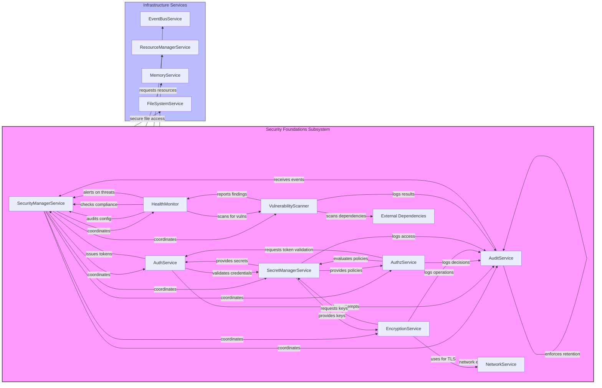
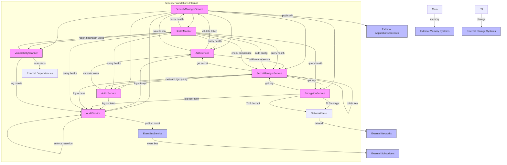
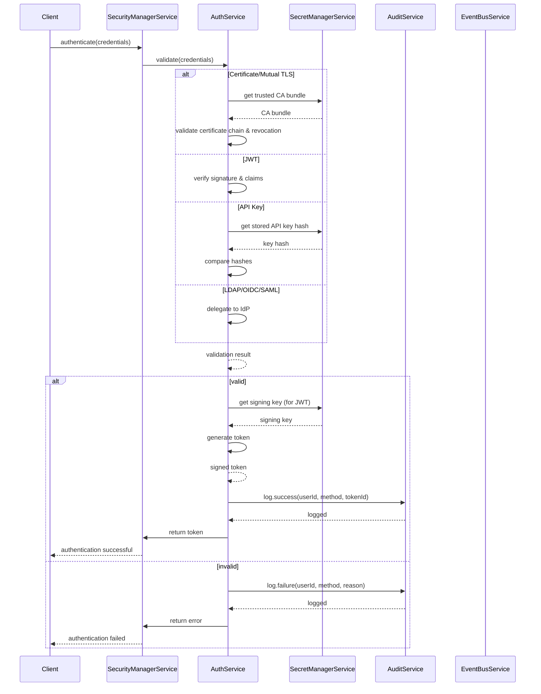
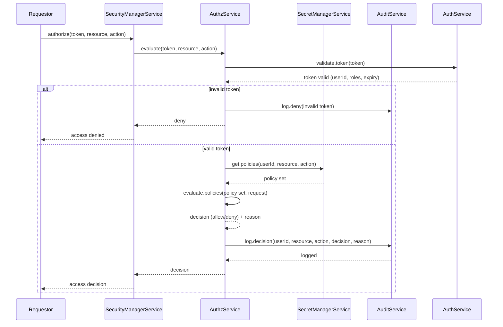
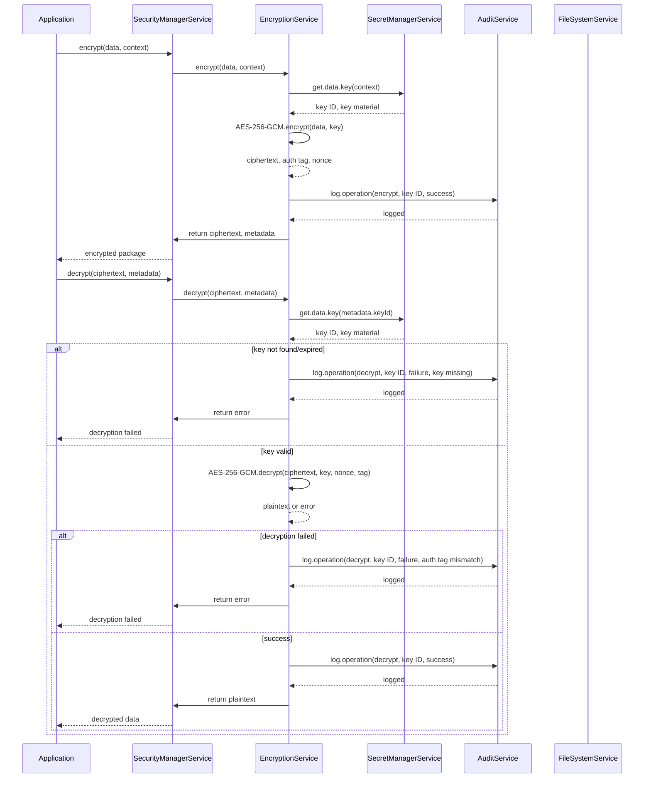
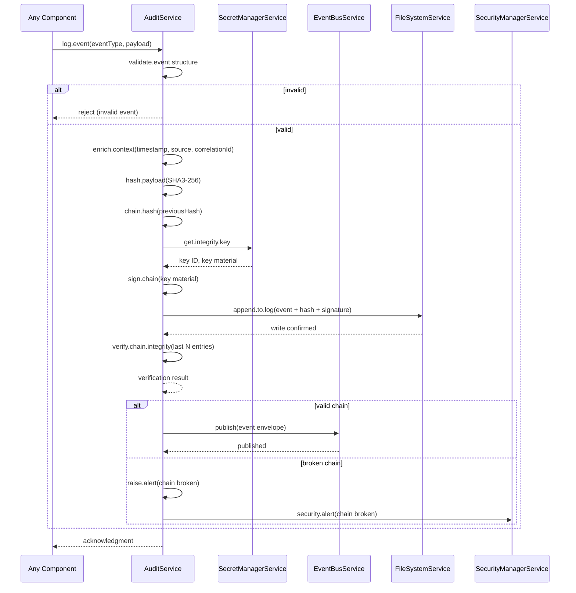
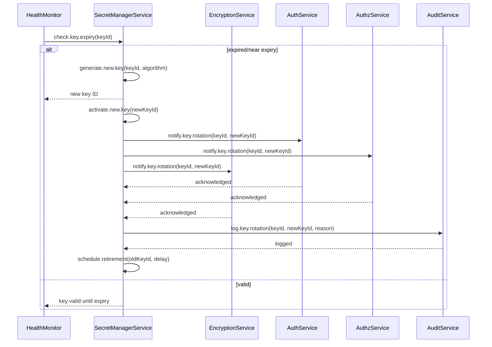

**Authentication Flow**: Client → SecurityManagerService (authenticate) → AuthService (validate credentials) → SecretManagerService (retrieve secrets) → AuditService (log attempt) → SecurityManagerService (return token/denial)

**Authorization Flow**: Requestor → SecurityManagerService (authorize) → AuthzService (evaluate policy) → SecretManagerService (retrieve policies) → AuditService (log decision) → SecurityManagerService (return allow/deny)

**Key Rotation Flow**: HealthMonitor (detect expiry) → SecretManagerService (generate new key) → EncryptionService (update encryption contexts) → AuditService (log rotation) → SecretManagerService (distribute new key, retire old)

**Audit Logging Flow**: Any Security Component → AuditService (ingest event) → AuditService (cryptographically hash & chain) → AuditService (verify integrity) → AuditService (enforce retention) → EventBusService (publish audit event for consumers)

**Health Monitoring Flow**: HealthMonitor → All Security Components (health queries) → Component Responses → HealthMonitor (aggregated security status)

**Vulnerability Scan Flow**: HealthMonitor (initiate scan) → Vulnerability Scanner (scan dependencies/config) → AuditService (log findings) → HealthMonitor (aggregate results) → SecurityManagerService (trigger alerts if critical)

**Encryption Flow**: Data Owner → EncryptionService (encrypt/decrypt) → SecretManagerService (retrieve keys) → AuditService (log crypto operation) → Storage/Network Layer (store/transmit)

## 2. Processing Pipelines
The Security Foundations subsystem implements secure processing pipelines for authentication, authorization, encryption, and auditing operations. Each pipeline enforces strict ordering, validation, and audit trails to ensure security properties are maintained throughout processing.

### Authentication Pipeline
1. **Credential Presentation**: Client presents credentials via supported mechanism (mTLS cert, JWT, API key, client cert)
2. **Mechanism Selection**: AuthService identifies authentication mechanism from request metadata
3. **Credential Validation**: AuthService validates credential syntax and expiration
4. **Secret Retrieval**: AuthService requests secret/key from SecretManagerService for validation (if applicable)
5. **Credential Verification**: AuthService verifies credential against stored secret/key
6. **Audit Logging**: AuthService logs authentication attempt (success/failure) via AuditService
7. **Token Generation** (on success): AuthService generates signed token with claims and expiration
8. **Response**: SecurityManagerService returns token or error to client

### Authorization Pipeline
1. **Access Request**: Component requests access to resource with presented credentials
2. **Token Validation**: AuthzService validates token signature and expiration via AuthService
3. **Principal Extraction**: AuthzService extracts user/role claims from validated token
4. **Policy Retrieval**: AuthzService requests relevant RBAC policies from SecretManagerService
5. **Policy Evaluation**: AuthzService evaluates request against policies using RBAC engine
6. **Decision Logging**: AuthzService logs authorization decision via AuditService
7. **Response**: SecurityManagerService returns allow/deny decision with rationale

### Encryption Pipeline (Data at Rest)
1. **Encryption Request**: Component requests data encryption with context (data classification, retention)
2. **Key Retrieval**: EncryptionService requests data encryption key from SecretManagerService
3. **Key Validation**: SecretManagerService verifies key suitability for operation and context
4. **Encryption Operation**: EncryptionService performs AES-256-GCM encryption with authenticated metadata
5. **Integrity Logging**: EncryptionService logs operation details via AuditService
6. **Storage**: Encrypted data and metadata stored via StorageKernel
7. **Decryption Mirror**: Reverse process for decryption with integrity verification

### Encryption Pipeline (Data in Transit)
1. **Connection Initiation**: Component initiates network connection via NetworkKernel
2. **TLS Handshake Negotiation**: EncryptionService manages TLS 1.3 handshake with peer
3. **Certificate Validation**: EncryptionService validates peer certificate via TrustStore in SecretManagerService
4. **Key Exchange**: Ephemeral key exchange performed with forward secrecy
5. **Session Key Derivation**: Symmetric keys derived for record layer encryption
6. **Audit Logging**: Connection establishment logged via AuditService
7. **Secure Communication**: Application data encrypted/decrypted via TLS record layer
8. **Connection Tearsown**: Session keys destroyed, connection logged

### Audit Pipeline
1. **Event Reception**: AuditService receives security event from any component
2. **Structural Validation**: AuditService validates event structure against schema
3. **Context Enrichment**: AuditService adds timestamp, source component, correlation ID
4. **Cryptographic Hashing**: AuditService computes SHA3-256 hash of event content
5. **Chain Linking**: AuditService combines current hash with previous chain value
6. **Storage**: Chained hash and event written to append-only audit log
7. **Integrity Verification**: Periodic verification of chain continuity performed
8. **Retention Enforcement**: Expired entries purged per retention policy with cryptographic proof
9. **Event Publication**: Audit event published to EventBus for consumers

## 3. Runtime Lifecycle
The Security Foundations subsystem follows a defined lifecycle that integrates with the Hermes Kernel bootstrap and operation sequences, ensuring security controls are established before any workload execution.

### Initialization Sequence
1. **SecurityManagerService Bootstrap**: Initializes during Hermes Kernel service initialization phase
2. **SecretManagerService Initialization**: 
   - Loads master key from secure hardware (TPM/HSM) or sealed storage
   - Initializes cryptographic providers and random number generators
   - Sets up key rotation schedules and retention policies
3. **AuthService Initialization**:
   - Loads identity provider configurations (LDAP, OIDC endpoints, etc.)
   - Initializes token signing/verification keys
   - Configures supported authentication mechanisms
4. **AuthzService Initialization**:
   - Loads default RBAC policies and role hierarchies
   - Initializes policy decision point (PDP) engine
   - Sets up policy distribution listeners
5. **EncryptionService Initialization**:
   - Initializes cryptographic contexts for TLS 1.3 and AES-256-GCM
   - Loads default cipher suites and protocol versions
   - Sets up key derivation functions and salt generators
6. **AuditService Initialization**:
   - Initializes cryptographic chaining mechanism
   - Sets up audit log storage backend and rotation policies
   - Generates initial chain verification key
7. **HealthMonitor Initialization**:
   - Configures vulnerability scan schedules and threat intelligence feeds
   - Initializes compliance checkers and configuration auditors
   - Sets up alerting thresholds and notification channels
8. **Security Coordinator Activation**:
   - Registers security policies with all infrastructure services
   - Establishes zero-trust enforcement points
   - Begins policy distribution and enforcement

### Operational Phase
During normal operation:
- All access requests flow through SecurityManagerService for mediation
- Authentication tokens issued with short lifespans (typically 15-60 minutes)
- Continuous authentication via token validation on each request
- Authorization decisions cached briefly (seconds) with invalidation on policy change
- Encryption keys rotated per schedule or upon suspected compromise
- Audit logs continuously written and verified for chain integrity
- Health monitors perform periodic scans and report metrics
- Security policies updated dynamically without service restart

### Shutdown Sequence
1. **Security Quiescence**: SecurityManagerService stops accepting new auth/z requests
2. **In-flight Request Drain**: Allows pending authentication/authorization requests to complete
3. **Key Zeroization**: 
   - Active encryption keys zeroized from memory
   - Session keys invalidated and purged
   - Ephemeral keys from TLS sessions cleared
4. **Audit Log Finalization**:
   - Final hash chain value computed and stored
   - Audit log integrity verified and sealed
   - Log storage flushed to persistent media
5. **Component Shutdown**: 
   - HealthMonitor stops scanning and saves state
   - SecretManagerService locks key vault and erases cached keys
   - AuthService invalidates all cached tokens and sessions
   - AuthzService persists policy state and releases resources
6. **Security Manager Termination**: 
   - Security policies revoked from infrastructure services
   - Zero-trust enforcement points disabled
   - Final security state snapshot recorded

## 4. State Model
The Security Foundations subsystem maintains several state machines to manage security lifecycles, cryptographic material, and access control decisions. These state machines ensure deterministic behavior and enable secure recovery from failures.

### State Model Overview


### State Definitions
- **Initializing**: Security subsystem is booting, loading configuration and initializing cryptographic materials
- **KeyInitialization**: Process of loading and validating master encryption key from HSM or secure storage
- **ConfigLoading**: Process of loading authentication, authorization, encryption, and audit configurations
- **Ready**: All subsystems initialized but not yet handling requests (awaiting kernel ready signal)
- **Operational**: Normal operation state, servicing authentication, authorization, encryption, and audit requests
- **KeyRotation**: Process of generating new cryptographic key version and distributing to consumers
- **KeyGeneration**: Creation of new key version using cryptographically secure random number generator
- **KeyDistribution**: Secure distribution of new key to authorized consumers via encrypted channels
- **KeyRetirement**: Scheduled deletion of old key version after cryptoperiod expiration
- **PolicyUpdate**: Process of updating authorization policies in response to configuration changes
- **PolicyFetch**: Retrieval of updated policy definitions from policy store
- **PolicyValidation**: Syntactic and semantic validation of policy expressions
- **PolicyActivation**: Activation of new policies and invalidation of cached decisions
- **AuthRequest**: Processing of authentication request from client
- **CredentialValidation**: Validation of presented credentials (password, certificate, etc.)
- **TokenValidation**: Validation of presented authentication token (JWT, session token, etc.)
- **SecretLookup**: Retrieval of validation secret from secure vault
- **CredentialCheck**: Cryptographic verification of credential against stored secret
- **AuthSuccess**: Authentication successful, principal validated
- **AuthFailure**: Authentication failed, invalid or expired credentials
- **TokenIssuance**: Generation of signed access token with expiration and claims
- **AuditLogging**: Recording of authentication outcome to immutable audit log
- **AuthzRequest**: Processing of authorization request for resource access
- **TokenExtraction**: Extraction and validation of authentication token from request
- **PrincipalResolution**: Resolution of user identity and group membership from token
- **PolicyFetch**: Retrieval of applicable RBAC policies for user/resource/action
- **PolicyEvaluation**: Evaluation of access request against policies using RBAC engine
- **AccessGranted**: Policy evaluation resulted in permit decision
- **AccessDenied**: Policy evaluation resulted in deny decision
- **CryptoOp**: Encryption or decryption operation request
- **KeyRetrieval**: Retrieval of appropriate encryption key from key vault
- **OperationSelection**: Determination of whether to encrypt or decrypt based on operation type
- **Encryption**: AES-GCM encryption of plaintext with authentication tag generation
- **Decryption**: AES-GCM decryption of ciphertext with authentication tag verification
- **IntegrityProtection**: Generation of authentication tag for ciphertext integrity
- **IntegrityVerification**: Verification of authentication tag for ciphertext integrity
- **OpSuccess**: Cryptographic operation completed successfully
- **OpFailure**: Cryptographic operation failed (invalid tag, incorrect key, etc.)
- **HealthCheck**: Periodic security health assessment execution
- **VulnerabilityScan**: Scanning of dependencies and configurations for known vulnerabilities
- **ConfigAudit**: Auditing of system configuration for drift from approved baselines
- **ComplianceCheck**: Checking against regulatory and internal compliance frameworks
- **ThreatAssessment**: Evaluation of vulnerability severity and exploit likelihood
- **AlertGeneration**: Creation of security alert for significant findings
- **Error**: Error state encountered during security operation requiring intervention
- **Alerting**: Notification of security administrators about error condition
- **ManualIntervention**: Requirement for human operator to resolve error condition
- **RecoveryAttempt**: Automatic attempt to recover from error state
- **Degraded**: Reduced functionality state where some security features unavailable
- **Failure**: Unrecoverable error state requiring manual intervention and possible system restart

## 5. Coordination with other infrastructure subsystems
The Security Foundations subsystem integrates with all other Part 9 infrastructure subsystems to provide comprehensive security enforcement across the AI-OS platform.

### Coordination with Hermes Kernel
- **Bootstrap Integration**: SecurityManagerService initialized during Kernel service initialization phase
- **Policy Distribution**: Security policies distributed to all kernel subsystems during bootstrap
- **Zero Trust Enforcement**: All kernel subsystem requests mediated through SecurityManagerService
- **Event Consumption**: Kernel subsystems consume security events via EventBus for audit and monitoring
- **Health Reporting**: Security health status contributed to overall kernel health assessment
- **Replay Integration**: Security events included in system state snapshots for deterministic replay
- **Resource Coordination**: Security operations coordinated with ResourceCoordinator for CPU/memory budgets

### Coordination with EventBus Service
- **Secure Event Publishing**: All security events published via EventBus with message-level encryption
- **Subscription Authentication**: EventBus subscriptions authenticated via SecurityManagerService
- **Topic Authorization**: EventBus topic access controlled via AuthzService RBAC policies
- **Message Encryption**: Optionally encrypt sensitive event payloads using EncryptionService
- **Audit Consumption**: AuditService consumes security events from EventBus for centralized logging
- **Policy Distribution**: Security policy updates distributed via EventBus to subscribed components
- **Health Monitoring**: Security health events published to EventBus for monitoring consumption

### Coordination with Resource Management Service
- **Resource Quotas**: Security operations subject to CPU, memory, and I/O quotas enforced by ResourceManager
- **Secure Allocation**: Memory allocations for cryptographic operations use protected memory regions
- **Resource Tagging**: Security contexts attached to resource allocations for usage tracking
- **Quota Enforcement**: Enforcement of security-specific resource limits (key cache size, crypto operations/sec)
- **Isolation Enforcement**: Security-sensitive operations isolated in dedicated execution contexts
- **Resource Accounting**: Cryptographic operation costs tracked and attributed to requesting entities
- **Secure Deallocation**: Cryptographic material zeroized before memory deallocation to prevent leaks

### Coordination with Kernel Subsystems (Scheduler, Isolation, etc.)
- **Scheduler Integration**: Security contexts influence process scheduling priorities and CPU affinity
- **Isolation Enforcement**: Security boundaries enforced via IsolationKernel namespaces and seccomp profiles
- **Filesystem Security**: File access decisions mediated via AuthzService with filesystem-specific policies
- **Network Security**: Network access decisions mediated via AuthzService with network-specific policies
- **Process Creation**: New processes inherit security context and undergo authentication/authorization
- **Thread Security**: Thread-local security storage initialized and cleared per security context
- **IPC Security**: Inter-process communication secured via mutual authentication and message encryption

## 6. Security Model
The Security Foundations subsystem implements a comprehensive zero-trust security model based on industry best practices and governmental standards, ensuring defense-in-depth protection for all AI-OS assets.

### Zero Trust Architecture
- **Never Trust, Always Verify**: Every request authenticated and authorized regardless of origin or network location
- **Least Privilege Access**: Subjects granted minimum permissions necessary to perform authorized functions
- **Microsegmentation**: Workloads isolated with granular east-west traffic controls based on identity
- **Continuous Authentication**: Re-authentication performed periodically and on risk-indicating events
- **Policy-Driven Access**: Access decisions based on dynamic policies evaluating identity, context, and risk
- **Assume Breach**: Architecture assumes compromise and focuses on containment and limiting blast radius
- **Secure Access Service Edge**: Security controls applied consistently across all access vectors (user, device, application, network)

### Identity and Access Management
- **Strong Identity Proofing**: Multi-factor authentication required for privileged access
- **Federated Identity**: Support for SAML, OIDC, LDAP, and certificate-based identity providers
- **Just-In-Time Access**: Privileged access granted temporarily based on approval workflows
- **Role-Based Access Control**: Fine-grained RBAC with role hierarchies and constraint-based policies
- **Attribute-Based Access Control**: ABAC policies supporting environmental and risk-based conditions
- **Service Identities**: Machine-to-machine authentication via service accounts and workload identities
- **Identity Lifecycle**: Automated provisioning and deprovisioning integrated with HR and CMDB systems

### Data Protection
- **Encryption Everywhere**: AES-256-GCM for data at rest, TLS 1.3 with forward secrecy for data in transit
- **Key Management**: Hardware-backed key storage with automatic rotation and separation of duties
- **Data Classification**: Automatic labeling and handling based on sensitivity and regulatory requirements
- **Data Loss Prevention**: Content inspection and blocking for sensitive data exfiltration attempts
- **Tokenization**: Replacement of sensitive data with non-sensitive equivalents where appropriate
- **Privacy Enhancing Techniques**: Differential privacy and homomorphic encryption for analytics workloads
- **Key Usage Policies**: Cryptographic keys bound to specific purposes, algorithms, and validity periods

### Security Monitoring and Response
- **Continuous Monitoring**: Real-time collection and analysis of security telemetry from all sources
- **Threat Intelligence**: Integration with commercial and open-source threat feeds for IOC detection
- **User and Entity Behavior Analytics**: UEBA detection of anomalous user and system behaviors
- **Security Orchestration**: Automated response playbooks for common incident scenarios
- **Forensic Capabilities**: Immutable audit trails enabling point-in-time reconstruction of events
- **Vulnerability Management**: Continuous scanning and prioritized remediation of security vulnerabilities
- **Incident Response**: Coordinated response workflow with containment, eradication, and recovery phases

- **Security Information and Event Management (SIEM)**: Centralized correlation and analysis of security events
- **Threat Hunting**: Proactive search for indicators of compromise using behavioral analytics
- **Deception Technology**: Deployment of decoys and traps to detect and study attacker behavior
- **Rhythm of Security**: Regular assessment cycles including penetration testing, red teaming, and audits

### Compliance and Governance
- **Regulatory Alignment**: Controls designed to meet SOC 2, ISO 27001, HIPAA, GDPR, PCI DSS, and FedRAMP
- **Policy Management**: Centralized policy creation, versioning, distribution, and attestation workflows
- **Risk Assessment**: Formal risk assessment methodology applied to new systems and changes
- **Control Validation**: Regular testing of control effectiveness through automated testing and manual reviews
- **Audit Readiness**: Continuous evidence collection and preparation for compliance examinations
- **Third-Party Risk**: Supplier security assessments and continuous monitoring of third-party connections
- **Data Governance**: Data lifecycle management including retention, archival, and secure disposal
- **Security Training**: Role-based security awareness and technical training programs

### Cryptographic Principles
- **Algorithm Selection**: Use of NIST-approved and FIPS 140-2 validated cryptographic algorithms
- **Key Strength**: Minimum 256-bit symmetric keys and 3072-bit asymmetric keys for long-term security
- **Random Number Generation**: CSPRNGs seeded from entropy sources meeting NIST SP 800-90B requirements
- **Key Lifetime**: Cryptoperiods based on NIST SP 800-57 recommendations for key usage and data volume
- **Key Usage Separation**: Distinct keys for encryption, authentication, digital signatures, and key wrapping
- **Perfect Forward Secrecy**: Ephemeral key exchange in TLS 1.3 ensuring session key compromise doesn't reveal past sessions
- **Authenticated Encryption**: Use of AEAD ciphers (AES-GCM) providing confidentiality and integrity guarantees
- **Side-Channel Resistance**: Constant-time implementations and blinding techniques to mitigate timing attacks
- **Cryptographic Agility**: Algorithm agility design enabling updates without system downtime
- **Hardware Acceleration**: Utilization of AES-NI, SHA extensions, and other CPU cryptographic instructions

## 7. Failure Handling
The Security Foundations subsystem implements comprehensive failure handling mechanisms to maintain security posture even during adverse conditions, following fail-secure principles and ensuring no weakening of security controls during failures.

### Failure Detection
- **Health Monitoring**: Continuous component health checks with sub-second failure detection
- **Anomaly Detection**: Statistical analysis of operational metrics for early failure indication
- **Dependency Tracking**: Real-time monitoring of external service dependencies (HSM, KMS, LDAP)
- **Resource Exhaustion**: Proactive detection of CPU, memory, file descriptor, and network resource depletion
- **Cryptographic Failures**: Detection of decryption failures, signature verification errors, and key usage violations
- **Audit Trail Breaches**: Monitoring for gaps, tampering, or failure in cryptographic hash chaining
- **Authentication Surges**: Detection of credential stuffing, brute force, or password spray attacks
- **Authorization Anomalies**: Identification of privilege escalation attempts and abnormal access patterns
- **Configuration Drift**: Continuous comparison against approved baselines for unauthorized changes

### Failure Isolation
- **Bulkhead Isolation**: Security subsystem components isolated via separate processes and memory spaces
- **Resource Quotas**: Hard limits on CPU, memory, and I/O consumption preventing noisy neighbor impacts
- **Network Segmentation**: Separate network segments for management plane vs. data plane traffic
- **Failure Containment**: Automatic isolation of failing components to prevent cascade failures
- **Security Boundary Integrity**: Maintenance of isolation boundaries even during component failures
- **Fail-Closed vs Fail-Open**: Authentication and authorization failures default to deny (fail-secure)
- **Circuit Breaker Pattern**: Temporary suspension of failing external dependencies with gradual recovery
- **Bulkhead Quotas**: Dedicated resource pools for critical security functions (auth, audit, key management)
- **Process Isolation**: Security-critical functions run in restricted execution contexts with minimal privileges

### Recovery Mechanisms
- **Graceful Degradation**: Reduced functionality mode maintaining core security controls during partial failures
- **State Checkpointing**: Periodic saving of security state enabling fast recovery from transient failures
- **Automatic Failover**: Hot standby components ready to take over upon primary failure detection
- **State Synchronization**: Active-active replication for stateless components with consensus for stateful ones
- **Rolling Restarts**: Sequential component restart maintaining service availability during updates
- **Checkpoint Restoration**: Restoration to last known good state following corruption detection
- **Manual Override**: Emergency procedures for bypassing failed automation when safety permits
- **Backup and Restore**: Regular encrypted backups of security configuration and state for disaster recovery
- **Chaos Engineering**: Regular fault injection exercises validating recovery mechanisms and response times

### Specific Failure Scenarios
- **HSM/KMS Unavailable**: Fallback to software key store with increased audit logging and alerting
- **Identity Provider Unreachable**: Cached credential validation with short-term fallback to MFA tokens
- **Policy Distribution Failure**: Continued enforcement of last known good policies with alerts
- **Audit Log Failure**: Local buffering with exponential backoff and alerting; potential switch to logging to console
- **Cryptographic Operation Failure**: Detailed error logging without leaking sensitive information; secure cleanup
- **Resource Exhaustion**: Graceful rejection of new requests with preservation of ongoing critical operations
- **Network Partition**: Continued local decision-making with queued remote operations and split-brain prevention
- **Compromised Component**: Immediate isolation, forensic data collection, and service restart from clean image
- **Clock Skew**: Detection and rejection of tokens/tickets with excessive time skew; alerting on NTP failure

## 8. Validation Rules
The Security Foundations subsystem enforces rigorous validation rules at all trust boundaries to prevent injection attacks, bypasses, and misuse of security functionality, following the principle of validating all inputs and assuming malicious intent.

### Input Validation
- **Credential Validation**: 
  - Passwords: Minimum length 12 characters, complexity requirements, breach password checking
  - Certificates: Chain validation, expiration checking, revocation status (OCSP/CRL), hostname validation
  - Tokens: Signature verification, expiration checks, audience validation, issuer verification, claim validation
  - API Keys: Format validation, length checking, character set validation, rate limit enforcement
  - SSH Keys: Key type validation, format validation, prohibition of weak keys (DSA, small RSA)
- **Policy Validation**:
  - Syntax Validation: RBAC policy grammar validation using ANTLR or similar parser
  - Semantic Validation: Detection of circular role references, impossible constraints, over-privileged rules
  - Size Limits: Policy document size limits to prevent resource exhaustion attacks
  - Change Validation: Prevention of privilege escalation through policy updates
- **Cryptographic Inputs**:
  - Key Material: Validation of key format, length, parity, and weakness checks
  - Initialization Vectors: Verification of uniqueness and unpredictability requirements
  - Authentication Tags: Verification of tag length and cryptographic correctness
  - Nonces: Assurance of uniqueness within key lifetime to prevent nonce reuse
  - Salts: Validation of entropy and uniqueness requirements for password hashing
- **API Inputs**:
  - Parameter Validation: Strict type checking, range validation, and format enforcement
  - Command Injection: Prevention of shell, SQL, LDAP, and XPath injection through parameterization
  - Path Traversal: Validation and normalization of file paths to prevent directory escape
  - XXE Protection: Disabling of external entity processing in XML parsers
  - Deserialization Safety: Restriction of deserializable types and use of allowlists
  - Size Limitations: Enforcement of message and payload size limits to prevent DoS
  - Encoding Handling: Proper handling of UTF-8 and prevention of overlong sequences and surrogates

### Output Validation
- **Audit Log Integrity**: Continuous verification of hash chain integrity with alerting on breaks
- **Token Generation**: Validation of issued tokens against signing keys and claim restrictions
- **Encryption Output**: Verification of ciphertext length and format consistency
- **Random Number Output**: Statistical testing of RNG output for uniformity and unpredictability
- **Security Headers**: Validation of HTTP security headers in outgoing responses
- **Error Messages**: Sanitization of error messages to prevent information leakage
- **Log Output**: Prevention of log injection through character escaping and encoding
- **Response Headers**: Validation of security-related headers (CSP, HSTS, X-Frame-Options, etc.)

### Runtime Validation
- **Session Validation**: Periodic revalidation of active sessions and token validity
- **Context Validation**: Continuous verification of execution environment integrity (ptrace, ldpreload, etc.)
- **Memory Protection**: Validation of ASLR, DEP, and stack canary effectiveness
- **File System Checks**: Verification of file permissions and ownership on security-critical files
- **Network Validation**: Confirmation of expected network interfaces and absence of promiscuous mode
- **Process Integrity**: Validation of expected process trees and absence of unauthorized processes
- **Module Verification**: Confirmation of loaded kernel modules and absence of unauthorized modifications
- **Boot Integrity**: Validation of secure boot state and measured boot chain integrity
- **Hardware Security**: Verification of TPM state and Intel SGX enclave integrity where available

## 9. Runtime Invariants
The Security Foundations subsystem maintains strict runtime invariants that must always hold true to ensure the integrity and effectiveness of security controls. These invariants are continuously monitored and enforced through automated checks and validation mechanisms.

### Core Security Invariants
- **INV-SEC-9.1**: All access requests MUST be authenticated and authorized before resource access is granted
- **INV-SEC-9.2**: No cryptographic key material shall ever persist in plaintext beyond immediate use context
- **INV-SEC-9.3**: Audit log integrity chain MUST be unbroken and cryptographically verifiable at all times
- **INV-SEC-9.4**: Security policy decisions MUST be immutable and tamper-evident once recorded
- **INV-SEC-9.5**: Failed authentication attempts SHALL be rate-limited and monitored for attack patterns
- **INV-SEC-9.6**: Privileged operations SHALL require just-in-time approval and time-bound authorization
- **INV-SEC-9.7**: All network communications SHALL be encrypted using approved protocols and cipher suites
- **INV-SEC-9.8**: Security-critical processes SHALL run with minimal necessary privileges (principle of least privilege)
- **INV-SEC-9.9**: Memory containing sensitive data SHALL be zeroized immediately after use
- **INV-SEC-9.10**: Security subsystem components SHALL fail closed (deny access) upon encountering unrecoverable errors
- **INV-SEC-9.11**: Clock synchronization SHALL be maintained within acceptable limits for time-based security operations
- **INV-SEC-9.12**: Vulnerability scan definitions SHALL be updated at least daily from trusted sources
- **INV-SEC-9.13**: Security audit logs SHALL be retained for minimum period defined by regulatory requirements
- **INV-SEC-9.14**: Cryptographic operations SHALL use constant-time implementations to prevent timing attacks
- **INV-SEC-9.15**: Security policy updates SHALL undergo automated validation before deployment to production
- **INV-SEC-9.16**: All security-relevant events SHALL be captured in the immutable audit trail with full context
- **INV-SEC-9.17**: External dependency failures SHALL trigger graceful degradation rather than security weakening
- **INV-SEC-9.18**: Security session timeouts SHALL be enforced regardless of user activity or network conditions
- **INV-SEC-9.19**: Password storage SHALL use adaptive hashing algorithms with appropriate work factors
- **INV-SEC-9.20**: Cryptographic key rotation SHALL occur according to defined cryptoperiods or upon suspicion of compromise

### Authentication Invariants
- **INV-AUTH-9.1**: Passwords SHALL never be stored or transmitted in plaintext form
- **INV-AUTH-9.2**: Multi-factor authentication SHALL be required for all privileged and remote access
- **INV-AUTH-9.3**: Authentication tokens SHALL contain expiration times and be rejected if expired
- **INV-AUTH-9.4**: Same-factor authentication attempts SHALL be rate-limited per username and IP address
- **INV-AUTH-9.5**: Authentication failure messages SHALL not reveal whether username or password was incorrect
- **INV-AUTH-9.6**: Certificate validation SHALL include revocation checking and hostname verification
- **INV-AUTH-9.7**: Authentication secrets SHALL be rotated periodically or upon suspected compromise
- **INV-AUTH-9.8**: Authentication systems SHALL implement account lockout after configurable failed attempts
- **INV-AUTH-9.9**: Authentication tokens SHALL be bound to specific client characteristics (IP, user agent, etc.)
- **INV-AUTH-9.10**: Authentication SHALL integrate with threat intelligence to block known malicious actors

### Authorization Invariants
- **INV-AUTHZ-9.1**: Access decisions SHALL be based on immutable policy evaluation rather than mutable attributes
- **INV-AUTHZ-9.2**: Role definitions SHALL follow principle of least privilege with regular privilege reviews
- **INV-AUTHZ-9.3**: Permission grants SHALL be time-bound and subject to periodic recertification
- **INV-AUTHZ-9.4**: Separation of duties constraints SHALL be enforced for critical operations
- **INV-AUTHZ-9.5**: Privilege escalation paths SHALL be systematically identified and blocked
- **INV-AUTHZ-9.6**: Dynamic authorization decisions SHALL consider risk factors and contextual signals
- **INV-AUTHZ-9.7**: Authorization caches SHALL be invalidated immediately upon policy or role changes
- **INV-AUTHZ-9.8**: Access to audit logs SHALL be restricted to authorized security personnel only
- **INV-AUTHZ-9.9**: Break-glass access SHALL require multi-party approval and comprehensive logging
- **INV-AUTHZ-9.10**: Authorization policies SHALL be tested against known attack patterns before deployment

### Cryptographic Invariants
- **INV-CRYPTO-9.1**: All cryptographic keys SHALL be generated using cryptographically secure random number generators
- **INV-CRYPTO-9.2**: Private keys SHALL never exist outside secure cryptographic boundaries (HSM, TSM, encrypted memory)
- **INV-CRYPTO-9.3**: Symmetric keys SHALL be rotated at least annually or as dictated by data volume and regulations
- **INV-CRYPTO-9.4**: Asymmetric key pairs SHALL have minimum strength of 3072 bits for RSA and 256 bits for ECC
- **INV-CRYPTO-9.5**: Cryptographic algorithms SHALL be limited to NIST-approved and FIPS 140-2 validated options
- **INV-CRYPTO-9.6**: Initialization vectors and nonces SHALL guarantee uniqueness within key lifetime
- **INV-CRYPTO-9.7**: Authenticated encryption modes (GCM, CCM) SHALL be used to provide confidentiality and integrity
- **INV-CRYPTO-9.8**: Key derivation functions SHALL use approved constructions (HKDF, PBKDF2) with sufficient entropy
- **INV-CRYPTO-9.9**: Cryptographic implementations SHALL resist side-channel attacks through constant-time operations
- **INV-CRYPTO-9.10**: Key wrap algorithms SHALL be used when transferring keys between security domains
- **INV-CRYPTO-9.11**: Cryptographic modules SHALL undergo regular FIPS 140-2 validation and revalidation
- **INV-CRYPTO-9.12**: Ephemeral keys used in key exchange SHALL be discarded immediately after use
- **INV-CRYPTO-9.13**: Public key infrastructure SHALL maintain certificate revocation lists and OCSP responders
- **INV-CRYPTO-9.14**: Cryptographic error messages SHALL NOT reveal information useful for cryptographic attacks
- **INV-CRYPTO-9.15**: Random number generators SHALL undergo continuous statistical testing and health monitoring

### Audit and Logging Invariants
- **INV-AUDIT-9.1**: All security-relevant events SHALL be logged to the immutable audit trail with full context
- **INV-AUDIT-9.2**: Audit log writes SHALL be atomic and durable to prevent loss during system crashes
- **INV-AUDIT-9.3**: Audit trail integrity SHALL be verified continuously using cryptographic hash chaining
- **INV-AUDIT-9.4**: Audit log access SHALL be restricted to read-only for all except privileged maintenance roles
- **INV-AUDIT-9.5**: Audit log entries SHALL include tamper-evident timestamps from trusted time sources
- **INV-AUDIT-9.6**: Audit log forwarding SHALL use encrypted and authenticated channels to prevent tampering
- **INV-AUDIT-9.7**: Audit log retention SHALL comply with regulatory requirements and organizational policies
- **INV-AUDIT-9.8**: Audit log search and retrieval SHALL preserve integrity and chain of custody
- **INV-AUDIT-9.9**: Audit system shutdown SHALL preserve final state and enable seamless restart
- **INV-AUDIT-9.10**: Failed audit logging attempts SHALL trigger alerts and fallback to secure local storage

## 10. JSON Schemas
The Security Foundations subsystem utilizes JSON Schema Draft 2020-12 for all configuration and state validation, leveraging shared schemas where appropriate and defining security-specific schemas only when necessary.

### Referenced Schemas
The subsystem references these shared schemas defined in PART9_CONTEXT.md:
- **EventEnvelope**: `shared/EventEnvelope.json` (Section 14.1) - used for all security event validation
- **SecurityContract**: `shared/SecurityContract.json` (Section 13.4) - defines the infrastructure contract
- **AuthPolicy**: `shared/AuthPolicy.json` (referenced in Section 15.3 event types for validation context)
- **EncryptionStandard**: `shared/EncryptionStandard.json` (defines supported encryption algorithms and modes)

### Security-Specific Schemas
#### SecurityContext Schema
Defines the security context associated with processes, threads, and execution contexts in the Hermes Kernel.

```json
{
  "$schema": "https://json-schema.org/draft/2020-12/schema",
  "title": "SecurityContext",
  "type": "object",
  "required": ["userId", "groupIds", "capabilities", "authenticationMethod", "authenticationTime"],
  "properties": {
    "userId": {
      "type": "string",
      "description": "Unique identifier for the authenticated user or service account"
    },
    "groupIds": {
      "type": "array",
      "items": {
        "type": "string"
      },
      "description": "List of group identifiers the subject belongs to for authorization"
    },
    "privileges": {
      "type": "array",
      "items": {
        "type": "string"
      },
      "description": "Specific privileges granted beyond group memberships"
    },
    "roles": {
      "type": "array",
      "items": {
        "type": "string"
      },
      "description": "RBAC roles assigned to this security context"
    },
    "attributes": {
      "type": "object",
      "additionalProperties": {
        "type": ["string", "number", "boolean", "null"]
      },
      "description": "Key-value pairs of attributes for ABAC policy evaluation"
    },
    "authenticationMethod": {
      "type": "string",
      "enum": ["mTLS", "JWT", "APIKey", "Certificate", "Kerberos", "LDAP", "OIDC", "SAML"],
      "description": "Authentication mechanism used to establish this identity"
    },
    "authenticationTime": {
      "type": "string",
      "format": "date-time",
      "description": "Timestamp when authentication was performed"
    },
    "authenticationExpiry": {
      "type": ["string", "null"],
      "format": "date-time",
      "description": "When this authentication expires and re-authentication is required"
    },
    "mfaVerified": {
      "type": "boolean",
      "description": "Whether multi-factor authentication was successfully completed"
    },
    "sessionId": {
      "type": ["string", "null"],
      "format": "uuid",
      "description": "Unique identifier for this authentication session"
    },
    "sourceAddress": {
      "type": ["string", "null"],
      "format": "ipv4",
      "description": "IP address of the authentication source"
    },
    "sourceHostname": {
      "type": ["string", "null"],
      "description": "Hostname of the authentication source"
    },
    "riskScore": {
      "type": ["number", "null"],
      "minimum": 0,
      "maximum": 100,
      "description": "Risk score associated with this authentication (0=low, 100=high)"
    },
    "delegationChain": {
      "type": ["array", "null"],
      "items": {
        "type": "string",
        "format": "uuid"
      },
      "description": "Chain of delegation tokens if this context was delegated"
    }
  },
  "additionalProperties": false
}
```

#### AuditEvent Schema
Defines the structure for security audit events transmitted via the EventBus.

```json
{
  "$schema": "https://json-schema.org/draft/2020-12/schema",
  "title": "AuditEvent",
  "type": "object",
  "required": ["eventId", "eventType", "correlationId", "causationId", "timestamp", "source", "version", "payload", "hash"],
  "properties": {
    "eventId": {
      "type": "string",
      "format": "uuid",
      "description": "Unique identifier for this audit event"
    },
    "eventType": {
      "type": "string",
      "pattern": "^aios\\.security\\.[a-z]+\\.[a-z]+(\\.[a-z]+)*$",
      "description": "Type of security audit event"
    },
    "correlationId": {
      "type": "string",
      "format": "uuid",
      "description": "Correlation ID for tracing related events across systems"
    },
    "causationId": {
      "type": "string",
      "format": "uuid",
      "description": "Causation ID indicating what caused this event"
    },
    "timestamp": {
      "type": "string",
      "format": "date-time",
      "description": "When this audit event occurred"
    },
    "source": {
      "type": "string",
      "enum": ["AuthService", "AuthzService", "EncryptionService", "SecretManagerService", "AuditService", "HealthMonitor", "VulnerabilityScanner", "SecurityManagerService"],
      "description": "Component that generated this audit event"
    },
    "version": {
      "type": "string",
      "pattern": "^\\d+\\.\\d+\\.\\d+$",
      "description": "Version of the audit event schema"
    },
    "payload": {
      "oneOf": [
        {
          "title": "AuthenticationAttempt",
          "properties": {
            "userId": {"type": "string"},
            "authMethod": {"type": "string", "enum": ["mTLS", "JWT", "APIKey", "Certificate", "Kerberos", "LDAP", "OIDC", "SAML"]},
            "success": {"type": "boolean"},
            "failureReason": {"type": ["string", "null"]},
            "mfaUsed": {"type": "boolean"},
            "riskScore": {"type": ["number", "null"], "minimum": 0, "maximum": 100}
          },
          "required": ["userId", "authMethod", "success"],
          "additionalProperties": false
        },
        {
          "title": "AuthorizationDecision",
          "properties": {
            "userId": {"type": "string"},
            "resource": {"type": "string"},
            "action": {"type": "string"},
            "decision": {"type": "string", "enum": ["allow", "deny"]},
            "reason": {"type": "string"},
            "rolesEvaluated": {"type": "array", "items": {"type": "string"}},
            "policiesApplied": {"type": "array", "items": {"type": "string"}}
          },
          "required": ["userId", "resource", "action", "decision"],
          "additionalProperties": false
        },
        {
          "title": "KeyOperation",
          "properties": {
            "keyId": {"type": "string", "format": "uuid"},
            "operation": {"type": "string", "enum": ["generate", "use", "rotate", "retire", "destroy", "export", "import"]},
            "algorithm": {"type": "string", "enum": ["AES-256-GCM", "RSA-4096", "ECDSA-P256", "HMAC-SHA256"]},
            "purpose": {"type": "string", "enum": ["encryption", "signing", "authentication", "key_wrapping"]},
            "success": {"type": "boolean"},
            "errorCode": {"type": ["string", "null"]}
          },
          "required": ["keyId", "operation", "algorithm", "purpose", "success"],
          "additionalProperties": false
        },
        {
          "title": "PolicyChange",
          "properties": {
            "policyId": {"type": "string", "format": "uuid"},
            "changeType": {"type": "string", "enum": ["create", "update", "delete", "activate", "deactivate"]},
            "policyType": {"type": "string", "enum": ["rbac", "abac", "pki", "secrets", "network"]},
            "changedBy": {"type": "string"},
            "changeReason": {"type": "string"},
            "previousVersion": {"type": ["string", "null"]},
            "newVersion": {"type": ["string", "null"]}
          },
          "required": ["policyId", "changeType", "policyType", "changedBy", "changeReason"],
          "additionalProperties": false
        },
        {
          "title": "VulnerabilityFinding",
          "properties": {
            "cveId": {"type": ["string", "null"], "pattern": "^CVE-\\d{4}-\\d{4,}$"},
            "component": {"type": "string"},
            "version": {"type": "string"},
            "severity": {"type": "string", "enum": ["low", "medium", "high", "critical"]},
            "description": {"type": "string"},
            "fixAvailable": {"type": "boolean"},
            "patchAvailable": {"type": "boolean"},
            "affectedComponent": {"type": ["string", "null"]}
          },
          "required": ["component", "version", "severity", "description"],
          "additionalProperties": false
        }
      ]
    },
    "hash": {
      "type": "string",
      "pattern": "^[a-fA-F0-9]{64}$",
      "description": "SHA3-256 hash of the event payload for integrity verification"
    },
    "previousHash": {
      "type": ["string", "null"],
      "pattern": "^[a-fA-F0-9]{64}$",
      "description": "Hash of previous audit event in chain for tamper evidence"
    }
  },
  "additionalProperties": false
}
```

#### SecurityPolicy Schema
Defines the structure for security policies managed by the AuthzService.

```json
{
  "$schema": "https://json-schema.org/draft/2020-12/schema",
  "title": "SecurityPolicy",
  "type": "object",
  "required": ["policyId", "version", "policyType", "rules", "createdAt", "updatedAt"],
  "properties": {
    "policyId": {
      "type": "string",
      "format": "uuid",
      "description": "Unique identifier for this security policy"
    },
    "version": {
      "type": "string",
      "pattern": "^\\d+\\.\\d+\\.\\d+$",
      "description": "Version of this policy configuration"
    },
    "policyType": {
      "type": "string",
      "enum": ["rbac", "abac", "network", "data", "api"],
      "description": "Type of security policy being defined"
    },
    "name": {
      "type": "string",
      "description": "Human-readable name for this policy"
    },
    "description": {
      "type": "string",
      "description": "Detailed description of policy purpose and scope"
    },
    "rules": {
      "type": "array",
      "items": {
        "type": "object",
        "required": ["effect", "conditions"],
        "properties": {
          "effect": {
            "type": "string",
            "enum": ["allow", "deny", "audit"],
            "description": "Access effect when all conditions are met"
          },
          "conditions": {
            "type": "object",
            "required": ["subject", "resource", "action"],
            "properties": {
              "subject": {
                "type": "object",
                "description": "Subject conditions (user, groups, roles, attributes)"
              },
              "resource": {
                "type": "object",
                "description": "Resource conditions (type, identifier, tags, sensitivity)"
              },
              "action": {
                "type": "object",
                "description": "Action conditions (verb, method, parameters)"
              },
              "environment": {
                "type": ["object", "null"],
                "description": "Environmental conditions (time, location, risk, device)"
              }
            },
            "additionalProperties": false
          },
          "priority": {
            "type": "integer",
            "minimum": 0,
            "description": "Priority for rule evaluation (lower numbers evaluated first)"
          },
          "ttlSeconds": {
            "type": ["integer", "null"],
            "minimum": 1,
            "description": "Time-to-live for this rule in seconds (null for permanent)"
          }
        },
        "additionalProperties": false
      },
      "description": "Ordered list of policy rules to evaluate"
    },
    "targets": {
      "type": ["array", "null"],
      "items": {
        "type": "string"
      },
      "description": "List of service or component IDs this policy applies to (null for global)"
    },
    "attributes": {
      "type": ["object", "null"],
      "additionalProperties": {
        "type": ["string", "number", "boolean", "null"]
      },
      "description": "Policy-level attributes for metadata and categorization"
    },
    "createdAt": {
      "type": "string",
      "format": "date-time",
      "description": "When this policy was initially created"
    },
    "updatedAt": {
      "type": "string",
      "format": "date-time",
      "description": "When this policy was last modified"
    },
    "createdBy": {
      "type": "string",
      "description": "Identifier of the user or process that created this policy"
    },
    "updatedBy": {
      "type": "string",
      "description": "Identifier of the user or process that last modified this policy"
    },
    "reviewDate": {
      "type": ["string", "null"],
      "format": "date-time",
      "description": "Date when this policy is scheduled for review"
    },
    "enabled": {
      "type": "boolean",
      "description": "Whether this policy is currently active and being enforced"
    }
  },
  "additionalProperties": false
}
```

## 11. Event Catalog
The Security Foundations subsystem publishes and subscribes to events via the EventBus. All events conform to the EventEnvelope schema (shared/EventEnvelope.json) and follow the naming conventions in PART9_CONTEXT.md §20.

### Authentication Events
Events related to authentication operations and outcomes:
| Event | Publisher | Subscribers | Payload Summary | Delivery Guarantee | Persistence | Replay Behaviour |
|-------|-----------|-------------|-----------------|-------------------|-------------|------------------|
| `aios.security.auth.attempt` | AuthService | AuditService, SecurityManagerService, HealthMonitor | User ID, auth method, success/failure, MFA used, risk score | At-least-once | Persistent | Replayed to reconstruct auth attempts |
| `aios.security.auth.success` | AuthService | AuditService, SecurityManagerService | User ID, auth method, token ID, MFA used, session ID | At-least-once | Persistent | Replayed to reconstruct successful auth |
| `aios.security.auth.failure` | AuthService | AuditService, SecurityManagerService, HealthMonitor | User ID, auth method, failure reason, MFA used, source IP | At-least-once | Persistent | Replayed to reconstruct failed auth |
| `aios.security.auth.mfa.challenge` | AuthService | AuditService, SecurityManagerService | User ID, auth method, challenge type, session ID | At-least-once | Persistent | Replayed to reconstruct MFA challenges |
| `aios.security.auth.mfa.response` | AuthService | AuditService, SecurityManagerService | User ID, auth method, challenge response, success | At-least-once | Persistent | Replayed to reconstruct MFA responses |
| `aios.security.auth.token.issued` | AuthService | AuditService, SecurityManagerService | User ID, token ID, expiration, scopes, issued at | At-least-once | Persistent | Replayed to reconstruct token issuance |
| `aios.security.auth.token.validated` | AuthService | AuditService, SecurityManagerService | Token ID, validation result, user ID, expiration | At-least-once | Persistent | Replayed to reconstruct token validation |
| `aios.security.auth.token.revoked` | AuthService | AuditService, SecurityManagerService | Token ID, revocation reason, revoked at, revoked by | At-least-once | Persistent | Replayed to reconstruct token revocation |
| `aios.security.auth.session.created` | AuthService | AuditService, SecurityManagerService | Session ID, user ID, creation time, expiration, IP address | At-least-once | Persistent | Replayed to reconstruct session creation |
| `aios.security.auth.session.ended` | AuthService | AuditService, SecurityManagerService | Session ID, user ID, end reason, duration, ended at | At-least-once | Persistent | Replayed to reconstruct session termination |

### Authorization Events
Events related to authorization decisions and policy operations:
| Event | Publisher | Subscribers | Payload Summary | Delivery Guarantee | Persistence | Replay Behaviour |
|-------|-----------|-------------|-----------------|-------------------|-------------|------------------|
| `aios.security.authz.decision` | AuthzService | AuditService, SecurityManagerService, HealthMonitor | User ID, resource, action, decision (allow/deny), reason | At-least-once | Persistent | Replayed to reconstruct authorization decisions |
| `aios.security.authz.policy.created` | AuthzService | AuditService, SecurityManagerService | Policy ID, policy type, name, created by, created at | At-least-once | Persistent | Replayed to reconstruct policy creation |
| `aios.security.authz.policy.updated` | AuthzService | AuditService, SecurityManagerService | Policy ID, changes made, updated by, updated at | At-least-once | Persistent | Replayed to reconstruct policy updates |
| `aios.security.authz.policy.deleted` | AuthzService | AuditService, SecurityManagerService | Policy ID, deletion reason, deleted by, deleted at | At-least-once | Persistent | Replayed to reconstruct policy deletion |
| `aios.security.authz.policy.activated` | AuthzService | AuditService, SecurityManagerService | Policy ID, activation reason, activated by, activated at | At-least-once | Persistent | Replayed to reconstruct policy activation |
| `aios.security.authz.policy.deactivated` | AuthzService | AuditService, SecurityManagerService | Policy ID, deactivation reason, deactivated by, deactivated at | At-least-once | Persistent | Replayed to reconstruct policy deactivation |
| `aios.security.authz.policy.reviewed` | AuthzService | AuditService, SecurityManagerService | Policy ID, reviewer, review outcome, next review date | At-least-once | Persistent | Replayed to reconstruct policy reviews |
| `aios.security.authz.role.assigned` | AuthzService | AuditService, SecurityManagerService | User ID, role name, assigned by, assigned at | At-least-once | Persistent | Replayed to reconstruct role assignments |
| `aios.security.authz.role.revoked` | AuthzService | AuditService, SecurityManagerService | User ID, role name, revoked by, revoked at | At-least-once | Persistent | Replayed to reconstruct role revocations |
| `aios.security.authz.permission.granted` | AuthzService | AuditService, SecurityManagerService | User ID, permission, resource, granted by, granted at | At-least-once | Persistent | Replayed to reconstruct permission grants |
| `aios.security.authz.permission.revoked` | AuthzService | AuditService, SecurityManagerService | User ID, permission, resource, revoked by, revoked at | At-least-once | Persistent | Replayed to reconstruct permission revocations |

### Encryption Events
Events related to cryptographic operations and key management:
| Event | Publisher | Subscribers | Payload Summary | Delivery Guarantee | Persistence | Replay Behaviour |
|-------|-----------|-------------|-----------------|-------------------|-------------|------------------|
| `aios.security.encryption.operation` | EncryptionService | AuditService, SecurityManagerService, HealthMonitor | Operation type, algorithm, key ID, success/error, data size | At-least-once | Persistent | Replayed to reconstruct encryption operations |
| `aios.security.key.generated` | SecretManagerService | AuditService, SecurityManagerService | Key ID, algorithm, purpose, created by, created at | At-least-once | Persistent | Replayed to reconstruct key generation |
| `aios.security.key.used` | SecretManagerService | AuditService, SecurityManagerService | Key ID, operation, used by, used at, purpose | At-least-once | Persistent | Replayed to reconstruct key usage |
| `aios.security.key.rotated` | SecretManagerService | AuditService, SecurityManagerService | Key ID, old version, new version, rotation reason, rotated at | At-least-once | Persistent | Replayed to reconstruct key rotation |
| `aios.security.key.retired` | SecretManagerService | AuditService, SecurityManagerService | Key ID, retirement reason, retired at, retirement by | At-least-once | Persistent | Replayed to reconstruct key retirement |
| `aios.security.key.destroyed` | SecretManagerService | AuditService, SecurityManagerService | Key ID, destruction reason, destroyed at, destroyed by | At-least-once | Persistent | Replayed to reconstruct key destruction |
| `aios.security.key.imported` | SecretManagerService | AuditService, SecurityManagerService | Key ID, source, imported by, imported at, purpose | At-least-once | Persistent | Replayed to reconstruct key import |
| `aios.security.key.exported` | SecretManagerService | AuditService, SecurityManagerService | Key ID, destination, exported by, exported at, purpose | At-least-once | Persistent | Replayed to reconstruct key export |
| `aios.security.key.wrapped` | SecretManagerService | AuditService, SecurityManagerService | Key ID, wrapping key, wrapped by, wrapped at, purpose | At-least-once | Persistent | Replayed to reconstruct key wrapping |
| `aios.security.key.unwrapped` | SecretManagerService | AuditService, SecurityManagerService | Key ID, unwrapping key, unwrapped by, unwrapped at, purpose | At-least-once | Persistent | Replayed to reconstruct key unwrapping |
| `aios.security.key.accessed` | SecretManagerService | AuditService, SecurityManagerService | Key ID, accessor, access type, accessed at, purpose | At-least-once | Persistent | Replayed to reconstruct key access |
| `aios.security.cipher.suite.negotiated` | EncryptionService | AuditService, SecurityManagerService | Protocol, cipher suite, TLS version, peer identity | At-least-once | Persistent | Replayed to reconstruct cipher suite negotiation |
| `aios.security.handshake.completed` | EncryptionService | AuditService, SecurityManagerService | Protocol, peer identity, session ID, establishment time | At-least-once | Persistent | Replayed to reconstruct TLS handshakes |
| `aios.security.session.established` | EncryptionService | AuditService, SecurityManagerService | Session ID, peer identity, encryption algorithm, established at | At-least-once | Persistent | Replayed to establish secure session |
| `aios.security.session.terminated` | EncryptionService | AuditService, SecurityManagerService | Session ID, peer identity, termination reason, terminated at | At-least-once | Persistent | Replayed to terminate secure session |

### Audit Events
Events related to audit logging and integrity verification:
| Event | Publisher | Subscribers | Payload Summary | Delivery Guarantee | Persistence | Replay Behaviour |
|-------|-----------|-------------|-----------------|-------------------|-------------|------------------|
| `aios.security.audit.entry` | AuditService | AuditService, SecurityManagerService, HealthMonitor | Event ID, timestamp, source, event type hash, previous hash | At-least-once | Persistent | Replayed to reconstruct audit trail |
| `aios.security.audit.chain.broken` | AuditService | SecurityManagerService, HealthMonitor | Break location, expected hash, actual hash, detected at | At-least-once | Persistent | Replayed to reconstruct chain breaks |
| `aios.security.audit.verification.failed` | AuditService | SecurityManagerService, HealthMonitor | Event ID, failure reason, verified at | At-least-once | Persistent | Replayed to reconstruct verification failures |
| `aios.security.audit.integrity.checked` | AuditService | SecurityManagerService, HealthMonitor | Check range, result, anomalies found, checked at | At-least-once | Persistent | Replayed to reconstruct integrity checks |
| `aios.security.audit.log.rotated` | AuditService | SecurityManagerService, HealthMonitor | Old file, new file, rotation reason, rotated at | At-least-once | Persistent | Replayed to reconstruct log rotation |
| `aios.security.audit.log.accessed` | AuditService | SecurityManagerService, HealthMonitor | Accessor, access type, access time, purpose | At-least-once | Persistent | Replayed to reconstruct log access |
| `aios.security.audit.log.expired` | AuditService | SecurityManagerService, HealthMonitor | Expired range, expiration reason, expired at | At-least-once | Persistent | Replayed to reconstruct log expiration |
| `aios.security.audit.backup.completed` | AuditService | SecurityManagerService, HealthMonitor | Backup ID, backup location, completion time, size | At-least-once | Persistent | Replayed to reconstruct audit backups |
| `aios.security.audit.backup.failed` | AuditService | SecurityManagerService, HealthMonitor | Failure reason, attempted at | At-least-once | Persistent | Replayed to reconstruct backup failures |

### Health and Monitoring Events
Events related to security health monitoring and vulnerability management:
| Event | Publisher | Subscribers | Payload Summary | Delivery Guarantee | Persistence | Replay Behaviour |
|-------|-----------|-------------|-----------------|-------------------|-------------|------------------|
| `aios.security.health.check` | HealthMonitor | AuditService, SecurityManagerService | Check ID, component, status, details, checked at | At-least-once | Persistent | Replayed to reconstruct health checks |
| `aios.security.health.degraded` | HealthMonitor | SecurityManagerService, AuditService | Component, degradation reason, impact, detected at | At-least-once | Persistent | Replayed to reconstruct health degradation |
| `aios.security.health.restored` | HealthMonitor | SecurityManagerService, AuditService | Component, restoration action, restored at | At-least-once | Persistent | Replayed to reconstruct health restoration |
| `aios.security.vulnerability.detected` | VulnerabilityScanner | SecurityManagerService, HealthMonitor, AuditService | CVE ID, component, version, severity, description | At-least-once | Persistent | Replayed to reconstruct vulnerability detections |
| `aios.security.vulnerability.remediated` | VulnerabilityScanner | SecurityManagerService, HealthMonitor | CVE ID, component, remediation action, remediated at | At-least-once | Persistent | Replayed to reconstruct vulnerability remediation |
| `aios.security.config.detected` | HealthMonitor | SecurityManagerService, AuditService | Component, setting, expected value, actual value, detected at | At-least-once | Persistent | Replayed to detect configuration drift |
| `aios.security.config.compliant` | HealthMonitor | SecurityManagerService, AuditService | Component, compliance framework, compliance status, checked at | At-least-once | Persistent | Replayed to reconstruct compliance checks |
| `aios.security.threat.detected` | HealthMonitor | SecurityManagerService, AuditService | Threat type, indicator, confidence, source, detected at | At-least-once | Persistent | Replayed to reconstruct threat detections |
| `aios.security.threat.blocked` | HealthMonitor | SecurityManagerService, AuditService | Threat type, action taken, blocked at | At-least-once | Persistent | Replayed to reconstruct threat blocking |
| `aios.security.compliance.violation` | HealthMonitor | SecurityManagerService, AuditService | Control ID, framework, violation description, severity, detected at | At-least-once | Persistent | Replayed to reconstruct compliance violations |
| `aios.security.compliance.verified` | HealthMonitor | SecurityManagerService, AuditService | Control ID, framework, verification evidence, verified at | At-least-once | Persistent | Replayed to reconstruct compliance verification |

## 12. Mermaid Diagrams
All Mermaid diagrams follow PART9_CONTEXT.md §21 standards and show internal Security Foundations subsystem relationships.

### 12.1 Component Diagram


### 12.2 Internal Interaction Diagram


### 12.3 Sequence Diagrams
#### Authentication Sequence


#### Authorization Sequence


#### Encryption Sequence (Data at Rest)


#### Audit Logging Sequence


#### Key Rotation Sequence


### 12.4 State Diagram

```mermaid
stateDiagram-v2
    [*] --> Initializing
    Initializing --> KeyInitialization: Load master key
    Initializing --> ConfigLoading: Load security policies
    
    state KeyInitialization {
        [*] --> HSMCheck: Check hardware security module
        HSMCheck --> KeyLoaded: Key loaded from HSM
        HSMCheck --> FallbackKey: Fallback to software key store
        KeyLoaded --> KeyValidation: Validate key integrity
        FallbackKey --> KeyValidation: Validate key integrity
        KeyValidation --> Ready: Key validation passed
        KeyValidation --> Error: Key validation failed
    }
    
    state ConfigLoading {
        [*] --> AuthConfig: Load auth configurations
        AuthConfig --> AuthzConfig: Load authz policies
        AuthzConfig --> EncryptionConfig: Load encryption settings
        EncryptionConfig --> AuditConfig: Load audit settings
        AuditConfig --> Ready: Configuration loaded
    }
    
    Ready --> Operational: All subsystems initialized
    Operational --> KeyRotation: Rotation timer triggered
    Operational --> PolicyUpdate: Policy change detected
    Operational --> AuthRequest: Authentication attempt
    Operational --> AuthzRequest: Authorization check
    Operational --> CryptoOp: Encryption/decryption request
    Operational --> AuditEvent: Security event received
    Operational --> HealthCheck: Monitor health scan
    
    KeyRotation --> KeyGeneration: Generate new key version
    KeyRotation --> KeyDistribution: Distribute new key to consumers
    KeyRotation --> KeyRetirement: Schedule old key for deletion
    KeyRotation --> Operational: Rotation complete
    
    PolicyUpdate --> PolicyFetch: Retrieve updated policies
    PolicyUpdate --> PolicyValidation: Validate policy syntax
    PolicyUpdate --> PolicyActivation: Activate new policies
    PolicyUpdate --> Operational: Policy update complete
    
    AuthRequest --> CredentialValidation: Validate credentials
    AuthRequest --> TokenValidation: Validate presented token
    CredentialValidation --> SecretLookup: Retrieve validation secret
    CredentialValidation --> CredentialCheck: Verify credential validity
    CredentialCheck --> AuthSuccess: Credential valid
    CredentialCheck --> AuthFailure: Credential invalid
    TokenValidation --> SignatureCheck: Verify token signature
    TokenValidation --> ExpirationCheck: Check token expiration
    TokenValidation --> ClaimsExtraction: Extract user claims
    ClaimsExtraction --> AuthSuccess: Token valid
    ClaimsExtraction --> AuthFailure: Token invalid
    AuthSuccess --> TokenIssuance: Generate access token
    AuthSuccess --> AuditLogging: Log successful auth
    AuthFailure --> AuditLogging: Log failed auth
    AuthSuccess --> Operational: Return token to caller
    AuthFailure --> Operational: Return error to caller
    
    AuthzRequest --> TokenExtraction: Extract token from request
    AuthzRequest --> PrincipalResolution: Resolve user/roles from token
    AuthzRequest --> PolicyFetch: Retrieve applicable policies
    AuthzRequest --> PolicyEvaluation: Evaluate request against policies
    PolicyEvaluation --> AccessGranted: Policy evaluates to permit
    PolicyEvaluation --> AccessDenied: Policy evaluates to deny
    AccessGranted --> AuditLogging: Log grant decision
    AccessDenied --> AuditLogging: Log denial decision
    AccessGranted --> Operational: Return allow decision
    AccessDenied --> Operational: Return deny decision
    
    CryptoOp --> KeyRetrieval: Fetch encryption key from vault
    CryptoOp --> OperationSelection: Determine encrypt/decrypt
    OperationSelection --> Encryption: Perform AES-GCM encryption
    OperationSelection --> Decryption: Perform AES-GCM decryption
    Encryption --> IntegrityProtection: Generate authentication tag
    Decryption --> IntegrityVerification: Verify authentication tag
    IntegrityVerification --> OpSuccess: Tag valid
    IntegrityVerification --> OpFailure: Tag invalid
    OpSuccess --> AuditLogging: Log crypto operation
    OpFailure --> AuditLogging: Log crypto failure
    OpSuccess --> Operational: Return encrypted/decrypted data
    OpFailure --> Operational: Return error to caller
    
    AuditEvent --> EventValidation: Validate event structure
    AuditEvent --> ContextEnrichment: Add timestamp and metadata
    ContextEnrichment --> HashComputation: Compute SHA3-256 hash
    HashComputation --> ChainLinking: Combine with previous chain value
    ChainLinking --> LogStorage: Append to audit log
    LogStorage --> IntegrityCheck: Verify chain continuity
    IntegrityCheck --> AuditComplete: Event successfully logged
    AuditComplete --> Operational: Return acknowledgment
    
    HealthCheck --> VulnerabilityScan: Scan dependencies for CVEs
    HealthCheck --> ConfigAudit: Audit configuration for drift
    HealthCheck --> ComplianceCheck: Check against compliance frameworks
    VulnerabilityScan --> ThreatAssessment: Assess vulnerability severity
    ConfigAudit --> DriftReport: Report configuration deviations
    ComplianceCheck --> GapAnalysis: Identify compliance gaps
    ThreatAssessment --> AlertGeneration: Generate alert if threshold exceeded
    DriftReport --> Notification: Send config drift notification
    GapAnalysis --> RemediationTrigger: Trigger remediation if needed
    HealthCheck --> Operational: Return health status
    
    Error --> Alerting: Emit security alert
    Error --> ManualIntervention: Require administrator action
    Error --> RecoveryAttempt: Attempt automatic recovery
    RecoveryAttempt --> Operational: Recovery successful
    RecoveryAttempt --> Degraded: Recovery partial, reduced functionality
    Degraded --> Operational: Recovered to full operation
    Degraded --> Failure: Degradation untenable
    Failure --> [*]: Terminal state requiring manual intervention
```


## 13. Implementation Contracts
The Security Foundations subsystem enforces strict implementation contracts that all components must adhere to, ensuring consistent behavior, security properties, and interoperability across the AI-OS platform.

### Core Implementation Contracts
1. **Authentication Contract**: ALL authentication requests MUST flow through SecurityManagerService → AuthService → SecretManagerService (for validation secrets) → AuditService (for logging) → SecurityManagerService (for response). NO component may bypass this chain for authentication operations.

2. **Authorization Contract**: ALL authorization requests MUST flow through SecurityManagerService → AuthzService → SecretManagerService (for policies) → AuditService (for logging) → SecurityManagerService (for response). Policy evaluations MUST use the authorized policy engine without modification.

3. **Encryption Contract**: ALL encryption/decryption requests MUST flow through SecurityManagerService → EncryptionService → SecretManagerService (for keys) → AuditService (for logging) → SecurityManagerService (for response). Cryptographic operations MUST use approved algorithms and modes only.

4. **Key Management Contract**: ALL key lifecycle operations (generation, storage, retrieval, rotation, destruction) MUST flow through SecretManagerService with appropriate audit logging. NO component may directly access or manipulate cryptographic key material.

5. **Audit Contract**: ALL security-relevant events MUST be logged via AuditService with cryptographic hash chaining. Audit log integrity MUST be continuously verifiable. NO security event may bypass the audit logging mechanism.

6. **Health Monitoring Contract**: ALL security components MUST respond to health check requests within INV-RT-9.8 bounds (<100ms) with standardized health status reports. Health monitors MUST execute vulnerability scans, configuration audits, and compliance checks according to schedule.

7. **Policy Distribution Contract**: ALL security policy updates MUST be distributed via EventBus subscription mechanism with versioning and validation. Components MUST validate policy syntax and semantics before activation.

8. **Zero Trust Contract**: ALL inter-component communication MUST be authenticated and authorized via SecurityManagerService regardless of network location or trust assumptions. NO implicit trust based on network position or IP address.

9. **Fail-Secure Contract**: ALL security components MUST fail closed (deny access) upon encountering unrecoverable errors. NO security control may be weakened or bypassed during failure conditions without explicit administrative override.

10. **Immutable Audit Contract**: Audit log entries MUST be append-only with cryptographic hash chaining. Historical entries MUST NEVER be modified or deleted. Log rotation MUST preserve chain continuity.

### Interface Specifications
#### SecurityManagerService Interface
```typescript
interface SecurityManagerService {
  // Authentication
  authenticate(credentials: Credentials): Promise<AuthResult>;
  validateToken(token: string): Promise<TokenValidationResult>;
  revokeToken(token: string): Promise<void>;
  
  // Authorization
  authorize(token: string, resource: string, action: string): Promise<AuthzDecision>;
  
  // Encryption
  encrypt(data: Buffer, context: EncryptionContext): Promise<EncryptionResult>;
  decrypt(ciphertext: Buffer, context: DecryptionContext): Promise<DecryptionResult>;
  
  // Key Management
  rotateKey(keyId: UUID): Promise<KeyRotationResult>;
  retireKey(keyId: UUID, delayMs: number): Promise<void>;
  destroyKey(keyId: UUID): Promise<void>;
  
  // Audit
  logEvent(eventType: string, payload: object): Promise<AuditLogResult>;
  
  // Health
  getHealthStatus(): Promise<HealthStatus>;
}
```

#### AuthService Interface
```typescript
interface AuthService {
  validateCredentials(credentials: Credentials): Promise<ValidationResult>;
  validateToken(token: string): Promise<TokenValidationResult>;
  generateToken(userId: string, claims: Claims, expiry: Duration): Promise<string>;
  revokeToken(token: string): Promise<void>;
  getSigningKey(): Promise<CryptoKey>;
  getVerificationKeys(): Promise<Array<CryptoKey>>;
}
```

#### AuthzService Interface
```typescript
interface AuthzService {
  evaluatePolicy(token: string, resource: string, action: string): Promise<AuthzDecision>;
  getPoliciesForSubject(userId: string, resourceType: string): Promise<PolicySet>;
  evaluatePolicies(policySet: PolicySet, request: AuthzRequest): Promise<AuthzDecision>;
  createPolicy(policy: SecurityPolicy): Promise<PolicyResult>;
  updatePolicy(policyId: UUID, updates: PolicyUpdate): Promise<PolicyResult>;
  deletePolicy(policyId: UUID): Promise<void>;
  activatePolicy(policyId: UUID): Promise<void>;
  deactivatePolicy(policyId: UUID): Promise<void>;
}
```

#### EncryptionService Interface
```typescript
interface EncryptionService {
  encrypt(data: Buffer, context: EncryptionContext): Promise<EncryptionResult>;
  decrypt(ciphertext: Buffer, context: DecryptionContext): Promise<DecryptionResult>;
  generateKey(algorithm: KeyAlgorithm, purpose: KeyPurpose): Promise<KeyResult>;
  wrapKey(key: CryptoKey, wrappingKey: CryptoKey): Promise<WrappedKey>;
  unwrapKey(wrappedKey: WrappedKey, unwrappingKey: CryptoKey): Promise<CryptoKey>;
  getRandomBytes(length: number): Promise<Buffer>;
  getSupportedAlgorithms(): Promise<KeyAlgorithm[]>;
}
```

#### SecretManagerService Interface
```typescript
interface SecretManagerService {
  storeSecret(secretId: UUID, secretData: Buffer, metadata: SecretMetadata): Promise<void>;
  retrieveSecret(secretId: UUID): Promise<Buffer>;
  deleteSecret(secretId: UUID): Promise<void>;
  rotateSecret(secretId: UUID): Promise<UUID>;
  getSecretMetadata(secretId: UUID): Promise<SecretMetadata>;
  listSecrets(filter: SecretFilter): Promise<Array<SecretMetadata>>;
  grantAccess(principalId: string, secretId: UUID, permissions: Permission[]): Promise<void>;
  revokeAccess(principalId: string, secretId: UUID): Promise<void>;
}
```

#### AuditService Interface
```typescript
interface AuditService {
  logEvent(eventType: string, payload: object): Promise<AuditLogResult>;
  verifyIntegrity(start: UUID, end: UUID): Promise<IntegrityResult>;
  getEvents(filter: AuditFilter, limit: number): Promise<AuditEvent[]>;
  rotateLog(): Promise<LogRotationResult>;
  configureRetention(days: number): Promise<void>;
}
```

#### HealthMonitor Interface
```typescript
interface HealthMonitor {
  performHealthCheck(): Promise<HealthStatus>;
  scanForVulnerabilities(): Promise<VulnerabilityScanResult>;
  auditConfiguration(): Promise<ConfigurationAuditResult>;
  checkCompliance(): Promise<ComplianceCheckResult>;
  getThreatIntelligence(): Promise<ThreatIntelligenceFeed>;
}
```

### Determinism Guarantees
To ensure deterministic behavior for security operations:
- **Authentication Determinism**: Identical credential validation requests produce identical results
- **Authorization Determinism**: Identical policy evaluations with same inputs produce identical decisions
- **Cryptographic Determinism**: Encryption/decryption with same key and data produces identical output
- **Key Generation Determinism**: Key generation from same seed produces identical keys (for testing only)
- **Policy Evaluation Determinism**: Policy engine produces identical decisions for identical inputs
- **Audit Logging Determinism**: Identical events produce identical log entries with sequential hashes
- **Health Check Determinism**: Identical system states produce identical health assessment results

## 14. Fault Tolerance
The Security Foundations subsystem implements comprehensive fault tolerance mechanisms to ensure security controls remain effective even during component failures, network partitions, or adverse conditions.

### Failure Detection Mechanisms
- **Heartbeat Monitoring**: Security components exchange periodic heartbeats with timeout detection
- **Health Check Endpoints**: Each component exposes standardized health check interface
- **Resource Monitoring**: Continuous tracking of CPU, memory, file descriptor, and network usage
- **Error Rate Monitoring**: Tracking of exception rates, validation failures, and timeout occurrences
- **Latency Monitoring**: Monitoring of response times for critical operations (auth, authz, crypto)
- **Audit Lag Detection**: Monitoring for delays in audit log writing that could indicate backpressure
- **Key Usage Anomalies**: Detection of anomalous key usage patterns that could indicate compromise
- **Policy Change Frequency**: Monitoring for excessive policy changes that could indicate instability
- **Dependency Health**: Monitoring of external service dependencies (LDAP, OIDC, HSM, CRL/OCSP)
- **Circuit Breaker Status**: Tracking of open/closed/half-open states for external dependencies

### Isolation Mechanisms
- **Process Isolation**: Each security component runs in separate OS process with memory protection
- **Resource Quotas**: Hard limits enforced via cgroups or equivalent mechanisms
- **Namespace Isolation**: Separate PID, network, mount, and UTS namespaces where applicable
- **Seccomp Profiles**: Restrictive system call filters limiting available kernel interfaces
- **Capabilities Dropping**: Linux capabilities minimized to only those absolutely required
- **Filesystem Isolation**: Private mount namespaces with read-only root filesystems where possible
- **Inter-process Communication**: All IPC secured via mutual authentication and message encryption
- **Memory Protection**: ASLR, DEP, stack canaries, and fortify source enabled
- **Execute Disable**: NX bit enabled to prevent code injection attacks
- **Address Space Layout Randomization**: ASLR enabled for all security components
- **Position Independent Executables**: PIE used where supported to facilitate ASLR

### Recovery Strategies
- **Automatic Restart**: Failed components automatically restarted with exponential backoff
- **State Checkpointing**: Periodic saving of critical state enabling fast recovery
- **Hot Standby**: Warm standby components ready to take over upon failure detection
- **Leader Election**: For coordinated components, automatic leader election on failure
- **Data Replication**: Critical security state replicated across multiple nodes
- **Rolling Updates**: Sequential component updates maintaining service availability
- **Graceful Degradation**: Reduced functionality mode preserving core security controls
- **Fallback Mechanisms**: 
  - Authentication: Fallback to cached credentials or MFA tokens when IDP unavailable
  - Authorization: Continued enforcement of last known good policies
  - Encryption: Use of previously valid keys during key service unavailability
  - Audit Logging: Local buffering with exponential backoff retry
- **Manual Override**: Emergency procedures for bypassing failed automation when safety permits
- **Disaster Recovery**: Regular encrypted backups of security configuration and state
- **Chaos Engineering**: Regular fault injection exercises validating recovery mechanisms

### Specific Fault Tolerance Scenarios
- **HSM/KMS Unavailability**: 
  - Detection via health checks and cryptographic operation failures
  - Fallback to software key store with increased entropy sources
  - Alerting to security administrators with elevated severity
  - Continued operation with software keys until HSM/KMS recovery
  - Automatic reversion to HSM/KMS upon restoration with key migration
  
- **Identity Provider Unreachable**:
  - Detection via authentication timeout and IdP health check failures
  - Short-term cached credential validation with strict TTL (5-15 minutes)
  - Enforced MFA requirement for all access during outage
  - Audit logging of all fallback authentication decisions
  - Alerting to security and operations teams
  
- **Policy Distribution Failure**:
  - Detection via failed policy update notifications and version mismatches
  - Continued enforcement of last known good policy set
  - Prevention of policy changes until distribution restored
  - Alerting to security administrators with incident tracking
  - Manual intervention required for policy updates during outage
  
- **Audit Logging Failure**:
  - Detection via audit log write failures and integrity verification errors
  - Local buffering in secure memory with encryption
  - Exponential backoff retry strategy with jitter
  - Alerting to security operations center
  - Potential switch to console logging with physical security controls
  - Automatic recovery upon storage restoration with log replay
  
- **Cryptographic Service Failure**:
  - Detection via encryption/decryption failure rates and key operation errors
  - Fallback to previously valid keys during key service unavailability
  - Disabling of cryptographic operations requiring unavailable algorithms
  - Alerting to cryptographic operations team
  - Forced key rotation upon service restoration
  
- **Network Partition**:
  - Detection via failed heartbeats and health check timeouts
  - Continued local decision-making for intra-node operations
  - Queuing of remote operations with timeout and retry
  - Split-brain prevention using quorum requirements for distributed decisions
  - Automatic reconciliation upon partition healing
  
- **Resource Exhaustion**:
  - Detection via resource usage thresholds and allocation failures
  - Graceful rejection of non-critical requests with preservation of essential services
  - Priority-based scheduling favoring authentication and audit logging
  - Automatic scaling of resources where horizontally scalable
  - Alerting to platform operations team
  
- **Compromised Component**:
  - Detection via anomalous behavior, integrity violations, or external threat intelligence
  - Immediate network isolation using host-based firewall rules or similar
  - Forced memory dump for forensic analysis before termination
  - Automatic restart from known good image or snapshot
  - Credential and key rotation for potentially exposed material
  - Incident response team notification and investigation initiation

## 15. Performance Contracts
The Security Foundations subsystem establishes performance guarantees and benchmarks to ensure security controls do not impose unreasonable latency or throughput limitations on protected workloads.

### Authentication Performance
- **Local Authentication**:
  - Username/password validation: ≤ 5ms for valid credentials, ≤ 10ms for invalid (to prevent timing attacks)
  - Certificate validation: ≤ 10ms for valid chain, ≤ 15ms for invalid
  - JWT validation: ≤ 2ms for signature verification and claims validation
  - API key validation: ≤ 1ms for hash comparison
  - Federated authentication (LDAP/OIDC/SAML): ≤ 100ms for typical network conditions
- **Multi-factor Authentication**:
  - TOTP validation: ≤ 2ms
  - Push notification: ≤ 500ms for delivery and response
  - Hardware token (YubiKey, etc.): ≤ 10ms for challenge-response
- **Session Management**:
  - Session creation: ≤ 5ms
  - Session validation: ≤ 1ms
  - Session termination: ≤ 2ms
- **Throughput Requirements**:
  - Minimum 10,000 authn/sec sustained for username/password
  - Minimum 50,000 authn/sec sustained for JWT validation
  - Minimum 1,000 authn/sec sustained for federated identity providers

### Authorization Performance
- **Policy Evaluation**:
  - Simple RBAC (single role): ≤ 100μs
  - Complex RBAC (multiple roles, constraints): ≤ 500μs
  - ABAC with simple attributes: ≤ 1ms
  - Full contextual ABAC: ≤ 5ms
- **Policy Caching**:
  - Policy lookup: ≤ 50μs
  - Cache hit ratio: ≥ 95% for stable policy sets
  - Cache invalidation propagation: ≤ 10ms for policy updates
- **Throughput Requirements**:
  - Minimum 100,000 authz/sec sustained for simple RBAC
  - Minimum 50,000 authz/sec sustained for complex RBAC
  - Minimum 10,000 authz/sec sustained for ABAC

### Encryption Performance
- **Symmetric Encryption (AES-256-GCM)**:
  - Encryption: ≤ 0.5 cycles per byte (CPB) on modern x86 with AES-NI
  - Decryption: ≤ 0.5 CPB on modern x86 with AES-NI
  - Throughput: ≥ 10 GB/s per core on Intel Xeon Scalable
  - Throughput: ≥ 5 GB/s per core on AMD EPYC
- **Asymmetric Operations**:
  - RSA 4096-bit signature: ≤ 1.5ms signing, ≤ 0.2ms verification
  - ECDSA P-256: ≤ 0.5ms signing, ≤ 0.2ms verification
  - ECDH P-256: ≤ 0.5ms key agreement
- **Key Operations**:
  - Key generation (AES-256): ≤ 10μs
  - Key wrap/unwrap (AES-256): ≤ 5μs
  - Random bytes generation: ≤ 20ns per byte with AES-CTR DRBG
- **Throughput Requirements**:
  - Minimum 5 GB/s sustained AES-256-GCM encryption/decryption
  - Minimum 50,000 RSA 2048-bit signatures/second
  - Minimum 200,000 ECDSA P-256 signatures/second

### Key Management Performance
- **Key Retrieval**:
  - Local key vault: ≤ 100μs
  - Remote HSM: ≤ 5ms (network dependent)
  - Cloud KMS: ≤ 10ms (network dependent)
- **Key Storage**:
  - Persistent storage: ≤ 1ms per key
  - In-memory cache: ≤ 10μs per key
- **Key Rotation**:
  - Key generation: ≤ 10ms for AES-256
  - Key distribution: ≤ 50ms per consumer (<100 consumers)
  - Key activation: ≤ 1ms per consumer
- **Throughput Requirements**:
  - Minimum 10,000 key retrievals/second
  - Minimum 1,000 key rotations/second
  - Minimum 100,000 key cache hits/second

### Audit Logging Performance
- **Event Ingestion**:
  - Local storage: ≤ 500μs per event
  - Network transmission: ≤ 2ms per event (1Gbps LAN)
  - Remote storage: ≤ 10ms per event (dependent on storage backend)
- **Integrity Verification**:
  - Single hash verification: ≤ 10μs
  - Chain verification (1000 events): ≤ 10ms
  - Continuous verification: ≤ 1% CPU overhead
- **Throughput Requirements**:
  - Minimum 100,000 events/second ingested to local storage
  - Minimum 10,000 events/second forwarded to remote storage
  - Minimum 50,000 integrity checks/second

### Resource Utilization
- **Memory Footprint**:
  - SecurityManagerService: ≤ 50MB RSS
  - AuthService: ≤ 30MB RSS
  - AuthzService: ≤ 40MB RSS
  - EncryptionService: ≤ 20MB RSS (plus key material)
  - SecretManagerService: ≤ 60MB RSS (plus cached secrets)
  - AuditService: ≤ 100MB RSS (plus log buffers)
  - HealthMonitor: ≤ 80MB RSS
  - VulnerabilityScanner: ≤ 120MB RSS (scan dependent)
- **CPU Utilization**:
  - Idle: ≤ 2% per core
  - Peak authentication load: ≤ 30% per core
  - Peak authorization load: ≤ 25% per core
  - Peak encryption load: ≤ 40% per core (with AES-NI)
  - Peak audit load: ≤ 15% per core
- **Disk I/O**:
  - Audit log writes: ≤ 1MB/s sustained
  - Key storage: ≤ 100KB/s sustained
  - Configuration: ≤ 10KB/s sustained
  - Temporary files: ≤ 10MB/s burst capacity
- **Network Utilization**:
  - intra-cluster: ≤ 10Mbps sustained
  - external IdP: ≤ 5Mbps per authentication burst
  - CRL/OCSP: ≤ 100KB/s sustained
  - external KMS: ≤ 1Mbps sustained

### Latency Budgets for End-to-End Flows
- **Authentication Flow** (username/password + MFA): ≤ 50ms 95th percentile
- **Authorization Flow** (JWT + RBAC): ≤ 2ms 95th percentile
- **Encryption Flow** (AES-256-GCM 1MB): ≤ 2ms 95th percentile
- **Decryption Flow** (AES-256-GCM 1MB): ≤ 2ms 95th percentile
- **Audit Logging**: ≤ 5ms 95th percentile for local storage
- **Key Retrieval**: ≤ 10ms 95th percentile for local vault
- **Health Check**: ≤ 50ms 95th percentile for all components
- **Vulnerability Scan**: ≤ 30s 95th percentile per container image
- **Configuration Audit**: ≤ 5s 95th percentile per node
- **Compliance Check**: ≤ 2s 95th percentile per control

### Scalability Characteristics
- **Horizontal Scaling**:
  - Authentication: Stateless instances behind load balancer
  - Authorization: Read-replicated policy store with eventual consistency
  - Encryption: Stateless cryptographic operations
  - Key Management: Horizontally scalable HSM clusters or KMS
  - Audit Logging: Distributed log aggregation (Kafka, Pulsar)
  - Health Monitoring: Federated monitoring with central aggregation
- **Vertical Scaling**:
  - Linear performance improvement with additional CPU cores
  - Memory scaling primarily for cache sizes (sessions, policies, keys)
  - Network bandwidth rarely limiting factor for security operations
- **Burst Handling**:
  - Authentication burst (10K QPS): ≤ 100ms 99th percentile latency
  - Authorization burst (50K QPS): ≤ 10ms 99th percentile latency
  - Encryption burst (1GB/s): ≤ 5ms 99th percentile latency
  - Audit burst (50K EPS): ≤ 50ms 99th percentile latency
- **Resource Elasticity**:
  - Automatic horizontal scaling based on queue depth
  - Vertical resource adjustment based on utilization trends
  - Predictive scaling based on historical patterns
  - Manual override for special events or maintenance

## 16. Production-grade Implementation Depth
This specification provides production-ready detail enabling engineering teams to implement a secure, compliant, and performant Security Foundations subsystem that meets enterprise-grade requirements.

### Security Hardening Measures
- **Build-Time Hardening**:
  - Reproducible builds with deterministic timestamps and paths
  - Stack protection (-fstack-protector-strong) and fortify source (_FORTIFY_SOURCE=3)
  - Position independent executables (PIE) and relocations read-only (RELRO)
  - Non-executable stack and heap (NX) and data execution prevention (DEP) enabled
  - Control flow integrity (CFI) and shadow stack where available
  - Format string protections (-Wformat-security) and integer overflow checks
  - Link-time optimization (LTO) and dead code elimination
  - Source-level address sanitization (ASAN) and memory sanitization (MSAN) in testing
  - Control flow guard (CFguard) and destination const where applicable
  - Binary hardening scans (hardening-check, talos) in CI/CD pipeline
- **Runtime Hardening**:
  - Address space layout randomization (ASLR) enabled
  - Heap hardening with guard pages and metadata protection
  - File system restrictions via namespaces, seccomp, and capabilities
  - Network stack tuning for syncookies, reverse path filtering, and source validation
  - Process restrictions via prctl, seccomp-bpf, and landlock
  - Memory protections via mprotect, madvise, and mlock
  - CPU mitigations for Spectre, Meltdown, and related vulnerabilities
  - Syscall filtering and seccomp-bpf profiles per component
  - Privilege separation via privileged and unprivileged process pairs
  - File descriptor limits and resource controls via cgroups v2
  - Kernel module signing and verification where applicable
  - Secure boot and measured boot validation
- **Container-Specific Hardening**:
  - Read-only root filesystem with explicit mounts for writable paths
  - Dropped all Linux capabilities except NET_BIND_SERVICE and SETUID/SETGID where required
  - Non-root user execution with UID/GID > 10000
  - Seccomp profile blocking privileged syscalls
  - AppArmor or SELinux profiles in enforce mode
  - Resource limits via CPU, memory, and I/O quotas
  - Private IPC, PID, UTS, and network namespaces
  - No new privileges flag set
  - Drop-in capabilities for sys_time, sys_clock, and similar where proven necessary
  - Seccomp notifier for userspace syscall interception when required

### Cryptographic Implementation Details
- **Algorithm Implementation**:
  - AES: Hardware-accelerated via AES-NI with constant-time implementations
  - SHA: Hardware-accelerated via SHA extensions where available
  - HMAC: HKDF construction with SHA-256 or SHA-384
  - RSA: RSASSA-PKCS1-v1_5 and RSASSA-PSS with SHA-256
  - ECDSA: NIST P-256 and P-384 curves
  - ECDH: X25519 and X448 for key exchange
  - EdDSA: Ed25519 for signatures
  - ChaCha20-Poly1305: Software implementation with constant-time guarantees
  - Blake2b/Blake2s: For non-cryptographic hashing where appropriate
- **Random Number Generation**:
  - Primary: Hardware RNG (RDRAND/RDSEED) when available and verified
  - Secondary: CPU jitter-based RNG as backup
  - Tertiary: AES-CTR DRBG seeded from hardware sources
  - Constant-time implementations for all operations
  - Continuous statistical testing (NIST SP 800-22) in production
  - Health monitoring for entropy quality and prediction resistance
- **Key Storage and Protection**:
  - Primary: Hardware Security Module (HSM) with FIPS 140-2 Level 3 validation
  - Secondary: Trusted Platform Module (TPM) 2.0 for platform-bound keys
  - Tertiary: Encrypted volume with key encryption key (KEK) in TPM
  - Memory protection via mlock, madvise(DONTNEED), and explicit zeroing
  - Page locking to prevent swapping of sensitive memory
  - Secure zeroing with multiple passes and verification
  - Split knowledge and dual control for key administration
  - Key component storage in tamper-evident envelopes
  - Key usage logging and audit trail integration
- **Protocol Implementations**:
  - TLS 1.3: Full implementation with 0-RTT, session resumption, and PSK
  - DTLS 1.2: For UDP-based secure transport where required
  - SSH: Protocol 2.0 with modern key exchange and encryption
  - IPsec: IKEv2 with ESP tunnel and transport modes
  - WireGuard: Where appropriate for simplified VPN tunnels
  - QUIC: For HTTP/3 and similar modern protocols
- **Certificate Management**:
  - Automatic certificate lifecycle management via ACME (Let's Encrypt style)
  - Certificate pinning for known services where appropriate
  - OCSP stapling for improved privacy and performance
  - CRL distribution points and delta CRL support
  - Certificate transparency logging and monitoring
  - Hardware-backed private key storage
  - Automated renewal with grace period and failure alerting
  - Certificate transparency monitoring for misissuance detection

### Security Operations and Observability
- **Centralized Logging**:
  - Structured JSON logging with consistent field names
  - Correlation IDs propagated across service boundaries
  - Timestamps in ISO 8601 format with microsecond precision
  - Log levels: TRACE, DEBUG, INFO, WARN, ERROR, FATAL
  - Async logging to prevent blocking critical paths
  - Log rotation with size- and time-based policies
  - Remote logging via TLS-encrypted syslog or similar
  - Log tamper detection via hash chaining and signatures
  - Retention policies aligned with regulatory requirements
- **Metrics and Monitoring**:
  - Prometheus-compatible metrics endpoints
  - Histograms for latency distributions (auth, authz, crypto)
  - Counters for operations, errors, and security events
  - Gauges for resource utilization (CPU, memory, file descriptors)
  - Summary metrics for SLAs and SLOs
  - Distributed tracing via OpenTelemetry or similar
  - Custom security metrics (failed logins, policy violations, etc.)
  - Health check endpoints with liveness and readiness probes
  - Alerting rules for security-relevant anomalies
  - Dashboard integrations with Grafana, Kibana, or similar
- **Audit Trail Management**:
  - Write-once storage medium (WORM) where available
  - Cryptographic hash chaining with SHA3-256
  - Digital signatures for log file integrity using Ed25519
  - Regular integrity verification with alerting on failures
  - Secure export capabilities for external SIEM systems
  - Legal hold capabilities for regulatory investigations
  - Access controls restricting to read-only for auditors
  - Timestamps from trusted time sources (NTP with authentication)
  - Timezone normalization to UTC
  - Redaction capabilities for sensitive data in logs
- **Incident Response**:
  - Predefined playbooks for common incident scenarios
  - Forensic data collection automation (memory dumps, disk images)
  - Evidence preservation and chain of custody maintenance
  - Integration with ticketing systems (Jira, ServiceNow)
  - Automated containment actions (network isolation, process termination)
  - Post-incident review and root cause analysis procedures
  - Threat intelligence sharing with ISACs and similarly situated organizations
  - Red team/blue team exercise coordination
  - Purple team exercises for continuous improvement

### Compliance and Certification
- **Regulatory Frameworks**:
  - SOC 2 Type II: Trust Services Criteria for Security, Availability, Confidentiality
  - ISO 27001: Information Security Management System
  - HIPAA: Protected Health Information safeguards
  - GDPR: Personal data protection and privacy rights
  - PCI DSS: Payment card industry data security standard
  - FedRAMP: U.S. federal government cloud security authorization
  - NIST 800-53: Security and privacy controls for federal systems
  - NIST CSF: Identify, Protect, Detect, Respond, Recover functions
  - CIS Controls: Prioritized set of cybersecurity best practices
  - MITRE ATT&CK: Adversarial tactics, techniques, and common knowledge
- **Certification Readiness**:
  - Third-party penetration testing annually or per major release
  - Vulnerability management program with 30-day SLO for critical fixes
  - Security awareness training for all personnel with phishing simulations
  - Incident response plan tested via tabletop and live exercises
  - Business continuity and disaster recovery plan annual testing
  - Supply chain security assessment for all third-party components
  - Hardware security module validation and certification
  - Cryptographic module validation per FIPS 140-2/3
  - Common Criteria evaluation where contractually required
- **Data Protection and Privacy**:
  - Data minimization principles applied to all data collection
  - Purpose limitation enforced via data tagging and usage tracking
  - Storage limitation implemented via retained data policies
  - Accuracy maintained via validation and correction processes
  - Integrity and confidentiality via encryption and access controls
  - Accountability via audit logs and access monitoring
  - Individual rights processes for access, rectification, erasure
  - Privacy impact assessments for new data processing activities
  - Data protection officer designation and reporting structure
  - Cross-border transfer mechanisms meeting adequacy decisions
  - Breach notification procedures within 72 hours of discovery

### Testing and Quality Assurance
- **Unit Testing**:
  - Minimum 90% code coverage for security-critical paths
  - Property-based testing for cryptographic implementations
  - Fuzzing for input validation and boundary conditions
  - Mutation testing to assess test suite effectiveness
  - Contract testing for service interfaces
  - Chaos engineering tests for failure scenario responses
- **Integration Testing**:
  - End-to-end authentication flows with all identity providers
  - Authorization policy evaluation with complex rule sets
  - Encryption/decryption roundtrips with various data sizes
  - Key lifecycle operations from generation to destruction
  - Audit log integrity verification under failure conditions
  - Health check responses under various failure modes
  simulated failures
  - Component interaction under load and stress conditions
  - Cross-service transaction security and atomicity
- **Performance Testing**:
  - Load testing to validate stated throughput requirements
  - Stress testing to identify breaking points and recovery
  - Soak testing to identify memory leaks and resource exhaustion
  - Spike testing to handle sudden traffic increases
  - Configuration testing for various deployment topologies
  - Network condition testing (latency, jitter, packet loss)
  - Resource constraint testing (CPU, memory, disk, network)
- **Security Testing**:
  - Penetration testing by accredited third-party assessors
  - Red team exercises simulating advanced persistent threats
  - Blue team exercises testing detection and response capabilities
  - Vulnerability scanning with commercial and open-source tools
  - Configuration auditing against CIS benchmarks and STIGs
  - Code review for security flaws by independent experts
  - Static application security testing (SAST) in CI/CD pipeline
  - Dynamic application security testing (DAST) in staging
  - Interactive application security testing (IAST) during runtime
  - Software composition analysis (SCA) for open-source vulnerabilities
- **Deployment Practices**:
  - Blue-green deployments for zero-downtime releases
  - Canary releases with automated rollback on health degradation
  - Feature flags for gradual functionality rollout
  - Database migration scripts with rollback capability
  - Configuration management via GitOps or similar
  - Secret management via Vault or equivalent
  - Infrastructure as code via Terraform or CloudFormation
  - Immutable infrastructure principles where feasible
  - Security scanning of container images before deployment
  - Runtime security monitoring via Falco or similar
  - Service mesh integration for mutual TLS and observability
  - API gateways for rate limiting, authentication, and logging
  - Comprehensive observability stack (metrics, logs, traces)

### Operational Excellence
- **Runbooks**:
  - Detailed procedures for common operational tasks
  - Incident response guides with escalation matrices
  - Performance tuning guides for various workloads
  - Capacity planning guidance based on utilization trends
  - Disaster recovery procedures with RTO/RPO targets
  - Compliance evidence collection procedures
  - Key management ceremonies and procedures
  - Certificate renewal and rotation procedures
  - Audit log extraction and analysis procedures
  - Performance baselining and anomaly detection guidance
- **Monitoring and Alerting**:
  - Service-level objectives (SLOs) for latency and availability
  - Service-level indicators (SLIs) measured via native instrumentation
  - Alerting policies based on error rates, latency, and saturation
  - Runbook links embedded in alert notifications
  - Alert suppression during planned maintenance windows
  - Notification routing based on severity and ownership
  - Deduplication and grouping of similar alerts
  - Integration with PagerDuty, VictorOps, or similar
  - Silent hours and escalation policies for off-hours support
- **Change Management**:
  - Standardized change request process with risk assessment
  - Peer review requirement for all production changes
  - Automated testing in staging environments before promotion
  - Canary analysis for risk assessment of changes
  - Rollback procedures tested and documented
  - Change-freeze periods during peak business hours
  - Emergency change procedure with post-implementation review
  - Configuration drift detection and alerting
  - Dependency tracking and version management
- **Capacity Planning**:
  - Utilization trending and forecasting models
  - Seasonal adjustments for predictable workload variations
  - Infrastructure right-sizing based on utilization data
  - Contingency planning for unexpected growth
  - Performance baseline establishment and tracking
  - Bottleneck identification and resolution procedures
  - Cost optimization recommendations without sacrificing security
  - Environmental impact considerations for hardware decisions
- **Knowledge Transfer**:
  - Comprehensive technical documentation for operators
  - Runbook automation for repetitive tasks
  - Knowledge base articles for common issues and resolutions
  - Training materials for new team members
  - Cross-training between operational teams
  - Regular drills and tabletop exercises
  - Post-incident documentation and lessons learned
  - Vendor liaison and escalation points
  - Community engagement and best practice sharing

This specification provides the comprehensive foundation required for implementing a production-grade Security Foundations subsystem that meets the stringent requirements of enterprise environments while maintaining the extensibility and flexibility needed for evolving security threats and compliance obligations.