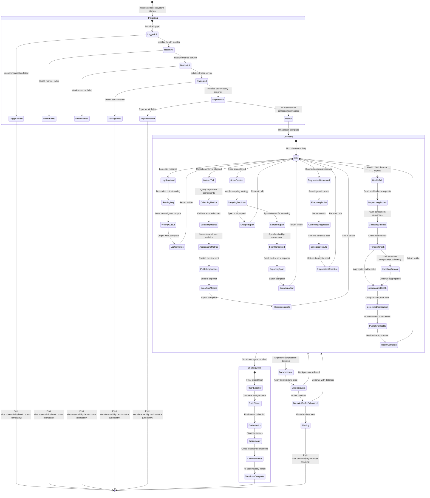
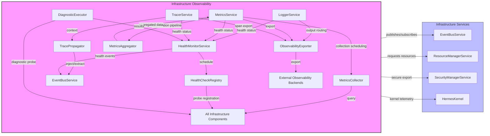
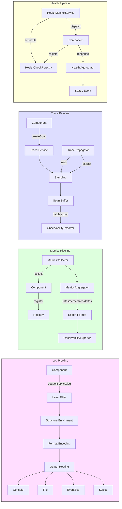
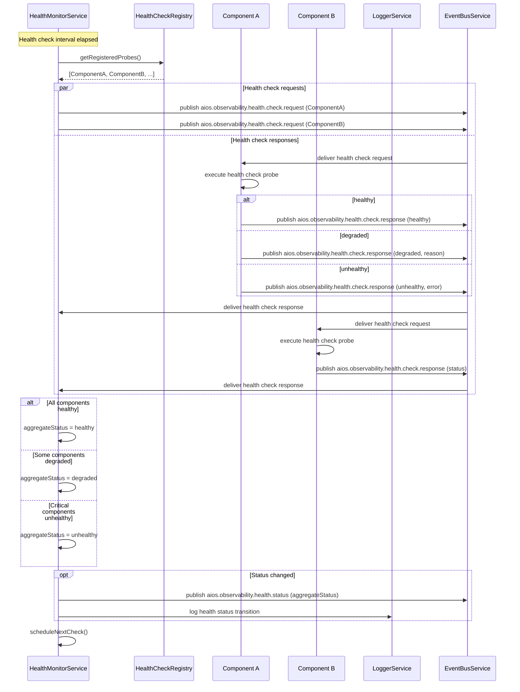
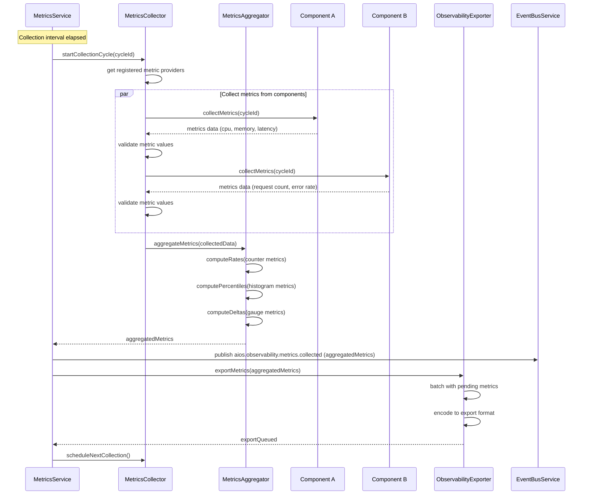
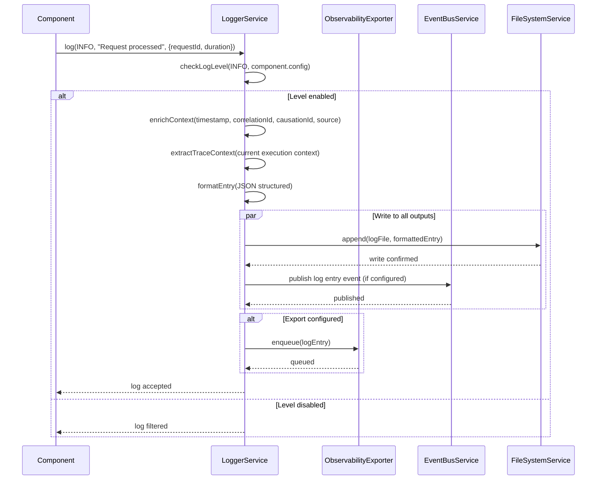
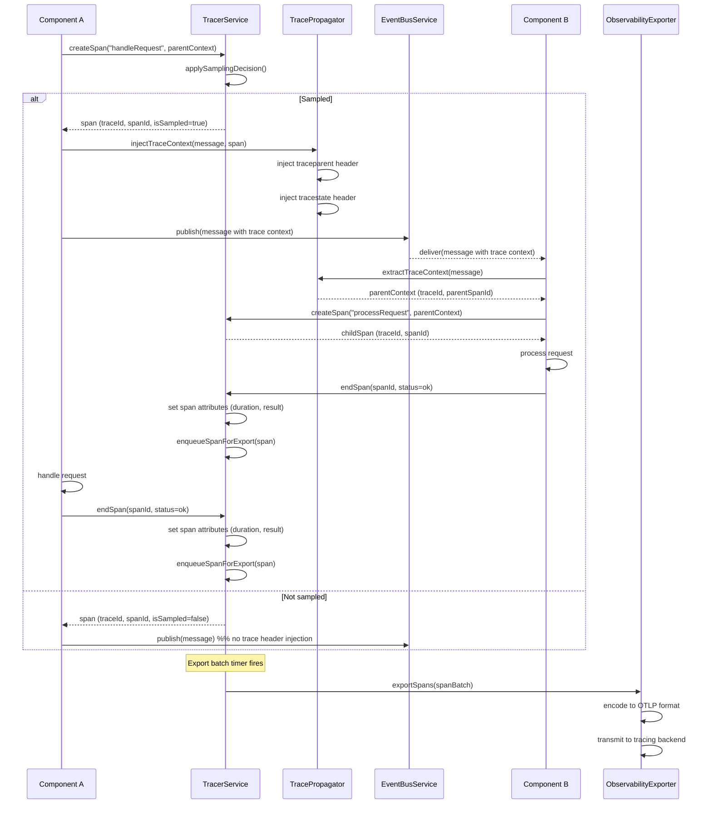
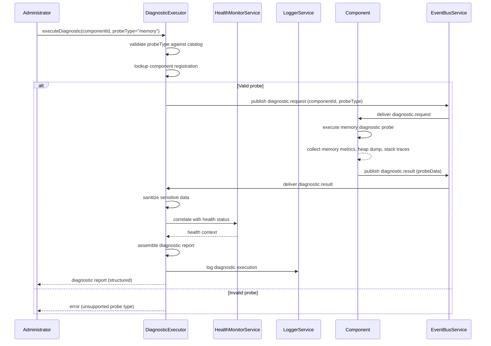

# 9.5 Infrastructure Observability Architecture

## Overview
The Infrastructure Observability subsystem provides comprehensive monitoring, logging, tracing, and health checking for all AI-OS infrastructure components, implementing the observability cross-cutting concern defined in PART9_CONTEXT.md §179 (CCC-9.1). Rather than reimplementing observability infrastructure principles, it focuses on coordinating specialized components (LoggerService, MetricsService, TracerService, etc.) while enforcing cross-cutting concerns: standardized telemetry emission (observability by default), bounded-time health checks (INV-RT-9.8), distributed trace propagation, immutable audit trails, and replay-compatible observability through EventBus-mediated interactions. All observability data flows through standardized pipelines ensuring deterministic collection, processing, and export.

## Responsibilities
The Infrastructure Observability subsystem implements these specific functions in accordance with PART9_CONTEXT.md:
- **LoggerService**: Structured logging with multiple outputs, severity levels, and correlation ID propagation
- **MetricsService**: Collects, aggregates, and exports performance metrics via standardized interfaces
- **TracerService**: Distributed tracing collection, propagation, and export with OpenTelemetry compatibility
- **HealthMonitorService**: Health check orchestration, component health status aggregation, degraded mode detection
- **HealthCheckRegistry**: Central registry of health check probes for all infrastructure components
- **MetricsCollector**: Periodic metric collection from infrastructure components with bounded overhead
- **MetricsAggregator**: Real-time metric aggregation and windowed computation
- **TracePropagator**: Distributed trace context propagation across service boundaries
- **ObservabilityExporter**: Telemetry export to external observability backends with buffering and retry
- **DiagnosticExecutor**: On-demand diagnostics execution for troubleshooting and root cause analysis

## 1. INTERNAL OBSERVABILITY ARCHITECTURE
The Infrastructure Observability subsystem implements a modular architecture where each component has clear ownership, well-defined interfaces, and specific lifecycle management, adhering to the Separation of Concerns principle (PART9_CONTEXT.md §86).

### Component Hierarchy
- **LoggerService**: Owns structured logging infrastructure, manages log levels per component, formats and routes log entries to configured outputs. Owns: Log level management, structured formatting, output routing, correlation ID enrichment. Interfaces with: All infrastructure components for log emission, ObservabilityExporter for log export, HealthMonitor for health status reporting. Lifecycle: Active throughout kernel operation; initialized first among observability components.
- **MetricsService**: Owns metric collection and aggregation, manages metric definitions and labels, provides query interface for real-time monitoring. Owns: Metric registry, collection scheduling, aggregation pipelines, export formatting. Interfaces with: MetricsCollector for collection orchestration, MetricsAggregator for aggregation, ObservabilityExporter for export, All infrastructure components for metric registration. Lifecycle: Active throughout kernel operation.
- **TracerService**: Owns distributed trace context propagation, manages span lifecycle, provides OpenTelemetry-compatible interfaces. Owns: Span creation/completion, trace context propagation, sampling decisions, export batching. Interfaces with: TracePropagator for context propagation, ObservabilityExporter for trace export, All infrastructure components for span creation. Lifecycle: Active throughout kernel operation.
- **HealthMonitorService**: Owns infrastructure health check orchestration, manages health check registry, aggregates component health status, detects degraded states. Owns: Health check scheduling, status aggregation, degraded mode detection, failure alerting. Interfaces with: HealthCheckRegistry for probe registration, all infrastructure components for health status, EventBusService for event publication. Lifecycle: Active throughout kernel operation.
- **HealthCheckRegistry**: Owns health check probe registration, stores probe metadata and execution history, provides lookup by component. Owns: Probe registration/deregistration, metadata storage, execution history, dependency tracking. Interfaces with: HealthMonitorService for probe lookup, all infrastructure components for probe registration. Lifecycle: Active throughout kernel operation.
- **MetricsCollector**: Owns periodic metric collection, executes collection on schedule, validates metric format and bounds. Owns: Collection scheduling, metric validation, collection history, performance tracking. Interfaces with: MetricsService for collection requests, all infrastructure components for metric retrieval, ObservabilityExporter for export. Lifecycle: Active throughout kernel operation.
- **MetricsAggregator**: Owns real-time metric aggregation pipelines, computes windowed statistics, maintains aggregation state. Owns: Aggregation pipelines, window management, statistical computation, eviction of stale windows. Interfaces with: MetricsService for aggregation requests, MetricsCollector for incoming data. Lifecycle: Active throughout kernel operation.
- **TracePropagator**: Owns trace context propagation across service boundaries, injects/extracts trace headers in EventBus messages. Owns: Context injection, context extraction, propagation format (W3C TraceContext), header management. Interfaces with: TracerService for trace context, EventBusService for message interceptor integration, all infrastructure components for context propagation. Lifecycle: Active throughout kernel operation.
- **ObservabilityExporter**: Owns telemetry data export to external backends, manages buffering, batching, and backpressure for observable data emission. Owns: Export scheduling, buffering, batching, retry with backoff, backpressure handling, backend failover. Interfaces with: LoggerService, MetricsService, TracerService for data collection, External observability backends. Lifecycle: Active throughout kernel operation.
- **DiagnosticExecutor**: Owns on-demand diagnostics execution for troubleshooting, manages diagnostic probes and result collection. Owns: Diagnostic request handling, probe execution, result collection, timeout enforcement, sensitive data sanitization. Interfaces with: All infrastructure components for diagnostic probe execution, HealthMonitorService for alert correlation. Lifecycle: Active on demand; created for diagnostic requests, destroyed on completion.

### Interaction Patterns
Components interact exclusively through EventBus-mediated communication and direct function calls for performance-critical paths, maintaining observability-first collection patterns:

**Log Emission Flow**: Component → LoggerService (API) → Level filtering → Structured formatting → Output routing → (Console/File/EventBus) → ObservabilityExporter (if configured for export)

**Metric Collection Flow**: MetricsService (schedule trigger) → MetricsCollector → All Components (metric retrieval) → MetricsCollector (validation) → MetricsAggregator (aggregation) → MetricsService (storage) → EventBus (aios.observability.metrics.collected) → ObservabilityExporter (export)

**Trace Creation Flow**: Component → TracerService (create span) → TracePropagator (context injection) → EventBusService (message publication with trace headers) → TracePropagator (context extraction at receiver) → TracerService (continuation span)

**Health Check Flow**: HealthMonitorService (schedule trigger) → HealthCheckRegistry (probe lookup) → All Components (health check request via EventBus) → Component Responses (health check response via EventBus) → HealthMonitorService (status aggregation) → EventBus (aios.observability.health.status)

**Diagnostic Request Flow**: External request → DiagnosticExecutor → All Components (diagnostic probe) → Component Responses → DiagnosticExecutor (result collection) → HealthMonitorService (correlation) → Response (diagnostic result)

## 2. PROCESSING PIPELINES
The Infrastructure Observability subsystem implements processing pipelines for structured logging, metric collection, distributed tracing, and health checking. Each pipeline enforces deterministic collection, bounded overhead, and replay compatibility.

### Log Processing Pipeline
1. **Log Emission**: Component calls LoggerService.log(level, message, context) with structured fields
2. **Level Filtering**: LoggerService checks emitted log level against configured minimum level per component
3. **Structure Enrichment**: LoggerService adds infrastructure fields (timestamp ISO8601-nano, correlationId, causationId, source component, processId, threadId)
4. **Correlation Injection**: LoggerService extracts trace context from current execution context when available
5. **Format Encoding**: Log entry encoded in configured format (JSON structured, plain text, or binary for high-throughput)
6. **Output Routing**: Log entry routed to all configured outputs (console, file, EventBus, external syslog)
7. **Backpressure Handling**: If outputs are saturated, LoggerService applies non-blocking drop with metric increment or blocking with bounded queue
8. **Export**: ObservabilityExporter collects log entries for transmission to external backends when configured
9. **Quota Enforcement**: Log rate per component enforced to prevent log flooding, with alerting on threshold exceeded

### Metrics Processing Pipeline
1. **Metric Registration**: Components register metric definitions with MetricsService including name, type, labels, help text, unit
2. **Collection Scheduling**: MetricsService initiates collection on configured interval (default: 15s), notifies MetricsCollector
3. **Metric Collection**: MetricsCollector queries registered components for current metric values via standard interface
4. **Validation**: MetricsCollector validates returned values against metric type (counter monotonic, gauge bounds, histogram buckets)
5. **Aggregation Pipeline**: MetricsAggregator computes windowed statistics: rate (per-second on counters), percentiles (p50/p90/p99/p999 on histograms), deltas (changes since last collection)
6. **Transformation**: Aggregated metrics transformed into export format (OpenMetrics, Prometheus exposition, or custom binary)
7. **Event Publication**: MetricsService publishes aios.observability.metrics.collected event to EventBus for subscribers
8. **Export**: ObservabilityExporter batches and transmits metrics to configured backends
9. **Retention Management**: MetricsAggregator evicts stale windows beyond configured retention (default: 1 hour aggregated, configurable)

### Distributed Tracing Pipeline
1. **Span Creation**: Component creates span via TracerService.createSpan(operationName, parentContext)
2. **Sampling Decision**: TracerService applies sampling strategy (head-based: probability/rate-limit; tail-based: latency/error) to determine if span is recorded
3. **Context Injection**: TracePropagator injects trace context into outgoing EventBus messages via W3C TraceContext headers (traceparent, tracestate)
4. **Context Extraction**: TracePropagator on receiver extracts trace context from incoming EventBus messages
5. **Continuation Span**: TracerService creates child span linked to extracted parent context
6. **Span Completion**: Component completes span via TracerService.endSpan(spanId, status, attributes)
7. **Attribute Annotation**: Span enriched with relevant attributes (service name, component, operation, result, duration)
8. **Span Recording**: Completed span serialized to buffer in TracerService
9. **Export Batching**: Spans batched by TracerService for export (time-based: 5s window, or count-based: 100 spans)
10. **Export**: ObservabilityExporter transmits span batch to configured tracing backend (e.g., Jaeger, Tempo)

### Health Check Pipeline
1. **Probe Registration**: Components register health check probes with HealthCheckRegistry on initialization
2. **Check Scheduling**: HealthMonitorService triggers health checks on configured interval (default: 30s) or on demand
3. **Probe Execution**: HealthMonitorService dispatches health check request probes in parallel to registered components via EventBus (aios.observability.health.check.request)
4. **Component Response**: Each component responds via EventBus within INV-RT-9.8 bounds (<100ms) with health status (healthy/unhealthy/degraded), details, and diagnostic data
5. **Timeout Handling**: Non-responsive components within configurable timeout (default: 500ms) are marked unhealthy
6. **Result Aggregation**: HealthMonitorService aggregates individual health results into component and system-wide health status
7. **Dependency Impact Analysis**: HealthMonitorService evaluates dependency graph to determine impact of individual component degradation on overall system health
8. **Degraded Mode Detection**: HealthMonitorService detects transitions from healthy to degraded/unhealthy, updates system health status
9. **Alert Triggering**: HealthMonitorService triggers alerts on health status transitions (healthy→degraded, degraded→unhealthy)
10. **Event Publication**: HealthMonitorService publishes aios.observability.health.status event to EventBus for subscribers

### Diagnostic Execution Pipeline
1. **Request Reception**: DiagnosticExecutor receives diagnostic request with target component and probe type
2. **Probe Selection**: DiagnosticExecutor validates probe type against registered probe catalog for target component
3. **Probe Dispatch**: DiagnosticExecutor dispatches probe execution request to target component via EventBus
4. **Probe Execution**: Target component executes requested diagnostic probe (e.g., memory profile, thread dump, latency trace)
5. **Timeout Enforcement**: DiagnosticExecutor enforces configurable timeout (default: 30s) on probe execution
6. **Result Collection**: DiagnosticExecutor collects probe results, performs initial sanitization to prevent sensitive data leakage
7. **Result Aggregation**: DiagnosticExecutor correlates probe results with current health status and recent events
8. **Response**: DiagnosticExecutor returns structured diagnostic result containing probe data, health context, and correlation information

## 3. RUNTIME LIFECYCLE
The Infrastructure Observability subsystem follows a defined lifecycle that integrates with the Hermes Kernel bootstrap and operation sequences, ensuring observability infrastructure is established before any workload execution permits telemetry emission.

### Initialization Sequence
1. **LoggerService Initialization**: Initializes during Hermes Kernel's first service phase
   - Configures log level thresholds per component from infrastructure manifest
   - Initializes output backends (console, file, EventBus publisher)
   - Establishes log rotation policies and retention windows
   - Opens log files and acquires IPC channels
2. **HealthMonitorService Initialization**: Initializes early to enable health tracking
   - Initializes HealthCheckRegistry and probe catalog
   - Configures health check schedule and timeout parameters
   - Registers its own health probe for self-monitoring
   - Establishes base health state for initialization phase
3. **MetricsService Initialization**: Initializes after LoggerService and HealthMonitorService
   - Initializes MetricsRegistry and metric definitions
   - Configures collection interval and aggregation windows
   - Registers default infrastructure metrics (uptime, resource usage, event counts)
   - Initializes MetricsCollector and MetricsAggregator
4. **TracerService Initialization**: Initializes after MetricsService
   - Configures sampling strategy and export batch parameters
   - Initializes TracePropagator with W3C TraceContext support
   - Registers default trace attributes (service version, node ID, deployment environment)
   - Initializes span buffer and export scheduler
5. **ObservabilityExporter Initialization**: Initializes after all observability components
   - Configures backend connections and authentication
   - Initializes export buffers, batch queues, and retry state
   - Establishes health connections to external backends (non-blocking)
   - Configures backpressure thresholds and fallback behavior
6. **Ready**: All observability components initialized, infrastructure-wide telemetry collection active
7. **HealthMonitorService Activation**: Registers readiness probe with Hermes Kernel, signaling observability subsystem readiness

### Operational Phase
During normal operation:
- LoggerService continuously receives and routes log entries from all components
- MetricsService collects metrics on configured intervals without blocking component operations
- TracerService manages span creation and export with bounded memory footprint
- HealthMonitorService executes periodic health checks and monitors for status transitions
- ObservabilityExporter maintains backpressure-aware telemetry export to configured backends
- All observability components self-monitor and report their own health metrics
- Observability components consume minimal overhead (≤1% CPU target, bounded memory)
- No observability data loss during normal operation; burst handling uses bounded buffering

### Shutdown Sequence
1. **ObservabilityExporter Quiescence**: ObservabilityExporter stops accepting new export data, begins final flush
2. **TracerService Drain**: TracerService finishes in-flight spans, exports final batch, closes trace context
3. **MetricsService Drain**: MetricsService performs final collection aggregation, exports last values
4. **HealthMonitorService Drain**: HealthMonitorService records final health status, unregisters probes
5. **LoggerService Drain**: LoggerService flushes all pending log entries to outputs, closes log files
6. **ObservabilityExport Completion**: ObservabilityExporter completes pending exports, closes backend connections
7. **Observability Complete**: All observability data flushed and exported, telemetry collection terminated

## 4. STATE MODEL
The Infrastructure Observability subsystem lifecycle is modeled as state machines with well-defined transitions that maintain deterministic behavior and bounded resource consumption.

### Comprehensive State Model


### State Definitions
- **Initializing**: Observability subsystem is starting up, initializing components in dependency order
- **LoggerInit**: LoggerService initialization including level configuration and output backend setup
- **HealthInit**: HealthMonitorService initialization including health check registry setup
- **MetricsInit**: MetricsService initialization including registry, collector, and aggregator
- **TracingInit**: TracerService initialization including sampling configuration and propagation
- **ExporterInit**: ObservabilityExporter initialization including backend connections
- **Ready**: All observability components initialized and ready for operation
- **Collecting**: Normal operation state, actively collecting logs, metrics, traces, and health status
- **Idle**: Ready state within Collecting, no active collection events
- **LogReceived**: Log entry received from component for processing
- **RoutingLog**: Determining output routing for received log entry
- **WritingOutput**: Writing log entry to configured output backends
- **LogComplete**: Log entry processing finished
- **MetricsTick**: Collection interval elapsed, triggering metric collection
- **CollectingMetrics**: Querying registered components for current metric values
- **ValidatingMetrics**: Validating collected metric values against type constraints
- **AggregatingMetrics**: Computing windowed statistics (rates, percentiles, deltas)
- **PublishingMetrics**: Publishing aggregated metrics to EventBus
- **ExportingMetrics**: Sending metrics to ObservabilityExporter for external transmission
- **MetricsComplete**: Metric collection cycle completed
- **SpanCreated**: New trace span created by component
- **SamplingDecision**: Applying sampling strategy to determine if span is recorded
- **SampledSpan**: Span selected for recording and export
- **DroppedSpan**: Span not sampled, discarded
- **SpanCompleted**: Span finished by component with attributes
- **ExportingSpan**: Batch export of completed spans
- **SpanExported**: Span export completed
- **HealthTick**: Health check interval elapsed
- **DispatchingProbes**: Sending health check requests to registered components
- **CollectingResults**: Collecting health check responses from components
- **TimeoutCheck**: Checking for timed-out components that did not respond
- **HandlingTimeout**: Marking non-responsive components as unhealthy
- **AggregatingHealth**: Aggregating individual health status into system-wide view
- **DetectingDegradation**: Comparing current health with prior state for transitions
- **PublishingHealth**: Publishing aggregated health status to EventBus
- **HealthComplete**: Health check cycle completed
- **DiagnosticsRequested**: On-demand diagnostic request received
- **ExecutingProbe**: Running requested diagnostic probe on target component
- **CollectingDiagnostics**: Gathering probe results from target
- **SanitizingResults**: Removing sensitive information from diagnostic results
- **DiagnosticsComplete**: Diagnostic execution completed
- **Backpressure**: External export backend indicating backpressure
- **DroppingData**: Non-blocking data drop to relieve backpressure (bounded)
- **BoundedBufferExhausted**: All buffer capacity consumed, data loss occurring
- **Alerting**: Emitting data loss alerts for operational awareness
- **ShuttingDown**: Graceful shutdown sequence initiated
- **FlushExporter**: Final export of all buffered telemetry data
- **DrainTracer**: Completing in-flight spans and final export
- **DrainMetrics**: Performing final metric collection and export
- **DrainLogger**: Flushing all pending log entries to outputs
- **CloseBackends**: Closing exporter connections to external backends
- **ShutdownComplete**: All observability components halted, data flushed

## 5. OBSERVABILITY PIPELINE ARCHITECTURE
The Infrastructure Observability subsystem implements three primary pipelines for log, metric, and trace data, each with defined processing stages. All pipelines share common transport, batching, and export infrastructure.

### Log Pipeline Architecture
- **Ingestion Interface**: LoggerService.log(level, message, structuredContext) - synchronous API for low-latency emission
- **Buffering**: Per-output bounded ring buffers (default: 4096 entries per output)
- **Inline Processing**: Level filtering and format encoding performed on calling thread for low latency
- **Async Output**: Output writes dispatched to dedicated I/O threads per output backend
- **Backpressure Strategy**: Blocking producer with bounded queue (non-blocking drop after threshold)
- **Format Support**: JSON structured (default), text/plain, binary (CBOR for high-throughput)
- **Output Backends**: Console (stdout/stderr), File (rotating), EventBus (for subscribers), Syslog (RFC 5424)

### Metrics Pipeline Architecture
- **Ingestion Interface**: MetricsService.observe(name, value, labels) - fire-and-forget for minimal overhead
- **Metric Types**: Counter (monotonic), Gauge (point-in-time), Histogram (distribution), Summary (quantiles)
- **Collection Model**: Pull-based (MetricsCollector queries registered components on schedule)
- **Collection Interval**: Configurable per component (default: 15s, minimum: 5s)
- **Aggregation Windows**: 1-minute, 5-minute, 15-minute, 1-hour rolling windows
- **Computation**: Rate (per-second over window), Percentiles (T-digest or HDR histogram), Delta (since last collection)
- **Export Format**: OpenMetrics exposition format (Prometheus-compatible), also supports StatsD and Graphite wire formats
- **Cardinality Limits**: Maximum 10,000 unique label combinations per metric, with overflow tracking

### Trace Pipeline Architecture
- **Ingestion Interface**: TracerService.createSpan(name, parent) / TracerService.endSpan(spanId, status)
- **Trace Context Propagation**: W3C TraceContext (traceparent and tracestate headers) via EventBus message interceptors
- **Sampling Strategies**: 
  - Head-based probability sampling (configurable rate, default: 10%)
  - Head-based rate-limited sampling (max spans/sec, default: 100)
  - Tail-based sampling (by latency > 500ms or error status)
  - Always-on for error spans and health check traces
- **Span Buffer**: Bounded ring buffer per TracerService instance (default: 4096 spans)
- **Batch Export**: Time-based (5s window) or count-based (100 spans) trigger
- **Export Format**: OpenTelemetry Protocol (OTLP) over gRPC, also supports Jaeger Thrift and Zipkin JSON

### Health Pipeline Architecture
- **Probe Model**: Components register probes with HealthCheckRegistry providing check() callback
- **Check Interface**: healthCheck() → { status: "healthy"|"unhealthy"|"degraded", details: object, duration: number }
- **Dispatch Model**: Parallel health check requests via EventBus to all registered components
- **Timeout**: Configurable per component (default: 500ms, must exceed INV-RT-9.8 <100ms requirement)
- **Aggregation**: Component-level AND logic (all probes healthy → component healthy), system-level weighted aggregation
- **Status Transitions**: Health→Degraded (non-critical), Health→Unhealthy (critical), Degraded→Health (recovered)
- **Alerting Threshold**: Configurable consecutive failures before alert (default: 3)
- **Reporting Interval**: Configurable (default: 30s), minimum: 10s, maximum: 300s

## 6. MERMAID DIAGRAMS
All Mermaid diagrams follow PART9_CONTEXT.md §21 standards and show internal Infrastructure Observability subsystem relationships.

### Component Diagram


### Component Interaction Diagram (Internal Focus)

```mermaid
flowchart TD
    subgraph ObservabilityInternal[Infrastructure Observability Internal]
        direction TB
        LS[LoggerService]
        MS[MetricsService]
        TS[TracerService]
        HMS[HealthMonitorService]
        HCR[HealthCheckRegistry]
        MC[MetricsCollector]
        MA[MetricsAggregator]
        TP[TracePropagator]
        OE[ObservabilityExporter]
        DE[DiagnosticExecutor]
        
        LS -->|formatted entries| OE
        LS -->|self health| HMS
        
        MS -->|schedule collection| MC
        MS -->|aggregate data| MA
        MS -->|collected metrics| OE
        MS -->|self health| HMS
        
        MC -->|raw metrics| MS
        MA -->|aggregated metrics| MS
        
        TS -->|completed spans| OE
        TS -->|trace context| TP
        TS -->|self health| HMS
        
        TP -->|inject context| EBS[EventBusService]
        TP -->|extract context| EBS
        
        HCR -->|probe list| HMS
        HCR -->|register| AllComps[All Components]
        
        HMS -->|check schedule| HCR
        HMS -->|health status| EBS
        HMS -->|self health| HMS
        
        DE -->|diagnostic request| AllComps
        DE -->|collected results| DE
        
        OE -->|export pipeline| OTLP[OTLP/gRPC]
        OE -->|export pipeline| Prometheus[Prometheus]
        OE -->|export pipeline| Syslog[Syslog]
    end
    
    %% External interfaces
    LS -->|log API| LogAPI[Component Log API]
    MS -->|metrics API| MetricAPI[Component Metric API]
    TS -->|trace API| TraceAPI[Component Trace API]
    HMS -->|health check| HCAPI[Component Health Check API]
    DE -->|diagnostic API| DiagAPI[Component Diagnostic API]
    
    classDef internal fill:#f9f,stroke:#333;
    classDef external fill:#bbf,stroke:#333;
    class LS,MS,TS,HMS,HCR,MC,MA,TP,OE,DE internal;
    class LogAPI,MetricAPI,TraceAPI,HCAPI,DiagAPI,EBS external;
```


### Pipeline Architecture Diagram


## 7. SEQUENCE DIAGRAMS
Key interaction sequences for the Infrastructure Observability subsystem, demonstrating deterministic processing and bounded overhead.

### Health Check Sequence


### Metric Collection Sequence


### Log Emission Sequence


### Distributed Trace Sequence


### Diagnostic Execution Sequence


## 8. JSON SCHEMA
The Infrastructure Observability subsystem utilizes JSON Schema Draft 2020-12 for all configuration and state validation, referencing shared schemas from PART9_CONTEXT.md where applicable and defining Observability-specific schemas only where necessary.

### Referenced Schemas
The subsystem references these shared schemas defined in PART9_CONTEXT.md:
- **EventEnvelope**: `shared/EventEnvelope.json` (Section 14.1) - used for all observability event validation
- **ObservabilityContract**: `shared/ObservabilityContract.json` (referenced in Section 24 roadmap) - defines the infrastructure contract for observability
- **HealthCheckContract**: `shared/HealthCheckContract.json` (referenced in Section 24 roadmap) - defines health check interface

### Observability-Specific Schemas
#### ObservabilityConfiguration Schema
Defines the runtime configuration for the Infrastructure Observability subsystem:

```json
{
  "$schema": "https://json-schema.org/draft/2020-12/schema",
  "title": "ObservabilityConfiguration",
  "type": "object",
  "required": ["loggerConfig", "metricsConfig", "tracerConfig", "healthConfig"],
  "properties": {
    "loggerConfig": {
      "type": "object",
      "required": ["defaultLevel", "outputs"],
      "properties": {
        "defaultLevel": {
          "type": "string",
          "enum": ["TRACE", "DEBUG", "INFO", "WARN", "ERROR", "FATAL"],
          "description": "Default minimum log level for components without specific configuration"
        },
        "componentLevels": {
          "type": "object",
          "additionalProperties": {
            "type": "string",
            "enum": ["TRACE", "DEBUG", "INFO", "WARN", "ERROR", "FATAL"]
          },
          "description": "Per-component log level overrides"
        },
        "outputs": {
          "type": "array",
          "items": {
            "type": "object",
            "required": ["type", "enabled"],
            "properties": {
              "type": {
                "type": "string",
                "enum": ["console", "file", "eventbus", "syslog"],
                "description": "Output backend type"
              },
              "enabled": {
                "type": "boolean",
                "description": "Whether this output is active"
              },
              "format": {
                "type": "string",
                "enum": ["json", "text", "binary"],
                "description": "Output format for this backend"
              },
              "path": {
                "type": ["string", "null"],
                "description": "File path for file output"
              },
              "maxSizeMb": {
                "type": "integer",
                "minimum": 1,
                "description": "Maximum file size in MB before rotation"
              },
              "maxFiles": {
                "type": "integer",
                "minimum": 1,
                "description": "Maximum number of rotated files to retain"
              }
            },
            "additionalProperties": false
          },
          "minItems": 1,
          "description": "Configured log output backends"
        },
        "rateLimit": {
          "type": "object",
          "properties": {
            "enabled": {
              "type": "boolean",
              "description": "Whether log rate limiting is enabled"
            },
            "messagesPerSecond": {
              "type": "integer",
              "minimum": 1,
              "description": "Maximum log messages per second per component"
            },
            "burstSize": {
              "type": "integer",
              "minimum": 1,
              "description": "Allowed burst size before rate limiting activates"
            }
          },
          "additionalProperties": false
        }
      },
      "additionalProperties": false
    },
    "metricsConfig": {
      "type": "object",
      "required": ["collectionIntervalMs", "exportFormat"],
      "properties": {
        "collectionIntervalMs": {
          "type": "integer",
          "minimum": 5000,
          "maximum": 60000,
          "description": "Interval between metric collection cycles in milliseconds"
        },
        "exportFormat": {
          "type": "string",
          "enum": ["openmetrics", "statsd", "graphite"],
          "description": "Export wire format for metrics"
        },
        "aggregationWindowsSec": {
          "type": "array",
          "items": {
            "type": "integer",
            "minimum": 60
          },
          "description": "Configured aggregation window durations in seconds"
        },
        "cardinalityLimit": {
          "type": "integer",
          "minimum": 100,
          "maximum": 100000,
          "description": "Maximum unique label combinations per metric"
        }
      },
      "additionalProperties": false
    },
    "tracerConfig": {
      "type": "object",
      "required": ["samplingStrategy"],
      "properties": {
        "samplingStrategy": {
          "type": "string",
          "enum": ["headProbability", "headRateLimit", "tailLatency", "tailError"],
          "description": "Trace sampling strategy"
        },
        "samplingRate": {
          "type": "number",
          "minimum": 0.0,
          "maximum": 1.0,
          "description": "Probability-based sampling rate (0.0-1.0)"
        },
        "maxSpansPerSecond": {
          "type": "integer",
          "minimum": 1,
          "description": "Rate limit for span sampling (spans/sec)"
        },
        "exportBatchSize": {
          "type": "integer",
          "minimum": 1,
          "maximum": 1024,
          "description": "Maximum spans per export batch"
        },
        "exportIntervalMs": {
          "type": "integer",
          "minimum": 1000,
          "maximum": 60000,
          "description": "Interval between span batch exports in milliseconds"
        },
        "exportProtocol": {
          "type": "string",
          "enum": ["otlp-grpc", "jaeger-thrift", "zipkin-json"],
          "description": "Trace export protocol"
        }
      },
      "additionalProperties": false
    },
    "healthConfig": {
      "type": "object",
      "required": ["checkIntervalMs", "timeoutMs"],
      "properties": {
        "checkIntervalMs": {
          "type": "integer",
          "minimum": 10000,
          "maximum": 300000,
          "description": "Interval between health check cycles in milliseconds"
        },
        "timeoutMs": {
          "type": "integer",
          "minimum": 100,
          "maximum": 5000,
          "description": "Timeout for individual component health check responses"
        },
        "failureThreshold": {
          "type": "integer",
          "minimum": 1,
          "description": "Consecutive failures before component is marked unhealthy"
        },
        "degradedThreshold": {
          "type": "integer",
          "minimum": 1,
          "description": "Consecutive degraded responses before status is reported as degraded"
        }
      },
      "additionalProperties": false
    }
  },
  "additionalProperties": false
}
```

#### MetricDefinition Schema
Defines the structure for metric registration by infrastructure components:

```json
{
  "$schema": "https://json-schema.org/draft/2020-12/schema",
  "title": "MetricDefinition",
  "type": "object",
  "required": ["name", "metricType", "help", "unit"],
  "properties": {
    "name": {
      "type": "string",
      "pattern": "^[a-z][a-z0-9_]*$",
      "description": "Metric name (snake_case, infrastructure namespace)"
    },
    "metricType": {
      "type": "string",
      "enum": ["counter", "gauge", "histogram", "summary"],
      "description": "Type of metric"
    },
    "help": {
      "type": "string",
      "description": "Human-readable description of what this metric measures"
    },
    "unit": {
      "type": "string",
      "enum": ["bytes", "cores", "seconds", "count", "percent", "bps", "iops", "operations"],
      "description": "Unit of measurement"
    },
    "labelNames": {
      "type": "array",
      "items": {
        "type": "string",
        "pattern": "^[a-z][a-zA-Z0-9_]*$"
      },
      "description": "Allowed label names for this metric"
    },
    "buckets": {
      "type": "array",
      "items": {
        "type": "number",
        "exclusiveMinimum": 0
      },
      "description": "Histogram bucket boundaries (histogram type only)"
    },
    "component": {
      "type": "string",
      "description": "Name of the component that owns this metric"
    },
    "aggregationWindowSec": {
      "type": "integer",
      "minimum": 0,
      "description": "Aggregation window duration in seconds (0 = no windowing)"
    }
  },
  "additionalProperties": false
}
```

#### TraceContext Schema
Defines the trace context propagated across service boundaries:

```json
{
  "$schema": "https://json-schema.org/draft/2020-12/schema",
  "title": "TraceContext",
  "type": "object",
  "required": ["traceId", "spanId", "traceFlags"],
  "properties": {
    "traceId": {
      "type": "string",
      "pattern": "^[a-f0-9]{32}$",
      "description": "128-bit trace identifier in hexadecimal (W3C TraceContext format)"
    },
    "spanId": {
      "type": "string",
      "pattern": "^[a-f0-9]{16}$",
      "description": "64-bit span identifier in hexadecimal"
    },
    "traceFlags": {
      "type": "integer",
      "minimum": 0,
      "maximum": 255,
      "description": "W3C trace flags bitmask (bit 0 = sampled)"
    },
    "tracestate": {
      "type": ["string", "null"],
      "pattern": "^[a-z][a-z0-9_-]*=[^,]+(,[a-z][a-z0-9_-]*=[^,]+)*$",
      "description": "W3C tracestate header for vendor-specific trace data"
    },
    "parentSpanId": {
      "type": ["string", "null"],
      "pattern": "^[a-f0-9]{16}$",
      "description": "Parent span identifier for causality chain"
    }
  },
  "additionalProperties": false
}
```

#### HealthStatus Schema
Defines the aggregated health status for a component or system:

```json
{
  "$schema": "https://json-schema.org/draft/2020-12/schema",
  "title": "HealthStatus",
  "type": "object",
  "required": ["component", "status", "timestamp", "checkDurationMs"],
  "properties": {
    "component": {
      "type": "string",
      "description": "Component name this health status applies to"
    },
    "status": {
      "type": "string",
      "enum": ["healthy", "degraded", "unhealthy"],
      "description": "Current health status"
    },
    "timestamp": {
      "type": "string",
      "format": "date-time",
      "description": "When this health status was determined"
    },
    "checkDurationMs": {
      "type": "integer",
      "minimum": 0,
      "description": "Duration of the health check in milliseconds"
    },
    "previousStatus": {
      "type": ["string", "null"],
      "enum": ["healthy", "degraded", "unhealthy"],
      "description": "Previous health status for transition detection"
    },
    "details": {
      "type": "object",
      "properties": {
        "message": {
          "type": "string",
          "description": "Human-readable status message"
        },
        "failedChecks": {
          "type": "array",
          "items": {
            "type": "object",
            "properties": {
              "probeId": {"type": "string"},
              "reason": {"type": "string"},
              "lastSuccess": {"type": ["string", "null"], "format": "date-time"}
            }
          },
          "description": "Failed health check probes"
        },
        "dependencies": {
          "type": "object",
          "additionalProperties": {
            "type": "string",
            "enum": ["healthy", "degraded", "unhealthy", "unknown"]
          },
          "description": "Health status of component dependencies"
        }
      },
      "additionalProperties": false
    },
    "metrics": {
      "type": "object",
      "properties": {
        "uptimeSeconds": {
          "type": "integer",
          "minimum": 0,
          "description": "Component uptime in seconds"
        },
        "memoryUsageBytes": {
          "type": "integer",
          "minimum": 0,
          "description": "Current memory usage in bytes"
        },
        "cpuUsagePercent": {
          "type": "number",
          "minimum": 0,
          "maximum": 100,
          "description": "Current CPU usage as percentage"
        },
        "eventProcessingRate": {
          "type": "number",
          "minimum": 0,
          "description": "Current event processing rate (events/sec)"
        }
      },
      "additionalProperties": false
    }
  },
  "additionalProperties": false
}
```

#### DiagnosticResult Schema
Defines the structure for on-demand diagnostic execution results:

```json
{
  "$schema": "https://json-schema.org/draft/2020-12/schema",
  "title": "DiagnosticResult",
  "type": "object",
  "required": ["diagnosticId", "component", "probeType", "executionTimestamp", "durationMs"],
  "properties": {
    "diagnosticId": {
      "type": "string",
      "format": "uuid",
      "description": "Unique identifier for this diagnostic execution"
    },
    "component": {
      "type": "string",
      "description": "Target component name"
    },
    "probeType": {
      "type": "string",
      "enum": ["memory", "cpu", "thread", "latency", "config", "state", "custom"],
      "description": "Type of diagnostic probe executed"
    },
    "executionTimestamp": {
      "type": "string",
      "format": "date-time",
      "description": "When the diagnostic was executed"
    },
    "durationMs": {
      "type": "integer",
      "minimum": 0,
      "description": "Probe execution duration in milliseconds"
    },
    "probeData": {
      "type": "object",
      "description": "Diagnostic data collected from probe execution"
    },
    "healthContext": {
      "type": "object",
      "properties": {
        "currentStatus": {
          "type": "string",
          "enum": ["healthy", "degraded", "unhealthy"]
        },
        "recentAlerts": {
          "type": "array",
          "items": {
            "type": "object"
          },
          "description": "Recent health alerts for this component"
        }
      },
      "additionalProperties": false
    },
    "sanitized": {
      "type": "boolean",
      "description": "Whether sensitive data was removed from results"
    }
  },
  "additionalProperties": false
}
```

## 9. EVENT CATALOG
The Infrastructure Observability subsystem publishes and subscribes to events via the EventBus. All events conform to the EventEnvelope schema (shared/EventEnvelope.json) and follow naming conventions in PART9_CONTEXT.md §20.

### Observability Events
Events related to observability subsystem operation and data:
| Event | Publisher | Subscribers | Payload Summary | Delivery Guarantee | Persistence | Replay Behaviour |
|-------|-----------|-------------|-----------------|-------------------|-------------|------------------|
| `aios.observability.health.check.request` | HealthMonitorService | All registered components | Check ID, component, timestamp | At-least-once | Transient | Recorded but not acted upon during replay |
| `aios.observability.health.check.response` | All infrastructure components | HealthMonitorService | Check ID, status (healthy/degraded/unhealthy), details, duration | At-least-once | Transient | Recorded but not acted upon during replay |
| `aios.observability.health.status` | HealthMonitorService | EventBusService, LoggerService, SecurityManagerService | Aggregated status, component statuses, transition info | At-least-once | Persistent | Replayed to reconstruct health history |
| `aios.observability.health.alert` | HealthMonitorService | SecurityManagerService, DiagnosticExecutor | Component, prior status, new status, details, threshold | At-least-once | Persistent | Replayed to reconstruct alert history |
| `aios.observability.metrics.collected` | MetricsService | ObservabilityExporter, EventBusService | Cycle ID, metrics data, aggregation windows, timestamp | At-least-once | Transient | Recorded but not replayed (derived data) |
| `aios.observability.log.entry` | LoggerService | ObservabilityExporter, AuditService | Log entry ID, level, message, source, correlationId | At-least-once | Persistent | Replayed to reconstruct log history |
| `aios.observability.trace.span` | TracerService | ObservabilityExporter | Span ID, trace ID, operation, duration, attributes | At-least-once | Transient | Not replayed (performance optimization) |
| `aios.observability.diagnostic.request` | DiagnosticExecutor | All infrastructure components | Diagnostic ID, component, probe type, requestor | At-least-once | Persistent | Replayed to reconstruct diagnostic requests |
| `aios.observability.diagnostic.result` | All infrastructure components | DiagnosticExecutor | Diagnostic ID, probe data, health context, sanitized flag | At-least-once | Persistent | Replayed to reconstruct diagnostic results |
| `aios.observability.data.loss` | MetricsService, LoggerService, ObservabilityExporter | HealthMonitorService, SecurityManagerService | Pipeline, reason, bytes lost, duration, window | At-least-once | Persistent | Replayed to reconstruct data loss events |
| `aios.observability.exporter.status` | ObservabilityExporter | HealthMonitorService | Backend, status, latency, bytes exported, errors | At-least-once | Persistent | Replayed to reconstruct export history |

### Infrastructure Events Consumed
Events from other subsystems that influence observability:
| Event | Publisher | Relevance to Observability |
|-------|-----------|----------------------------|
| `aios.infrastructure.manifest.applied` | BootstrapManager | Triggers observability configuration reload |
| `aios.infrastructure.health.check.request` | HealthMonitorService (kernel) | Health check lifecycle integration |
| `aios.infrastructure.resource.alert` | ResourceCoordinator (kernel) | Triggers diagnostic execution for resource-pressure root cause |
| `aios.infrastructure.security.event` | SecurityCoordinator | Security events enriched with observability context |
| `aios.eventbus.health.check.request` | EventBusService | Interoperability with EventBus health monitoring |

## 10. STATE MODEL REFERENCE
The Infrastructure Observability subsystem lifecycle state model is defined in Section 4 (STATE MODEL) of this specification. Section 4 contains the authoritative state diagram, complete state definitions, and all transition semantics. Implementations MUST use Section 4 as the single source of truth for observability subsystem lifecycle behavior.

## 11. SECURITY MODEL
The Infrastructure Observability subsystem enforces security controls on observability data to prevent information leakage, ensure data integrity, and maintain compliance with security requirements.

### Observability Data Security
- **Log Data Sanitization**: LoggerService applies configurable redaction rules for sensitive fields (passwords, tokens, keys, PII) before output routing
- **Metric Data Protection**: MetricsService does not expose raw metric values externally without aggregation to prevent information leakage
- **Trace Data Access Control**: Trace spans may contain request parameters and response data; access restricted to authorized consumers
- **Health Data Confidentiality**: Health check details may reveal internal component state; restricted to authorized monitoring systems
- **Export Encryption**: All observability data exported to external backends uses TLS 1.3 with mutual authentication (IC-9.4)

### Access Control
- Log entry access restricted via RBAC policies (SecurityManagerService authorization)
- Metric query access requires explicit role-based permissions (securityService, operations, admin)
- Trace view access limited to debugging sessions with time-bound authorization
- Diagnostic execution requires elevated privileges with audit trail
- Export backend authentication configured via SecretManagerService credentials

### Audit Trail Integration
- All observability configuration changes logged via AuditService
- Health status transitions recorded in audit trail for compliance
- Diagnostic execution history preserved for forensic analysis
- Data loss events logged with full context for incident investigation

## 12. FAILURE HANDLING
The Infrastructure Observability subsystem implements failure detection, isolation, and recovery mechanisms to maintain telemetry collection even during component or backend failures.

### Failure Detection
- HealthMonitorService executes bounded-time health checks on all observability components (INV-RT-9.8)
- LoggerService detects output backend failures (disk full, network unreachable) and applies fallback
- MetricsService detects collection failures (component unresponsive, malformed data) and logs errors
- TracerService detects span buffer overflow and applies non-blocking drop
- ObservabilityExporter detects backend unreachability and initiates retry with exponential backoff

### Failure Isolation
- Observability component failures are isolated (LoggerService failure does not affect MetricsService)
- Individual log output failures do not affect other outputs (file output failure → console still works)
- Health check timeouts for one component do not affect other component health checks
- Metric collection failures per component are isolated and logged
- Trace span buffer per TracerService instance prevents cross-tenant contamination

### Recovery Procedures
- LoggerService output failures trigger retry with exponential backoff on failed backends
- MetricsService collection failures skip non-responsive components and continue cycle
- TracerService span buffer overflow triggers non-blocking drop, then resumed operation
- ObservabilityExporter backends retried with exponential backoff (5s initial, 300s max, multiplier 2, jitter 10%)
- HealthMonitorService applies circuit breaker for persistently unhealthy components (backoff before recheck)

### Data Loss Prevention
- Log entries buffered in bounded ring buffers (4096 entries per output) before write
- Metric collection uses bounded buffers preventing OOM under load
- Trace spans use bounded buffers with non-blocking drop on overflow
- ObservabilityExporter maintains bounded export queues with backpressure signaling
- Data loss events published as aios.observability.data.loss for operational awareness

## 13. RUNTIME INVARIANTS
The Infrastructure Observability subsystem adheres to these runtime invariants (PART9_CONTEXT.md §405-426):

- **INV-RT-9.1**: All infrastructure state is versioned and immutable after deployment - IMPLEMENTED via versioned observability configuration
- **INV-RT-9.8**: Infrastructure health checks complete within bounded time (<100ms) - IMPLEMENTED via HealthMonitorService timeout enforcement
- **INV-RT-9.12**: No infrastructure component maintains mutable global state - IMPLEMENTED via per-component metric registration and isolated state
- **INV-RT-9.16**: Infrastructure logs are append-only and cryptographically chained - IMPLEMENTED via LoggerService append-only output with audit integration
- **CCC-9.1**: Observability - Metrics, traces, and logs emitted via standardized contracts - IMPLEMENTED via MetricsService, TracerService, LoggerService standardized interfaces
- All inter-component communication occurs via EventBus - IMPLEMENTED via EventBus-mediated health checks, metric events, and diagnostic requests
- All observability components consume bounded resources (CPU ≤1% target, bounded memory) - IMPLEMENTED via bounded buffers, rate limiting, and self-monitoring
- No observability component blocks component operations - IMPLEMENTED via async log writes, non-blocking metric collection, and fire-and-forget tracing
- Health check responsiveness is self-monitored by HealthMonitorService - IMPLEMENTED via HealthMonitorService self-registration in HealthCheckRegistry
- Observability data export is best-effort and never blocks component operation - IMPLEMENTED via async export with buffering and backpressure handling
- All observability configuration changes are validated against JSON Schema before activation - IMPLEMENTED via ObservabilityConfiguration schema validation
- Log sensitivity marking prevents accidental data leakage - IMPLEMENTED via configurable redaction rules and sanitization pipeline

## 14. VALIDATION RULES
The Infrastructure Observability subsystem enforces strict validation on all observability data to ensure correctness, prevent resource exhaustion, and maintain data quality.

### Log Validation
- **Level Validation**: Log level must be valid enum (TRACE, DEBUG, INFO, WARN, ERROR, FATAL)
- **Message Size Limit**: Maximum 64KB per log message (configurable)
- **Rate Limiting**: Per-component log rate enforced (default: 1000 msg/sec, configurable)
- **Field Validation**: Structured context fields validated against accepted types (string, number, boolean, null)
- **Correlation ID Validation**: If correlationId provided, must be valid UUID format
- **Injection Prevention**: Log entries sanitized to prevent log injection attacks (newline, control character escaping)

### Metric Validation
- **Name Validation**: Metric name must match ^[a-z][a-z0-9_]*$ pattern
- **Type Validation**: Metric value must conform to declared type (counter monotonic non-decreasing within window, gauge within bounds, histogram bucket values ascending)
- **Label Validation**: Label names must be registered in MetricDefinition.labelNames
- **Cardinality Enforcement**: Maximum 10,000 unique label combinations per metric (overflow tracked and alerted)
- **Value Range**: Numeric values must be within acceptable ranges for metric type
- **Timestamp Validation**: Collection timestamps must be monotonic per metric source

### Trace Validation
- **Trace ID Validation**: traceId must be valid 32-character hex string
- **Span ID Validation**: spanId must be valid 16-character hex string
- **Parent Span Validation**: parentSpanId must reference existing span within same trace context
- **Duration Validation**: span duration must be non-negative and within configurable maximum (default: 5 minutes)
- **Attribute Validation**: span attributes must not exceed 128 entries or 4096 bytes total

### Health Check Validation
- **Response Timeout**: Health check responses must arrive within INV-RT-9.8 bounds (<100ms for probe, <500ms for full round-trip including delivery)
- **Status Validation**: Health status must be valid enum (healthy, degraded, unhealthy)
- **Response Schema**: Health check response must conform to HealthStatus schema
- **Probe Registration Validation**: Probes must not be duplicate registered (enforced by HealthCheckRegistry)
- **Dependency Cycle Detection**: Health check dependency graph must not contain cycles

## 15. DETERMINISM GUARANTEES
To ensure deterministic behavior for observability operations:

- **Log Ordering Determinism**: Log entries from same source with same correlationId are processed in emission order
- **Metric Collection Determinism**: Metric collection follows deterministic component order per cycle
- **Metric Aggregation Determinism**: Aggregation computations produce identical results for identical input values
- **Trace Sampling Determinism**: Sampling decisions based on traceId produce identical results across restarts (hash-based sampling)
- **Health Check Determinism**: Identical component states produce identical health check results
- **Diagnostic Execution Determinism**: Identical component states produce identical diagnostic results
- **Export Ordering Determinism**: Export batches maintain per-source ordering when required
- All timing-dependent operations use virtualized time when replay is enabled (IMPLEMENTS RP-9.6)

## 16. PERFORMANCE CONTRACTS
The Infrastructure Observability subsystem establishes performance guarantees to ensure observability imposes minimal overhead on protected workloads.

### Logging Performance
- **Log Emission (accepted)**: ≤ 1μs for accepted log entries (level filter pass, no I/O)
- **Log Emission (filtered)**: ≤ 100ns for filtered entries (level comparison only)
- **Log Output (console)**: ≤ 10μs per entry
- **Log Output (file)**: ≤ 100μs per entry (buffered write)
- **Log Output (EventBus)**: ≤ 50μs per entry (async publish)
- **Throughput**: Minimum 100,000 entries/sec sustained (single output)
- **Rate Limiter Overhead**: ≤ 100ns per check

### Metrics Performance
- **Metric Observation**: ≤ 100ns per observe() call (atomic increment)
- **Collection Cycle**: ≤ 10ms for 1000 metrics (100 components × 10 metrics each)
- **Aggregation (per metric)**: ≤ 50μs for rate computation, ≤ 100μs for percentile computation
- **Export Encoding**: ≤ 1ms for 1000 metrics in OpenMetrics format
- **Throughput**: Minimum 1,000,000 observations/sec sustained per MetricsService instance
- **Cardinality Monitoring Overhead**: ≤ 10ns per unique label set

### Tracing Performance
- **Span Creation**: ≤ 500ns per span (sampling decision + ID generation)
- **Span Completion**: ≤ 1μs per span (attribute encoding + buffer enqueue)
- **Context Injection**: ≤ 200ns per message (header write)
- **Context Extraction**: ≤ 300ns per message (header parse)
- **Export Batch Encoding**: ≤ 1ms for 100 spans (OTLP format)
- **Memory Overhead**: ≤ 100MB per TracerService instance at 4096 span buffer capacity

### Health Check Performance
- **Check Dispatch**: ≤ 50μs per component (parallel dispatch)
- **Response Aggregation**: ≤ 100μs for 100 component responses
- **Full Health Cycle (100 components)**: ≤ 200ms (dominated by network/EventBus delivery)
- **Status Transition Detection**: ≤ 10μs per component comparison

### Resource Utilization
- **LoggerService**: ≤ 10MB RSS base, ≤ 100MB with full output buffers
- **MetricsService**: ≤ 20MB RSS base, ≤ 50MB with 1000 registered metrics and aggregation windows
- **TracerService**: ≤ 20MB RSS base, ≤ 100MB with 4096 span buffer
- **HealthMonitorService**: ≤ 5MB RSS base
- **ObservabilityExporter**: ≤ 15MB RSS base, ≤ 50MB with export buffers
- **Aggregate CPU Overhead**: ≤ 2% per core under normal load, ≤ 5% per core under peak observability load

### Latency Budgets for End-to-End Flows
- **Log Entry (emission to file)**: ≤ 1ms 95th percentile
- **Metric Collection (cycle start to aggregation)**: ≤ 50ms 95th percentile for 1000 metrics
- **Health Check (cycle start to aggregation)**: ≤ 500ms 95th percentile for 100 components
- **Trace Export (span completion to backend)**: ≤ 5s 95th percentile (batching adds intentional delay)
- **Diagnostic Execution**: ≤ 30s 95th percentile for memory profile probe

## 17. IMPLEMENTATION CONTRACTS
This specification provides sufficient detail for independent implementation by engineering teams, enabling two independent teams to create functionally equivalent Infrastructure Observability subsystems.

### Key Implementation Contracts
1. **Logging Contract**: ALL log entries MUST flow through LoggerService API for level filtering, structured formatting, and output routing. NO component may write directly to output backends. (ENFORCES structured logging, correlation ID propagation)

2. **Metric Registration Contract**: ALL metrics MUST be registered with MetricsService via MetricDefinition before observation. Metric names, types, and labels MUST conform to MetricDefinition schema. (ENFORCES consistent metric naming, type safety)

3. **Metric Collection Contract**: ALL metric collection MUST follow MetricsService → MetricsCollector → Component → MetricsCollector (validation) → MetricsAggregator (aggregation) → MetricsService (storage) pipeline. (ENFORCES deterministic collection, bounded overhead)

4. **Trace Context Propagation Contract**: ALL EventBus message publications MUST support trace context injection via TracePropagator when a trace context exists in the current execution scope. Receivers MUST extract and continue trace context when present. (ENFORCES distributed trace continuity)

5. **Health Check Contract**: ALL infrastructure components MUST register health probes with HealthCheckRegistry and respond to health check requests within INV-RT-9.8 bounds (<100ms). Health check responses MUST conform to HealthStatus schema. (ENFORCES bounded health check execution)

6. **Observability Export Contract**: ALL telemetry export MUST flow through ObservabilityExporter with buffering and retry. Export MUST NOT block component operations. Data loss events MUST be published when buffers are exhausted. (ENFORCES non-blocking export, data loss transparency)

7. **Diagnostic Contract**: ALL diagnostic execution MUST flow through DiagnosticExecutor with probe validation, timeout enforcement, and sensitive data sanitization. (ENFORCES controlled diagnostic access, security)

8. **Self-Monitoring Contract**: ALL observability components MUST register their own health and usage metrics. Observability metrics MUST be collected alongside infrastructure metrics. (ENFORCES observability of observability)

### Interface Specifications

#### LoggerService Contract
- **Purpose**: Provide structured logging with level filtering, correlation ID propagation, and multi-output routing.
- **Required Operations**:
  - Emit a log entry at a specified severity level with structured context fields.
  - Emit convenience log entries at each severity level with structured context.
  - Reconfigure log level thresholds, output backends, and formatting at runtime.
  - Flush all pending log entries to output backends.
- **Required Inputs**:
  - Log severity classification, message content, structured context fields.
  - Logger configuration conforming to the ObservabilityConfiguration schema (Section 8).
- **Required Outputs**: 
  - Acknowledgment of log entry acceptance for non-blocking emission.
  - Completion acknowledgment for flush operations.
- **Preconditions**: LoggerService MUST be initialized before any log emission. Configuration MUST be valid per ObservabilityConfiguration schema.
- **Postconditions**: Log entry is enriched with infrastructure fields (timestamp, correlationId, source identification), filtered against configured level, formatted per output backend, and routed to all active outputs.
- **Error Conditions**: Output backend failure SHALL NOT prevent emission to other backends. Configuration with invalid schema MUST be rejected. Saturated output backends trigger non-blocking drop with backpressure indication.
- **Behavioural Guarantees**:
  - Log emission from the same source with the same correlationId is processed in emission order.
  - Filtered entries (below threshold) complete in bounded time.
  - Accepted entries are enriched with infrastructure fields before routing.
  - NO component may write directly to output backends.

#### MetricsService Contract
- **Purpose**: Manage metric definitions, orchestrate collection cycles, and provide query access to collected and aggregated metric values.
- **Required Operations**:
  - Register a new metric definition with name, type, labels, help text, and unit.
  - Observe a metric value (fire-and-forget) with optional labels.
  - Retrieve current value for a named metric.
  - Retrieve aggregated values for a named metric over a specified window.
  - Retrieve all registered metric values.
  - Reconfigure collection interval, aggregation windows, and cardinality limits at runtime.
  - Trigger an immediate collection cycle on demand.
- **Required Inputs**:
  - Metric definition conforming to the MetricDefinition schema (Section 8).
  - Metric name, numeric value, and optional label map for observation.
  - Metrics configuration object conforming to the ObservabilityConfiguration schema (Section 8).
- **Required Outputs**: Registration acknowledgment; collection result containing cycle ID, metric values, and aggregation data.
- **Preconditions**: MetricsService MUST be initialized. Metric MUST be registered before observation. Metric names MUST match pattern [a-z][a-z0-9_]*.
- **Postconditions**: Registered metrics are collected on schedule. Observed values increment counters or update gauges atomically. Aggregated values are computed across configured windows.
- **Error Conditions**: Observation for unregistered metric MUST be silently dropped. Cardinality limit exceeded MUST be tracked and alerted via data loss event. Component unresponsive during collection MUST be skipped without failing the cycle.
- **Behavioural Guarantees**:
  - Observation overhead ≤100ns per call (atomic update).
  - Collection follows deterministic component order per cycle.
  - Aggregation produces identical results for identical input values.
  - Raw metric values are not exposed externally without aggregation.

#### TracerService Contract
- **Purpose**: Manage distributed trace span creation, sampling, context propagation, and export batching.
- **Required Operations**:
  - Initiate a new trace span with an operation name and optional parent trace context.
  - Manage trace span attributes (including setting key-value pairs and completion status).
  - Retrieve the current trace span from the execution context.
  - Inject trace context from a span into a message carrier for outbound propagation.
  - Extract trace context from a message carrier for inbound propagation.
  - Reconfigure sampling strategy, export parameters, and batch sizes at runtime.
  - Force immediate flush of all buffered spans to the export pipeline.
- **Required Inputs**:
  - Operation name (string), optional parent trace context (traceId, parentSpanId, traceFlags, tracestate).
  - Tracer configuration object conforming to the ObservabilityConfiguration schema (Section 8).
- **Required Outputs**: Trace context for propagation (containing traceId, spanId, and sampling status).
- **Preconditions**: TracerService MUST be initialized. A trace span must be initiated before managing its attributes or ending it.
- **Postconditions**: Completed trace spans are buffered for export. Sampled trace spans are batched and transmitted according to export configuration. Trace span buffer overflow triggers non-blocking drop with metric increment.
- **Behavioural Guarantees**:
  - Sampling decisions based on traceId produce identical results across restarts (hash-based).
  - Trace span initiation completes in ≤500ns.
  - Context injection completes in ≤200ns; extraction in ≤300ns.
  - Trace spans from error traces and health checks are always sampled (override sampling strategy).

#### HealthMonitorService Contract
- **Purpose**: Orchestrate health check execution, aggregate component health status, detect degraded mode transitions, and publish health events.
- **Required Operations**:
  - Register a health probe for a component with a check function and metadata.
  - Unregister a health probe for a component.
  - Retrieve health status for a specific component or all components.
  - Retrieve aggregated system-wide health status.
  - Trigger an immediate health check cycle on demand.
  - Reconfigure check interval, timeout, and failure thresholds at runtime.
- **Probe Contract**:
  - A health probe provides a check function that returns a status (healthy, degraded, unhealthy), detail map, and duration.
  - Probes are registered with metadata (component, description, dependencies, timeout).
- **Required Inputs**:
  - Component identifier and probe function for registration.
  - Health configuration object conforming to the ObservabilityConfiguration schema (Section 8).
- **Required Outputs**: Health status per component (healthy, degraded, unhealthy) with timestamp, duration, and detail map. Aggregated system health with component-level breakdown.
- **Preconditions**: HealthMonitorService MUST be initialized. Components MUST register probes before check cycles include them.
- **Postconditions**: Health checks are dispatched in parallel to all registered components. Non-responsive components within timeout are marked unhealthy. Status transitions trigger event publication. Dependency impact is evaluated.
- **Behavioural Guarantees**:
  - Check dispatch completes in ≤50μs per component (parallel).
  - Responses MUST arrive within INV-RT-9.8 bounds (<100ms probe execution).
  - Identical component states produce identical health check results.
  - Circuit breaker applied to persistently unhealthy components (backoff before recheck).

#### ObservabilityExporter Contract
- **Purpose**: Manage telemetry export to external backends with buffering, batching, retry, backpressure handling, and backend failover.
- **Required Operations**:
  - Export a batch of log entries to configured backends.
  - Export a batch of metric values to configured backends.
  - Export a batch of trace spans to configured backends.
  - Reconfigure backend connections, authentication, buffer sizes, and retry parameters at runtime.
  - Retrieve current exporter status (backend health, bytes exported, error count, queue depth).
  - Flush all buffered telemetry data to backends (blocking until complete or timeout).
- **Required Inputs**:
  - Batches of log entries, metric values, or trace spans.
  - Exporter configuration (backend URLs, authentication references, buffer sizes, retry policy).
- **Required Outputs**: Export result (success, failure, partial) with per-backend status. Exporter status with operational metrics.
- **Preconditions**: ObservabilityExporter MUST be initialized after all telemetry-producing components. Backend connections MUST be established (non-blocking; failures allow retry).
- **Postconditions**: Telemetry data is batched per export policy, encoded in configured format, and transmitted to backends. Export failures trigger retry with exponential backoff. Buffer exhaustion triggers data loss event publication.
- **Behavioural Guarantees**:
  - Export MUST NOT block component operations (async with bounded queues).
  - Backend failures are retried with exponential backoff (5s initial, 300s max, multiplier 2, jitter 10%).
  - Data loss events (aios.observability.data.loss) are published when buffers are exhausted.
  - Export maintains per-source ordering when required by configuration.

### Determinism Guarantees
To ensure deterministic behavior for observability operations:
- **Log Determinism**: Identical log inputs with identical configuration produce identical log outputs in identical order
- **Metric Determinism**: Identical metric values with identical aggregation windows produce identical aggregated values
- **Trace Determinism**: Identical traceId produces identical sampling decisions (hash-based, reproducible across restarts)
- **Health Determinism**: Identical component health states produce identical health status with identical responses
- **Export Determinism**: Identical telemetry data produces identical export payloads (deterministic encoding order)

### Fault Tolerance Implementation
- HealthMonitorService executes bounded-time health checks (INV-RT-9.8)
- Log output failures trigger retry with exponential backoff and fallback to console
- Metric collection failures skip non-responsive components without failing the entire cycle
- Trace span buffer overflow triggers non-blocking drop with metric increment
- ObservabilityExporter uses retry with exponential backoff for backend failures
- All observability components self-monitor and report their own health
- Data loss detection triggers alerts for operational awareness
- All state transitions are captured for forensic analysis and replay

### Performance Characteristics
The Infrastructure Observability subsystem adheres to the performance guarantees defined in the shared infrastructure performance contracts (PART9_CONTEXT.md §9.13):
- **Log emission latency**: ≤ 1μs accepted, ≤ 100ns filtered (as defined above)
- **Metric observation overhead**: ≤ 100ns per observe() call
- **Health check responsiveness**: IMPLEMENTS INV-RT-9.8 (<100ms per component)
- **Trace overhead**: ≤ 1μs per span (creation + completion)
- **Aggregate CPU overhead**: ≤ 2% per core under normal conditions
- **Aggregate memory overhead**: ≤ 300MB under normal load

This specification enables two independent teams to implement functionally equivalent Infrastructure Observability subsystems by adhering to these component contracts, interaction patterns, and behavioral guarantees, ensuring vendor independence and subsystem isolation as required by PART9_CONTEXT.md §85-86.