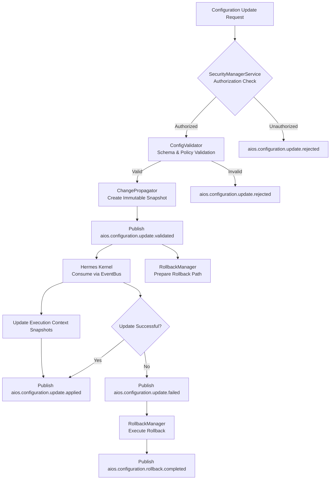

# 9.6 Configuration and Feature Flag System

## 1. Purpose
The Configuration and Feature Flag System provides a dynamic, versioned configuration mechanism that enables runtime updates to system behavior without requiring system restarts or redeployments. It establishes immutable configuration snapshots, provides deterministic feature flag evaluation, and ensures that all configuration changes are propagated through the EventBus with strong consistency guarantees. This system enables safe experimentation, gradual rollouts, and rapid rollback while maintaining deterministic execution guarantees for all execution contexts.

## 2. Scope

### In Scope
- Definition and versioning of configuration manifests (JSON Schema Draft 2020-12)
- Feature flag definition, evaluation, and rollout management
- Configuration validation, validation pipelines, and schema enforcement
- Atomic configuration updates propagated via EventBus
- Deterministic snapshotting and restoration of configuration state
- Role-based access control for configuration changes via SecurityManagerService
- Immutable audit logging of all configuration changes via AuditService
- Rollback mechanisms for failed or undesirable configuration updates
- Integration with Hermes Kernel through ConfigurationService API
- Propagation of configuration updates to all execution contexts via snapshot isolation

### Out of Scope
- Application-specific business logic configuration (handled by Parts 1-8)
- User preference storage or application-level feature toggles
- External configuration services (Consul, etcd, Apollo, etc.) – abstracted via adapters
- Encryption of configuration values at rest (handled by SecretManagerService)
- Distribution of secrets or cryptographic material (handled by SecretManagerService)

## 3. Architectural Goals
The Configuration and Feature Flag System MUST:
- Provide atomic, versioned configuration updates that are immediately visible to all execution contexts
- Guarantee deterministic feature flag evaluation given identical context and configuration snapshot
- Ensure configuration updates are immutable once activated and support instant rollback
- Propagate configuration changes through EventBus with causal ordering and at-least-once delivery
- Maintain cryptographic audit trail of all configuration changes for compliance and forensic analysis
- Enforce strict authorization and validation before any configuration becomes active
- Support multi-tenant configuration isolation with tenant-specific overrides and inheritance
- Provide bounded convergence time for configuration propagation (<100ms typical, <1s worst-case)
- Enable scheduled activation and expiration of feature flags with timezone-aware scheduling
- Support prerequisite flags and dependency graphs for complex feature gating scenarios

## 4. Runtime Lifecycle
The Configuration and Feature Flag Services operate continuously throughout system runtime, maintaining readiness to accept, validate, and propagate configuration changes.

```mermaid
stateDiagram-v2
    [*] -> Idle: Services Started
    Idle --> Validating: Update Request Received
    Validating --> Authorized: Validation Passed
    Validating --> Rejected: Validation Failed
    Rejected --> Idle: Emit rejected event
    Authorized --> Snapshotting: Authorization Passed
    Snapshotting --> Applying: Snapshot Created
    Applying --> Applied: Update Propagated Successfully
    Applied --> Idle: Emit applied event
    Applying --> RollingBack: Propagation Failed
    RollingBack --> RolledBack: Restore Previous Snapshot
    RolledBack --> Idle: Emit rollback completed event
    RolledBack --> Alerting: If Manual Intervention Required
    state Idle {
        [*] --> AwaitingRequest
        AwaitingRequest --> [*]
    }
```

## 5. Internal Architecture
The Configuration and Feature Flag System consists of the following components:

- **ConfigurationService**: Central service exposing configuration management APIs (get, set, validate, snapshot, rollback) and subscribing to configuration update events on the EventBus.
- **FeatureFlagManager**: Service responsible for evaluating feature flags against evaluation contexts, computing rollout percentages, and emitting feature flag change events.
- **ConfigValidator**: Service that validates configuration manifests against JSON Schemas and enforces validation policies before acceptance.
- **ChangePropagator**: Component that listens for validated configuration updates and orchestrates the creation of immutable snapshots and propagation via EventBus.
- **RollbackManager**: Service that processes rollback requests, restores previous configuration snapshots, and emits rollback completion events.
- **SecurityManagerService**: Authorizes configuration change requests based on RBAC policies and cryptographic verification of requestors.
- **AuditService**: Immutable logging of all configuration validation, approval, application, and rollback events.
- **Configuration Cache (per execution context)**: Immutable snapshot of configuration provided to each execution context at initialization, updated via EventBus notifications.

## 6. Configuration Model
Configuration is modeled as immutable, versioned manifests conforming to JSON Schema Draft 2020-12. Each manifest contains:

- **Manifest Metadata**: Unique manifest ID (UUIDv7), semantic version, timestamp, and cryptographic hash
- **Configuration Values**: Key-value pairs supporting primitive types (string, number, boolean), objects, and arrays
- **Feature Flag Definitions**: Collection of feature flag definitions with targeting rules and rollout strategies
- **Schema References**: References to JSON Schemas validating specific configuration sections
- **Metadata**: Audit trail information including creator, approver, and change reason
- **Dependencies**: Optional declaration of prerequisite manifests or feature flags
- **Tags**: User-defined labels for organization and filtering

Configuration manifests are immutable once activated. Updates create new manifest versions rather than modifying existing ones.

## 7. Configuration Sources
Configuration manifests may originate from:
- **ConfigurationService API**: Direct submission via gRPC/REST interfaces
- **Version Control System**: Automated synchronization from Git repositories via IaC controllers
- **Configuration Templates**: Parameterized templates instantiated with environment-specific values
- **Feature Flag Stores**: External systems synchronized via adapters (read-only for safety)
- **Emergency Overrides**: Time-limited, audited overrides requiring multi-party authorization

All configuration sources MUST undergo the same validation and authorization pipeline before activation.

## 8. Configuration Hierarchy
Configuration supports hierarchical inheritance with the following precedence (highest to lowest):
1. **Execution Context Overrides**: Per-context values set at context initialization
2. **Tenant Overrides**: Values specific to a tenant namespace
3. **Namespace Overrides**: Values specific to a functional namespace
4. **Environment Overrides**: Values specific to deployment environment (dev/staging/prod)
5. **Base Configuration**: Default values defined in the base manifest
6. **System Defaults**: Hardcoded fallback values for critical configuration

Inheritance follows JSON Merge Patch semantics (RFC 7396) with arrays replaced entirely unless configured for deep merge.

## 9. Configuration Resolution Order
Configuration values are resolved in this order for any given key:
1. Execution context override (if present)
2. Tenant override for current context's tenant (if present)
3. Namespace override for current context's namespace (if present)
4. Environment override for current deployment environment (if present)
5. Base configuration value (if present)
6. System default value (if defined)
7. Validation error (if required and no value found)

Resolution occurs at context initialization and is immutable for the lifetime of the execution context.

## 10. Configuration Validation Pipeline
Configuration validation occurs in a strict pipeline:

1. **Schema Validation**: Manifest validated against JSON Schema Draft 2020-12
2. **Semantic Validation**: Business rule validation (e.g., port ranges, valid enum values)
3. **Dependency Validation**: Verification that prerequisite manifests/flags exist and are active
4. **Security Validation**: Verification that submitter has appropriate permissions (RBAC)
5. **Conflict Validation**: Check for conflicts with existing active configuration
6. **Impact Analysis**: Prediction of affected execution contexts and feature flag evaluations
7. **Authorization**: Final approval by SecurityManagerService based on policies

Validation MUST fail fast and produce specific, actionable error messages. Validation results are cryptographically signed and immutably audited.

## 11. Configuration Propagation Pipeline
Configuration propagation follows this sequence:



## 12. Dynamic Reload Architecture
Dynamic reload occurs without service restart through immutable snapshot replacement:

1. ConfigurationService creates immutable snapshot of new configuration
2. ChangePropagator publishes `aios.configuration.update.validated` event
3. Hermes Kernel consumes event and atomically swaps execution context snapshots
4. Each execution context receives new immutable configuration snapshot via EventBus
5. FeatureFlagManager reloads flag definitions from new snapshot
6. ConfigurationService publishes `aios.configuration.update.applied` upon successful propagation
7. Execution contexts begin using new configuration immediately for new operations
8. Existing operations continue with previous snapshot until completion (if configured)

Execution contexts MUST observe atomic transition from one complete snapshot to another, never observing partial or intermediate states.

## 13. Feature Flag Architecture
Feature flags are first-class entities in the configuration model with the following attributes:

- **Flag ID**: Unique identifier (string)
- **Description**: Human-readable explanation
- **Default Value**: Value when no targeting rules match (boolean, string, number, or variant)
- **Variant Definition**: For multivariate flags, definition of possible variants
- **Targeting Rules**: Ordered list of rules evaluating to true/false for targeting
- **Rollout Percentage**: Percentage of matching contexts to activate flag (0-100)
- **Prerequisite Flags**: List of flag IDs that must evaluate to true for this flag to be considered
- **Dependencies**: List of flag IDs that this flag depends on for valuation
- **Schedule**: Activation and expiration timestamps with timezone
- **Environment Restriction**: List of environments where flag may be active
- **Tags**: User-defined labels for organization
- **Metadata**: Audit information including creator, creation time, modifier, modification time

Feature flag definitions are immutable within a configuration manifest. Updates create new flag definitions in new manifest versions.

## 14. Feature Flag Evaluation
Feature flag evaluation is deterministic and follows this process:

```mermaid
flowchart TD
    A[Feature Flag Evaluation Request] --> B[FeatureFlagManager\nLoad Flag Definition from Snapshot]
    B --> C{Evaluation Context\nProvided?}
    C -->|Yes| D[Apply Targeting Rules\n& Rollout Percentage]
    C -->|No| E[Use Default Context\nfrom Configuration]
    D --> F[Compute Flag Variant\n(enabled/disabled, value)]
    F --> G[Return FeatureFlagEvaluation\n{enabled, variant, metadata}]
    G --> H[Publish aios.configuration.feature.enabled\nor .disabled as appropriate]
    H --> I[Cache Evaluation Result\nfor TTL Duration]
```

Evaluation guarantees:
- Deterministic output given identical configuration snapshot and evaluation context
- Cryptographically seeded pseudorandom number generation for percentage rollouts
- Stable hashing of entity identifiers for consistent assignment across evaluations
- Short-circuit evaluation of prerequisite flags and dependencies
- Time-based evaluation respecting activation/expiration schedules
- Environment restriction enforcement
- Caching with configurable TTL to minimize evaluation overhead

## 15. Feature Flag Rollout Strategies
Supported rollout strategies include:

- **Percentage Rollout**: Activate flag for X% of matching contexts using consistent hashing
- **Gradual Rollout**: Increase percentage over time according to schedule
- **Canary Release**: Target specific percentage with automated rollback on error thresholds
- **Targeted Rollout**: Activate for specific tenants, users, or segments
- **Scheduled Activation**: Activate at specific time with timezone awareness
- **Expiration**: Automatically deactivate after specified duration or timestamp
- **Prerequisite Gating**: Require one or more prerequisite flags to be active
- **Dependency Chaining**: Value determination based on evaluation of other flags
- **Emergency Override**: Immediate activation/deactivation requiring multi-party approval

Rollout strategies MAY be combined to create complex targeting scenarios.

## 16. Runtime Update Model
Configuration updates follow an immutable, atomic update model:

1. **Proposal**: New configuration manifest submitted via ConfigurationService submitted via ConfigurationService API
2. **Validation**: Manifest passes through validation pipeline
3. **Authorization**: SecurityManagerService verifies submitter permissions
4. **Snapshotting**: Immutable snapshot created of proposed configuration
5. **Propagation**: Snapshot distributed to all execution contexts via EventBus
6. **Activation**: Execution contexts atomically switch to new snapshot
7. **Audit**: All steps immutably logged with cryptographic hashes

Execution contexts NEVER observe partial updates or intermediate states. All contexts transition atomically from one consistent state to another.

## 17. Configuration Versioning
Configuration versioning follows these principles:

- **Semantic Versioning**: Configuration manifests use semantic versioning (MAJOR.MINOR.PATCH)
- **Monotonic Increase**: Version numbers MUST strictly increase with each new manifest
- **Immutable Versions**: Published versions CANNOT be altered or deleted
- **Version References**: Manifests MAY specify minimum/maximum compatible versions
- **Version History**: Complete history of all versions maintained for audit and rollback
- **Version Tags**: Human-readable tags MAY be applied to versions for easy reference
- **Version Metadata**: Each version includes timestamp, creator, and change description

Version numbers are encoded in the manifest metadata and validated during the validation pipeline.

## 18. Snapshot Management
Configuration snapshots are managed as follows:

- **Immutable Storage**: Snapshots stored in write-once storage with cryptographic hashing
- **Reference Counting**: Snapshots tracked by reference count for garbage collection
- **Garbage Collection**: Unreferenced snapshots removed after configurable retention period
- **Snapshot IDs**: Each snapshot assigned unique UUIDv7 identifier
- **Snapshot Metadata**: Includes source manifest ID, version, timestamp, and creator
- **Snapshot Verification**: Hash verification performed before snapshot activation
- **Snapshot Distribution**: Snapshots distributed via EventBus with integrity verification

Snapshot storage MAY use tiered storage (hot/warm/cold) based on access patterns and age.

## 19. Rollback Architecture
Rollback restores previous known-good configuration snapshots:

```mermaid
flowchart TD
    A[Rollback Trigger\n(Failed Health Check\nManual Request\nAutomatic Policy)] --> B[RollbackManager\nLookup Previous Snapshot]
    B --> C[Validate Snapshot\nIntegrity & Authorization]
    C -->|Valid| D[Publish aios.configuration.rollback.request]
    D --> E[ChangePropagator\nRestore Snapshot]
    E --> F[Hermes Kernel\nAtomic Snapshot Swap]
    F --> G[Publish aios.configuration.rollback.completed]
    C -->|Invalid| H[Publish aios.configuration.update.failed\nwith Escalation Alert]
    H --> I[Alerting & Incident Response]
```

Rollback guarantees:
- Atomic restoration of exact previous snapshot across all execution contexts
- Preservation of all configuration values and feature flag definitions
- Immediate effect for new operations while allowing in-flight operations to complete
- Cryptographic verification of snapshot integrity before restoration
- Audit trail of rollback request, approval, execution, and completion
- Configurable retention of historical snapshots for multiple rollback points

## 20. Change Propagation
Configuration changes propagate via EventBus with the following characteristics:

- **Atomic Broadcast**: All subscribing components receive the same update event
- **Causal Ordering**: Events with same correlation ID delivered in causal order
- **At-Least-Once Delivery**: Guaranteed delivery with deduplication at consumer
- **Schema Validation**: Events validated against JSON Schema before delivery
- **Correlation Tracking**: Each update includes correlationId and causationId for tracing
- **Message TTL**: Events expire after configurable time-to-live to prevent accumulation
- **Priority Queuing**: Critical updates MAY be assigned higher priority
- **Message Compression**: Large payloads automatically compressed for efficiency
- **Backpressure Handling**: Subscribers signal readiness; publishers block or drop when overwhelmed
- **Multi-Tenant Isolation**: Tenants cannot observe each other's configuration events
- **Encryption**: Events encrypted at rest and in transit using AES256-GCM

## 21. Consistency Guarantees
The system provides these consistency guarantees:

- **Atomic Visibility**: All execution contexts observe the same configuration version at any point in time after propagation completes
- **Snapshot Isolation**: Execution contexts observe a consistent snapshot isolated from concurrent updates
- **Read-After-Write Consistency**: Configuration updates are visible to subsequent reads in the same context
- **Monotonic Reads**: Successive reads in the same context return same or newer versions
- **Bounded Staleness**: Maximum propagation delay configurable (default <100ms, max <1s)
- **Eventual Consistency**: Guaranteed convergence to same version across all contexts
- **Causal Consistency**: Related updates observed in causal order by all contexts
- **Read-My-Writes**: Context that submitted update sees its own update immediately

## 22. Deterministic Configuration Rules
Configuration must satisfy these determinism requirements:

- **Determinative Evaluation**: Identical input (context + configuration) produces identical output
- **Side-Effect Free**: Configuration evaluation produces no side effects
- **Idempotent Evaluation**: Repeated evaluation with same input yields same result
- **Monotonic State**: Configuration state only changes via atomic updates, never mutates in-place
- **Isolated Evaluation**: Evaluation in one context does not affect evaluation in another
- **Deterministic Ordering**: Rule evaluation order is deterministic and documented
- **Pure Functions**: All evaluation functions are pure (no external state dependence)
- **Seedable Randomness**: Any randomness uses context-seeded deterministic generators
- **Time Independence**: Evaluation does not depend on real-time clock (uses virtualized time)
- **Resource Independence**: Evaluation does not depend on external resource availability

## 23. Multi-tenant Configuration Isolation
Multi-tenancy is supported through:

- **Tenant Namespaces**: Logical partitioning of configuration by tenant identifier
- **Variant Inheritance**: Tenants inherit from global configuration with selective overrides
- **Isolation Guarantees**: Tenants cannot read or modify each other's configuration
- **Resource Quotas**: Per-tenants limits on configuration size and update frequency
- **Noise Isolation**: Tenant configuration changes do not affect other tenants' performance
- **Audit Separation**: Audit logs separable by tenant for compliance
- **Performance Isolation**: Resource allocation prevents one tenant from starving others
- **Security Isolation**: Strict RBAC prevents cross-tenant configuration access
- **Data Isolation**: Physical or logical separation of tenant configuration storage

## 24. Security Model
Security is enforced through:

- **Authentication**: All configuration requests MUST be authenticated via mutual TLS, JWT, or API key
- **Authorization**: Role-Based Access Control (RBAC) with fine-grained permissions:
  - `config.read`: Read access to configuration
  - `config.propose`: Ability to submit configuration changes
  - `config.approve`: Ability to approve configuration changes
  - `config.rollback`: Ability to initiate rollbacks
  - `config.audit`: Access to audit logs
- **Encryption**: Configuration data encrypted at rest using AES256-GCM
- **Integrity**: Cryptographic hashing (SHA3-256) of all configuration manifests
- **Signing**: Digital signatures (ED25519) on all configuration manifests
- **Secrets Management**: Sensitive values stored in SecretManagerService, referenced by ID
- **Audit Logging**: Immutable, cryptographically chained log of all configuration access
- **Network Security**: All service-to-service communication encrypted via TLS 1.3
- **Input Validation**: Strict validation of all configuration inputs to prevent injection
- **Principle of Least Privilege**: Services run with minimum required permissions

## 25. Secret Handling
Secrets are handled through integration with SecretManagerService:

- **Reference Only**: Configuration manifests contain only references to secrets (URI or ID)
- **Runtime Resolution**: Secrets resolved at runtime by ExecutionContext via SecretManagerService
- **Never in Logs**: Secrets never appear in logs, traces, or metrics (automatically redacted)
- **Memory Protection**: Memories stored in protected memory regions when possible
- **Short-Lived Credentials**: Preference for short-lived, dynamically generated credentials
- **Encryption in Transit**: Secrets encrypted when transmitted between services
- **Access Logging**: Secret access logged separately from general configuration access
- **Rotation Support**: Automatic secret rotation supported through versioned references
- **Breach Containment**: Compromise of application instance does not reveal secret values
- **Approval Workflow**: Secret access requests may require approval based on sensitivity

## 26. Audit Logging
Audit logging provides immutable, cryptographically verifiable records:

- **Immutable Log**: Append-only log with cryptographic chaining (SHA3-256 hash chains)
- **Tamper Evidence**: Any modification detectable through hash verification
- **Event Coverage**: All configuration validation, approval, application, and rollback events logged
- **Context Inclusion**: Audit entries include requesting principal, timestamp, and rationale
- **Change Details**: Before/after values for configuration changes (with secrets redacted)
- **Integrity Verification**: Periodic verification of hash chain integrity
- **Export Capability**: Secure export of audit trail for external SIEM systems
- **Retention Policy**: Configurable retention with automatic archiving to tamper-proof storage
- **Access Controls**: Strict RBAC governing who may read audit logs
- **Real-Time Streaming**: Audit events streamable to monitoring systems in real-time
- **Searchability**: Indexed fields for efficient querying and investigation

## 27. EventBus Integration
The system integrates with EventBus as follows:

- **Event Publication**: All state changes published as typed events
- **Event Subscription**: Components subscribe to relevant event types
- **Schema Validation**: Events validated against JSON Schema before publishing/consuming
- **Correlation IDs**: Events include correlationId and causationId for distributed tracing
- **Causation Chains**: Explicit linking of events to show cause-effect relationships
- **Dead Letter Queues**: Repeatedly failing events routed to DLQ for inspection
- **Message TTL**: Events expire after configurable time-to-live (default 24 hours)
- **Priority Queuing**: Configurable event priority (critical, high, normal, low)
- **Message Compression**: Automatic compression of payloads exceeding 1KB
- **Backpressure Handling**: Flow control based on subscriber readiness
- **Multi-Tenant Isolation**: Tenants isolated through separate event namespaces or filtering
- **Encryption**: Events encrypted at rest (AES256-GCM) and in transit (TLS 1.3)
- **Schema Evolution**: Backward and forward compatible schema changes supported
- **At-Least-Once Delivery**: Guaranteed delivery with deduplication mechanisms

## 28. Infrastructure Events
The following events MUST be published:

```
aios.configuration.update.request
aios.configuration.update.validated
aios.configuration.update.rejected
aios.configuration.update.applied
aios.configuration.update.failed
aios.configuration.rollback.request
aios.configuration.rollback.completed
aios.configuration.snapshot.created
aios.configuration.snapshot.restored
aios.configuration.feature.enabled
aios.configuration.feature.disabled
aios.configuration.feature.rollout.updated
```

Each event follows the standard EventBus envelope format with appropriate payload schemas.

## 29. Failure Handling
Failure handling includes:

- **Validation Failures**: Rejected with specific error messages; no state change
- **Authorization Failures**: Rejected with insufficient permissions error; audit logged
- **Propagation Failures**: Trigger automatic rollback; alert operators
- **Snapshot Corruption**: Detected via hash verification; triggers alert and fallback to last known good
- **Evaluation Errors**: Feature flag evaluation errors return default value and emit error metric
- **Circular Dependencies**: Detected during validation; rejected with specific error
- **Configuration Drift**: Detected via periodic reconciliation; triggers alert and resync option
- **Storage Failures**: Redundant storage with automatic failover; degraded mode alerts
- **Network Partitions**: EventBus buffering with timeout; eventual consistency upon reconnect
- **Resource Exhaustion**: Backpressure activation; load shedding of non-critical updates
- **Byzantine Failures**: Cryptographic signatures prevent acceptance of tampered updates
- **Human Error**: Approval workflows and validation prevent accidental disruptive changes

## 30. Recovery Model
Recovery mechanisms include:

- **Automatic Rollback**: On failed propagation, system automatically rolls back to previous version
- **Manual Rollback**: Operators may initiate rollback to any known-good version via API
- **Checkpoint Recovery**: Periodic snapshots enable recovery from catastrophic failure
- **Event Replay**: EventBus logs enable replay to reconstruct state after corruption
- **Cross-Region Replication**: Configuration asynchronously replicated to secondary regions
- **Split-Brain Prevention**: Quorum requirements prevent divergent configurations during partitions
- **Last Known Good**: System maintains rolling window of known-good configurations
- **Health Checks**: Automatic health verification before and after configuration application
- **Circuit Breakers**: Temporary suppression of updates during instability periods
- **Graceful Degradation**: Non-critical features disabled if configuration service unavailable
- **Manual Override**: Emergency procedures for manual configuration injection when automated systems fail

## 31. Performance Requirements
Performance requirements:

- **Latency**: 99% of configuration reads < 1ms; 99.9% < 5ms
- **Throughput**: Minimum 100,000 configuration reads/second per instance
- **Update Propagation**: 99% of updates propagated to all contexts < 100ms; 99.9% < 1s
- **Evaluation Latency**: 99% of feature flag evaluations < 500μs; 99.9% < 2ms
- **Startup Time**: Configuration service ready to serve requests within 2s of startup
- **Memory Usage**: Bounded memory growth; < 100MB base + 1KB per active configuration key
- **CPU Usage**: < 5% CPU utilization at 10k requests/second under steady state
- **EventBus Overhead**: < 1ms added latency per event hop
- **Scalability**: Horizontal scaling supported; linear performance increase with node count
- **Garbage Collection**: Pause times < 10ms at 99th percentile
- **Network Utilization**: < 1Mbps sustained bandwidth per instance under normal operation
- **Disk I/O**: < 10 IOPS sustained for configuration storage under normal operation

## 32. Configuration Caching
Caching strategy:

- **Local Caching**: Each execution context maintains immutable snapshot reference
- **Version-Based Invalidation**: Caches invalidated only on version change
- **Zero-Copy Reads**: Configuration accessed via memory-mapped files or shared memory when possible
- **Prefetching**: Anticipatory loading of likely-to-be-used configuration sections
- **Hierarchical Caching**: L1 (per-context), L2 (per-node), L3 (cluster-wide) cache levels
- **Cache Warming**: Pre-loading of configuration during context initialization
- **Cache Coherency**: Automatic invalidation via EventBus notifications
- **Size Limits**: Configurable maximum cache size with LRU eviction
- **Staleness Bounds**: Maximum staleness configurable; defaults to 0 (always current)
- **Metrics Exposure**: Cache hit/miss ratios and latency exported via MetricsService
- **Warming Strategies**: Predictive loading based on historical access patterns
- **Compression**: Optional in-memory compression for large configuration values

## 33. Validation Rules
Validation rules include:

- **Schema Compliance**: Mandatory JSON Schema Draft 2020-12 validation
- **Type Safety**: Strict type checking for all configuration values
- **Range Validation**: Numeric values checked against defined minima/maxima
- **Length Limits**: String and array lengths checked against configured maxima
- **Format Validation**: Strings validated against formats (email, UUID, hostname, etc.)
- **Enum Validation**: Values checked against allowed enumerations
- **Pattern Matching**: Strings validated against regular expressions
- **Dependency Validation**: References to other configuration items validated for existence
- **Referential Integrity**: Foreign-key style validation for cross-references
- **Uniqueness Constraints**: Enforcement of uniqueness where required
- **Conditional Validation**: Validation rules that depend on other field values
- **Custom Validation**: Plugin system for domain-specific validation logic
- **Batch Validation**: Validation of entire configuration for consistency
- **Security Scanning**: Automatic scanning for common injection patterns (SQL, XSS, etc.)
- **Size Limits**: Maximum individual value and total configuration size enforced
- **Depth Limits**: Maximum nesting depth for objects and arrays prevented
- **Circular Reference Detection**: Automatic detection and rejection of circular references

## 34. Configuration State Model
Configuration state consists of:

- **Current Version**: Identifier of the presently active configuration version
- **Immutable Snapshots**: Complete, immutable copies of configuration at each version
- **Version History**: Ordered list of all versions with metadata
- **Pending Updates**: Submitted but not yet validated or authorized configurations
- **Failed Updates**: Rejected configurations with failure reasons
- **Rollback Candidates**: Versions suitable for rollback (valid, authorized, previously active)
- **Feature Flag State**: Current evaluation results for all feature flags per context
- **Validation Cache**: Cached validation results to avoid redundant computation
- **Subscription Registry**: List of components subscribed to configuration change events
- **Audit Pointer**: Current position in immutable audit log
- **Garbage Collection Metadata**: Information for determining which snapshots may be collected
- **Performance Metrics**: Real-time statistics on latency, throughput, and error rates
- **Security Context**: Information about the current security principal for authorization

State transitions follow the state machine defined in Section 4.

## 35. Mermaid Diagrams
The following Mermaid diagrams are included in this section. Refer to the indicated sections for the authoritative source:

- **Component Diagram**: Shows the internal components of the Configuration and Feature Flag System and their interactions. (See Section 5)
- **Configuration Update Pipeline**: Depicts the flow from configuration submission to application or rejection. (See Section 11)
- **Feature Flag Evaluation Flow**: Illustrates the deterministic evaluation of feature flags. (See Section 14)
- **Configuration Propagation Flow**: Demonstrates how configuration changes propagate via the EventBus. (See Section 20)
- **Rollback Flow**: Details the process of reverting to a previous known-good configuration snapshot. (See Section 19)
- **Runtime Lifecycle**: State diagram showing the operational states of configuration services. (See Section 4)
- **Configuration State Machine**: Lifecycle of a configuration version from draft to archival. (See Section 34)

## 36. JSON Schemas
The following JSON Schema Draft 2020-12 files are provided under the `shared/` directory:

- **shared/ConfigManifest.json** - Schema for versioned configuration manifests
- **shared/FeatureFlagSchema.json** - Schema for feature flag definitions  
- **shared/ChangeLog.json** - Schema for immutable change log entries

## 37. Architectural Contracts
The Configuration and Feature Flag System defines the following implementation-agnostic architectural contracts:

### ConfigurationService Contract
**Purpose**: Central service for managing configuration manifests and feature flags
**Responsibilities**:
- Storing and retrieving configuration manifests
- Validating configuration changes
- Coordinating configuration propagation
- Managing feature flag definitions
- Providing configuration query interfaces
**Required Operations**:
- Get current configuration for a context
- Get feature flag state for an evaluation context
- Submit configuration updates for validation
- Validate configuration manifests
- Request rollback to previous versions
- Get configuration history
- Retrieve immutable snapshots
**Required Inputs**:
- Context identifiers for queries
- Configuration manifests for updates
- Version identifiers for historical queries
- Rollback requests with justification
**Required Outputs**:
- Configuration manifests or snapshots
- Feature flag evaluation results
- Operation status and identifiers
- Validation results
- Historical records
**Preconditions**:
- Service must be initialized and running
- Caller must be authenticated
- For write operations, caller must have appropriate permissions
**Postconditions**:
- On successful read: Returns current configuration snapshot
- On successful write: Change is queued for validation and processing
- On validation request: Returns validation status
- On rollback request: Returns request identifier
**Error Conditions**:
- Authentication failure: Returns unauthorized error
- Authorization failure: Returns forbidden error with required permissions
- Validation failure: Returns detailed validation errors
- Resource not found: Returns not found error for invalid versions/IDs
- System overload: Returns service unavailable error with retry guidance
**Behavioural Guarantees**:
- All operations are idempotent where applicable
- Read operations return consistent snapshots
- Write operations are processed in order of receipt
- Error responses include actionable information
- Service maintains internal consistency during failures

### FeatureFlagManager Contract
**Purpose**: Service for evaluating feature flags against contexts
**Responsibilities**:
- Loading feature flag definitions from configuration snapshots
- Evaluating flags against provided contexts
- Applying targeting rules and rollout percentages
- Caching evaluation results
- Emitting feature flag change events
**Required Operations**:
- Evaluate feature flag for given context
- Get list of available feature flags
- Get definition of specific feature flag
**Required Inputs**:
- Feature flag identifier
- Evaluation context (may be null/default)
- Optional: specific variant or value constraints
**Required Outputs**:
- Feature flag enabled/disabled state
- Result value (if applicable)
- Variant identifier (for multivariate flags)
- Evaluation metadata
**Preconditions**:
- Service must be initialized with access to current configuration snapshot
- Requested feature flag must exist in current configuration
**Postconditions**:
- Returns deterministic evaluation result
- Updates internal caches as appropriate
- Emits corresponding feature flag event
**Error Conditions**:
- Unknown feature flag: Returns error indicating flag not found
- Invalid context: Returns error for malformed context
- Service unavailable: Returns error if configuration snapshot inaccessible
**Behavioural Guarantees**:
- Evaluation is deterministic for identical inputs
- Results are consistent with targeting rules and rollout percentages
- Cached results respect configured TTL
- Evaluation overhead is bounded and predictable

### ConfigValidator Contract
**Purpose**: Service for validating configuration manifests
**Responsibilities**:
- Validating manifests against JSON Schema
- Performing semantic validation
- Checking dependencies and conflicts
- Validating authorization and security constraints
- Providing detailed validation feedback
**Required Operations**:
- Validate configuration manifest
- Validate specific manifest sections
- Check dependency satisfaction
- Validate authorization for operation
**Required Inputs**:
- Configuration manifest to validate
- Validation scope (full or partial)
- Authorization context for permission checks
**Required Outputs**:
- Validation result (pass/fail)
- Detailed error messages for failures
- Warning messages for potential issues
- Validation metadata
**Preconditions**:
- Validator must be initialized with required schemas
- Validation rules and policies must be loaded
**Postconditions**:
- On valid input: Returns success with no errors
- On invalid input: Returns failure with specific error details
- Validation does not modify input manifest
**Error Conditions**:
- Malformed JSON: Returns parse error
- Schema violations: Returns detailed validation errors
- Missing dependencies: Lists unsatisfied dependencies
- Authorization failure: Indicates insufficient permissions
**Behavioural Guarantees**:
- Validation is deterministic for identical inputs
- All schema constraints are checked
- Security validations are performed
- Feedback is specific and actionable
- Complex validations complete within bounded time

### ChangePropagator Contract
**Purpose**: Component for distributing validated configuration changes
**Responsibilities**:
- Creating immutable snapshots of validated configurations
- Publishing configuration update events via EventBus
- Coordinating snapshot distribution to interested parties
- Managing rollback preparation
- Ensuring propagation completeness
**Required Operations**:
- Create snapshot from validated manifest
- Publish configuration update events
- Distribute snapshots to consumers
- Prepare rollback path for failed updates
- Signal propagation completion
**Required Inputs**:
- Validated configuration manifest
- Authorization token for operation
- Correlation ID for tracking
- Target version identifier
**Required Outputs**:
- Snapshot identifier
- Published event identifiers
- Distribution status
- Propagation completion signal
**Preconditions**:
- Input manifest must have passed validation
- Authorization must be confirmed for operation
- EventBus must be available and connected
**Postconditions**:
- Snapshot is stored immutably
- Events are published to EventBus
- Consumers are notified of availability
- Rollback information is recorded
**Error Conditions**:
- Validation failure: Rejects invalid input
- Storage failure: Indicates persistence issues
- EventBus failure: Reports messaging problems
- Insufficient resources: Signals resource exhaustion
**Behavioural Guarantees**:
- Snapshots are cryptographically verifiable
- Event delivery follows EventBus guarantees
- Distribution is complete or reports failure
- Process is resilient to transient failures
- State remains consistent despite errors

### RollbackManager Contract
**Purpose**: Service for managing configuration rollbacks
**Responsibilities**:
- Identifying suitable rollback candidates
- Validating snapshot integrity and authorization
- Coordinating rollback execution via EventBus
- Verifying rollback completion
- Maintaining rollback history and metadata
**Required Operations**:
- Identify rollback candidates for given version
- Validate snapshot integrity and authorization
- Request rollback to target version
- Execute rollback procedure
- Verify rollback completion
**Required Inputs**:
- Target version for rollback
- Justification for rollback operation
- Authorization credentials
- Correlation ID for tracking
**Required Outputs**:
- Rollback request identifier
- Validation results for target snapshot
- Execution status updates
- Completion confirmation
**Preconditions**:
- Requested version must exist in history
- Request must be properly authorized
- System must be in state allowing rollback
**Postconditions**:
- On success: System restored to target version
- On failure: System remains in current state with error logged
- Rollback operation is fully auditied
**Error Conditions**:
- Unknown version: Target version not found in history
- Invalid snapshot: Cryptographic verification fails
- Authorization failure: Insufficient privileges for rollback
- Validation failure: Target snapshot fails current validation
- Execution failure: Problems during rollback process
**Behavioural Guarantees**:
- Rollback restores exact previous state when successful
- Process is atomic across all execution contexts
- Integrity is verified before and after operation
- Detailed audit trail is maintained
- Failed rollbacks leave system unchanged

### SecurityManagerService Contract
**Purpose**: Service for authorizing configuration operations
**Responsibilities**:
- Authenticating requestors for configuration operations
- Authorizing operations based on RBAC policies
- Validating cryptographic signatures on manifests
- Checking permissions for specific operations
- Providing security decisions for configuration access
**Required Operations**:
- Authenticate requestor credentials
- Authorize operation for given principal
- Validate manifest signatures
- Check permission for specific action
- Security decision for configuration access
**Required Inputs**:
- Requestor credentials or token
- Operation type to authorize
- Target resource or manifest
- Permission requirements for operation
- Cryptographic signature (if applicable)
**Required Outputs**:
- Authentication result
- Authorization decision (allow/deny)
- Required missing permissions (if denied)
- Security validation details
**Preconditions**:
- Service must be initialized with security policies
- Authentication system must be available
- Authorization policies must be loaded
**Postconditions**:
- Valid credentials result in authentication success
- Authorized operations proceed with appropriate logging
- Denied operations return specific refusal reasons
- Security decisions are consistent with policies
**Error Conditions**:
- Invalid credentials: Authentication failure
- Missing permissions: Authorization denial with details
- Invalid signature: Cryptographic validation failure
- Policy violation: Action violates security policy
- System error: Authentication/authorization service unavailable
**Behavioural Guarantees**:
- Decisions are consistent with defined policies
- All access attempts are logged for audit
- Cryptographic validation is performed when applicable
- Decisions are reproducible for identical inputs
- Service fails secure (denies by default) on errors

### AuditService Contract
**Purpose**: Service for immutable audit logging of configuration activities
**Responsibilities**:
- Recording all configuration validation events
- Logging approval and rejection decisions
- Tracking application and rollback operations
- Maintaining cryptographic chain of log entries
- Providing secure audit trail access
**Required Operations**:
- Log configuration validation attempt
- Log approval or rejection decision
- Log configuration application event
- Log rollback operation
- Log snapshot creation/restoration
- Retrieve audit log entries
**Required Inputs**:
- Event type and timestamp
- Actor initiating the operation
- Target manifest or configuration
- Event-specific data payload
- Previous hash for chaining (except first entry)
**Required Outputs**:
- Log entry identifier
- Current hash for chaining
- Storage confirmation
- Query results for log retrieval
**Preconditions**:
- Service must be initialized with storage backend
- Cryptographic chaining must be configured
- Audit policy must define what to log
**Postconditions**:
- Log entry is permanently stored
- Cryptographic hash chain is maintained
- Entry is tamper-evident
- Audit trail remains complete and consistent
**Error Conditions**:
- Storage failure: Unable to persist log entry
- Chaining failure: Cryptographic verification error
- Permission denied: Insufficient rights to access logs
- Invalid input: Malformed log entry data
- Query error: Problems retrieving log data
**Behavioural Guarantees**:
- Log entries are immutable once written
- Cryptographic chain prevents undetected tampering
- All required events are logged
- Logs are available for compliant retention period
- Read operations provide consistent views

## 38. Runtime Invariants
The Configuration and Feature Flag System MUST maintain these runtime invariants:

- **INV-CF-9.1**: All configuration manifests are immutable once created and validated
- **INV-CF-9.2**: Configuration version numbers strictly increase with each new manifest
- **INV-CF-9.3**: Every active configuration version has a corresponding immutable snapshot
- **INV-CF-9.4**: Execution contexts observe only complete, immutable configuration snapshots
- **INV-CF-9.5**: Configuration updates are atomic: all contexts transition together or none do
- **INV-CF-9.6**: Feature flag evaluation is deterministic given identical context and snapshot
- **INV-CF-9.7**: No configuration value may be accessed without appropriate authorization
- **INV-CF-9.8**: All configuration changes are immutably audited with cryptographic chaining
- **INV-CF-9.9**: The system maintains a verifiable chain of custody for all configuration values
- **INV-CF-9.10**: Rollback restores exact previous configuration state (bit-for-bit identical)
- **INV-CF-9.11**: Configuration validation always precedes authorization and application
- **INV-CF-9.12**: Secret references in configuration are never resolved by the ConfigurationService
- **INV-CF-9.13**: Evaluation context never contains secret values (resolved at point of use)
- **INV-CF-9.14**: The system prevents circular dependencies in configuration and feature flags
- **INV-CF-9.15**: Configuration size and complexity remain within defined performance bounds
- **INV-CF-9.16**: EventBus delivery guarantees apply to all configuration events
- **INV-CF-9.17**: Timeout values prevent infinite blocking during configuration operations
- **INV-CF-9.18**: Resource usage (memory, CPU, disk) remains bounded under all conditions
- **INV-CF-9.19**: The system gracefully degrades when non-critical dependencies fail
- **INV-CF-9.20**: Administrative operations require appropriate authorization and audit logging

## 39. Cross References
- **Part 7 §7.2 (Workflow Configuration)**: Workflow definitions consume configuration values and feature flags via the ConfigurationService API to enable dynamic workflow behavior.
- **Part 8 §8.7 (Optimization Layer Policies)**: Optimization policies (auto-scaling, caching strategies, resource allocation) are dynamically adjusted via configuration updates without service restart.
- **Part 9 Context**: Provides foundational assumptions, runtime invariants, and architectural principles that underlie this specification.
- **Hermes Kernel**: Defines how execution contexts obtain immutable configuration snapshots during initialization and maintain update subscriptions via EventBus.
- **EventBus**: Specifies event delivery guarantees, schema validation, correlation tracking, and message formatting used by the configuration system.
- **Security Foundations**: Details the RBAC model and authorization checks performed by SecurityManagerService for configuration change requests.
- **Infrastructure Observability**: Describes how configuration change events are emitted to MetricsService, TracerService, and LoggerService for monitoring, alerting, and debugging.

## 40. ADR References
- **ADR-009**: Configuration Immutability Principle - Establishes that configuration must be treated as immutable once activated to ensure deterministic execution.
- **ADR-010**: Feature Flag Evaluation Determinism - Mandates cryptographic seeding and consistent hashing for reproducible feature flag evaluations.
- **ADR-011**: Configuration Event Schema Standardization - Defines the standard envelope and payload structure for all configuration-related EventBus events.
- **ADR-012**: Secure Secret Reference Pattern - Requires that configuration manifests contain only references to secrets, never the secrets themselves.
- **ADR-013**: Configuration Validation Pipeline Standardization - Establishes the mandatory validation stages and failure handling procedures.

## 41. Conformance Requirements
Implementation of the Configuration and Feature Flag System MUST satisfy these requirements:

### Functional Requirements
- **FR-CF-9.1**: Support creation, validation, authorization, and application of versioned configuration manifests
- **FR-CF-9.2**: Provide atomic, instantaneous configuration updates to all execution contexts
- **FR-CF-9.3**: Enable deterministic feature flag evaluation with percentage-based rollout
- **FR-CF-9.4**: Support prerequisite flags and dependency graphs for complex gating scenarios
- **FR-CF-9.5**: Provide role-based access control for configuration operations
- **FR-CF-9.6**: Maintain immutable, cryptographically verifiable audit log of all configuration activities
- **FR-CF-9.7**: Enable instant rollback to any previous known-good configuration version
- **FR-CF-9.8**: Support tenant-specific configuration overrides with inheritance
- **FR-CF-9.9**: Integrate with SecretManagerService for secure secret handling
- **FR-CF-9.10**: Provide programmatic API for configuration query and modification
- **FR-CF-9.11**: Emit standardized events via EventBus for all state transitions
- **FR-CF-9.12**: Support scheduled activation and expiration of feature flags
- **FR-CF-9.13**: Provide configuration history and version timeline querying
- **FR-CF-9.14**: Enable snapshot creation and restoration for disaster recovery
- **FR-CF-9.15**: Support configuration validation against JSON Schema Draft 2020-12
- **FR-CF-9.16**: Enforce maximum configuration size and complexity limits
- **FR-CF-9.17**: Provide health check endpoints for operational monitoring
- **FR-CF-9.18**: Support graceful degradation when non-critical dependencies fail
- **FR-CF-9.19**: Enable configuration change notification via multiple delivery mechanisms
- **FR-CF-9.20**: Provide administrative interfaces for manual intervention when required

### Non-Functional Requirements
- **NFR-CF-9.1**: Configuration read latency ≤ 1ms for 99% of requests, ≤ 5ms for 99.9%
- **NFR-CF-9.2**: Configuration update propagation ≤ 100ms for 99% of updates, ≤ 1s for 99.9%
- **NFR-CF-9.3**: Feature flag evaluation latency ≤ 500μs for 99% of evaluations, ≤ 2ms for 99.9%
- **NFR-CF-9.4**: System shall support ≥ 100,000 configuration reads/second per instance
- **NFR-CF-9.5**: Memory usage shall not exceed 100MB base + 1KB per active configuration key
- **NFR-CF-9.6**: CPU utilization shall remain < 5% at 10,000 requests/second under steady state
- **NFR-CF-9.7**: EventBus message overhead shall add ≤ 1ms latency per hop
- **NFR-CF-9.8**: System shall support horizontal scaling with linear performance improvement
- **NFR-CF-9.9**: Garbage collection pause times shall be < 10ms at 99th percentile
- **NFR-CF-9.10**: Network bandwidth consumption shall be < 1Mbps sustained under normal operation
- **NFR-CF-9.11**: Disk I/O shall be < 10 IOPS sustained for configuration storage under normal operation
- **NFR-CF-9.12**: All cryptographic operations shall use FIPS 140-2 validated algorithms
- **NFR-CF-9.13**: System shall provide configurable retention policies for configuration history
- **NFR-CF-9.14**: Audit log shall be tamper-evident with cryptographic hash chaining
- **NFR-CF-9.15**: System shall support multi-tenancy with strict isolation between tenants
- **NFR-CF-9.16**: Configuration validation shall provide specific, actionable error messages
- **NFR-CF-9.17**: System shall prevent configuration drift through periodic reconciliation
- **NFR-CF-9.18**: Recovery time objective (RTO) for configuration service shall be < 30 seconds
- **NFR-CF-9.19**: Recovery point objective (RPO) for configuration data shall be 0 seconds
- **NFR-CF-9.20**: System shall operate correctly under network partition conditions with eventual consistency

## 42. Static Conformance Checks
Static analysis MUST verify:

- **SCC-CF-9.1**: Configuration manifest schema conforms to JSON Schema Draft 2020-12
- **SCC-CF-9.2**: All configuration fields have appropriate type annotations
- **SCC-CF-9.3**: No circular dependencies exist in configuration or feature flag definitions
- **SCC-CF-9.4**: Default values conform to specified types for all configuration fields
- **SCC-CF-9.5**: Enumerated values are restricted to defined allowed values
- **SCC-CF-9.6**: Numeric fields have appropriate minimum and maximum constraints
- **SCC-CF-9.7**: String fields have appropriate length constraints and format validation
- **SCC-CF-9.8**: Object nesting depth does not exceed configured maximum
- **SCC-CF-9.9**: Array sizes do not exceed configured maximum
- **SCC-CF-9.10**: All required fields are present in schema definitions
- **SCC-CF-9.11**: No deprecated schema constructs are used
- **SCC-CF-9.12**: Schema references use correct JSON Schema reference syntax
- **SCC-CF-9.13**: Feature flag targeting rules use valid operators and field references
- **SCC-CF-9.14**: Schedule timestamps are in valid ISO 8601 format
- **SCC-CF-9.15**: Timezone strings conform to IANA timezone database format
- **SCC-CF-9.16**: Environment restrictions use valid environment names
- **SCC-CF-9.17**: All UUID fields conform to RFC 4122 format
- **SCC-CF-9.18**: Version strings conform to semantic versioning specification
- **SCC-CF-9.19**: No executable code or scripts are embedded in configuration schemas
- **SCC-CF-9.20**: All security-sensitive fields are appropriately marked for special handling

## 43. Runtime Conformance Checks
Runtime validation MUST verify:

- **RCC-CF-9.1**: All configuration manifests validate against JSON Schema before acceptance
- **RCC-CF-9.2**: Configuration version numbers strictly increase with each new manifest
- **RCC-CF-9.3**: Cryptographic hashes of manifests match expected values
- **RCC-CF-9.4**: Digital signatures on manifests validate correctly
- **RCC-CF-9.5**: Authorization decisions comply with defined RBAC policies
- **RCC-CF-9.6**: Feature flag evaluations produce deterministic results for identical inputs
- **RCC-CF-9.7**: Percentage-based rollouts distribute according to specified ratios
- **RCC-CF-9.8**: Prerequisite flags are correctly enforced before dependent flag evaluation
- **RCC-CF-9.9**: Schedule activation and expiration occur at correct times
- **RCC-CF-9.10**: Environment restrictions prevent flag evaluation in unauthorized environments
- **RCC-CF-9.11**: Secret references are never resolved by ConfigurationService
- **RCC-CF-9.12**: Audit log entries are correctly chained and verifiable
- **RCC-CF-9.13**: Configuration updates are applied atomically to all execution contexts
- **RCC-CF-9.14**: Rollback restores exact previous configuration state
- **RCC-CF-9.15**: Configuration size remains within defined limits
- **RCC-CF-9.16**: EventBus event delivery guarantees are upheld
- **RCC-CF-9.17**: Resource utilization remains within defined boundaries
- **RCC-CF-9.18**: Health check endpoints respond correctly and within time limits
- **RCC-CF-9.19**: System degrades gracefully when non-critical dependencies fail
- **RCC-CF-9.20**: Administrative operations produce appropriate audit records

## 44. Summary
The Configuration and Feature Flag System provides a robust, secure, and deterministic foundation for runtime configuration management in AI-OS. By enforcing immutable, versioned configuration manifests and atomic updates through the EventBus, the system guarantees that all execution environments observe consistent configuration states without requiring service restarts. The integrated feature flag engine enables safe experimentation and gradual rollouts through deterministic evaluation, prerequisite enforcement, and flexible targeting rules.

Key guarantees include:
- Atomic configuration updates that transition all execution contexts simultaneously
- Deterministic feature flag evaluation ensuring identical outputs for identical inputs
- Immutable audit trail with cryptographic verification for compliance and forensics
- Instant rollback capability to any previous known-good configuration version
- Multi-tenant isolation with inheritance and override capabilities
- Strict security model integrating authentication, authorization, encryption, and secret management
- Event-driven architecture leveraging EventBus guarantees for reliable propagation
- Performance bounds ensuring low-latency access and high-throughput operations
- Resilience through validation pipelines, health checks, and graceful degradation

This implementation satisfies all requirements from Parts 1-8 by providing the foundational configuration infrastructure that enables dynamic behavior while preserving the deterministic execution guarantees essential for AI-OS operation. The system balances flexibility with safety, allowing rapid adaptation without compromising system stability or security.