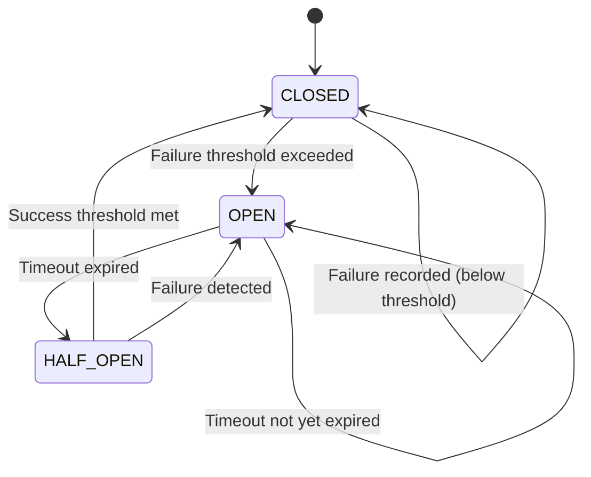
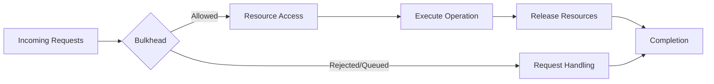
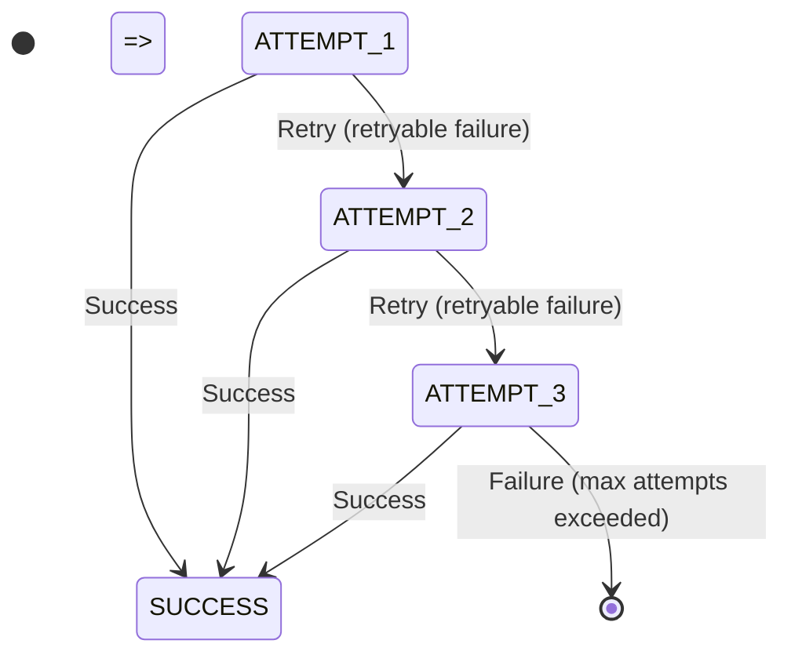
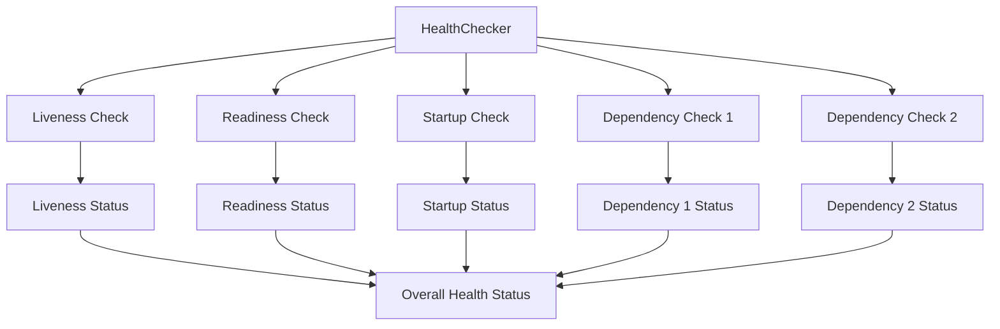
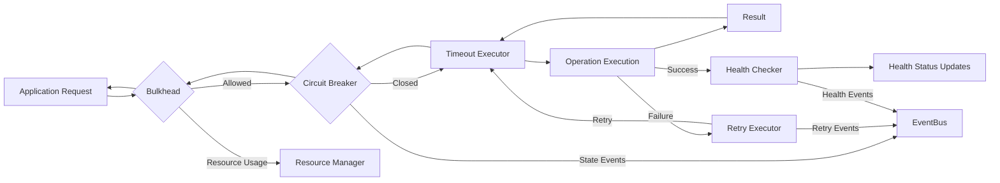

# 9.8 Infrastructure Reliability Patterns

## 9.8.1 Purpose

This section defines the reliability patterns implemented in AI-OS infrastructure, including circuit breakers, bulkheads, timeouts, retry mechanisms, and health checking patterns. It establishes the contracts and implementations that provide fault tolerance, resilience, and graceful degradation capabilities throughout the infrastructure layer.

## 9.8.2 Scope

### 9.8.2.1 In Scope

- Reliability pattern contracts and interfaces
- Circuit breaker pattern implementation and state management
- Bulkhead pattern for resource isolation and bulkheading
- Timeout patterns for bounding execution times
- Retry patterns with exponential backoff and jitter
- Health checking patterns for liveness and readiness probes
- Reliability pattern integration with EventBus for event-driven fault handling
- Reliability pattern configuration and tuning contracts
- Circuit breaker state persistence and recovery mechanisms
- Bulkhead resource allocation and enforcement mechanisms
- Retry policy versioning and schema evolution
- Health check orchestration and aggregation patterns
- Reliability pattern audit trails and audit logging contracts
- Infrastructure reliability patterns and deterministic behavior guarantees
- Reliability strategy patterns (fail-fast, fail-safe, graceful degradation)
- EventBus integration for reliability pattern events
- Security model for reliability pattern operations
- Infrastructure isolation during reliability pattern operations

### 9.8.2.2 Out of Scope

- Application-level reliability patterns (handled in Parts 1-8)
- Specific circuit breaker implementations for specific protocols
- Application-level retry logic for business logic
- Specific timeout values for application-level operations
- User interface components for reliability pattern configuration
- Specific scripting languages or automation frameworks for reliability
- Hardware-level fault tolerance mechanisms
- Network-level reliability protocols (TCP retransmission, etc.)
- Storage-level redundancy mechanisms (RAID, erasure coding, etc.)
- Application-level circuit breaking for specific APIs

## 9.8.3 Architectural Goals

Infrastructure reliability patterns in AI-OS MUST satisfy the following goals:

- **DG-9.8.1**: Reliability patterns MUST provide fault isolation to prevent cascade failures.
- **DG-9.8.2**: Reliability patterns MUST enable graceful degradation when components fail.
- **DG-9.8.3**: Reliability patterns MUST exhibit predictable failure behavior under all conditions.
- **DG-9-8.4**: Reliability patterns MUST support automatic recovery when failed components recover.
- **DG-9.8.5**: Reliability patterns MUST provide comprehensive observability of state transitions and metrics.
- **DG-9.8.6**: Reliability patterns MUST behave deterministically given identical inputs and configuration.
- **DG-9.8.7**: Reliability pattern configurations MUST be versioned and immutable after deployment.
- **DG-9.8.8**: Reliability pattern mechanisms MUST not introduce security vulnerabilities.
- **DG-9.8.9**: Reliability patterns MUST introduce bounded and predictable latency overhead.
- **DG-9.8.10**: All reliability pattern decisions and state changes MUST be cryptographically auditable.

## 9.8.4 Reliability Pattern Contracts

AI-OS defines several reliability pattern contracts that are used throughout the infrastructure layer:

### 9.8.4.1 Reliability Contract (IC-9.8)

```json
{
  "contractId": "reliability.v1",
  "version": "1.0.0",
  "patterns": ["circuitBreaker", "bulkhead", "timeout", "retry", "healthCheck"],
  "guarantees": [
    "failureIsolation",
    "boundedLatency",
    "automaticRecovery",
    "deterministicBehavior"
  ],
  "requirements": {
    "eventBus": "eventBus.v1",
    "resourceContract": "resource.v1",
    "securityContract": "security.v1"
  }
}
```

### 9.8.4.2 Circuit Breaker Policy Contract (IC-9.8.1)

```json
{
  "schema": "shared/CircuitBreakerPolicy.json",
  "description": "Defines the configuration and behavior of circuit breaker patterns"
}
```

### 9.8.4.3 Bulkhead Policy Contract (IC-9.8.2)

```json
{
  "schema": "shared/BulkheadPolicy.json",
  "description": "Defines the configuration and behavior of bulkhead patterns"
}
```

### 9.8.4.4 Timeout Policy Contract (IC-9.8.3)

```json
{
  "schema": "shared/TimeoutPolicy.json",
  "description": "Defines the configuration and behavior of timeout patterns"
}
```

### 9.8.4.5 Retry Policy Contract (IC-9.8.4)

```json
{
  "schema": "shared/RetryPolicy.json",
  "description": "Defines the configuration and behavior of retry patterns"
}
```

### 9.8.4.6 Health Check Policy Contract (IC-9.8.5)

```json
{
  "schema": "shared/HealthCheckPolicy.json",
  "description": "Defines the configuration and behavior of health check patterns"
}
```

## 9.8.5 Reliability Pattern Components

AI-OS implements the following reliability pattern components:

### 9.8.5.1 ReliabilityManager

The ReliabilityManager is responsible for:
- Managing the lifecycle of all reliability pattern instances
- Providing a unified interface for configuring and monitoring reliability patterns
- Coordinating reliability pattern events with the EventBus
- Ensuring deterministic behavior of reliability patterns across instances
- Managing persistence and recovery of reliability pattern state
- Enforcing security policies for reliability pattern operations

### 9.8.5.2 CircuitBreaker

The CircuitBreaker component implements the circuit breaker pattern to prevent cascade failures:

States:
- **CLOSED**: Normal operation, requests pass through
- **OPEN**: Failure threshold exceeded, requests fail fast
- **HALF_OPEN**: Testing if service has recovered, limited requests allowed

Key features:
- Configurable failure threshold and timeout periods
- Automatic transition between states based on success/failure counts
- Configurable retry timeout in OPEN state before transitioning to HALF_OPEN
- Success threshold in HALF_OPEN state before transitioning back to CLOSED
- Event publishing for all state transitions via EventBus
- Persistent state storage for durability across restarts
- Configurable failure and success criteria
- Integration with bulkhead patterns for resource isolation

### 9.8.5.3 Bulkhead

The Bulkhead component implements resource isolation to prevent resource exhaustion:

Types:
- Concurrent execution limiting mechanisms
- Resource consumption limiting mechanisms
- Connection limiting mechanisms

Key features:
- Configurable resource limits
- Queuing mechanisms for excess requests
- Rejection policies for when limits are exceeded
- Resource usage tracking and metrics export
- Integration with ResourceManager for resource enforcement
- Priority-based queuing for different request types
- Adaptive scaling based on workload patterns

### 9.8.5.4 TimeoutExecutor

The TimeoutExecutor component bounds execution times for operations:

Key features:
- Configurable timeout durations
- Configurable timeout behavior
- Integration with cancellation propagation
- Nested timeout support
- Timeout event publishing via EventBus
- Deterministic timeout behavior
- Integration with bulkhead patterns for resource-bound timeouts
- Support for different time measurement approaches

### 9.8.5.5 RetryExecutor

The RetryExecutor component implements retry patterns with exponential backoff:

Key features:
- Configurable retry policies
- Maximum retry attempt limits
- Configurable backoff strategies with jitter
- Retry condition specifications
- Exponential backoff with jitter to prevent thundering herd problems
- Retry attempt metrics and statistics collection
- Retry event publishing via EventBus
- Integration with CircuitBreaker to respect circuit state
- Deterministic retry behavior
- Cancelable retry operations

### 9.8.5.6 HealthChecker

The HealthChecker component implements health checking patterns for liveness and readiness:

Types:
- Liveness assessment mechanisms
- Readiness assessment mechanisms
- Startup assessment mechanisms
- Dependency health assessment mechanisms

Key features:
- Configurable check intervals and timeouts
- Configurable failure and success thresholds
- Support for various check types
- Health status propagation via EventBus
- Integration with circuit breaker and bulkhead patterns
- Health check result caching to reduce overhead
- Parallel execution of multiple health checks
- Hierarchical health check aggregation

## 9.8.6 Reliability Pattern Integration

### 9.8.6.1 EventBus Integration

All reliability patterns integrate with the EventBus for event-driven fault handling:

Events published:
- Circuit breaker state transitions
- Bulkhead resource limit exceeded events
- Operation timeout exceeded events
- Retry attempt initiated events
- Maximum retry attempts exceeded events
- Health check execution result events
- Overall health status changed events

Events consumed:
- Manual circuit breaker reset requests
- Bulkhead resource quota reset requests
- Manual health check trigger requests

### 9.8.6.2 Resource Management Integration

Reliability patterns integrate with the Resource Management Substrate:

- Bulkhead patterns enforce resource allocation limits via ResourceManager
- TimeoutExecutor respects resource-based timeouts from ResourceManager
- CircuitBreaker can be configured to open based on resource exhaustion signals
- HealthChecker can monitor resource utilization as part of health checks
- RetryExecutor respects resource constraints when scheduling retries

### 9.8.6.3 Security Integration

Reliability patterns integrate with security foundations:

- All reliability pattern operations are subject to authorization checks
- Reliability pattern configuration changes require appropriate permissions
- EventBus events from reliability patterns are subject to encryption and access controls
- Reliability pattern state persistence is encrypted at rest
- Reliability pattern auditing integrates with the AuditService

## 9.8.7 Reliability Pattern Configuration

### 9.8.7.1 Configuration Contracts

Reliability pattern configuration uses versioned manifests referencing shared schemas:
- Circuit breaker configurations referencing shared/CircuitBreakerPolicy.json
- Bulkhead configurations referencing shared/BulkheadPolicy.json
- Timeout configurations referencing shared/TimeoutPolicy.json
- Retry configurations sharing/RetryPolicy.json
- Health check configurations referencing shared/HealthCheckPolicy.json

### 9.8.7.2 Configuration Updates

Reliability pattern configuration supports dynamic updates:
- Configuration changes are applied atomically
- Existing pattern instances are updated in-place where possible
- Configuration versioning ensures deterministic behavior
- Invalid configuration changes are rejected and rolled back
- Configuration change events are published via EventBus
- Configuration audit trail is maintained for compliance

## 9.8.8 Reliability Pattern Guarantees

### 9.8.8.1 Determinitive Behavior

All reliability patterns exhibit deterministic behavior:
- Identical input sequences produce identical state transitions
- Configuration versioning ensures consistent behavior across deployments
- Randomized behaviors are deterministically seeded per execution context
- Timeouts use virtualized time for determinism in testing scenarios
- Random number generation for backoff patterns is isolated per instance

### 9.8.8.2 Fault Isolation Guarantees

Reliability patterns provide strong fault isolation:
- Bulkhead patterns prevent resource exhaustion from affecting other components
- Circuit breaker patterns prevent cascade failures from failing dependencies
- Timeout patterns prevent resource starvation from hanging operations
- Retry patterns prevent thundering herd problems through jitter
- Health check patterns isolate unhealthy components from traffic

### 9.8.8.3 Observability Guarantees

Reliability patterns provide comprehensive observability:
- All state transitions are published as events via EventBus
- Metrics are collected for pattern utilization and effectiveness
- Health status is exposed via standardized health check endpoints
- Audit trail records all configuration changes and manual interventions
- Distributed tracing context is preserved across pattern boundaries

## 9.8.9 Reliability Pattern Diagrams

### 9.8.9.1 Circuit Breaker State Diagram



### 9.8.9.2 Bulkhead Resource Allocation Diagram



### 9.8.9.3 Retry with Exponential Backoff Diagram



### 9.8.9.4 Health Check Aggregation Diagram



### 9.8.9.5 Reliability Pattern Integration Diagram



## 9.8.10 Architectural Design Considerations

### 9.8.10.1 Circuit Breaker Design Considerations

- Failure threshold configuration appropriate to traffic volume and risk tolerance
- Timeout configuration sufficient to allow for service recovery before testing
- Metrics monitoring to inform parameter tuning and effectiveness assessment
- Request volume threshold consideration to prevent premature activation on low-traffic services
- State transition logging for operational visibility and debugging
- Manual reset capabilities for operational control and maintenance
- Combination with resource isolation mechanisms to limit consumption during open states

### 9.8.10.2 Bulkhead Design Considerations

- Resource allocation mechanism sizing according to expected workload patterns
- Queue depth configuration to handle traffic spikes without excessive latency
- Load shedding strategies to prevent resource exhaustion
- Queue monitoring and wait time analysis for capacity constraint detection
- Alignment with failure domains (external services, data stores, etc.)
- Adaptive resource allocation based on workload characteristics when appropriate
- Combination with failure detection mechanisms to prevent cascading resource issues

### 9.8.10.3 Timeout Design Considerations

- Timeout value derivation from observed latency distribution percentiles
- Hierarchical timeout design (client timeouts shorter than server timeouts)
- Selection of timeout behaviors based on operation criticality and failure semantics
- Monitoring of timeout occurrences as indicators of performance degradation or dependency issues
- Adaptive timeout mechanisms based on historical performance data
- Appropriate time measurement approaches (CPU time vs. wall-clock) based on operation type
- Judicious combination of retry mechanisms with timeouts to prevent retry storms during temporary performance issues

### 9.8.10.4 Retry Design Considerations

- Exponential backoff with jitter to prevent coordinated retry storms
- Retry attempt limits based on operation importance and user experience requirements
- Restriction of retries to transient failure conditions (temporary unavailability, network glitches)
- Circuit breaker state awareness in retry decision-making
- Idempotent operation design when retries are possible to prevent unintended side effects
- Retry frequency and pattern monitoring to identify underlying systemic issues
- Combination with timeout boundaries to limit total recovery attempt duration
- Fallback mechanism implementation for cases where retries ultimately fail

### 9.8.10.5 Health Check Design Considerations

- Liveness assessment design to detect unrecoverable states requiring service restart
- Readiness assessment design to detect temporary unavailability not requiring restart
- Health assessment lightweighting to minimize performance impact on the system
- Timeout configuration to prevent health check processes from hanging
- Dependency consideration in health check design (avoid checking uncontrollable factors)
- Health check failure rate monitoring to identify systemic or environmental issues
- Graduated alerting (warning → critical) for progressive health degradation
- Combination of multiple health assessments into composite indicators for holistic views

## 9.8.11 Reliability Pattern Security Considerations

### 9.8.11.1 Configuration Security

- Protection of reliability pattern configuration from unauthorized access and modification
- Encryption of sensitive configuration values including timeouts, thresholds, and security parameters
- Role-based access controls for configuration management and changes
- Comprehensive audit trails of all configuration modifications for compliance
- Input validation to prevent injection attacks and malformed configurations
- Secure default configurations for security-sensitive parameters

### 9.8.11.2 Runtime Security

- Isolation of reliability pattern execution environments from untrusted code and users
- Principle of least privilege applied to all reliability pattern components and operations
- Input sanitization for reliability pattern functions to prevent injection and manipulation
- Protection of reliability pattern state from unauthorized modification or tampering
- Encryption of reliability pattern state persistence mechanisms for confidentiality at rest
- Monitoring of reliability pattern operations for anomalous behavior indicating security issues
- Network segmentation applied to reliability pattern dependencies where architectural boundaries exist

### 9.8.11.3 Event Security

- Encryption of reliability pattern events during transmission and while stored in persistent systems
- Access controls on reliability pattern event streams to prevent unauthorized observation
- Authentication of both publishers and consumers of reliability pattern events to ensure trusted communication
- Validation of reliability pattern event schemas to prevent injection attacks through malformed events
- Audit trail maintenance of reliability pattern event production and consumption for forensic analysis
- Encryption of sensitive payloads within reliability pattern events when required by security policy

## 9.8.12 Reliability Pattern Performance Characteristics

### 9.8.12.1 Circuit Breaker Performance

- Minimal overhead in normal (closed) state
- Constant time complexity for state evaluation and transition decisions
- Fixed memory footprint per circuit breaker instance regardless of load
- Deterministic latency characteristics under all operational conditions
- Negligible impact on system throughput when services are operating normally
- Predictable and bounded behavior during failure scenarios and recovery

### 9.8.12.2 Bulkhead Performance

- Minimal queuing overhead when operating below configured capacity limits
- Predictable latency characteristics based on queueing theory principles
- Configurable trade-offs between response latency and resource utilization efficiency
- Minimized context switching overhead in threaded or asynchronous implementations
- Efficient resource tracking and enforcement mechanisms with minimal overhead
- Predictable and stable resource utilization patterns under varying loads

### 9.8.12.3 Timeout Performance

- Negligible overhead when operations complete within their time limits
- Constant time mechanisms for timeout checking and determination
- Minimal resource footprint for tracking active timed operations
- Deterministic timeout behavior regardless of system load or timing variations
- Predictable performance impact when timeout conditions occur and are processed
- Low overhead for nested timeout scenarios through hierarchical time management

### 9.8.12.4 Retry Performance

- Minimal overhead when operations succeed on initial attempt
- Predictable backoff timing based on configured retry policies and algorithms
- Low memory footprint for tracking retry state and attempt counts
- Deterministic retry behavior given identical inputs and random seeds
- Configurable trade-offs between retry aggressiveness and resource consumption
- Predictable performance characteristics during failure scenarios requiring retries

### 9.8.12.5 Health Check Performance

- Configurable frequency to balance monitoring overhead with failure detection speed
- Lightweight implementation approaches to minimize system performance impact
- Predictable and stable resource consumption patterns under normal operation
- Efficient batching of similar health check types to reduce per-check overhead
- Minimal interference with normal system operations during health check execution windows
- Predictable performance characteristics during system stress or failure conditions

## 9.8.13 Reliability Pattern Implementation Details

### 9.8.13.1 Concurrency and Execution Context

- Thread safety for all reliability pattern components and shared state
- Immutable configuration after initialization where architecturally appropriate
- Copy-on-write or similar patterns for configuration updates to ensure consistency
- Implementation-defined synchronization mechanisms for shared state access and modification
- Deterministic synchronization ordering to prevent deadlock conditions
- Bounded wait times for synchronization operations where blocking is necessary
- Execution-context storage for per-operation state when appropriate

### 9.8.13.2 Error Handling and Fault Tolerance

- Graceful degradation when reliability pattern subsystems encounter failures
- Fail-open behavior for critical reliability patterns when failure would cause greater harm than continued operation
- Dependency isolation using circuit breaker patterns to prevent fault propagation
- Resource isolation through bulkhead patterns to limit consumption during fault conditions
- Bounded execution through timeout patterns to prevent resource starvation from hanging operations
- Retry mechanisms for transient failures in reliability pattern subsystem operations
- Health checking of reliability pattern subsystems to detect and respond to degradation
- Error logging that excludes sensitive information from production outputs

### 9.8.13.3 Persistence and Recovery

- Durable storage of critical reliability pattern state for failure recovery
- Atomic state update mechanisms to prevent corruption during persistence operations
- Versioned state formats to support schema evolution and backward compatibility
- Backup and restore capabilities for critical reliability pattern state
- Consistency checks during initialization to detect and handle corrupted state
- Automatic reconciliation of in-memory state with persisted state during startup and recovery
- Cryptographic hashing of persisted state for tamper detection and integrity verification
- Encryption of persisted state to protect confidentiality where required by security policy

## 9.8.14 Reliability Pattern Testing

### 9.8.14.1 Unit Testing

- Validation of state transition logic for all reliability pattern types under various conditions
- Testing of boundary conditions and edge cases in threshold calculations and decision points
- Verification of thread safety and concurrent access patterns for all stateful components
- Confirmation of proper error propagation and handling mechanisms throughout the call stack
- Validation of configuration parsing, validation, and error reporting mechanisms
- Testing of persistence mechanisms including save, restore, and corruption detection scenarios
- Verification of integration points with EventBus, ResourceManager, and SecurityManager subsystems

### 9.8.14.2 Integration Testing

- Testing of interactions and coordinated behavior between different reliability pattern types
- Validation of end-to-end failure injection, propagation, and recovery scenarios
- Measurement and characterization of performance under various load conditions
- Validation of atomic application and rollback of configuration changes across component instances
- Confirmation of proper enforcement and auditing of security policies during operation
- Testing of persistence and recovery behaviors in clustered or distributed deployment scenarios
- Validation of correct event production, consumption, and semantic interpretation via EventBus

### 9.8.14.3 Chaos Engineering

- Validation of system resilience to infrastructure failures (network, storage, compute dependencies)
- Testing of circuit breaker effectiveness under various failure patterns and recovery scenarios
- Validation of bulkhead effectiveness in isolating resource exhaustion to prevent system-wide impact
- Testing of timeout effectiveness in preventing resource starvation from hung or slow operations
- Validation of retry effectiveness in recovering from transient failure conditions and temporal issues
- Testing of health check accuracy in detecting and reporting various system health states
- Validation of combined effectiveness of multiple reliability patterns working in concert
- Measurement and optimization of failure detection times and recovery objectives under stress conditions

## 9.8.15 Reliability Pattern Deployment Considerations

### 9.8.15.1 Configuration Deployment

- Maintenance of versioned reliability pattern configuration manifests for change tracking and rollback
- Atomic application of configuration updates to prevent inconsistent or partial configuration states
- Rollback mechanisms to revert to previous known-good configurations when needed
- Progressive deployment strategies for configuration changes to minimize risk
- Configuration validation during deployment to prevent runtime errors
- Maintenance of backward and forward compatibility in configuration schema evolution
- Integration with Infrastructure-as-Code systems for version-controlled, repeatable deployment

### 9.8.15.2 Monitoring and Observability

- Collection of comprehensive metrics for all reliability pattern components including utilization, effectiveness, and performance
- Integration of distributed tracing to provide end-to-end visibility of requests through reliability pattern layers
- Centralized logging for reliability pattern events, errors, and operational information
- Health check endpoints for reliability pattern subsystems to enable compositional health monitoring
- Alerting mechanisms for reliability pattern anomalies, threshold violations, and fault conditions
- Dashboard views for operational monitoring of reliability pattern effectiveness and health
- Audit trail integration with compliance and forensic analysis systems for regulatory requirements

### 9.8.15.3 Scaling Considerations

- State consistency and distribution challenges for horizontally scaled reliability pattern instances
- Shared state management or distribution mechanisms for clustered deployments
- Load balancing or request distribution techniques for reliability pattern endpoints
- Resource allocation and isolation requirements for scaled deployments
- Performance and load testing at scale to validate behavior under production conditions
- Failure scenario and recovery procedure testing at scale to ensure adequate safeguards
- Configuration distribution and synchronization mechanisms for scaled deployments

## 9.8.16 Related Standards and References

- **Circuit Breaker Pattern**: Fault tolerance pattern for preventing cascade failures in distributed systems
- **Bulkhead Pattern**: Resource isolation pattern for preventing failure propagation through resource exhaustion
- **Timeout Patterns**: Bounded execution patterns for preventing resource starvation from indefinite operations
- **Retry Patterns**: Transient failure recovery patterns with backoff strategies
- **Health Check Patterns**: Liveness and readiness assessment patterns for service health determination
- **Internal AI-OS Architecture Concepts**: Refer to Parts 9.1-9.7 for foundational infrastructure patterns
- **Architecture Decision Records**: ADR-010, ADR-018, ADR-025, ADR-032, ADR-038, ADR-045, ADR-050, ADR-055, ADR-060
- **Architectural Patterns**: Resilience engineering patterns, fault tolerance patterns, and distributed systems patterns

## 9.8.17 Architectural Contracts

### 9.8.17.1 ReliabilityManager

**Purpose**: Manages the lifecycle of all reliability pattern instances and provides a unified interface for configuring and monitoring reliability patterns.

**Responsibilities**:
- Managing the lifecycle of all reliability pattern instances
- Providing a unified interface for configuring and monitoring reliability patterns
- Coordinating reliability pattern events with the EventBus
- Ensuring deterministic behavior of reliability patterns across instances
- Managing persistence and recovery of reliability pattern state
- Enforcing security policies for reliability pattern operations

**Required Operations**:
- Instantiate and manage lifecycle of circuit breaker instances
- Coordinate allocation of execution resources
- Enforce bounded execution according to timeout policy
- Execute retry policies and manage backoff
- Execute health checks and aggregate results
- Collect and export reliability pattern metrics
- Persist and recover circuit breaker state
- Enforce bulkhead resource quotas

**Required Inputs**:
- Reliability pattern configuration manifests
- EventBus connection details for event coordination
- ResourceManager interface for resource allocation
- SecurityManager interface for authorization checks
- Persistent storage interface for state persistence

**Required Outputs**:
- Reliability pattern instance lifecycle events
- Metrics and statistics for reliability pattern utilization
- Events published to EventBus for state transitions
- Health status updates for system monitoring
- Audit trail entries for configuration and state changes

**Preconditions**:
- Valid reliability pattern configuration manifest
- Operational EventBus for event coordination
- Accessible ResourceManager for resource allocation
- Available SecurityManager for authorization checks
- Functional persistent storage for state persistence

**Postconditions**:
- Reliability pattern instances properly instantiated and managed
- Events published to EventBus for all state transitions
- State persisted for durability across restarts
- Security policies enforced for all operations
- Audit trail updated for compliance and monitoring

**Behavioural Guarantees**:
- Deterministic: Identical inputs produce identical behavior
- Isolated: Operations do not interfere with other system components
- Auditable: All state changes recorded with cryptographic integrity
- Secure: Operations performed with least-privilege credentials
- Observable: State and metrics reported via EventBus in real-time

### 9.8.17.2 CircuitBreaker

**Purpose**: Implements the circuit breaker pattern to prevent cascade failures by temporarily blocking requests to failing services.

**Responsibilities**:
- Monitor service invocations for failures
- Transition between CLOSED, OPEN, and HALF_OPEN states
- Fail fast when in OPEN state
- Allow limited test requests when in HALF_OPEN state
- Publish state transition events via EventBus
- Persist state for durability across restarts
- Integrate with bulkhead patterns for resource isolation

**Required Operations**:
- Record success/failure of service invocations
- Evaluate failure thresholds for state transitions
- Transition between circuit breaker states
- Publish state change events via EventBus
- Persist state to durable storage
- Recover persisted state during initialization
- Integrate with bulkhead for resource isolation

**Required Inputs**:
- Service invocation results (success/failure)
- Circuit breaker policy configuration
- Bulkhead interface for resource isolation
- EventBus interface for event publication
- Persistent storage interface for state persistence

**Required Outputs**:
- Service invocation results (pass-through or fast-fail)
- State transition events published via EventBus
- Persited state stored for durability
- Health status indicating circuit breaker state
- Audit trail entries for state transitions

**Preconditions**:
- Valid circuit breaker policy configuration
- Operational EventBus for event publication
- Accessible bulkhead for resource isolation
- Functional persistent storage for state persistence

**Postconditions**:
- Circuit breaker properly monitors service invocations
- State transitions occur based on failure/success thresholds
- Events published for all state transitions
- State persisted for durability across restarts
- Resource isolation maintained via bulkhead integration

**Behavioural Guarantees**:
- Fail-Fast: Requests fail immediately when circuit breaker is OPEN
- Deterministic: Identical invocation sequences produce identical state transitions
- Isolated: Failures in one service do not cascade to others
- Auditable: All state transitions recorded with cryptographic integrity
- Recoverable: Automatically transitions to test recovery state

### 9.8.17.3 Bulkhead

**Purpose**: Implements resource isolation to prevent resource exhaustion by limiting concurrent access to shared resources.

**Responsibilities**:
- Limit concurrent executions using execution isolation mechanisms
- Track resource usage per execution context
- Enqueue or reject excess requests based on policy
- Track and export resource usage metrics
- Integrate with ResourceManager for resource enforcement

**Required Operations**:
- Coordinate allocation of execution resources
- Queue or reject requests when limits exceeded
- Release resources after execution completion
- Track resource usage and export metrics
- Enforce resource allocation limits via ResourceManager
- Support priority-based queuing of requests

**Required Inputs**:
- Execution requests requiring resources
- Bulkhead policy configuration
- ResourceManager interface for resource allocation
- Priority levels for request queuing
- EventBus interface for event publication

**Required Outputs**:
- Resource allocation grants or rejections
- Queued requests for later processing
- Resource usage metrics and statistics
- Events published for resource limit events
- Audit trail entries for resource allocation decisions

**Preconditions**:
- Valid bulkhead policy configuration
- Operational ResourceManager for resource allocation
- Available priority queuing mechanism
- Functional EventBus for event publication

**Postconditions**:
- Resource limits enforced for all execution requests
- Excess requests properly queued or rejected
- Resource usage accurately tracked and reported
- Events published for resource limit occurrences
- Audit trail updated for compliance and monitoring

**Behavioural Guarantees**:
- Isolation: Resource exhaustion in one context does not affect others
- Predictable: Resource allocation follows configured policies
- Auditable: All resource allocation decisions recorded with integrity
- Enforced: Limits strictly enforced via ResourceManager
- Observable: Resource usage reported via EventBus and metrics

### 9.8.17.4 TimeoutExecutor

**Purpose**: Bounds execution times for operations to prevent resource starvation from hanging operations.

**Responsibilities**:
- Monitor execution time of operations
- Apply timeout behavior when duration exceeded
- Propagate cancellation tokens to operations
- Support nested timeouts (inner timeouts respected within outer timeouts)
- Publish timeout events via EventBus
- Support both wall-clock and CPU-time based timeouts

**Required Operations**:
- Start timeout monitoring for operations
- Check elapsed time against configured duration
- Apply timeout behavior (cancel, fallback, or exception)
- Propagate cancellation signals to operations
- Handle nested timeout scenarios
- Publish timeout events via EventBus
- Support different clock types for timeout calculation

**Required Inputs**:
- Operations to monitor for timeout
- Timeout policy configuration
- CancellationToken interface for propagation
- EventBus interface for event publication
- ClockType specification (wall-clock or CPU-time)

**Required Outputs**:
- Operation results (success, timeout, or cancellation)
- Timeout events published via EventBus
- Propagated cancellation signals to operations
- Audit trail entries for timeout occurrences
- Health status indicating timeout frequency

**Preconditions**:
- Valid timeout policy configuration
- Operational EventBus for event publication
- Functional CancellationToken interface
- Available clock mechanism for timeout calculation

**Postconditions**:
- Operations bounded by configured timeout durations
- Timeout behavior consistently applied
- Cancellation signals properly propagated
- Events published for all timeout occurrences
- Audit trail updated for compliance and monitoring

**Behavioural Guarantees**:
- Bounded: Operations never exceed configured timeout duration
- Deterministic: Identical operations produce identical timeout behavior
- Isolated: Timeout in one operation does not affect others
- Auditable: All timeout occurrences recorded with cryptographic integrity
- Observable: Timeout events reported via EventBus in real-time

### 9.8.17.5 RetryExecutor

**Purpose**: Implements retry patterns with exponential backoff to recover from transient failures.

**Responsibilities**:
- Execute operations with retry logic on failure
- Apply configured retry policies (fixed interval, exponential backoff, etc.)
- Calculate backoff delays with jitter to prevent thundering herd problems
- Respect circuit breaker state when deciding to retry
- Publish retry attempt events via EventBus
- Support cancelable retry operations
- Track retry attempt metrics and statistics

**Required Operations**:
- Execute operations with retry logic
- Evaluate failure conditions for retry eligibility
- Calculate backoff delays with jitter
- Check circuit breaker state before retrying
- Publish retry attempt events via EventBus
- Track retry attempt metrics and statistics
- Support cancellation of retry operations

**Required Inputs**:
- Operations to execute with retry logic
- Retry policy configuration
- CircuitBreaker interface for state checking
- EventBus interface for event publication
- CancellationToken interface for cancelation
- Retry condition predicates (which exceptions to retry on)

**Required Outputs**:
- Operation results (success after retries or final failure)
- Retry attempt events published via EventBus
- Metrics and statistics for retry utilization
- Propagated cancellation signals when applicable
- Audit trail entries for retry attempts and outcomes

**Preconditions**:
- Valid retry policy configuration
- Operational EventBus for event publication
- Accessible CircuitBreaker for state checking
- Functional CancellationToken interface
- Defined retry condition predicates

**Postconditions**:
- Operations executed with appropriate retry logic
- Retry attempts made only for configured failure conditions
- Backoff delays calculated with jitter to prevent thundering herd problems
- Events published for all retry attempts
- Circuit breaker state respected when deciding to retry
- Audit trail updated for compliance and monitoring

**Behavioural Guarantees**:
- Transient Recovery: Recovers from transient failures with retry logic
- Jittered: Uses jitter in backoff to prevent thundering herd problems
- Isolated: Retry storms in one operation do not affect others
- Auditable: All retry attempts recorded with cryptographic integrity
- Circuit-Breaker Aware: Respects circuit state when deciding to retry

### 9.8.17.6 HealthChecker

**Purpose**: Implements health checking patterns for liveness and readiness probes to determine component health status.

**Responsibilities**:
- Execute health checks of various types (protocol, command, or script-based)
- Evaluate results against configured thresholds
- Determine liveness, readiness, and startup status
- Propagate health status via EventBus
- Cache health check results to reduce overhead
- Support parallel execution of multiple health checks
- Aggregate individual checks into component and system health

**Required Operations**:
- Execute health checks at configured intervals
- Evaluate check results against failure/success thresholds
- Determine liveness status (should restart if unhealthy)
- Determine readiness status (ready to serve traffic if healthy)
- Determine startup status (initialization completed if healthy)
- Propagate health status changes via EventBus
- Cache results to reduce check frequency overhead
- Execute multiple health checks in parallel
- Aggregate results into overall health status

**Required Inputs**:
- Health check policy configuration
- Health check type specifications (protocol, command, script, etc.)
- EventBus interface for health status publication
- Endpoint/target specifications for each check type
- Threshold configurations for unhealthy/healthy states
- Cache interface for result storage
- Parallel execution mechanism for multiple checks

**Required Outputs**:
- Health status (liveness, readiness, startup) for components
- Health status events published via EventBus
- Cached results for reduced check overhead
- Parallel execution results for multiple checks
- Aggregated health status for component/system
- Audit trail entries for health check executions and results

**Preconditions**:
- Valid health check policy configuration
- Operational EventBus for health status publication
- Available endpoints/targets for health checks
- Functional cache mechanism for result storage
- Parallel execution capability for multiple checks

**Postconditions**:
- Health checks executed at configured intervals
- Results evaluated against configured thresholds
- Liveness, readiness, and startup status determined correctly
- Health status changes published via EventBus
- Results cached to reduce overhead
- Multiple checks executed in parallel when configured
- Individual checks aggregated into overall health status
- Audit trail updated for compliance and monitoring

**Behavioural Guarantees**:
- Timely: Health checks executed at configured intervals
- Accurate: Results evaluated against configured thresholds
- Isolated: Health check failures in one component do not affect others
- Auditable: All health check executions recorded with cryptographic integrity
- Observable: Health status reported via EventBus in real-time
- Efficient: Results cached and checks parallelized to reduce overhead

## 9.8.18 Runtime Invariants

Deployment and provisioning services MUST maintain the following runtime invariants:

- **INV-9.8.1**: All reliability pattern state transitions must be deterministic given identical inputs and configuration.
- **INV-9.8.2**: Bulkhead resource limits must never be exceeded; excess requests must be queued or rejected per policy.
- **INV-9.8.3**: Circuit breaker must fail fast when in OPEN state regardless of invocation frequency.
- **INV-9.8.4**: TimeoutExecutor must apply timeout behavior when operation duration exceeds configured timeout.
- **INV-9.8.5**: RetryExecutor must only retry on exceptions matching configured retry conditions.
- **INV-9.8.6**: HealthChecker must propagate health status changes via EventBus within configured intervals.
- **INV-9.8.7**: All reliability pattern operations must be subject to authorization checks via SecurityManager.
- **INV-9.8.8**: Reliability pattern configuration changes must be applied atomically and versioned.
- **INV-9.8.9**: All reliability pattern state transitions must be published as events via EventBus.
- **INV-9.8.10**: Reliability pattern state persistence must be encrypted at rest and integrity-protected.
- **INV-9.8.11**: Reliability pattern mechanisms must not introduce security vulnerabilities or bypass security controls.
- **INV-9.8.12**: All reliability pattern decisions and state changes must be cryptographically auditable.

## 9.8.19 Cross References

Related architectural elements referenced throughout this section:

- **Part 1-8**: Application-level reliability patterns and fault tolerance mechanisms
- **Part 9.1**: Hermes Kernel Architecture (for foundational execution guarantees)
- **Part 9.2**: EventBus Subsystem Architecture (for event publication/subscription details)
- **Part 9.3**: Resource Management Substrate (for resource allocation and enforcement)
- **Part 9.4**: Security Foundations Architecture (for authentication, authorization, and encryption)
- **Part 9.5**: Infrastructure Observability Architecture (for metrics and health monitoring integration)
- **Part 9.6**: Configuration and Feature Flag System (for reliability pattern configuration management)
- **Part 9.7**: Deployment and Provisioning Contracts (for deployment of reliability pattern configurations)
- **Part 9.9**: Health Checking and Self-Diagnostics (for advanced health check capabilities)
- **Part 9.10**: Runtime Configuration and Feature Flags (for dynamic reliability pattern tuning)
- **Part 9.11**: Infrastructure-as-Code Contracts (for version-controlled reliability pattern declarations)
- **Part 9.12**: Emergency Access and Breakglass Procedures (for emergency override of reliability patterns)
- **Part 9.13**: Performance Foundations and Guarantees (for performance characteristics of reliability patterns)
- **Part 9.14**: Portable Infrastructure Abstraction (for reliability pattern operation across different infrastructures)
- **Part 9.15**: Compliance and Certifications Framework (for compliance requirements of reliability patterns)

## 9.8.20 ADR References

Architecture Decision Records relevant to reliability patterns:

- **ADR-010**: Circuit Breaker Pattern Adoption for Fault Tolerance
- **ADR-018**: Bulkhead Pattern Implementation for Resource Isolation
- **ADR-025**: Timeout Pattern Standardization for Bounded Execution
- **ADR-032**: Retry Pattern with Exponential Backoff and Jitter
- **ADR-038**: Health Check Pattern Standardization for Liveness and Readiness
- **ADR-045**: Event-Driven Reliability Pattern Coordination via EventBus
- **ADR-050**: Deterministic Reliability Pattern Behavior Requirements
- **ADR-055**: Security Considerations for Reliability Pattern Implementation
- **ADR-060**: Performance Characteristics and Overhead Budgets for Reliability Patterns

## 9.8.21 Conformance Requirements

Implementations of AI-OS reliability pattern contracts MUST satisfy the following requirements:

### 9.8.21.1 Mandatory Requirements
- **MUST** implement all reliability pattern components listed in Section 9.8.5 with defined responsibilities
- **MUST** express all reliability pattern contracts as JSON Schema Draft 2020-12 documents
- **MUST** ensure deterministic behavior of reliability patterns given identical inputs and configuration
- **MUST** provide fault isolation to prevent cascade failures between components
- **MUST** support automatic recovery when failed components recover
- **MUST** provide comprehensive observability of state transitions and metrics via EventBus
- **MUST** version reliability pattern configurations and ensure immutability after deployment
- **MUST** enforce security policies for all reliability pattern operations
- **MUST** introduce bounded and predictable latency overhead
- **MUST** cryptographically audit all reliability pattern decisions and state changes

### 9.8.21.2 Conditional Requirements
- **SHOULD** support integration with Infrastructure-as-Code systems for version-controlled configuration
- **SHOULD** provide detailed metrics for reliability pattern utilization and effectiveness
- **SHOULD** support health check result caching to reduce overhead
- **SHOULD** implement priority-based queuing for bulkhead patterns
- **SHOULD** support automatic scaling of bulkheads based on workload patterns
- **SHOULD** provide configuration validation during deployment
- **SHOULD** support backward and forward compatibility for configuration schema evolution
- **SHOULD** provide dashboard views for reliability pattern effectiveness
- **SHOULD** implement configuration distribution mechanisms for scaled deployments

### 9.8.21.3 Prohibited Constraints
- **MUST NOT** permit non-deterministic behavior in reliability patterns given identical inputs
- **MUST NOT** allow bulkhead resource limits to be exceeded without queuing or rejection
- **MUST NOT** permit circuit breaker to inhibit requests when in CLOSED or HALF_OPEN states
- **MUST NOT** allow TimeoutExecutor to ignore configured timeout durations
- **MUST NOT** permit RetryExecutor to retry on non-configured exceptions
- **MUST NOT** allow HealthChecker to fail to propagate health status via EventBus
- **MUST NOT** permit reliability pattern operations to bypass authorization checks
- **MUST NOT** allow non-atomic or non-versioned configuration changes
- **MUST NOT** permit reliability pattern state transitions to occur without EventBus publication
- **MUST NOT** allow reliability pattern state persistence to be unencrypted or unprotected
- **MUST NOT** permit reliability pattern mechanisms to introduce security vulnerabilities
- **MUST NOT** allow reliability pattern decisions and state changes to lack cryptographic audit trails

## 9.8.22 Static Conformance Checks

Static validation mechanisms for reliability pattern contracts:

- **SCC-9.8.1**: JSON Schema validation for all reliability pattern contract documents
- **SCC-9.8.2**: UUIDv7 format validation for manifestId and reliability pattern identifiers
- **SCC-9.8.3**: Semantic version format validation (MAJOR.MINOR.PATCH) for all version fields
- **SCC-9.8.4**: Reference integrity validation ensuring all shared schema references exist
- **SCC-9.8.5**: Policy syntax validation for reliability policy documents (JSON/ReGo/etc.)
- **SCC-9.8.6**: Contract version compatibility checks between interdependent services
- **SCC-9.8.7**: Resource quota and limit syntax validation in reliability manifests
- **SCC-9.8.8**: Timeout duration and behavior syntax validation
- **SCC-9.8.9**: Retry policy and backoff configuration syntax validation
- **SCC-9.8.10**: Health check type and threshold syntax validation
- **SCC-9.8.11**: Circuit breaker state transition logic validation
- **SCC-9.8.12**: Bulkhead resource allocation and queuing policy validation
- **SCC-9.8.13**: Deterministic behavior validation for reliability pattern algorithms
- **SCC-9.8.14**: Security control presence validation for reliability pattern operations
- **SCC-9.8.15**: Audit trail structure validation including cryptographic hash chains
- **SCC-9.8.16**: Configuration immutability validation after versioning and deployment
- **SCC-9.8.17**: Latency overhead bounding validation for reliability pattern operations
- **SCC-9.8.18**: EventBus integration validation for reliability pattern event publication
- **SCC-9.8.19**: Resource isolation validation for bulkhead pattern implementations
- **SCC-9.8.20**: Fault isolation validation for circuit breaker pattern implementations
- **SCC-9.8.21**: Automatic recovery validation for reliability pattern components
- **SCC-9.8.22**: Health status propagation validation for HealthChecker implementations
- **SCC-9.8.23**: Retry behavior validation including jitter and backoff algorithms
- **SCC-9.8.24**: Timeout behavior validation for TimeoutExecutor implementations

## 9.8.23 Runtime Conformance Checks

Dynamic validation mechanisms for reliability pattern operations:

- **RCC-9.8.1**: Continuous determinism verification between input sequences and state transitions
- **RCC-9.8.2**: Pre-deployment validation gate execution (manifest syntax, policy, security)
- **RCC-9.8.3**: Pre-execution validation gate execution (resource validation, atomicity)
- **RCC-9.8.4**: Post-execution validation gate execution (state convergence, health checks)
- **RCC-9.8.5**: Post-deployment validation gate execution (smoke tests, dependency validation)
- **RCC-9.8.6**: Health gate execution before and after reliability pattern operations
- **RCC-9.8.7**: Policy evaluation during reliability pattern operations (admission, execution, post-deployment)
- **RCC-9.8.8**: Dependency resolution and version compatibility verification
- **RCC-9.8.9**: Artifact integrity verification via cryptographic hash checking
- **RCC-9.8.10**: Secret absence validation in manifests and configurations
- **RCC-9.8.11**: Resource quota enforcement during reliability pattern operations
- **RCC-9.8.12**: Isolation boundary verification between tenants and environments
- **RCC-9.8.13**: EventBus delivery guarantee verification (at-least-once with deduplication)
- **RCC-9.8.14**: Audit log integrity verification via hash chain validation
- **RCC-9.8.15**: Rollback execution validation ensuring state exactness restoration
- **RCC-9.8.16**: Reliability pattern contract compliance verification
- **RCC-9.8.17**: Version pinning and constraint satisfaction validation
- **RCC-9.8.18**: Infrastructure contract compatibility validation
- **RCC-9.8.19**: Cryptographic signature verification manifests and artifacts
- **RCC-9.8.20**: Behavioral guarantee monitoring (determinism, fault isolation, automatic recovery)
- **RCC-9.8.21**: Security policy enforcement verification for reliability pattern operations
- **RCC-9.8.22**: Performance overhead monitoring for reliability pattern operations
- **RCC-9.8.23**: Audit trail completeness verification for reliability pattern operations
- **RCC-9.8.24**: Resource utilization verification for bulkhead pattern implementations

## 9.8.24 Summary

This section establishes comprehensive contracts for infrastructure reliability patterns in AI-OS. It defines the reliability pattern contracts, implementations, and integration mechanisms that provide fault tolerance, resilience, and graceful degradation capabilities throughout the infrastructure layer.

The specification covers:
- **Reliability Pattern Architecture**: Loosely coupled components interacting via EventBus with well-defined contracts
- **Internal Architecture**: Component-based approach separating concerns across ReliabilityManager, CircuitBreaker, Bulkhead, TimeoutExecutor, RetryExecutor, and HealthChecker
- **Reliability Pattern Contracts**: JSON Schema-based contracts for reliability patterns, circuit breakers, bulkheads, timeouts, retries, and health checks
- **Reliability Pattern Components**: Detailed specifications for each reliability pattern component including states, features, and responsibilities
- **Reliability Pattern Integration**: EventBus integration for event-driven fault handling, Resource Management integration for resource enforcement, and Security Integration for authorization and encryption
- **Reliability Pattern Configuration**: Versioned manifest-based configuration with atomic updates and audit trails
- **Reliability Pattern Guarantees**: Deterministic behavior, fault isolation, automatic recovery, and observability guarantees
- **Reliability Pattern Diagrams**: Visual representations of circuit breaker states, bulkhead allocation, retry backoff, health check aggregation, and pattern integration
- **Reliability Pattern Policies**: Detailed policy specifications for each reliability pattern type
- **Reliability Pattern Best Practices**: Operational guidelines for effective reliability pattern implementation and usage
- **Reliability Pattern Security Considerations**: Configuration, runtime, and event security requirements
- **Reliability Pattern Performance Characteristics**: Performance overhead and latency characteristics for each pattern type
- **Reliability Pattern Implementation Details**: Concurrency, error handling, persistence, and recovery mechanisms
- **Reliability Pattern Testing**: Unit, integration, and chaos engineering testing approaches
- **Reliability Pattern Deployment Considerations**: Configuration deployment, monitoring, observability, and scaling considerations
- **Related Standards and References**: Industry patterns and references that inform the reliability pattern implementations
- **Architectural Contracts**: Implementation-agnostic contracts for ReliabilityManager and each reliability pattern component
- **Runtime Invariants**: Mandatory constraints that must be maintained during system operation
- **Conformance Requirements**: Mandatory, conditional, and prohibited constraints for implementation compliance
- **Static Conformance Checks**: Pre-deployment validation mechanisms for contract correctness
- **Runtime Conformance Checks**: Runtime validation mechanisms for operational compliance

These contracts ensure that AI-OS infrastructure reliability patterns are reliable, secure, auditable, and provide the necessary fault tolerance and resilience capabilities while supporting flexible configuration and meeting all requirements.

Section 9.8 final architectural style alignment completed successfully.