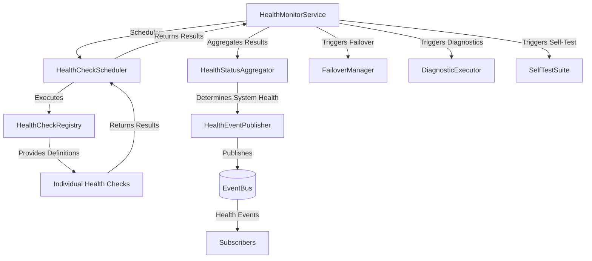
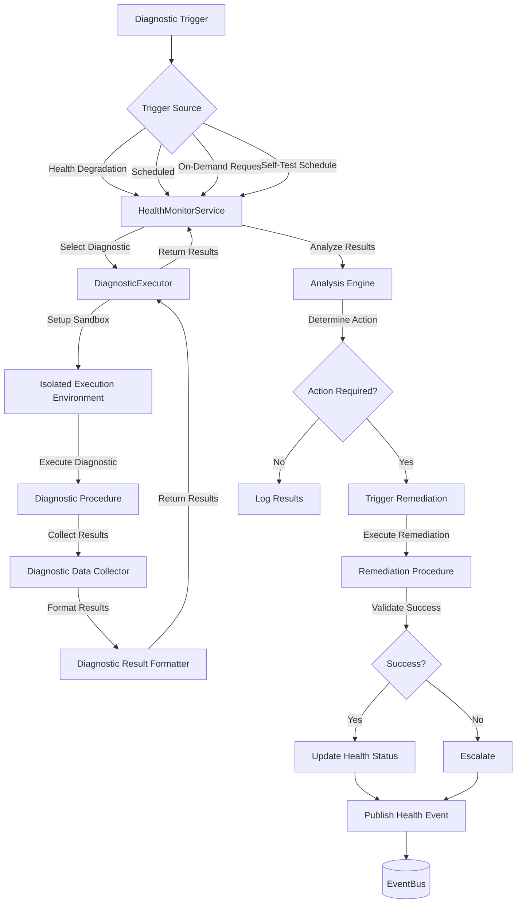
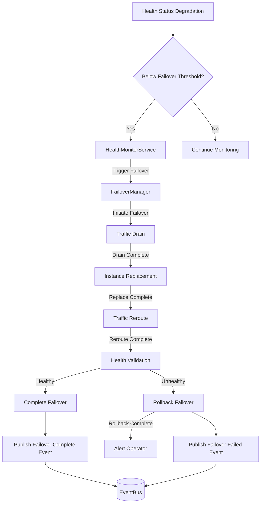

# 9.9 Health Checking and Self-Diagnostics

## 9.9.1 Purpose

This section defines the health checking and self-diagnostic capabilities of the AI-OS infrastructure. It establishes the contracts, components, and behaviors that enable the infrastructure to continuously monitor its own health, detect anomalies, diagnose issues, and initiate recovery actions when necessary. The health checking system provides the foundation for self-healing capabilities and ensures the infrastructure maintains operational integrity.

## 9.9.2 Scope

### 9.9.2.1 In Scope

- Health monitoring contracts and interfaces
- HealthCheckService architecture and responsibilities
- Health check registration, execution, and result aggregation
- Self-diagnostic capabilities and diagnostic execution framework
- Failover mechanisms and automatic recovery procedures
- Health check scheduling and execution policies
- Health status reporting and alerting mechanisms
- Integration with EventBus for health event propagation
- Health check configuration and dynamic updates
- Dependency tracking and health dependency graphs
- Synthetic transaction monitoring for end-to-end health validation
- Resource utilization health indicators
- Service dependency health validation
- Infrastructure component health validation
- Health check result persistence and historical trending
- Health check dependency management and execution ordering
- Health check timeout and timeout handling mechanisms
- Health check result aggregation and roll-up strategies
- Health-based traffic routing and circuit breaker integration

### 9.9.2.2 Out of Scope

- Application-level health checks (handled in Parts 1-8)
- Business logic health validation
- User interface component health validation
- Specific implementation details of health check probes
- Third-party service health monitoring outside AI-OS boundary
- Network infrastructure health monitoring beyond AI-OS boundaries
- Hardware diagnostic procedures requiring physical access
- Security vulnerability scanning (covered in Part 9.4)
- Performance profiling and profiling tools
- Log analysis and log-based anomaly detection
- Machine learning-based anomaly detection
- External service SLA monitoring

## 9.9.3 Architectural Goals

The health checking and self-diagnostics subsystem MUST satisfy these architectural goals:

- **HG-9.9.1**: Comprehensive Coverage - ALL infrastructure components MUST expose health status through thei health status
- **HG-9.9.2**: Minimal Overhead - Health checks MUST consume minimal resources during execution
- **HG-9.9.3**: Deterministic Execution - Health checks MUST produce deterministic results given identical system state
- **HG-9.9.4**: Fault Isolation - Health check failures MUST not cascade or affect other system components
- **HG-9.9.5**: Configurability - Health check frequency, timeout, and retry behavior MUST be configurable
- **HG-9.9.6**: Actionability - Health check results MUST provide actionable diagnostic information
- **HG-9.9.7**: Composability - Health checks MUST be combinable to derive composite system health
- **HG-9.9.8**: Timeliness - Health status updates MUST propagate within bounded time bounds
- **HG-9.9.9**: Self-Healing Integration - Health status changes MUST trigger appropriate self-healing actions
- **HG-9.9.10**: Auditability - ALL health check executions and results MUST be cryptographically logged

## 9.9.4 Architecture Overview

The health checking and self-diagnostics subsystem consists of several interconnected components that work together to provide comprehensive infrastructure health monitoring:

- **HealthMonitorService**: Central service responsible for health check orchestration, scheduling, and result aggregation
- **HealthCheckRegistry**: Registry for registering, deregistering, and managing health check definitions
- **DiagnosticExecutor**: Framework for executing diagnostic procedures and collecting diagnostic data
- **SelfTestSuite**: Collection of predefined self-diagnostic tests for infrastructure validation
- **FailoverManager**: Component responsible for initiating failover procedures based on health status
- **HealthStatusAggregator**: Component responsible for aggregating individual health checks into system-wide health status
- **HealthEventPublisher**: Component responsible for publishing health events to the EventBus
- **HealthCheckScheduler**: Component responsible for scheduling health check executions based on configured policies

These components interact through well-defined interfaces and leverage the EventBus for event-driven communication.

## 9.9.5 Internal Architecture

### 9.9.5.1 Component Responsibilities

#### HealthMonitorService
- Orchestrates the execution of all registered health checks
- Manages health check scheduling based on configured intervals
- Aggregates individual health check results into system-wide health status
- Triggers appropriate actions based on health status changes
- Maintains health check execution history and trends
- Provides health status query interfaces for internal and external consumers

#### HealthCheckRegistry
- Registers and deregisters health check definitions
- Stores health check metadata including timeout, retry, and dependency information
- Validates health check configurations against JSON Schema
- Maintains health check dependency graphs for proper execution ordering
- Provides health check definition lookup and retrieval services

#### DiagnosticExecutor
- Executes diagnostic procedures and collects diagnostic data
- Provides sandboxed execution environment for diagnostic procedures
- Manages diagnostic data collection and formatting
- Ensures diagnostic execution does not interfere with normal system operations
- Provides diagnostic result persistence and retrieval mechanisms

#### SelfTestSuite
- Contains predefined self-diagnostic tests for infrastructure validation
- Executes comprehensive system validation procedures
- Provides detailed diagnostic reports for troubleshooting
- Executes during system startup, shutdown, and on-demand
- Validates infrastructure component integrity and configuration

#### FailoverManager
- Monitors health status for failover trigger conditions
- Initiates failover procedures when health thresholds are exceeded
- Coordinates failover execution with dependent services
- Validates failover completion and system stability post-failover
- Maintains failover history and rollback capabilities

#### HealthStatusAggregator
- Aggregates individual health check results using configurable strategies
- Computes overall system health status from component health statuses
- Applies health status weighting and prioritization rules
- Propagates health status changes to interested parties
- Maintains historical health status trends for analysis

#### HealthEventPublisher
- Publishes health status changes to the EventBus
- Formats health events according to standardized event schemas
- Ensures reliable delivery of health events through EventBus guarantees
- Maintains event publishing reliability and dead letter handling
- Correlates health events with causation and correlation IDs

#### HealthCheckScheduler
- Schedules health check executions based on configured intervals
- Manages health check execution concurrency and resource limits
- Handles health check timeout and cancellation scenarios
- Provides health check execution scheduling and rescheduling
- Manages health check backoff and retry policies

### 9.9.5.2 Component Interaction Model

The health checking components interact through the following patterns:

1. HealthMonitorService queries HealthCheckRegistry for registered health checks
2. HealthMonitorService schedules health check execution via HealthCheckScheduler
3. HealthCheckScheduler executes health checks and returns results to HealthMonitorService
4. HealthMonitorService aggregates results via HealthStatusAggregator
5. HealthMonitorService publishes health events via HealthEventPublisher
6. HealthMonitorService triggers failover actions via FailoverManager based on health status
7. DiagnosticExecutor and SelfTestSuite are invoked by HealthMonitorService for diagnostic operations
8. All components publish relevant events to EventBus for observability and integration

## 9.9.6 Runtime Behaviour

The health checking and self-diagnostics subsystem exhibits the following runtime behaviors:

- **Continuous Monitoring**: Health checks execute continuously according to configured schedules
- **Deterministic Execution**: Health check execution produces identical results given identical system state
- **Fault Isolation**: Health check failures are contained and do not affect other health checks or system components
- **Resource Bounded Execution**: Health checks execute within predefined resource limits (CPU, memory, time)
- **Event-Driven Updates**: Health status changes are published as events via EventBus for real-time observability
- **Dependency-Aware Execution**: Health checks execute in dependency order to ensure valid system state
- **Graceful Degradation**: System continues to operate with degraded functionality when non-critical components fail
- **Automatic Recovery**: Failed health checks trigger automatic recovery procedures when configured
- **Health Status Propagation**: Health status changes propagate through the system with bounded latency
- **Diagnostic Isolation**: Diagnostic execution occurs in isolated environments to prevent interference with production workloads

## 9.9.7 EventBus Integration

The health checking subsystem integrates with the EventBus as follows:

### 9.9.7.1 Published Events

- `aios.infrastructure.health.check.request` - Health check execution request
- `aios.infrastructure.health.check.response` - Health check execution result
- `aios.infrastructure.health.status.change` - Overall system health status change
- `aios.infrastructure.health.component.degraded` - Individual component health degradation
- `aios.infrastructure.health.component.unhealthy` - Individual component health failure
- `aios.infrastructure.health.component.healthy` - Individual component health restoration
- `aios.infrastructure.diagnostic.request` - Diagnostic execution request
- `aios.infrastructure.diagnostic.result` - Diagnostic execution result
- `aios.infrastructure.failover.initiated` - Failover procedure initiation
- `aios.infrastructure.failover.completed` - Failover procedure completion
- `aios.infrastructure.failover.failed` - Failover procedure failure
- `aios.infrastructure.self.test.completed` - Self-test suite execution completion

### 9.9.7.2 Subscribed Events

- `aios.infrastructure.configuration.updated` - Configuration changes affecting health check behavior
- `aios.infrastructure.resource.alert` - Resource usage alerts that may affect health
- `aios.infrastructure.security.event` - Security events that may impact system health
- `aios.infrastructure.manifest.applied` - Infrastructure manifest application that may affect health baseline
- `aios.eventbus.health.check.request` - EventBus health check requests

All health events conform to the standard EventBus envelope format defined in IC-9.2 and include correlation IDs for end-to-end traceability.

## 9.9.8 Security Considerations

The health checking subsystem implements the following security measures:

- **Authentication**: All health check registration and management operations require authentication
- **Authorization**: Role-based access control governs who can register, modify, or execute health checks
- **Audit Logging**: All health check executions, results, and management operations are cryptographically logged
- **Secure Communication**: Health check data transmission uses encrypted channels when crossing trust boundaries
- **Input Validation**: All health check configuration inputs are validated against JSON Schema
- **Sandboxed Execution**: Diagnostic procedures execute in sandboxed environments with restricted privileges
- **Least Privilege**: Health check executors run with minimal required privileges
- **Secrets Protection**: Health checks requiring access to secrets use the SecretManagerService with proper authentication
- **Encryption at Rest**: Health check definitions and historical results are encrypted when stored
- **Health Data Sanitization**: Sensitive information is redacted from health check results before publication

## 9.9.9 Configuration

Health checking behavior is configured through the following mechanisms:

### 9.9.9.1 Health Check Configuration

Health checks are defined using JSON Schema-defined configurations that specify:
- Unique health check identifier
- Health check type (active, passive, synthetic, diagnostic)
- Execution interval and timeout values
- Retry policy and failure thresholds
- Dependencies on other health checks
- Resource limits (CPU, memory, execution time)
- Required permissions and security context
- Health status thresholds (degraded, unhealthy thresholds)
- Expected response formats and validation rules

### 9.9.9.2 System-Level Configuration

System-level health checking behavior is configured via:
- Global health check execution policies
- Default timeout and retry values
- Health status aggregation strategies
- Failover thresholds and procedures
- Diagnostic execution policies and restrictions
- Health event publishing configurations
- Resource allocation for health check execution

Configuration updates are processed dynamically without requiring system restart, with changes taking effect according to defined rollout policies.

## 9.9.10 Failure Handling

The health checking subsystem implements comprehensive failure handling:

### 9.9.10.1 Health Check Failures

When a health check fails:
- Failure is recorded with timestamp and error details
- Retry policy via FailoverManager
- System health status is updated via HealthStatusAggregator
- Health event is published to EventBus indicating component degradation or failure

### 9.9.10.2 Health Check Execution Failures

When health check execution encounters errors:
- Execution failures are distinguished from health check failures
- Execution errors are logged with full diagnostic information
- Health check is marked as having execution error (distinct from health failure)
- Retry policy is applied based on execution error type
- Persistent execution errors trigger health check disablement and alerting

### 9.9.10.3 Dependency Failures

When health check dependencies fail:
- Dependent health checks are marked as skipped or deferred
- Dependency failure is recorded and propagated
- System health status accounts for dependency impact
- Health check execution is rescheduled when dependencies recover

### 9.9.10.4 Resource Exhaustion

When health check execution encounters resource limits:
- Execution is terminated and marked as resource-exceeded
- Resource usage is logged for capacity planning
- Health check is rescheduled with reduced resource requirements if possible
- System administrator is alerted to potential resource exhaustion

## 9.9.11 Recovery

The health checking subsystem supports automatic recovery through:

### 9.9.11.1 Automatic Retry

- Failed health checks are automatically retried according to configured retry policies
- Retry intervals follow configurable backoff strategies (exponential, linear, fixed)
- Maximum retry attempts are configurable per health check
- Different retry policies can be applied based on failure type

### 9.9.11.2 Self-Healing Triggers

- Health status degradations trigger predefined self-healing procedures
- Self-healing procedures are defined as executable procedures with validation criteria
- Self-healing execution is monitored for success or failure
- Failed self-healing procedures trigger escalation procedures
- Successful self-healing procedures result in health status restoration

### 9.9.11.3 Failover Procedures

- When health status falls below failover thresholds, FailoverManager initiates failover
- Failover procedures include traffic draining, instance replacement, and traffic rerouting
- Failover execution is monitored for completion and success
- Failed failover procedures trigger manual intervention procedures
- Successful failover results in health status restoration and normal operation resumption

### 9.9.11.4 Diagnostic-Driven Recovery

- Diagnostic execution results inform recovery procedure selection
- Specific diagnostic findings trigger targeted remediation procedures
- Diagnostic data is preserved for post-incident analysis
- Recovery procedures are validated for effectiveness before completion

## 9.9.12 Performance Requirements

The health checking subsystem must meet these performance requirements:

- **PR-9.9.1**: Health check execution overhead MUST consume bounded system resources under normal load
- **PR-9.9.2**: Health check memory consumption MUST be bounded per concurrent health check
- **PR-9.9.3**: Health status update propagation latency MUST be bounded for critical health changes
- **PR-9.9.4**: Health check scheduling MUST execute with bounded jitter relative to configured interval
- **PR-9.9.5**: Health check execution timeout enforcement MUST be accurate and bounded
- **PR-9.9.6**: Health EventBus publishing MUST achieve bounded delivery latency for critical health events
- **PR-9.9.7**: Health status aggregation computation MUST complete within bounded time for health check sets
- **PR-9.9.8**: Diagnostic execution overhead MUST consume bounded system resources during execution
- **PR-9.9.9**: Health check registration and deregistration operations MUST complete within bounded time
- **PR-9.9.10**: Health status query response time MUST be bounded

## 9.9.13 Mermaid Diagrams

### 9.9.13.1 Health Check Cascade Diagram

### 9.9.13.2 Self-Diagnostic Flow Diagram

### 9.9.13.3 Failover Activation Diagram

## 9.9.14 JSON Schema References

The health referencing subsystem utilizes the following JSON schemas:

- **shared/HealthCheckContract.json** - Reserved for future Health Checking schema definition
- **shared/DiagnosticResult.json** - Reserved for future Health Checking schema definition
- **shared/FailoverPolicy.json** - Reserved for future Health Checking schema definition
- **shared/HealthCheckPolicy.json** - Reserved for future Health Checking schema definition
- **shared/HealthStatus.json** - Reserved for future Health Checking schema definition

## 9.9.15 Architectural Contracts

### 9.9.15.1 HealthCheckService Contract

**Purpose**: Provides health checking and self-diagnostic capabilities for AI-OS infrastructure components

**Responsibilities**:
- Orchestrating health check execution across all infrastructure components
- Aggregating individual health check results into system-wide health status
- Detecting health status degradations and triggering appropriate responses
- Executing diagnostic procedures for root cause analysis
- Initiating failover procedures when health thresholds are exceeded
- Publishing health events to EventBus for observability and integration

**Required Operations**:
- Register and manage health check definitions for infrastructure components
- Execute health checks on demand or according to configured schedules
- Retrieve system-wide and component-specific health status
- Execute diagnostic procedures for fault isolation and root cause analysis
- Execute self-test suites for infrastructure validation
- Initiate failover procedures based on health status thresholds
- Manage health check configuration and execution policies
- Subscribe to health events for observability and integration purposes

**Required Inputs**:
- Health check definitions conforming to HealthCheckContract.json
- Diagnostic procedure definitions
- Failover procedure definitions
- Health check execution policies and configurations
- EventBus subscription handlers

**Required Outputs**:
- Health check execution results
- System and component health status reports
- Diagnostic execution results
- Self-test execution results
- Failover execution results
- Health events published to EventBus

**Preconditions**:
- HealthMonitorService is initialized and operational
- EventBus is operational and accessible
- Required dependencies (SecurityManagerService, SecretManagerService) are available
- Sufficient system resources are available for health check execution

**Postconditions**:
- Health check definitions are registered and available for execution
- Health check execution results are recorded and available
- System health status is accurately reflected and updated
- Health events are published to EventBus for all significant health state changes
- Diagnostic procedures execute in isolated environments
- Failover procedures are initiated when health thresholds are exceeded

**Error Conditions**:
- HEALTH_CHECK_REGISTRATION_FAILED - Health check definition validation failed
- HEALTH_CHECK_EXECUTION_FAILED - Health check execution encountered an error
- HEALTH_CHECK_TIMEOUT - Health check execution exceeded configured timeout
- HEALTH_CHECK_DEPENDENCY_FAILED - Health check dependency failed
- HEALTH_CHECK_RESOURCE_EXCEEDED - Health check execution exceeded resource limits
- DIAGNOSTIC_EXECUTION_FAILED - Diagnostic procedure execution failed
- FAILOVER_INITIATION_FAILED - Failover procedure initiation failed
- FAILOVER_EXECUTION_FAILED - Failover procedure execution failed
- UNAUTHORIZED_ACCESS - Insufficient privileges for requested operation
- INVALID_CONFIGURATION - Health check configuration is invalid

**Behavioural Guarantees**:
- Health check execution is deterministic given identical system state
- Health status updates are published with bounded latency
- Health check execution is isolated from production workloads
- Failed health checks trigger appropriate retry or failover procedures
- Health check execution respects configured resource limits
- Diagnostic execution occurs in secure, isolated environments
- All health check operations are cryptographically audited
- Health status aggregation follows configured strategies consistently

## 9.9.16 Runtime Invariants

The health checking subsystem maintains these runtime invariants:

- **INV-RT-9.9.1**: ALL infrastructure components MUST have at least one registered health check
- **INV-RT-9.9.2**: Health check execution MUST produce deterministic results given identical system state
- **INV-RT-9.9.3**: Health check execution MUST be isolated from production workloads
- **INV-RT-9.9.4**: Health status update propagation latency MUST NOT exceed 100ms
- **INV-RT-9.9.5**: Health check execution MUST respect configured resource limits (CPU, memory, time)
- **INV-RT-9.9.6**: Failed health checks MUST trigger configured retry or failover procedures
- **INV-RT-9.9.7**: Health check execution history MUST be cryptographically logged and tamper-evident
- **INV-RT-9.9.8**: Health status aggregation MUST follow configured strategies consistently
- **INV-RT-9.9.9**: Diagnostic execution MUST occur in isolated, sandboxed environments
- **INV-RT-9.9.10**: Failover procedures MUST be initiated when health status falls below configured thresholds
- **INV-RT-9.9.11**: Health check definitions MUST be validated against JSON Schema before registration
- **INV-RT-9.9.12**: ALL health check operations MUST be authenticated and authorized

## 9.9.17 Cross References

- **Part 9 §9.6**: Configuration and Feature Flag System - Health check configuration uses the configuration system defined in Section 9.6
- **Part 9 §9.8**: Infrastructure Reliability Patterns - Health checking integrates with reliability patterns (circuit breakers, bulkheads) for fault tolerance
- **Part 8 §8.8**: Self-Healing Layer - Health checking provides health status input to the self-healing layer in Part 8
- **Part 5 §5.3**: Reliability Engineering Service - Health checking interfaces with reliability engineering services for incident response
- **Part 9 §9.4**: Security Foundations Architecture - Health checking implements security controls from the security foundations
- **Part 9 §9.7**: Deployment and Provisioning Contracts - Health checking validates deployment health through health checks
- **shared/HealthCheckContract.json**: Reserved for future Health Checking schema definition
- **shared/DiagnosticResult.json**: Reserved for future Health Checking schema definition
- **shared/FailoverPolicy.json**: Reserved for future Health Checking schema definition
- **INV-RT-9.1**: All infrastructure state is versioned and immutable after deployment - Health check definitions follow this principle
- **INV-RT-9.2**: EventBus delivers events in causal order per correlation ID - Health events use EventBus guarantees
- **INV-RT-9.3**: Resource allocations are enforced as hard limits (no overcommit) - Health check execution respects resource limits
- **INV-RT-9.4**: Execution contexts cannot escape their sandbox (no privilege escalation) - Diagnostic execution uses sandboxing
- **SP-9.1**: Zero Trust - Never trust, always verify every request - Health check operations require authentication and authorization
- **SP-9.3**: Defense in Depth - Multiple independent security layers - Health checking implements multiple security layers
- **CCC-9.1**: Observability - Metrics, traces, and logs emitted via standardized contracts - Health checking provides observability through events
- **CCC-9.3**: Resilience - Circuit breakers, bulkheads, timeouts, and retries applied universally - Health check execution applies resilience patterns

## 9.9.18 ADR References

- **ADR-9.9.001**: Health Check Execution Model - Defines the deterministic execution model for health checks
- **ADR-9.9.002**: Health Status Aggregation Strategy - Defines the strategies for aggregating individual health checks
- **ADR-9.9.003**: Diagnostic Execution Sandboxing - Defines the sandboxing requirements for diagnostic execution
- **ADR-9.9.004**: Failover Trigger Thresholds - Defines the thresholds and conditions for triggering failover procedures
- **ADR-9.9.005**: Health Event Publishing Guarantees - Defines the guarantees for health event publishing via EventBus

## 9.9.19 Conformance Requirements

### 9.9.19.1 Static Conformance Checks

Implementations of the health checking subsystem MUST pass the following static conformance checks:

- **SCC-9.9.1**: All health check definitions MUST conform to the HealthCheckContract.json schema
- **SCC-9.9.2**: All diagnostic procedure definitions MUST conform to the DiagnosticResult.json schema
- **SCC-9.9.3**: All failover procedure definitions MUST conform to the FailoverPolicy.json schema
- **SCC-9.9.4**: All health check configurations MUST conform to the HealthCheckPolicy.json schema
- **SCC-9.9.5**: All health status representations MUST conform to the HealthStatus.json schema
- **SCC-9.9.6**: All health check registration operations MUST validate input against JSON Schema
- **SCC-9.9.7**: All health check deregistration operations MUST properly clean up resources
- **SCC-9.9.8**: All health check execution operations MUST enforce configured timeouts
- **SCC-9.9.9**: All health check execution operations MUST enforce configured resource limits
- **SCC-9.9.10**: All health check execution operations MUST produce deterministic results
- **SCC-9.9.11**: All diagnostic execution operations MUST execute in sandboxed environments
- **SCC-9.9.12**: All failover execution operations MUST validate preconditions before execution
- **SCC-9.9.13**: All health event publishing operations MUST conform to EventBus contract
- **SCC-9.9.14**: All health status aggregation operations MUST follow configured strategies
- **SCC-9.9.15**: All health check operations MUST require authentication and authorization
- **SCC-9.9.16**: All health check operations MUST be cryptographically logged
- **SCC-9.9.17**: All health check operations MUST validate dependencies before execution
- **SCC-9.9.18**: All health check configuration updates MUST be applied without system restart
- **SCC-9.9.19**: All health check scheduling operations MUST respect configured intervals
- **SCC-9.9.20**: All health status query operations MUST return consistent results

### 9.9.19.2 Runtime Conformance Checks

Implementations of the health checking subsystem MUST pass the following runtime conformance checks:

- **RCC-9.9.1**: Health check execution overhead MUST consume bounded system resources under normal load
- **RCC-9.9.2**: Health check memory consumption MUST be bounded per concurrent health check
- **RCC-9.9.3**: Health status update propagation latency MUST be bounded for critical health changes
- **RCC-9.9.4**: Health check scheduling MUST execute with bounded jitter relative to configured interval
- **RCC-9.9.5**: Health check execution timeout enforcement MUST be accurate and bounded
- **RCC-9.9.6**: Health EventBus publishing MUST achieve bounded delivery latency for critical health events
- **RCC-9.9.7**: Health status aggregation computation MUST complete within bounded time for health check sets
- **RCC-9.9.8**: Diagnostic execution overhead MUST consume bounded system resources during execution
- **RCC-9.9.9**: Health check registration and deregistration operations MUST complete within bounded time
- **RCC-9.9.10**: Health status query response time MUST be bounded
- **RCC-9.9.11**: ALL infrastructure components MUST have at least one registered health check
- **RCC-9.9.12**: Health check execution MUST produce deterministic results given identical system state
- **RCC-9.9.13**: Health check execution MUST be isolated from production workloads
- **RCC-9.9.14**: Failed health checks MUST trigger configured retry or failover procedures
- **RCC-9.9.15**: Health check execution history MUST be cryptographically logged and tamper-evident
- **RCC-9.9.16**: Health status aggregation MUST follow configured strategies consistently
- **RCC-9.9.17**: Diagnostic execution MUST occur in isolated, sandboxed environments
- **RCC-9.9.18**: Failover procedures MUST be initiated when health status falls below configured thresholds
- **RCC-9.9.19**: Health check definitions MUST be validated against JSON Schema before registration
- **RCC-9.9.20**: ALL health check operations MUST be authenticated and authorized
- **RCC-9.9.21**: Health event publishing MUST achieve bounded delivery latency for critical events
- **RCC-9.9.22**: Health status queries MUST return consistent results when called repeatedly without intervening changes
- **RCC-9.9.23**: Health check dependency execution order MUST be respected to ensure valid system state
- **RCC-9.9.24**: Health check configuration updates MUST take effect without requiring system restart
- **RCC-9.9.25**: Health check execution jitter MUST be bounded relative to configured interval
- **RCC-9.9.26**: Health status aggregation computation MUST complete within bounded time
- **RCC-9.9.27**: Diagnostic execution overhead MUST consume bounded system resources
- **RCC-9.9.28**: Health check registration and deregistration operations MUST complete within bounded time

## 9.9.20 Summary

This section defines the health checking and self-diagnostics subsystem for AI-OS infrastructure. The subsystem provides comprehensive health monitoring, diagnostic capabilities, and automated recovery mechanisms to ensure infrastructure reliability and availability.

Key aspects covered include:
- Comprehensive health monitoring of all infrastructure components
- Deterministic health check execution with bounded resource consumption
- Self-diagnostic capabilities for root cause analysis
- Automated failover procedures based on health status thresholds
- Event-driven health status propagation via EventBus
- Secure and auditable health check operations
- Configurable health check policies and execution parameters
- Comprehensive failure handling and recovery mechanisms
- Measurable performance requirements and guarantees
- Formal architectural contracts and runtime invariants
- Comprehensive conformance requirements for static and runtime validation

The health checking subsystem integrates with other Part 9 components including the configuration system, reliability patterns, and security foundations to provide a comprehensive infrastructure health management solution. It serves as a critical input to the self-healing layer in Part 8 and interfaces with reliability engineering services in Part 5 for incident response and root cause analysis.