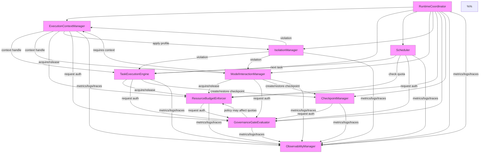

# 10.2 Component Contracts

This section defines the architectural contract of each runtime component.  For every component we state its purpose, owned state, responsibilities, pre‑ and post‑conditions, invariants, concurrency model, failure isolation, interaction boundaries, dependency and extension rules, and any metrics or configuration that are part of the contract.  The description avoids operational boiler‑plate and focuses on what callers may rely on and what the component guarantees.

---

## 10.2.1 RuntimeCoordinator

**Purpose**  
Root of the supervision tree; owns the lifecycle of all runtime subsystems and provides a single start/stop surface to the hosting environment.

**Owned State**  
- `componentRegistry`: maps component type to live handle.  
- `startupPhase`: progresses monotonically through `{NOT_STARTED, INITIALIZING, STARTED, STOPPING, STOPPED}`.  
- `healthAggregate`: aggregated health of all children.

**Responsibilities**  
- Instantiate children in strict dependency order.  
- Propagate shutdown signals and await termination.  
- Detect child failures and forward them to the GovernanceGateEvaluator.  
- Provide a lookup service for any component by type.

**Preconditions**  
- Configuration service has delivered a valid `RuntimeConfig`.  
- Logger and EventBus are operational.

**Postconditions**  
- After `start()` completes, all child components report `READY` via the event bus.  
- After `stop()` completes, `componentRegistry` is empty and all resources are released.

**Invariants**  
- `startupPhase` never moves backwards.  
- Every entry in `componentRegistry` corresponds to a component that has successfully completed its `start()` method.

**Concurrency Model / Thread Safety**  
- Single‑threaded orchestrator; all state transitions occur on the coordinator’s internal thread.  
- Child components may run concurrently; the coordinator only synchronises on lifecycle events.

**Failure Isolation**  
- A child crash is contained; the coordinator records the failure and, based on the child’s *critical* flag, either restarts the child or escalates to the governance gate.  
- The coordinator itself never executes user code; its failure triggers a hard shutdown.

**Interaction Boundaries**  
- **Provides**: `lookupComponent<T>()`, health endpoint.  
- **Consumes**: configuration service, logger, event bus (for child lifecycle events).  
- **Never calls**: any business‑logic component directly (only lifecycle hooks).

**Dependency Rules**  
- Depends on the configuration service for static topology; any change requires a full restart.  
- Depends on the event bus for loosely coupled notifications; loss of the bus is treated as a fatal configuration error.

**Extension Rules**  
- New component types may be added by extending the `ComponentType` enum and registering a factory; the coordinator will automatically include them in the start/stop order based on declared dependencies.

**Metrics Exposed** (architectural contract)  
- `runtime.startup_duration_ms`  
- `runtime.uptime_seconds`  
- `runtime.component_start_total{component}`  
- `runtime.component_failure_total{component, reason}`  
- `runtime.health_status{gauge}` (0=unhealthy,1=healthy)

**Configuration Responsibilities**  
- Consumes the top‑level `runtime` section of the global configuration.  
- Distributes subsection configurations to child components during initialization.  
- Validates that required subsections are present before starting children.

---

## 10.2.2 ExecutionContextManager

**Purpose**  
Owns the creation, pooling, and destruction of isolated execution contexts; guarantees that each context receives the resource quotas and isolation profile assigned to it.

**Owned State**  
- `activeContexts`: map from handle to live context metadata.  
- `idlePool`: reusable contexts that satisfy the current default profile.  
- `quotaCache`: latest known consumption per context (updated by ResourceBudgetEnforcer).

**Responsibilities**  
- Allocate a new context matching the supplied `ExecutionContextSpec`.  
- Apply the isolation profile via IsolationManager before the context becomes usable.  
- Return a handle that grants the holder the right to invoke `enterContext`.  
- Reclaim contexts when `destroyContext` is called or when the process shuts down.

**Preconditions**  
- ResourceBudgetEnforcer can grant the requested quotas.  
- IsolationManager can supply the requested profile.

**Postconditions**  
- On success, the returned handle refers to a context that is isolated, quota‑enforced, and has the ambient namespace (trace ID, tenant ID, etc.) propagated.  
- On failure, no partial state is left; the caller receives a deterministic error (`QuotaExceeded`, `ProfileUnavailable`, etc.).

**Invariants**  
- The sum of quotas allocated to all `activeContexts` never exceeds the global limits enforced by ResourceBudgetEnforcer.  
- Every context in `idlePool` matches the current default isolation profile.

**Concurrency Model / Thread Safety**  
- Allocation and reclamation are serialized via an internal lock; `enterContext` is lock‑free and may be called concurrently from many threads.  
- The context handle itself is immutable and thread‑safe.

**Failure Isolation**  
- If a context violates its isolation profile, IsolationManager reports the violation; the ECM terminates the context and returns the handle to the caller as invalid.  
- ECM never propagates internal faults to the caller beyond the defined error codes.

**Interaction Boundaries**  
- **Provides**: context handles, `enterContext` executor.  
- **Consumes**: ResourceBudgetEnforcer (quota acquire/release), IsolationManager (profile apply/inspect), EventBus (context lifecycle).  
- **Never invokes**: user code directly; only supplies the sandbox in which it runs.

**Dependency Rules**  
- Depends on the current isolation profile set by IsolationManager; a profile change causes all newly created contexts to use the new profile, while existing contexts retain until destroyed.  
- Depends on ResourceBudgetEnforcer for quota; quota changes affect only subsequent allocations.

**Extension Rules**  
- New isolation properties can be added to `IsolationProfile` without breaking existing ECM code; unknown properties are ignored.  
- Additional context metadata (e.g., GPU affinity) can be added to `ExecutionContextSpec` and will be honoured if the underlying isolator supports it.

**Metrics Exposed**  
- `context.active_total{gauge}`  
- `context.idle_total{gauge}`  
- `context.create_total{counter}`  
- `context.destroy_total{counter}`  
- `context.create_latency_seconds{histogram}`  
- `context.lifetime_seconds{histogram}`  
- `context.resource_violation_total{counter, metric}`

**Configuration Responsibilities**  
- Consumes `executionContext` section: default quotas, isolation profiles, pool sizes, timeout values.  
- Validates that requested quotas do not exceed system‑wide caps defined in ResourceBudgetEnforcer config.

---

## 10.2.3 TaskExecutionEngine

**Purpose**  
Owns the task lifecycle: queuing, execution, cancellation, and reporting. Guarantees that each accepted task is executed exactly once unless a retry policy is explicitly configured.

**Owned State**  
- `taskQueue`: priority‑ordered ready tasks.  
- `activeTasks`: map from handle to runtime info (context ID, start time, retry count).  
- `completedTasks`: bounded ring buffer of finished task records for metrics.

**Responsibilities**  
- Accept a `TaskDescriptor` from the Scheduler or a capability planner.  
- Dispatch the task to an appropriate execution context via ECM.  
- Monitor execution for timeout, cancellation, or resource violation and transition the task to the appropriate terminal state.  
- Retry transient failures up to the configured limit, preserving idempotency guarantees.

**Preconditions**  
- The submitted `TaskDescriptor` has been authorised by GovernanceGateEvaluator.  
- An execution context satisfying the task’s resource request is available (or will be made available via ECM’s pool).

**Postconditions**  
- On success, the task reaches `COMPLETED` with result and metrics; the handle becomes invalid.  
- On failure, the task reaches `FAILED` with error classification; the handle becomes invalid.  
- On cancellation, the task reaches `CANCELLED`; no side effects persist beyond reversible checkpoints.

**Invariants**  
- Every task ID appears at most once in `taskQueue` ∪ `activeTasks` ∪ `completedTasks`.  
- The sum of resource reservations for all `activeTasks` never exceeds the quotas granted to their respective contexts.

**Concurrency Model / Thread Safety**  
- Submission, cancellation, and status queries are thread‑safe and non‑blocking.  
- Internal task‑state transitions are performed by a single internal worker thread per priority queue to avoid races on `activeTasks`.  
- Completion callbacks are invoked on the caller’s thread (or a configured callback executor).

**Failure Isolation**  
- A fault inside a task’s execution context is contained to that task; the engine records the failure and proceeds with the queued work.  
- Repeated failures of the same task definition trigger a notification to GovernanceGateEvaluator (possible capability gating).  
- The engine itself never executes user code; its internal queues and timers are infra‑only.

**Interaction Boundaries**  
- **Provides**: task handles, status queries, cancellation.  
- **Consumes**: ExecutionContextManager (context acquire/release), ModelInteractionManager (for LLM tasks), ResourceBudgetEnforcer (per‑task quota), GovernanceGateEvaluator (pre‑submission auth), EventBus (lifecycle events).  
- **Never calls**: user‑supplied code directly; only via ECM‑provided `enterContext`.

**Dependency Rules**  
- Depends on ECM for context availability; if ECM exhausts its pool, the engine will back‑pressure the scheduler (queue length grows).  
- Depends on ResourceBudgetEnforcer for per‑task quota; quota changes affect only newly submitted tasks.

**Extension Rules**  
- New task types (e.g., GPU kernel launch) can be supported by extending `TaskDescriptor` with optional fields; the engine ignores unknown fields.  
- Alternative execution strategies (e.g., batch execution) can be plugged by replacing the internal dispatcher while preserving the public interface.

**Metrics Exposed**  
- `task.submitted_total{counter}`  
- `task.started_total{counter}`  
- `task.completed_total{counter, outcome}`  
- `task.failed_total{counter, reason}`  
- `task.cancelled_total{counter}`  
- `task.latency_seconds{histogram}`  
- `task.queue_depth{gauge}`  
- `task.active_total{gauge}`

**Configuration Responsibilities**  
- Consumes `taskExecution` section: default timeouts, retry policies, priority mapping, queue sizes.  
- Validates that timeout values are within bounds defined by ResourceBudgetEnforcer.

---

## 10.2.4 Scheduler

**Purpose**  
Determines *when* and *where* a ready task may be dispatched, enforcing priority, dependency, and resource‑availability policies. Owns the scheduling queues and the dependency graph.

**Owned State**  
- `queues`: map from priority level to FIFO queue of pending tasks.  
- `dependencyGraph`: directed acyclic graph mapping each task ID to the set of its unfinished predecessors.  
- `runningSet`: set of task IDs currently dispatched to an execution context.  
- `policy`: the active `SchedulingPolicy` (configurable at runtime).

**Responsibilities**  
- Accept a `TaskDescriptor` from a capability planner or external trigger.  
- Insert the task into the appropriate priority queue and update the dependency graph.  
- When resources permit and all predecessors are satisfied, select the next task according to the current policy and hand it to the TaskExecutionEngine.  
- Remove completed or failed tasks from the graph, potentially unlocking dependents.  
- Support pre‑emption: if a higher‑priority task arrives, the scheduler may retract a lower‑priority task from the running set (subject to policy).

**Preconditions**  
- The incoming task has passed governance check (may be assumed by the caller).  
- The task’s resource request is well‑formed (quantified in the same units used by ResourceBudgetEnforcer).

**Postconditions**  
- After `enqueueTask`, the task is either queued awaiting dependencies/resources or immediately dispatched if both are satisfied.  
- After a task completes/fails/cancelled, it is removed from `queues`, `dependencyGraph`, and `runningSet`; all outgoing edges are cleared.

**Invariants**  
- The `dependencyGraph` is always acyclic; insertion of a task that would create a cycle is rejected.  
- The sum of resource requests of all tasks in `runningSet` never exceeds the currently available quota (as reported by ResourceBudgetEnforcer).  
- No task appears simultaneously in more than one queue or in both a queue and `runningSet`.

**Concurrency Model / Thread Safety**  
- Queue insertion and removal are lock‑free concurrent structures; the dependency graph is guarded by a read‑write lock (readers for dependency checks, writers for insert/delete).  
- Policy updates are atomic swaps; readers see either the old or new policy without tearing.

**Failure Isolation**  
- If a task violates its resource quota while running, ResourceBudgetEnforcer notifies the scheduler (via event); the scheduler removes the task from `runningSet` and treats it as failed.  
- Scheduler logic never executes user code; a bug in the scheduling algorithm cannot corrupt task descriptors.

**Interaction Boundaries**  
- **Provides**: next task to `TaskExecutionEngine`, ability to cancel a queued task.  
- **Consumes**: ResourceBudgetEnforcer (quota queries), ExecutionContextManager (hints about available context types), GovernanceGateEvaluator (pre‑enqueue authority check), EventBus (task lifecycle, quota events).  
- **Never calls**: user code or any component outside the runtime core.

**Dependency Rules**  
- Depends on ResourceBudgetEnforcer for current available quotas; a drop in available quota causes the scheduler to withhold dispatch until quota recovers.  
- Depends on ExecutionContextManager for knowledge of which context types exist (to avoid scheduling a task that requires a GPU when none are available).  
- Depends on GovernanceGateEvaluator to ensure the scheduler does not elevate a task’s priority beyond the caller’s allowance.

**Extension Rules**  
- New scheduling policies can be added by implementing the `SchedulingPolicy` interface and registering them; the scheduler can switch at runtime without losing queued tasks.  
- Additional task attributes (e.g., deadline, affinity) can be added to `TaskDescriptor`; the scheduler ignores unknown attributes unless a policy explicitly uses them.

**Metrics Exposed**  
- `schedule.enqueue_total{counter}`  
- `schedule.dequeue_total{counter}`  
- `schedule.schedule_latency_seconds{histogram}`  
- `schedule.queue_depth{gauge, priority}`  
- `schedule.pending_dependencies{gauge}`  
- `schedule.policy_changes_total{counter}`  
- `schedule.deadlock_detected_total{counter}`

**Configuration Responsibilities**  
- Consumes `scheduler` section: default policy, queue sizes, aging thresholds, preemption settings, dependency depth limits.  
- Validates that policy changes do not violate system‑wide invariants (e.g., total priority levels ≤ configured max).

---

## 10.2.5 ModelInteractionManager

**Purpose**  
Owns the model‑invocation façade: selects an appropriate model endpoint, applies policy‑driven input/output filtering, enforces token‑rate quotas, and provides streaming and batching interfaces.

**Owned State**  
- `modelClients`: map from model ID to a client wrapper (covers connection pooling, authentication, version).  
- `requestQueue`: priority queue for batched requests (if batching enabled).  
- `activeStreams`: map from stream ID to active streaming session.  
- `tokenUsage`: per‑model cumulative counters (updated by ResourceBudgetEnforcer).

**Responsibilities**  
- Receive a `GenerationRequest` or `EmbeddingRequest`.  
- Apply input sanitisation and policy‑based transformation as dictated by GovernanceGateEvaluator.  
- Select a model variant based on capabilities, latency SLA, cost, and current load (consults ResourceBudgetEnforcer for remaining token quota).  
- Optionally batch multiple requests to improve throughput while preserving ordering per client.  
- Invoke the selected model endpoint, apply output filtering, and return the result (or stream of chunks).  
- Update token‑usage counters via ResourceBudgetEnforcer.

**Preconditions**  
- The request has been authorised by GovernanceGateEvaluator for the requested model and operation.  
- Sufficient token quota exists in the caller’s budget (checked via ResourceBudgetEnforcer).

**Postconditions**  
- On success, the returned `GenerationResponse`/`EmbeddingResponse` conforms to the model’s contract and has passed all configured output filters.  
- On failure, the error is one of: `QuotaExceeded`, `ModelUnavailable`, `SafetyBlocked`, or `TransportError`; no partial output is leaked.  
- Any stream started is either completed normally or terminated with an explicit error frame; resources are released on cancellation.

**Invariants**  
- The sum of token usage attributed to all active streams never exceeds the quota granted to the corresponding owner by ResourceBudgetEnforcer.  
- Every active stream has an associated client connection that is healthy or in the process of being reestablished.

**Concurrency Model / Thread Safety**  
- Request submission and stream creation are thread‑safe and non‑blocking.  
- Internal batching and token‑accounting are performed by a dedicated worker thread; the public API uses lock‑free queues to hand off work.  
- Model client objects are immutable after construction and safe for concurrent use.

**Failure Isolation**  
- Transport errors or model‑side exceptions are caught, translated to the appropriate domain error, and do not propagate to the caller’s execution context.  
- If a model endpoint becomes unhealthy, the manager automatically marks it unavailable and fails fast for subsequent requests (configurable back‑off before retry).  
- The manager never executes user‑supplied code outside the model boundary.

**Interaction Boundaries**  
- **Provides**: generation/embedding APIs, stream handles.  
- **Consumes**: ResourceBudgetEnforcer (token quota acquire/release), GovernanceGateEvaluator (input/output policy), EventBus (request/response metrics), Configuration (model endpoints/auth).  
- **Never calls**: user code directly; model invocation occurs through the configured client library.

**Dependency Rules**  
- Depends on the set of configured model endpoints; adding a new endpoint requires a configuration update but does not necessitate a restart.  
- Depends on ResourceBudgetEnforcer for token‑quota enforcement; changes to quota limits affect only subsequent requests.  
- Depends on GovernanceGateEvaluator for policy; policy changes are reflected immediately for new requests.

**Extension Rules**  
- New model capabilities (e.g., function calling, vision) can be expressed by extending `GenerationRequest` with optional fields; the manager ignores unknown fields unless a specific client implementation uses them.  
- Alternative transport mechanisms (e.g., gRPC vs HTTP) can be plugged by providing a new `ModelClient` implementation that conforms to the same interface.

**Metrics Exposed**  
- `model.request_total{counter, model, outcome}`  
- `model.token_consumed{counter, model, type(input|output)}`  
- `model.latency_seconds{histogram, model}`  
- `model.safety_blocks_total{counter, model, reason}`  
- `model.quota_exceeded_total{counter, model, metric}`  
- `model.stream.chunks_total{counter, model}`  
- `model.fallback_used_total{counter, from_model, to_model}`

**Configuration Responsibilities**  
- Consumes `modelInteraction` section: default model, fallback list, batching parameters, timeout values, safety profile, quota limits.  
- Validates that the selected model exists in the configured model registry.  
- Enforces that batch size does not exceed model‑specific limits.

---

## 10.2.6 IsolationManager

**Purpose**  
Owns the definition and application of isolation profiles; guarantees that any execution context created with a given profile cannot violate the enforced boundaries (filesystem, network, syscalls, CPU affinity).

**Owned State**  
- `profileRegistry`: map from profile identifier to immutable `IsolationProfileSpec`.  
- `activeIsolations`: map from context handle to the concrete set of enforcement mechanisms applied (namespaces, seccomp filter, cgroup settings, etc.).  
- `violationLog`: fixed‑size circular buffer of recent violations for audit.

**Responsibilities**  
- Translate an `IsolationProfile` into the requisite OS‑level mechanisms (namespaces, seccomp BPF, cgroups, mount namespaces, etc.).  
- Apply those mechanisms to a newly created context before it is made available to the caller.  
- Monitor the enforced boundaries (via ptrace, audit hooks, or cgroup notifications) and report any violation instantly.  
- Allow runtime updates to a profile; already‑running contexts retain their existing isolation unless the policy explicitly forces a restart.  
- Provide query interfaces to inspect the effective profile and any recorded violations for a given context.

**Preconditions**  
- The requested profile identifier exists in `profileRegistry`.  
- The underlying OS supports the requested isolation primitives (otherwise initialization fails).

**Postconditions**  
- After `applyProfile` returns successfully, the context is isolated exactly as described by the profile; any attempt to cross a boundary results in an immediate violation event.  
- After `updateProfile`, the new specification is stored and will be used for all future `applyProfile` calls.  
- Query operations return a snapshot that is consistent at the point of invocation.

**Invariants**  
- No two distinct profiles in the registry grant conflicting privileges that would allow a process to escalate when switching between them (the system assumes profiles are monotonic in restrictiveness, or the caller handles re‑initialisation).  
- The sum of CPU shares allocated to all active contexts never exceeds the total quota granted by ResourceBudgetEnforcer (the manager relies on the enforcer for this check).  
- Each entry in `violationLog` corresponds to a verified breach of the corresponding context’s active isolation.

**Concurrency Model / Thread Safety**  
- Profile lookup and application are read‑mostly; updates acquire an exclusive lock briefly.  
- Violation recording is lock‑free (single‑producer, multi‑consumer ring buffer).  
- All public methods are thread‑safe.

**Failure Isolation**  
- If the underlying isolation mechanism fails to apply (e.g., kernel lacks required namespace), the manager returns an error and does not create the context.  
- A violation detected in a context causes the manager to terminate that context immediately and notify ECM/TEE; the failure does not propagate to other contexts.  
- The manager never executes code inside an isolated context; all enforcement runs in the privileged parent process.

**Interaction Boundaries**  
- **Provides**: profile application, inspection, and update.  
- **Consumes**: ExecutionContextManager (to obtain the context handle to isolate), ResourceBudgetEnforcer (to validate that quota changes do not invalidate current isolations), Configuration (profile definitions), EventBus (to publish violation events).  
- **Never invokes**: user code or any component outside the runtime trust boundary.

**Dependency Rules**  
- Depends on the underlying OS capabilities; deployment documents must list required kernel features (namespaces, cgroups v2, seccomp, etc.).  
- Depends on Configuration for the initial set of profiles; profile updates are handled at runtime without restart.  
- Depends on ResourceBudgetEnforcer only to ensure that quota changes do not make an existing isolation invalid (e.g., lowering CPU shares below the minimum required by the profile).

**Extension Rules**  
- New isolation mechanisms (e.g., eBPF‑based syscall filtering) can be added as optional modules; the manager treats them as additive to the existing profile.  
- Custom profile fields can be added; unknown fields are ignored unless a future version of the manager assigns them meaning.

**Metrics Exposed**  
- `isolation.profile_applied_total{counter, profile}`  
- `isolation.violation_total{counter, violation_type}`  
- `isolation.profile_update_total{counter}`  
- `isolation.error_total{counter, error_type}`  
- `isolation.active_contexts{gauge, profile}`

**Configuration Responsibilities**  
- Consumes `isolation` section: default profiles, profile definitions, syscall blacklist/whitelist, filesystem mount templates, network rules.  
- Validates that profile definitions are syntactically correct and do not grant unintended privileges (e.g., no `CAP_SYS_ADMIN` unless profile explicitly privileged).

---

## 10.2.7 ResourceBudgetEnforcer

**Purpose**  
Owns the global resource‑budget hierarchy and guarantees that any allocation request that succeeds does not violate the administered limits; provides timely notifications when thresholds are approached.

**Owned State**  
- `budgetTree`: hierarchical node structure where each node holds a hard limit, soft limit (threshold), current consumption, and owner identifier.  
- `usageCollectors`: plug‑ins that translate raw OS counters (cgroups, perf events, GPU telemetry) into the canonical resource units.  
- `thresholdSubscriptions`: map from subscription ID to callback for soft‑limit notifications.

**Responsibilities**  
- Accept `acquire(resource, amount, owner)` requests and atomically test whether the resulting usage would exceed the hard limit for the target node and all its ancestors.  
- On success, increment the usage counters and grant the reservation; on failure, return `false` with reason.  
- Release resources symmetrically, updating the tree.  
- Continuously sample the usage collectors and update the corresponding nodes; when a node’s usage crosses its soft threshold, invoke all subscribed callbacks.  
- When usage exceeds a hard limit, the enforcer may (per policy) either deny further allocations or trigger a throttling/termination action via the owning component (e.g., ask ECM to kill a context).  
- Provide a read‑only snapshot API (`getBudget`, `getUsage`) for observability and charge‑back.

**Preconditions**  
- The `owner` identifier exists in the budget hierarchy (or a suitable default node will be created).  
- The requested resource type is known to the configured `usageCollectors`.

**Postconditions**  
- On a successful `acquire`, the requested amount is durably added to the allocation path; the change is visible to all subsequent `getUsage`/`getBudget` calls immediately.  
- On a failed `acquire`, the budget tree is left unchanged.  
- `release` always reduces the usage; releasing more than is currently allocated results in an error.

**Invariants**  
- For every node in `budgetTree`, `usage ≤ hard_limit`.  
- The sum of usages of all sibling nodes never exceeds the parent’s allocation (enforced by the atomic check on each acquire/release).  
- All usage collector readings are eventually consistent with the logical counters kept in the tree (bounded lag determined by the collector’s polling interval).

**Concurrency Model / Thread Safety**  
- All mutating operations (`acquire`, `release`, `setBudget`) are performed under a fine‑grained lock per tree level (lock‑coupling) to allow high concurrency.  
- Reads (`getBudget`, `getUsage`) are lock‑free, relying on atomic updates to the counters.  
- Background collection threads update counters via atomic adds; they never hold the main lock.

**Failure Isolation**  
- If a usage collector fails or reports implausible data, the enforcer switches that resource to a *degraded* mode: it continues to enforce limits using the last known good value and marks the metric as unhealthy via the event bus.  
- Internal logic errors (e.g., detected invariant violation) cause the enforcer to enter a safe mode where all new `acquire` requests are denied and an alert is raised; existing allocations are not revoked.  
- The enforcer never executes user code; its only external effect is to permit or deny resource usage.

**Interaction Boundaries**  
- **Provides**: allocation/deallocation API, quota‑exceeded notifications, budget snapshots.  
- **Consumes**: IsolationManager (to receive low‑level usage samples), Configuration (initial hierarchy and policies), EventBus (to publish allocation/denial events and threshold crossings).  
- **Never calls**: user code or any application‑specific component.

**Dependency Rules**  
- Depends on the set of configured usage collectors; adding a new resource type (e.g., GPUMemory) requires providing a collector and updating the resource enum – this is a backward‑compatible extension.  
- Depends on the hierarchical configuration; any change to the tree structure requires a restart because it alters the ownership semantics of existing allocations.  
- Depends on Configuration for default limits; updates to limits are applied atomically and affect subsequent allocations only.

**Extension Rules**  
- New resource types can be introduced by extending the `ResourceId` enum and providing a matching `UsageCollector`; existing code continues to work because the allocator treats unknown resources as unsupported and returns an error.  
- Alternative allocation strategies (e.g., probabilistic admission control, borrowing) can be plugged by implementing a custom `AllocationPolicy` and injecting it at startup; the core tree structure remains unchanged.

**Metrics Exposed**  
- `resource.allocated_total{gauge, resource_type, owner_tier}`  
- `resource.denied_total{counter, resource_type, reason}`  
- `resource.usage{gauge, resource_type, owner_id}`  
- `resource.threshold_exceeded_total{counter, resource_type}`  
- `resource.reconciliation_adjustment{gauge, resource_type}`  
- `resource.budget_update_total{counter}`

**Configuration Responsibilities**  
- Consumes `resources` section: default limits per tier, hierarchy definitions, replenishment intervals, borrowing/burst parameters.  
- Validates that the sum of all leaf budgets does not exceed the declared system capacity (or that over‑commit is explicitly allowed and bounded).  
- Enforces that resource types are known and supported by the underlying platform.

---

## 10.2.8 GovernanceGateEvaluator

**Purpose**  
Owns the policy decision point; guarantees that every request evaluated against the active policy returns a deterministic `allow`/`deny` verdict with an auditable rationale, without performing any resource allocation or isolation enforcement.

**Owned State**  
- `policyEngine`: compiled representation of the active policy rule set (e.g., OPA WASM bundle).  
- `policyVersion`: opaque identifier that changes on every successful policy reload.  
- `decisionCache`: optional LRU map from request hash to decision for repeatable evaluations (enabled/disabled via configuration).  
- `auditSink`: append‑only log (local file or remote syscom) that receives every decision record.

**Responsibilities**  
- Receive a `GovernanceRequest` containing principal, action, optional resource, and arbitrary metadata.  
- Evaluate the request against the immutable policy bundle, producing a `GovernanceDecision` (`allow`/`deny` plus a list of implicated rule IDs).  
- Write an audit record to the `auditSink` synchronously (or via a dedicated async thread with guaranteed delivery).  
- On configuration signal, reload the policy bundle from the configured source, validate its syntax, and atomically swap the active `policyEngine` and `policyVersion`.  
- Offer an `explain` operation that returns the specific rule expressions that led to the decision (intended for debugging, not for production high‑throughput paths).

**Preconditions**  
- The policy store is accessible and contains a syntactically valid policy bundle.  
- The request structure conforms to the declared schema (required fields present, no extraneous binary blobs).

**Postconditions**  
- On success, the returned decision is identical for all invocations with the same request contents while the policy version remains unchanged (determinism).  
- The audit log contains a record that includes the request ID, decision, timestamp, and rule IDs; the record is durably stored before the call returns (if sync) or is guaranteed to be persisted within a bounded lag (if async).  
*On failure* (e.g., policy reload error during reload), the previous policy remains in effect and an error is reported; no request is evaluated against a partially loaded policy.

**Invariants**  
- `policyVersion` changes only on a successful policy reload and never regresses.  
- The `auditSink` only ever appends; no entry is ever removed or modified by the evaluator.  
- If caching is enabled, the cache never returns a stale decision for a permission that has been revoked by a newer policy (cache entries are keyed by the policy version as part of the hash).

**Concurrency Model / Thread Safety**  
- Policy lookup (evaluation) is read‑only after the atomic swap; multiple threads can evaluate concurrently without locks.  
- Policy reload acquires an exclusive lock, prepares the new bundle, validates it, then swaps the pointer; readers see either the old or new bundle safely.  
- The audit sink’s writer thread is the sole mutator; the evaluator only enqueues immutable records.

**Failure Isolation**  
- If policy evaluation throws an exception (e.g., due to a malformed request), the evaluator returns a `deny` decision with an error code and logs the incident; the failure does not corrupt the policy engine.  
- If the policy reload fails (e.g., network error, invalid syntax), the existing `policyEngine` remains active and an alert is emitted; no request is evaluated against a broken policy.  
- The evaluator never executes any payload supplied in the request; it treats the metadata as opaque data for the policy engine only.

**Interaction Boundaries**  
- **Provides**: decision API, policy version query, explanation, ability to subscribe to policy change notifications.  
- **Consumes**: Configuration (policy source, reload interval, audit destination), EventBus (to publish decision events for observability).  
- **Never invokes**: user code, model endpoints, resource allocators, or isolation mechanisms—its sole purpose is pure policy evaluation.

**Dependency Rules**  
- Depends solely on the immutability of the policy bundle during its lifetime; any update requires a full reload, preventing mid‑evaluation inconsistencies.  
- Depends on the audit sink’s reliability; if the sink becomes unavailable, the evaluator buffers recent decisions in memory (with a bounded size) and applies back‑pressure, dropping the oldest entries only as a last resort.  
- Does not depend on any other runtime component for its core function.

**Extension Rules**  
- New policy languages can be supported by providing a different `policyEngine` implementation that consumes the same `GovernanceRequest` schema and returns a `GovernanceDecision`.  
- Additional metadata fields can be added to `GovernanceRequest`; the policy engine may ignore unknown fields unless the policy explicitly references them.

**Metrics Exposed**  
- `governance.decision_total{counter, decision(allow|deny|error)}`  
- `governance.decision_latency_seconds{histogram}`  
- `governance.policy_version{gauge}`  
- `governance.cache_hits_total{counter}`  
- `governance.cache_misses_total{counter}`  
- `governance.audit_success_total{counter}`  
- `governance.audit_failure_total{counter}`

**Configuration Responsibilities**  
- Consumes `governance` section: policy source location, reload interval, audit destination, cache size, default decision (deny‑by‑default), evaluation timeout.  
- Validates that the policy source is accessible and contains a syntactically valid rule set at startup.  
- Enforces that evaluation timeout is bounded (e.g., ≤100 ms) to prevent denial‑of‑service via pathological policies.

---

## 10.2.9 CheckpointManager

**Purpose**  
Owns the durable checkpoint lifecycle; guarantees that a successfully created checkpoint represents a consistent, restorable snapshot of the owner’s state, and that a restore operation reinstates that exact state (subject to the owner’s correctness).

**Owned State**  
- `checkpointIndex`: mapping from `CheckpointID` to immutable metadata (timestamp, owner, size, version, storage location).  
- `storageClient`: interface to the blob store (filesystem, S3‑compatible, etc.) that is the single source of truth for checkpoint bytes.  
- `retentionPolicy`: rules that dictate when checkpoints become eligible for garbage collection.  
- `flushBuffer`: in‑memory batch of pending uploads to amortize I/O.

**Responsibilities**  
- Accept a serializable state object from an owner component, optionally apply compression and encryption as configured, and write the resulting blob to the storage backend.  
- Assign a globally unique `CheckpointID` and persist the associated metadata atomically with the upload.  
- Enforce retention: periodically scan the index and delete objects whose age or count violates the policy, recording each deletion in the event bus.  
- Provide a restore stream that reads the blob, optionally reverses compression/encryption, and delivers the deserialized state to the caller.  
- Allow the caller to specify a different `targetOwnerId` on restore, enabling load‑migration scenarios (provided the target is authorised).  
- Emit fine‑grained events for start, end, failure, and deletion of each checkpoint.

**Preconditions**  
- The `ownerId` corresponds to a component that is known to the manager (or the manager is configured to accept any identifier).  
- The supplied state implements the `CheckpointState` interface (provides a `serialize()` method yielding a byte sequence).  
- The storage bucket/prefix configured for the manager exists and is writable (checked at initialization).

**Postconditions**  
- After a successful `createCheckpoint`, the object is durably stored; a subsequent `listCheckpoints` will include it, and a `restoreCheckpoint` with the same ID will return bit‑identical data (modulo any lossless compression).  
- After a successful `restoreCheckpoint`, the receiver obtains a state object that is functionally equivalent to the original at the moment of snapshot (the checkpoint manager does not validate application‑level correctness).  
- A `deleteCheckpoint` call permanently removes the blob and its metadata; further attempts to restore that ID fail with `NotFound`.

**Invariants**  
- The `checkpointIndex` is always consistent with the objects present in the storage backend; any discrepancy is repaired at startup by a reconciliation walk.  
- No two checkpoints owned by the same entity may share the same ID (uniqueness enforced by UUID or atomic sequencer).  
- The total size of all checkpoints belonging to a given owner never exceeds the quota assigned to that owner by ResourceBudgetEnforcer (if quota‑based retention is enabled).

**Concurrency Model / Thread Safety**  
- Metadata updates (`create`, `delete`) are performed under a writer‑lock; reads (`list`, `getMetadata`) use a read‑lock or lock‑free snapshot depending on implementation.  
- The upload/download worker pool operates concurrently; each worker claims a checkpoint ID from the `flushBuffer` via an atomic pop.  
- All public methods are thread‑safe.

**Failure Isolation**  
- If the storage backend returns a transient error, the manager retries with exponential back‑off up to a configured limit; after exceeding the limit, the checkpoint is marked FAILED and an event is emitted, but no partial object is left visible in the index.  
- Checksum or signature verification on download failures results in a corrupted‑chunk event and the operation is aborted; the checkpoint remains in the store but is flagged as unhealthy.  
- The manager never executes the checkpointed state; it only moves bytes. Hence a bug in the owner’s serialization logic does not corrupt the manager’s own state.

**Interaction Boundaries**  
- **Provides**: create, read, list, delete checkpoints; query storage stats.  
- **Consumes**: Serialization plugins (configured at startup), Configuration (backend credentials, encryption flags, retention rules), ResourceBudgetEnforcer (optional quota checks for storage usage), EventBus (to publish lifecycle events).  
- **Never invokes**: user code or any application‑specific logic beyond the serialization interface.

**Dependency Rules**  
- Depends on the configured storage backend; switching backend types (e.g., from local disk to S3) requires a configuration change and a restart because the client object’s connection parameters are immutable after initialization.  
- Depends on serialization plugins; adding a new format (e.g., Cap’n Proto) is done by registering a new plugin and updating the configuration – no code change to the manager core.  
- Depends on ResourceBudgetEnforcer only if the operator enables quota‑aware checkpoint storage; otherwise the manager stores without consulting the enforcer.

**Extension Rules**  
- New compression or encryption algorithms can be added as plug‑ins; the manager selects the algorithm based on a field in the `CheckpointOptions`.  
- Additional metadata (e.g., Git commit ID, build timestamp) can be stored alongside the checkpoint by extending the `CheckpointMetadata` structure; the manager treats unknown fields as opaque and preserves them across store/retrieve cycles.

**Metrics Exposed**  
- `checkpoint.created_total{counter, outcome(success|failure)}`  
- `checkpoint.restored_total{counter, outcome}`  
- `checkpoint.deleted_total{counter}`  
- `checkpoint.bytes_uploaded{counter}`  
- `checkpoint.bytes_downloaded{counter}`  
- `checkpoint.latency_seconds{histogram}`  
- `checkpoint.size_bytes{histogram}`  
- `checkpoint.in_progress{gauge}`  
- `checkpoint.retention_removed_total{counter, reason}`  
- `checkpoint.storage_used_bytes{gauge}`

**Configuration Responsibilities**  
- Consumes `checkpoint` section: storage backend type, endpoint, credentials, bucket/prefix, encryption flag, compression algorithm, max concurrent uploads, retry policy, retention rules.  
- Validates that the chosen backend is reachable at startup (or defers validation until first use with a clear error).  
- Enforces that encryption and compression settings are compatible (e.g., you cannot compress after encryption unless using streaming).

---

## 10.2.10 ObservabilityManager

**Purpose**  
Owns the observability pipeline; guarantees that any metric, log entry, trace span, or event submitted through its API is eventually exported to all configured backends subject to the configured sampling, filtering, and bandwidth limits, without loss of fidelity beyond those stated policies.

**Owned State**  
- `metricRegistry`: thread‑safe container for counters, gauges, histograms (e.g., Prometheus client).  
- `logBuffer`, `traceBuffer`, `eventBuffer`: bounded, multiple‑producer/single‑consumer queues that decouple emission from export.  
- `exportWorkers`: one worker per backend, each pulling from its assigned buffers and performing the actual transmission.  
- `healthState`: aggregates export lag, error rates, and buffer utilisation.

**Responsibilities**  
- Accept calls to `incrementMetric`, `setGauge`, `recordHistogram`, `log`, `traceBegin/end`, and `emitEvent`.  
- Apply global transformations: PII redaction (as per configured rules), addition of standard attributes (service name, version, environment, host ID), and sampling decisions (trace/sample rate, log level threshold).  
- Place the transformed item into the appropriate buffer; if the buffer is full, apply the configured drop policy (typically dropping the lowest‑priority items first).  
- Each `exportWorker` continuously drains its buffer, batches items according to the backend’s batch size, attempts transmission, and on transient failure repeats with exponential back‑off up to a limit before discarding the batch and emitting an alert.  
- Expose a health endpoint reflecting pipeline lags and error rates; expose queriable APIs for recent logs/traces (best‑effort, limited window).  
- Allow runtime itself; metrics, logs, traces, events are pure data.

**Preconditions**  
- At least one backend is configured and its endpoint is reachable (otherwise the manager starts in degraded mode with local buffering only).  
- The configuration supplies valid serialization formats for each backend (e.g., Prometheus exposition format, Loki JSON lines).

**Postconditions**  
- After a successful call to any observation API, the item is guaranteed to be enqueued in the corresponding buffer (unless the buffer is full and the drop policy applies).  
- If the buffer has space, the item will be forwarded to the respective backend within a time bound defined by the worker’s flush interval and network latency (subject to retry limits).  
- A call to `flush()` blocks until all currently queued items for the given timeout have been acknowledged by the backends (or the timeout elapses).  
- `getHealth()` returns a snapshot that accurately reflects the lag and error state at the instant of the call.

**Invariants**  
- The sum of the sizes of all buffers never exceeds the maximum memory allocated to the observability subsystem (configured via `observability.bufferSizeLimit`).  
- For each backend, the `exportWorker` never holds more than one batch in flight; this ensures bounded memory usage per worker.  
- The sequence of items delivered to a given backend preserves the per‑source order (i.e., all entries from a single thread or context are emitted in the order they were enqueued).

**Concurrency Model / Thread Safety**  
- All observation API methods are lock‑free, using per‑type atomic ring buffers or concurrent queues.  
- The buffer workers are the sole mutators of the internal queues; they proceed independently, allowing parallelism across backends.  
- Health state updates are performed via atomic writes; readers obtain a consistent view without locking.

**Failure Isolation**  
- If a backend becomes unreachable, its worker enters a back‑off mode: it continues to buffer incoming items (subject to the global buffer limit) and retries periodically. Local buffering protects the rest of the pipeline from back‑pressure.  
- If the total incoming volume would exhaust the configured memory limit, the manager begins to drop items according to the priority hierarchy (DEBUG < INFO < WARN < ERROR < METRIC < TRACE < EVENT). This prevents OOM while preserving the most critical signals.  
- The manager never executes any of the observed payloads; it treats them as opaque byte sequences, so a malformed log line cannot corrupt the manager’s internal state.

**Interaction Boundaries**  
- **Provides**: observation API (metrics, logs, traces, events), flush, health, query endpoints, dynamic reconfiguration of backends and sampling rates.  
- **Consumes**: Configuration (backend endpoints, auth tokens, sampling, buffer sizes, transformation rules), metric/log/trace client libraries (for actual serialization and transmission), EventBus (optional: can subscribe to internal events to automatically emit observations).  
- **Never invokes**: user code beyond the supplied instrumentation calls; all processing is confined to the observability pipeline.

**Dependency Rules**  
- Depends on the set of configured backends; adding a new backend type requires implementing a new `ExportWorker` that adheres to the batch‑send contract and registering it in the configuration.  
- Depends on the underlying client libraries for actual wire‑format compliance; upgrading a library does not affect the contract as long as the abstraction (send a batch of byte arrays) remains unchanged.  
- Depends on Configuration for sampling rates; changes to sampling are reflected immediately for newly emitted items (no need to restart).

**Extension Rules**  
- New observation types (e.g., profiling samples, custom telemetry envelopes) can be added by extending the public API with a corresponding `emit*` method and routing the payload to a dedicated buffer/worker pair – the core pipeline stays unchanged.  
- Alternative transport mechanisms (e.g., UDP‑based statsd, gRPC streaming) can be plugged by providing a new `ExportWorker` implementation; the manager’s buffer and batching logic is transport‑agnostic.

**Metrics Exposed**  
- `obs.metric_emit_total{counter, metric_name, outcome(success|drop)}`  
- `obs.log_emit_total{counter, level, outcome}`  
- `obs.trace_emit_total{counter, outcome}`  
- `obs.event_emit_total{counter, outcome}`  
- `obs.export_batch_total{counter, backend, outcome(success|retry|drop)}`  
- `obs.export_latency_seconds{histogram, backend}`  
- `obs.buffer_occupancy{gauge, type(metric|log|trace|event)}`  
- `obs.export_drop_total{counter, reason(buffer_full|retries_exceeded)}`  
- `obs.health status{gauge(0=unhealthy,1=healthy)}`  
- `obs.uptime_seconds{gauge}`

**Configuration Responsibilities**  
- Consumes `observability` section: list of backends (each with type, endpoint, auth, timeout, batch size, retry policy), sampling rates for traces, log levels, metric prefix, PII sanitization rules, local buffer sizes, disk‑buffer settings.  
- Validates that each backend endpoint is reachable (or at least syntactically valid) at startup; misconfiguration results in a clear error and the manager starts in a degraded mode (local buffering only).  
- Enforces that the sum of buffer sizes does not exceed a configurable fraction of available memory to prevent OOM.

---

## 10.2.11 Component Relationship Diagram (Mermaid)

*Notes:*  
- The diagram shows the primary direct dependencies; many components also publish/consume events via the EventBus (not shown to avoid visual clutter).  
- `RuntimeCoordinator` sits at the top, wiring together all major subsystems.  
- Bidirectional arrows indicate that a component may both consume services from and provide services to another (e.g., ExecutionContextManager ↔ IsolationManager).

---

## 10.2.12 Component Interaction Matrix

| Component \⟶ | RuntimeCoordinator | ExecutionContextManager | TaskExecutionEngine | Scheduler | ModelInteractionManager | IsolationManager | ResourceBudgetEnforcer | GovernanceGateEvaluator | CheckpointManager | ObservabilityManager |
|--------------|-------------------|-------------------------|---------------------|-----------|-------------------------|------------------|------------------------|--------------------------|-------------------|----------------------|
| **RuntimeCoordinator** | – | start/stop | start/stop | start/stop | start/stop | start/stop | start/stop | start/stop | start/stop | start/stop |
| **ExecutionContextManager** | lookup | – | provide context | query available contexts | provide context | apply/inspect isolation | acquire/release resources | auth check | – | emit metrics/logs |
| **TaskExecutionEngine** | lookup | request context | – | pull next task | request model inference | run in context | acquire/release resources | auth check | checkpoint/restore | emit metrics/logs/traces |
| **Scheduler** | lookup | query backpressure | submit task | – | – | – | check quota | auth check | – | emit metrics/logs |
| **ModelInteractionManager** | lookup | request context | submit inference task | – | – | run in isolated context | acquire/release tokens | auth check/input‑output filters | checkpoint/restore | emit metrics/logs/traces |
| **IsolationManager** | lookup | apply profile | enforce on context | – | enforce on context | – | – | – | – | emit metrics/logs |
| **ResourceBudgetEnforcer** | lookup | reserve/release | reserve/release | reserve/release | reserve/release | – | – | policy info | – | emit metrics/logs |
| **GovernanceGateEvaluator** | lookup | auth check | auth check | auth check | auth check/input filter | – | policy lookup | – | auth check (checkpoint op) | emit metrics/logs |
| **CheckpointManager** | lookup | – | store/restore state | – | store/restore model state | – | – | auth check | – | emit metrics/logs |
| **ObservabilityManager** | lookup | collect telemetry | collect telemetry | collect telemetry | collect telemetry | collect telemetry | collect telemetry | collect telemetry | collect telemetry | – |

*Legend:*  
- Each cell denotes **what the row component requests from the column component**.  
- A dash (`–`) signifies no direct interaction.  
- Implicit event‑bus interactions (metrics/logging are omitted for clarity but exist for all components (metrics, logs, tracing, events).

---

## 10.2.13 Responsibility Matrix

| Responsibility | RC | ECM | TEE | SCH | MIM | IM | RBE | GGE | CM | OM |
|----------------|----|-----|-----|-----|-----|----|-----|-----|----|----|
| **Lifecycle orchestration** | ✔ |   |   |   |   |   |   |   |   |   |
| **Context creation & teardown** |   | ✔ | ✔ (use) |   | ✔ (use) | ✔ (apply) |   |   |   |   |
| **Task queuing & dispatch** |   |   | ✔ | ✔ |   |   |   |   |   |   |
| **Model invocation handling** |   |   |   |   | ✔ |   |   |   |   |   |
| **Isolation enforcement** |   |   |   |   |   | ✔ |   |   |   |   |
| **Resource quota enforcement** |   | ✔ (query) | ✔ (acquire) | ✔ (check) | ✔ (acquire) |   | ✔ |   |   |   |
| **Policy evaluation (auth/authz)** |   | ✔ (check) | ✔ (check) | ✔ (check) | ✔ (check) |   |   | ✔ | ✔ (checkpoint) |   |
| **Checkpointing & restore**   |   |   | ✔ (trigger) |   | ✔ (trigger) |   |   |   | ✔ |   |
| **Observability (metrics/logs/traces)** | ✔ (emit) | ✔ (emit) | ✔ (emit) | ✔ (emit) | ✔ (emit) | ✔ (emit) | ✔ (emit) | ✔ (emit) | ✔ (emit) | ✔ (collect/export) |
| **Health reporting** | ✔ (aggregate) | ✔ (expose) | ✔ (expose) | ✔ (expose) | ✔ (expose) | ✔ (expose) | ✔ (expose) | ✔ (expose) | ✔ (expose) | ✔ (aggregate) |
| **Configuration distribution** | ✔ (dispatch) | ✔ (consume) | ✔ (consume) | ✔ (consume) | ✔ (consume) | ✔ (consume) | ✔ (consume) | ✔ (consume) | ✔ (consume) | ✔ (consume) |
| **Failure detection & escalation** | ✔ (supervise) | ✔ (report) | ✔ (report) | ✔ (report) | ✔ (report) | ✔ (report) | ✔ (report) | ✔ (report) | ✔ (report) | ✔ (report) |
| **Recovery orchestration** | ✔ (restart) | ✔ (restart context) | ✔ (retry task) |   | ✔ (retry model) |   |   |   | ✔ (restore) |   |
| **Security boundary enforcement** |   |   |   |   |   | ✔ |   | ✔ (policy) |   |   |
| **Audit logging** |   |   |   |   |   |   |   | ✔ (decision log) | ✔ (op log) | ✔ (telemetry) |

*Note:* A checkmark (✓) indicates the component has primary responsibility for that area; many responsibilities are shared or delegated via collaborations.

---

## 10.2.14 Dependency Table

| Dependent → | Dependency | Purpose |
|-------------|------------|---------|
| RuntimeCoordinator | Configuration Service | Reads runtime‑level settings |
|  | Logger | Internal diagnostics |
|  | EventBus | Publishes lifecycle events |
| ExecutionContextManager | ResourceBudgetEnforcer | Enforces per‑context quotas |
|  | IsolationManager | Applies sandbox profiles |
|  | EventBus | Publishes context lifecycle |
| TaskExecutionEngine | ExecutionContextManager | Obtains execution contexts |
|  | ModelInteractionManager | For LLM‑based tasks |
|  | ToolInvocationHandler (if present) | For tool calls |
|  | ResourceBudgetEnforcer | Enforces per‑task quotas |
|  | GovernanceGateEvaluator | Authorises task submission |
|  | EventBus | Publishes task lifecycle |
| Scheduler | ResourceBudgetEnforcer | Checks available quota before scheduling |
|  | ExecutionComponentManager | Knows available contexts for placement hints |
|  | GovernanceGateEvaluator | Ensures scheduling rights |
|  | EventBus | Publishes scheduling events |
| ModelInteractionManager | ResourceBudgetEnforcer | Token and request rate quotas |
|  | GovernanceGateEvaluator | Input/output policy checks |
|  | EventBus | Publishes model invocation metrics |
|  | Config Service | Model endpoints and authentication |
| IsolationManager | ExecutionContextManager | Receives context handles to isolate |
|  | Config Service | Retrieves isolation profiles |
|  | EventBus | Publishes isolation violations |
| ResourceBudgetEnforcer | IsolationManager | Gets low‑level usage (cgroups, etc.) |
|  | Config Service | Default budgets and hierarchy |
|  | EventBus | Publishes allocation/denial events |
| GovernanceGateEvaluator | Config Service | Policy store location & reload settings |
|  | EventBus | Publishes decision events |
|  | Audit backend (optional) | Persists decision logs |
| CheckpointManager | Config Service | Storage backend & encryption settings |
|  | Serialization plugins | Marshal/unmarshal state |
|  | Storage client (S3, FS, etc.) | Persist checkpoint blobs |
|  | EventBus | Publishes checkpoint events |
| ObservabilityManager | Config Service | Backend endpoints, sampling, buffering |
|  | Metrics libraries (Prometheus, etc.) | Export metrics |
|  | Log/trace libraries | Export logs/traces |
|  | EventBus (optional) | Consume internal events for auto‑instrumentation |
| All components | Logger (internal) | Diagnostics & debugging |
|  | EventBus | Loose‑coupled event propagation (not shown in matrix) |

*Notes:*  
- The “Config Service” refers to the global configuration subsystem (outside the runtime but consulted by all components).  
- The “EventBus” is implied as a universal communication channel; specific event types are documented in each component’s contract.

---

## 10.2.15 Ownership Table

| Owned Entity | Owning Component | Description |
|--------------|------------------|-------------|
| Runtime state (startup phase, component registry) | **RuntimeCoordinator** | Maintains which child components are alive and their health. |
| Execution context lifecycle (creation, pooling, destruction) | **ExecutionContextManager** | Owns all `ContextHandle` objects and their associated OS‑level sandbox resources. |
| Task queues, active task map, completed‑task buffer | **TaskExecutionEngine** | Owns the state of submitted, running, and completed tasks. |
| Scheduling queues, dependency graph, policy state | **Scheduler** | Owns the data structures that determine task ordering. |
| Model client wrappers, request batch queues, token usage counters | **ModelInteractionManager** | Owns connections to model endpoints and in‑flight request state. |
| Isolation profile registry, applied isolation state per context | **IsolationManager** | Owns the definition and the sandbox profiles and the mapping of contexts to applied profiles. |
| Budget hierarchy table, usage collectors, threshold subscriptions | **ResourceBudgetEnforcer** | Owns the authoritative view of resource allocations and consumption. |
| Policy engine object, policy version, decision cache, audit sink | **GovernanceGateEvaluator** | Owns the policy decision point and its associated state. |
| Checkpoint index (in‑memory), storage client, retention policy, pending buffers | **CheckpointManager** | Owns the catalog of stored checkpoints and the interface to the storage backend. |
| Metric registry, log/trace/event buffers, export workers, health state | **ObservabilityManager** | Owns all telemetry aggregation and export state. |

No component claims ownership of another’s primary state; ownership is strictly delineated to facilitate clear lifecycle boundaries and simplify reasoning about failure domains.

--- 

*End of Section 10.2.*  The subsequent sections (10.3 – 10.14) will detail runtime event‑bus contracts, lifecycle state machines, and execution flows.