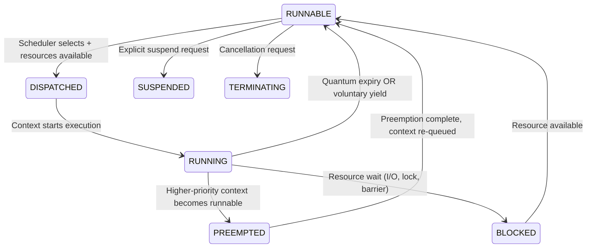
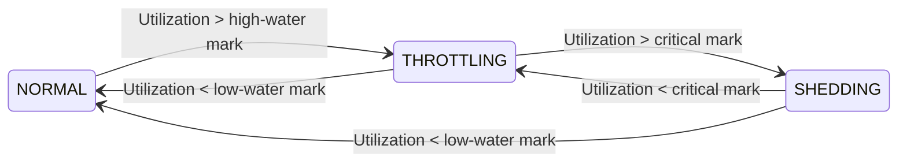
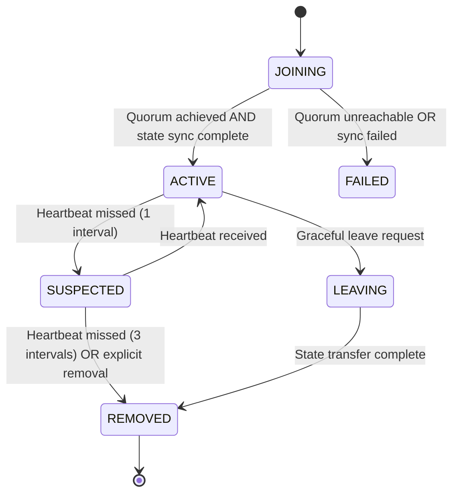

# 10.3 Runtime Behaviour

This section specifies the operational behaviour of the AI Runtime. It defines the runtime lifecycle, execution behaviour, scheduling behaviour, execution context lifecycle, runtime state transitions, and coordination behaviour. Detailed treatments of checkpointing, governance evaluation, failure recovery, and distributed coordination appear in Sections 10.4, 10.5, 10.6, and 10.7 respectively.

## 10.3.1 Runtime Lifecycle

The AI Runtime lifecycle comprises three phases: **Initialization**, **Operational**, and **Termination**. The runtime state machine governs transitions between these phases.

### 10.3.1.1 Runtime State Machine

```mermaid
stateDiagram-v2
    direction TB
    [*] --> INITIALIZING
    INITIALIZING --> OPERATIONAL: All core subsystems READY; admission control PERMIT; health checks HEALTHY
    INITIALIZING --> FAILED: Initialization error OR health check failure
    OPERATIONAL --> SUSPENDING: Suspend request received
    OPERATIONAL --> SHUTTING_DOWN: Shutdown request received
    OPERATIONAL --> DEGRADED: Non-critical subsystem UNHEALTHY; core services HEALTHY
    OPERATIONAL --> RECOVERING: Critical subsystem UNHEALTHY OR invariant violation detected
    SUSPENDING --> SUSPENDED: All execution contexts QUIESCED; checkpoint complete (if enabled); state flushed
    SUSPENDED --> OPERATIONAL: Resume request received
    SUSPENDED --> SHUTTING_DOWN: Shutdown request received
    DEGRADED --> OPERATIONAL: Degraded subsystem reports HEALTHY; validation passes
    DEGRADED --> RECOVERING: Failure escalation detected
    RECOVERING --> OPERATIONAL: State reconstruction complete; core subsystems READY; invariants re-verified
    RECOVERING --> FAILED: Recovery attempts exhausted OR persistent corruption detected
    SHUTTING_DOWN --> TERMINATED: All execution contexts TERMINATED; resource pools empty; EventBus drained; audit log flushed
    TERMINATED --> [*]
    FAILED --> TERMINATED: Emergency shutdown complete
```

### 10.3.1.2 Runtime Lifecycle State Table

| State | Description | Valid Entry Transitions | Valid Exit Transitions | Invariant |
|-------|-------------|------------------------|----------------------|-----------|
| **INITIALIZING** | Subsystem bootstrap in dependency order | [*] (startup) | OPERATIONAL, FAILED | No workload admission |
| **OPERATIONAL** | Normal workload execution | INITIALIZING, SUSPENDED, DEGRADED, RECOVERING | SUSPENDING, SHUTTING_DOWN, DEGRADED, RECOVERING | All invariants hold |
| **SUSPENDING** | Graceful workload quiesce in progress | OPERATIONAL | SUSPENDED | No new scheduling decisions |
| **SUSPENDED** | All contexts quiesced, state preserved | SUSPENDING | OPERATIONAL, SHUTTING_DOWN | Zero active execution |
| **DEGRADED** | Reduced capacity, non-critical path failure | OPERATIONAL | OPERATIONAL, RECOVERING | Core invariants hold; optional services unavailable |
| **RECOVERING** | Automated state reconstruction in progress | OPERATIONAL, DEGRADED | OPERATIONAL, FAILED | No new workload admission |
| **SHUTTING_DOWN** | Controlled termination sequence | OPERATIONAL, SUSPENDED | TERMINATED | No new admissions; draining in progress |
| **TERMINATED** | Clean shutdown complete | SHUTTING_DOWN, FAILED | [*] | All resources released |
| **FAILED** | Unrecoverable error state | INITIALIZING, RECOVERING | TERMINATED | Requires operator intervention |

### 10.3.1.3 Phase Entry/Exit Conditions

- **Initialization → Operational**: All core subsystems (Scheduler, Resource Manager, Execution Context Manager, EventBus, Security Mediator) report `READY`; admission control policy evaluates to `PERMIT`; initial health checks return `HEALTHY`.
- **Operational → Suspending**: External suspend signal received OR policy-driven maintenance window entered. All RUNNING contexts must reach quiescent point within configured grace period.
- **Operational → Degraded**: Non-critical subsystem (Telemetry, Plugin Manager, non-core plugins) reports `UNHEALTHY` while core services remain `HEALTHY`. Workload execution continues with reduced observability/extensibility.
- **Operational → Recovering**: Critical subsystem (Scheduler, Resource Manager, Execution Context Manager) reports `UNHEALTHY` OR invariant violation detected. Automatic recovery procedure initiated.
- **Suspending → Suspended**: All execution contexts report `SUSPENDED`; checkpointing (if enabled) completes; persistent state flushed.
- **Degraded → Operational**: Previously degraded subsystem reports `HEALTHY` and passes validation checks.
- **Recovering → Operational**: State reconstruction complete; all core subsystems report `READY`; invariants re-verified.
- **Recovering → Failed**: Recovery attempts exhausted (configurable retry limit); persistent corruption detected; operator intervention required.
- **Shutting Down → Terminated**: All execution contexts `TERMINATED`; resource pools empty; EventBus drained; audit log flushed.

### 10.3.1.4 Lifecycle Determinism Requirements

1. **Deterministic Transitions**: Given identical system state and trigger, the same transition executes.
2. **No Ambiguous Guards**: Every transition condition is a verifiable predicate on observable state.
3. **No Race Windows**: State transitions are atomic with respect to the state machine; concurrent triggers are serialized by the runtime kernel.
4. **Idempotent State Entry**: Entering the same state multiple times produces equivalent system state.

## 10.3.2 Execution Context Lifecycle

An execution context provides an isolated environment for workload execution. Its lifecycle is managed by the Execution Context Manager.

### 10.3.2.1 Execution Context State Machine

```mermaid
stateDiagram-v2
    direction TB
    [*] --> CREATING
    CREATING --> CREATED: Context constructed; resources reserved; security validated
    CREATING --> FAILED_CREATION: Resource unavailable OR security validation failure
    CREATED --> SCHEDULED: Scheduler assigns execution slot
    CREATED --> SUSPENDED: Explicit suspend before scheduling
    SCHEDULED --> RUNNING: Dispatcher starts execution
    SCHEDULED --> CREATED: Pre-dispatch cancellation
    RUNNING --> SUSPENDING: Suspend request OR preemption with state capture
    RUNNING --> COMPLETING: Workload signals normal completion
    RUNNING --> FAILING: Workload fault OR resource violation detected
    SUSPENDING --> SUSPENDED: Execution state captured; resources retained
    SUSPENDED --> RUNNING: Resume request; resources re-acquired
    SUSPENDED --> TERMINATING: Termination request
    COMPLETING --> COMPLETED: Results committed; output available
    FAILING --> FAILED: Fault recorded; diagnostics captured
    COMPLETED --> TERMINATING: Cleanup initiated
    FAILED --> TERMINATING: Cleanup initiated
    TERMINATING --> TERMINATED: Resources released; context destroyed
    TERMINATED --> [*]
    FAILED_CREATION --> [*]
```

### 10.3.2.2 Execution Context State Table

| State | Description | Resource Hold | Scheduling Eligibility | Transition Trigger |
|-------|-------------|---------------|----------------------|-------------------|
| **CREATING** | Validating spec, reserving quotas | Quotas reserved | No | Admission control decision |
| **CREATED** | Fully constructed, awaiting scheduling | Quotas held | Yes | Scheduler selection |
| **SCHEDULED** | Assigned to execution unit, pre-dispatch | Resources allocated | No | Dispatcher trigger |
| **RUNNING** | Actively executing workload | Resources consumed | No (unless preemptible) | Workload event, preemption, suspend |
| **SUSPENDING** | Capturing execution state | Resources retained | No | Suspend request received |
| **SUSPENDED** | Quiesced, state preserved | Quotas held, memory paged | Yes | Resume or terminate request |
| **COMPLETING** | Finalizing outputs | Resources held | No | Workload completion signal |
| **COMPLETED** | Outputs available, awaiting collection | Quotas held | No | Collector retrieval |
| **FAILING** | Fault isolation, diagnostics | Resources held | No | Fault detection |
| **FAILED** | Diagnostics captured | Quotas held | No | Termination request |
| **TERMINATING** | Releasing all resources | Releasing | No | Cleanup complete |
| **TERMINATED** | Context destroyed | None | N/A | N/A |
| **FAILED_CREATION** | Creation aborted | Released on failure | N/A | N/A |

### 10.3.2.3 Context State Invariants

1. **Single Ownership**: Each context has exactly one owning scheduler/agent at any time.
2. **Resource Monotonicity**: Resources are only acquired on CREATING→CREATED→SCHEDULED→RUNNING transitions and released on TERMINATING→TERMINATED.
3. **State Reachability**: From RUNNING, only SUSPENDING, COMPLETING, or FAILING are reachable.
4. **No Circular Waits**: State machine contains no cycles except RUNNING↔SUSPENDED via explicit suspend/resume.
5. **Quiescence Requirement**: SUSPENDED state implies workload execution is at a defined safe point with no in-flight non-deterministic operations.

### 10.3.2.4 Context Lifecycle Determinism Requirements

1. **Deterministic State Transitions**: Identical (context spec, system state, trigger) → identical next state.
2. **Atomic Transitions**: Each transition is atomic with respect to resource accounting and capability state.
3. **No Implementation-Dependent Branching**: Branch conditions reference only architectural state (quota, capability, health), not implementation timers or thread-local data.

## 10.3.3 Scheduling Behaviour

The scheduler determines which execution contexts receive compute resources and when. Scheduling is deterministic, priority-aware, and work-conserving.

### 10.3.3.1 Scheduling Model

The scheduler operates on a **priority-class + deadline** model with the following precedence:

1. **System Critical** (highest): Runtime internal operations (GC, checkpoint, health checks)
2. **Real-Time**: Deadline-constrained workloads (EDF within class)
3. **Interactive**: Low-latency response required (CFS within class)
4. **Batch**: Throughput-optimized (FSS within class)
5. **Best-Effort** (lowest): Opportunistic execution when resources idle

Within each class, scheduling follows the class-specific algorithm. Cross-class preemption follows strict priority: higher class always preempts lower.

### 10.3.3.2 Scheduling Guarantees (Architectural Requirements)

| Guarantee | Formal Statement | Scope |
|-----------|------------------|-------|
| **Work Conservation** | ∀t: (∃ runnable context ∧ available resources) → scheduler dispatches context | All classes |
| **Bounded Priority Inversion** | Priority inversion duration ≤ max critical section time of highest-priority context holding shared resource | All classes |
| **Starvation Freedom** | ∀ context in RUNNABLE state: ∃t' > t : context executes (given fair resource availability) | All classes |
| **Deadline Adherence** | Real-Time class: dispatch latency ≤ configured deadline - execution time estimate | Real-Time only |
| **Deterministic Dispatch** | Given identical runnable set and resource state, scheduler produces identical dispatch sequence | All classes |
| **Quota Enforcement** | ∀ context: cumulative CPU time ≤ allocated quota over enforcement window | All classes |

### 10.3.3.3 Scheduling State Transitions (Architectural Model)



### 10.3.3.4 Execution Priority Rules (Architectural Requirements)

1. **Static Priority**: Assigned at admission based on workload class and configured weight.
2. **Dynamic Priority Adjustment**: Limited to aging (prevents starvation) and deadline proximity (real-time class only). Aging increment capped at one priority level per aging interval.
3. **Priority Inheritance**: When a high-priority context blocks on a resource held by lower-priority context, the holder temporarily inherits the higher priority until resource release.
4. **No Priority Donation**: Priority never decreases below static assignment except via explicit operator action.

### 10.3.3.5 Engineering Defaults (Non-Normative)

The following values are **engineering defaults** — implementations may adjust within architectural bounds:

| Parameter | Default | Architectural Constraint |
|-----------|---------|--------------------------|
| Aging interval | 10s | Must be configurable; >0 |
| Real-Time quantum | 1ms | Must be configurable; >0 |
| Interactive quantum | 4ms | Must be configurable; >0 |
| Batch quantum | 10ms | Must be configurable; >0 |
| Best-Effort quantum | 50ms | Must be configurable; >0 |

## 10.3.4 Execution Behaviour

Execution behaviour defines how workloads run within their contexts, including cancellation, timeout, retry, and backpressure semantics.

### 10.3.4.1 Cancellation Semantics (Architectural Requirements)

| Cancellation Type | Trigger | Behaviour | Guarantees |
|-------------------|---------|-----------|------------|
| **Graceful** | Operator request, policy expiry | Context receives cancel signal; completes current safe point; transitions to TERMINATING | No partial results visible; checkpoints allowed |
| **Forced** | Grace period expiry, fatal error | Immediate preemption; state discarded; resources reclaimed | Bounded termination time ≤ grace period |
| **Cooperative** | Workload-internal decision | Workload initiates own termination via runtime API | Clean resource handover |
| **Cascading** | Parent context cancelled | All child contexts receive same cancellation type | Tree-structured termination |

Cancellation is **idempotent** and **asynchronous**: the request returns immediately; completion is signaled via context state transition to TERMINATED.

### 10.3.4.2 Timeout Semantics

#### Architectural Requirements (Mandatory Behaviour)

| Timeout Type | Applies To | Required Behaviour on Expiry |
|--------------|------------|------------------------------|
| **Admission Timeout** | Workload admission evaluation | Reject admission |
| **Dispatch Timeout** | Scheduler to context dispatch | Re-queue with backoff |
| **Execution Quantum** | RUNNING context time slice | Preempt, re-queue |
| **Graceful Termination** | Context shutdown grace period | Forced termination |
| **Suspend/Resume** | State capture/restore | Abort, retain original state |
| **Checkpoint** | Checkpoint creation | Cancel, retry later |
| **Health Check** | Subsystem health probe | Mark UNHEALTHY |
| **Recovery** | Automated recovery attempt | Escalate to manual |

All timeouts use **wall-clock** with monotonic clock source. Timeout handling is non-preemptible to avoid priority inversion on timer delivery.

#### Engineering Defaults (Configurable, Non-Normative)

| Timeout Type | Default Value | Constraint |
|--------------|---------------|------------|
| Admission Timeout | 5s | Configurable; >0 |
| Dispatch Timeout | 100ms | Configurable; >0 |
| Graceful Termination | 30s | Configurable; >0 |
| Suspend Timeout | 10s | Configurable; >0 |
| Resume Timeout | 5s | Configurable; >0 |
| Checkpoint Timeout | 60s | Configurable; >0 |
| Health Check Timeout | 5s | Configurable; >0 |
| Recovery Timeout | 300s | Configurable; >0 |

### 10.3.4.3 Retry Semantics

#### Architectural Requirements (Mandatory Behaviour)

| Retry Context | Required Policy | Required Backoff | Required Max Attempts | Required Jitter |
|---------------|-----------------|------------------|----------------------|-----------------|
| **Admission Retry** | Exponential | Base + factor | Configurable maximum | Required (±max%) |
| **Dispatch Retry** | Exponential | Base + factor | Configurable maximum | Required (±max%) |
| **Resource Allocation** | Linear with yield | Incremental | Configurable maximum | Not required |
| **Checkpoint Retry** | Exponential | Base + factor | Configurable maximum | Required (±max%) |
| **Recovery Retry** | Exponential | Base + factor | Configurable maximum | Required (±max%) |
| **Network/Storage I/O** | Exponential | Base + factor | Configurable maximum | Required (±max%) |

Retries **never** apply to:
- Forced cancellations
- Security violations
- Invariant violations (data corruption)
- Non-idempotent operations without explicit idempotency key

#### Engineering Defaults (Configurable, Non-Normative)

| Retry Context | Default Base | Default Factor | Default Max Attempts | Default Jitter |
|---------------|--------------|----------------|---------------------|----------------|
| Admission Retry | 100ms | 2x | 3 | ±25% |
| Dispatch Retry | 10ms | 2x | 5 | ±25% |
| Resource Allocation | 50ms increment | N/A | 10 | None |
| Checkpoint Retry | 1s | 2x | 3 | ±10% |
| Recovery Retry | 10s | 2x | 3 | ±25% |
| Network/Storage I/O | 100ms | 2x | 5 | ±25% |

### 10.3.4.4 Backpressure Behaviour (Architectural Requirements)

Backpressure propagates resource pressure from consumers to producers through explicit signals:



**Propagation Rules (Architectural Requirements):**
1. Backpressure signals flow upstream via EventBus `ResourcePressure` events.
2. Each subsystem defines its own high-water, low-water, and critical marks per resource dimension.
3. Under THROTTLING: new admissions deferred; queued work processed at reduced rate; priority-based shedding within class.
4. Under SHEDDING: lowest-priority RUNNABLE contexts preempted; new admissions rejected; only System Critical work proceeds.
5. Backpressure **never** causes forced termination of RUNNING contexts (only preemption).

#### Engineering Defaults (Configurable, Non-Normative)

| Mark | Default Value | Constraint |
|------|---------------|------------|
| High-water mark | 80% | Configurable; 0-100% |
| Low-water mark | 60% | Configurable; < high-water |
| Critical mark | 95% | Configurable; > high-water |

### 10.3.4.5 Deterministic Execution Guarantees (Architectural Requirements)

The runtime bounds non-determinism to enable reproducible execution:

| Determinism Dimension | Guarantee | Bounding Mechanism |
|----------------------|-----------|-------------------|
| **Input** | Identical input → identical initial context state | Sealed context images; immutable input references |
| **Scheduling** | Identical runnable set → identical dispatch order | Deterministic scheduler; seeded tie-breaking |
| **Memory** | Identical allocation sequence → identical virtual addresses | Deterministic allocator; fixed heap layout |
| **Timing** | Execution time variance ≤ configured bound | Quantum accounting; no external time dependency in critical path |
| **Floating Point** | IEEE 754 + controlled non-determinism flags | FLT_EVAL_METHOD=0; reproducible math library |
| **External Events** | Injected via EventBus with sequence numbers | Deterministic replay from event log |

**Non-Determinism Sources** (explicitly permitted, bounded):
- Hardware performance counters
- True random number generation (seeded per context)
- Asynchronous I/O completion order (bounded by queue depth)
- Garbage collection timing (bounded by allocation rate)

### 10.3.4.6 Fault Containment (Architectural Requirements)

Fault containment prevents error propagation across isolation boundaries:

| Containment Layer | Scope | Mechanism | Escape Handling |
|------------------|-------|-----------|-----------------|
| **Context** | Single execution context | Process/container isolation; capability-based resource access | Context FAILED; parent notified |
| **Fault Domain** | Co-located contexts (same node) | Resource quotas; CPU/memory partitioning; network VLANs | Domain marked DEGRADED; workloads migrated |
| **Runtime** | Entire runtime instance | Subsystem restart; state reconstruction from checkpoint | Runtime RECOVERING or FAILED |
| **Cluster** | Multi-node deployment | Consensus protocol; quorum requirements; split-brain prevention | Partition isolated; minority side FAILED |

**Containment Principles (Architectural Requirements):**
1. **No Shared Mutable State**: Contexts communicate only via EventBus or explicit capability-passing.
2. **Fail-Stop Semantics**: A contained fault never causes silent corruption outside its boundary.
3. **Diagnostic Capture**: On transition to FAILED/FAILING, full diagnostic snapshot captured before cleanup.
4. **Blast Radius Limitation**: Maximum contexts affected by single fault = fault domain size (configurable, default 1).

## 10.3.5 Resource Arbitration

Resource arbitration resolves contention when demand exceeds supply.

### 10.3.5.1 Arbitration Principles (Architectural Requirements)

1. **Hierarchical Quotas**: Resources allocated via quota tree (system → tenant → workload). Parent quota exhaustion blocks children.
2. **Strict Priority**: Higher-priority class always satisfies demand first; lower classes receive residual.
3. **Proportional Fairness**: Within class, residual resources distributed proportionally to weights.
4. **Non-Preemptible Reservations**: Real-Time class may reserve resources; reservations honored even under contention.
5. **Borrowing with Reclamation**: Lower classes may borrow unused higher-class resources; reclaimed immediately on demand.

### 10.3.5.2 Arbitration Decision Logic (Architectural Model)

```
For each resource dimension:
  1. Reserve System Critical minimum
  2. Satisfy Real-Time reservations
  3. Allocate to Real-Time runnable (EDF)
  4. Satisfy Interactive minimum shares
  5. Allocate to Interactive (CFS)
  6. Satisfy Batch minimum shares
  7. Allocate to Batch (FSS)
  8. Offer residual to Best-Effort
  9. Track borrowed resources for immediate reclamation
```

### 10.3.5.3 Resource Arbitration Invariants (Architectural Requirements)

| Invariant | Description |
|-----------|-------------|
| **Quota Hierarchy** | ∀ nodes in quota tree: sum(child allocations) ≤ parent allocation |
| **Priority Precedence** | No lower-priority context holds resource while higher-priority context is runnable and waiting |
| **Reservation Honor** | Reserved resources never allocated to non-reserving contexts |
| **Borrowing Limit** | Borrowed resources ≤ (total - reserved - minimum shares) |
| **Reclamation Atomicity** | Reclamation completes in single scheduling decision; no partial reclaim |

## 10.3.6 Runtime Coordination Behaviour

Coordination governs multi-node runtime clusters and distributed state management.

### 10.3.6.1 Cluster Membership



**Membership Rules (Architectural Requirements):**
- Cluster operates with **odd-numbered quorum** (≥3 nodes for HA).
- Nodes join by contacting seed nodes; membership change requires consensus.
- **Suspected** state triggers health verification; no workload migration until confirmed removal.
- **Leaving** nodes drain workloads before state transfer; force-leave allowed for emergencies.

### 10.3.6.2 Distributed State Coordination

The runtime uses **consensus-based coordination** for global state:

| State Category | Consistency Model | Coordination Requirement | Scope |
|----------------|-------------------|-------------------------|-------|
| **Scheduling** | Eventual (per-node) | Local scheduler + global load view | Node |
| **Resource Quotas** | Strong (linearizable) | Consensus log | Cluster |
| **Context Metadata** | Strong (linearizable) | Consensus log | Cluster |
| **Checkpoint Index** | Eventual (causal) | Versioned metadata store | Cluster |
| **Policy Config** | Strong (linearizable) | Consensus log + version watch | Cluster |
| **Telemetry** | Best-effort | Local aggregation + periodic flush | Node |

**Coordination Guarantees (Architectural Requirements):**
1. Quota changes and policy updates are linearizable.
2. Context metadata (location, state, ownership) is strongly consistent.
3. Scheduling decisions are locally optimal; global optimization is advisory.
4. Network partition **always** favors consistency: minority partition suspends admission.

> **Note**: The specific consensus algorithm is an implementation choice. The architecture requires only the stated consistency models and coordination guarantees. Part 2 (EventBus) and Part 6 (Infrastructure) define the messaging and membership primitives used.

### 10.3.6.3 Load Distribution (Architectural Requirements)

Workload placement considers:
1. **Affinity**: Data locality, accelerator type, prior context location.
2. **Anti-Affinity**: Fault domain spread, tenant isolation.
3. **Capacity**: Available resources vs. demand forecast.
4. **Cost**: Inter-node traffic, cross-zone latency.

Placement algorithm: **Score-based** with tunable weights per dimension. Scores computed per candidate node; highest score selected. Ties broken deterministically (node ID).

## 10.3.7 Runtime Behaviour Invariants

The following invariants **must** hold throughout the Operational phase and all sub-states.

### 10.3.7.1 Safety Invariants (Never Violated — Testable)

| # | Invariant | Formal Statement | Test Criterion |
|---|-----------|------------------|----------------|
| **INV-1** | Isolation Integrity | ∀ c₁, c₂ ∈ Contexts: c₁ ≠ c₂ → ¬(c₁.can_access(c₂.memory) ∨ c₁.can_access(c₂.capabilities)) | No cross-context memory/capability access in fault injection tests |
| **INV-2** | Quota Enforcement | ∀ c ∈ Contexts: c.cpu_used ≤ c.cpu_quota ∧ c.mem_used ≤ c.mem_quota ∧ ... | Resource accounting audit under load |
| **INV-3** | Single Ownership | ∀ c ∈ Contexts: |owners(c)| = 1 | Ownership registry verification |
| **INV-4** | Resource Accounting | Σ allocated(resources) ≤ total(resources) | Accounting reconciliation at each transition |
| **INV-5** | Capability Validity | ∀ cap ∈ ActiveCapabilities: cap.issuer.trusted ∧ ¬cap.expired ∧ cap.context = holder | Capability chain validation on every use |
| **INV-6** | State Machine Well-Formed | ∀ c: c.state ∈ ValidStates ∧ transitions(c) ⊆ ValidTransitions | State machine conformance testing |
| **INV-7** | No Silent Corruption | Any memory corruption detected → context transitions to FAILING within bounded time | Memory corruption injection → FAILING transition |
| **INV-8** | Deterministic Replay | Identical (input, initial_state, event_sequence) → identical (output, final_state) | Replay verification across N runs |

### 10.3.7.2 Liveness Invariants (Eventually Satisfied — Measurable)

| # | Invariant | Formal Statement | Test Criterion |
|---|-----------|------------------|----------------|
| **INV-L1** | Progress | ∀ c ∈ RUNNABLE: ◇(c.state = RUNNING) | No starvation under sustained load |
| **INV-L2** | Bounded Dispatch | ∀ c admitted: ◇(c.state = SCHEDULED) within admission_timeout | Dispatch latency histogram |
| **INV-L3** | Recovery Convergence | Recovery initiated → ◇(Runtime.state = OPERATIONAL ∨ Runtime.state = FAILED) | Recovery completion within bound |
| **INV-L4** | Eventual Consistency | Distributed state updated → ◇(all nodes agree) | Convergence time measurement |
| **INV-L5** | Resource Reclamation | Context terminated → ◇(resources returned to pool) | Reclamation latency histogram |
| **INV-L6** | Backpressure Relief | Pressure signal issued → ◇(utilization < high_water) | Pressure dissipation time measurement |

### 10.3.7.3 Performance Invariants (Bounded — Targets)

| # | Invariant | Bound | Classification |
|---|-----------|-------|----------------|
| **INV-P1** | Admission Latency | P99 ≤ 100ms | **Target** |
| **INV-P2** | Dispatch Latency | P99 ≤ 10ms (Real-Time), ≤ 100ms (others) | **Target** |
| **INV-P3** | Context Switch | ≤ 10μs (same node), ≤ 1ms (cross-node migration) | **Target** |
| **INV-P4** | Overhead | Runtime CPU ≤ 5% of total under nominal load | **Target** |
| **INV-P5** | Checkpoint/Restore | ≤ 1s/GB memory (target), ≤ 5s/GB (max) | **Target** |

> **Note**: Performance invariants are **targets** (engineering goals), not mandatory requirements. Mandatory requirements are the Safety and Liveness invariants.

## 10.3.8 Runtime Consistency Guarantees

### 10.3.8.1 State Consistency Levels (Architectural Definitions)

| Consistency Level | Definition |
|-------------------|------------|
| **Strong (Linearizable)** | Operations appear instantaneous at some point between invocation and response; total order consistent with real-time. |
| **Sequential** | Operations appear in some sequential order consistent with program order per process. |
| **Eventual (Causal)** | If all updates stop, all replicas eventually converge; causal ordering preserved. |
| **Eventual (Best-Effort)** | If all updates stop, all replicas eventually converge; no ordering guarantees. |
| **Local** | Consistency guaranteed within a single execution context or node; no cross-node guarantees. |

### 10.3.8.2 Data Category Consistency Assignments

| Data Category | Consistency Level | Rationale |
|---------------|-------------------|-----------|
| Context execution state | Local (single-copy serializable within context) | Determinism requirement |
| Context metadata (location, owner) | Strong (Linearizable) | Scheduling correctness |
| Resource quotas | Strong (Linearizable) | Admission control correctness |
| Policies/config | Sequential | Operator expectation |
| Checkpoint index | Eventual (Causal) | Availability during partition |
| Telemetry/metrics | Eventual (Best-Effort) | Non-critical; loss acceptable |
| Audit logs | Strong (Linearizable) + Durability | Compliance requirement |

### 10.3.8.3 Runtime Guarantees

1. **No Stale Reads for Strong Data**: Reads of linearizable data always return the most recent acknowledged write.
2. **Causal Visibility for Eventual Data**: If operation A causally precedes B, any node observing B also observes A.
3. **No Split-Brain**: During network partition, only the partition with quorum continues serving strong-consistency operations.
4. **Deterministic Reconciliation**: On partition heal, state merge follows deterministic rules (last-writer-wins with version vector for eventual data; consensus log replay for strong data).

### 10.3.8.4 Cross-Part Consistency

- **Part 2 (EventBus)**: All state transitions emit events; event ordering per-source FIFO.
- **Part 3 (Security)**: Capability revocation is synchronous with state transition; no TOCTOU window.
- **Part 4 (Memory)**: Checkpoint storage uses Part 4 durability guarantees; restore validates checksums.
- **Part 5 (Learning)**: Observation hooks receive event stream; non-intrusive; no feedback during deterministic replay.
- **Part 6 (Infrastructure)**: Resource allocation maps to Part 6 provisioning units; quotas enforced at Part 10 boundary.
- **Part 8 (AI Core Services)**: Workload submission via Part 8 contracts; runtime executes per this specification.
- **Part 9 (Agent Management)**: Task lifecycle corresponds to Part 9 task states; transitions synchronized.

## 10.3.9 Summary of Behavioural Contracts

| Behaviour | Section | Key Guarantee |
|-----------|---------|---------------|
| Runtime lifecycle | 10.3.1 | Phase transitions preserve invariants; no undefined states |
| Context lifecycle | 10.3.2 | State machine complete; single ownership; resource monotonicity |
| Scheduling | 10.3.3 | Work-conserving; priority-respecting; starvation-free; deterministic |
| Execution | 10.3.4 | Cancellation/timeout/retry/backpressure semantics defined; determinism bounded |
| Resource arbitration | 10.3.5 | Hierarchical quotas; priority precedence; borrowing with instant reclamation |
| Coordination | 10.3.6 | Consensus for strong state; eventual for cacheable; partition→consistency |

---

**Next Sections**:
- **10.4 Checkpointing & State Persistence** — Detailed checkpoint/restore protocols, consistency levels, storage policies
- **10.5 Governance & Admission Control** — Policy evaluation, gate semantics, exception handling
- **10.6 Failure Detection & Recovery** — Detection mechanisms, recovery procedures, RTO/RPO targets
- **10.7 Distributed Runtime Operations** — Cross-node scheduling, migration, cluster management