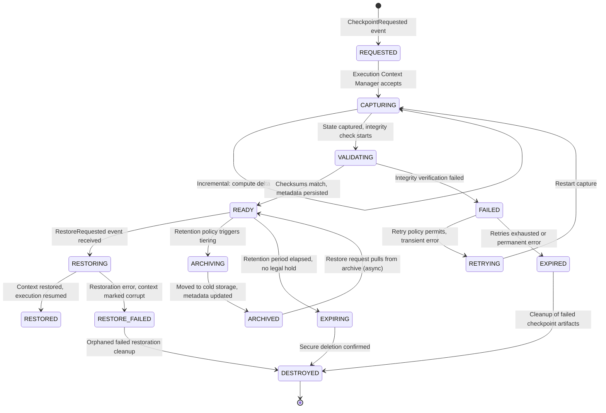
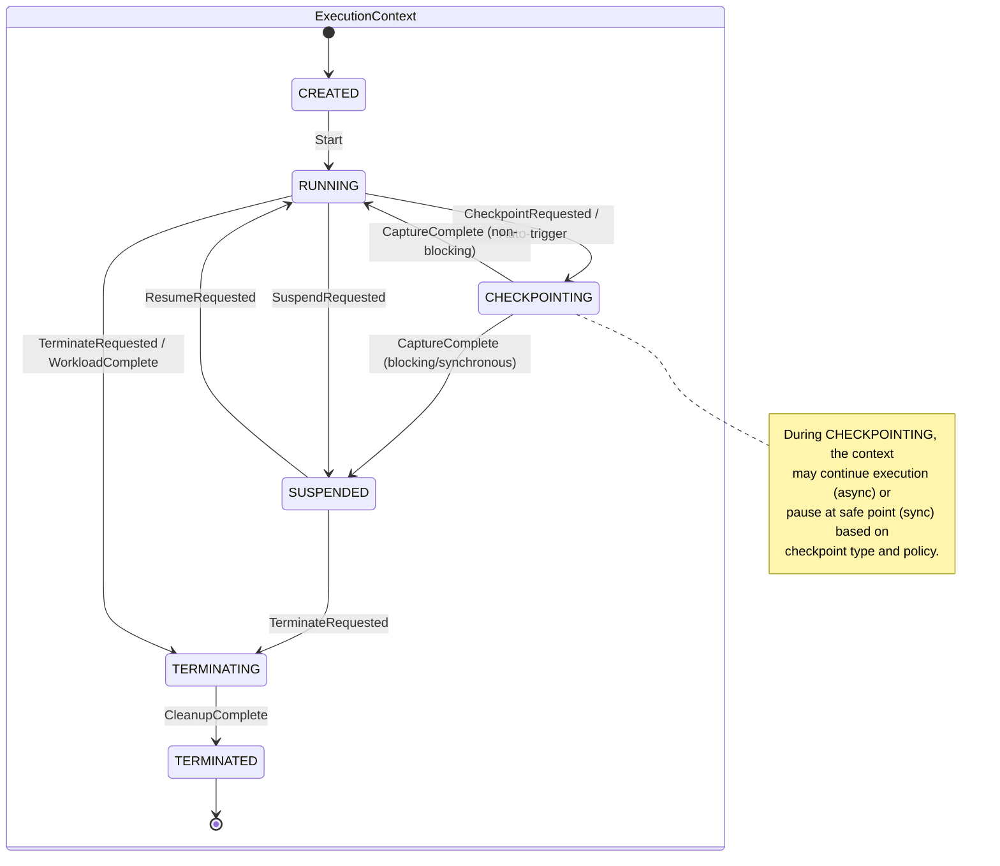
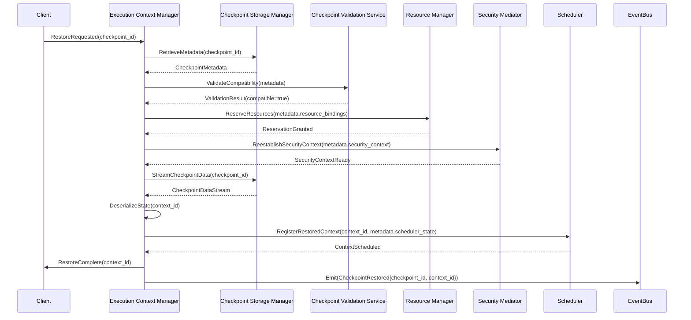
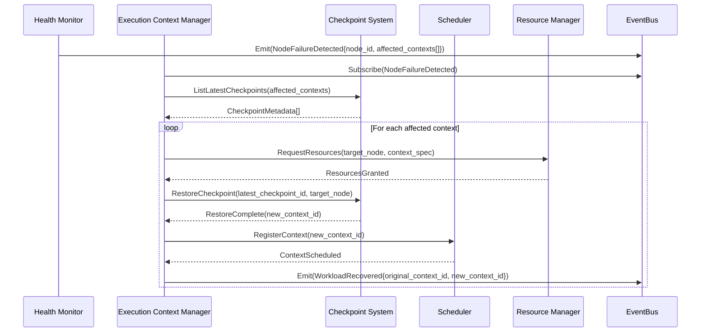
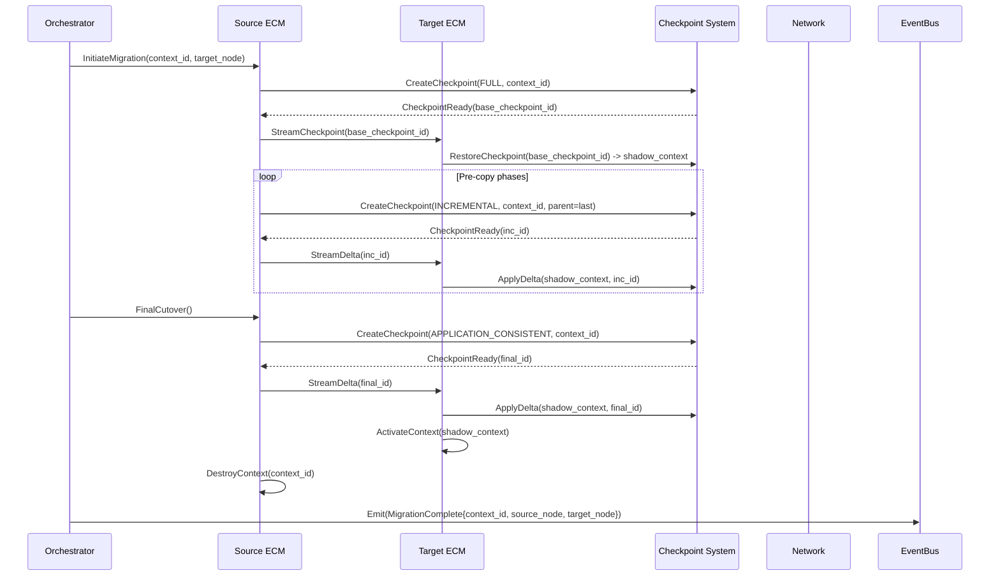
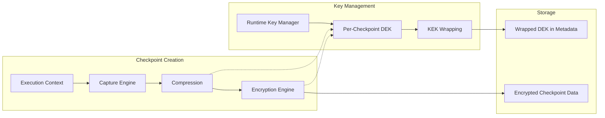
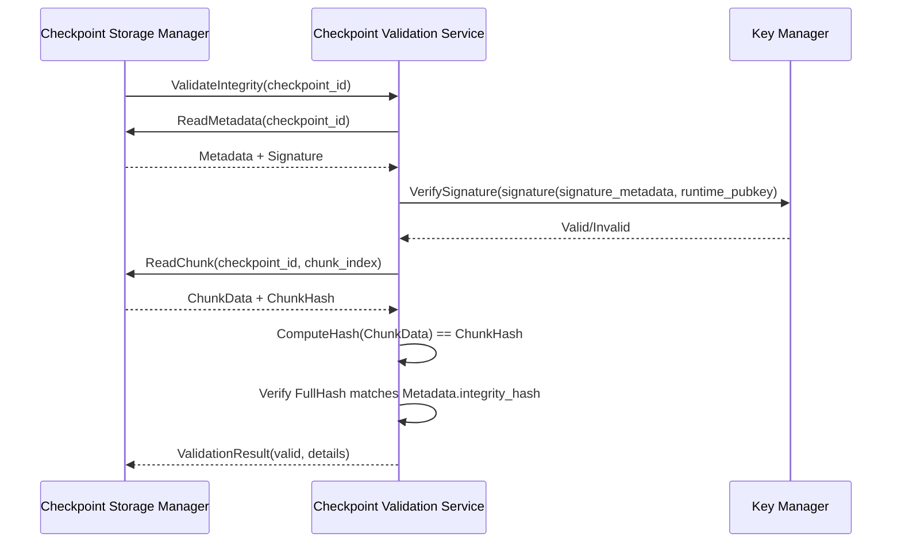

# 10.4 Checkpointing & State Persistence

This section specifies the architectural model for runtime checkpointing and execution state persistence. It defines the requirements, guarantees, and behavioral contracts that enable deterministic state capture, recovery, and migration across the AI-OS runtime.

## 1. Purpose

Checkpointing provides the foundation for fault tolerance, workload mobility, and deterministic replay within the AI-OS runtime. The checkpointing subsystem captures point-in-time execution state such that workloads can be suspended, resumed, migrated, or replayed without semantic deviation from continuous execution.

### Architectural Requirements
- The checkpointing subsystem **MUST** provide crash-consistent state capture for all execution contexts
- State restoration **MUST** produce execution equivalence to the original execution path
- Checkpoint operations **MUST NOT** violate isolation boundaries between execution contexts
- The subsystem **MUST** support incremental and full checkpoint strategies with configurable policies

### Engineering Objectives
- Minimize checkpoint overhead to less than 5% of workload execution time under nominal conditions
- Enable sub-second checkpoint creation for memory states up to 10 GB
- Support concurrent checkpoint operations across multiple execution contexts
- Provide deterministic checkpoint ordering for distributed workloads

## 2. Checkpointing Philosophy

The checkpointing architecture adheres to the following principles:

| Principle | Description |
|-----------|-------------|
| **Deterministic Capture** | Identical execution state with identical inputs **MUST** produce bit-for-bit identical checkpoints |
| **Isolation Preservation** | Checkpoint operations **MUST NOT** expose execution context memory across isolation boundaries |
| **Atomicity by Default** | Each checkpoint represents a single, indivisible state transition; partial checkpoints are invalid |
| **Explicit Ownership** | The Execution Context Manager owns checkpoint lifecycle; consumers request, they do not initiate |
| **Event-Driven Coordination** | Checkpoint lifecycle events are published to the EventBus; no direct component coupling |
| **Policy Separation** | Checkpoint trigger policies (when) are separate from capture mechanics (how) and storage (where) |

### Rationale
These principles ensure that checkpointing integrates with the runtime's event-driven, deterministic execution model while maintaining security boundaries and enabling independent evolution of trigger policies, capture mechanisms, and storage backends.

## 3. Checkpoint Types

The architecture defines five checkpoint categories based on trigger mechanism and capture scope.

### 3.1 Manual Checkpoints

Triggered by explicit request from an authorized entity (orchestrator, administrator, or workload itself via capability).

| Characteristic | Specification |
|----------------|---------------|
| **Trigger** | Explicit `CheckpointRequested` event with target ContextID |
| **Consistency Level** | Application-consistent (workload reaches safe point) |
| **Blocking** | Non-blocking; returns CheckpointID immediately, completes asynchronously |
| **Use Cases** | Pre-migration, pre-maintenance, user-initiated save points |

### 3.2 Automatic Checkpoints

Triggered by runtime-detected conditions without external request.

| Characteristic | Specification |
|----------------|---------------|
| **Trigger** | Resource pressure, preemption signal, health degradation, policy violation |
| **Consistency Level** | Crash-consistent (instantaneous memory capture) |
| **Blocking** | May block execution briefly; bounded by `max_checkpoint_latency_ms` |
| **Use Cases** | Preemptive save before eviction, failure precursor, quota exhaustion |

### 3.3 Periodic Checkpoints

Triggered by time-based or progress-based schedules.

| Characteristic | Specification |
|----------------|---------------|
| **Trigger** | Wall-clock interval (`checkpoint_interval_ms`) or execution progress (instructions, epochs) |
| **Consistency Level** | Configurable: application-consistent preferred, crash-consistent fallback |
| **Blocking** | Non-blocking preferred; synchronous fallback with timeout |
| **Use Cases** | Baseline recovery points, RPO compliance, incremental chain anchoring |

### 3.4 Incremental Checkpoints

Captures only state delta since the prior checkpoint in a chain.

| Characteristic | Specification |
|----------------|---------------|
| **Dependency** | Requires valid parent checkpoint (full or incremental) |
| **Capture Scope** | Modified memory pages, dirty register state, changed resource bindings |
| **Consistency Level** | Inherits from parent; must form valid chain to full checkpoint |
| **Storage Efficiency** | Target >90% size reduction vs. full checkpoint for typical workloads |
| **Restoration** | Requires replay of full chain in sequence |

### 3.5 Full Checkpoints

Complete capture of execution context state independent of prior checkpoints.

| Characteristic | Specification |
|----------------|---------------|
| **Dependency** | None; self-contained restoration unit |
| **Capture Scope** | Entire address space, register file, resource capabilities, scheduler state |
| **Consistency Level** | Application-consistent (preferred) or crash-consistent |
| **Storage Cost** | Proportional to context memory allocation |
| **Use Cases** | Chain anchors, migration baselines, forensic snapshots, policy-mandated fulls |

## 4. Checkpoint Lifecycle

The checkpoint lifecycle defines the states a checkpoint traverses from creation to destruction.

### 4.1 Lifecycle State Machine



### 4.2 Lifecycle Transition Table

| From State | To State | Trigger | Responsible Component | Event Emitted |
|------------|----------|---------|----------------------|---------------|
| `*` | REQUESTED | External request / policy trigger | Execution Context Manager | `CheckpointRequested` |
| REQUESTED | CAPTURING | Scheduler grants capture window | Execution Context Manager | `CheckpointCaptureStarted` |
| CAPTURING | VALIDATING | Memory state frozen, delta computed | Checkpoint Capture Engine | `CheckpointCaptureComplete` |
| VALIDATING | READY | All checksums verified, metadata committed | Checkpoint Validation Service | `CheckpointReady` |
| VALIDATING | FAILED | Checksum mismatch, I/O error, timeout | Checkpoint Validation Service | `CheckpointValidationFailed` |
| FAILED | RETRYING | Transient error, retry count < max | Checkpoint Retry Coordinator | `CheckpointRetryScheduled` |
| FAILED | EXPIRED | Permanent error or max retries exceeded | Checkpoint Lifecycle Manager | `CheckpointFailed` |
| READY | RESTORING | Restore request with valid CheckpointID | Execution Context Manager | `CheckpointRestoreStarted` |
| RESTORING | RESTORED | Context state loaded, execution resumed | Execution Context Manager | `CheckpointRestored` |
| RESTORING | RESTORE_FAILED | State corruption, version incompatibility | Execution Context Manager | `CheckpointRestoreFailed` |
| READY | ARCHIVING | Retention tiering policy evaluation | Checkpoint Storage Manager | `CheckpointArchivalStarted` |
| ARCHIVING | ARCHIVED | Data movement complete, verification passed | Checkpoint Storage Manager | `CheckpointArchived` |
| ARCHIVED | READY | Restore request requires archive retrieval | Checkpoint Storage Manager | `CheckpointRecallStarted` |
| READY | EXPIRING | Retention TTL elapsed, no legal hold | Checkpoint Lifecycle Manager | `CheckpointExpirationPending` |
| EXPIRING | DESTROYED | Secure erase confirmed | Checkpoint Storage Manager | `CheckpointDestroyed` |
| RESTORE_FAILED | DESTROYED | Cleanup of partial restore artifacts | Checkpoint Lifecycle Manager | `CheckpointCleanupComplete` |

## 5. Checkpoint State Machine (Execution Context View)

The execution context experiences checkpoint-related state transitions:



## 6. Checkpoint Metadata

Every checkpoint carries immutable metadata enabling validation, selection, and restoration.

### 6.1 Metadata Schema

| Field | Type | Required | Description |
|-------|------|----------|-------------|
| `checkpoint_id` | UUID | Yes | Globally unique identifier |
| `context_id` | UUID | Yes | Source execution context identifier |
| `checkpoint_type` | Enum | Yes | MANUAL, AUTOMATIC, PERIODIC, INCREMENTAL, FULL |
| `consistency_level` | Enum | Yes | APPLICATION_CONSISTENT, CRASH_CONSISTENT |
| `parent_checkpoint_id` | UUID | Conditional | Parent for incremental; absent for full |
| `sequence_number` | Integer | Yes | Monotonic sequence per context |
| `capture_timestamp` | RFC3339 | Yes | Wall-clock start of capture |
| `capture_duration_ns` | Integer | Yes | Nanoseconds from start to VALIDATING |
| `state_size_bytes` | Integer | Yes | Logical size of captured state |
| `stored_size_bytes` | Integer | Yes | Physical storage size (post-compression) |
| `compression_algorithm` | String | Yes | e.g., "zstd", "lz4", "none" |
| `encryption_algorithm` | String | Yes | e.g., "AES-256-GCM", "ChaCha20-Poly1305" |
| `integrity_hash` | String | Yes | SHA-256 or SHA-3-256 of stored data |
| `integrity_algorithm` | String | Yes | Hash algorithm used |
| `runtime_version` | SemVer | Yes | Runtime version that created checkpoint |
| `workload_identity` | String | Yes | Workload identifier for authorization |
| `resource_bindings` | Map | Yes | Resource handles, capabilities at capture |
| `scheduler_state` | Object | Yes | Priority, queue position, affinity tags |
| `security_context` | Object | Yes | Capability tokens, trust level, labels |
| `archival_tier` | Enum | Yes | HOT, WARM, COLD, ARCHIVED |
| `retention_expires` | RFC3339 | Yes | Scheduled destruction time |
| `legal_hold` | Boolean | Yes | Prevents expiration if true |
| `tags` | Map<String,String> | No | User-defined metadata for filtering |

### 6.2 Metadata Immutability

Checkpoint metadata **MUST** be immutable after the `READY` state transition. Any modification requires creation of a new checkpoint. Metadata is stored alongside checkpoint data with identical durability and encryption guarantees.

## 7. State Serialization Requirements

The architecture specifies serialization constraints without mandating format.

### 7.1 Serialization Contract

| Requirement | Specification |
|-------------|---------------|
| **Deterministic Output** | Identical input state **MUST** produce bit-wise identical serialized output |
| **Version Tolerance** | Format **MUST** support forward/backward compatibility within major version |
| **Schema Evolution** | Adding fields **MUST NOT** break existing consumers; removal requires major version |
| **Self-Describing** | Serialized data **MUST** contain sufficient metadata for schema discovery |
| **Streaming Capable** | Serialization **MUST** support incremental write/read for large states |
| **Partial Read** | Consumers **MUST** be able to read subsets (e.g., register state only) |
| **Zero-Copy Option** | Architecture **MUST** allow memory-mapped restoration where hardware permits |

### 7.2 State Components Subject to Serialization

| Component | Serialization Requirement |
|-----------|---------------------------|
| **Memory Pages** | All committed pages in context address space; track dirty bits for incremental |
| **Register File** | Architectural registers, vector/SIMD, control registers, debug registers |
| **Execution Pointer** | Instruction pointer, stack pointer, frame pointer |
| **Scheduler State** | Priority, deadline, time slice remaining, affinity, preemption count |
| **Resource Capabilities** | Held capability tokens, granted quotas, active reservations |
| **Security Context** | Trust level, labels, seam allowances, audit IDs |
| **I/O State** | Pending async operations, file descriptors, socket states |
| **Plugin State** | Plugin-specific opaque blobs (plugin MUST provide serialize/deserialize) |

### 7.3 Excluded from Serialization

| Component | Rationale |
|-----------|-----------|
| **Runtime-internal bookkeeping** | Reconstructed on restore (e.g., health check timestamps) |
| **Ephemeral caches** | Rebuilt from source (e.g., JIT code cache, page cache) |
| **External resource handles** | Not portable (e.g., GPU context, network connections) |
| **Volatile hardware state** | Not persistent (e.g., TLB contents, branch predictor state) |

## 8. State Restoration Behaviour

Restoration recreates an execution context from a checkpoint.

### 8.1 Restoration Sequence Diagram



### 8.2 Restoration Guarantees

| Guarantee | Specification |
|-----------|---------------|
| **Execution Equivalence** | Restored context **MUST** produce identical subsequent behavior to original from capture point |
| **Resource Fidelity** | Restored context **MUST** receive equivalent resource allocations (or explicit degradation event) |
| **Security Continuity** | Capability tokens and trust labels **MUST** be revalidated, not blindly restored |
| **Deterministic Timing** | Restoration latency **MUST** be bounded and published as SLA |
| **Idempotency** | Repeated restore of same checkpoint to same target **MUST** be safe (no-op after first) |

### 8.3 Restoration Failure Modes

| Failure Mode | Detection | Response |
|--------------|-----------|----------|
| **Checksum Mismatch** | Validation service | Abort, emit `CheckpointRestoreFailed`, mark context corrupt |
| **Version Incompatibility** | Compatibility matrix | Abort, suggest migration path, emit event |
| **Resource Unavailable** | Resource Manager | Queue with backoff, emit `ResourceUnavailable` |
| **Security Context Invalid** | Security Mediator | Abort, audit log, require re-authorization |
| **Partial Restore** | Deserialization error | Rollback allocation, destroy partial context, emit failure |

## 9. Consistency Guarantees

The architecture defines three consistency levels with precise semantics.

### 9.1 Consistency Level Definitions

| Level | Definition | Capture Mechanism | Restoration Semantics |
|-------|------------|-------------------|----------------------|
| **CRASH_CONSISTENT** | State reflects a possible instant in execution; in-flight operations may be partial | Atomic memory snapshot (copy-on-write, page freezing) | Restores to valid state; workload must handle in-flight operation rollback |
| **APPLICATION_CONSISTENT** | State reflects a workload-defined safe point; all in-flight operations completed or rolled back | Workload cooperation via `PrepareForCheckpoint` hook + snapshot | Restores to clean state; no in-flight operation ambiguity |
| **TRANSACTIONAL_CONSISTENT** | State reflects committed transactions only; spans multiple contexts | Distributed coordination (two-phase commit variant) | Restores globally consistent multi-context state |

### 9.2 Consistency Guarantees Table

| Guarantee | CRASH_CONSISTENT | APPLICATION_CONSISTENT | TRANSACTIONAL_CONSISTENT |
|-----------|------------------|------------------------|---------------------------|
| **Single-context validity** | Yes | Yes | Yes |
| **No torn writes** | Yes | Yes | Yes |
| **In-flight syscalls resolved** | No (kernel handles) | Yes | Yes |
| **Application invariants held** | No | Yes | Yes |
| **Cross-context consistency** | No | No | Yes |
| **Capture latency** | Lowest | Medium | Highest |
| **Workload cooperation** | None | Required | Required |
| **Supported checkpoint types** | All | Manual, Periodic | Manual only |

## 10. Atomicity Requirements

Checkpoint operations exhibit atomicity at multiple levels.

### 10.1 Capture Atomicity

| Property | Requirement |
|----------|-------------|
| **All-or-Nothing** | A checkpoint is either fully captured and validated, or no visible artifacts exist |
| **No Partial Visibility** | Intermediate capture state **MUST NOT** be visible to other components |
| **Rollback on Failure** | Failed capture **MUST** release all transient resources, leave no orphaned data |
| **Idempotent Retry** | Retry of failed capture **MUST** produce identical result to never having failed |

### 10.2 Metadata Atomicity

| Property | Requirement |
|----------|-------------|
| **Single Commit** | Metadata entry appears atomically in checkpoint index |
| **Transactional Link** | Data and metadata commits are coupled; either both succeed or both fail |
| **Index Consistency** | Checkpoint list operations **MUST** reflect committed state only |

### 10.3 Restoration Atomicity

| Property | Requirement |
|----------|-------------|
| **Context Creation Atomicity** | Restored context appears in scheduler atomically; no partial registration |
| **Resource Reservation** | All resources reserved before data streaming begins; rollback on any failure |
| **State Transition** | Context transitions RUNNING → RESTORING → RUNNING without observable intermediate |

## 11. Durability Requirements

Durability defines the persistence guarantees for checkpoint data and metadata.

### 11.1 Durability Levels

| Level | Guarantee | Use Case |
|-------|-----------|----------|
| **VOLATILE** | In-memory only; lost on runtime restart | Ultra-low-latency periodic checkpoints for replay |
| **LOCAL_PERSISTENT** | Written to local non-volatile storage; survives node restart | Single-node workloads, fast recovery |
| **REPLICATED** | Synchronously replicated to N nodes; survives node failure | High-availability workloads, RPO=0 |
| **GEO_REPLICATED** | Asynchronously replicated across failure domains; survives regional outage | Disaster recovery, regulatory compliance |

### 11.2 Durability Policy Binding

Each checkpoint carries its durability level in metadata. The Execution Context Manager **MUST** honor the requested durability level. The Storage Manager **MUST** acknowledge durability achievement before transitioning checkpoint to `READY`.

### 11.3 Durability Verification

| Check | Frequency | Action on Failure |
|-------|-----------|-------------------|
| **Write Acknowledgment** | Per checkpoint | Retry with backoff, alert on persistent failure |
| **Checksum Verification** | On write, on read, periodic scan | Mark corrupt, trigger reconstruction from replica |
| **Replica Consistency** | Periodic (configurable interval) | Repair from quorum, alert on divergence |

### 11.4 Durability Guarantees

| Guarantee | Specification |
|-----------|---------------|
| **DURABILITY_GUARANTEE** | Every `READY` checkpoint survives N consecutive power cycles where N is the replication factor |
| **DURABILITY_DETECTION** | Checkpoint corruption shall be detectable with probability ≥ 1 - 2^(-128) |
| **STORAGE_COMMITMENT** | Committed checkpoint data shall be reliably storable for the duration specified by retention policy |

## 12. Recovery Integration

Checkpointing integrates with the runtime's broader failure recovery architecture.

### 12.1 Recovery Trigger Events

| Event | Source | Recovery Action |
|-------|--------|-----------------|
| `NodeFailureDetected` | Health Monitor | Restore affected contexts from latest checkpoint on healthy nodes |
| `ContextCorruptionDetected` | Execution Context Manager | Restore context from latest valid checkpoint |
| `PreemptionSignal` | Scheduler | Automatic checkpoint before eviction |
| `WorkloadCrash` | Isolation Enforcer | Restart from latest checkpoint (configurable policy) |
| `MigrationRequested` | Orchestrator | Checkpoint source, restore on target, verify equivalence |

### 12.2 Recovery Sequence Diagram



### 12.3 Recovery Point Objective (RPO) and Recovery Time Objective (RTO)

| Workload Class | Target RPO | Target RTO | Checkpoint Policy |
|----------------|------------|------------|-------------------|
| **Critical (Real-time)** | 0 (synchronous replication) | < 100 ms | TRANSACTIONAL_CONSISTENT, REPLICATED |
| **High Priority** | < 1 s | < 1 s | APPLICATION_CONSISTENT, PERIODIC(500ms), REPLICATED |
| **Standard** | < 30 s | < 10 s | APPLICATION_CONSISTENT, PERIODIC(10s), LOCAL_PERSISTENT |
| **Batch / Best Effort** | < 5 min | < 60 s | CRASH_CONSISTENT, PERIODIC(60s), VOLATILE/LOCAL_PERSISTENT |

### 12.4 Checkpoint Responsibilities in Recovery

The checkpointing subsystem has specific responsibilities during runtime recovery:

- **Checkpoint Validation**: Verify integrity and version compatibility before restore
- **Resource Coordination**: Work with Resource Manager to ensure adequate resources for restore
- **Security Validation**: Coordinate with Security Mediator for capability re-verification
- **State Restoration**: Reconstruct execution context from validated checkpoint data
- **Consistency Assurance**: Ensure restored state meets consistency level requirements
- **Event Publication**: Emit appropriate lifecycle events during recovery process

## 13. Migration Support

Checkpointing enables live and cold workload migration across nodes.

### 13.1 Migration Types

| Type | Description | Checkpoint Role |
|------|-------------|-----------------|
| **Cold Migration** | Workload stopped, checkpointed, restored on target | Full checkpoint as migration unit |
| **Warm Migration** | Workload running, iterative incremental checkpoints synced, final cutover | Incremental chain + final application-consistent |
| **Live Migration** | Workload running, memory pages streamed, minimal downtime | Pre-copy phases use incremental; final sync is application-consistent |

### 13.2 Migration Contract

| Requirement | Specification |
|-------------|---------------|
| **State Equivalence** | Post-migration execution **MUST** be indistinguishable from non-migrated execution |
| **Downtime Bound** | Live migration downtime **MUST NOT** exceed `max_migration_downtime_ms` (default 500ms) |
| **Network Efficiency** | Incremental sync **MUST** transfer only dirty pages since last sync |
| **Rollback Capability** | Migration **MUST** be abortable up to cutover point; source context remains viable |
| **Affinity Preservation** | Target node **MUST** satisfy original placement constraints or explicit degradation event |

### 13.3 Migration Sequence Diagram (Warm)



### 13.4 Migration Safety Guarantees

| Guarantee | Specification |
|-----------|---------------|
| **MIGRATION_SAFETY_GUARANTEE** | Live migration preserves execution continuity with downtime bounded by configured threshold |
| **MIGRATION_ATOMICITY** | Migration operations are atomic or split state |
| ** | Live migration preserves execution continuity with downtime bounded by configured threshold |
| **MIGRATION_INTEGRITY** | Migrated checkpoints maintain integrity validation equivalent to locally created checkpoints |
| **MIGRATION_VERSION_SAFETY** | Checkpoints used in migration shall be compatible with target runtime version |

## 14. Security Requirements

Checkpointing introduces security considerations for data at rest and in transit.

### 14.1 Threat Model

| Threat | Mitigation |
|--------|------------|
| **Checkpoint Theft** | Encryption at rest and in transit; access control on storage |
| **Checkpoint Tampering** | Integrity hashes; signed metadata; immutable write-once storage |
| **Unauthorized Restore** | Capability-based restore authorization; workload identity verification |
| **Side-Channel via Checkpoint Timing** | Constant-time capture options for high-security workloads |
| **Checkpoint Injection** | Cryptographic verification of checkpoint origin; signed by runtime |
| **Replay Attack** | Nonce/timestamp in metadata; replay detection at restore |

### 14.2 Access Control

| Operation | Required Capability |
|-----------|---------------------|
| **Create Checkpoint** | `checkpoint.create` on target context |
| **Read Checkpoint** | `checkpoint.read` on checkpoint ID |
| **Restore Checkpoint** | `checkpoint.restore` + `context.create` on target node |
| **Delete Checkpoint** | `checkpoint.delete` on checkpoint ID |
| **List Checkpoints** | `checkpoint.list` on context or namespace |
| **Modify Retention** | `checkpoint.admin` on checkpoint ID |

### 14.3 Security Context Preservation

Restored contexts **MUST** re-verify all capability tokens against the Security Mediator. Cached or embedded capabilities in checkpoint data **MUST NOT** be trusted directly. The Security Mediator issues new capability tokens based on the workload identity and policy at restore time.

### 14.4 Security Guarantees

| Guarantee | Specification |
|-----------|---------------|
| **ENCRYPTION_GUARANTEE** | All checkpoint data at rest and in transit shall be encrypted with industry-standard authenticated encryption |
| **ACCESS_CONTROL_GUARANTEE ** | All checkpoint operations shall require appropriate capability-based authorization |
| **AUDITABILITY_GUARANTEE** | All checkpoint lifecycle events shall be emitted to the EventBus for audit trail |
| **INTEGRITY_GUARANTEE** | Checkpoint data integrity shall be verifiable with cryptographic guarantees |

## 15. Encryption Requirements

All checkpoint data at rest and in transit **MUST** be encrypted.

### 15.1 Encryption Architecture



### 15.2 Encryption Specifications

| Aspect | Requirement |
|--------|-------------|
| **Algorithm** | Industry-standard authenticated encryption with associated data (AEAD) algorithm |
| **Key Hierarchy** | Master Key (KEK) → Workload Key → Per-Checkpoint Data Encryption Key (DEK) |
| **Key Rotation** | DEK per checkpoint; Workload Key rotated per policy; KEK managed externally |
| **IV/Nonce** | Cryptographically random per checkpoint |
| **Authentication** | Authenticated encryption (AEAD) mandatory; authentication tag stored with ciphertext |
| **Key Storage** | KEK in HSM/TPM or external KMS; Workload Keys in runtime key manager (memory-protected) |

### 15.3 Encryption Metadata

| Field | Location | Description |
|-------|----------|-------------|
| `encryption_algorithm` | Checkpoint Metadata | Algorithm identifier |
| `wrapped_dek` | Checkpoint Metadata | DEK wrapped with Workload Key |
| `dek_iv` | Checkpoint Metadata | IV used for DEK wrapping |
| `key_id` | Checkpoint Metadata | Key version identifier for rotation |
| `aead_tag` | Checkpoint Data | Authentication tag (appended to ciphertext) |

## 16. Integrity Verification

Integrity verification ensures checkpoint data has not been corrupted or tampered.

### 16.1 Verification Layers

| Layer | Scope | Algorithm | Timing |
|-------|-------|-----------|--------|
| **Per-Chunk** | Individual storage chunks | Cryptographic hash function | On write, on read, background scan |
| **Full Checkpoint** | Entire checkpoint payload | Cryptographic hash function | On transition to READY, on restore |
| **Metadata** | Checkpoint metadata document | Cryptographic hash + Digital signature | On commit, on every read |
| **Chain** | Incremental chain consistency | Hash-linked list (Merkle) | On restore of incremental chain |

### 16.2 Verification Protocol



### 16.3 Corruption Response

| Detection Point | Response |
|-----------------|----------|
| **Write Path** | Abort capture, retry with fresh resources, alert |
| **Read Path (Restore)** | Abort restore, mark checkpoint corrupt, attempt replica, alert |
| **Background Scan** | Quarantine, trigger reconstruction from replica, alert |
| **Metadata Mismatch** | Immediate quarantine, forensic preservation, security audit |

## 17. Version Compatibility

Checkpoint format versioning enables runtime evolution without data loss.

### 17.1 Versioning Scheme

| Component | Versioning |
|-----------|------------|
| **Serialization Format** | Major.Minor (e.g., 2.1); Major = breaking, Minor = additive |
| **Metadata Schema** | Semantic Version (e.g., 2.1.0); follows format Major |
| **Runtime Compatibility** | Runtime declares `supported_checkpoint_versions: ["1.x", "2.0", "2.1"]` |

### 17.2 Compatibility Matrix

| Checkpoint Format | Runtime 1.x | Runtime 2.0 | Runtime 2.1 |
|-------------------|-------------|-------------|-------------|
| **1.x** | Native | Compatible (auto-migrate) | Compatible (auto-migrate) |
| **2.0** | Unsupported | Native | Native |
| **2.1** | Unsupported | Read-only (subset) | Native |

### 17.3 Version Compatibility Guarantees

| Guarantee | Specification |
|-----------|---------------|
| **VERSION_COMPATIBILITY_GUARANTEE** | Checkpoints created by version V.x can be restored by any runtime version V.y where y ≥ x |
| **VERSION_MIGRATION_SAFETY** | Automatic migration of supported older formats shall preserve data integrity and consistency level |
| **VERSION_DOWNGRADE_PREVENTION** | Migrated checkpoints shall not be downgraded to older format versions |

### 17.4 Migration Requirements

| Requirement | Specification |
|-------------|---------------|
| **Automatic Migration** | Runtime **MUST** automatically migrate supported older formats on restore |
| **Migration Idempotency** | Repeated migration of same checkpoint **MUST** produce identical result |
| **Migration Audit** | Migration events logged with source/target versions, checksums |
| **Rollback Prohibition** | Migrated checkpoints **MUST NOT** be downgraded to older format |
| **Unsupported Format** | Restore **MUST** fail with actionable error; manual conversion tool provided |

## 18. Checkpoint Retention Policies

Retention policies govern checkpoint lifetime and storage tiering.

### 18.1 Policy Dimensions

| Dimension | Options | Default |
|-----------|---------|---------|
| **Time-Based** | TTL from creation (e.g., 24h, 7d, 30d, custom) | 7 days |
| **Count-Based** | Max checkpoints per context (FIFO eviction) | 100 |
| **Size-Based** | Max total storage per context/namespace | 1 TB |
| **Generation-Based** | Keep N full checkpoints + incremental chains | 3 full + chains |
| **Legal Hold** | Indefinite retention override (audit, litigation) | Disabled |

### 18.2 Tiering Policy

| Tier | Storage Class | Access Latency | Cost | Transition Trigger |
|------|---------------|----------------|------|-------------------|
| **HOT** | Local NVMe / Memory | < 1 ms | High | Creation; recent access |
| **WARM** | Local SSD / Network SSD | < 10 ms | Medium | Age > 24h or access < 1/day |
| **COLD** | Object Storage (S3-compatible) | < 1 s | Low | Age > 7d or access < 1/week |
| **ARCHIVED** | Glacier / Tape / Immutable Object | Hours | Lowest | Age > 30d or legal hold |

### 18.3 Retention Enforcement

| Action | Responsible Component | Trigger |
|--------|----------------------|---------|
| **Tiering Evaluation** | Checkpoint Lifecycle Manager | Periodic (default hourly) |
| **Expiration Deletion** | Checkpoint Storage Manager | TTL elapsed, no legal hold |
| **Quota Enforcement** | Checkpoint Lifecycle Manager | Size/count exceeded |
| **Legal Hold Enforcement** | Checkpoint Lifecycle Manager | Hold placed/removed event |

## 19. Runtime Invariants

The following invariants **MUST** hold at all times during runtime operation.

### 19.1 Safety Invariants

| Invariant | Description | Violation Consequence |
|-----------|-------------|----------------------|
| **CHECKPOINT_INTEGRITY** | Every `READY` checkpoint passes integrity verification | Corrupt checkpoint indicates storage/hardware failure |
| **NO_ORPHAN_INCREMENTALS** | Every incremental checkpoint has a valid parent chain to a full checkpoint | Broken chain = unrestorable state |
| **SINGLE_WRITER** | At most one capture operation per context at any time | Prevents torn checkpoints |
| **CAPABILITY_VALIDATION** | Restore operations verify all capabilities at restore time | Prevents privilege escalation via stale checkpoints |
| **ISOLATION_PRESERVATION** | Checkpoint capture/restore never exposes cross-context memory | Security boundary violation |
| **CHECKPOINT_ID_IMMUTABILITY** | Checkpoint identifier shall remain immutable throughout its lifecycle | Prevents checkpoint spoofing and misattribution |
| **NO_PARTIAL_COMMIT_RESTORE** | No partially committed checkpoint may be restored | Ensures atomicity of checkpoint operations |
| **RESTORED_STATE_CONSISTENCY** | Restored state shall preserve execution consistency for deterministic workloads | Guarantees behavioral equivalence |
| **METADATA_VERSION_CONSISTENCY** | Checkpoint metadata shall remain version consistent with creating runtime | Enables proper version compatibility handling |

### 19.2 Liveness Invariants

| Invariant | Description | Violation Consequence |
|-----------|-------------|----------------------|
| **CHECKPOINT_PROGRESS** | Accepted checkpoint requests eventually reach `READY` or `FAILED` (no indefinite `CAPTURING`) | Stalled checkpoint blocks resources |
| **RESTORATION_TERMINATION** | Restore operations complete within bounded time or fail explicitly | Hung restore blocks context slot |
| **RETENTION_PROGRESS** | Expired checkpoints eventually destroyed | Storage exhaustion |
| **TIERING_PROGRESS** | Tiering evaluations complete; no checkpoint stuck in `ARCHIVING` | Suboptimal storage costs |

### 19.3 Resource Invariants

| Invariant | Description |
|-----------|-------------|
| **STORAGE_QUOTA** | Total checkpoint storage per namespace ≤ configured quota |
| **CONCURRENT_CAPTURE_LIMIT** | Active captures ≤ configured maximum (prevents I/O saturation) |
| **METADATA_INDEX_BOUND** | Checkpoint index size ≤ configured limit (prevents unbounded growth) |

## 20. Cross-Part References

This section integrates with other parts of the AI-OS architecture.

| Part | Section | Integration Point |
|------|---------|-------------------|
| **Part 1** | Core Architecture | Component model, error handling, capability system |
| **Part 2** | EventBus | Checkpoint lifecycle events, restoration notifications |
| **Part 3** | Security | Capability verification, encryption key management, audit logging |
| **Part 4** | Memory | Storage interfaces, consistency models, allocation for checkpoint buffers |
| **Part 5** | Learning | Observation hooks for checkpoint/restore patterns |
| **Part 6** | Infrastructure | Resource provisioning for checkpoint storage, network for replication |
| **Part 7** | Plugins | Plugin state serialization interface, custom checkpoint handlers |
| **Part 8** | AI Core Services | Workload-specific checkpoint hints (model layers, optimizer state) |
| **Part 9** | Agent Management | Task-level checkpoint policies, migration coordination |
| **Part 10.1** | Runtime Foundation | Execution context lifecycle, scheduler integration, deterministic execution guarantees |
| **Part 10.2** | Isolation & Sandboxing | Memory capture mechanisms, secure restore validation, fault domains |
| **Part 10.3** | Resource Management | Quota enforcement for checkpoint storage, I/O bandwidth, resource reclamation |
| **Part 10.4** | **This Section** | Checkpointing & State Persistence |
| **Part 10.5** | Failure Detection & Recovery | Health checks, failure detection mechanisms, recovery orchestration |
| **Part 10.6** | **Runtime Behaviour** | Deterministic execution, replay mechanisms, state synchronization |
| **Part 10.7** | Distributed Runtime | Cross-node coordination, distributed consensus, network partitioning |

## 21. Behavioural Contracts

### 21.1 Checkpoint Capture Contract

```
Interface: CheckpointCaptureService
Method: capture(context_id: ContextID, policy: CheckpointPolicy) -> CheckpointID

Preconditions:
- Context exists and is in RUNNING or SUSPENDED state
- Caller holds checkpoint.create capability on context
- Storage quota available for estimated checkpoint size
- No other capture in progress for this context

Postconditions:
- Returns CheckpointID immediately (async) or on completion (sync)
- Emits CheckpointCaptureStarted event
- Eventually emits CheckpointReady or CheckpointFailed
- Context state unchanged on success; may be briefly paused

Error Conditions:
- CONTEXT_NOT_FOUND: ContextID invalid or terminated
- INSUFFICIENT_QUOTA: Storage quota exceeded
- CAPTURE_IN_PROGRESS: Another capture active
- POLICY_VIOLATION: Policy incompatible with context state
- INTERNAL_ERROR: Capture subsystem failure
```

### 21.2 Checkpoint Restore Contract

```
Interface: CheckpointRestoreService
Method: restore(checkpoint_id: CheckpointID, target_spec: RestoreSpec) -> ContextID

Preconditions:
- Checkpoint exists and is in READY or ARCHIVED state
- Caller holds checkpoint.restore and context.create capabilities
- Target node satisfies placement constraints
- Resources available for context specification
- Checkpoint version compatible with runtime

Postconditions:
- Returns new ContextID for restored execution context
- Emits CheckpointRestoreStarted event
- Eventually emits CheckpointRestored or CheckpointRestoreFailed
- Restored context in RUNNING state on success
- All capabilities re-issued by Security Mediator

Error Conditions:
- CHECKPOINT_NOT_FOUND: CheckpointID invalid or destroyed
- CHECKPOINT_CORRUPT: Integrity verification failed
- VERSION_INCOMPATIBLE: Format not supported
- RESOURCE_UNAVAILABLE: Insufficient resources on target
- SECURITY_VIOLATION: Capability validation failed
- ARCHIVAL_RECALL_FAILED: Cannot retrieve from cold storage
```

### 21.3 Checkpoint Lifecycle Management Contract

```
Interface: CheckpointLifecycleService
Methods:
  - list(filter: CheckpointFilter) -> CheckpointID[]
  - get_metadata(checkpoint_id: CheckpointID) -> CheckpointMetadata
  - delete(checkpoint_id: CheckpointID) -> bool
  - set_retention(checkpoint_id: CheckpointID, policy: RetentionPolicy) -> bool
  - recall_archive(checkpoint_id: CheckpointID) -> RecallToken

Preconditions:
- Caller holds appropriate capability for operation
- Checkpoint exists (except list)

Postconditions:
- Operations atomic; metadata updates durable
- Events emitted for all state changes
- Deletion is secure (cryptographic erase or key destruction)

Error Conditions:
- NOT_FOUND, INSUFFICIENT_PERMISSIONS, LEGAL_HOLD_ACTIVE, ARCHIVAL_IN_PROGRESS
```

## 22. Implementation Guidance (Non-Normative)

The following guidance assists implementers without constraining architectural compliance.

### 22.1 Capture Mechanisms

- **Copy-on-Write (CoW)**: Preferred for application-consistent capture; fork or snapshot-based
- **Page Dirty Tracking**: Hardware-assisted (PTE dirty bits) or soft-dirty for incremental
- **Zero-Copy Streaming**: Use `io_uring` or equivalent for direct storage streaming
- **Compression Pipeline**: Offload to dedicated threads; zstd with long-distance matching for memory dumps

### 22.2 Storage Layout

- **Chunked Storage**: Fixed-size chunks (64MB default) for parallel I/O and partial reads
- **Manifest File**: Per-checkpoint manifest listing chunks, hashes, offsets
- **Index Structure**: LSM-tree or B-tree for checkpoint metadata; partition by context_id + time
- **Deduplication**: Content-addressable storage for identical chunks across checkpoints

### 22.3 Performance Optimization

- **Parallel Capture**: Split address space regions across worker threads
- **Asynchronous Validation**: Overlap checksum computation with data transfer
- **Prefetch on Restore**: Predictive page loading based on access patterns
- **Batch Metadata Commits**: Group metadata writes for throughput

### 22.4 Testing Considerations

- **Determinism Tests**: Verify bit-for-bit identical checkpoints for identical executions
- **Chaos Testing**: Inject failures at every lifecycle transition; verify invariants
- **Compatibility Tests**: Restore checkpoints across runtime versions in CI
- **Performance Benchmarks**: Capture/restore latency vs. memory size; target curves

## 23. Open Questions

| Question | Impact | Status |
|----------|--------|--------|
| Should checkpoint format mandate a specific serialization framework (Cap'n Proto, FlatBuffers) or remain format-agnostic? | Interoperability vs. flexibility | Under review |
| How should the runtime handle checkpointing of workloads using non-deterministic hardware (TRNG, PUF)? | Determinism guarantees | Deferred to Part 10.5 |
| What is the optimal chunk size for distributed storage backends vs. local NVMe? | Performance tuning | Benchmark-driven |
| Should incremental checkpoints support branching (multiple children from one parent)? | Migration flexibility vs. complexity | Deferred |

*End of Section 10.4*