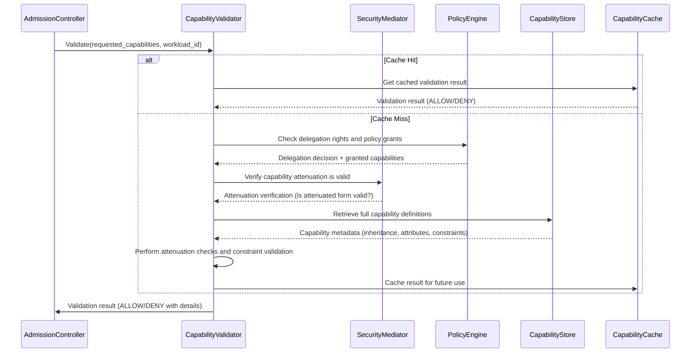
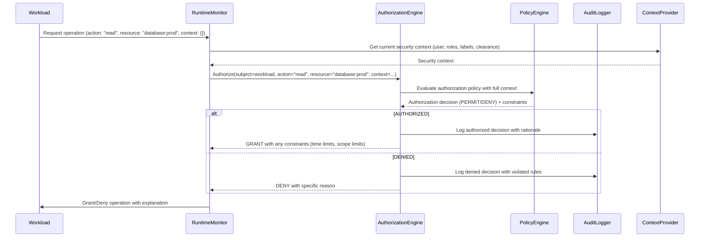
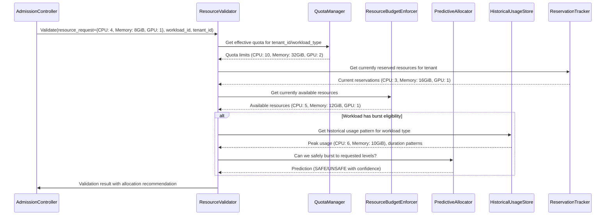
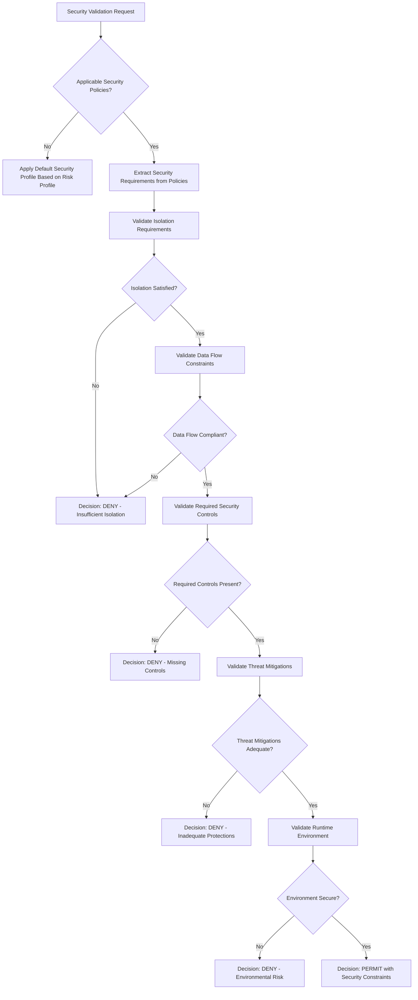
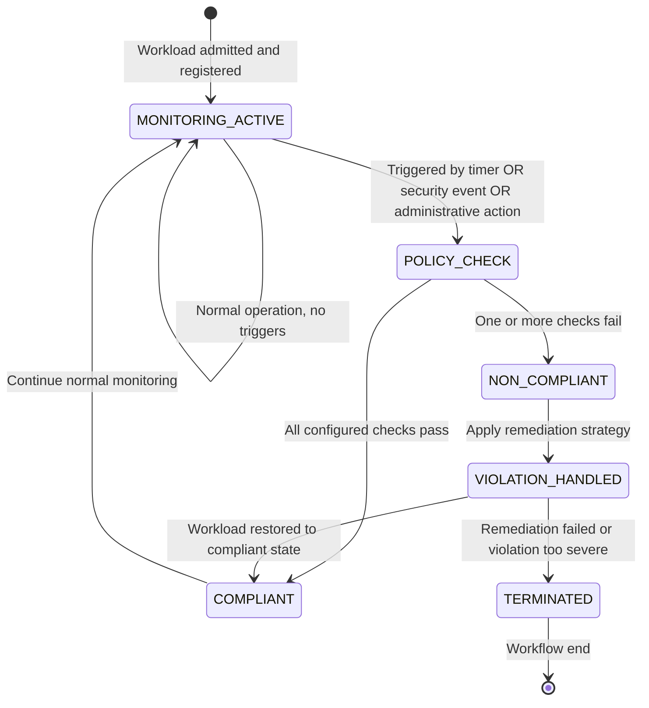
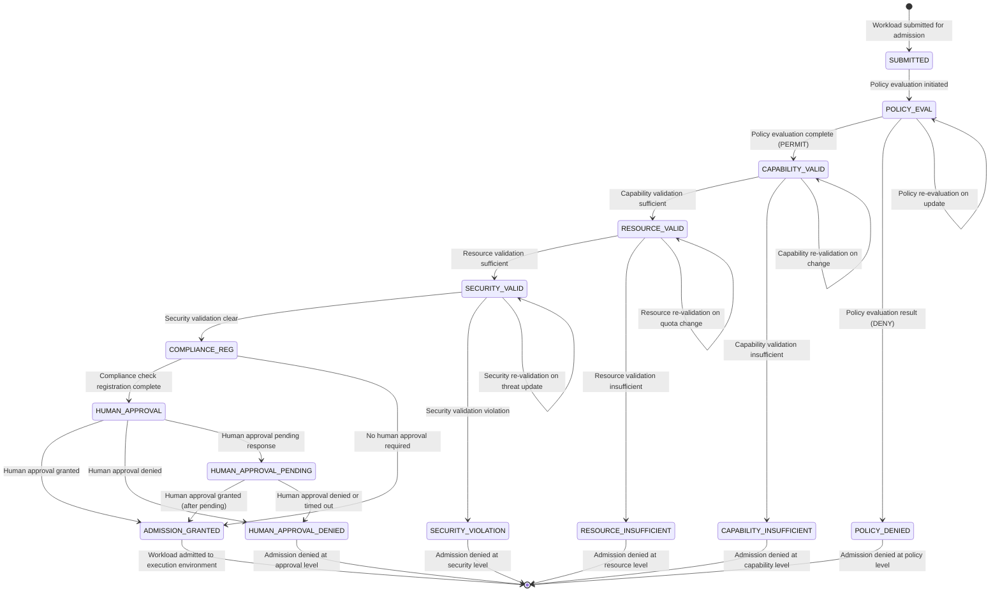
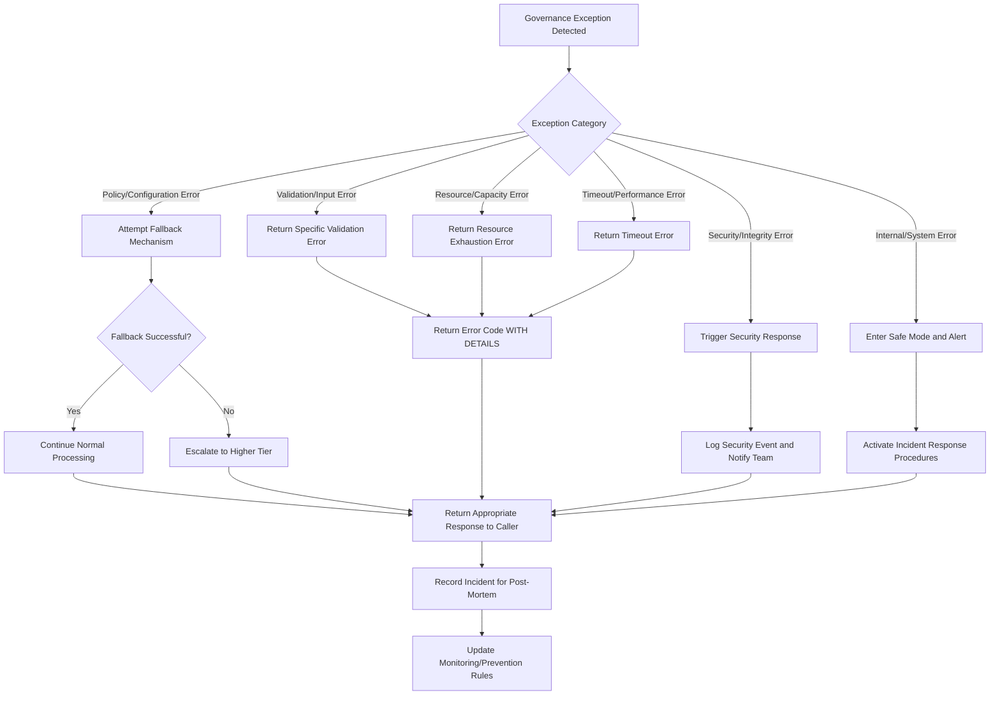

# 10.5 Governance & Admission Control

## Purpose

The Governance & Admission Control subsystem SHALL enforce security policies, resource constraints, and operational constraints before workload admission to ensure system integrity, resource guarantees, and compliance with organizational policies. It serves as the policy decision point that evaluates all workload admission requests against active governance policies, resource availability, and security constraints to determine whether admission should be permitted, denied, or deferred.

This subsystem is critical for maintaining the trustworthiness and reliability of the AI-OS by ensuring that:
- Only authorized workloads are admitted to execute
- Workloads receive only the resources and capabilities they are entitled to
- Security boundaries are preserved and cannot be bypassed
- Organizational policies and regulatory requirements are enforced
- System resources are allocated fairly and efficiently
- Audit trails are maintained for all security-relevant decisions

The governance subsystem implements a defense-in-depth strategy where multiple independent checks must all pass for admission to occur, preventing single points of failure from compromising system security.

## Governance Philosophy

The AI-OS governance model follows these core principles, which are derived from zero-trust security models, policy-based management frameworks, and proven practices in large-scale distributed systems:

### **Policy-as-Code**
Governance policies SHALL be expressed as executable code (policy-as-code) to ensure:
- **Versionability**: Policies can be versioned, branched, and merged like software code
- **Testability**: Policies can be unit tested, integration tested, and validated in CI/CD pipelines
- **Consistency**: Identical policy code produces identical decisions across all enforcement points
- **Auditability**: Policy changes are tracked through standard source control mechanisms
- **Repeatability**: Policy deployments are reproducible and can be rolled back if needed

Policy languages SHOULD be declarative and purpose-built for authorization decisions (e.g., Rego, XACML, or similar), avoiding general-purpose programming languages that could introduce unsafe constructs.

### **Default Deny**
By default, all admission requests SHALL be denied unless explicitly permitted by an applicable governance policy. This principle ensures that:
- No workload gains access by omission or oversight
- Newly discovered vulnerabilities or misconfigurations don't inadvertently grant access
- The principle of least privilege is upheld by requiring explicit permission
- Security boundaries have a clear default state of isolation
- The burden of proof lies with the requestor to demonstrate authorization

### **Least Privilege**
Workloads SHALL receive only the minimum capabilities and resources necessary to perform their intended function. This principle manifests in:
- Capability minimization: Only specific, required capabilities are granted
- Resource minimization: Only quantified, necessary resources are allocated
- Time-bound privileges: Permissions are granted for the minimum necessary duration
- Context-aware restrictions: Permissions vary based on risk factors (time, location, etc.)
- Privilege attenuation: Derived privileges are strictly less powerful than source privileges

### **Separation of Concerns**
Policy evaluation (decision logic) SHALL be strictly separated from policy enforcement (action taken), enabling:
- Independent evolution of policy languages and enforcement mechanisms
- Specialization of components (policy experts vs. security engineers)
- Testing of policy decisions without requiring full system deployment
- Alternative enforcement points for the same policy decisions
- Clear accountability chains for policy creation vs. enforcement

### **Continuous Compliance**
Compliance SHALL be verified continuously, not just at admission, through runtime compliance checks that detect policy violations during execution. This approach:
- Catches policy violations that occur after initial approval (privilege creep, runtime modifications)
- Detects attempts to bypass admission controls through exploitation
- Provides ongoing assurance rather than point-in-time validation
- Enables rapid response to emerging threats through dynamic policy updates
- Supports compliance frameworks requiring continuous monitoring (e.g., FedRAMP, HIPAA, PCI-DSS)

### **Auditability**
All governance decisions SHALL produce auditable records with sufficient detail for forensic analysis and compliance reporting. Audit records MUST include:
- Who/what made the request (identity context)
- What was requested (action/resource/context)
- When the decision was made (precise timestamp)
- Why the decision was made (policy references and rationale)
- What the decision was (permit/deny with specific constraints applied)
- How the decision was made (evaluation pathway and intermediate results)

This comprehensive auditing supports:
- Regulatory compliance demonstrations
- Security incident investigation and root cause analysis
- Policy effectiveness measurement and tuning
- Forensic reconstruction of security events
- Internal and external audit requirements

## Admission Control Pipeline

The admission control process follows a deterministic pipeline where each stage must succeed for admission to proceed. Failure at any stage results in immediate rejection with a specific error code. This layered approach ensures that no single point of failure can compromise security.

### 10.5.1 Admission Control Pipeline Stages

```mermaid
flowchart TD
    A[Workload Submission] --> B{Policy Evaluation}
    B -->|DENY| C[Access Denied]
    B -->|PERMIT| D[Capability Validation]
    D -->|INSUFFICIENT| E[Access Denied]
    D -->|SUFFICIENT| F[Resource Validation]
    F -->|INSUFFICIENT| G[Access Denied]
    F -->|SUFFICIENT| H[Security Validation]
    H -->|VIOLATION| I[Access Denied]
    H -->|CLEAR| J[Runtime Compliance Check Registration]
    J --> K[Human Approval Gate (if required)]
    K -->|APPROVED| L[Admission Granted]
    K -->|DENIED| M[Access Denied]
    K -->|PENDING| N[Admission Held]
    N -->|APPROVED| L
    N -->|DENIED| M
```

### 10.5.1.1 Pipeline Stage Definitions

| Stage | Purpose | Mandatory Architecture | Engineering Guidance | Configuration Options |
|-------|---------|------------------------|----------------------|------------------------|
| **Policy Evaluation** | Evaluate request against governance policies | SHALL use Policy Decision Point (PDP) to evaluate requests against active policy set | Policy evaluation latency SHOULD be < 10ms for 95% of requests | Policy evaluation timeout (default: 50ms), cache TTL (default: 60s), cache size (default: 5000 entries) |
| **Capability Validation** | Verify requested capabilities are valid and delegatable | SHALL validate capability chains against root of trust | Capability validation SHOULD use cached validation results | Capability cache size (default: 1000), validation timeout (default: 20ms), max delegation depth (default: 5) |
| **Resource Validation** | Verify sufficient resources exist for requested allocation | SHALL check against global resource quotas and current consumption | Resource validation SHOULD use predictive admission for burstable resources | Prediction window (default: 60s), burst lookback (default: 300s), confidence threshold (default: 0.95) |
| **Security Validation** | Verify request complies with security policies | SHALL enforce mandatory access controls and capability attenuation | Security validation SHOULD integrate with threat intelligence feeds | Timeout (default: 20ms), policy update frequency (default: 60s), threat feed refresh (default: 300s) |
| **Runtime Compliance Check Registration** | Register workload for ongoing compliance monitoring | SHALL register workload with compliance monitor upon admission | Registration SHOULD include workload-specific compliance probes | Check interval (default: 30s), burst size (default: 5), grace period (default: 5s), auto-remediation (default: true) |
| **Human Approval Gate** | Require manual approval for high-risk workloads | SHALL enforce human approval for workloads matching approval policy rules | Human approval SHOULD provide contextual information for decision | Timeout (default: 300s), escalation delay (default: 60s), reminder interval (default: 60s), max chain depth (default: 3) |

## Capability Validation

Capability validation ensures that workloads only receive capabilities they are entitled to and that capability chains are valid and properly attenuated. This is fundamental to maintaining the integrity of the capability-based security model.

### 10.5.2 Capability Validation Process



### 10.5.2.1 Capability Validation Requirements

- **Mandatory Architecture**:
  - The capability validator SHALL verify that each requested capability is either:
    - Explicitly granted by an applicable governance policy, OR
    - Derived through valid attenuation from a granted capability following the defined capability hierarchy
  - The capability validator SHALL reject requests for capabilities that would violate the principle of least privilege, considering both the requested capabilities and any implied capabilities
  - Capability validation SHALL be idempotent and deterministic: identical requests with identical policies and capability definitions produce identical results
  - Validation SHALL include checking for constrained capabilities (those with usage limitations, time bounds, or geographic restrictions)
  - The validator SHALL detect and reject attempts at privilege escalation through capability chaining or combination

- **Engineering Guidance**:
  - Capability validation SHOULD cache validation results for frequently used capability sets to reduce latency, with cache invalidation on policy or capability definition changes
  - Capability attenuation logic SHOULD follow a lattice-based model where child capabilities are strictly less privileged than parents, preventing accidental privilege escalation
  - Capability validation SHOULD integrate with the Security Mediator's capability attenuation functions to ensure consistent interpretation across the system
  - Validation SHOULD provide detailed reasoning for denials, indicating which specific capabilities were problematic and why (missing grant, invalid attenuation, constraint violation)
  - The validator SHOULD support capability wildcards and patterns for efficient policy expression while maintaining strict validation semantics

- **Configuration Options**:
  - Capability validation cache size (default: 1000 entries)
  - Capability validation cache TTL (default: 300 seconds)
  - Maximum delegation depth allowed (default: 5 levels) to prevent infinite chains
  - Cache behavior on policy change (INVALIDATE_ALL | INVALIDATE_AFFECTED | NONE)
  - Validation strictness level (STANDARD | STRICT | PERMISSIVE) affecting edge case handling

## Policy Evaluation

Policy evaluation is the core governance function that determines whether a workload admission request complies with organizational policies. This is where the actual "yes/no" decision is made based on codified organizational rules.

### 10.5.3 Policy Evaluation Engine

```mermaid
flowchart TD
    A[Policy Evaluation Request] --> B{Policy Cache Hit?}
    B -->|Yes| C[Return Cached Decision + Rationale]
    B -->|No| D[Identify Applicable Policies]
    D --> E[Retrieve Policy Definitions]
    E --> F[Extract Policy Conditions]
    F --> G[Evaluate Conditions Against Request]
    G --> H{All Conditions Satisfied?}
    H -->|Yes| I[Decision: PERMIT]
    H -->|No| J[Decision: DENY]
    I --> K[Collect Decision Rationale]
    J --> K
    K --> L[Cache Decision (if cacheable)]
    L --> M[Return Decision + Detailed Rationale]
```

### 10.5.3.1 Policy Evaluation Requirements

- **Mandatory Architecture**:
  - Policy evaluation SHALL produce identical decisions for identical inputs when the policy set is unchanged (determinism), ensuring predictable behavior
  - Policy evaluation SHALL provide an auditable rationale for each decision referencing specific policy rules, rule IDs, and evaluation outcomes
  - Policy evaluation SHALL deny by default when no applicable policy grants permission, implementing the default-deny security principle
  - Policy evaluation SHALL support policy versioning and atomic policy updates to enable safe policy evolution without service disruption
  - Evaluation SHALL be complete: all applicable policies MUST be considered before a final decision is rendered
  - Policy conflicts SHALL be resolved using a defined conflict resolution strategy (deny-overrides-permit by default)
  - The evaluation process SHALL be tamper-evident, with intermediate results available for auditing

- **Engineering Guidance**:
  - Policy evaluation SHOULD use a policy decision point (PDP) architecture with configurable policy sources (local file, remote server, database, etc.)
  - Policy evaluation SHOULD implement result caching for improved performance with intelligent cache invalidation on policy updates
  - Policy evaluation SHOULD support hierarchical policy evaluation (global → tenant → workspace → workload) with Inherit/Override/Remove semantics
  - Evaluation SHOULD short-circuit when a definitive deny is found in higher-priority policies to improve performance
  - The engine SHOULD provide policy tracing capabilities for debugging and optimization
  - Policy evaluation SHOULD distinguish between hard denials (security violations) and soft denials (policy violations) for different handling

- **Configuration Options**:
  - Policy evaluation cache size (default: 5000 entries)
  - Policy evaluation cache TTL (default: 60 seconds)
  - Policy evaluation timeout (default: 50ms) to prevent denial-of-service through complex policies
  - Maximum policy evaluation depth (default: 10 rule chaining levels) to prevent infinite recursion
  - Conflict resolution strategy (DENY_OVERRIDES_PERMIT | PERMIT_OVERRIDES_DENY | REQUIRE_CONSENSUS)
  - Enable short-circuit evaluation (default: true)
  - Policy tracking level (NONE | BASIC | DETAILED) for debugging

## Authorization Flow

Authorization determines whether a workload is permitted to perform specific actions on specific resources based on its granted capabilities and the prevailing security policy. This continues the security enforcement beyond initial admission into runtime operations.

### 10.5.4 Authorization Flow Process



### 10.5.4.1 Authorization Requirements

- **Mandatory Architecture**:
  - All runtime operations SHALL be subject to authorization checks via the authorization engine, creating a complete mediation boundary
  - Authorization decisions SHALL be based on the workload's effective capabilities (from admission) and the resource's security labels/classifications
  - Authorization SHALL enforce mandatory access controls (MAC) in addition to discretionary controls (DAC), preventing privilege escalation through ownership
  - Authorization decisions SHALL be immutable and auditable with sufficient detail for forensic reconstruction
  - The authorization engine SHALL validate that requested actions are valid for the target resource type (preventing category errors)
  - Authorization SHALL consider contextual factors (time of day, location, device state, threat level) when making decisions
  - Administrative actions (configuration changes, user management) SHALL require separate, higher-privilege authorization pathways

- **Engineering Guidance**:
  - Authorization SHOULD use attribute-based access control (ABAC) as the primary model with role-based access control (RBAC) and attribute-based access control (ABAC) as special cases, providing maximum flexibility
  - Authorization SHOULD cache authorization decisions for frequently accessed resource-action-context tuples with appropriate TTLs
  - Authorization SHOULD support oblivious transfer for privacy-preserving authorization checks in sensitive contexts
  - Enforcement SHOULD occur at the reference monitor level, ideally within the kernel or hypervisor for maximum protection
  - The system SHOULD provide privilege bracketing capabilities for temporary elevation with automatic reduction
  - Authorization SHOULD integrate with threat intelligence to dynamically adjust decisions based on current risk assessments

- **Configuration Options**:
  - Authorization cache size (default: 10000 entries)
  - Authorization cache TTL (default: 30 seconds)
  - Authorization evaluation timeout (default: 10ms)
  - Authorization audit sampling rate (default: 100% for security-relevant decisions, configurable for others)
  - Enable contextual factors in decisions (default: true)
  - Privilege bracketing duration limits (default: 300 seconds)
  - Required authentication strength for sensitive operations (MFA, certificate, etc.)

## Resource Validation

Resource validation ensures that workloads do not request more resources than are available or permitted by quota policies, preventing resource exhaustion attacks and ensuring fair sharing.

### 10.5.5 Resource Validation Process



### 10.5.5.1 Resource Validation Requirements

- **Mandatory Architecture**:
  - Resource validation SHALL enforce hard resource limits that cannot be exceeded by workloads, preventing denial-of-service through resource exhaustion
  - Resource validation SHALL consider both current availability and reserved resources for existing workloads to prevent overcommitment
  - Resource validation SHALL enforce hierarchical quotas (system → tenant → workload group → workload) with proper inheritance and override rules
  - Resource validation SHALL reject requests that would cause quota oversubscription at any level in the hierarchy
  - Validation SHALL cover all resource types: CPU, memory, storage, network bandwidth, GPU/accelerator units, file descriptors, processes, etc.
  - For renewable resources (CPU, bandwidth), validation SHALL consider rate limits over time windows, not just instantaneous availability
  - The validator SHALL provide granular feedback on which specific resources are insufficient and by how much

- **Engineering Guidance**:
  - Resource validation SHOULD incorporate predictive allocation for burstable workloads using historical usage patterns and statistical modeling
  - Resource validation SHOULD provide granular feedback on which specific resources are insufficient and suggested alternatives
  - Resource validation SHOULD support resource borrowing with automatic reclamation when higher-priority workloads need resources
  - Validation SHOULD differentiate between compressible resources (CPU, bandwidth) and incompressible resources (memory, storage) for different handling
  - The validator SHOULD consider resource fragmentation and allocation efficiency in its decisions
  - Validation SHOULD account for maintenance windows and scheduled downtimes when calculating available resources

- **Configuration Options**:
  - Resource validation prediction window (default: 60 seconds) for burst anticipation
  - Resource validation burst lookback period (default: 300 seconds) for historical analysis
  - Resource validation prediction confidence threshold (default: 0.95) for triggering burst approval
  - Resource borrowing enabled flag (default: true) with priority preemption levels
  - Minimum allocation quantum for different resource types to prevent fragmentation
  - Resource reclamation grace period (default: 30 seconds) before forcing release

## Security Validation

Security validation ensures that workloads comply with security policies including isolation requirements, data flow constraints, and threat prevention measures. This is where technical security controls are enforced beyond basic authorization.

### 10.5.6 Security Validation Process



### 10.5.6.1 Security Validation Requirements

- **Mandatory Architecture**:
  - Security validation SHALL enforce mandatory access controls based on security labels (e.g., SELinux, AppArmor, or equivalent MAC frameworks)
  - Security validation SHALL verify that requested isolation levels (process, container, VM, hardware-enforced) are available and applicable to the workload classification
  - Security validation SHALL prevent forbidden information flows as defined by security policies (Bell-LaPadula, Biba, or custom flow policies)
  - Security validation SHALL require applicable technical mitigations (ASLR, DEP, CFG, SEHOP, stack canaries) for workload execution based on risk assessment
  - Validation SHALL check for required security environment properties (no debugging tools present, secure boot enabled, etc.)
  - The validator SHALL ensure that requested privileges align with the workload's trust level and data classification
  - Security validation SHALL include checking for known vulnerable components in the workload's dependencies
  - Validation SHALL enforce data residency and sovereignty requirements where applicable

- **Engineering Guidance**:
  - Security validation SHOULD integrate with intrusion detection systems for runtime threat assessment and behavioral anomaly detection
  - Validation SHOULD support dynamic security policy updates based on threat intelligence feeds and vulnerability disclosures
  - Security validation SHOULD provide security risk scores (0-10) for approved workloads to inform monitoring intensity
  - The validator SHOULD check for compliance with security benchmarks (CIS, DISA STIG, etc.) relevant to the workload type
  - Validation SHOULD consider the workload's provenance and supply chain security when making decisions
  - Security validation SHOULD provide specific remediation guidance for denied requests to help users achieve compliance
  - The validation process SHOULD be designed to fail securely: when in doubt, deny access

- **Configuration Options**:
  - Security validation timeout (default: 20ms) to prevent denial-of-service through complex checks
  - Security policy update frequency (default: 60 seconds) for balancing responsiveness with stability
  - Threat intelligence feed refresh interval (default: 300 seconds) for threat awareness
  - Security risk score threshold for additional review (default: 7.0/10.0) triggering deeper analysis
  - Enable behavioral analysis component (default: true for high-security environments)
  - Required security scan freshness (default: 24 hours) for dependency vulnerability checks
  - Minimum entropy requirements for cryptographic operations (default: 128 bits)

## Runtime Compliance Checks

Runtime compliance checks ensure that admitted workloads continue to comply with governance policies throughout their execution lifecycle, providing ongoing assurance beyond the initial admission decision.

### 10.5.7 Runtime Compliance Monitoring



### 10.5.7.1 Runtime Compliance Requirements

- **Mandatory Architecture**:
  - All admitted workloads SHALL be registered for runtime compliance monitoring unless explicitly exempted by policy (with justification required)
  - Runtime compliance checks SHALL execute with sufficient frequency to detect policy violations before they cause harm or violate SLAs
  - The monitoring system SHALL be designed to detect both passive violations (misconfiguration) and active attacks (exploitation attempts)
  - Runtime compliance violations SHALL trigger predefined, graduated remediation actions (alert → throttle → suspend → terminate) based on severity
  - Runtime compliance monitoring SHALL not introduce more than 1% CPU overhead for compliant workloads under normal conditions
  - Monitoring SHALL continue uninterrupted during workload state transitions (suspend/resume, checkpoint/restore)
  - The compliance system SHALL maintain evidence of violations for forensic analysis and potential legal proceedings
  - Compliance checks SHALL be idempotent and safe to run repeatedly without affecting workload operation
  - Monitoring SHALL cover both the workload itself and its interaction with system resources and other workloads

- **Engineering Guidance**:
  - Runtime compliance checks SHOULD use lightweight probes (e.g., eBPF, performance counters) that minimize performance impact
  - Monitoring SHOULD differentiate between soft violations (warning only, log entry) and hard violations (requiring immediate action)
  - Compliance SHOULD incorporate workload-specific compliance profiles based on workload type (web server, database, AI training, etc.) and sensitivity
  - The system SHOULD support correlation of related events to reduce alert fatigue and provide meaningful incident context
  - Monitoring SHOULD include anomaly detection baselines to identify deviations from normal behavior patterns
  - Compliance verification SHOULD be distributed across multiple independent mechanisms to prevent single points of failure
  - The monitoring system SHOULD provide clear audit trails showing compliance status over time for each workload

- **Configuration Options**:
  - Compliance check interval (default: 30 seconds) for periodic validations
  - Compliance check burst size (default: 5 checks) for rapid response to triggers
  - Compliance violation grace period (default: 5 seconds) before applying remediation
  - Automatic remediation enabled flag (default: true) with manual override capability
  - Escalation threshold counts (default: 3 warnings → 1 action)
  - Resource usage monitoring sampling rate (default: 100% for critical metrics, 10% for others)
  - Anomaly detection sensitivity (default: 2 sigma) for behavioral monitoring
  - Evidence retention period for violations (default: 90 days) aligned with legal requirements

## Human Approval Gates

Human approval gates require manual intervention for workloads that meet specific risk criteria, providing organizational oversight for high-risk operations that cannot be fully automated.

### 10.5.8 Human Approval Process

```mermaid
sequenceDiagram
    participant AdmissionController
    participant ApprovalWorkflowEngine
    participant NotificationService
    participant EscalationManager
    participant AuditLogger
    human Approver1 as Primary Approver
    human Approver2 as Secondary Approver
    human Approver3 as Tertiary Approver

    AdmissionController->>ApprovalWorkflowEngine: Request human approval (workload_id, risk_score, justification)
    ApprovalWorkflowEngine->>NotificationService: Send initial approval request
    NotificationService->>Approver1: Deliver request with context and risk assessment
    alt Approver1 responds quickly
        Approver1->>NotificationService: Submit decision (APPROVE/DENY) with justification
        NotificationService->>ApprovalWorkflowEngine: Forward decision
    else No response within timeout
        NotificationService->>EscalationManager: Initiate escalation
        EscalationManager->>Approver2: Notify secondary approver
        alt Approver2 responds
            Approver2->>NotificationService: Submit decision
            NotificationService->>ApprovalWorkflowEngine: Forward decision
        else No response
            EscalationManager->>Approver3: Notify tertiary approver
            Alt Approver3 responds
                Approver3->>NotificationService: Submit decision
                NotificationService->>ApprovalWorkflowEngine: Forward decision
            else No response
                Approver3->>NotificationService: Auto-deny due to timeout
                NotificationService->>ApprovalWorkflowEngine: Forward DENY decision
            end
        end
    end
    ApprovalWorkflowEngine->>AuditLogger: Log complete approval chain with timestamps and justifications
    ApprovalWorkflowEngine->>AdmissionController: Return final approval decision
```

### 10.5.8.1 Human Approval Requirements

- **Mandatory Architecture**:
  - Human approval SHALL be required for workloads matching criteria defined in approval policies (based on risk, data sensitivity, resource impact, etc.)
  - Human approval requests SHALL provide sufficient context for informed decision making including risk assessment, alternatives considered, and mitigation plans
  - Human approval decisions SHALL be immutable and auditable with justification, timestamp, and approver identity
  - Human approval SHALL timeout after a configurable period, resulting in automatic denial to prevent indefinite blocking
  - The approval process SHALL support hierarchical escalation with clear timeout thresholds at each level
  - Approved workloads SHALL be bound to the specific conditions under which approval was granted (time limits, scope restrictions, etc.)
  - The system SHALL prevent approval shopping by tracking approval requests and decisions across the organization
  - Emergency procedures SHALL be defined for time-sensitive operations that cannot wait for standard approval cycles

- **Engineering Guidance**:
  - Human approval SHOULD provide risk assessment scores (using standards like CVSS or FAIR) and specific mitigation recommendations
  - Approval workflows SHOULD support delegation (with limits) and automatic escalation based on response times
  - The system SHOULD integrate with ticketing systems (Jira, ServiceNow, etc.) for audit trail continuity and workflow management
  - Approval interfaces SHOULD provide clear visualization of what is being approved and what constraints will be applied
  - The process SHOULD include feedback mechanisms to improve future automated decisions based on human judgments
  - Approval systems SHOULD support conditional approvals ("approve if X, Y, and Z conditions are met")
  - Historical approval data SHOULD be used to refine automated Decision Matrix thresholds and improve accuracy

- **Configuration Options**:
  - Human approval timeout (default: 300 seconds) for initial response
  - Human approval escalation delay (default: 60 seconds) between levels
  - Human approval reminder interval (default: 60 seconds) for pending requests
  - Maximum approval chain depth (default: 3 levels) to prevent infinite escalation
  - Escalation triggers (NO_RESPONSE | PARTIAL_APPROVAL | CONFLICTING_OPINIONS)
  - Required approval quorum (SINGLE | MAJORITY | UNANIMOUS) for multi-approver scenarios
  - Enable approval delegation (default: false) with depth limits
  - Emergency bypass procedure authorization levels (none | supervisor | security officer | executive)

## Governance State Machine

The governance state machine models the lifecycle of governance evaluation from submission to final admission decision, providing a formal model for behavior and enabling verification of correctness.

### 10.5.9 Governance State Machine



### 10.5.9.1 Governance State Machine Requirements

- **Mandatory Architecture**:
  - The governance state machine SHALL be deterministic with no race conditions in state transitions under specified concurrency constraints
  - Each state SHALL have defined entry and exit actions that are idempotent and safe to repeat
  - Invalid state transitions SHALL trigger governance error handling and potentially alert administrators
  - The state machine SHALL prevent infinite loops through bounded retry counts and timeout mechanisms
  - All state transitions SHALL be logged for debugging, auditing, and replay capabilities
  - The machine SHALL support pausing and resuming of evaluation for long-running assessments
  - Terminal states (ADMISSION_GRANTED and all DENY states) SHALL have no outgoing transitions except to the final state
  - The initial state (SUBMITTED) SHALL only be reachable from the start state [*]

- **Engineering Guidance**:
  - The governance state machine SHOULD be implemented as a deterministic finite automaton (DFA) with clearly defined transition conditions
  - State transitions SHOULD be logged with timestamps and contextual information for debugging and audit purposes
  - The state machine SHOULD support hot-reloading of state transition logic for policy updates without restart
  - Implementation SHOULD use a state pattern or state table approach for maintainability and clarity
  - The system SHOULD provide visualization capabilities for the current state of ongoing evaluations
  - State machine execution SHOULD be isolated from the main decision path to prevent performance impacts
  - Recovery procedures SHOULD be defined for corrupted or inconsistent state machine instances

- **Configuration Options**:
  - Maximum state transition attempts (default: 3) before failing the evaluation
  - State transition timeout (default: 100ms) to prevent hanging evaluations
  - State history retention count (default: 1000 entries) for debugging recent failures
  - Enable state machine tracing (default: false) for detailed execution analysis
  - Retry backoff algorithm (FIXED | LINEAR | EXPONENTIAL) with base delay
  - Enable state persistence (default: true) for recovery after system restart

## Admission Decision Matrix

The admission decision matrix defines the outcome based on combinations of evaluation results across different validation dimensions, providing a clear and comprehensive decision framework.

### 10.5.10 Admission Decision Matrix

| Policy Evaluation | Capability Validation | Resource Validation | Security Validation | Human Approval Required | Human Approval Result | Decision | Rationale Code |
|-------------------|----------------------|---------------------|---------------------|-------------------------|-----------------------|----------|----------------|
| DENY | * | * | * | * | * | DENY | POL001: Explicit policy denial |
| PERMIT | INSUFFICIENT | * | * | * | * | DENY | CAP002: Insufficient capabilities granted |
| PERMIT | SUFFICIENT | INSUFFICIENT | * | * | * | DENY | RES003: Insufficient resources available |
| PERMIT | SUFFICIENT | SUFFICIENT | VIOLATION | * | * | DENY | SEC004: Security policy violation |
| PERMIT | SUFFICIENT | SUFFICIENT | CLEAR | YES | DENIED | DENY | APP005: Human approval denied |
| PERMIT | SUFFICIENT | SUFFICIENT | CLEAR | YES | PENDING | PENDING | APP006: Waiting for human approval |
| PERMIT | SUFFICIENT | SUFFICIENT | CLEAR | YES | APPROVED | PERMIT | APP007: Approved with conditions |
| PERMIT | SUFFICIENT | SUFFICIENT | CLEAR | NO | * | PERMIT | AUT008: Automatic approval granted |
| PERMIT | SUFFICIENT | SUFFICIENT | CLEAR | YES | TIMEOUT | DENY | APP009: Human approval timeout |
| * | * | * | * | * | * | DENY | GEN010: Default deny (no matching rule) |

* = Any value (does not affect outcome for this row)
Rationale codes are used for efficient logging and automated processing

### 10.5.10.1 Decision Matrix Requirements

- **Mandatory Architecture**:
  - The admission decision matrix SHALL be the authoritative source for admission decisions
  - No admission decision SHALL deviate from the matrix without triggering a governance error and alert
  - The decision matrix SHALL be evaluated in the order specified (top to bottom, first match wins)
  - Deny decisions SHALL include the specific rationale code from the matching matrix row for automated processing
  - The matrix SHALL be complete: every possible combination of inputs MUST match exactly one row
  - Evaluation SHALL short-circuit: once a matching row is found, no further rows are evaluated
  - The matrix SHALL support future extension with additional columns while maintaining backward compatibility

- **Engineering Guidance**:
  - The decision matrix SHOULD be implemented as a decision engine with optimized matching algorithms
  - Decision matrix evaluation SHOULD be optimized for common case performance (frequent paths should be fast)
  - The decision matrix SHOULD support dynamic updates without requiring system restart through versioned rule sets
  - Implementation SHOULD provide clear tracing showing which row matched and why
  - The engine SHOULD support partial evaluation for caching intermediate results
  - Decision rendering SHOULD include human-readable explanations alongside codes for operational clarity
  - The system SHOULD provide metrics on decision distribution across matrix rows for tuning

- **Configuration Options**:
  - Decision matrix evaluation order (fixed per specification but validated at startup)
  - Default decision when no rule matches (DENY - cannot be changed without explicit policy)
  - Decision caching enabled flag (default: true) with invalidation on matrix change
  - Rationale code detail level (BASIC | DETAILED | DIAGNOSTIC) for logging verbosity
  - Enable decision explanation generation (default: true) for audit trails
  - Custom namespace prefix for rationale codes (default: "GOV") to prevent collisions

## Policy Evaluation Order

Policy evaluation follows a specific order to ensure consistent and predictable results when multiple policies may apply to a single request, preventing conflicts and ensuring deterministic behavior.

### 10.5.11 Policy Evaluation Hierarchy

Policies are evaluated in the following precedence order (highest to lowest priority):

1. **Explicit Deny Policies**: Policies that explicitly deny access regardless of other considerations. These represent absolute prohibitions that cannot be overridden.
   - Examples: "Deny all access from known malicious IP ranges", "Prohibit execution of unverified code", "Block all data exfiltration to unauthorized destinations"

2. **Implicit Deny Policies**: Policies that deny by absence of granting conditions. These implement the default-deny principle.
   - Examples: "Require explicit grant for production database access", "No access without multi-factor authentication", "Deny unless specifically allowed by role"

3. **Legal/Regulatory Policies**: Policies derived from legal or regulatory requirements that mandate specific behaviors.
   - Examples: "Encrypt all PII at rest and in transit (GDPR)", "Retain financial transaction logs for 7 years (SOX)", "Isolate healthcare data (HIPAA)"

4. **Organizational Security Policies**: Enterprise-wide security policies established by the security governance body.
   - Examples: "Require approval for all privileged operations", "Enforce least privilege for all service accounts", "Malware scanning for all incoming executables"

5. **Department/Division Policies**: Policies specific to organizational units with tailored requirements.
   - Examples: "Finance team may access payment systems after hours", "R&D can use external collaboration tools with approval", "HR data access restricted to HR personnel only"

6. **Project/Workload Policies**: Policies specific to specific projects, applications, or workload types.
   - Examples: "ML training jobs limited to GPU cluster during off-hours", "Web frontend must use WAF", "Batch jobs get lowest priority"

7. **Default Permit Policies**: Policies that grant access when no more restrictive policy applies (used sparingly and carefully).
   - Examples: "Allow read access to public documentation", "Permit internal service-to-service communication", "Grant basic user privileges to authenticated employees"

Within each category, policies are evaluated using a deny-overrides-permit algorithm where any applicable deny decision results in denial, regardless of permit decisions from other policies within the same category. Between categories, higher priority categories always override lower priority ones.

### 10.5.11.1 Policy Evaluation Order Requirements

- **Mandatory Architecture**:
  - Policy evaluation SHALL follow the specified hierarchy without deviation to ensure predictable behavior
  - Explicit deny policies SHALL always take precedence over permit policies at any level
  - Policy evaluation SHALL be deterministic given the same policy set and request
  - Policy conflicts within the same priority level SHALL be resolved using deny-overrides, not mitigate or other strategies
  - The evaluation process SHALL prevent policy shopping by evaluating ALL applicable policies, not stopping at first match
  - Policy metadata (category, priority, source) SHALL be preserved with each rule for auditing and debugging
  - The system SHALL detect and alert on circular policy dependencies that could cause evaluation loops

- **Engineering Guidance**:
  - Policy evaluation SHOULD use a policy combination algorithm that minimizes evaluation cost through intelligent ordering and short-circuiting
  - Policy evaluation SHOULD short-circuit when a deny decision is found in any higher-priority category to improve performance
  - Policy evaluation SHOULD provide policy identity information (ID, version, source) in decision rationales for traceability
  - The engine SHOULD support policy inheritance and overriding mechanisms for efficient policy management
  - Implementation SHOULD provide tools for detecting policy conflicts and redundancies during development
  - Policy evaluation SHOULD be optimized for incremental updates when only a few policies change

- **Configuration Options**:
  - Policy evaluation hierarchy (fixed per specification, validated for correctness)
  - Policy conflict resolution algorithm (DENY_OVERRIDES_PERMIT - cannot be changed)
  - Policy evaluation timeout (inherited from policy evaluation configuration)
  - Enable policy impact analysis (default: true) to show which policies contributed to decision
  - Minimum policy evidence threshold (default: 1) for considering a policy applicable
  - Policy combination strategy (CONSERVATIVE | BALANCED | PERMISSIVE) affecting close calls

## Exception Handling

Exception handling defines how the governance system responds to unexpected conditions during evaluation, ensuring the system remains secure and operational even when things go wrong.

### 10.5.12 Exception Handling Framework



### 10.5.12.1 Exception Handling Requirements

- **Mandatory Architecture**:
  - Governance exceptions SHALL NOT cause system instability or uncontrolled failure propagation that could create security vulnerabilities
  - All governance exceptions SHALL be logged with sufficient diagnostic information (timestamp, context, stack trace if safe) for diagnosis
  - Governance exceptions SHALL result in appropriate error responses to callers that clearly indicate the nature of the problem
  - Governance exception handling SHALL preserve audit capabilities even during failure scenarios to maintain accountability
  - The system SHALL fail securely: when uncertain about security state, default to the most protective position (deny access)
  - Exception handling SHALL not leak sensitive information through error messages that could aid attackers
  - Recovery procedures SHALL be tested and validated to ensure they restore proper security posture
  - The system SHALL distinguish between exploitable vulnerabilities and benign errors in its response strategy

- **Engineering Guidance**:
  - Governance SHOULD implement circuit breaker patterns for external dependencies (policy stores, validation services, etc.) to prevent cascade failures
  - Governance SHOULD provide graceful degradation when non-critical components fail (e.g., continue with cached policies if live policy service unavailable)
  - Governance SHOULD automate recovery from transient errors where possible (temporary network glitches, brief service blips)
  - Error responses SHOULD include actionable information for users when appropriate (without compromising security)
  - The system SHOULD implement adaptive timeout mechanisms that increase under load to prevent thrashing
  - Governance SHOULD distinguish between client errors (4xx) and server errors (5xx) in its responses
  - Recovery procedures SHOULD include validation steps to confirm restoration of proper function

- **Configuration Options**:
  - Policy error fallback behavior (USE_PREVIOUS | DENY_ALL | REQUIRE_MANUAL | FAIL_CLOSED)
  - Validation error handling strictness (LENIENT | STRICT | PARANOID) affecting what constitutes an error
  - Timeout duration for governance operations (default: 200ms) with adaptive adjustment under load
  - Error rate threshold for circuit breaker activation (default: 5% error rate over 1 minute window)
  - Circuit breaker timeout (default: 60 seconds) before attempting half-open test
  - Maximum retry count for transient errors (default: 3) with exponential backoff
  - Enable error sampling for high-volume scenarios (default: 1.0 for errors, 0.1 for successes)
  - Safe mode behavior (RESTRICTIVE | MONITOR_ONLY | SHUTDOWN) when system integrity is questionable

## Audit Requirements

Audit requirements ensure that all governance decisions and actions are properly recorded for compliance, forensics, and accountability, forming the immutable record of security decisions.

### 10.5.13 Audit Logging Requirements

- **Mandatory Architecture**:
  - All governance decisions (PERMIT/DENY/PENDING) SHALL be audit logged with the following minimum fields:
    * `event_id`: Globally unique identifier for correlation and deduplication
    * `timestamp`: ISO 8601 format with millisecond precision and timezone information
    * `principal`: Identity of the requester (user, service account, system component)
    * `action`: The specific action being requested (read, write, execute, configure, etc.)
    * `resource`: Target resource identifier with type and path/graph coordinates
    * `environment`: Deployment context (production, staging, development) and location attributes
    * `decision`: The final authorization decision (PERMIT, DENY, PENDING, ERROR)
    * `policy_version`: Identifier of the policy set in effect at decision time
    * `evaluation_path`: Sequence of evaluation stages traversed (for debugging)
    * `denial_reasons`: Specific reasons for denial if applicable (structured format)
    * `granted_authorities`: Specific permissions/rights granted if permitted (structured format)
    * `risk_assessment`: Quantitative risk score associated with the decision (0-100 scale)
    * `request_id`: Correlation ID for tracing the request through multiple systems
    
  - Audit log entries SHALL be tamper-evident through cryptographic mechanisms (hash chaining, digital signatures, or write-once storage)
  - Audit logging SHALL occur synchronously for security-relevant decisions (DENY for security reasons, certain grants)
  - Audit log integrity SHALL be verifiable independently of the governance system using standard cryptographic tools
  - The audit system SHALL provide tamper detection and alerting capabilities
  - Log retention SHALL comply with applicable legal and regulatory requirements (minimum 1 year for most regimes)
  - Audit logs SHALL be protected from unauthorized modification or deletion with equivalent security to the governance decisions they record

- **Engineering Guidance**:
  - Audit logging SHOULD use asynchronous logging for performance-critical paths with synchronous fallback for critical events
  - The audit system SHOULD support log forwarding to external SIEM systems for centralized analysis and correlation
  - Audit entries SHOULD include contextual information that aids in incident reconstruction (source IP, user agent, process tree, etc.)
  - Logging SHOULD implement intelligent rate limiting to prevent log flooding during attacks while preserving essential information
  - The audit subsystem SHOULD provide tamper-evident timestamps using hardware-backed cryptography where available
  - Log storage SHOULD implement write-once-read-many (WORM) semantics where feasible
  - Audit systems SHOULD support granular access controls for different audiences (auditors, investigators, operators)
  - The logging pipeline SHOULD include validation steps to detect and isolate corrupted log entries

- **Configuration Options**:
  - Audit log async/sync mode (default: SYNC for security events, ASYNC for operational auditing)
  - Audit log batch size (default: 100 entries) for balancing efficiency with latency
  - Audit log flush interval (default: 5 seconds) for timely persistence
  - Audit log retention period (default: 365 days) aligned with organizational policy
  - Audit log compression enabled (default: true) to reduce storage needs
  - Enable audit integrity verification (default: true) with scheduled checks
  - Audit sampling rate for high-volume scenarios (default: 1.0 for security events, 0.01 for others)
  - Minimum audit record size (default: 512 bytes) to prevent information hiding
  - Audit encryption at rest (default: true) with key rotation schedule

## Decision Logging

Decision logging captures detailed information about the governance decision-making process for analysis, debugging, and continuous improvement of the governance system itself.

### 10.5.14 Decision Log Contents

Decision logs SHALL include comprehensive details about how a decision was reached:

1. **Request Metadata**:
   - `request_id`: Unique identifier for tracing the request through all systems
   - `timestamp`: ISO 8601 with microsecond precision for accurate timing analysis
   - `originating_component`: Which system component initiated the governance check
   - `request_size_bytes`: Approximate size of the request for resource planning
   - `request_complexity_score`: Computed metric indicating evaluation difficulty
   - `received_at`: Timestamp when governance system received the request
   - `user_agent`: Client information if applicable (for web/API requests)
   - `source_network`: Network origin information for geographical and trust analysis

2. **Evaluation Context**:
   - `active_policy_version`: Exact identifier of the policy set used
   - `policy_source`: Origin of policies (local file, remote server, git commit hash, etc.)
   - `effective_principal`: Final identity after any translation/mapping (may differ from original)
   - `authentication_method`: How identity was verified (password, certificate, token, etc.)
   - `authorization_factors`: Additional factors considered (time of day, location, device posture)
   - `applicable_policy_count`: Number of policies that matched the request criteria
   - `applicable_policy_by_category`: Breakdown of matches by policy category
   - `environmental_factors`: Relevant context (system load, time, maintenance windows, etc.)
   - `threat_level_current`: Current organizational threat assessment at time of decision

3. **Evaluation Process**:
   - `evaluation_stages_sequence`: Ordered list of stages entered (Policy → Capability → Resource → etc.)
   - `stage_timing_milliseconds`: Time spent in each evaluation stage for performance analysis
   - `intermediate_results`: Outcomes at each stage (e.g., "Policy: PERMIT, Capabilities: PARTIAL")
   - `resources_consumed`: CPU cycles, memory allocation, IO operations during evaluation
   - `cache_performance`: Hit/miss rates for various caches (policy, capability, resource, etc.)
   - `validation_details`: Specific checks performed and their results (detailed for debugging)
   - `policy_references`: Exact policy rules that contributed to the decision with line numbers
   - `conflicting_indicators`: Any factors that pushed in opposite directions during evaluation
   - `uncertainty_factors`: Elements where confidence in the decision was less than complete

4. **Decision Details**:
   - `final_decision`: The ultimate authorization outcome (PERMIT/DENY/PENDING/ERROR)
   - `decision_confidence`: Quantitative measure of certainty in the decision (0-100)
   - `denial_specifics`: If denied, exactly what was missing or violated (structured detail)
   - `grant_scope`: If permitted, precisely what was authorized (resources, actions, time bounds)
   - `applied_constraints`: Specific limitations placed on granted rights and enrichments (e.g., time-of-day restrictions, geographic limits)
   - `required_conditions`: Any conditions that must remain true for the decision to remain valid
   - `alternative_considered`: Other options that were evaluated and why they were rejected
   - `policy_override_used`: Whether any emergency override procedures were invoked

5. **Post-Decision Information**:
   - `granted_authorities`: Complete list of permissions, capabilities, and resources allocated
   - `security_labels`: Applied sensitivity and integrity labels for MAC enforcement
   - `resource_allocations`: Specific quantities of each resource type granted
   - `monitoring_requirements`: Ongoing compliance checks scheduled for this workload
   - `review_schedule**: When this decision should be reevaluated (if time-bound)
   - `associated_conditions**: Other decisions or events that are linked to this one
   - `audit_cross_reference**: Corresponding audit log entry identifier for correlation

### 10.5.14.1 Decision Logging Requirements

- **Mandatory Architecture**:
  - Decision logging SHALL capture sufficient information to reproduce the decision process externally for validation
  - Decision logs SHALL be correlated with audit logs through shared request identifiers for end-to-end tracing
  - Decision logging SHALL not interfere with the governance decision process or significantly impact performance
  - Decision log retention SHALL comply with organizational data retention policies and legal requirements
  - The logging system SHALL protect sensitive information (passwords, keys, personal data) through field-level redaction or omission
  - Decision logs SHALL be protected from unauthorized access with controls commensurate with the sensitivity of the information
  - Log integrity SHALL be verifiable to ensure logs have not been tampered with post-generation
  - The system SHALL provide tools for secure log aggregation, analysis, and long-term archival

- **Engineering Guidance**:
  - Decision logging SHOULD be sampled for high-volume scenarios (e.g., 100% of denys, 1% of permits) to balance insight with overhead
  - Decision logging SHOULD include performance metrics (latency, resource consumption) for optimization opportunities
  - Decision logging SHOULD support structured formats (JSON, Protocol Buffers, Avro) for efficient machine processing
  - Logging SHOULD implement asynchronous processing with bounded queues to prevent blocking the decision path
  - The system SHOULD provide correlation tools to link decision logs with runtime monitoring data
  - Log schema evolution SHOULD be backward compatible to allow processing of historical logs with new tools
  - Decision logs SHOULD exclude personally identifiable information (PII) unless required for specific audit purposes and properly protected
  - The system SHOULD provide mechanisms for redacting or aggregating log data for different audience needs

- **Configuration Options**:
  - Decision logging sample rate (default: 1.0 for low-volume <100 req/sec, 0.1 for high-volume)
  - Decision logging asynchronous processing (default: true) with queue size monitoring
  - Decision log buffer size (default: 1000 entries) to absorb temporary logging backpressure
  - Decision log flush interval (default: 10 seconds) balancing latency with I/O efficiency
  - PII redaction patterns (configurable per deployment: regex patterns, dictionary replacement, etc.)
  - Enable decision explanation generation (default: true) for human-readable rationales
  - Maximum decision log entry size (default: 4KB) to prevent excessively large logs
  - Log compression algorithm (default: ZSTD) and level (default: 3) for storage efficiency
  - Retention policy: hot/warm/cold tiers (default: 7/30/365 days) with automated migration

## Runtime Invariants

Runtime invariants are properties that must always hold true for the governance system to function correctly and maintain its security guarantees.

### 10.5.15 Governance Runtime Invariants

| Invariant ID | Invariant Statement | Validation Mechanism | Severity |
|--------------|---------------------|----------------------|----------|
| **INV-GOV-1** | Policy evaluation is deterministic: identical inputs always produce identical outputs when policy set is unchanged | Property-based testing with randomized inputs across policy versions | Critical |
| **INV-GOV-2** | Default deny principle: absence of applicable permitting policy results in denial | Negative testing with empty policy set and various request types | Critical |
| **INV-GOV-3** | Policy evaluation completeness: all applicable policies are considered before decision | Code coverage analysis of policy evaluation paths with mutation testing | High |
| **INV-GOV-4** | Non-bypassability: no pathway exists to admit workload without governance evaluation | Penetration testing and control flow analysis of admission gateways | Critical |
| **INV-GOV-5** | Audit completeness: every governance decision produces an audit log entry | Audit log tracing and gap analysis with mutation testing | High |
| **INV-GOV-6** | Policy immutability during evaluation: policy set cannot be modified during evaluation of a single request | Runtime protection mechanisms and version checking | High |
| **INV-GOV-7** | Principle of least privilege: granted privileges are minimal necessary for requested functionality | Privilege analysis through differential permission granting | High |
| **INV-GOV-8** | Decision accountability: every decision can be traced to specific policy rules and evidence | Decision lineage tracking with specific policy rules and evidence | Decision lineage tracking with tamper-evident logging | High |
| **INV-GOV-9** | Resource conservation: granted resources never exceed requested resources plus approved bursts | Resource allocation tracking against claims with violation detection | Medium |
| **INV-GOV-10** | Security monotonicity: granted privileges never exceed those implied by identity and role | Privilege escalation testing with monitoring for privilege creep | Critical |
| **INV-GOV-11** | Error containment: governance errors do not compromise security boundaries or allow privilege escalation | Fault injection testing with exploit attempt validation | Critical |
| **INV-GOV-12** | Temporal consistency: time-based policies evaluate correctly against system clock | Time manipulation testing with known boundary conditions | Medium |
| **INV-GOV-13** | Identity integrity: verified identity cannot be forged or altered during evaluation process | Cryptographic verification testing with attempted spoofing | Critical |
| **INV-GOV-14** | Resource accountability: all allocated resources are properly tracked and accounted for | Resource reconciliation audits with surprise inspections | Medium |
| **INV-GOV-15** | Decision immutability: once made, a governance decision cannot be altered or retracted except through defined processes | Attempted modification detection with logging | High |

### 10.5.15.1 Invariant Enforcement Requirements

- **Mandatory Architecture**:
  - All governance runtime invariants SHALL be continuously monitored during operation through automated checks
  - Invariant violations SHALL trigger immediate alerting to security operations and potentially initiate safe state transitions
  - Invariant validation mechanisms SHALL have negligible performance impact (<0.1% overhead) to avoid creating performance bottlenecks
  - Invariant violation evidence SHALL be preserved in a secure, tamper-evident format for forensic analysis and potential legal proceedings
  - The system SHALL provide mechanisms for administrators to query invariant compliance status on demand
  - Critical invariant violations (those that could compromise security) SHALL trigger automated incident response procedures
  - Invariant monitoring SHALL cover both the governance decision path and administrative/management interfaces
  - The validation system SHALL be designed to avoid false positives that could trigger unnecessary alerts or actions
  - Invariant checks SHALL be applied consistently across all deployment environments (dev, test, prod) with appropriate sensitivity

- **Engineering Guidance**:
  - Governance SHOULD use lightweight runtime verification techniques (e.g., eBPF, hardware performance counters) for invariant checking
  - Governance SHOULD separate invariant monitoring from the critical decision path where possible to avoid performance impact
  - Governance SHOULD provide configurable invariant checking intensity based on deployment profile (development vs. production)
  - The system SHOULD include invariant verification in automated test suites to catch regressions early
  - Monitoring tools SHOULD provide clear visualization of invariant compliance over time for trend analysis
  - When practical, invariants SHOULD be enforced through design (e.g., using type systems) rather than runtime checks
  - The system SHOULD provide root cause analysis assistance when invariant violations are detected
  - Invariant validation SHOULD be designed to work correctly even when under attack or under unusual load conditions

- **Configuration Options**:
  - Invariant checking enabled (default: true for all environments)
  - Invariant check sampling rate (default: 1.0 for critical invariants, 0.1 for informational ones)
  - Invariant violation action (ALERT_ONLY | SAFE_MODE | SHUTDOWN | CUSTOM_SCRIPT)
  - Invariant evidence retention period (default: 30 days) aligned with incident response requirements
  - Enable invariant trending and prediction (default: false) for capacity planning
  - Minimum time between invariant checks (default: 1000ms) to prevent overhead buildup
  - Critical invariant threshold (default: 3 consecutive failures) before escalating response
  - Invariant check jitter (default: ±10%) to prevent synchronized loading effects

## Cross-Part Consistency

Governance & Admission Control must maintain consistency with other parts of the AI-OS architecture to ensure coherent system behavior and prevent security gaps or functional conflicts.

### 10.5.16 Cross-Part Consistency Requirements

| Related Part | Interface/Consistency Point | Consistency Requ Mechanism |
|--------------|-----------------------------|----------------------------|
| **Part 1 (Core Architecture)** | Execution contracts and capability model | Governance must enforce the core capability model and execution contracts defined in Part 1 | Capability validation against core model definitions; execution contract verification during admission |
| **Part 2 (EventBus)** | Event schema and delivery guarantees | Governance decisions must produce events conforming to Part 2 schemas with guaranteed delivery for security event ordering for related decisions | Event validation against Part 2 schemas; sequencing number verification; delivery acknowledgment checks |
| **Part 3 (Security)** | Authentication, authorization, and secret management | Governance must enforce Part 3 security policies and utilize its mechanisms for secrets and identity validation | Integration with PDP/PEP; secret injection validation; token verification; certificate validation |
| **Part 4 (Memory)** | Memory allocation and protection models | Governance must enforce memory quotas and protection domains from Part 4, preventing memory-based attacks | Resource validation against memory quotas; isolation profile validation; memory access pattern monitoring |
| **Part 5 (Learning)** | Observation hooks and adaptation boundaries | Governance must ensure learning observation does not compromise security or determinism, and that model updates follow policy | Validation of observation hook permissions; non-interference verification; model change approval workflow |
| **Part 6 (Infrastructure)** | Resource abstraction and provisioning | Governance must enforce infrastructure quotas and utilization policies, preventing resource starvation attacks | Resource validation against infrastructure limits; quota enforcement verification; utilization monitoring |
| **Part 7 (Plugins)** | Plugin security and extension points | Governance must validate plugin requests against security policies and extension contracts, preventing plugin-based escalation | Plugin request validation against policies; extension point authorization; sandbox verification |
| **Part 8 (AI Core Services)** | Workload types and service contracts | Governance must enforce policies specific to workload types from Part 8, ensuring AI-specific risks are addressed | Workload-type policy application; service contract validation; API usage monitoring |
| **Part 9 (Agent Management)** | Task submission and lifecycle interfaces | Governance must mediate all task submissions and lifecycle operations from Part 9, ensuring end-to-end policy enforcement | Pre-submission governance checks; lifecycle event validation; state transition approval |
| **Part 10 (Self)** | Runtime invariants and execution context model | Governance must enforce Part 10 runtime invariants and execution context constraints, ensuring internal consistency | Invariant validation during admission; context property validation; state machine compliance checking |

### 10.5.16.1 Cross-Part Consistency Enforcement

- **Mandatory Architecture**:
  - Governance SHALL enforce consistency with all related parts as specified in the matrix above through integrated validation checks
  - Cross-part consistency violations SHALL be treated as governance errors resulting in denial, with clear error identification
  - Governance SHALL provide clear error messages identifying the specific consistency violation and relevant parts for troubleshooting
  - Cross-part consistency validation SHALL occur during the appropriate governance evaluation stage to fail fast
  - The system SHALL maintain a consistency verification log that can be audited independently
  - Governance SHALL provide mechanisms for administrators to query cross-part compliance status on demand
  - Consistency validation SHALL be designed to work correctly even when related parts are undergoing updates or maintenance
  - The validation system SHALL distinguish between specification violations and implementation bugs in its reporting

- **Engineering Guidance**:
  - Governance SHOULD cache cross-part validation results where appropriate and safe (e.g., static validation of unchanging contracts)
  - Governance SHOULD provide extension points for part-specific validation logic to accommodate future parts or customizations
  - Governance SHOULD validate cross-part consistency in dependency order to enable early failure detection and prevent cascading issues
  - The system SHOULD provide traceability links showing how governance decisions relate to requirements in other parts
  - Validation SHOULD be designed as pluggable modules to allow for third-party validation tools or custom organizational checks
  - Governance SHOULD implement monitoring for consistency drift over time between related parts
  - Consistency validation results SHOULD be included in decision logs for comprehensive auditing

- **Configuration Options**:
  - Cross-part validation enabled (default: true)
  - Cross-part validation timeout (default: 50ms) to prevent delays in decision making
  - Cross-part validation caching (default: true for static validations like schema checks)
  - Strictness level (STANDARD | STRICT | PERMISSIVE) affecting how closely adherence is measured
  - Enable cross-part validation tracing (default: false) for debugging complex consistency issues
  - Validation failure handling (FAIL_CLOSED | FAIL_OPEN | REQUIRED_MANUAL_REVIEW)
  - Maximum validation retry count (default: 2) for transient failures
  - Enable consistency trending (default: true) to detect gradual divergence between parts
  - Consistency check sample rate (default: 1.0 for critical validations, 0.1 for others)

## Policy Testing and Validation

To ensure the correctness and reliability of governance policies, the AI-OS provides comprehensive testing and validation capabilities for policy authors and administrators.

### 10.5.17 Policy Testing Framework

The policy testing framework enables automated validation of policy behavior before deployment to production environments.

#### 10.5.17.1 Unit Testing Policies

Policy authors SHALL be able to write unit tests for individual policy rules:
```rego
# test_time_based_access.rego
package ai_os.admission.test

import data.policies.working_hours

test_allowed_during_business_hours {
    input := {
        "action": "access",
        "resource": {"type": "database"},
        "timestamp": "2026-08-05T14:30:00Z"  # 2:30 PM
    }
    allow := working_hours.allow(input)
    assert True == allow
}

test_denied_outside_business_hours {
    input := {
        "action": "access",
        "resource": {"type": "database"},
        "timestamp": "2026-08-05T02:30:00Z"  # 2:30 AM
    }
    allow := working_hours.allow(input)
    assert False == allow
}
```

#### 10.5.17.2 Integration Testing

Integration tests SHOULD validate policy interactions and end-to-end admission flows:
```yaml
# test_integration.yaml
test_suite: admission_control_integration
tests:
  - name: "ML training job approval workflow"
    given:
      - policy_set: "ml_training_policies_v2"
      - workload:
          type: "ml_training"
          resources: {gpu: 4, memory: "32GiB"}
          security_context: {privileged: false}
      - principal: {team: "research", clearance_level: 3}
    when:
      - action: "submit_workload"
    then:
      - decision: "PERMIT"
      - granted_resources: {gpu: 4, memory: "32GiB"}
      - required_approvals: []
```

#### 10.5.17.3 Chaos Testing for Policies

The system SHOULD support chaos engineering experiments to validate policy resilience:
- Policy store unavailability during evaluation
- Network partitions affecting policy distribution
- Concurrent policy updates during evaluation
- Malformed policy injection attempts

#### 10.5.17.4 Policy Validation Requirements

- **Mandatory Architecture**:
  - Policy validation SHALL detect syntax errors before policy deployment
  - Policy validation SHALL detect semantic contradictions (e.g., rules that always evaluate to false)
  - Policy validation SHALL detect circular dependencies between policies
  - Policy validation SHALL verify policy completeness for common use cases
  
- **Engineering Guidance**:
  - Policy validation SHOULD provide counterexamples for failing tests
  - Policy validation SHOULD support property-based testing for policy properties
  - Policy validation SHOULD integrate with CI/CD pipelines for automated validation
  - Policy validation SHOULD generate coverage reports showing which rules are tested

### 10.5.18 Policy Deployment and Lifecycle Management

Proper policy lifecycle management ensures secure and reliable policy evolution.

#### 10.5.18.1 Promotion Pipeline

Policies SHOULD flow through a promotion pipeline:
```
Development → Testing → Staging → Production
```
Each stage SHALL have increasingly strict validation requirements:
- Development: Basic syntax validation only
- Testing: Syntax + unit + integration tests
- Staging: Full validation + performance testing
- Production: All validations + manual approval for high-risk changes

#### 10.5.18.2 Rollback Mechanisms

The system SHALL provide reliable policy rollback capabilities:
- Atomic policy set updates (all-or-nothing)
- Point-in-time policy set recovery
- Automatic rollback on detected degradation
- Manual rollback capability for administrators

#### 10.5.18.3 Policy Distribution

Policy distribution SHALL ensure consistency across enforcement points:
- Consistent hashing for policy set distribution
- Version vectors for detecting inconsistencies
- Gossip protocol for eventual consistency
- Read-repair mechanisms for correcting discrepancies

## Enhanced Exception Handling

Building upon the basic exception handling framework, the governance system provides sophisticated error handling and recovery mechanisms.

### 10.5.19 Cascading Failure Prevention

To prevent local failures from escalating into system-wide outages:

#### 10.5.19.1 Adaptive Load Shedding

Under extreme load, the governance system SHOULD implement adaptive load shedding:
- Monitor queue depths and processing latencies
- Automatically increase denial rates for lower-priority requests
- Preserve capacity for critical system operations
- Gracefully restore normal operation when load subsides

#### 10.5.19.2 Dependency Circuit Breakers

External dependencies SHALL be protected by circuit breakers:
- Track success/failure rates for each dependency
- Open circuit when failure rate exceeds threshold
- Half-open state for testing recovery
- Configurable timeout and retry parameters

#### 10.5.19.3 Bulkhead Isolation

Different types of governance operations SHALL be isolated:
- Separate resource pools for policy evaluation vs. audit logging
- Thread pool isolation for different validation stages
- Memory limits per operation type to prevent exhaustion
- Priority-based scheduling for critical operations

### 10.5.20 Forensic Analysis Capabilities

When incidents occur, the system SHALL provide robust forensic capabilities:

#### 10.5.20.1 Detailed Execution Tracing

For debugging complex policy evaluations:
- Step-by-step execution trace of policy evaluation
- Variable bindings at each evaluation step boundaries and transitions
- Performance metrics for each step

#### 10.5.20.2 Policy Diffing

For understanding policy changes:
- Show exact differences between policy versions
- Highlight semantic changes, not just syntactic differences
- Predict impact of changes on existing workloads
- Suggest mitigations for breaking changes

#### 10.5.20.3 Replay Capability

For incident investigation:
- Capture and store evaluation inputs for replay
- Replay evaluations with different policy versions
- Time-travel debugging for policy evaluation
- Correlate with system events and metrics

## Comprehensive Audit Framework

Expanding upon the basic audit requirements, the governance system provides a comprehensive auditing framework.

### 10.5.21 Immutable Audit Trail

To ensure audit integrity and non-repudiation:

#### 10.5.21.1 Write-Once Storage

Audit logs SHALL be stored in write-once storage:
- Cryptographic chaining of log entries
- Regular merkle root publication to immutable storage
- Integration with blockchain or WORM storage where available
- Regular integrity verification challenges

#### 10.5.21.2 Role-Based Audit Access

Different stakeholders SHALL have appropriate audit access:
- Auditors: Read-only access to complete audit trail
- Investigators: Enhanced access with correlation tools
- Operators: Limited access for troubleshooting
- Executives: Aggregated views and dashboards
- System: Append-only access for logging

#### 10.5.21.3 Automated Compliance Reporting

The system SHALL generate compliance reports automatically:
- Scheduled reports for standard frameworks (SOX, HIPAA, GDPR, etc.)
- Ad-hoc report generation for specific inquiries
- Evidence packaging for audit submissions
- Gap analysis and remediation recommendations

### 10.5.22 Privacy-Preserving Auditing

To balance audit requirements with privacy concerns:

#### 10.5.22.1 Selective Disclosure

Audit systems SHOULD support selective disclosure:
- Prove compliance without revealing sensitive details
- Zero-knowledge proofs for compliance claims
- Redaction of personally identifiable information
- Aggregation techniques for statistical disclosure

#### 10.5.22.2 Differential Privacy

For analytical use of audit data:
- Statistical noise injection to prevent re-identification
- Privacy budget tracking and enforcement
- Utility-preserving transformations for analysis
- Transparency about privacy guarantees provided

## Advanced Decision Logging

Building upon the basic decision logging requirements, the system provides advanced logging capabilities.

### 10.5.23 Structured Decision Metadata

To enable sophisticated analysis and automation:

#### 10.5.23.1 Standardized Taxonomies

Decision logs SHOULD use standardized taxonomies:
- Action taxonomies (CRUD, administrative, operational)
- Resource taxonomies (by type, sensitivity, criticality)
- Risk taxonomies (threat categories, impact levels)
- Outcome taxonomies (by decision type, rationale)

#### 10.5.23.2 Lineage Tracking

To enable impact analysis and root cause investigation:
- Decision-to-decision linkage for chained operations
- Policy version lineage showing evolution
- Workflow correlation for multi-step operations
- External event correlation (system metrics, alerts)

#### 10.5.23.3 Predictive Analytics

Decision logs SHOULD enable predictive capabilities:
- Trend analysis for predicting future decisions
- Anomaly detection for unusual decision patterns
- Risk scoring based on historical decisions
- Optimization suggestions for policy improvements

### 10.5.24 Real-Time Decision Monitoring

For operational awareness and immediate response:

#### 10.5.24.1 Stream Processing

Decision logs SHOULD be available as real-time streams:
- Complex event processing for pattern detection
- Real-time alerting for anomalous decisions
- Dashboard updates for operational visibility
- Integration with SIEM systems for correlation

#### 10.5.24.2 Adaptive Sampling

To balance insight with overhead:
- Dynamic adjustment of sampling rates based on workload
- Increased sampling during incidents or anomalies
- Persistent storage of interesting decision samples
- Feedback loop to refine sampling criteria

## Enhanced Runtime Invariants

Expanding upon the basic runtime invariants, the system provides additional safety guarantees.

### 10.5.25 Temporal Safety Properties

Beyond basic invariants, the system enforces temporal properties:

#### 10.5.25.1 Bounded Response Times

The system SHALL guarantee response time bounds:
- 99th percentile policy evaluation latency < 100ms
- 99.9th percentile policy evaluation latency < 500ms
- Maximum decision latency under any circumstances < 2s
- Graceful degradation when approaching limits

#### 10.5.25.2 Resource Boundedness

The system SHALL guarantee resource usage bounds:
- Memory usage bounded by configurable limits
- CPU usage bounded by configurable limits
- File descriptor usage bounded by configurable limits
- Network usage bounded by configurable limits

#### 10.5.25.3 Progress Guarantees

The system SHALL guarantee liveness properties:
- No indefinite blocking in policy evaluation
- Eventual consistency for distributed policy stores
- Bounded time for policy propagation
- Guaranteed termination for all evaluation paths

### 10.5.26 Self-Healing Properties

The system SHALL exhibit self-healing characteristics:

#### 10.5.26.1 Automatic Recovery

From common failure modes:
- Automatic recovery from policy store corruption detection and repair
  - Automatic recovery from cache corruption
  - Self-healing of inconsistent state replicas
  - Automatic restart of hung evaluation threads

#### 10.5.26.2 Degraded Mode Operation

When components fail:
- Continued operation with cached policies when policy store unavailable
- Reduced functionality mode when non-critical components fail
- Graceful performance degradation rather than sudden failure
- Clear indication of degraded mode to operators

#### 10.5.26.3 Predictive Failure Detection

To prevent failures before they occur:
- Trend analysis of performance metrics
- Early warning signs of resource exhaustion
- Prediction of policy store failures based on access patterns
- Proactive maintenance recommendations

## Comprehensive Cross-Part Consistency

Expanding upon the basic consistency requirements, the system provides comprehensive consistency guarantees.

### 10.5.27 Continuous Conformance Monitoring

Beyond point-in-time checks, the system provides continuous assurance:

#### 10.5.27.1 Drift Detection

Continuous monitoring for specification drift:
- Baseline establishment for normal behavior
- Statistical process control for detecting deviations
- Root cause analysis assistance for detected drift
- Automatic correction suggestions for common drift patterns

#### 10.5.27.2 Conformance Testing

Automated conformance testing against specifications:
- Property-based testing against formal specifications
- Model checking for critical safety properties
- Fuzzing for edge case discovery
- Conformance reporting for compliance audiences

#### 10.5.27.3 Interface Validation

Validation of interfaces between parts:
- Contract testing for API compatibility
- Schema validation for message formats
- Behavior verification for protocol implementations
- Performance validation for interface contracts

### 10.5.28 Consistent State Management

Ensuring coherent state across parts:

#### 10.5.28.1 Distributed Transactions

For operations spanning multiple parts:
- Saga patterns for long-running transactions
- Compensating transactions for rollback
- Idempotency guarantees for retry safety
- Deadlock detection and resolution

#### 10.5.28.2 Eventual Consistency Patterns

For eventually consistent scenarios:
- Conflict-free replicated data types (CRDTs)
- Version vectors for conflict detection
- Application-specific conflict resolution
- Convergence guarantees and bounds

#### 10.5.28.3 State Synchronization

Mechanisms for keeping state in sync:
- Change data capture for state propagation
- Read-repair mechanisms for inconsistency correction
- Anti-entropy procedures for replica synchronization
- Consistency verification protocols

## Performance Optimization and Scaling

To ensure the governance system performs well under load:

### 10.5.29 Horizontal Scaling

The system SHALL scale horizontally:
- Stateless policy evaluation nodes
- Sharded policy storage for distribution
- Load balancing across evaluation instances
- Automatic scaling based on workload metrics

### 10.5.30 Caching Strategies

Multi-layered caching for performance:
- L1 cache: Local, per-thread caches for hot policies
- L2 cache: Shared, in-memory caches for warm policies
- L3 cache: Distributed caches for warm policy sets
- Cache warming strategies for predictable workloads
- Intelligent cache invalidation based on dependencies

### 10.5.31 Load Management

Intelligent load handling under stress:
- Adaptive concurrency control based on system load
- Request prioritization and queuing strategies
- Load shedding policies for emergency situations
- Graceful degradation when resources are constrained

## Future Extensibility

To ensure the governance system can evolve with changing requirements:

### 10.5.32 Plugin Architecture

Extensible validation and enforcement mechanisms:
- Policy evaluation plugins for custom logic
- Validation plugins for specialized checks
- Enforcement plugins for novel mechanisms
- Audit plugins for specialized reporting
- Standardized plugin contracts and lifecycles

### 10.5.33 Policy Language Agnosticism

Support for multiple policy languages:
- Pluggable policy evaluation engines
- Common intermediate representation for policies
- Translation layers between policy languages
- Feature flags for gradual migration

### 10.5.34 Integration Hooks

Extension points for system integration:
- Pre-evaluation hooks for contextual enrichment
- Post-evaluation hooks for custom processing
- Error handling hooks for specialized responses
- Audit hooks for specialized logging
- Metrics hooks for custom instrumentation

## Conclusion

The Governance & Admission Control subsystem provides a comprehensive, robust, and extensible framework for enforcing security, resource, and operational policies in the AI-OS. Through its multi-layered approach combining deterministic admission control, continuous compliance monitoring, and comprehensive auditing, the system ensures that workloads operate within defined boundaries while maintaining the flexibility needed for dynamic environments.

The subsystem's design emphasizes defense-in-depth, with multiple independent checks that must all succeed for admission to occur. This prevents single points of failure from compromising security. The clear separation of policy evaluation from enforcement enables independent evolution of policy languages and enforcement mechanisms, while comprehensive auditability ensures accountability and facilitates forensic analysis.

Key strengths of the governance subsystem include:
- Deterministic behavior ensuring predictable outcomes
- Default-deny principle providing secure default posture
- Comprehensive policy evaluation with multi-layered validation
- Runtime compliance monitoring ensuring ongoing adherence
- Immutable audit trails providing forensic evidence
- Sophisticated exception handling maintaining system stability
- Extensible architecture accommodating future requirements

By providing a principled foundation for trustworthy AI systems, the governance subsystem enables the AI-OS to balance the competing demands of security, usability, performance, and compliance. Its design acknowledges that effective governance is not a static configuration but an ongoing process requiring continuous validation, adaptation, and vigilance to maintain effectiveness against evolving threats and changing organizational requirements.

The subsystem's comprehensive approach to testing, validation, monitoring, and extensibility ensures that it remains effective and relevant throughout the system's lifetime, adapting to new threats, regulatory requirements, and organizational needs while maintaining the core guarantees that make it a trustworthy foundation for AI workload execution.