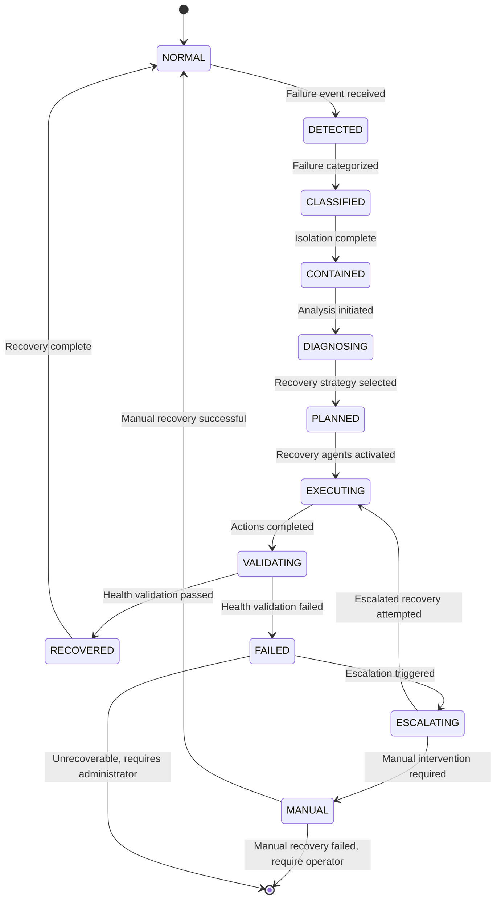

# 10.6 Failure Detection & Recovery

This section specifies the runtime fault management architecture for the AI Operating System (AI-OS). It defines failure detection mechanisms, health monitoring, recovery strategies, and fault containment principles to ensure system resilience and availability.

## 10.6.1 Failure Philosophy

### Architecture
The AI-OS adopts a "fail-stop" philosophy where detected failures trigger immediate containment and recovery actions rather than continuing in a degraded state that could propagate errors. Failures are treated as state transitions in the runtime state machine, with recovery actions designed to restore invariants and service guarantees. The philosophy emphasizes:
- Early detection over late detection
- Containment over propagation
- Automated recovery over manual intervention where possible
- Preservation of safety properties during recovery

### Operational Guidance
Operators should configure detection sensitivity based on workload criticality and false positive tolerance. Runbook procedures must be maintained for manual recovery scenarios. Regular chaos engineering exercises should validate recovery mechanisms. Alert fatigue must be managed through intelligent alert correlation and suppression.

### Engineering Targets
- Mean Time To Detect (MTTD) < 100ms for critical failures
- Mean Time To Recover (MTTR) < 30s for automated recoveries
- False positive rate < 0.1% for failure detectors
- Zero data loss for committed transactions during recovery (RPO=0)
- Recovery actions must not violate safety invariants

## 10.6.2 Failure Classification

### Architecture
Failures are classified along three orthogonal dimensions:
1. **By Scope**: 
   - *Component*: Single execution context or subsystem
   - *Node*: Entire compute node failure
   - *Cluster*: Multiple node or network partition
   - *System*: Global AI-OS cluster failure
2. **By Origin**:
   By Origin*Hardware*: CPU, memory, storage, network faults
   - *Software*: Bugs, resource exhaustion, deadlocks
   - *Environmental*: Power, cooling, network issues
   - *Workload*: Malformed inputs, resource spikes
3. **   *HardBy Severity*:
   - *Critical*: Invariant violation, data corruption risk
   - *Degraded*: Reduced performance or functionality
   - *Transient*: Self-resolving or retryable
   - *Informational*: No immediate impact

### Operational Guidance
Classification schemas must be documented in runbooks. Alert routing should respect classification (e.g., critical failures to paging, degraded to ticketing). Regular review of classification accuracy is required to detect drift in failure patterns.

### Engineering Targets
- Classification latency < 10ms
- < 5% misclassification rate in production
- Clear runbook mappings for each failure class
- Automated ticket generation for non-critical failures

## 10.6.3 Detection Mechanisms

### Architecture
Detection mechanisms operate at multiple layers:
- **Hardware Abstraction Layer (HAL)**: CPU/memory errors via ECC, NIC statistics
- **Kernel Layer**: Scheduler stalls, memory pressure, I/O timeouts
- **Runtime Layer**: Health check timeouts, invariant violations, queue backlogs
- **Application Layer**: Custom health endpoints, business metric anomalies
- **Observability Layer**: Log pattern analysis, metric anomaly detection

Each mechanism publishes failure events to the Failure Detection Bus (FDB) with standardized metadata.

### Operational Guidance
Detection mechanisms must be tuned per workload profile. Baseline establishment periods are required for anomaly detectors. Regular validation of detection mechanisms through fault injection testing. Detection configurations must be version-controlled.

### Engineering Targets
- Detection coverage: 95% of anticipated failure modes
- End-to-end detection latency < 50ms for critical paths
- Detector overhead < 2% CPU, < 5% memory
- No single point of failure in detection pipeline

## 10.6.4 Health Monitoring

### Architecture
Health monitoring provides continuous assessment of system components through:
- **Active Probing**: Periodic health check requests to components
- **Passive Monitoring**: Metric and log analysis for anomaly detection
- **Synthetic Transactions**: End-to-end workflow validation
- **Dependency Tracking**: Real-time dependency graph health

Health status is aggregated into a hierarchical health tree with per-component health scores (0-100). Health scores feed into admission control and load balancing decisions.

### Operational Guidance
Health check intervals must balance responsiveness with overhead. Synthetic transactions should mimic real workloads. Health score thresholds for actions (alert, degrade, failover) must be tuned per service. Regular health dashboard reviews are required.

### Engineering Targets
- Health check success rate > 99.9% for healthy components
- Health score convergence time < 5s after state change
- Monitoring system availability > 99.99%
- Health data retention for 30 days for trend analysis

## 10.6.5 Recovery Architecture

### Architecture
The recovery architecture consists of:
- **Failure Detection Bus (FDB)**: Event stream for failure notifications
- **Recovery Orchestrator**: Central coordinator for recovery actions
- **Recovery Agents**: Component-specific recovery executors
- **Checkpoint Manager**: Manages persistent state snapshots
- **Health Evaluator**: Validates post-recovery health
- **Rollback Manager**: Handles recovery failures

Recovery actions are idempotent and designed to be safely retried. The orchestrator uses a plugin architecture for recovery strategies per failure type.

### Operational Guidance
Recovery orchestrator logs must be retained for forensic analysis. Recovery agent plugins must undergo security review. Regular recovery drill exercises should validate the entire pipeline. Recovery configurations must be tested in staging before production deployment.

### Engineering Targets
- Orchestrator failover time < 2s
- Recovery agent plugin isolation (no shared state)
- Recovery action idempotency verified via testing
- Recovery orchestration overhead < 1% CPU

## 10.6.6 Recovery Lifecycle

### Architecture
The recovery lifecycle follows these phases:
1. **Detection**: Failure event published to FDB
2. **Classification**: Failure categorized and routed
3. **Containment**: Affected components isolated
4. **Diagnosis**: Root cause analysis initiated (if enabled)
5. **Recovery Planning**: Orchestrator selects recovery strategy
6. **Execution**: Recovery agents perform restorative actions
7. **Validation**: Health evaluator confirms restoration
8. **Closure**: Failure event archived, lessons learned captured

Each phase has defined timeouts and escalation paths.

### Operational Guidance
Runbooks must detail expected actions per lifecycle phase. Metrics for each phase duration should be monitored. Post-recovery reviews must be conducted for all critical failures. Runtime logs must include lifecycle transition timestamps.

### Engineering Targets
- Lifecycle phase transition latency < 50ms
- 95% of recoveries complete within MTTR SLA
- < 5% recovery lifecycle aborts due to timeouts
- Full lifecycle audit trail available for 90 days

## 10.6.7 Recovery State Machine

### Architecture
The recovery state machine governs transitions between operational and recovery states. Each state has defined entry/exit actions and timeout behaviors. Invalid transitions trigger escalation to manual recovery.

### Operational Guidance
State machine metrics (transition counts, time spent per state) must be monitored. Stuck states (e.g., prolonged DIAGNOSING) require investigation. State machine configuration must be version-controlled.

### Engineering Targets
- State transition reliability > 99.99%
- Average time inVALIDATING state < 10s
- < 1% of recoveries entering MANUAL state
- State machine recovery from corruption < 500ms

## 10.6.8 Automatic Recovery

### Architecture
Automatic recovery encompasses recovery actions that proceed without human intervention. Strategies include:
- **Component Restart**: Graceful shutdown and startup of failed component
- **Failover**: Traffic redirection to healthy standby instance
- **Checkpoint Rollback**: Restoration to last known good state
- **Load Shedding**: Temporary reduction of offered load
- **Configuration Rollback**: Reversion to previous stable configuration
- **Dependency Bypass**: Temporary use of cached or degraded dependencies

Automatic recovery is preferred for transient and predictable failures. The orchestrator selects strategies based on failure classification, component criticality, and current system load.

### Operational Guidance
Automatic recovery policies must be documented and reviewed quarterly. False recovery triggers (recovery when not needed) must be monitored. Capacity must be provisioned for failover scenarios. Rollback procedures should be tested regularly.

### Engineering Targets
- Automatic recovery success rate > 95% for eligible failures
- Mean time to automatic recovery < 20s
- < 2% false automatic recovery triggers
- Automatic recovery actions must not cause cascading failures

## 10.6.9 Manual Recovery

### Architecture
Manual recovery is invoked when:
- Automatic recovery fails after configured retries
- Failure requires human judgment (e.g., data corruption)
- Operator initiates recovery via management interface
- Safety-critical systems require manual approval

Manual recovery provides operators with:
- Recovery action execution via approved runbooks
- Access to diagnostic data and system state
- Ability to override automatic recovery decisions
- Coordination tools for multi-operator recovery

### Operational Guidance
Runbooks must be clear, tested, and accessible. Role-based access control for recovery actions. Regular manual recovery drills. Post-mortem documentation required for all manual recoveries. Operator fatigue management during extended recovery events.

### Engineering Targets
- Manual recovery initiation time < 5min from operator decision
- Runbook action success rate > 90%
- < 10min average time to diagnose recovery requirement
- Manual recovery procedures must not exceed 30min for 90% of cases

## 10.6.10 Checkpoint-Based Recovery

### Architecture
Checkpoint-based recovery restores system state from persistent snapshots. Key components:
- **Checkpoint Coordinator**: Manages snapshot lifecycle
- **Storage Backend**: Durable, consistent snapshot storage
- **Consistency Mechanisms**: Coordinated checkpointing for distributed state
- **Validation Tools**: Verify checkpoint integrity before restore

Checkpoints are categorized:
- *Application-level*: Consistent state of AI services
- *Kernel-level*: OS and runtime environment state
- *Hardware-level*: Firmware and configuration state

Recovery uses the latest valid checkpoint that precedes the failure point, validated through checksums and consistency checks.

### Operational Guidance
Checkpoint frequency must balance RPO with storage overhead. Storage backend must be monitored for capacity and latency. Checkpoint validation procedures must be documented. Regular restore testing from backups is required.

### Engineering Targets
- Checkpoint creation overhead < 5% CPU, < 10% I/O
- Checkpoint-to-restore time < 30s for 100GB state
- Snapshot consistency guarantee: 99.999%
- Storage backend durability: 11 9s annual
- RPO achievable: < 1s for critical state

## 10.6.11 Component Restart Strategy

### Architecture
Component restart strategy defines how individual execution contexts are restarted:
- **Graceful Stop**: Allow in-flight requests to complete, stop accepting new
- **Forceful Stop**: Immediate termination after timeout
- **State Preservation**: Save in-memory state to checkpoint before stop
- **Dependency Drain**: Wait for dependent services to quiesce
- **Health Gate**: Validate dependencies healthy before start
- **Startup Sequencing**: Ordered start of interdependent components

Strategies are configurable per component type and criticality. The orchestrator selects the appropriate strategy based on failure context.

### Operational Guidance
Restart timeouts must be tuned per component. State preservation mechanisms must be validated. Dependency health checks during restart must be reliable. Restart loops (frequent restarts) must be detected and escalated.

### Engineering Targets
- Component restart success rate > 99.5%
- Average graceful restart time < 5s
- < 0.1% of restarts cause data loss
- Restart storm prevention: max 5 restarts/minute per component

## 10.6.12 Runtime Restart Strategy

### Architecture
Runtime restart strategy addresses failures requiring runtime or OS-level restart:
- **Rolling Restart**: Sequential restart of runtime instances
- **Blue-Green Runtime**: Switch to pre-validated runtime environment
- **Hot Patch**: Apply patches without full restart where possible
- **Kernel Panic Dump**: Capture system state before restart for diagnostics
- **Boot Validation**: Validate runtime integrity before full restart

The strategy aims to minimize downtime while ensuring runtime integrity. Rolling restarts maintain service availability during the process.

### Operational Guidance
Rolling restart batches must be sized to maintain service SLAs. Blue-green environments require regular validation. Hot patch procedures must be rigorously tested. Post-restart validation must include smoke tests.

### Engineering Targets
- Rolling restart downtime < 1s per instance
- Blue-green switch completion < 10s
- Hot patch success rate > 90% for eligible patches
- Runtime restart integrity validation < 2s
- < 0.01% of restarts due to runtime faults  

## 10.6.13 Failure Containment

### Architecture
Failure containment limits blast radius through:
- **Bulkheads**: Resource isolation (CPU, memory, network, file descriptors)
- **Sandboxing**: Process and namespace isolation
- **Circuit Breakers**: Temporary cessation of requests to failing dependencies
- **Load Shedding**: Selective request rejection under stress
- **Network Policies**: Restrictive inter-service communication
- **Quarantine**: Isolation of suspected malicious components

Containment is applied proactively (via resource limits) and reactively (upon failure detection).

### Operational Guidance
Containment policies must be reviewed for effectiveness. Bulkhead utilization metrics should trigger scaling actions. Circuit breaker thresholds must be tuned per dependency. Network policy changes require security review.

### Engineering Targets
- Containment effectiveness: > 99% of failures isolated to single component
- Bulkhead violation rate < 0.01%
- Circuit breaker trip-to-recovery time < 30s
- Network policy enforcement latency < 10ms
- Quarantine activation time < 100ms

## 10.6.14 Escalation Rules

### Architecture
Escalation rules define when recovery actions elevate in intensity or involve human operators:
- **Automatic Escalation Triggers**:
  - Repeated failure of same component (>3 times in 5min)
  - Recovery action timeout exceeded
  - Health validation failure post-recovery
  - Cascading failure detected (>2 components affected)
  - Manual recovery requested via API
- **Escalation Levels**:
  - Level 1: Retry with same strategy
  - Level 2: Alternative recovery strategy
  - Level 3: Increased resource allocation (e.g., larger instance)
  - Level 4: Manual operator notification
  - Level 5: System-wide safe shutdown

Escalation paths are defined per failure class and component criticality.

### Operational Guidance
Escalation delays must be tuned to avoid premature escalation. Escalation notifications must include diagnostic context. Escalation policies should be reviewed after each incident. Escalation to manual must provide clear runbook entry points.

### Engineering Targets
- Escalation decision latency < 10ms
- < 5% of recoveries escalate beyond Level 2
- Level 4 escalation response time < 5min
- Escalation rules must prevent infinite loops
- 100% of Level 5 escalations trigger safe shutdown procedure

### Escalation Table
| Failure Class | Level 1 Action | Level 2 Action | Level 3 Action | Level 4 Action | Level 5 Action |
|---------------|----------------|----------------|----------------|----------------|----------------|
| Component Crash | Restart (graceful) | Restart (forceful) | Restart + state restore | Alert on-call | Isolate node |
| Node Unresponsive | Failover to standby | Failover + backup | Add capacity | Page primary | Isolate rack |
| Network Partition | Retry with backoff | Failover to healthy partition | Increase timeout | Page neteng | Isolate subnet |
| Resource Exhaustion | Load shed 10% | Load shed 25% + scale | Emergency scale | Page platform | Throttle ingress |
| Invariant Violation | Checkpoint rollback | Rollback + config revert | Allocate debug resources | Page SRE | Safe mode entry |

## 10.6.15 Fault Domains

### Architecture
Fault domains define boundaries of correlated failure:
- **Physical**: Power circuit, cooling zone, network switch
- **Rack**: Shared power/network within server rack
- **Node**: Individual server or VM
- **Component**: Process, thread, or resource group
- **Logical**: Service instance, tenant, or workload group

Failure detection and containment mechanisms respect fault domain boundaries. Recovery actions are scoped to the minimal fault domain that ensures isolation.

### Operational Guidance
Fault domain mappings must be maintained in infrastructure-as-code. Anti-affinity rules should distribute critical components across domains. Domain health must be monitored for correlated failures. Capacity planning must account for domain failures.

### Engineering Targets
- Cross-domain failure correlation < 0.1%
- Automatic workload rebalancing upon domain failure < 30s
- Fault domain detection latency < 1s
- 99.9% of failures contained within single fault domain

## 10.6.16 Recovery Guarantees

### Architecture
The AI-OS provides the following recovery guarantees:
- **Atomicity**: Recovery actions either complete fully or have no effect
- **Consistency**: System invariants preserved throughout recovery
- **Isolation**: Recovery of one component does not corrupt another
- **Durability**: Committed state survives recovery actions
- **Availability**: Minimal downtime during recovery (per SLA)

These guarantees are achieved through transactional recovery actions, checkpointing, and careful orchestration.

### Operational Guidance
Guarantee compliance must be validated through formal methods and chaos testing. Guarantee metrics (e.g., atomicity violations) must be monitored. Any guarantee breach requires immediate investigation and root cause analysis.

### Engineering Targets
- Atomicity violation rate < 0.001%
- Consistency breach rate < 0.001%
- Isolation failure rate < 0.001%
- Durability guarantee: 0 committed transaction loss
- Availability during recovery: > 99.9% for planned, > 99% for unplanned

## 10.6.17 RTO / RPO Objectives

### Architecture
Recovery Time Objective (RTO) and Recovery Point Objective (RPO) are defined per service tier:
- **Platinum (Critical AI Services)**:
  - RTO: < 10s
  - RPO: < 1s
- **Gold (High Priority Services)**:
  - RTO: < 30s
  - RPO: < 5s
- **Silver (Standard Services)**:
  - RTO: < 2min
  - RPO: < 1min
- **Bronze (Batch/Low Priority)**:
  - RTO: < 10min
  - RPO: < 5min

RTO/RPO are achieved through appropriate checkpointing frequency, recovery strategy selection, and resource provisioning.

### Operational Guidance
Service tier assignments must be documented and reviewed. RTO/RPO compliance must be monitored via synthetic failure tests. Regular RTO/RPO drills should validate achievement. Resource allocation must reflect tier objectives.

### Engineering Targets
- 95th percentile RTO compliance > 99% for each tier
- 95th percentile RPO compliance > 99% for each tier
- RTO/RPO measurement overhead < 1% CPU
- RTO/RPO objectives must be achievable with provisioned resources

## 10.6.18 Runtime Invariants

### Architecture
Runtime invariants are properties that must always hold true for correct system operation:
- **Safety Invariants**: Prevent hazardous states (e.g., no overlapping memory accesses)
- **Liveness Invariants**: Ensure progress (e.g., no permanent deadlocks)
- **Data Invariants**: Ensure data correctness (e.g., checksums, constraints)
- **Resource Invariants**: Ensure resource limits (e.g., no leaks, bounded usage)
- **Security Invariants**: Ensure isolation (e.g., no privilege escalation)

Invariants are checked continuously by lightweight monitors. Invariant violations trigger immediate failure detection and recovery.

### Operational Guidance
Invariant monitors must have negligible performance impact. Invariant violation alerts must include contextual data. Invariant updates require rigorous testing. False invariant alarms must be minimized.

### Engineering Targets
- Invariant check coverage: 95% of critical code paths
- Invariant check latency < 1μs per check
- False invariant alarm rate < 0.0001%
- Invariant violation recovery time < 50ms
- 100% of safety invariant violations trigger immediate containment

## 10.6.19 Cross-Part References

### Architecture
This section relates to other parts of the specification:
- **Part 10.3 (Runtime Behaviour)**: Recovery actions interface with runtime state machine
- **Part 10.4 (Checkpointing)**: Defines checkpoint mechanisms used in recovery
- **Part 10.5 (Governance)**: Governance policies influence recovery escalation
- **Part 10.7 (Distributed Coordination)**: Coordination protocols affect distributed recovery
- **Part 8 (Learning Layer)**: Learning system state must be preserved during recovery
- **Part 9 (Security Layer)**: Security policies constrain recovery actions (e.g., no privilege escalation)

### Operational Guidance
Cross-part dependencies must be tested in integration scenarios. Changes to related sections require review of this section for consistency. Runtime behavior tests must include failure recovery scenarios.

### Engineering Targets
- Interface compliance with referenced parts: 100%
- Cross-part test coverage > 90%
- Change impact analysis required for modifications to referenced parts