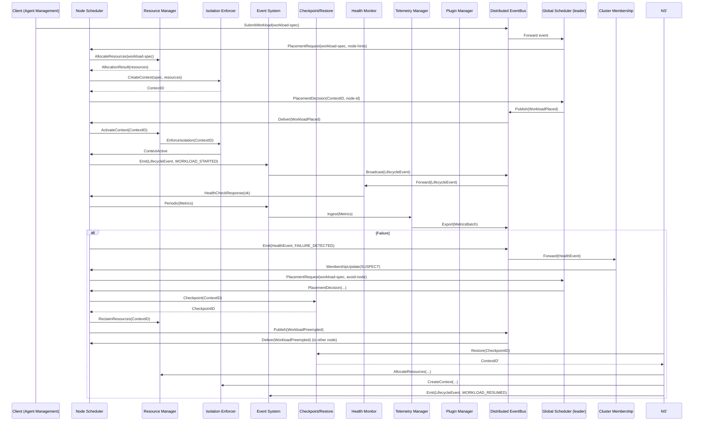
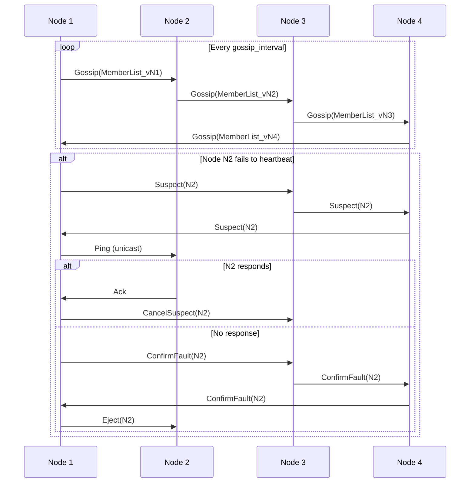
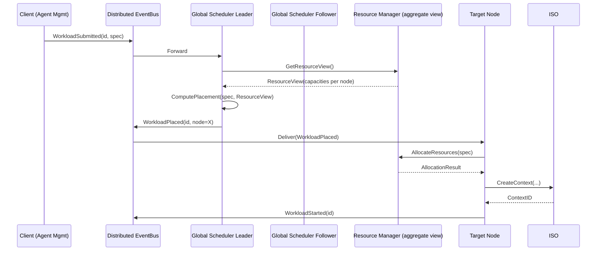
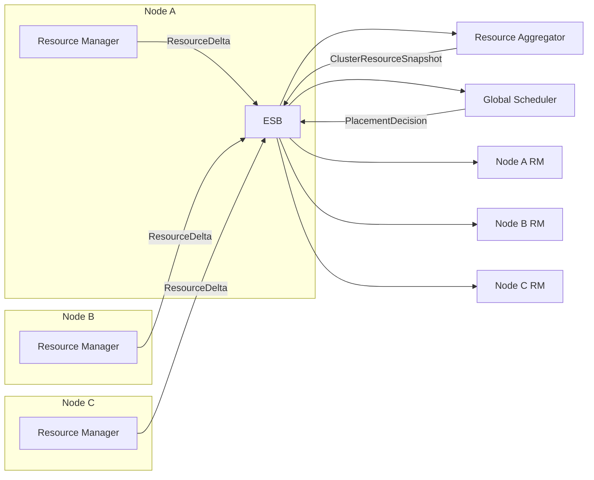
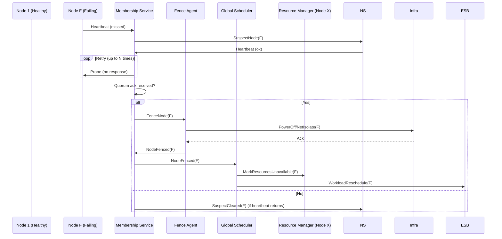
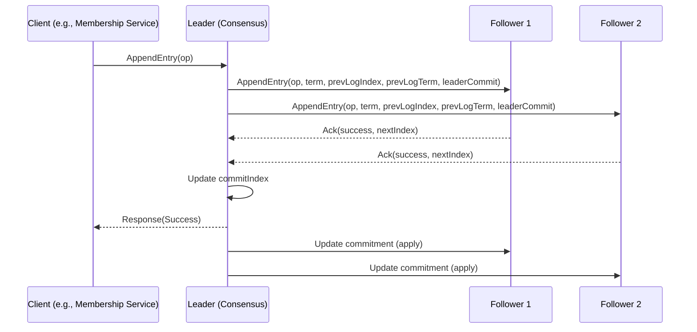
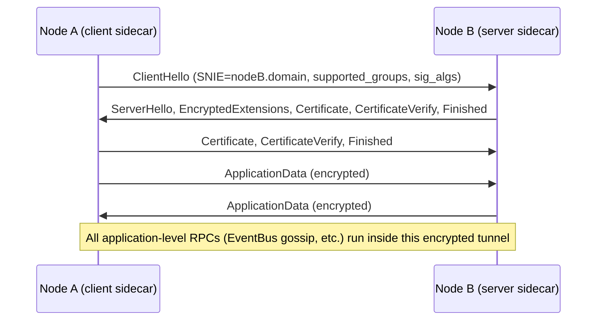
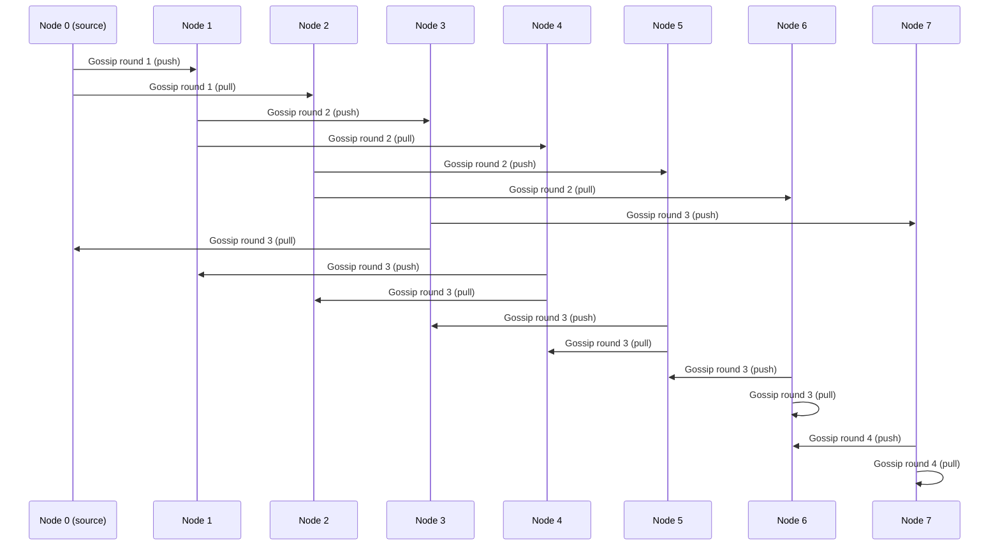

# 10.7 Distributed Runtime Operations

## 10.7.1 Purpose

The Distributed Runtime Operations section defines how the AI-OS runtime operates across multiple nodes in a cluster to provide scalable, fault‑tolerant, and deterministic execution of AI workloads. It specifies the architectural mechanisms for node cooperation, workload placement, state synchronization, failure detection, and recovery while preserving the core AI‑OS guarantees of deterministic execution, strong isolation, and observable behavior. This section does not mandate a specific consensus algorithm or orchestration platform; instead, it defines the required properties and interfaces that any distributed runtime implementation must satisfy.

## 10.7.2 Distributed Runtime Model

The AI‑OS runtime follows a **peer‑to‑peer hybrid model** where each node runs a full runtime stack (scheduler, resource manager, isolation enforcer, etc.) and participates in a loosely coupled cluster for coordination. Workloads are scheduled onto individual nodes, but cross‑node services such as membership, global scheduling, and state synchronization are provided by distributed services that communicate primarily via the distributed EventBus (see 10.7.7).

### 10.7.2.1 Architectural Requirements

- **DR‑1** The runtime shall provide a unified view of the cluster as a single logical execution plane while preserving node‑level isolation.
- **DR‑2** All cross‑node coordination shall be performed through the EventBus or an explicitly justified cluster‑wide coordination service (see 10.7.12).
- **DR‑3** The deterministic execution guarantee shall hold for any workload that does not depend on nondeterministic external inputs, regardless of the node on which it runs.
- **DR‑4** The runtime shall support homogeneous and heterogeneous node hardware (CPU, GPU, accelerator heterogeneity) while abstracting hardware differences via the Resource Abstraction Layer (Part 6).

### 10.7.2.2 Engineering Objectives

- **DO‑1** Minimize coordination overhead so that the steady‑state overhead of distributed operation remains below 5 % of total resource consumption (see 15.1).
- **DO‑2** Achieve sub‑second detection of node failures and initiate workload rescheduling within 2 seconds for stateless workloads and within a bounded downtime for stateful workloads (see 10.7.11).
- **DO‑3** Provide linear scalability of scheduler throughput up to at least 10 000 concurrent workloads per cluster (see 10.7.17).
- **DO‑4** Ensure that any workload can be migrated from one node to another with deterministic state transfer and ≤ 1 second downtime for memory states ≤ 10 GB (see 10.7.8).

### 10.7.2.3 Implementation Guidance

- **GI‑1** Implement the cluster membership and failure detection subsystem using a gossip‑based protocol with configurable gossip intervals (default 200 ms) and suspect timeout (default 2 s) to satisfy DO‑2.
- **GI‑2** Use the existing EventBus infrastructure extended with a lightweight broker‑less gossip layer for inter‑node event propagation; this satisfies DR‑2 while avoiding a separate RPC system.
- **GI‑3** Design the global scheduler as a stateless service that consumes placement events from the EventBus and publishes placement decisions; multiple instances can run behind a leader elected via the consensus subsystem (see 10.7.12) to achieve fault tolerance.
- **GI‑4** Leverage the existing Checkpoint/Restore system (Part 10, sections 10.5‑10.6) for state transfer during migration; compress and encrypt checkpoints on the wire to meet DO‑4.
- **GI‑5** Provide a pluggable consistency module (see 10.7.9) that allows operators to choose between strong, causal, or eventual consistency for different workload classes.

#### 10.7.2.3.1 Cluster Diagram

```mermaid
graph TD
    subgraph Cluster[AI‑OS Cluster]
        subgraph ZoneA[Availability Zone A]
            N1[Node 1<br/>Scheduler, RM, ISO, ES, CRS, HM, SM, TM, PM]
            N2[Node 2<br/>Scheduler, RM, ISO, ES, CRS, HM, TM, PM]
            N3[Node 3<br/>Scheduler, RM, ISO, ES, CRS, HM, TM, PM]
        end
        subgraph ZoneB[Availability Zone B]
            N4[Node 4<br/>Scheduler, RM, ISO, ES, CRS, HM, TM, PM]
            N5[Node 5<br/>Scheduler, RM, ISO, ES, CRS, HM, TM, PM]
            N6[Node 6<br/>Scheduler, RM, ISO, ES, CRS, HM, TM, PM]
        end
        Subnet[(Inter‑node Network)]
        subgraph Coordination[Coordination Services]
            CSS[Cluster Membership Service<br/>(gossip + failure detector)]
            GSS[Global Scheduler Service<br/>(stateless + leader election)]
            CSSS[Consistency Service<br/>(pluggable consensus)]
            ESB[Distributed EventBus<br/>(gossip‑based event fabric)]
        end
        N1 -->|EventBus| ESB
        N2 -->|EventBus| ESB
        N3 -->|EventBus| ESB
        N4 -->|EventBus| ESB
        N5 -->|EventBus| ESB
        N6 -->|EventBus| ESB
        ESB -->|Event distribution| N1
        ESB -->|Event distribution| N2
        ESB -->|Event distribution| N3
        ESB -->|Event distribution| N4
        ESB -->|Event distribution| N5
        ESB -->|Event distribution| N6
        CSS <-->|Membership updates| N1
        CSS <-->|Membership updates| N2
        CSS <-->|Membership updates| N3
        CSS <-->|Membership updates| N4
        CSS <-->|Membership updates| N5
        CSS <-->|Membership updates| N6
        GSS <-->|Placement requests/events| N1
        GSS <-->|Placement requests/events| N2
        GSS <-->|Placement requests/events| N3
        GSS <-->|Placement requests/events| N4
        GSS <-->|Placement requests/events| N5
        GSS <-->|Placement requests/events| N6
        CSSS <-->|Consensus proposals/commits| GSS
    end
    style CSS fill:#f9f,stroke:#333,stroke-width:2px
    style GSS fill:#9f9,stroke:#333,stroke-width:2px
    style CSSS fill:#ff9,stroke:#333,stroke-width:2px
    style ESB fill:#99f,stroke:#333,stroke-width:2px
```

#### 10.7.2.3.2 Node Interaction Diagram (Event Flow)



## 10.7.3 Cluster Architecture

The cluster is organized into **zones** (failure domains) and **nodes**. Each node runs a full runtime stack; coordination services may be co‑located on dedicated nodes or shared with workload nodes depending on the deployment profile.

### 10.7.3.1 Architectural Requirements

- **CRA‑1** The cluster shall support horizontal scaling by adding nodes without downtime.
- **CRA‑2** Nodes shall be homogeneous with respect to the runtime software stack; hardware heterogeneity is abstracted by the Resource Manager.
- **CRA‑3** Each node shall expose a uniform management interface (REST/gRPC) for cluster‑level operations (e.g., node drain, maintenance mode).
- **CRA‑4** The cluster shall maintain a globally unique, monotonic **cluster epoch** that increments on every membership change; all nodes shall agree on the current epoch via the consensus subsystem.

### 10.7.3.2 Engineering Objectives

- **OBJ‑1** Adding a node shall increase the cluster’s schedulable workload capacity by at least 90 % of the node’s capacity (accounting for coordination overhead).
- **OBJ‑2** Node removal (planned) shall complete workload draining within a configurable grace period (default 30 s) with zero‑downtime for stateless workloads.
- **OBJ‑3** The cluster epoch shall be advanced within 500 ms of a membership change under normal network conditions.

### 10.7.3.3 Implementation Guidance

- **GI‑6** Use the membership service’s gossip disseminator to propagate membership changes; each node increments a local epoch counter upon receipt of a quorum‑acknowledged change.
- **GI‑7** Implement a lightweight **Node Agent** (part of the Health Monitor) that exposes `/metrics`, `/health`, and administrative endpoints; this agent registers with the membership service via a heartbeat (default interval 1 s).
- **GI‑8** For cloud deployments, map zones to availability zones; for on‑prem, map to rack or power‑distribution units.

#### 10.7.3.3.1 Node Role Matrix

| Role            | Responsibilities                                                                 | Optional Components                     |
|-----------------|----------------------------------------------------------------------------------|----------------------------------------|
| Compute Node    | Run workloads; host Scheduler, RM, ISO, ES, CRS, HM, TM, PM                     | May host Global Scheduler replica       |
| Coordinator Node| Host Membership Service, Consensus Quorum, Global Scheduler leader (if separate)| Can also run workloads if under‑utilized|
| Gateway Node    | Externally facing APIs (Agent Management, Plugin UI); forwards events to ESB    | May co‑host Coordinator functions       |
| Storage Node    | Provides durable storage for checkpoints, object store for model artifacts       | Not required for pure compute clusters   |

#### 10.7.3.3.2 Zone‑Aware Placement Matrix

| Workload Affinity      | Preferred Zone | Fallback Allowed? | Reason                                           |
|------------------------|----------------|-------------------|--------------------------------------------------|
| Data‑local (input)     | Zone where data resides | Yes (with penalty) | Minimizes data transfer latency                 |
| GPU‑bound              | Zone with GPU nodes      | No                | Requires GPU hardware                           |
| Low‑latency inter‑proc | Same zone          | No                | Inter‑zone latency > 1 ms violates SLO          |
| Batch tolerant         | Any zone           | Yes               | No placement constraints                        |

## 10.7.4 Node Roles

Each node runs an identical set of runtime components; however, logical roles can be assigned dynamically based on cluster policies.

### 10.7.4.1 Architectural Requirements

- **NR‑1** A node may assume multiple roles concurrently (e.g., Compute + Coordinator).
- **NR‑2** Role assignment shall be managed by the Membership Service and reflected in the node’s metadata published via the EventBus.
- **NR‑3** No role shall grant a node privileges that violate the isolation guarantees of the Isolation Enforcer (see Part 10, sections 10.3‑10.4).

### 4).

### 10.7.4.2 Engineering Objectives

- **OBJ‑4** Role re‑assignment (e.g., promoting a node to Coordinator) shall complete within 2 seconds without disrupting currently running workloads.
- **OBJ‑5** The system shall prevent split‑brain scenarios by ensuring that at most one node can hold the leader role for any given coordination service at a given epoch (see 10.7.12).

### 10.7.4.3 Implementation Guidance

- **GI‑9** Encode role information as a set of tags in the node’s heartbeat message; the Membership Service aggregates tags to form the cluster view.
- **GI‑10** Use the consensus subsystem (see 10.7.12) to elect leaders for the Global Scheduler and Consistency Service; other roles are deterministically derived from the node’s tag set.
- **GI‑11** Provide a node‑drain operation that temporarily removes the Compute role while preserving other roles; workloads are rescheduled by the Global Scheduler.

#### 10.7.4.3.1 Role State Machine

```mermaid
stateDiagram-v2
    [*] -> Initializing
    Initializing -> Alive: Heartbeat received
    Alive -> Maintaining: Maintenance requested
    Maintaining -> Alive: Maintenance completed
    Alive -> Draining: Drain requested
    Draining -> Offloaded: All workloads migrated
    Offloaded -> Maintaining: Ready for maintenance
    Offloaded -> Decommissioned: Decommission approved
    Decommissioned -> [*]
    Alive -> Failed: Failure detector triggers
    Failed -> [*]: Manual intervention required
    note right of Failed
        Node is isolated; workloads are presumed lost
        and will be rescheduled by Global Scheduler
    end note
```

## 10.7.5 Membership Management

Membership management handles node discovery, failure detection, and cluster view distribution.

### 10.7.5.1 Architectural Requirements

- **MM‑1** The Membership Service shall provide an eventually consistent view of the cluster membership that converges within a bounded time (T_converge) after any membership change.
- **MM‑2** Failure detection shall be based on missing heartbeats with configurable timeout and shall avoid false positives under transient network pauses ≤ T_suspicion.
- **MM‑3** The service shall support graceful join and leave operations, including draining workloads before removal.

### 10.7.5.2 Engineering Objectives

- **OBJ‑6** T_converge ≤ 2 seconds for clusters ≤ 100 nodes under normal network conditions (≤ 50 ms RTT, ≤ 1 % packet loss).
- **OBJ‑7** False positive detection rate < 0.1 % when network jitter ≤ 20 ms.
- **OBJ‑8** Join latency (time from node boot to being considered alive) ≤ 5 seconds.

### 10.7.5.3 Implementation Guidance

- **GI‑12** Implement a gossip‑based dissemination protocol (e.g., SWIM) where each node periodically sends its membership list to a random subset of peers.
- **peers**.
- **GI‑13** Augment gossip with a **suspect** phase: after missing heartbe 13** Augment gossip with a **suspect** phase: after missing heartbeats, a node is marked suspect; confirmation requires acknowledgment from a quorum of nodes.
- **GI‑14** Persist the membership view to a lightweight replicated log (e.g., Raft log) to survive node restarts; this log is managed by the Consensus Service (see 10.7.12).
- **GI‑15** Provide a tunable parameter `gossip_interval` (default 200 ms) and `suspect_timeout` (default 1.2 × gossip_interval) to tune detection speed vs. false‑positive rate.

#### 10.7.5.3.1 Membership Message Flow (Gossip)



## 10.7.6 Runtime Coordination

Runtime coordination encompasses global scheduling decisions, resource reservations, and cross‑node event ordering.

### 10.7.6.1 Architectural Requirements

- **RC‑1** The Global Scheduler shall make placement decisions based on a globally consistent view of resource availability (subject to eventual consistency bounds).
- **RC‑2** All placement decisions shall be published as immutable events on the Distributed EventBus; nodes shall apply them idempotently.
- **RC‑3** Coordination shall avoid single points of failure; the Global Scheduler may be replicated with leader election via the Consensus Service.

### 10.7.6.2 Engineering Objectives

- **OBJ‑9** Scheduling decision latency (from receipt of a workload submission to publication of placement decision) ≤ 100 ms at 95th percentile for loads up to 10 k submissions/second.
- **OBJ‑10** The system shall sustain placement throughput of at least 50 k decisions/second with a 99.9 % success rate under nominal load.
- **OBJ‑11** In the event of Global Scheduler leader failover, no scheduling decision shall be lost; in‑flight requests shall be retried transparently.

### 10.7.6.3 Implementation Guidance

- **GI‑16** Design the Global Scheduler as a stateless worker that subscribes to `WorkloadSubmitted` events, queries the Resource Manager’s aggregated view (via a read‑only replica or cached view), computes placement, and publishes `WorkloadPlaced`.
- **GI‑17** Use the Consensus Service to elect a leader among Global Scheduler replicas; followers simply forward incoming submission events to the leader.
- **GI‑18** Implement a **placement cache** per node that stores the latest known resource capacities; update the cache via `ResourceUpdate` events broadcast by each node’s Resource Manager.
- **GI‑19** Ensure all scheduling events carry a monotonically increasing **epoch** and **sequence number** to enable duplicate detection and ordering (see 10.7.9).

#### 10.7.6.3.1 Global Scheduler Interaction Diagram



## 10.7.7 Cross‑Node Scheduling

Cross‑node scheduling refers to the mechanisms by which workloads are assigned to specific nodes and the guarantees surrounding those assignments.

### 10.7.7.1 Architectural Requirements

- **CNS‑1** The scheduler shall respect hard resource limits (CPU, memory, accelerator) enforced by the Resource Manager on each node.
- **CNS‑2** Affinity constraints (data locality, hardware specialization, anti‑colocation) shall be expressed as part of the workload specification and honored unless infeasible, in which case the scheduler shall reject the workload with an explicit reason.
- **CNS‑3** The scheduler shall provide work‑conserving behavior: if any node has free resources matching the workload’s requirements, the workload shall be scheduled unless prevented by a higher‑priority workload or affinity violation.

### 10.7.7.2 Engineering Objectives

- **OBJ‑12** Scheduling fairness: under a fair‑share policy, each tenant’s long‑run utilization shall be within 5 % of its allocated share.
- **OBJ‑13** Preemption latency: the time from a preemption decision to the victim workload’s suspension shall be ≤ 50 ms for CPU‑bound workloads and ≤ 200 ms for GPU‑bound workloads (including state quiesce).
- **OBJ‑14** The scheduler shall support hierarchical priority classes (system, interactive, batch, best‑effort) with strict priority preemption.

### 10.7.7.3 Implementation Guidance

- **GI‑20** Extend the local scheduler’s priority queue to incorporate a **global priority** component derived from the workload’s tenant‑level weight and the current cluster load vector.
- **GI‑21** Implement affinity evaluation as a predicate function that receives the workload’s affinity labels and the node’s attribute set (e.g., GPU‑model, local‑storage‑path, zone‑id).
- **GI‑22** For preemption, use the existing checkpoint/restore mechanism: the victim workload is checkpointed (if stateful) or simply stopped (if stateless); the checkpoint is stored durably before resources are reclaimed.
- **GI‑23** Provide a **backfill** algorithm that allows lower‑priority workloads to opportunistically use fragmented resources without violating higher‑priority reservations.

#### 10.7.7.3.1 Affinity Evaluation Table

| Affinity Type      | Attribute Evaluated            | Match Condition                              | Fallback Action                                 |
|--------------------|--------------------------------|----------------------------------------------|-------------------------------------------------|
| DataLocal          | `data.location` (zone‑id, rack) | Node.zone == workload.data.location          | Schedule elsewhere with penalty factor ×2       |
| GPUSpecific        | `gpu.model`                    | Node.gpu.model IN workload.gpu.allowlist    | Reject if no matching GPU; else schedule on any GPU |
| AcceleratorAff     | `accelerator.type`             | Node.accelerator.type == workload.accel.type | Fallback to CPU emulation if allowed            |
| AntiColocation     | `workload.id`                  | Node.current_workloads ∩ workload.blacklist = ∅ | Migrate one of the conflicting workloads if preemptible |
| PowerAware         | `power.cap` (watts)            | Node.available_power ≥ workload.power_req   | Throttle workload or defer scheduling           |

## 10.7.8 Workload Migration

Workload migration enables moving a running workload from one node to another while preserving execution state and minimizing downtime.

### 10.7.8.1 Architectural Requirements

- **WM‑1** Migration shall preserve the deterministic execution guarantee; i.e., a workload resumed after migration must produce the same output as if it had remained on the source node, assuming identical inputs and no external nondeterminism.
- **WM‑2** The system shall support both **stop‑the‑world** (checkpoint‑stop‑restore) and **live** (pre‑copy) migration modes, selectable per workload.
- **WM‑3** Migration shall be transparent to the workload; no modifications to the workload code are required.

### 10.7.8.2 Engineering Objectives

- **OBJ‑15** Stop‑the‑world migration downtime ≤ 1 second for memory states ≤ 10 GB (including transfer, serialization, and deserialization).
- **OBJ‑16** Live migration shall converge ("pre‑copy" phase) within 30 seconds for the same memory footprint, with a final stop‑the‑world cutover ≤ 100 ms.
- **OBJ‑17** Network bandwidth consumed by migration shall be throttlable; default limit 1 Gbps to avoid impacting co‑located workloads.

### 10.7.8.3 Implementation Guidance

- **GI‑24** Leverage the existing Checkpoint/Restore subsystem (Part 10, sections 10.5‑10.6) to generate a **consistent snapshot** of the execution context (memory, open file descriptors, device state). For live migration, employ a pre‑copy loop that iteratively transfers dirty pages until the remaining dirty rate falls below a threshold.
- **GI‑25** Encrypt and compress the transfer stream using AES‑256‑GCM and LZ4 to satisfy security and bandwidth objectives.
- **GI‑26** Coordinate migration via the Global Scheduler: source node publishes a `MigrationStart` event; the target node acknowledges with `MigrationReady`; source then transmits state; upon completion, source publishes `MigrationComplete` and the target publishes `WorkloadResumed`.
- **GI‑27** Ensure that any in‑flight I/O is either flushed or rolled back consistently; for block devices, use persistent reservations or equivalent mechanisms.

#### 10.7.8.3.1 Migration State Machine (Source Node)

```mermaid
stateDiagram-v2
    [*] -> Running
    Running -> MigrationRequested: MigrationRequested(event)
    MigrationRequested -> Preparing: Initiate pre‑copy
    Preparing -> Transferring: Dirty rate < threshold OR max iterations reached
    Transferring -> Preparing: Dirty pages detected (iterate)
    Transferring -> Finalizing: No dirty pages for N intervals
    Finalizing -> Pausing: Quiesce workload
    Pausing -> Stopped: Stop workload, flush I/O
    Stopped -> TransferFinal: Send remaining state
    TransferFinal -> TargetAcked: Wait for Ack
    TargetAcked -> Completed: Publish MigrationComplete
    Completed -> [*]
    note right of Transferring
        Compression + encryption applied on-the-fly
    end note
```

#### 10.7.8.3.2 Migration State Machine (Target Node)

```mermaid
stateDiagram-v2
    [*] -> Ready
    Ready -> Receiving: Receive MigrationStart
    Receiving -> Applying: Apply received state chunks
    Applying -> Ready: Continue until final chunk
    Receiving -> Validated: Final chunk received and verified
    Validated -> Activated: Notify Global Scheduler
    Activated -> Running: Publish WorkloadResumed
    Running -> [*]
```

## 10.7.9 State Synchronization

State synchronization ensures that replicated runtime state (e.g., membership view, scheduler state, checkpoint metadata) remains consistent across nodes according to a chosen consistency model.

### 10.7.9.1 Architectural Requirements

- **SS‑1** The runtime shall provide a **pluggable consistency module** that can be configured per‑service (e.g., strong consistency for membership, eventual consistency for telemetry aggregation).
- **SS‑2** All state updates shall be assigned a monotonically increasing **version vector** or **lamport timestamp** to enable conflict detection and resolution.
- **SS‑3** The system shall guarantee **read‑your‑writes** consistency for operations originating from the same node when strong consistency is selected.

### 10.7.9.2 Engineering Objectives

- **OBJ‑18** Strongly consistent reads shall complete within 2 × network RTT + processing overhead (target ≤ 10 ms for intra‑datacenter).
- **OBJ‑19** Eventually consistent convergence shall achieve ≤ 100 ms convergence time for 99 % of updates under normal load.
- **OBJ‑20** The consistency layer shall add ≤ 2 % CPU overhead when operating in eventual‑consistency mode.

### 10.7.9.3 Implementation Guidance

- **GI‑28** Implement the consistency module as a thin wrapper around the underlying event log (provided by the Consensus Service). For strong consistency, require a quorum write and read; for eventual consistency, use gossip‑based anti‑entropy.
- **GI‑29** Provide three consistency levels: `STRONG` (linearizable), `CAUSAL` (causal+), and `EVENTUAL`. The default for membership and scheduling is `STRONG`; telemetry and metrics default to `EVENTUAL`.
- **GI‑30** Use **version vectors** per key to detect concurrent updates; resolve conflicts using a last‑writer‑wins policy with timestamp tie‑break, unless a custom conflict resolver is registered.
- **GI‑31** Expose consistency metrics (`consistency_latency`, `conflict_rate`, `convergence_time`) via the Telemetry Manager.

#### 10.7.9.3.1 Consistency Levels Table

| Consistency Level | Write Quorum | Read Quorum | Guarantees                              | Typical Use‑Case                     |
|-------------------|--------------|-------------|----------------------------------------|--------------------------------------|
| STRICT (Linearizable) | N/2+1        | N/2+1       | Single‑copy linearizability           | Membership, Global Scheduler leader election |
| CAUSAL            | N/2+1        | 1           | Causally consistent reads              | Workflow state, checkpoint metadata   |
| EVENTUAL          | 1            | 1           | Eventually convergent, no ordering     | Telemetry aggregates, plugin metrics   |
| BOUNDED_STALE     | N/2+1        | 1           | Reads ≤ T staleness                    | Read‑replica caches                    |

#### 10.7.9.3.2 State Conflict Resolution Flowchart

```mermaid
flowchart TD
    A[Receive Update] --> B{Is Key Locally Stored?}
    B -->|Yes| C{Compare Version Vectors}
    B -->|No| D[Store as New Version]
    C -->|Local >= Remote| E[Discard Update (Local Wins)]
    C -->|Remote > Local| F[Apply Update]
    C -->|Concurrent| G{Conflict Resolver Registered?}
    G -->|Yes| H[Invoke Custom Resolver]
    G -->|No| I[Apply LWW (Timestamp Tie‑break)]
    F --> J[Update Local Store]
    H --> J
    I --> J
    J --> K[Publish Update Event (if changed)]
    K --> L[End]
    E --> L
```

## 10.7.10 Distributed Resource Management

Distributed resource management aggregates per‑node resource information and enforces global quotas and reservations.

### 10.7.10.1 Architectural Requirements

- **DRM‑1** The Resource Manager shall expose a **cluster‑wide resource view** that aggregates CPU, memory, accelerator, storage, and network capacities from all nodes.
- **DRM‑2** Global quotas (per‑tenant, per‑workload‑group) shall be enforced atomically; over‑allocation shall be prevented even under concurrent requests.
- **DRM‑3** The system shall support **elastic resource reclamation**: idle resources can be reclaimed and offered to other workloads with bounded notice (pre‑emption window).

### 10.7.10.2 Engineering Objectives

- **OBJ‑21** Aggregate resource view staleness ≤ 1 second under normal load.
- **OBJ‑22** Quota enforcement decision latency ≤ 5 ms per request.
- **OBJ‑23** Reclaimed resources shall be made available for scheduling within 2 seconds of reclamation decision.

### 10.7.10.3 Implementation Guidance

- **GI‑32** Each node’s Resource Manager publishes `ResourceDelta` events (add/subtract CPU cores, memory bytes, GPU units) to the Distributed EventBus whenever its local allocation changes.
- **GI‑33** A **Resource Aggregator** component (stateless, optionally replicated) consumes these deltas and maintains an in‑memory cluster view; it publishes `ClusterResourceSnapshot` periodically (every 500 ms) and on significant delta thresholds.
- **GI‑34** Global quota enforcement is performed by the Global Scheduler: before placing a workload, it checks the requested resources against the quota ledger (maintained via the Consistency Service in `STRONG` mode) and the latest cluster resource snapshot.
- **GI‑35** For elastic reclamation, the Resource Manager emits a `ReclamationCandidate` event when a workload’s usage falls below its low‑watermark for a configurable period; the Global Scheduler may then pre‑empt the workload per policy.

#### 10.7.10.3.1 Resource Flow Diagram



## 10.7.11 Distributed Failure Handling

Distributed failure handling detects node, network, and service failures and orchestrates recovery while preserving system invariants.

### 10.7.11.1 Architectural Requirements

- **DFH‑1** Failure detectors shall suspect a node after a configurable number of missed heartbeats and confirm the failure after receiving acknowledgments from a quorum of peers.
- **DFH‑2** Upon confirmed failure, the system shall **fence** the node (prevent it from performing any further I/O or state changes) before attempting workload recovery.
- **DFH‑3** All state associated with the failed node (in‑flight workflows, leased resources, locks) shall be reclaimed or transferred according to policy.
- **DFH‑4** The system shall support **automatic failover** of coordination services (e.g., Global Scheduler leader, Consensus leader) with no loss of committed state.

### 10.7.11.2 Engineering Objectives

- **OBJ‑24** Failure detection time (from loss of heartbeat to confirmed fault) ≤ 2 seconds under normal network conditions (≤ 50 ms RTT, ≤ 1 % loss).
- **OBJ‑25** Fencing action completion time ≤ 500 ms (e.g., via API call to infrastructure power‑management or network isolation).
- **OBJ‑26** Workload rescheduling initiation time ≤ 1 second after fencing (stateless) or ≤ 5 seconds after checkpoint restore (stateful).
- **OBJ‑27** The probability of split‑brain due to simultaneous leader election in two partitions shall be less than 10⁻⁶ per year (requires proper quorum configuration).

### 10.7.11.3 Implementation Guidance

- **GI‑36** Use the failure detector component of the Membership Service (see 10.7.5) to generate `SuspectNode` and `ConfirmNodeFailed` events.
- **GI‑37** Implement fencing via an infrastructure‑agnostic **Fence Agent** plugin that can execute vendor‑specific commands (e.g., IPMI power off, network switch port disable, cloud API instance stop). The fence agent is invoked by the Membership Service upon confirmation.
- **GI‑38** After fencing, the Membership Service publishes a `NodeFenced` event; the Global Scheduler reacts by marking the node’s resources as unavailable and triggering workload rescheduling.
- **GI‑39** For stateful workloads, the Checkpoint/Restore subsystem is used to retrieve the latest successful checkpoint (from durable storage) and restore it on a healthy node.
- **GI‑40** Ensure that any in‑progress fence operation is idempotent; duplicate fence requests shall be treated as no‑ops.

#### 10.7.11.3.1 Failure Detection and Fencing Sequence Diagram



## 10.7.12 Consensus Requirements

The consensus subsystem provides the foundation for agreeing on cluster metadata, leader election, and ordered logging.

### 10.7.12.1 Architectural Requirements

- **C‑1** The consensus service shall provide **strict ordering** of log entries (i.e., atomic broadcast) for any subsystem that requires linearizable updates (e.g., membership, global scheduler leadership).
- **C‑2** The service shall tolerate up to **F** faulty nodes where the cluster size **N ≥ 2F + 1** (crash‑stop model).
- **C‑3** Log entries shall be **durably persisted** to a write‑ahead log on stable storage before being considered committed.
- **C‑4** The service shall support **dynamic membership changes** (add/remove nodes) while preserving safety guarantees.

### 10.7.12.2 Engineering Objectives

- **OBJ‑28** Commit latency for a single log entry (under no load) ≤ 2 × network RTT + disk sync time (target ≤ 5 ms for SSD with local LAN).
- **OBJ‑29** Throughput ≥ 10 k committed entries/second with ≤ 1 ms 99th‑percentile latency for a 5‑node cluster.
- **OBJ‑30** Membership change completion time ≤ 2 seconds (including state transfer to new members).

### 10.7.12.3 Implementation Guidance

- **GI‑41** Implement the consensus protocol using a pluggable backend (e.g., Raft, Paxos) to allow operational flexibility; the interface shall abstract log append, vote request, and snapshot transfer.
- **GI‑42** Provide a **snapshot** mechanism that compacts the log and transfers a compact state snapshot to new members during a joint consensus phase.
- **GI‑43** Integrate the consensus service’s log with the Distributed EventBus: each committed log entry is published as an event; conversely, events that require ordering are first appended to the log.
- **GI‑44** Expose metrics (`commit_latency`, `log_size`, `snapshot_duration`, `election_duration`) via the Telemetry Manager.

#### 10.7.12.3.1 Consensus Role State Machine

```mermaid
stateDiagram-v2
    [*] -> Follower
    Follower -> Candidate: ElectionTimeout elapsed
    Candidate -> Leader: Won election (majority votes)
    Leader -> Follower: Lost heartbeat (step down)
    Leader -> Follower: Discovered higher term
    Candidate -> Follower: Failed election (receives higher term)
    Follower -> Leader: Received AppendEntries from leader with higher term (step down)
    [*] -> Observer: Optional read‑only replica (no voting)
```

#### 10.7.12.3.2 Log Replication Diagram (Simplified)



## 10.7.13 Partition Handling

Partition handling addresses network splits (split‑brain) and ensures that the system either continues operating correctly in a minority partition or safely shuts down to preserve consistency.

### 10.7.13.1 Architectural Requirements

- **PH‑1** The system shall be able to **detect** a network partition via the membership service’s failure detector and divergent views of the cluster.
- **PH‑2** Upon detection of a partition, the system shall enforce a **partition policy** that either:
  - Allows the **majority partition** to remain operational (if it satisfies quorum requirements), or
  - **Shuts down** all partitions that cannot achieve quorum to prevent split‑brain.
- **PH‑3** Minority partitions shall cease accepting new workloads and shall refuse to commit any state‑mutating operations; they may continue to serve read‑only requests if the consistency model permits.
- **PH‑4** After partition healing, the system shall reconcile divergent state using the consistency service’s conflict resolution mechanisms (see 10.7.9).

### 10.7.13.2 Engineering Objectives

- **OBJ‑31** Partition detection time ≤ 2 seconds after the loss of inter‑partition communication.
- **OBJ‑32** Decision to stay up or shut down shall be made within 500 ms of detection.
- **OBJ‑33** State reconciliation after healing shall complete within 30 seconds for ≤ 10 GB of divergent state per node.
- **OBJ‑34** The probability of both partitions believing they are the majority (true split‑brain) shall be < 10⁻⁹ per year given proper quorum sizing.

### 10.7.13.3 Implementation Guidance

- **GI‑45** Use the membership service’s view vectors (or version vectors) to detect when a node’s view diverges from the majority; a node computes the intersection of received heartbeats and flags a partition if it sees < quorum members.
- **GI‑46** Implement a **Partition Arbitrator** component that consults the consensus service: if the node can still form a quorum (based on the latest committed membership entry), it remains active; otherwise it steps down to observer/not‑serving mode.
- **GI‑47** For minor partitions that remain up (e.g., due to mis‑configuration), enforce a **read‑only mode** by disabling the Global Scheduler’s placement writes and setting the Consistency Service to `EVENTUAL` only.
- **GI‑48** Upon healing, trigger a **state anti‑entropy** process: each node exchanges merkle trees of its key‑value state (membership, scheduler state, checkpoint metadata) and reconciles differences using the conflict resolver.

#### 10.7.13.3.1 Partition Handling Flowchart

```mermaid
flowchart TD
    A[Heartbeat Received] --> B{Quorum Met?}
    B -->|Yes| C[Normal Operation]
    B -->|No| D[Partition Suspected]
    D --> E{Gather View Vectors}
    E --> F{Intersection Size >= Quorum?}
    F -->|Yes| G[Minority Partition: Step Down]
    F -->|No| H{Membership Partitioned?}
    H -->|Yes| I[Majority Partition Identified]
    I --> J[Continue Operations (Majority)]
    H -->|No| K[Isolated Node: Shutdown]
    G --> L[Reject Writes, Serve Reads if Allowed]
    J --> M[Process Requests]
    L --> N[Await Healing]
    N --> O[Healing Detected]
    O --> P[Exchange Merkle Trees]
    P --> Q[Resolve Conflicts]
    Q --> R[Resume Full Operation]
```

## 10.7.14 Split‑Brain Prevention

Split‑brain prevention builds on partition handling and consensus guarantees to ensure that at most one partition can act as the primary authority for any given piece of state.

### 10.7.14.1 Architectural Requirements

- **SBP‑1** The system shall require a **quorum** (strict majority) for any operation that can cause divergence (e.g., committing a log entry, granting a lease, updating membership).
- **SBP‑2** No two disjoint subsets of nodes shall each be able to form a quorum simultaneously; this is guaranteed by maintaining **N ≥ 2F + 1** where *F* is the maximum number of fault‑tolerant nodes.
- **SBP‑3** Any node that loses quorum must immediately relinquish any leadership roles and refuse to process state‑mutating requests.
- **SBP‑4** The system shall provide **fencing** mechanisms (see 10.7.11) to ensure that a失联 node cannot unintentionally continue to act as primary after a partition heals.

### 10.7.14.2 Engineering Objectives

- **OBJ‑35** The window during which a node could incorrectly believe it holds quorum (due to delayed messages) shall be bounded by the failure detector’s suspicion timeout (default 1.2 × gossip_interval).
- **OBJ‑36** Fencing action shall be irrevocable without manual administrator intervention (e.g., power cycle required to re‑join).
- **OBJ‑37** The probability of a split‑black scenario occurring due to simultaneous leader election in two partitions shall be less than 10⁻¹² per cluster‑year.

### 10.7.14.3 Implementation Guidance

- **GI‑49** Enforce quorum checks at the consensus layer before committing any log entry; reject proposals that cannot achieve a majority.
- **GI‑50** After a node is fenced (see 10.7.11), prevent it from rejoining the cluster until an administrator explicitly runs a `rejoin` command that validates the node’s state and resets its persistent identifiers (e.g., node UUID).
- **GI‑51** Use **lease‑based leadership** for the Global Scheduler: the leader holds a lease renewed via the consensus service; loss of lease triggers automatic step‑down.
- **GI‑52** Log all quorum decisions and fence events to an immutable audit log (see Part 3 Security) for forensic analysis.

#### 10.7.14.3.1 Quorum Enforcement Pseudo-code

```text
function propose(entry):
    if current_term != persistent_term:
        reject(INVALID_TERM)
    votes = broadcast RequestVote(entry) to all peers
    if votes.received_quorum():
        append entry to log
        broadcast Append(entry) to followers
        commit if majority have persisted
        return SUCCESS
    else:
        reject(NO_QUORUM)
```

## 10.7.15 Cross‑Node Security

Cross‑node security ensures that communication, authentication, and authorization between nodes uphold the zero‑trust principles of AI‑OS.

### 10.7.15.1 Architectural Requirements

- **CNS‑SEC‑1** All inter‑node communication shall be **mutually authenticated** and **encrypted** using TLS 1.3 or an equivalent protocol with forward secrecy.
- **CNS‑SEC‑2** Each node shall possess a unique identity certificate issued by the AI‑OS PKI (see Part 3 Security) that encodes its role(s) and zone membership.
- **CNS‑SEC‑3** Authorization decisions for cross‑node requests (e.g., submitting a placement request to the Global Scheduler) shall be based on **capability tokens** derived from the node’s certificate and the requesting workload’s security context.
- **CNS‑SEC‑4** Audit logs of all inter‑node security events (authentication successes/failures, authorization decisions, key rotations) shall be transmitted to the central Security Service via the EventBus.

### 10.7.15.2 Engineering Objectives

- **OBJ‑38** Handshake latency for a new inter‑node channel ≤ 10 ms (TLS 1.3 0‑RTT where applicable, otherwise 1‑RTT).
- **OBJ‑39** Cryptographic overhead (CPU) ≤ 2 % of total node CPU under saturated traffic (10 Gbps).
- **OBJ‑40** Certificate rotation shall be possible without downtime; each node shall support dual‑stack (old/new) certificates during the overlap period.

### 10.7.15.3 Implementation Guidance

- **GI‑53** Establish a **mutual TLS** mesh using a service‑sidecar pattern: each Node Agent runs a sidecar proxy (e.g., Envoy) that terminates mTLS and forwards plain‑text to local components; this decouples security from application code.
- **GI‑54** Distribute certificates via an automated **certificate‑manager** plugin that watches the PKI’s Certificate Revocation List (CRL) and renews certificates before expiry.
- **GI‑55** Map X.509 certificate extensions (e.g., `OU=`role=global-signed JWT that is presented as a bearer token on internal HTTP/gRPC calls; the token is validated by the Authorization Service (Part 3).
- **GI‑56** Audit events shall be emitted as `AuthEvent` and `AuthzEvent` on the Distributed EventBus; the Security Service subscribes and writes to an immutable log.

#### 10.7.15.3.1 Mutual TLS Handshake Diagram



## 10.7.16 Runtime Consistency

Runtime consistency defines the guarantees that the distributed runtime offers to workloads regarding the visibility of state changes (e.g., resource allocations, placement decisions) across nodes.

### 10.7.16.1 Architectural Requirements

- **RC‑CN‑1** For any workload‑visible state (e.g., granted resource quotas, active placement), the system shall provide **read‑your‑writes** consistency from the perspective of the workload’s originating node.
- **RC‑CN‑2** Cross‑node visibility of a committed state change shall be bounded: after a commit, any node that subsequently queries the state shall see the update within a known **visibility window** Δ_vis.
- **RC‑CN‑3** The system shall provide **monotonic reads**: if a node observes a value V at time t₁, any later read at t₂ > t₁ shall return either V or a newer value.
-**RC‑CN‑4** The consistency guarantees shall be **configurable per‑resource type** (e.g., strict for membership, eventual for telemetry).

### 10.7.16.2 Engineering Objectives

- **OBJ‑41** Visibility window Δ_vis for strong consistency (`STRICT`) ≤ 2 × network RTT + local processing (target ≤ 10 ms intra‑DC).
- **OBJ‑42** Visibility window for causal consistency (`CAUSAL`) ≤ 5 × network RTT (target ≤ 25 ms).
- **OBJ‑43** Eventually consistency convergence time ≤ 200 ms for 99 % of updates under normal load.
- **OBJ‑44** Staleness‑bounded reads (`BOUNDED_STALE`) shall guarantee that the returned value is no older than T_stale (configurable, econd=500ms).

### 10.7.16.3 Implementation Guidance

- **GI‑57** Implement the consistency guarantees using the Consensus Service (see 10.7.12) as the source of truth for strongly consistent state.
- **GI‑58** For resources requiring strong consistency (quota, placement, membership):
    - Each state update is first appended to the consensus log.
    - A update is considered committed only after it is replicated to a majority of nodes.
    - Reads are served by either:
        * Applying all committed entries in the local log (read‑your‑writes), or
        * Querying a read quorum and returning the value with the highest timestamp/tier vector.
- **GI‑59** For eventual‑consistent state (telemetry, metrics, plugin config):
    - Updates are disseminated via gossip-based EventBus.
    - Nodes maintain a local cache updated by received events.
    - No ordering guarantees; convergence is eventual but fast.
- **GI‑60** Provide a pluggable consistency module that allows services to select their consistency level at runtime via configuration.

#### 10.7.16.3.1 Consistency Selection Table

| Resource/State                 | Consistency Mode | Reason                                                            | Visibility Bound (Δ_vis) |
|--------------------------------|------------------|-------------------------------------------------------------------|--------------------------|
| Membership view                | STRICT           | Prevent split‑brain, ensure single source of truth               | ≤ 2 × RTT                |
| Global Scheduler leadership   | STRICT           | Leader election must be linearizable                             | ≤ 2 × RTT                |
| Quota ledger (total per tenant)| STRICT           | Over‑allocation must be impossible                               | ≤ 2 × RTT                |
| Placement decisions            | STRICT           | Scheduler must act on latest resource view                       | ≤ 2 × RTT                |
| Node‑local resource cache      | EVENTUAL (with read‑your‑writes via local delta application) | Fast path for local allocations | 0 (local)                |
| Telemetry & metrics            | EVENTUAL         | High volume, low cost of staleness                               | Converges ≤ 200 ms       |
| Checkpoint metadata            | CAUSAL           | Need to ensure a restore sees all prior checkpoints for same workload | ≤ 5 × RTT                |
| Plugin configuration           | EVENTUAL         | Infrequent updates, can tolerate delay                           | Converges ≤ 500 ms       |

## 10.7.17 Scalability Model

The scalability model describes how the distributed runtime behaves as the cluster size, workload count, and request rates increase.

### 10.7.17.1 Architectural Requirements

- **SC‑1** The per‑node overhead of the runtime (including all coordination services) shall remain **O(1)** with respect to the total number of nodes in the cluster.
- **SC‑2** The time to disseminate a cluster‑wide event (e.g., membership change, global scheduler decision) shall grow **O(log N)** when using a gossip‑based dissemination with exponential backoff, or **O(1)** when using a broadcast‑capable underlying fabric (e.g., IP multicast, RDMA‑based broadcast).
- **SC‑3** The Global Scheduler shall be able to scale horizontally by adding more scheduler instances; scheduling decision latency shall remain bounded as long as the incoming request rate does not exceed the aggregate processing capacity of the scheduler pool.

### 10.7.17.2 Engineering Objectives

- **OBJ‑45** Control‑plane CPU consumption per node ≤ 5 % at 10 k nodes with nominal workload churn (≤ 100 joins/leaves per second per node).
- **OBJ‑46** Membership convergence time ≤ 500 ms · log₂(N) for gossip‑based dissemination (e.g., ≤ 4 seconds for a 1024‑node cluster).
- **OBJ‑47** Scheduler throughput scales linearly with the number of scheduler instances; a 4‑instance pool shall handle ≥ 200 k placement decisions/second with ≤ 50 ms 99th‑percentile latency.
- **OBJ‑48** Network bandwidth consumed by gossip shall be ≤ 1 Mbps per node at steady state (including heartbeats, suspicion probes, and state summaries).

### 10.7.17.3 Implementation Guidance

- **GI‑57** Implement gossip with **peer‑selection** using a deterministic pseudo‑random function based on node ID and round number to guarantee logarithmic spread.
- **GI‑58** Use **push‑pull** gossip: each round, a node pushes its summary to a random peer and pulls a summary from another (potentially different) peer.
- **GI‑59** For the Global Scheduler, run multiple identical instances behind a **leader‑elector** (consensus service). Clients send submission requests to any instance; the instance forwards to the leader if it is not the leader itself.
- **GI‑60** Enable **batching** of events: the EventBus can coalesce multiple `ResourceDelta`s from the same node into a single network packet when the batch size exceeds a threshold or a flush timer expires (default 10 ms or 64 KB).
- **GI‑61** Monitor **gossip fan‑out** and adjust the fan‑out factor (default 3) to keep bandwidth within objectives while preserving logarithmic spread.
- **GI‑62** Use **hardware acceleration** (e.g., AES‑NI, RDMA) where available to reduce cryptographic and copying overhead in the EventBus and consensus log replication.

#### 10.7.17.3.1 Gossip Spread Diagram (logarithmic)



## 10.7.18 Runtime Invariants

These invariants must hold at all times for the distributed runtime to maintain its guarantees.

- **RI‑DRO‑1** **Deterministic Execution Invariant**: For any workload that does not depend on nondeterministic external inputs, re‑executing the workload from the same initial state with the same inputs produces identical outputs, regardless of which node executes it.
- **RI‑DRO‑2** **Isolation Invariant**: No workload can observe or affect the memory, registers, or devices of another workload or the runtime itself, except through explicitly sanctioned inter‑workload communication channels.
- **RI‑DRO‑3** **Resource Quota Invariant**: The sum of resources allocated to all workloads on any node never exceeds the node’s total available resources; the sum of resources allocated to all workloads in the cluster never exceeds the cluster’s total available resources.
- **RI‑DRO‑4** **Membership Consensus Invariant**: All non‑failed nodes in the cluster agree on the current membership view and epoch; any node that disagrees is considered failed and is treated as such by the failure detector.
- **RI‑DRO‑5** **Eventual Consistency Convergence**: For any piece of state configured with eventual consistency, all non‑failed nodes will eventually converge to the same value if no further updates are made.
- **RI‑DRO‑6** **Fencing Invariant**: Once a node is fenced (see 10.7.11), it cannot perform any state‑changing operations until it is explicitly unfenced by an administrator.
- **RI‑DRO‑7** **Quorum Invariant**: Any committed state change in the consensus system has been persisted on a majority of nodes; thus, any node that has not failed has either seen the change or can learn it from a peer.

## 10.7.19 Cross-Part References

This section relies on and relates to the following parts of the AI-OS Architecture Specification:

- **Part 3 (Security)**: Defines the PKI, authentication, authorization, and audit logging mechanisms used for cross‑node security (10.7.15).
- **Part 4 (Memory)**: Defines the memory allocation and checkpointing interfaces used by the Checkpoint/Restore system (10.7.8) and state synchronization (10.7.9).
- **Part 5 (Learning)**: Specifies observation hooks that the runtime must expose without affecting deterministic guarantees; relevant for workload migration (10.7.8) and monitoring (10.7.16).
- **Part 6 (Infrastructure)**: Provides resource abstraction layers (CPU, memory, accelerators, storage, network) that the Resource Manager (10.7.10) and Isolation Enforcer utilize.
- **Part 7 (Plugins)**: Describes the plugin mechanism used for extensibility points such as the Fence Agent (10.7.11) and certificate manager (10.7.15).
- **Part 8 (AI Core Services)**: Defines workload types and service contracts that the runtime must execute; the scheduler (10.7.6, 10.7.7) places these workloads onto nodes.
- **Part 9 (Agent Management)**: Establishes the task submission and lifecycle interfaces that the runtime consumes (10.7.2, 10.7.6).
- **Part 10 (Self)**:
    - Sections 10.1‑10.6: Define the single‑node runtime components (Scheduler, Resource Manager, etc.) that are replicated and coordinated in the distributed model.
    - Section 10.5: Defines the Checkpoint/Restore system used for workload migration (10.7.8) and state synchronization (10.7.9).
    - Section 10.6: Defines the EventBus that is extended for distributed use (10.7.2, 10.7.6).
    - Section 10.20: Specifies single‑node scalability baselines that the distributed model extends (10.7.17).
- **Part 12 (EventBus)**: Specifies the event delivery guarantees, schemas, and replay behavior that underlie the Distributed EventBus (10.7.2, 10.7.6, 10.7.10, 10.7.15).
- **Part 19 (Observability)**: Defines metrics, logging, tracing, and health check standards implemented by distributed runtime components (10.7.10, 10.7.11, 10.7.16).

All references are *informative* unless explicitly marked as a requirement (using “shall”) in the text above. When a requirement cites another part, the requirement inherits the normative weight of the cited section.

---
*End of Section 10.7 Distributed Runtime Operations*