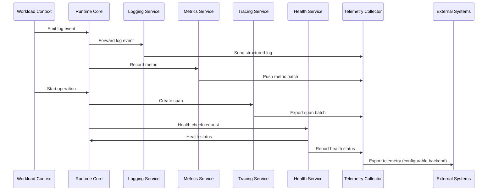
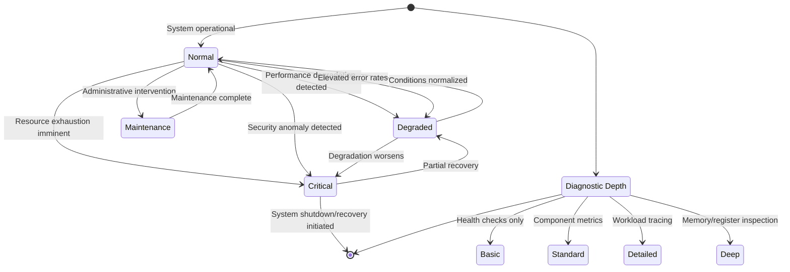
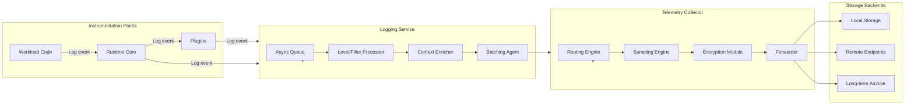
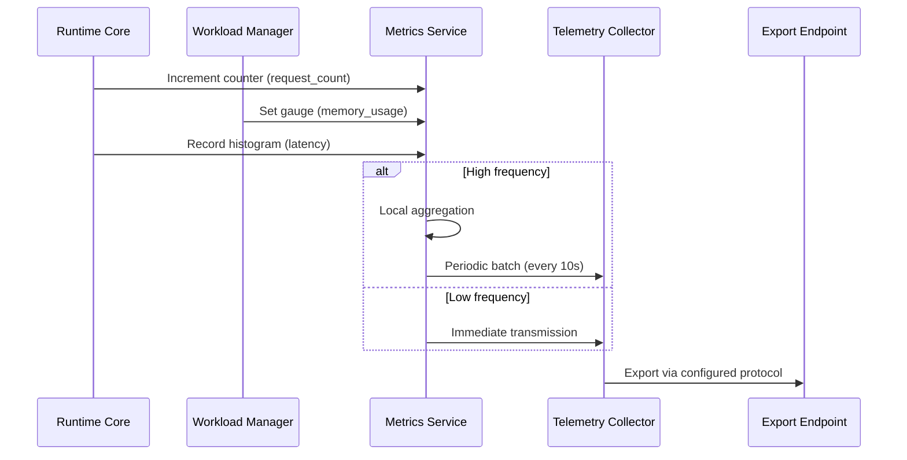
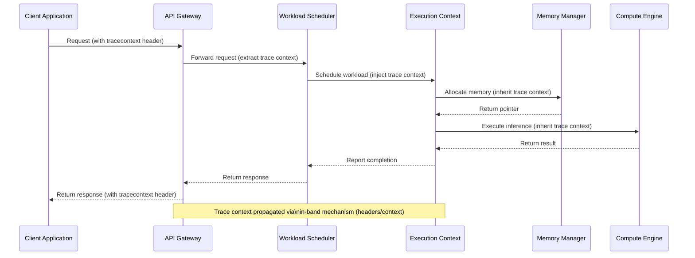
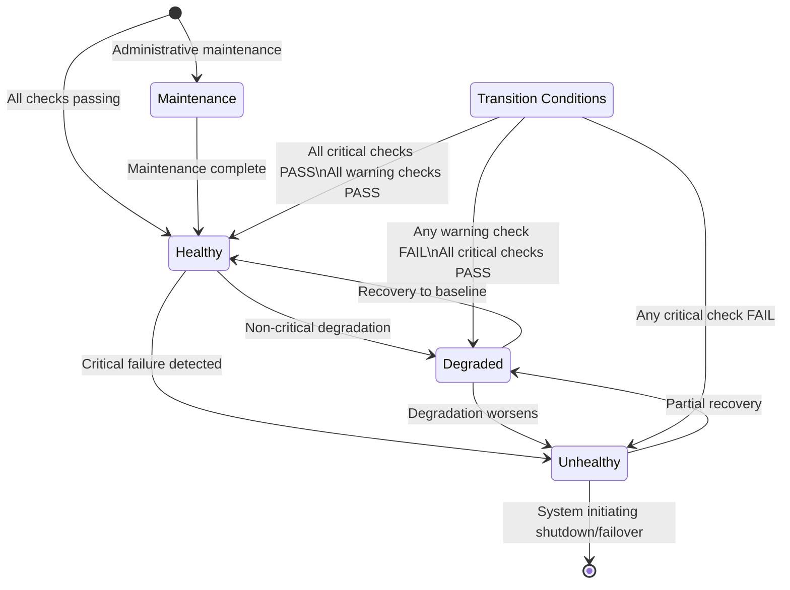
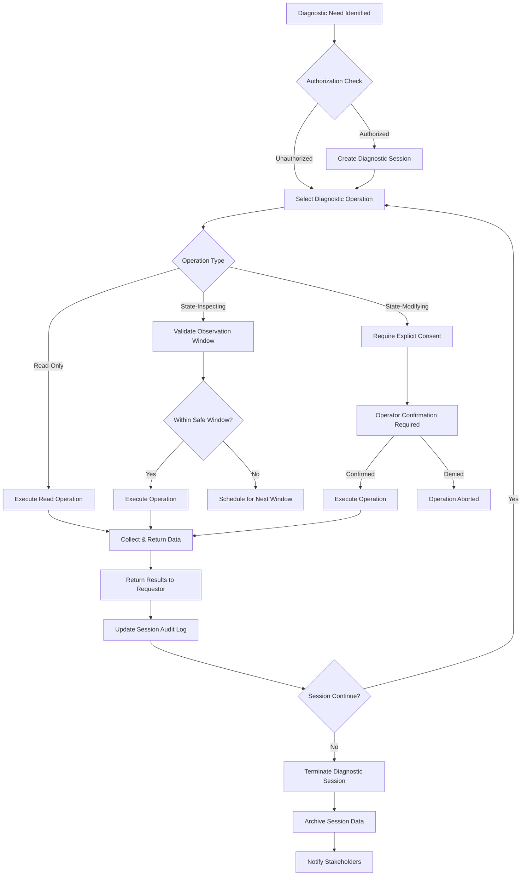
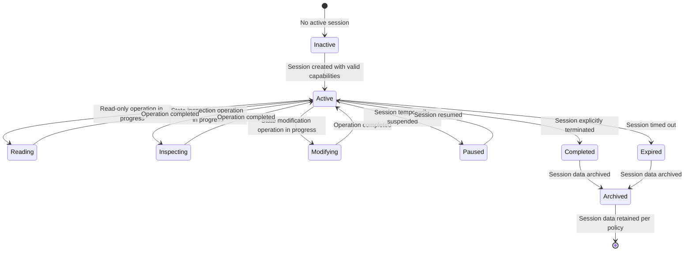
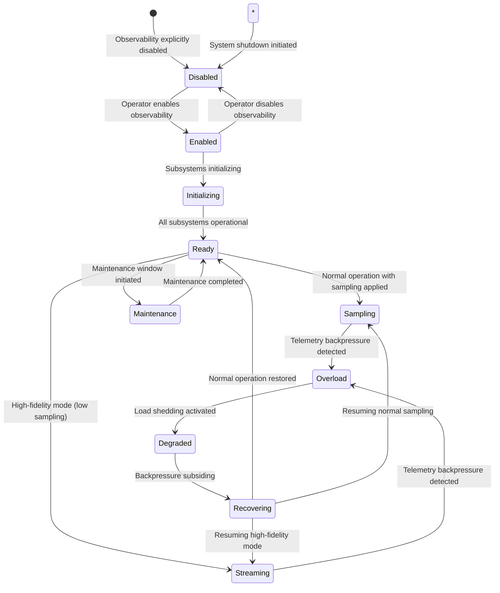

# 10.8 Runtime Observability & Diagnostics

## Purpose
The Runtime Observability & Diagnostics subsystem provides comprehensive observability and diagnostic capabilities for the AI Runtime (Part 10) while maintaining architectural independence from specific telemetry technologies. It defines the architectural principles, interfaces, and contracts for monitoring, tracing, logging, health checking, and runtime introspection that enable operators to understand system behavior, diagnose issues, and ensure operational correctness without compromising the AI-OS architectural invariants of determinism, isolation, and security.

## Design Philosophy
The observability architecture adheres to the following principles:
- **Observability by Design**: Monitoring, tracing, and logging capabilities are intrinsic to the runtime architecture, not afterthoughts.
- **Minimal Overhead**: Observability mechanisms MUST introduce negligible performance overhead (<1% CPU overhead under normal operation) when enabled at production levels.
- **Structured Telemetry**: All observable data MUST be structured, typed, and versioned to enable efficient processing and long-term compatibility.
- **Selective Sampling**: High-volume telemetry SHOULD support configurable sampling to balance observability needs with performance constraints.
- **Context Preservation**: Observability data MUST preserve causality and causality relationships across asynchronous boundaries without compromising determinism guarantees.
- **Security-Preserving**: Observability mechanisms MUST NOT compromise security boundaries or leak sensitive information through side channels.
- **Operator-Centric**: Diagnostics interfaces MUST provide actionable insights for operators while hiding implementation complexity.
- **Backward Compatibility**: Observability interfaces MUST maintain backward compatibility across minor versions to support evolving tooling.

## Observability Architecture
The observability architecture consists of four interconnected pillars that operate independently yet cohesively:

### Four Pillars of Observability
1. **Logging**: Structured, timestamped event records for discrete occurrences
2. **Metrics**: Aggregated numerical measurements over time for trend analysis
3. **Tracing**: Causal request/operation tracing across service boundaries
4. **Health Checking**: Active and passive mechanism for assessing system/component viability

These pillars are implemented through the Telemetry Collector component (see Section 10.1) which provides a unified interface for telemetry collection, processing, and export while maintaining strict isolation from workload execution contexts.

### Architectural Composition
```mermaid
graph TD
    subgraph Observability_Architecture[Observability Architecture]
        Telemetry_Collector[Telemetry Collector]:::component
        Logging_Service[Logging Service]:::component
        Metrics_Service[Metrics Service]:::component
        Tracing_Service[Tracing Service]:::component
        Health_Service[Health Service]:::component
        Diagnostic_Interface[Diagnostic Interface]:::component
        
        %% Data flows
        Logging_Service -->|Structured logs| Telemetry_Collector
        Metrics_Service -->|Metric samples| Telemetry_Collector
        Tracing_Service -->|Trace spans| Telemetry_Collector
        Health_Service -->|Health status| Telemetry_Collector
        Telemetry_Collector -->|Processed telemetry| External_Systems[External Systems]
        Diagnostic_Interface <-->|Query/command| Telemetry_Collector
        Diagnostic_Interface <-->|Live introspection| Runtime_Core[Runtime Core]
    end
    
    subgraph Runtime_Core[Runtime Core (Part 10)]
        Execution_Context[Execution Context Manager]
        Resource_Manager[Resource Manager]
        Workload_Scheduler[Workload Scheduler]
        Isolation_Enforcer[Isolation Enforcer]
        Event_System[Event System]
    end
    
    %% Cross-part connections
    EventSystem -->|Runtime events| Telemetry_Collector
    Resource_Manager -->|Resource usage| Metrics_Service
    Execution_Context -->|Execution events| Tracing_Service
    Isolation_Enforcer -->|Security events| Logging_Service
    
    classDef component fill:#e3f2fd,stroke:#1565c0,stroke-width:1px;
    classDef component fill:#fff3e0,stroke:#ef6c00,stroke-width:1px;
```

### Telemetry Data Flow
Telemetry data flows from instrumentation points within the runtime through dedicated services to the Telemetry Collector, which performs enrichment, sampling, and export to external systems while maintaining isolation boundaries.



## Diagnostic Model
The diagnostic model defines how system state is observed, queried, and manipulated for troubleshooting and analysis purposes.

### Core Principles
- **Non-Intrusive**: Diagnostic operations MUST NOT alter the deterministic behavior of workloads outside of explicitly designated observation windows.
- **Contextual Awareness**: Diagnostics MUST preserve causal relationships and execution context across asynchronous boundaries.
- **Selective Exposure**: Diagnostic capabilities MUST be gated by capability tokens and security policies to prevent unauthorized access.
- **Progressive Disclosure**: Diagnostic information SHOULD be available at increasing levels of detail based on operator expertise and authorization.
- **Replayability**: Diagnostic data MUST support deterministic replay for root cause analysis when combined with deterministic execution guarantees.

### Diagnostic Granularity Levels
The system provides four progressively detailed levels of diagnostic information:

1. **System Health**: Aggregate system status and resource utilization
2. **Component Status**: Individual runtime component operational state
3. **Workload Visibility**: Workload-level resource consumption and execution metrics
4. **Execution Insight**: Instruction-level tracing and memory inspection (requires special privileges)

### Diagnostic State Model


## Logging Architecture
The logging architecture provides structured, high-fidelity event recording for discrete occurrences within the runtime and workloads.

### Core Requirements
- **Structured Format**: All log entries MUST be structured objects with defined schema rather than free-form text.
- **Immutable Timestamps**: Log entries MUST contain monotonically increasing timestamps with configurable precision.
- **Context Propagation**: Log entries MUST automatically include trace IDs, span IDs, and resource context when available.
- **Level-Based Filtering**: Logs MUST support standard levels (TRACE, DEBUG, INFO, WARN, ERROR, FATAL) with runtime configurable thresholds.
- **Asynchronous Writing**: Logging operations MUST be asynchronous and non-blocking to workload execution.
- **Backpressure Handling**: Logging system MUST implement backpressure mechanisms to prevent system overload during log storms.
- **Tamper Evidence**: Log streams SHOULD include cryptographic chaining to detect tampering (when security policies require).

### Log Entry Structure
```json
{
  "timestamp": "2026-08-05T14:30:22.123456789Z",
  "timestampEpochNano": 1722876622123456789,
  "traceId": "0af7651916cd43dd8448eb211c80319c",
  "spanId": "b7ad6b7169203331",
  "traceFlags": 0x01,
  "severityText": "ERROR",
  "severityNumber": 17,
  "body": {
    "message": "Failed to allocate memory for tensor allocation",
    "attributes": {
      "request.id": "req_123abc",
      "workload.id": "wkl_456def",
      "component": "memory_allocator",
      "allocation.size": 1073741824,
      "allocation.type": "tensor",
      "error.code": "OUT_OF_MEMORY",
      "error.message": "Insufficient GPU memory available"
    }
  },
  "resource": {
    "service.name": "ai-runtime",
    "service.instance.id": "instance-7fg9hj0",
    "host.name": "worker-node-42",
    "container.name": "runtime-env-3"
  },
  "scope": {
    "name": "ai.runtime.memory",
    "version": "1.2.3"
  }
}
```

### Log Routing and Storage
Log data flows from instrumentation points through the Logging Service to the Telemetry Collector, which applies filtering, sampling, and routing rules before persisting to storage or forwarding to external systems.



## Metrics Architecture
The metrics architecture provides aggregated numerical measurements over time for system performance, resource utilization, and operational trends.

### Core Requirements
- **Dimensional Metrics**: Metrics MUST support multiple dimensions (labels/tags) for flexible querying and aggregation.
- **Multiple Types**: Support for counter, gauge, histogram, and summary metric types with appropriate semantics.
- **Atomic Updates**: Metric updates MUST be atomic and non-blocking to workload execution.
- **Aggregation Boundaries**: Metrics MUST support configurable aggregation windows (e.g., 10s, 1m, 5m).
- **Exponential Decay**: Histograms and summaries SHOULD support exponential decay sliding windows for responsive alerting.
- **Consistent Naming**: Metric names MUST follow a hierarchical naming convention (e.g., `runtime.memory.usage.bytes`).
- **Unit Standardization**: All metrics MUST specify standardized units based on IEC 80000 or UCUM standards.

### Metric Types and Semantics
| Type | Description | Use Case | Aggregation |
|------|-------------|----------|-------------|
| Counter | Monotonically increasing counter | Requests processed, errors counted | Sum |
| Gauge | Instantaneous value | Memory usage, queue length | Last value |
| Histogram | Distribution of values in buckets | Request latency, request size | Sum of counts, sum of values |
| Summary | Streaming quantiles | Response time percentiles | Approximate quantiles |

### Metric Collection Flow


### Metric Data Model
```json
{
  "metric": "runtime.workload.cpu.usage.percent",
  "unit": "percent",
  "type": "gauge",
  "timestamp": "2026-08-05T14:30:22.123Z",
  "value": 72.5,
  "attributes": {
    "workload.id": "wkl_abc123",
    "workload.type": "inference",
    "node.id": "node-07",
    "container.id": "cnt_xyz789"
  },
  "metadata": {
    "description": "CPU utilization percentage of workload",
    "version": "1.0"
  }
}
```

## Tracing Architecture
The tracing architecture provides causal request/operation tracing across service boundaries for understanding request flows and latency analysis.

### Core Requirements
- **Trace Context Propagation**: Trace context (trace ID, span ID, trace flags) MUST be propagated across all asynchronous boundaries.
- **Span Attributes**: Spaces MUST support key-value attributes for rich contextual information.
- **Event Logging**: Spaces MUST support timestamped event logging within the span.
- **Link Support**: Spaces MUST support links to other traces for causal relationships across trace boundaries.
- **Status Codes**: Spaces MUST support status codes (OK, ERROR, UNSET) with optional error messages.
- **Sampling Decisions**: Sampling decisions MUST be made at the root span and propagated to child spans.
- **Zero Configuration Instrumentation**: Runtime components SHOULD automatically generate spans for standard operations without developer instrumentation.
- **Backpressure Resilience**: Tracing system MUST gracefully handle trace data spikes without blocking traced operations.

### Span Context Structure
```json
{
  "traceId": "0af7651916cd43dd8448eb211c80319c",
  "spanId": "b7ad6b7169203331",
  "traceFlags": 0x01,
  "traceState": "ro=nn",
  "parentId": "92ecd4c8b846a1b3"  // null for root spans
}
```

### Span Data Model
```json
{
  "traceId": "0af7651916cd43dd8448eb211c80319c",
  "spanId": "b7ad6b7169203331",
  "parentSpanId": "92ecd4c8b846a1b3",
  "traceFlags": 0x01,
  "traceState": "ro=nn",
  "name": "tensor.inference",
  "kind": "INTERNAL",
  "startTime": "2026-08-05T14:30:22.123456789Z",
  "endTime": "2026-08-05T14:30:22.456789012Z",
  "status": {
    "code": "OK",
    "message": ""
  },
  "attributes": {
    "model.name": "resnet50",
    "model.version": "v2.1.0",
    "input.shape": "[1,3,224,224]",
    "input.type": "image",
    "device.type": "gpu",
    "device.id": "gpu0"
  },
  "events": [
    {
      "time": "2026-08-05T14:30:22.200000000Z",
      "name": "memory.allocation",
      "attributes": {
        "size": 1048576,
        "type": "tensor_buffer"
      }
    }
  ],
  "links": [
    {
      "traceId": "0af7651916cd43dd8448eb211c80319c",
      "spanId": "d4c5b6a7e8f9a0b1",
      "attributes": {
        "link.type": "batch_item"
      }
    }
  ]
}
```

### Trace Propagation Mechanism


## Health Monitoring
The health monitoring subsystem provides active and passive mechanisms for assessing system and component viability.

### Health Check Types
1. **Passive Health Indicators**: Metrics and events that indicate system health without active probing
2. **Active Health Probes**: Active requests to components to verify responsiveness and correctness
3. **Composite Health Checks**: Aggregated health assessments based on multiple component states
4. **Synthetic Transactions**: End-to-end workflow simulations to validate end-to-end functionality

### Health State Model


### Health Check Interface
Health checks MUST conform to a standardized interface:
```json
{
  "checkId": "memory_heap_usage",
  "name": "Heap Memory Usage",
  "description": "Monitor heap memory usage against configurable thresholds",
  "interval": "30s",
  "timeout": "5s",
  "timeoutAction": "MARK_UNHEALTHY",
  "failureThreshold": 3,
  "successThreshold": 2,
  "properties": {
    "warningThresholdPercent": 80,
    "criticalThresholdPercent": 95
  },
  "exec": {
    "type": "HTTP",
    "method": "GET",
    "path": "/health/memory/heap",
    "port": 8080,
    "scheme": "http",
    "httpHeaders": [
      {
        "name": "Authorization",
        "value": "Bearer ${HEALTH_CHECK_TOKEN}"
      }
    ]
  }
}
```

Health check execution results in:
```json
{
  "checkId": "memory_heap_usage",
  "status": "PASS",  // PASS, FAIL, TIMEOUT
  "timestamp": "2026-08-05T14:30:22.123Z",
  "durationMs": 12.5,
  "output": {
    "currentUsagePercent": 72.3,
    "warningThresholdPercent": 80,
    "criticalThresholdPercent": 95
  }
}
```

## Runtime Introspection
The runtime introspection subsystem provides capabilities for examining runtime internal state without perturbing execution (when possible) or within controlled observation windows.

### Introspection Capabilities
1. **Execution Context Inspection**: View active execution contexts, their resources, and execution state
2. **Resource Utilization Query**: Query current and historical resource allocation and usage
3. **Component State Inspection**: Examine internal state of runtime components (scheduler queues, memory pools, etc.)
4. **Event Stream Inspection**: Observe real-time event streams from the runtime event system
5. **Deterministic State Snapshots**: Capture deterministic snapshots of execution state for replay analysis
6. **Performance Profiling**: Collect performance profiling data with configurable overhead
7. **Dependency Graph Visualization**: Visualize component dependencies and communication patterns

### Introspection Access Model
Introspection capabilities MUST be gated by capability tokens and follow the principle of least privilege:
- **Observer Role**: Basic health and metrics visibility
- **Diagnostician Role**: Extended metrics, traces, and logs
- **Debugger Role**: Full introspection including memory inspection (requires explicit authorization)
- **Administrator Role**: Full system control including configuration modification

### Introspection Interface Example
```json
{
  "operation": "query_execution_contexts",
  "parameters": {
    "filter": {
      "status": ["RUNNING", "SUSPENDED"],
      "priority": { "min": 5 }
    },
    "fields": [
      "contextId",
      "workloadId",
      "status",
      "priority",
      "resourceUsage",
      "startTime"
    ],
    "limit": 100,
    "offset": 0
  },
  "capabilityToken": "ctx_obs_abc123_def456"
}
```

Response:
```json
{
  "operation": "query_execution_contexts",
  "result": [
    {
      "contextId": "ctx_789xyz",
      "workloadId": "wkl_abc123",
      "status": "RUNNING",
      "priority": 7,
      "resourceUsage": {
        "cpuPercent": 65.2,
        "memoryBytes": 536870912,
        "gpuUtilization": 78.5
      },
      "startTime": "2026-08-05T14:25:10.000Z"
    }
  ],
  "timestamp": "2026-08-05T14:30:22.123Z",
  "totalCount": 24
}
```

## Diagnostic Event Model
The diagnostic event model defines structured events emitted during diagnostic operations for audit, replay, and correlation purposes.

### Diagnostic Event Categories
1. **Diagnostic Session Events**: Session creation, modification, and termination
2. **Data Collection Events**: Initiation, progress, and completion of data collection operations
3. **Data Access Events**: Access to diagnostic data (reads, queries, exports)
4. **Intervention Events**: Diagnostic interventions that may affect system state (pauses, snapshots, injections)
5. **Security Events**: Access control decisions, privilege escalations, and policy violations related to diagnostics

### Diagnostic Event Structure
```json
{
  "eventId": "dgev_789xyz",
  "eventType": "diagnostic_session_start",
  "timestamp": "2026-08-05T14:30:22.123Z",
  "traceId": "0af7651916cd43dd8448eb211c80319c",  // optional correlation
  "spanId": "b7ad6b7169203331",                  // optional correlation
  "diagnosticSessionId": "ds_abc123",
  "initiator": {
    "type": "human_operator",
    "id": "op_jdoe",
    "authentication": {
      "method": "oauth2",
      "tokenType": "Bearer"
    }
  },
  "target": {
    "type": "workload",
    "id": "wkl_xyz789"
  },
  "operation": {
    "type": "memory_snapshot",
    "parameters": {
      "scope": "heap",
      "format": "raw"
    }
  },
  "authorization": {
    "granted": true,
    "capabilityToken": "ctx_dbg_xyz789_abc123",
    "policyId": "diag_memory_read"
  },
  "outcome": {
    "status": "SUCCESS",
    "details": {
      "snapshotId": "snap_456def",
      "sizeBytes": 1073741824,
      "durationMs": 124.5
    }
  }
}
```

## Diagnostic Lifecycle
The diagnostic lifecycle defines the structured approach to performing diagnostic operations while maintaining system stability and security.

### Diagnostic Workflow


### Diagnostic Session States


## Observability State Machine
The observability state machine defines how the observability subsystem manages its internal state and transitions based on system conditions and configuration changes.

### Observability States


### State Transition Conditions
| Transition | Trigger Condition | Action |
|------------|-------------------|--------|
| Disabled → Engineered | Observability enabled via configuration | Initialize all observability subsystems |
| Initializing → Ready | All subsystems report healthy | Begin accepting telemetry |
| Ready → Sampling | Normal operation mode | Apply configured sampling rates |
| Sampling → Overload | Telemetry queue depth > threshold | Activate load shedding protocols |
| Overload → Degraded | Sustained backpressure | Drop lower-priority telemetry |
| Degraded → Recovering | Queue depth below recovery threshold | Reduce load shedding |
| Recovering → Ready | Stable normal operation | Resume normal sampling |
| Ready → Maintenance | Maintenance window begins | Quiesce non-essential telemetry |
| Maintenance → Ready | Maintenance window ends | Resume normal operations |

## Diagnostic Contracts
Diagnostic contracts define the formal interfaces and protocols for interacting with the observability and diagnostics subsystems.

### Telemetry Export Contract
The telemetry export contract defines how telemetry data is exported to external systems.

#### Export Format Requirements
- **Format Agnosticism**: Exporters MUST support multiple formats (JSON, Protobuf, Avro, etc.)
- **Versioning**: Export formats MUST be versioned to support backward and forward compatibility
- **Batching**: Exporters SHOULD batch telemetry data for efficiency
- **Compression**: Exporters SHOULD support compression (gzip, snappy, lz4)
- **Encoding**: Exporters MUST specify character encoding (UTF-8 required for text formats)
- **Delivery Guarantees**: Exporters MUST specify delivery guarantees (at-least-once, at-most-once, exactly-once)

#### Export Endpoint Interface
```json
{
  "endpoint": {
    "type": "HTTP",
    "url": "https://telemetry.example.com/v1/metrics",
    "method": "POST",
    "headers": {
      "Content-Type": "application/json",
      "Authorization": "Bearer ${TELEMETRY_TOKEN}"
    }
  },
  "batchSettings": {
    "maxBatchSize": 1024,
    "maxBatchBytes": 1048576,
    "batchInterval": "5s"
  },
  "retryPolicy": {
    "maxAttempts": 3,
    "baseDelayMs": 100,
    "maxDelayMs": 5000,
    "retryOn": ["TIMEOUT", "CONNECTION_ERROR", "5XX"]
  },
  "encoding": {
    "format": "JSON",
    "version": "1.2",
    "compression": "NONE"
  }
}
```

### Diagnostic Access Contract
The diagnostic access contract defines how external entities can request diagnostic information.

#### Access Levels
| Level | Permissions | Required Capability |
|-------|-------------|---------------------|
| NONE | No diagnostic access | None |
| OBSERVER | Health checks, basic metrics | `obs_basic` |
| DIAGNOSTICIAN | Extended metrics, traces, logs | `obs_diagnostic` |
| DEBUGGER | Memory inspection, profiling | `obs_debugger` |
| ADMINISTRATOR | Full control, configuration | `obs_admin` |

#### Request Format
```json
{
  "requestId": "req_abc123",
  "operation": "query_trace",
  "parameters": {
    "traceId": "0af7651916cd43dd8448eb211c80319c",
    "maxSpans": 1000
  },
  "capabilityToken": "obs_diagnostic_xyz789",
  "timestamp": "2026-08-05T14:30:22.123Z"
}
```

#### Response Format
```json
{
  "requestId": "req_abc123",
  "operation": "query_trace",
  "status": "SUCCESS",
  "result": {
    "traceId": "0af7651916cd43dd8448eb211c80319c",
    "spans": [
      {
        "spanId": "b7ad6b7169203331",
        "parentSpanId": null,
        "name": "http.request",
        "startTime": "2026-08-05T14:30:22.123Z",
        "endTime": "2026-08-05T14:30:22.456Z",
        "attributes": {
          "http.method": "GET",
          "http.url": "/api/v1/inference",
          "http.status_code": 200
        }
      }
    ],
    "spanCount": 1
  },
  "timestamp": "2026-08-05T14:30:22.789Z",
  "processingTimeMs": 666
}
```

### Diagnostics Event Subscription Contract
Entities can subscribe to diagnostic event streams for real-time monitoring.

#### Subscription Request
```json
{
  "subscriptionId": "sub_xyz789",
  "eventTypes": ["diagnostic_session_start", "diagnostic_session_end", "intervention_executed"],
  "filter": {
    "severity": ["WARNING", "ERROR"],
    "resourceTypes": ["workload", "execution_context"]
  },
  "delivery": {
    "method": "WEBSOCKET",
    "endpoint": "ws://diagnostics.example.com/events",
    "heartbeatInterval": "30s"
  },
  "capabilityToken": "obs_diagnostic_abc123",
  "expiresAt": "2026-08-06T14:30:22.123Z"
}
```

#### Event Delivery Format
```json
{
  "subscriptionId": "sub_xyz789",
  "event": {
    "eventId": "dgev_456def",
    "eventType": "intervention_executed",
    "timestamp": "2026-08-05T14:35:10.456Z",
    "diagnosticSessionId": "ds_abc123",
    "operation": {
      "type": "memory_snapshot",
      "target": "wkl_xyz789"
    },
    "outcome": {
      "status": "SUCCESS"
    }
  }
}
```

## Security Requirements
Observability and diagnostics mechanisms MUST not compromise the security boundaries of the AI-OS.

### Core Security Principles
- **Least Privilege**: Diagnostic capabilities MUST be granted only with the minimum privileges necessary
- **Default Deny**: Access to diagnostic capabilities MUST be denied by default unless explicitly granted
- **Capability-Based Access**: All diagnostic access MUST be mediated through capability tokens
- **Auditability**: All diagnostic operations MUST be audited for security and compliance purposes
- **Data Protection**: Sensitive diagnostic data MUST be protected in transit and at rest
- **Side Channel Resistance**: Diagnostic mechanisms MUST resist timing and other side-channel attacks
- **Isolation Preservation**: Diagnostic operations MUST NOT compromise isolation between workloads or between workloads and runtime

### Security Controls
1. **Capability Tokens**: All diagnostic operations require valid, scoped capability tokens
2. **Authentication**: All diagnostic access points MUST require strong authentication
3. **Authorization**: All diagnostic operations MUST be checked against authorization policies
4. **Encryption**: All diagnostic data in transit MUST be encrypted using approved protocols (TLS 1.3+)
5. **Integrity Protection**: Diagnostic data MUST be protected against tampering using cryptographic hashing
6. **Audit Logging**: All diagnostic access attempts (successful and failed) MUST be logged
7. **Session Timeout**: Diagnostic sessions MUST automatically expire after a configurable period
8. **Rate Limiting**: Diagnostic interfaces MUST implement rate limiting to prevent abuse
9. **Input Validation**: All diagnostic inputs MUST be validated to prevent injection attacks
10. **Output Sanitization**: Diagnostic outputs MUST be sanitized to prevent information leakage

### Security Threat Model
| Threat | Mitigation |
|--------|------------|
| Unauthorized diagnostic access | Capability-based access control with default deny |
| Privilege escalation via diagnostics | Principle of least privilege; separate capability types |
| Information leakage through diagnostics | Data classification; output sanitization; access controls |
| Denial of service via diagnostic overload | Rate limiting; queue bounds; load shedding |
| Tampering with diagnostic data | Cryptographic integrity protection; audit trails |
| Side-channel attacks via timing | Constant-time operations where feasible; noise injection |
| Diagnostic tool compromise | Sandboxing; least privilege execution; code signing |

## Privacy Requirements
Observability and diagnostics MUST respect user privacy and data protection regulations.

### Privacy Principles
- **Data Minimization**: Collect only the data necessary for the specified purpose
- **Purpose Limitation**: Use diagnostic data only for the purposes for which it was collected
- **Consent**: Obtain explicit consent for collecting personally identifiable information (PII)
- **Transparency**: Be transparent about what data is collected and how it is used
- **Data Subject Rights**: Provide mechanisms for data access, correction, and deletion
- **Storage Limitation**: Retain diagnostic data only for as long as necessary
- **Integrity and Confidentiality**: Protect diagnostic data against unauthorized access and alteration

### Privacy Controls
1. **PII Detection and Redaction**: Automatically detect and redact PII from diagnostic data unless explicitly authorized
2. **Data Tagging**: Tag diagnostic data with sensitivity levels and retention requirements
3. **Consent Management**: Implement mechanisms to record and honor user consent for data collection
4. **Anonymization**: Provide options to anonymize or pseudonymize diagnostic data
5. **Access Monitoring**: Monitor and alert on unusual access patterns to diagnostic data
6. **Data Lifecycle Management**: Implement automated retention and deletion policies based on data classification
7. **Cross-Border Transfer Controls**: Ensure compliance with data transfer restrictions when exporting diagnostic data

### Special Considerations for AI Workloads
- **Model Intellectual Property**: Protect model parameters and architecture details from unauthorized extraction
- **Training Data Privacy**: Prevent inadvertent exposure of training data through diagnostic mechanisms
- **User Interaction Privacy**: Protect user interaction data collected during interactive AI sessions
- **Inference Privacy**: Prevent reconstruction of sensitive inputs from diagnostic side channels
- **Federated Learning Considerations**: Ensure diagnostic mechanisms do not compromise federated learning privacy guarantees

## Runtime Invariants
The observability and diagnostics subsystem MUST preserve the following runtime invariants:

### Observation Invariant
**Observational Non-Interference**: Observability operations conducted within authorized observation windows MUST NOT alter the deterministic behavior of workloads outside those windows, except for explicitly permitted interventions.

*Measurement*: Compare workload outputs with and without observation (using identical inputs and seeds)  
*Test*: Run identical workloads with observation enabled/disabled and compare bit-for-bit output  
*Implementation Independence*: Applies to any observation mechanism  
*Architectural Level*: Core execution property  

### Security Invariant
**Diagnostic Non-Escapement**: Diagnostic operations MUST NOT enable workloads to escalate privileges or escape their designated execution domains.

*Measurement*: Attempt privilege escalation through diagnostic interfaces  
*Test*: Penetration testing targeting diagnostic interfaces  
*Implementation Independence*: Applies to any access control mechanism  
*Architectural Level*: Fundamental security property  

### Resource Invariant
**Observation Bounded Overhead**: The observability subsystem MUST consume no more than its allocated resource quota under all conditions.

*Measurement*: Monitor resource consumption of observability components  
*Test*: Load testing with maximum telemetry load  
*Implementation Independence*: Applies to any resource management approach  
*Architectural Level*: Core resource management property  

### Reliability Invariant
**Observation Graceful Degradation**: When observability resources are exhausted, the subsystem MUST gracefully degrade functionality rather than fail catastrophically.

*Measurement*: Observe system behavior under resource exhaustion  
*Test*: Exhaust diagnostic subsystem resources and observe response  
*Implementation Independence*: Applies to any degradation strategy  
*Architectural Level*: Core reliability property  

## Cross-Part Integration
The observability and diagnostics subsystem MUST integrate with other AI-OS parts while maintaining architectural independence.

### Integration with EventBus (Part 2)
- **Event Publication**: Observability subsystem PUBLISHES diagnostic events to EventBus using standard event envelopes
- **Event Subscription**: Observability subsystem SUBSCRIBES to relevant system events (lifecycle, configuration changes) for contextual enrichment
- **Event Replay**: Observability subsystem SUPPORTS replay of diagnostic events for forensic analysis
- **Dead Letter Handling**: Observability subsystem HANDLES EventBus dead letter queues for failed event deliveries

### Integration with Security (Part 3)
- **Capability Validation**: Observability subsystem DEPENDS ON Security subsystem to VALIDATE capability tokens for diagnostic access
- **Policy Enforcement**: Observability subsystem ENFORCES Security-defined access control policies
- **Audit Integration**: Observability subsystem PROVIDES diagnostic audit events to Security subsystem for correlation
- **Secure Channel Establishment**: Observability subsystem DEPENDS ON Security for ESTABLISHING secure communication channels

### Integration with Memory (Part 4)
- **Memory Allocation**: Observability subsystem UTILIZES Memory allocation interfaces for internal data structures
- **Snapshot Consistency**: Observability subsystem RELIES ON Memory consistency models for consistent state snapshots
- **Memory Usage Monitoring**: Observability subsystem CONSUMES Memory allocation interfaces to monitor its own memory usage
- **Consistent Checkpoints**: Observability subsystem DEPENDS ON Memory for consistent checkpoint/restore of diagnostic state

### Integration with Learning (Part 5)
- **Observation Hooks**: Observability subsystem PROVIDES observation hooks that allow Learning to MONITOR workloads without perturbing determinism
- **Telemetry Provision**: Observability subsystem PROVIDES execution telemetry (metrics, traces, logs) for Learning model training and inference
- **Observation Sampling**: Observability subsystem SUPPORTS Learning-defined observation sampling rates
- **Non-Interference Guarantee**: Observability subsystem ENSURES Learning observation does NOT compromise workload reproducibility guarantees

### Integration with Infrastructure (Part 6)
- **Resource Abstractions**: Observability subsystem UTILIZES Infrastructure resource abstractions for resource management
- **Hardware Abstraction**: Observability subsystem DEPENDS ON Infrastructure for hardware-specific optimizations (when available)
- **Network Abstraction**: Observability subsystem UTILIZES Infrastructure network abstractions for telemetry export
- **Storage Abstraction**: Observability subsystem UTILIZES Infrastructure storage abstractions for persistent diagnostic data

### Integration with Plugins (Part 7)
- **Extension Points**: Observability subsystem PROVIDES extension points for Plugins to CUSTOMIZE telemetry collection and processing
- **Isolation Enforcement**: Observability subsystem ENFORCES plugin adherence to observability extension contracts and security boundaries
- **Versioned Interfaces**: Observability subsystem PROVIDES versioned plugin interfaces to maintain compatibility
- **Failure Isolation**: Observability subsystem ISOLATES plugin failures to prevent propagation to core observability or workloads

### Integration with Agent Management (Part 9)
- **Task Consumption**: Observability subsystem CONSUMES task definitions from Agent Management for diagnostic task execution
- **Result Reporting**: Observability subsystem PROVIDES task execution results and lifecycle status back to Agent Management
- **Quota Enforcement**: Observability subsystem ENFORCES Agent Management-defined resource quotas for diagnostic operations
- **Placement Constraints**: Observability subsystem SUPPORTS Agent Management workload placement constraints for diagnostic resources
- **Telemetry Provision**: Observability subsystem PROVIDES execution telemetry for Agent Management workload optimization and rescheduling

### Integration with AI Core Services (Part 8)
- **Workload Execution**: Observability subsystem EXECUTES workload types defined in AI Core Services (inference, training, preprocessing)
- **Service Interface Compliance**: Observability subsystem PROVIDES execution interfaces compliant with AI Core Services service contracts
- **Specification Consumption**: Observability subsystem CONSUMES AI Core Services workload specifications for admission and scheduling
- **Event Consumption**: Observability subsystem EMITS execution events consumed by AI Core Services for monitoring and adaptation
- **Format Compatibility**: Observability subsystem MAINTAINS compatibility with AI Core Services data formats and service contracts
- **Priority Support**: Observability subsystem SUPPORTS AI Core Services-defined workload prioritization and resource profiles
- **Determinism Preservation**: Observability subsystem PROVIDES execution context isolation that preserves AI Core Services deterministic guarantees

## Behavioural Contracts
The observability and diagnostics subsystem MUST adhere to the following behavioural contracts:

### Telemetry Emission Contract
1. **Mandatory Emission**: The runtime MUST emit core telemetry events (lifecycle, resource, health) by default
2. **Configurable Verbosity**: Telemetry verbosity MUST be configurable without code changes
3. **Backward Compatibility**: Telemetry schema versions MUST be backward compatible within major versions
4. **Forward Compatibility**: Telemetry consumers MUST be designed to gracefully handle unknown fields
5. **At-Least-Once Delivery**: Critical telemetry events MUST be delivered with at-least-once guarantee
6. **Ordering Preservation**: Telemetry events from a single source MUST preserve chronological order

### Diagnostic Access Contract
1. **Explicit Consent**: Diagnostic operations requiring workload perturbation MUST obtain explicit operator consent
2. **Least Privilege**: Diagnostic capabilities MUST be granted using the principle of least privilege
3. **Audit Trail**: All diagnostic operations MUST generate audit entries in the security event stream
4. **Session Boundaries**: Diagnostic operations MUST be confined to explicitly defined sessions with timeouts
5. **Isolation Preservation**: Diagnostic operations MUST NOT violate isolation boundaries between workloads
6. **Determinism Protection**: Diagnostic observation MUST NOT alter deterministic execution outside observation windows

### Health Monitoring Contract
1. **Passive Monitoring**: Health monitoring MUST primarily rely on passive observation of metrics and events
2. **Active Probing Limits**: Active health probes MUST be rate-limited and resource-bounded
3. **Failure Prediction**: Health monitoring SHOULD provide predictive indicators of impending failures
4. **Composite Health**: System health MUST be derived from individual component health states
5. **Graceful Degradation**: Health reporting MUST continue partially even when some health checks fail
6. **Remediation Guidance**: Health check results SHOULD include suggested remediation actions

### Observability Overhead Contract
1. **Bounded Overhead**: Observability overhead MUST NOT exceed 1% CPU under normal operation with production settings
2. **Configurable Sampling**: High-volume telemetry MUST support configurable sampling rates
3. **Adaptive Sampling**: Observability subsystem SHOULD implement adaptive sampling based on system load
4. **Overhead Visibility**: Observability subsystem MUST expose its own resource consumption as telemetry
5. **Load Shedding**: Observability subsystem MUST implement load shedding under extreme load conditions
6. **Minimum Viable Observability**: A minimal set of observability MUST remain available even under severe constraints

## Implementation Guidance (Non-Normative)
This section provides non-normative guidance for implementing the observability and diagnostics architecture. Implementations MAY use the technologies and patterns described below, but are NOT required to do so.

### Technology Agnosticism
The architecture is intentionally technology-agnostic. Implementations MAY choose from various technologies including but not limited to:
- **Telemetry Collection**: Custom implementations, specialized agents, or sidecar patterns
- **Transport Protocols**: gRPC, HTTP/2, HTTP/3, Kafka, Pulsar, or custom binary protocols
- **Storage Solutions**: Time-series databases (InfluxDB, TimescaleDB), object storage (S3, MinIO), or embedded databases
- **Visualization Tools**: Custom dashboards, Grafana, Kibana, or purpose-built interfaces
- **Alerting Systems**: Custom alerting engines, Prometheus Alertmanager, or cloud-native solutions
- **Tracing Implementations**: Custom tracing systems, Jaeger, Zipkin, or cloud tracing services
- **Logging Frameworks**: Custom logging, Fluentd/Fluent Bit, Logstash, or cloud logging services

### Recommended Patterns
1. **Sidecar Pattern**: Implement observability functions as sidecar processes to maintain isolation from workloads
2. **Pipeline Architecture**: Implement telemetry processing as a pipeline (collection → processing → storage/export)
3. **Microservices Decomposition**: Decompose observability functions into independently scalable services
4. **Circuit Breaker Pattern**: Use circuit breakers for external dependencies to prevent cascade failures
5. **Bulkhead Pattern**: Isolate different types of telemetry (logs, metrics, traces) to prevent resource contention
6. **Observer Pattern**: Use observer patterns for real-time telemetry consumption and alerting
7. **Strategy Pattern**: Implement pluggable sampling strategies for adaptive telemetry collection
8. **Decorator Pattern**: Use decorators to add observability concerns to core runtime functions without modification

### Sampling Strategies
1. **Head-Based Sampling**: Make sampling decisions at the trace inception point
2. **Tail-Based Sampling**: Make sampling decisions based on trace completion and characteristics
3. **Probabilistic Sampling**: Sample traces with a fixed probability
4. **Rate-Limiting Sampling**: Limit the number of samples per time window
5. **Adaptive Sampling**: Dynamically adjust sampling rate based on traffic volume and system load
6. **Stratified Sampling**: Ensure minimum sampling rates for important trace categories

### Overhead Optimization Techniques
1. **Batching**: Batch telemetry data before transmission to reduce network overhead
2. **Compression**: Compress telemetry data using efficient algorithms (Snappy, LZ4, Zstandard)
3. **Asynchronous Processing**: Use asynchronous I/O and non-blocking data structures
4. **Lock-Free Data Structures**: Employ lock-free queues and hash tables for high-throughput scenarios
5. **Object Pooling**: Reuse objects to reduce garbage collection pressure
6. **Zero-Copy Techniques**: Utilize zero-copy buffers where possible to reduce data copying
7. **Efficient Serialization**: Use efficient serialization formats (Protobuf, Cap'n Proto, FlatBuffers)
8. **Selective Instrumentation**: Dynamically enable/disable instrumentation based on value and cost

### Security Implementation Guidelines
1. **Capability Tokens**: Implement capability tokens as cryptographically signed JSON Web Tokens (JWT) or similar
2. **Mutual TLS**: Use mutual TLS for service-to-service communication in distributed deployments
3. **Input Validation**: Implement strict input validation using allowlists where possible
4. **Output Encoding**: Properly encode outputs to prevent injection attacks (HTML, JSON, SQL, etc.)
5. **Principle of Least Privilege**: Run observability components with minimal required privileges
6. **Secrets Management**: Use secure secrets management for tokens, certificates, and keys
7. **Audit Logging**: Implement immutable audit logs for all security-relevant operations
8. **Regular Penetration Testing**: Conduct regular security assessments of observability endpoints

### Privacy Implementation Guidelines
1. **PII Detection**: Implement automated PII detection using regex patterns, machine learning, or hybrid approaches
2. **Redaction Techniques**: Use configurable redaction rules (masking, hashing, tokenization) for PII
3. **Data Tagging**: Implement metadata tagging for data classification and retention policies
4. **Consent Storage**: Store consent records in tamper-evident storage with expiration tracking
5. **Anonymization**: Implement k-anonymity, l-diversity, or differential privacy techniques where appropriate
6. **Access Monitoring**: Implement user and entity behavior analytics (UEBA) for anomaly detection
7. **Data Lifecycle Automation**: Automate data retention and deletion based on policies and regulations
8. **Geofencing**: Implement geographic restrictions for data storage and processing when required

### Observability Implementation Guidelines
1. **Metrics Implementation**: Use histogram buckets aligned with SLIs/SLAs for meaningful alerting
2. **Logging Structure**: Enforce consistent logging structure with mandatory fields (timestamp, level, trace context)
3. **Trace Context Propagation**: Use standardized context propagation (W3C TraceContext) for interoperability
4. **Health Check Design**: Implement idempotent health checks with clear pass/fail criteria
5. **Resource Isolation**: Use OS-level primitives (cgroups, namespaces) to isolate observability resource consumption
6. **Backpressure Handling**: Implement reactive streams or bounded queues to handle traffic spikes
7. **Observability of Observability**: Implement self-observability to monitor the health of the observability system itself
8. **Feature Flags**: Use feature flags to enable/disable advanced observability features without redeployment

## Open Questions
The following questions remain open for further refinement and implementation experience:

1. **Adaptive Sampling Algorithms**: What adaptive sampling algorithms provide the best balance between observability fidelity and overhead reduction for AI workloads?
2. **Cross-Normal Form Telemetry**: How should the system handle telemetry that spans multiple normalization forms (e.g., mixed metrics and traces in a single event)?
3. **Diagnostic Transaction Semantics**: Should the system support ACID-like transactional semantics for diagnostic operations that span multiple systems?
4. **Observability SLA Definition**: How should observability SLAs be defined and measured in relation to workload SLAs?
5. **Hardware-Assisted Observability**: How can specialized hardware features (Intel PT, AMD PT, ARM ETM) be leveraged for low-overhead tracing?
6. **Quantum-Resistant Security**: What quantum-resistant cryptographic approaches should be considered for securing diagnostic data and capabilities?
7. **Federated Observability**: How should observability be implemented in federated learning scenarios where data and computation are distributed?
8. **AI-Driven Anomaly Detection**: How can machine learning be leveraged within the observability system for predictive anomaly detection?
9. **Observability Cost Modeling**: How should organizations model and optimize the cost of observability in relation to its value?
10. **Standards Evolution**: How should the observability architecture evolve to accommodate emerging standards like OpenTelemetry while maintaining independence?
11. **Container-Native Optimizations**: What optimizations are specific to containerized environments (Kubernetes, containerd, etc.)?
12. **Edge Computing Considerations**: How should observability be adapted for resource-constrained edge computing environments?
13. **Security Observability Integration**: How should security telemetry (audit logs, threat detection) be integrated with operational observability?
14. **Multi-Tenant Isolation**: How can observability provide strong isolation guarantees in multi-tenant environments?
15. **Disaster Recovery Observability**: How should observability function during disaster recovery scenarios when primary systems are unavailable?

These questions represent areas where implementation experience and evolving standards will inform future refinements to the observability and diagnostics architecture.