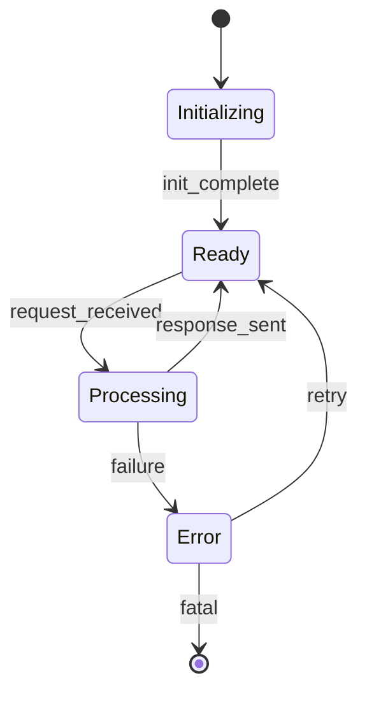

# Architecture Improvement Prompt

**Version:** 1.0  
**Scope:** AI-OS Architecture Parts 10–20  
**Purpose:** Transform review findings into production-quality architecture improvements while preserving consistency with the existing specification.

---

## 1. Improvement Philosophy

### 1.1 Core Principle
**Improve without losing identity.** Every change must strengthen the architecture while preserving its conceptual integrity, terminology, numbering scheme, and rhetorical voice.

### 1.2 Guiding Values
| Value | Application |
|-------|-------------|
| **Consistency over novelty** | Prefer aligning with existing patterns over introducing new ones |
| **Precision over brevity** | Technical depth is mandatory; verbosity is acceptable when it clarifies |
| **Traceability over speed** | Every recommendation must map to a review finding; no speculative additions |
| **Completeness over minimalism** | Full sections, not diffs; the output must stand alone as a coherent document |

### 1.4 Non-Goals
- Do not refactor for stylistic preferences unrelated to review findings
- Do not modernize terminology that is already established in Parts 1–9
- Do not collapse or merge sections unless explicitly recommended by the review
- Do not remove "redundant" cross-references—they are intentional navigation aids

---

## Simplicity Rule

**Architecture improvements must preserve conceptual simplicity.**

The AI must never introduce:

- **Unnecessary components** — no new components, services, or modules unless a review finding explicitly requires them
- **Unnecessary services** — no new service boundaries or deployment units without documented architectural justification
- **Unnecessary abstractions** — no abstraction layers, interfaces, or indirection that do not solve a current, documented problem
- **Speculative extensibility** — no hooks, extension points, or plugin architectures for hypothetical future requirements
- **Premature optimization** — no caching, pooling, or performance optimizations without measured evidence of need
- **Excessive configuration** — no configuration keys that could be constants; prefer sensible defaults over configurability
- **Unnecessary lifecycle states** — no states in state machines that are not reachable from a documented transition

**Every newly introduced concept must solve a documented architectural problem identified in the review.**

**Prefer the simplest architecture that satisfies all functional and non-functional requirements.**

**Enforcement**: Any proposed addition (component, service, abstraction, interface, lifecycle state, configuration key, optimization) must cite the specific review finding ID that necessitates it. If no finding exists, the addition is rejected. The burden of proof is on the addition, not the status quo.

---

## 2. Editing Philosophy

### 2.1 When to Expand
Expand existing content when:
- A review identifies **missing detail** in a subsection (e.g., "failure modes unspecified")
- A **new requirement** emerges that fits naturally within an existing section
- **Clarification** is needed for ambiguous phrasing without changing intent
- **Examples** or **pseudocode** would eliminate implementation ambiguity
- **Cross-references** to other parts are missing but needed for navigation

### 2.2 When to Rewrite
Rewrite a subsection entirely when:
- The review identifies **fundamental errors** (incorrect state machine, wrong contract)
- The **architectural intent** has shifted and the current text reflects the old intent
- **Contradictions** exist within the section that cannot be resolved by editing
- The **structure itself** is flawed (e.g., lifecycle phases in wrong order)
- The subsection violates the **Simplicity Rule** and must be restructured

### 2.3 When to Insert New Subsections
Insert new subsections when:
- The review identifies a **missing architectural concern** (e.g., no security model, no observability hooks)
- A **cross-cutting concern** requires dedicated treatment (e.g., configuration schema, conformance tests)
- A new **component type** or **integration pattern** is introduced
- **Numbering gaps** exist that would be filled logically (preserve hierarchical numbering)

### 2.4 When to Preserve
Preserve existing content verbatim when:
- The review has **no findings** against that subsection
- The content represents **established architectural decisions** from Parts 1–9
- **Terminology definitions** or **contract signatures** are referenced elsewhere
- **Diagrams** or **tables** are accurate and complete
- The content correctly implements a review finding and requires no further change

### 2.5 When to Remove
Remove content only when:
- The review explicitly identifies the content as **incorrect**, **obsolete**, or **contradictory**
- A component, interface, or state machine is **decommissioned** and replaced by a simpler design
- **Duplicate** content exists that creates maintenance burden and confusion
- **Speculative** elements (hooks, extension points, unused configuration) violate the Simplicity Rule
- The content introduces **circular dependencies** or **contradictions** that cannot be resolved by editing

**Minimization Principle**: Every edit (expand, rewrite, insert, remove) must trace to a specific review finding. The default action is **preserve**. The burden of proof is on change, not stasis.

---

## 3. Quality Standards

### 3.1 Architecture Standards
| Standard | Requirement |
|----------|-------------|
| **Component Responsibilities** | Every component has a single, clearly stated purpose; no orphan responsibilities |
| **Contracts** | All interfaces defined with preconditions, postconditions, invariants, and error codes |
| **Lifecycle** | Explicit states, transitions, entry/exit actions, and timeout handling |
| **State Machines** | Deterministic; all states reachable; no implicit transitions; guard conditions documented |
| **EventBus Integration** | Event schemas named; publishing/subscribing contracts specified; ordering guarantees stated |
| **Security** | Threat model referenced; trust boundaries drawn; authentication/authorization flows explicit |
| **Failure Handling** | Failure modes enumerated; detection, isolation, recovery procedures per mode |
| **Recovery** | RTO/RPO targets stated; data consistency guarantees; manual vs. automatic recovery |
| **Scalability** | Horizontal/vertical scaling paths; bottlenecks identified; capacity models referenced |
| **Observability** | Metrics, logs, traces specified per component; SLOs defined; alerting thresholds |
| **Performance** | Latency budgets, throughput targets, resource profiles; benchmarks referenced |
| **Configuration** | Schema with types, defaults, validation rules, environment overrides, feature flags |
| **Conformance** | Test vectors, compliance matrices, certification criteria for each contract |

### 3.2 Documentation Standards
| Standard | Requirement |
|----------|-------------|
| **Writing Style** | Present tense, active voice, third person; "The component validates..." not "Validates..." |
| **Terminology** | Use the project glossary verbatim; define new terms on first use; never alias established terms |
| **Numbering** | Hierarchical (10.1, 10.1.1, 10.1.1.1); never skip levels; never renumber existing sections |
| **Cross-References** | Format: `§<section>` for same part; `Part <n> §<section>` for other parts; always bidirectional |
| **Diagrams** | Mermaid syntax; titled; numbered (Figure 10.x); caption explains intent, not just structure |
| **Tables** | Markdown; headers bold; units in headers; sortable by logical column |
| **Code/Pseudocode** | Fenced blocks with language hint; variable names match contract signatures |
| **Completeness** | No "TBD", "TODO", or placeholder text; every subsection ships complete |

### 3.3 Production Readiness Standards
| Standard | Requirement |
|----------|-------------|
| **Implementation Readiness** | Sufficient detail for a competent engineer to implement without architectural decisions |
| **Testability** | Every contract has observable acceptance criteria; state machines have transition coverage targets |
| **Operability** | Runbooks referenced; degraded-mode behavior specified; feature flags for risky paths |
| **Deployability** | Versioning scheme; migration strategy; rollback procedure; dependency declarations |

---

## 4. Consistency Maintenance

### 4.1 Consistency with Previous Parts (1–9)
Before editing, verify:
- [ ] **Terminology** matches the authoritative definitions in Part 1 §2 and Part 2 §3
- [ ] **Component names** match the registry in Part 3 §4.1
- [ ] **Event names** match the EventBus catalog in Part 4 §5
- [ ] **State names** match the lifecycle definitions in Part 5 §3
- [ ] **Security principals** match the trust model in Part 6 §2
- [ ] **Failure codes** match the taxonomy in Part 7 §4
- [ ] **Configuration keys** match the schema in Part 8 §2
- [ ] **Observability signals** match the telemetry spec in Part 9 §3

### 4.2 Internal Consistency Within the Section
During editing, enforce:
- [ ] **No contradictory constraints** on the same component (e.g., "stateless" in 10.2, "caches state" in 10.4)
- [ ] **Lifecycle states** referenced in contracts match the state machine diagram
- [ ] **Event schemas** in EventBus integration match the contracts that publish them
- [ ] **Error codes** in failure handling match the contract postconditions
- [ ] **Configuration keys** referenced in component docs exist in the configuration schema
- [ ] **Metrics names** in observability match the telemetry spec naming convention
- [ ] **Runtime contracts**: preconditions, postconditions, invariants hold across all code paths
- [ ] **Invariant preservation**: no code path violates documented invariants
- [ ] **EventBus behavior**: publish/subscribe semantics, ordering, delivery guarantees consistent
- [ ] **Security model**: trust boundaries, authN/authZ flows, audit requirements consistent

### 4.3 Cross-Part Consistency Checks
Before finalizing, verify against **all previous parts**:
- [ ] **Terminology**: Zero deviations from glossary (Part 1 §2, Part 2 §3)
- [ ] **Component registry**: Names, responsibilities, interfaces match Part 3
- [ ] **EventBus catalog**: Event names, schemas, semantics match Part 4
- [ ] **Lifecycle definitions**: State names, transitions match Part 5
- [ ] **Trust model**: Principals, zones, policies match Part 6
- [ ] **Failure taxonomy**: Codes, categories, handling match Part 7
- [ ] **Configuration schema**: Keys, types, defaults, validation match Part 8
- [ ] **Telemetry spec**: Signal names, types, SLOs match Part 9

### 4.4 Avoiding Contradictions
When a review recommends a change that appears to conflict with existing text:
1. **Locate all references** to the affected concept (grep across the part)
2. **Determine authoritative source** (earlier subsection, or Parts 1–9)
3. **Apply the minimal change set** that resolves the contradiction
4. **Add a cross-reference note** if the resolution is non-obvious
5. **Never** leave contradictory statements in the final output

---

## 5. Diagram Integration

### 5.1 When to Add Diagrams
Add a diagram when:
- The review explicitly requests visualization of a complex interaction
- A state machine has >4 states or >6 transitions
- An event flow involves >3 components
- A deployment topology is described but not shown

### 5.2 Diagram Standards


### 5.3 Diagram Placement
- Place immediately after the subsection that describes the concept
- Reference in text: "Figure 10.3 illustrates the state machine"
- Never place diagrams in isolation; always accompany with prose

---

## 6. Readability Improvements (Non-Removal)

### 6.1 Permitted Enhancements
| Enhancement | Constraint |
|-------------|------------|
| **Paragraph breaks** | Add where density exceeds 8 lines; never split a logical unit |
| **Inline emphasis** | Bold for first-use terms; italic for cross-references; never for warnings |
| **Bullet reformatting** | Convert dense inline lists to structured bullets; preserve order |
| **Table alignment** | Fix column widths; add units; sort logically |
| **Sentence clarification** | Split compound sentences; replace pronouns with nouns; preserve meaning |
| **Anchor links** | Add `<!-- anchor: <section-id> -->` before each numbered heading |

### 6.2 Prohibited Changes
- Removing "redundant" explanations that serve as cross-part bridges
- Collapsing multiple paragraphs into one for "flow"
- Replacing technical terms with simpler synonyms
- Removing defensive phrasing ("must not", "shall not", "is prohibited")
- Changing passive to active voice when the actor is the system (not a human)

---

## 7. Acceptance Criteria

The improved section is accepted when **all** criteria are met:

### 7.1 Review Coverage
- [ ] Every **valid** review finding is addressed (implemented, or explicitly deferred with rationale)
- [ ] No **invalid** review finding is implemented (document why rejected in a comment block)
- [ ] No **new findings** introduced by the improvements themselves

### 7.2 Architectural Integrity
- [ ] All component responsibilities remain single and cohesive
- [ ] All contracts have complete pre/post/invariant/error specifications
- [ ] All state machines are deterministic and fully specified
- [ ] All EventBus integrations have schemas and ordering guarantees
- [ ] Security model is consistent with Parts 6–7
- [ ] Failure modes cover all identified risks; recovery procedures are actionable
- [ ] Scalability claims have quantitative backing or explicit "not yet modeled" notes
- [ ] Observability signals map 1:1 to SLOs and alerting rules
- [ ] Performance budgets are traceable to system-level SLAs
- [ ] Configuration schema validates all referenced keys
- [ ] Conformance criteria are testable and automatable

### 7.3 Documentation Quality
- [ ] Zero TBD/TODO/placeholder text
- [ ] All cross-references resolve (check with link validator)
- [ ] All diagrams render (Mermaid syntax valid)
- [ ] All tables parse (Markdown valid)
- [ ] Terminology 100% consistent with glossary
- [ ] Numbering sequential and hierarchical
- [ ] Writing style conforms to §3.2

### 7.4 Production Readiness
- [ ] Implementation detail sufficient for estimation (±20%)
- [ ] Test vectors provided for every contract
- [ ] Degraded-mode behavior specified for every component
- [ ] Rollback procedure documented for every stateful change
- [ ] Versioning and migration strategy stated

---

## 8. Final Validation Checklist

Execute **in order** before considering the output complete:

| Step | Action | Tool/Method | Category |
|------|--------|-------------|----------|
| 1 | **Diff against original** | `git diff` — verify only review-driven changes | Internal Consistency |
| 2 | **Simplicity audit** | Verify every addition cites a review finding ID; no speculative elements | Architectural Completeness |
| 3 | **Cross-reference scan** | Grep `§` and `Part` — all resolve to existing sections | Cross-Part Consistency |
| 4 | **Terminology audit** | Grep glossary terms — zero deviations | Cross-Part Consistency |
| 5 | **Numbering audit** | Extract all headings — sequential, no gaps, no duplicates | Architectural Completeness |
| 6 | **Diagram render test** | Paste Mermaid blocks into renderer — zero errors | Implementation Readiness |
| 7 | **Contract completeness** | For each interface: pre/post/invariant/errors present | Implementation Readiness |
| 8 | **State machine validation** | For each: all states reachable, guards documented, no implicit transitions | Implementation Readiness |
| 9 | **EventBus schema check** | Every publish/subscribe has schema reference | Implementation Readiness |
| 10 | **Failure mode coverage** | Matrix: component × failure mode → detection/isolation/recovery | Production Readiness |
| 11 | **Configuration schema sync** | Every referenced key exists in schema with type/default/validation | Production Readiness |
| 12 | **Observability mapping** | Every SLO has metric; every metric has alert threshold | Production Readiness |
| 13 | **Performance budget trace** | Every budget links to system SLA or marked "TBD: Part <n>" | Production Readiness |
| 14 | **Conformance testability** | Every criterion automatable; test vectors provided | Implementation Readiness |
| 15 | **Internal consistency verification** | Verify runtime contracts, invariants, EventBus behavior, security model hold across all sections | Internal Consistency |
| 16 | **Cross-part consistency verification** | Verify terminology, component registry, EventBus catalog, lifecycle, trust model, failure taxonomy, config schema, telemetry spec against Parts 1–9 | Cross-Part Consistency |
| 17 | **Readability pass** | Manual read: no ambiguous pronouns, no run-on sentences | Architectural Completeness |
| 18 | **Final output** | Write complete improved section to target file — **no diffs, no commentary** | All |

---

**Category Definitions**:
- **Architectural Completeness**: All required architectural elements present and fully specified
- **Implementation Readiness**: Sufficient detail for a competent engineer to implement without architectural decisions
- **Production Readiness**: Operable, observable, recoverable, and scalable in production
- **Internal Consistency**: No contradictions within the section; all contracts, invariants, and models cohere
- **Cross-Part Consistency**: Zero deviations from established specifications in Parts 1–9

---

## 9. Output Contract

**The output of this prompt is always the complete improved architecture section.**

### 9.1 Mandatory Output Format
```markdown
# Part 10: <Title>

## 10.1 <Section Title>
...
## 10.2 <Section Title>
...
...
## 10.N <Section Title>
...
```

### 9.2 Prohibited Output Elements
- ❌ Diff markers (`+`, `-`, `@@`)
- ❌ Explanatory prose ("I changed X because...")
- ❌ Review commentary ("The review noted...")
- ❌ TODO/TBD placeholders
- ❌ Partial sections

### 9.3 Required Output Elements
- ✅ Complete section with all subsections
- ✅ All review findings addressed
- ✅ All consistency checks passed
- ✅ All diagrams rendered and placed
- ✅ All tables formatted
- ✅ All cross-references valid
- ✅ Final validation checklist satisfied (implicit — do not include checklist in output)

---

## 10. Execution Protocol

When invoked, the AI shall:

1. **Read** the target architecture section (current version)
2. **Read** the review report (findings, severity, recommendations)
3. **Validate** review findings against architecture standards (§3.1) and consistency rules (§4)
4. **Classify** each finding: `implement` | `defer` | `reject` (with rationale)
5. **Plan** the minimal edit set covering all `implement` findings
6. **Execute** edits following editing philosophy (§2)
7. **Integrate** diagrams per §5
8. **Enhance** readability per §6
9. **Validate** against acceptance criteria (§7) and final checklist (§8)
10. **Output** the complete improved section per §9

**No intermediate output. No confirmation prompts. The final output is the only artifact.**

---

---

## 11. Detailed Architecture Domain Guidance

### 11.1 Runtime Behaviour
When improving runtime behaviour specifications:
- **Execution model**: Explicitly state synchronous vs. asynchronous, blocking vs. non-blocking, threading model
- **Resource lifecycle**: Acquisition, use, release patterns with timeout and cancellation semantics
- **Concurrency control**: Locks, channels, actors, or lock-free structures; deadlock prevention strategy
- **Backpressure**: Explicit flow control mechanisms; buffer bounds; drop/reject/block policies
- **Idempotency**: Which operations are idempotent; how duplicates are detected and handled
- **Ordering guarantees**: Per-stream, per-key, global; correlation ID propagation

### 11.2 Component Responsibilities
When refining component responsibilities:
- **Single responsibility**: One sentence purpose statement per component
- **Boundary clarity**: What the component owns vs. delegates; no shared mutable state across boundaries
- **Dependency direction**: Explicit declares-only-what-it-uses; no circular dependencies
- **Replaceability**: Interface segregation so components can be swapped without cascade
- **Observability surface**: Every component exposes health, metrics, and debug endpoints

### 11.3 Contracts and Interfaces
When strengthening contracts:
- **Precondition**: Valid input domain; caller obligations; validation responsibility
- **Postcondition**: Guaranteed output range; side effects; state mutations
- **Invariant**: Properties that hold before and after every call; concurrency invariants
- **Error taxonomy**: Typed error codes with retryability classification; error context payload
- **Versioning**: Semantic version in interface name; backward compatibility window; deprecation policy
- **Evolution**: Extension mechanism (optional fields, union types); migration path documented

### 11.4 Lifecycle and State Machines
When specifying lifecycles:
- **State enumeration**: Exhaustive list; no implicit states; terminal states marked
- **Transition table**: From → To | Trigger | Guard | Action | Timeout | Compensation
- **Entry/exit actions**: Side effects on transition; ordering relative to external calls
- **Timeout handling**: Per-transition timeouts; escalation paths; stuck-state detection
- **Persistence**: Which states survive restart; checkpoint frequency; recovery procedure
- **Visualization**: Mermaid state diagram with all transitions; legend for colors/symbols

### 11.5 EventBus Integration
When documenting EventBus usage:
- **Event schema**: JSON Schema or Protobuf reference; required vs. optional fields
- **Publishing contract**: When emitted; ordering key; exactly-once vs. at-least-once
- **Subscription contract**: Filter criteria; delivery semantics; retry/backoff policy
- **Dead letter**: Handling of unprocessable events; replay mechanism; alerting
- **Schema evolution**: Backward/forward compatibility rules; version in event envelope
- **Observability**: Event latency histogram; throughput counter; lag gauge

### 11.6 Security
When hardening security specifications:
- **Threat model reference**: STRIDE or PASTA analysis linked; mitigation traceability
- **Trust boundaries**: Diagram with zones; data classification per flow
- **Authentication**: Mechanism per boundary; token format; validation rules; revocation
- **Authorization**: RBAC/ABAC model; policy decision point; enforcement point
- **Audit**: Immutable log format; retention; tamper evidence; query API
- **Secrets**: Rotation schedule; storage; injection pattern; zero-trust principles

### 11.7 Failure Handling and Recovery
When specifying failure handling:
- **Failure mode taxonomy**: By component; by layer (infra, platform, application); by severity
- **Detection**: Health check types; timeout thresholds; circuit breaker triggers
- **Isolation**: Bulkhead pattern; blast radius limitation; graceful degradation modes
- **Recovery procedures**: Automated vs. manual; runbook reference; data consistency checks
- **RTO/RPO**: Per failure class; measurement method; SLA linkage
- **Post-mortem**: Required fields; timeline template; action item tracking

### 11.8 Scalability
When documenting scalability:
- **Scaling dimensions**: Horizontal (instances), vertical (resources), functional (sharding)
- **Bottleneck identification**: Current limits; projected limits; mitigation roadmap
- **Capacity model**: Load vs. resource curves; headroom targets; scaling triggers
- **State partitioning**: Sharding key; rebalancing protocol; consistency trade-offs
- **Multi-tenancy**: Isolation level; noisy neighbor protection; quota enforcement
- **Cost model**: Unit economics; scaling cost curves; budget alerts

### 11.9 Observability
When specifying observability:
- **Golden signals**: Latency, traffic, errors, saturation per component
- **Metric taxonomy**: Counter, gauge, histogram, summary; naming convention; units
- **Log structure**: Structured JSON; correlation IDs; severity levels; sampling policy
- **Trace propagation**: W3C TraceContext; span attributes; sampling strategy
- **Alerting**: SLO-based; error budget burn rate; multi-window, multi-burn-rate
- **Dashboards**: Standardized layout; drill-down links; runbook integration

### 11.10 Performance
When detailing performance:
- **Latency budgets**: End-to-end; per-hop; percentile targets (p50, p95, p99, p99.9)
- **Throughput targets**: Requests/sec; data volume/sec; concurrent connections
- **Resource profiles**: CPU, memory, network, disk per component under load
- **Benchmark methodology**: Workload characterization; environment; measurement tools
- **Regression detection**: CI benchmarks; threshold configuration; alerting
- **Optimization knobs**: Tunable parameters; trade-off documentation; safe ranges

### 11.11 Configuration
When defining configuration:
- **Schema**: JSON Schema or CUE; all keys typed; required vs. optional; defaults
- **Validation**: Static (schema), dynamic (cross-field), runtime (health check)
- **Environment overrides**: Priority order; secret injection; feature flag integration
- **Change management**: Reload mechanism; validation on change; rollback on error
- **Documentation**: Per-key description; example values; migration notes
- **Audit**: Change log; who/when/why; approval workflow for production

### 11.12 Conformance
When specifying conformance:
- **Test vectors**: Input/output pairs for every contract; edge cases; error paths
- **Compliance matrix**: Requirement → test case → status; traceability to spec
- **Certification criteria**: Pass thresholds; required test suites; recadence
- **Interoperability**: Cross-implementation test scenarios; version compatibility matrix
- **Regression suite**: Automated; fast feedback; flakiness management
- **Release gate**: Conformance results required for promotion; evidence artifacts

---

## 12. Cross-Part Integration Patterns

### 12.1 Referencing Previous Parts
| Pattern | Example |
|---------|---------|
| **Terminology** | "As defined in Part 1 §2.3, a *Cell* is..." |
| **Component registry** | "The *Scheduler* (Part 3 §4.1.2) coordinates..." |
| **Event catalog** | "Emits `TaskScheduled` (Part 4 §5.3.1)..." |
| **Lifecycle** | "Follows the *ComponentLifecycle* (Part 5 §3)..." |
| **Trust model** | "Enforces *ZoneBoundary* rules (Part 6 §2.1)..." |
| **Failure taxonomy** | "Raises `ERR_RESOURCE_EXHAUSTED` (Part 7 §4.2)..." |
| **Config schema** | "Reads `scheduler.quantum_ms` (Part 8 §2.4)..." |
| **Telemetry** | "Exports `scheduler.queue_depth` (Part 9 §3.2)..." |

### 12.2 Bidirectional Cross-Reference Maintenance
When adding a reference to a previous part:
1. Verify the target section exists and is stable
2. Add the forward reference in the current part
3. **Add a back-reference** in the target section's "Referenced By" appendix
4. Update the cross-reference index in Common/MASTER_ARCHITECTURE_ROADMAP.md

### 12.3 Forward Compatibility
When introducing concepts that future parts will expand:
- Mark with `<!-- forward-ref: Part <n> -->` comment
- Define minimal contract needed for current part
- Document extension points explicitly
- Avoid over-constraining future designs

---

## 13. Common Anti-Patterns to Avoid

| Anti-Pattern | Detection | Remediation |
|--------------|-----------|-------------|
| **Implicit coupling** | Component A assumes Component B's internal state | Make dependency explicit via contract |
| **Leaky abstractions** | Implementation details in interface | Move to private namespace; document only semantics |
| **Missing error paths** | Happy path only in state machine | Add error states; define transitions from every state |
| **Underspecified timeouts** | "Reasonable timeout" or "TBD" | Explicit millisecond values with rationale |
| **Schema drift** | Event schema in doc ≠ code | Generate docs from schema; CI validation |
| **Orphan metrics** | Metric emitted but not in SLO/dashboard | Every metric must have consumer; prune unused |
| **Configuration sprawl** | >50 keys without structure | Group into logical objects; validate hierarchy |
| **Circular references** | Part 10 → Part 11 → Part 10 | Restructure; introduce shared definitions in Common |
| **Inconsistent numbering** | 10.1, 10.2, 10.2.1, 10.4 (skip 10.3) | Renumber sequentially; preserve anchors with redirects |
| **Terminology drift** | "Task" in Part 10, "Job" in Part 11 for same concept | Adopt glossary term; add alias note if transition needed |

---

## 14. Review Finding Classification Framework

### 14.1 Severity Levels
| Level | Criteria | Response Time |
|-------|----------|---------------|
| **Critical** | Architectural flaw; security vulnerability; data loss risk | Immediate — block release |
| **Major** | Missing contract; incomplete state machine; scalability gap | Before next part |
| **Minor** | Clarity improvement; missing example; style inconsistency | Next iteration |
| **Informational** | Suggestion; alternative approach; future consideration | Track in backlog |

### 14.2 Disposition Categories
| Disposition | When to Use | Documentation |
|-------------|-------------|---------------|
| **Implement** | Valid finding; aligns with architecture; feasible | Edit made; finding ID in commit |
| **Defer** | Valid but depends on future part; out of scope | Comment block with rationale and target part |
| **Reject** | Invalid finding; contradicts higher-priority principle | Comment block with detailed rationale |
| **Split** | Finding covers multiple concerns | Create sub-findings; dispose each independently |

### 14.3 Comment Block Format for Deferred/Rejected Findings
```markdown
<!-- REVIEW-FINDING: PART10-REV-042
     DISPOSITION: DEFER
     RATIONALE: Requires Part 12's distributed consensus primitive.
     TARGET: Part 12 §4.3
     REVISIT: After Part 12 spec complete
-->
```

---

## 15. Version Control Integration

### 15.1 Commit Discipline
- One commit per review finding (or logical group of related findings)
- Commit message format: `improve(part10): <finding-id> - <one-line summary>`
- Include finding ID in commit body with link to review document
- No "WIP" or "fixup" commits in final history — squash before merge

### 15.2 Branch Strategy
- `improvement/part10-<finding-id>` for each finding
- PR targets `main`; requires architecture review approval
- CI runs: markdown lint, link check, Mermaid render, cross-ref validation
- Merge only after all 15 validation checklist steps pass

### 15.3 Release Tagging
- Tag format: `part10-v<major>.<minor>.<patch>`
- Major: Structural changes (new sections, removed sections)
- Minor: Content additions (new contracts, state machines, diagrams)
- Patch: Clarifications, typo fixes, cross-reference corrections

---

## 16. Tooling and Automation

### 16.1 Required Tooling
| Tool | Purpose | Integration Point |
|------|---------|-------------------|
| **markdownlint** | Style enforcement | Pre-commit hook; CI gate |
| **mermaid-cli** | Diagram validation | CI gate; render test in checklist |
| **linkcheck** | Cross-reference validation | CI gate; step 2 in checklist |
| **glossary-check** | Terminology consistency | CI gate; step 3 in checklist |
| **numbering-audit** | Heading hierarchy validation | CI gate; step 4 in checklist |
| **schema-validator** | JSON Schema/Protobuf syntax | CI gate for contract specs |

### 16.2 Automation Scripts
The following scripts live in `Common/scripts/` and are invoked by the validation checklist:
- `validate-crossrefs.sh` — Step 2
- `audit-terminology.py` — Step 3
- `check-numbering.py` — Step 4
- `render-diagrams.sh` — Step 5
- `verify-contracts.py` — Step 6
- `validate-state-machines.py` — Step 7
- `check-eventbus-schemas.py` — Step 8
- `matrix-failure-modes.py` — Step 9
- `sync-config-schema.py` — Step 10
- `map-observability.py` — Step 11
- `trace-performance.py` — Step 12
- `verify-conformance.py` — Step 13

---

## 17. Edge Case Handling

### 17.1 Conflicting Review Findings
When two review findings contradict:
1. Escalate to architecture lead with both finding IDs
2. Decision recorded in `Common/DECISION_LOG.md`
3. Both findings resolved per decision; losing finding marked `REJECTED` with reference

### 17.2 Review Finding Obsoletes Existing Content
When a finding invalidates a subsection:
1. Archive old content in `Common/ARCHIVE/Part10/` with finding ID
2. Write new subsection from scratch per current standards
3. Add migration note in both old and new locations

### 17.3 Review Finding Requires Part 1–9 Change
When a Part 10 finding implies a change to Parts 1–9:
1. **Do not modify Parts 1–9** in this improvement cycle
2. File a **cross-part issue** with finding ID and required change
3. Add `<!-- cross-part-issue: #<id> -->` comment at affected location
4. Implement workaround in Part 10 with clear limitation note

### 17.4 Incomplete Review Report
If review report has gaps (missing severity, no recommendation):
1. Classify as `MINOR` by default
2. Apply minimal reasonable improvement
3. Document assumption in commit message
4. Flag for reviewer confirmation in next cycle

---

## 18. Quality Gates Summary

| Gate | Pass Criteria | Failure Action |
|------|---------------|----------------|
| **Simplicity** | No additions without review finding ID; simplest sufficient architecture | Remove unjustified additions |
| **Style** | Zero markdownlint errors | Auto-fix or manual edit |
| **Links** | Zero broken internal refs | Fix or add missing target |
| **Terms** | Zero glossary deviations | Align or add to glossary |
| **Numbering** | Sequential, hierarchical | Renumber; preserve anchors |
| **Diagrams** | All render without error | Fix syntax; validate logic |
| **Contracts** | 100% pre/post/invariant/errors | Complete missing sections |
| **State Machines** | Deterministic; fully specified | Add missing transitions/guards |
| **EventBus** | All pub/sub have schemas | Generate/link schemas |
| **Failure Matrix** | 100% component × mode covered | Complete missing cells |
| **Config Sync** | Zero undefined key references | Add to schema or remove ref |
| **Observability** | 100% SLO → metric → alert | Close gaps |
| **Performance** | 100% budget → SLA or TBD | Add traceability |
| **Conformance** | 100% criteria automatable | Add test vectors |
| **Readability** | Manual pass | Rewrite flagged sections |
| **Output** | Complete section written | Verify file exists and parses |

---

## Evidence-Based Improvements

**Prevent speculative architecture. Every modification must be grounded in review evidence.**

| Rule | Rationale |
|------|-----------|
| **Every modification must be justified by a review finding** | No change without traceable cause; prevents drift and scope creep |
| **Never invent architecture simply because it "might be useful"** | Speculation increases complexity without verified benefit |
| **Do not introduce additional components without documented need** | Each component adds operational burden; justify via finding |
| **Do not add complexity for completeness alone** | Completeness ≠ correctness; only address documented gaps |
| **Preserve existing architecture whenever possible** | Stability and consistency outweigh theoretical improvements |
| **Missing information should be expanded only if it belongs within the scope of the current section** | Do not use the current section to fix upstream omissions |
| **Never move responsibilities between components unless required by the review** | Responsibility shifts create ripple effects; require explicit justification |
| **Preserve conceptual integrity across the AI-OS architecture** | The architecture must read as one coherent system, not a patchwork |
| **Every architectural addition should improve implementation readiness** | Additions must reduce implementation ambiguity, not increase it |

**Enforcement Protocol**:
1. For each proposed change, identify the **specific review finding ID** that necessitates it
2. If no finding exists, **reject the change** — the status quo is preferred
3. If a finding exists but the proposed solution introduces elements not required by the finding, **reduce to minimal sufficient change**
4. Document the finding-to-change mapping in the commit message

**Anti-Patterns to Detect and Reject**:
- "While we're here, let's also add..." → No. Scope is defined by findings only.
- "This would make it more extensible..." → No. Extensibility is not a requirement unless documented.
- "It's better to be consistent with [external pattern]..." → No. Consistency with AI-OS Parts 1–9 takes precedence.
- "This component might need X in the future..." → No. Solve today's documented problem.
- "Let's refactor this to be cleaner..." → No. Refactoring without a finding is out of scope.

---

*End of Improvement Prompt*