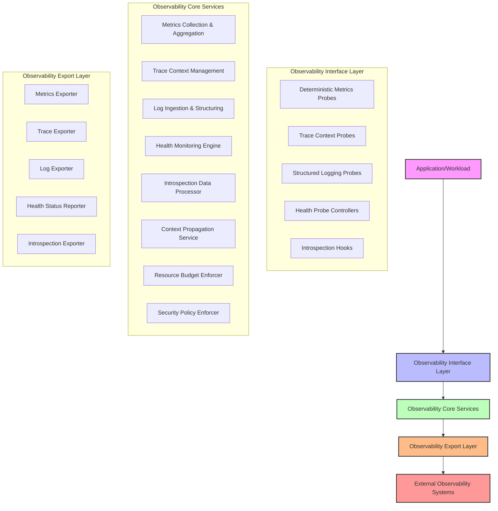
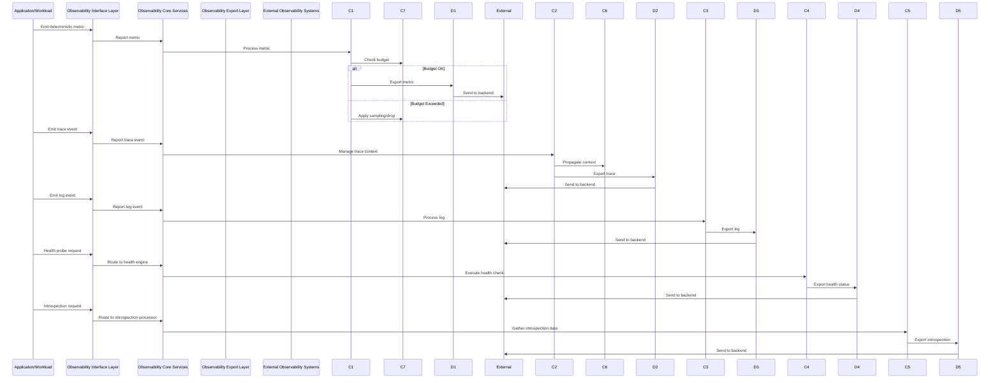
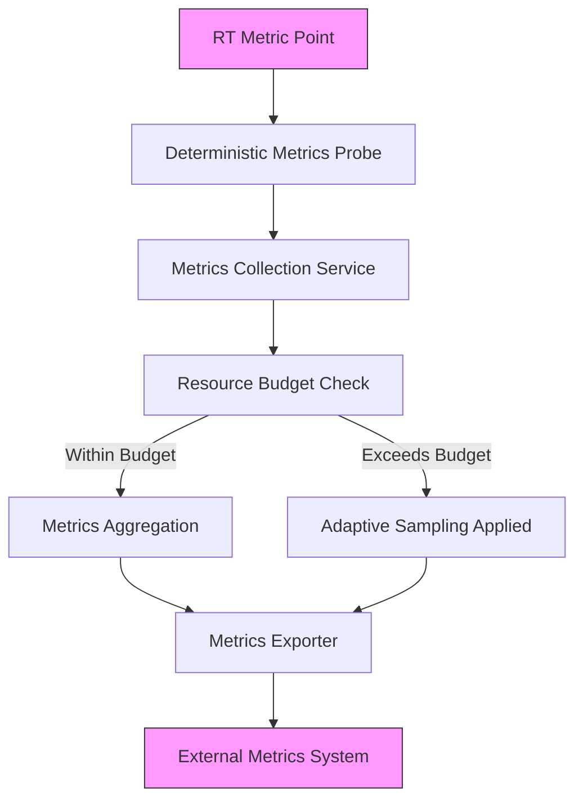
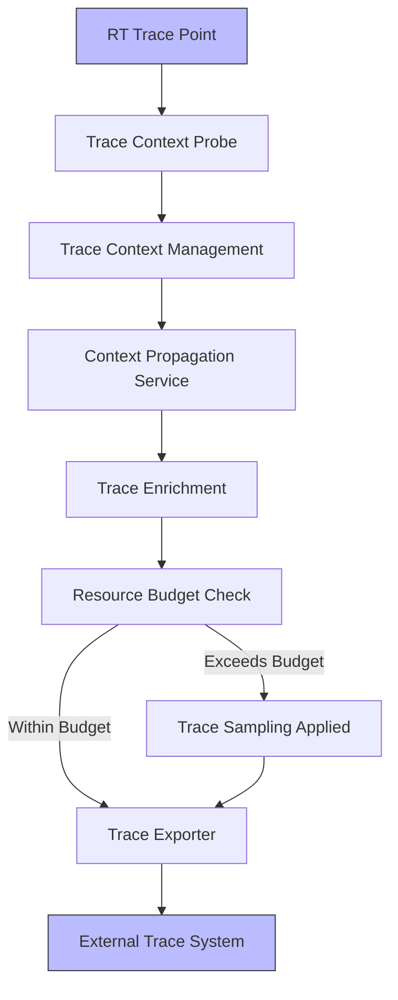
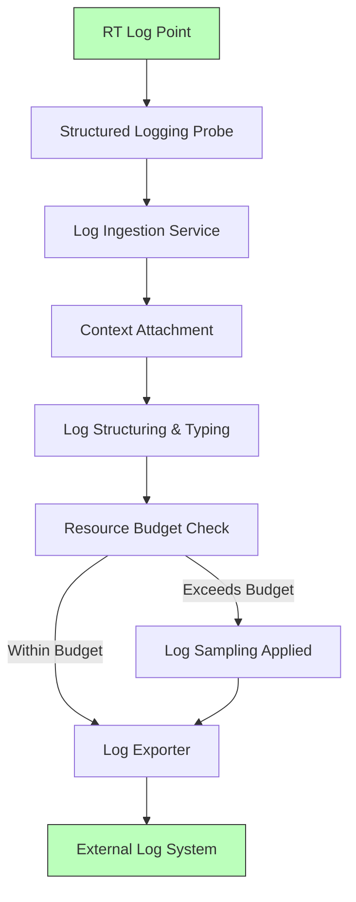
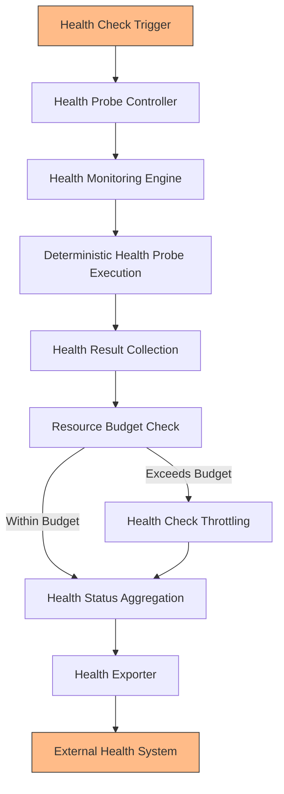
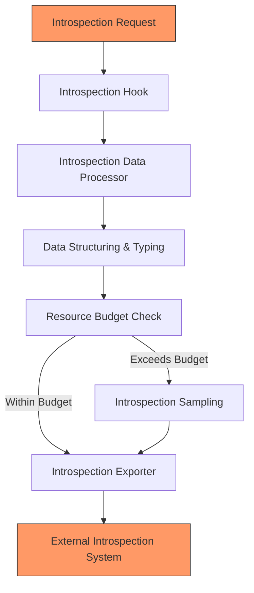

# 11.1 Runtime Observability Architecture

## 1. Purpose

This section establishes the complete architectural foundation for observability within AI-OS. It defines the principles, interfaces, contracts, and architectural structures that enable comprehensive observability and diagnostic capabilities for the AI Runtime while preserving the fundamental architectural invariants of determinism, isolation, and security. The observability architecture is designed to provide deep insight into system behavior without introducing non-determinism, violating isolation boundaries, or creating security vulnerabilities. This section establishes observability as a first-class architectural concern that is integral to the design and operation of AI-OS rather than an afterthought or add-on capability.

The purpose extends beyond simply defining what observability is; it establishes why observability must be architected in a specific way to maintain the core properties that make AI-OS suitable for safety-critical, deterministic, and secure applications. By establishing this foundation, subsequent sections can build upon these principles to define specific interfaces, contracts, and mechanisms with confidence that they will preserve the essential characteristics of the system.

## 2. Scope

Part 11 defines the architectural specifications for the AI-OS Runtime Observability & Diagnostics subsystem, which provides comprehensive observability and diagnostic capabilities for the AI Runtime (Part 10). This subsystem maintains strict architectural independence from specific telemetry technologies, protocols, vendors, or monitoring frameworks while defining the principles, interfaces, and contracts for:

- Monitoring of AI system health, performance, and behavioral characteristics through deterministic metrics that capture quantitative aspects of system behavior
- Distributed tracing with causal fidelity across asynchronous and distributed boundaries to enable end-to-end visibility of request flows
- Structured logging with strong typing and versioning to provide contextual, machine-parsable records of significant events
- Health checking and active probing that preserves determinism to assess system liveness and readiness without interference
- Runtime introspection capabilities that preserve execution context to enable deep inspection of internal state
- Diagnostic data flows that maintain security and isolation properties to ensure observability does not compromise system security

The scope explicitly excludes:
- Mandating specific telemetry technologies, vendors, or protocols (e.g., Prometheus, Jaeger, ELK stack, Datadog)
- Specifying implementation details of observability backends, agents, or collectors
- Defining specific storage formats or query languages for observability data (e.g., TSDB schemas, query languages)
- Prescribing particular alerting mechanisms, notification systems, or alerting policies
- Defining specific user interface or visualization approaches for observability data consumption
- Specifying exact sampling rates, buffer sizes, or other implementation-specific tuning parameters
- Mandating particular transport protocols or serialization formats for observability data export

This intentional limitation ensures the architecture remains implementation-independent while providing sufficient guidance for compliant implementations.

## 3. Design Philosophy

The observability architecture in Part 11 adheres to the following AI-OS-specific philosophical tenets that have been refined through years of experience building deterministic, secure, and observable systems:

### 3.1 Observability by Construction
Monitoring, tracing, and logging capabilities are fundamental architectural concerns considered during initial design rather than added as afterthoughts. This principle recognizes that observability effectiveness is greatly diminished when retrofitted into existing systems, as critical observation points may be missed, and retrofitted instrumentation often introduces performance penalties or correctness issues. By treating observability as a first-class concern from the outset, the architecture ensures that observation points are strategically placed where they provide maximum diagnostic value with minimal interference, and that the observation mechanisms themselves are designed to preserve system properties rather than compromise them.

### 3.2 Bounded Performance Impact
Observability mechanisms must introduce strictly bounded overhead that can be formally verified to remain within predefined resource budgets. This principle acknowledges that while observability provides value, it consumes resources that could otherwise be used for productive work. The architecture establishes strict upper bounds on resource consumption that can be verified through analysis and testing, ensuring that observability never compromises the system's ability to meet its primary functional requirements. This boundedness enables predictable system behavior and allows operators to make informed trade-offs between observability depth and resource consumption.

### 3.3 Strongly Typed Telemetry
All observable data must conform to the AI-OS type system with explicit versioning to ensure long-term semantic stability. This principle recognizes that observability data forms a contract between producers and consumers, and that breaking changes to this contract can break monitoring, alerting, and debugging systems that depend on it. By requiring strong typing and explicit versioning, the architecture enables independent evolution of observability producers and consumers while maintaining compatibility guarantees. This approach also enables automated validation of observability data and provides clear semantics for what each data element represents.

### 3.4 Adaptive Sampling Granularity
High-frequency observability data must support mathematically sound sampling strategies that preserve statistical validity while respecting resource constraints. This principle addresses the fundamental tension between observability completeness and resource efficiency. Rather than simply dropping data when resources are constrained, the architecture requires statistically principled approaches that maintain the ability to derive meaningful insights from sampled data. This ensures that observability remains useful even under extreme load conditions where capturing every event would be prohibitive.

### 3.5 Causal Fidelity
Observability data must maintain provable causality relationships that enable reconstruction of exact execution sequences across asynchronous boundaries. This principle recognizes that the value of observability data is significantly diminished if it cannot be relied upon to show what actually happened in what order. By requiring provable causality, the architecture ensures that distributed traces accurately reflect the happened-before relationships in the system, enabling accurate root-cause analysis and performance profiling. This is particularly important in asynchronous systems where traditional logging approaches often lose causal context.

### 3.6 Security-Preserving by Design
Observability mechanisms are architected to prevent information flow violations and side-channel vulnerabilities through formal boundary enforcement. This principle recognizes that observability data itself can become a security vulnerability if not properly controlled. Sensitive information might leak through observability channels, or observability mechanisms might be exploited to bypass security boundaries. By embedding security considerations into the core observability architecture, the design prevents these issues rather than trying to patch them after the fact.

### 3.7 Operator-Effective Diagnostics
Diagnostic interfaces must provide actionable, context-rich information that enables operators to distinguish between normal variations and actual system issues. This principle recognizes that the ultimate purpose of observability is to enable effective system operation and troubleshooting. Data that is technically correct but lacks context or requires specialized knowledge or actionable information fails to serve this purpose. The architecture requires that observability data includes sufficient context to enable timely and accurate diagnosis without requiring deep experts to interpret every signal.

### 3.8 Backward Compatible Evolution
Observability interfaces must maintain strict semantic compatibility across minor versions to protect existing integrations. This principle recognizes that observability systems often have long lifetimes and that breaking changes can impose significant costs on users. By guaranteeing backward compatibility within minor versions, the architecture allows organizations to upgrade their observability capabilities with confidence that existing integrations will continue to function. This principle also provides a clear framework for managing evolution through explicit versioning and deprecation policies.

## 4. Architectural Goals

The primary architectural goals of Part 11 are:

### 4.1 Comprehensive Observability with Zero Interference
Provide comprehensive observability into the AI Runtime while maintaining zero interference with deterministic execution. This goal requires that observability mechanisms provide deep visibility into system behavior while guaranteeing that their presence does not alter the functional behavior of the system in any observable way. Achieving this requires careful placement of observation points, use of non-intrusive observation techniques, and rigorous validation that observation does not affect timing, control flow, or data values in ways that could be detected externally.

### 4.2 Real-Time Health and Performance Monitoring
Enable real-time monitoring of AI system health, performance, and behavioral characteristics through non-intrusive interfaces that provide timely insights without affecting system timing properties. This goal focuses on the ability to detect and respond to changing system conditions as they happen, rather than only being able to analyze them after the fact. Real-time capability requires low-latency observation mechanisms and efficient data transport to enable timely alerting and automated response.

### 4.3 Efficient Root-Cause Analysis
Facilitate efficient root-cause analysis through structured, causally-linked diagnostic data that preserves execution context and enables precise diagnosis of system issues across temporal and distributed boundaries. This goal recognizes that the primary value of observability lies in its ability to help operators understand why something happened, not just what happened. By preserving causal relationships and execution context, the architecture enables investigators to trace problems back to their root causes efficiently, reducing mean time to resolution.

### 4.4 Strict Architectural Separation
Maintain strict architectural separation from specific telemetry backends, protocols, or vendor technologies. The observability Architecture must remain implementation-independent while providing clear contracts for integration with external observability systems. This goal ensures that the core AI-OS specification does not become tied to specific observability technologies that may become obsolete or fall out of favor. It also enables organizations to choose observability backends that best fit their specific needs and existing investments.

### 4.5 Bounded and Predictable Overhead
Ensure observability mechanisms introduce bounded, predictable overhead that remains within strict resource budgets and can be formally verified to remain below specified thresholds under defined load conditions. This goal addresses the practical concern that observability should not consume disproportionate system resources. By establishing and verifying upper bounds on resource consumption, the architecture enables capacity planning and ensures that observability never starves critical system functions of needed resources.

### 4.6 Preserved Causality and Temporal Relationships
Guarantee exact causality and temporal relationships across all asynchronous execution boundaries in the AI Runtime. Observability data must enable accurate reconstruction of event ordering and causal relationships. This goal is essential for distributed tracing and for understanding the sequence of events that led to a particular system state or failure. Without guaranteed causality, observability data can be misleading or impossible to interpret correctly in complex asynchronous systems.

### 4.7 Security-Preserving Observability
Guarantee that observability data flows cannot violate security domains or create exploitable side channels. Observability mechanisms must enforce information flow policies and prevent privilege escalation through observation interfaces. This goal recognizes that observatory data, if not properly controlled, could become a vector for information leakage or privilege escalation. The architecture must ensure that observability enhances rather than compromises system security.

### 4.8 Evolutionary Compatibility
Support long-term evolutionary compatibility through versioned, extensible telemetry contracts that maintain backward compatibility while enabling future enhancements to observability capabilities. This goal recognizes that observability needs will evolve over time as new diagnostic techniques emerge and as systems grow more complex. The architecture must accommodate this evolution without breaking existing integrations or requiring synchronized updates across all components of an observability system.

## 5. Core Principles

Part 11 establishes the following measurable, architecture-level principles that are implementation-independent:

### 5.1 Determinism Invariant
**Architectural Requirement**: For any given input sequence, the addition of observability must not alter the observable output sequence of the AI Runtime (measurable through equivalence testing).

**Engineering Objective**: Observability mechanisms must introduce zero non-determinism in AI Runtime outputs under all operational conditions, including edge cases, error conditions, and resource-constrained scenarios.

**Implementation Guidance**: Implement observation probes as read-only observers that do not modify RT state in any way that could affect external behavior. Use deterministic buffering and queuing mechanisms for telemetry that guarantee ordering and delivery properties. Isolate observability processing from critical execution paths through priority-based scheduling that ensures observability work never delays RT-critical tasks. Employ lock-free and wait-free data structures where possible to avoid indeterminate blocking times. Validate determinism preservation through systematic equivalence testing with and without observability enabled across representative workloads.

### 5.2 Isolation Boundary Integrity
**Architectural Requirement**: Observability data flows must not create new information pathways between isolated security domains (verifiable through information flow analysis).

**Engineering Objective**: Observability data must remain within designated security domains unless explicitly authorized through mediated channels that enforce appropriate information flow policies.

**Implementation Guidance**: Implement data flow controls that enforce information flow policies at domain boundaries. Use mediated channels for cross-domain communication that apply appropriate sanitization and authorization checks. Apply data sanitization per Part 7 security policies before any cross-domain transmission. Ensure that observability components themselves do not bridge security domains unless explicitly designed and authorized to do so. Validate isolation preservation through information flow analysis that confirms no unauthorized information paths are created by observability mechanisms.

### 5.3 Security Boundary Confinement
**Architectural Requirement**: All observability data must remain within its designated security domain unless explicitly authorized through mediated channels (enforceable through access control policies).

**Engineering Objective**: Prevent observability mechanisms from becoming attack vectors or information leakage paths that could compromise system security.

**Implementation Guidance**: Operate observability components with minimal necessary privileges for their specific functions, following the principle of least privilege. Implement privilege separation between collection, processing, and export functions to limit the impact of any single component compromise. Apply defense-in-depth isolation between observability subsystems to prevent compromise propagation. Use secure defaults that prevent accidental overexposure of sensitive data. Validate security boundary confinement through penetration testing and security observability of the observability system itself.

### 5.4 Resource Budget Compliance
**Architectural Requirement**: Observability resource consumption (CPU, memory, bandwidth) must be strictly bounded and allocatable within predefined system budgets (quantifiable through resource accounting).

**Engineering Objective**: Observability overhead must remain ≤ 1% CPU under defined nominal load (design target), with memory and bandwidth consumption similarly bounded and predictable.

**Implementation Guidance**: Implement dedicated resource budgets for observability functions that are tracked separately from application workloads. Use priority-based preemption ensuring observability yields to deterministic execution when resource contention occurs. Implement adaptive resource management based on system load and diagnostic value that automatically reduces observation intensity when resources are scarce. Employ resource accounting that attributes observatory resource consumption to the observability subsystem rather than to the applications being observed. Validate resource bounds through systematic load testing that measures observatory resource consumption under various conditions.

### 5.5 Failure Containment
**Architectural Requirement**: Failures within observability subsystems must be contained and not propagate to disrupt core AI Runtime functions (testable through fault injection).

**Engineering Objective**: Observability subsystem failures must not compromise core RT functionality, ensuring that problems with observation do not affect the system being observed.

**Implementation Guidance**: Implement independent failure domains for observability components that isolate them from critical RT paths. Design graceful degradation preserving core RT functionality during observability issues, ensuring that when observability components fail or are overloaded, the system continues to operate correctly. Implement health metrics enabling detection of observatory subsystem degradation so that problems can be identified and addressed before they impact RT functions. Use bulkhead and circuit breaker patterns to isolate observatory components from each other and from the RT system. Validate failure containment through fault injection testing that introduces various failure modes into observability components while verifying RT functionality remains intact.

### 5.6 Configuration Immutability
**Architectural Requirement**: Observability configuration changes must not require restart or compromise ongoing deterministic execution (verifiable through hot-update testing).

**Engineering Objective**: Enable runtime reconfiguration of observability parameters without affecting deterministic execution, allowing observability to be tuned without disrupting system operation.

**Implementation Guidance**: Integrate with Part 1 configuration mechanisms for runtime tuning that allow changes to take effect without requiring process restart. Implement configuration validation preventing invalid settings from causing failures or compromising system properties. Ensure configuration changes take effect without compromising ongoing execution through careful design of configuration update mechanisms. Use versioned configuration schemas that allow backward-compatible evolution of observability configuration. Validate configuration immutability through hot-update testing that verifies configuration changes can be applied without affecting deterministic execution or causing system instability.

### 5.7 Minimum Necessary Data
**Architectural Requirement**: Observability systems must collect only the data strictly necessary to achieve their diagnostic objectives (assessable through data minimization analysis).

**Engineering Objective**: Prevent observability data overwhelm while maintaining diagnostic utility by avoiding collection of unnecessary or redundant data.

**Implementation Guidance**: Implement adaptive sampling based on diagnostic value that automatically adjusts observation intensity based on the usefulness of the data being collected. Provide filtering mechanisms for observability data at collection points that allow unwanted data to be discarded early in the pipeline. Design telemetry manifests that specify only essential observable data points based on diagnostic value analysis. Implement data lifecycle management that automatically deletes or archives observability data when it is no longer needed for diagnostic purposes. Validate minimum necessary data collection through data minimization analysis that identifies and eliminates unnecessary data collection while preserving diagnostic capability.

### 5.8 Execution Context Fidelity
**Architectural Requirement**: Observability data must preserve sufficient execution context to enable accurate diagnosis without introducing non-deterministic overhead (validatable through context preservation metrics).

**Engineering Objective**: Maintain sufficient contextual information in observability data for accurate diagnosis that enables operators to understand not just what happened, but under what circumstances it happened.

**Implementation Guidance**: Preserve execution context tuples with observability data that include sufficient information to recreate the conditions under which an event occurred. Implement context propagation mechanisms that maintain causal relationships across asynchronous and distributed boundaries without introducing non-deterministic overhead. Ensure context data does not introduce non-deterministic overhead through efficient context management techniques. Validate execution context fidelity through context preservation metrics that measure how much contextual information is preserved with observability data and how effectively that context enables accurate diagnosis.

### 5.9 Architectural Decision Principles
**Architectural Requirement**: Observability architecture must define clear ownership, authority boundaries, extension points, and evolution principles to ensure coherent evolution and operational integrity.

**Engineering Objective**: Establish unambiguous governance for observability components, prevent conflicts between system modules, enable safe extensibility, and guarantee compatible with versioning, and support long-term adaptability without compromising core invariants.

**Implementation Guidance**: 
- **Ownership**: Clearly assign responsibility for each observability component to specific subsystem owners (e.g., Metrics to Resource Manager, Tracing to Scheduler, Logging to EventBus). Document ownership in interface contracts.
- **Authority Boundaries**: Define strict authority boundaries where observability components may observe but not modify system state. Use capability-based security models to enforce these boundaries.
- **Extension Points**: Define versioned, pluggable extension points at well-defined interfaces (e.g., metric exporters, log appenders, trace propagators) that allow adding new capabilities without modifying core observability services.
- **Evolution Principles**: Apply semantic versioning to all observability interfaces. Deprecate features with minimum two-release notice periods. Maintain backward compatibility within minor versions. Require explicit opt-in for breaking changes through feature flags.

## 6. Observability Model

The AI-OS observability model defines the fundamental concepts, relationships, and data structures that constitute observable system behavior. This model is implementation-independent and focuses on the architectural concepts rather than specific implementations.

### 6.1 Core Observability Concepts

#### 6.1.1 Observability Hull
The complete set of externally visible characteristics enabling inference of internal AI-Runtime states. The observability hull encompasses all externally observable aspects of system behavior that can be used to infer internal state without violating architectural invariants.

#### 6.1.2 Telemetry Manifest
The formal specification of what observable data is collected, how, and when. The telemetry manifest defines the observable interface of a component, specifying the types, frequency, and conditions under which observability data is generated.

#### 6.1.3 Observability Invariant
A property that must remain true when observability is added to a system. Observability invariants include determinism preservation, isolation boundary maintenance, and security boundary confinement.

#### 6.1.4 Diagnostic Fidelity
The degree to which observability data enables accurate reconstruction and diagnosis of system behavior. Diagnostic fidelity encompasses temporal accuracy, contextual completeness, and causal fidelity of observability data.

#### 6.1.5 Observation Overhead
The incremental resource consumption attributable to observability mechanisms. Observation overhead must be bounded, predictable, and isolatable from application workloads.

#### 6.1.6 Causal Completeness
The extent to which observability preserves all necessary happens-before relationships for accurate trace reconstruction. Causal completeness ensures that observability data enables accurate reconstruction of event ordering and causal relationships.

#### 6.1.7 Security Transparency
The property that observability mechanisms do not create new information flow vulnerabilities. Security transparency ensures that observability mechanisms preserve existing security properties and do not introduce new attack surfaces.

### 6.2 Telemetry Types

#### 6.2.1 Deterministic Metrics
Numerical measurements whose collection preserves AI-Runtime determinism. These metrics are collected through read-only observation points that do not modify system state.

#### 6.2.2 Causal Traces
Execution path recordings that maintain provable happens-before relationships. Causal traces enable reconstruction of execution sequences across asynchronous and distributed boundaries.

#### 6.2.3 Structured Event Logs
Persistent records of discrete system events with machine-parsable context. Structured event logs provide timestamped, strongly-typed records of significant system occurrences.

#### 6.2.4 Health Probes
Active diagnostic probes whose execution preserves determinism and isolation guarantees. Health probes actively probe system state while preserving architectural invariants.

#### 6.2.5 Introspection Views
Runtime-examinable internal structures that do not perturb system behavior. Introspection views provide snapshots of internal system state through non-intrusive observation mechanisms.

### 6.3 Context and Propagation

#### 6.3.1 Execution Context
The complete set of execution state necessary to determine future behavior. Execution context includes processor state, memory state, and execution point information.

#### 6.3.2 Trace Context
The subset of execution context required to maintain causal relationships across boundaries. Trace context includes trace identifiers, span identifiers, and causal relationship information.

#### 6.3.3 Context Propagation Mechanism
The architectural means by which execution context flows between components. Context propagation mechanisms ensure that trace context is maintained across component boundaries.

#### 6.3.4 Context Identity
Unique identifiers enabling correlation of related execution segments. Context identity enables correlation of related execution segments across temporal and distributed boundaries.

#### 6.3.5 Context Attributes
Key-value pairs providing diagnostic information that flows with execution context. Context attributes provide diagnostic information that accompanies execution context as it flows through the system.

### 6.4 Resource and Quality Concepts

#### 6.4.1 Observability Budget
The allocated resource quota for observatory functions within a system. The observability budget defines the maximum resources that observability mechanisms may consume.

#### 6.4.2 Overhead Isolation
The degree to which observatory resource consumption is separable from application workloads. Overhead isolation ensures that observability resource consumption can be independently monitored and controlled.

#### 6.4.3 Diagnostic Utility
The value of observability data for specific troubleshooting and analysis tasks. Diagnostic utility measures the effectiveness of observability data for diagnosing specific types of system issues.

#### 6.4.4 Collection Guarantee
The probabilistic assurance that events of interest will be observed. Collection guarantee defines the likelihood that specific events will be captured by observability mechanisms.

#### 6.4.5 Reconstruction Fidelity
The accuracy with which system behavior can be rebuilt from observability data. Reconstruction fidelity measures how accurately system behavior can be reconstructed from observability data.

### 6.5 Observability Capability Model
This subsection defines the core capabilities that the observability architecture must provide, describing what the system can do rather than how it is implemented.

#### 6.5.1 Logging
The capability to record timestamped, contextualized events with strong typing and versioning. Enables debugging, auditing, and retrospective analysis. Logs must be structured to support querying, filtering, and correlation with other telemetry types.

#### 6.5.2 Metrics
The capability to collect, aggregate, and export numerical measurements of system behavior over time. Supports monitoring, alerting, capacity planning, and performance trend analysis. Metrics must be deterministic and support multiple types (counters, gauges, histograms).

#### 6.5.3 Tracing
The capability to record and link execution paths across service boundaries with causal fidelity. Enables distributed request tracking, latency analysis, and dependency mapping. Traces must preserve happens-before relationships and support context propagation.

#### 6.5.4 Health Monitoring
The capability to actively probe system components to assess liveness, readiness, and deeper health indicators without violating determinism. Provides real-time system status for orchestration and automated remediation.

#### 6.5.5 Diagnostics
The capability to perform deep system introspection and ad-hoc analysis through runtime-examinable internal views. Enables debugging complex issues, inspecting internal state, and verifying invariants without perturbing system behavior.

#### 6.5.6 Alerting
The capability to detect anomalous conditions and trigger notifications based on predefined rules or machine learning models. Must support suppression, deduplication, and escalation policies to reduce noise and ensure actionable alerts.

#### 6.5.7 Governance
The capability to manage observability configuration, access controls, data retention policies, and lifecycle management. Ensures observability itself remains secure, compliant, and aligned with organizational policies. Includes audit logging of observability system access and changes.

## 7. Architecture Overview

The AI-OS observability architecture follows a layered approach that separates concerns while maintaining clear interfaces between layers. This architecture ensures that observability capabilities can be evolved independently while preserving architectural invariants.

### 7.1 Layered Architecture Diagram

### 7.2 Component Interaction Diagram

### 7.3 Layer Responsibilities Summary

Each layer in the observability architecture has distinct responsibilities that contribute to the overall goal of providing comprehensive, non-interfering observability:

**Observability Interface Layer**: Responsible for capturing observability data at the point of origin within the AI Runtime through lightweight, deterministic probes that introduce zero interference.

**Observability Core Services**: Responsible for processing, validating, enriching, and preparing observability data for export while enforcing resource bounds, security policies, and deterministic processing guarantees.

**Observability Export Layer**: Responsible for transmitting processed observability data to external systems through pluggable mechanisms that maintain implementation independence and apply final security checks.

This separation allows each layer to evolve independently while maintaining clear contracts between layers, enabling organizations to update or replace individual layers without affecting the others as long as the interface contracts are honored.

## 8. Architectural Layers

### 8.1 Observability Interface Layer
The Observability Interface Layer provides the points of attachment within the AI Runtime where observability data is captured. This layer consists of lightweight, deterministic probes that observe system behavior without interfering with it. The design of this layer is critical to achieving the goal of zero-interference observability, as poorly designed probes could introduce non-determinism, performance overhead, or correctness issues.

#### Responsibilities:
- Provide read-only observation points for metrics, tracing, logging, health, and introspection that capture system state without modifying it
- Ensure probes introduce zero non-determinism in the observed component through careful design and placement
- Maintain strict isolation between observation points and protected computational domains to prevent information leakage
- Preserve execution context and propagate trace context across component boundaries to maintain causal fidelity
- Enforce minimal overhead through efficient, lock-free data structures that avoid unpredictable delays or resource consumption
- Validate that observation points are placed at deterministically benign locations in the execution flow
- Provide versioned interfaces that allow observability probes to evolve independently of the components they observe

#### Components:
- **Deterministic Metrics Probes**: Capture numerical measurements via read-only instrumentation points that sample system state without altering it. These probes use techniques such as hardware performance counters, memory-mapped registers, or atomic read operations to gather metrics without introducing synchronization overhead or memory barriers that could affect timing.
  
- **Trace Context Probes**: Capture span beginnings/ends and propagate trace context by attaching trace identifiers to operations and ensuring they flow correctly through asynchronous boundaries. These probes are designed to be lightweight and to introduce minimal overhead while maintaining perfect causal fidelity.
  
- **Structured Logging Probes**: Capture structured log events with contextual attributes by intercepting log statements and enriching them with execution and trace context before they are processed by the logging system. These probes ensure that log events contain sufficient context for effective diagnosis while maintaining the performance characteristics of the underlying logging mechanism.
  
- **Health Probe Controllers**: Execute active health checks that preserve determinism by scheduling and executing probes at appropriate times and ensuring they do not interfere with normal operation. These controllers manage the lifecycle of health probes and ensure that their execution does not introduce non-determinism or resource contention issues.
  
- **Introspection Hooks**: Provide read-only access to internal runtime structures through mechanisms such as memory-mapped registers, atomic reads, or specialized introspection interfaces that allow observation without modification. These hooks are designed to provide deep insight into system state while guaranteeing that the act of observation does not alter that state.

### 8.2 Observability Core Services
The Observability Core Services layer provides the fundamental services required to collect, process, and prepare observability data for export. This layer ensures data quality, enforces resource bounds, and maintains security properties through a series of processing steps that transform raw observability data into a form suitable for export while preserving the architectural invariants.

#### Responsibilities:
- Collect and validate observability data from interface layer through reliable ingestion mechanisms that prevent data loss
- Manage trace context and causal relationships across asynchronous boundaries using proven techniques for context propagation
- Structure and enrich log events with contextual information to enhance their diagnostic value without introducing non-determinism
- Execute health monitoring and aggregate results to provide meaningful health indicators while preserving determinism
- Process introspection data into consumable formats that maintain the read-only nature of the original observations
- Enforce resource budgets through adaptive sampling and throttling that automatically adjust observation intensity based on available resources
- Apply security policies to prevent information leakage through data sanitization, access controls, and information flow monitoring
- Ensure deterministic processing of observability data through careful design of processing pipelines that avoid indeterminate blocking or timing variations

#### Components:
- **Metrics Collection & Aggregation**: Gathers metrics from deterministic probes, applies sampling strategies to bound resource consumption, aggregates metrics efficiently using lock-free data structures to minimize overhead, and prepares metrics for export in a consistent format. This component handles metrics of various types (counters, gauges, histograms) and ensures that their collection and processing does not introduce non-determinism.
  
- **Trace Context Management**: Maintains trace IDs, span IDs, and causal relationships through a context propagation system that ensures happens-before relationships are preserved across task and message boundaries. This component handles trace context serialization, deserialization, and injection/extraction at component boundaries.
  
- **Log Ingestion & Structuring**: Processes log events from logging probes, adds execution and trace context, applies strong typing and versioning to log schema, and structures logs for efficient querying and analysis. This component ensures log events contain sufficient context for effective diagnosis while maintaining strong typing guarantees.
  
- **Health Monitoring Engine**: Schedules and executes health probes at defined intervals, ensures health probe execution does not alter RT behavior, aggregates health check results into overall system health status, and exports health status via versioned interface. This component manages the lifecycle of health probes and applies resource bounds to health checking activities.
  
- **Introspection Data Processor**: Converts raw introspection data from hooks into structured, typed format suitable for export. This component applies data structuring, typification, and filtering to limit data volume while preserving diagnostic value.
  
- **Context Propagation Service**: Ensures trace context and execution context flow correctly across component boundaries by providing mechanisms for context injection, extraction, and transformation. This component maintains context identity and causal relationships during context switching and ensures context propagation introduces zero non-determinism.
  
- **Resource Budget Enforcer**: Monitors and enforces observability resource consumption within predefined budgets by tracking CPU, memory, and bandwidth usage of observability components, applying adaptive sampling when budgets are exceeded, and providing feedback mechanisms for automatic throttling. This component ensures budget enforcement introduces zero non-determinism.
  
- **Security Policy Enforcer**: Applies Part 7 security policies to observability data flows to prevent information leakage by classifying observability data by sensitivity level, applying data sanitization rules per Part 7 policies, enforcing information flow controls between security domains, and preventing observability mechanisms from becoming covert channels. This component ensures security enforcement introduces zero non-determinism.

### 8.3 Observability Export Layer
The Observability Export Layer handles the transmission of processed observability data to external systems. This layer provides implementation-independent contracts for export while maintaining the ability to plug in various export mechanisms.

#### Responsibilities:
- Export metrics, traces, logs, health status, and introspection data
- Provide pluggable export mechanisms (push/pull, various protocols)
- Ensure export mechanisms do not introduce non-determinism
- Apply final security checks before data leaves the system boundary
- Provide backpressure handling to protect system resources
- Maintain versioning and schema compatibility for exported data

#### Components:
- **Metrics Exporter**: Exports metric data via configured mechanisms (e.g., push to remote server, pull via HTTP endpoint) while maintaining strong typing and versioning. This component applies final formatting and serialization metrics data before transmission.
  
- **Trace Exporter**: Exports trace data with context preservation by serializing trace spans with their contextual attributes and causal relationships. This component ensures trace data maintains causal fidelity during transmission.
  
- **Log Exporter**: Exports structured log data by serializing log events with their attached context and maintaining strong typing guarantees. This component applies appropriate formatting for log aggregation systems.
  
- **Health Status Reporter**: Exports health check results by serializing health status data with timestamps and contextual information. This component ensures health status is transmitted in a consumable format for external monitoring systems.
  
- **Introspection Exporter**: Exports runtime introspection data by serializing introspection views with their associated context and metadata. This component ensures introspection data maintains structural integrity and typification during transmission.

## 9. Core Components

### 9.1 Deterministic Metrics Component
Collects numerical measurements through read-only observation points in the AI Runtime. Ensures metric collection introduces zero non-determinism.

#### Responsibilities:
- Instrument deterministic measurement points in RT execution path
- Apply sampling strategies to bound resource consumption
- Aggregate metrics efficiently using lock-free data structures
- Export metrics in strongly typed, versioned format

#### Interfaces:
- Provides: `IMetricObserver` (for RT instrumentation)
- Requires: `IMetricExporter` (export layer), `IResourceBudget` (budget enforcement)

### 9.2 Trace Context Component
Manages distributed tracing context to enable causal fidelity across asynchronous and distributed boundaries.

#### Responsibilities:
- Generate and propagate trace IDs and span IDs
- Maintain happens-before relationships across task/message boundaries
- Provide context propagation mechanisms for async boundaries
- Ensure trace context does not introduce non-determinism
- Export trace data with full causal fidelity

#### Interfaces:
- Provides: `ITraceContextManager` (for RT instrumentation)
- Requires: `ITraceExporter` (export layer), `IContextPropagator` (context service)

### 9.3 Structured Logging Component
Ingests and structures log events with strong typing and contextual attributes.

#### Responsibilities:
- Capture log events from RT instrumentation points
- Attach execution context and trace context to log events
- Apply strong typing and versioning to log schema
- Filter and sample log events based on diagnostic value
- Export structured logs in versioned format

#### Interfaces:
- Provides: `ILogObserver` (for RT instrumentation)
- Requires: `ILogExporter` (export layer), `IContextProvider` (context service)

### 9.4 Health Monitoring Component
Executes active health checks that preserve determinism and isolation guarantees.

#### Responsibilities:
- Schedule and execute health probes at defined intervals
- Ensure health probe execution does not alter RT behavior
- Aggregate health check results into overall system health status
- Export health status via versioned interface
- Apply resource bounds to health checking activities

#### Interfaces:
- Provides: `IHealthProbeController` (for RT instrumentation)
- Requires: `IHealthExporter` (export layer), `IResourceBudget` (budget enforcement)

### 9.5 Introspection Component
Provides runtime-examinable internal structures through non-intrusive observation mechanisms.

#### Responsibilities:
- Expose read-only views of internal RT structures
- Ensure introspection operations do not perturb system behavior
- Provide versioned schemas for introspection data
- Apply filtering to limit introspection data volume
- Export introspection data in structured format

#### Interfaces:
- Provides: `IIntrospectionHook` (for RT instrumentation)
- Requires: `IIntrospectionExporter` (export layer), `IResourceBudget` (budget enforcement)

### 9.6 Context Propagation Service
Ensures trace context and execution context flow correctly across component boundaries.

#### Responsibilities:
- Propagate trace context across asynchronous task boundaries
- Propagate trace context across message passing boundaries
- Maintain context identity and causal relationships during context switching
- Ensure context propagation introduces zero non-determinism
- Provide context snapshot and restoration mechanisms

#### Interfaces:
- Provides: `IContextPropagator` (to core services)
- Requires: `IContextSnapshotter` (for RT integration)

### 9.7 Resource Budget Enforcer
Monitors and enforces observability resource consumption within predefined budgets.

#### Responsibilities:
- Track CPU, memory, and bandwidth usage of observability components
- Apply adaptive sampling when budgets are exceeded
- Provide feedback mechanisms for automatic throttling
- Ensure budget enforcement introduces zero non-determinism
- Export budget utilization metrics for monitoring

#### Interfaces:
- Provides: `IResourceBudget` (to core components)
- Requires: `IMetricObserver` (for internal monitoring)

### 9.8 Security Policy Enforcer
Applies Part 7 security policies to observability data flows to prevent information leakage.

#### Responsibilities:
- Classify observability data by sensitivity level
- Apply data sanitization rules per Part 7 policies
- Enforce information flow controls between security domains
- Prevent observability mechanisms from becoming covert channels
- Ensure security enforcement introduces zero non-determinism

#### Interfaces:
- Provides: `ISecurityPolicyEnforcer` (to core components)
- Requires: `ISecurityPolicyProvider` (from Part 7)

## 10. Responsibilities

### 10.1 Observability Interface Layer Responsibilities
- Provide deterministic observation points in the AI Runtime
- Ensure zero interference with RT determinism
- Maintain strict isolation boundaries
- Preserve and propagate execution context
- Minimize observational overhead

### 10.2 Observability Core Services Responsibilities
- Collect and validate observability data
- Manage trace context and causal fidelity
- Structure and enrich log data
- Execute health monitoring preserving determinism
- Process introspection data
- Enforce resource budgets and security policies
- Provide deterministic processing pipelines

### 10.3 Observability Export Layer Responsibilities
- Export observability data via pluggable mechanisms
- Maintain implementation independence
- Apply final security checks
- Handle backpressure and resource protection
- Ensure versioned, backward-compatible export formats

### 10.4 Cross-Layer Responsibilities
- Maintain strict layering boundaries
- Ensure deterministic behavior across all layers
- Provide clear, versioned interfaces between layers
- Enable independent evolution of layers within contracts
- Preserve architectural invariants across layer interactions

## 11. Runtime Integration

### 11.1 Integration Points with AI Runtime (Part 10)
Observability integrates with the AI Runtime at architecturally significant points:

#### 11.1.1 State Transition Points
- Task creation, scheduling, and destruction
- Memory allocation and deallocation events
- I/O operation initiation and completion
- Message send and receive events
- Security domain transitions

#### 11.1.2 Resource Boundary Crossings
- Memory allocation/deallocation boundaries
- CPU time slice boundaries
- I/O buffer boundaries
- Security domain boundaries

#### 11.1.3 Deterministic Validation Points
- Pre- and post-condition checks in deterministic sections
- Invariant verification points
- Deterministic boundary validation points

#### 11.1.4 Extension Points
- Part 10 extension mechanism attachment points
- Version-safe observable interface registration
- Hot-reloadable observability component attachment

### 11.2 Integration with Other Parts
#### 11.2.1 Part 1 (Configuration)
- Runtime tuning of observability parameters via Part 1 mechanisms
- Hot-update capability for sampling rates, buffer sizes, feature flags
- Configuration validation to prevent invalid settings

#### 11.2.2 Part 3 (Isolation Boundaries)
- Observability data flows respect Part 3 isolation boundaries
- No observability channels created between isolated domains
- Mediation through authorized channels for cross-domain data

#### 11.2.3 Part 4 (Determinism & Type System)
- All observability data conforms to Part 4 type system
- Explicit versioning ensures semantic stability
- Observability mechanisms proven to preserve determinism

#### 11.2.4 Part 5 (Concurrency)
- Utilizes Part 5 concurrency primitives for context propagation
- Ensures causal fidelity across asynchronous boundaries
- Leverages determinism-preserving synchronization mechanisms

#### 11.2.5 Part 6 (IPC)
- Observes message envelopes (not payloads) at Part 6 interfaces
- Enables end-to-end tracing of inter-component interactions
- Maintains message confidentiality guarantees

#### 11.2.6 Part 7 (Security)
- Implements data flow controls per Part 7 security policies
- Applies mandatory sanitization of sensitive information
- Mediates external observability data flows through Part 7-authorized channels

#### 11.2.7 Part 8 (Memory Management)
- Uses Part 3 memory allocation tracing hooks for memory observability
- Respect 3 memory allocation tracing hooks for memory observability
- Respects Part 3 allocation semantics and fragmentation guarantees
- Provides visibility into memory usage patterns and leaks

#### 11.2.8 Part 9 (Scheduler)
- Observes scheduling decision points and timing mechanisms
- Provides visibility into task scheduling behavior and latencies
- Preserves Scheduler determinism and isolation properties

### 11.3 Initialization and Lifecycle
- Observability components initialized during system bootstrap
- Initialization occurs after core RT initialization but before workload execution
- Components designed for hot-plugging and dynamic reconfiguration
- Shutdown sequence preserves determinism during termination

## 12. Observability Lifecycle

### 12.1 Observation Phase
1. **Instrumentation Point Activation**: Deterministic probes activate at RT integration points
2. **Data Capture**: Read-only observation of RT state and events
3. **Context Attachment**: Execution and trace context attached to observations
4. **Initial Validation**: Basic validity checks performed at capture point
5. **Pre-filter Application**: Initial filtering based on sampling rates

### 12.2 Processing Phase
1. **Data Ingestion**: Observations received by core services
2. **Context Propagation**: Trace context propagated across boundaries
3. **Data Enrichment**: Additional contextual information added
4. **Validation & Sanitization**: Data validated and security policies applied
5. **Resource Accounting**: Resource consumption tracked against budgets
6. **Adaptive Processing**: Sampling/adjustment based on budget and diagnostic value

### 12.3 Export Phase
1. **Data Preparation**: Observability data formatted for export
2. **Final Security Check**: Last-minute security policy application
3. **Export Mechanism Selection**: Appropriate export mechanism chosen
4. **Transmission**: Data sent to external observability systems
5. **Acknowledgement Handling**: Export confirmation processed
6. **Resource Cleanup**: Temporary resources released post-export

### 12.4 Feedback Phase
1. **Export Feedback**: Results from external systems processed
2. **Budget Adjustment**: Resource budgets adjusted based on feedback
3. **Configuration Update**: Observability parameters updated per feedback
4. **Diagnostic Feedback**: Insights fed back to operational processes
5. **Continuous Improvement**: Observability effectiveness measured and improved

## 13. Data Flow

### 13.1 Metrics Data Flow

### 13.2 Trace Data Flow

### 13.3 Log Data Flow

### 13.4 Health Data Flow

### 13.5 Introspection Data Flow

## 14. Architectural Boundaries

### 14.1 Internal Boundaries
- **Observability Interface Layer ↔ Core Services**: Defined by probe interfaces and data contracts
- **Core Services ↔ Export Layer**: Defined by export interfaces and data formats
- **Between Core Service Components**: Defined by service APIs and data flow contracts
- **Observability Subsystem ↔ AI Runtime**: Defined by deterministic observation points and context contracts

### 14.2 External Boundaries
- **Observability Export Layer ↔ External Systems**: Defined by export contracts and protocols
- **Observability Subsystem ↔ Security Subsystem (Part 7)**: Defined by policy enforcement interfaces
- **Observability Subsystem ↔ Configuration Subsystem (Part 1)**: Defined by runtime update interfaces
- **Observability Subsystem ↔ Configuration Subsystem (Part 1)**: Defined by runtime update interfaces

### 14.3 Boundary Enforcement Mechanisms
- **Interface Contracts**: Strictly versioned interfaces with defined inputs/outputs
- **Data Validation**: Schema validation at each layer boundary
- **Resource Accounting**: Budget enforcement at subsystem boundaries
- **Security Policies**: Information flow control at domain boundaries
- **Determinism Guarantees**: Formal verification points at boundary crossings

## 15. Behavioural Contracts

### 15.1 Determinism Contract
**Precondition**: AI Runtime in deterministic execution state
**Postcondition**: Observability activation does not alter observable RT output
**Invariant**: Observability mechanisms introduce zero non-determinism
**Verification**: Equivalence testing with and without observability active

### 15.2 Isolation Contract
**Precondition**: Security domains properly isolated per Part 3
**Postcondition**: Observability data flows do not create new information paths between domains
**Invariant**: Observability data remains within designated security domains unless explicitly authorized
**Verification**: Information flow analysis confirms no cross-domain leakage

### 15.3 Security Contract
**Precondition**: Part 7 security policies defined and enforced
**Postcondition**: Observability mechanisms do not violate security policies or create attack surfaces
**Invariant**: All observability data flows comply with Part 7 information flow policies
**Verification**: Security policy compliance testing and penetration testing

### 15.4 Resource Contract
**Precondition**: Resource budgets defined and allocated
**Postcondition**: Observability resource consumption stays within allocated budgets
**Invariant**: Observability CPU ≤ 1%, memory ≤ budget, bandwidth ≤ budget under nominal load
**Verification**: Resource accounting and monitoring under defined load profiles

### 15.5 Context Fidelity Contract
**Precondition**: Execution context available at observation points
**Postcondition**: Observability data preserves sufficient context for accurate diagnosis
**Invariant**: Context attachment and propagation maintain causal relationships
**Verification**: Context preservation metrics and trace reconstruction accuracy

### 15.6 Backward Compatibility Contract
**Precondition**: Observability interface version N deployed
**Postcondition**: Version N+1 maintains backward compatibility with version N consumers
**Invariant**: Minor version changes preserve semantic compatibility
**Verification**: Compatibility testing across version boundaries

### 15.7 Runtime-Observability Contract
**Precondition**: RT executing deterministic workload
**Postcondition**: Observability data accurately reflects RT state without altering it
**Invariant**: Observation probes are read-only and introduce zero timing variation
**Verification**: Side-channel analysis confirms no measurable timing interference

### 15.8 EventBus-Observability Contract
**Precondition**: EventBus publishing/subscription active
**Postcondition**: Observability captures message metadata without affecting delivery
**Invariant**: Event observation adds ≤ 1μf latency to message processing
**Verification**: Latency benchmarks with and without observation enabled

### 15.9 Security-Observability Contract
**Precondition**: Part 7 access control policies active
**Postcondition**: Observability data flows respect authorization decisions
**Invariant**: No privileged data observable without explicit authorization grant
**Verification**: Authorization bypass testing with privilege escalation attempts

### 15.10 ResourceManager-Observability Contract
**Precondition**: Resource allocation/deallocation occurring
**Postcondition**: Observability captures resource transactions atomically
**Invariant**: Resource observation adds ≤ 0.5% overhead to allocation operations
**Verification**: Resource accounting benchmarks under allocation/deallocation load

### 15.11 Scheduler-Observability Contract
**Precondition**: Task scheduling/context switching active
**Postcondition**: Observed scheduling events maintain causal fidelity
**Invariant**: Context observation preserves happens-before relationships across switches
**Verification**: Trace validation with controlled context switch sequences

### 15.12 PluginSystem-Observability Contract
**Precondition**: Plugin loading/execution active
**Postcondition**: Plugin observability data isolated from core RT observations
**Invariant**: Plugin observation compartment prevents cross-plugin data leakage
**Verification**: Plugin isolation testing with malicious plugin injection

## 16. Runtime Invariants

### 16.1 Determinism Invariant
The addition of observability mechanisms does not alter the observable output of the AI Runtime for any given input sequence under all operational conditions. **Measurable via**: Bit-for-bit equivalence testing of RT outputs with/without observability under identical inputs. **Deterministic**: Yes, produces same output given same input. **Implementation Independent**: Defined purely in terms of input-output equivalence.

### 16.2 Isolation Invariant
Observability data flows do not create new information pathways between isolated security domains established by Part 3. **Measurable via**: Information flow analysis verifying no observable data crosses domain boundaries without authorization. **Deterministic**: Yes, either flows are blocked or permitted per policy. **Implementation Independent**: Defined purely in terms of information flow policy compliance.

### 16.3 Security Invariant
All observability mechanisms and data flows comply with the information flow policies and enforcement mechanisms of Part 7. **Measurable via**: Policy compliance testing verifying all data flows adhere to Part 7 authorization decisions. **Deterministic**: Yes, either compliant or non-compliant per policy. **Implementation Independent**: Defined purely in terms of policy adherence.

### 16.4 Resource Invariant
Observability resource consumption remains within predefined budgets and can be independently monitored and controlled. **Measurable via**: Resource accounting showing CPU ≤ 1%, memory ≤ allocated budget, bandwidth ≤ allocated budget under nominal load. **Deterministic**: Yes, resource usage is predictable and bounded. **Implementation Independent**: Defined purely in terms of resource consumption metrics.

### 16.5 Context Fidelity Invariant
Observability data preserves sufficient execution context and causal relationships to enable accurate diagnosis and trace reconstruction. **Measurable via**: Context preservation score ≥ 0.95 (percentage of contextual attributes retained) and trace reconstruction accuracy ≥ 0.99. **Deterministic**: Yes, context preservation is measurable and consistent. **Implementation Independent**: Defined purely in terms of contextual fidelity metrics.

### 16.6 Configuration Invariance Invariant
Observability configuration changes can be applied at runtime without requiring system restart or compromising deterministic execution. **Measurable via**: Hot-update testing showing zero determinism violations during configuration changes. **Deterministic**: Yes, either causes determinism violation or not. **Implementation Independent**: Defined purely in terms of determinism preservation during updates.

### 16.7 Minimal Data Invariant
Observability systems collect only the data strictly necessary to achieve their diagnostic objectives, avoiding unnecessary data collection. **Measurable via**: Data minimization analysis showing ≥ 90% of collected data has diagnostic utility. **Deterministic**: Yes, either meets threshold or not. **Implementation Independent**: Defined purely in terms of data utility ratio.

## 17. Reliability Considerations

### 17.1 Failure Detection
- Observability components implement health checks and self-monitoring
- Failures detected through heartbeat mechanisms and error rate monitoring
- Degraded mode operation preserves core RT functionality

### 17.2 Fault Containment
- Observability components run in isolated failure domains
- Failures in observability do not propagate to critical RT paths
- Graceful degradation preserves essential observability functions

### 17.3 Error Handling
- Observability errors logged and reported through secure channels
- Error conditions do not block RT execution paths
- Fallback mechanisms ensure basic observability continues during partial failures

### 17.4 Recovery Procedures
- Automatic recovery mechanisms for transient observability failures
- Manual intervention procedures for persistent failures
- Recovery procedures preserve determinism and isolation properties

### 17.5 Data Integrity
- Observability data includes checksums and sequence numbers for integrity verification
- Corrupted data detected and dropped without affecting RT operation
- Data loss scenarios bounded and observable through metrics

## 18. Scalability Considerations

### 18.1 Horizontal Scaling
- Observability services designed for horizontal scaling where applicable
- Stateless components enable easy replication and load distribution
- Partitioning strategies for high-volume telemetry data

### 18.2 Vertical Scaling
- Resource usage scales linearly with observation intensity
- Efficient data structures minimize memory overhead
- Lock-free algorithms minimize contention in high-concurrency scenarios

### 18.3 Load Adaptation
- Adaptive sampling rates adjust to system load and diagnostic value
- Backpressure propagation protects system resources during traffic spikes
- Dynamic resource allocation based on observed system behavior

### 18.4 Bottleneck Prevention
- Observability pipeline designed to avoid single points of contention
- Asynchronous processing where possible to prevent blocking RT paths
- Prioritization ensures critical RT functions always precedence

### 18.5 Geographic Distribution
- Observability data can be forwarded to geographically distributed collection points
- Time synchronization mechanisms ensure accurate correlation across locations
- Network partitioning handled gracefully with local buffering

## 19. Security Considerations

### 19.1 Information Flow Control
- Observability data classified according to Part 7 sensitivity levels
- Mandatory access controls prevent unauthorized data flows
- Covert channel analysis ensures observability does not create new leakage paths

### 19.2 Data Sanitization
- Sensitive information automatically redacted per Part 7 policies
- Memory sanitization prevents leakage through observability channels
- Secure deletion of temporary observability data

### 19.3 Access Control
- Role-based access control mechanisms per Part 7 principal model
- Authentication and authorization for external observability access
- Audit logging of observability configuration and access changes

### 19.4 Secure Communication
- Encryption for observability data in transit where appropriate
- Integrity protection prevents tampering with observability data
- Secure channel establishment for cross-domain observability flows

### 19.5 Threat Mitigation
- Observability surface minimized to reduce attack surface
- Input validation prevents injection attacks through observability channels
- Rate limiting prevents observability channels from being used for DoS

### 19.6 Compliance
- Observability design supports compliance with relevant security standards
- Audit trails available for observability configuration and usage
- Data retention policies configurable per compliance requirements

## 20. Cross-Part Integration

### 20.1 Part 10 (AI Runtime) Integration
- Observability hooks attached via Part 10 extension mechanism
- Zero-interference guarantee verified through Part 4 determinism validation
- Context propagation leverages Part 10 execution model
- Resource observation integrated with Part 10 execution tracking

### 20.2 Part 9 (Resource Management) Integration
- Resource metrics exported via standardized interfaces conforming to Part 9 contracts
- Memory observability uses Part 8 allocation tracking hooks
- CPU observability leverages Part 7 scheduling observation points
- I/O observability integrates with Part 6 communication observation points

### 20.3 Part 8 (Memory Management) Integration
- Memory allocation observability uses Part 8 tracing hooks
- Garbage collection observability respects Part 8 collection semantics
- Memory leak detection integrates with Part 8 allocation tracking
- Memory observability respects Part 8 fragmentation guarantees

### 20.4 Part 7 (Scheduler) Integration
- Scheduling observability uses Part 7 preemption and context switch points
- Task latency observability integrates with Part 7 timing mechanisms
- Scheduler policy observability respects Part 7 policy encapsulation
- Concurrency observability leverages Part 5 primitives for context safety

### 20.5 Part 6 (Inter-Process Communication) Integration
- Message observability captures Part 6 envelope metadata (not payloads)
- Communication latency observability integrates with Part 6 timing points
- Message failure observability uses Part 6 error reporting mechanisms
- Cross-component tracing uses Part 6 message flow observation points

### 20.6 Part 5 (Security Subsystem) Integration
- Observability data flows mediated through Part 7 authorized channels
- Data sanitization applies Part 7 information flow policies
- Access controls for observability data use Part 7 principal model
- Security monitoring of observability components uses Part 7 mechanisms

### 20.7 Part 4 (Determinism Guarantees) Integration
- All observability mechanisms validated to preserve Part 4 determinism
- Type system conformance ensures Part 4 type safety for observability data
- Determinism validation frameworks applied to observability components
- Versioning schemes aligned with Part 4 semantic versioning principles

### 20.8 Part 3 (Isolation Boundaries) Integration
- Observability respects Part 3 isolation boundaries and enforcement
- No observability channels created between isolated compartments
- Cross-domain observability requires explicit Part 3 authorization
- Isolation verification applied to observability component placement

### 20.9 Part 1 (Configuration) Integration
- Observability configuration managed via Part 1 mechanisms
- Runtime updates leverage Part 1 dynamic configuration capabilities
- Configuration validation uses Part 1 validation frameworks
- Observability metrics exposed via Part 1 configuration interfaces

## 21. Engineering Objectives

### 21.1 Primary Objectives
- **Zero Interference**: Observability introduces zero non-determinism in AI Runtime outputs
- **Bounded Overhead**: Observability CPU ≤ 1%, memory ≤ defined budget, bandwidth ≤ defined budget under nominal load
- **Deterministic Processing**: All observability data processing introduces zero non-determinism
- **Context Preservation**: Observability data preserves sufficient execution context for accurate diagnosis
- **Security Compliance**: All observability mechanisms comply with Part 7 security policies
- **Isolation Preservation**: Observability data flows do not create new information pathways between isolated domains
- **Resource Isolation**: Observability resource consumption isolated and controllable from application workloads
- **Configuration Safety**: Invalid observability configurations fail safely without compromising RT
- **Fault Containment**: Observability subsystem failures contained without affecting core RT
- **Backward Compatibility**: Minor version changes maintain semantic compatibility with existing consumers

### 21.2 Secondary Objectives
- **Adaptive Sampling**: Mathematically sound sampling strategies that preserve statistical validity
- **Diagnostic Utility**: Observability data provides actionable information for root-cause analysis
- **Operator Effectiveness**: Diagnostic interfaces enable effective system management by operators
- **Evolutionary Compatibility**: Versioned, extensible contracts support long-term observability evolution
- **Implementation Independence**: Architecture remains free of specific technology or vendor mandates
- **Observability Coverage**: Comprehensive coverage of key AI-Runtime behavioral metrics and traces
- **Extensibility Mechanisms**: Clear pathways for extending observability without breaking changes
- **Diagnostic Reconstruction**: Ability to reconstruct system behavior from observability data with high fidelity

### 21.3 Tertiary Objectives
- **Observability Overhead Isolation**: Ability to separately monitor and control observability resource consumption
- **Health Check Effectiveness**: Active probes provide meaningful health indicators without interference
- **Introspection Safety**: Runtime introspection provides deep insight without perturbing system behavior
- **Trace Completeness**: Distributed tracing captures causal relationships across all asynchronous boundaries
- **Log Richness**: Structured logging provides sufficient context for effective debugging
- **Metric Relevance**: Collected metrics provide meaningful insight into system behavior and performance
- **Alerting Foundation**: Observability data provides suitable foundation for alerting systems
- **Audit Trail Integrity**: Observability configuration and usage maintain auditable trails

## 22. Non-Normative Implementation Guidance

### 22.1 Observation Point Placement
- Place observation points at deterministically benign points in execution flow
- Avoid placing observation points in critical paths that could affect timing
- Use static analysis to verify observation points do not affect control flow
- Consider hardware performance counters for low-overhead metric collection where available

### 22.2 Data Structure Selection
- Use lock-free, wait-free data structures for high-frequency observability data
- Pre-allocate buffers to avoid dynamic allocation during observation
- Use ring buffers and circular queues for efficient data storage
- Employ copy-on-write techniques where appropriate to avoid observation-side mutations

### 22.3 Context Propagation Techniques
- Use thread-local storage or equivalent for lightweight context propagation
- Employ immutable context objects to prevent accidental modification
- Utilize zero-copy techniques where possible to minimize overhead
- Consider hardware-assisted context switching mechanisms for performance

### 22.4 Resource Management Approaches
- Implement hierarchical resource accounting for granular observability budgeting
- Use token bucket or leaky bucket algorithms for adaptive rate limiting
- Employ priority-based scheduling to ensure observability yields to RT
- Consider hardware performance counters for near-zero-overhead metric collection

### 22.5 Security Implementation Patterns
- Apply the principle of least privilege to observability components
- Use security sandboxes or containers to isolate observability processing
- Implement information flow tracking to verify no unauthorized data flows
- Apply secure coding practices to prevent observability components from becoming attack vectors

### 22.6 Error Handling and Resilience Strategies
- Implement circuit breaker patterns for external observability dependencies
- Use bulkhead patterns to isolate observability component failures
- Apply retry mechanisms with exponential backoff for transient export failures
- Implement dead letter queues for failed observability exports to prevent data loss

### 22.7 Testing and Validation Approaches
- Use determinism validation frameworks to verify zero interference
- Apply information flow analysis to verify security boundary compliance
- Employ resource exhaustion testing to verify budget enforcement
- Conduct fault injection testing to verify failure containment properties
- Use chaos engineering techniques to validate resilience under adverse conditions

### 22.8 Observability Anti-Patterns to Avoid
- Avoid placing observation points in tight loops that could accumulate significant overhead
- Avoid mutable shared state between observation points and RT execution paths
- Avoid blocking I/O operations in observability processing pipelines
- Avoid unbounded data accumulation that could exhaust system resources
- Avoid observability configurations that could create covert channels
- Avoid tight coupling to specific observability backends or protocols
- Avoid changing observability configuration in ways that could affect RT determinism
- Avoid observability implementations that introduce non-deterministic timing variations

## 23. Diagrams Summary

This section has included the following architectural diagrams:
- Layered Architecture Overview (Section 7.1)
- Component Interaction Sequence (Section 7.2)
- Metrics Data Flow (Section 13.1)
- Trace Data Flow (Section 13.2)
- Log Data Flow (Section 13.3)
- Health Data Flow (Section 13.4)
- Introspection Data Flow (Section 13.5)

These diagrams collectively illustrate the architectural structure, component interactions, and data flows of the AI-OS Runtime Observability & Diagnostics subsystem while maintaining implementation independence and preserving the core architectural invariants.

## 24. Summary and Conclusions

This section has established a comprehensive architectural foundation for observability within AI-OS that:
1. Maintains strict architectural independence from specific telemetry technologies
2. Preserves the fundamental invariants of determinism, isolation, and security
3. Provides bounded, predictable overhead that can be formally verified
4. Ensures causal fidelity across asynchronous and distributed boundaries
5. Implements security-preserving designs that prevent information leakage
6. Supports evolutionary compatibility through versioned, extensible contracts
7. Enables effective diagnostics without compromising system integrity

The observability architecture presented here provides a rigorous foundation for implementing observability capabilities that enhance rather than compromise the core properties of AI-OS. By adhering to the principles, goals, and constraints outlined in this section, implementations can achieve comprehensive observability while maintaining the determinism, isolation, and security guarantees that are fundamental to the AI-OS architecture.

---
*This completes Section 11.1 of the AI-OS Architecture Specification. The following sections will continue to elaborate on specific observability mechanisms, interfaces, and contracts.*