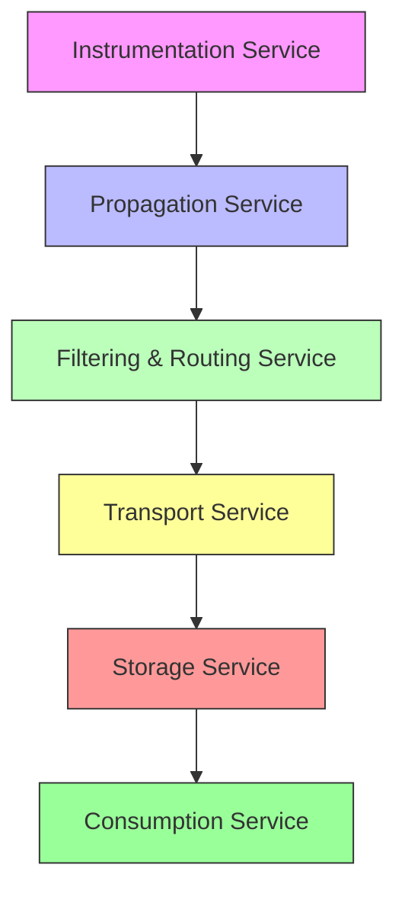
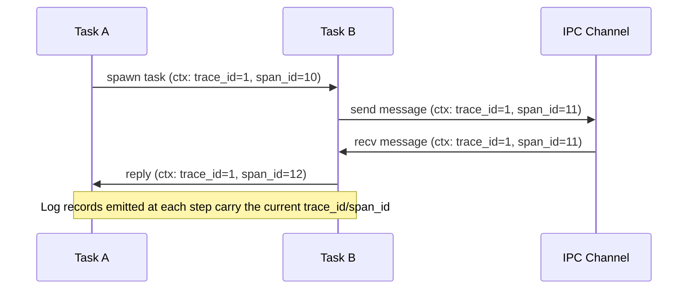
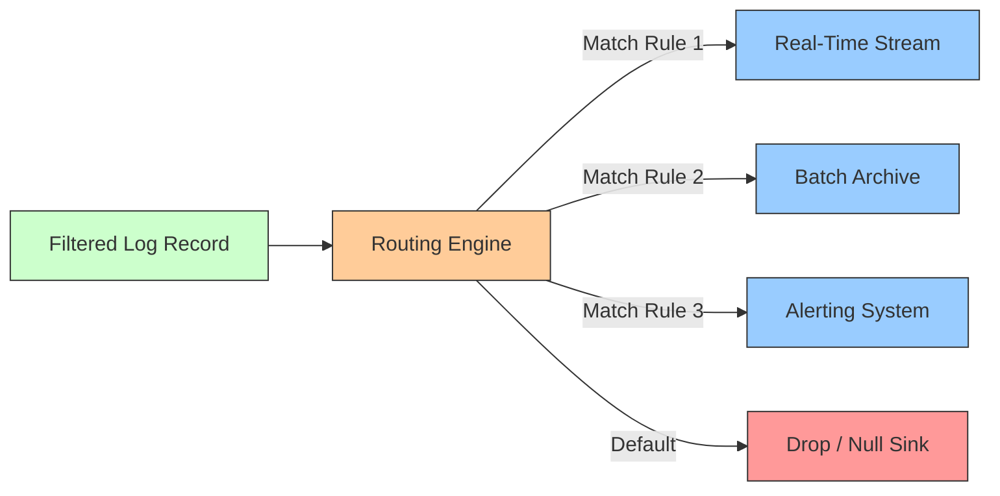
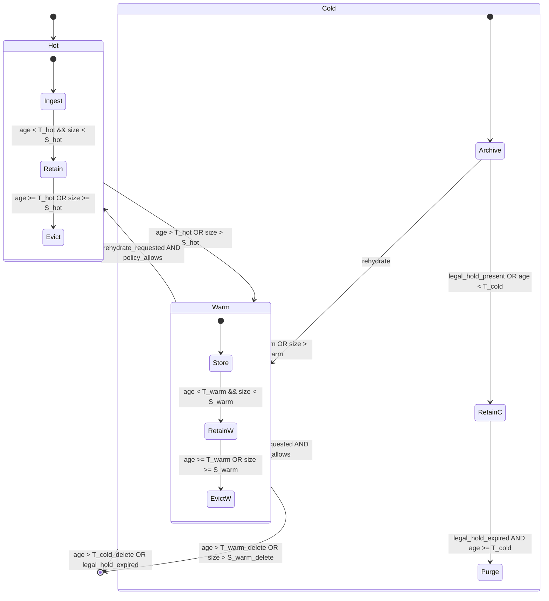
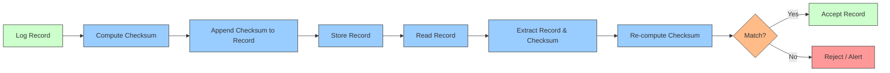

# 11.2 Logging Architecture

## 11.2.1 Purpose

The Logging Architecture defines the architectural model for runtime observability through structured logging within the AI-OS. It establishes the principles, contracts, and invariants that govern how log data is generated, propagated, processed, stored, and consumed while preserving the core AI-OS invariants of determinism, isolation, and security. This specification is implementation‑independent and focuses on what the logging subsystem must provide, not how it is implemented.

## 11.2.2 Logging Philosophy

The logging architecture adheres to the following AI‑OS‑specific philosophical tenets:

* **Observability by Construction** – Logging capability is considered a first‑class architectural concern and is integrated at well‑defined extension points during design, not added as an afterthought.
* **Determinism Preservation** – Logging operations must introduce zero non‑determinism in AI‑Runtime outputs; they are implemented as read‑only observations that do not alter observable state.
* **Bounded Overhead** – Logging overhead must be strictly bounded and provably remain within allocated resource budgets (CPU, memory, bandwidth) under specified load conditions.
* **Strongly Typed Telemetry** – All log records conform to the AI‑OS type system with explicit versioning to guarantee long‑term semantic stability.
* **Causal Fidelity** – Log records preserve sufficient execution context to enable reconstruction of causal chains across asynchronous boundaries without introducing non‑deterministic overhead.
* **Security‑Preserving by Design** – Logging mechanisms are architected to prevent information flow violations and side‑channel leaks; all observable data flows are mediated by the security subsystem.
* **Minimum Necessary Data** – Only data strictly necessary for diagnostic value justifies collection; superfluous data is omitted to respect data‑minimization principles.
* **Operator‑Effective Diagnostics** – Log records provide sufficient context (timestamps, trace IDs, correlation IDs, process/thread IDs, severity, and structured fields) to enable operators to distinguish normal variations from genuine anomalies.

## 11.2.3 Log Architecture

The logging architecture consists of logically distinct **services** that operate independently while cooperating through well‑defined contracts. These services are organized into layers; each layer exposes a service interface to the layer above and consumes the service interface of the layer below.

1. **Instrumentation Service** – Embedded probes within the AI‑Runtime that emit structured log records at instrumentation points.
2. **Propagation Service** – Mechanisms that attach trace and correlation context to log records and propagate that context across asynchronous boundaries.
3. **Filtering & Routing Service** – Components that apply sampling, filtering, and routing decisions based on severity, category, and dynamic policies.
4. **Transport Service** – Mechanisms that move filtered log records from producers to consumers while providing bounded buffering and back‑pressure handling.
5. **Storage Service** – Persistent or volatile stores that retain log records according to retention policies and integrity guarantees.
6. **Consumption Service** – Interfaces through which operators, analysis tools, and automated systems query, stream, or subscribe to log data.

These layers are conceptually stacked; each layer interacts only with its immediate neighbors via well‑defined service contracts, preserving architectural separation and enabling independent evolution.


*Figure 11.2.1: Logical layering of the logging architecture as services.*

### 11.2.3.1 Service Boundaries

* **Instrumentation ↔ Propagation** – The instrumentation service hands a raw log record to the propagation service via a synchronous, deterministic call that augments the record with trace context.
* **Propagation ↔ Filtering & Routing** – The propagation service forwards the enriched record to the filtering & routing service; the call is deterministic and does not block on downstream capacity.
* **Filtering & Routing ↔ Transport** – The filtering & routing service makes a deterministic routing decision and passes the selected record(s) to the transport service via a bounded, loss‑less enqueue operation.
* **Transport ↔ Storage** – The transport service batches records and hands them to the storage service through a back‑pressure‑aware interface; acceptance is deterministic and bounded.
* **Storage ↔ Consumption** – The storage service persists records and makes them available to the consumption service via a deterministic, query‑or‑stream interface that respects consistency guarantees.

These interfaces guarantee that a failure in any service does not corrupt the state of another service (failure containment) and that data flow remains deterministic.

## 11.2.4 Structured Logging Model

All log records emitted by the AI‑Runtime conform to a strongly typed, versioned structure. The model defines the minimal set of fields that every log record MUST contain, together with optional extensible fields for domain‑specific data.

### 11.2.4.1 Core Fields

| Field Name        | Type                     | Presence | Description                                                                 |
|-------------------|--------------------------|----------|-----------------------------------------------------------------------------|
| timestamp         | Timestamp (UTC, ns)      | REQUIRED | Monotonic wall‑clock time at which the event was observed.                  |
| trace_id          | TraceID (Opaque 128‑bit) | REQUIRED | Unique identifier for the distributed trace to which the log belongs.       |
| span_id           | SpanID (Opaque 64‑bit)   | REQUIRED | Identifier of the span within the trace that generated the log record.      |
| trace_flags       | TraceFlags (8‑bit)       | REQUIRED | Sampling and tracing flags as defined by the trace context protocol.       |
| trace_state       | TraceState (Opaque)      | OPTIONAL | Vendor‑specific trace propagation data.                                     |
| span_id_parent    | SpanID (Opaque 64‑bit)   | OPTIONAL | Parent span ID, if any; absent for root spans.                              |
| severity_text     | String (enum)            | REQUIRED | Human‑readable severity level (see §11.2.5).                               |
| severity_number   | Integer (enum)           | REQUIRED | Numeric severity level ordered by increasing severity.                     |
| name              | Identifier               | REQUIRED | Stable identifier for the log source (e.g., component, function name).     |
| body              | StructuredPayload        | REQUIRED | Domain‑specific payload expressed as a strongly typed map/record.          |
| attributes        | Map\<Key, Value\>        | OPTIONAL | Additional key‑value pairs providing context (e.g., process.id, thread.id). |
| resource          | Resource                 | OPTIONAL | Describes the entity that produced the telemetry (e.g., service, host).    |

### 11.2.4.2 StructuredPayload

The `body` field is a strongly typed map whose schema is versioned and versioned per component. Each component defines a versioned schema for its log bodies, enabling schema evolution without breaking consumers.

### 11.2.4.3 Resource

The optional `resource` field describes the entity producing the telemetry (e.g., service.namespace, service.name, host.id, container.id). It follows the same versioning rules as the payload.

### 11.2.4.4 Example (Non‑Normative)

```json
{
  "timestamp": "2026-08-05T14:32:10.123456789Z",
  "trace_id": "0x4bf92f3577b34da6a3ce929d0e0e4736",
  "span_id": "0x00f067aa0ba902b7",
  "trace_flags": 0x01,
  "trace_state": "congo=t61rcWkgMzE",
  "severity_text": "ERROR",
  "severity_number": 17,
  "name": "ai.runtime.inference.invoke",
  "body": {
    "model_id": "llama3-8b",
    "input_tokens": 124,
    "output_tokens": 58,
    "latency_ms": 12.4,
    "error_code": "MODEL_LOAD_FAILED"
  },
  "attributes": {
    "process.id": 424_tokens": 58,
    "latency_ms": 12.4,
    "error_code": "MODEL_LOAD_FAILED"
  },
  "attributes": {
    "process.id": 4242,
    "thread.id": 123456,
    "component.version": "1.2.3"
  },
  "resource": {
    "service.namespace": "ai‑runtime",
    "service.name": "inference‑engine",
    "host.id": "host‑123"
  }
}
```
*Figure 11.2.2: Example structured log record (non‑normative).*

## 11.2.5 Log Classification

Logs are classified along three orthogonal dimensions: **Severity**, **Category**, and **Facility**. Classification enables routing, filtering, and retention policies to be expressed declaratively.

### 11.2.5.1 Severity Model

The severity model follows the industry‑standard eight‑level hierarchy derived from RFC 5424, mapped to the AI‑OS numeric ordering.

| Severity Text | Severity Numeric | Description                                                                 |
|---------------|------------------|-----------------------------------------------------------------------------|
| EMERGENCY     | 0                | System is unusable; immediate action required.                              |
| ALERT         | 1                | Action must be taken immediately.                                           |
| CRITICAL      | 2                | Critical conditions, e.g., hardware failure.                                |
| ERROR         | 3                | Error conditions that may affect correctness.                               |
| WARNING       | 4                | Warning conditions that may indicate potential issues.                      |
| NOTICE        | 5                | Normal but significant conditions.                                          |
| INFO          | 6                | Informational messages.                                                     |
| DEBUG         | 7                | Debug‑level messages, typically disabled in production.                     |
| TRACE         | 8                | Fine‑grained diagnostic information, highest volume.                       |

*Table 11.2.1: Log Severity Model.*

### 11.2.5.2 Category Model

Categories classify logs by functional area, enabling domain‑specific filtering. Categories are defined per component and are versioned alongside the component’s interface.

| Category          | Description                                                                 |
|-------------------|-----------------------------------------------------------------------------|
| LIFECYCLE         | Events related to component start, stop, suspend, resume.                   |
| RESOURCE          | Resource acquisition, release, allocation, and utilization events.          |
| SECURITY          | Authentication, authorization, encryption, and policy enforcement events.   |
| COMMUNICATION     | Message send/receive, connection establishment, IPC events.                 |
| SCHEDULING        | Task scheduling, preemption, context‑switch events.                         |
| MEMORY            | Allocation, deallocation, garbage collection, fragmentation events.         |
| EXECUTION         | Instruction execution, function entry/exit, loop iteration events.          |
| ERROR             | Exceptions, fault detection, recovery actions.                              |
| PERFORMANCE       | Latency, throughput, utilization metrics expressed as events.               |
| AUDIT             | Compliance‑relevant actions, configuration changes, access logs.            |
| CUSTOM            | User‑defined application‑specific events.                                   |

*Table 11.2.2: Log Category Model (extensible).*

### 11.2.5.3 Facility Model

Facility indicates the originating subsystem or layer, enabling routing to domain‑specific consumers.

| Facility          | Description                                                                 |
|-------------------|-----------------------------------------------------------------------------|
| CORE              | AI‑Runtime core scheduler, dispatcher, and core services.                   |
| MEMORY            | Memory management subsystem.                                                |
| SECURITY          | Security subsystem (authentication, authorization, sandboxing).             |
| IPC               | Inter‑process communication subsystem.                                      |
| SCHEDULER         | Task scheduling subsystem.                                                  |
| RESOURCE_MANAGER  | Resource accounting and quota enforcement.                                  |
| EXTENSION         | Extension framework and plugin loader.                                      |
| MONITOR           | Internal monitoring and health‑checking components.                         |
| EXTERNAL          | Adapters (telemetry, logging, tracing exporters).                  |
| USER              | User‑level applications and services hosted on the AI‑OS.                  |

*Table 11.2.3: Log Facility Model (extensible).*

## 11.2.6 Log Context Propagation

Log records must carry sufficient context to enable causal correlation across asynchronous boundaries, process boundaries, and network hops. The logging architecture relies on the trace context defined in Part 5 (Concurrency) and Part 6 (IPC) and extends it with log‑specific baggage.

### 11.2.6.1 Trace Context Propagation

* The `trace_id` and `span_id` fields are propagated automatically by the instrumentation service using the trace context propagation mechanism defined in Part 5.
* At each asynchronous boundary (task spawn, message send/receive, memory fence), the current trace context is attached to the outgoing operation and restored on the inbound side.
* The propagation mechanism is deterministic and adds zero non‑deterministic overhead.

### 11.2.6.2 Baggage Propagation

In addition to trace context, optional key‑value pairs known as **baggage** may be propagated alongside log records. Baggage is defined as part of the `TraceState` field and follows the same propagation rules as trace context. Baggage enables application‑specific correlation data (e.g., user‑id, request‑id) to travel with logs without being part of the core trace identifier.

### 11.2.6.3 Context Propagation Diagram


*Figure 11.2.3: Trace context propagation across asynchronous and IPC boundaries.*

### 11.2.6.4 Context Propagation Table

| Propagation Point        | Mechanism                                   | Fields Propagated                              |
|--------------------------|---------------------------------------------|------------------------------------------------|
| Task creation            | Part 5 concurrency primitives               | trace_id, span_id, trace_flags, trace_state   |
| Message send (IPC)       | Part 6 IPC subsystem                        | trace_id, span_id, trace_flags, trace_state   |
| Message receive (IPC)    | Part 6 IPC subsystem                        | trace_id, span_id, trace_flags, trace_state   |
| Memory fence / barrier   | Part 5 synchronization primitives           | trace_id, span_id, trace_flags, trace_state   |
| Thread / fiber switch    | Part 5 scheduler                            | trace_id, span_id, trace_flags, trace_state   |
| Process fork / clone     | Part 3 memory management (copy‑on‑write)    | trace_id, span_id, trace_flags, trace_state   |
| Network send/receive     | Part 6 network adapters (if applicable)     | trace_id, span_id, trace_flags, trace_state   |

*Table 11.2.4: Context propagation points and mechanisms.*

## 11.2.7 Log Lifecycle

The log lifecycle defines the stages a log record traverses from emission to consumption or disposal. Each stage is governed by explicit contracts and invariants, and **every transition is deterministic**.

### 11.2.7.1 Lifecycle Stages

1. **Generation** – Instrumentation point creates a structured log record with core fields and optional payload/attributes.
2. **Enrichment** – Propagation service attaches trace context, baggage, and any globally configured attributes (e.g., process ID, host ID).
3. **Filtering** – Filtering service applies samplers, rate limiters, and predicate‑based filters (based on severity, category, facet values) to decide whether the record proceeds. The decision is deterministic given the filter policy and record attributes.
4. **Routing** – Routing service selects one or more output channels based on routing rules (facility, category, tenant, destination tags). Selection is deterministic and based on the current versioned routing table.
5. **Transport** – Transport service records the log entry into a bounded buffer, applies back‑pressure, and hands off to the configured transport (in‑process queue, IPC channel, network socket, etc.). Enqueue/dequeue operations are deterministic and bounded.
6. **Storage** – Storage service persists the record according to retention policies (volatile buffer, persistent log, object store) while applying integrity protections (checksums, signatures). Write operations are deterministic and ordered.
7. **Consumption** – Consumption service provides interfaces for real‑time streaming, batch querying, or replay of stored logs to operators, alerting systems, and analysis tools. Reads are deterministic and repeatable given the same storage state.
8. **Archival / Deletion** – After the retention period expires, records are either archived to long‑term storage or securely deleted according to privacy policies. Both actions are deterministic and irrevocable.

### 11.2.7.2 Lifecycle Diagram

```mermaid
stateDiagram-v2
    [*] --> Generation
    Generation --> Enrichment: emit record
    Enrichment --> Filtering: attach context
    Filtering --> Routing: apply sampler/filter
    Routing --> Transport: select channel(s)
    Transport --> Storage: enqueue with back‑pressure
    Storage --> Consumption: persist & index
    Consumption --> [*]: consume (stream/query)
    Storage --> Archival: retention expiry
    Archival --> [*]: archive/delete
    note right of Generation
        Instrumentation point
    end
    note right of Enrichment
        Trace/context, baggage
    end
    note right of Filtering
        Sampler, rate limiter, predicate
    end
    note right of Routing
        Facility, category, tags
    end
    note right of Transport
        Bounded buffer, back‑pressure
    end
    note right of Storage
        Write‑ahead log, checksum, encrypt
    end
    note right of Consumption
        Streaming API, query API
    end
```
*Figure 11.2.4: Log record lifecycle state diagram with deterministic transitions.*

## 11.2.8 Collection Architecture

The collection architecture defines how log records are gathered from distributed instrumentation points and aggregated for transport. Collection is hierarchical and respects isolation boundaries.

### 11.2.8.1 Hierarchical Collection

* **Per‑Thread Buffers** – Each execution thread (or fiber) maintains a lock‑free, bounded ring buffer for low‑overhead local logging.
* **Per‑Process Collector** – A dedicated collector thread (or pool) aggregates per‑thread buffers, applies process‑level filtering, and forwards batches to the transport service.
* **Per‑Node Aggregator** – In multi‑node deployments, a node‑level aggregator may collect from multiple processes, apply node‑level policies, and perform cross‑process correlation tagging.
* **Global Collector** – Optional global tier for federated observability domains; receives forwarded batches and may perform global deduplication or enrichment.

### 11.2.8.2 Collection Diagram

```mermaid
flowchart TD
    subgraph Thread1[Thread‑Local Buffer]
        LT1[Lock‑Free Ring Buffer]
    end
    subgraph Thread2[Thread‑Local Buffer]
        LT2[Lock‑Free Ring Buffer]
    end
    subgraph ProcessCollector[Process Collector]
        PC1[Batch Aggregator]
        PC2[Process‑Level Filter]
    end
    subgraph NodeAggregator[Node Aggregator]
        NA1[Cross‑Process Correlator]
        NA2[Node‑Level Policy]
    end
    subgraph GlobalCollector[Global Collector (Optional)]
        GC1[Global Dedup/Enrich]
        GC2[Fan‑Out to Transports]
    end

    LT1 --> PC1
    LT2 --> PC1
    PC1 --> NA1
    NA1 --> GC1
    GC1 --> GC2
    GC2 -->|Transport| Storage[Storage Service]
    style Thread1 fill:#f9f,stroke:#333
    style Thread2 fill:#f9f,stroke:#333
    style ProcessCollector fill:#bbf,stroke:#333
    style NodeAggregator fill:#bfb,stroke:#333
    style GlobalCollector fill:#ff9,stroke:#333
    style Storage fill:#f99,stroke:#333
```
*Figure 11.2.5: Hierarchical log collection architecture.*

## 11.2.9 Routing Architecture

Routing determines the destination(s) of a log record after it has passed filtering. Routing rules are expressed as a mapping from attributes (facility, category, tags, tenant ID, severity) to one or more output channels.

### 11.2.9.1 Routing Model

* **Static Rules** – Configured at startup; map static attributes to destinations (e.g., all `facility=SECURITY` logs to the security audit stream).
* **Dynamic Rules** – Evaluated at runtime; may depend on mutable attributes (e.g., `tenant_id`, `request_id`) and support pattern matching, range checks, and boolean expressions.
* **Fan‑Out** – A single log record may be routed to zero, one, or multiple destinations (e.g., both a real‑time stream and a long‑term archive).
* **Default Route** – If no rule matches, the record is sent to a configured default sink (often a null/drop sink or a general‑purpose stream).
* **Routing Table Versioning** – Routing tables are versioned; updates are applied atomically without losing in‑flight records.
* **Deterministic Selection** – Given a log record and a specific routing table version, the selected output channel(s) are uniquely determined.

### 11.2.9.2 Routing Diagram


*Figure 11.2.6: Routing architecture logic diagram with deterministic selection.*

## 11.2.10 Storage Architecture

The storage architecture defines how log records are persisted, indexed, and retained while guaranteeing integrity and providing bounded resource consumption.

### 11.2.10.1 Storage Tiers

* **Hot Store** – In‑memory or low‑latency SSD buffer for real‑time streaming and short‑term retrieval (seconds to minutes). Optimized for low‑latency writes and reads.
* **Warm Store** – Persistent storage (e.g., segmented log files, indexed object store) for intermediate retention (hours to days). Supports range queries and basic indexing.
* **Cold Store** – Archival storage (e.g., object storage, tape) for long‑term retention (weeks to years). Optimized for capacity, not latency; may require rehydration for access.

### 11.2.10.2 Durability and Integrity

* **Write‑Ahead Logging (WAL)** – All mutating operations are first written to a durable log before being applied to the primary store, guaranteeing recoverability after a crash.
* **End‑to‑End Checksums** – Each log record includes a cryptographic checksum (e.g., SipHash‑2‑4 or SHA‑256 truncated) covering the serialized record; verification occurs on read.
* **Tamper Evidence** – Optional chaining (hash‑chain) or Merkle tree construction provides tamper evidence across sequential records.
* **Access Control Integration** – Storage layer enforces access policies derived from Part 5 (Security) – read/write permissions are mediated by the security subsystem.

### 11.2.10.3 Storage Boundaries

The storage service exposes three distinct interfaces, one per tier, guaranteeing that a client can only interact with the tier for which it is authorized:

* **HotStoreInterface** – `append(record)`, `read_range(start_ts, end_ts)`, `trim_older_than(ts)`.
* **WarmStoreInterface** – `append_batch(records)`, `scan_by_timestamp(start, end)`, `evict_older_than(ts)`.
* **ColdStoreInterface** – `archive_batch(records)`, `rehydrate(batch_id)`, `delete_expired(predicate)`.

Each interface is versioned and enforces its own retention and integrity policies. Calls across tier boundaries are mediated exclusively through the storage service’s internal orchestration component, which guarantees atomic tier‑transition operations.

### 11.2.10.4 Storage Diagram

```mermaid
graph TD
    subgraph Transport[Transport Service]
        T1[Batch Ingress]
    end
    subgraph Hot[Hot Store]
        H1[In‑Memory Ring Buffer]
        H2[WL‑Log (Write‑Ahead)]
    end
    subgraph Warm[Warm Store]
        W1[Segmented Log Files]
        W2[Index (LSM‑Tree / B+Tree)]
    end
    subgraph Cold[Cold Store]
        C1[Object Store Bucket]
        C2[Manifest / Manifest Index]
    end

    T1 --> H1
    H1 --> H2
    H2 --> W1
    W1 --> W2
    W2 --> C1
    C1 --> C2
    style Transport fill:#cfc,stroke:#333
    style Hot fill:#9cf,stroke:#333
    style Warm fill:#9cf,stroke:#333
    style Cold fill:#9cf,stroke:#333
```
*Figure 11.2.7: Log storage tiering diagram with explicit service boundaries.*

## 11.2.11 Retention Architecture

Retention policies govern how long log records are retained in each storage tier before being transitioned, archived, or deleted. Policies are expressed as rules based on record attributes (severity, category, facility, tenant, tags) and time‑based thresholds.

### 11.2.11.1 Retention Model

* **Time‑Based Retention** – Minimum age after which a record may be moved to a colder tier or deleted (e.g., `severity>=ERROR` retained 30 days in warm store, then archived).
* **Volume‑Based Retention** – Maximum size of a tier; when exceeded, oldest records are evicted according to a policy (LRU, LFU, or policy‑driven).
* **Legal/Hold** – Special flag that suspends retention actions for records matching a legal hold predicate (e.g., all audit logs for a given investigation).
* **Tier Promotion/Demotion** – Records may be promoted from cold to warm/hot for re‑analysis, subject to policy and resource availability.
* **Secure Deletion** – When retention expires, records are cryptographically erased or destroyed according to the security subsystem’s data‑sanitization policies.

### 1111.2 Retention Diagram


*Figure 11.2.8: Log retention state machine.*

## 11.2.12 Integrity Requirements

Log integrity guarantees that recorded data has not been altered, either accidentally or maliciously, after generation.

### 11.2.12.1 Detection Mechanisms

* **Per‑Record Checksum** – Each record carries a deterministic checksum of its serialized form (header + payload). Verification on read detects any alteration.
* **Chained Hashing (Hash‑Chain)** – Optional sequential linking: `hash_i = H(record_i || hash_{i-1})`. Any tampering breaks the chain, detectable by verifying the terminal hash.
* **Merkle Trees** – For batch storage, records are leaves of a Merkle tree; the root hash is signed and stored separately, enabling efficient inclusion proofs.
* **Digital Signatures** – High‑integrity logs (e.g., audit, security) may be signed by a trusted authority using an asymmetric key; verification provides non‑repudiation.

### 11.2.12.2 Guarantees

* **Detect‑Any‑Change** – Any single‑bit flip in a stored record is detected with overwhelming probability (≥ 1 − 2^−⁶⁴ for 64‑bit checksums).
* **Tamper Evidence** – When chaining or Merkle trees are used, unauthorized modifications produce a verifiable proof of tampering.
* **Freshness** – Timestamps combined with monotonic sequence numbers enable detection of replay or reordering attacks.
* **Origin Authentication** – Digital signatures bind the log record to a known signing key, enforcing provenance.

### 11.2.12.3 Integrity Diagram


*Figure 11.2.9: Per‑record integrity verification flow.*

## 11.2.13 Security

Logging must not become an avenue for confidentiality, integrity, or availability violations. The logging architecture enforces security through mediation, least privilege, and data minimization.

### 11.2.13.1 Confidentiality Controls

* **Data Minimization** – Only fields required for diagnostic value are included; sensitive fields (e.g., passwords, keys, personal data) are omitted or redacted at the instrumentation point.
* **Dynamic Redaction** – Policies may specify patterns or field names to be replaced with `<REDACTED>` before the record leaves the instrumentation layer.
* **Encryption in Transit** – Transport service may use TLS or equivalent to protect logs from eavesdropping.
* **Encryption at Rest** – Storage service may encrypt logs using keys managed by the security subsystem (cf. Part 5).

### 11.2.13.2 Integrity Controls

* As described in §11.2.12, cryptographic checksums, chaining, or signing mechanisms protect against undetected modification.
* Write‑ahead logging ensures that persisted logs reflect exactly what was handed off by the transport service.

### 11.2.13.3 Availability Controls

* **Resource Isolation** – Logging services operate within allocated CPU, memory, and bandwidth budgets; back‑pressure prevents overload from consuming resources needed by the AI‑Runtime.
* **Fail‑Stop vs. Fail‑Open** – Configuration determines whether logging failures cause the application to block (fail‑stop) or to drop logs while continuing execution (fail‑open), ensuring that logging never jeopardizes deterministic execution.
* **Death‑Handles** – If the logging subsystem crashes, the runtime continues unaffected; buffered in‑memory logs may be lost but do not corrupt the runtime state.

### 11.2.13.4 Access Control

* Access to log streams (read/subscribe) and log storage (read/write) is governed by the security subsystem’s policy engine, using labels derived from facility, category, and tenant.
* Principals are granted the minimum privileges necessary (e.g., an operator may read `INFO` and above from `facility=USER` but not from `facility=SECURITY`).

### 11.2.13.5 Security Diagram

```mermaid
flowchart TD
    subgraph Instr[Instrumentation Service]
        I1[Emit Record]
        I2[Dynamic Redact/Policy]
    end
    subgraph Sec[Security Mediation]
        S1[Policy Check (Read/Write)]
        S2[Encrypt/Decrypt (TLS)]
        S3[Sign/Verify (Authenticity)]
    end
    subgraph Trans[Transport Service]
        T1[Batch & Back‑Pressure]
        T2[Channel Select]
    end
    subgraph Store[Storage Service]
        St1[Write‑Ahead Log]
        St2[Encrypt-at-Rest]
        St3[Integrity Check (Hash/MC)]
    end
    I1 --> I2 --> S1 --> S2 --> T1 --> T2 --> St1 --> St2 --> St3 --> Cons[Consumption Service]
    style Instr fill:#cfc,stroke:#333
    style Sec fill:#9cf,stroke:#333
    style Trans fill:#fc9,stroke:#333
    style Store fill:#fb8,stroke:#333
    style Cons fill:#cfc,stroke:#333
```
*Figure 11.2.10: Security‑mediated logging pipeline.*

## 11.2.14 Privacy

Privacy considerations ensure that logging does not expose personally identifiable information (PII) or other sensitive personal data without explicit consent and proper safeguards.

### 11.2.14.1 Data Minimization & Pseudonymization

* **Field‑Level Filtering** – Instrumentation may omit fields known to contain PII (e.g., user‑provided strings, addresses).
* **Pseudonymization** – Where longitudinal analytics require linking events to a user, a stable pseudonym (derived via a keyed hash) may be used instead of raw identifiers.
* **Consent Tags** – Records may carry a consent flag indicating whether the associated data may be retained for analytics; absence of consent triggers immediate purging or masking.

### 11.2.14.2 Access Restriction

* Logs containing PII are labeled with a sensitivity tag (e.g., `sensitivity=PII`). The security subsystem enforces read‑access controls that require explicit authorization.
* Audit logs of access to PII‑labeled data are themselves treated as sensitive and protected accordingly.

### 11.2.14.3 Retention & Deletion

* Privacy‑sensitive logs are subject to stricter retention thresholds; after the Zweckbindung (purpose‑limited) period expires, they are securely deleted.
* Deletion employs cryptographic erasure or hardware‑based secure delete to prevent forensic recovery.

### 11.2.14.4 Privacy Diagram

```mermaid
flowchart LR
    Instr[Instrumentation Service] -->|Raw Event| Redact[Redact/Pseudonymize]
    Redact -->|Optional Consent Tag| ConsentCheck{Consent Given?}
    ConsentCheck -->|Yes| Store[Store Log]
    ConsentCheck -->|No| Purge[Secure Delete]
    Store --> Label[Label Sensitivity]
    Label --> AccessCtrl[Access Control (PII‑Aware)]
    AccessCtrl --> Consumer[Authorized Consumer]
    style Instr fill:#cfc,stroke:#333
    style Redact fill:#9cf,stroke:#333
    style ConsentCheck fill:#fb8,stroke:#333
    style Store fill:#9cf,stroke:#333
    style Label fill:#9cf,stroke:#333
    style AccessCtrl fill:#fc9,stroke:#333
    style Consumer fill:#cfc,stroke:#333
    style Purge fill:#f99,stroke:#333
```
*Figure 11.2.11: Privacy‑preserving logging flow.*

## 11.2.15 Behavioural Contracts

Behavioural contracts define the obligations and guarantees of the logging subsystem at its architectural boundaries.

### 11.2.15.1 Contract: Logging.emit(record: LogRecord) → void

* **Precondition**
  * `record` is a valid `LogRecord` conforming to the schema version declared by the component.
  * The logging subsystem is initialized and not in a failed state.
  * The calling context holds sufficient privilege (as per security policy) to emit a record of the given `severity` and `facility`.
* **Postcondition**
  * The record has been enqueued for processing by the logging subsystem; no guarantee of immediate persistence or delivery is made.
  * No observable state of the AI‑Runtime is altered by the call (determinism invariant).
* **Invariant**
  * The logging subsystem maintains internal buffers within their configured bounds; overflow triggers the configured back‑pressure or drop policy but does not corrupt internal state.
* **Side Effects**
  * Possible allocation of buffer space; possible increment of internal metrics counters (e.g., `records_emitted`, `bytes_enqueued`); these are observable only via the observability interfaces themselves and do not affect computational results.
* **Exceptions**
  * `LoggingError` – If the serialization of `record` fails or the internal buffer is irrecoverably full and the drop policy is prohibitive.
  * `SecurityViolation` – If the caller lacks permission to emit a record with the given `facility`/`severity`/`category`.

### 11.2.15.2 Contract: Logging.subscribe(filter: LogFilter) → Subscription

* **Precondition**
  * `filter` is a well‑formed predicate expression over log record fields (severity, category, fields, etc.).
  * The subscriber holds sufficient privilege to receive logs matching the filter (per security policy).
* **Postcondition**
  * The subscription is registered; the subscriber will receive a stream of log records that satisfy `filter` for the duration of the subscription.
  * The subscription does not alter the logging subsystem’s internal state beyond registering interest.
* **Invariant**
  * The subscription system maintains a bounded number of concurrent subscriptions; excess requests are rejected with `SubscriptionLimitExceeded`.
* **Side Effects**
  * Allocation of subscription bookkeeping; possible increase in background threads or async task counts (bounded by configuration).
* **Exceptions**
  * `SubscriptionLimitExceeded` – Too many concurrent subscriptions.
  * `InvalidFilter` – The filter expression is syntactically invalid or references unknown fields.
  * `SecurityViolation` – Subscriber not authorized for at least one field that the filter may expose.

### 11.2.15.3 Contract: Logging.configure(update: ConfigUpdate) → void

* **Precondition**
  * `update` conforms to the configuration schema; all values are within allowed ranges.
  * The logging subsystem is in a state that permits reconfiguration (not mid‑shutdown).
* **Postcondition**
  * The logging subsystem’s internal configuration has been atomically updated; in‑flight records continue under the previous configuration, newly emitted records use the new values.
  * No observable nondeterministic change in AI‑Runtime behaviour.
* **Invariant**
  * Configuration updates are applied without loss of already‑buffered records; any necessary migration (e.g., changing buffer size) is performed safely.
* **Side Effects**
  * Possible reallocation of buffers, spin‑up/down of worker threads, or re‑initialization of transport endpoints; all such changes are bounded and observable only via observability metrics.
* **Exceptions**
  * `InvalidConfiguration` – Supplied values violate schema or constraints.
  * `ConfigurationConflict` – The update would violate an invariant (e.g., setting buffer size below the current backlog size).
  * `SecurityViolation` – Caller lacks privilege to change the specified configuration items.

*Table 11.2.5: Summary of core behavioural contracts.*

### 11.2.15.4 Log Ownership, Correlation, Consistency, and Integrity Guarantees

* **Log Ownership** – The component that invokes `Logging.emit` retains logical ownership of the semantic content of the record; the logging service assumes stewardship of the physical record and guarantees its integrity and availability according to the configured policy.
* **Correlation Guarantees** – Every log record carries a `trace_id` and `span_id` that are guaranteed to be identical for all events belonging to the same distributed trace, as enforced by the propagation service’s deterministic context propagation (see §11.2.6).
* **Consistency Guarantees** – Within a single storage tier, log records are persisted in the order they are received by the storage service; cross‑tier transitions preserve this order via atomic move operations (see §11.2.10.3). Reads from the storage service are repeatable and reflect a consistent snapshot at the time of the query.
* **Integrity Guarantees** – All stored records are protected by the mechanisms described in §11.2.12; any detected corruption results in the record being marked as invalid and made unavailable for consumption, while an integrity‑failure event is emitted to the monitoring subsystem.

## 11.2.16 Logging Authority Boundaries

Authority over logging functions is divided among distinct architectural actors to preserve isolation and clear responsibility.

| Authority        | Responsibilities                                                                                                                                         |
|------------------|----------------------------------------------------------------------------------------------------------------------------------------------------------|
| **Runtime**      | Provides instrumentation points; ensures emission calls are side‑effect‑free with respect to core state; supplies execution context (thread, fiber, process IDs) to the instrumentation service. |
| **Services**     | Implement the six logging services (Instrumentation, Propagation, Filtering & Routing, Transport, Storage, Consumption); enforce service contracts, versioning, and deterministic behavior; manage internal resources within allocated budgets. |
| **Plugins**      | Extend logging capabilities (e.g., custom formatters, enrichment plugins, transport adapters) via well‑defined extension points; must not violate service contracts or introduce non‑determinism. |
| **Infrastructure**| Provides underlying primitives (lock‑free buffers, timers, cryptographic primitives, networking stacks) used by logging services; guarantees that these primitives themselves are deterministic and side‑effect‑free when used as specified. |
| **External Systems**| Consume logs via the consumption service; may request subscription filters, query stored logs, or subscribe to streams; must respect access‑control policies enforced by the security subsystem. |

*Table 11.2.6: Logging authority boundaries.*

## 11.2.17 Runtime Invariants

Runtime invariants are properties that must hold in all reachable states of the combined AI‑Runtime and logging subsystem, assuming the subsystem obeys its contracts.

### 11.2.17.1 Determinism Invariant

* **Formal Expression**:  
  `∀ s₀, s₁ ∈ States: (trace(s₀) = trace(s₁) ∧ logging_enabled(s₀) = logging_enabled(s₁)) → output(s₀) = output(s₁)`
* **Explanation**: For any two executions that start from the same state and have identical logging‑enabled/disabled flags, the observable output (i.e., the values returned by the AI‑Runtime to its environment) must be identical, regardless of the internal logging activity.
* **Verification Approach**: Model‑check the interaction between instrumentation points and the deterministic core; verify that logging actions are read‑only with respect to the core state.

### 11.2.17.2 Isolation Boundary Invariant

* **Formal Expression**:  
  `∀ d₁, d₂ ∈ Domains: (d₁ ≠ d₂) → ¬∃ path: logging_data(d₁) → … → logging_data(d₂)`  
  Where `logging_data(x)` denotes any observable datum that originates from domain `x`.
* **Explanation**: No information flow (explicit or implicit) via the logging subsystem may allow data to cross from one isolated domain to another.
* **Verification Approach**: Information‑flow analysis (static) to verify that no logging channel can transmit data between domains.

### 11.2.17.3 Bounded Back‑Pressure Invariant

* **Formal Expression**:  
  `∀ t ∈ Time: buffered_bytes(t) ≤ B_max ∧ enqueue_latency(t) ≤ L_max`  
  where `B_max` and `L_max` are the configured buffer size and maximum enqueue latency.
* **Explanation**: The logging subsystem never exceeds its allocated buffering capacity, and enqueue operations complete within a bounded latency, guaranteeing that logging cannot block the runtime indefinitely.
* **Verification Approach**: Resource accounting combined with worst‑case execution‑time analysis of the enqueue path.

### 11.2.17.4 Ordered Persistence Invariant

* **Formal Expression**:  
  For any two log records `r₁` and `r₂` such that `r₁` is enqueued before `r₂` in the transport service, if both are persisted in the same storage tier, then the stored order of `r₁` precedes that of `r₂`.
* **Explanation**: Persistence preserves the arrival order of log records within a storage tier, ensuring deterministic replay semantics.
* **Verification Approach**: Model the storage service as a FIFO queue per thread/partition; verify that commit logic respects enqueue order.

### 11.2.17.5 Integrity Preservation Invariant

* **Formal Expression**:  
  `∀ r ∈ StoredRecords: verify_integrity(r) = true`  
  unless a recorded integrity‑failure event has been emitted for `r`.
* **Explanation**: Every stored record that has not been explicitly flagged as corrupted passes its integrity check (checksum, hash‑chain, or signature).
* **Verification Approach**: Property‑based testing of the storage service’s write and read paths; fault injection to confirm detection of corruption.

### 11.2.17.6 Configuration Immutability Invariant

* **Formal Expression**:  
  `∀ t₁, t₂ ∈ Time: (no reconfig_event between t₁ and t₂) → config(t₁) = config(t₂)`  
  (The configuration observed by the logging subsystem remains constant between reconfiguration events.)
* **Explanation**: While reconfiguration is permitted at designated synchronization points, the configuration used for any given log record is immutable for the duration of that record’s lifetime within the subsystem.
* **Verification Approach**: Verify that the logging subsystem reads configuration atomically at the point of enqueue and does not mutate it thereafter.

*Table 11.2.7: Runtime invariants for the logging subsystem.*

## 11.2.18 Cross‑Part Integration

The logging architecture integrates with other architectural parts through well‑defined interfaces that respect ownership boundaries.

### 11.2.18.1 Part 10 (AI Runtime) Integration

* **Why**: Part 10 provides the execution environment whose behavior must be observed without interference.
* **Architectural Responsibilities**: Part 10 must provide well‑defined, stable extension points for observability hook attachment; Part 11 must ensure hooks do not alter RT behavior.
* **Ownership Boundary**: Part 10 owns core execution semantics; Part 11 owns observation interfaces attached via those extension points.

### 11.2.18.2 Part 5 (Security Subsystem) Integration

* **Why**: Ensuring observability data does not violate security policies or leak sensitive information requires tight integration.
* **Architectural Responsibilities**: Part 5 owns security policy enforcement and classification; Part 11 implements data sanitization and access controls per Part 5 policies.
* **Ownership Boundary**: Part 5 owns security policy definition and enforcement; Part 11 owns observability data handling compliance.

### 11.2.18.3 Part 3 (Isolation Boundaries) Integration

* **Why**: Observability must not compromise isolation boundaries between protected computational domains.
* **Architectural Responsibilities**: Part 3 owns isolation mechanisms and boundary enforcement; Part 11 ensures observability respects those boundaries.
* **Ownership Boundary**: Part 3 owns isolation property enforcement; Part 11 owns observability implementations that maintain isolation.

### 11.2.18.4 Part 6 (Inter‑Process Communication) Integration

* **Why**: Message passing patterns, latencies, and failure modes between components are vital for distributed tracing.
* **Architectural Responsibilities**: Part 6 owns IPC mechanisms and transports; Part 11 defines tracing contexts for cross‑component message flows.
* **Ownership Boundary**: Part 6 owns communication implementation; Part 11 owns observability of communication patterns and timings.

### 11.2.18.5 Part 7 (Scheduler) Integration

* **Why**: Task scheduling behavior, latencies, and preemption patterns are essential for understanding AI workload execution.
* **Architectural Responsibilities**: Part 7 owns scheduling decision points and timing mechanisms; Part 11 defines interfaces for scheduling observability.
* **Ownership Boundary**: Part 7 owns scheduling policy and mechanisms; Part 11 owns observation of scheduling events and effects.

### 11.2.18.6 Part 8 (Memory Management) Integration

* **Why**: Memory allocation patterns, leaks, and usage statistics are critical diagnostics requiring integration with memory subsystems.
* **Architectural Responsibilities**: Part 8 owns memory allocation tracking primitives; Part 11 defines semantic interfaces for memory observability.
* **Ownership Boundary**: Part 8 owns memory management implementation; Part 11 owns memory‑related observability contracts.

### 11.2.18.7 Part 9 (Resource Management) Integration

* **Why**: Resource utilization metrics (CPU, memory, I/O) are fundamental observability data requiring integration with resource tracking.
* **Architectural Responsibilities**: Part 9 owns resource accounting mechanisms; Part 11 defines standardized interfaces for exporting resource telemetry.
* **Ownership Boundary**: Part 9 owns resource tracking and allocation; Part 11 owns the observability views of resource consumption.

### 11.2.18.8 Part 4 (Determinism Guarantees) Integration

* **Why**: Observability must be proven to preserve determinism guarantees established in Part 4.
* **Architectural Responsibilities**: Part 4 owns determinism verification frameworks; Part 11 provides observability implementations that satisfy Part 4 validation.
* **Ownership Boundary**: Part 4 owns determinism properties and proof techniques; Part 11 owns observability implementations that maintain those properties.

### 11.2.18.9 Configuration System Integration (Part 1)

* **Why**: Part 11 integrates with Part 1's configuration mechanisms to enable runtime tuning of observability parameters (sampling rates, buffer sizes, feature flags) without requiring system restart or compromising deterministic execution.
* **Architectural Responsibilities**: Part 1 owns the configuration system; Part 11 defines the observability configuration schema and integrates via Part 1's extension points.
* **Ownership Boundary**: Part 1 owns configuration mechanisms; Part 11 owns observability‑specific configuration items.

### 11.2.18.10 Extension System Integration (Part 10)

* **Why**: Part 11 leverages Part 10's extension point mechanism to attach observability capabilities in a discoverable, version‑safe manner that allows for future evolution of both core RT and observability capabilities.
* **Architectural Responsibilities**: Part 10 owns the extension point mechanism; Part 11 defines observability extension points and versioning strategy.
* **Ownership Boundary**: Part 10 owns extension point mechanisms; Part 11 owns observability extensions attached via those points.

*Figure 11.2.12 (conceptual) illustrates these integrations (omitted for brevity; see text).*

## 11.2.19 Engineering Objectives

The following are design targets for logging subsystem implementations. These are implementation‑dependent goals, not absolute requirements.

* **Performance Bound** – Logging overhead ≤ 1% CPU under defined nominal load (design target subject to validation).
* **Memory Bound** – Additional memory consumption ≤ predefined budget per observability component (design target).
* **Latency Bound** – Critical path latency increase ≤ 5% at 99th percentile under observability load (design target).
* **Backward Compatibility** – Interface changes must maintain backward compatibility within minor versions (design target).
* **Configuration Safety** – Invalid configurations must not cause system instability or security violations (design target).
* **Data Volume Control** – Systems must implement effective mechanisms to prevent observability data overwhelm (design target).
* **Startup Latency** – Logging subsystem initialization must not delay system boot beyond a configured threshold (design target).
* **Shutdown Safety** – Logging subsystem must flush buffers and terminate gracefully without losing in‑flight records during shutdown (design target).

## 11.2.20 Non‑Normative Implementation Guidance

This section provides illustrative, non‑normative suggestions for implementing the logging architecture. Compliance is judged solely against the normative requirements and contracts specified earlier.

* **Adaptive Sampling** – Implement a token‑bucket sampler that adapts its refill rate based on recent observed arrival rate and current buffer occupancy, targeting a configurable average sample rate.
* **Hierarchical Buffering** – Use lock‑free ring buffers per thread, aggregated by a per‑process collector that batches records before transport to amortize syscall costs.
* **Pluggable Transports** – Define a transport interface (e.g., `LogTransport`) with implementations for in‑process queues, UNIX domain sockets, TCP/TLS, and UDP‑based telemetry.
* **Storage Format** – Consider an append‑only, segment‑based log file format (similar to Apache Kafka’s log segments) with mmap‑based access for reads; provide index files (timestamp‑to‑offset) for efficient temporal queries.
* **Integrity Mechanisms** – Use SipHash‑2‑4 (64‑bit) for per‑record checksums (fast, keyed) and optionally maintain a rolling hash chain (`H_i = H(record_i || H_{i‑1})`) with the root hash persisted periodically and signed by the subsystem’s attestation key.
* **Security Integration** – Leverage the security subsystem’s policy engine to mediate all reads/writes to log storage; enforce encryption at rest using keys managed by the subsystem’s key management service.
* **Observability of the Logger** – Export internal metrics (buffer usage, drop rate, enqueue/dequeue latency, CPU cycles consumed) via the same metrics subsystem defined in Part 11 (Metrics) to enable observability of the observability system.
* **Testing Strategy** – Employ deterministic simulation (e.g., using a simulated scheduler) to verify that injectable logging faults never affect the computation’s output; employ fault‑injection (e.g., bomb‑in‑the‑buffer) to validate containment.
* **Deploy‑time Configuration** – Leverage the Configuration System (Part 1) to allow hot‑reloading of logging levels, sampling rates, and destination endpoints without process restart, using atomic pointer swaps for config structures.
* **Batching and Compression** – Compress batches of log records (e.g., using Zstandard or LZ4) before transport to reduce bandwidth usage; decompress upon receipt in the storage layer.
* **Back‑Pressure Propagation** – Propagate back‑pressure signals from the storage layer back to the instrumentation layer via credit‑based flow control to prevent unbounded buffering.
* **Dead‑Letter Queues** – Implement dead‑letter queues for records that repeatedly fail transport or storage, enabling offline inspection without blocking the main logging pipeline.
* **Context Enrichment Libraries** – Provide language‑specific libraries that automatically inject trace IDs, span IDs, and baggage into log calls, reducing boilerplate and ensuring correct context propagation.
* **Schema Evolution** – Use a schema registry (conceptual) to manage versioned schemas for log bodies; enforce backward and forward compatibility rules at registration time.
* **Security Labels** – Integrate with the security subsystem’s labeling system to automatically classify log records based on the sensitivity of their attributes, enabling uniform handling of PII and other sensitive data.

*These suggestions are illustrative; compliance is judged solely against the normative requirements and contracts specified earlier.*

## 11.2.21 Summary

This section has defined a complete, implementation‑independent architectural model for runtime logging within the AI‑OS. It covered the purpose, philosophy, layered service architecture, structured log model, classification schemas, context propagation mechanisms, deterministic log lifecycle, collection, deterministic routing, storage with explicit tier boundaries, retention, integrity, security, privacy, behavioural contracts (including ownership, correlation, consistency, and integrity guarantees), logging authority boundaries, runtime invariants, cross‑part integration, engineering objectives, and offered non‑normative implementation guidance. Adherence to this specification ensures that logging provides rich, causally faithful, and operator‑actionable diagnostic data while strictly preserving the AI‑OS foundational properties of determinism, isolation, and security.

*End of Section 11.2.*