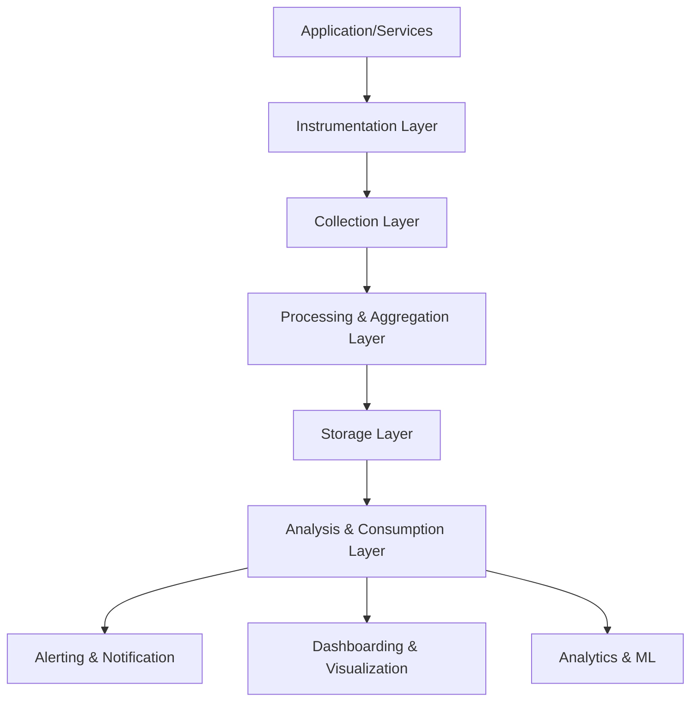
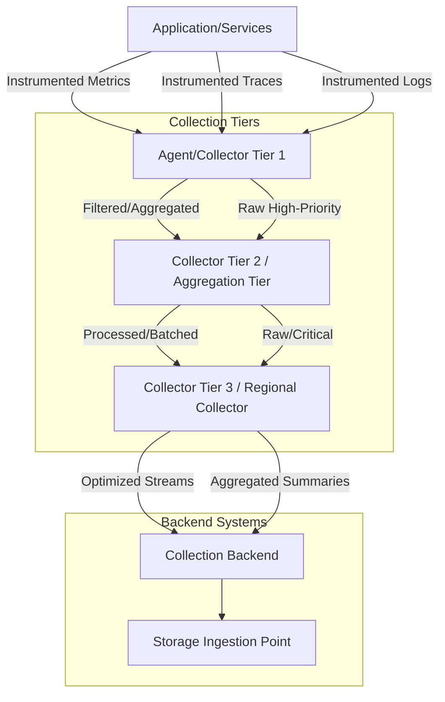
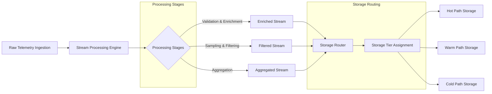

# 11.3 Metrics & Telemetry Architecture

## 1. Purpose

The Metrics & Telemetry Architecture defines the observable characteristics of the AI-OS system, enabling operators and developers to understand system behavior, diagnose issues, and optimize performance. This architecture provides a unified framework for collecting, processing, storing, and analyzing telemetry data across all system components while maintaining implementation independence.

The primary purposes are:
- Enable observability of system health, performance, and business metrics
- Support debugging, troubleshooting, and root cause analysis
- Enable capacity planning and resource optimization
- Support compliance, auditability, and security monitoring
- Provide data-driven insights for continuous improvement
- Enable predictive analytics and proactive maintenance
- Support service level objective (SLO) monitoring and alerting

## 2. Telemetry Philosophy

The telemetry architecture follows these guiding principles:

### 2.1 Observability-First Design
Observability is a first-class concern in system design. All components emit telemetry data as a fundamental aspect of their operation, not as an afterthought.

### 2.2 Signal-Focused Collection
Telemetry collection focuses on meaningful signals that indicate system health, performance, and business outcomes rather than exhaustive data collection that creates noise.

### 2.3 Context-Rich Observability
Telemetry data includes rich contextual information that enables correlation across services, time, and dimensions to facilitate root cause analysis.

### 2.4 Privacy and Security by Design
Telemetry collection respects user privacy and incorporates privacy safeguards, and appropriate data minimization principles.

### 2.5 Operational Simplicity
The telemetry system is designed to be operable with minimal operational overhead while providing comprehensive visibility.

### 2.6 Evolutionary Compatibility
The telemetry architecture evolves with the system, maintaining backward compatibility while allowing for new metric types and dimensions.

### 2.7 Cost Awareness
Telemetry collection considers storage, network, and processing costs, implementing appropriate sampling and aggregation strategies.

## 3. Metrics Architecture

The metrics architecture follows a layered approach that separates concerns between instrumentation, collection, processing, storage, and consumption.



### 3.1 Instrumentation Layer
Responsible for generating telemetry data at the source. Components emit metrics, traces, and logs through standardized interfaces.

### 3.2 Collection Layer
Responsible for gathering telemetry data from various sources, handling protocol translation, and initial filtering.

### 3.3 Processing & Aggregation Layer
Handles aggregation, sampling, enrichment, and routing of telemetry data before storage.

### 3.4 Storage Layer
Provides durable storage for telemetry data optimized for different access patterns (real-time, batch, long-term).

### 3.5 Analysis & Consumption Layer
Provides interfaces for querying, visualizing, alerting, and analyzing telemetry data.

## 4. Metric Taxonomy

Metrics are categorized into a hierarchical taxonomy that enables consistent categorization and querying.

### 4.1 Metric Types

| Metric Type | Description | Typical Use Cases |
|-------------|-------------|-------------------|
| Counter | Monotonically increasing counter | Count requests, errors, events |
| Gauge | Instantaneous value | Current memory usage, queue size |
| Histogram | Distribution of values in buckets | Request latency, response sizes |
| Summary | Similar to histogram with quantiles | Latency percentiles, throughput |
| CounterVec | Counter with labels | Requests by endpoint, errors by type |
| GaugeVec | Gauge with labels | Memory by process, queue by priority |
| HistogramVec | Histogram with labels | Latency by endpoint |
| SummaryVec | Summary with labels | Throughput by service |

### 4.2 Metric Domains

| Domain | Description |
|--------|-------------|
| Infrastructure | Host-level metrics |
| Platform | Platform-level metrics |
| Application | Application-level metrics |
| AI Workload | AI-specific metrics |
| Business | Business-level metrics |
| Security | Security-related metrics |

### 4.3 Metric Dimensions (Labels)

Dimensions provide contextual information for metrics. Standard dimensions include:

| Dimension | Description |
|-----------|-------------|
| service | Service or component name |
| version | Version of the component |
| instance | Specific instance identifier |
| environment | Deployment environment |
| region | Geographic region |
| zone | Availability zone |
| endpoint | API endpoint or service endpoint |
| method | HTTP method or RPC method |
| status_code | HTTP status or status code |
| error_type | Type of error encountered |
| user_id | Identifier for the user (hashed/anonymized) |
| tenant_id | Identifier for multi-tenant systems |
| model_id | Identifier for AI model |
| token_type | Type of token processed |
| operation_type | Type of operation being performed |

## 5. Collection Architecture

Telemetry collection follows a hierarchical collection model optimized for different data types, frequencies, and reliability requirements.



### 5.1 Collection Tiers

**Tier 1 - Agent/Collector:**
- Embedded agents or sidecar collectors on each host/container
- Responsible for initial collection, basic filtering, and light preprocessing
- Handles protocol translation from various instrumentation libraries
- Implements local buffering for resilience

**Tier 2 - Aggregation/Negotiator:**
- Regional or zone-level collectors receiving from Tier 1
- Performs aggregation, sampling decisions, and load balancing
- Provides horizontal scalability for collection layer
- Implements redundancy and failover mechanisms

**Tier 3 - Regional Collector:**
- Geographic or service-boundary collectors
- Handles cross-region aggregation and normalization
- Applies global sampling policies and cardinality management
- Prepares data for optimal storage ingestion

### 5.2 Collection Reliability Patterns

- **Tiered Buffering**: Each tier implements local buffering to handle temporary downstream unavailability
- **Progressive Timeout**: Increasing timeout values as data moves through tiers to prevent cascading failures
- **Selective Dropping**: Configurable drop policies prioritizing critical telemetry during overload
- **End-to-End Acknowledgement**: Confirmation mechanism ensuring data persistence before acknowledging receipt

### 5.3 Collection Protocols

The collection architecture supports multiple ingestion protocols to accommodate different instrumentation sources:
- Pull-based metrics endpoints (Prometheus-style)
- Push-based metrics via gRPC/HTTP
- Trace ingestion via OTLP/gRPC or Jaeger formats
- Structured logging via Fluentd/Fluent Bit compatible formats
- Custom protocol adapters for specialized instrumentation

## 6. Processing and Aggregation Architecture

The processing architecture applies stream processing principles to transform, enrich, and prepare telemetry data for storage and analysis.



### 6.1 Stream Processing Stages

**Validation & Enrichment Stage:**
- Schema validation and type checking
- Context enrichment with metadata (service, version, environment)
- Correlation ID propagation and trace context validation
- Basic anomaly detection and data quality checks

**Sampling & Filtering Stage:**
- Application of sampling policies based on data type and priority
- Dynamic rate adjustment based on system load
- Filtering of low-value or redundant telemetry
- Adaptive sampling based on anomaly detection

**Aggregation Stage:**
- Temporal aggregation (sliding windows, tumbling windows)
- Spatial aggregation (service-level, cluster-level rollups)
- Dimension-based aggregation and roll-up
- Histogram and summary computation from raw observations

### 6.2 Processing Guarantees

- **Exactly-Once Semantics**: Where applicable, processing ensures exactly-once delivery semantics
- **Ordering Preservation**: Within trace spans and metric series, temporal ordering is maintained
- **Fault Tolerance**: Processing continues despite individual node failures through checkpointing and replication
- **Backpressure Handling**: System applies backpressure to upstream components during processing overload

## 7. Storage Architecture

The storage architecture implements a multi-tier approach optimized for different access patterns, retention requirements, and cost considerations.

```mermaid
flowchart TD
    A[Processed Telemetry] --> B{Storage Router}
    B -->|Real-time (<5min)| C[Hot Path Storage]
    B -->|Interactive (5min-24h)| D[Warm Path Storage]
    B -->|Batch/Archival (>24h)| E[Cold Path Storage]
    
    C --> F[Real-time Query Engine]
    D --> G[Interactive Query Engine]
    E --> H[Batch Processing Engine]
    
    F --> I[Alerting & Dashboards]
    G --> I
    H --> I
    I --> J[Analytics & ML]
    
    subgraph Storage Tiers
        C
        D
        E
    end
    
    subgraph Query Engines
        F
        G
        H
    end
```

### 7.1 Storage Tiers

**Hot Path Storage (0-5 minutes):**
- Optimized for low-latency writes and sub-second reads
- In-memory or SSD-based storage with minimal compression
- Supports high-cardinality data for detailed troubleshooting
- Raw or minimally aggregated telemetry for real-time alerting
- Typically implemented with technologies like Redis, Apache Cassandra, or in-memory TSDB

**Warm Path Storage (5 minutes - 24 hours):**
- Optimized for moderate-latency access (seconds to minutes)
- SSD-based storage with efficient compression
- Moderately aggregated data suitable for interactive investigation
- Balances query performance with storage efficiency
- Typically implemented with technologies like Amazon Timestream, InfluxDB, or TimescaleDB

**Cold Path Storage (>24 hours):**
- Optimized for high-throughput writes and economical long-term storage
- Object storage or columnar formats with high compression ratios
- Highly aggregated or downsampled data for trend analysis and compliance
- Optimized for batch processing and sequential scanning
- Typically implemented with technologies like Apache Parquet on S3/ADLS, Apache Druid, or Snowflake

### 7.2 Storage Guarantees

- **Durability**: Multiple replication levels based on data criticality and access patterns
- **Consistency**: Eventual consistency model appropriate for telemetry use cases
- **Availability**: Tiered availability targets matching access patterns (hot: 99.9%, warm: 99%, cold: 95%)
- **Scalability**: Horizontal scaling independent of compute layers
- **Security**: Encryption at rest and in transit, with fine-grained access controls

## 8. Query and Consumption Architecture

The query architecture provides multiple interfaces for accessing telemetry data based on latency, complexity, and use case requirements.

```mermaid
flowchart TD
    A[Query Request] --> B{Query Router}
    B -->|Low Latency (<2s)| C[Hot Path Query Engine]
    B -->|Interactive (2-10s)| D[Warm Path Query Engine]
    B -->|Batch/Analytical (>10s)| E[Cold Path Query Engine]
    
    C --> F[Real-time Dashboards]
    C --> G[Live Alerting]
    C --> H[Ad-hoc Troubleshooting]
    
    D --> I[Operational Dashboards]
    D --> J[Investigative Analysis]
    D --> K[Trend Analysis]
    
    E --> L[Batch Reporting]
    E --> M[Machine Learning Pipelines]
    E --> N[Compliance & Auditing]
    E --> O[Capacity Planning]
    
    subgraph Query Engines
        C
        D
        E
    end
    
    subgraph Consumers
        F
        G
        H
        I
        J
        K
        L
        M
        N
        O
    end
```

### 8.1 Query Patterns

**Real-time Query Pattern (<2 seconds):**
- Direct access to hot path storage
- Optimized for simple aggregations and filtering
- Used for live dashboards, alert evaluation, and troubleshooting
- Typically processes recent data (last 5-15 minutes)

**Interactive Query Pattern (2-10 seconds):**
- Access to warm path storage with moderate latency tolerance
- Supports complex aggregations, joins, and filtering
- Used for operational dashboards, root cause analysis, and trend investigation
- Typically processes recent historical data (last hour to 7 days)

**Batch/Analytical Query Pattern (>10 seconds):**
- Access to cold path storage optimized for throughput over latency
- Supports complex analytical queries, window functions, and large-scale aggregations
- Used for reporting, machine learning feature extraction, and compliance reporting
- Processes extensive historical data (days to years)

### 8.2 Query Interfaces

The architecture supports multiple query interfaces to accommodate different consumer needs:
- **PromQL-compatible interface** for metric querying and alerting
- **SQL-like interface** for analytical queries and reporting
- **Time-series API** for programmatic access to raw and aggregated data
- **Graphical query builder** for ad-hoc exploration and dashboard creation
- **REST/gRPC APIs** for integration with external systems and automation

## 9. Architectural Components

### 9.1 Metric Collectors

**Responsibilities:**
- Embedded instrumentation within services and infrastructure components
- Collection of metrics, traces, and logs from various sources
- Protocol translation from instrumented formats to internal telemetry format
- Initial filtering, sampling, and buffering for resilience
- Local aggregation to reduce network traffic
- Health monitoring and self-reporting of collection status

**Characteristics:**
- Low overhead footprint (<5% CPU, <50MB memory typical)
- Language-specific SDKs for automatic instrumentation
- Sidecar deployment model for polyglot environments
- Built-in circuit breaking and backpressure mechanisms
- Dynamic configuration updates without restart

### 9.2 Aggregators

**Responsibilities:**
- Receiving telemetry streams from multiple collectors
- Applying temporal, spatial, and dimensional aggregation policies
- Implementing sampling strategies based on data characteristics and priority
- Load balancing and horizontal scaling of aggregation workload
- Fault tolerance and state recovery mechanisms
- Preparing optimized data streams for storage consumption

**Characteristics:**
- Stateless processing enabling horizontal scaling
- Configurable aggregation windows and policies
- Built-in load shedding during overload conditions
- End-to-end acknowledgment for reliability guarantees
- Horizontal pod autoscaling based on throughput metrics

### 9.3 Storage Layer

**Responsibilities:**
- Persistent storage of telemetry data across multiple access tiers
- Optimization of storage layout for query patterns and access frequencies
- Implementation of data retention and lifecycle management policies
- Provision of query interfaces optimized for each storage tier
- Ensuring durability, availability, and security of stored telemetry
- Management of storage capacity planning and automatic scaling

**Characteristics:**
- Multi-tier storage architecture matching access patterns
- Automatic data tiering based on age and access frequency
- Compression and encoding optimizations per tier
- Independent scaling of storage and compute resources
- Encryption at rest and in transit with key management
- Backup and disaster recovery capabilities

### 9.4 Query Layer

**Responsibilities:**
- Providing low-latency access to recent telemetry data
- Enabling interactive exploration of historical telemetry
- Supporting batch processing workloads for analytics and reporting
- Implementing query optimization and caching strategies
- Managing query concurrency and resource isolation
- Delivering results in formats suitable for different consumers

**Characteristics:**
- Tiered query engines optimized for access latency requirements
- Query planning and optimization based on data distribution
- Result caching for frequently accessed queries
- Resource governance to prevent query storms
- Security enforcement and access control at query level
- Integration with visualization and alerting systems

### 9.5 Consumers

**Responsibilities:**
- Real-time alerting and anomaly detection systems
- Operational dashboards and monitoring interfaces
- Investigative tools for root cause analysis
- Reporting and compliance systems
- Machine learning pipelines for predictive analytics
- Capacity planning and optimization systems
- External integrations via APIs and webhooks

**Characteristics:**
- Defined service level requirements based on use case (real-time: <2s, interactive: 2-10s, batch: >10s)
- Standardized interfaces for integration with telemetry platform
- Feedback mechanisms to inform collection and processing policies
- Secure access controls protecting sensitive telemetry data

## 10. Metrics Authority Boundaries

Clear ownership and responsibility boundaries ensure effective operation and evolution of the telemetry system.

### 10.1 Service Ownership Boundaries

**Service Teams Own:**
- Instrumentation of their services with metrics, traces, and logs
- Definition of service-specific metrics and their semantic meaning
- Establishment of appropriate sampling rates for their telemetry
- Initial validation of telemetry data quality from their services
- Response to alerts and insights derived from their telemetry

**Telemetry Platform Team Owns:**
- Collection, aggregation, storage, and query infrastructure
- Definition and enforcement of telemetry schema and standards
- Configuration of collection pipelines and processing rules
- Management of storage tiers, retention policies, and lifecycle
- Provision of query interfaces and consumer enablement
- Platform-level alerting on telemetry system health and performance

### 10.2 Data Domain Boundaries

**Infrastructure Telemetry:**
- Owned collaboratively by platform and infrastructure teams
- Focus on resource utilization, system health, and platform metrics
- Shared responsibility for node-level and cluster-level metrics

**Application Telemetry:**
- Owned by application development teams
- Focus on request rates, error rates, latency, and business metrics
- Responsibility for defining meaningful application-specific metrics

**AI Workload Telemetry:**
- Owned by ML/platform teams serving AI workloads
- Focus on model performance, token utilization, and training metrics
- Responsibility for AI-specific metrics and their interpretation

**Business Telemetry:**
- Owned by product and business intelligence teams
- Focus on user engagement, conversion rates, and revenue metrics
- Responsibility for defining business-relevant telemetry

### 10.3 Operational Boundaries

**Development Time:**
- Teams instrument code during development
- Instrumentation reviewed as part of code review process
- Telemetry considerations included in design and architecture reviews

**Deployment Time:**
- Telemetry configuration validated as part of deployment pipeline
- Canary validation of telemetry impact on system performance
- Rollback procedures include telemetry configuration validation

**Runtime Operations:**
- Monitoring of telemetry system health and performance
- Incident response for telemetry system degradation
- Capacity planning based on telemetry system utilization metrics

## 11. Behavioural Contracts (Enhanced Architecture Focus)

Behavioural contracts define the expected behavior and guarantees of the telemetry system from an architectural perspective.

### 11.1 Data Flow Contracts

**End-to-End Delivery Guarantee:**
- Telemetry data generated by instrumentation is delivered to storage with at-least-once semantics
- Duplicate detection and deduplication mechanisms prevent data corruption
- Ordering preserved within causal relationships (traces, spans, metric series)

**Flow Control and Backpressure:**
- System applies backpressure to instrumentation when downstream components are overloaded
- Graceful degradation maintains core telemetry functionality under stress
- Load shedding policies prioritize critical telemetry during overload conditions

**Routing and Delivery Assurance:**
- Telemetry routed to appropriate storage tiers based on policy and data characteristics
- Delivery confirmation mechanisms ensure data persistence before acknowledgement
- Failed transmission retry mechanisms with exponential backoff and jitter

### 11.2 Availability Contracts

**Collection Availability:**
- Collector tiers designed for no single point of failure
- Horizontal scaling enables maintenance without service interruption
- Health checks and automatic failover between collector instances

**Storage Availability:**
- Multi-zone replication for durability and availability
- Independent failure domains for storage components
- Graceful degradation to read-only mode during partial outages

**Query Availability:**
- Load distribution across query instances prevents overload
- Query timeout and cancellation mechanisms prevent resource exhaustion
- Degraded mode supports essential queries during high load

### 11.3 Scalability Contracts

**Horizontal Scaling:**
- Linear performance improvement with addition of collector instances
- Stateless processing enables seamless scale-in/scale-out operations
- Storage scaling independent of compute resources

**Load Handling:**
- System designed to absorb traffic spikes without data loss
- Graceful performance degradation under extreme load rather than failure
- Backpressure propagation to prevent overwhelming downstream components

**Geographic Distribution:**
- Multi-region deployment supports global services
- Local data collection minimizes latency and egress costs
- Cross-region aggregation enables global visibility when needed

### 11.4 Performance Contracts

**Latency Bounds:**
- End-to-end ingestion latency: <1 second for 95% of events
- Hot path query latency: <2 seconds for 95% of interactive queries
- Warm path query latency: <10 seconds for 95% of analytical queries

**Throughput Capacity:**
- Horizontal scaling supports millions of data points per second
- Burst handling capacity exceeds sustained peak by 10x for short durations
- Resource utilization targets optimize cost while maintaining headroom

## 12. Runtime Invariants (Enhanced Architecture Focus)

Runtime invariants are properties that must always hold true in a healthy telemetry system.

### 12.1 Structural Invariants

**Component Integrity:**
- All telemetry processing components report healthy status
- No component operates beyond its designed capacity thresholds
- Communication channels between components remain operational

**Data Flow Integrity:**
- Telemetry flows unidirectionally from collection to storage to consumption
- No data loss occurs in normal operating conditions (within SLOs)
- Duplicate detection prevents corruptive effects of retransmissions

**Topology Stability:**
- Collector hierarchy maintains designed fan-in/fan-out ratios
- Load distribution remains within designed parameters
- Failure detection and remediation operates within designed timeframes

### 12.2 Data Integrity Invariants

**Value Validity:**
- Counter values are non-negative and monotonically increasing
- Gauge values remain within physically possible ranges
- Histogram bucket boundaries are ordered and non-overlapping

**Timestamp Consistency:**
- Timestamps increase monotonically within data streams
- Clock skew between components remains within bounded limits
- Event time and processing time relationships remain predictable

**Cardinality Constraints:**
- High-cardinality dimensionality remains within managed bounds
- Explosive growth in unique series triggers automatic mitigation
- Label combinations conform to defined schema constraints

### 12.3 Operational Invariants

**Resource Utilization:**
- Memory utilization remains within allocated bounds for all components
- CPU utilization allows for burst handling capacity
- Disk utilization maintains headroom for compaction and buffering

**Network Characteristics:**
- Network latency between components remains within expected bounds
- Bandwidth utilization leaves headroom for traffic spikes
- Connection pools maintain healthy utilization levels

**Error Rates:**
- Internal error rates remain within acceptable thresholds
- Downstream dependency error rates trigger appropriate responses
- Processing error rates do not cascade to cause systemic failure

## 13. Telemetry Lifecycle Architecture (Enhanced)

The telemetry lifecycle describes the architectural journey of telemetry data from generation to consumption and eventual archival or deletion.

```mermaid
flowchart LR
    A[Telemetry Generation] --> B{Collection Decision Point}
    B -->|Within SLA| C[Ingestion & Validation Pipeline]
    B -->|Overload/Sampling| D[Controlled Drop Path]
    C --> E[Stream Processing & Enhancement]
    E --> F[Aggregation & Summarization]
    F --> G{Storage Tier Router}
    G -->|Hot Path (0-5min)| H[Hot Storage Tier]
    G -->|Warm Path (5min-24h)| I[Warm Storage Tier]
    G -->|Cold Path (>24h)| J[Cold Storage Tier]
    H --> K[Real-time Query Engine]
    I --> L[Interactive Query Engine]
    J --> M[Batch/Analytical Query Engine]
    K --> N[Alerting & Real-time Dashboards]
    L --> N
    M --> N
    N --> O[Insights & Actions]
    O --> P[Feedback to Instrumentation]
    P --> A
    
    subgraph Collection & Processing
        B
        C
        E
        F
    end
    
    subgraph Storage Tiers
        H
        I
        J
    end
    
    subgraph Query & Consumption
        K
        L
        M
        N
        O
        P
    end
```

### 13.1 Generation Phase

**Instrumentation Points:**
- Defined locations in code where telemetry is emitted
- Standardized interfaces for metrics, tracing, and logging
- Context propagation mechanisms for distributed tracing

**Generation Guarantees:**
- Best-effort emission without blocking application progress
- Built-in rate limiting to prevent instrumentation-induced overload
- Contextual enrichment with service identity and version information

### 13.2 Ingestion & Validation Phase

**Protocol Adaptors:**
- Language-specific SDK receivers (OpenTelemetry, language-specific)
- Protocol translators (Prometheus, Jaeger, Zipkin, Fluentd)
- Custom adapters for proprietary or legacy instrumentation

**Validation Functions:**
- Schema validation against defined telemetry contracts
- Type checking and value range validation
- Duplicate detection at ingress points
- Basic anomaly detection for obvious data quality issues

### 13.3 Processing & Enhancement Phase

**Stream Processing Topology:**
- Parallel processing stages for horizontal scalability
- Stateful operations for windowing and sessionization
- Stateless operations for filtering, transformation, and enrichment
- Checkpointing mechanisms for fault tolerance

**Enrichment Capabilities:**
- Metadata injection from service discovery and configuration
- Correlation identifier propagation and validation
- Geographic and environmental context addition
- Lookup-based enrichment from external sources (e.g., asset databases)

### 13.4 Storage Routing Phase

**Policy-Based Routing:**
- Dynamic routing based on data type, priority, and service classification
- Time-based routing rules for different retention requirements
- Cost-aware routing optimizing for storage efficiency
- Adaptive routing based on current system load and performance

**Tier Assignment Logic:**
- Hot path: Real-time alerting and troubleshooting requirements
- Warm path: Interactive investigation and trend analysis needs
- Cold path: Long-term retention, compliance, and batch analysis

### 13.5 Consumption Phase

**Query Distribution:**
- Request routing based on latency requirements and data freshness needs
- Load balancing across query instances for horizontal scaling
- Query optimization based on data statistics and access patterns
- Result caching for frequently accessed data patterns

**Consumer Integration:**
- Standard APIs for alerting systems and monitoring platforms
- Export capabilities for external analytics and BI tools
- Webhook integration for custom notification and automation systems
- Embeddable components for application-specific monitoring views

### 13.6 Feedback Phase

**Insights Generation:**
- Automated anomaly detection and pattern recognition
- Correlation analysis across telemetry types and domains
- Root cause assistance through temporal and topological analysis
- Predictive analytics for capacity planning and issue prevention

**Action Pathways:**
- Automatic scaling triggers based on resource utilization signals
- Configuration updates for sampling rates and collection parameters
- Alerting and notification routing to appropriate responders
- Self-healing triggers for known remediation patterns

**Instrumentation Feedback:**
- Identification of under-instrumented critical paths
- Recommendations for additional telemetry based on blind spots
- Detection of excessive or low-value instrumentation
- Guidance on telemetry value vs. cost optimization

## 14. Cross-Part Integration Architecture

The telemetry architecture integrates with other system parts to provide comprehensive observability and enable data-driven operations.

### 14.1 Integration with Configuration and Discovery

**Service Discovery Integration:**
- Automatic detection of new service instances for instrumentation
- Dynamic update of collection endpoints as services scale
- Metadata enrichment from service registry (version, environment, ownership)

**Configuration Integration:**
- Dynamic adjustment of sampling rates based on load and priorities
- Centralized management of telemetry collection policies
- Feature flags for enabling/disabling specific telemetry streams

### 14.2 Integration with Security and Compliance

**Security Information Integration:**
- Correlation of telemetry with security events and alerts
- Enrichment with user identity and access context (where appropriate and privacy-compliant)
- Anomaly detection combining behavioral and security signals

**Compliance Support:**
- Data lineage tracking for audit and regulatory requirements
- Retention policy enforcement based on data classification
- Privacy-preserving techniques for sensitive data elements
- Export capabilities for compliance reporting and investigations

### 14.3 Integration with Orchestration and Deployment

**Deployment Pipeline Integration:**
- Validation of telemetry configuration as part of CI/CD
- Canary analysis comparing telemetry baselines between deployments
- Automatic rollback triggers based on telemetry anomaly detection

**Orchestration Platform Integration:**
- Metrics and traces from container orchestration systems
- Auto-scaling signals derived from application and resource telemetry
- Service mesh integration for service-to-service communication visibility

### 14.4 Integration with Incident Management

**Alerting and Notification:**
- Bi-directional synchronization with incident management systems
- Contextual enrichment of alerts with relevant telemetry windows
- Automated ticket creation and updating based on alert status

**Post-Incident Analysis:**
- Preservation of telemetry data during incident windows for forensics
- Timeline reconstruction using correlated traces, metrics, and logs
- Integration with blameless post-mortem processes and knowledge bases

## 15. Engineering Objectives (Architecture Focus)

Engineering objectives guide the evolution and maintenance of the telemetry architecture.

### 15.1 Reliability Objectives

**Mean Time Between Failures (MTBF):**
- Target > 720 hours for telemetry collection and processing components
- Target > 720 hours for storage tier components
- Design for failure isolation preventing cascade failures

**Mean Time To Recover (MTTR):**
- Target < 30 minutes for telemetry service incidents
- Automated recovery mechanisms for common failure modes
- Runbook automation for frequent operational procedures

**Availability Targets:**
- 99.9% annual availability for telemetry ingestion APIs
- 99.5% annual availability for query interfaces
- 99% annual availability for dashboard and visualization services

### 15.2 Performance Objectives

**Ingestion Latency:**
- P95 < 500ms from agent to ingestion endpoint (normal load)
- P99 < 2s from agent to ingestion endpoint (peak load)
- Sub-second end-to-end latency for critical telemetry paths

**Query Latency:**
- P95 < 2s for interactive dashboards and ad-hoc queries
- P95 < 10s for analytical queries and reporting
- P99 < 30s for complex batch processing workloads

**Throughput Capacity:**
- Horizontal scaling to handle 1M+ data points/second per ingestion instance
- Burst absorption capacity of 10x sustained rate for 5-minute windows
- Resource efficiency targets: <5% CPU overhead per host for agents

### 15.3 Scalability Objectives

**Horizontal Scaling:**
- Linear scaling of throughput with additional instances
- Stateless components enabling seamless scale operations
- Shared-nothing architecture minimizing coordination overhead

**Vertical Scaling:**
- Efficient utilization of increased compute resources per instance
- Memory and CPU scaling aligned with workload characteristics
- Storage IOPS optimization for increased density workloads

**Multi-tenancy Isolation:**
- Performance isolation between tenants in shared deployments
- Resource quotas preventing noisy neighbor problems
- Security boundaries preventing cross-tenant data access

**Geographic Scaling:**
- Multi-region deployment supporting global low-latency ingestion
- Local-to-global aggregation minimizing wide-area network costs
- Edge collection capabilities for distributed environments

### 15.4 Operability Objectives

**Self-Description:**
- Comprehensive telemetry of the telemetry system itself
- Health endpoints providing component-level status information
- Metrics exposing internal queue depths, processing lag, and error rates

**Automation Potential:**
- >90% of routine operations automatable via API or declarative configuration
- Self-healing mechanisms for common failure patterns
- Automated capacity planning based on utilization trends

**Upgradeability:**
- Zero-downtime rolling updates for all architectural components
- Backward and forward compatibility for data formats and protocols
- Canary deployment capabilities for risk mitigation

### 15.5 Security Objectives

**Defense in Depth:**
- Zero-trust principles applied between all architectural components
- Mutual authentication and encryption for all inter-component communication
- Network segmentation minimizing blast radius of potential compromises

**Vulnerability Management:**
- Critical vulnerabilities addressed within 48 hours of patch availability
- Regular vulnerability scanning of all container images and dependencies
- Penetration testing schedule: annual external, quarterly internal

**Data Protection:**
- End-to-end encryption for telemetry in transit and at rest
- Fine-grained access control minimizing privilege escalation paths
- Comprehensive audit logging of all access to telemetry systems

### 15.6 Privacy Objectives

**Data Minimization:**
- Automated discovery and removal of inadvertently collected PII
- Regular review of telemetry collection scope against stated purposes
- Privacy impact assessments conducted for significant changes

**User Control:**
- Transparent disclosure of telemetry collection practices and purposes
- Mechanisms for user consent where applicable and legally required
- Processes for data deletion and correction upon valid requests

**Privacy Enhancing Technologies:**
- Differential privacy techniques applied where analytically appropriate
- Data minimization through purpose-specific collection scopes
- Pseudonymization techniques protecting identity while preserving utility

### 15.7 Cost Objectives

**Resource Efficiency:**
- Target <5% CPU overhead for telemetry agents on monitored hosts
- Network efficiency: <1Mbps sustained usage per instance typical
- Storage optimization: <2x compression ratio for time-series vs raw

**Operational Efficiency:**
- Automation reducing manual toil in telemetry operations
- Right-sizing through continuous utilization monitoring
- Energy efficiency considerations in hardware and cloud selections

**Total Cost of Ownership:**
- Clear visibility into telemetry system cost drivers
- Cost allocation mechanisms for internal chargeback where applicable
- Regular optimization reviews balancing capability with expenditure

## 16. Non-Normative Implementation Guidance

This section provides informative guidance on potential implementation approaches while maintaining implementation independence.

### 16.1 Collection Approaches

**Agent-Based Collection:**
- Lightweight daemons running on hosts collecting system and application telemetry
- Language-specific agents for automatic application instrumentation
- Sidecar model for containerized environments providing process isolation
- DaemonSet pattern for Kubernetes ensuring node-level coverage

**Library-Based Collection:**
- In-process libraries sending telemetry directly to collectors or intermediaries
- Zero-configuration auto-instrumentation for common frameworks
- Selective instrumentation capabilities for resource-sensitive applications
- Buffering and retry logic embedded in client libraries

**Hybrid Collection Approaches:**
- Combination of agent and library approaches for comprehensive coverage
- Telegraf/StatsD style agents for system metrics plus app instrumentation
- OpenTelemetry collector as central aggregation point for multiple sources

### 16.2 Processing Approaches

**Stream Processing Frameworks:**
- Apache Flink for exactly-once semantics and complex event processing
- Apache Storm for low-latency stream processing with horizontal scaling
- Apache Kafka Streams for lightweight stream processing within Kafka ecosystem
- Custom streaming pipelines in Go, Java, or Rust for specialized requirements

**Micro-batching Approaches:**
- Apache Spark Streaming for micro-batch processing with fault tolerance
- Apache Flink's event time processing with watermarking for event-driven logic
- Custom micro-batch implementations triggering on time or count thresholds

**Serverless Processing:**
- AWS Lambda, Azure Functions, or Google Cloud Functions for event-driven processing
- Knative or OpenShift Serverless for Kubernetes-native serverless processing
- Event-driven architectures triggering on queue messages or storage events

### 16.3 Storage Approaches

**Time-Series Databases:**
- Purpose-built TSDB: Prometheus, TimescaleDB, InfluxDB, Amazon Timestream
- Columnar stores optimized for time-series: Apache Parquet on object storage
- Hybrid transactional/analytical: Apache Druid, ClickHouse, Apache Pinot

**Object Storage Approaches:**
- Raw telemetry in Apache Avro/Parquet format on S3/ADLS/GCS
- Columnar formats with predicate pushdown for efficient querying
- Time-based partitioning optimizing for temporal partitioning (hourly/daily) with Hive-style directory structure

**Multi-Modal Storage:**
- Hot tier: Redis or Apache Cassandra for low-latency access
- Warm tier: Amazon Timestream or InfluxDB for balanced performance
- Cold tier: Apache Parquet on S3 with Athena/Presto for analytical queries
- Integrated query layer providing unified access across storage types

### 16.4 Query and Visualization Approaches

**Purpose-Built Observability Platforms:**
- Integrated solutions: Grafana Loki + Tempo + Mimir, Datadog, New Relic
- Open source stacks: Grafana + Prometheus + Jaeger + Loki
- Commercial platforms with open core: Grafana Cloud, Chronosphere

**Business Intelligence Tools:**
- SQL-over-object-storage: Athena, BigQuery, Snowflake
- OLAP engines: ClickHouse, Apache Druid, Materialize
- Traditional BI: Tableau, Power BI, Looker with appropriate connectors

**Custom Development Approaches:**
- React/Vue/Angular dashboards with direct API integration
- Notebook environments: Jupyter, Zeppelin for exploratory analysis
- Custom visualization libraries: D3.js, Plotly, Vega-Lite for specialized views

### 16.5 Security Implementation Patterns

**Zero Trust Architecture:**
- Service mesh (Istio, Linkerd) for mutual TLS between all services
- OAuth 2.0/OIDC for authentication to telemetry APIs
- Just-in-time access privileges for administrative functions
- Immutable infrastructure reducing attack surface

**Data Protection:**
- HashiCorp Vault or cloud KMS for centralized key management
- Transparent encryption at rest for storage systems
- Field-level encryption for sensitive data elements within telemetry
- Tokenization services replacing sensitive values with non-sensitive equivalents

**Network Security:**
- Network policies restricting pod-to-pod communication in Kubernetes
- Service mesh providing granular traffic control and observability
- Web application firewalls (WAF) protecting HTTP-based telemetry endpoints
- DDoS protection services safeguarding public ingestion endpoints

### 16.6 Privacy Implementation Techniques

**Data Minimization at Source:**
- Instrumentation libraries with built-in PII detection and filtering
- Configuration-based allow lists for safe telemetry collection
- Redaction patterns applied during ingestion for known sensitive patterns

**Privacy-Preserving Analytics:**
- Differential privacy libraries: Google's Differential Privacy Library, Microsoft's SEAL
- Secure multi-party computation for collaborative analytics without data sharing
- Federated learning approaches enabling model training without centralizing data

**Automated Compliance:**
- Data discovery tools scanning for PII in telemetry streams
- Automated redaction pipelines for identified sensitive information
- Access monitoring and alerting for unusual data access patterns
- Regular automated privacy impact assessments for telemetry changes

### 16.7 Testing and Validation Approaches

**Contract Testing:**
- Pact or similar for verifying compatibility between instrumentation and collectors
- Schema validation ensuring telemetry conforms to defined contracts
- API testing verifying query interfaces behave as expected

**Chaos Engineering:**
- Network partition testing verifying graceful degradation
- Node failure testing validating redundancy and failover mechanisms
- Load injection testing confirming behavior under stress conditions

**Performance Testing:**
- Load testing validating throughput and latency SLAs
- Soak testing identifying memory leaks and resource exhaustion
- Spike testing validating burst handling capabilities

**Data Quality Testing:**
- End-to-end validation ensuring telemetry fidelity from source to consumer
- Sampling rate verification confirming configured probabilities are honored
- Comparison testing validating aggregate accuracy against known baselines

**Security Testing:**
- Regular penetration testing of externally exposed telemetry endpoints
- Dependency scanning identifying vulnerable libraries in telemetry components
- Configuration auditing identifying overly permissive access controls