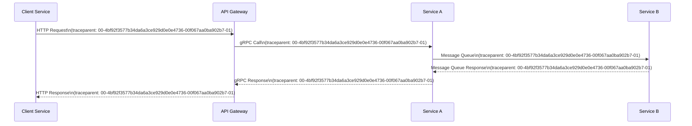
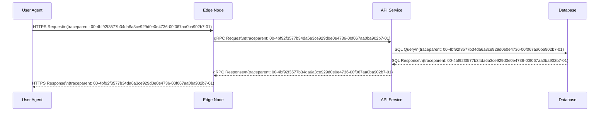
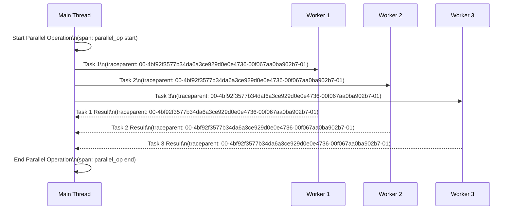
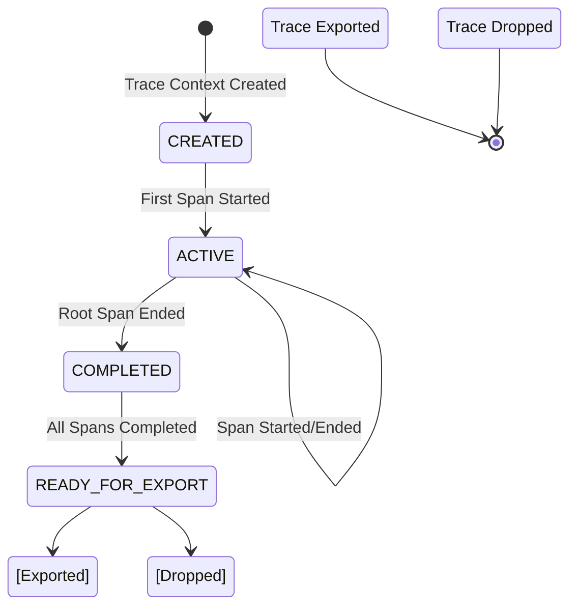
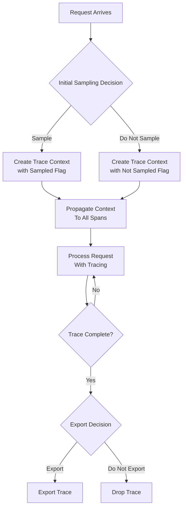
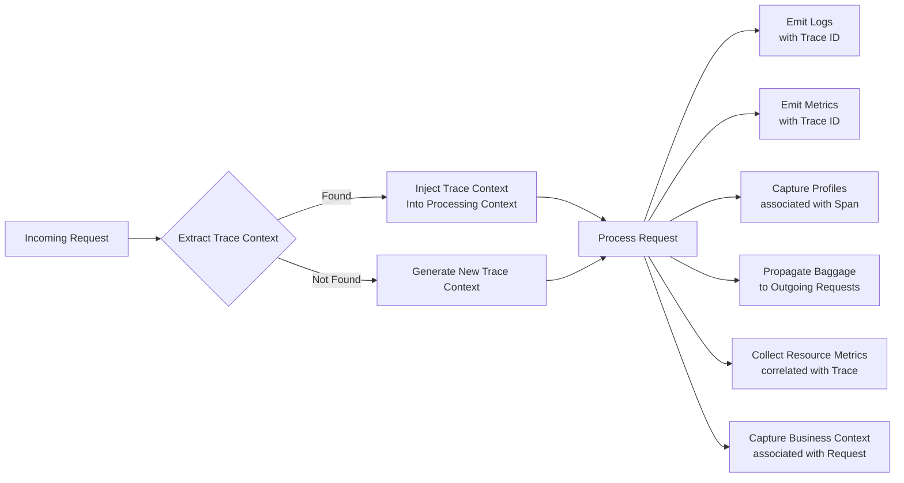

# 11.4 Distributed Tracing Architecture

## 11.4.1 Purpose

The Distributed Tracing Architecture provides a standardized mechanism for observing and understanding the flow of requests and operations across distributed components in the AI-OS. It enables observability of cross-component interactions, performance profiling, fault diagnosis, and behavioral analysis without mandating specific instrumentation technologies or backend systems. The architecture establishes contracts for context propagation, causal relationship preservation, and trace lifecycle management to ensure consistent observability across heterogeneous runtime components.

## 11.4.2 Tracing Philosophy

The tracing philosophy follows these core principles:

1. **Non-intrusive Observation**: Tracing must not significantly alter system behavior or performance characteristics
2. **Causal Integrity**: Trace data must accurately represent causal relationships between operations across process and network boundaries
3. **Minimal overhead**: Tracing mechanisms should impose minimal performance and resource overhead
4. **Vendor Neutrality**: Architecture must be independent of specific tracing backends, exporters, or storage systems
5. **Progressive Enhancement**: Tracing should provide value at minimal instrumentation levels while allowing incremental enhancement
6. **Privacy by Design**: Tracing mechanisms must not inadvertently expose sensitive information without explicit consent
7. **Ubiquitous Observability**: Tracing capabilities should be available by default in all system components

## 11.4.3 Trace Architecture

The trace architecture consists of multiple components working in concert within the AI-OS runtime and extending to external systems:

```mermaid
graph TD
    A[Application Code] -->|Instrumentation Points| B(Trace Context)
    B -->|Context Propagation| C[Network/Process Boundary]
    C -->|Trace Propagators| D[Trace Collectors]
    D -->|Trace Export| E[Trace Storage/Analysis]
    subgraph AI-OS Runtime
        A
        B
        F[Trace Context Manager]
        G[Span Processor]
        H[Trace Buffer]
        I[Sampling Engine]
        J[Export Pipeline]
        K[Trace Index]
        L[Trace Query Architecture]
        %% Internal data flow
        B --> F
        F --> G
        G --> H
        H --> I
        I --> J
        J --> K
        K --> L
        L -.-> B %% Query feedback loop
    end
    subgraph Infrastructure
        C
        D
    end
    E[External Systems]:::external
    
    classDef external fill:#f9f,stroke:#333,stroke-width:1px;
```

### Core Components

1. **Instrumentation Points**: Locations in application code where tracing instrumentation is applied to create and manage spans
2. **Trace Context Propagators**: Mechanisms for transmitting trace context across process boundaries (e.g., HTTP headers, message properties)
3. **Trace Collectors**: Intermediate receivers that validate, batch, and forward trace data to storage systems
4. **Trace Storage and Analysis Systems**: External backend systems that store traces and provide querying capabilities

### Extended Runtime Components

5. **Trace Context Manager**: Responsible for creating, extracting, injecting, and managing trace context lifecycle. Ensures context propagation across asynchronous boundaries and thread contexts.
6. **Span Processor**: Receives completed spans from instrumentation, applies sampling decisions, enriches spans with configured attributes, and forwards processed spans to the trace buffer.
7. **Trace Buffer**: Temporary storage for processed spans awaiting export. Enables batching, handles temporary backend unavailability, and provides overflow protection.
8. **Sampling Engine**: Implements sampling policies to make trace inclusion/exclusion decisions. Operates at trace inception (head-based) or span completion (tail-based) based on configuration.
9. **Export Pipeline**: Handles reliable transmission of trace data to configured backends. Includes retry mechanisms, circuit breaking, and adaptive batching.
10. **Trace Index**: In-memory index of recent traces enabling low-latency queries for active debugging and troubleshooting scenarios.
11. **Trace Query Architecture**: Defines interfaces and protocols for retrieving trace data from storage systems, supporting filtering by trace ID, time range, attributes, and span relationships.

## 11.4.4 Tracing Authority Boundaries

Clear ownership and responsibility boundaries ensure consistent behavior and prevent conflicts:

- **Trace Context Manager** has sole authority over: context creation, extraction, injection, and propagation mechanics
- **Span Processor** has sole authority over: span validation, sampling decision application, and attribute enrichment
- **Trace Buffer** has sole authority over: span queuing, batching strategies, and overflow handling
- **Sampling Engine** has sole authority over: sampling policy enforcement and decision consistency
- **Export Pipeline** has sole authority over: transmission reliability, backend selection, and failure handling
- **Trace Index** has sole authority over: in-memory indexing strategies and cache eviction policies
- **Trace Query Architecture** has sole authority over: query interface definition and result formatting
- **Instrumentation Points** (application code) have authority over: span creation timing, attribute setting, and event recording
- **Trace Collectors** have authority over: data validation, format translation, and preliminary aggregation

Cross-component interactions must respect these boundaries through well-defined interfaces. No component may directly manipulate another component's internal state except through sanctioned APIs.

## 11.4.5 Trace Model

A trace represents a single end-to-end transaction or workflow across the distributed system. The trace model consists of:

### Trace Identifier
- Globally unique identifier for the entire trace
- Immutable for the lifetime of the trace
- Typically a 128-bit or 16-byte value
- Propagated unchanged across all spans in the trace

### Span
A span represents a single unit of work within a trace. Each span contains:

1. **Span Context**
   - Trace ID: Identifies the trace to which the span belongs
   - Span ID: Unique identifier for the span within the trace
   - Trace State: Optional vendor-specific trace state
   - Trace Flags: Bitmask indicating sampling decisions and other trace properties

2. **Span Data**
   - Operation Name: Descriptive name of the operation
   - Start Timestamp: When the operation began (system UTC timestamp)
   - End Timestamp: When the operation completed
   - Duration: Calculated from start and end timestamps
   - Attributes: Key-value pairs providing additional context
   - Events: Timestamped occurrences within the span duration
   - Links: References to spans in other traces
   - Parent Span ID: Identifier of the parent span (null for root spans)
   - Span Kind: Classification of the span (INTERNAL, SERVER, CLIENT, PRODUCER, CONSUMER)

### Span Context Propagation
Span context must be propagated across process and network boundaries to maintain causal relationships. The context includes at minimum:
- Trace ID
- Span ID
- Trace flags (sampling decisions)
- Trace state (vendor-specific options)

### Span Attributes
Attributes provide structured metadata about the operation. Recommended attribute namespaces include:
- `ai.` for AI-specific attributes (model, tokens, etc.)
- `db.` for database operations
- `http.` for HTTP operations
- `messaging.` for messaging systems
- `rpc.` for RPC systems
- `process.` for process-level information
- `host.` for host-level information

### Span Events
Events represent point-in-time occurrences within a span's duration with:
- Timestamp: When the event occurred
- Name: Descriptive name of the event
- Attributes: Key-value pairs providing event context

### Span Links
Links represent causal relationships to spans in other traces that are not direct parent-child relationships, enabling:
- Batch processing correlations
- Async request correlations
- Distributed transaction correlations

## 11.4.6 Span Model

Spaces follow a defined lifecycle and contain specific data elements:

### Span Lifecycle States
```mermaid
stateDiagram-v2
    [*] -> STARTED: Span Created
    STARTED --> RECORDING: Started Recording
    RECORDING --> ENDED: Span Ended
    ENDED --> [*]: Span Completed
    
    state RECORDING {
        [*] --> ACTIVE
        ACTIVE --> RECORDING: Event Added
        ACTIVE --> RECORDING: Attribute Added
        ACTIVE --> RECORDING: Link Added
    }
```

### Span Data Model
```
Span {
    trace_id: 128-bit unsigned integer
    span_id: 64-bit unsigned integer
    trace_state: opaque byte sequence (optional)
    trace_flags: 8-bit bitmask
    parent_span_id: 64-bit unsigned integer (optional)
    trace_state: map<string, string> (optional)
    
    name: string
    kind: SpanKind {INTERNAL, SERVER, CLIENT, PRODUCER, CONSUMER}
    start_time: System UTC timestamp
    end_time: System UTC timestamp
    
    attributes: map<string, AttributeValue>
    events: list<Event>
    links: list<Link>
    
    status: StatusCode {UNSET, OK, ERROR}
    status_message: string (optional)
}

AttributeValue {
    string: string (optional)
    int: 64-bit signed integer (optional)
    double: 64-bit floating point (optional)
    boolean: boolean (optional)
    array: list<AttributeValue> (optional)
}

Event {
    time: System UTC timestamp
    name: string
    attributes: map<string, AttributeValue>
}

Link {
    trace_id: 128-bit unsigned integer
    span_id: 64-bit unsigned integer
    trace_state: map<string, string> (optional)
    attributes: map<string, AttributeValue>
}
```

## 11.4.7 Context Propagation

Context propagation ensures trace context flows consistently across system boundaries. The architecture defines:

### Propagation Mechanisms
1. **In-Process Propagation**: Via thread-local storage or async context propagation mechanisms
2. **Inter-Process Propagation**: Via explicit context injection/extraction at boundaries
3. **Network Propagation**: Via standardized headers in network protocols

### Propagation Contract
All system components MUST:
1. Extract incoming trace context from incoming requests
2. Inject trace context into outgoing requests
3. Preserve trace context throughout asynchronous operations
4. Propagate trace context to child spans and asynchronous continuations

### Context Propagation Diagram


## 11.4.8 Causality Preservation

Causality preservation ensures that trace relationships accurately reflect the causal relationships between operations. The architecture enforces:

### Causality Rules
1. **Parent-Child Relationship**: A span's parent must have started before the span and ended after the span ends
2. **Temporal Ordering**: For any two spans with a parent-child relationship, the parent's start time < child's start time AND child's end time < parent's end time
3. **Link Validity**: Linked spans must have overlapping time intervals with the linking span
4. **Trace Consistency**: All spans in a trace must share the same trace ID
5. **Span ID Uniqueness**: Span IDs must be unique within a trace

### Causality Violation Detection
The tracing system SHOULD detect and report:
- Orphaned spans (spans with no traceable root)
- Orphaned spans (spans whose parent ended before they started)
- Orphaned spans (spans whose parent started after they ended)
- Orphaned spans (spans with impossible timing relationships)

## 11.4.9 Cross-Node Tracing

Cross-node tracing enables observation of operations spanning multiple compute nodes, processes, or containers. Key aspects include:

### Network Boundary Handling
At each network boundary (RPC, HTTP, message queue, etc.):
1. Extract incoming trace context from the request
2. Create a new span as child of the extracted context (or as root if no context)
3. Inject the current trace context into the outgoing request
4. Ensure context propagation follows the request/response flow

### Cross-Node Tracing Diagram


### Cross-Process Tracing
For intra-machine inter-process communication:
1. Use operating system-provided mechanisms for context transfer (UNIX domain sockets, shared memory, etc.)
2. Apply same extraction/injection principles as network boundaries
3. Maintain temporal ordering guarantees across process boundaries
4. Preserve baggage items during transfer when configured
5. Handle context translation between different propagation mechanisms (e.g., HTTP to gRPC)

## 11.4.10 Distributed Execution Tracing

Distributed execution tracing covers asynchronous and parallel execution patterns:

### Asynchronous Operation Tracing
For asynchronous operations (callbacks, futures,backs, async await):
1. Create a span when the async operation is initiated
2. Propagate the trace context to the async continuation via context capture
3. Complete the span when the async operation completes (success or error)
4. Link spans representing related async operations when appropriate (e.g., related database queries)
5. Ensure async continuation inherits all trace context including baggage items

### Parallel Execution Tracing
For parallel execution patterns (parallel maps, fan-out/fan-in):
1. Create a parent span representing the parallel operation
2. Create child spans for each parallel unit of work with proper parent-child linkage
3. Ensure all child spans complete before ending the parent synchronisation point
4. Use links to correlate related work items when appropriate (e.g., map-reduce relationships)
5. Maintain temporal ordering: parent starts before children, children end before parent ends
6. Preserve trace context isolation between parallel branches unless explicitly shared

### Distributed Execution Tracing Diagram


## 11.4.11 Trace Lifecycle

The trace lifecycle encompasses creation, propagation, completion, and consumption, enhanced by runtime components:

### Trace Lifecycle States


### Trace Lifecycle Phases with Component Responsibilities
1. **Creation**: Trace Context Manager generates trace context at system entry point
2. **Propagation**: Trace Context Manager propagates context via Trace Context Propagators
3. **Instrumentation: Application code creates spans at Instrumentation Points
4. **Processing**: Span Processor**: Application code creates spans at Instrumentation Points
4. **Processing**: Span Processor receives completed spans, applies sampling via Sampling Engine, enriches attributes
5. **Buffering**: Trace Buffer stores processed spans for batching and reliability
6. **Export Decision**: Export Pipeline transmits traces to Trace Collectors based on sampling outcome
7. **Consumption**: Trace Storage and Analysis Systems persist data; Trace Query Architecture enables retrieval
8. **Completion**: Trace marked complete when root span ends and all child spans processed

### Span Lifecycle Within Trace (Enhanced)
Each span follows this lifecycle within its trace:
1. **Started**: Span creation and start time recorded by Instrumentation Point
2. **Active**: Span actively recording events, attributes, and links via Span Processor
3. **Ended**: Span end time recorded and status set by Instrumentation Point
4. **Processing**: Span Processor validates span, applies sampling decision, enriches with configured attributes
5. **Buffering**: Trace Buffer accepts processed span for batching
6. **Export**: Export Pipeline transmits batch to Trace Collectors if sampled
7. **Completion**: Span ready for export after parent span completion (if applicable)
8. **Indexing**: Trace Agent updates Trace Index for recent traces (if within retention window)
9. **Storage**: Trace Store persists trace for long-term analysis and querying

## 11.4.12 Sampling Architecture

Sampling controls which traces are collected and exported to manage overhead and storage requirements.

### Sampling Decision Points
Sampling decisions can be made at:
1. **Initial Sampling**: At trace creation (head-based sampling)
2. **Tracing Sampling**: During trace execution (tail-based sampling)
3. **Export Sampling**: Prior to export (rate limiting)

### Sampling Policies
The architecture supports multiple sampling policies:

1. **Always On**: 100% sampling rate
2. **Always Off**: 0% sampling rate
3. **Probabilistic**: Fixed percentage sampling (e.g., 0.1%)
4. **Rate Limited**: Fixed number of traces per time window
5. **Adaptive**: Dynamic adjustment based on traffic volume and available resources
6. **Rule-Based**: Sampling based on trace attributes (e.g., error status, specific operations)
7. **Hybrid**: Combination of multiple strategies (e.g., always sample errors + 0.1% sampling)
8. **Remote Configuration**: Sampling decisions made by external service via configuration protocol

### Sampling Decision Propagation
Sampling decisions MUST be propagated with the trace context to ensure:
1. All spans in a trace share the same sampling decision
2. Downstream services respect the sampling decision made upstream
3. Consistent trace visibility across service boundaries
4. Sampling Engine maintains decision consistency throughout trace lifetime
5. Sampling decisions are immutable for the life of a trace once established

### Sampling Diagram


### Sampling Configuration
Sampling configuration MUST support:
1. Per-service sampling configuration
2. Per-operation sampling overrides
3. Per-attribute sampling rules (e.g., sample all 5xx errors)
4. Dynamic sampling configuration updates without service restart
5. Fallback to local decision when remote configuration unavailable
6. Hierarchical configuration (service > operation > attribute)
7. Sampling rate adjustment based on system load metrics
8. Per-endpoint sampling configuration for export targets
9. Sampling decision tracing for diagnostic purposes (opt-in)
10. Warm-up period handling for adaptive sampling algorithms

## 11.4.13 Correlation Architecture

Trace correlation enables connecting traces with other observability signals (logs, metrics, profiles).

### Correlation Mechanisms
1. **Trace ID in Logs**: Include trace ID in all log entries associated with a trace
2. **Trace ID in Metrics**: Include trace ID as a dimension in relevant metrics
3. **Span ID in Profiles**: Associate profiling data with specific spans
4. **Baggage Propagation**: Propagate user-defined key-value pairs alongside trace context
5. **Resource Correlation**: Link traces to infrastructure metrics (CPU, memory, disk, network)
6. **Business Context Correlation**: Correlate traces with business metrics (conversion rates, revenue)

### Correlation Data Model
```
TraceCorrelation {
    trace_id: 128-bit unsigned integer
    span_id: 64-bit unsigned integer (optional)
    trace_state: map<string, string> (optional)
    
    // Correlation attributes
    log_correlation: boolean
    metric_correlation: boolean
    profile_correlation: boolean
    baggage: map<string, string>
    resource_correlation: boolean
    business_context: map<string, string> (optional)
}
```

### Correlation Diagram


### Correlation Guarantees
The architecture guarantees:
1. All log entries created during a span's lifetime include the trace ID
2. Metrics emitted during a span's lifetime can be associated with that span
3. Profiling data can be attributed to specific spans
4. Baggage items propagate with trace context and are available to all spans in the trace
5. Resource metrics are correlated with traces via temporal alignment and instance identification
6. Business context is propagated with requests when available at ingress points
7. Trace Context Manager ensures correlation item propagation consistency across async boundaries
8. Correlation does not introduce significant latency (>50µs overhead per correlation operation)

## 11.4.14 Behavioural Contracts

Behavioural contracts define the expected behavior of tracing implementation components:

### Instrumentation Contract
All instrumented code MUST:
1. Create spans for all externally visible operations upon entry
2. Set appropriate span kind (SERVER, CLIENT, etc.) based on operation role
3. Record start time using monotonic clock before any operation work
4. Record end time using same monotonic clock after operation completion
5. Set status to OK upon successful completion, ERROR upon failure (or alternative status per semantic conventions)
6. Add relevant attributes for observability (component, operation, identifiers, resource usage)
7. Record significant events as span occurrences with timestamps
8. Establish correct parent-child relationships using active context from Trace Context Manager
9. Propagate trace context to child operations via context propagation mechanisms
10. Propagate trace context to asynchronous continuations via context capture
11. Inject trace context into outgoing requests using trace propagators
12. Extract trace context from incoming requests using trace propagators
13. Never suppress or discard trace context without explicit sampling decision from Sampling Engine
14. Ensure span duration is non-negative and logically consistent with wall-clock time
15. Handle instrumentation errors gracefully without affecting primary operation flow
16. Respect sampling decisions made upstream without attempting to override
17. Provide trace context to framework lifecycle hooks when available

### Context Propagation Contract
All components handling requests/responses MUST:
1. Extract trace context from incoming requests using configured propagators
2. Create a new span as child of extracted context (or root if none available)
3. Inject current trace context into outgoing requests using configured propagators
4. Ensure context is available to all asynchronous continuations via context capture mechanisms
5. Preserve trace context across thread/process boundaries without alteration
6. Propagate baggage items alongside trace context when baggage propagation is enabled
7. Handle context extraction failures by generating new trace context (unless disabled via configuration)
8. Ensure context propagation does not introduce significant latency (<100µs overhead)
9. Maintain context fidelity across serialization/deserialization boundaries
10. Support Context Propagation for multiple protocols (HTTP, gRPC, messaging, etc.)
11. Never modify trace ID or span ID during propagation
12. Preserve trace flags (sampling decisions) exactly as received
13. Handle trace state according to W3C TraceContext specification
14. Ensure context propagation works correctly in reactive and asynchronous programming models

### Span Lifecycle Contract
All spans MUST:
1. Have a unique span ID within their trace (collision resistance >2^-64)
2. Have a valid trace ID matching the current trace context from Trace Context Manager
3. Have a start time before their end time (non-negative duration)
4. Have a start time not earlier than their parent's start time (if parent exists)
5. Have an end time not later than their parent's end time (if parent exists)
6. Have status set appropriately before ending (UNSET only during active processing)
7. Be completed exactly once (no duplicate processing through Span Processor)
8. Have attributes conforming to declared namespace conventions with valid values
9. Have events with timestamps within the span's [start_time, end_time] interval
10. Have links referencing spans with overlapping temporal intervals and valid trace IDs
11. Not exceed reasonable attribute cardinality limits (configurable per implementation)
12. Not create excessive events or links that would impair performance (configurable limits)
13. Support nested spans to arbitrary reasonable depth (implementation-defined limit)
14. Maintain span ordering consistency in export batches when possible
15. Ensure span lifecycle events are idempotent-safe

### Sampling Contract
All sampling implementations MUST:
1. Make sampling decisions based solely on trace context and configuration
2. Propagate sampling decisions unchanged in trace flags (sampled=1, not sampled=0)
3. Ensure all spans in a trace receive identical sampling decision
4. Respect sampling decisions made by upstream services without modification or override
5. Provide deterministic sampling when configured deterministically (same input → same output)
6. Make sampling decisions within 10µs of decision point to minimize overhead
7. Never alter sampling decision for an active trace after initial determination
8. Support hot-reloading of sampling configuration without service interruption or trace corruption
9. Provide sampling decision traceability for diagnostic purposes (opt-in)
10. Ensure sampling decisions are compliant with configured policies at all times
11. Handle sampling policy conflicts with well-defined precedence rules
12. Support weighted sampling for advanced use cases
13. Never sample traces when explicit opt-out is indicated via baggage or configuration
14. Respect Do Not Track (DNT) or similar privacy signals when configured to do so
15. Maintain sampling decision consistency across service restarts when using persistent configuration

### Export Pipeline Contract
The Export Pipeline MUST:
1. Accept batches of spans from Trace Buffer with acknowledgment mechanism
2. Implement retry logic with exponential backoff and jitter for transient failures
3. Apply circuit breaker pattern to prevent cascading failures during backend outages
4. Maintain ordering of spans within a trace when possible and configured to do so
5. Provide delivery guarantees configurable per endpoint (at-least-once, at-most-once, exactly-where-possible)
6. Encrypt transmitted trace data when crossing trust boundaries using approved algorithms
7. Implement rate limiting to respect backend capacity constraints and avoid throttling
8. Report export metrics (success/failure rates, latency, volume) to monitoring systems
9. Never lose spans due to internal buffering limits without explicit overflow handling and notification
10. Ensure exported traces maintain referential integrity (all spans of a trace arrive together when possible)
11. Support multiple export backends with configurable routing and sampling
12. Provide backpressure propagation to Trace Buffer when downstream is congested
13. Implement batch optimization to minimize network overhead
14. Handle partial batch failures gracefully with per-span error reporting
15. Support authentication and authorization for secure trace transmission
16. Maintain transmission integrity via checksums or message authentication codes
17. Ensure exported trace data conforms to the selected format specification (JSON, Protobuf, etc.)
18. Provide observability into export pipeline health and performance metrics
19. Never block application threads during export operations (asynchronous by design)
20. Handle clock skew between services gracefully when using time-based filtering

## 11.4.15 Runtime Invariants

Runtime invariants are properties that must always hold true during system operation:

### Trace Integrity Invariants
1. **Trace ID Consistency**: All spans in a trace share the identical trace ID
2. **Span ID Uniqueness**: No two spans in the same trace share the same span ID (probability of collision < 2^-96 for 128-bit trace ID + 64-bit span ID)
3. **Temporal Ordering**: For any parent-child span relationship:
   - parent.start_time <= child.start_time
   - child.end_time <= parent.end_time
   - child.start_time - parent.start_time >= 0 (non-negative inherited latency)
   - parent.end_time - child.end_time >= 0 (non-negative residual latency)
4. **Acyclic Relationships**: No span can be its own ancestor (directly or indirectly through any path)
5. **Completion Order**: Span ends before its parent ends (strict temporal containment with positive overlap)
6. **Context Consistency**: Span's trace context matches the trace context active at its creation point from Trace Context Manager
7. **Attribute Validity**: All attribute keys conform to namespace conventions (regex: ^[a-zA-Z0-9_.-]+$); values are valid UTF-8
8. **Event Timing**: All event timestamps fall within the span's [start_time, end_time] interval (inclusive)
9. **Link Validity**: All linked stems have timestamps overlapping with the linking span's interval and valid trace IDs
10. **Trace Completeness**: For any trace, the root span's start time is the minimum start time of all spans in the trace
11. **Span Ordering**: Sibling spans maintain deterministic ordering in trace representation (by start time)
12. **Duration Validity**: Span duration is consistent with start and end times (end_time - start_time >= 0)
13. **Status Validity**: Span status is one of {UNSET, OK, ERROR} with optional message
14. **Kind Validity**: Span kind is one of {INTERNAL, SERVER, CLIENT, PRODUCER, CONSUMER}
15. **Trace State Validity: All linked spans have timestamps overlapping with the linking span's interval and valid trace IDs
10. **Trace Completeness**: For any trace, the root span's start time is the minimum start time of all spans in the trace
11. **Span Ordering**: Sibling spans maintain deterministic ordering in trace representation (by start time)
12. **Duration Validity**: Span duration is consistent with start and end times (end_time - start_time >= 0)
13. **Status Validity**: Span status is one of {UNSET, OK, ERROR} with optional message
14. **Kind Valididty**: Span kind is one of {INTERNAL, SERVER, CLIENT, PRODUCER, CONSUMER}
15. **Trace State Validity**: Trace state, when present, conforms to W3C TraceContext specification
16. **Parent Validity**: Parent span ID, when present, refers to a span that exists in the same trace
17. **Event Validity**: Event names conform to naming conventions; attribute values are valid
18. **Link Validity**: Link trace ID and span ID refer to a span that exists in some trace (possibly different)
19. **Sampling Flag Consistency**: Trace flags field correctly represents sampling decision (bit 0 set = sampled)
20. **Trace State Propagation**: Trace state is propagated unchanged unless modified by configured plugins

### Context Propagation Invariants
1. **Context Preservation**: Trace context entering a component boundary equals trace context leaving that boundary (modified only by propagation actions)
2. **Propagation Completeness**: All outgoing requests contain trace context derived from incoming context
3. **Asynchronous Propagation**: Trace context flows to all asynchronous continuations of an operation with fidelity
4. **Boundary Integrity**: Trace context does not leak between unrelated request processing flows
5. **Context Idempotence**: Extracting then injecting context yields equivalent context (within encoding limits)
6. **Async Context Preservation**: Context survives across await/yield boundaries in asynchronous code
7. **Thread Context Preservation**: Context survives thread transfers via proper context propagation
8. **Batch Context Integrity**: In batch operations, all items inherit the same trace context unless explicitly overridden
9. **Context Serialization**: Context survives serialization/deserialization round-trip without loss of fidelity
10. **Cross-Language Compatibility**: Context propagation works correctly between different language implementations
11. **Version Compatibility**: Context propagation respects backward compatibility guarantees
12. **Size Limits**: Encoded trace context remains within protocol-specific size limits (e.g., HTTP header limits)
13. **Immutability**: Trace ID and span ID are immutable once set
14. **Flags Preservation**: Trace flags (sampling decisions) are preserved exactly through propagation
15. **State Handling**: Trace state is handled according to W3C TraceContext specification (append-only, key-value)
16. **Context Acquisiton and release**: Context acquisition and release are balanced to prevent leaks
17. **Propagation Order**: Context propagation steps occur in deterministic order
18. **Context Isolation**: Context from one trace does not bleed into another trace
19. **Nested Context**: Context handles nested tracing scenarios correctly (e.g., spans within spans)
20. **Context Reset**: Context can be reset to clean state when needed for isolation

### Sampling Invariants
1. **Decision Uniformity**: All spans in a trace have identical trace flags (sampling decisions)
2. **Decision Propagation**: Sampling decisions made at trace entry are respected throughout the trace
3. **Decision Stability**: Sampling decision for a trace does not change during the trace lifetime
4. **Decision Determinism**: Identical trace contexts under identical configuration yield identical decisions
5. **Rate Limit Compliance**: Observed trace export rate does not exceed configured rate limits
6. **Adaptive Convergence**: Adaptive sampling converges to target rate within configured time window
7. **Fallback Safety**: When remote configuration unavailable, local decision respects local policy
8. **Policy Precedence**: Sampling policies follow defined precedence (explicit > implicit > default)
9. **Zero Sampling Respect**: Traces marked as not sampled are never exported regardless of other factors
10. **Full Sampling Honoring**: Traces marked as sampled are always exported unless system overload occurs
11. **Decision Immutability**: Sampling decision for a span cannot be altered after initial determination
12. **Atomic Decision**: Sampling decision is made atomically to prevent race conditions
13. **Configuration Atomicity**: Sampling configuration updates are applied atomically
14. **Decision Traceability**: Sampling decisions can be traced for diagnostic purposes when enabled
15. **Boundary Sampling**: Sampling decisions respect service mesh and ingress/egress boundaries
16. **Resource Awareness**: Sampling adapts to available resources when configured to do so
17. **Minimum Sampling**: System guarantees minimum sampling for critical paths when configured
18. **Maximum Overhead**: Sampling overhead never exceeds configured CPU/memory limits
19. **Decision Audit**: Sampling decisions are auditable for compliance when required
20. **Emergency Override**: Critical system conditions can trigger temporary sampling adjustments

### Resource Utilization Invariants
1. **Bounded CPU Overhead**: Tracing CPU consumption remains below 3% of total under normal load (95th percentile)
2. **Bounded Memory Overhead**: Tracing memory consumption remains below 15MB per service instance under normal load (95th percentile)
3. **Buffer Occupancy**: Trace Buffer never exceeds 85% capacity under normal operating conditions
4. **Export Latency**: 95% of trace exports complete within 1.5 seconds of span completion
5. **Queue Depth**: Export Pipeline queue depth remains below 500 spans under normal load
6. **Index Freshness**: Trace Index contains traces from the last 3 minutes under normal conditions
7. **Backpressure Propagation**: System properly applies backpressure when export pipeline is saturated (>80% utilization)
8. **Failure Isolation**: Tracing system failures do not propagate to application request processing (isolated failure domain)
9. **Self-Monitoring**: Tracing system exports its own operational metrics for observability (standard metrics)
10. **Deadlock Freedom**: No circular dependencies exist between tracing components that could cause deadlock
11. **Starvation Freedom**: All tracing operations complete in bounded time under normal load
12. **Prioritization**: Trace processing respects priority levels when configured (e.g., error traces high priority)
13. **Resource Accounting**: Tracing resource consumption is accurately reported and attributable
14. **Scalability**: Tracing system scales linearly with request volume up to configured limits
15. **Elasticity**: Tracing system adapts resource consumption to load changes without disruption
16. **Fault Tolerance**: System continues operating correctly despite individual component failures
17. **Recovery Time**: System recovers from transient failures within configured time limits
18. **Resource Reclamation**: Resources are properly released when tracing is disabled or components shutdown
19. **Isolation**: Tracing resource consumption is isolated from critical application resources
20. **Observability Overhead**: Observability of tracing system itself adds <1% overhead to tracing operations

## 11.4.16 Security

Security considerations for the tracing system:

### Confidentiality
1. **Sensitive Data Prevention**: Instrumentation MUST NOT automatically capture sensitive data (passwords, tokens, PII, payment info)
2. **Attribute Sanitization**: Systems SHOULD provide mechanisms to sanitize or redact sensitive attribute values via allow/block lists
3. **Secure Transmission**: Trace data transmitted over networks SHOULD be encrypted when crossing trust boundaries (TLS 1.2+)
4. **Access Control**: Trace storage and access SHOULD be protected by appropriate access controls (RBAC, ABAC)
5. **Data Minimization**: Collect only data necessary for observability purposes
6. **Purpose Limitation**: Use trace data only for agreed-upon observability purposes
7. **Anonymization**: Implement techniques to anonymize or pseudonymize sensitive data in traces when required
8. **Storage Encryption**: Trace data at rest SHOULD be encrypted using approved algorithms
9. **Key Management**: Encryption keys SHOULD be managed via secure key management systems
10. **Access Logging**: Trace data access SHOULD be logged for audit purposes
11. **Network Segmentation**: Trace transmission paths SHOULD be isolated from untrusted networks when possible
12. **Secure Configuration**: Tracing configuration SHOULD be protected from unauthorized modification
13. **Secret Detection**: Systems SHOULD implement automated detection of accidental secret inclusion in traces
14. **Secure Wiping**: Trace data SHOULD be securely wiped when purged from storage systems
15. **Metadata Protection**: Transmission metadata (routing info) SHOULD be protected when sensitive
16. **Zero-Knowledge Proofs**: Consider advanced techniques for privacy-preserving trace analysis when applicable
17. **User Consent**: Obtain explicit user consent when tracing collects personally identifiable information
18. **Data Respect**: Respect data sovereignty and localization requirements for trace data
19. **Third-Party Sharing**: Limit sharing of trace data with third parties to strict necessities
20. **Retention Enforcement**: Automatically enforce data retention policies for trace data

### Integrity
1. **Context Integrity**: Trace context MUST NOT be tampered with in transit (use sequence numbers or signatures when crossing trust boundaries)
2. **Span Integrity**: Span data MUST NOT be altered after creation without detection (use hashes or signatures for critical spans)
3. **Trace Binding**: Trace context SHOULD be cryptographically bound to the originating service when crossing trust boundaries (optional enhancement)
4. **Immutable Storage**: Trace storage systems SHOULD implement write-once-read-many (WORM) semantics for compliance
5. **Audit Trails**: Maintain audit trails of trace data creation, modification, and access
6. **Input Validation**: Validate all incoming trace data for conformance to expected schemas and constraints
7. **Output Encoding**: Properly encode trace data outputs to prevent injection attacks
8. **Dependency Scanning**: Regularly scan tracing dependencies for known vulnerabilities
9. **Runtime Protection**: Employ runtime protection mechanisms (ASLR, DEP, stack canaries) in tracing components
10. **Code Signing**: Sign tracing components to prevent tampering and ensure authenticity
11. **Dependency Integrity**: Verify integrity of third-party tracing dependencies before use
12. **Secure Bootstrapping**: Ensure tracing system initializes in a known secure state
13. **Memory Safety**: Use memory-safe languages or conduct rigorous audits for memory safety violations
14. **Type Safety**: Enforce strong typing to prevent type confusion vulnerabilities
15. **Privilege Separation**: Implement privilege separation to limit blast radius of potential compromises
16. **Secure Defaults**: Ship with secure-by-default configurations
17. **Vulnerability Response**: Maintain rapid vulnerability response and patching process
18. **Penetration Testing**: Regularly conduct penetration testing on tracing components
19. **Threat Modeling**: Perform threat tracing during design and development phases
20. **Security Monitoring**: Implement security monitoring and anomaly detection for tracing systems

### Availability
1. **Failure Transparency**: Tracing system failures MUST NOT cause application failures (fail-open or isolated failure)
2. **Circuit Breaking**: Tracing systems SHOULD implement circuit breaker patterns to prevent cascading failures
3. **Resource Isolation**: Tracing resource consumption MUST be isolated from application critical resources
4. **Graceful Degradation**: System should continue providing core tracing functionality during partial outages
5. **Fallback Mechanisms**: Implement fallback to local storage or alternative backends when primary unavailable
6. **Load Shedding**: Implement load shedding strategies to maintain core functionality under extreme load
7. **Restart Safety**: System should recover cleanly from unexpected restarts without data corruption
8. **Backup Strategies**: Implement backup and recovery procedures for trace data
9. **Health Checks**: Implement comprehensive health checks for all tracing components
10. **Chaotic Engineering**: Utilize chaos engineering to validate resilience assumptions
11. **Redundancy**: Design for redundancy where economically viable (active-passive or active-active)
12. **Timeouts**: Implement appropriate timeouts to prevent resource exhaustion from hung operations
13. **Bulkheads**: Use bulkhead patterns to isolate failures to specific components
14. **Rate Limiting**: Protect tracing system from being overwhelmed by excessive trace generation
15. **Priority Queues**: Implement priority queues to ensure critical traces are processed during congestion
16. **Resource Reservations**: Reserve minimum resources for critical tracing functions during contention
17. **Self-Healing**: Implement self-healing mechanisms for transient failures
18. **Observable Degradation**: Make degradation visible to operators via metrics and alerts
19. **Graceful Shutdown**: Ensure tracing system shuts down cleanly without losing in-flight traces
20. **Startup Resilience**: Ensure tracing system starts correctly even if some dependencies are unavailable

## 11.4.17 Privacy

Privacy considerations for the tracing system:

### Data Minimization
1. **Essential Data Only**: Collect only data necessary for observability purposes
2. **Purpose Limitation**: Use trace data only for agreed-upon observability purposes
3. **Retention Limits**: Implement configurable retention policies for trace data (e.g., 30 days for debugging, 90 days for compliance)
4. **Data Aggregation**: Prefer aggregated metrics over raw traces for long-term storage when possible
5. **Sampling for Privacy**: Use sampling to reduce privacy risk when tracing sensitive operations
6. **Field-Level Filtering**: Remove or obfuscate specific fields known to contain sensitive information
7. **Masking Techniques**: Apply masking or tokenization to sensitive data fields (e.g., credit card numbers)
8. **Bucketing**: Convert precise values to buckets or ranges to reduce identifiability
9. **Differential Privacy**: Consider applying differential privacy techniques for aggregate analysis
10. **K-Anonymity**: Ensure trace data meets k-anonymity requirements when shared externally

### Anonymization and Pseudonymization
1. **IP Address Handling**: Consider truncating or hashing IP addresses in attributes (e.g., /24 for IPv4)
2. **User Identifier Handling**: Provide mechanisms to pseudonymize user identifiers (e.g., hash with salt)
3. **Session Identifiers**: Treat session identifiers as sensitive and apply appropriate protection
4. **Device Identifiers**: Apply same protections to device identifiers as to user identifiers
5. **Geographic Data**: Generalize precise geographic data to regions or cities when sufficient
6. **Temporal Granularity**: Reduce timestamp precision when fine-grained timing is not required
7. **Data Swapping**: Exchange values between records to prevent re-identification
8. **Synthetic Data Generation**: Generate statistically similar synthetic data for sharing when appropriate
9. **Data Perturbation**: Add controlled noise to numerical values to prevent precise reconstruction
10. **Access Controls**: Implement strict access controls to prevent linkage attacks

### User Consent and Transparency
1. **Transparency**: Systems SHOULD provide visibility into what tracing data is collected and how it's used
2. **Opt-out Mechanisms**: Systems SHOULD provide mechanisms to opt out of tracing when legally required or by user preference
3. **Purpose Specification**: Organizations SHOULD document the specific purposes for which trace data is used
4. **Notice and Choice**: Provide clear notice of tracing practices and meaningful choice to users
5. **Granular Consent**: Allow users to consent to specific types of tracing (performance vs. debugging vs. analytics)
6. **Withdrawal Mechanism**: Enable users to withdraw previously given consent easily
7. **Child Privacy**: Implement special protections for children's data when applicable
8. **Data Access Requests**: Implement procedures for users to access their trace data
9. **Data Portability**: Support export of user's trace data in portable format when requested
10. **Delete on Request**: Implement mechanisms to delete user's trace data upon request
11. **Consent Recording**: Maintain auditable records of user consent choices
12. **Privacy by Design**: Integrate privacy considerations into tracing system design from the outset
13. **Privacy Impact Assessments**: Conduct PIAs for new tracing features or significant changes
14. **Privacy Training**: Train personnel handling trace data on privacy obligations and best practices
15. **Privacy Metrics**: Measure and monitor privacy-related metrics (requests fulfilled, breaches prevented)
16. **Privacy-Friendly Defaults**: Set privacy-protective options as defaults where appropriate

### Compliance
1. **Regulatory Alignment**: Tracing implementations SHOULD support compliance with relevant regulations (GDPR, CCPA, HIPAA, etc.)
2. **Data Subject Rights**: Systems SHOULD provide capabilities to support data subject access requests (access, rectification, erasure, portability)
3. **Audit Trails**: Systems SHOULD maintain audit trails of trace data access, usage, and modifications
4. **Data Protection Officers**: Involve DPOs in tracing system design and operation when required
5. **Breach Notification**: Implement procedures for timely breach notification when required by regulation
6. **Data Protection Impact Assessments**: Conduct DPIAs for high-risk tracing processing activities
7. **Vendor Management**: Ensure third-party tracing vendors comply with applicable data protection regulations
8. **Cross-Border Transfers**: Implement appropriate measures for international transfer of trace data
9. **Algorithm Transparency**: Provide transparency about tracing algorithms when required by regulation
10. **Data Localization**: Respect data localization requirements for trace storage and processing
11. **Audit Preparedness**: Maintain documentation and evidence to demonstrate compliance readiness
12. **Regular Assessments**: Conduct regular compliance assessments and audits
13. **Incident Response**: Maintain incident response plan specific to trace data breaches
14. **Legal Holds**: Implement capability to place legal holds on trace data when required for litigation
15. **Privacy-Friendly Innovation**: Encourage innovation that enhances rather than diminishes privacy protections

## 11.4.18 Cross-Part Integration

Integration with other architectural parts of the AI-OS:

### Integration with Configuration Management
1. **Dynamic Configuration**: Tracing configuration SHOULD be dynamically updatable without restart
2. **Profile Integration**: Tracing profiles SHOULD integrate with configuration profiles
3. **Environment Awareness**: Tracing behavior SHOULD adapt based on deployment environment (dev/test/prod)
4. **Configuration Versioning**: Tracing configuration SHOULD be version-controlled and auditable
5. **Rollback Capability**: Ability to rollback tracing configuration to previous known-good state
6. **Configuration Validation**: Tracing configuration changes SHOULD be validated before application
7. **Environment-Specific Defaults**: Different environments MAY have different default tracing configurations
8. **Feature Flags**: Tracing features SHOULD be controllable via feature flags where appropriate
9. **Configuration Sensitivity**: Recognize that tracing configuration can be sensitive and protect accordingly
10. **Configuration Drift Detection**: Detect and alert on configuration drift from approved baselines

### Integration with Security Subsystem
1. **Credential Protection**: Tracing MUST NOT capture or log security credentials
2. **Security Context**: Tracing MAY incorporate security context (principal, roles) when appropriate and permitted
3. **Secure Channels**: Tracing data transmission SHOULD utilize secure channels when available
4. **Security Event Correlation**: Correlate tracing data with security events for forensic analysis
5. **Threat Intelligence Integration**: Enrich traces with threat intelligence indicators when available
6. **Vulnerability Scoring**: Associate traces with vulnerability scores when relevant
7. **Access Control Integration**: Leverage existing authZ/authN systems for trace data access control
8. **Secure Key Management**: Integrate with organizational key management systems for encryption keys
9. **Security Monitoring**: Feed tracing data into security monitoring systems for anomaly detection
10. **Privacy-Preserving Security Analysis**: Enable security analysis that preserves user privacy
11. **Incident Response Integration**: Integrate tracing data with incident response playbooks and tooling
12. **Forensic Readiness**: Ensure tracing data is suitable for forensic investigations when needed
13. **Secure Development Lifecycle**: Apply SDL practices to tracing component development
14. **Security Testing**: Include tracing components in regular security testing regimens
15. **Zero Trust Architecture**: Design tracing components to operate in zero trust environments when required

### Integration with Observability Framework
1. **Unified Instrumentation**: Tracing SHOULD be part of a unified observability strategy with metrics and logging
2. **Correlation IDs**: Trace ID SHOULD serve as correlation ID across observability signals
3. **Metric Derivation**: Derive key metrics from trace data (latency, error rates, throughput)
4. **Log Enrichment**: Enrich log entries with trace IDs and span context when available
5. **Dashboard Integration**: Tracing data SHOULD be integrable with observability dashboards and alerting systems
6. **Alert Correlation**: Correlate tracing-based alerts with metric and log-based alerts
7. **Root Cause Analysis**: Facilitate root cause analysis using correlated traces, metrics, and logs
8. **Service Maps**: Generate service dependency maps from trace data
9. **Distributed Debugging**: Enable cross-service debugging using correlated observability data
10. **SLO/SLI Monitoring**: Use trace data to monitor service level objectives and indicators
11. **Anomaly Detection**: Apply machine learning to trace data for anomaly detection
12. **Retention Alignment**: Align trace data retention with metrics and logs retention policies
13. **Unified Search**: Enable cross-observability searching using trace ID as pivot
14. **Context Propagation**: Ensure context propagation works across all observability types of telemetry
15. **Overhead Attribution**: Accurately attribute observability overhead to correct components
16. **Feedback Loops**: Use observability data to inform tracing configuration adjustments

### Integration with Resource Management
1. **Resource Awareness**: Tracing SHOULD be aware of and adapt to resource constraints
2. **Adaptive Sampling**: Tracing SHOULD adjust sampling rates based on system load and available resources
3. **Resource Prediction**: Use historical tracing data to predict future resource needs
4. **Bottleneck Identification**: Use trace data to identify system bottlenecks and resource contention
5. **Overhead Accounting**: Tracing overhead SHOULD be accounted for in resource allocation and capacity planning
6. **Resource Isolation**: Tracing resource consumption MUST be isolated from application critical resources
7. **Priority-Based Resource Allocation**: Allocate tracing resources based on business priority when appropriate
8. **Elastic Resource Provisioning**: Dynamically adjust tracing resources based on load
9. **Resource Contention Diagnosis**: Use tracing to diagnose resource contention issues
10. **Capacity Planning Informing**: Use trace-derived metrics to inform capacity planning decisions
11. **Resource Efficiency Optimization**: Optimize tracing implementation for resource efficiency
12. **Resource Usage Attribution**: Attribute resource usage to specific services, operations, or users via traces
13. **Resource Governance**: Apply resource governance policies to tracing subsystem consumption
14. **Batch Optimization**: Optimize batching strategies based on resource availability and constraints
15. **Cold Start Mitigation**: Mitigate tracing-related cold start impacts in serverless environments
16. **Resource Usage Forecasting**: Use trace data to forecast future resource consumption patterns

### Integration with Deployment and Orchestration
1. **Automatic Instrumentation**: Deployment systems SHOULD facilitate automatic tracing instrumentation
2. **Environment-specific Configuration**: Tracing configuration SHOULD vary by deployment environment
3. **Service Mesh Integration**: Tracing SHOULD integrate with service mesh observability features when present
4. **Container Orchestration**: Tracing SHOULD work correctly in container orchestration platforms (Kubernetes, etc.)
5. **Serverless Compatibility**: Tracing SHOULD be compatible with serverless execution models
6. **Sidecar Pattern**: Tracing instrumentation MAY be implemented as a sidecar where appropriate
7. **Istio/Linkerd Integration**: Tracing SHOULD work with service meshes like Istio, Linkerd, Consul Connect
8. **DAPR Integration**: Tracing SHOULD integrate with Distributed Application Runtime (DAPR) where applicable
9. **Sidecar Injection**: Automate tracing sidecar injection in CI/CD pipelines when using sidecar pattern
10. **Health Check Endpoints**: Provide health check endpoints for tracing orchestration probes
11. **Manifest Declaration**: Declare tracing dependencies and configurations in deployment manifests
12. **Resource Requests**: Specify appropriate resource requests and limits for tracing components
13. **Observability Sidecar**: Consider combining tracing, metrics, and logging in an observability sidecar
14. **Policy as Code**: Express tracing policy as code for version-controlled deployment
15. **GitOps Compatibility**: Ensure tracing configuration is compatible with GitOps workflows
16. **Canary Analysis**: Use tracing data to support canary release analysis and rollout decisions
17. **Blue/Green Deployments**: Ensure tracing works correctly across blue/green deployment transitions
18. **Disaster Recovery**: Design tracing system for disaster recovery scenarios
19. **Multi-Cluster Support**: Support tracing in multi-cluster and hybrid cloud environments
20. **Immutable Infrastructure**: Ensure tracing works correctly with immutable infrastructure patterns

## 11.4.19 Engineering Objectives

Engineering objectives for the tracing architecture:

### Correctness
1. **Causal Accuracy**: Trace data MUST accurately represent causal relationships
2. **Temporal Accuracy**: Timestamps MUST be accurate to within system clock precision (±1ms typical)
3. **Context Fidelity**: Trace context MUST be preserved accurately across all boundaries
4. **Span Completeness**: All significant operations SHOULD be represented as spans in traces
5. **Attribute Correctness**: Span attributes MUST accurately represent the associated metadata
6. **Event Accuracy**: Span events MUST accurately timestamp significant occurrences
7. **Link Validity**: Span links MUST represent valid causal relationships
8. **State Preservation**: Trace state MUST be preserved correctly across propagation hops
9. **Sampling Correctness**: Sampling decisions MUST be applied correctly and consistently
10. **Error Attribution**: Errors MUST be correctly attributed to the responsible span or service
11. **Timing Precision**: Relative timing between events MUST be preserved with high fidelity
12. **Order Preservation**: Causally related events MUST maintain correct temporal order
13. **Boundary Integrity**: Trace relationships MUST remain correct across service and network boundaries
14. **Data Integrity**: Trace data MUST remain unchanged from point of capture to point of consumption
15. **Schema Compliance**: Trace data MUST conform to defined schemas and specifications
16. **Version Compatibility**: Trace data MUST remain readable across tracing system version upgrades
17. **Backwards Compatibility**: New versions MUST be able to consume trace data from old versions
18. **Forwards Compatibility**: Old versions SHOULD be able to ignore new fields in trace data from new versions
19. **Reference Integrity**: Links and parent-child references MUST remain valid
20. **Consistency Guarantees**: System SHOULD provide documented consistency guarantees for trace data

### Performance
1. **Minimal Overhead**: Tracing overhead SHOULD be <3% CPU and <5% memory impact under normal conditions
2. **Asynchronous Operations**: Tracing operations SHOULD be asynchronous where possible to avoid blocking
3. **Efficient Serialization**: Trace data serialization SHOULD be efficient and compact
4. **Batching Efficiency**: Span batching SHOULD minimize network and I/O overhead
5. **Lock-Free Data Structures**: Use lock-free or wait-free data structures where beneficial
6. **Memory Pooling**: Use object pools to reduce garbage collection pressure
7. **Zero-Copy Techniques**: Employ zero-copy techniques when transferring trace data between components
8. **CPU Cache Optimization**: Optimize data structures for CPU cache locality
9. **Branch Prediction**: Write branch-prediction friendly code for high-frequency paths
10. **Vectorization**: Leverage CPU vectorization where applicable for data processing
11. **System Call Minimization**: Minimize expensive system calls in hot paths
12. **Interrupt Mitigation**: Reduce interrupt frequency where possible through batching
13. **NUMA Awareness**: Optimize for Non-Uniform Memory Access architectures
14. **Power Efficiency**: Minimize unnecessary CPU wakeups and power consumption
15. **Latency Sensitivity**: Optimize for low-latency paths in latency-sensitive applications
16. **Throughput Optimization**: Maximize throughput for high-volume tracing scenarios
17. **Resource Contention Minimization**: Design to minimize resource contention between tracing components
18.18**: Scalability Testing: Rigorously test performance under increasing load
19. **Benchmarking**: Maintain performance benchmarks to detect regressions
20. **Competitive Analysis**: Benchmark against industry-standard tracing implementations

### Usability
1. **Zero Configuration**: Tracing SHOULD work with reasonable defaults requiring no configuration
2. **Progressive Enhancement**: Value SHOULD increase with additional instrumentation
3. **Standard Compliance**: Implementation SHOULD follow open tracing semantics where applicable
4. **API Simplicity**: Public APIs SHOULD be simple and intuitive to use
5. **Documentation Quality**: Documentation SHOULD be clear, complete, and with practical examples
6. **Error Reporting**: Errors SHOULD be communicated clearly with actionable remediation steps
7. **Debuggability**: Tracing system SHOULD be straightforward to debug when issues arise
8. **Learning Curve**: New users SHOULD be able to achieve basic tracing within minutes
9. **Advanced Capabilities**: Advanced users SHOULD be able to accomplish complex tracing tasks
10. **IDE Integration**: Tracing SHOULD integrate smoothly with popular IDEs and development tools
11. **Error Resilience**: System SHOULD handle malformed input gracefully without crashing
12. **Configuration Validation**: Invalid configurations SHOULD be rejected with clear explanations
13. **Default Sensibility**: Default configurations SHOULD be sensible for typical use cases
14. **Performance Transparency**: Performance characteristics SHOULD be well documented
15. **Troubleshooting Guidance**: Provide clear guidance for common tracing issues
16. **Community Adoption**: Design for familiarity with existing tracing ecosystems
17. **Migration Paths**: Provide clear migration paths from existing tracing solutions
18. **Diagnostic Capabilities**: Include built-in tools for diagnosing tracing system issues
19. **Extensibility**: Allow extension via well-defined plugin or extension points
20. **User Feedback**: Incorporate user feedback into usability improvements continuously

### Maintainability
1. **Clear Separation**: Tracing concerns SHOULD be separable from business logic
2. **Backward Compatibility**: Changes to tracing semantics SHOULD maintain backward compatibility
3. **Diagnostic Capability**: Tracing system SHOULD provide diagnostic capabilities for troubleshooting tracing itself
4. **Modular Design**: Use modular design principles to isolate concerns and enable testing
5. **API Stability**: Public APIs SHOULD change infrequently and with ample notice
6. **Deprecation Policy**: Maintain clear deprecation policy for API changes
7. **Code Clarity**: Code SHOULD be clear, well-commented, and follow established patterns
8. **Test Coverage**: Maintain high test coverage including unit, integration, and end-to-end tests
9. **Logging and Monitoring**: Implement comprehensive internal logging and monitoring
10. **Error Handling**: Implement robust error handling with meaningful error messages
11. **Configuration Management**: Externalize configuration to enable easy modification without recompilation
12. **Dependency Management**: Manage dependencies carefully to avoid version conflicts
13. **Build Reproducibility**: Ensure builds are reproducible and deterministic
14. **Security Patching**: Maintain timely security patching process for tracing components
15. **Technical Debt Tracking**: Track and prioritize technical debt in tracing components
16. **Refactorability**: Design for ease of refactoring without changing external behavior
17. **Knowledge Transfer**: Facilitate knowledge transfer through documentation and code clarity
18. **Change Management**: Implement formal change management for tracing system modifications
19. **Release Management**: Implement disciplined release management with clear versioning
20. **Feedback Loops**: Establish feedback loops from users and operators to drive improvements

### Portability
1. **Environment Agnosticism**: Tracing SHOULD work across different runtime environments (JVM, .NET, Native, etc.)
2. **Language Agnosticism**: Concepts SHOULD be applicable across different programming languages
3. **Vendor Neutrality**: Architecture MUST NOT mandate specific tracing vendors or backends
4. **OS Independence**: Tracing SHOULD work across different operating systems (Linux, Windows, macOS)
5. **Container Compatibility**: Tracing SHOULD work correctly in containerized environments
6. **Cloud Provider Agnosticism**: Tracing SHOULD work across different cloud providers (AWS, GCP, Azure)
7. **Architecture Neutrality**: Tracing SHOULD work across different CPU architectures (x86, ARM, etc.)
8. **Virtualization Compatibility**: Tracing SHOULD work correctly in virtualized environments
9. **Interoperability**: Tracing implementations SHOULD interoperate with other tracing systems when possible
10. **Standard Interfaces**: Use standard interfaces where they exist (W3C TraceContext, OpenTelemetry, etc.)
11. **Feature Parity**: Strive for feature parity across different language implementations
12. **Configuration Portability**: Tracing configuration SHOULD be portable across environments
13. **Data Format Portability**: Trace data format SHOULD be readable across different implementations
14. **Protocol Compatibility**: Tracing protocols SHOULD be compatible with common protocols (HTTP, gRPC, etc.)
15. **Network Topology Independence**: Tracing SHOULD work regardless of underlying network topology
16. **Storage Backend Independence**: Tracing SHOULD work with various storage backends (Elasticsearch, etc.)
17. **Time Synchronization Independence**: Tracing SHOULD work correctly despite imperfect time synchronization
18. **Language Evolution**: Tracing SHOULD adapt to language evolution without breaking changes
19. **Standard Evolution**: Tracing SHOULD evolve with emerging standards while maintaining compatibility
20. **Future-Proofing**: Design with future extensibility in mind to reduce future refactoring needs

## 11.4.20 Non-Normative Implementation Guidance

This section provides non-normative guidance for implementing the tracing architecture.

### Instrumentation Strategies
1. **Automatic Instrumentation**: Use bytecode instrumentation or runtime hooks for automatic span creation
2. **Manual Instrumentation**: Provide APIs for manual span creation when automatic instrumentation insufficient
3. **Framework Integration**: Integrate with popular frameworks to provide automatic instrumentation at framework boundaries
4. **Library Instrumentation**: Instrument popular libraries and frameworks to provide out-of-the-box tracing
5. **Zero-Configuration Tracing**: Implement mechanisms for zero-configuration tracing based on conventions
6. **Selective Instrumentation**: Allow developers to enable/disable tracing for specific components or operations
7. **Versioned Instrumentation**: Support instrumenting different versions of the same library
8. **Conditional Instrumentation**: Enable instrumentation based on runtime conditions or feature flags
9. **Adapter Pattern**: Use adapter patterns to instrument third-party libraries without modifying source
10. **Aspect-Oriented Programming**: Leverage AOP frameworks for cross-cutting instrumentation concerns
11. **Compiler Plugins**: Utilize compiler plugins or AST transformations for compile-time instrumentation
12. **Runtime Plugins**: Support runtime plugins for extensible instrumentation mechanisms
13. **Hybrid Approaches**: Combine automatic and manual instrumentation for optimal coverage
14. **Performance Overhead Minimization**: Design instrumentation to add minimal overhead when not actively tracing
15. **Fallback Mechanisms**: Provide fallback instrumentation mechanisms when primary methods unavailable
16. **Security Considerations**: Ensure instrumentation does not introduce security vulnerabilities
17. **Resource Awareness**: Make instrumentation resource-aware to avoid excessive consumption
18. **Error Handling**: Implement robust error handling in instrumentation code
19. **Testing Support**: Provide testing utilities and mocks for instrumentation code
20. **Observability of Instrumentation**: Make the instrumentation process itself observable for debugging

### Context Propagation Techniques
1. **Header Propagation**: For HTTP/gRPC, use standard headers (traceparent, tracestate)
2. **Message Properties**: For message queues, use message properties or headers
3. **Metadata Propagation**: For RPC systems, use metadata mechanisms
4. **Process-local Storage**: Use async-local storage or thread-local storage for in-process propagation
5. **Binary Propagation**: Use binary formats for efficient propagation in high-performance scenarios
6. **Hybrid Propagation**: Combine multiple propagation mechanisms for different transport types
7. **Context Serialization**: Serialize context for transmission across network boundaries
8. **Context Deserialization**: Deserialize received context to restore trace context
9. **Context Validation**: Validate received context for correctness and security
10. **Context Sanitization**: Sanitize received context to prevent injection attacks
11. **Context Isolation**: Ensure context from different traces remains isolated
12. **Context Chaining**: Support chaining multiple context propagation steps
13. **Context Merging**: Support merging contexts when appropriate (e.g., fan-in patterns)
14. **Context Splitting**: Support splitting contexts when appropriate (e.g., fan-out patterns)
15. **Context Routing**: Route context to appropriate receivers based on routing rules
16. **Context Enrichment**: Enrich context with additional information when beneficial
17. **Context Filtering**: Filter out irrelevant context to reduce overhead
18. **Context Caching**: Cache frequently used context objects for performance
19. **Context Pooling**: Use object pools for context objects to reduce allocation overhead
20. **Context Versioning**: Support multiple versions of context format with backward compatibility

### Sampling Implementation Approaches
1. **Head-based Sampling**: Make sampling decision at trace start based on configurable rules
2. **Tail-based Sampling**: Buffer traces and make sampling decision based on complete trace characteristics
3. **Rate Limiting**: Implement token bucket or leaky bucket algorithms for rate-limited sampling
4. **Adaptive Sampling**: Adjust sampling rate based on traffic volume and available resources
5. **Rule-Based Sampling**: Apply sampling rules based on trace attributes (e.g., error status, operation name)
6. **Hybrid Sampling**: Combine multiple sampling strategies (e.g., always sample errors + 0.1% sampling)
7. **Dynamic Sampling**: Adjust sampling rate in real-time based on observed metrics
8. **Priority-Based Sampling**: Assign different sampling rates to different trace priorities
9. **Geographic Sampling**: Apply different sampling rates based on geographic location
10. **Temporal Sampling**: Vary sampling rate based on time of day or day of week
11. **Session-Based Sampling**: Apply sampling at session level rather than individual trace level
12. **Weighted Sampling**: Use weighted random sampling for more sophisticated sampling strategies
13. **Stratified Sampling**: Ensure proportional representation of different trace characteristics
14. **Reservoir Sampling**: Implement reservoir sampling for fixed-size trace samples
15. **Adaptive Windowing**: Adjust sampling window size based on observed traffic patterns
16. **Feedback-Controlled Sampling**: Use control theory to adjust sampling rate to hit target
17. **Machine Learning Sampling**: Apply ML techniques to predict optimal sampling decisions
18. **Sampling Policy Language**: Implement a domain-specific language for expressing sampling policies

### Context Propagation Implementation
```java
// Example context extraction (pseudo-code)
TraceContext extractor.extract(Context carrier) {
    String traceParent = carrier.get("traceparent");
    String traceState = carrier.get("tracestate");
    if (traceParent != null) {
        return TraceContext.fromString(traceParent, traceState);
    }
    // Handle missing context per configuration (generate new or return null)
    return Config.generateMissingContext ? TraceContext.createNew() : null;
}

// Example context injection (pseudo-code)
void injector.inject(Context carrier, TraceContext context) {
    carrier.put("traceparent", context.toTraceParent());
    if (context.getTraceState() != null && !context.getTraceState().isEmpty()) {
        carrier.put("tracestate", context.toTraceStateString());
    }
    // Handle baggage propagation if enabled
    if (Config.propagateBaggage) {
        Map<String, String> baggage = context.getBaggage();
        for (Map.Entry<String, String> entry : baggage.entrySet()) {
            carrier.put("baggage-" + entry.getKey(), entry.getValue());
        }
    }
}
```

### Span Creation Patterns
```java
// Example manual span creation (pseudo-code)
try (Scope scope = tracer.spanBuilder("operation-name")
        .setSpanKind(SpanKind.CLIENT)
        .setParent(Context.current())
        .startScopedSpan()) {
    Span span = scope.span();
    // Add attributes using semantic conventions where applicable
    span.setAttribute("db.statement", "SELECT * FROM users WHERE id = ?");
    span.setAttribute("db.user", "db_user");
    span.setAttribute("db.instance", "production-db-01");
    
    // Add events for significant occurrences within the operation
    span.addEvent("query_prepared");
    span.addEvent("query_executed");
    
    // Perform operation
    Result result = executeQuery();
    
    // Set status based on outcome
    if (result.isSuccess()) {
        span.setStatus(StatusCode.OK);
    } else {
        span.setStatus(StatusCode.ERROR, "Query failed: " + result.getError());
    }
    
    // Add final outcome event
    span.addEvent("operation_completed", 
                  AttributeBoolean("success", result.isSuccess()),
                  AttributeString("duration_ms", result.getDurationMs()));
}

// Example automatic instrumentation (conceptual)
@SpanKind(SpanKind.SERVER)
@Attribute("http.method", "{method}")
@Attribute("http.route", "{routeTemplate}")
@Attribute("http.status_code", "{statusCode}")
@Attribute("net.peer.ip", "{clientIp}")
@Event("request_received")
@Event("response_sent")
public Response handleRequest(Request request) {
    // Span automatically created, attributes extracted from method annotations
    // Events automatically captured at method entry and exit
    // Execution automatically timed and status set based on return value/exceptions
    return businessLogic.handle(request);
}
```

### Sampling Configuration Examples
```yaml
# Example sampling configuration (YAML)
sampling:
  default:
    type: parent_based
    root:
      type: traceid_ratio
      rate: 0.1  # Sample 10% of root traces
  service: "payment-service"
    type: parent_based
    root:
      type: traceid_ratio
      rate: 0.01  # Lower sampling for high-volume payment service
  service: "auth-service"
    type: parent_based
    root:
      type: traceid_ratio
      rate: 0.05  # Medium sampling for auth service
  operation: "health_check"
    type: always_off  # Never sample health checks
  operation: "error-handler"
    type: always_on   # Always sample error handling paths
  attributes:
    - key: "http.status_code"
      values: [500, 502, 503, 504]
      action: always_on  # Always trace server errors
    - key: "error.type"
      values: ["timeout", "connection_refused"]
      action: always_on  # Always trace specific error types
  adaptive:
    enabled: true
    target_rps: 1000    # Target 1000 traces per second
    min_rate: 0.001     # Minimum 0.1% sampling rate
    max_rate: 0.1       # Maximum 10% sampling rate
    adjustment_interval: 30s  # Adjust every 30 seconds
```

### Sampling Implementation Examples
```java
// Example interface for sampling decision
public interface Sampler {
    SamplingDecision shouldSample(TraceContext parentContext, 
                                  String traceId, 
                                  String name, 
                                  SpanKind kind,
                                  Map<String, String> attributes);
    
    String getDescription();
}

// Example implementation of traceid_ratio sampler
public class TraceIdRatioSampler implements Sampler {
    private final double samplingRate;
    private final HashFunction hashFn;
    
    public TraceIdRatioSampler(double rate) {
        this.samplingRate = Math.max(0.0, Math.min(1.0, rate));
        this.hashFn = Hashing.murmur3_128();
    }
    
    @Override
    public SamplingDecision shouldSample(TraceContext parentContext, 
                                         String traceId, 
                                         String name, 
                                         SpanKind kind,
                                         Map<String, String> attributes) {
        // Parent-based sampling: if parent exists and is sampled, inherit decision
        if (parentContext != null && parentContext.isSampled()) {
            return SamplingDecision.sampled();
        }
        
        // For root traces, apply sampling ratio based on trace ID
        long hash = hashFn.hashString(traceId, Charsets.UTF_8).asLong();
        // Use absolute value to ensure positive, then modulo to get uniform distribution
        boolean shouldSample = Math.abs(hash) % 10000 < (samplingRate * 10000);
        
        return shouldSample ? SamplingDecision.sampled() : SamplingDecision.dropped();
    }
    
    @Override
    public String getDescription() {
        return "TraceIdRatioSampler{" + 
               "samplingRate=" + samplingRate + 
               '}';
    }
}

// Example implementation of always_on sampler
public class AlwaysOnSampler implements Sampler {
    @Override
    public SamplingDecision shouldSample(TraceContext parentContext, 
                                         String traceId, 
                                         String name, 
                                         SpanKind kind,
                                         Map<String, String> attributes) {
        return SamplingDecision.sampled();
    }
    
    @Override
    public String getDescription() {
        return "AlwaysOnSampler";
    }
}

// Example implementation of rate_limiting sampler using token bucket
public class RateLimitingSampler implements Sampler {
    private final AtomicLong tokens;
    private final long maxTokens;
    private final long refillIntervalMs;
    private final long tokensPerInterval;
    private final AtomicLong lastRefillTime;
    
    public RateLimitingSampler(double tracesPerSecond) {
        this.maxTokens = Math.max(1, Math.round(tracesPerSecond));
        this.tokens = new AtomicLong(this.maxTokens);
        this.refillIntervalMs = 1000L; // Refill every second
        this.tokensPerInterval = Math.max(1, Math.round(tracesPerSecond));
        this.lastRefillTime = new AtomicLong(System.currentTimeMillis());
    }
    
    private void refill() {
        long now = System.currentTimeMillis();
        long elapsed = now - lastRefillTime.get();
        if (elapsed >= refillIntervalMs) {
            long intervals = elapsed / refillIntervalMs;
            long toAdd = Math.min(intervals * tokensPerInterval, 
                                 maxTokens - tokens.get());
            if (toAdd > 0) {
                tokens.addAndGet(toAdd);
                lastRefillTime.addAndGet(intervals * refillIntervalMs);
            }
        }
    }
    
    @Override
    public SamplingDecision shouldSample(TraceContext parentContext, 
                                         String traceId, 
                                         String name, 
                                         SpanKind kind,
                                         Map<String, String> attributes) {
        refill();
        if (tokens.get() > 0) {
            tokens.decrementAndGet();
            return SamplingDecision.sampled();
        }
        return SamplingDecision.dropped();
    }
    
    @Override
    public String getDescription() {
        return "RateLimitingSampler{" + 
               "maxTokensPerSecond=" + maxTokens + 
               '}';
    }
}
```

### Context Propagation Examples
```java
// Example HTTP header propagation (client side)
public class HttpTraceContextInjector implements TraceContextInjector<HttpRequest> {
    @Override
    public void inject(SpanContext context, HttpRequest request) {
        request.headers().put("traceparent", 
            String.format("00-%032x-%016x-%02x", 
                context.getTraceId(), 
                context.getSpanId(),
                context.getTraceFlags().toByte()));
        
        if (context.getTraceState() != null && !context.getTraceState().isEmpty()) {
            request.headers().put("tracestate", 
                context.getTraceState().toString());
        }
        
        // Propagate baggage if enabled
        if (propagateBaggage && context.getBaggage() != null) {
            for (Map.Entry<String, String> entry : context.getBaggage().entrySet()) {
                request.headers().put("baggage-" + entry.getKey(), entry.getValue());
            }
        }
    }
}

// Example HTTP header extraction (server side)
public class HttpTraceContextExtractor implements TraceContextExtractor<HttpRequest> {
    @Override
    public SpanContext extract(HttpRequest request) {
        String traceparent = request.headers().get("traceparent");
        if (traceparent == null) {
            return null; // Let caller decide whether to generate new context
        }
        
        // Parse traceparent header: 00-<trace_id>-<span_id>-<trace_flags>
        String[] parts = traceparent.split("-");
        if (parts.length != 4 || !"00".equals(parts[0])) {
            return null; // Invalid format
        }
        
        try {
            byte[] traceIdBytes = Hex.decodeHex(parts[1].toCharArray());
            byte[] spanIdBytes = Hex.decodeHex(parts[2].toCharArray());
            byte traceFlagsByte = (byte) Integer.parseInt(parts[3], 16);
            
            TraceId traceId = TraceId.fromBytes(traceIdBytes);
            SpanId spanId = SpanId.fromBytes(spanIdBytes);
            TraceFlags traceFlags = TraceFlags.fromByte(traceFlagsByte);
            
            Map<String, String> traceState = Collections.emptyMap();
            String tracestateHeader = request.headers().get("tracestate");
            if (tracestateHeader != null) {
                // Parse tracestate per W3C specification
                traceState = parseTraceState(tracestateHeader);
            }
            
            Map<String, String> baggage = new HashMap<>();
            for (String headerName : request.headers().names()) {
                if (headerName.startsWith("baggage-")) {
                    String key = headerName.substring("baggage-".length());
                    String value = request.headers().get(headerName);
                    baggage.put(key, value);
                }
            }
            
            return new SpanContext(traceId, spanId, traceFlags, traceState, baggage);
        } catch (Exception e) {
            // Log and return null - invalid trace context
            return null;
        }
    }
}

// Example message queue property propagation
public class MessageTraceContext message using provided properties

public class MessageTraceContextInjector implements TraceContextInjector<MessageProperties> {
    @Override
    public void inject(SpanContext context, MessageProperties properties) {
        properties.getHeaders().put("traceparent", 
            String.format("00-%032x-%016x-%02x", 
                context.getTraceId(), 
                context.getSpanId(),
                context.getTraceFlags().toByte()));
        
        if (context.getTraceState() != null && !context.getTraceState().isEmpty()) {
            properties.getHeaders().put("tracestate", 
                context.getTraceState().toString());
        }
        
        // Propagate baggage if enabled
        if (propagateBaggage && context.getBaggage() != null) {
            for (Map.Entry<String, String> entry : context.getBaggage().entrySet()) {
                properties.getHeaders().put("baggage-" + entry.getKey(), entry.getValue());
            }
        }
    }
}

public class MessageTraceContextExtractor implements TraceContextExtractor<MessageProperties> {
    @Override
    public SpanContext extract(MessageProperties properties) {
        Map<String, Object> headers = properties.getHeaders();
        String traceparent = (String) headers.get("traceparent");
        if (traceparent == null) {
            return null;
        }
        
        // Same parsing logic as HTTP extractor...
        // [implementation omitted for brevity - similar to HttpTraceContextExtractor]
    }
}
```

### Sampling Configuration Best Practices
1. **Start Conservative**: Begin with low sampling rates (0.1%-1%) and increase as needed
2. **Differentiate by Service**: Apply different sampling rates based on service criticality and volume
3. **Prioritize Errors**: Always sample error paths and high-latency requests
4. **Consider Business Impact**: Sample transactions affecting revenue or user experience at higher rates
5. **Account for Spikes**: Configure sampling to handle traffic bursts without overload
6. **Monitor Sampling Effectiveness**: Track metrics on what percentage of useful traces are captured
7. **Use Hierarchical Configuration**: Allow overrides at service, operation, and attribute levels
8. **Implement Feedback Loops**: Adjust sampling rates based on observed data quality and volume
9. **Consider Data Retention**: Align sampling rates with storage retention capabilities
10. **Test Sampling Strategies**: Validate sampling approaches in staging environments before production
11. **Document Sampling Policies**: Clearly document sampling rationales for audit and compliance
12. **Review Regularly**: Periodically review sampling effectiveness and adjust as business needs change
13. **Respect Privacy**: Ensure sampling doesn't inadvertently create privacy risks through over-collection
14. **Leverage Sampling for Cost Control**: Use sampling to manage tracing-related costs
15. **Implement Sampling Guards**: Prevent accidental configuration changes that could cause overload
16. **Provide Sampling Visibility**: Expose current sampling rates and decisions via metrics endpoints
17. **Allow Sampling Overrides**: Enable temporary sampling increases for debugging specific issues
18. **Test Edge Cases**: Validate behavior under extreme loads, network partitions, and failure scenarios
19. **Consider Sampling Correlations**: Avoid sampling approaches that might distort statistical analysis
20. **Implement Graceful Degradation**: Automatically reduce sampling when system is under stress

### Context Propagation Best Practices
1. **Standard Headers**: Use W3C TraceContext headers (traceparent, tracestate) for HTTP/gRPC
2. **Message Properties**: Use standardized message properties or headers for queuing systems
3. **Metadata Propagation**: Use framework-specific metadata mechanisms for RPC systems
4. **Async Context Flow**: Ensure context flows correctly through asynchronous boundaries (futures, callbacks, etc.)
5. **Thread Context Transfer**: Properly transfer context when work moves between threads
6. **Batch Context Preservation**: Maintain context integrity when processing batches of messages
7. **Context Validation**: Validate incoming context for correctness and security
8. **Context Sanitization**: Sanitize incoming context to prevent injection attacks
9. **Size Limits**: Enforce reasonable size limits on propagated context
10. **Error Handling**: Define clear behavior for malformed or invalid context
11. **Performance Optimization**: Minimize overhead of context extraction/injection
12. **Testing**: Thoroughly test context propagation across all transport mechanisms
13. **Fallback Strategies**: Define appropriate fallback strategies when context is missing or invalid
14. **Security Considerations**: Ensure context propagation doesn't introduce security vulnerabilities
15. **Performance Monitoring**: Monitor context propagation overhead
16. **Compatibility**: Ensure compatibility with different protocol versions and implementations
17. **Debugging Aids**: Provide ways to trace context propagation for debugging
18. **Observability**: Export metrics on context propagation success/failure rates
19. **Configuration**: Make context propagation behavior configurable where appropriate
20. **Documentation**: Clearly document context propagation behavior and requirements

### Span Creation Best Practices
1. **Semantic Conventions**: Follow established semantic conventions for attribute naming
2. **Operation Naming**: Use meaningful, consistent operation names that aid in troubleshooting
3. **Granularity**: Choose appropriate span granularity - not too fine, not too coarse
4. **Error Handling**: Always capture exceptions and errors in spans with status=ERROR
5. **Empty Spans**: Avoid creating spans for trivial operations that add no diagnostic value
6. **Attribute Relevance**: Only add attributes that provide diagnostic or business value
7. **Event Purpose**: Use events to mark significant points within an operation's execution
8. **Link Usage**: Use links to relate spans in different traces when causal but not parent-child
9. **Stack traces**: Consider capturing stack traces for error spans when helpful for debugging
10. **Resource Attributes**: Include relevant resource attributes (database instance, service name, etc.)
12. **Async Boundaries**: Properly handle context propagation across asynchronous boundaries
13. **Nested Operations**: Correctly represent nested operations as child spans
14. **Concurrent Operations**: Represent concurrent operations as sibling spans under a common parent
15. **Span Links**: Use span joins to relate related operations that don't have hierarchical relationship
16. **Duration Accuracy**: Use high-resolution timers for accurate span duration measurement
17. **Start/End Accuracy**: Ensure span start and end times accurately bound the operation
18. **Span Ordering**: Maintain correct span ordering in traces when possible
19. **Resource Cleanup**: Ensure proper cleanup of span resources when operation completes
20. **Diagnostic Context**: Include sufficient information in spans to enable root cause analysis

### Sampling Best Practices
1. **Define Clear Objectives**: Establish what you want to achieve with sampling (cost control, performance monitoring, etc.)
2. **Understand Your Traffic**: Analyze traffic patterns to inform sampling strategy decisions
3. **Start with Baselines**: Implement baseline sampling before applying complex strategies
4. **Prioritize Critical Paths**: Ensure critical user journeys and error paths are adequately sampled
5. **Use Attribute-Based Sampling**: Leverage attributes like status codes, operation names, and business context for sampling decisions
6. **Implement Rate Limiting**: Protect your tracing infrastructure from overload with rate limiting
7. **Monitor Sampling Effectiveness**: Track metrics on sampling yield and representativeness
8. **Avoid Sampling Bias**: Be aware of how sampling might introduce bias in your observability data
9. **Consider Statistical Validity**: Ensure your sampling approach allows for statistically meaningful analysis
10. **Test Sampling Strategies**: Validate sampling approaches in controlled environments before production
11. **Document Sampling Policies**: Maintain clear documentation of your sampling policies and rationales
12. **Review and Adjust**: Regularly review sampling effectiveness and adjust as needed
13. **Consider Privacy Implications**: Evaluate whether sampling might inadvertently increase privacy risks
14. **Implement Sampling Guards**: Add safeguards to prevent accidental configuration changes that could cause overload
15. **Provide Visibility**: Expose sampling metrics and current rates via observability channels
16. **Enable Diagnostic Overrides**: Allow temporary increases in sampling for troubleshooting specific issues
17. **Test Edge Cases**: Validate sampling behavior under extreme conditions (zero traffic, flash crowds, etc.)
18. **Ensure Consistency**: Verify that sampling decisions are applied consistently across all spans in a trace
19. **Leverage Technology**: Use sampling features provided by your tracing infrastructure when available
20. **Plan for Evolution**: Design your sampling approach to be adaptable to changing requirements

### Trace Storage and Query Best Practices
1. **Choose Appropriate Storage**: Select storage technology based on query patterns, retention, and scale requirements
2. **Index Strategically**: Create indexes on commonly queried fields (trace ID, timestamp, service name, operation name, status)
3. **Partition Wisely**: Partition data by time to enable efficient time-range queries and maintenance
4. **Consider Columnar Storage**: Use columnar formats for efficient analytical queries on trace attributes
5. **Implement Data Lifecycle Management**: Automate transitions between hot, warm, and cold storage tiers
6. **Optimize for Common Queries**: Optimize storage layout and indexing for your most frequent query patterns
7. **Implement Effective Compression**: Use compression appropriate for your data characteristics
8. **Consider Approximate Query Processing**: Use approximate algorithms for faster responses when precision isn't critical
9. **Implement Query Caching**: Cache frequent or expensive query results when appropriate
10. **Provide Rich Query Capabilities**: Support filtering, grouping, aggregation, and sorting on trace attributes
11. **Enable Trace Exploration**: Provide UI capabilities for navigating trace hierarchies and relationships
12. **Support Time Travel Queries**: Allow querying trace data as it appeared at specific points in time
13. **Implement Effective Retention Policies**: Define and enforce clear data retention policies
14. **Monitor Storage Health**: Monitor storage system health, performance, and capacity utilization
15. **Plan for Scale**: Design storage architecture to scale with data volume and query load
16. **Implement Query Timeout**: Prevent runaway queries from consuming excessive resources
17. **Provide Query Explanations**: Offer query execution plans to help users optimize their queries
18. **Support Geospatial Queries**: Enable location-based querying when geographic data is present
19. **Ensure Query Security**: Implement proper authorization and access controls for query operations
20. **Enable Query Diagnostics**: Provide tools to diagnose and optimize slow or problematic queries

Additional Best Practices
1. **End-to-End Testing**: Implement comprehensive end-to-end tests for tracing flows
2. **Chaos Engineering**: Use chaos engineering to validate resilience under various failure conditions
3. **Performance Benchmarking**: Establish and maintain performance baselines and benchmarks
4. **Security Testing**: Conduct regular security assessments including penetration testing
5. **Compatibility Testing**: Test against various versions of dependencies and platforms
6. **Upgrade Testing**: Validate upgrade paths between versions don't break existing functionality
7. **Rollback Testing**: Test ability to rollback to previous versions safely
8. **Resource Utilization Testing**: Measure resource consumption under various load conditions
9. **Scalability Testing**: Test system behavior as load increases to expected limits
10. **Fault Injection Testing**: Test system resilience to various fault conditions
11. **Observability of Tracing System**: Ensure the tracing system itself is observable
12. **User Acceptance Testing**: Involve end-users in validation of tracing functionality
13. **Accessibility Testing**: Ensure tracing UIs are accessible to users with disabilities
14. **Localization Testing**: Verify tracing works correctly in different locales and languages
15. **Internationalization Testing**: Confirm tracing supports international character sets and formats
16. **Documentation Testing**: Verify documentation accuracy and completeness
17. **Training Effectiveness**: Measure effectiveness of training materials and sessions
18. **Feedback Mechanisms**: Implement robust feedback collection from users and operators
19. **Continuous Improvement**: Establish processes for ongoing improvement based on feedback and metrics
20. **Knowledge Sharing**: Encourage knowledge sharing about tracing across teams and organizations