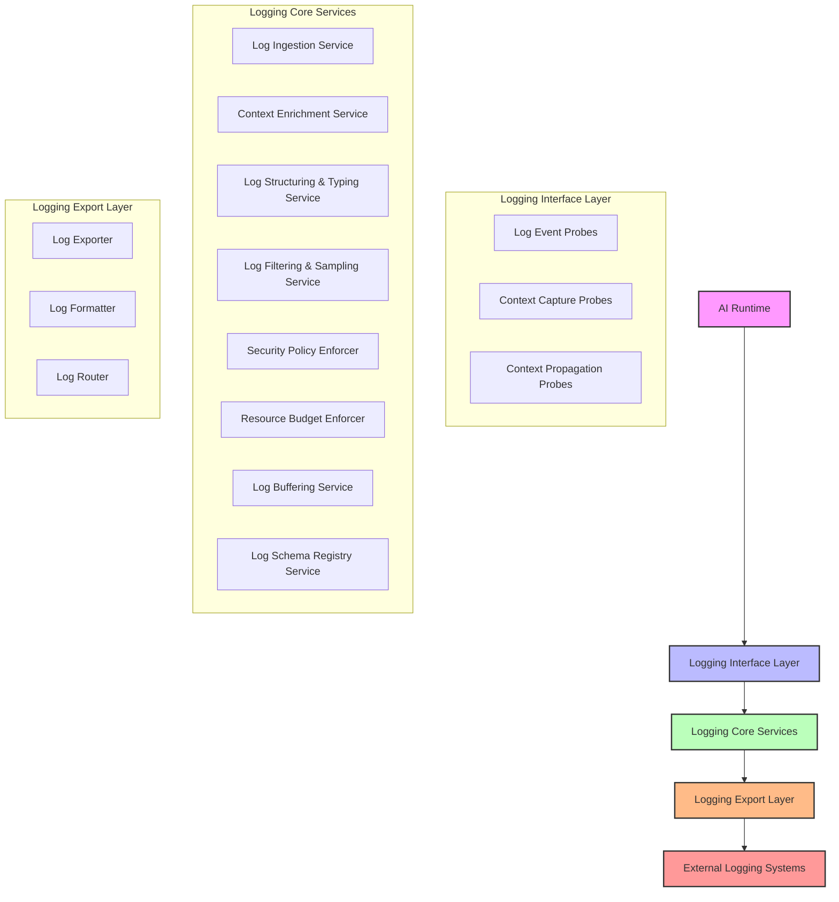
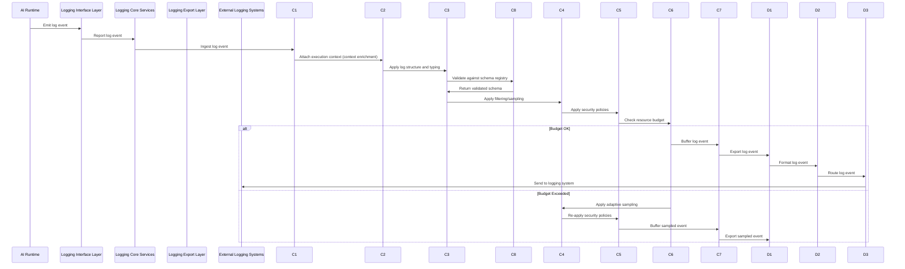
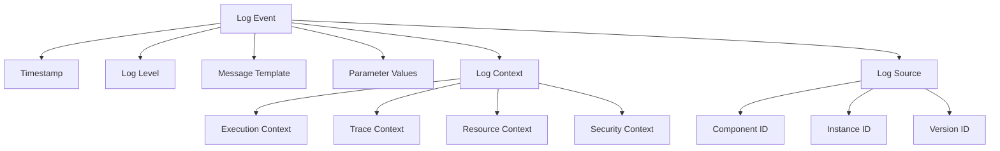
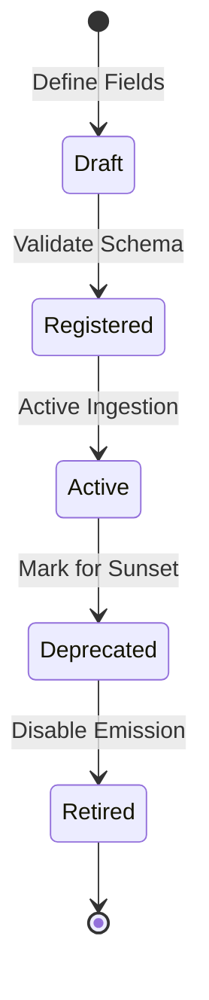
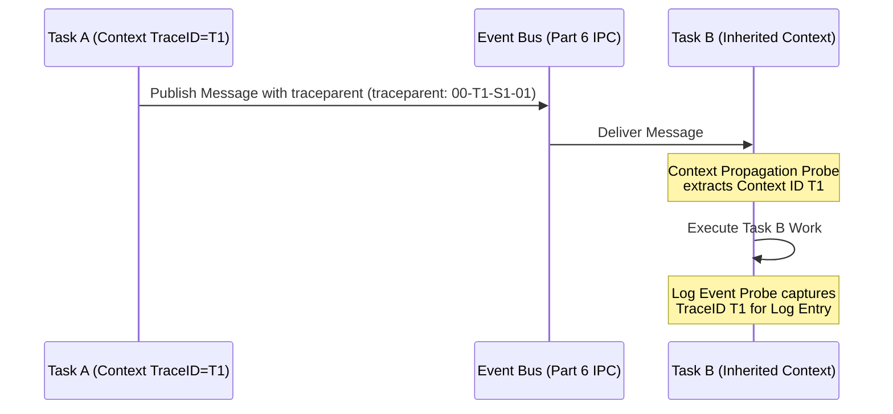
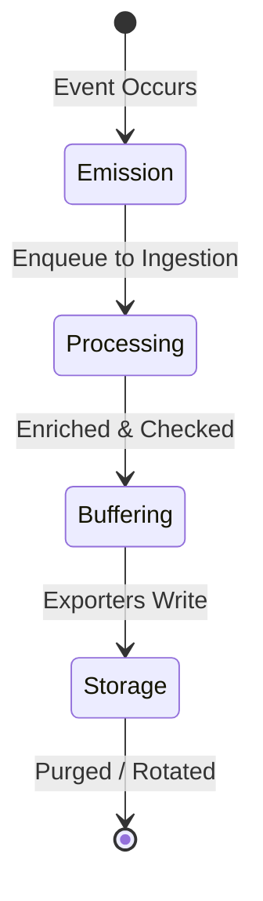
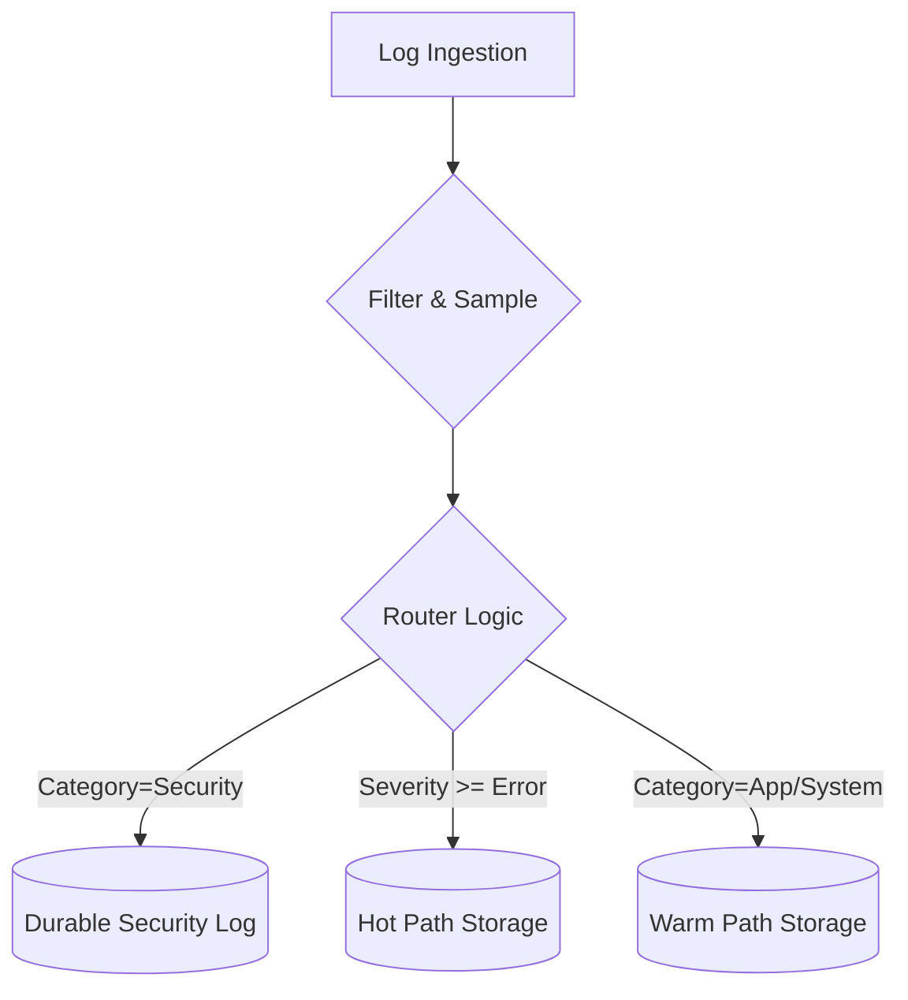

# 11.5 Logging Architecture

## 1. Purpose

The Logging Architecture defines the architectural foundation for structured event logging within the AI-OS system, enabling comprehensive observability of system events while preserving the fundamental architectural invariants of determinism, isolation, and security. This architecture provides a unified framework for capturing, structuring, contextualizing, and exporting log events that serve as critical diagnostic artifacts for understanding system behavior, diagnosing issues, and verifying operational correctness.

The logging architecture is designed as a first-class architectural concern that operates alongside the AI Runtime without introducing non-determinism, violating isolation boundaries, or creating security vulnerabilities. It establishes the principles, interfaces, and contracts necessary for implementations to provide high-fidelity, context-rich logging that enables effective root-cause analysis while maintaining strict compliance with AI-OS architectural guarantees.

This section establishes logging as an integral component of the Runtime Observability & Diagnostics subsystem, working in conjunction with metrics and tracing to provide comprehensive observability into AI-Runtime behavior.

## 2. Logging Philosophy

The logging architecture follows these guiding principles that are specific to the AI-OS architectural philosophy:

### 2.1 Observability by Construction
Logging capabilities are considered fundamental architectural concerns during system design rather than afterthoughts. Observation points for logging are strategically placed during architectural design to maximize diagnostic value while minimizing interference with deterministic execution.

### 2.2 Structured and Typed Event Recording
All log events MUST conform to the AI-OS type system with explicit versioning to ensure long-term semantic stability and machine-parsability. Unstructured or ad-hoc logging is prohibited as it undermines the ability to perform automated analysis and correlation with other telemetry types.

### 2.3 Context-Rich Event Recording
Log events MUST contain sufficient execution and trace context to enable accurate reconstruction of the circumstances surrounding an event. Context attachment MUST preserve causal relationships without introducing non-deterministic overhead.

### 2.4 Security-Preserving by Design
Logging mechanisms are architected to prevent information flow violations and side-channel vulnerabilities through formal boundary enforcement. Sensitive information is automatically redacted per Part 7 security policies before any log event leaves the system boundary.

### 2.5 Bounded Performance Impact
Logging mechanisms MUST introduce strictly bounded overhead that can be formally verified to remain within predefined resource budgets. The architecture establishes strict upper bounds on resource consumption that can be verified through analysis and testing.

### 2.6 Deterministic Event Processing
All logging data processing introduces zero non-determinism in AI-Runtime outputs. Logging operations are designed as read-only observers that do not modify runtime state in ways that could affect external behavior.

### 2.7 Causal Fidelity Preservation
Log events MUST maintain provable causality relationships that enable reconstruction of exact execution sequences across asynchronous boundaries. Log timestamps and sequence numbers preserve happens-before relationships essential for accurate diagnosis.

### 2.8 Operator-Effective Diagnostics
Log data MUST provide actionable, context-rich information that enables operators to distinguish between normal variations and actual system issues. Logs MUST include sufficient context to enable timely and accurate diagnosis without requiring deep expertise to interpret individual events.

## 3. Logging Architecture

The logging architecture follows a layered approach that separates concerns between event capture, contextual enrichment, processing, and export while maintaining clear interfaces between layers.

### 3.1 Layered Architecture Diagram



### 3.2 Component Interaction Diagram



### 3.3 Layer Responsibilities Summary

**Logging Interface Layer**: Responsible for capturing log events at the point of origin within the AI Runtime through lightweight, deterministic probes that introduce zero interference with deterministic execution. Context capture occurs here to obtain raw execution context; context propagation ensures trace context flows correctly across asynchronous boundaries.

**Logging Core Services**: Responsible for ingesting, validating, enriching, structuring, filtering, and preparing log events for export while enforcing resource bounds, security policies, deterministic processing guarantees, and schema governance.

**Logging Export Layer**: Responsible for transmitting processed log events to external systems through pluggable mechanisms that maintain implementation independence and apply final formatting and routing.

## 4. Core Components

### 4.1 Log Event Probe Component

Captures log events from instrumentation points in the AI Runtime. Ensures log event capture introduces zero non-determinism.

#### Responsibilities:
- Capture log events from deterministic observation points in RT execution path
- Attach basic execution context (timestamp, sequence number) to log events
- Apply initial filtering based on log level and sampling rates
- Export raw log events to logging core services

#### Authority Boundaries:
- Sole authority over: Intercepting execution paths at designated hooks to instantiate a raw, unvalidated log event. It possesses no authority to modify or enrich the log event context, validate its schema, or write to external storage.

#### Interfaces:
- Provides: `ILogEventProbe` (for RT instrumentation)
- Requires: `IContextProvider` (for basic context), `ILogIngestionService` (ingestion)
- Owner: Logging Interface Layer

### 4.2 Context Capture Probe Component

Captures execution and trace context at the point of log emission within the AI Runtime.

#### Responsibilities:
- Capture thread ID, process ID, and timestamp for execution context
- Capture trace ID, span ID, and trace flags for trace context when tracing is enabled
- Ensure context capture introduces zero non-determinism
- Provide raw context to Log Ingestion Service for enrichment

#### Authority Boundaries:
- Sole authority over: Extracting local, thread-bound, and asynchronous execution metadata at the precise moment of event generation. It MUST NOT modify the active execution environment or propagate context to external systems.

#### Interfaces:
- Provides: `IContextCapture` (to logging core)
- Requires: `IExecutionContextProvider`, `ITraceContextProvider`
- Owner: Logging Interface Layer

### 4.3 Context Propagation Probe Component

Propagates trace context across asynchronous boundaries within the AI Runtime.

#### Responsibilities:
- Extract trace context from incoming operations/messages
- Inject trace context into outgoing operations/messages
- Ensure context propagation introduces zero non-determinism
- Maintain trace context identity across task/message boundaries

#### Authority Boundaries:
- Sole authority over: Serializing and deserializing context objects crossing process or asynchronous task boundaries. It MUST NOT alter trace flags, sampling decisions, or perform local event enrichment.

#### Interfaces:
- Provides: `IContextPropagation` (to logging core)
- Requires: `IContextPropagationService` (for cross-boundary propagation)
- Owner: Logging Interface Layer

### 4.4 Context Enrichment Service

Enriches log events with execution and trace context to enable causal fidelity and diagnostic utility.

#### Responsibilities:
- Attach execution context (thread/process ID, stack trace if enabled) to log events
- Attach trace context (trace ID, span ID, trace flags) for correlation with traces
- Attach resource context (CPU usage, memory usage) when configured
- Apply context propagation rules across asynchronous boundaries
- Ensure context enrichment introduces zero non-determinism

#### Authority Boundaries:
- Sole authority over: The structural union of raw event metrics with contextual identifiers provided by the interface probes. It MUST NOT execute network operations, format data, or bypass security classification boundaries.

#### Interfaces:
- Provides: `IContextEnrichmentService` (to logging core)
- Requires: `IContextCapture`, `IContextPropagation`, `ITraceContextManager`, `IResourceObserver`
- Owner: Logging Core Services

### 4.5 Log Structuring & Typing Service

Applies strong typing and versioning to log event schemas to ensure machine-parsability and semantic stability.

#### Responsibilities:
- Apply strong typing to log event fields according to log schema version
- Version log schemas to enable backward-compatible evolution
- Validate log events against defined schemas via Schema Registry Service
- Convert log events to canonical internal representation
- Ensure structuring introduces zero non-determinism

#### Authority Boundaries:
- Sole authority over: Enforcing structural and semantic correctness of log entries against registered schema models. It MUST NOT perform schema registration or execute filtering policies.

#### Interfaces:
- Provides: `IStructuringTypingService` (to logging core)
- Requires: `ISchemaRegistryService`, `ITypeValidator`
- Owner: Logging Core Services

### 4.6 Log Filtering & Sampling Service

Applies filtering and sampling strategies to bound resource consumption while preserving diagnostic value.

#### Responsibilities:
- Apply log level filtering (only process events at or above configured level)
- Apply probabilistic sampling based on sampling rates
- Apply rate limiting to prevent log flooding
- Apply diagnostic value-based filtering to preserve high-value events
- Ensure filtering introduces zero non-determinism

#### Authority Boundaries:
- Sole authority over: Drop and retention decisions for individual log events based on operational and resource budgets. It MUST NOT modify the structure or contents of accepted log events.

#### Interfaces:
- Provides: `IFilteringSamplingService` (to logging core)
- Requires: `IResourceBudget`, `IDiagnosticValueEvaluator`
- Owner: Logging Core Services

### 4.7 Security Policy Enforcer

Applies Part 7 security policies to log event data flows to prevent information leakage.

#### Responsibilities:
- Classify log event data by sensitivity level according to Part 7 policies
- Apply data sanitization rules (redaction, masking, hashing) to sensitive fields
- Enforce information flow controls between security domains
- Prevent logging mechanisms from becoming covert channels
- Ensure security enforcement introduces zero non-determinism

#### Authority Boundaries:
- Sole authority over: Obfuscation, redaction, and access restriction mapping applied to log entries crossing security levels. It MUST NOT alter routing targets or change log levels.

#### Interfaces:
- Provides: `ISecurityPolicyEnforcer` (to logging core)
- Requires: `ISecurityPolicyProvider` (from Part 7), `ISensitivityClassifier`
- Owner: Logging Core Services

### 4.8 Resource Budget Enforcer

Monitors and enforces logging resource consumption within predefined budgets.

#### Responsibilities:
- Track CPU, memory, and bandwidth usage of logging components
- Apply adaptive sampling when budgets are exceeded
- Provide feedback mechanisms for automatic throttling
- Ensure budget enforcement introduces zero non-determinism
- Export budget utilization metrics for monitoring

#### Authority Boundaries:
- Sole authority over: Calculating and enforcing systemic CPU, memory, and storage utilization quotas for the logging subsystem. It MUST NOT drop messages directly but instead commands the Filtering & Sampling service to do so.

#### Interfaces:
- Provides: `IResourceBudget` (to logging components)
- Requires: `ILogEventProbe` (for internal monitoring)
- Owner: Logging Core Services

### 4.9 Log Buffering Service

Provides resilient buffering of log events to handle temporary export unavailability.

#### Responsibilities:
- Buffer log events during temporary export backend unavailability
- Implement bounded buffering to prevent memory exhaustion
- Apply backpressure to logging core services when buffers approach capacity
- Provide ordered delivery of buffered events when export resumes
- Ensure buffering introduces zero non-determinism

#### Authority Boundaries:
- Sole authority over: The temporary lifecycle and memory management of log queues awaiting export. It MUST NOT modify payloads or make routing decisions.

#### Interfaces:
- Provides: `ILogBufferingService` (to logging core)
- Requires: `IResourceBudget`, `ILogExporter`
- Owner: Logging Core Services

### 4.10 Log Schema Registry Service

Manages log schema definitions, versioning, and compatibility governance.

#### Responsibilities:
- Register log schemas with explicit version identifiers
- Validate log events against registered schemas
- Enforce backward and forward compatibility rules
- Manage schema evolution and deprecation timelines
- Govern custom field declarations and versioning
- Ensure schema registry operations introduce zero non-determinism

#### Authority Boundaries:
- Sole authority over: The catalog, validation, and historical lifecycle states of all schemas inside the system. It MUST NOT perform direct data serialization or modification.

#### Interfaces:
- Provides: `ISchemaRegistryService` (to logging core)
- Requires: `ISchemaDefinitionProvider`, `ICompatibilityValidator`
- Owner: Logging Core Services

### 4.11 Log Exporter

Exports log events via configured mechanisms while maintaining formatting and routing integrity.

#### Responsibilities:
- Export log events via configured mechanisms (push/pull, various protocols)
- Maintain strong typing and versioning of exported log events
- Apply final formatting for target logging systems
- Route log events to appropriate destinations based on routing policies
- Ensure export mechanisms introduce zero non-determinism

#### Authority Boundaries:
- Sole authority over: Protocol selection, serialization format, and network transfer to external log collectors. It MUST NOT modify active context or perform security sanitization.

#### Interfaces:
- Provides: `ILogExporter` (to logging core)
- Requires: `ILogFormatter`, `ILogRouter`
- Owner: Logging Export Layer

## 5. Logging Authority Boundaries

Clear ownership and responsibility boundaries ensure effective operation and evolution of the logging system.

### 5.1 Service Ownership Boundaries

**Service Teams Own:**
- Instrumentation of their services with log event probes
- Definition of service-specific log events and their semantic meaning
- Establishment of appropriate logging levels for their telemetry
- Initial validation of log event data quality from their services
- Response to diagnostic insights derived from log analysis

**Logging Platform Team Owns:**
- Ingestion, enrichment, structuring, filtering, and export infrastructure
- Definition and enforcement of log schema and standards via Schema Registry Service
- Configuration of logging pipelines and processing rules
- Management of buffering, buffering policies, and resource budgets
- Provision of export mechanisms and consumer enablement
- Platform-level alerting on logging system health and performance

### 5.2 Data Domain Boundaries

**Application Logging:**
- Owned by application development teams
- Focus on application events, business logic events, and application errors
- Responsibility for defining meaningful application-specific log events

**System Logging:**
- Owned by platform/system teams
- Focus on system events, resource events, and infrastructure events
- Responsibility for defining meaningful system-specific log events

**Security Logging:**
- Owned by security teams
- Focus on security events, authentication events, and authorization events
- Responsibility for defining meaningful security-specific log events
- Subject to additional Part 7 security constraints

### 5.3 Operational Boundaries

**Development Time:**
- Teams instrument code with log event probes during development
- Instrumentation reviewed as part of code review process
- Logging considerations included in design and architecture reviews

**Deployment Time:**
- Logging configuration validated as part of deployment pipeline
- Canary validation of logging impact on system performance
- Rollback procedures include logging configuration validation

**Runtime Operations:**
- Monitoring of logging system health and performance
- Incident response for logging system degradation
- Capacity planning based on logging system utilization metrics

## 6. Log Model

The log model defines the architectural concepts, relationships, and data structures that constitute log event data within AI-OS.

### 6.1 Core Log Concepts

#### 6.1.1 Log Event
A discrete, timestamped record of a significant system occurrence that contains structured, typed data with contextual attributes. Log events are the atomic unit of logging in AI-OS.

#### 6.1.2 Log Stream
A sequence of log events originating from a specific source (component, service, or component instance) that maintains chronological ordering.

#### 6.1.3 Log Context
The set of execution and trace contextual attributes attached to a log event that enables correlation with other telemetry types and diagnostic reconstruction.

#### 6.1.4 Log Schema
The formal specification of the structure, types, and versioning of log event fields. Log schemas define what fields are present, their data types, and their semantic meaning.

#### 6.1.5 Log Level
A categorical value indicating the relative importance or severity of a log event that determines whether it should be processed, stored, or displayed.

### 6.2 Log Event Relationships



## 7. Log Entry Model

The log entry model defines the canonical structure of a log event within the AI-OS logging architecture.

### 7.1 Log Entry Structure

All log events in AI-OS MUST conform to the following structural template:

| Field | Type | Description | Required |
|-------|------|-------------|----------|
| timestamp | Timestamp | Absolute time of event occurrence (monotonic clock) | Yes |
| trace_id | TraceID | Distributed trace identifier for correlation | No |
| span_id | SpanID | Span identifier within trace for correlation | No |
| trace_flags | TraceFlags | Trace flags indicating sampling status, etc. | No |
| level | LogLevel | Severity level of the event | Yes |
| message_template | String | Template string with placeholders for parameters | Yes |
| parameters | Map<String, Value> | Values to substitute into message template | No |
| logger_name | String | Name of the logging source (typically component/module) | Yes |
| thread_id | ThreadID | Identifier of the thread where event occurred | No |
| process_id | ProcessID | Identifier of the process where event occurred | No |
| source_location | SourceLocation | File, line, and function where event originated | No |
| resource_context | ResourceContext | Resource usage metrics at time of event | No |
| security_context | SecurityContext | Security-relevant information (sanitized) | No |
| custom_fields | Map<String, Value> | Application-specific fields | No |

### 7.2 Field Semantics

**Timestamp**: Monotonically increasing clock value representing when the event occurred. Must be comparable across events for temporal ordering.

**TraceID/SpanID**: Distributed tracing identifiers that enable correlation of log events with trace spans for end-to-end visibility.

**LogLevel**: Enumerated value indicating event severity (detailed in Section 11).

**MessageTemplate**: UTF-8 string containing the log message with placeholders (e.g., "User {user_id} logged in from {ip_address}").

**Parameters**: Map of parameter names to typed values that fill placeholders in the message template.

**LoggerName**: Hierarchical identifier indicating the source of the log event (e.g., "com.aios.auth.service").

**ThreadID/ProcessID**: Identifiers enabling correlation of events within the same execution context.

**SourceLocation**: Optional debug information indicating where in the source code the log event was generated.

**ResourceContext**: CPU usage, memory usage, I/O statistics, etc. at time of event.

**SecurityContext**: Authentication, authorization, and audit information (with PII removed per Part 7).

**CustomFields**: Extensible field for domain-specific information while maintaining schema versioning.

### 7.3 Log Entry Versioning

Log entries include explicit schema versioning to enable backward-compatible evolution:

```
LogEntryV1:
  timestamp: Timestamp
  trace_id: TraceID?
  span_id: SpanID?
  trace_flags: TraceFlags?
  level: LogLevel
  message_template: String
  parameters: Map<String, Value>
  logger_name: String
  thread_id: ThreadID?
  process_id: ProcessID?
  source_location: SourceLocation?
  resource_context: ResourceContext?
  security_context: SecurityContext?
  custom_fields: Map<String, Value>
```

Future versions add fields while maintaining backward compatibility through:
- Optional fields for new additions
- Explicit version field in envelope
- Schema evolution rules prohibiting breaking changes in minor versions

## 8. Structured Logging

All logging in AI-OS MUST be structured to enable machine processing, filtering, and correlation.

### 8.1 Structural Requirements

**MUST** conform to the Log Entry Model defined in Section 7
**MUST** include explicitly typed fields according to the AI-OS type system
**MUST** include explicit schema versioning
**MUST** separate message templates from parameters to enable templating
**MUST** include contextual fields for correlation with other telemetry
**MUST NOT** include free-form unstructured text as primary message content
**MUST NOT** rely on parsing unstructured text for machine analysis

### 8.2 Schema Enforcement

The logging architecture enforces schema compliance through:

**Schema Validation Service**: Validates all log events against registered schemas before processing
**Type Checking Service**: Ensures all field values conform to their declared types
**Version Compatibility Service**: Ensures backward/forward compatibility between schema versions
**Default Schema Application**: Applies default schema to events lacking explicit version

### 8.3 Benefits of Structured Logging

Enables:
- Efficient indexing and querying of log fields
- Reliable alerting on specific field values
- Automated correlation with metrics and traces
- Machine parsing without fragile regex patterns
- Schema evolution without breaking existing consumers
- Consistent field naming across the system

## 9. Log Schema Architecture

To guarantee the long-term semantic stability, machine-parsability, and strong typing required by the AI-OS Type System (Part 4), the Logging Subsystem integrates a dedicated schema architecture governed by the Log Schema Registry Service.

### 9.1 Schema Registry

The Schema Registry Service acts as the single source of truth for all structured log definitions.

1. **Schema Registration**: Every component emitting structured logs MUST register its schema definitions in the registry.
2. **Immutable Entries**: Registered schemas are immutable; updates require registering a new schema version.
3. **Registry Isolation**: The registry operates as a read-only service to the runtime log pipeline during critical paths, preventing validation operations from introducing non-deterministic synchronization locks.

### 9.2 Schema Evolution and Compatibility Rules

As the system evolves, log schemas must adapt. To prevent breaking log processors, indexers, and query systems, schemas MUST adhere to strict compatibility contracts.



1. **Backward Compatibility**: A new schema version is backward-compatible if log processors configured for the old version can successfully parse events generated under the new schema (e.g., adding optional fields).
2. **Forward Compatibility**: A new schema version is forward-compatible if log processors configured for the new version can parse events generated under the old schema (e.g., removing optional fields).
3. **Full Compatibility**: Schema modifications MUST maintain full compatibility (both backward and forward) unless a major version bump is explicitly approved. Adding required fields or removing/renaming existing fields without a major version change is STRICTLY PROHIBITED.

### 9.3 Schema Version Lifecycle

Schemas transition through defined, versioned states:

- **Draft**: The schema is proposed and being analyzed.
- **Registered**: The schema has been validated and committed to the registry.
- **Active**: The schema is active and utilized by running instances to validate emitted log events.
- **Deprecated**: Emitting components are warned to transition; consumers remain fully compatible.
- **Retired**: The schema version is no longer active for emission; parsing remains available for historical index analysis.

### 9.4 Custom Field Governance

To prevent unstructured drift and key namespace collisions, custom user or application fields MUST be confined within the `custom_fields` metadata compartment:

1. **Confined Namespace**: Custom fields are mapped within a flat dictionary of typed values.
2. **Key Validation**: Keys inside `custom_fields` MUST conform to standard namespace requirements (alphanumeric with underscores, regex: `^[a-zA-Z0-9_]+$`).
3. **Structural Isolation**: Schema validation ignores unmapped keys inside `custom_fields` to preserve execution flow, but the Filtering Service MAY drop events containing invalid or oversized payload fields to protect resources.

## 10. Log Context Propagation

Context propagation in logging is unified with the Distributed Tracing propagation architecture (Section 11.4.7) to preserve happens-before relationships and causality across processing nodes.

### 10.1 Capture vs Enrichment Split

To maintain zero interference with deterministic runtime operations, context manipulation is split across distinct phases:

1. **Interface Layer (Context Capture & Propagation Probes)**:
   - *Phase*: Execution Point (Synchronous, Low-Overhead)
   - *Responsibility*: Captures raw identifiers (`ThreadID`, `ProcessID`, `TraceID`, `SpanID`) from active thread-local storage or message envelopes.
   - *Constraint*: MUST NOT perform metadata expansion, memory allocation, or string formatting.
2. **Core Services Layer (Context Enrichment Service)**:
   - *Phase*: Processing Pipeline (Asynchronous, Decoupled)
   - *Responsibility*: Consumes raw captured identifiers and matches them with static environment records (service names, containers, localized host parameters, and resource context).
   - *Constraint*: Execution occurs out-of-band to prevent resource-intensive data lookups from blocking deterministic AI execution.

### 10.2 Asynchronous Correlation

Context propagation probes guarantee that execution chains across asynchronous queues or event buses preserve causal linkage:



1. **Context Extraction**: When processing crossing asynchronous boundaries, the Context Propagation Probe extracts context markers (`traceparent`) from Part 6 IPC envelopes.
2. **Thread Context Binding**: Active context is bound to the new executing task context before processing begins.
3. **Causal Recovery**: Emitted logs in Task B leverage the bound context to populate correlation fields, proving execution causality.

## 11. Log Categories

System log events are classified into functional categories to support routing, isolation, and distinct security auditing:

| Category | Description | Primary Producer | Security Domain |
|----------|-------------|------------------|-----------------|
| System | Subsystem state transitions, infrastructure limits, thread allocations | AI Runtime (Part 10) | Kernel / Platform |
| Security | Authentication, authorization failures, policy validations | Part 7 Security System | Strict Isolation |
| Application | Business workflows, execution milestones, localized exceptions | Workloads | User Space |
| Resource | Memory allocations, network stats, execution tracking | Part 9 Resource Manager| System |

## 12. Log Levels and Severity Model

AI-OS adopts a deterministic, mathematically defined log severity model. Log filtering and consumption are structured around an integer-based hierarchy:

| Log Level | Severity Integer | Description | Operational Use Case |
|-----------|------------------|-------------|----------------------|
| TRACE | 10 | Extremely detailed execution telemetry | Active component debugging |
| DEBUG | 20 | Internal state transitions, step-by-step milestones | Verification during integration |
| INFO | 30 | Standard operational occurrences, system status changes | General health verification |
| WARN | 40 | Non-fatal abnormalities, retry cycles, degraded resource margins | Proactive anomaly mitigation |
| ERROR | 50 | Operation failures, unhandled workload exceptions | Reactive incident response |
| FATAL | 60 | Uncontainable subsystem collapse, invariant violations | Emergency shutdown, system crash |

### 12.1 Severity Semantics

- **TRACE / DEBUG**: Captured only during diagnostic configurations. These levels MUST be filtered out under nominal production workloads to adhere to the ≤ 1% CPU overhead target.
- **INFO / WARN**: Define standard operational health.
- **ERROR**: Represents localized failures. The scheduler and runtime continue executing other compartments normally.
- **FATAL**: Indicates structural system breaches or core invariant violations where the system MUST transition to a safe shutdown mode.

## 13. Log Lifecycle

The journey of a log event spans four distinct phases from emission to eventual removal.



### 13.1 Emission Phase
An event occurs inside the AI Runtime. A `Log Event Probe` captures the instance, binds raw execution tokens synchronous with the thread, and hand-off occurs to the queue.

### 13.2 Processing Phase
The event is evaluated asynchronously. The `Context Enrichment Service` appends static metrics, while the `Schema Registry` verifies structure.

### 13.3 Buffering Phase
Logs are held temporarily in SSD-backed or pre-allocated RAM rings via the `Log Buffering Service` to absorb egress network latencies.

### 13.4 Storage & Purging Phase
The `Log Exporter` routes the stream to durable storage backends. Data is retained per operational policy and permanently purged when retention thresholds expire.

## 14. Log Buffering Architecture

Temporary storage within the logging pipeline must preserve memory safety, bounded performance impact, and ordering guarantees.

### 14.1 Buffering Topology

The buffering architecture utilizes a tiered, ring-buffer mechanism to avoid dynamic allocation calls that could cause heap fragmentation or unpredictable execution timing.

```mermaid
graph LR
    subgraph RAM Buffer
        R1[Pre-allocated Ring Buffer 1] --> R2[Pre-allocated Ring Buffer 2]
    end
    subgraph Persistent Buffer
        SSD[SSD Backed Spool File]
    end
    
    RAM Buffer -->|Flush Batch| Persistent Buffer
    Persistent Buffer -->|Export| Exporter[Log Exporter]
```

1. **Pre-allocated Memory Pools**: Logging memory allocations are bounded at boot time. Buffers use lock-free, wait-free ring-buffer structures.
2. **SSD Spool File**: When RAM queues fill due to temporary network partitions, data is serialized to SSD-backed spool blocks using sequential block writes to bound disk I/O.

### 14.2 Backpressure and Flow Control

When both RAM and SSD buffers approach capacity, the `Resource Budget Enforcer` triggers progressive backpressure:

1. **Rate Throttling**: Reduces sampling ratios of TRACE and DEBUG levels to zero.
2. **Adaptive Dropping**: Emitted log levels below ERROR are discarded sequentially (INFO, then WARN).
3. **Hard Backpressure**: If buffer saturation persists, the Logging Interface Layer blocks non-critical application log submissions while allowing system and security-level logging to continue without interruption.

## 15. Log Routing Architecture

Log routing decouples log ingestion from storage target systems, enabling policy-driven data delivery.



- **Metadata Routing**: Routing decisions are computed based on log categories and severity levels, never on content parsing.
- **Dynamic Routing Updates**: Routing targets can be hot-reconfigured via Part 1 Configuration, ensuring updates apply atomically without process restarts.

## 16. Log Aggregation Architecture

In multi-node or distributed runtime environments, log events must be aggregated to form a unified observability stream.

- **Federated Collection**: Local collectors bundle node-specific log buffers into compressed batches.
- **Temporal Alignment**: Aggregation services merge distributed streams chronologically using high-precision monotonic clock sequences.
- **Duplicate De-duplication**: Sequence numbers assigned during the Context Capture phase enable aggregate processors to detect and drop duplicate deliveries resulting from retry cycles.

## 17. Log Storage Architecture

Storage of log events balances write throughput, query efficiency, and long-term cost profiles.

### 17.1 Tiered Storage

1. **Hot Tier**: Low-latency SSD storage housing raw log events for immediate operational analysis. Retention: 24 hours.
2. **Warm Tier**: Highly compressed columnar databases allowing rapid, multi-dimensional queries. Retention: 30 days.
3. **Cold Tier**: Long-term object storage using dense compressed blocks for compliance and forensic audit paths. Retention: Configurable up to years.

### 17.2 Retention Policies

Retention is managed automatically by data classification. Security and compliance logs remain preserved on WORM (Write-Once-Read-Many) storage pools, while standard execution TRACE logs are systematically purged after short windows to optimize storage utilization.

## 18. Log Query Architecture

Log retrieval MUST support fast operational lookup without resource starvation.

- **Index Optimization**: Columns containing `trace_id`, `span_id`, `logger_name`, and `level` are indexed by default.
- **Query Resource Caps**: To protect running workloads from query-induced CPU starvation, the query parser limits the scale, timeframe, and concurrency of incoming search requests.
- **Deterministic Results**: All queries returned maintain precise chronological order derived from monotonic event sequencing.

## 19. Correlation with Metrics

Log events are correlated with metrics (Part 11.3) through time, namespace, and resource dimensions:

1. **Temporal Correlation**: Outages or performance degradations mapped in metrics correspond directly to logs within equivalent timestamp windows.
2. **Dimensional Correlation**: Metrics and logs share identical service namespace tags (`service`, `instance`, `version`, `tenant_id`).
3. **Anomaly Attribution**: Metric alerts (e.g., threshold breaches) automatically inject trace markers that force the logging service to capture full TRACE context for that window.

## 20. Correlation with Distributed Tracing

Logs and Distributed Tracing (Part 11.4) are tightly bound by design:

1. **Shared Context**: Every log event generated within an active span contains the `trace_id` and `span_id` of that trace context.
2. **Trace-to-Log Joins**: Query engines use the `trace_id` as a pivot key, enabling operators to inspect both the causal span tree and the exact step-by-step logs generated by those execution blocks in a single, unified view.

## 21. Correlation with Runtime Diagnostics

Logging supports active diagnostic workflows (Part 11.1) by acting as the chronological audit trail:

- **State Snapshot Correlation**: When active diagnostic probes trigger state snapshots, the diagnostic processor registers the event ID in the system log stream.
- **Crash Forensic Trails**: During critical crash events, the trace buffer flushes its logs to support root-cause analysis in post-mortem diagnostics.

## 22. Behavioural Contracts

Behavioural contracts define the expected operational constraints for the logging system components.

### 22.1 Logging Interface Layer Contract
- **Precondition**: AI Runtime executes deterministic workload.
- **Postcondition**: Log emission MUST NOT introduce resource synchronization locks or wait states on critical paths.
- **Invariant**: The addition of log probes MUST NOT alter the bit-for-bit logical output of the runtime environment.

### 22.2 Ingestion and Structuring Contract
- **Precondition**: Raw log event received from the interface layer.
- **Postcondition**: Log event validated against register schemas; typed fields enforced.
- **Invariant**: Non-conforming payloads are redirected to quarantine buffers without blocking the processing pipeline.

### 22.3 Security and Sanitization Contract
- **Precondition**: Log data crosses security domain or egress boundary.
- **Postcondition**: All sensitive fields (e.g., PII, keys) matching Part 7 security profiles MUST be masked or redacted.
- **Invariant**: Sanitization failures result in drop actions to ensure data confidentiality.

## 23. Runtime Invariants

The logging architecture guarantees the following runtime invariants are maintained:

### 23.1 Determinism Invariant
The presence or absence of the logging subsystem, including modifications to active log levels or sampling ratios, MUST NOT modify the execution paths, scheduling sequences, or functional results of the AI Runtime.

### 23.2 Isolation Invariant
Logging data pathways MUST NOT bridge isolated security compartments. Log transfers from high-security domains to standard monitoring collectors MUST pass through isolated, unidirectional policy enforcers that strip sensitive metadata.

### 23.3 Resource Invariant
Logging resource utilization MUST stay within allocated budgets. Under peak operational logging load, CPU consumption of the logging pipeline MUST NOT exceed 1% of total platform compute capacity.

## 24. Reliability

The logging system is built for structural resilience under adverse platform conditions:

- **Graceful Degradation**: If downstream network targets become unavailable, the pipeline falls back sequentially from network export to local disk spooling, and finally to adaptive sample-dropping.
- **Corruption Resistance**: Log entries write checksum sequences alongside metadata blocks, allowing parsing engines to isolate and reject corrupted segments during parsing.

## 25. Security

Logging activities must not compromise AI-OS system security.

- **Covert Channel Mitigation**: Buffer sizing and flush intervals are designed with random jitter to prevent malicious actors from using logging frequencies to leak cryptographic key timings.
- **Access Privilege Boundary**: Query access to log data requires explicit authorization based on the Part 7 Principal Model. Security auditing categories are stored separately from application logs.

## 26. Privacy

Privacy enforcement is applied at ingestion boundaries:

- **Automated Data Sanitization**: Log ingestion components validate parameters against regex-based PII profiles, systematically masking fields such as credit card numbers, personal IDs, and authentication tokens.
- **Data Minimization Enforcement**: No logging probes may record full request or response payloads; only structured, validated identifiers are permitted.

## 27. Failure Handling

When structural failures occur, the logging system behaves according to safe operational designs:

- **Fail-Safe Operation**: If the logging subsystem crashes completely, the AI Runtime continues execution without interruption. Inability to log MUST NOT compromise core system availability.
- **Quarantine Recovery**: Schemas that fail validation are quarantined in localized ring-buffers for diagnostic retrieval, preventing malformed telemetry from polluting standard analytical databases.

## 28. Performance Characteristics

Operational targets ensure low system overhead:

- **Ingestion Latency**: Probe capture latency MUST remain under 10 microseconds on critical execution paths.
- **Throughput Bounds**: Pipeline capacity is designed to scale dynamically to absorb bursts of up to 100,000 log events per second per node under emergency diagnostic scenarios.

## 29. Resource Constraints

The logging system operates under strict physical resource allocations:

- **CPU Quota**: Designing limit ≤ 1% CPU under typical operating profiles.
- **Memory Buffer Allocations**: In-memory ring-buffers are capped at a maximum of 32MB per process runtime.
- **Disk Spool Bounds**: Persistent spool storage is capped at a maximum of 1GB per local node. Reaching this limit triggers immediate FIFO deletion of older, low-severity log events.

## 30. Cross-Part Integration

The Logging subsystem maintains deep integration with other AI-OS architectural components:

- **Part 10 (AI Runtime)**: Observes runtime execution lifecycles, capturing state transitions, scheduling checkpoints, and task failures.
- **Part 7 (Security)**: Integrates with policy engines to enforce sanitization and restrict log access permissions.
- **Part 9 (Resource Management)**: Logs are enriched with platform resource utilization records at emission boundaries.
- **Part 5 (Concurrency)**: Integrates context propagation probes to preserve trace and execution correlation markers across thread boundaries.
- **Part 1 (Configuration)**: Evaluates dynamic logging parameters, permitting runtime modifications of levels and sampling rules without restart.

## 31. Engineering Objectives

The Logging Architecture is evaluated against the following engineering metrics:

- **Rigor & Correctness**: Perfect schema validation and strong-typing compliance across 100% of emitted logs.
- **Zero Timing Interference**: Guaranteeing that the addition of logging probes does not introduce measurable timing drift in deterministic tasks.
- **Diagnostic Precision**: Achieving a 100% trace-to-log correlation rate for all processed multi-node requests.

---
*This completes Section 11.5 of the AI-OS Architecture Specification.*