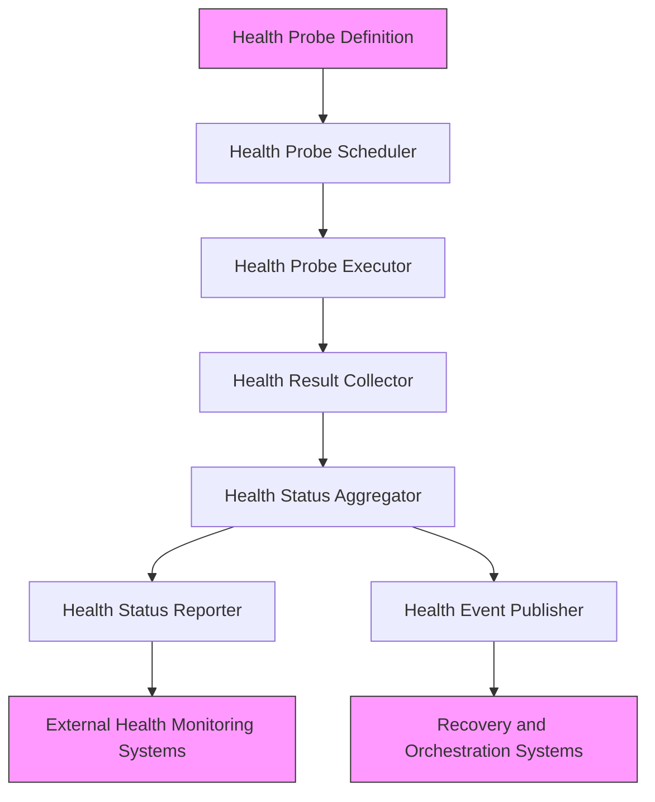
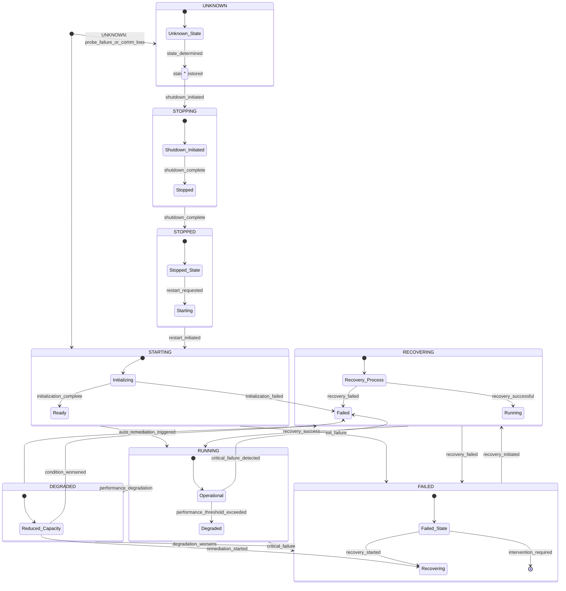
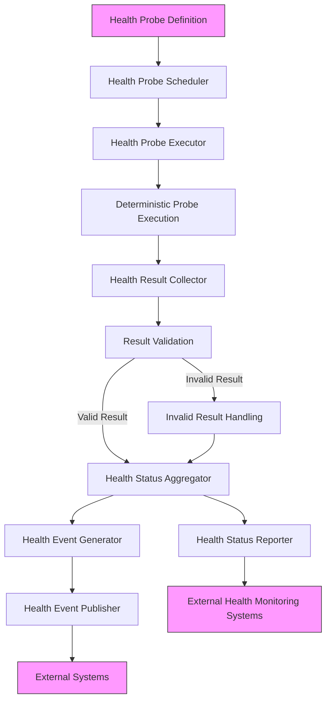

# 11.6 Health Monitoring Architecture

## 11.6.1 Purpose

The Health Monitoring Architecture defines the architectural model for actively assessing the liveness, readiness, and health status of AI-Runtime components and the overall system. It establishes the principles, contracts, and invariants that govern how health probes are defined, executed, aggregated, and reported while preserving the core AI-OS invariants of determinism, isolation, and security. This specification is implementation-independent and focuses on what the health monitoring subsystem must provide, not how it is implemented.

## 11.6.2 Health Monitoring Philosophy

The health monitoring architecture adheres to the following AI-OS-specific philosophical tenets:

* **Determinism Preservation** – Health probe execution introduces zero non-determinism in AI-Runtime outputs; they are read-only observations that do not alter observable state.
* **Bounded Overhead** – Health monitoring overhead must be strictly bounded and provably remain within allocated resource budgets (CPU, memory, bandwidth) under specified load conditions.
* **Liveness and Readiness Distinction** – Distinguishes between liveness (is the component running?) and readiness (is the component ready to serve traffic?) probes to enable appropriate orchestration actions.
* **Failure Detection Focus** – Health probes are designed to detect failure conditions that require intervention, not to monitor performance metrics (which are handled by the metrics subsystem).
* **Isolation Preservation** – Health probing mechanisms must not compromise isolation boundaries between protected computational domains.
* **Security-Preserving by Design** – Health monitoring mechanisms are architected to prevent information flow violations and side-channel leaks; all observable data flows are mediated by the security subsystem.
* **Actionable Outcomes** – Health checks provide clear, actionable outcomes (e.g., PASS, FAIL, DEGRADED) that enable automated remediation and orchestration decisions.
* **Composability** – Health status of complex components can be derived from the health status of their sub-components through defined aggregation policies.
* **Lifecycle Awareness** – Health monitoring explicitly manages and reports on component lifecycle states (starting, running, stopping, failed) and transition events to enable coordinated system behavior.
* **Failure Classification** – Health status includes detailed failure classifications to enable appropriate response strategies without requiring external diagnostics.
* **Event-Driven Notification** – Significant health state transitions and failure events are published as discrete events to enable timely decoupled responses.
* **Dependency Awareness** – Health status accurately reflects the health of dependencies while maintaining clear boundaries between local component health and dependency health.
* **Self-Monitoring** – The health monitoring subsystem implements its own health checks to ensure reliable operation and prevent monitoring blind spots.

## 11.6.3 Health Monitoring Architecture

The health monitoring architecture consists of logically distinct components that operate independently while cooperating through well-defined contracts. These components are organized into layers; each layer exposes a component interface to the layer above and consumes the component interface of the layer below.

1. **Health Probe Definition** – Declarative specifications of what constitutes a healthy state for a component, including liveness and readiness criteria.
2. **Health Probe Scheduler** – Manages the timing and frequency of health probe execution based on configured intervals and priority levels.
3. **Health Probe Executor** – Executes health probes in a deterministic manner, ensuring probes do not alter system state.
4. **Health Result Collector** – Gathers results from individual health probe executions and prepares them for aggregation.
5. **Health Status Aggregator** – Combines individual health check results into composite health status for higher-level components using defined policies.
6. **Health Status Reporter** – Formats and exports aggregated health status to external systems via versioned interfaces.
7. **Health Event Publisher** – Publishes discrete health state transition events and failure events to enable decoupled consumption by recovery and orchestration systems.
8. **Health Monitoring Controller** – Oversees the health monitoring lifecycle, manages configuration, and provides observability into the health monitoring subsystem itself.

These components interact through deterministic interfaces that guarantee failure containment and predictable behavior. The health monitoring subsystem publishes health state information and health events, but does NOT perform recovery actions. Recovery actions are performed by separate components that consume the published health state and events.

### 11.6.3.1 Component Responsibilities

* **Health Probe Definition**: 
  - Specifies probe type (liveness, readiness, deep health)
  - Defines success/failure criteria and thresholds
  - Declaratively describes what system aspects are probed
  - Versioned to enable evolution without breaking consumers
  - Specifies which aspects are local component health vs. dependency health

* **Health Probe Scheduler**:
  - Determines when probes should execute based on configured intervals
  - Implements jitter to prevent thundering herd problems
  - Prioritizes probes based on criticality and resource availability
  - Ensures deterministic scheduling that does not introduce timing variations
  - Manages lifecycle-aware scheduling (e.g., increased frequency during startup/shutdown)

* **Health Probe Executor**:
  - Executes probes as read-only operations that preserve determinism
  - Enforces timeouts to prevent hanging probes from consuming resources
  - Isolates probe execution to prevent fault propagation
  - Applies security policies to prevent information leakage
  - Distinguishes between local probe execution and dependency probing

* **Health Result Collector**:
  - Gathers results from probe executions in a deterministic manner
  - Normalizes result formats for consistent aggregation
  - Applies basic validation to result data
  - Prepares results for aggregation with minimal overhead
  - Separates local component results from dependency results

* **Health Status Aggregator**:
  - Combines individual results using configurable policies (AND, OR, weighted, etc.)
  - Maintains hierarchical health status for complex systems
  - Applies hysteresis to prevent flapping between states
  - Preserves determinism in aggregation logic
  - Clearly separates local component health status from aggregated dependency health status
  - Generates health state transition events when significant changes occur

* **Health Status Reporter**:
  - Formats health status according to versioned contracts
  - Applies final security checks before exporting data
  - Manages backpressure and retry logic for export failures
  - Ensures deterministic reporting behavior
  - Reports both current health state and recent significant state transitions

* **Health Event Publisher**:
  - Publishes discrete events for health state transitions (e.g., HEALTHY->DEGRADED, DEGRADED->FAILED)
  - Publishes failure events with detailed failure classifications
  - Ensures event delivery is at-least-once with deduplication capabilities
  - Applies security policies to event content before publishing
  - Maintains deterministic event generation and publishing
  - Does NOT include remediation instructions in events (only state and diagnostic information)

* **Health Monitoring Controller**:
  - Manages the lifecycle of health monitoring components
  - Provides interfaces for dynamic configuration updates
  - Exposes health monitoring subsystem metrics for self-observation
  - Ensures controller operations do not introduce non-determinism
  - Implements self-health monitoring to detect degradation in the monitoring subsystem itself
  - Coordinates lifecycle-aware behavior across all health monitoring components

### 11.6.3.2 Component Interfaces

Each health monitoring component exposes deterministic interfaces with clearly defined inputs, outputs, and side effects. These interfaces define the architectural contracts between components:

* **Health Probe Definition Contract** – Defines the contract for specifying health probes
* **Health Probe Scheduling Contract** – Manages the timing of probe executions
* **Health Probe Execution Contract** – Executes probes with determinism guarantees
* **Health Result Collection Contract** – Collects and normalizes probe results
* **Health Status Aggregation Contract** – Combines results into composite status
* **Health Status Reporting Contract** – Formats and exports health status
* **Health Event Publication Contract** – Publishes health state transition events and failure events
* **Health Monitoring Control Contract** – Manages the health monitoring lifecycle

## 11.6.4 Health Probe Model

Health probes are the fundamental units of health monitoring in AI-OS. They are designed to be deterministic, isolated, and security-preserving observations that assess specific aspects of component health.

### 11.6.4.1 Probe Types

* **Liveness Probes** – Determine if a component is running and not in a broken state that requires restart. Failure indicates the component should be restarted.
* **Readiness Probes** – Determine if a component is ready to serve traffic. Failure indicates traffic should be routed away from the component temporarily.
* **Deep Health Probes** – Perform more comprehensive checks that may involve light interaction with dependencies to validate end-to-end functionality. These are executed less frequently due to higher overhead.
* **Lifecycle Probes** – Monitor specific lifecycle transitions (starting, stopping, etc.) to provide precise state information.

### 11.6.4.2 Probe Characteristics

All health probes in AI-OS must adhere to the following characteristics:
- **Deterministic Execution**: Probe execution must not alter system state or introduce non-determinism
- **Bounded Execution Time**: Probes must complete within a configured timeout period
- **Read-Only Operation**: Probes observe system state without modifying it
- **Isolation Preserving**: Probe execution must not cross isolation boundaries unless explicitly authorized
- **Security Compliant**: Probe execution respects all security policies and does not leak sensitive information
- **Self-Contained**: Probes should minimize dependencies on external systems to reduce failure propagation risk
- **Lifecycle Aware**: Probes can be tagged with lifecycle phases for which they are relevant

### 11.6.4.3 Probe Result Model

Health probes return structured results that enable consistent aggregation and reporting. The probe result model defines the essential attributes that must be present in all health probe results to enable consistent processing, aggregation, and reporting while preserving implementation independence.

The probe result model includes:
- A unique probe identifier for tracking and correlation
- The component identifier being probed
- The probe type (liveness, readiness, deep health, or lifecycle)
- The current lifecycle phase of the component being probed
- Timestamp of probe execution in UTC format
- Execution duration in milliseconds
- Health status outcome (pass, fail, degraded, or unknown)
- Failure category classification when status is fail or degraded
- Optional failure details providing diagnostic information without sensitive data
- Dependency health flag indicating whether the probe assesses dependency health
- Optional additional details providing context about the probe result

### 11.6.4.4 Health Event Model

Health events are discrete notifications published for significant state transitions and failures. The health event model defines the essential attributes that must be present in all health events to enable consistent processing, delivery, and consumption while preserving implementation independence.

The health event model includes:
- A unique event identifier for tracking and correlation
- The component identifier associated with the event
- The event type (state_transition, failure_detected, recovery_attempted, health_check_started, health_check_stopped)
- Timestamp of event generation in UTC format
- Previous health state (for state_transition events)
- New health state (for state_transition events)
- Failure category classification (for failure_detected events)
- Optional failure details providing diagnostic information without sensitive data
- Optional correlation identifier to correlate related events across the system

## 11.6.5 Health State Lifecycle

The health state lifecycle defines the states a component can occupy and the transitions between them. Each state is governed by explicit contracts and invariants, and every transition is deterministic and generates an appropriate health event.

### 11.6.5.1 Health States

* **STARTING** – Component is initializing but not yet ready to serve traffic. Liveness probes may pass, readiness probes fail.
* **RUNNING** – Component is operational and serving traffic. Both liveness and readiness probes should pass under normal conditions.
* **DEGRADED** – Component is operational but experiencing reduced performance or capacity. May still serve traffic but with limitations.
* **FAILED** – Component is not functioning correctly and requires intervention. May be unresponsive or producing incorrect outputs.
* **STOPPING** – Component is in the process of graceful shutdown. May still be processing existing requests.
* **STOPPED** – Component has been stopped and is not executing.
* **RECOVERING** – Component is attempting automatic recovery from a failed state.
* **UNKNOWN** – Health status cannot be determined (e.g., during probe failure or communication loss).

### 11.6.5.2 State Transition Rules

Transitions between states follow these deterministic rules:
- **STARTING → RUNNING**: When initialization completes and basic health checks pass
- **STARTING → FAILED**: When initialization fails or critical health checks fail during startup
- **RUNNING → DEGRADED**: When performance or capacity falls below acceptable thresholds but core functionality remains
- **RUNNING → FAILED**: When critical functionality fails or health checks consistently fail
- **DEGRADED → RECOVERING**: When automatic remediation is triggered for degraded state
- **DEGRADED → FAILED**: When degraded conditions worsen or persist beyond thresholds
- **FAILED → RECOVERING**: When recovery process is initiated
- **RECOVERING → RUNNING**: When recovery succeeds and normal operation resumes
- **RECOVERING → FAILED**: When recovery attempt fails
- **ANY_STATE → STOPPING**: When graceful shutdown is initiated
- **STOPPING → STOPPED**: When shutdown completes
- **STOPPED → STARTING**: When restart is initiated
- **ANY_STATE → UNKNOWN**: When health monitoring cannot determine state (e.g., probe execution fails)

### 11.6.5.3 Lifecycle Diagram

### 11.6.5.4 Lifecycle Stages

1. **Initialization** – Component is starting up, performing self-checks and initializing dependencies
2. **Ready** – Component has completed initialization and is ready to serve traffic
3. **Operational** – Component is functioning normally under expected load
4. **Degraded** – Component is experiencing reduced performance or capacity but remains functional
5. **Failed** – Component is not functioning correctly and requires intervention
6. **Recovering** – Component is attempting automated recovery procedures
7. **Stopping** – Component is in the process of graceful shutdown
8. **Stopped** – Component has been stopped and is not executing
9. **Unknown** – Health status cannot be determined due to monitoring issues

Each stage transition generates a corresponding health event that is published by the Health Event Publisher.

## 11.6.6 Health Data Flow and Event Architecture

Health data flows from probe definition through execution, collection, aggregation, and reporting while maintaining determinism and isolation guarantees. Significant state transitions and failures generate discrete events for decoupled consumption.

### 11.6.6.1 Data Flow Guarantees

* **Deterministic Processing**: Each stage in the health data flow introduces zero non-determinism
* **Failure Isolation**: Failures in one stage do not corrupt state in other stages
* **Bounded Latency**: End-to-end health check processing completes within configurable time limits
* **Ordered Processing**: Health check results are processed in deterministic order
* **Event Generation**: Significant state transitions and failures generate deterministic events
* **Event Publishing**: Events are published with at-least-once delivery guarantee and deduplication support
* **Security Compliance**: All data flows and event content respect information flow policies and do not leak sensitive information

### 11.6.6.2 Event Delivery Guarantees

* **At-Least-Once Delivery**: Each significant health event is delivered at least once to interested consumers
* **Deduplication Capability**: Events include unique identifiers to enable deduplication by consumers
* **Ordering Preservation**: Events for a single component are published in the order they occur
* **Backpressure Handling**: Event publishing system applies backpressure to prevent overwhelming consumers
* **Dead Letter Queue**: Repeatedly failed event deliveries are routed to a dead letter queue for later inspection

## 11.6.7 Health Monitoring Collection Architecture

The collection architecture defines how health check requests are managed and executed across the system while respecting resource constraints and isolation boundaries.

### 11.6.7.1 Collection Tiers

* **Per-Component Scheduler** – Each component maintains its own scheduler for local health probes to minimize coordination overhead
* **Zone-Level Coordinator** – Optional coordinator for managing health checks across related components in a deployment zone
* **Global Orchestrator** – Top-level coordinator that manages health checking policies and provides system-wide health views

### 11.6.7.2 Collection Patterns

* **Staggered Scheduling** – Probes for the same component type are staggered to prevent resource spikes
* **Priority-Based Execution** – Critical health probes (liveness, lifecycle) are prioritized over less critical ones (deep health)
* **Adaptive Intervals** – Check frequencies can be adjusted based on current health status, lifecycle phase, and resource availability
* **Bulk Execution** – Similar probes may be batched for efficiency when determinism guarantees allow
* **Lifecycle-Aware Scheduling** – Increased probe frequency during STARTING and STOPPING phases, decreased during STOPPED

### 11.6.7.3 Collection Reliability

* **Timeout Enforcement** – All probes have configurable timeouts to prevent hanging
* **Retry Policies** – Failed probes may be retried according to configurable policies (different for transient vs. persistent failures)
* **Circuit Breaking** – Repeated failures temporarily pause probing to prevent overwhelming struggling components
* **Resource Backpressure** – System reduces probe frequency when resources are constrained
* **Failure Classification Awareness** – Retry and circuit breaking policies vary by failure category

## 11.6.8 Health Status Aggregation and Reporting

Health status aggregation combines individual probe results into meaningful health indicators for components and systems while clearly distinguishing local component health from dependency health.

### 11.6.8.1 Aggregation Policies

* **AND Policy** – Component is healthy only if all sub-components are healthy
* **OR Policy** – Component is healthy if at least one sub-component is healthy
* **Weighted Policy** – Component health is based on weighted average of sub-component health
* **Threshold Policy** – Component is healthy if percentage of healthy sub-components exceeds threshold
* **Hierarchical Policy** – Different subsystems may use different aggregation policies appropriate to their function
* **Dependency-Aware Aggregation** – Aggregation clearly separates local component status from aggregated dependency status

### 11.6.8.2 Health Status Model

Health status is represented using a standardized architectural model that enables consistent interpretation across all components and systems. The health status model clearly distinguishes local component health from dependency health and provides sufficient context for orchestration and remediation decisions.

The health status model includes:
- A unique component identifier
- Timestamp of assessment in UTC format
- Current lifecycle state of the component
- Overall health status (healthy, degraded, unhealthy, or unknown)
- Local health status assessed independently of dependencies (healthy, degraded, unhealthy, or unknown)
- Dependency health status reflecting the health of downstream dependencies (healthy, degraded, unhealthy, or unknown)
- Optional structured status details including breakdown by subsystem or probe type, clearly separating local vs. dependency contributions
- Optional array of recent significant events for context (bounded to prevent overload)

### 11.6.8.3 Reporting Guarantees

* **Deterministic Reporting**: Health status reporting introduces zero non-determinism
* **Consistent Versioning**: Health status format follows semantic versioning guidelines
* **Security-Mediated Export**: All health status exports are mediated by security subsystem
* **Backpressure Handling**: Reporting system applies backpressure to prevent overwhelming consumers
* **Ordered Updates**: Health status updates are delivered in deterministic order
* **Separation of Concerns**: Local health and dependency health are explicitly reported separately
* **Event Summary**: Recent significant events are included in status reports for context (with size limits)

## 11.6.9 Health Monitoring Authority Boundaries

Authority over health monitoring functions is divided among distinct architectural actors to preserve isolation and clear responsibility.

| Authority | Responsibilities |
|-----------|------------------|
| **Component Owner** | Defines health probes for their component, establishes success/failure criteria, configures check intervals, specifies lifecycle relevance |
| **Platform Team** | Implements and maintains health monitoring infrastructure, provides shared probe libraries, ensures deterministic execution |
| **Security Team** | Defines and enforces security policies for health probing and event publishing, approves cross-domain probes |
| **Operations Team** | Configures health monitoring policies, interprets health status and events for incident response |
| **Orchestration System** | Consumes health status to make placement, scaling, and restart decisions |
| **Recovery System** | Consumes health events to trigger automated remediation procedures (separate from health monitoring) |
| **Health Monitoring Controller** | Manages the lifecycle of health monitoring components, implements self-health monitoring |

**Critical Boundary**: The health monitoring subsystem is responsible ONLY for detecting, reporting, and publishing health state and events. It does NOT:
- Make decisions about restarting, failing over, or otherwise modifying components
- Execute recovery actions
- Implement retry logic for failed components (beyond its own probe execution)
- Alter system state in any way

Recovery actions are performed by separate components that consume the published health state and events.

## 11.6.10 Runtime Invariants

Runtime invariants are properties that must hold in all reachable states of the combined AI-Runtime and health monitoring subsystem.

### 11.6.10.1 Determinism Invariant

* **Formal Expression**: 
  `∀ s₀, s₁ ∈ States: (trace(s₀) = trace(s₁) ∧ hm_enabled(s₀) = hm_enabled(s₁)) → output(s₀) = output(s₁)`
* **Explanation**: For any two executions that start from the same state and have identical health monitoring enabled/disabled flags, the observable output must be identical regardless of health monitoring activity.
* **Verification Approach**: Model-check interaction between probe execution points and deterministic core; verify probe actions are read-only with respect to core state.

### 11.6.10.2 State Lifecycle Invariant

* **Formal Expression**: 
  `∀ t ∈ Time: component_lifecycle_state(t) ∈ {STARTING, RUNNING, STOPPING, STOPPED, RECOVERING, FAILED, UNKNOWN}`
  `∀ t₁, t₂ ∈ Time: (t₁ < t₂) → valid_transition(component_lifecycle_state(t₁), component_lifecycle_state(t₂))`
  Where `valid_transition(s₁, s₂)` returns true only if s₂ is a valid successor state of s₁ according to the state transition rules.
* **Explanation**: Component lifecycle state must always be one of the defined valid states, and transitions between states must follow the predefined deterministic rules.
* **Verification Approach**: Model checking of lifecycle state transitions; property-based testing of state machine.

### 11.6.10.3 Isolation Boundary Invariant

* **Formal Expression**: 
  `∀ d₁, d₂ ∈ Domains: (d₁ ≠ d₂) → ¬∃ path: hm_data(d₁) → … → hm_data(d₂)`
  Where `hm_data(x)` denotes any observable datum originating from health monitoring in domain `x`.
* **Explanation**: No information flow via health monitoring may allow data to cross from one isolated domain to another.
* **Verification Approach**: Information-flow analysis to verify no health monitoring channel transmits data between domains.

### 11.6.10.4 Resource Bound Invariant

* **Formal Expression**: 
  `∀ t ∈ Time: hm_cpu(t) ≤ C_max ∧ hm_mem(t) ≤ M_max ∧ hm_bw(t) ≤ B_w`
  where `C_max`, `M_max`, and `B_w` are configured CPU, memory, and bandwidth bounds for health monitoring.
* **Explanation**: Health monitoring resource consumption stays within allocated bounds under all conditions.
* **Verification Approach**: Resource accounting and monitoring under defined load profiles.

### 11.6.10.5 Deterministic Probe Execution Invariant

* **Formal Expression**: 
  `∀ p ∈ Probes: deterministic_execution(p) = true`
* **Explanation**: Every health probe executes as a deterministic, read-only operation that preserves system invariants.
* **Verification Approach**: Property-based testing of probe execution; fault injection to verify no state modification.

### 11.6.10.6 Event Publication Invariant

* **Formal Expression**: 
  `∀ e ∈ Events: deterministic_generation(e) = true ∧ at_least_once_delivery(e) = true`
* **Explanation**: Every health event is generated deterministically and delivered with at-least-once guarantee.
* **Verification Approach**: Property-based testing of event generation; fault injection to verify delivery guarantees.

### 11.6.10.7 Status Aggregation Determinism Invariant

* **Formal Expression**: 
  `∀ r₁, r₂ ∈ Results: aggregate(r₁, r₂) = aggregate(r₂, r₁)`
* **Explanation**: Health status aggregation is commutative and deterministic, ensuring consistent results regardless of input order.
* **Verification Approach**: Mathematical proof and property-based testing of aggregation functions.

### 11.6.10.8 Health and Lifecycle Separation Invariant

* **Formal Expression**: 
  `∀ s ∈ States: local_health(s) is_independent_of(lifecycle_phase(s)) ∧ dependency_health(s) is_independent_of(lifecycle_phase(s))`
* **Explanation**: Local health status and dependency health status are assessed independently of the component's lifecycle phase.
* **Verification Approach**: Property-based testing verifying that health assessments are not influenced by lifecycle state.

## 11.6.11 Cross-Part Integration

The health monitoring architecture integrates with other architectural parts through well-defined interfaces that respect ownership boundaries.

### 11.6.11.1 Part 10 (AI Runtime) Integration

* **Why**: Part 10 provides the execution environment whose health must be monitored without interference
* **Architectural Responsibilities**: Part 10 must provide stable extension points for health probe attachment; Part 11 must ensure probes do not alter RT behavior
* **Ownership Boundary**: Part 10 owns core execution semantics; Part 11 owns health observation interfaces attached via those points

### 11.6.11.2 Part 7 (Security) Integration

* **Why**: Ensuring health monitoring data does not violate security policies or leak sensitive information requires tight integration
* **Architectural Responsibilities**: Part 7 owns security policy enforcement and classification; Part 11 implements data sanitization and access controls per Part 7 policies
* **Ownership Boundary**: Part 7 owns security policy definition and enforcement; Part 11 owns health monitoring data handling compliance

### 11.6.11.3 Part 3 (Isolation Boundaries) Integration

* **Why**: Health monitoring must not compromise isolation boundaries between protected computational domains
* **Architectural Responsibilities**: Part 3 owns isolation mechanisms and boundary enforcement; Part 11 ensures health monitoring respects those boundaries
* **Ownership Boundary: Part 3 owns isolation property enforcement; Part 11 owns health monitoring implementations that maintain isolation

### 11.6.11.4 Part 5 (Concurrency) Integration

* **Why**: Health monitoring must preserve causality and temporal relationships across asynchronous boundaries
* **Architectural Responsibilities**: Part 5 owns concurrency primitives for context safety; Part 11 leverages these primitives for probe execution safety
* **Ownership Boundary**: Part 5 owns concurrency properties and mechanisms; Part 11 owns health monitoring implementations that preserve those properties

### 11.6.11.5 Part 9 (Resource Management) Integration

* **Why**: Resource utilization metrics inform health assessment and vice versa
* **Architectural Responsibilities**: Part 9 owns resource accounting mechanisms; Part 11 defines standardized interfaces for resource health correlation
* **Ownership Boundary**: Part 9 owns resource tracking and allocation; Part 11 owns health monitoring views of resource consumption

### 11.6.11.6 Part 4 (Determinism Guarantees) Integration

* **Why**: Health monitoring must be proven to preserve determinism guarantees established in Part 4
* **Architectural Responsibilities**: Part 4 owns determinism verification frameworks; Part 11 provides health monitoring implementations that satisfy Part 4 validation
* **Ownership Boundary**: Part 4 owns determinism properties and proof techniques; Part 11 owns health monitoring implementations that maintain those properties

### 11.6.11.7 Part 1 (Configuration) Integration

* **Why**: Health monitoring configuration must be tunable at runtime without compromising deterministic execution
* **Architectural Responsibilities**: Part 1 owns configuration mechanisms; Part 11 defines health monitoring configuration schema and integrates via Part 1's extension points
* **Ownership Boundary**: Part 1 owns configuration mechanisms; Part 11 owns health monitoring-specific configuration items

### 11.6.11.8 Recovery System Integration (Conceptual)

* **Why**: Health events must be consumable by recovery systems to enable automated remediation
* **Architectural Responsibilities**: Health monitoring publishes health events; recovery systems subscribe to and act upon these events
* **Ownership Boundary**: Health monitoring owns event publication; recovery systems own event consumption and action execution
* **Note**: While recovery systems may be implemented in other parts (e.g., extended Part 9 or a dedicated recovery part), the interface is defined by the published event format

## 11.6.12 Engineering Objectives

The following are design targets for health monitoring subsystem implementations. These are implementation-dependent goals, not absolute requirements.

* **Performance Bound** – Health monitoring overhead ≤ 0.5% CPU under defined nominal load (design target subject to validation)
* **Memory Bound** – Additional memory consumption ≤ predefined budget per health monitoring component (design target)
* **Latency Bound** – Health check end-to-end latency ≤ 100ms for 95% of probes under nominal load (design target)
* **Event Latency** – Significant health events published within 50ms of detection (design target)
* **Event Delivery** – 99.9% of events delivered with at-least-once guarantee within 1 second under nominal load (design target)
* **Configuration Safety** – Invalid health monitoring configurations must not cause system instability or security violations (design target)
* **Failure Containment** – Health monitoring subsystem failures must be contained without affecting core RT functions (design target)
* **Deterministic Execution** – All health probe execution must introduce zero non-determinism in AI-Runtime outputs (design target)
* **Isolation Preservation** – Health monitoring must not create new information pathways between isolated domains (design target)
* **Security Compliance** – All health monitoring data flows must comply with Part 7 security policies (design target)
* **Lifecycle Awareness** – Health monitoring accurately reflects and transitions through lifecycle states with appropriate event generation (design target)
* **Failure Classification** – Health events include accurate failure categorization to enable appropriate response strategies (design target)
* **Dependency Awareness** – Health status clearly distinguishes local component health from dependency health (design target)
* **Self-Monitoring** – Health monitoring subsystem includes self-health checks that monitor its own operational status (design target)

## 11.6.13 Non-Normative Implementation Guidance

This section provides illustrative, non-normative suggestions for implementing the health monitoring architecture. Compliance is judged solely against the normative requirements and contracts specified earlier.

* **Probe Implementation** – Implement probes using read-only system interfaces that guarantee no state modification
* **Timeout Implementation** – Enforce probe execution timeouts without blocking
* **Resource Isolation** – Execute health probes in isolated execution contexts with limited privileges to prevent fault propagation
* **Security Mediation** – Route all health probe execution through security subsystem policy checks before accessing protected resources
* **Aggregation Policies** – Implement aggregation as pure functions that comply with determinism and commutativity requirements
* **Status Hysteresis** – Implement hysteresis in status transitions to prevent flapping (e.g., require N consecutive failures before marking unhealthy)
* **Adaptive Scheduling** – Increase probe frequency for degraded components and decrease for healthy ones, within configured bounds
* **Bulk Probe Execution** – Group similar probes for execution when determinism guarantees allow (e.g., probing multiple identical instances)
* **Health Status Caching** – Cache recent health status for components with expensive probes, invalidating cache on state changes
* **Self-Monitoring** – Implement health probes for the health monitoring subsystem itself to enable self-observation
* **Event Generation** – Generate deterministic events for all significant state transitions and failures with unique identifiers
* **Event Publishing** – Implement at-least-once delivery with deduplication IDs and backpressure handling
* **Event Persistence** – Ensure event durability to prevent loss during transient outages
* **Lifecycle Coordination** – Coordinate probe scheduling with known lifecycle events (e.g., increase frequency during startup/shutdown)
* **Failure Classification** – Implement failure categorization based on observable symptoms (timeouts, resource exhaustion, error codes, etc.)
* **Dependency Tracking** – Clearly mark probes that assess dependencies vs. local component health
* **Testing Strategy** – Use determinism validation frameworks to verify zero interference; employ fault injection to validate containment properties and event guarantees
* **Deployment Patterns** – Deploy health monitoring components according to isolation requirements
* **Observability Integration** – Export internal health monitoring metrics via the metrics subsystem
* **State Machine Implementation** – Implement lifecycle as a deterministic finite state machine with validated transitions
* **Event Schema Versioning** – Use semantic versioning for event schemas with backward compatibility guarantees

## 11.6.14 Summary

This section has defined a complete, implementation-independent architectural model for health monitoring within the AI-OS. It covers the purpose, philosophy, layered component architecture, health probe model, health state lifecycle, event architecture, data flow, collection patterns, status aggregation and reporting, authority boundaries, runtime invariants, cross-part integration, engineering objectives, and offered non-normative implementation guidance. 

Key enhancements include:
- Explicit lifecycle state management (STARTING, RUNNING, STOPPING, STOPPED, RECOVERING, FAILED, UNKNOWN)
- Deterministic state transition rules with associated event generation
- Detailed failure classification model (transient, persistent, dependency, resource, security, configuration)
- Clear separation of local component health from dependency health in status reporting
- Event-driven architecture for publishing health state transitions and failures
- Strict separation between health monitoring (detection/reporting) and recovery (action)
- Comprehensive self-monitoring requirements for the health monitoring subsystem
- Enhanced runtime invariants covering lifecycle, event delivery, and state separation
- Refined authority boundaries clarifying that health monitoring publishes events but does not perform recovery

Adherence to this specification ensures that health monitoring provides reliable, actionable system status and events while strictly preserving the AI-OS foundational properties of determinism, isolation, and security. The architecture enables effective automated remediation through decoupled event consumption while maintaining clear boundaries of responsibility.

*End of Section 11.6.*