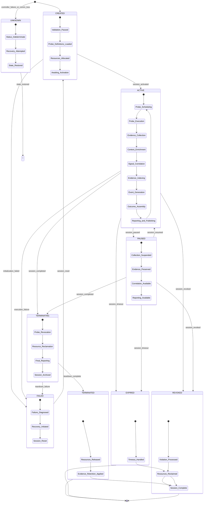
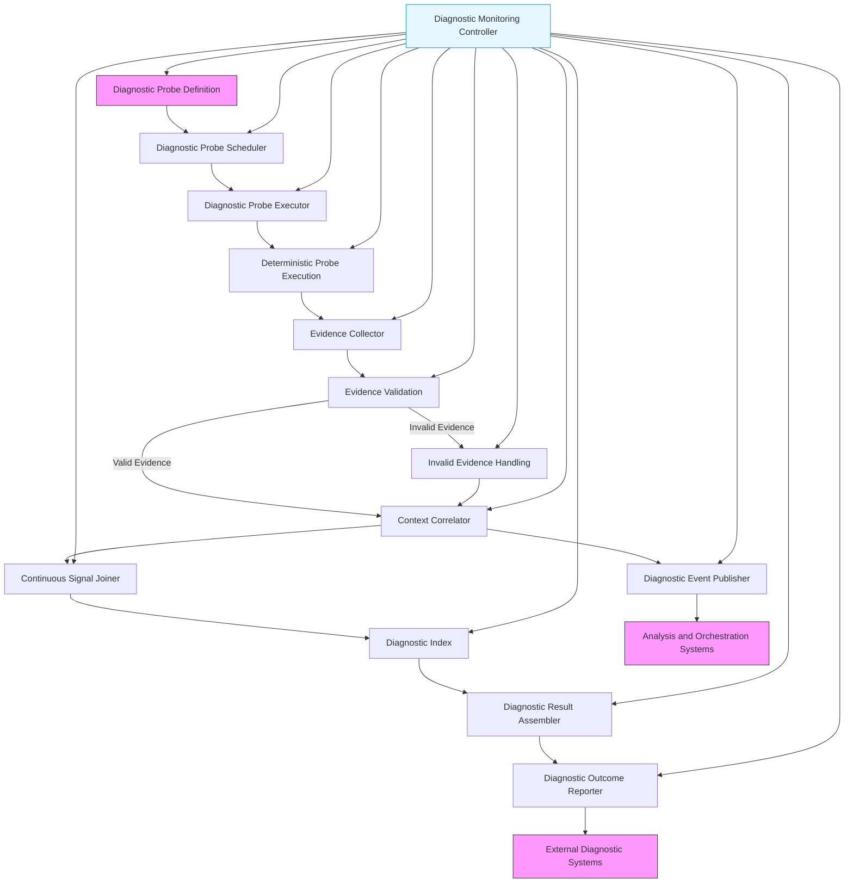

#### Authority Boundaries
- Sole authority over: the composition of projected views from sanctioned gates. It MUST NOT project state not exposed by a gate, bypass the Security Policy Enforcer, or expose state requiring a higher safety level than the session's.

#### Interfaces
- Provides: `IStateInspector`
- Requires: `IStateInspectionGate`, `ISecurityPolicyEnforcer`, `ISafetyController`
- Owner: Diagnostic Core Services

### 11.7.7.12 Evidence Collector

Gathers raw diagnostic evidence from probe execution and state inspection, normalizes formats, and prepares it for correlation and enrichment.

#### Responsibilities
- Collect evidence from Probe Executor and State Inspector
- Normalize evidence formats to a canonical internal representation
- Attach basic execution metadata (timestamp, probe ID, session ID)
- Apply initial filtering based on evidence priority and type
- Prepare evidence for context enrichment with minimal overhead
- Separate local evidence from cross-domain evidence

#### Authority Boundaries
- Sole authority over: the ingestion, normalization, and initial preparation of diagnostic evidence. It MUST NOT perform context enrichment, correlation, or long-term storage decisions.

#### Interfaces
- Provides: `IEvidenceCollector`
- Requires: `IProbeExecutor`, `IStateInspector`, `IResourceBudgetEnforcer`
- Owner: Diagnostic Core Services

### 11.7.7.13 Context Correlator

Attaches execution and trace context to diagnostic evidence to enable causal fidelity and cross-signal correlation.

#### Responsibilities
- Attach execution context (thread/process ID, stack trace if enabled) to evidence
- Attach trace context (trace ID, span ID, trace flags) for correlation with traces
- Attach resource context (CPU usage, memory usage, I/O statistics) when configured
- Apply context propagation rules across asynchronous boundaries
- Ensure context enrichment introduces zero non-determinism
- Validate context fidelity and completeness

#### Authority Boundaries
- Sole authority over: the structural union of evidence with contextual identifiers provided by the diagnostic core. It MUST NOT execute network operations, format data, or bypass security classification boundaries.

#### Interfaces
- Provides: `IContextCorrelator`
- Requires: `IEvidenceCollector`, `IContextCapture`, `IContextPropagation`, `ITraceContextProvider`, `IResourceObserver`
- Owner: Diagnostic Correlation Layer

### 11.7.7.14 Continuous Signal Joiner

Joins diagnostic evidence with continuous telemetry signals (metrics, traces, logs, health) using shared context identity to enable end-to-end diagnostic correlation.

#### Responsibilities
- Join diagnostic evidence with metrics using trace ID, span ID, and timestamps
- Join diagnostic evidence with traces using trace ID and span ID
- Join diagnostic evidence with logs using trace ID and span ID
- Join diagnostic evidence with health events using component ID and timestamps
- Preserve temporal alignment and causality in joined data
- Ensure joining introduces zero non-determinism
- Apply security mediation to joined data before export

#### Authority Boundaries
- Sole authority over: the correlation of diagnostic evidence with continuous telemetry signals. It MUST NOT alter the underlying signals, create new signals, or bypass security policy enforcement.

#### Interfaces
- Provides: `IContinuousSignalJoiner`
- Requires: `IContextCorrelator`, `IMetricsProvider` (Part 11.3), `ITraceProvider` (Part 11.4), `ILogProvider` (Part 11.5), `IHealthProvider` (Part 11.6), `ISecurityPolicyEnforcer`
- Owner: Diagnostic Correlation Layer

### 11.7.7.15 Diagnostic Index

Provides low-latency indexing and retrieval of recent diagnostic evidence for active debugging and troubleshooting scenarios.

#### Responsibilities
- Maintain in-memory index of recent diagnostic evidence
- Enable low-latency queries by session ID, component ID, trace ID, and time range
- Apply configurable retention policies to prevent memory exhaustion
- Provide ordered retrieval of diagnostic evidence for temporal analysis
- Ensure indexing operations introduce zero non-determinism

#### Authority Boundaries
- Sole authority over: in-memory indexing strategies and cache eviction policies for diagnostic evidence. It MUST NOT perform long-term storage or modify evidence content.

#### Interfaces
- Provides: `IDiagnosticIndex`
- Requires: `IContinuousSignalJoiner`, `IResourceBudgetEnforcer`
- Owner: Diagnostic Correlation Layer

### 11.7.7.16 Diagnostic Result Assembler

Assembles joined diagnostic evidence into coherent diagnostic results and outcomes for reporting and publication.

#### Responsibilities
- Assemble joined evidence into structured diagnostic results
- Apply diagnostic categorization and severity assessment
- Generate diagnostic summaries and detailed findings
- Prepare results for versioned export formats
- Apply final data quality checks and completeness indicators

#### Authority Boundaries
- Sole authority over: the assembly of diagnostic evidence into reportable outcomes. It MUST NOT perform event publishing, long-term storage, or remediation recommendations.

#### Interfaces
- Provides: `IDiagnosticResultAssembler`
- Requires: `IContinuousSignalJoiner`, `IDiagnosticIndex`, `ISecurityPolicyEnforcer`
- Owner: Diagnostic Outcome Layer

### 11.7.7.17 Diagnostic Event Publisher

Publishes discrete diagnostic events and state transition events to enable decoupled consumption by analysis and orchestration systems.

#### Responsibilities
- Publish diagnostic session lifecycle events (started, paused, resumed, terminated)
- Publish significant diagnostic finding events (anomalies, threshold breaches, pattern detections)
- Publish cross-signal correlation events (evidence joined with metrics/traces/logs/health)
- Ensure event delivery is at-least-once with deduplication capabilities
- Apply security policies to event content before publishing
- Maintain deterministic event generation and publishing
- Do NOT include remediation instructions in events (only state and diagnostic information)

#### Authority Boundaries
- Sole authority over: the generation and publication of diagnostic events. It MUST NOT assemble results, store evidence long-term, or execute remediation actions.

#### Interfaces
- Provides: `IDiagnosticEventPublisher`
- Requires: `IDiagnosticResultAssembler`, `IResourceBudgetEnforcer`, `ISecurityPolicyEnforcer`
- Owner: Diagnostic Outcome Layer

### 11.7.7.18 Outcome Reporter

Formats and exports aggregated diagnostic data to external systems via versioned interfaces.

#### Responsibilities
- Format diagnostic results according to versioned contracts (JSON, Protobuf, etc.)
- Apply final formatting for target diagnostic systems
- Route diagnostic outcomes to appropriate destinations based on routing policies
- Manage backpressure and retry logic for export failures
- Ensure export mechanisms introduce zero non-determinism
- Provide observability into outcome reporting health and performance metrics

#### Authority Boundaries
- Sole authority over: protocol selection, serialization format, and network transfer to external diagnostic collectors. It MUST NOT modify active context or perform security sanitization.

#### Interfaces
- Provides: `IDiagnosticOutcomeReporter`
- Requires: `IDiagnosticResultAssembler`, `IDiagnosticFormatter`, `IDiagnosticRouter`
- Owner: Diagnostic Outcome Layer

## 11.7.8 Diagnostic Authority Boundaries

Clear ownership and responsibility boundaries ensure effective operation and evolution of the diagnostic system.

### 11.7.8.1 Service Ownership Boundaries

**Component Teams Own:**
- Definition of diagnostic probes for their component, establishing inspection criteria and data collection points
- Declaration of required execution and trace context for correlation
- Specification of probe safety levels and resource requirements
- Initial validation of diagnostic evidence quality from their probes
- Response to diagnostic insights derived from evidence analysis

**Diagnostic Platform Team Owns:**
- Session management, probe scheduling, and execution infrastructure
- Definition and enforcement of diagnostic session contracts and safety levels
- Configuration of diagnostic pipelines, processing rules, and resource budgets
- Management of context enrichment, correlation, and indexing services
- Provision of export mechanisms and consumer enablement
- Platform-level alerting on diagnostic subsystem health and performance
- Self-diagnostic monitoring of the diagnostic subsystem itself

### 11.7.8.2 Data Domain Boundaries

**Local Diagnostic Data:**
- Owned by component teams
- Focus on component-internal state, resource utilization, and execution metrics
- Responsibility for defining meaningful local diagnostic probes

**Cross-Domain Diagnostic Data:**
- Owned by diagnostic platform team
- Focus on correlations across components, processes, and trust boundaries
- Responsibility for defining diagnostic correlation mechanisms and joined evidence

**Diagnostic Session Data:**
- Owned by diagnostic platform team
- Focus on session lifecycle, scope, safety level, and resource utilization
- Responsibility for defining session management policies and enforcement

### 11.7.8.3 Operational Boundaries

**Session Initiation:**
- Principals request diagnostic sessions via the Diagnostic Session Gateway
- Sessions undergo authority validation and scoping before activation
- Diagnostic probes are attached only within active, authorized sessions

**Session Execution:**
- Diagnostic probes execute according to session schedule and safety level
- Evidence is collected, enriched, correlated, and assembled deterministically
- Significant findings generate diagnostic events for decoupled consumption

**Session Termination:**
- Sessions terminate on expiry, revocation, budget exhaustion, or completion
- All diagnostic probes are deterministically detached
-istically released and reclaimed
- Session outcomes are reported and events are published before teardown

## 11.7.9 Diagnostic Probe Model

Diagnostic probes are the fundamental units of runtime diagnostics in AI-OS. They are designed to be deterministic, isolated, and security-preserving observations that assess specific aspects of component state and behavior.

### 11.7.9.1 Probe Types

* **State Inspection Probes** – Query internal component state at architecturally significant points to enable forensic analysis and behavioral verification. These probes capture point-in-time snapshots of runtime data structures, resource utilization, and execution metrics.

* **Behavioral Observation Probes** – Monitor execution patterns, state transitions, and behavioral characteristics over time to enable trend analysis and anomaly detection. These probes capture temporal sequences of state changes and performance metrics.

* **Performance Sampling Probes** – Collect performance metrics, resource utilization data, and execution timing information at configurable intervals to enable performance analysis and bottleneck identification.

* **Correlation Probes** – Establish and maintain causal relationships between diagnostic events, traces, logs, and metrics to enable end-to-end diagnostic correlation across system boundaries.

* **Lifecycle Diagnostic Probes** – Monitor specific lifecycle transitions (starting, stopping, recovering, etc.) to provide precise state information for diagnostic correlation.

* **Deep Inspection Probes** – Perform more comprehensive state inspection that may involve light interaction with protected state to validate end-to-end functionality. These require higher safety levels and are executed less frequently due to higher overhead.

### 11.7.9.2 Probe Safety Levels

Diagnostic probes are classified by safety level to establish clear boundaries on their intrusiveness and required authorization:

* **SAFE (Level 0)** – Read-only observation of exposed state with zero risk of state modification. Examples: reading public metrics, inspecting non-sensitive state.

* **CAUTIOUS (Level 1)** – Observation that requires minimal interaction with protected boundaries but maintains read-only semantics. Examples: inspecting resource utilization with bounded overhead, tracing execution paths with minimal probing.

* **RESTRICTED (Level 2)** – Observation that requires authorized access to protected state but guarantees non-modification through enforced read-only interfaces. Examples: inspecting internal data structures with access controls, sampling execution state with deterministic snapshots.

* **PRIVILEGED (Level 3)** – Observation that requires elevated authority and may involve controlled interaction with protected state while maintaining deterministic recovery semantics. Examples: injecting test probes to validate state transitions, performing controlled state mutations with guaranteed rollback.

* **CRITICAL (Level 4)** – Observation that requires the highest authority and may involve significant interaction with protected state. These probes MUST provide deterministic rollback guarantees and are subject to the strictest resource constraints. Examples: deep memory inspection, state corruption testing with guaranteed recovery.

### 11.7.9.3 Probe Characteristics

All diagnostic probes in AI-OS must adhere to the following characteristics:

- **Deterministic Execution**: Probe execution must not alter system state or introduce non-determinism
- **Bounded Execution Time**: Probes must complete within a configured timeout period
- **Read-Only Operation**: Probes observe system state without modifying it (except for CRITICAL level with guaranteed rollback)
- **Isolation Preserving**: Probe execution must not cross isolation boundaries unless explicitly authorized
- **Security Compliant**: Probe execution respects all security policies and does not leak sensitive information
- **Self-Contained**: Probes should minimize dependencies on external systems to reduce failure propagation risk
- **Lifecycle Aware**: Probes can be tagged with lifecycle phases for which they are relevant
- **Context Preserving**: Probes must preserve sufficient execution and trace context to enable accurate diagnosis
- **Minimal Data Collection**: Probes collect only the data strictly necessary to achieve their diagnostic objectives
- **Deterministic Data Processing**: All diagnostic data processing introduces zero non-determinism in AI-Runtime outputs
- **Safety Level Compliant**: Probes must operate at or below their declared safety level
- **Revocation Compliant**: Probes must respond to revocation commands within their declared revocation latency

### 11.7.9.4 Probe Result Model

Diagnostic probes return structured results that enable consistent aggregation and reporting. The diagnostic probe result model defines the essential attributes that must be present in all diagnostic probe results to enable consistent processing, aggregation, and reporting while preserving implementation independence.

The diagnostic probe result model includes:
- A unique probe identifier for tracking and correlation
- The component identifier being probed
- The probe type (state inspection, behavioral observation, performance sampling, correlation, lifecycle, or deep inspection)
- The probe safety level (SAFE, CAUTIOUS, RESTRICTED, PRIVILEGED, or CRITICAL)
- The current lifecycle phase of the component being probed
- Timestamp of probe execution in UTC format
- Execution duration in milliseconds
- Diagnostic status outcome (normal, anomalous, degraded, critical, or unknown)
- Diagnostic category classification when status is anomalous, degraded, or critical
- Optional diagnostic details providing contextual information without sensitive data
- Execution context (thread ID, process ID, stack trace if enabled)
- Trace context (trace ID, span ID, trace flags) for correlation with traces and logs
- Resource context (CPU usage, memory usage, I/O statistics) when configured
- Diagnostic session identifier for session correlation
- Safety level compliance flag indicating whether the probe operated within its declared safety level
- Revocation status indicating whether the probe responded to revocation commands
- Optional additional details providing context about the probe result
- Dependency diagnostic flag indicating whether the probe assesses cross-domain or dependency state
- Rollback guarantee indicator (for PRIVILEGED and CRITICAL probes) specifying whether state modifications are guaranteed to be rolled back
- Data minimization compliance flag indicating whether the probe collected only necessary data

### 11.7.9.5 Diagnostic Event Model

Diagnostic events are discrete notifications published for significant state transitions, anomalous findings, and diagnostic session events. The diagnostic event model defines the essential attributes that must be present in all diagnostic events to enable consistent processing, delivery, and consumption while preserving implementation independence.

The diagnostic event model includes:
- A unique event identifier for tracking and correlation
- The component identifier associated with the event
- The event type (session_started, session_paused, session_resumed, session_terminated, probe_attached, probe_detached, state_inspected, behavior_observed, performance_sampled, correlation_established, lifecycle_transitioned, deep_inspected, anomalous_findings, threshold_breached, pattern_detected, resource_exceeded, safety_violated)
- Timestamp of event generation in UTC format
- Previous diagnostic state (for state transition events)
- New diagnostic state (for state transition events)
- Diagnostic category classification (for finding events)
- Optional diagnostic details providing contextual information without sensitive data
- Execution context at time of event generation
- Trace context for correlation with traces and logs
- Resource context at time of event generation
- Diagnostic session identifier for session correlation
- Optional correlation identifier to correlate related events across the system
- Severity level (informational, warning, error, critical) based on diagnostic impact
- Confidence level indicating diagnostic certainty (when applicable)
- Safety level of the diagnostic activity that generated the event
- Resource consumption snapshot at time of event
- Data quality indicators (completeness, freshness, accuracy) of the diagnostic evidence

## 11.7.10 Diagnostic Session Lifecycle

The diagnostic session lifecycle defines the states a diagnostic session can occupy and the transitions between them. Each state is governed by explicit contracts and invariants, and every transition is deterministic and generates an appropriate diagnostic event.

### 11.7.10.1 Diagnostic Session States

* **CREATED** – Diagnostic session has been requested and validated but not yet activated. Probe definitions are loaded, but no diagnostic activity is occurring.
* **ACTIVE** – Diagnostic session is actively executing probes and collecting diagnostic evidence. The session is within its declared bounds and safety level.
* **PAUSED** – Diagnostic session is temporarily suspended. No new diagnostic probes are executing, but previously collected evidence remains available for correlation and reporting.
* **TERMINATING** – Diagnostic session is in the process of graceful termination. Active probes are being revoked and resources are being reclaimed.
* **TERMINATED** – Diagnostic session has been completed and all resources have been released. Diagnostic evidence may be retained according to retention policies.
* **EXPIRED** – Diagnostic session has exceeded its declared duration and has been automatically terminated.
* **REVOKED** – Diagnostic session has been terminated early due to safety violations, resource budget exhaustion, or authority revocation.
* **FAILED** – Diagnostic session encountered an unrecoverable error during execution and requires intervention.
* **UNKNOWN** – Diagnostic session status cannot be determined due to monitoring or communication issues.

### 11.7.10.2 State Transition Rules

Transitions between states follow these deterministic rules:
- **CREATED → ACTIVE**: When session activation is requested and all preconditions are met (authority, resources, headroom)
- **CREATED → FAILED**: When session initialization fails due to configuration or resource issues
- **ACTIVE → PAUSED**: When manual pause is requested or resource constraints require temporary suspension
- **ACTIVE → TERMINATING**: When session completion is requested normally
- **ACTIVE → EXPIRED**: When session duration timer elapses
- **ACTIVE → REVOKED**: When safety controller revokes session due to violations or budget exhaustion
- **ACTIVE → FAILED**: When unrecoverable errors occur during diagnostic execution or processing
- **PAUSED → ACTIVE**: When session resumption is requested and resources are available
- **PAUSED → TERMINATING**: When session completion is requested from paused state
- **PAUSED → EXPIRED**: When session duration timer elapses during paused state
- **PAUSED → REVOKED**: When safety controller revokes session due to violations or budget exhaustion during paused state
- **TERMINATING → TERMINATED**: When all probes are successfully revoked and resources reclaimed
- **TERMINATING → FAILED**: When errors occur during teardown that prevent clean resource reclamation
- **TERMINATED → [*]**: Session is complete, resources released
- **EXPIRED → [*]**: Session is complete due to timeout
- **REVOKED → [*]**: Session is complete due to revocation
- **FAILED → CREATED**: When session is reset and reinitialized after error recovery
- **ANY_STATE → UNKNOWN**: When diagnostic monitoring cannot determine session state
- **UNKNOWN → ***: When session state is restored through monitoring recovery

### 11.7.10.3 Lifecycle Diagram

### 11.7.10.4 Lifecycle Stages

1. **Creation** – Diagnostic session is being requested, validated, and prepared
2. **Validation Passed** – Session request has passed authority and scope validation
3. **Probe Definitions Loaded** – Diagnostic probe configurations have been loaded for the session
4. **Resources Allocated** – Session resources (CPU, memory, bandwidth, probe slots) have been provisioned
5. **Awaiting Activation** – Session is ready but not yet active
6. **Active Execution** – Diagnostic probes are executing and collecting evidence according to schedule
7. **Evidence Collection** – Raw diagnostic evidence is being gathered from probes and state inspection
8. **Context Enrichment** – Evidence is being enriched with execution and trace context
9. **Signal Correlation** – Diagnostic evidence is being joined with continuous telemetry signals
10. **Evidence Indexing** – Evidence is being indexed for low-latency retrieval
11. **Event Generation** – Significant diagnostic findings are being converted to events
12. **Outcome Assembly** – Evidence is being assembled into structured diagnostic results
13. **Reporting and Publishing** – Results are being formatted and exported, events are being published
14. **Paused State** – Diagnostic collection is temporarily suspended while maintaining access to collected evidence
15. **Termination Process** – Session is completing, probes are being revoked, resources are being reclaimed
16. **Final Reporting** – Final diagnostic outcomes are being reported before resource reclamation
17. **Session Archived** – Session is complete and resources have been released
18. **Expired State** – Session has been automatically terminated due to exceeding duration
19. **Revoked State** – Session has been terminated early due to safety violations or resource exhaustion
20. **Failed State** – Session has encountered an unrecoverable error requiring intervention
21. **Unknown State** – Session status cannot be determined due to monitoring or communication issues

Each stage transition generates a corresponding diagnostic event that is published by the Diagnostic Event Publisher.

## 11.7.11 Diagnostic Data Flow and Event Architecture

Diagnostic data flows from probe definition through execution, collection, enrichment, correlation, indexing, assembly, and reporting while maintaining determinism and isolation guarantees. Significant state transitions and diagnostic findings generate discrete events for decoupled consumption.

### 11.7.11.1 Data Flow Guarantees

* **Deterministic Processing**: Each stage in the diagnostic data flow introduces zero non-determinism
* **Failure Isolation**: Failures in one stage do not corrupt state in other stages
* **Bounded Latency**: End-to-end diagnostic check processing completes within configurable time limits
* **Ordered Processing**: Diagnostic check results are processed in deterministic order
* **Event Generation**: Significant state transitions and diagnostic findings generate deterministic events
* **Event Publishing**: Events are published with at-least-once delivery guarantee and deduplication support
* **Security Compliance**: All data flows and event content respect information flow policies and do not leak sensitive information
* **Context Preservation**: Diagnostic data maintains sufficient execution and trace context to enable accurate diagnosis
* **Minimal Data Collection**: Diagnostic systems collect only data strictly necessary to achieve diagnostic objectives
* **Causal Fidelity**: Diagnostic evidence preserves provable causality relationships with continuous telemetry signals
* **Resource Awareness**: Diagnostic processing respects resource budget constraints and applies adaptive behavior when needed
* **Data Quality Transparency**: Diagnostic reporting includes data quality indicators for proper interpretation

### 11.7.11.2 Event Delivery Guarantees

* **At-Least-Once Delivery**: Each significant diagnostic event is delivered at least once to interested consumers
* **Deduplication Capability**: Events include unique identifiers to enable deduplication by consumers
* **Ordering Preservation**: Events for a single component or session are published in the order they occur
* **Backpressure Handling**: Event publishing system applies backpressure to prevent overwhelming consumers
* **Dead Letter Queue**: Repeatedly failed event deliveries are routed to a dead letter queue for later inspection
* **Contextual Fidelity**: Events preserve sufficient execution and trace context for accurate correlation
* **Resource Awareness**: Event generation and publishing respect resource budget constraints
* **Safety Level Compliance**: Events include safety level information to enable proper interpretation of diagnostic activity
* **Revocation Detection**: Events indicate when probes have been revoked or sessions terminated early

## 11.7.12 Diagnostic Collection Architecture

The collection architecture defines how diagnostic check requests are managed and executed across the system while respecting resource constraints and isolation boundaries.

### 11.7.12.1 Collection Tiers

* **Per-Component Scheduler** – Each component maintains its own scheduler for local diagnostic probes to minimize coordination overhead
* **Zone-Level Coordinator** – Optional coordinator for managing diagnostic checks across related components in a deployment zone
* **Global Orchestrator** – Top-level coordinator that manages diagnostic checking policies and provides system-wide diagnostic views
* **Session-Based Collector** – Collectors that operate within the context of a specific diagnostic session to enable session-scoped diagnostics
* **Safety-Level Collector** – Collectors that group probes by safety level to enable appropriate authorization checks

### 11.7.12.2 Collection Patterns

* **Staggered Scheduling** – Probes for the same component type are staggered to prevent resource spikes
* **Priority-Based Execution** – Critical diagnostic probes (state inspection, lifecycle) are prioritized over less critical ones (performance sampling)
* **Adaptive Intervals** – Check frequencies can be adjusted based on current diagnostic findings, system load, and resource availability
* **Bulk Execution** – Similar probes may be batched for efficiency when determinism guarantees allow
* **Lifecycle-Aware Scheduling** – Adjust probe frequency based on component lifecycle phase (e.g., increased during startup/shutdown for lifecycle probes)
* **Context-Aware Sampling** – Adjust sampling rates based on diagnostic utility and contextual relevance
* **Correlation-Adaptive Collection** – Increase collection frequency when diagnostic correlation indicates potential issues
* **Safety-Level Gating** – Only execute probes at or below the session's declared safety level
* **Headroom-Aware Scheduling** – Defer or refuse probe execution when runtime headroom is insufficient for the probe's safety level
* **Resource-Proportional Collection** – Adjust collection intensity based on available diagnostic resource budget

### 11.7.12.3 Collection Reliability

* **Timeout Enforcement** – All probes have configurable timeouts to prevent hanging
* **Retry Policies** – Failed probes may be retried according to configurable policies (different for transient vs. persistent failures)
* **Circuit Breaking** – Repeated failures temporarily pause probing to prevent overwhelming struggling components
* **Resource Backpressure** – System reduces probe frequency when resources are constrained
* **Failure Classification Awareness** – Retry and circuit breaking policies vary by failure category
* **Contextual Retry** – Retry policies consider diagnostic context and relevance to avoid unnecessary retries
* **Isolation-Preserving Retry** – Retry mechanisms maintain isolation boundaries and do not cross domains without authorization
* **Safety-Level Enforcement** – Retry policies never allow execution beyond the declared safety level of the session
* **Revocation Responsiveness** – All probes must respond to revocation commands within their declared latency
* **Deterministic Retry** – Retry mechanisms introduce zero non-determinism in diagnostic processing

## 11.7.13 Diagnostic Data Aggregation and Reporting

Diagnostic data aggregation combines individual probe results into meaningful diagnostic views for components and systems while clearly distinguishing local diagnostic data from cross-domain or dependency data.

### 11.7.13.1 Aggregation Policies

* **Temporal Policy** – Diagnostic data is aggregated based on time windows (sliding window, tumbling window, session-based)
* **Contextual Policy** – Diagnostic data is aggregated based on execution and trace context to enable correlation
* **Hierarchical Policy** – Diagnostic data is aggregated across component hierarchies to enable system-wide views
* **Sampling Policy** – Diagnostic data is aggregated with applied sampling rates to manage resource utilization
* **Deduplication Policy** – Redundant diagnostic evidence is removed to prevent overload while preserving diagnostic fidelity
* **Correlation Policy** – Diagnostic data is aggregated to preserve and enhance causal relationships across system boundaries
* **Severity-Based Policy** – Diagnostic data is aggregated with priority given to higher severity findings
* **Diagnostic Value Policy** – Diagnostic data is aggregated based on assessed diagnostic utility to preserve high-value data
* **Safety-Level Policy** – Diagnostic data is aggregated with consideration for the safety level at which it was collected
* **Resource-Aware Policy** – Diagnostic data is aggregated with consideration for resource consumption during collection
* **Dependency-Aware Aggregation** – Aggregation clearly separates local diagnostic data from aggregated cross-domain or dependency data
* **Diagnostic Session Policy** – Diagnostic data is aggregated within the context of a specific diagnostic session
* **Cross-Signal Join Policy** – Diagnostic data is aggregated with joined continuous telemetry signals for end-to-end correlation

### 11.7.13.2 Diagnostic Data Model

Diagnostic data is represented using a standardized architectural model that enables consistent interpretation across all components and systems. The diagnostic data model clearly distinguishes local diagnostic data from cross-domain data and provides sufficient context for orchestration and remediation decisions.

The diagnostic data model includes:
- A unique component identifier
- Timestamp of assessment in UTC format
- Current lifecycle phase of the component
- Overall diagnostic status (normal, anomalous, degraded, critical, or unknown)
- Local diagnostic status assessed independently of dependencies (normal, anomalous, degraded, critical, or unknown)
- Cross-domain diagnostic status reflecting the state of downstream dependencies (normal, anomalous, degraded, critical, or unknown)
- Optional structured diagnostic details including breakdown by subsystem, probe type, probe safety level, or diagnostic category, clearly separating local vs. cross-domain contributions
- Optional array of recent significant diagnostic events for context (bounded to prevent overload)
- Execution context (thread ID, process ID, stack trace if enabled)
- Trace context (trace ID, span ID, trace flags) for correlation with traces and logs
- Resource context (CPU usage, memory usage, I/O statistics) when configured
- Diagnostic session identifier for session correlation
- Session safety level at time of assessment
- Resource consumption snapshot at time of assessment
- Diagnostic confidence level indicating certainty of assessment
- Data quality indicators (completeness, freshness, accuracy)
- Diagnostic value score indicating assessed utility of the diagnostic data
- Safety level compliance flag indicating whether all diagnostic activity operated within declared safety levels
- Data minimization compliance flag indicating whether only necessary data was collected
- Rollback guarantee status (for PRIVILEGED and CRITICAL sessions) indicating whether state modifications are guaranteed to be rolled back

### 11.7.13.3 Reporting Guarantees

* **Deterministic Reporting**: Diagnostic data reporting introduces zero non-determinism
* **Consistent Versioning**: Diagnostic data format follows semantic versioning guidelines
* **Security-Mediated Export**: All diagnostic data exports are mediated by security subsystem
* **Backpressure Handling**: Reporting system applies backpressure to prevent overwhelming consumers
* **Ordered Updates**: Diagnostic data updates are delivered in deterministic order
* **Separation of Concerns**: Local diagnostic data and cross-domain diagnostic data are explicitly reported separately
* **Event Summary**: Recent significant diagnostic events are included in data reports for context (with size limits)
* **Contextual Fidelity**: Reported diagnostic data preserves sufficient execution and trace context for accurate diagnosis
* **Resource Awareness**: Diagnostic reporting respects resource budget constraints and applies adaptive reporting when needed
* **Data Quality Transparency**: Reporting includes data quality indicators to enable proper interpretation of diagnostic data
* **Safety Level Transparency**: Reporting includes session safety level and individual probe safety level compliance
* **Minimal Necessary Data**: Reporting indicates whether diagnostic activity collected only data strictly necessary to achieve objectives
* **Deterministic Recovery**: Reporting indicates whether diagnostic session guarantees deterministic recovery of runtime state
* **Correlation Fidelity**: Reporting indicates the fidelity of correlation between diagnostic evidence and continuous telemetry signals
* **Diagnostic Utility Transparency**: Reporting includes assessed diagnostic utility to enable proper interpretation of findings

## 11.7.14 Diagnostic Authority Boundaries

Authority over diagnostic functions is divided among distinct architectural actors to preserve isolation and clear responsibility.

| Authority | Responsibilities |
|-----------|------------------|
| **Component Owner** | Defines diagnostic probes for their component, establishes inspection criteria and data collection points, configures check intervals, specifies lifecycle relevance, defines required context for correlation, declares probe safety levels and resource requirements |
| **Platform Team** | Implements and maintains diagnostic infrastructure, provides shared probe libraries, ensures deterministic execution, manages diagnostic resource budgets, enforces safety levels, provides context enrichment and correlation services |
| **Security Team** | Defines and enforces security policies for diagnostic probing and event publishing, approves cross-domain probes, validates context handling and safety level compliance |
| **Operations Team** | Configures diagnostic monitoring policies, interprets diagnostic data and events for incident response and root-cause analysis, manages diagnostic session lifecycle and resource allocation |
| **Analysis System** | Consumes diagnostic data to perform trend analysis, anomaly detection, predictive diagnostics, and correlation analysis |
| **Orchestration System** | Consumes diagnostic status to make placement, scaling, and remediation decisions based on diagnostic insights and correlation with continuous telemetry |
| **Remediation System** | Consumes diagnostic events to trigger automated remediation procedures (separate from diagnostic monitoring) |
| **Diagnostic Monitoring Controller** | Manages the lifecycle of diagnostic components, implements self-diagnostic monitoring, enforces safety levels and resource budgets |

**Critical Boundary**: The diagnostic subsystem is responsible ONLY for detecting, reporting, and publishing diagnostic state and events. It does NOT:
- Make decisions about restarting, failing over, or otherwise modifying components based solely on diagnostic data
- Execute remediation actions
- Implement retry logic for failed components (beyond its own probe execution)
- Alter system state in any way (except for PRIVILEGED and CRITICAL probes with guaranteed rollback)
- Prescribe specific remediation actions (only provides diagnostic information and correlation for decision-making)
- Exceed declared safety levels or resource budgets without explicit authorization and revocation capability
- Compromise determinism guarantees or isolation boundaries

Remediation actions are performed by separate components that consume the published diagnostic state and events.

## 11.7.15 Runtime Invariants

Runtime invariants are properties that must hold in all reachable states of the combined AI-Runtime and diagnostic monitoring subsystem.

### 11.7.15.1 Determinism Invariant

* **Formal Expression**: 
  `∀ s₀, s₁ ∈ States: (trace(s₀) = trace(s₁) ∧ dm_enabled(s₀) = dm_enabled(s₁)) → output(s₀) = output(s₁)`
* **Explanation**: For any two executions that start from the same state and have identical diagnostic monitoring enabled/disabled flags, the observable output must be identical regardless of diagnostic monitoring activity.
* **Verification Approach**: Model-check interaction between probe execution points and deterministic core; verify probe actions are read-only with respect to core state (except for PRIVILEGED and CRITICAL probes with guaranteed deterministic rollback).

### 11.7.15.2 Diagnostic Session Lifecycle Invariant

* **Formal Expression**: 
  `∀ t ∈ Time: session_lifecycle_state(t) ∈ {CREATED, ACTIVE, PAUSED, TERMINATING, TERMINATED, EXPIRED, REVOKED, FAILED, UNKNOWN}`
  `∀ t₁, t₂ ∈ Time: (t₁ < t₂) → valid_transition(session_lifecycle_state(t₁), session_lifecycle_state(t₂))`
  Where `valid_transition(s₁, s₂)` returns true only if s₂ is a valid successor state of s₁ according to the state transition rules.
* **Explanation**: Diagnostic session lifecycle state must always be one of the defined valid states, and transitions between states must follow the predefined deterministic rules.
* **Verification Approach**: Model checking of lifecycle state transitions; property-based testing of state machine.

### 11.7.15.3 Isolation Boundary Invariant

* **Formal Expression**: 
  `∀ d₁, d₂ ∈ Domains: (d₁ ≠ d₂) → ¬∃ path: dm_data(d₁) → … → dm_data(d₂)`
  Where `dm_data(x)` denotes any observable datum originating from diagnostic monitoring in domain `x`.
* **Explanation**: No information flow via diagnostic monitoring may allow data to cross from one isolated domain to another.
* **Verification Approach**: Information-flow analysis to verify no diagnostic monitoring channel transmits data between domains.

### 11.7.15.4 Resource Bound Invariant

* **Formal Expression**: 
  `∀ t ∈ Time: dm_cpu(t) ≤ C_max ∧ dm_mem(t) ≤ M_max ∧ dm_bw(t) ≤ B_w`
  where `C_max`, `M_max`, and `B_w` are configured CPU, memory, and bandwidth bounds for diagnostic monitoring.
* **Explanation**: Diagnostic monitoring resource consumption stays within allocated bounds under all conditions.
* **Verification Approach**: Resource accounting and monitoring under defined load profiles.

### 11.7.15.5 Deterministic Probe Execution Invariant

* **Formal Expression**: 
  `∀ p ∈ Probes: (safety_level(p) ≤ session_safety_level) → deterministic_execution(p) = true`
  Where `safety_level(p)` is the declared safety level of probe p, and `session_safety_level` is the declared safety level of the diagnostic session.
* **Explanation**: Every diagnostic probe executing at or below its declared safety level and the session's safety level executes as a deterministic, read-only operation that preserves system invariants (PRIVILEGED and CRITICAL probes guarantee deterministic rollback to preserve observability invariants).
* **Verification Approach**: Property-based testing of probe execution; fault injection to verify no state modification or guaranteed deterministic rollback.

### 11.7.15.6 Context Preservation Invariant

* **Formal Expression**: 
  `∀ p ∈ Probes: context_preserved(p) = true ∧ context_complete(p) ≥ threshold`
  Where `context_preserved(p)` indicates that probe p preserves sufficient execution and trace context for accurate diagnosis, and `context_complete(p)` measures the completeness of preserved context against a diagnostic utility threshold.
* **Explanation**: Every diagnostic probe preserves sufficient execution and trace context to enable accurate diagnosis without introducing non-deterministic overhead.
* **Verification Approach**: Property-based testing of context preservation; diagnostic utility validation of preserved context.

### 11.7.15.7 Event Publication Invariant

* **Formal Expression**: 
  `∀ e ∈ Events: deterministic_generation(e) = true ∧ at_least_once_delivery(e) = true`
* **Explanation**: Every diagnostic event is generated deterministically and delivered with at-least-once guarantee.
* **Verification Approach**: Property-based testing of event generation; fault injection to verify delivery guarantees.

### 11.7.15.8 Data Minimization Invariant

* **Formal Expression**: 
  `∀ p ∈ Probes: data_collected(p) = necessary_data(p)`
  Where `data_collected(p)` is the actual data collected by probe p, and `necessary_data(p)` is the minimum data required to achieve the probe's diagnostic objectives.
* **Explanation**: Every diagnostic probe collects only the data strictly necessary to achieve its diagnostic objectives.
* **Verification Approach**: Property-based testing of data minimization; diagnostic utility validation of collected vs. necessary data.

### 11.7.15.9 Safety Level Invariant

* **Formal Expression**: 
  `∀ p ∈ Probes: effective_safety_level(p) ≤ declared_safety_level(p)`
  Where `effective_safety_level(p)` is the actual safety level at which probe p executed, and `declared_safety_level(p)` is the safety level declared for probe p.
* **Explanation**: Every diagnostic probe executes at or below its declared safety level.
* **Verification Approach**: Property-based testing of safety level compliance; monitoring of effective vs. declared safety levels.

### 11.7.15.10 Revocation Responsiveness Invariant

* **Formal Expression**: 
  `∀ p ∈ Probes: revocation_latency(p) ≤ declared_revocation_latency(p)`
 
Where declared_revocation_latency(p)` is the time taken for probe)`
  Where `revocation_latency(p)` is the actual latency for probe p to respond to a revocation command, and `declared_revocation_latency(p)` is the declared revocation latency for probe p.
* **Explanation**: Every diagnostic probe responds to revocation commands within its declared revocation latency.
* **Verification Approach**: Property-based testing of revocation responsiveness; fault injection to verify timely response to revocation commands.

### 11.7.15.11 Rollback Guarantee Invariant (PRIVILEGED and CRITICAL Probes)

* **Formal Expression**: 
  `∀ p ∈ Probes: (safety_level(p) ∈ {PRIVILEGED, CRITICAL}) → rollback_guaranteed(p) = true`
  Where `rollback_guaranteed(p)` indicates that probe p guarantees deterministic rollback of any state modifications.
* **Explanation**: PRIVILEGED and CRITICAL diagnostic probes guarantee deterministic rollback of any state modifications to preserve AI-Runtime determinism invariants.
* **Verification Approach**: Property-based testing of rollback guarantees; fault injection to verify deterministic recovery to pre-probe state.

### 11.7.15.12 Diagnostic and Lifecycle Separation Invariant

* **Formal Expression**: 
  `∀ s ∈ States: local_diagnostic(s) is_independent_of(lifecycle_phase(s)) ∧ cross_domain_diagnostic(s) is_independent_of(lifecycle_phase(s))`
* **Explanation**: Local diagnostic status and cross-domain diagnostic status are assessed independently of the component's lifecycle phase.
* **Verification Approach**: Property-based testing verifying that diagnostic assessments are not influenced by lifecycle state.

### 11.7.15.13 Correlation Fidelity Invariant

* **Formal Expression**: 
  `∀ d ∈ Diagnostic_Data: correlation_fidelity(d) ≥ threshold`
  Where `correlation_fidelity(d)` measures the fidelity of execution and trace context preserved in diagnostic data d for correlation with continuous telemetry signals against a diagnostic utility threshold.
* **Explanation**: Diagnostic data preserves sufficient execution and trace context to enable accurate correlation with continuous telemetry signals.
* **Verification Approach**: Property-based testing of correlation fidelity; diagnostic utility validation of preserved context for correlation purposes.

## 11.7.16 Cross-Part Integration

The diagnostic monitoring architecture integrates with other architectural parts through well-defined interfaces that respect ownership boundaries.

### 11.7.16.1 Part 10 (AI Runtime) Integration

* **Why**: Part 10 provides the execution environment whose state must be diagnosed without interference
* **Architectural Responsibilities**: Part 10 must provide stable extension points for diagnostic probe attachment; Part 11 must ensure probes do not alter RT behavior
* **Ownership Boundary**: Part 10 owns core execution semantics; Part 11 owns diagnostic observation interfaces attached via those points

### 11.7.16.2 Part 7 (Security) Integration

* **Why**: Ensuring diagnostic monitoring data does not violate security policies or leak sensitive information requires tight integration
* **Architectural Responsibilities**: Part 7 owns security policy enforcement and classification; Part 11 implements data sanitization and access controls per Part 7 policies
* **Ownership Boundary**: Part 7 owns security policy definition and enforcement; Part 11 owns diagnostic monitoring data handling compliance

### 11.7.16.3 Part 6 (Inter-Process Communication) Integration

* **Why**: Diagnostic monitoring must observe communication patterns and state transitions across process boundaries
* **Architectural Responsibilities**: Part 6 owns IPC mechanisms and transports; Part 11 defines diagnostic observation points for cross-process state inspection
* **Ownership Boundary**: Part 6 owns communication implementation; Part 11 owns diagnostics of communication patterns and state effects

### 11.7.16.4 Part 5 (Concurrency) Integration

* **Why**: Diagnostic monitoring must preserve causality and temporal relationships across asynchronous boundaries
* **Architectural Responsibilities**: Part 5 owns concurrency primitives for context safety; Part 11 leverages these primitives for diagnostic execution safety
* **Ownership Boundary**: Part 5 owns concurrency properties and mechanisms; Part 11 owns diagnostic monitoring implementations that preserve those properties

### 11.7.16.5 Part 9 (Resource Management) Integration

* **Why**: Resource utilization metrics inform diagnostic assessment and vice versa
* **Architectural Responsibilities**: Part 9 owns resource accounting mechanisms; Part 11 defines standardized interfaces for resource diagnostic correlation
* **Ownership Boundary**: Part 9 owns resource tracking and allocation; Part 11 owns diagnostic monitoring views of resource consumption

### 11.7.16.6 Part 4 (Determinism Guarantees) Integration

* **Why**: Diagnostic monitoring must be proven to preserve determinism guarantees established in Part 4
* **Architectural Responsibilities**: Part 4 owns determinism verification frameworks; Part 11 provides diagnostic monitoring implementations that satisfy Part 4 validation
* **Ownership Boundary**: Part 4 owns determinism properties and proof techniques; Part 11 owns diagnostic monitoring implementations that maintain those properties

### 11.7.16.7 Part 3 (Isolation Boundaries) Integration

* **Why**: Diagnostic monitoring must not compromise isolation boundaries between protected computational domains
* **Architectural Responsibilities**: Part 3 owns isolation mechanisms and boundary enforcement; Part 11 ensures diagnostic monitoring respects those boundaries
* **Ownership Boundary**: Part 3 owns isolation property enforcement; Part 11 owns diagnostic monitoring implementations that maintain those properties

### 11.7.16.8 Part 11.4 (Distributed Tracing) Integration

* **Why**: Diagnostic monitoring must correlate with distributed tracing to enable end-to-end diagnostic correlation
* **Architectural Responsibilities**: Part 11.4 owns trace context propagation and trace data model; Part 11.7 defines diagnostic correlation interfaces with trace data
* **Ownership Boundary**: Part 11.4 owns trace data model and propagation mechanisms; Part 11.7 owns diagnostic correlation with trace data

### 11.7.16.9 Part 11.5 (Logging) Integration

* **Why**: Diagnostic monitoring must correlate with logging to enable end-to-end diagnostic correlation
* **Architectural Responsibilities**: Part 11.5 owns log context propagation and log data model; Part 11.7 defines diagnostic correlation interfaces with log data
* **Ownership Boundary**: Part 11.5 owns log data model and propagation mechanisms; Part 11.7 owns diagnostic correlation with log data

### 11.7.16.10 Part 11.6 (Health Monitoring) Integration

* **Why**: Diagnostic monitoring must correlate with health monitoring to enable comprehensive system diagnostics
* **Architectural Responsibilities**: Part 11.6 owns health check mechanisms and health data model; Part 11.7 defines diagnostic correlation interfaces with health data
* **Ownership Boundary**: Part 11.6 owns health data model and mechanisms; Part 11.7 owns diagnostic correlation with health data

### 11.7.16.11 Part 11.3 (Metrics) Integration

* **Why**: Diagnostic monitoring must correlate with metrics to enable end-to-end diagnostic correlation
* **Architectural Responsibilities**: Part 11.3 owns metrics context propagation and metrics data model; Part 11.7 defines diagnostic correlation interfaces with metrics data
* **Ownership Boundary**: Part 11.3 owns metrics data model and propagation mechanisms; Part 11.7 owns diagnostic correlation with metrics data

### 11.7.16.12 Part 1 (Configuration) Integration

* **Why**: Diagnostic monitoring configuration must be tunable at runtime without compromising deterministic execution
* **Architectural Responsibilities**: Part 1 owns configuration mechanisms; Part 11 defines diagnostic monitoring configuration schema and integrates via Part 1's extension points
* **Ownership Boundary**: Part 1 owns configuration mechanisms; Part 11 owns diagnostic monitoring-specific configuration items

### 11.7.16.13 Recovery System Integration (Conceptual)

* **Why**: Diagnostic events must be consumable by recovery systems to enable automated remediation
* **Architectural Responsibilities**: Diagnostic monitoring publishes diagnostic events; recovery systems subscribe to and act upon these events
* **Ownership Boundary**: Diagnostic monitoring owns event publication; recovery systems own event consumption and action execution
* **Note**: While recovery systems may be implemented in other parts (e.g., extended Part 9 or a dedicated recovery part), the interface is defined by the published event format

## 11.7.17 Engineering Objectives

The following are design targets for diagnostic monitoring subsystem implementations. These are implementation-dependent goals, not absolute requirements.

* **Performance Bound** – Diagnostic monitoring overhead ≤ 0.5% CPU under defined nominal load (design target subject to validation)
* **Memory Bound** – Additional memory consumption ≤ predefined budget per diagnostic monitoring component (design target)
* **Latency Bound** – Diagnostic check end-to-end latency ≤ 100ms for 95% of probes under nominal load (design target)
* **Event Latency** – Significant diagnostic events published within 50ms of detection (design target)
* **Event Delivery** – 99.9% of events delivered with at-least-once guarantee within 1 second under nominal load (design target)
* **Configuration Safety** – Invalid diagnostic monitoring configurations must not cause system instability or security violations (design target)
* **Failure Containment** – Diagnostic monitoring subsystem failures must be contained without affecting core RT functions (design target)
* **Deterministic Execution** – All diagnostic probe execution must introduce zero non-determinism in AI-Runtime outputs (design target)
* **Isolation Preservation** – Diagnostic monitoring must not create new information pathways between isolated domains (design target)
* **Security Compliance** – All diagnostic monitoring data flows must comply with Part 7 security policies (design target)
* **Context Preservation** – Diagnostic monitoring must preserve sufficient execution and trace context to enable accurate diagnosis (design target)
* **Data Minimization** – Diagnostic monitoring must collect only data strictly necessary to achieve diagnostic objectives (design target)
* **Safety Level Compliance** – Diagnostic monitoring must ensure all probes operate at or below their declared safety levels (design target)
* **Revocation Responsiveness** – Diagnostic probes must respond to revocation commands within declared latency (design target)
* **Rollback Guarantee** – PRIVILEGED and CRITICAL diagnostic probes must guarantee deterministic rollback of any state modifications (design target)
* **Context Fidelity** – Diagnostic data must preserve sufficient execution and trace context with guaranteed fidelity for correlation (design target)
* **Diagnostic Utility** – Diagnostic data must provide actionable, context-rich information for effective root-cause analysis (design target)
* **Lifecycle Awareness** – Diagnostic monitoring accurately reflects and transitions through lifecycle states with appropriate event generation (design target)
* **Cross-Domain Awareness** – Diagnostic status clearly distinguishes local component state from cross-domain or dependency state (design target)
* **Self-Monitoring** – Diagnostic monitoring subsystem includes self-diagnostic checks that monitor its own operational status (design target)
* **Adaptive Sampling** – Diagnostic monitoring adjusts sampling rates based on system load and diagnostic utility (design target)
* **Correlation Diagnostics** – Diagnostic monitoring preserves and enhances causal relationships across system boundaries (design target)
* **Temporal Diagnostics** – Diagnostic monitoring supports temporal analysis and trending of diagnostic data (design target)
* **Privacy Preservation** – Diagnostic monitoring prevents information leakage and side-channel vulnerabilities (design target)
* **Resource Awareness** – Diagnostic monitoring respects resource budget constraints and applies adaptive behavior when needed (design target)
* **Data Quality Transparency** – Diagnostic reporting includes data quality indicators for proper interpretation (design target)
* **Minimal Necessary Data** – Diagnostic monitoring ensures collected data is strictly necessary to achieve diagnostic objectives (design target)
* **Deterministic Recovery** – Diagnostic monitoring ensures sessions guarantee deterministic recovery of runtime state (design target)
* **Diagnostic Session Isolation** – Diagnostic sessions maintain isolation from each other and from the AI Runtime (design target)
* **Probe Isolation** – Diagnostic probes maintain isolation from each other and from runtime components (design target)
* **Cross-Part Correlation Fidelity** – Diagnostic monitoring maintains high-fidelity correlation with metrics, traces, logs, and health data (design target)

## 11.7.18 Non-Normative Implementation Guidance

This section provides illustrative, non-normative suggestions for implementing the diagnostic monitoring architecture. Compliance is judged solely against the normative requirements and contracts specified earlier.

* **Probe Implementation** – Implement probes using read-only system interfaces that guarantee no state modification (except PRIVILEGED and CRITICAL with guaranteed rollback)
* **Timeout Implementation** – Enforce probe execution timeouts without blocking
* **Resource Isolation** – Execute diagnostic probes in isolated execution contexts with limited privileges to prevent fault propagation
* **Security Mediation** – Route all diagnostic probe execution through security subsystem policy checks before accessing protected resources
* **Context Enrichment** – Enrich diagnostic results with execution and trace context using efficient, deterministic mechanisms
* **State Inspection** – Implement state inspection using deterministic, read-only interfaces provided by the AI Runtime
* **Correlation Mechanisms** – Implement diagnostic correlation using trace IDs, span IDs, and execution context as correlation keys
* **Continuous Signal Joining** – Join diagnostic evidence with continuous telemetry signals using shared context identity and temporal alignment
* **Session Management** – Implement diagnostic session management with deterministic state transitions and event generation
* **Aggregation Policies** – Implement aggregation as pure functions that comply with determinism and contextual preservation requirements
* **Session Hysteresis** – Implement hysteresis in session transitions to prevent flapping (e.g., require N consecutive anomalies before degrading session status)
* **Adaptive Scheduling** – Increase probe frequency for anomalous components and decrease for normal ones, within configured bounds
* **Bulk Probe Execution** – Group similar probes for execution when determinism guarantees allow (e.g., probing multiple identical instances)
* **Diagnostic Status Caching** – Cache recent diagnostic status for components with expensive probes, invalidating cache on state changes
* **Self-Monitoring** – Implement diagnostic probes for the diagnostic monitoring subsystem itself to enable self-observation
* **Event Generation** – Generate deterministic events for all significant state transitions and diagnostic findings with unique identifiers
* **Event Publishing** – Implement at-least-once delivery with deduplication IDs and backpressure handling
* **Event Persistence** – Ensure event durability to prevent loss during transient outages
* **Lifecycle Coordination** – Coordinate probe scheduling with known lifecycle events (e.g., adjust frequency during startup/shutdown)
* **Contextual Filtering** – Implement contextual filtering to preserve diagnostic utility while minimizing data collection
* **Data Minimization** – Implement mechanisms to collect only data strictly necessary to achieve diagnostic objectives
* **Classification Strategy** – Implement diagnostic categorization based on observable symptoms (timeouts, resource exhaustion, error codes, state anomalies, etc.)
* **Dependency Tracking** – Clearly mark probes that assess cross-domain or dependency state vs. local component state
* **Testing Strategy** – Use determinism validation frameworks to verify zero interference; employ fault injection to validate containment properties and event guarantees
* **Deployment Patterns** – Deploy diagnostic monitoring components according to isolation requirements
* **Observability Integration** – Export internal diagnostic monitoring metrics via the metrics subsystem
* **State Machine Implementation** – Implement lifecycle as a deterministic finite state machine with validated transitions
* **Event Schema Versioning** – Use semantic versioning for event schemas with backward compatibility guarantees
* **Data Quality Indicators** – Implement data quality indicators (completeness, freshness, accuracy) in diagnostic reporting
* **Privacy Preservation** – Implement automatic detection and redaction of sensitive information in diagnostic data
* **Resource Monitoring** – Monitor diagnostic resource consumption and apply adaptive behavior when approaching budget limits
* **Correlation Validation** – Validate that diagnostic correlation preserves causal relationships across system boundaries
* **Temporal Analysis** – Implement temporal analysis capabilities for trending and pattern detection in diagnostic data
* **Feedback Loops** – Use diagnostic data to inform diagnostic configuration adjustments and improve diagnostic utility
* **Safety Level Enforcement** – Implement mechanisms to ensure probes never exceed their declared safety levels
* **Headroom Awareness** – Implement runtime headroom monitoring to defer probe execution when insufficient resources are available
* **Resource-Proportional Scheduling** – Adjust probe execution intensity based on available diagnostic resource budget
* **Diagnostic Session Teardown** – Implement deterministic probe revocation and resource reclamation during session termination
* **Diagnostic Session Recovery** – Implement session recovery mechanisms for failed sessions
* **Diagnostic Data Compression** – Implement compression techniques for diagnostic data storage and transmission
* **Diagnostic Data Indexing** – Implement in-memory indexing for low-latency diagnostic evidence retrieval
* **Diagnostic Session Auditing** – Implement audit trails for diagnostic session creation, modification, and termination
* **Diagnostic Probe Versioning** – Implement versioned diagnostic probe definitions to enable evolution without breaking consumers
* **Diagnostic Session Versioning** – Implement versioned diagnostic session definitions to enable evolution without breaking consumers
* **Diagnostic Data Versioning** – Implement versioned diagnostic data formats to enable evolution without breaking consumers
* **Diagnostic Event Versioning** – Implement versioned diagnostic event formats to enable evolution without breaking consumers

## 11.7.19 Summary

This section has defined a complete, implementation-independent architectural model for runtime diagnostics within the AI-OS. It covers the purpose, philosophy, layered component architecture, diagnostic probe model, diagnostic session lifecycle, event architecture, data flow, collection patterns, data aggregation and reporting, authority boundaries, runtime invariants, cross-part integration, engineering objectives, and offered non-normative implementation guidance.

Key enhancements include:
- Explicit diagnostic session state management (CREATED, ACTIVE, PAUSED, TERMINATING, TERMINATED, EXPIRED, REVOKED, FAILED, UNKNOWN)
- Deterministic session transition rules with associated event generation
- Detailed diagnostic probe safety level model (SAFE, CAUTIOUS, RESTRICTED, PRIVILEGED, CRITICAL) with clear authorization boundaries
- Comprehensive diagnostic probe characteristic model including determinism, context preservation, data minimization, safety level compliance, revocation responsiveness, and rollback guarantees
- Clear separation of local diagnostic data from cross-domain or dependency diagnostic data in reporting
- Event-driven architecture for publishing diagnostic state transitions and significant findings
- Strict separation between diagnostic monitoring (detection/reporting) and remediation (action)
- Comprehensive self-monitoring requirements for the diagnostic monitoring subsystem
- Enhanced runtime invariants covering lifecycle, event delivery, context preservation, data minimization, safety level compliance, revocation responsiveness, rollback guarantees, and correlation fidelity
- Refined authority boundaries clarifying that diagnostic monitoring publishes events and data but does not perform remediation (except for PRIVILEGED and CRITICAL probes with guaranteed rollback)
- Diagnostic context preservation guarantees to enable accurate diagnosis and correlation without non-deterministic overhead
- Data minimization principles to ensure only necessary data is collected for diagnostic objectives
- Safety level architecture that establishes clear boundaries on diagnostic intrusiveness and required authorization
- Rollback guarantee mechanisms for PRIVILEGED and CRITICAL probes to preserve determinism invariants
- Cross-part integration with metrics, tracing, logging, and health monitoring for end-to-end diagnostic correlation
- Adaptive diagnostic granularity that respects resource constraints while preserving diagnostic utility and safety levels
*End of Section 11.7.*