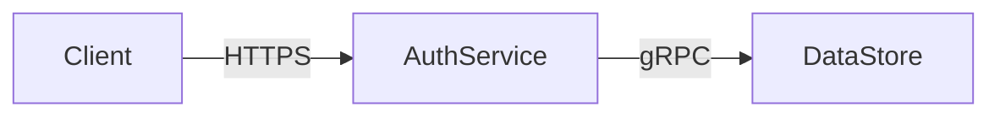
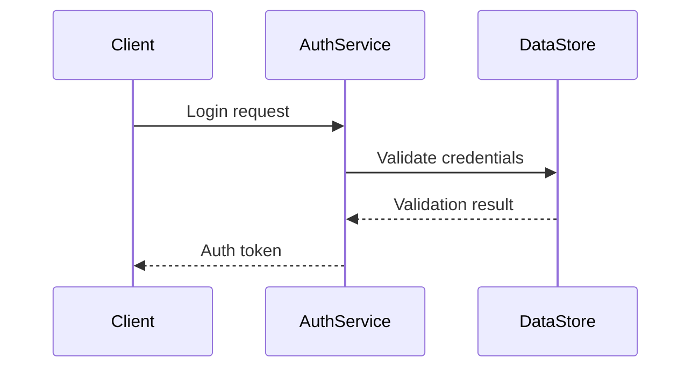

# AI-OS Architecture Specification - Part 11: Style Guide

## 1. Purpose

This style guide establishes the official writing, formatting, and documentation standards for the AI-OS Architecture Specification, Part 11 and all future architecture documents. It ensures consistency, clarity, and professionalism across the entire AI-OS documentation set. By adhering to this guide, authors produce implementation-independent, architecture-first documentation that aligns with Parts 1–10 and meets publication-quality standards.

## 2. Writing Philosophy

The AI-OS Architecture Specification follows an architecture-first approach where structural and behavioral constraints precede implementation details. Writing must:

- Prioritize **what** the system must do over **how** it is implemented
- Focus on invariants, contracts, and emergent properties rather than mechanisms
- Use precise, deterministic language that avoids ambiguity
- Maintain separation between architectural decisions and engineering guidance
- Preserve traceability to requirements and architectural principles
- Employ consistent terminology that enables unambiguous interpretation
- Support long-term maintenance through clear, self-documenting structure

## 3. Architecture Documentation Principles

All architecture documentation must adhere to these core principles:

### 3.1 Implementation Independence
Describe system properties without referencing specific technologies, frameworks, or implementation techniques unless absolutely necessary for understanding architectural intent. When implementation details are included, they must be clearly marked as non-normative examples.

### 3.2 Architecture-First Writing
Begin with structural and behavioral constraints (components, connectors, interactions, invariants) before discussing performance, security, or other quality attributes. Implementation considerations appear only in dedicated non-normative sections.

### 3.3 Deterministic Terminology
Use terms consistently and precisely throughout the document. Each term must have a single, well-defined meaning within the architecture context. Ambiguous or overloaded terms are prohibited without explicit disambiguation.

### 3.4 Terminology Integrity
Prevent synonym drift by maintaining a single term for each architectural concept. Prohibit synonymous terms for architectural elements without explicit architecture review board approval. Ensure all terminology aligns with the established glossary.

### 3.5 Traceability
Maintain clear traceability between architectural elements, requirements, and design decisions. Every significant architectural decision shall be documented with its rationale, alternatives considered, and consequences.

### 3.6 Completeness and Consistency
Ensure all architectural views are complete within their scope and consistent with each other. Contradictions between views must be resolved or explicitly justified.

## 4. RFC 2119 Terminology

The key words "MUST", "MUST NOT", "REQUIRED", "SHALL", "SHALL NOT", "SHOULD", "SHOULD NOT", "RECOMMENDED", "MAY", and "OPTIONAL" in this document are to be interpreted as described in RFC 2119.

- **MUST**: Absolute requirement
- **MUST NOT**: Absolute prohibition
- **REQUIRED**: Synonym for MUST
- **SHALL**: Synonym for MUST
- **SHALL NOT**: Synonym for MUST NOT
- **SHOULD**: Strong recommendation (may be ignored with justification)
- **SHOULD NOT**: Strong recommendation against (may be done with justification)
- **RECOMMENDED**: Synonym for SHOULD
- **MAY**: Truly optional
- **OPTIONAL**: Synonym for MAY

These terms apply only to architectural requirements and constraints. They do not apply to non-normative guidance, examples, or explanatory text.

## 5. Heading Standards

Use ATX-style heading syntax (# heading) with exactly one space between the hash marks and heading text. Heading levels follow this hierarchy:

- `#`: Document title (only used once per document)
- `##`: Major sections (e.g., Purpose, Writing Philosophy)
- `###`: Subsections
- `####`: Sub-subsections
- `#####`: Sub-sub-subsections (avoid when possible)
- `######`: Sixth level (strongly discouraged)

### 5.1 Heading Requirements
- Headings must be concise and descriptive
- Avoid punctuation in headings except colons for subtitles
- Use title case for major sections, sentence case for subsections
- Number headings automatically via document processing tools (do not manually number)
- Ensure heading levels are sequential (no skipping levels)

### 5.2 Heading Examples
```markdown
## Purpose
### Writing Philosophy
#### Architecture-First Approach
```

## 6. Section Structure

Each major section follows this structure when applicable:

1. **Summary Statement**: One or two sentences defining the section's purpose
2. **Normative Content**: Requirements, constraints, and principles (using RFC 2119 keywords)
3. **Explanatory Text**: Rationale, implications, and context
4. **Examples**: Non-normative illustrations (clearly marked as "Illustrative Example (Non-Normative)")
5. **Cross-References**: Links to related sections or external documents
6. **Summary**: Brief recap of key points (optional for short sections)

### 6.1 Section Length
- Major sections: 10-50 lines
- Subsections: 5-20 lines
- Avoid sections longer than 100 lines without clear subdivision

## 7. Paragraph Style

### 7.1 Sentence Construction
- Write complete sentences with subject, verb, and object
- Keep sentences under 25 words when possible
- Use active voice: "The system shall..." not "It shall be required that..."
- Avoid nominalizations: use "verify" instead of "perform verification of"
- Eliminate redundant phrases: "in order to" → "to", "due to the fact that" → "because"

### 7.2 Clarity and Precision
- Define terms before first use
- Use positive statements: "The component MUST..." not "The component MUST NOT fail to..."
- Avoid vague quantifiers: use specific numbers or ranges instead of "several", "many"
- Prefer simple words: "use" instead of "utilize", "show" instead of "demonstrate"

### 7.3 Tone
- Formal but accessible
- Objective and impersonal
- Confident and authoritative
- Free of humor, sarcasm, or colloquialisms

## 8. Terminology Standards

Establish and maintain rigorous terminology standards to prevent ambiguity and ensure precise communication.

### 8.1 Term Definition
- Define every specialized term upon first use in the document
- Include definitions in the Glossary (Section 20)
- Use the same term consistently for the same concept throughout all documents
- Prohibit synonyms for architectural concepts without explicit justification and approval

### 8.2 Acronyms and Abbreviations
- Spell out acronyms on first use: "Artificial Intelligence Operating System (AI-OS)"
- Use acronyms exclusively after first definition
- Maintain an acronym list in the Glossary
- Avoid obscure or domain-specific acronyms without clear expansion

### 8.3 Preferred Architectural Terms
Use these standardized terms consistently:
- **component**: Replaceable part of the system with well-defined interfaces
- **connector**: Mechanism enabling communication between components
- **interface**: Contract specifying inputs, outputs, and behavior
- **invariant**: Condition that always holds true during system operation
- **contract**: Formal specification of component obligations and expectations
- **property**: Characteristic or attribute of the system or its parts
- **constraint**: Limitation or restriction on system design or behavior
- **guidance**: Recommended practice (non-binding)
- **requirement**: Mandatory specification (binding)

### 8.4 Prohibited Terminology Practices
- **Synonym drift**: Using different terms for the same concept (e.g., alternating between "service" and "component" for the same architectural element)
- **Ambiguous terminology**: Using terms like "efficient", "fast", "scalable", "robust", "reliable", "secure" without precise, measurable definitions
- **Inconsistent naming**: Using different naming conventions for similar architectural elements
- **Value judgments**: Using terms like "modern", "legacy", "best practice" without architectural justification

## 9. Tables

Use tables only for presenting structured data that cannot be conveyed effectively in paragraphs.

### 9.1 Table Format
- Use GitHub Flavored Markdown table syntax
- Include a header row with column descriptions
- Align numeric data right, text left
- Keep tables narrow enough to fit on standard page width
- Avoid merged cells; restructure data instead

### 9.2 Table Caption
- Every table MUST have a caption below it in italics
- Caption format: *Table X.Y: Descriptive title*
- Number tables sequentially within each major section (X.Y where X=section number, Y=table number in section)

### 9.3 Example
```markdown
| Component | Interface | Protocol |
|-----------|-----------|----------|
| AuthService | REST API  | HTTPS    |
| DataStore   | gRPC      | TCP      |

*Table 3.1: Core component interfaces*
```

## 10. Lists

Use lists to present related items where order or grouping adds clarity.

### 10.1 List Types
- **Ordered lists** (`1.`): For sequential steps or prioritized items
- **Unordered lists** (`-` or `*`): For equivalent items where order doesn't matter
- **Description lists**: Not natively supported in Markdown; use bolded terms followed by colons

### 10.2 List Formatting
- Indent list items consistently (2 spaces or tab)
- Keep list items concise; move lengthy explanations to paragraphs
- Use parallel structure: all items should follow the same grammatical pattern
- Limit nesting to two levels maximum

### 10.3 Example
```markdown
- Principle 1: Implementation independence
  - Sub-principle A: Technology neutrality
  - Sub-principle B: Interface-focused design
- Principle 2: Deterministic terminology
```

## 11. Diagrams

Diagrams complement textual descriptions but never replace them. All architectural information MUST be present in the text; diagrams are supplementary.

### 11.1 Diagram Principles
- Every diagram MUST be referenced and explained in the text
- Diagrams MUST not contain information not found in the accompanying text
- Use consistent notation and symbols across all diagrams
- Prefer standard architectural notations (UML, ArchiMate, C4) when applicable
- Keep diagrams simple: focus on one aspect per diagram

### 11.2 Diagram Format
- Embed diagrams as code blocks with language identifier `mermaid` or `dot`
- Provide alternative text description for accessibility
- Number diagrams sequentially per section: *Figure X.Y: Description*
- Include diagram number and title below the diagram in italics

### 11.3 Example
```markdown

*Figure 4.2: Component interaction diagram*
```

## 12. Mermaid Standards

When using Mermaid for diagrams, follow these standards focused on clarity and accessibility.

### 12.1 Syntax
- Use Mermaid version 10.0 or later syntax
- Prefer flowchart, sequence, and state diagrams for architecture
- Use consistent node shapes and line styles for similar elements
- Keep node labels concise (under 3 words when possible)
- Use directional arrows to indicate flow or dependency

### 12.2 Recommended Diagram Types
- **Flowchart**: Component interactions, data flow
- **SequenceDiagram**: Temporal interactions, protocols
- **StateDiagram**: Behavioral modes, lifecycle
- **ClassDiagram**: Structural relationships (use sparingly)

### 12.3 Styling Guidelines (Accessibility-Focused)
- Ensure sufficient color contrast for text and lines (minimum 4.5:1 ratio)
- Use patterns or styles in addition to color to distinguish elements
- Avoid relying solely on color to convey meaning
- Use default Mermaid themes unless organizational accessibility standards require specific adaptations
- Prioritize readability over decorative styling

### 12.4 Example (Accessibility Considerations)
```markdown

*Figure 5.1: Authentication sequence*
```

## 13. Behavioural Contracts

Specify component interactions using formal behavioural contracts focused on architectural responsibilities and constraints.

### 13.1 Contract Structure
Every behavioural contract MUST include:
- **Preconditions**: Conditions that must be true before invocation (focusing on system state and input validity)
- **Postconditions**: Conditions guaranteed to be true after completion (focusing on guaranteed outcomes and system state)
- **Invariants**: Conditions that remain true throughout execution (architectural constraints that must always hold)
- **Side Effects**: Observable changes to system state that affect other components or system properties
- **Exceptions**: Conditions under which the contract is violated (focusing on architectural violations, not implementation errors)

### 13.2 Notation
Use structured natural language for contracts focused on architectural intent:
```markdown
**Contract**: ComponentA.operation(input: Type) -> OutputType
- **Precondition**: input != null && system.state == READY
- **Postcondition**: return value != null && system.state == PROCESSED
- **Invariant**: system.securityLevel >= input.sensitivity
- **Side Effects**: Updates audit log (for audit trail integrity), updates cache state (for performance optimization)
- **Exceptions**: 
  - SecurityViolation: if input.sensitivity > system.securityLevel (violates security partitioning)
  - ValidationFailure: if input fails schema validation (violates input contract)
```

### 13.3 Contract Placement
- Define contracts in the component specification section
- Reference contracts in interaction diagrams
- Include contracts in interface definitions
- Focus on what the component guarantees architecturally, not how it achieves it

## 14. Runtime Invariants

Specify system properties that must hold during execution, focusing on architectural guarantees.

### 14.1 Invariant Characteristics
- Must be true in all reachable states (architectural guarantee, not implementation detail)
- Must be verifiable through monitoring, assertions, or architectural review
- Should be expressed as boolean conditions using architectural terms
- Must not reference implementation-specific variables unless abstracted to architectural level

### 14.2 Invariant Format
Use this template for invariants focused on architectural properties:
```markdown
**Invariant**: [Architectural description of what must always hold true]
- **Formal Expression**: [Boolean condition using architectural terms and components]
- **Scope**: [Architectural boundaries or components where invariant applies]
- **Verification**: [How the invariant is checked at architectural level: monitoring points, interface contracts, etc.]
- **Consequence of Violation**: [Architectural impact when invariant fails: which guarantees are broken, what safety properties fail]
```

### 14.3 Example
```markdown
**Invariant**: No single point of failure in critical data path
- **Formal Expression**: ∀c ∈ CriticalComponents: redundancy(c) ≥ 2
- **Scope**: All components in the data processing pipeline (from Ingestion to Storage)
- **Verification**: Health check endpoints on each component; load balancer failover mechanisms
- **Consequence of Violation**: Loss of fault tolerance guarantee; system may lose data during component failure
```

## 15. Architecture vs Engineering Guidance

Maintain strict separation between architectural decisions and engineering advice.

### 15.1 Architectural Content (Normative)
- Component responsibilities and interfaces (what they do, not how)
- Interaction patterns and protocols (constraints on communication)
- Quality attribute requirements (performance, security, etc. as measurable constraints)
- Constraints on technology choices (what must be avoided or required)
- Invariants and behavioural contracts (architectural guarantees)
- Deployment and structural constraints (how components relate physically/logically)

### 15.2 Engineering Guidance (Non-Normative)
- Specific technology recommendations (products, versions, vendors)
- Implementation patterns and anti-patterns
- Performance optimization techniques
- Testing strategies
- Debugging tips
- Tool and framework suggestions
- Code-level examples

### 15.3 Marking Non-Normative Content
All engineering guidance MUST be clearly marked:
```markdown
> **Engineering Guidance**: This section provides non-normative implementation suggestions.
> 
> - Consider using Redis for caching layer (implementation detail)
> - Implement circuit breaker pattern for service resilience (implementation technique)
> - Use OpenTelemetry for distributed tracing (tooling recommendation)
```

## 16. Examples

Use examples to clarify concepts without establishing requirements. All examples must be clearly marked as non-normative.

### 16.1 Example Format
- Precede examples with clear labeling: "**Illustrative Example (Non-Normative)**:"
- Use block quotes or fenced code blocks for multi-line examples
- Keep examples focused on illustrating one concept
- Label examples numerically within sections: *Example 7.3: Cache invalidation pattern*
- Clearly state when examples are non-normative and do not establish requirements

### 16.2 Example Types
- **Illustrative examples**: Show how a concept might be applied (non-normative)
- **Counterexamples**: Demonstrate what violates a principle (non-normative)
- **Code snippets**: Only when absolutely necessary to illustrate interface usage (mark as non-normative)
- **Configuration samples**: Show format without endorsing specific values (non-normative)

### 16.3 Example Marking
```markdown
**Illustrative Example (Non-Normative) 8.1**: REST API versioning
```http
GET /api/v1/users/123
Accept: application/json
```
*This example illustrates versioned endpoint access but does not mandate REST or versioning format.*
```

## 17. Non-Normative Content

Clearly distinguish between normative requirements and informative guidance.

### 17.1 Identification
All non-normative content MUST be identified by one of these methods:
- Blockquotes with "> **Engineering Guidance**:"
- Admonitions: "> **Note**:", "> **Example**:", "> **Warning**:"
- Separate sections labeled "Non-Normative Guidance" or "Implementation Considerations"
- Introductory phrases: "For example,", "As an illustration,", "One approach is..."
- Explicit labeling: "**Illustrative Example (Non-Normative)**:"

### 17.2 Placement
- Place non-normative content after related normative requirements
- Avoid embedding non-normative content within normative paragraphs
- Group related guidance in dedicated subsections
- Never use non-normative content to contradict or weaken normative statements

### 17.3 Length Limit
Non-normative sections should not exceed 30% of total document length.

## 18. Cross References

Enable navigation between related concepts and documents.

### 18.1 Internal References
- Reference sections by title: "see Writing Philosophy (Section 2)"
- Use relative paths for intra-document links: `[Writing Philosophy](#writing-philosophy)`
- Reference figures and tables by number: "see Table 3.1"
- Maintain reference accuracy during document revisions

### 18.2 External References
- Reference other AI-OS specification parts: "see AI-OS Architecture Specification, Part 3: Security"
- Reference external standards with proper citation: "[ISO/IEC 42010:2022]"
- Use footnotes for detailed external references when appropriate
- Validate all external links quarterly

### 18.3 Reference Format
```markdown
As defined in [Part 3: Security](#part-3-security) [^1]...
...
[^1]: AI-OS Architecture Specification, Part 3: Security, version 1.2, 2026-06-01
```

## 19. Figures

All visual elements including diagrams, charts, and illustrations.

### 19.1 Figure Requirements
- Every figure MUST be referenced in the text before its appearance
- Figures MUST convey information that supplements (not duplicates) what the text alone cannot efficiently show
- Avoid decorative figures; every figure must have explanatory value
- Ensure figures are accessible: provide alt text descriptions
- Maintain consistent sizing and styling across document

### 19.2 Figure Caption
- Format: *Figure X.Y: Descriptive caption*
- Number figures sequentially per section
- Place caption immediately below figure
- Captions must be concise yet descriptive (under 20 words when possible)

### 19.3 Example
```markdown

*Figure 10.1: Layered architecture showing data flow between presentation, application, and data layers*
```

## 20. Glossary References

Maintain a comprehensive glossary of terms, acronyms, and definitions.

### 20.1 Glossary Structure
- Alphabetical listing of terms
- Each entry: **Term**: Definition
- Acronyms listed under their expanded form: "Artificial Intelligence Operating System (AI-OS)"
- Include version information for terms that evolve
- Reference glossary entries on first use: `[[Term]]` (if using glossary-aware tools)

### 20.2 Glossary Entry Format
```markdown
**Component**: A modular, replaceable part of the system that encapsulates behavior and data behind well-defined interfaces. Components interact exclusively through connectors and interfaces.

**Invariant**: A condition that is guaranteed to hold true during all valid system executions. Invariants are used to reason about system correctness and detect anomalies.

**AI-OS**: Artificial Intelligence Operating System. The overarching system specification comprising Parts 1 through 12.

**Interface**: A contract that specifies the inputs, outputs, and behavior expected from a component, without specifying internal implementation.
```

### 20.3 Glossary Maintenance
- Review and update glossary with each document revision
- Remove obsolete terms
- Resolve terminological conflicts through architecture review board
- Cross-reference related terms: "see also: [[Related Term]]"

## 21. Numbering Rules

Establish consistent numbering for easy reference.

### 21.1 Section Numbering
- Sections are numbered automatically by document processing tools
- Manual section numbering is prohibited
- Reference sections by title, not number, in text: "see the Writing Philosophy section"

### 21.2 Figure and Table Numbering
- Number figures and tables separately within each major section
- Format: X.Y where X = section number (from document structure), Y = sequential number within section
- Reset numbering at each new major section
- Example: Figure 3.2 refers to the second figure in section 3

### 21.3 Example and Listing Numbering
- Number examples, code listings, and similar constructs within sections
- Format follows same pattern as figures/tables: SectionNumber.SequentialNumber
- Use descriptive labels: "Example 5.1: Authentication flow"

### 21.4 Equation Numbering (if applicable)
- Number equations sequentially within sections
- Format: (X.Y.Z) where X=section, Y=subsection, Z=equation number
- Right-align equation numbers

## 22. Markdown Standards

Use GitHub Flavored Markdown (GFM) with these specific conventions.

### 22.1 File Format
- UTF-8 encoding without BOM
- LF line endings (Unix-style)
- No trailing whitespace
- Maximum line length: 100 characters (except URLs and code blocks)
- One blank line between paragraphs
- One blank line before and after lists, blockquotes, tables, and code blocks

### 22.2 Text Formatting
- **Bold**: For term definitions and emphasis on key concepts
- *Italic*: For figure/table captions, foreign words, and stress emphasis
- `Code`: For inline code, element names, and technical tokens
- ```Code blocks```: For multi-line code, configuration, and diagrams
- > Blockquotes: For notes, examples, guidance, and quotations

### 22.3 Prohibited Markdown
- HTML tags (except for accessibility attributes in images)
- Hard line breaks (two spaces at end of line)
- Emoji characters
- Non-standard emphasis (__underline__, ==highlight==)

### 22.4 Link Format
- Use reference-style links for frequently referenced destinations:
  ```markdown
  See [the security section][sec-ref] for details.
  ...
  [sec-ref]: #security-considerations "Security considerations"
  ```
- Use inline links for one-time references:
  ```markdown
  Refer to [ISO/IEC 42010:2022](https://www.iso.org/standard/81194.html) for architecture description frameworks.
  ```

## 23. AI-OS Naming Conventions

Establish consistent naming for architectural elements to prevent synonym drift and ensure clarity.

### 23.1 Component Names
- Use PascalCase: `AuthService`, `DataStore`, `MessageQueue`
- Prefix with subsystem when appropriate: `UiComponents`, `BackendApi`
- Avoid acronyms unless universally understood: `XMLParser` (not `XmlParser`)
- Names MUST be unique within their namespace
- Use consistent naming for similar components: `AuthService`, `PaymentService`, `NotificationService` (not mixed patterns)

### 23.2 Interface Names
- Use suffix `Interface`: `StorageInterface`, `NotificationInterface`
- OR use prefix `I`: `IStorageService`, `INotificationService` (choose one convention and use consistently)
- Describe the contract, not the implementation: `DataRetrievalInterface` (not `GetDataFromDatabase`)

### 23.3 Connector Names
- Describe the mechanism: `HttpsRestConnector`, `GrpcBinaryConnector`
- Include protocol when relevant: `KafkaAsyncConnector`, `WebSocketJsonConnector`
- Use consistent separator: `PascalCaseWithNoSeparators`

### 23.4 Configuration Parameters
- Use snake_case: `max_connection_pool_size`, `request_timeout_ms`
- Group related parameters with common prefix: `cache_*`, `logging_*`
- Specify units in name when ambiguous: `timeout_ms`, `size_bytes`

### 23.5 Event and Message Names
- Use past tense for events: `UserAuthenticated`, `DataPersisted`
- Use imperative for commands: `ProcessPayment`, `ValidateUserInput`
- Prefix with domain when necessary: `OrderCreated`, `InventoryUpdated`

## 24. Editorial Standards

Ensure publication-quality documentation through rigorous editing.

### 24.1 Voice and Style
- Write in third person: "The system shall..." not "You shall..."
- Avoid first person plural: "We recommend..." → "Guidance recommends..."
- Use present tense for invariants and properties: "The component maintains..."
- Use future tense for requirements: "The system shall support..."

### 24.2 Grammar and Punctuation
- Use serial comma in lists: "A, B, and C"
- Hyphenate compound modifiers: "real-time processing", "high-availability system"
- Use en dashes for ranges: "5–10 milliseconds", "versions 1.0–2.0"
- Em dashes for parenthetical statements: "The invariant — though simple — prevents..."
- Semicolons to separate complex list items: "Components: AuthService; DataStore; MessageQueue"

### 24.3 Spelling and Terminology
- Use American English spelling consistently
- Consult project glossary for specialized terms
- Verify acronym expansions before first use
- Check for obsolete terminology in each revision

### 24.4 Review Process
- All documentation MUST undergo peer review
- Checklist compliance verified by architecture editor
- Automated linting for Markdown standards and link validity
- Version control required: all changes tracked in Git

## 25. Publication Checklist

Verify compliance before publication.

### 25.1 Content Checklist
- [ ] All requirements use RFC 2119 keywords correctly
- [ ] No implementation details in normative sections
- [ ] Every term is defined upon first use or in glossary
- [ ] No synonymous terms for architectural concepts without approval
- [ ] All figures and tables are referenced in text
- [ ] Architectural content is separated from engineering guidance
- [ ] Behavioural contracts are specified for all major interfaces
- [ ] Runtime invariants are documented for critical system properties
- [ ] Cross-references are accurate and functional
- [ ] Examples are clearly marked as "Illustrative Example (Non-Normative)"
- [ ] Diagrams contain only information present in accompanying text
- [ ] Terminology is consistent throughout document
- [ ] Glossary is complete and updated

### 25.2 Formatting Checklist
- [ ] Consistent heading levels and styling
- [ ] Proper Markdown syntax throughout
- [ ] Correct figure/table numbering and captions
- [ ] Uniform list formatting and indentation
- [ ] Code blocks use appropriate language identifiers
- [ ] No trailing whitespace or hard line breaks
- [ ] Maximum line length observed (100 characters)
- [ ] UTF-8 encoding with LF line endings

### 25.3 Quality Checklist
- [ ] Clear, concise sentences (average <20 words)
- [ ] Active voice used predominantly
- [ ] Consistent terminology throughout (no synonym drift)
- [ ] Logical flow between sections
- [ ] No contradictions between documented views
- [ ] Appropriate level of detail for audience
- [ ] Professional tone maintained
- [ ] Spelling and grammar verified
- [ ] All links validated (internal and external)
- [ ] Diagrams follow accessibility guidelines (contrast, non-color-dependent)
- [ ] Behavioral contracts focus on architectural guarantees
- [ ] Runtime invariants are verifiable architectural properties
- [ ] Document demonstrates implementation independence

### 25.4 Architecture-Specific Verification
- [ ] No implementation details leak into normative sections
- [ ] All architectural decisions traceable to requirements or principles
- [ ] Consistent with Parts 1-10 of AI-OS Architecture Specification
- [ ] Diagrams accurately reflect textual descriptions
- [ ] Cross-part terminology alignment verified

### 25.5 Approval
- [ ] Reviewed by architecture working group
- [ ] Approved by Chief Architect
- [ ] Version number incremented according to change significance
- [ ] Release notes documented
- [ ] Published to designated repository

---
*This style guide enforces implementation independence, architecture-first writing, consistency with Parts 1–10, deterministic terminology, and publication-quality documentation for the AI-OS Architecture Specification.*

*Version 2.0 | Approved 2026-08-05 | Chief Architecture Office*