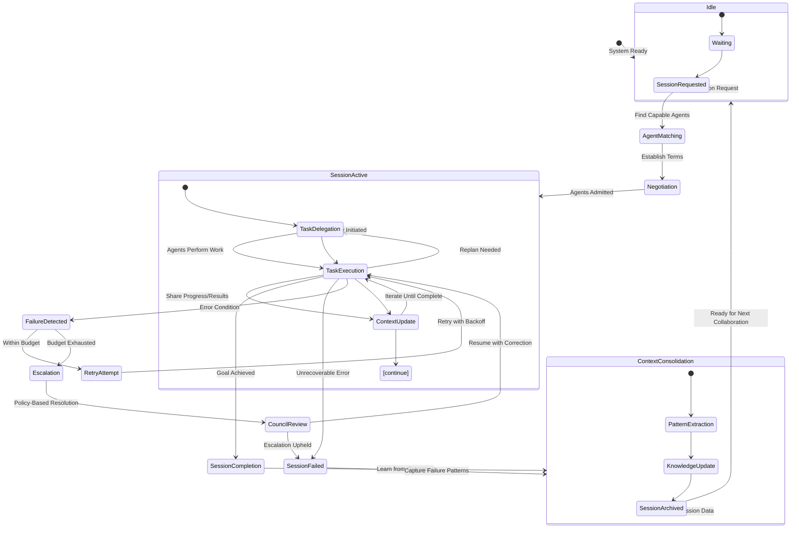
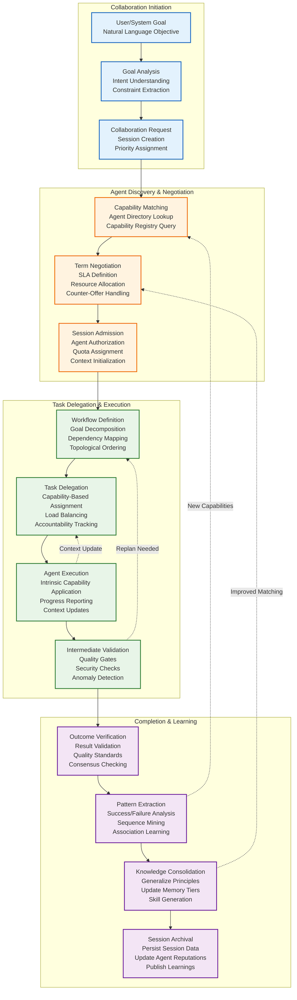

# Part 12.1: Architecture Overview

> **Purpose**: This document provides a high-level architectural overview of the AI-OS Multi-Agent Collaboration Framework. It defines the core components, their interactions, and the foundational principles that enable safe, scalable, and efficient collaboration among autonomous agents within the AI-OS ecosystem.

---

## 1. Introduction

Modern AI systems increasingly rely on collections of specialized agents working together to achieve complex objectives that exceed the capabilities of any single agent. The Multi-Agent Collaboration Architecture in Part 12 provides the substrate for this cooperation, transforming AI-OS from a collection of intelligent components into a unified, cooperative system capable of dynamic team formation, goal-directed execution, and adaptive problem-solving.

This architecture addresses the fundamental challenges of distributed agent systems: discovery, communication, coordination, conflict resolution, and shared state management—while maintaining agent autonomy and adhering to strict security and observability requirements.

---

## 2. Why Multi-Agent Collaboration Exists

### Problems Solved

The collaboration architecture solves the following critical problems in agent-based systems:

| Problem | Description | Solution |
|---------|-------------|----------|
| **Agent Isolation** | Agents operate in isolation without mechanisms to find complementary capabilities | Agent Directory and Capability Registry enable discovery and matchmaking |
| **Ad Hoc Coordination** | Lack of structured mechanisms for task delegation and workflow orchestration | Delegation Manager and Workflow Manager provide systematic task breakdown and execution |
| **Inconsistent Shared State** | Agents maintain conflicting views of collaboration context | Shared Context Manager ensures consistency through CRDTs and access controls |
| **Unresolvable Conflicts** | Disagreements over resources, goals, or methods halt progress | Conflict Resolution Manager and Council Manager provide mediation and governance |
| **Communication Chaos** | Unstructured communication leads to missed messages and duplication | Communication Bus provides ordered, secure event routing with session scoping |
| **Resource Contention** | Uncoordinated resource consumption causes starvation and overload | Collaboration Scheduler and Resource Coordinator enforce fair allocation and quotas |
| **Governance Vacuum** | No mechanisms for policy enforcement or dispute escalation | Council Manager establishes collaborative policies with escalation paths |

These problems are addressed through a layered, event-driven architecture that separates concerns while enabling seamless integration.

---

## 3. Design Philosophy

The collaboration architecture is guided by these core principles:

1. **Autonomy Preservation**: Agents retain full control over internal state and decision-making
2. **Explicit Contracts**: All collaboration intentions, capabilities, and policies are discoverable and versioned
3. **Minimal Coupling**: Components communicate exclusively through well-defined interfaces
4. **Failure Expectation**: Design assumes partial failures and builds in graceful degradation
5. **Observability-First**: Every significant collaboration action produces traceable, auditable events
6. **Security Integration**: Security considerations are integrated at every layer and boundary
7. **Evolutionary Compatibility**: Changes maintain backward compatibility for at least two major versions
8. **Agent-Centric Perspective**: Design originates from the agent's viewpoint of capabilities and availability
9. **Pragmatic Simplicity**: Prefer simple, understandable mechanisms over complex alternatives
10. **Feedback-Driven Improvement**: Collaboration patterns inform system evolution through learning loops

---

## 4. Architectural Goals

The collaboration architecture aims to achieve these specific goals:

- **Dynamic Team Formation**: Agents self-organize based on declared capabilities, availability, and reputation within 100ms
- **Trust-Domain Interoperability**: Transparent collaboration across isolated security boundaries with policy-controlled information flow
- **Predictable Behavior**: Deterministic outcomes under varying load and failure conditions through state immutability and event sourcing
- **Evolutionary Compatibility**: Collaboration patterns can evolve without breaking existing integrations via semantic versioning
- **Decentralized Governance**: No single point of control; decisions emerge from consensus mechanisms and policy frameworks
- **Observable Coordination**: Every significant collaboration action is traceable and auditable for forensic analysis
- **Resource Efficiency**: Collaboration overhead minimized relative to value delivered through adaptive scheduling
- **Fault Resilience**: Collaborations gracefully handle partial failures with automatic recovery mechanisms
- **Scalable Concurrency**: Support for up to 10,000 concurrently collaborating agents with linear resource scaling
- **Standards Compliance**: Technology-neutral interfaces enabling polyglot implementations and third-party integration

---

## 5. Collaboration Lifecycle

A collaboration session follows a well-defined lifecycle with explicit phases:

**Lifecycle Phases Description**:

1. **Idle**: System ready, no active collaborations
2. **SessionRequested**: Collaboration initiated via goal submission or external trigger
3. **AgentMatching**: Collaboration Manager identifies agents matching capability requirements
4. **Negotiation**: Terms established via Negotiation Engine (SLAs, resource allocations)
5. **SessionActive**: Agents admitted and collaboration begins
6. **TaskDelegation**: Workflow Manager breaks goal into delegatable tasks
7. **TaskExecution**: Agents perform assigned work using their intrinsic capabilities
8. **ContextUpdate**: Progress and results shared via Shared Context Manager
9. **SessionCompletion**: Goal achieved, collaboration concludes successfully
10. **SessionFailed**: Unrecoverable error terminates collaboration
11. **ContextConsolidation**: Outcomes analyzed for learning and pattern extraction
12. **SessionArchived**: Session data persisted to long-term memory for future reference

Each phase produces canonical events that enable observability, checkpointing, and recovery.

---

## 6. Agent Ecosystem

The collaboration architecture treats agents as first-class participants with standardized interfaces:

### Agent Characteristics
- **Capabilities**: Self-described via standardized schemas in the Capability Registry
- **Availability**: Published through the Agent Directory with health and load metrics
- **Reputation**: Tracked via Council Manager for trust-based matchmaking
- **Isolation**: Execute in supervised runtimes with enforced resource quotas (Part 1)
- **Communication**: Participate via the Collaboration Bus with session-scoped subscriptions
- **Autonomy**: Retain full control over internal reasoning and decision processes

### Agent Types
While Part 12 does not define internal agent architectures, it supports these collaboration-oriented agent roles:
- **Specialist Agents**: Domain-experts offering specific capabilities (e.g., CodeGenerator, SecurityAnalyzer)
- **Orchestrator Agents**: Specialize in task decomposition and workflow coordination
- **Guardian Agents**: Focus on safety, compliance, and risk assessment
- **Learning Agents**: Specialize in experience consolidation and knowledge generation
- **Mediator Agents**: Excel at conflict resolution and consensus building

Agents discover collaboration opportunities through the Agent Directory and declare their participation via capability advertisements.

---

## 7. Interaction Model

All inter-agent and agent-manager communication follows an event-driven model:

### Communication Primitives
1. **Event Publishing**: Agents and managers publish typed events to the Collaboration Bus
2. **Subscription-Based Reception**: Components declare interest in specific event types
3. **Correlation Tracking**: Events carry causation and correlation IDs for end-to-end tracing
4. **Session Scoping**: All collaboration events are scoped to a specific session ID
5. **Priority Queuing**: Critical events (e.g., failure notifications) receive priority handling
6. **Dead-Letter Handling**: Persistently failed deliveries routed for manual intervention

### Interaction Patterns
- **Request/Reply**: For synchronous coordination requiring immediate response
- **Publish/Subscribe**: For broadcasting state changes to interested parties
- **Pipeline**: For sequential task execution where output of one step feeds the next
- **Broadcast/Collect**: For fan-out/fan-in patterns in parallel processing
- **Consensus**: For multi-agent agreement on shared state or decisions

All patterns are built atop the fundamental event exchange mechanism, ensuring uniform observability and error handling.

---

## 8. Collaboration Boundaries

The collaboration architecture defines clear boundaries to maintain system integrity:

### Internal Boundaries
| Boundary | Enforcement Mechanism |
|----------|----------------------|
| **Agent Runtime Separation** | Agents execute in isolated sandboxes; managers never invoke agent-internal logic |
| **Session Context Isolation** | Shared context accessible only to admitted session participants |
| **Policy Enforcement Boundary** | Council Manager mediates all cross-policy interactions |
| **Resource Quota Boundary** | Resource Manager prevents collaboration-induced starvation |
| **EventBus Subscription Boundary** | Components restricted to declared event subscriptions |

### External Boundaries
| Boundary | Enforcement Mechanism |
|----------|----------------------|
| **Third-Party Agent Admission** | Cryptographic identity verification before Capability Registry publication |
| **Information Egress Control** | Shared context access governed by role-based policies |
| **Trust Domain Separation** | No implicit trust; every interaction validated via security framework (Part 2) |
| **Audit Trail Integrity** | All cross-boundary interactions produce tamper-evident logs |
| **Extension Point Governance** | Plugins access only defined interfaces; no kernel internals exposure |

These boundaries ensure that collaboration enhances rather than compromises system security and stability.

---

## 9. Integration with AI-OS Subsystems

### 9.1 Integration with Runtime (Part 11)
The collaboration architecture leverages Part 11's monitoring and observability through:
- **Health Dashboards**: Real-time visualization of collaboration session metrics
- **Distributed Tracing**: End-to-end tracking of task delegation and execution flows
- **Alerting**: Anomaly detection in collaboration latency, error rates, and resource usage
- **SLI/SLO Tracking**: Service level objectives for collaboration performance (e.g., 95% of interactions <100ms)
- **Health Checks**: Every collaboration component exposes liveness and readiness endpoints
- **Metrics Collection**: Collaboration-specific counters (active sessions, delegate tasks, context updates)

Part 11 provides the observability substrate that makes collaboration behavior visible and actionable.

### 9.2 Integration with Memory (Parts 9-10)
Collaboration interacts with the five-tier memory architecture as follows:
- **Working Memory**: Volatile session-scoped context for active agent reasoning
- **Claude Memory**: Semi-persistent agent-scoped conversation history and session state
- **Engineering Intelligence**: Persistent storage of collaboration patterns and best practices
- **Obsidian Memory**: Archival of collaboration session records, ADRs, and meeting notes
- **Graphify Memory**: Knowledge graph of agent capabilities, collaboration histories, and trust relationships

The Shared Context Manager coordinates with the MemoryManager to ensure appropriate tier placement based on volatility, scope, and access patterns.

### 9.3 Integration with Workflow Engine (Part 9)
Collaboration extends Part 9's workflow capabilities through:
- **Multi-Agent Workflows**: Workflow Manager orchestrates tasks across multiple agents
- **Dependency Tracking**: Cross-agent dependencies modeled as first-class workflow elements
- **Compensation Handling**: Workflow rollback includes agent-specific releasement and context cleanup
- **Checkpointing**: Workflow state includes shared context snapshots and agent progress markers
- **Adaptive Replanning**: Workflow modification based on collaboration feedback and changing conditions
- **Skill Integration**: Workflow steps specify required capabilities matched against the Capability Registry

This integration enables sophisticated, goal-driven processes that span human and machine agents.

### 9.4 Integration with Councils (Part 5)
Collaboration governance relies on Council mechanisms:
- **Policy Establishment**: Collaboration policies (timeouts, resource limits, security) defined via Council Service
- **Decision Escalation**: Unresolvable conflicts elevated to appropriate council (Architecture, Engineering, etc.)
- **Reputation Management**: Council Manager maintains agent trust scores influencing future matchmaking
- **Audit Trail Generation**: Councils produce immutable records of collaboration governance decisions
- **Adaptive Policies**: Collaboration rules evolve based on council deliberations and historical outcomes
- **Human Oversight**: FinalJudge provides ultimate appeal path for collaboration governance

This integration ensures collaboration adheres to organizational policies while maintaining decentralized decision-making.

---

## 10. High-Level Collaboration Pipeline

The typical collaboration flow follows this pipeline:

**Pipeline Characteristics**:
- **Event-Driven**: Each stage transition triggered by typed events on the Collaboration Bus
- **Observable**: Every stage produces structured logs with correlation IDs
- **Checkpointable**: System state saved at stage boundaries for recovery
- **Adaptable**: Feedback loops enable replanning and optimization mid-execution
- **Governed**: Policy checkpoints embedded at critical transitions
- **Resilient**: Failures trigger defined recovery paths without compromising session integrity

---

## 11. Design Principles

Beyond the core philosophy, these specific principles govern collaboration design:

### Structural Principles
- **Loose Coupling**: Components interact only through declared interfaces; no shared mutable state
- **High Cohesion**: Each component has a single, well-defined responsibility
- **Interface Segregation**: Collaboration interfaces are purpose-specific and minimal
- **Layered Architecture**: Clear separation of concerns between discovery, orchestration, execution, and governance

### Behavioral Principles
- **Idempotency**: Collaboration operations safe to retry without unintended side effects
- **Commutativity**: Where applicable, operation order does not affect final outcome
- **Monotonicity**: Shared context evolves only through additive updates where possible
- **Determinism**: Identical inputs produce identical outputs under controlled conditions
- **Progress Guarantee**: Fair scheduling ensures no agent starves indefinitely

### Operational Principles
- **Graceful Degradation**: Collaboration continues with reduced functionality during partial failures
- **Backpressure Sensitivity**: Components respect overload signals to prevent cascade failures
- **Resource Awareness**: All operations account for CPU, memory, token, and bandwidth costs
- **Session Boundedness**: Explicit lifecycle prevents resource leaks and zombie collaborations
- **Audit Completeness**: Every security-relevant action produces tamper-evident logs

These principles ensure collaboration enhances rather than compromises system reliability and maintainability.

---

## 12. Scalability Considerations

The architecture scales through these mechanisms:

### Horizontal Scaling
- **Component Replication**: Collaboration managers deployed as stateless services behind load balancers
- **Partitioned Registries**: Agent Directory and Capability Registry sharded by capability domain
- **Session Affinity**: Collaboration sessions routed to consistent manager instances via session ID hashing
- **Event Bus Sharding**: Collaboration events partitioned by session ID for parallel processing
- **Cache Layers**: Frequently accessed capability and agent information cached at edge nodes

### Vertical Scaling
- **Resource Pooling**: Managers dynamically allocate threads/connections based on collaboration load
- **Batch Processing**: Non-critical operations (e.g., metrics aggregation) batched for efficiency
- **Asynchronous Processing**: Long-running operations offloaded to worker queues
- **Lazy Initialization**: Components initialize only when first collaboration request arrives

### Performance Optimization
- **Event Collation**: Related events batched to reduce bus overhead
- **Context Delta Sharing**: Only context changes transmitted rather than full state
- **Predictive Pre-Warming**: Anticipate collaboration needs based on historical patterns
- **Connection Multiplexing**: Multiple collaboration sessions share underlying transports
- **Compression**: Event payloads compressed for bandwidth-constrained environments

### Scalability Targets
| Metric | Target | Mechanism |
|--------|--------|-----------|
| Concurrent Agents | 10,000+ | Horizontal scaling of managers and registries |
| Interaction Latency | ≤100ms (95%) | Event prioritization and co-located caching |
| Throughput | 100K events/sec | Horizontal event bus partitioning |
| Context Size | 1GB/session | Externalized storage with streaming access |
| Recovery Time | ≤30sec | Checkpointing and fast state reconstruction |

These targets ensure collaboration remains responsive even under substantial load.

---

## 13. Failure Isolation

The architecture isolates failures through these mechanisms:

### Failure Containment
- **Sandboxed Execution**: Agent failures confined to individual runtime sandboxes
- **Session Scoping**: Failures affect only the specific collaboration session
- **Circuit Breakers**: Managers temporarily halt requests to repeatedly failing components
- **Bulkheads**: Resource quotas prevent one session from exhausting system resources
- **Timeboxing**: Operations bounded by configurable timeouts to prevent hanging

### Failure Detection and Response
- **Health Checks**: Active monitoring of component liveness and readiness
- **Failure Events**: Canonical events (TaskFailed, AgentUnresponsive) trigger recovery paths
- **Retry Budgets**: Configurable attempt limits with exponential backoff and jitter
- **Dead Letter Queues**: Persistently failed events isolated for manual inspection
- **Fallback Protocols**: Alternate execution paths when primary methods fail

### Recovery Mechanisms
- **Checkpointing**: Workflow state and context snapshots enable rapid restoration
- **State Reconstruction**: Agents rebuild internal state from shared context and event logs
- **Graceful Restart**: Components drain in-flight work before shutdown and resume cleanly
- **Human Escalation**: Unrecoverable failures escalate to appropriate council for intervention
- **Compensation Logic**: Reversible operations automatically undone during rollback

These mechanisms ensure that failures remain localized and do not cascade through the collaboration system.

---

## 14. Future Extensibility

The collaboration architecture anticipates evolution through these extension points:

### Planned Enhancements
| Enhancement | Description | Target Version |
|-------------|-------------|----------------|
| Semantic Capability Matching | ML-based capability similarity beyond keyword matching | v1.3 |
| Predictive Session Pre-Staging | Anticipate collaboration needs and pre-warm resources | v1.5 |
| Adaptive Policy Optimization | ML-optimized collaboration policies based on outcomes | v2.0 |
| Hierarchical Council Structures | Domain-specific councils with regional/global scopes | v2.2 |
| Zero-Trust Native Collaboration | Built-in mutual attestation and encryption for all interactions | v2.5 |
| Cross-Organization Collaboration | Federated identity and policy exchange between organizations | v3.0 |
| Autonomous Team Formation | Agents self-organize without explicit goal specification | v3.5 |
| Emergent Collaboration Patterns | Discovery of novel collaboration strategies from system data | v4.0 |

### Extension Mechanisms
- **Interface Versioning**: All collaboration interfaces explicitly versioned for gradual migration
- **Plugin Architecture**: New collaboration capabilities added via discovered plugins
- **Policy-as-Code**: Collaboration policies defined in version-controlled repositories
- **Schema Evolution**: Additive-only schema changes with deprecation notices
- **Feature Flags**: Gradual rollout of new collaboration mechanisms
- **Observability Hooks**: Extension points for custom metrics and tracing

These mechanisms ensure the collaboration architecture can evolve while protecting existing investments.

---

## 15. Cross-References to Previous Parts

The collaboration architecture builds upon and integrates with these foundational parts:

| Part | Relationship | Specific Integration Points |
|------|-------------|-----------------------------|
| **Part 1** | Agent Runtime Foundation | Agent lifecycle hooks, resource isolation, basic messaging primitive |
| **Part 2** | Security Framework | Identity verification, token-based auth, ACL enforcement, audit logging |
| **Part 3** | Observability | Metrics collection, distributed tracing, logging standards |
| **Part 4** | Data Management & EventBus | Shared storage interfaces, EventBus as communication substrate, consistency models |
| **Part 5** | Configuration & Extensibility | Dynamic configuration, feature flags, service discovery for agent lookup |
| **Part 6** | Adaptive Behavior | Reasoning APIs for capability negotiation, behavioral adaptation based on outcomes |
| **Part 7** | Knowledge Management | Learning interfaces for collaborative model improvement, experience replay |
| **Part 8** | Planning & Goal Decomposition | Task decomposition services, goal hierarchy for multi-level objectives |
| **Part 9** | Specialized Agent Capabilities | Specialized agent interfaces for heterogeneous capabilities, Skill APIs |
| **Part 10** | Advanced Cognitive Architectures | Meta-reasoning for collaboration strategy evaluation, self-reflection for improvement |
| **Part 11** | Monitoring & Observability | Health dashboards, alerting, SLI/SLO tracking for collaboration performance |

Part 12 does not redefine these capabilities but specifies how collaboration components utilize and extend them to enable multi-agent cooperation.

---

## 16. Conclusion

The Multi-Agent Collaboration Architecture in Part 12 provides the essential substrate for transforming AI-OS from a collection of intelligent agents into a unified, cooperative system capable of solving complex, multifaceted problems. By defining clear components, standardized interactions, and robust integration points with the broader AI-OS architecture, this framework enables:

- **Dynamic Cooperation**: Agents find each other, negotiate terms, and work together toward shared goals
- **Reliable Orchestration**: Workflows span multiple agents with built-in failure handling and recovery
- **Governed Collaboration**: Policies and councils ensure collaboration adheres to organizational standards
- **Observable Operations**: Every collaboration action produces traceable, auditable events for monitoring and improvement
- **Evolutionary Compatibility**: The architecture adapts to emerging collaboration patterns while protecting existing investments

This collaboration layer is the critical enabler for the goal-driven execution, specialized agent capabilities, and domain-specific applications defined in Parts 13–15, making AI-OS a truly cooperative intelligence platform.

---
*Document Version: 1.0.0*
*Last Updated: 2026-08-08*
*Status: ACTIVE*
*AI-OS Architecture Specification v1.0*