# Part 12.10: Security Architecture

> **Purpose**: This document defines the comprehensive security architecture for the AI-OS Multi-Agent Collaboration Framework. It establishes zero-trust principles, identity management, authentication, authorization, encryption, secret management, and security governance specifically for multi-agent collaboration scenarios.

## 1. Introduction

The Multi-Agent Collaboration Framework introduces unique security challenges due to the distributed nature of autonomous agents, dynamic team formation, shared context exchange, and cross-boundary interactions. This security architecture provides defense-in-depth protection while enabling secure collaboration through verified identities, least-privilege access controls, encrypted communications, and continuous monitoring.

This architecture assumes a transition from the trusted single-tenant model specified in Part 0 §0.2.2 to a zero-trust model suitable for multi-agent collaboration, where no implicit trust exists between any components, agents, or services.

## 2. Security Architecture Overview

The security architecture follows a zero-trust model with multiple layered protections:

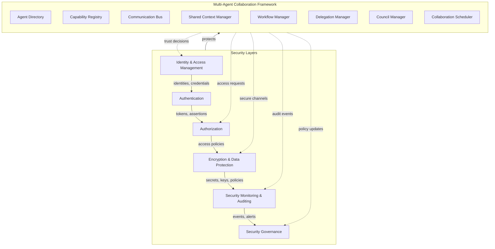

### 2.1 Core Security Principles

1. **Zero Trust**: Never trust, always verify - no implicit trust based on network location or component type
2. **Least Privilege**: Grant only the minimum permissions necessary for specific tasks
3. **Defense in Depth**: Multiple, overlapping security controls protect assets
4. **Assume Breach**: Design assumes potential compromise and focuses on detection and containment
5. **Explicit Verification**: Every access request requires authentication and authorization
6. **Micro-Segmentation**: Isolate workloads and limit lateral movement
7. **Data-Centric Security**: Protect data regardless of location or state
8. **Continuous Monitoring**: Real-time visibility into security events and anomalies

### 2.2 Security Domains

The collaboration framework operates across distinct security domains with controlled information flow:

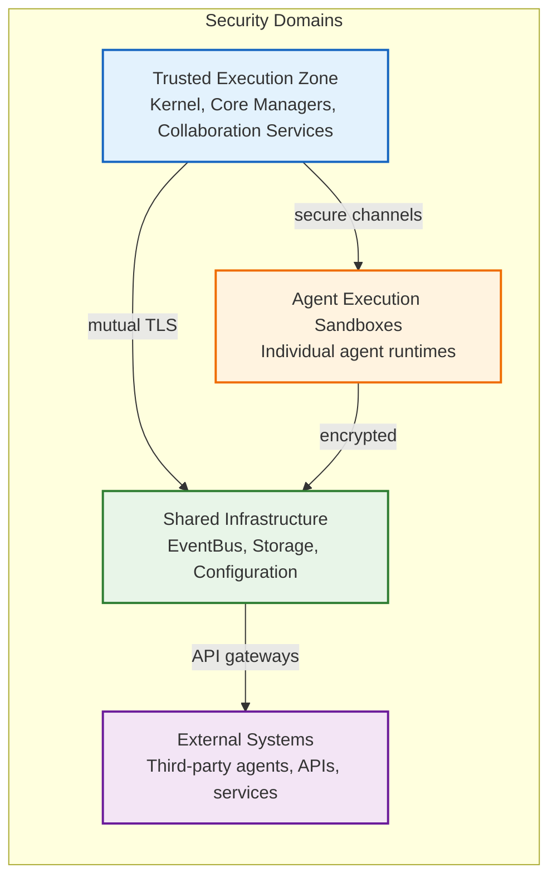

## 3. Zero Trust Principles

The collaboration framework implements zero trust through these specific principles:

### 3.1 Verify Explicitly
- All authentication and authorization decisions based on all available data points
- Identity, device health, service/workload, data classification, and anomalies
- No implicit trust granted based on network location or asset ownership

### 3.2 Use Least Privilege Access
- Just-in-time and just-enough-access (JIT/JEA)
- Risk-based adaptive policies
- Privilege elevation and delegation management
- Time-bound and approval-based access

### 3.3 Assume Breach
- Micro-sementation to limit blast radius
- Verify end-to-end encryption
- Use analytics to detect threats and improve defenses
- Assume components may be compromised and design accordingly

## 4. Agent Identity Architecture

### 4.1 Identity Model

Each agent possesses a verifiable identity consisting of:

```mermaid
graph TD
    subgraph AgentIdentity[Agent Identity]
        direction TB
        AgentID[Agent Identifier<br/>UUIDv7 - globally unique]
        IdentityDoc[Identity Document<br/>X.509 certificate or JWT]
        Attributes[Identity Attributes<br/>- Role<br/>- Capabilities<br/>- Trust Level<br/>- Affiliation<br/>- Security Clearance]
        Keys[Cryptographic Keys<br/>- Signing key (for attestation)<br/>- Encryption key (for communication)<br/>- Rotation schedule]
    end
    
    AgentID -->|binds to| IdentityDoc
    IdentityDoc -->|contains| Attributes
    IdentityDoc -->|signed by| Keys
```

### 4.2 Identity Lifecycle

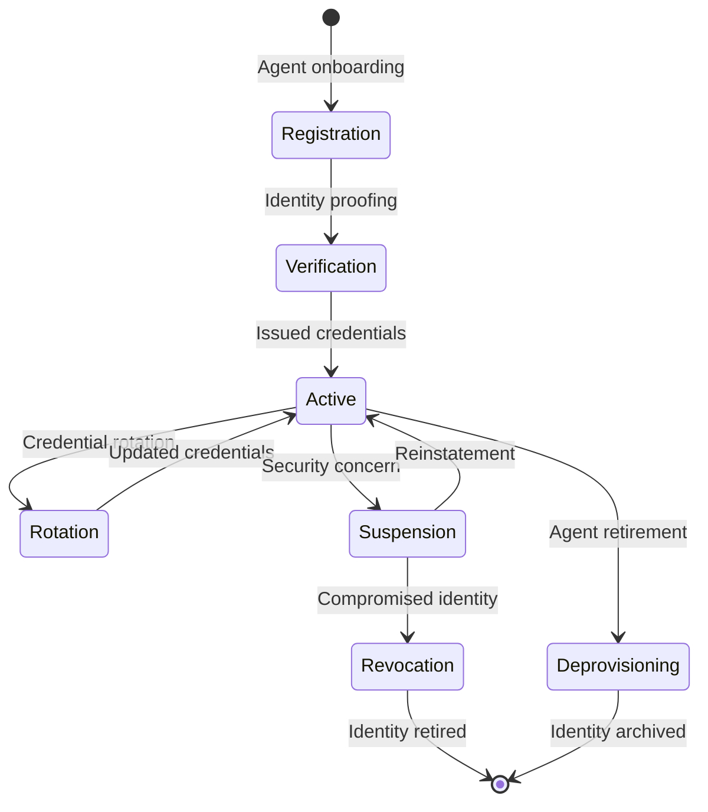

### 4.3 Identity Verification Requirements

- Cryptographic proof of possession of private key
- Validation against trusted identity provider
- Attribute validation (capabilities, roles, permissions)
- Revocation status checking (OCSP/CRL)
- Hardware-backed key attestation where available
- Continuous identity validation during session lifetime

## 5. Authentication Architecture

### 5.1 Authentication Factors

Multi-factor authentication required for agent admission and privileged operations:

1. **Something the agent possesses** (hardware token, certificate)
2. **Something the agent is** (attested capabilities, behavior baseline)
3. **Something the agent knows** (secrets, challenge-response)
4. **Somewhere the agent is** (environmental attestation, runtime measurements)

### 5.2 Authentication Protocols

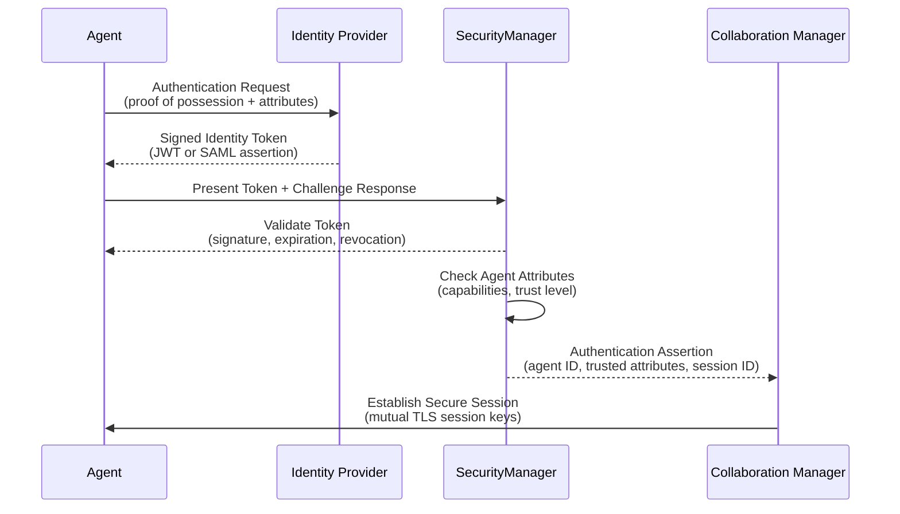

### 5.3 Token Types and Usage

| Token Type | Purpose | Format | Lifetime | Revocation Check |
|------------|---------|--------|----------|------------------|
| Access Token | Service-to-service access | JWT | 15 minutes | CRL/OCSP |
| ID Token | Identity verification | JWT | 24 hours | CRL/OCSP |
| Refresh Token | Obtain new access tokens | Encrypted UUID | 7 days | Immediate validation |
| Session Token | Collaboration session binding | JWT | Session duration | Server-side validation |
| Delegation Token | Delegated authority | JWT | Task duration | Policy validation |

### 5.4 Authentication Flow for Collaboration Sessions

1. Agent presents identity credentials to SecurityManager
2. SecurityManager validates tokens against identity provider
3. SecurityManager checks agent attributes against collaboration policies
4. SecurityManager issues session-bound delegation token
5. Agent presents delegation token to CollaborationManager for session admission
6. Mutual TLS established between agent and collaboration services
7. Continuous re-authentication performed at configured intervals

## 6. Authorization Architecture

### 6.1 Authorization Models

The framework implements both RBAC and ABAC for fine-grained authorization:

#### 6.1.1 Role-Based Access Control (RBAC)

Pre-defined roles aligned with collaboration functions:

| Role | Permissions | Typical Agents |
|------|-------------|----------------|
| Collaboration Participant | Read shared context, send messages, execute delegated tasks | Specialist agents |
| Task Delegator | Create tasks, assign agents, monitor progress | Orchestrator agents |
| Context Administrator | Read/write shared context, manage context policies | Guardian agents |
| Policy Administrator | Modify collaboration policies, manage trust scores | Council agents |
| Security Auditor | Read audit logs, view security metrics | Monitoring agents |
| Session Administrator | Create/terminate sessions, manage quotas | Runtime coordinators |

#### 6.1.2 Attribute-Based Access Control (ABAC)

Dynamic policies based on attributes:

```
IF (
    agent.role IN ["specialist", "orchestrator"] AND
    agent.trustLevel >= TRUST_LEVEL_HIGH AND
    resource.classification == "INTERNAL" AND
    environment.riskScore < RISK_THRESHOLD AND
    currentTime IN permittedHours
) THEN
    GRANT_ACCESS(resource, action)
ELSE
    DENY_ACCESS
```

### 6.2 Policy Enforcement Points (PEPs)

Authorization decisions enforced at multiple layers:

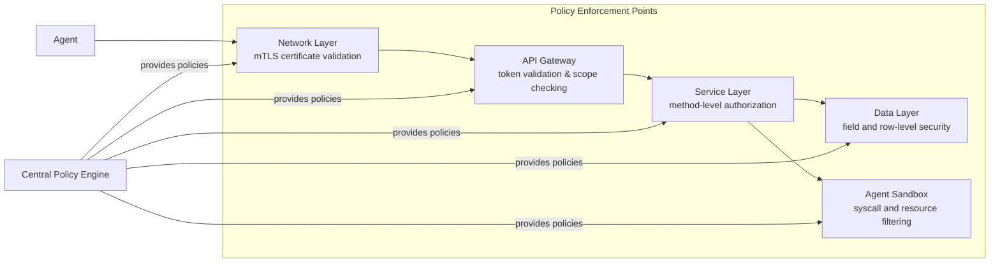

### 6.3 Authorization Decision Context

Each authorization decision considers:

- **Subject**: Agent identity, roles, attributes, delegation chain
- **Resource**: Target object, classification, sensitivity, owner
- **Action**: Requested operation (read, write, execute, delegate)
- **Environment**: Time, location, device state, threat level
- **Obligations**: Required actions post-decision (logging, encryption, notification)
- **Risk**: Current risk score, anomaly detection results

## 7. Trust Boundaries and Security Domains

### 7.1 Trust Boundary Definition

Trust boundaries exist where:
- Different trust levels apply
- Different security policies govern
- Data classification changes
- Privilege levels differ
- Network zones change

### 7.2 Boundary Protection Mechanisms

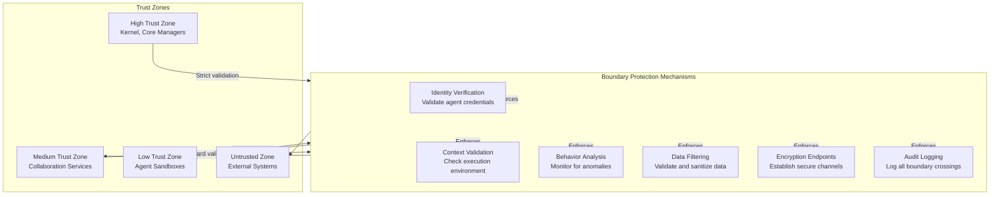

### 7.3 Inter-Agent Trust Model

Trust between agents established through:

1. **Identity Verification**: Cryptographic validation of agent identity
2. **Capability Attestation**: Verified declaration of agent capabilities
3. **Behavioral History**: Past collaboration performance and compliance
4. **Reputation Scores**: Community-based trust ratings from Council Manager
5. **Policy Compliance**: Adherence to collaboration policies and SLAs
6. **Continuous Monitoring**: Ongoing validation during collaboration

## 8. Secure Communication Architecture

### 8.1 Communication Encryption

All inter-agent and agent-service communication protected:

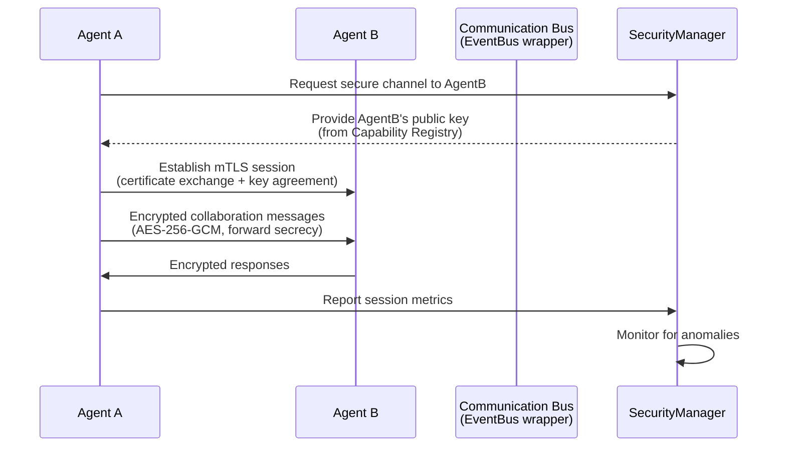

### 8.2 Encryption Standards

| Use Case | Algorithm | Key Size | Mode | Purpose |
|----------|-----------|----------|------|---------|
| Transport Encryption | TLS 1.3 | ECDHE-P256 | AES-256-GCM | Agent-to-agent, agent-service |
| Message Encryption | AES-256 | 256-bit | GCM | End-to-end message encryption |
| Data at Rest | AES-256 | 256-bit | XTS | Storage encryption |
| Key Wrapping | AES-256 | 256-bit | GCM | Protect encryption keys |
| Digital Signatures | ECDSA | P-384 | SHA-384 | Authentication, non-repudiation |
| Key Exchange | ECDH | P-256 | - | Secure key establishment |
| Hashing | SHA-3 | 512-bit | - | Integrity verification |

### 8.3 Perfect Forward Secrecy (PFS)

- Ephemeral key exchange for all TLS sessions
- Regular key rotation for data encryption keys
- Secure key destruction procedures
- Compromise of long-term keys does not compromise past sessions

## 9. Secret and Key Management

### 9.1 Secret Lifecycle

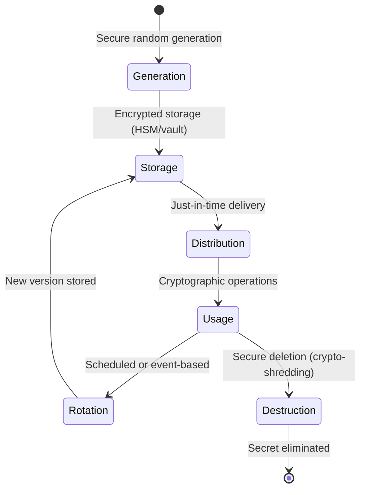

### 9.2 Key Management Hierarchy

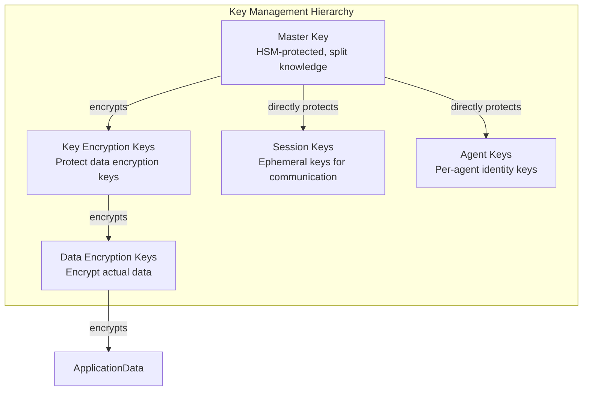

### 9.3 Secret Storage and Distribution

- Hardware Security Modules (HSMs) for master keys
- Encrypted vault with access controls for operational secrets
- Just-in-time secret delivery to authorized agents
- Secret rotation without service interruption
- Audit logging of all secret access operations
- Geographic distribution for disaster recovery

## 10. Collaboration-Specific Security Controls

### 10.1 Shared Context Security

Protection mechanisms for shared collaboration state:

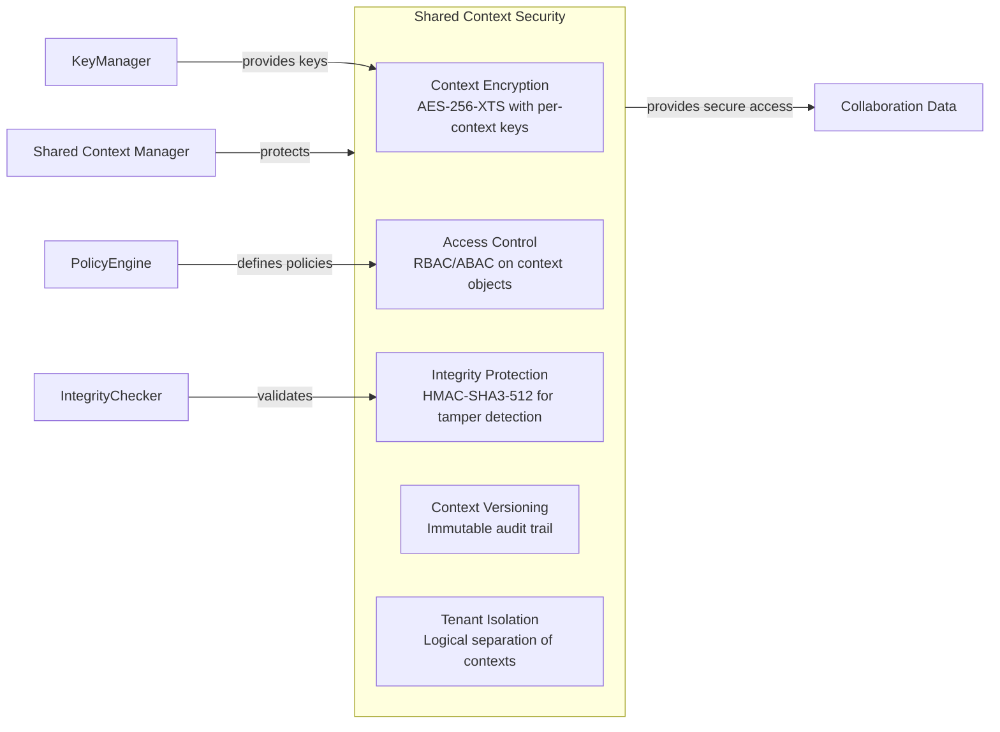

### 10.2 Knowledge and Capability Security

Security for knowledge exchange and capability declarations:

#### 10.2.1 Capability Registry Security

- Cryptographic signing of capability declarations
- Validation against attested agent capabilities
- Prevention of capability inflation attacks
- Regular capability re-attestation
- Audit trail of capability changes

#### 10.2.2 Knowledge Exchange Security

- Encrypted knowledge transfer between agents
- Access controls based on collaboration roles
- Digital signatures for knowledge provenance
- Malware scanning of shared artifacts
- Version control with immutable history

### 10.3 Council Security

Protection for governance and decision-making processes:

- Secure multi-party computation for voting
- Tamper-evident logging of council proceedings
- Identity verification for council participants
- Protection against sybil attacks in voting
- Encrypted deliberation channels
- Audit trails for all policy changes

### 10.4 Workflow and Delegation Security

Security for task delegation and workflow execution:

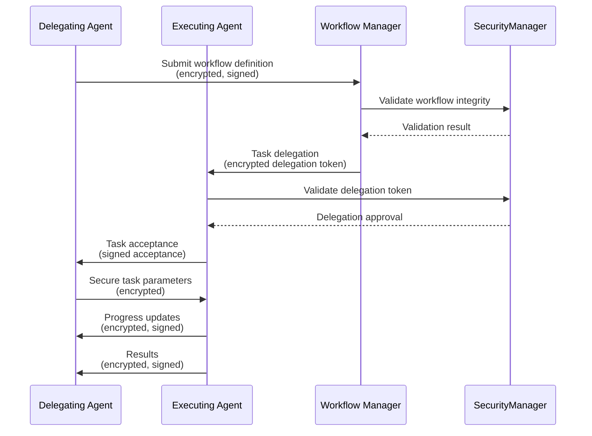

### 10.5 Scheduler Security

Protection for collaboration scheduling and resource allocation:

- Secure scheduling API with authentication and authorization
- Encrypted scheduling communications
- Protection against scheduling-based side-channel attacks
- Audit logging of scheduling decisions
- Resource quota enforcement with cryptographic proofs

## 11. Runtime Isolation and Sandboxing

### 11.1 Agent Execution Sandboxes

Each agent executes in a secure sandbox with:

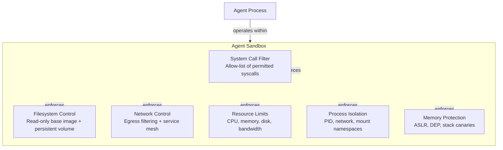

### 11.2 Multi-Tenant Isolation

For multi-agent collaboration environments:

- Logical separation of agent execution environments
- Encrypted inter-tenant communication channels
- Strict resource quotas preventing noisy neighbor attacks
- Separate security contexts and policy enforcement
- Isolated logging and audit trails per tenant
- Secure deletion of tenant data upon termination

### 11.3 Container and Worktree Security

- Immutable base images with signed manifests
- Runtime vulnerability scanning
- Read-only root filesystems where possible
- Drop all unnecessary privileges
- Seccomp, AppArmor, or similar syscall filtering
- Non-root user execution
- Drop all Linux capabilities, add only required ones

## 12. Policy Enforcement and Governance

### 12.1 Security Policy Framework

Hierarchical policy structure for collaboration security:

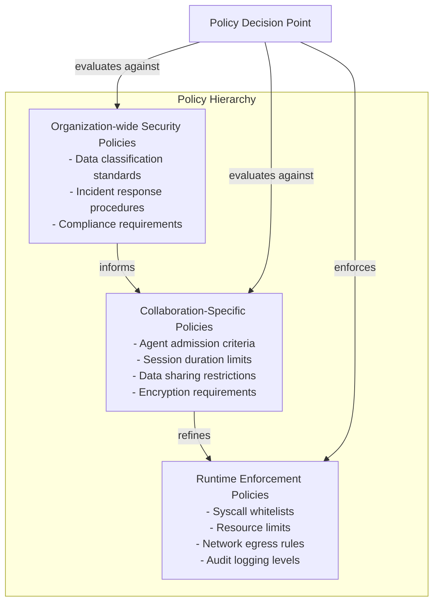

### 12.2 Policy Enforcement Points Integration

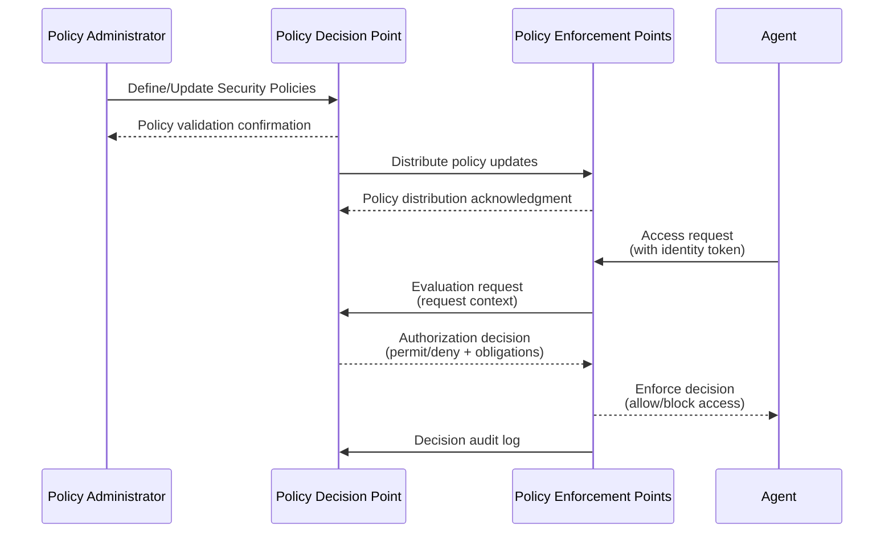

### 12.3 Security Governance

Governance structure for collaboration security:

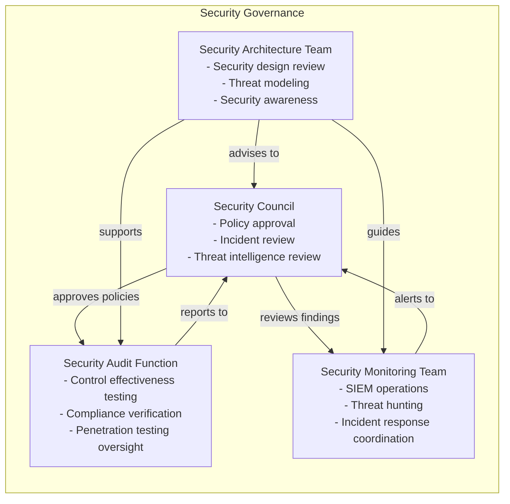

## 13. Threat Model and Attack Surface Analysis

### 13.1 Threat Modeling Approach

STRIDE methodology applied to collaboration components:

| Threat Category | Description | Mitigation Strategies |
|-----------------|-------------|----------------------|
| Spoofing | Impersonating agents or services | Mutual TLS, identity verification, attestation |
| Tampering | Modifying data or code in transit | Message integrity checks, code signing, secure boot |
| Repudiation | Denying participation in actions | Non-repudiation via digital signatures, audit logs |
| Information Disclosure | Unauthorized data access | Encryption, access controls, data minimization |
| Denial of Service | Disrupting collaboration availability | Rate limiting, resource quotas, traffic shaping |
| Elevation of Privilege | Gaining unauthorized privileges | Least privilege, privilege separation, sandboxing |

### 13.2 Collaboration Attack Surface

Key attack surfaces in the Multi-Agent Collaboration Framework:

1. **Agent Admission Interface**: Where agents join the collaboration ecosystem
2. **Capability Registry**: Where agents declare and discover capabilities
3. **Communication Bus**: Message routing and delivery mechanisms
4. **Shared Context Manager**: Distributed state storage and synchronization
5. **Workflow Engine**: Task delegation and execution orchestration
6. **Delegation Manager**: Authority transfer between agents
7. **Council Manager**: Governance and decision-making processes
8. **Scheduler**: Resource allocation and timing mechanisms
9. **Agent Sandboxes**: Isolation boundaries for agent execution
10. **Identity Provider**: Authentication and identity management services

### 13.3 Threat Agent Profiles

| Threat Actor | Capabilities | Motivations | Typical Tactics |
|--------------|--------------|-------------|-----------------|
| Malicious Agent | Collaboration participation, limited capabilities | Disrupt collaboration, steal knowledge | Impersonation, capability flooding, context poisoning |
| Compromised Agent | Valid identity, trusted capabilities | Espionage, sabotage | Data exfiltration, workflow manipulation, reputation damage |
| Insider Threat | Elevated privileges, deep system knowledge | Financial gain, revenge | Privilege abuse, data theft, policy circumvention |
| External Attacker | Network access, exploit development | Financial gain, espionage | Network exploitation, credential theft, supply chain attack |
| Nation State | Advanced capabilities, unlimited resources | Strategic advantage, espionage | Zero-day exploits, supply chain compromise, persistent threats |

## 14. Supply Chain Security

Security for the collaboration framework supply chain:

### 14.1 Component Provenance

- Cryptographic signing of all collaboration components
- Software Bill of Materials (SBOM) for all services
- Provenance tracking from development to deployment
- Verification of component integrity before execution
- Immutable logs of component lifecycle events

### 14.2 Build Security

- Secure build environments with isolated networks
- Dependency vulnerability scanning
- Reproducible builds with deterministic outputs
- Signed artifacts with tamper-evident metadata
- Secure artifact repositories with access controls

### 14.3 Deployment Security

- Signed deployment manifests
- Zero-trust deployment pipelines
- Immutable infrastructure where possible
- Canary deployments with automated rollback
- Post-deployment integrity verification
- Secure deletion of deployment artifacts

## 15. Audit Logging and Security Monitoring

### 15.1 Audit Logging Requirements

Immutable, tamper-evident audit logs for all security-relevant events:

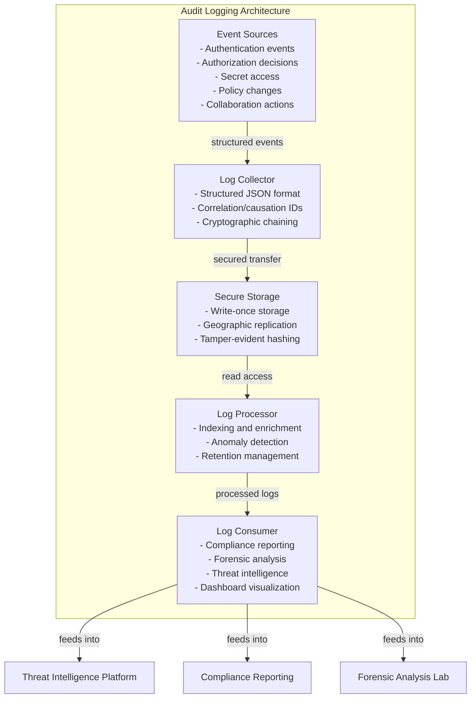

### 15.2 Security Monitoring and Event Correlation

Continuous monitoring with real-time threat detection:

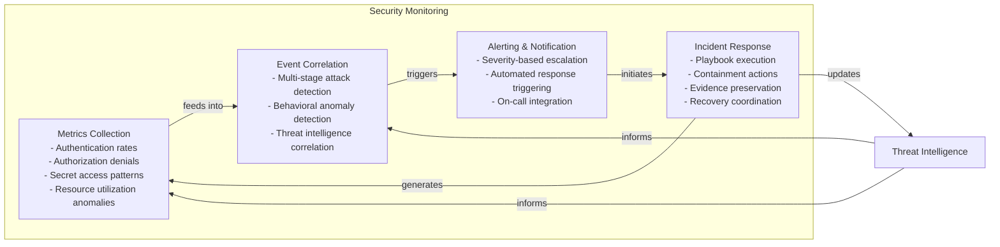

### 15.3 Key Security Events to Monitor

| Event Type | Description | Response Action |
|------------|-------------|-----------------|
| Authentication Failure | Failed login or token validation | Account lockout investigation |
| Privilege Escalation Attempt | Unauthorized privilege request | Immediate investigation |
| Anomalous Data Access | Unusual data access patterns | User/entity behavior analysis |
| Lateral Movement Indicators | Internal network reconnaissance | Network segmentation verification |
| Privileged Account Anomaly | Unexpected privileged account use | Session review and possible termination |
| Policy Violation | Action violates security policy | Policy review and possible update |
| Credential Exposure | Detected leaked credentials | Credential rotation and source investigation |
| Malware Detection | Malicious code identified | Isolation and eradication procedures |
| Data Exfiltration Signs | Large data transfers to external | Transfer blocking and forensic analysis |

## 16. Incident Response and Recovery

### 16.1 Incident Response Phases

```mermaid
stateDiagram-v2
    [*] --> Preparation: IR planning, tools, training
    Preparation --> Detection: Monitoring and alerting
    Detection --> Analysis: Triage and initial assessment
    Analysis --> Containment: Short-term and long-term
    Containment --> Eradication: Threat removal and cleanup
    Eradication --> Recovery: Systems restoration and validation
    Recovery --> Post-Incident: Lessons learned and improvements
    Post-Incident --> [*]: Return to normal operations
    Detection --> Escalation: If severity warrants
    Analysis --> Escalation: If complexity warrants
    Containment --> Escalation: If impact warrants
    Eradication --> Escalation: If eradication warrants
    Recovery --> Reporting: Regulatory and leadership reporting
```

### 16.2 Collaboration-Specific Incident Scenarios

| Scenario | Indicators | Response Actions |
|----------|------------|------------------|
| Malicious Agent Infiltration | Unusual capability requests, anomalous behavior | Immediate session termination, agent quarantine, capability review |
| Context Poisoning Attack | Corrupted shared context data | Context rollback, source tracing, agent re-verification |
| Delegation Abuse | Unauthorized task assignments | Delegation token revocation, workflow inspection |
| Council Manipulation | Improper voting patterns, policy changes | Vote validation, council member re-authentication |
| Supply Chain Compromise | Unexpected component behavior | Component isolation, provenance verification, rollback |
| Insider Threat Activity | Privilege misuse, data exfiltration | Immediate access revocation, forensic preservation |

### 16.3 Recovery Procedures

- Secure restoration from known-good backups
- Cryptographic verification of restored components
- Gradual reintroduction of agents with increased monitoring
- Collaboration session resumption with enhanced verification
- Post-incident trust score adjustments
- Policy updates based on incident findings

## 17. Compliance and Regulatory Considerations

### 17.1 Compliance Framework Mapping

Alignment with common security standards and regulations:

| Standard/Regulation | Relevant Controls | Collaboration Framework Implementation |
|---------------------|-------------------|-----------------------------------------|
| NIST Cybersecurity Framework | Identify, Protect, Detect, Respond, Recover | Comprehensive coverage across all functions |
| ISO 27001/27002 | Information security management system | ISMS with collaboration-specific Annex A controls |
| SOC 2 Type II | Security, Availability, Confidentiality | Trust services criteria with collaboration attestations |
| GDPR | Data protection and privacy | Data minimization, purpose limitation, subject rights |
| HIPAA | Protected health information | Access controls, audit controls, transmission security |
| PCI DSS | Payment card data | Network segmentation, access control, monitoring |
| FedRAMP | Cloud security authorization | Baseline controls with collaboration enhancements |
| CCPA | Consumer privacy act | Data access controls, deletion rights, non-discrimination |

### 17.2 Data Protection and Privacy

Privacy-preserving mechanisms for collaboration:

- **Data Minimization**: Collect only necessary collaboration data
- **Purpose Limitation**: Use data only for declared collaboration purposes
- **Storage Limitation**: Retain data only as long as needed for collaboration
- **Accuracy**: Ensure collaboration data is accurate and up-to-date
- **Integrity and Confidentiality**: Protect data with appropriate security measures
- **Accountability**: Demonstrate compliance with privacy principles

### 17.3 Audit and Assessment Preparation

Preparation for security assessments and audits:

- Continuous control monitoring and testing
- Automated evidence collection for common controls
- Regular third-party penetration testing
- Internal red team exercises
- Security control validation through automated testing
- Documentation of security architecture and implementation

## 18. Security Invariants

Mandatory security properties that must hold at all times:

```mermaid
graph TD
    subgraph SecurityInvariants[Security Invariants]
        direction TB
        INV-SEC-001[No Implicit Trust<br/>All access requests require explicit authentication and authorization]
        INV-SEC-002[Least Privilege Enforcement<br/>Agents and services operate with minimum required privileges]
        INV-SEC-003[Encryption Everywhere<br/>All data in transit and at rest is encrypted with approved algorithms]
        INV-SEC-004[Immutable Audit Trail<br/>All security-relevant events are logged in tamper-evident manner]
        INV-SEC-005[Identity Verification<br/>All agents present verifiable cryptographic identity]
        INV-SEC-006[Secret Protection<br/>All cryptographic keys and secrets are protected throughout lifecycle]
        INV-SEC-007[Sandbox Integrity<br/>Agent execution environments maintain isolation boundaries]
        INV-SEC-008[Policy Compliance<br/>All operations comply with active security policies]
        INV-SEC-009[Continuous Monitoring<br/>Security monitoring is active and alerting on anomalies]
        INV-SEC-010[Secure Deletion<br/>Data and secrets are securely deleted when no longer needed]
    end
    
    classDef invariant fill:#e8f5e8,stroke:#2e7d32,stroke-width:2px;
    class INV-SEC-001 invariant;
    class INV-SEC-002 invariant;
    class INV-SEC-003 invariant;
    class INV-SEC-004 invariant;
    class INV-SEC-005 invariant;
    class INV-SEC-006 invariant;
    class INV-SEC-007 invariant;
    class INV-SEC-008 invariant;
    class INV-SEC-009 invariant;
    class INV-SEC-010 invariant;
```

### 18.1 Invariant Enforcement Mechanisms

Each security invariant is enforced through:

1. **Design-Time Enforcement**: Architectural reviews and threat modeling
2. **Implementation-Time Enforcement**: Secure coding practices and static analysis
3. **Deployment-Time Enforcement**: Configuration validation and penetration testing
4. **Runtime Enforcement**: Continuous monitoring and automated remediation
5. **Verification-Time Enforcement**: Regular audits and compliance testing

## 19. Cross-Part References and Integration

### 19.1 Integration with Part 1 (Hermes Kernel)

- SecurityManager as Core Manager M8 (Part 1 §1.8.1)
- Kernel lifecycle integration with security initialization (Phase 7)
- Security event publishing to EventBus (Part 1 §1.9.2)
- Kernel integrity protection through security monitoring

### 19.2 Integration with Part 2 (Event System)

- SECURITY_ISSUE_FOUND event type (Part 2 §2.3.1)
- Security event publishing requirements
- Encrypted event transmission options
- Audit logging of event publishing and consumption
- Security-focused event filtering and routing

### 19.3 Integration with Part 3 (Core Managers)

- SecurityManager capabilities for other Core Managers
- Secure inter-manager communication via EventBus
- Security policy distribution to Core Managers
- Audit logging of Core Manager operations
- Key management services for cryptographic operations

### 19.4 Integration with Parts 4-11 (Services and Capabilities)

- Security requirements for Engineering Services
- Secure capability facade services (SkillService, CouncilService, etc.)
- Encrypted storage interfaces for persistent data
- Secure MCP transports for external integrations
- Privacy-preserving learning mechanisms
- Secure monitoring and alerting integrations

## 20. Conclusion

This security architecture provides a comprehensive zero-trust foundation for the AI-OS Multi-Agent Collaboration Framework. By implementing strong identity verification, least-privilege access controls, end-to-end encryption, continuous monitoring, and robust governance, the framework enables secure collaboration while protecting against the unique threats introduced by distributed agent systems.

The architecture balances security requirements with collaboration agility, ensuring that security controls enhance rather than impede the value delivered by multi-agent cooperation. Through defense-in-depth principles and continuous improvement processes, the collaboration framework maintains a strong security posture capable of evolving with emerging threats.