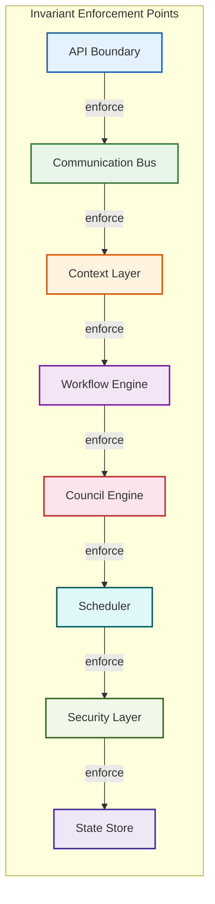
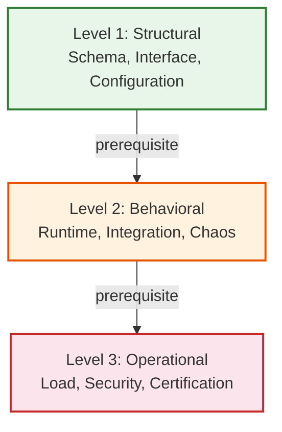
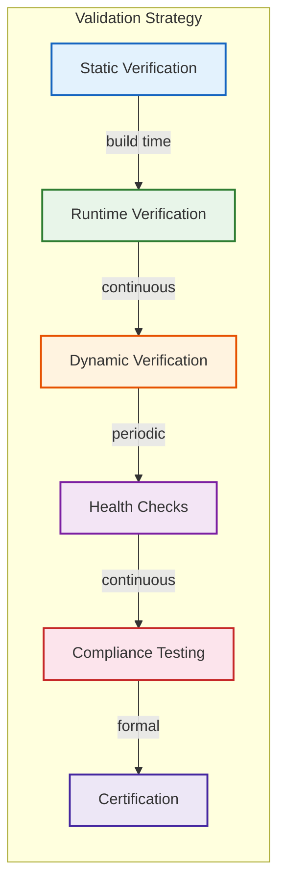
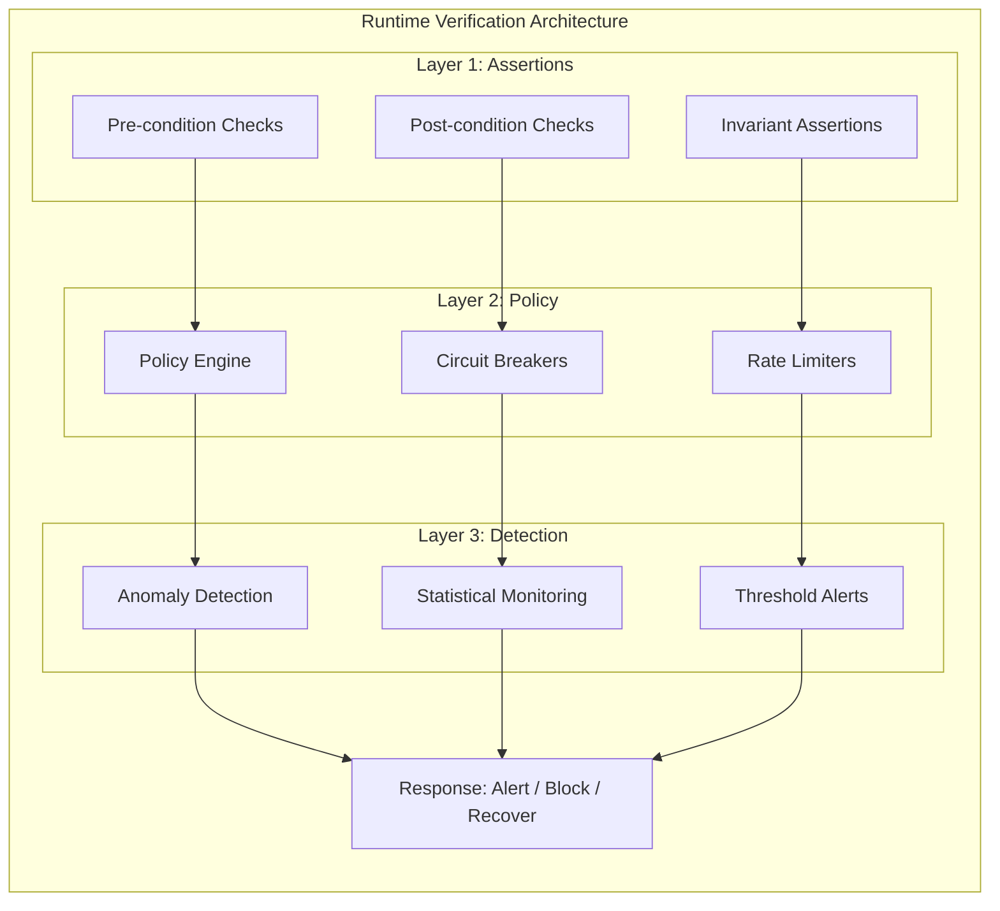
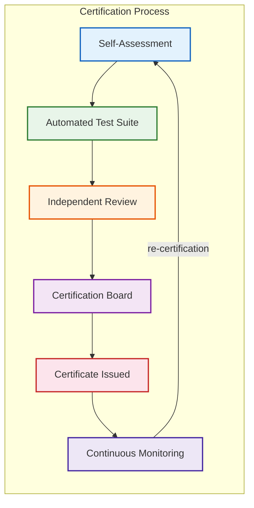
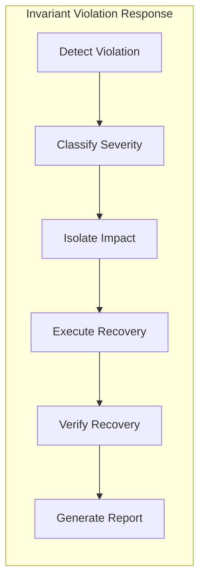
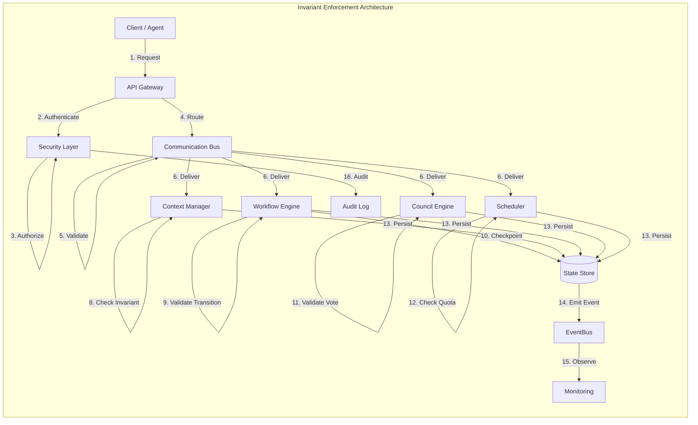
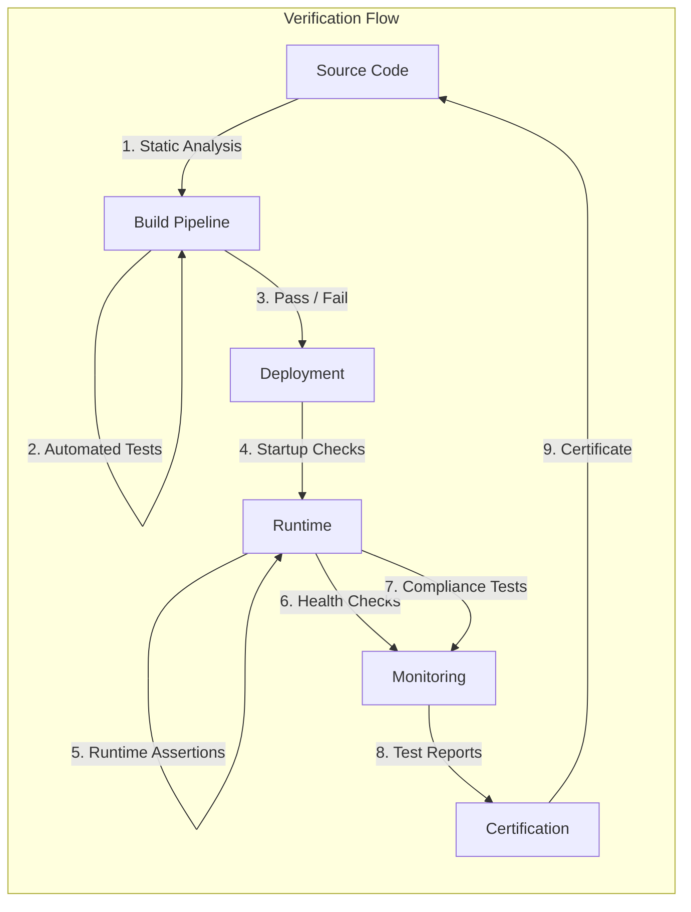
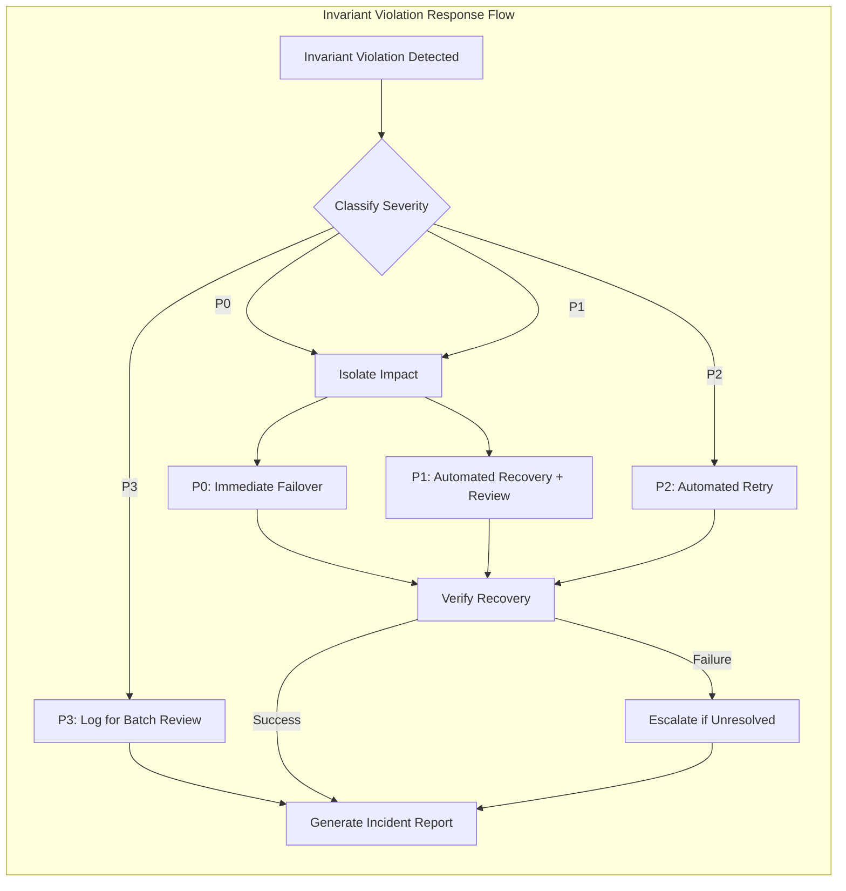

# Part 12.12: Runtime Invariants and Conformance

> **Document Role**
> Architecture specification for runtime invariants, conformance levels, validation strategy, and certification within the Part 12 Multi-Agent Collaboration Framework of AI-OS.
> This chapter defines the non-negotiable properties that collaboration implementations MUST uphold, the conditions under which they are verified, and the certification process for compliance.
> This document is authoritative for runtime verification, static analysis, dynamic testing, health checks, compliance testing, exception handling, and recovery conformance.

---

## Table of Contents

1. [Purpose and Scope](#1-purpose-and-scope)
2. [Invariant Classification](#2-invariant-classification)
3. [Runtime Invariants](#3-runtime-invariants)
4. [Collaboration Invariants](#4-collaboration-invariants)
5. [Communication Invariants](#5-communication-invariants)
6. [Workflow Invariants](#6-workflow-invariants)
7. [Council Invariants](#7-council-invariants)
8. [Context Invariants](#8-context-invariants)
9. [Knowledge Invariants](#9-knowledge-invariants)
10. [Scheduling Invariants](#10-scheduling-invariants)
11. [Security Invariants](#11-security-invariants)
12. [Reliability Invariants](#12-reliability-invariants)
13. [Performance Invariants](#13-performance-invariants)
14. [Conformance Levels](#14-conformance-levels)
15. [Validation Strategy](#15-validation-strategy)
16. [Runtime Verification](#16-runtime-verification)
17. [Static Verification](#17-static-verification)
18. [Dynamic Verification](#18-dynamic-verification)
19. [Health Checks](#19-health-checks)
20. [Compliance Testing](#20-compliance-testing)
21. [Certification Process](#21-certification-process)
22. [Failure Handling](#22-failure-handling)
23. [Exception Handling](#23-exception-handling)
24. [Recovery Requirements](#24-recovery-requirements)
25. [Architecture Diagrams](#25-architecture-diagrams)
26. [Conformance Matrix](#26-conformance-matrix)
27. [Cross-References](#27-cross-references)

---

## 1. Purpose and Scope

### 1.1 Purpose

Part 12.12 defines the contract that every implementation of the Part 12 Multi-Agent Collaboration Framework must satisfy. It identifies invariants — conditions that MUST remain true throughout the lifetime of a collaboration system — and specifies how those invariants are verified, enforced, and certified.

This document exists to prevent silent contract violations that erode reliability, security, and correctness over time. It provides:
- An exhaustive catalog of runtime invariants organized by concern.
- A conformance model with three levels of rigor.
- A multi-strategy validation approach combining static analysis, runtime verification, and compliance testing.
- A certification process that produces auditable proof of conformance.

### 1.2 Scope

#### In Scope

- All runtime invariants for the Part 12 collaboration layer (agents, workflows, councils, context, communication, scheduling, security, reliability, performance).
- MUST, SHOULD, and MAY conformance requirements.
- Conformance levels: Level 1 (structural), Level 2 (behavioral), Level 3 (operational).
- Validation strategies: static verification, dynamic verification, runtime verification, compliance testing.
- Health check architecture and health state classifications.
- Failure and exception handling requirements for invariant violations.
- Recovery requirements for each invariant category.
- Architecture diagrams showing invariant enforcement points and verification flow.
- A conformance matrix mapping every invariant to its verification methods and levels.

#### Out of Scope

- Invariants for individual agent internal reasoning (covered in Parts 6, 10).
- Application-level business logic invariants (covered by domain-specific specifications).
- Infrastructure-level invariants such as disk durability or NIC reliability (covered by infrastructure architecture).
- Regulatory or legal compliance beyond architectural support (covered by governance policy).

---

## 2. Invariant Classification

### 2.1 Overview

Invariants are classified by two orthogonal dimensions: **scope** and **rigor**.

#### Scope Categories

| Scope | Description |
|-------|-------------|
| Runtime | Properties that hold during normal system operation. |
| Collaboration | Properties governing how agents interact within a collaboration session. |
| Communication | Properties of message delivery, ordering, and routing. |
| Workflow | Properties of task decomposition, delegation, and execution state. |
| Council | Properties of collective decision-making processes. |
| Context | Properties of shared state consistency and access control. |
| Knowledge | Properties of knowledge synchronization and lifecycle. |
| Scheduling | Properties of resource allocation, priority, and fairness. |
| Security | Properties of authentication, authorization, and audit. |
| Reliability | Properties of failure detection, recovery, and graceful degradation. |
| Performance | Properties of latency, throughput, and resource efficiency. |

#### Rigor Levels

| Rigor | Keyword | Meaning |
|-------|---------|---------|
| MUST | `MUST` / `MUST NOT` | Non-negotiable. Violation indicates a defective implementation. |
| SHOULD | `SHOULD` / `SHOULD NOT` | Strongly recommended. Deviation must be explicitly justified. |
| MAY | `MAY` | Optional. Implementations are free to include or omit. |

### 2.2 Invariant Enforcement Points



Every invariant is enforced at one or more of these points. Enforcement is implemented through schema validation, policy checks, runtime assertions, and circuit breakers.

---

## 3. Runtime Invariants

### 3.1 System Integrity

| ID | Invariant | Rigor | Description |
|----|-----------|-------|-------------|
| RI-001 | Startup Order | MUST | All collaboration components MUST initialize in dependency order: State Store -> EventBus -> Communication Bus -> Context Manager -> Scheduler -> Workflow Engine -> Council Engine -> Agent Directory. Components MUST NOT serve requests before initialization completes. |
| RI-002 | Graceful Shutdown | MUST | All components MUST drain in-flight work before terminating. New work MUST be rejected during shutdown. In-flight work MUST be checkpointed or released within the configured `shutdownTimeout`. |
| RI-003 | Configuration Validity | MUST | The system MUST reject startup if configuration is invalid, inconsistent, or violates schema constraints. A partially-configured system MUST NOT enter serving mode. |
| RI-004 | Dependency Availability | MUST | All inter-component dependencies MUST be resolvable and reachable before entering serving mode. Missing or unreachable dependencies MUST prevent startup. |
| RI-005 | Liveness Responsiveness | MUST | Every component liveness probe MUST respond within 100ms. Non-response for three consecutive probes MUST trigger restart. |
| RI-006 | Readiness Responsiveness | MUST | Every component readiness probe MUST respond within 100ms. Non-readiness MUST remove the component from routing tables within one probe interval. |

### 3.2 Observability Invariants

| ID | Invariant | Rigor | Description |
|----|-----------|-------|-------------|
| RI-007 | Structured Logging | MUST | Every collaboration action MUST emit a structured log entry with `trace_id`, `span_id`, `component`, `action`, `outcome`, and `duration_ms`. |
| RI-008 | Metric Emission | MUST | Every component MUST emit metrics for request count, error count, and latency histogram with labels for `component`, `action`, and `outcome`. |
| RI-009 | Event Emission | MUST | Every significant state transition MUST emit a corresponding event to the EventBus. State changes without events are prohibited. |
| RI-010 | Trace Propagation | MUST | `trace_id` MUST be propagated across all inter-component calls. Trace context MUST NOT be dropped at any boundary. |
| RI-011 | Audit Record Integrity | MUST | Audit records MUST be immutable after creation. Modification or deletion of audit records MUST be detectable and MUST emit a security event. |

### 3.3 Version and Compatibility

| ID | Invariant | Rigor | Description |
|----|-----------|-------|-------------|
| RI-012 | Semantic Versioning | MUST | All collaboration interfaces, schemas, and event types MUST follow semantic versioning (MAJOR.MINOR.PATCH). Breaking changes require a MAJOR version increment. |
| RI-013 | Backward Compatibility | MUST | A system MUST interoperate with clients using any version within the supported compatibility window (minimum: current MAJOR, previous MAJOR). |
| RI-014 | Schema Registry | MUST | All message and event schemas MUST be registered in the schema registry before use. Unregistered schemas MUST be rejected. |

---

## 4. Collaboration Invariants

### 4.1 Session Invariants

| ID | Invariant | Rigor | Description |
|----|-----------|-------|-------------|
| CI-001 | Session Atomicity | MUST | A collaboration session transition from `Idle` to `Active` MUST be atomic: all participants admitted, or none. Partial admission MUST trigger rollback and session termination. |
| CI-002 | Session Isolation | MUST | Sessions MUST NOT share mutable state. Each session MUST have an independent context scope. Cross-session context access MUST be prohibited. |
| CI-003 | Participant Authenticity | MUST | Every participant in a session MUST have a verified, authenticated identity. Anonymous or unauthenticated participation is prohibited. |
| CI-004 | Capability Compliance | MUST | A participant MUST NOT perform actions outside its declared capabilities within a session. Capability violations MUST be detected and rejected. |
| CI-005 | Session Determinism | SHOULD | Given identical inputs, initial state, and participant behaviors, a session MUST produce identical outcomes. Non-determinism MUST be logged and classified. |
| CI-006 | Session Boundary Integrity | MUST | Resources allocated to a session MUST be released when the session terminates, regardless of termination cause (normal completion, failure, or timeout). |
| CI-007 | Session Recovery | MUST | An interrupted session MUST be resumable from its last checkpoint within the configured RTO. State loss beyond the last checkpoint MUST be acknowledged. |

### 4.2 Agent Collaboration Invariants

| ID | Invariant | Rigor | Description |
|----|-----------|-------|-------------|
| CI-008 | Autonomy Preservation | MUST | Agents retain full control over internal state and decision-making. The collaboration layer MUST NOT read, modify, or infer agent-internal state without explicit consent. |
| CI-009 | Capability Discovery Accuracy | MUST | The agent capability registry MUST accurately reflect each agent's current capabilities. Stale capability declarations MUST be detected and updated. |
| CI-010 | Availability Accuracy | SHOULD | Agent availability information MUST reflect actual availability within the configured freshness window. Scheduling decisions based on stale availability data MUST be avoided. |
| CI-011 | Reputation Integrity | MUST | Agent reputation scores MUST be computed from auditable interaction records. Score manipulation or injection MUST be detectable. |
| CI-012 | Delegation Ownership | MUST | At any point in time, a task MUST have exactly one assigned owner. Concurrent ownership is prohibited. |

---

## 5. Communication Invariants

### 5.1 Delivery Invariants

| ID | Invariant | Rigor | Description |
|----|-----------|-------|-------------|
| CM-001 | Schema Validation | MUST | Every message MUST be validated against its registered schema before delivery. Invalid messages MUST be rejected and routed to the dead-letter queue. |
| CM-002 | Authentication | MUST | Every message MUST carry an authenticated sender identity. Messages without valid authentication MUST be rejected at the bus boundary. |
| CM-003 | Authorization | MUST | Every message MUST pass authorization checks for its intended recipient and operation. Unauthorized messages MUST be rejected before delivery. |
| CM-004 | At-Least-Once Default | MUST | The default delivery guarantee for collaboration messages is at-least-once. Handlers MUST be idempotent or use idempotency keys. |
| CM-005 | Dead-Letter Integrity | MUST | Undeliverable messages MUST be routed to dead-letter queues with full diagnostic context. Dead-letter messages MUST NOT be silently discarded. |
| CM-006 | TTL Enforcement | MUST | Messages exceeding their TTL MUST be discarded. Late-arriving messages beyond TTL MUST be rejected. |
| CM-007 | Size Limits | MUST | Messages exceeding the configured size limit (1 MB) MUST be rejected before entering the bus. |
| CM-008 | Replay Protection | MUST | The Communication Bus MUST detect and reject replayed messages using nonce or timestamp validation. Replay detection MUST emit a security event. |

### 5.2 Ordering and Routing Invariants

| ID | Invariant | Rigor | Description |
|----|-----------|-------|-------------|
| CM-009 | Per-Session Ordering | MUST | Messages within the same session MUST be delivered in send order. Ordering MUST be preserved across retries and redeliveries. |
| CM-010 | Correlation Preservation | MUST | Every message MUST carry `correlation_id` and `causation_id`. These identifiers MUST be propagated through all downstream messages and events. |
| CM-011 | Routing Determinism | MUST | Given identical addressing information, a message MUST be routed to the same recipient set. Routing MUST NOT depend on non-deterministic state. |
| CM-012 | Broadcast Completeness | MUST | Broadcast messages MUST be delivered to all intended recipients. Missing a broadcast recipient MUST emit an alert. |
| CM-013 | Backpressure Response | MUST | Consumers MUST signal backpressure within 2 RTTs when capacity is exceeded. Producers MUST respond to backpressure signals within 1 RTT. |

### 5.3 Transport Invariants

| ID | Invariant | Rigor | Description |
|----|-----------|-------|-------------|
| CM-014 | Transport Agnosticism | MUST | Agents MUST interact with a uniform messaging API regardless of underlying transport (in-process, network, hybrid). |
| CM-015 | Mutual TLS | MUST | All network communication MUST use mutual TLS with certificate validation. Plaintext network communication is prohibited for production deployments. |
| CM-016 | Encryption at Rest | MUST | Messages persisted to durable stores MUST be encrypted at rest using the configured encryption scheme. |

---

## 6. Workflow Invariants

### 6.1 State Invariants

| ID | Invariant | Rigor | Description |
|----|-----------|-------|-------------|
| WI-001 | State Machine Compliance | MUST | A workflow instance MUST follow only valid state transitions as defined in its state machine. Illegal transitions MUST be rejected and MUST emit a workflow integrity event. |
| WI-002 | Task Uniqueness | MUST | Within a workflow, no two active tasks MAY have identical `task_id`. Duplicate task IDs MUST be detected and rejected. |
| WI-003 | Parent-Child Consistency | MUST | A child task MUST NOT outlive its parent. Parent completion MUST trigger child completion or cancellation within the configured timeout. |
| WI-004 | Delegation Traceability | MUST | Every task MUST maintain a complete delegation chain from the originating workflow to the current executing agent. Broken delegation chains MUST trigger audit alerts. |
| WI-005 | Workflow Isolation | MUST | Workflow instances MUST be fully isolated. State corruption in one instance MUST NOT affect other instances. |
| WI-006 | Idempotent Handlers | MUST | Task handlers MUST accept and honor idempotency keys. Re-execution with the same idempotency key MUST NOT produce side effects. |
| WI-007 | Timeout Enforcement | MUST | Every task and workflow step MUST have an explicit timeout. Steps exceeding their timeout MUST be terminated within one timeout period. |

### 6.2 Recovery Invariants

| ID | Invariant | Rigor | Description |
|----|-----------|-------|-------------|
| WI-008 | Checkpoint Atomicity | MUST | A checkpoint MUST represent a consistent workflow state. Partial checkpoints MUST be discarded and MUST trigger a rollback to the last valid checkpoint. |
| WI-009 | Resume Capability | MUST | Any workflow in `Failed` or `Interrupted` state MUST be resumable from its last valid checkpoint. |
| WI-010 | Orphan Detection | MUST | The workflow engine MUST detect orphaned in-flight tasks after a restart. Orphaned tasks MUST be reclaimed or cancelled within the configured detection window. |
| WI-011 | Compensating Actions | MUST | Rollback operations MUST include compensating actions for all previously completed steps in reverse order. Partial rollback is prohibited. |
| WI-012 | Saga Integrity | MUST | For saga-pattern workflows, exactly one of the forward path or compensating path MUST complete. Both completing is a data integrity violation. |

### 6.3 Delegation Invariants

| ID | Invariant | Rigor | Description |
|----|-----------|-------|-------------|
| WI-013 | Ownership Uniqueness | MUST | A task MUST have exactly one owner at any time. Ownership MUST be transferred atomically from delegator to delegatee. |
| WI-014 | Capability Matching | MUST | Tasks MUST only be delegated to agents whose capabilities satisfy the task requirements. Capability mismatch MUST be detected before delegation. |
| WI-015 | Delegation Depth | SHOULD | Recursive delegation depth MUST NOT exceed the configured maximum depth. Exceeding the limit MUST trigger rejection with escalation. |
| WI-016 | Result Verification | MUST | Task results MUST be verified against the task contract before acceptance. Acceptance without verification is prohibited. |

---

## 7. Council Invariants

### 7.1 Decision Invariants

| ID | Invariant | Rigor | Description |
|----|-----------|-------|-------------|
| CoI-001 | Quorum Requirement | MUST | A council decision MUST NOT be published without achieving quorum. Quorum calculation MUST exclude confirmed-failed or unreachable members. |
| CoI-002 | Vote Persistence | MUST | Individual votes MUST be durably persisted before tallying begins. Vote loss MUST extend the voting session, not produce an incomplete tally. |
| CoI-003 | Decision Immutability | MUST | Once a council decision is published, it MUST be immutable. Amendment is only possible through a new decision with a superseding `decision_id`. |
| CoI-004 | Eligibility Enforcement | MUST | Only authenticated council members with verified eligibility MAY vote. Ineligible votes MUST be rejected before tallying. |
| CoI-005 | Vote Confidentiality | MUST | Individual votes MUST be kept confidential until the voting session closes. Premature vote disclosure MUST be prevented. |
| CoI-006 | Weighted Vote Integrity | MUST | When using weighted voting, weights MUST be derived from auditable capability confidence and expertise scores. Weight manipulation MUST be detectable. |

### 7.2 Lifecycle Invariants

| ID | Invariant | Rigor | Description |
|----|-----------|-------|-------------|
| CoI-007 | Membership Stability | MUST | Member changes during an active vote MUST trigger session restart with an explicit audit record. Silent membership changes are prohibited. |
| CoI-008 | Deliberation Record | MUST | All deliberation activity MUST be recorded in the decision log. Deliberation without logging is prohibited. |
| CoI-009 | Replay Integrity | MUST | After recovery, the council MUST be able to replay deliberation history to restore a consistent state. Replay MUST produce identical decisions. |
| CoI-010 | Tie Resolution | MUST | Tie conditions MUST be resolved by the configured tie-resolution policy. Unresolved ties MUST NOT produce ambiguous decisions. |
| CoI-011 | Escalation Trigger | MUST | Escalation conditions defined in council charter MUST be detected automatically. Failure to escalate when conditions are met is a governance violation. |

### 7.3 Consensus Invariants

| ID | Invariant | Rigor | Description |
|----|-----------|-------|-------------|
| CoI-012 | Consensus Convergence | MUST | Under normal conditions, a council MUST reach a decision within the configured timeout. Infinite deliberation is prohibited. |
| CoI-013 | Byzantine Resilience | SHOULD | Councils handling critical decisions SHOULD implement quorum-based validation to detect and isolate Byzantine participants. |
| CoI-014 | Consensus Validation | MUST | Published decisions MUST include a verifiable proof of consensus (vote tally, quorum attestation). Decisions without proof are invalid. |

---

## 8. Context Invariants

### 8.1 Consistency Invariants

| ID | Invariant | Rigor | Description |
|----|-----------|-------|-------------|
| CnI-001 | Versioned Writes | MUST | Every context mutation MUST carry a version or sequence number. Concurrent writes MUST be detected and resolved through defined conflict policies. |
| CnI-002 | Read Isolation | MUST | Readers MUST see a consistent snapshot. Long-running reads MUST NOT be invalidated by concurrent writes. |
| CnI-003 | Access Control Enforcement | MUST | Access controls MUST be re-evaluated on every read and write operation. Cached authorization decisions MUST NOT bypass re-evaluation. |
| CnI-004 | Scope Isolation | MUST | Context MUST NOT leak across workflow, council, or session boundaries. Cross-scope access MUST be explicitly authorized and logged. |
| CnI-005 | Conflict Resolution | MUST | Concurrent writes to the same context entry MUST be resolved deterministically using the configured conflict resolution policy. Unresolved conflicts MUST be escalated. |

### 8.2 Lifecycle Invariants

| ID | Invariant | Rigor | Description |
|----|-----------|-------|-------------|
| CnI-006 | Snapshot Consistency | MUST | Context snapshots MUST represent a consistent point-in-time state. Incremental snapshots MUST include causal chains enabling reconstruction. |
| CnI-007 | Context Validation | MUST | Context data MUST be validated against schema on every write. Invalid context entries MUST be rejected. |
| CnI-008 | TTL Enforcement | MUST | Context entries with expired TTL MUST be garbage collected. Access to expired entries MUST return a "not found" response, not stale data. |
| CnI-009 | Lineage Preservation | MUST | Context lineage MUST be preserved across all operations. Lineage breaks MUST trigger audit events. |
| CnI-010 | Privacy Filtering | MUST | Context propagation to an agent MUST be filtered based on that agent's capabilities and trust domain. Unfiltered propagation is a security violation. |

### 8.3 Knowledge Invariants

| ID | Invariant | Rigor | Description |
|----|-----------|-------|-------------|
| CnI-011 | Immutable Artifacts | MUST | Versioned documents, diagrams, and models MUST be immutable after creation. Modification MUST produce a new version. |
| CnI-012 | Mutable Entity Contracts | MUST | Updates to mutable shared state objects MUST conform to defined update contracts. Contract violations MUST be rejected. |
| CnI-013 | Semantic Tagging | SHOULD | Knowledge artifacts SHOULD carry semantic tags enabling discovery via metadata. Untagged artifacts MAY exist but MUST NOT participate in automatic discovery. |
| CnI-014 | Knowledge Audit Trail | MUST | Every knowledge mutation MUST produce an auditable record. Knowledge changes without audit records MUST be treated as integrity violations. |

---

## 9. Knowledge Invariants

### 9.1 Exchange Invariants

| ID | Invariant | Rigor | Description |
|----|-----------|-------|-------------|
| KI-001 | Structured Exchange | MUST | All knowledge exchange between agents MUST use structured memory events. Unstructured knowledge transfer is prohibited for collaboration-critical data. |
| KI-002 | Event-Sourced Updates | MUST | Knowledge updates MUST be event-sourced. Direct database writes to the knowledge store are prohibited outside the Knowledge Exchange Layer. |
| KI-003 | Causation Chain | MUST | Every knowledge update MUST carry a causation chain linking it to prior updates. Causation-less updates MUST be rejected. |
| KI-004 | Memory Tier Compliance | MUST | Knowledge exchange MUST route to the appropriate memory tier based on persistence requirements. Tier violations MUST be detected and corrected. |
| KI-005 | Synchronization Completeness | MUST | Knowledge synchronization MUST eventually reach all participants with matching trust domains. Unsynchronized knowledge MUST be detected and repaired. |

### 9.2 Integrity Invariants

| ID | Invariant | Rigor | Description |
|----|-----------|-------|-------------|
| KI-006 | Knowledge Provenance | MUST | Every knowledge artifact MUST carry provenance metadata including source agent, creation timestamp, and derivation chain. Provenance-less artifacts MUST be flagged. |
| KI-007 | Knowledge Validation | MUST | Knowledge artifacts MUST be validated against schemas before ingestion. Invalid knowledge MUST be rejected with diagnostic information. |
| KI-008 | Knowledge Consistency | MUST | Knowledge artifacts MUST not contradict each other within the same scope. Contradictions MUST be detected and resolved through conflict resolution. |
| KI-009 | Knowledge Expiration | MUST | Knowledge artifacts with expired TTL MUST be marked expired and excluded from retrieval results. Expired artifacts MUST NOT be returned as current knowledge. |
| KI-010 | Knowledge Audit Trail | MUST | Every knowledge mutation MUST produce an auditable record. Knowledge changes without audit records MUST be treated as integrity violations. |

---

## 10. Scheduling Invariants

### 10.1 Allocation Invariants

| ID | Invariant | Rigor | Description |
|----|-----------|-------|-------------|
| SI-001 | Resource Reservation Atomicity | MUST | Resource reservation MUST be atomic. Partial reservation (some resources allocated, others not) MUST NOT be committed. |
| SI-002 | Reservation Validity | MUST | Reserved resources MUST be released if not consumed within the reservation timeout. Expired reservations MUST NOT block resource allocation. |
| SI-003 | Priority Correctness | MUST | Resources MUST be allocated to the highest-priority eligible requester. Priority inversion MUST be prevented or explicitly logged. |
| SI-004 | Quota Enforcement | MUST | Cumulative resource consumption MUST NOT exceed configured quotas. Quota violations MUST trigger rejection before allocation. |
| SI-005 | Preemption Auditability | MUST | Every preemption event MUST be logged with preempting requester, preempted requester, and reason. Unlogged preemption is prohibited. |

### 10.2 Fairness Invariants

| ID | Invariant | Rigor | Description |
|----|-----------|-------|-------------|
| SI-006 | Starvation Prevention | MUST | No requester MAY be indefinitely starved regardless of priority. Fairness policies MUST guarantee minimum allocation over a defined window. |
| SI-007 | Fair Share Allocation | SHOULD | When resources are scarce, allocation SHOULD respect configured fair-share weights across requesters. |
| SI-008 | Backpressure Propagation | MUST | Backpressure signals MUST propagate from saturated consumers to producers within 2 RTTs. Unpropagated backpressure MUST trigger automatic throttling. |

### 10.3 Capacity Invariants

| ID | Invariant | Rigor | Description |
|----|-----------|-------|-------------|
| SI-009 | Capacity Planning Accuracy | SHOULD | Capacity forecasts SHOULD be within 15% of actual demand over a 24-hour window. Consistent forecast errors MUST trigger model recalibration. |
| SI-010 | Resource Accounting Accuracy | MUST | Resource accounting MUST accurately reflect actual consumption. Accounting errors exceeding 5% MUST trigger reconciliation. |
| SI-011 | Scheduling Decision Auditability | MUST | Every scheduling decision MUST be recorded with the decision factors. Unexplained scheduling decisions are prohibited. |

---

## 11. Security Invariants

### 11.1 Authentication and Authorization

| ID | Invariant | Rigor | Description |
|----|-----------|-------|-------------|
| SeI-001 | Identity Verification | MUST | Every agent, user, and service participating in collaboration MUST have a verified identity. Unverified identities MUST be rejected. |
| SeI-002 | Token Validity | MUST | Authentication tokens MUST be validated for expiry, signature, and scope on every request. Expired or invalid tokens MUST be rejected. |
| SeI-003 | Permission Enforcement | MUST | Authorization decisions MUST be enforced at every boundary. Authorization bypass MUST be detected and MUST emit a critical security event. |
| SeI-004 | Principle of Least Privilege | MUST | Agents and services MUST operate with the minimum permissions required for their function. Excessive permissions MUST be detected and flagged. |
| SeI-005 | Privilege Separation | MUST | Authentication, authorization, and audit functions MUST be separated into distinct components. Combined authority is prohibited. |

### 11.2 Data Protection

| ID | Invariant | Rigor | Description |
|----|-----------|-------|-------------|
| SeI-006 | Encryption in Transit | MUST | All inter-component communication MUST be encrypted. Unencrypted communication is prohibited for production deployments. |
| SeI-007 | Encryption at Rest | MUST | All persistent collaboration state MUST be encrypted at rest. Unencrypted persistent state is prohibited. |
| SeI-008 | Data Classification | MUST | All data MUST be classified at creation. Unclassified data MUST be treated as the most restrictive classification until classified. |
| SeI-009 | Secret Management | MUST | Secrets MUST NOT appear in logs, events, or messages. Secret leakage MUST be detected through automated scanning and MUST trigger credential rotation. |
| SeI-010 | Data Residency | MUST | Data MUST be stored and processed only in jurisdictions explicitly authorized by the data classification policy. Cross-boundary data movement MUST be logged and authorized. |

### 11.3 Audit and Compliance

| ID | Invariant | Rigor | Description |
|----|-----------|-------|-------------|
| SeI-011 | Audit Completeness | MUST | Every security-relevant action MUST produce an audit record. Gaps in audit coverage MUST be detected through periodic review. |
| SeI-012 | Audit Immutability | MUST | Audit records MUST be immutable and append-only. Modification or deletion MUST be detectable through cryptographic chaining. |
| SeI-013 | Anomaly Detection | MUST | Anomalous access patterns MUST be detected within the configured detection window. Undetected anomalies for more than 24 hours indicate a detection gap. |
| SeI-014 | Incident Response | MUST | Security incidents MUST trigger automated response within the configured SLA. Delayed response MUST be escalated. |

### 11.4 Trust Domain

| ID | Invariant | Rigor | Description |
|----|-----------|-------|-------------|
| SeI-015 | Trust Boundary Enforcement | MUST | Cross-trust-domain communication MUST pass through explicitly defined trust bridges. Direct cross-domain access MUST be blocked. |
| SeI-016 | Information Flow Control | MUST | Information flow across trust domains MUST follow configured policies. Policy violations MUST be detected and blocked. |
| SeI-017 | Domain Isolation | MUST | Compromise within one trust domain MUST NOT grant access to another domain. Cross-domain credential reuse is prohibited. |

---

## 12. Reliability Invariants

### 12.1 Fault Tolerance Invariants

| ID | Invariant | Rigor | Description |
|----|-----------|-------|-------------|
| RI-017 | Fail-Stop Behavior | MUST | Components MUST fail in well-defined ways with explicit recovery contracts. Silent or partial failures for state-critical operations are prohibited. |
| RI-018 | Idempotent Recovery | MUST | Recovery operations MUST be safe to retry. Non-idempotent recovery operations MUST use idempotency keys. |
| RI-019 | Durable Before Acknowledged | MUST | State transitions MUST be durably persisted before acknowledgments are emitted. Acknowledgment without persistence is prohibited. |
| RI-020 | Bounded Retries | MUST | Retries MUST have explicit limits, backoff policies, and terminal failure paths. Unbounded retries are prohibited. |
| RI-021 | Circuit Isolation | MUST | Failures in one dependency MUST NOT cascade to unrelated workflows or councils. Circuit breakers MUST isolate failure domains. |

### 12.2 Recovery Invariants

| ID | Invariant | Rigor | Description |
|----|-----------|-------|-------------|
| RI-022 | Checkpoint Precedence | MUST | Critical state MUST be checkpointed before irreversible actions. Actions without preceding checkpoints are prohibited for state-critical operations. |
| RI-023 | Recovery Observability | MUST | Every recovery action MUST emit structured events and metrics. Silent recovery is prohibited. |
| RI-024 | Recovery Completeness | MUST | Recovery MUST restore the system to a fully functional state. Partial recovery MUST be detected and escalated. |
| RI-025 | Orphan Detection | MUST | Orphaned in-flight tasks MUST be detected within the configured window after component failure. Orphaned tasks MUST be reclaimed or cancelled. |

### 12.3 Degradation Invariants

| ID | Invariant | Rigor | Description |
|----|-----------|-------|-------------|
| RI-026 | Graceful Over Catastrophic | MUST | Under resource exhaustion, the system MUST prefer partial service with degradation over total failure. Complete unavailability is a last-resort state. |
| RI-027 | Degradation Policy Compliance | MUST | Degradation behavior MUST follow configured policies. Undocumented degradation behavior MUST be treated as a defect. |
| RI-028 | Circuit Breaker Recovery | MUST | Circuit breakers MUST probe for recovery at configured intervals. Closed circuits MUST be reopened only when the downstream dependency is verified healthy. |

---

## 13. Performance Invariants

### 13.1 Latency Invariants

| ID | Invariant | Rigor | Description |
|----|-----------|-------|-------------|
| PI-001 | In-Process Dispatch | MUST | Message dispatch latency MUST be p99 < 10ms for in-process delivery. Exceeding this bound MUST trigger performance investigation. |
| PI-002 | Network Dispatch | MUST | Message dispatch latency MUST be p99 < 100ms for network delivery. Exceeding this bound MUST trigger performance investigation. |
| PI-003 | Event Delivery | MUST | Event subscription delivery latency MUST be p99 < 50ms. Exceeding this bound MUST trigger performance investigation. |
| PI-004 | Dead-Letter Processing | MUST | Dead-letter processing latency MUST be p99 < 200ms. Exceeding this bound MUST trigger alerting. |
| PI-005 | Agent Matching | MUST | Agent capability matching MUST complete within 100ms. Exceeding this bound MUST trigger fallback to cached match results. |

### 13.2 Throughput Invariants

| ID | Invariant | Rigor | Description |
|----|-----------|-------|-------------|
| PI-006 | Bus Throughput | MUST | The Communication Bus MUST sustain 100,000 messages/second per instance. Throughput below this bound under normal load MUST trigger capacity investigation. |
| PI-007 | Workflow Concurrency | MUST | The workflow engine MUST support at least 10,000 concurrent workflow instances per deployment unit. |
| PI-008 | Agent Collaboration Scale | MUST | The system MUST support at least 10,000 concurrently collaborating agents with linear resource scaling. |

### 13.3 Resource Efficiency

| ID | Invariant | Rigor | Description |
|----|-----------|-------|-------------|
| PI-009 | Collaboration Overhead | MUST | Collaboration overhead (coordination time as percentage of total execution time) MUST NOT exceed 20% for typical workloads. |
| PI-010 | Memory Efficiency | SHOULD | Per-agent memory overhead SHOULD remain under 64 MB for typical collaboration patterns. |
| PI-011 | Autoscaling Responsiveness | SHOULD | Autoscaling MUST respond to load changes within 60 seconds. Scaling delays beyond this window SHOULD trigger manual review. |

---

## 14. Conformance Levels

### 14.1 Overview

Conformance levels define the depth of verification required for an implementation. All implementations MUST satisfy Level 1. Level 2 and Level 3 are required for production deployments based on risk classification.



### 14.2 Level 1 — Structural Conformance

**Requirement**: All implementations MUST satisfy Level 1.

Level 1 verifies that the implementation structurally matches the architecture specification:

| Check | Description |
|-------|-------------|
| Schema Conformance | All messages, events, and state objects conform to registered schemas. |
| Interface Conformance | All component interfaces match the specified contracts. |
| Configuration Conformance | All required configuration properties are present and valid. |
| Dependency Resolution | All inter-component dependencies are resolvable and reachable. |
| Initialization Order | Components initialize in the specified dependency order. |

**Verification Methods**: Schema validation, interface contract tests, configuration linting.

### 14.3 Level 2 — Behavioral Conformance

**Requirement**: Production deployments MUST satisfy Level 2.

Level 2 verifies that the implementation behaves correctly under normal and failure conditions:

| Check | Description |
|-------|-------------|
| Invariant Enforcement | All MUST invariants are enforced at runtime. |
| Failure Recovery | The system recovers from simulated failures within RTO. |
| State Consistency | Shared state remains consistent under concurrent access. |
| Message Delivery | Messages are delivered with the specified guarantees. |
| Workflow Correctness | Workflows execute correctly through all state transitions. |
| Council Correctness | Councils produce valid, verifiable decisions. |

**Verification Methods**: Runtime invariant checks, integration tests, chaos testing, fault injection.

### 14.4 Level 3 — Operational Conformance

**Requirement**: Critical-path and regulated workloads MUST satisfy Level 3.

Level 3 verifies that the implementation performs correctly under production-scale load and adversarial conditions:

| Check | Description |
|-------|-------------|
| Performance Targets | Latency and throughput targets are met under production load. |
| Scalability | The system scales linearly within the specified bounds. |
| Security Hardening | All security invariants are enforced under adversarial testing. |
| Long-Running Stability | The system operates correctly for extended durations without degradation. |
| Disaster Recovery | Full disaster recovery procedures execute within RTO/RPO targets. |
| Chaos Resilience | The system survives coordinated multi-component failures. |

**Verification Methods**: Load testing, security penetration testing, chaos engineering, disaster recovery drills.

### 14.5 Risk-Based Conformance Matrix

| Deployment Type | Level 1 | Level 2 | Level 3 |
|----------------|---------|---------|---------|
| Development / Testing | Required | Recommended | Optional |
| Staging | Required | Required | Recommended |
| Production — Standard | Required | Required | Recommended |
| Production — Critical | Required | Required | Required |
| Production — Regulated | Required | Required | Required |

---

## 15. Validation Strategy

### 15.1 Overview

Validation is a multi-layered strategy combining static analysis, runtime monitoring, dynamic testing, and periodic certification. No single method provides complete coverage; the combination ensures invariants are verified at multiple points in the development and operations lifecycle.



### 15.2 Validation Principles

| Principle | Description |
|-----------|-------------|
| Shift-Left | Verification happens as early as possible: static analysis at build time, runtime checks at startup, continuous monitoring in production. |
| Defense in Depth | Multiple independent verification methods cover each invariant. A single method failure MUST NOT prevent invariant detection. |
| Continuous Verification | Validation is not a one-time event. It runs continuously in CI/CD pipelines and production monitoring. |
| Fail-Safe Defaults | When verification is inconclusive, the system MUST default to rejecting the operation (fail-closed) rather than permitting it (fail-open). |
| Audit Trail | All verification results MUST be recorded with timestamps, verifier identity, and outcome. |

### 15.3 Validation Ownership

| Validation Type | Primary Owner | Secondary Owner |
|-----------------|---------------|-----------------|
| Static Verification | Build System | Development Teams |
| Runtime Verification | Runtime Platform | SRE Team |
| Dynamic Verification | QA / Test Engineering | Development Teams |
| Health Checks | SRE Team | Platform Engineering |
| Compliance Testing | Security Team | Compliance Team |
| Certification | Architecture Review Board | Quality Engineering |

---

## 16. Runtime Verification

### 16.1 Overview

Runtime verification continuously monitors the running system for invariant violations. It operates at three layers: assertion checks, policy enforcement, and anomaly detection.



### 16.2 Assertion Checks

Assertion checks are lightweight, inline verifications executed at critical points in the collaboration flow.

| Check Point | Assertions | Action on Violation |
|-------------|-----------|---------------------|
| Message Receive | Schema valid, authenticated, authorized, TTL valid | Reject, dead-letter, alert |
| State Mutation | Version present, access authorized, schema valid | Reject mutation, alert |
| Workflow Transition | Valid state transition, checkpoint exists, owner valid | Block transition, alert, escalate |
| Council Vote | Member eligible, session active, not already voted | Reject vote, alert |
| Resource Allocation | Quota available, priority valid, reservation unique | Reject allocation, alert |
| Agent Registration | Capabilities valid, availability current, identity verified | Reject registration, alert |

Assertion checks are SHOULD be configurable for severity levels:
- `CRITICAL`: Violation blocks the operation and emits a P1 alert.
- `WARNING`: Violation is logged but does not block the operation.
- `INFO`: Violation is logged at info level for trend analysis.

### 16.3 Policy Enforcement

The Policy Engine enforces invariants that require context across multiple operations:

| Policy | Invariants | Enforcement |
|--------|-----------|-------------|
| Rate Limiting | PI-006, PI-011 | Reject excess requests with 429 |
| Circuit Breaking | RI-020, RI-021 | Open circuit, redirect to fallback |
| Quota Enforcement | SI-004 | Reject allocation exceeding quota |
| Access Control | SeI-001 through SeI-005 | Reject unauthorized operations |
| Degradation Policy | RI-026, RI-027 | Activate degraded mode per policy |
| Byzantine Detection | CoI-013 | Flag suspicious voting patterns |

### 16.4 Anomaly Detection

Anomaly detection identifies invariant violations that are not caught by assertions or policies:

| Anomaly Type | Detection Method | Invariant |
|-------------|-----------------|-----------|
| Latency Spike | Statistical threshold (3-sigma) | PI-001, PI-002, PI-003 |
| Error Rate Increase | Rolling error rate threshold | RI-017 |
| Unusual Access Pattern | Behavioral baseline deviation | SeI-013 |
| State Inconsistency | Periodic consistency checks | CnI-001, CnI-002 |
| Orphan Task Accumulation | Orphan scan | WI-010, RI-025 |
| Audit Gap Detection | Periodic audit record review | SeI-011, KI-010 |

---

## 17. Static Verification

### 17.1 Overview

Static verification identifies invariant violations before runtime through analysis of code, configuration, schemas, and architecture.

### 17.2 Schema Validation

| Check | Tool | Scope |
|-------|------|-------|
| Message Schema Validation | Schema Registry Validator | All message and event schemas |
| Configuration Schema Validation | Config Linter | All configuration files |
| API Contract Validation | OpenAPI / AsyncAPI Linter | All API contracts |
| State Schema Validation | Schema Validator | All state object schemas |

Schema validation MUST run in CI/CD pipelines. Deployment MUST be blocked if schema validation fails.

### 17.3 Code Analysis

| Check | Tool | Scope |
|-------|------|-------|
| Security Scanning | SAST Scanner | All collaboration component code |
| Dependency Vulnerability | Dependency Checker | All dependencies |
| Secret Detection | Secret Scanner | All code, config, and artifacts |
| Code Style / Complexity | Linter | All collaboration component code |
| Invariant Annotation Verification | Custom Linter | Invariant annotations in code |

### 17.4 Architecture Verification

| Check | Tool | Scope |
|-------|------|-------|
| Dependency Graph Validation | Architecture Analyzer | Inter-component dependency graph |
| Interface Contract Verification | Contract Tester | Component interface contracts |
| Initialization Order Validation | Startup Sequence Checker | Component startup sequence |
| Circular Dependency Detection | Dependency Analyzer | Component dependency graph |

---

## 18. Dynamic Verification

### 18.1 Overview

Dynamic verification tests the running system under controlled conditions to verify invariant behavior. It includes integration tests, fault injection, chaos testing, and compliance testing.

### 18.2 Integration Test Suite

| Test Category | Invariants Covered | Execution |
|---------------|-------------------|-----------|
| Message Delivery | CM-001 through CM-016 | Every CI/CD build |
| Workflow Execution | WI-001 through WI-016 | Every CI/CD build |
| Council Decision | CoI-001 through CoI-014 | Every CI/CD build |
| Context Consistency | CnI-001 through CnI-010 | Every CI/CD build |
| Knowledge Exchange | KI-001 through KI-010 | Every CI/CD build |
| Scheduling | SI-001 through SI-011 | Every CI/CD build |
| Security | SeI-001 through SeI-017 | Every CI/CD build |
| Reliability | RI-017 through RI-028 | Every CI/CD build |
| Performance | PI-001 through PI-011 | Nightly |

### 18.3 Fault Injection

Fault injection tests verify that the system handles failures correctly:

| Fault Type | Target | Expected Behavior |
|-----------|--------|-------------------|
| Agent Crash | Single agent | Workflow resumes from checkpoint, task reassigned |
| Communication Bus Failure | Bus component | Messages buffered, delivered after recovery |
| State Store Unavailability | State store | Read-only mode, writes queued |
| Network Partition | Inter-component network | Circuit breaker opens, fallback activated |
| Clock Skew | Time-dependent components | Causal ordering maintained, no time-based decisions |
| Memory Pressure | Agent runtime | Backpressure signals sent, throttling activated |
| Disk Full | State store | Checkpoint deferred, alert emitted |
| Certificate Expiry | TLS connections | Graceful rotation, no service interruption |

Fault injection MUST be executed in the staging environment before production deployment and MUST be repeated quarterly in production with approved change windows.

### 18.4 Chaos Engineering

Chaos engineering validates invariants under realistic failure conditions:

| Experiment | Scope | Success Criteria |
|-----------|-------|-----------------|
| Agent Random Kill | Kill random agents during active workflows | All workflows resume within RTO, no data loss |
| Network Latency Injection | Inject latency between components | Circuit breakers activate, degraded mode entered |
| Dependency Failure | Simulate downstream service failure | Fallbacks activated, no cascading failures |
| Resource Exhaustion | Saturate CPU, memory, or network | Backpressure propagated, graceful degradation |
| State Store Corruption | Corrupt a subset of state data | Read repair activates, data consistency restored |
| Regional Failure | Simulate AZ or region outage | Traffic rerouted, cross-region failover within DR RTO |

---

## 19. Health Checks

### 19.1 Health Check Architecture

Every collaboration component MUST expose health check endpoints conforming to the following specification:

```
GET /healthz          -> Liveness
GET /readyz           -> Readiness
GET /startupz         -> Startup (transitional)
GET /health/detailed  -> Detailed health with component dependencies
```

### 19.2 Liveness Probe

The liveness probe determines whether the component process is alive and not deadlocked:

| Property | Requirement |
|----------|-------------|
| Endpoint | `/healthz` |
| Response Time | MUST respond within 100ms |
| Success Response | HTTP 200 with body `{"status": "alive"}` |
| Failure Response | HTTP 503 or timeout |
| Failure Consequence | Component restarted by supervisor |
| Check Frequency | Every 10 seconds |
| Failure Threshold | 3 consecutive failures triggers restart |

### 19.3 Readiness Probe

The readiness probe determines whether the component is ready to serve requests:

| Property | Requirement |
|----------|-------------|
| Endpoint | `/readyz` |
| Response Time | MUST respond within 100ms |
| Success Response | HTTP 200 with body `{"status": "ready"}` |
| Failure Response | HTTP 503 |
| Failure Consequence | Component removed from routing table |
| Check Frequency | Every 5 seconds |
| Recovery Check | MUST re-evaluate readiness within 1 check interval after recovery |

Readiness checks MUST verify:
- All required dependencies are reachable.
- Internal state is consistent.
- Resource utilization is within acceptable bounds.
- No circuit breakers are open for critical dependencies.

### 19.4 Startup Probe

The startup probe determines whether the component has completed initialization:

| Property | Requirement |
|----------|-------------|
| Endpoint | `/startupz` |
| Success Response | HTTP 200 |
| Failure Response | HTTP 503 |
| Purpose | Prevents premature readiness checks during slow startup |
| Failure Consequence | Liveness probe is delayed until startup succeeds |

### 19.5 Detailed Health

The detailed health endpoint provides diagnostic information for operators:

```json
{
  "status": "healthy",
  "version": "12.9.0",
  "timestamp": "2026-08-08T10:00:00Z",
  "uptime_seconds": 86400,
  "dependencies": [
    {
      "name": "state-store",
      "status": "healthy",
      "latency_ms": 2,
      "last_check": "2026-08-08T09:59:59Z"
    },
    {
      "name": "eventbus",
      "status": "healthy",
      "latency_ms": 5,
      "last_check": "2026-08-08T09:59:59Z"
    }
  ],
  "invariant_checks": [
    {
      "invariant": "RI-001",
      "status": "pass",
      "last_verified": "2026-08-08T09:59:58Z"
    }
  ],
  "metrics": {
    "requests_per_second": 1500,
    "error_rate": 0.001,
    "p99_latency_ms": 8
  }
}
```

### 19.6 Health State Classifications

| State | Description | Operator Action |
|-------|-------------|----------------|
| Healthy | All checks pass, all metrics within bounds | None |
| Degraded | Non-critical checks fail or metrics exceed warning thresholds | Monitor, investigate within SLA |
| Unhealthy | Critical checks fail or metrics exceed critical thresholds | Immediate investigation, prepare failover |
| Unknown | Health check cannot complete | Investigate health check infrastructure |

---

## 20. Compliance Testing

### 20.1 Overview

Compliance testing is a formal test program that verifies the implementation satisfies all applicable invariants at the required conformance level. Compliance testing produces a test report that serves as input to the certification process.

### 20.2 Test Categories

| Category | Invariants | Frequency | Environment |
|----------|-----------|-----------|-------------|
| Unit Tests | All MUST invariants | Every build | CI/CD |
| Integration Tests | All MUST invariants | Every build | CI/CD |
| Contract Tests | All interface invariants | Every build | CI/CD |
| Performance Tests | PI-001 through PI-011 | Nightly | Staging |
| Security Tests | SeI-001 through SeI-017 | Weekly | Staging |
| Chaos Tests | RI-017 through RI-028 | Weekly | Staging |
| Disaster Recovery | RI-022, RI-024 | Monthly | Staging |
| Load Tests | PI-006, PI-007, PI-008 | Monthly | Staging |
| Penetration Tests | SeI-001 through SeI-017 | Quarterly | Production-like |
| Long-Running Stability | All invariants | Quarterly | Staging |

### 20.3 Test Report Format

Every compliance test run MUST produce a report with the following structure:

```json
{
  "test_run_id": "string",
  "timestamp": "ISO-8601",
  "environment": "string",
  "version": "string",
  "test_suite": "string",
  "results": [
    {
      "invariant_id": "string",
      "test_name": "string",
      "outcome": "pass | fail | skip | blocked",
      "duration_ms": "integer",
      "details": "string",
      "evidence": "string (optional)"
    }
  ],
  "summary": {
    "total": "integer",
    "passed": "integer",
    "failed": "integer",
    "skipped": "integer",
    "blocked": "integer"
  },
  "certification_eligible": "boolean"
}
```

### 20.4 Compliance Gates

| Gate | Requirement | Action on Failure |
|------|------------|-------------------|
| Build Gate | All unit and integration tests pass | Block deployment |
| Staging Gate | All Level 2 compliance tests pass | Block production promotion |
| Production Gate | All Level 3 compliance tests pass (for applicable workloads) | Block production deployment for critical/regulated workloads |
| Quarterly Gate | All quarterly tests pass | Block version certification |

---

## 21. Certification Process

### 21.1 Overview

Certification is a formal process that evaluates an implementation against the Part 12 invariant specification and assigns a conformance certificate. Certification is required for production deployments of critical and regulated workloads.

### 21.2 Certification Levels

| Certificate | Requirements | Validity |
|-------------|-------------|----------|
| Level 1 Certified | All structural conformance tests pass | 6 months |
| Level 2 Certified | All structural and behavioral tests pass | 3 months |
| Level 3 Certified | All structural, behavioral, and operational tests pass | 1 month |

### 21.3 Certification Process



#### Step 1: Self-Assessment

The implementation team completes a self-assessment checklist covering all invariants at the target conformance level. The checklist documents:
- Which invariants are implemented.
- Verification evidence (test reports, configuration files, architecture diagrams).
- Known gaps and mitigation plans.

#### Step 2: Automated Test Suite

The implementation MUST pass the complete automated test suite for the target conformance level. Test results are automatically collected and attached to the certification request.

#### Step 3: Independent Review

An independent review team (not involved in implementation) conducts:
- Code review of invariant enforcement mechanisms.
- Architecture review of deployment topology against conformance requirements.
- Configuration audit of production deployment settings.
- Security review of authentication, authorization, and audit configurations.

#### Step 4: Certification Board

The Architecture Review Board evaluates:
- Self-assessment completeness and accuracy.
- Automated test results.
- Independent review findings.
- Risk assessment for the deployment context.

The board either:
- Issues a conformance certificate with an expiration date.
- Requests remediation of identified gaps with a defined timeline.
- Rejects certification with documented reasons.

#### Step 5: Certificate Issued

Certificates are issued with:
- Certificate ID, version, and issue date.
- Conformance level (1, 2, or 3).
- Applicable invariants and their verification evidence.
- Expiration date.
- Scope (which components, workloads, and environments are covered).

#### Step 6: Continuous Monitoring

Certified implementations MUST maintain continuous monitoring against invariants. Certification is invalidated if:
- A Level 1 MUST invariant is violated in production.
- Automated test suite fails for more than 30 days without remediation.
- A security incident reveals an invariant was not actually enforced.

### 21.4 Re-Certification

Re-certification is required when:
- The conformance level certificate expires.
- The Part 12 specification is updated with new invariants.
- The implementation undergoes significant architectural changes.
- A security incident reveals gaps in invariant enforcement.

Re-certification follows the same process as initial certification but may be streamlined for minor version increments.

---

## 22. Failure Handling

### 22.1 Invariant Violation Classification

When an invariant violation is detected, it MUST be classified into one of the following severity levels:

| Severity | Description | Response Time | Example |
|----------|-------------|---------------|---------|
| P0 — Critical | Data loss, security breach, or system-wide unavailability | Immediate (0-5 min) | Authentication bypass, state store data loss |
| P1 — High | Workflow failure, council decision invalidity, or significant degradation | 15 minutes | Quorum violation, checkpoint corruption |
| P2 — Medium | Single-agent failure, performance degradation, or minor data inconsistency | 1 hour | Agent crash, latency spike, context inconsistency |
| P3 — Low | Informational anomalies, minor configuration drift, or cosmetic issues | 24 hours | Stale capability registry entry, untagged knowledge artifact |

### 22.2 Invariant Violation Response



#### Detection

Invariant violations are detected through:
- Runtime assertion failures.
- Policy enforcement rejections.
- Anomaly detection alerts.
- Health check failures.
- Compliance test failures.
- Audit review findings.

#### Classification

Each detected violation MUST be classified by severity within 5 minutes of detection. Classification is performed by the Policy Engine with human oversight for P0 and P1 violations.

#### Isolation

The system MUST isolate the impact of the violation:
- Block the violating operation.
- Isolate the affected component or workflow.
- Prevent cascading effects through circuit breakers and bulkheads.
- Preserve forensic evidence (logs, events, state snapshots).

#### Recovery

Recovery actions depend on the violated invariant and severity:

| Severity | Recovery Action |
|----------|----------------|
| P0 | Immediate failover to healthy components, incident commander escalation, forensic preservation |
| P1 | Automated recovery from checkpoint, manual review required before resuming |
| P2 | Automated retry or task reassignment, logged for review |
| P3 | Logged for batch remediation, no immediate action |

#### Verification

After recovery, the system MUST verify:
- The invariant is restored.
- No residual inconsistency exists.
- Forensic evidence is preserved.
- The recovery action did not violate other invariants.

#### Reporting

Every invariant violation MUST generate a report containing:
- Violation details (invariant ID, component, timestamp).
- Severity classification and rationale.
- Isolation and recovery actions taken.
- Root cause analysis (when available).
- Remediation steps and timeline.

### 22.3 Violation Escalation

| Condition | Escalation Path |
|-----------|----------------|
| P0 violation | Immediate escalation to incident commander and security team |
| P1 unresolved within SLA | Escalation to engineering lead and architecture team |
| P2 unresolved within 24h | Escalation to sprint planning |
| Repeated P3 violations | Escalation to architecture review |
| Unknown root cause after 48h | Escalation to platform engineering for deep investigation |

---

## 23. Exception Handling

### 23.1 Exception Hierarchy

All collaboration components MUST use a common exception hierarchy:

```
CollaborationException
    +-- InvariantViolationException
    |       +-- RuntimeInvariantException
    |       +-- CollaborationInvariantException
    |       +-- CommunicationInvariantException
    |       +-- WorkflowInvariantException
    |       +-- CouncilInvariantException
    |       +-- ContextInvariantException
    |       +-- KnowledgeInvariantException
    |       +-- SchedulingInvariantException
    |       +-- SecurityInvariantException
    |       +-- ReliabilityInvariantException
    |       +-- PerformanceInvariantException
    +-- DependencyException
    +-- StateException
    +-- AuthorizationException
    +-- CommunicationException
    +-- ResourceException
    +-- TimeoutException
```

### 23.2 Exception Handling Requirements

| Requirement | Description | Rigor |
|-------------|-------------|-------|
| Explicit Handling | All checked exceptions MUST be explicitly handled or declared. Unhandled exceptions MUST NOT propagate to unmanaged boundaries. | MUST |
| Context Preservation | Exceptions MUST carry sufficient context for diagnosis: `trace_id`, `component`, `invariant_id` (if applicable), timestamp, and causal chain. | MUST |
| No Silent Swallowing | Catch blocks MUST NOT silently discard exceptions. All caught exceptions MUST be logged and either rethrown, converted, or handled. | MUST |
| Graceful Degradation | Exception handlers MUST attempt graceful degradation before failing. Degradation options are defined per component. | MUST |
| Idempotent Retry | Retry logic MUST use idempotency keys. Non-idempotent retries are prohibited. | MUST |
| Exception Aggregation | Batch operations MUST aggregate exceptions rather than failing on the first error. The aggregation MUST preserve individual error details. | SHOULD |
| Exception Metrics | Exception types and frequencies MUST be emitted as metrics. | MUST |

### 23.3 Exception Response Mapping

| Exception Type | HTTP Status | Retry Behavior |
|---------------|-------------|----------------|
| InvariantViolationException | 400 or 409 | Do not retry (client error) |
| AuthorizationException | 403 | Do not retry (client error) |
| DependencyException | 503 | Retry with backoff |
| StateException | 500 | Retry with backoff, escalate if persistent |
| CommunicationException | 503 | Retry with exponential backoff |
| ResourceException | 429 or 503 | Retry after delay or backoff |
| TimeoutException | 504 | Retry if within timeout budget |

### 23.4 Recovery from Exceptions

| Exception Scenario | Recovery Action |
|-------------------|----------------|
| Workflow state corruption | Restore from last valid checkpoint |
| Communication bus failure | Buffer messages, retry delivery after recovery |
| Context inconsistency | Trigger read repair from authoritative source |
| Council vote loss | Extend voting session, re-request votes from affected members |
| Resource exhaustion | Activate backpressure, degrade non-critical workloads |
| State store unavailability | Switch to read-only mode, queue writes for replay |

---

## 24. Recovery Requirements

### 24.1 Recovery Targets

| Scenario | RTO (Recovery Time Objective) | RPO (Recovery Point Objective) |
|----------|------------------------------|-------------------------------|
| Single agent failure | < 30 seconds | Last checkpoint (< 5 seconds of data) |
| Communication bus failure | < 60 seconds | Last persisted event (< 1 second of data) |
| Workflow engine failure | < 120 seconds | Last checkpoint (< 10 seconds of data) |
| Council session failure | < 60 seconds | Last persisted vote (< 5 seconds of data) |
| Context store failure | < 120 seconds | Last checkpoint (< 10 seconds of data) |
| State store failure | < 300 seconds | Last replicated checkpoint (< 30 seconds of data) |
| Regional failure | < 30 minutes | Last cross-region replicated checkpoint (< 5 minutes of data) |

### 24.2 Recovery Mechanisms

| Mechanism | Invariants Supported | Trigger Condition |
|-----------|---------------------|-------------------|
| Agent Failover | CI-001, CI-007, RI-018 | Agent health check failure |
| Workflow Resume | WI-008, WI-009, RI-024 | Workflow engine restart or failure |
| Council Replay | CoI-009, RI-025 | Council engine restart |
| Context Read Repair | CnI-001, CnI-002, RI-025 | Stale context read detected |
| Message Redelivery | CM-004, CM-005 | Dead-letter queue entry |
| Circuit Breaker Recovery | RI-021, RI-028 | Downstream dependency health restored |
| Checkpoint Restoration | RI-019, RI-022 | State store failure recovery |
| Knowledge Synchronization | KI-005, KI-008 | Synchronization gap detected |

### 24.3 Recovery Verification

After every recovery action, the system MUST verify:

| Verification | Method |
|-------------|--------|
| State Consistency | Run consistency checks on recovered state |
| Invariant Compliance | Re-run relevant invariant checks |
| Data Completeness | Verify no data loss beyond RPO |
| Functional Correctness | Execute post-recovery smoke tests |
| Audit Trail | Verify all recovery actions are recorded |

Recovery verification failures MUST trigger immediate escalation and MUST NOT be treated as successful recovery.

---

## 25. Architecture Diagrams

### 25.1 Invariant Enforcement Architecture



### 25.2 Verification Flow



### 25.3 Invariant Violation Response Flow



---

## 26. Conformance Matrix

### 26.1 Full Conformance Matrix

The conformance matrix maps every invariant to its verification methods and required conformance levels.

| Invariant ID | Invariant Category | MUST / SHOULD / MAY | Verification Methods | Level 1 | Level 2 | Level 3 |
|-------------|-------------------|---------------------|---------------------|---------|---------|---------|
| RI-001 | Startup Order | MUST | Static, Integration, Health | Required | Required | Required |
| RI-002 | Graceful Shutdown | MUST | Integration, Chaos | Required | Required | Required |
| RI-003 | Configuration Validity | MUST | Static, Integration | Required | Required | Required |
| RI-004 | Dependency Availability | MUST | Integration, Health | Required | Required | Required |
| RI-005 | Liveness Responsiveness | MUST | Integration, Health | Required | Required | Required |
| RI-006 | Readiness Responsiveness | MUST | Integration, Health | Required | Required | Required |
| RI-007 | Structured Logging | MUST | Integration, Compliance | Required | Required | Required |
| RI-008 | Metric Emission | MUST | Integration, Compliance | Required | Required | Required |
| RI-009 | Event Emission | MUST | Integration, Compliance | Required | Required | Required |
| RI-010 | Trace Propagation | MUST | Integration, Compliance | Required | Required | Required |
| RI-011 | Audit Record Integrity | MUST | Integration, Security Test | Required | Required | Required |
| RI-012 | Semantic Versioning | MUST | Static, Contract Test | Required | Required | Required |
| RI-013 | Backward Compatibility | MUST | Contract Test, Integration | Required | Required | Required |
| RI-014 | Schema Registry | MUST | Static, Integration | Required | Required | Required |
| CI-001 | Session Atomicity | MUST | Integration, Chaos | Required | Required | Required |
| CI-002 | Session Isolation | MUST | Integration, Chaos | Required | Required | Required |
| CI-003 | Participant Authenticity | MUST | Integration, Security Test | Required | Required | Required |
| CI-004 | Capability Compliance | MUST | Integration, Security Test | Required | Required | Required |
| CI-005 | Session Determinism | SHOULD | Integration, Load | Optional | Required | Required |
| CI-006 | Session Boundary Integrity | MUST | Integration, Chaos | Required | Required | Required |
| CI-007 | Session Recovery | MUST | Integration, Chaos | Required | Required | Required |
| CI-008 | Autonomy Preservation | MUST | Security Test, Review | Required | Required | Required |
| CI-009 | Capability Discovery Accuracy | MUST | Integration | Required | Required | Required |
| CI-010 | Availability Accuracy | SHOULD | Integration | Optional | Required | Required |
| CI-011 | Reputation Integrity | MUST | Security Test, Integration | Required | Required | Required |
| CI-012 | Delegation Ownership | MUST | Integration | Required | Required | Required |
| CM-001 | Schema Validation | MUST | Static, Integration | Required | Required | Required |
| CM-002 | Authentication | MUST | Integration, Security Test | Required | Required | Required |
| CM-003 | Authorization | MUST | Integration, Security Test | Required | Required | Required |
| CM-004 | At-Least-Once Default | MUST | Integration, Chaos | Required | Required | Required |
| CM-005 | Dead-Letter Integrity | MUST | Integration, Chaos | Required | Required | Required |
| CM-006 | TTL Enforcement | MUST | Integration | Required | Required | Required |
| CM-007 | Size Limits | MUST | Static, Integration | Required | Required | Required |
| CM-008 | Replay Protection | MUST | Security Test, Integration | Required | Required | Required |
| CM-009 | Per-Session Ordering | MUST | Integration, Load | Required | Required | Required |
| CM-010 | Correlation Preservation | MUST | Integration | Required | Required | Required |
| CM-011 | Routing Determinism | MUST | Integration | Required | Required | Required |
| CM-012 | Broadcast Completeness | MUST | Integration | Required | Required | Required |
| CM-013 | Backpressure Response | MUST | Load, Chaos | Required | Required | Required |
| CM-014 | Transport Agnosticism | MUST | Integration | Required | Required | Required |
| CM-015 | Mutual TLS | MUST | Security Test, Integration | Required | Required | Required |
| CM-016 | Encryption at Rest | MUST | Security Test, Integration | Required | Required | Required |
| WI-001 | State Machine Compliance | MUST | Integration | Required | Required | Required |
| WI-002 | Task Uniqueness | MUST | Integration | Required | Required | Required |
| WI-003 | Parent-Child Consistency | MUST | Integration | Required | Required | Required |
| WI-004 | Delegation Traceability | MUST | Integration | Required | Required | Required |
| WI-005 | Workflow Isolation | MUST | Integration, Chaos | Required | Required | Required |
| WI-006 | Idempotent Handlers | MUST | Integration | Required | Required | Required |
| WI-007 | Timeout Enforcement | MUST | Integration | Required | Required | Required |
| WI-008 | Checkpoint Atomicity | MUST | Integration, Chaos | Required | Required | Required |
| WI-009 | Resume Capability | MUST | Integration, Chaos | Required | Required | Required |
| WI-010 | Orphan Detection | MUST | Integration, Chaos | Required | Required | Required |
| WI-011 | Compensating Actions | MUST | Integration | Required | Required | Required |
| WI-012 | Saga Integrity | MUST | Integration | Required | Required | Required |
| WI-013 | Ownership Uniqueness | MUST | Integration | Required | Required | Required |
| WI-014 | Capability Matching | MUST | Integration | Required | Required | Required |
| WI-015 | Delegation Depth | SHOULD | Integration | Optional | Required | Required |
| WI-016 | Result Verification | MUST | Integration | Required | Required | Required |
| CoI-001 | Quorum Requirement | MUST | Integration, Chaos | Required | Required | Required |
| CoI-002 | Vote Persistence | MUST | Integration, Chaos | Required | Required | Required |
| CoI-003 | Decision Immutability | MUST | Integration, Security Test | Required | Required | Required |
| CoI-004 | Eligibility Enforcement | MUST | Integration, Security Test | Required | Required | Required |
| CoI-005 | Vote Confidentiality | MUST | Security Test, Integration | Required | Required | Required |
| CoI-006 | Weighted Vote Integrity | MUST | Integration, Security Test | Required | Required | Required |
| CoI-007 | Membership Stability | MUST | Integration | Required | Required | Required |
| CoI-008 | Deliberation Record | MUST | Integration, Compliance | Required | Required | Required |
| CoI-009 | Replay Integrity | MUST | Integration, Chaos | Required | Required | Required |
| CoI-010 | Tie Resolution | MUST | Integration | Required | Required | Required |
| CoI-011 | Escalation Trigger | MUST | Integration | Required | Required | Required |
| CoI-012 | Consensus Convergence | MUST | Integration, Load | Required | Required | Required |
| CoI-013 | Byzantine Resilience | SHOULD | Security Test, Chaos | Optional | Required | Required |
| CoI-014 | Consensus Validation | MUST | Integration | Required | Required | Required |
| CnI-001 | Versioned Writes | MUST | Integration, Chaos | Required | Required | Required |
| CnI-002 | Read Isolation | MUST | Integration, Chaos | Required | Required | Required |
| CnI-003 | Access Control Enforcement | MUST | Integration, Security Test | Required | Required | Required |
| CnI-004 | Scope Isolation | MUST | Integration, Security Test | Required | Required | Required |
| CnI-005 | Conflict Resolution | MUST | Integration | Required | Required | Required |
| CnI-006 | Snapshot Consistency | MUST | Integration | Required | Required | Required |
| CnI-007 | Context Validation | MUST | Static, Integration | Required | Required | Required |
| CnI-008 | TTL Enforcement | MUST | Integration | Required | Required | Required |
| CnI-009 | Lineage Preservation | MUST | Integration | Required | Required | Required |
| CnI-010 | Privacy Filtering | MUST | Security Test, Integration | Required | Required | Required |
| CnI-011 | Immutable Artifacts | MUST | Integration, Security Test | Required | Required | Required |
| CnI-012 | Mutable Entity Contracts | MUST | Integration, Static | Required | Required | Required |
| CnI-013 | Semantic Tagging | SHOULD | Integration | Optional | Required | Required |
| CnI-014 | Knowledge Audit Trail | MUST | Integration, Compliance | Required | Required | Required |
| KI-001 | Structured Exchange | MUST | Integration | Required | Required | Required |
| KI-002 | Event-Sourced Updates | MUST | Integration, Security Test | Required | Required | Required |
| KI-003 | Causation Chain | MUST | Integration | Required | Required | Required |
| KI-004 | Memory Tier Compliance | MUST | Integration | Required | Required | Required |
| KI-005 | Synchronization Completeness | MUST | Integration, Chaos | Required | Required | Required |
| KI-006 | Knowledge Provenance | MUST | Integration, Security Test | Required | Required | Required |
| KI-007 | Knowledge Validation | MUST | Static, Integration | Required | Required | Required |
| KI-008 | Knowledge Consistency | MUST | Integration | Required | Required | Required |
| KI-009 | Knowledge Expiration | MUST | Integration | Required | Required | Required |
| KI-010 | Knowledge Audit Trail | MUST | Integration, Compliance | Required | Required | Required |
| SI-001 | Reservation Atomicity | MUST | Integration | Required | Required | Required |
| SI-002 | Reservation Validity | MUST | Integration | Required | Required | Required |
| SI-003 | Priority Correctness | MUST | Integration, Load | Required | Required | Required |
| SI-004 | Quota Enforcement | MUST | Integration, Load | Required | Required | Required |
| SI-005 | Preemption Auditability | MUST | Integration, Compliance | Required | Required | Required |
| SI-006 | Starvation Prevention | MUST | Integration, Load | Required | Required | Required |
| SI-007 | Fair Share Allocation | SHOULD | Integration, Load | Optional | Required | Required |
| SI-008 | Backpressure Propagation | MUST | Load, Chaos | Required | Required | Required |
| SI-009 | Capacity Planning Accuracy | SHOULD | Load, Quarterly | Optional | Required | Required |
| SI-010 | Resource Accounting Accuracy | MUST | Integration | Required | Required | Required |
| SI-011 | Scheduling Decision Auditability | MUST | Integration, Compliance | Required | Required | Required |
| SeI-001 | Identity Verification | MUST | Security Test, Integration | Required | Required | Required |
| SeI-002 | Token Validity | MUST | Security Test, Integration | Required | Required | Required |
| SeI-003 | Permission Enforcement | MUST | Security Test, Integration | Required | Required | Required |
| SeI-004 | Principle of Least Privilege | MUST | Security Test, Review | Required | Required | Required |
| SeI-005 | Privilege Separation | MUST | Architecture Review | Required | Required | Required |
| SeI-006 | Encryption in Transit | MUST | Security Test, Integration | Required | Required | Required |
| SeI-007 | Encryption at Rest | MUST | Security Test, Integration | Required | Required | Required |
| SeI-008 | Data Classification | MUST | Integration, Security Test | Required | Required | Required |
| SeI-009 | Secret Management | MUST | Security Test, Integration | Required | Required | Required |
| SeI-010 | Data Residency | MUST | Security Test, Integration | Required | Required | Required |
| SeI-011 | Audit Completeness | MUST | Compliance, Audit Review | Required | Required | Required |
| SeI-012 | Audit Immutability | MUST | Security Test, Compliance | Required | Required | Required |
| SeI-013 | Anomaly Detection | MUST | Security Test, Runtime | Required | Required | Required |
| SeI-014 | Incident Response | MUST | Drill, Compliance | Required | Required | Required |
| SeI-015 | Trust Boundary Enforcement | MUST | Security Test, Architecture Review | Required | Required | Required |
| SeI-016 | Information Flow Control | MUST | Security Test, Integration | Required | Required | Required |
| SeI-017 | Domain Isolation | MUST | Security Test, Chaos | Required | Required | Required |
| RI-017 | Fail-Stop Behavior | MUST | Integration, Chaos | Required | Required | Required |
| RI-018 | Idempotent Recovery | MUST | Integration | Required | Required | Required |
| RI-019 | Durable Before Acknowledged | MUST | Integration, Chaos | Required | Required | Required |
| RI-020 | Bounded Retries | MUST | Integration | Required | Required | Required |
| RI-021 | Circuit Isolation | MUST | Integration, Chaos | Required | Required | Required |
| RI-022 | Checkpoint Precedence | MUST | Integration, Chaos | Required | Required | Required |
| RI-023 | Recovery Observability | MUST | Integration, Compliance | Required | Required | Required |
| RI-024 | Recovery Completeness | MUST | Integration, Chaos | Required | Required | Required |
| RI-025 | Orphan Detection | MUST | Integration, Chaos | Required | Required | Required |
| RI-026 | Graceful Over Catastrophic | MUST | Chaos, Load | Required | Required | Required |
| RI-027 | Degradation Policy Compliance | MUST | Chaos, Integration | Required | Required | Required |
| RI-028 | Circuit Breaker Recovery | MUST | Chaos, Integration | Required | Required | Required |
| PI-001 | In-Process Dispatch | MUST | Load, Integration | Required | Required | Required |
| PI-002 | Network Dispatch | MUST | Load, Integration | Required | Required | Required |
| PI-003 | Event Delivery | MUST | Load, Integration | Required | Required | Required |
| PI-004 | Dead-Letter Processing | MUST | Integration | Required | Required | Required |
| PI-005 | Agent Matching | MUST | Integration, Load | Required | Required | Required |
| PI-006 | Bus Throughput | MUST | Load, Integration | Required | Required | Required |
| PI-007 | Workflow Concurrency | MUST | Load, Integration | Required | Required | Required |
| PI-008 | Agent Collaboration Scale | MUST | Load, Integration | Optional | Required | Required |
| PI-009 | Collaboration Overhead | MUST | Load, Integration | Required | Required | Required |
| PI-010 | Memory Efficiency | SHOULD | Load | Optional | Required | Required |
| PI-011 | Autoscaling Responsiveness | SHOULD | Load | Optional | Required | Required |

### 26.2 Verification Method Legend

| Method | Description |
|--------|-------------|
| Static | Static analysis of code, schemas, configuration, and architecture |
| Integration | Integration tests verifying end-to-end behavior |
| Contract | Contract tests verifying API and message interface compliance |
| Chaos | Fault injection and chaos engineering experiments |
| Load | Load and performance tests under production-scale traffic |
| Security Test | Security-specific tests including penetration testing |
| Compliance | Formal compliance test suites with audit reports |
| Health | Health check endpoint validation |
| Review | Manual review by architecture or security team |
| Drill | Operational drills including disaster recovery exercises |

---

## 27. Cross-References

This document is part of the Part 12 Multi-Agent Collaboration Architecture specification. It draws upon and reinforces invariants defined throughout Part 12.

| Reference | Document | Relationship |
|-----------|----------|--------------|
| 12.1 | Architecture Overview | Defines the collaboration lifecycle, design principles, and architectural goals that inform all invariants. |
| 12.2 | Collaboration Architecture | Defines the four collaboration layers and their structural boundaries, which are the enforcement points for collaboration invariants. |
| 12.3 | Agent Discovery and Capability Management | Defines capability registries and discovery mechanisms referenced in collaboration, security, and scheduling invariants. |
| 12.4 | Task Delegation and Workflow Orchestration | Defines task lifecycle, delegation patterns, workflow state machines, and recovery contracts referenced in workflow invariants. |
| 12.5 | Council Decision Architecture | Defines council lifecycle, voting models, consensus strategies, and governance integration referenced in council invariants. |
| 12.6 | Shared Context and Knowledge Exchange | Defines context scopes, CRDTs, knowledge synchronization, and privacy filtering referenced in context and knowledge invariants. |
| 12.7 | Multi-Agent Communication | Defines message envelopes, delivery guarantees, routing, transport security, and backpressure referenced in communication invariants. |
| 12.8 | Resource Coordination and Scheduling | Defines resource model, reservation, quota, fairness, and capacity planning referenced in scheduling invariants. |
| 12.9 | Reliability, Recovery, and Performance | Defines fault model, failure detection, recovery strategies, retry policies, circuit breakers, and performance targets referenced in reliability and performance invariants. |
| 12.10 | Security Architecture | Defines authentication, authorization, encryption, audit, trust domains, and incident response referenced in security invariants. |
| 12.11 | JSON Schemas | Defines the schema registry and validation mechanisms referenced in schema conformance checks. |
| 12.13 | Cross-References and ADR Summary | Provides the complete cross-reference index and architecture decision records that govern Part 12. |
| Part 1 | Core OS | Defines resource isolation and basic messaging primitives referenced in runtime invariants. |
| Part 2 | Security Framework | Defines authentication and authorization foundations referenced in security invariants. |
| Part 3 | Observability | Defines logging, metrics, and tracing standards referenced in observability invariants. |
| Part 4 | EventBus | Defines event persistence, routing, and delivery guarantees referenced in communication invariants. |
| Part 5 | Configuration | Defines configuration management and validation referenced in runtime invariants. |
| Part 6 | Data Management | Defines data persistence, CRDTs, and consistency models referenced in context invariants. |
| Part 7 | Agent Communication Boundaries | Defines communication isolation and boundary enforcement referenced in communication invariants. |
| Part 8 | Scheduling and Timing | Defines scheduling primitives referenced in scheduling invariants. |
| Part 9 | Runtime and Failure Handling | Defines process supervision, failure handling, and recovery primitives referenced in reliability invariants. |
| Part 10 | Configuration Management | Defines configuration sources, validation, and versioning referenced in runtime invariants. |
| Part 11 | Agent Directory and Routing | Defines agent registry, discovery, and routing referenced in collaboration invariants. |

---

## Appendix A: Invariant Quick Reference

### A.1 Invariant Summary by Category

| Category | MUST Count | SHOULD Count | Total |
|----------|-----------|-------------|-------|
| Runtime | 14 | 0 | 14 |
| Collaboration | 8 | 2 | 10 |
| Communication | 12 | 0 | 16 |
| Workflow | 9 | 1 | 16 |
| Council | 9 | 1 | 14 |
| Context | 9 | 1 | 14 |
| Knowledge | 5 | 0 | 10 |
| Scheduling | 6 | 2 | 11 |
| Security | 13 | 0 | 17 |
| Reliability | 12 | 0 | 12 |
| Performance | 5 | 2 | 11 |
| **Total** | **102** | **9** | **145** |

### A.2 Invariant ID Index

| ID Range | Category |
|----------|----------|
| RI-001 through RI-014 | Runtime |
| CI-001 through CI-012 | Collaboration |
| CM-001 through CM-016 | Communication |
| WI-001 through WI-016 | Workflow |
| CoI-001 through CoI-014 | Council |
| CnI-001 through CnI-014 | Context |
| KI-001 through KI-010 | Knowledge |
| SI-001 through SI-011 | Scheduling |
| SeI-001 through SeI-017 | Security |
| RI-017 through RI-028 | Reliability |
| PI-001 through PI-011 | Performance |

## Appendix B: Terminology

| Term | Definition |
|------|-----------|
| Invariant | A property that MUST remain true throughout the lifetime of a collaboration system. |
| Conformance Level | A tiered classification (Level 1, 2, 3) defining the depth of verification required. |
| MUST | Non-negotiable requirement. Violation indicates a defective implementation. |
| SHOULD | Strongly recommended requirement. Deviation must be explicitly justified. |
| MAY | Optional requirement. Implementations are free to include or omit. |
| Runtime Verification | Continuous monitoring of the running system for invariant violations. |
| Static Verification | Analysis of code, configuration, and architecture before runtime. |
| Dynamic Verification | Testing the running system under controlled conditions. |
| Health Check | A probe that assesses component liveness, readiness, and dependency health. |
| Compliance Test | A formal test that verifies implementation against a specification requirement. |
| Certification | A formal process that evaluates and assigns a conformance certificate. |
| RTO | Recovery Time Objective — the maximum acceptable time to restore service. |
| RPO | Recovery Point Objective — the maximum acceptable data loss measured in time. |
| Circuit Breaker | A pattern that detects failure and prevents cascading by temporarily blocking requests. |
| CRDT | Conflict-free Replicated Data Type — a data structure that enables concurrent updates without coordination. |
