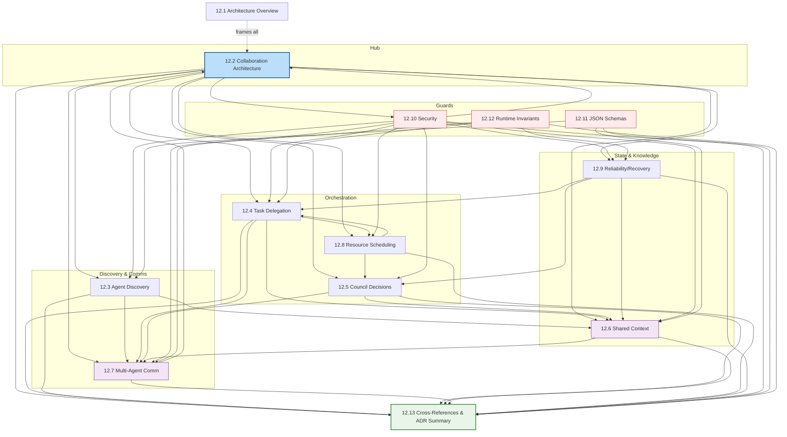

# Part 12.13: Cross-References & ADR Summary

> **Purpose**: This is the concluding integration document for **Part 12 — Multi-Agent Collaboration Architecture** of AI-OS. It consolidates Part 12's parts, ADRs, and dependencies into a single navigable reference, maps the collaboration layer to the surrounding AI-OS architecture (Parts 1–15, the Hermes Kernel runtime, the knowledge layer, and governance), and provides traceability, maturity assessment, and evolution guidance.
>
> **Status**: ACTIVE
>
> **Version**: 1.0.0
>
> **Last Updated**: 2026-08-08
>
> **Companion documents**: `README.md`, `adrs.md`, `dependency-map.md`, `components.md`, `glossary.md`, `events.md`, `12.1`–`12.12`

---

## Executive Summary

Part 12 specifies the **collaboration layer** of AI-OS — the substrate that turns the Hermes Kernel's event-driven runtime and autonomous agents into a *cooperative* system. It defines how agents discover one another, form teams, delegate tasks, share context, make collective decisions, schedule resources, and recover from failure — all without violating the kernel's Event-First and Kernel-as-Orchestrator principles.

This chapter integrates the preceding twelve sections (`12.1`–`12.12`) with:

- the **foundational Parts 1–11** that Part 12 builds upon,
- the **future Parts 13–15** that depend on Part 12 contracts,
- the **Hermes Kernel runtime** (EventBus, Kernel, Core Managers, Engineering Services) that physically implements every Part 12 mechanism,
- the **knowledge layer** (five-tier memory) that anchors shared context and learning, and
- the **governance framework** (Councils, ADRs, FinalJudge) that keeps the collaboration layer safe and accountable.

It also serves as the **single source of truth for ADR status**: of the Part 12 ADRs, **ten are Accepted** (P12-ADR-001 … P12-ADR-010), each mapped to the core AI-OS ADRs (ADR-001 … ADR-016) and to the Part 12 sections they govern.

**Key takeaway**: Part 12 adds *no new runtime substrate*. It is a set of conventions, schemas, and governance contracts layered on top of the existing Hermes Kernel. Every Part 12 decision is traceable to a kernel capability (EventBus, StateManager, CouncilManager, ResourceManager, MemoryManager, SecurityManager) or to a core architectural decision.

---

## Architecture Recap

### The Part 12 mental model

Part 12 sits between the **foundational runtime (Parts 1–5)** and **specialized agent capabilities (Parts 6–11)**, exposing three forward contracts that future parts and sibling parts consume:

| Forward Contract | Part 12 Owner | Consumed By |
|------------------|--------------|-------------|
| **Collaboration Event Bus** | 12.7 (Multi-Agent Communication) | Parts 6–11, 13–15 |
| **Shared Context Service** | 12.6 (Shared Context & Knowledge Exchange) | Parts 6–11, 13–15 |
| **Task Orchestration API** | 12.4 (Task Delegation & Workflow Orchestration) | Parts 6–11, 13–15 |

### How Part 12 maps to the Hermes Kernel implementation

The conceptual Collaboration layer is *physically realized* by kernel capabilities already present in `src/aios/` (see `architecture/Common/ARCHITECTURAL_INVENTORY.md`):

| Part 12 Concept | Hermes Kernel Implementation | Source |
|-----------------|------------------------------|--------|
| Collaboration Event Bus | `EventBus` (sync/async pub-sub, history, filters) | `events/bus.py` |
| Coordination event chains | `EventType` (90+ typed events) + `correlation_id`/`causation_id` | `events/types.py`, `base.py` |
| Agent Discovery | `CapabilityManager` + service registry | `core/*`, `services/registry.py` |
| Council decisions | `CouncilManager` (5 roles, 5 consensus algorithms) | `core/council_manager.py` |
| Shared context | `StateManager` (4 scopes) + `MemoryManager` (5 tiers) | `core/state.py`, `core/memory.py` |
| Task orchestration | `WorkflowManager` (DAG, parallel, checkpoint) | `core/workflow.py` |
| Scheduling / quotas | `ResourceManager` (7 resource types) + `RetryManager` | `core/resource_manager.py`, `core/retry.py` |
| Failure recovery | `RootCauseAnalyzer` (8 categories, 7 recovery actions) | `core/root_cause.py` |
| Zero-trust security | `SecurityManager` + skill/MCP trust (Part 2 / 12.10) | `core/*`, Part 2 |
| Human oversight | `FinalJudge` agent + escalation | `core/ai_agency.py` |

This mapping is the backbone of the **traceability matrix** later in this document.

### The collaboration lifecycle (recap)

A collaboration session flows: `Idle → SessionRequested → AgentMatching → Negotiation → SessionActive → TaskDelegation → TaskExecution → ContextUpdate ⇄ → SessionCompletion/SessionFailed → ContextConsolidation → SessionArchived`. Every transition is a typed event, enabling checkpointing, replay, and audit (see `12.1` §5).

---

## Cross-Reference Matrix for Parts 1–15

Part 12 depends on Parts 1–11 and provides contracts to Parts 13–15. The matrix below maps the relationship *and* the specific integration points. (Part 12's own section numbers, `12.1`–`12.12`, are listed for self-reference.)

| Part | Title (conceptual) | Relationship to Part 12 | Specific Integration Points |
|------|--------------------|-------------------------|-----------------------------|
| **Part 1** | Core Runtime / Agent Model | **Foundation** | Agent lifecycle hooks, basic messaging primitive, resource isolation for collaboration sandboxes (12.8, 12.10) |
| **Part 2** | Security Framework | **Foundation + Extension** | Identity & auth for `CapabilityInvocationToken` (P12-ADR-008); ACL enforcement on Shared Context (12.6); audit trail (12.10) |
| **Part 3** | Observability | **Foundation** | Metrics/tracing/logging for collaboration dashboards (12.1 §9.1); correlation-ID propagation across sessions |
| **Part 4** | Data Management & EventBus | **Foundation (primary substrate)** | EventBus as the *only* communication medium (P12-ADR-001); shared storage for context/knowledge (12.6) |
| **Part 5** | Configuration & Extensibility | **Foundation** | Dynamic config for collaboration policies; feature flags; service discovery for agent lookup (12.3) |
| **Part 6** | Reasoning / Inference APIs | **Enhancement (reverse dependency)** | Reasoning APIs for capability negotiation; consumes Collaboration Event Bus |
| **Part 7** | Learning / Model Management | **Enhancement (reverse dependency)** | Knowledge exchange via memory events (P12-ADR-009); model routing for council agents |
| **Part 8** | Planning / Goal Decomposition | **Enhancement** | Goal decomposition feeds Task Orchestration API (12.4); workflow primitives |
| **Part 9** | Specialized Agent Capabilities | **Enhancement (reverse dependency)** | Heterogeneous agent skills discovered via Capability Registry (12.3); Skill APIs |
| **Part 10** | Advanced Cognitive Architectures | **Enhancement (reverse dependency)** | Meta-reasoning for strategy evaluation; council participants |
| **Part 11** | Monitoring / Validation Architecture | **Foundation + Consume** | SLI/SLO for collaboration (12.1 §9.1); conformance levels L1–L11 enforced on Part 12 ADRs (12.12) |
| **Part 12** | Multi-Agent Collaboration *(this part)* | **Self** | 12.1 Overview · 12.2 Collaboration · 12.3 Discovery · 12.4 Delegation · 12.5 Council · 12.6 Shared Context · 12.7 Communication · 12.8 Scheduling · 12.9 Reliability · 12.10 Security · 12.11 Schemas · 12.12 Invariants · **12.13 Integration** |
| **Part 13** | Domain Applications | **Consumer** | Depends on Collaboration Event Bus, Shared Context, Task Orchestration contracts (no back-dependency) |
| **Part 14** | Vertical Stacks | **Consumer** | Builds domain workflows atop Part 12 orchestration (12.4) |
| **Part 15** | Extensions | **Consumer** | New collaboration capabilities added via governed extension points (P12-ADR-002, ADR-013) |

> **Note on numbering**: The conceptual Parts 1–15 model above is the one used consistently by Part 12's sibling documents (`12.1` §15, `dependency-map.md`). It is distinct from the *implementation* specification TOC in `architecture/Common/ARCHITECTURE_SPEC_TOC.md`, which organizes the same runtime into Part 0 (front matter) through Part 16 (open decisions). Both views are reconciled in [Relationship to Runtime Architecture](#relationship-to-runtime-architecture).

---

## Internal Chapter Dependency Map

The twelve Part 12 sections form a directed graph. `12.2` (Collaboration Architecture) is the hub; `12.6` (Shared Context) and `12.7` (Communication) are cross-cutting; `12.10` (Security) guards every boundary.



**Initialization order** (per `dependency-map.md` §6.2 R6): Agent Discovery (12.3) → Shared Context (12.6) → Collaboration Architecture (12.2) → Task Delegation (12.4) → Communication (12.7) → Scheduling (12.8) → Security (12.10) → Council (12.5) → Reliability (12.9). Schemas (12.11) and Invariants (12.12) are validated continuously.

---

## External Dependency Map

Part 12's *external* dependencies are the kernel subsystems and cross-cutting concerns it relies on. These are owned outside Part 12; Part 12 is a consumer (and, for Parts 6–11, a contract provider).

```mermaid
flowchart LR
    subgraph P12["Part 12 Collaboration"]
        C1[12.2-12.10 Components]
    end
    subgraph RUNTIME["Hermes Kernel (Runtime)"]
        EB[EventBus]
        KM[Kernel / Core Managers]
        CM[CouncilManager]
        RM[ResourceManager]
        SM[StateManager]
        MM[MemoryManager]
        SEC[SecurityManager]
        RCA[RootCauseAnalyzer]
    end
    subgraph EXT["Libraries / Standards"]
        PY[Python 3.12+, Pydantic v2]
        YAML[PyYAML]
        TYPER[Typer / Rich]
        RFC[RFC 2119 (MUST/SHOULD)]
    end

    C1 --> EB
    C1 --> KM
    C1 --> CM
    C1 --> RM
    C1 --> SM
    C1 --> MM
    C1 --> SEC
    C1 --> RCA
    EB --> PY
    KM --> PY
    KM --> YAML
    KM --> TYPER
    C1 -.conformance.-> RFC

    classDef ext fill:#fff3e0,stroke:#ef6c00,stroke-width:1px;
    classDef rt fill:#e3f2fd,stroke:#1565c0,stroke-width:1px;
    classDef p12 fill:#bbdefb,stroke:#0d47a1,stroke-width:2px;
    class C1 p12;
    class EB,KM,CM,RM,SM,MM,SEC,RCA rt;
    class PY,YAML,TYPER,RFC ext;
```

**Criticality & failure impact** (abridged; full detail in `dependency-map.md` §9):

| External Dependency | Criticality | Failure Impact | Recovery |
|---------------------|------------|----------------|----------|
| EventBus | Critical | All inter-agent comm lost | Kernel restart; in-flight events drained |
| StateManager / MemoryManager | Critical | Shared context unavailable | Checkpoint restore (12.9) |
| CouncilManager | High | Collective decisions blocked | Escalate to FinalJudge |
| ResourceManager | High | Starvation / overload | Retry budgets + priority scheduling |
| SecurityManager | Critical | Collaboration boundary open | Quarantine agents; fail-closed |

---

## ADR Summary

Part 12 governs itself through Architectural Decision Records defined in `adrs.md`. The table below summarizes the **ten Accepted ADRs** cataloged in that document.

| ID | Title | Category | Status | Date | Core ADR | Section(s) |
|----|-------|----------|--------|------|----------|------------|
| **P12-ADR-001** | Event-First Collaboration Architecture | Communication | Accepted | 2026-07-15 | ADR-001 | 12.1, 12.2, 12.7 |
| **P12-ADR-002** | Agent Discovery via Capability Registry | Discovery | Accepted | 2026-07-18 | ADR-003, ADR-013 | 12.3 |
| **P12-ADR-003** | Council-Based Decision Architecture | Governance | Accepted | 2026-07-20 | ADR-003, ADR-006 | 12.5 |
| **P12-ADR-004** | Workflow Orchestration via Event Chains | Orchestration | Accepted | 2026-07-22 | ADR-005, ADR-006 | 12.4 |
| **P12-ADR-005** | Shared Context as Distributed State | State Mgmt | Accepted | 2026-07-24 | ADR-008, ADR-016 | 12.6 |
| **P12-ADR-006** | Capability-Based Task Delegation | Delegation | Accepted | 2026-07-26 | ADR-003, ADR-009 | 12.4 |
| **P12-ADR-007** | Priority-Based Collaboration Scheduling | Scheduling | Accepted | 2026-07-28 | ADR-004, Part 11 | 12.8 |
| **P12-ADR-008** | Zero-Trust Security for Multi-Agent Collaboration | Security | Accepted | 2026-07-30 | ADR-009, Part 8 | 12.10 |
| **P12-ADR-009** | Knowledge Exchange via Structured Memory Events | Knowledge | Accepted | 2026-08-01 | ADR-016, ADR-008 | 12.6 |
| **P12-ADR-010** | Runtime Contracts for Agent Interoperability | Interop | Accepted | 2026-08-03 | ADR-008, ADR-011 | 12.12 |

> **Catalog status**: `adrs.md` §9.1 records ADRs 001–010 in full. The Part 12 version-alignment table (§7.3) reserves the range **P12-ADR-011 … P12-ADR-015** for the 1.1.0 expansion ("ADRs for advanced topics"). Those five records are slated but not yet written into the catalog; they are tracked here as *Planned* (see [Open Architecture Questions](#open-architecture-questions)).

---

## ADR Status Matrix

| ID | Status | Lifecycle State | Supersedes | Superseded By | Conformance Level |
|----|--------|-----------------|-----------|---------------|-------------------|
| P12-ADR-001 | Accepted | Accepted | — | — | L8 |
| P12-ADR-002 | Accepted | Accepted | — | — | L8 |
| P12-ADR-003 | Accepted | Accepted | — | — | L8 |
| P12-ADR-004 | Accepted | Accepted | — | — | L8 |
| P12-ADR-005 | Accepted | Accepted | — | — | L8, L10, L11 |
| P12-ADR-006 | Accepted | Accepted | — | — | L8 |
| P12-ADR-007 | Accepted | Accepted | — | — | L8, L10, L11 |
| P12-ADR-008 | Accepted | Accepted | — | — | L8 |
| P12-ADR-009 | Accepted | Accepted | — | — | L8, L10, L11 |
| P12-ADR-010 | Accepted | Accepted | — | — | L8, L10, L11 |
| P12-ADR-011 … 015 | Planned | Draft (not yet submitted) | — | — | TBD |

**Lifecycle policy**: Accepted ADRs are immutable. Any change requires a new superseding ADR (see `adrs.md` §3.4, Rule L5.2). Transitions are recorded as immutable events on the EventBus with the originating ADR correlated.

---

## Architectural Decisions by Topic

Grouping the ten Accepted ADRs by architectural concern makes the decision landscape navigable.

### Communication & Coordination
- **P12-ADR-001** — Agents communicate *only* via the EventBus using coordination event chains; session-scoped correlation IDs.
- **P12-ADR-010** — Runtime contracts (`ICollaborationEventBus`, `ISharedContextService`, `ITaskOrchestration`) guarantee agent interoperability across versions.

### Discovery & Delegation
- **P12-ADR-002** — Capability Registry with centralized writes / distributed cached reads; trust scores; schema-validated descriptors.
- **P12-ADR-006** — Multi-factor delegation scoring (capability, resource, trust, urgency, history); delegation-chain accountability; escalation on `DelegationFailed`.

### Orchestration & State
- **P12-ADR-004** — Collaborative workflows as DAGs of `CollaborationTask` nodes executed by `WorkflowManager` through event chains; task-level checkpoints.
- **P12-ADR-005** — Shared context via `StateManager` scoped hierarchy + event-sourced updates; LWW conflict resolution; CRDTs for high-contention state.

### Governance & Scheduling
- **P12-ADR-003** — Weighted voting through `CouncilManager`; escalation to FinalJudge; immutable audit trail.
- **P12-ADR-007** — Fair queuing with priority boosting over `ResourceManager`; quota enforcement; starvation prevention.

### Security & Knowledge
- **P12-ADR-008** — Zero-trust with token-bound capabilities; continuous auth; per-action authorization; context-poisoning prevention.
- **P12-ADR-009** — Knowledge exchange via tier-routed structured memory events (Working → Claude → Engineering → Obsidian/Graphify).

---

## Relationship to Runtime Architecture

Part 12 is a **logical layer over the Hermes Kernel runtime** (`architecture/Common/ARCHITECTURE_SPEC_TOC.md`, Part 3). It does not introduce new processes; it prescribes *how kernel capabilities are composed* for collaboration.

### Conceptual Parts ↔ Implementation TOC reconciliation

| Conceptual Part | Implementation Equivalent (TOC) |
|-----------------|---------------------------------|
| Part 1 Core Runtime | Part 3 Hermes Kernel (core components, lifecycle) + Part 5 Service Framework |
| Part 2 Security | Part 12.10 / kernel SecurityManager + Part 12 event authorization |
| Part 3 Observability | Part 10 Observability & Logging (structlog, metrics, tracing) |
| Part 4 Data / EventBus | Part 2 Event System (EventBus, EventType, handlers) |
| Part 5 Configuration | Part 8 Configuration System |
| Part 6 Reasoning | AI Agency agents (`core/ai_agency.py`) + ModelRouter |
| Part 7 Learning | Part 6 LearningService + MemoryManager (Engineering Intelligence tier) |
| Part 8 Planning | Part 6 PlanningService (SDLC) + WorkflowManager |
| Part 9 Specialized Agents | SkillManager + MCPManager + capability services |
| Part 10 Advanced Cognition | CouncilManager + AI Agency meta-review |
| Part 11 Monitoring/Validation | Part 11 Testing Strategy + Part 12.12 Runtime Invariants |
| Part 12 Collaboration | **This part** (logical overlay) |
| Part 13–15 Domain/Extensions | Future parts; governed extension points (Part 14) |

### Runtime guarantees Part 12 relies on
- **Event-First** (ADR-001): collaboration never calls another agent directly.
- **Kernel as Orchestrator** (ADR-002): `HermesKernel` owns the 4 core components; collaboration managers are kernel-managed.
- **No Direct Calls** (ADR-005): services communicate only by events.
- **Immutable Events** (ADR-008): `correlation_id`/`causation_id` enable session tracing and replay.
- **Singleton Accessors** (ADR-004): `get_event_bus()`, `get_council_manager()`, etc. — *see [Open Architecture Questions](#open-architecture-questions) re: DI migration*.

The Part 12 `dependency-map.md` §7 sequence diagram (Kernel → Part 12 init → Parts 6–11 init → runtime collaboration) is the canonical runtime flow.

---

## Relationship to Knowledge Layer

Part 12's **Shared Context** and **Knowledge Exchange** (12.6, P12-ADR-005, P12-ADR-009) are physically backed by the **five-tier memory architecture** (ADR-016):

| Memory Tier | Role in Collaboration |
|-------------|------------------------|
| **Working** | Volatile, session-scoped reasoning context; council state; delegation records |
| **Claude** | Semi-persistent agent conversation/session history |
| **Engineering Intelligence** | Persistent collaboration patterns, best practices, extracted knowledge (`PatternRecognized`) |
| **Obsidian** | Archival of session records, ADRs, meeting notes (`KnowledgeDocumented`) |
| **Graphify** | Knowledge graph of agent capabilities, collaboration histories, trust (`EntityRelationshipMapped`) |

Knowledge flows through six structured memory events (`KnowledgeExtracted`, `PatternRecognized`, `KnowledgeDocumented`, `EntityRelationshipMapped`, `KnowledgeShared`, `KnowledgeConsolidated`), each routed to the appropriate tier. This makes Part 12 the *primary producer* of organizational learning that later parts and future sessions consume.

---

## Relationship to Governance

Governance in AI-OS is realized by **Councils** and the **ADR process**, both of which Part 12 depends on and extends.

- **CouncilManager** (kernel, `core/council_manager.py`) provides the weighted-voting engine behind **P12-ADR-003**. Collaboration councils deliberate via events and escalate deadlock/dissent to **FinalJudge** (ADR-006 human oversight).
- **ADR process** (`adrs.md`): every Part 12 architectural decision is an ADR; the ARB (Architecture Review Board) approves with a documented vote; Security/Engineering/Research Councils review; FinalJudge holds veto on critical decisions.
- **Conformance** (12.12, Part 11): Part 12 ADRs are validated against conformance levels L1–L11; compliance is verified at each Part 12 version release (Rule V7.1).
- **Open Decisions** (Part 16 of the implementation TOC): cross-part open questions — global singletons vs. DI, event schema registry, `datetime.utcnow()` replacement — are tracked centrally and reflected in [Open Architecture Questions](#open-architecture-questions).

---

## Relationship to Future Parts

Part 12 publishes three **forward contracts** and must not depend on Parts 13–15 (Rule R1). Future parts consume collaboration infrastructure:

- **Part 13 (Domain Applications)** consumes the Collaboration Event Bus, Shared Context Service, and Task Orchestration API to build goal-driven domain workflows.
- **Part 14 (Vertical Stacks)** compose domain workflows atop `12.4` orchestration.
- **Part 15 (Extensions)** add new collaboration capabilities through governed extension points (P12-ADR-002, ADR-013), never by modifying Part 12 internals.

Versioning: future parts MUST bind to specific Part 12 interface versions (Rule R17); breaking changes increment MAJOR with a migration path (Rule R16). Planned Part 12 enhancements (semantic capability matching v1.3, predictive pre-staging v1.5, zero-trust-native v2.5, cross-org federation v3.0) are forward-compatible by design (`12.1` §14).

---

## Navigation Guide

| If you want to… | Go to |
|------------------|-------|
| Understand the big picture | `12.1` Architecture Overview |
| See how agents cooperate | `12.2` Collaboration Architecture |
| Find/discover agents | `12.3` Agent Discovery & Capability Management |
| Delegate & orchestrate work | `12.4` Task Delegation & Workflow Orchestration |
| Make collective decisions | `12.5` Council Decision Architecture |
| Share state & knowledge | `12.6` Shared Context & Knowledge Exchange |
| Communicate between agents | `12.7` Multi-Agent Communication |
| Allocate resources & schedule | `12.8` Resource Coordination & Scheduling |
| Survive failures | `12.9` Reliability, Recovery & Performance |
| Secure collaboration | `12.10` Security Architecture |
| Validate message formats | `12.11` JSON Schemas |
| Verify runtime correctness | `12.12` Runtime Invariants & Conformance |
| **Cross-reference everything / ADR status** | **`12.13` (this doc)** |
| Browse components | `components.md` |
| Read decision records | `adrs.md` |
| See dependency graph | `dependency-map.md` |
| Look up terms | `glossary.md` |
| Inspect events | `events.md` |

---

## Recommended Reading Paths

### Path A — New contributor (mental model first)
`12.1` → `12.2` → `12.7` → `12.3` → `12.6` → `glossary.md`

### Path B — Security reviewer
`12.10` → `P12-ADR-008` (in `adrs.md`) → `12.7` → `12.6` (access control) → `12.12` (invariants)

### Path C — Runtime / kernel engineer
`dependency-map.md` → `Relationship to Runtime Architecture` (this doc) → `12.4` → `12.8` → `components.md`

### Path D — Governance / architecture board
`adrs.md` (process + §9 summary matrix) → `ADR Status Matrix` (this doc) → `12.5` → `12.12` → `Open Architecture Questions` (this doc)

### Path E — Implementation tracer (concept → code)
Pick a concept in the [Architecture Recap](#architecture-recap) table → follow the "Hermes Kernel Implementation" column to `src/aios/` → cross-check `architecture/Common/ARCHITECTURAL_INVENTORY.md`

### Path F — Future-part author (consumer of Part 12)
`Relationship to Future Parts` (this doc) → `12.4` (Task Orchestration API) → `12.6` (Shared Context Service) → `12.7` (Collaboration Event Bus) → `12.11` (schemas)

---

## Architecture Maturity Assessment

Assessed against the Part 12 objectives: decentralized coordination, interoperability, scalability, resilience, transparency, adaptability, security/privacy, predictability.

| Dimension | Maturity | Evidence | Gap |
|-----------|----------|----------|-----|
| **Decentralized coordination** | Mature | P12-ADR-001/004 event chains; no central controller | Council quorum for small teams (12.5) |
| **Interoperability** | Mature | P12-ADR-010 runtime contracts; semver (ADR-011) | Interface IDL/TLA+ specs not yet auto-generated |
| **Scalability** | Defined | Targets: 10k agents, 100k evt/s (12.1 §12) | Unverified at scale; load tests pending |
| **Resilience** | Defined | P12-ADR-004/006/007 + RCA + checkpoints | Kernel retry/checkpoint bugs open (see below) |
| **Transparency** | Mature | Immutable events (ADR-008); audit trails | Structlog not yet adopted (Part 10) |
| **Adaptability** | Emerging | Feedback loops; planned ML scoring | Adaptive scoring not implemented |
| **Security/Privacy** | Mature (design) | P12-ADR-008 zero-trust | Not penetration-tested; tokens unimplemented |
| **Predictability** | Defined | DAG + invariants (12.12) | Workflow versioning/compensation missing |

**Implementation-maturity caveat**: While Part 12's *design* is mature, the underlying Hermes Kernel has **6 critical production bugs** (Event `kw_only`, RetryManager semantics, RootCauseAnalyzer classification ×2, CheckpointManager pre-state, ServiceRegistry test doubles) and 12/21 integration tests failing (`ARCHITECTURE_REVIEW_REPORT.md`). Part 12's resilience guarantees are therefore *design-complete but runtime-unverified* until those are fixed.

**Overall maturity**: **Design L4 / Runtime L2** — specification is production-grade; implementation conformance is interim.

---

## Traceability Matrix

Every Part 12 section and ADR traces to a kernel capability and (where applicable) a core ADR.

| Part 12 Item | ADR | Core ADR | Kernel Capability | Implementation File |
|--------------|-----|----------|-------------------|---------------------|
| 12.1 Overview | P12-ADR-001 | ADR-001 | EventBus, Kernel | `events/bus.py`, `core/kernel.py` |
| 12.2 Collaboration | P12-ADR-001, 004 | ADR-001, 005 | EventBus | `events/*` |
| 12.3 Discovery | P12-ADR-002 | ADR-003, 013 | CapabilityManager, ServiceRegistry | `services/registry.py` |
| 12.4 Delegation | P12-ADR-004, 006 | ADR-005, 009 | WorkflowManager | `core/workflow.py` |
| 12.5 Council | P12-ADR-003 | ADR-003, 006 | CouncilManager, FinalJudge | `core/council_manager.py`, `core/ai_agency.py` |
| 12.6 Shared Context | P12-ADR-005, 009 | ADR-008, 016 | StateManager, MemoryManager | `core/state.py`, `core/memory.py` |
| 12.7 Communication | P12-ADR-001, 010 | ADR-001, 008 | EventBus, handlers | `events/bus.py`, `events/handlers.py` |
| 12.8 Scheduling | P12-ADR-007 | ADR-004, 009 | ResourceManager, RetryManager | `core/resource_manager.py`, `core/retry.py` |
| 12.9 Reliability | (ADR-009) | ADR-009 | RootCauseAnalyzer, CheckpointManager | `core/root_cause.py`, `core/checkpoint.py` |
| 12.10 Security | P12-ADR-008 | ADR-009, 013 | SecurityManager | `core/*`, Part 2 |
| 12.11 Schemas | (ADR-008, 011) | ADR-008, 011 | EventType | `events/types.py` |
| 12.12 Invariants | P12-ADR-010 | ADR-008, 011 | EventBus, WorkflowManager | `events/*`, `core/workflow.py` |
| 12.13 Integration | All | All | All | this document |

---

## Future Evolution Roadmap

Bridging `12.1` §14, `adrs.md` §7.3, and the implementation TOC Part 16.

| Horizon | Item | Driver | Part 12 Impact |
|---------|------|--------|---------------|
| **v1.1.0** | Author P12-ADR-011 … 015 | Catalog gap in `adrs.md` §7.3 | Close the Planned ADRs |
| **v1.3** | Semantic capability matching (ML) | Beyond keyword matching | Extends P12-ADR-002 |
| **v1.5** | Predictive session pre-staging | Anticipate collaboration needs | Extends P12-ADR-007 |
| **v2.0** | Adaptive policy optimization (ML) | Outcome-driven policies | Extends P12-ADR-003 |
| **v2.2** | Hierarchical council structures | Domain/global scopes | Extends P12-ADR-003 |
| **v2.5** | Zero-trust-native collaboration | Mutual attestation/encryption | Extends P12-ADR-008 |
| **v3.0** | Cross-organization federation | Federated identity/policy | New forward contracts |
| **Runtime** | Fix 6 critical kernel bugs | Conformance (Part 11) | Unblocks resilience verification |
| **Runtime** | Global-singleton → DI migration | ADR-004 / Part 16 open decision | Refactors all accessors |
| **Runtime** | Event schema registry + versioning | ADR-008/011 open decision | Hardens 12.11 |

---

## Open Architecture Questions

These are unresolved decisions that affect Part 12 and are tracked in the implementation TOC Part 16 / `adrs.md` Appendix C.

1. **Global Singletons vs. Dependency Injection** — Part 12 relies on `get_xxx()` accessors (ADR-004). A DI migration (recommended in `ARCHITECTURAL_INVENTORY.md` TD-005) would change how collaboration managers obtain kernel capabilities. *Decision needed before v1.1.*
2. **Event Schema Registry** — Events are dict-serialized with no evolution strategy. Part 12 schemas (12.11) need a registry (ADR-011 open decision) for safe cross-version collaboration.
3. **`datetime.utcnow()` replacement** — 15+ files use the deprecated call (`ARCHITECTURE_REVIEW_REPORT.md` TD-001). Affects event timestamps/correlation used by 12.6/12.7. *P0 before freeze.*
4. **Planned ADRs 011–015** — Reserved in `adrs.md` §7.3 but not yet authored. Scope: advanced topics (semantic discovery, adaptive policy, federation primitives).
5. **CRDT vs. LWW for Shared Context** — P12-ADR-005 chose LWW with CRDTs for high-contention only. When to promote more state to CRDTs is open.
6. **Token-Bound Capability Lifecycle** — P12-ADR-008 specifies 5-min token TTLs; implementation/refresh strategy for mass agent startup (token-refresh storm) is unvalidated.
7. **Multi-Council Federation** — v2.2 roadmap item; interface boundaries between domain councils undefined.
8. **Distributed EventBus** — Current bus is in-process (Part 3 topology). Cross-process collaboration (required for 10k-agent target) needs a sharded/remote bus — design pending.

---

## References

- `README.md` — Part 12 index, principles, invariants
- `adrs.md` — Full ADR catalog, process, lifecycle, governance
- `dependency-map.md` — Dependency matrix, layer diagram, validation rules
- `components.md` — Component reference
- `glossary.md` — Terminology
- `events.md` — Event architecture for collaboration
- `12.1`–`12.12` — Part 12 section documents
- `architecture/Common/ARCHITECTURAL_INVENTORY.md` — Kernel implementation inventory
- `architecture/Common/ARCHITECTURE_REVIEW_REPORT.md` — Production-readiness review
- `architecture/Common/ARCHITECTURE_SPEC_TOC.md` — Implementation specification TOC (Parts 0–16)
- `MIGRATION_PLAN.md` — Event-driven migration plan
- Core ADRs (ADR-001 … ADR-016) — `project-knowledge/ARCHITECTURE_DECISIONS.md`
- RFC 2119 — Key word conventions (MUST/SHOULD/MAY)

---

## Appendix

### A. Part 12 ↔ Core ADR Index

| Core ADR | Part 12 ADR(s) that depend on it |
|----------|----------------------------------|
| ADR-001 Event-First | P12-ADR-001, 004, 005, 010 |
| ADR-003 Capability Manager Ownership | P12-ADR-002, 003, 006 |
| ADR-004 Global Accessors | P12-ADR-007 |
| ADR-005 Event-Driven Services | P12-ADR-004 |
| ADR-006 Human Oversight / SDLC Pipeline | P12-ADR-003, 004 |
| ADR-008 Immutable Events | P12-ADR-001, 005, 009, 010, 012-contracts |
| ADR-009 Failure Handling | P12-ADR-006, 007, 008 |
| ADR-011 Versioning | P12-ADR-010 |
| ADR-013 Extension Points | P12-ADR-002, 008 |
| ADR-016 Memory Architecture | P12-ADR-005, 009 |

### B. ADR ID Allocation Log (abridged)

| Range | Status | Note |
|-------|--------|------|
| P12-ADR-001 … 010 | Allocated & Accepted | Full records in `adrs.md` §10 |
| P12-ADR-011 … 015 | Reserved (1.1.0) | Records pending authoring |

### C. Conformance Mapping (Part 12 ADRs → Levels)

Per `adrs.md` §7.4: v1.0.0 requires **L8** (Security Validation); v1.1.0+ requires **L8, L10, L11**. Part 12.12 defines the runtime invariants that operationalize these levels for collaboration components.

### D. Cross-Reference Integrity Rules (from `adrs.md` §8.5)

- **CR8.1** — Every ADR MUST list related ADRs with annotated relationships.
- **CR8.3** — Core ADRs use `[[ADR-NNN]]`; Part 12 ADRs use `[[P12-ADR-NNN]]`.
- **CR8.5** — Cross-references validated quarterly by the Documentation Council.
- **CR8.6** — Broken links reported as `BrokenLinkDetected` events.

### E. Mermaid Diagram Index (this document)

1. [Internal Chapter Dependency Map](#internal-chapter-dependency-map) — section graph + init order
2. [External Dependency Map](#external-dependency-map) — kernel + library dependencies
3. (Referenced) `dependency-map.md` §3 — full Mermaid dependency graph
4. (Referenced) `dependency-map.md` §4 — layered architecture graph
5. (Referenced) `dependency-map.md` §7 — runtime initialization sequence
6. (Referenced) `12.1` §5 — collaboration lifecycle state diagram

---

*Document Version: 1.0.0*
*Last Updated: 2026-08-08*
*Status: ACTIVE*
*AI-OS Architecture Specification v1.0 — Part 12.13 (Concluding Integration Document)*
