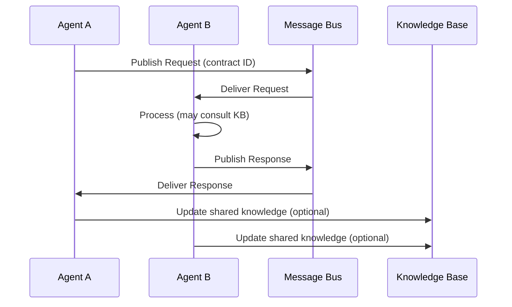
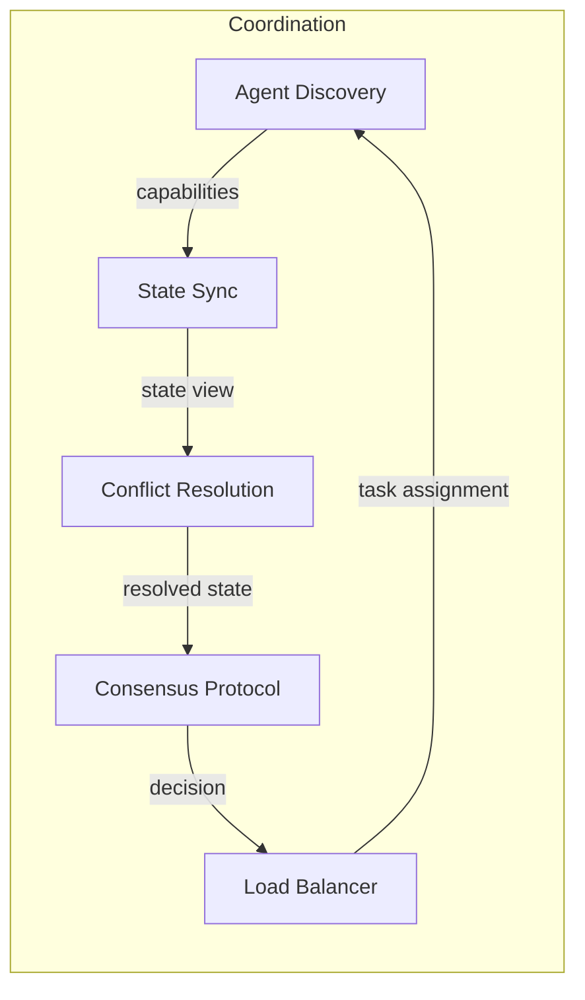
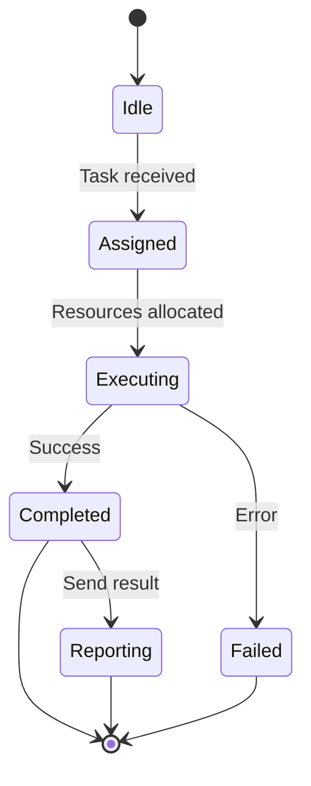
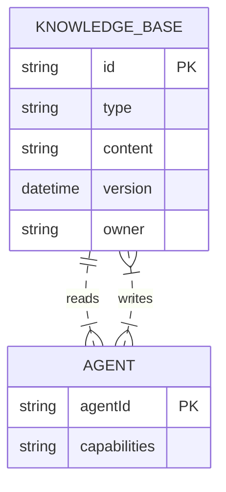
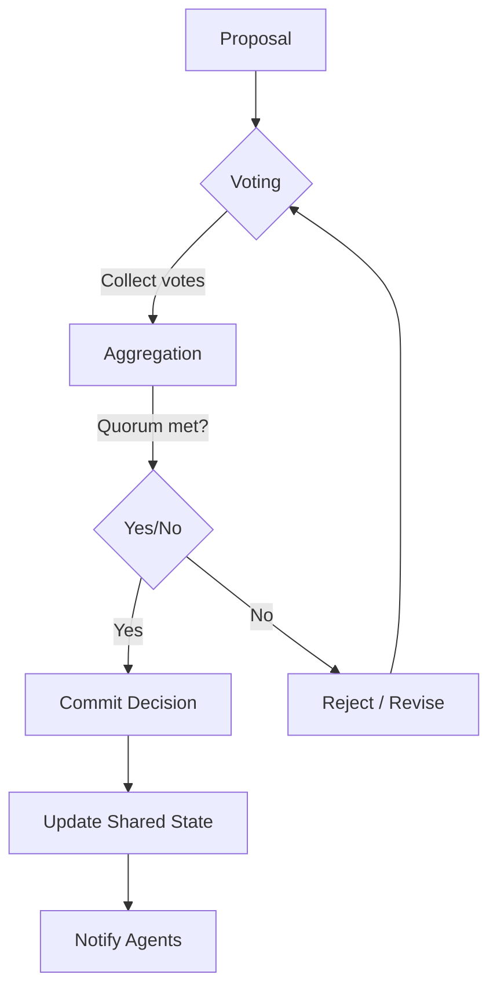
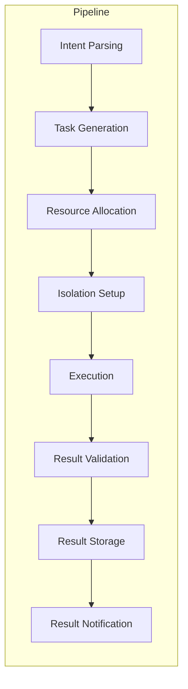
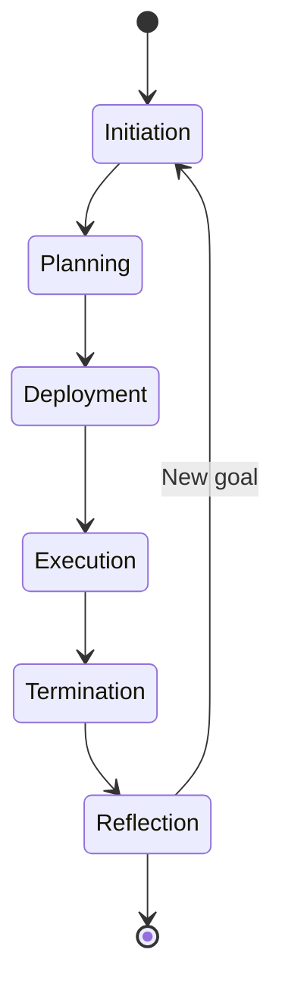
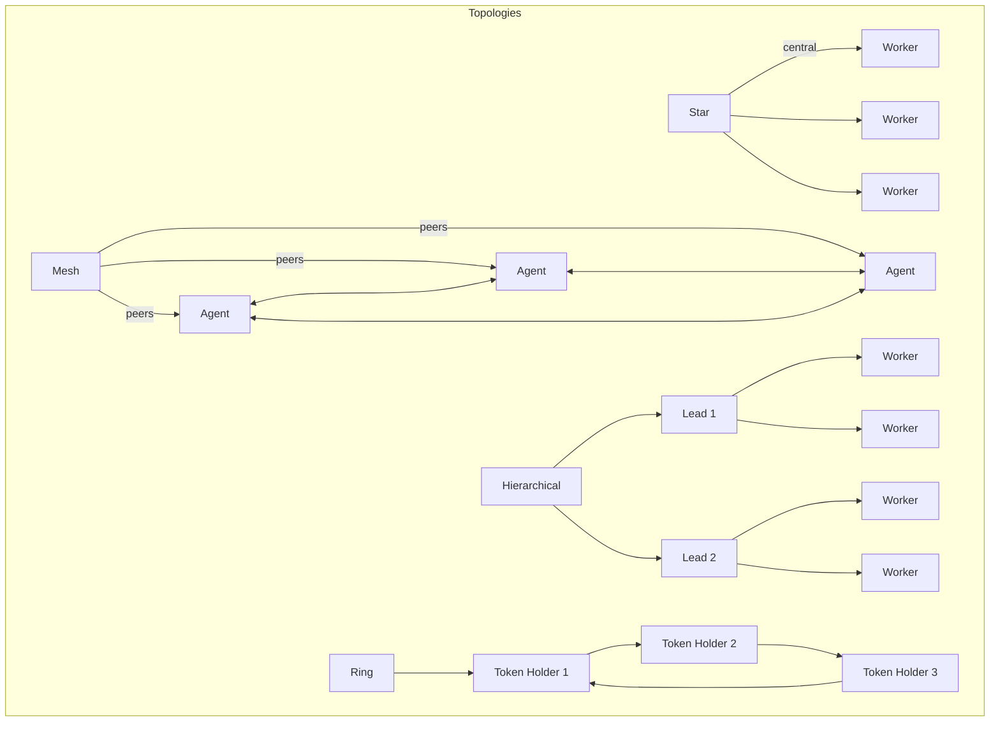

# Part 12.2: Collaboration Architecture

This document defines the collaboration architecture for the AI-OS, describing how agents, services, and components interact to achieve coordinated behavior. The architecture is purely structural and behavioral; no implementation details are included.

## Collaboration Layers

The collaboration architecture is organized into four primary layers:

1. **Orchestration Layer** – Responsible for high-level workflow decomposition, task scheduling, and global goal alignment.
2. **Coordination Layer** – Manages agent discovery, state synchronization, conflict resolution, and consensus mechanisms.
3. **Execution Layer** – Handles the actual execution of tasks by individual agents or agent groups, including resource allocation and isolation.
4. **Knowledge & Communication Layer** – Provides shared knowledge bases, communication channels, and interaction contracts that enable agents to exchange information and make decisions.

```
graph TD
    subgraph Collaboration Layers
        OL[Orchestration Layer]
        CL[Coordination Layer]
        EL[Execution Layer]
        KC[Knowledge & Communication Layer]
        
        OL -->|decomposes goals| CL
        CL -->|synchronizes state| EL
        EL -->|reports results| OL
        KC <-->|shared context| OL
        KC <-->|shared context| CL
        KC <-->|shared context| EL
    end
```

## Communication Flow

Communication follows a request–response pattern with optional event streaming for real‑time updates. All interactions are mediated by well‑defined contracts.



## Orchestration Layer

The Orchestration Layer breaks down high‑level objectives into executable tasks, assigns priorities, and maintains a global execution plan. It does not dictate how tasks are performed; it only defines *what* needs to be done and *when*.

Key responsibilities:
- Goal decomposition into atomic collaboration units.
- Dynamic reprioritization based on system state.
- Workflow versioning and rollback capabilities.
- Interface to the Coordination Layer for task distribution.

## Coordination Layer

The Coordination Layer ensures that agents act in a coherent manner despite concurrency and distribution. It provides:

- **Agent Discovery**: Registry of available agents and their capabilities.
- **State Synchronization**: Mechanisms (e.g., CRDTs, operational transforms) to keep shared state consistent.
- **Conflict Resolution**: Policies for handling concurrent updates (last‑write‑wins, merge functions, manual intervention).
- **Consensus Protocols**: Light‑weight agreement algorithms (e.g., Raft‑style leader election, Paxos subsets) for decisions that require strong consistency.
- **Load Balancing**: Distributes tasks across agents based on current load and affinity.



## Execution Layer

The Execution Layer is where agents carry out assigned work. It provides:

- **Isolation Boundaries**: Sandboxing or worktree isolation to prevent unintended side‑effects.
- **Resource Allocation**: CPU, memory, and tool quotas per agent or task.
- **Lifecycle Management**: Agent spawning, monitoring, and graceful termination.
- **Result Reporting**: Structured output returned to the Orchestration Layer via the Coordination Layer.



## Knowledge Sharing

Shared knowledge is maintained in a distributed knowledge base that supports:
- **Immutable Artifacts**: Version‑stamped documents, diagrams, and models.
- **Mutable Entities**: Shared state objects with defined update contracts.
- **Semantic Tagging**: Enables agents to discover relevant knowledge via metadata.
- **Access Controls**: Role‑based or capability‑based permissions for reading/writing.



## Decision Synchronization

Decisions that affect the global state are synchronized using the Coordination Layer’s consensus protocols. The process follows:

1. **Proposal** – An agent broadcasts a decision proposal.
2. **Voting** – Peers evaluate the proposal against local constraints and cast votes.
3. **Aggregation** – Votes are collected and a decision is reached according to the configured quorum rule.
4. **Commit** – The decision is committed to the shared state and communicated to all agents.



## Agent Interaction Contracts

All agent interactions are governed by explicit contracts that define:
- **Interface**: Message schema, required fields, and data types.
- **Behavior**: Preconditions, postconditions, and side‑effect constraints.
- **QoS**: Latency, reliability, and ordering guarantees.
- **Security**: Authentication, authorization, and encryption requirements.

Contracts are stored in the Knowledge Base and referenced by their unique IDs during communication.

## Internal Collaboration Pipeline

The internal pipeline describes how a collaboration request flows from inception to completion within a single agent or a tightly coupled group.



## Collaboration Lifecycle

A collaboration instance passes through the following phases:

1. **Initiation** – A goal or event triggers the Orchestration Layer.
2. **Planning** – Goals are decomposed, tasks are scheduled, and contracts are selected.
3. **Deployment** – Agents are discovered, isolated, and bound to tasks.
4. **Execution** – Tasks are carried out, state is synchronized, and interim results are shared.
5. **Termination** – Results are aggregated, resources are released, and the collaboration is recorded.
6. **Reflection** – Outcomes are analyzed for learning and future improvement.



## Collaboration Topology

The collaboration topology can vary from fully centralized to fully decentralized, depending on the use case. Common topologies include:

- **Star**: Central orchestrator agents with peripheral workers.
- **Mesh**: Peer‑to‑peer collaboration with ad‑hoc forming of sub‑groups.
- **Hierarchical**: Multiple layers of orchestration (e.g., team leads, department leads).
- **Ring**: Token‑passing scheme for deterministic turn‑based coordination.



## Horizontal Scaling

Horizontal scaling is achieved by:
- Adding more agents of the same type to the Agent Discovery registry.
- Partitioning the knowledge base or message bus to reduce contention.
- Employing stateless coordination mechanisms (e.g., consistent hashing for task distribution).
- Using replicated consensus groups to increase fault tolerance.

## Vertical Scaling

Vertical scaling involves:
- Increasing the resource allocation (CPU, memory, tool quotas) per agent.
- Enhancing the capabilities of individual agents through richer toolsets or larger context windows.
- Optimizing the Orchestration Layer to handle more complex goal decompositions without additional agents.

## Collaboration Patterns

Reusable patterns that emerge from the architecture include:
- **Master‑Worker**: Orchestrator distributes identical tasks to many workers.
- **Pipeline**: Data flows through a sequence of specialized agents.
- **Broadcast‑Collect**: One agent broadcasts a request; multiple agents respond and results are aggregated.
- **Consensus‑Commit**: A group of agents reaches agreement before committing a state change.
- **Lease‑Based Coordination**: Agents acquire temporary leases on resources to avoid conflicts.
- **Event‑Sourced Collaboration**: All interactions are logged as events; state is derived by replaying.

## Shared Ownership

Shared ownership is modeled through:
- **Collective Responsibility**: Multiple agents share authority over a knowledge artifact or a piece of state.
- **Versioned Stewardship**: Ownership transfers are recorded as version changes in the knowledge base.
- **Permission Budgets**: Agents can delegate subsets of their rights to others for limited durations.

## Isolation Boundaries

To prevent unintended interference, the architecture enforces:
- **Process‑Level Isolation**: Each agent runs in its own sandbox (e.g., worktree, container).
- **Namespace Isolation**: File system, environment variables, and tool access are scoped per agent.
- **Communication Boundaries**: Agents can only exchange messages via declared contracts; direct memory access is prohibited.
- **Failure Containment**: Crashes or misbehavior in one agent do not propagate to others.

## Distributed Coordination

When the system spans multiple machines or clusters, coordination relies on:
- **Gossip Protocols**: For eventual consistency of membership and lightweight state.
- **Deterministic Ordering**: Log‑based replication (e.g., RAFT) for strongly consistent decision logs.
- **Edge‑Coordination**: Local coordination clusters handle latency‑sensitive interactions; higher layers handle global decisions.

## Consensus Concepts

The architecture does not mandate a single consensus algorithm; instead, it provides pluggable consensus modules. Key concepts include:
- **Quorum**: Minimum number of agents required to validate a decision.
- **Leader Election**: Optional role to reduce message complexity in certain protocols.
- **Safety & Liveness**: Guarantees that only valid decisions are committed (safety) and that progress is eventually made (liveness).
- **Byzantine Fault Tolerance**: Optional modules that can withstand arbitrary agent failures (used only in high‑trust‑required scenarios).

---
*End of Part 12.2 Collaboration Architecture.*