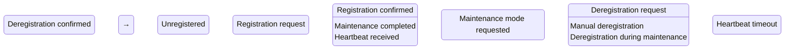

# 12.3 Agent Discovery and Capability Management

## Overview

The Agent Discovery and Capability Management subsystem enables dynamic registration, discovery, and management of agents and their capabilities within the AI-OS. It provides a centralized yet distributed mechanism for agents to advertise their capabilities, negotiate interactions, and maintain up-to-date information about available services.

## Core Components

### Agent Registry

The Agent Registry maintains a directory of all active agents in the system. Each agent entry includes:
- Unique agent identifier
- Current status (active, inactive, maintenance)
- Network endpoint information
- Registration timestamp
- Last heartbeat timestamp
- Associated capabilities
- Metadata tags for classification

### Capability Registry

The Capability Registry stores detailed information about capabilities that agents can provide. Each capability entry includes:
- Capability identifier and version
- Human-readable description
- Input/output schemas
- Required skills and permissions
- Performance characteristics
- Associated agents providing the capability
- Deprecation and migration information

## Key Mechanisms

### Dynamic Discovery

Agents discover each other and their capabilities through:
1. **Passive Discovery**: Querying registries for matching capabilities
2. **Active Advertisement**: Agents broadcasting their availability
3. **Event-based Notification**: Subscribing to registry changes
4. **Hierarchical Lookup**: Checking local, regional, and global registries

### Capability Advertisement

Agents advertise capabilities through:
- Registration messages containing capability manifests
- Periodic heartbeat updates with status changes
- Capability-specific advertisements for high-demand services
- Deprecation notices for retiring capabilities

### Metadata Management

Metadata includes:
- **Static Metadata**: Agent type, version, deployment environment
- **Dynamic Metadata**: Current load, response times, error rates
- **Contextual Metadata**: Location, security domain, compliance tags
- **Relationship Metadata**: Dependencies, incompatibilities, preferred partners

## Agent Lifecycle



## Registration Workflow

1. Agent prepares registration manifest with:
   - Agent ID and version
   - Network endpoints (primary and backup)
   - Capability list with versions
   - Metadata tags
   - Security credentials

2. Agent sends registration request to nearest registry node

3. Registry validates:
   - Agent authenticity
   - Capability schema compliance
   - Resource availability
   - Policy adherence

4. Registry stores agent information and returns registration confirmation

5. Agent begins periodic heartbeat transmission

6. Registry replicates agent information to peer nodes

## Deregistration Workflow

1. Agent sends deregistration request (graceful) or stops heartbeats (ungraceful)

2. For graceful deregistration:
   - Agent stops accepting new requests
   - Completes in-progress operations
   - Sends final deregistration message
   - Registry marks agent as unregistering
   - Registry removes agent after confirmation timeout

3. For ungraceful deregistration:
   - Registry detects missing heartbeats
   - Marks agent as inactive after timeout period
   - Moves to unregistered state after grace period

## Capability Negotiation

When agents need to interact:
1. Requesting agent queries registry for capabilities matching requirements
2. Registry returns list of providing agents with metadata
3. Requesting agent evaluates providers based on:
   - Capability version compatibility
   - Performance metrics
   - Quality of service history
   - Security and compliance factors
   - Network topology
4. Requesting agent selects provider and establishes connection
5. Agents negotiate interaction specifics (data formats, timing, etc.)

## Health Status and Availability Management

Health indicators include:
- **Liveness**: Heartbeat reception (basic availability)
- **Readiness**: Ability to process requests (application-level health)
- **Performance**: Response times, throughput, error rates
- **Resource Utilization**: CPU, memory, disk, network usage
- **Dependency Health**: Status of required services
- **Capability Health**: Specialized health scoring for individual capabilities including success rates, latency profiles, and error patterns

Availability management features:
- Automatic failover to backup agents
- Load balancing across capable agents
- Circuit breaker patterns for unhealthy agents
- Graceful degradation when capabilities are partially available
- Maintenance windows for planned downtime

### Capability Health Scoring

The system maintains detailed health scores for individual capabilities:
- **Capability Success Rate**: Percentage of successful invocations over time windows
- **Latency Health**: Deviation from baseline latency characteristics
- **Error Pattern Analysis**: Classification and frequency of failure modes
- **Resource Efficiency**: CPU, memory, and resource utilization trends
- **Dependency Health Cascade**: Impact of dependent service health on capability availability
- **Composite Capability Health Score**: Weighted aggregation of individual health dimensions for quick assessment

## Discovery Protocols

The system supports multiple discovery protocols:
- **REST/HTTP**: Standard CRUD operations on registry endpoints
- **gRPC**: High-performance streaming for real-time updates
- **WebSocket**: Bidirectional communication for event-driven updates
- **mDNS/DNS-SD**: Local network zero-configuration discovery
- **Custom Binary Protocol**: For high-performance internal communication

## Registry Synchronization and Consistency

To ensure consistency across distributed registry nodes:
- **Eventual Consistency Model**: Updates propagate asynchronously with conflict resolution
- **Vector Clocks**: Track causality of updates across nodes
- **Anti-Entropy Processes**: Periodically reconcile differences between nodes
- **Quorum Reads/Writes**: Require agreement from majority of nodes for strong consistency
- **Conflict Resolution Policies**: Last-write-wins, merge functions, or manual resolution
- **Partition Tolerance**: Continue operating during network splits with heuristic merging

## Scalability Considerations

The discovery system scales through:
- **Hierarchical Registry Structure**: Local, regional, and global registry layers
- **Sharding**: Partition capability space across registry nodes
- **Caching**: Local caches of frequently accessed registry information
- **Read Replicas**: Scale read operations without affecting write performance
- **Asynchronous Processing**: Non-blocking registry updates
- **Load Distribution**: Evenly distribute agent registrations across nodes
- **Bulk Operations**: Efficient handling of mass registration/deregistration events

## Skill Taxonomy and Agent Classification

### Skill Hierarchy

Skills are organized in a taxonomy:
```
Root
├── Cognitive Skills
│   ├── Reasoning
│   ├── Learning
│   ├── Planning
│   └── Perception
├── Communication Skills
│   ├── Natural Language
│   ├── Protocol Translation
│   └── Mediation
├── Manipulation Skills
│   ├── Physical
│   ├── Digital
│   └── Hybrid
���└── Management Skills
    ├── Orchestration
    ├── Monitoring
    └── Administration
```

### Agent Classification

Agents are classified by:
- **Primary Function**: Specialist, Generalist, Coordinator, Broker
- **Capability Breadth**: Narrow, Broad, Full-spectrum
- **Interaction Pattern**: Synchronous, Asynchronous, Event-driven
- **Deployment Context**: Edge, Cloud, Hybrid, Embedded
- **Trust Level**: Public, Private, Privileged, System

## Enhanced Capability Management

### Capability Confidence and Trust Modeling

The system implements a multi-dimensional scoring framework for capabilities that enables intelligent selection and risk-aware composition:

#### Capability Confidence Score
A statistical measure of capability reliability derived from:
- Historical execution success rates across diverse invocation contexts
- Latency consistency and jitter analysis under varying load conditions
- Error pattern classification and root cause frequency analysis
- Resource utilization predictability and variance metrics
- Confidence intervals calculated using Bayesian credible intervals

#### Capability Trust Score
A composite metric integrating multiple trust dimensions:
- Security attestations (code signing, vulnerability scan results, audit compliance)
- Compliance validations (regulatory adherence, industry standard certifications)
- Peer endorsements from trusted agents in the federation
- Historical behavior integrity measuring deviation from declared contracts
- Provenance verification tracking capability lineage and modification history

#### Capability Reputation Model
A decentralized reputation system comprising:
- Usage-based attestations from capability consumers with weighted feedback
- Peer review mechanisms where agents evaluate each other's capabilities
- Performance feedback loops incorporating real-time monitoring data
- Cross-domain reputation portability allowing trust transfer between registry domains
- Reputation decay functions that balance historical performance with recent behavior

#### Scoring Mechanisms and Updates
Scores are continuously refined through:
- Multi-armed bandit algorithms that balance exploration and exploitation
- Ensemble methods combining multiple scoring perspectives
- Temporal weighting functions emphasizing recent performance while preserving longitudinal trends
- Evidence fusion techniques integrating structured and unstructured feedback
- Adversarial resistance mechanisms preventing score manipulation through sybil attacks

### Semantic Capability Matching

Beyond keyword-based discovery, the system supports:
- **Ontology-based Matching**: Capabilities classified in hierarchical taxonomies with semantic relationships, supporting inference and subclass reasoning
- **Capability Ontology and Taxonomy**: Formal ontologies defining capability relationships, properties, and constraints with automated reasoning support
- **Embedding Similarity**: Vector space representations for capability descriptions enabling cosine similarity matching and semantic search
- **Constraint Solving**: Logic-based matching for complex capability requirements with preconditions and postconditions using SAT solvers and description logics
- **Context-aware Matching**: Incorporation of deployment context, security domains, and QoS requirements into matching algorithms

### Capability Inheritance and Composition

The system supports advanced capability relationships for sophisticated reuse and specialization:
- **Capability Inheritance**: Capabilities can inherit from parent capabilities, allowing specialization while maintaining behavioral contracts
- **Capability Composition**: Complex capabilities can be composed from primitive capabilities with defined interaction patterns
- **Capability Specialization**: Derived capabilities can override or extend base capability behaviors while maintaining substitutability
- **Capability Aggregation**: Multiple capabilities can be bundled into higher-order capabilities for common use cases
- **Capability Delegation**: Capabilities can delegate implementation to other capabilities while maintaining the original interface contract

### Compatibility and Versioning

Advanced version management capabilities include:
- **Compatibility Matrix**: Precomputed compatibility matrices between capability versions indicating breaking changes, feature additions, and behavioral modifications
- **Semantic Versioning Enforcement**: Automated validation of version numbers against actual API contract changes
- **Version Negotiation Protocols**: Structured protocols for consumers and providers to agree on mutually compatible versions
- **Adaptive Version Selection**: Algorithms that automatically select optimal versions based on consumer requirements and provider constraints

### Capability Quality and Benchmarking

Quality assurance mechanisms comprise:
- **Benchmark Harnesses**: Standardized test suites for measuring capability performance across dimensions (latency, throughput, resource consumption, accuracy, and reliability)
- **Capability Performance Metrics**: Quantitative measurements including response time distributions, throughput rates, resource utilization efficiency, and scalability characteristics under various load profiles
- **Capability Quality Metrics**: Qualitative and quantitative assessments including accuracy scores, error rates, completeness measures, consistency indicators, and user satisfaction ratings
- **Quality Gates**: Automated validation checks that capabilities must pass before being promoted to higher trust levels, encompassing both performance thresholds and quality standards
- **Performance Profiling**: Continuous characterization of capability behavior under varying load conditions, stress testing, and failure scenario simulations
- **SLA Tracking**: Monitoring of capability adherence to declared service level objectives including compliance reporting and violation alerting
- **Comparative Benchmarking**: Regular evaluation of capabilities against alternatives and historical versions to track improvement and regression

### Certification and Governance

Formal capability lifecycle management includes:
- **Certification Programs**: Standardized evaluation processes for capabilities to achieve trust levels (e.g., bronze, silver, gold) with automated compliance checking and manual review workflows
- **Lifecycle Governance Policies**: Rules governing capability evolution from experimental through stable to deprecated states, including promotion criteria, backward compatibility requirements, and sunset procedures
- **Capability Ownership and Stewardship**: Clear ownership model for capabilities with defined responsibilities for maintenance, evolution, and deprecation decisions
- **Approval Workflows**: Multi-stage review processes for capability registration, modification, and retirement involving technical, security, and compliance reviewers
- **Documentation Standards**: Mandatory capability documentation including API contracts, usage examples, performance characteristics, security considerations, and operational procedures
- **Deprecation Workflows**: Structured processes for capability retirement including graduated notification periods, automated migration assistance, compatibility shims, and sunset timelines based on dependency analysis
- **Retirement Strategies**: Planned approaches for capability removal that minimize disruption through dependency mapping, client notification, and phased withdrawal

### Dynamic Evolution and Optimization

Capabilities evolve through:
- **Learned Ranking**: Machine learning models that continuously refine capability recommendations based on utilization patterns and outcomes
- **Specialization Models**: Agent profiles that indicate preferred capability combinations for specific use cases
- **Multi-capability Optimization**: Algorithms that optimize combinations of capabilities to achieve complex goals while minimizing conflicts
- **Emergent Capability Discovery**: Identification of new capability compositions that arise from combining existing capabilities in novel ways
- **Future AI Capability Negotiation**: Protocols for negotiating capabilities with advanced AI systems that may dynamically generate, modify, or compose capabilities based on contextual requirements and goal-oriented reasoning

### Enterprise Architecture Integration

The capability management subsystem aligns with enterprise architecture principles through:
- **Governance Alignment**: Capability lifecycle policies integrate with enterprise IT governance frameworks
- **Risk Management**: Capability scoring and trust models inform risk assessment and mitigation strategies
- **Compliance Mapping**: Capabilities can be tagged and tracked against regulatory requirements and internal policies
- **Portfolio Management**: Capabilities are organized and managed as a portfolio with rationalization and roadmap capabilities
- **Interoperability Standards**: Support for industry-standard capability descriptions and discovery mechanisms
- **Architecture Governance**: Change management processes ensure capability evolution aligns with target architecture states

### AI-OS Architecture Integration

The discovery and capability management subsystem integrates with core AI-OS components as follows:
- **Hermes Kernel Integration**: Capability registration and discovery events are published to the Hermes Kernel event bus for system-wide coordination
- **EventBus Integration**: Uses the AI-OS EventBus for loose-coupling between discovery services and dependent components, enabling reactive workflows when capabilities become available or change
- **Capability Manager Integration**: Works in concert with the Capability Manager (Part 11) to provide runtime capability binding, dependency injection, and lifecycle management for discovered capabilities
- **Security Architecture Integration**: Leverages the AI-OS Security Architecture for agent authentication, capability access control, and secure communication channels
- **JSON Schema Validation**: Uses standardized JSON Schemas (referenced in Part 11) for capability definition validation and contract enforcement
- **Runtime Invariants**: Maintains discovery system invariants related to eventual consistency, timeout boundaries, and failure handling as defined in the AI-OS runtime specifications
- **Plugin System Integration**: Extends the AI-OS plugin framework to allow discovery capabilities to be implemented as pluggable components
- **Configuration Management**: Integrates with the AI-OS configuration system for dynamic tuning of discovery parameters without system restart

### Marketplace and Federation

Extended discovery capabilities enable:
- **Capability Marketplace**: Conceptual framework for capability exchange with associated economic models, licensing, and usage tracking
- **Registry Federation**: Protocols for interconnecting autonomous registry domains while preserving local autonomy
- **Cross-runtime Discovery**: Mechanisms for discovering capabilities across different execution environments (containers, VMs, bare metal, edge devices)
- **Plugin Capability Discovery**: Specialized mechanisms for discovering and integrating capabilities from plugin architectures and extension systems
- **MCP Capability Discovery**: Integration with Model Context Protocol for discovering capabilities exposed through MCP servers and clients
- **Capability Brokering**: Services that compose and optimize capability combinations on behalf of consumers

### Discovery Optimization

Performance and reliability enhancements include:
- **Cache Strategy**: Multi-tiered caching with temporal and semantic invalidation policies for discovery responses
- **Synchronization Policies**: Configurable consistency models (strong, eventual, causal) based on capability criticality and usage patterns
- **Consistency Guarantees**: Formal specifications of what discovery consumers can expect regarding staleness and convergence bounds
- **Scalability Limits**: Quantified boundaries for discovery system performance under various load patterns and network conditions
- **Fault Tolerance**: Mechanisms for continued operation despite registry node failures, network partitions, or Byzantine behaviors

### Advanced Discovery Capabilities

The system provides sophisticated discovery mechanisms for complex environments:
- **Trust-aware Discovery**: Ranking and filtering of capabilities based on trust scores, reputation, and security postures
- **Reputation-based Discovery Ranking**: Sophisticated ranking algorithms that leverage capability reputation models, peer endorsements, and historical performance data to prioritize trustworthy capabilities
- **Performance-aware Discovery**: Optimization of capability selection based on latency, throughput, and resource efficiency metrics
- **Cost-aware Discovery**: Consideration of operational costs, licensing fees, and resource consumption in capability selection
- **Latency Optimization**: Geographic proximity awareness and edge computing considerations in discovery responses
- **Discovery Indexing**: Advanced indexing schemes for rapid capability lookup based on multiple dimensions (semantic, performance, trust, etc.)
- **Search Optimization**: Query optimization techniques including result caching, prefetching, and progressive refinement
- **Event-driven Registry Updates**: Real-time propagation of registry changes through push notifications and change streams
- **Failure Recovery**: Automatic failover mechanisms, circuit breaker patterns, and graceful degradation during discovery service disruptions
- **High Availability Architecture**: Active-active registry deployment with automatic leader election and split-brain prevention
- **Registry Sharding**: Horizontal partitioning of capability space to enable massive scale with consistent performance
- **Partition Tolerance**: Continued operation during network splits with conflict detection and resolution strategies
- **Discovery Metrics and Observability**: Comprehensive instrumentation for monitoring discovery performance, accuracy, and system health
- **Service Level Indicators/Objectives**: Measurable targets for discovery latency, accuracy, availability, and freshness
- **Multi-region Discovery**: Global distribution of registry replicas with intelligent routing and conflict-free replication
- **Capability Replication**: Asynchronous replication of capability definitions across geographic regions for low-latency access
- **Distributed Registry Synchronization**: Advanced consensus protocols for maintaining consistency across geographically dispersed registries

## Architecture Diagram

```mermaid
graph TD
    subgraph Discovery_System["Agent Discovery and Capability Management"]
        direction TB
        
        subgraph Registry_Cluster["Registry Cluster"]
            Registry_Node1[Registry Node 1]
            Registry_Node2[Registry Node 2]
            Registry_Node3[Registry Node 3]
            
            Registry_Node1 <->|Sync| Registry_Node2
            Registry_Node2 <->|Sync| Registry_Node3
            Registry_Node1 <->|Sync| Registry_Node3
        end
        
        subgraph Agents["Registered Agents"]
            Agent_A[Agent A<br/>Capabilities: X, Y]
            Agent_B[Agent B<br/>Capabilities: Y, Z]
            Agent_C[Agent C<br/>Capabilities: X, Z]
            Agent_D[Agent D<br/>Capabilities: W]
        end
        
        subgraph Clients["Service Consumers"]
            Client_1[Application 1]
            Client_2[Service 2]
            Client_3[Tool 3]
        end
        
        %% Discovery Protocols
        Agents -->|Register/Heartbeat| Registry_Cluster
        Registry_Cluster -->|Discover/Notify| Agents
        Clients -->|Query| Registry_Cluster
        Registry_Cluster -->|Respond| Clients
        
        %% Capability Negotiation
        Client_1 -->|Find Capability Y| Registry_Cluster
        Registry_Cluster -->|Return Agents A,B| Client_1
        Client_1 -->|Select Agent A| Agent_A
        Agent_A <->|Negotiate| Client_1
        
        %% Health Monitoring
        Agents -->|Heartbeat/Metrics| Registry_Cluster
        Registry_Cluster -->|Health Status| Agents
        Registry_Cluster -->|Alerts| Monitoring_System[External Monitoring]
        
        %% Synchronization
        Registry_Cluster -->|Anti-Entropy| Sync_Service[Sync Service]
        Sync_Service -->|Resolve Conflicts| Registry_Cluster
    end
    
    %% External Systems
    Policy_Engine[Policy Engine] -->|Constraints| Registry_Cluster
    Auth_System[Authentication System] -->|Credentials| Registry_Cluster
    Config_Service[Configuration Service] -->|Settings| Registry_Cluster
    
    classDef system fill:#f9f,stroke:#333;
    classDef agent fill:#bbf,stroke:#333;
    classDef client fill:#bfb,stroke:#333;
    classDef external fill:#fbb,stroke:#333;
    
    class Registry_Cluster system;
    class Agents agent;
    class Clients client;
    class Policy_Engine,Auth_System,Config_Service,Monitoring_System external;
```

## Metadata Schema

```json
{
  "agent": {
    "agentId": "string (UUID)",
    "version": "semver string",
    "status": "enum[active, inactive, maintaining, unregistering]",
    "endpoints": [
      {
        "protocol": "string",
        "address": "string (URI)",
        "weight": "number (1-100)"
      }
    ],
    "capabilities": [
      {
        "capabilityId": "string",
        "version": "semver string",
        "providedAt": "timestamp"
      }
    ],
    "metadata": {
      "tags": ["string"],
      "location": "string",
      "securityDomain": "string",
      "compliance": ["string"],
      "performance": {
        "latencyMs": "number",
        "throughput": "number",
        "errorRate": "number"
      },
      "resourceUsage": {
        "cpuPercent": "number",
        "memoryMb": "number",
        "networkMbps": "number"
      }
    },
    "timestamps": {
      "registeredAt": "timestamp",
      "lastHeartbeat": "timestamp",
      "updatedAt": "timestamp"
    }
  },
  "capability": {
    "capabilityId": "string",
    "version": "semver string",
    "name": "string",
    "description": "string",
    "inputSchema": "JSON Schema",
    "outputSchema": "JSON Schema",
    "skillsRequired": ["string"],
    "permissions": ["string"],
    "deprecated": "boolean",
    "deprecationNotice": "string",
    "agentsProviding": [
      {
        "agentId": "string",
        "endpoint": "string",
        "weight": "number"
      }
    ],
    "timestamps": {
      "definedAt": "timestamp",
      "updatedAt": "timestamp"
    }
  }
}
```

## Implementation Considerations

1. **Privacy and Security**:
   - Encrypt sensitive metadata in transit and at rest
   - Implement role-based access control for registry operations
   - Audit all discovery and registration activities
   - Validate agent identities before accepting registrations

2. **Performance Optimization**:
   - Use in-memory caches for hot capability lookups
   - Implement predictive prefetching based on usage patterns
   - Optimize serialization protocols for discovery messages
   - Leverage CDN-like distribution for static capability definitions

3. **Operational Excellence**:
   - Provide comprehensive metrics on registry performance
   - Implement automated registry health checks
   - Design rollback procedures for schema changes
   - Offer debugging tools for discovery failures
   - Maintain backward compatibility for at least two protocol versions

This discovery and capability management system forms the foundational layer enabling the dynamic, adaptive behavior of the AI-OS, allowing agents to find and interact with each other efficiently while maintaining system coherence and reliability.