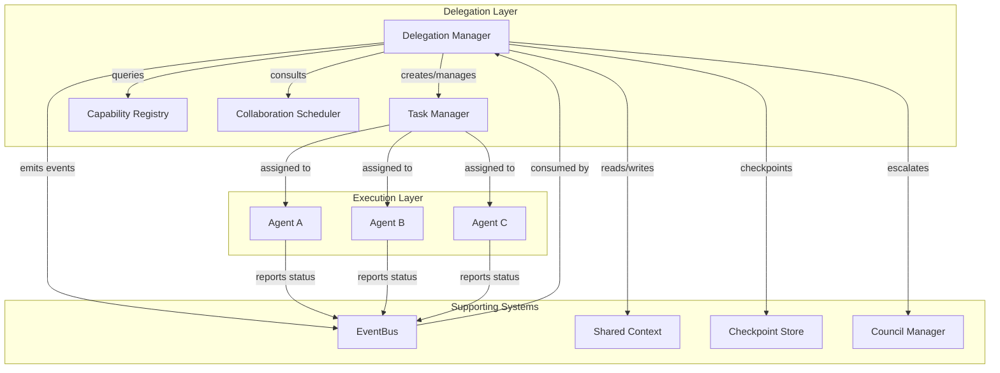
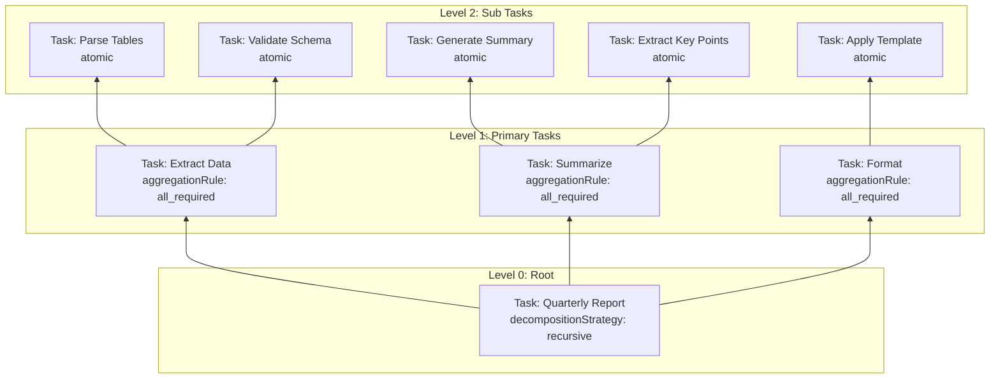
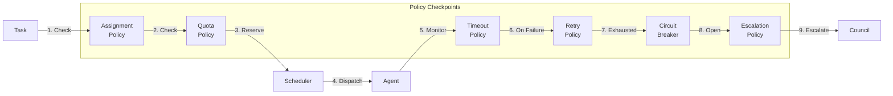
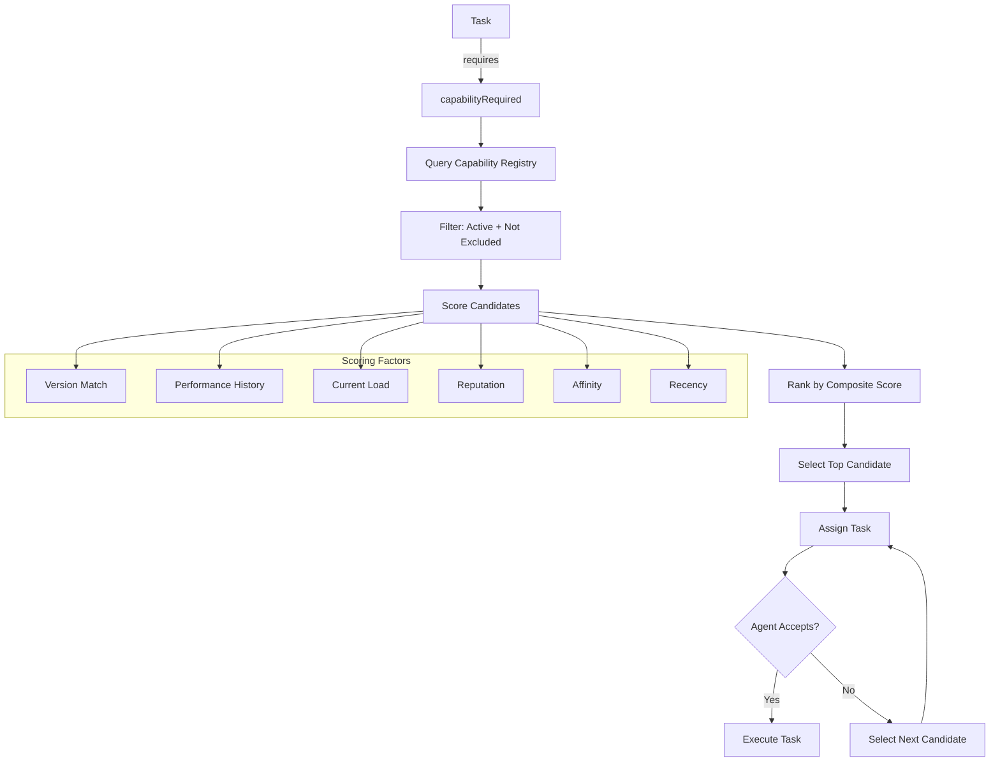
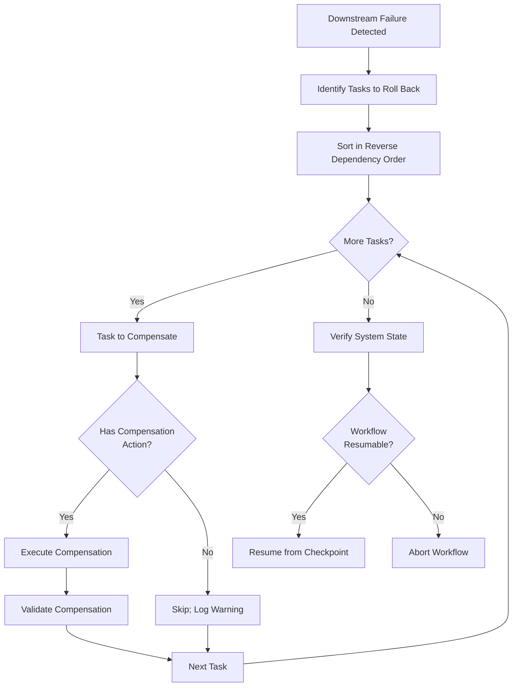
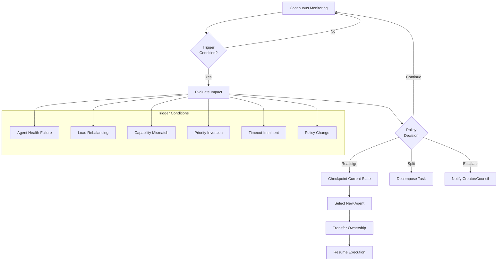
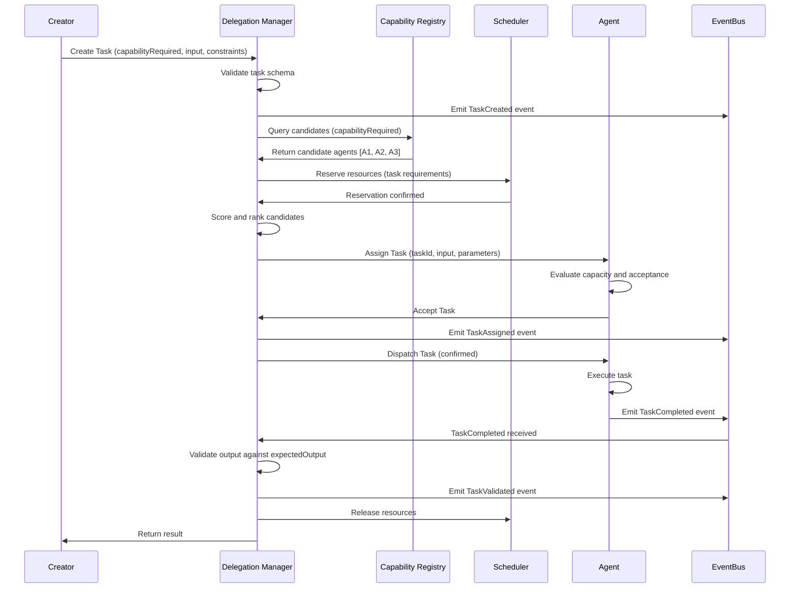
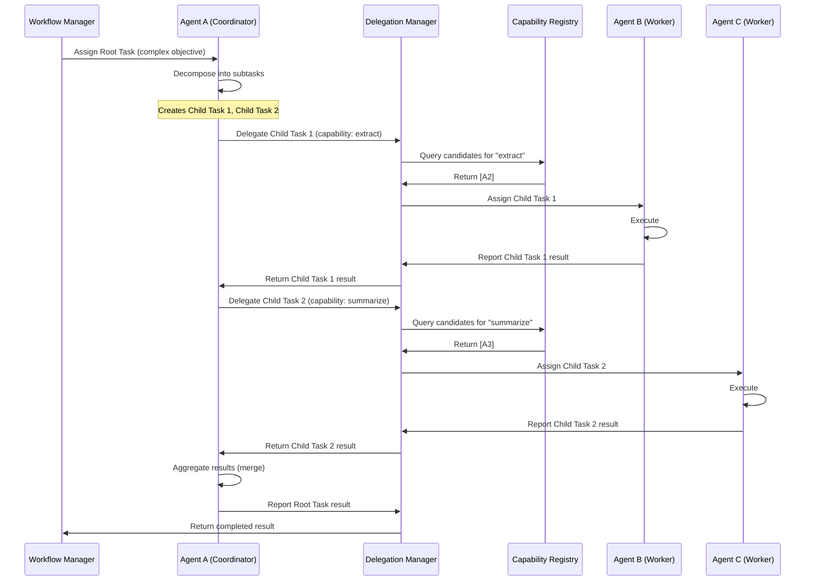
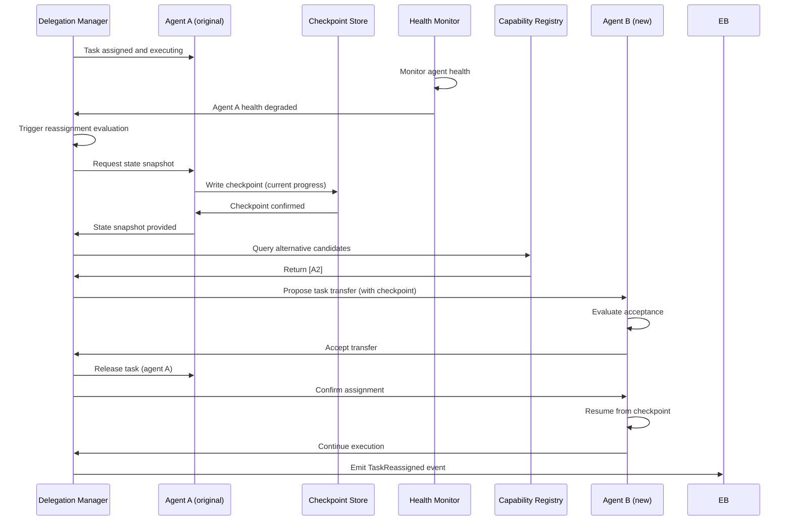
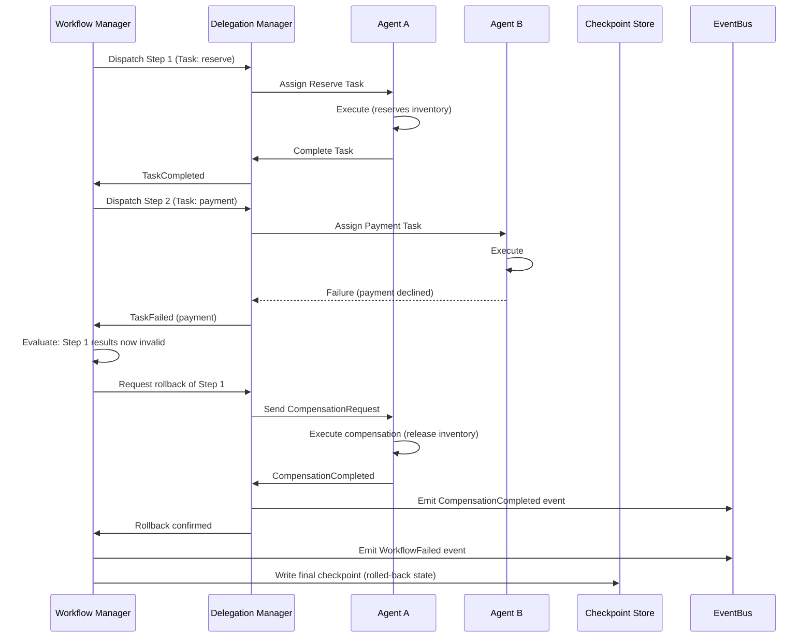

# Part 12.4: Task Delegation & Workflow Orchestration

> **Purpose**: Defines the architectural framework for task decomposition, delegation, workflow orchestration, failure recovery, and coordination across the AI-OS multi-agent system.
> **Layer**: Orchestration Layer + Coordination Layer (see `12.2-Collaboration-Architecture.md`)
> **Dependencies**: `12.1`, `12.2`, `12.3`, `12.7`, `12.8`, `12.9`, `schemas.md`, `events.md`, `components.md`, `glossary.md`

---

## Table of Contents

1. [Purpose & Scope](#1-purpose--scope)
2. [Delegation Lifecycle](#2-delegation-lifecycle)
3. [Task Ownership Model](#3-task-ownership-model)
4. [Parent-Child Task Relationships](#4-parent-child-task-relationships)
5. [Recursive Delegation](#5-recursive-delegation)
6. [Dynamic Delegation](#6-dynamic-delegation)
7. [Workflow Orchestration](#7-workflow-orchestration)
8. [Delegation Policies](#8-delegation-policies)
9. [Capability Matching](#9-capability-matching)
10. [Scheduling Interaction](#10-scheduling-interaction)
11. [Retry Handling](#11-retry-handling)
12. [Rollback & Compensation](#12-rollback--compensation)
13. [Task Completion](#13-task-completion)
14. [Failure Recovery](#14-failure-recovery)
15. [Delegation Diagrams](#15-delegation-diagrams)
16. [Sequence Diagrams](#16-sequence-diagrams)
17. [Cross-References](#17-cross-references)

---

## 1. Purpose & Scope

### 1.1 Purpose

This document specifies the architecture for task delegation and workflow orchestration in the AI-OS. It defines:

- How high-level objectives are decomposed into executable tasks
- How tasks are delegated to capable agents
- How workflows coordinate multi-step collaborative execution
- How failures are detected, retried, rolled back, or compensated
- How task hierarchies, ownership, and lifecycle are managed

### 1.2 Scope

**In Scope:**
- Task decomposition strategies and delegation lifecycle
- Task ownership, parent-child relationships, and recursive delegation
- Dynamic delegation policies and runtime reassignment
- Workflow definition, execution, monitoring, and adaptation
- Capability-aware agent matching and scheduling integration
- Retry, timeout, rollback, compensation, and failure recovery
- Checkpointing and state reconstruction for long-running workflows

**Out of Scope:**
- Agent internal reasoning or execution mechanics
- Specific communication protocol implementations (see `12.7`)
- Resource provisioning and hardware allocation (see `12.8`)
- Council governance and voting (see `12.5`)
- Security policy enforcement details (see `12.10`)

### 1.3 Architectural Principles

| Principle | Description |
|-----------|-------------|
| **Capability-First** | Delegation is based on declared capabilities, not hardcoded agent identities |
| **Ownership Transparency** | Every task has a single, traceable owner at any point in time |
| **Hierarchical Decomposition** | Complex work is recursively broken into smaller tasks until executable units remain |
| **Loose Coupling** | Deletors and delegates interact through contracts, not direct references |
| **Failure as First-Class** | Retry, rollback, and compensation are designed from the start, not bolted on |
| **Observable State** | Every delegation, completion, and failure emits traceable events |
| **Idempotent Operations** | Retries and rollbacks are safe to repeat without side effects |

---

## 2. Delegation Lifecycle

### 2.1 Overview

Every task in AI-OS progresses through a well-defined delegation lifecycle. This lifecycle ensures that tasks are created, matched, assigned, executed, and completed with full observability and recovery semantics.

### 2.2 Lifecycle States

```
┌─────────────────────────────────────────────────────────────────┐
│                    Task Delegation Lifecycle                      │
├──────────┬──────────┬──────────┬──────────┬──────────┬───────────┤
│  Created │  Pending │ Assigned │ In-      │Completed │  Failed   │
│          │          │          │ Progress │          │           │
├──────────┼──────────┼──────────┼──────────┼──────────┼───────────┤
│  Task is │  Awaiting│  Agent   │ Agent    │  Task    │  Non-     │
│  defined │  capab-  │  matched │  actively │  result  │ recoverable│
│  and     │  ility   │  and     │ executing │ verified │  failure; │
│  initial-│  match   │  accepted│  the task │  against │  escalation│
│  ized    │          │          │          │  contract│  triggered │
└──────────┴──────────┴──────────┴──────────┴──────────┴───────────┘
  Created → Pending → Assigned → InProgress → Completed
                         │         │
                         │         ├─→ Failed → (Retry) → InProgress
                         │         │              └─→ (Escalate) → Failed
                         │         └─→ (Timeout) → Failed
                         └─→ (Reassign) → Assigned (new agent)
```

### 2.3 State Definitions

| State | Description | Valid Transitions |
|-------|-------------|-------------------|
| `created` | Task defined, awaiting capability matching | → `pending` |
| `pending` | Task queued, waiting for capable agent | → `assigned`, `cancelled` |
| `assigned` | Agent matched and accepted task | → `in_progress`, `pending` (reassign), `cancelled` |
| `in_progress` | Agent actively executing | → `completed`, `failed`, `pending` (timeout) |
| `completed` | Task succeeded, result validated | → Terminal state |
| `failed` | Execution failed after retries | → `pending` (retry), `cancelled` |
| `cancelled` | Task terminated by request or policy | → Terminal state |

### 2.4 Delegation Flow

1. **Task Creation**: A parent task, workflow, or external request creates a task with explicit capability requirements, inputs, constraints, and priority.
2. **Capability Matching**: The Delegation Manager queries the Capability Registry to identify candidate agents.
3. **Scheduling Consultation**: The Collaboration Scheduler validates resource availability and timing constraints.
4. **Agent Selection**: Candidates are ranked by capability match score, availability, reputation, and current load.
5. **Task Assignment**: The task is assigned to the highest-ranked available agent. The agent accepts or rejects based on its own capacity.
6. **Execution Monitoring**: The Delegation Manager tracks execution via events and heartbeats.
7. **Result Validation**: Upon completion, the output is validated against `expectedOutput` schema.
8. **Completion or Recovery**: On success, the task completes. On failure, retry, rollback, or escalation policies are invoked.

### 2.5 Delegation Invariants

- **Single Owner**: At any moment, a task has exactly one assigned agent (`assignedTo` is singular).
- **Immutable Task ID**: `taskId` never changes after creation.
- **Monotonic Timestamps**: `startedAt` ≥ `createdAt`; `completedAt` ≥ `startedAt`.
- **Retry Bounds**: `retryCount` ≤ `maxRetries` at all times.
- **Dependency Integrity**: A task cannot transition to `in_progress` unless all `dependencies` are `completed`.

---

## 3. Task Ownership Model

### 3.1 Ownership Concept

Task ownership in AI-OS is explicit, transferable, and auditable. Ownership determines responsibility for execution, result reporting, and failure handling.

### 3.2 Ownership Roles

| Role | Description | Responsibilities |
|------|-------------|----------------|
| **Creator** | Entity that defined the task | Defines requirements, sets priority, owns parent context |
| **Owner** | Agent currently assigned to execute | Executes task, reports results, handles retries |
| **Delegator** | Entity that assigned the task | May reassign, cancel, or modify within policy |
| **Escalation Target** | Entity notified on unrecoverable failure | Decides compensation, retry at higher level, or abort |

### 3.3 Ownership Transfer

```
Creator → Delegation Manager → Agent A (Owner)
              ↓
         [Reassignment Policy Triggered]
              ↓
         Agent A (released) → Delegation Manager → Agent B (Owner)
```

Ownership transfers occur when:
- The assigned agent becomes unavailable (health failure, network partition)
- The task exceeds the agent's capability scope (dynamic re-evaluation)
- Policy-based reassignment (load balancing, priority inversion)
- Explicit user or council-directed reassignment

### 3.4 Ownership Protocol

1. **Transfer Initiation**: Delegation Manager marks current owner as `releasing` and selects new owner.
2. **State Capture**: Current execution state is checkpointed (see `12.9`).
3. **Handoff**: New owner receives task with full context, including partial results and checkpoints.
4. **Acknowledgement**: New owner confirms acceptance within `ownershipTransferTimeout`.
5. **Release**: Previous owner is formally released; task state transitions to `assigned` under new owner.

### 3.5 Ownership Constraints

- A task cannot have multiple concurrent owners.
- Ownership cannot be transferred while the task is in `completed` or `cancelled` state.
- The creator retains immutable audit rights even after ownership transfer.
- Ownership transfer must preserve all task metadata, dependencies, and partial results.

---

## 4. Parent-Child Task Relationships

### 4.1 Task Hierarchy

Many collaborative objectives require decomposition into subtasks. AI-OS models this through explicit parent-child relationships.

```
Workflow
 └── Parent Task A (decomposable)
      ├── Child Task A.1 (atomic)
      ├── Child Task A.2 (atomic)
      └── Child Task A.3 (decomposable)
           ├── Child Task A.3.1 (atomic)
           └── Child Task A.3.2 (atomic)
```

### 4.2 Task Tree Structure

Each task record carries:

| Field | Description |
|-------|-------------|
| `taskId` | Unique identifier |
| `parentTaskId` | `null` for root tasks; parent's `taskId` for children |
| `childTaskIds` | Array of child task identifiers |
| `decompositionStrategy` | How this task was broken down (`sequential`, `parallel`, `fan_out`, `fan_in`) |
| `aggregationRule` | How child results combine (`merge`, `reduce`, `first_success`, `all_required`) |
| `completionCriteria` | Conditions under which parent considers itself complete |

### 4.3 Decomposition Strategies

| Strategy | Description | Use Case |
|----------|-------------|----------|
| **Sequential** | Children execute one after another, each depending on the previous | Pipelines, data transformation chains |
| **Parallel** | Children execute concurrently; all must complete | Independent analysis, parallel scanning |
| **Fan-Out** | Same task dispatched to multiple agents for redundancy or diversity | Cross-validation, ensemble methods |
| **Fan-In** | Multiple parent tasks converge into a single child | Merge step, final validation |
| **Recursive** | Child tasks may themselves be decomposable | Deep hierarchies of work |

### 4.4 Aggregation Rules

| Rule | Description |
|------|-------------|
| `all_required` | All children must complete successfully for parent to succeed |
| `majority` | More than half of children must succeed |
| `first_success` | Parent succeeds when any child succeeds |
| `merge` | Results from all children are combined into parent result |
| `reduce` | Child results are reduced using an aggregator function |
| `best_of_n` | Best result among children is selected by scoring function |

### 4.5 Parent-Child Invariants

- A parent task cannot reach `completed` until all required children reach terminal states per `aggregationRule`.
- Child task `parentTaskId` must match the parent's `childTaskIds` entry.
- Deleting a parent task cascades to all descendants (soft delete with audit trail).
- Partial completion of children is captured via checkpoints for recovery.
- The `result` of a parent task is derived from child results according to `aggregationRule`, never directly set.

---

## 5. Recursive Delegation

### 5.1 Concept

Recursive delegation allows an agent to decompose a task it has received into smaller subtasks, delegate those to other agents, and then aggregate the results. This enables arbitrarily deep task hierarchies without central orchestration of every leaf.

### 5.2 Recursive Delegation Flow

```
External Request
     ↓
Workflow Manager (creates root task)
     ↓
Agent A (receives root task)
     ↓
Agent A decomposes: creates Child Task 1, Child Task 2
     ↓
Agent A delegates Child Task 1 → Agent B
Agent A delegates Child Task 2 → Agent C
     ↓
Agent B executes → returns result to Agent A
Agent C executes → returns result to Agent A
     ↓
Agent A aggregates results → reports to Workflow Manager
```

### 5.3 Recursion Depth Control

Unbounded recursion risks stack overflow and resource exhaustion. AI-OS enforces:

| Control | Mechanism |
|---------|-----------|
| **Max Depth** | Configurable limit on delegation depth (default: 5). Enforced at delegation time. |
| **Depth Tracking** | Each task carries `delegationDepth` field; incremented on each delegation. |
| **Budget Propagation** | Remaining time/budget/retry budget is divided among children. |
| **Capability Scoping** | Agents may only delegate within their declared capability boundaries. |
| **Circuit Breaker** | Excessive delegation from a single agent triggers throttling. |

### 5.4 Recursive Delegation Policies

- **Delegation Authority**: An agent may only delegate tasks for capabilities it advertises.
- **Budget Inheritance**: Child tasks inherit proportional slices of parent's `timeoutSeconds`, `maxRetries`, and resource budget.
- **Context Propagation**: Shared context from parent is cloned and scoped to children; children see only relevant slices.
- **Result Contract**: Children must produce output conforming to the parent's expected child-output schema.
- **Error Isolation**: Child failures do not corrupt parent state; parent applies aggregation rule.

### 5.5 Example: Recursive Document Processing

```
Root Task: "Process quarterly report"
  Agent A (Report Coordinator) receives task
  ↓ decomposes
  Child Task 1.1: "Extract data from tables"
    → delegated to Agent B (Data Extraction)
  Child Task 1.2: "Summarize findings"
    → delegated to Agent C (Summarization)
  Child Task 1.3: "Format report"
    → Agent A executes internally (no delegation)
  ↓ aggregates
  Result: Formatted report with extracted data and summary
```

---

## 6. Dynamic Delegation

### 6.1 Concept

Static delegation assigns tasks once at creation time. Dynamic delegation allows the system to reassign, split, merge, or re-prioritize tasks during execution based on runtime conditions.

### 6.2 Triggers for Dynamic Delegation

| Trigger | Condition | Action |
|---------|-----------|--------|
| **Agent Failure** | Assigned agent becomes unhealthy | Reassign to alternative candidate |
| **Load Rebalancing** | Agent overloaded; better candidate available | Migrate task to less-loaded agent |
| **Capability Mismatch** | Task requirements evolve beyond agent's capabilities | Reassign to more capable agent |
| **Priority Inversion** | Higher-priority task preempts current assignment | Pause current task, queue for later |
| **Timeout Imminent** | Task approaching timeout without progress | Split into smaller subtasks or escalate |
| **Policy Change** | Security or compliance policy updated mid-execution | Reassign to compliant agent |
| **Efficiency Gain** | Alternative agent offers significantly better estimated completion | Transfer with state preservation |

### 6.3 Dynamic Delegation Protocol

```
1. Monitor: Delegation Manager continuously evaluates runtime conditions.
2. Detect: Trigger condition is detected via health checks, metrics, or events.
3. Evaluate: Impact of reassignment is assessed (state loss risk, cost, latency).
4. Decision: Policy engine decides: reassign, split, escalate, or continue.
5. Prepare: Current state is checkpointed; task marked as `reassigning`.
6. Transfer: New agent selected; task handed off with full context.
7. Resume: New agent resumes from checkpoint; old agent released.
8. Validate: Continuity verified; no data loss or duplication.
```

### 6.4 Safe Transfer Guarantees

- **State Preservation**: Checkpoint captures all progress before transfer.
- **No Duplicate Execution**: Task ID is used as idempotency key; duplicate dispatches are deduplicated.
- **Atomic Handoff**: Either the new agent fully accepts the task or the old agent continues; no orphaned state.
- **Transfer Timeout**: If new agent does not accept within `ownershipTransferTimeout`, task returns to old agent or fails safely.
- **Audit Trail**: Every dynamic delegation is logged with reason, timestamp, old owner, and new owner.

### 6.5 Task Splitting

Dynamic delegation may split a task into subtasks when:
- The task is too large for any single agent's capacity.
- Parallelization can reduce wall-clock time.
- Different subtasks require different capabilities.

Split decisions are governed by:
- `splitPolicy`: configured per task type or globally
- `maxSubtasks`: upper bound on split count
- `splitCriteria`: size, complexity, or capability requirements

---

## 7. Workflow Orchestration

### 7.1 Workflow Definition

A workflow is a directed graph of tasks with explicit dependencies, branching conditions, and convergence rules. Workflows are defined declaratively and executed by the Workflow Manager.

### 7.2 Workflow Structure

```
Workflow
 ├── Input Schema (validated at entry)
 ├── Output Schema (validated at completion)
 ├── Steps (directed acyclic graph)
 │    ├── Step 1: Task A (no dependencies)
 │    ├── Step 2: Task B (depends on A)
 │    ├── Step 3: Task C (depends on A) ──┐
 │    └── Step 4: Task D (depends on B, C) ←─┘ (convergence)
 └── Parameters (configuration for execution)
```

### 7.3 Workflow Execution Model

| Concept | Description |
|---------|-------------|
| **State Machine** | Workflow instance progresses through states: `created` → `running` → `paused` → `completed`/`failed`/`cancelled` |
| **Step Dispatcher** | Evaluates dependency graph; dispatches steps whose dependencies are satisfied |
| **Concurrency Control** | Limits maximum parallel step execution via `maxParallelSteps` |
| **Branching** | Conditional steps execute based on expression evaluation against shared context |
| **Convergence** | Merge/join steps wait for all or a subset of upstream dependencies |
| **Checkpointing** | State persisted at configurable intervals for recovery |
| **Event Emission** | Every state transition emits typed events to the EventBus |

### 7.4 Orchestration Responsibilities

The Workflow Manager (see `components.md`) is responsible for:

1. **Parsing**: Converting workflow definitions into executable state machines.
2. **Decomposition**: Breaking workflow steps into task units with handoff semantics.
3. **Dispatch**: Assigning task units to agents via the Delegation Manager.
4. **Tracking**: Maintaining workflow-level and task-level state transitions.
5. **Monitoring**: Observing execution via events and heartbeats.
6. **Branching/Convergence**: Evaluating conditional logic and merge conditions.
7. **Policy Enforcement**: Applying timeout, retry, and circuit-breaker policies.
8. **Checkpointing**: Writing durable checkpoints at configurable boundaries.
9. **Completion**: Validating final outputs and emitting terminal events.

### 7.5 Workflow States

```
stateDiagram-v2
    [*] --> Created
    Created --> Initialized: Definition validated
    Initialized --> Running: First step dispatched
    Running --> Paused: Explicit pause or resource constraint
    Paused --> Running: Resume signal received
    Running --> Completed: All steps succeeded
    Running --> Failed: Non-recoverable error
    Running --> Cancelled: Cancellation requested
    Completed --> Archived: Retention period elapsed
    Failed --> Archived: Retention period elapsed
    Cancelled --> Archived: Retention period elapsed
```

### 7.6 Workflow Adaptation

Workflows may adapt at runtime:

| Adaptation | Trigger | Mechanism |
|-----------|---------|-----------|
| **Step Reassignment** | Agent failure during step | Reassign step to alternative agent |
| **Step Insertion** | New requirement discovered mid-workflow | Insert step with updated dependency graph |
| **Step Skipping** | Condition evaluates to false | Skip step; propagate downstream |
| **Parameter Override** | Configuration change | Update step parameters via shared context |
| **Timeout Extension** | Legitimate long-running step | Extend timeout with approval |
| **Workflow Suspension** | Resource exhaustion | Pause workflow; resume when resources available |

---

## 8. Delegation Policies

### 8.1 Policy Framework

Delegation policies govern how tasks are assigned, reassigned, retried, and escalated. Policies are declarative, versioned, and applied consistently.

### 8.2 Policy Types

| Policy | Description | Default |
|--------|-------------|---------|
| **Assignment Policy** | Rules for selecting agents (capability match, load, reputation) | Best capability match + lowest load |
| **Reassignment Policy** | Conditions triggering task transfer | Agent health failure, explicit request |
| **Retry Policy** | Retry count, backoff strategy, jitter | 3 attempts, exponential backoff, base 5s |
| **Timeout Policy** | Task and workflow timeout durations | Task: 300s; Workflow: 3600s |
| **Circuit Breaker Policy** | Failure rate threshold and cooldown | 50% failure rate, 30s cooldown |
| **Priority Policy** | Preemption rules for high-priority tasks | Critical tasks preempt normal tasks |
| **Quota Policy** | Max concurrent tasks per agent | 10 tasks per agent |
| **Delegation Depth Policy** | Maximum recursion depth | 5 levels |

### 8.3 Policy Enforcement

Policies are enforced at delegation checkpoints:

```
Task Creation → Validate against Assignment Policy
     ↓
Agent Selection → Apply Assignment Policy ranking
     ↓
Task Dispatch → Enforce Quota Policy
     ↓
Execution → Monitor against Timeout and Circuit Breaker Policies
     ↓
Failure → Apply Retry Policy
     ↓
Retry Exhaustion → Apply Escalation Policy
```

### 8.4 Policy Configuration

Policies are configured via `Configuration Schema` (see `schemas.md`) and may be scoped to:
- **Global**: Apply to all tasks system-wide
- **Workflow**: Apply to all tasks within a specific workflow
- **Task Type**: Apply to tasks requiring a specific capability
- **Agent**: Apply to tasks assigned to a specific agent
- **Tenant**: Apply to tasks within a tenant boundary

### 8.5 Policy Evaluation

Policies are evaluated in the following order of precedence:
1. Task-specific overrides
2. Workflow-level configuration
3. Agent-level configuration
4. System-wide defaults

Conflicting policies are resolved by the most specific (highest precedence) policy.

---

## 9. Capability Matching

### 9.1 Matching Process

Capability matching determines which agents are eligible to execute a given task. The process is capability-first, not identity-first.

### 9.2 Matching Algorithm

```
1. Extract Required Capability: task.capabilityRequired
2. Query Registry: Find all agents advertising this capability
3. Filter Active: Remove agents with status ≠ active
4. Filter Exclusions: Remove agents in task.excludeAgentIds
5. Score Candidates:
   a. Capability Version Match: Does agent's capability version satisfy task requirements?
   b. Historical Performance: Success rate, latency, throughput for this capability
   c. Current Load: Number of active tasks vs. quota
   d. Reputation: Weighted score from past collaborations
   e. Affinity: Past successful collaborations with this task creator
   f. Recency: How recently did this agent execute this capability?
6. Rank: Sort by composite score (weighted sum of above factors)
7. Select: Top-ranked agent that accepts the assignment
```

### 9.3 Capability Compatibility

| Dimension | Description |
|-----------|-------------|
| **Exact Match** | Agent capability version equals required version |
| **Compatible Range** | Agent capability version is within compatible major/minor range |
| **Superset** | Agent capability supports additional features beyond requirement |
| **Subset Rejection** | Agent capability lacks required features → excluded |

### 9.4 Dynamic Capability Re-evaluation

Capabilities are re-evaluated at:
- Task assignment time
- Agent health change events
- Periodic capability refresh intervals
- Workflow reconfiguration events

If an agent's capabilities degrade mid-task, the Delegation Manager may trigger dynamic reassignment.

### 9.5 Matching Constraints

- Matching is read-only against the Capability Registry; it does not modify agent state.
- Capability matching results are cached briefly to reduce registry load.
- Agents may declare capability availability windows; matching respects temporal constraints.
- Cross-trust-domain capability matching requires capability attestation verification.

---

## 10. Scheduling Interaction

### 10.1 Delegation-Scheduler Interface

Task delegation does not occur in isolation from scheduling. The Delegation Manager consults the Collaboration Scheduler before finalizing task assignment.

### 10.2 Scheduling Interaction Points

| Interaction Point | Description |
|-------------------|-------------|
| **Pre-Assignment** | Scheduler validates resource availability for candidate agent + task combination |
| **Time Window** | Scheduler confirms task can execute within `startWindow` constraints |
| **Resource Reservation** | Scheduler reserves CPU, memory, and tool quotas for task duration |
| **Conflict Detection** | Scheduler identifies resource conflicts with already-scheduled tasks |
| **Priority Adjustment** | Scheduler may adjust task timing based on system-wide priority queue |
| **Release** | Upon task completion, resources are released back to scheduler pool |

### 10.3 Scheduling Modes

| Mode | Description |
|------|-------------|
| **Immediate** | Task dispatched as soon as agent and resources are available |
| **Scheduled** | Task dispatched at a specific time or cron trigger |
| **Windowed** | Task must execute within a defined time window |
| **Event-Triggered** | Task dispatched in response to a specific event |
| **Dependency-Driven** | Task dispatched when upstream dependencies complete |

### 10.4 Resource Negotiation

```
Delegation Manager → Scheduler: "Reserve resources for Task X on Agent Y"
     ↓
Scheduler → Resource Pool: Reserve CPU, memory, tool slots
     ↓
Scheduler → Delegation Manager: "Reservation confirmed (expires in T)"
     ↓
Delegation Manager → Agent: "Task X assigned, resources reserved"
     ↓
Agent executes task...
     ↓
Agent → Delegation Manager: "Task X completed"
     ↓
Delegation Manager → Scheduler: "Release resources for Task X"
```

### 10.5 Overload Protection

When the scheduler cannot fulfill resource requests:
- **Backpressure**: Delegation Manager queues tasks and applies backpressure to producers.
- **Priority Inversion Handling**: Lower-priority tasks may be preempted to free resources.
- **Graceful Degradation**: Non-critical tasks are deferred or simplified.
- **Escalation**: Systemic overload triggers Council review for capacity adjustment.

---

## 11. Retry Handling

### 11.1 Retry Policy Structure

Each task carries a `retryPolicy` defining retry behavior:

```json
{
  "maxAttempts": 3,
  "backoffStrategy": "exponential",
  "backoffBaseSeconds": 5,
  "backoffMultiplier": 2.0,
  "jitter": true,
  "retryableErrors": ["timeout", "transient_failure", "agent_unavailable"],
  "nonRetryableErrors": ["invalid_input", "permission_denied", "capability_mismatch"]
}
```

### 11.2 Retry Execution

```
Attempt 1 → Execute
     ↓ (failure)
     ↓ Determine retryable? → No → Fail task
     ↓ Yes
Backoff: 5s (+ jitter)
     ↓
Attempt 2 → Execute
     ↓ (failure)
     ↓ retryCount < maxAttempts?
     ↓ Yes
Backoff: 10s (+ jitter)
     ↓
Attempt 3 → Execute
     ↓ (failure)
     ↓ retryCount == maxAttempts?
     ↓ Yes
     ↓
Mark task as failed → Trigger escalation
```

### 11.3 Backoff Strategies

| Strategy | Formula | Use Case |
|----------|---------|----------|
| **Fixed** | `delay = base` | Simple retry with constant delay |
| **Linear** | `delay = base × attempt` | Gradually increasing pressure |
| **Exponential** | `delay = base × multiplier^(attempt-1)` | Standard for transient failures |
| **Decorrelated Jitter** | `delay = random(base, previous_delay × multiplier)` | Prevents thundering herd |

### 11.4 Retry Budgets

Retries consume budget from multiple dimensions:
- **Retry Count**: `retryCount` incremented; must not exceed `maxRetries`
- **Time Budget**: Remaining `timeoutSeconds` must cover next attempt + backoff
- **Resource Budget**: Each retry re-reserves resources; budget depletion prevents further retries

### 11.5 Retry Event Emission

Every retry attempt emits `TaskRetried` event with:
- Attempt number
- Backoff duration
- Failure reason from previous attempt
- Remaining retry budget

---

## 12. Rollback & Compensation

### 12.1 Rollback Concept

Rollback reverses the effects of a completed or partially completed task when subsequent failures make its results unusable or incorrect.

### 12.2 Rollback Triggers

| Trigger | Description |
|---------|-------------|
| **Downstream Failure** | A dependent task fails, making upstream results invalid |
| **Workflow Abort** | Parent workflow is cancelled after some tasks completed |
| **Compensation Request** | Explicit compensation request from workflow or council |
| **Data Corruption** | Validation detects corrupted or invalid output |

### 12.3 Rollback Protocol

```
1. Detection: Downstream failure or cancellation detected.
2. Scope: Identify all completed tasks that must be rolled back (reverse topological order).
3. Checkpoint: Capture current state before rollback begins.
4. Compensation: For each task to rollback:
   a. Emit CompensationRequest event
   b. Invoke task's rollbackAction (if defined)
   c. Validate rollback completion
   d. Mark task as rolled_back
5. Verification: Confirm system state matches pre-execution baseline.
6. Resume/Abort: Either resume workflow from safe point or abort entirely.
```

### 12.4 Compensation Actions

Each task may define a `compensationAction`:

| Action Type | Description | Example |
|-------------|-------------|---------|
| **Delete** | Remove created resources | Delete uploaded files, remove database records |
| **Reverse** | Apply inverse transformation | Decrypt previously encrypted data |
| **Refund** | Reverse financial transaction | Issue refund for processed payment |
| **Notify** | Inform downstream systems | Send invalidation notice to cached consumers |
| **Custom** | Agent-specific compensation logic | Agent-defined cleanup routine |

### 12.5 Rollback Invariants

- Rollback executes in reverse dependency order (children before parents).
- Rollback is best-effort; partial rollback is allowed and reported.
- Rollback failures emit `CompensationFailed` events but do not block workflow termination.
- Rollback state is checkpointed to allow rollback-of-rollback if needed.
- Tasks without defined compensation actions are logged and skipped during rollback.

### 12.6 Saga Pattern

For long-running workflows spanning multiple agents, AI-OS supports the Saga pattern:

```
Step 1: Reserve inventory (compensatable)
Step 2: Process payment (compensatable)
Step 3: Ship item (compensatable)

If Step 2 fails:
  → Compensate Step 1 (release inventory)
  → Workflow terminates with compensated state
```

---

## 13. Task Completion

### 13.1 Completion Criteria

A task is considered complete when:
1. The assigned agent reports successful execution.
2. The output validates against `expectedOutput` schema.
3. All side effects are durable (written to persistent store).
4. All downstream notifications are emitted.

### 13.2 Completion Validation

```
Agent reports completion
     ↓
Delegation Manager receives TaskCompleted event
     ↓
Validate output against expectedOutput schema
     ↓ Schema valid
Validate side effects (durability check)
     ↓ Side effects durable
Emit TaskValidated event
     ↓
Update task state to completed
     ↓
Notify parent workflow / dependent tasks
     ↓
Release resources to scheduler
```

### 13.3 Result Propagation

Task results flow through the system:
- **To Parent Workflow**: Result contributes to workflow-level output via aggregation rule.
- **To Dependent Tasks**: Downstream tasks receive result via shared context or direct input mapping.
- **To EventBus**: `TaskCompleted` event emitted with result summary.
- **To Monitoring**: Metrics updated; traces closed.
- **To Knowledge System**: Successful patterns may be recorded for learning.

### 13.4 Partial Completion

For tasks that produce incremental results before final completion:
- **Intermediate Results**: Stored in task `result` field as partial data.
- **Progressive Validation**: Output validated at checkpoints, not just at completion.
- **Resumability**: If task is reassigned, partial results are preserved and reused.

---

## 14. Failure Recovery

### 14.1 Failure Taxonomy

| Failure Type | Description | Recovery Strategy |
|--------------|-------------|-------------------|
| **Transient** | Temporary condition (network blip, brief overload) | Retry with backoff |
| **Agent Failure** | Assigned agent crashes or becomes unhealthy | Reassign to alternative agent |
| **Capability Mismatch** | Task requirements exceed agent capabilities | Reassign to more capable agent |
| **Timeout** | Task exceeded `timeoutSeconds` | Retry with larger timeout or split task |
| **Invalid Input** | Task input fails validation | Fail task; notify creator |
| **Resource Exhaustion** | System-wide resource shortage | Backpressure, queue, or graceful degradation |
| **Dependency Failure** | Upstream task failed irrecoverably | Rollback or cascade failure |
| **Policy Violation** | Security or compliance violation | Fail task; escalate to council |

### 14.2 Recovery Strategies

| Strategy | When Applied | Mechanism |
|----------|-------------|-----------|
| **Retry** | Transient failures within retry budget | Re-execute with backoff |
| **Reassign** | Agent-specific failure | Transfer to alternative agent with state preservation |
| **Split** | Task too large for remaining budget | Decompose into smaller subtasks |
| **Rollback** | Downstream failure invalidates results | Execute compensation actions |
| **Escalate** | Retry budget exhausted | Notify creator or council for decision |
| **Degrade** | Non-critical task failure | Reduce scope or quality; continue workflow |
| **Abort** | Unrecoverable or policy violation | Terminate task and parent workflow |

### 14.3 Recovery Decision Tree

```
Task Failed
     ↓
Is retryCount < maxRetries?
     ↓ Yes
Is failure retryable?
     ↓ Yes
Retry with backoff
     ↓ No
Is reassignment possible?
     ↓ Yes
Reassign to alternative agent
     ↓ No
Is rollback defined?
     ↓ Yes
Execute rollback
     ↓ No
Escalate to creator / council
```

### 14.4 Circuit Breaker

When a task or agent experiences repeated failures:
1. **Failure Count Tracked**: Failure rate calculated over sliding window.
2. **Threshold Checked**: If failure rate exceeds `circuitBreakerThreshold`, circuit opens.
3. **Dispatch Halted**: No new tasks assigned to this agent/task type.
4. **Cooldown Period**: After `circuitBreakerResetMs`, circuit enters half-open state.
5. **Probe**: Single test task dispatched to verify recovery.
6. **Reset or Remain**: If probe succeeds, circuit closes; if fails, cooldown restarts.

### 14.5 Failure Recovery Invariants

- Failed tasks never silently disappear; they reach a terminal state (`failed`, `cancelled`, or `escalated`).
- Retry attempts are idempotent; duplicate execution does not corrupt state.
- Recovery actions emit events for observability and audit.
- Recovery does not violate `maxRetries` or `timeoutSeconds` constraints.
- Partial recovery (some children succeed, others fail) is handled by aggregation rules.

---

## 15. Delegation Diagrams

### 15.1 Delegation Component Architecture



### 15.2 Task Hierarchy Diagram



### 15.3 Delegation Policy Enforcement



### 15.4 Capability Matching Flow



### 15.5 Rollback and Compensation Flow



### 15.6 Dynamic Delegation Decision Flow



---

## 16. Sequence Diagrams

### 16.1 Basic Task Delegation Sequence



### 16.2 Recursive Delegation Sequence



### 16.3 Dynamic Reassignment Sequence



### 16.4 Retry and Failure Recovery Sequence

```mermaid
sequenceDiagram
    participant DM as Delegation Manager
    participant A as Agent
    participant S as Scheduler
    participant EB as EventBus
    participant CM as Council Manager

    DM->>A: Assign Task (maxRetries: 3)
    A->>A: Execute (Attempt 1)
    A-->>DM: Failure (transient error)
    DM->>DM: retryCount = 1; retryable? = Yes
    DM->>EB: Emit TaskRetried event (attempt: 1)
    DM->>DM: Calculate backoff: 5s
    Note over DM: Wait 5 seconds...
    DM->>A: Retry Task (Attempt 2)
    A->>A: Execute (Attempt 2)
    A-->>DM: Failure (transient error)
    DM->>DM: retryCount = 2; retryable? = Yes
    DM->>EB: Emit TaskRetried event (attempt: 2)
    DM->>DM: Calculate backoff: 10s
    Note over DM: Wait 10 seconds...
    DM->>A: Retry Task (Attempt 3)
    A->>A: Execute (Attempt 3)
    A-->>DM: Failure (transient error)
    DM->>DM: retryCount = 3; maxRetries reached
    DM->>EB: Emit TaskFailed event
    DM->>DM: Evaluate escalation policy
    DM->>CM: Escalate failure
    CM->>DM: Decision: Abort parent workflow
    DM->>S: Release resources
    DM->>EB: Emit WorkflowFailed event
```

### 16.5 Workflow Orchestration Sequence

```mermaid
sequenceDiagram
    participant C as Creator
    participant WM as Workflow Manager
    participant DM as Delegation Manager
    participant A1 as Agent A
    participant A2 as Agent B
    participant SC as Shared Context
    participant EB as EventBus

    C->>WM: Start Workflow (definition, input)
    WM->>WM: Parse workflow; initialize state machine
    WM->>EB: Emit WorkflowStarted event

    Note over WM: Step 1: No dependencies; ready to dispatch
    WM->>DM: Dispatch Step 1 (Task: ingest)
    DM->>A1: Assign Task
    A1->>A1: Execute
    A1->>DM: Complete Task (result: rawData)
    DM->>WM: TaskCompleted (rawData)
    WM->>SC: Update context (rawData)
    WM->>EB: Emit TaskCompleted event

    Note over WM: Step 2: Depends on Step 1; now ready
    WM->>SC: Read context (rawData)
    WM->>DM: Dispatch Step 2 (Task: transform, input: rawData)
    DM->>A2: Assign Task
    A2->>A2: Execute
    A2->>DM: Complete Task (result: transformedData)
    DM->>WM: TaskCompleted (transformedData)
    WM->>SC: Update context (transformedData)
    WM->>EB: Emit TaskCompleted event

    Note over WM: Step 3: All dependencies satisfied
    WM->>SC: Read context (transformedData)
    WM->>DM: Dispatch Step 3 (Task: analyze)
    DM->>A1: Assign Task
    A1->>A1: Execute
    A1->>DM: Complete Task (result: analysis)
    DM->>WM: TaskCompleted (analysis)

    WM->>WM: All steps completed; validate output
    WM->>EB: Emit WorkflowCompleted event
    WM->>C: Return final result
```

### 16.6 Rollback and Compensation Sequence



### 16.7 Task Splitting Sequence

```mermaid
sequenceDiagram
    participant DM as Delegation Manager
    participant A as Agent
    participant S as Scheduler
    participant CR as Capability Registry
    participant A1 as Agent B
    participant A2 as Agent C
    participant EB as EventBus

    DM->>A: Assign Large Task (timeout: 300s)
    A->>A: Begin execution
    A-->>DM: Status: Progress slow; estimated 500s
    DM->>DM: Task approaching timeout; split evaluation
    DM->>DM: Decision: Split task into 2 subtasks
    DM->>DM: Create Subtask 1 (first half)
    DM->>DM: Create Subtask 2 (second half)

    DM->>S: Reserve resources for 2 subtasks
    S->>DM: Resources confirmed

    DM->>CR: Query candidates for subtask 1
    CR->>DM: Return [A1]
    DM->>A1: Assign Subtask 1

    DM->>CR: Query candidates for subtask 2
    CR->>DM: Return [A2]
    DM->>A2: Assign Subtask 2

    A1->>A1: Execute Subtask 1
    A1->>DM: Complete Subtask 1
    DM->>A: Propagate Subtask 1 result

    A2->>A2: Execute Subtask 2
    A2->>DM: Complete Subtask 2
    DM->>A: Propagate Subtask 2 result

    A->>A: Aggregate partial results
    A->>DM: Report Original Task complete
    DM->>EB: Emit TaskCompleted event
```

---

## 17. Cross-References

| Reference | Document | Relationship |
|-----------|----------|--------------|
| Agent Schema | `schemas.md` | Defines `agentId`, `capabilities`, `status` used in delegation |
| Task Schema | `schemas.md` | Defines task structure, lifecycle states, retry fields |
| Workflow Schema | `schemas.md` | Defines workflow steps, dependencies, input/output mapping |
| Execution Plan Schema | `schemas.md` | Defines execution plans with steps, resources, timing |
| Checkpoint Schema | `schemas.md` | Defines checkpoint structure for state capture and recovery |
| Event Schema | `schemas.md` | Defines event envelope for delegation lifecycle events |
| Configuration Schema | `schemas.md` | Defines configuration for delegation policies |
| Runtime Schema | `schemas.md` | Defines runtime metrics for agent health and load |
| Scheduler Schema | `schemas.md` | Defines scheduling constraints and resource reservation |
| Delegation Manager | `components.md` | Primary component responsible for task delegation logic |
| Workflow Manager | `components.md` | Primary component responsible for workflow orchestration |
| Collaboration Scheduler | `components.md` | Manages resource allocation and timing constraints |
| Delegation Events | `events.md` | Canonical events for task delegation lifecycle |
| Workflow Events | `events.md` | Canonical events for workflow orchestration |
| Agent Discovery | `12.3` | Capability registry and agent discovery mechanisms |
| Communication | `12.7` | Message bus and communication patterns |
| Resource Coordination | `12.8` | Resource allocation, scheduling algorithms, overload protection |
| Reliability & Recovery | `12.9` | Fault detection, checkpointing, retry strategies |
| Security Architecture | `12.10` | Inter-agent authentication, authorization, audit trails |

---

## Document Metadata

| Attribute | Value |
|-----------|-------|
| **Part** | 12 |
| **Chapter** | 12.4 |
| **Title** | Task Delegation & Workflow Orchestration |
| **Status** | Architecture Specification |
| **Version** | 1.0.0 |
| **Baseline** | Phase 11+ |
